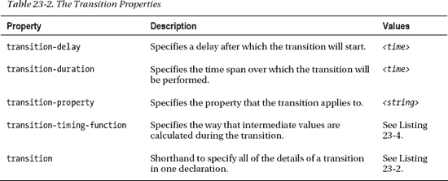
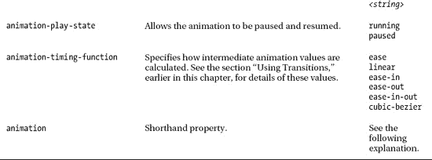
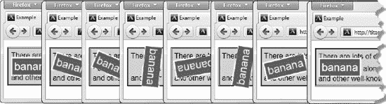

# 二十三、过渡、动画和变换

在这一章中，我将介绍三种不同的方法来将简单的特效应用到 HTML 元素中:*过渡*，*动画*，以及*变换*。我将在本章的后面解释和演示这些术语。这三个特性都是 CSS3 中的新特性，在我撰写本文时，它们只通过特定于浏览器的前缀得到支持。这是我期望很快改变的事情，因为这些特性将会非常受网页设计者和开发者的欢迎。

将效果应用于 HTML 元素并不是一个新的想法，大多数优秀的 JavaScript 库都至少包含一些现在已经融入到 CSS3 中的效果。与 JavaScript 相比，使用 CSS3 的优势在于性能。许多新功能是关于随着时间的推移改变 CSS 属性的值，这是可以直接在浏览器引擎中以较少的开销处理的事情。尽管如此，这些效果(即使是基本的)也会占用大量的处理能力，尤其是在复杂的网页上。因此，你应该谨慎使用我在本章中描述的效果。让用户的计算机陷入停顿总是不受欢迎的，尤其是如果你只是在炫耀你的动画技巧。

不经常使用这些效果的另一个原因是它们会极大地分散注意力和令人讨厌。使用这些效果来增强用户在页面上执行的任务——不管是什么任务——不要将效果应用到与该任务无关的元素上。表 23-1 提供了本章的总结。

### 使用过渡

浏览器通常会立即将 CSS 属性中的更改应用到元素中。例如，如果您使用`:hover`选择器，用户一将鼠标移到元素上，浏览器就会应用您与选择器相关联的属性。清单 23-1 给出了一个例子。

*清单 23-1。立即应用新的属性值*

`<!DOCTYPE HTML>
<html>
    <head>
        <title>Example</title>
        <meta name="author" content="Adam Freeman"/>
        <meta name="description" content="A simple example"/>
        <link rel="shortcut icon" href="favicon.ico" type="image/x-icon" />
        
    </head>
    <body>
        

            There are lots of different kinds of fruit - there are over 500
            varieties of **banana** alone. By the time we add the
            countless types of apples, oranges, and other
            well-known fruit, we are faced with thousands of choices.
        

    </body>
</html>`

在这个例子中，有一个`span`元素，它有两种特定的样式。一种样式是通用的(使用选择器`#banana`)，另一种样式只在用户将鼠标移动到元素上时应用(使用选择器`#banana:hover`)。

 **提示**我在这个例子中使用了`color`属性。你可以在第二十四章中了解更多关于这个属性的信息。

当用户将鼠标移动到`span`元素上时，浏览器会做出响应，并立即应用新的属性值。你可以在图 23-1 中看到变化。

*图 23-1。改变 CSS 属性值的直接应用*

CSS 转换功能允许您控制新属性值的应用速度。因此，例如，您可以选择逐渐改变示例中的`span`元素的外观，使鼠标移动到单词`banana`上的效果不那么不协调。表 23-2 描述了允许你这样做的属性。

`transition-delay`和`transition-duration`属性被指定为 CSS 时间，这是一个后跟`ms`(表示毫秒)或`s`(表示秒)的数字。

`transition`速记属性的格式如下:

`transition: <transition-property> <transition-duration> <transition-timing-function>
    <transition-delay>`

清单 23-2 展示了如何将一个过渡应用到示例 HTML 文档中。当我写这篇文章时，没有一个主流浏览器直接支持转换属性，但是，除了 Internet Explorer，所有浏览器都使用特定于浏览器的前缀来实现这些属性。我在清单中使用了前缀`–webkit`。

 **注意**使用标准属性的主流浏览器还没有实现动画特性。与转换非常相似，除了 Internet Explorer 之外的所有浏览器都使用特定于浏览器的前缀来实现该功能。在清单 23-2 中，我使用了`–webkit`前缀，这意味着这个例子将适用于 Safari 和 Chrome。如果你想使用 Firefox 或 Opera，只需用`–webkit`代替`–moz`或`–o`。这是第三次综合培训中另一个重要的改进领域，我期望它将很快得到适当的实现。

*清单 23-2。使用过渡*

`<!DOCTYPE HTML>
<html>
    <head>
        <title>Example</title>
        <meta name="author" content="Adam Freeman"/>
        <meta name="description" content="A simple example"/>
        <link rel="shortcut icon" href="favicon.ico" type="image/x-icon" />
        
    </head>
    <body>
        

            There are lots of different kinds of fruit - there are over 500
            varieties of banana alone. By the time we add the
            countless types of apples, oranges, and other
            well-known fruit, we are faced with thousands of choices.
        
` `    </body>
</html>`

在这个例子中，我添加了一个通过`#banana:hover`选择器应用到样式的过渡。该转换将在用户将鼠标移动到`span`元素上 100 毫秒后开始，持续 500 毫秒，并应用于`background-color`、`color`、`padding`、`font-size`和`border`属性。图 23-2 显示了过渡的渐进过程。

*图 23-2。过渡的逐步应用*

请注意我是如何在示例中指定了多个属性的。每个过渡属性都采用逗号分隔的值，这样您就可以获得并发过渡效果。您也可以为延迟和持续时间指定多个值，这意味着不同的属性转换在不同的时间开始，并运行不同的持续时间。

#### 创建反向转换

仅当应用了与转场相关联的样式时，转场才会生效。我的示例样式使用了`:hover`选择器，这意味着只有当用户的鼠标在`span`元素上时才应用样式。一旦用户将鼠标从`span`元素移开，只有`#banana`样式会被应用，默认情况下，元素的外观会立即恢复到原始状态。

正是因为这个原因，大多数转换都是成对出现的:转换到临时状态，然后反向转换。清单 23-3 展示了如何通过应用第二个过渡平滑地返回到原始风格。

*清单 23-3。创建第二个过渡*

`<!DOCTYPE HTML>
<html>
    <head>
        <title>Example</title>
        <meta name="author" content="Adam Freeman"/>
        <meta name="description" content="A simple example"/>
        <link rel="shortcut icon" href="favicon.ico" type="image/x-icon" />
        
    </head>
    <body>
        

            There are lots of different kinds of fruit - there are over 500
            varieties of banana alone. By the time we add the
            countless types of apples, oranges, and other
            well-known fruit, we are faced with thousands of choices.
        

    </body>
</html>`

在这个例子中，我省略了`transition-property`属性。这将导致所有属性更改在整个过渡期间逐渐应用。我还指定了 10 毫秒的初始延迟和 250 毫秒的持续时间。添加一个简短的反向转换会使返回到原始状态的声音不那么刺耳。

 **提示**浏览器在第一次布局页面时不应用过渡。这意味着当 HTML 文档第一次显示时，立即应用`#banana`样式中的属性，然后通过转换逐渐应用。

#### 选择如何计算中间值

当您使用转换时，浏览器必须计算出每个属性的初始值和最终值之间的中间值。您可以使用`transition-timing-function`属性来指定确定中间值的方式，用一组代表三次贝塞尔曲线的四个点来表示。有五种预设曲线可供选择，分别由以下值表示:

*   `ease`(默认值)
*   `linear`
*   `ease-in`
*   `ease-out`
*   `ease-in-out`

你可以在图 23-3 中看到每条曲线。该线显示了中间值随时间向最终值发展的速率。

*图 23-3。时序函数曲线*

理解这些值的最简单方法是在自己的 HTML 文档中进行实验。还有一个额外的值`cubic-bezier`，允许您指定自定义曲线。然而，我的经验是，过渡并不像它们应该的那样平滑，缺乏粒度会破坏这些值中的大部分，并且使得指定定制曲线变得毫无意义。希望实现会随着它们在最终标准上的融合而改进。清单 23-4 展示了`transition-timing-function`属性的应用。

*清单 23-4。使用过渡计时功能属性*

`<!DOCTYPE HTML>
<html>
    <head>
        <title>Example</title>
        <meta name="author" content="Adam Freeman"/>
        <meta name="description" content="A simple example"/>
        <link rel="shortcut icon" href="favicon.ico" type="image/x-icon" />
        
    </head>
    <body>
        

            There are lots of different kinds of fruit - there are over 500
            varieties of banana alone. By the time we add the
            countless types of apples, oranges, and other
            well-known fruit, we are faced with thousands of choices.
        

    </body>
</html>`

我已经选择了`linear`值，这是我发现给我的过渡最少的值。

### 使用动画

CSS 动画本质上是增强的过渡。在如何从一种 CSS 样式转换到另一种样式时，您有更多的选择、更多的控制和更多的灵活性。表 23-3 描述了动画特性。

`animation`速记属性的格式如下:

`animation: <animation-name> <animation-duration> <animation-timing-function>
    <animation-delay> <animation-iteration-count>`

请注意，这些属性都不允许您指定将被动画显示的 CSS 属性。这是因为动画分为两部分定义。第一部分包含在样式声明中，并使用表 23-3 中所示的属性。这定义了动画的风格，但是没有定义什么是动画。第二部分是用`@key-frames`规则创建的，用于定义动画将应用的属性集。你可以在清单 23-5 中看到动画的两个部分。

*清单 23-5。制作动画*

`<!DOCTYPE HTML>
<html>
    <head>
        <title>Example</title>
        <meta name="author" content="Adam Freeman"/>
        <meta name="description" content="A simple example"/>
        <link rel="shortcut icon" href="favicon.ico" type="image/x-icon" />
        
    </head>
    <body>
        

            There are lots of different kinds of fruit - there are over 500
            varieties of **banana** alone. By the time we add the
            countless types of apples, oranges, and other
            well-known fruit, we are faced with thousands of choices.
        

    </body>
</html>`

要理解本例中发生的情况，您必须查看动画的两个部分。第一部分是使用样式中的动画属性和`#banana:hover`选择器。让我们从基本属性开始:动画将在样式应用后 100 毫秒开始，持续时间为 500 毫秒，将无限重复，中间值将使用`linear`函数计算。除了重复动画之外，这些属性在转场中有直接的对应项。

这些基本属性没有描述将被动画化的属性集。为此，我需要使用`animation-name`属性。通过将该属性的值设置为`GrowShrink`，我已经指示浏览器找到一组被称为`GrowShrink`的*关键帧*，并使用基本属性的值将关键帧指定的属性制作成动画。下面是清单中的关键帧声明(我已经去掉了`–webkit`前缀):

`**@keyframes GrowShrink {
    to {
        font-size: x-large;
        border: medium solid white;
        background-color: green;
        color: white;
        padding: 4px;
    }
}**`

我用`@keyframes`开始声明，然后指定这个集合的名称。在这种情况下，名称为`GrowShrink`。在声明中，我指定了将被激活的属性集。在本例中，我在一个`to`声明中指定了五个属性及其值。这是最简单的一种关键帧集合。`to`声明定义了动画的属性集和动画结束时这些属性的最终值。(稍后我将向您展示更复杂的关键帧。)在应用样式之前，动画的初始值取自动画元素的属性值。

清单中的动画类似于我在本章前面用于过渡的例子，当您在浏览器中查看 HTML 文档并将鼠标移动到`span`元素上时，效果看起来也是一样的。至少一开始看起来是一样的，然后动画又重复了一遍，这是第一个区别。`span`元素的大小增加，达到最大值，然后返回到原始状态，此时动画重新开始。你可以在图 23-4 中看到效果。

*图 23-4。动画中的重复状态*

#### 使用关键帧

CSS 动画的关键帧方面非常灵活，非常值得探索。在接下来的章节中，我将展示一些不同的方法来表达关键帧，以创造更复杂的效果。

##### 设置初始状态

在前面的例子中，动画属性的初始值取自元素本身。您可以使用`from`子句指定一组可选的初始值，如清单 23-6 所示。

*清单 23-6。指定另一个初始状态*

`…

…`

在这个例子中，我已经为`font-size`和`background-color`属性提供了初始值。在`to`条款中指定的其他属性的初始值将在动画开始时从元素中获取。你可以在图 23-5 中看到新条款的效果。在动画开始时，`span`元素的文本大小和背景颜色切换到在`from`子句中指定的初始值。

*图 23-5。用 from 子句*设置初始状态

##### 指定中间关键帧

您可以添加额外的关键帧来定义动画中的中间阶段。你可以通过添加*百分比子句*来实现，如清单 23-7 所示。

*清单 23-7。添加中间关键帧*

`…

…`

对于每个百分比子句，您可以在动画中定义该子句中指定的属性和值应该完全应用的点。在这个例子中，我定义了一个`50%`和一个`75%`子句。

中间关键帧有两种用途。第一个是为属性定义一个新的变化率。我这样做是为了`padding`房产。在中间点(由`50%`子句定义)，动画元素的填充将是`1px`。在`75%`时，它将是`2px`，到动画结束时它将被设置为`4px`。浏览器将使用由`animation-timing-function`属性指定的计时函数计算从一个关键帧移动到另一个关键帧所需的值的级数，给出从一个关键帧到下一个关键帧的平滑级数。

 **提示**如果你愿意，在定义第一个和最后一个关键帧时，你可以用`0%`和`100%`代替`from`和`to`。

中间关键帧的另一个用途是定义值以创建更复杂的动画。我已经用`background-color`属性做到了这一点。初始值(`red`)在`from`条款中定义。在百分之五十点，该值将是`yellow`，在动画结束时，它将是`green`。通过添加一个非连续的中间值，我在一个动画中创建了两个颜色过渡:`red`到`yellow`和`yellow`到`green`注意，我没有在`75%`子句中提供中间值。这是因为您不必为每个关键帧提供值。你可以在图 23-6 中看到新关键帧的效果。

*图 23-6。添加中间关键帧*

#### 设置重复方向

当您将动画设置为重复播放时，您可以选择当浏览器到达动画结尾时会发生什么。您可以使用`animation-direction`属性指定您的偏好，使用表 23-4 中描述的值。

您可以在清单 23-8 的中看到`animation-direction`属性。

*清单 23-8。使用动画方向属性*

``

在这个例子中，我使用了`animation-iteration-count`属性来指定动画应该只执行两次。在第二次迭代结束时，动画元素将返回到其原始状态。我已经为`animation-direction`属性使用了`alternate`值，这样动画可以向前和向后播放。你可以在图 23-7 中看到效果。

*图 23-7。将动画的方向设置为交替*

如果我为`animation-iteration-count`属性使用了`infinite`值，那么只要鼠标停留在`span`元素上，动画就会前后播放，产生一个简单的脉冲效果。

`normal`值使动画跳回起点，每次迭代向前播放。你可以在图 23-8 中看到它的效果。

*图 23-8。将动画的方向设置为正常*

#### 了解最终状态

CSS 动画的限制之一是，由动画中的关键帧定义的属性值仅在动画本身期间应用。在动画结束时，动画元素的外观将恢复到其原始状态。清单 23-9 给出了一个例子。

*清单 23-9。动画结束时动画状态丢失*

`…

…`

你可以在图 23-8 中看到这产生的效果。即使鼠标仍然停留在`span`元素上，一旦动画完成，元素的外观就会被重置。

*图 23-9。动画完成后元素的还原外观*

发生这种情况的原因是因为 CSS 动画制作了一个新样式的应用，但本身并没有进行任何持久的更改。如果要在动画结束时保留元素的外观，必须使用本章前面所述的过渡。

#### 将动画应用到初始布局

动画优于过渡的一个优点是，您可以将它们应用于页面的初始布局。清单 23-10 给出了一个例子。

*清单 23-10。在初始布局制作元素动画*

`…

…`

在这个例子中，我用`#banana`选择器定义了样式中的动画。加载页面时会自动应用该样式，这意味着浏览器一显示 HTML 就应用动画。

提示你应该特别小心地使用这种方法。当你不响应用户操作时，应该尽量少用动画，动画效果应该是微妙的，不要妨碍用户阅读或与更宽的页面交互。

#### 重用关键帧

您可以将同一组关键帧用于多个动画，每个动画都可以配置不同的动画属性值。清单 23-11 给出了一个演示。

*清单 23-11。跨多个动画重用关键帧*

`<!DOCTYPE HTML>
<html>
    <head>
        <title>Example</title>
        <meta name="author" content="Adam Freeman"/>
        <meta name="description" content="A simple example"/>
        <link rel="shortcut icon" href="favicon.ico" type="image/x-icon" />

    </head>
    <body>
        

            There are lots of different kinds of fruit - there are over 500
            varieties of banana alone. By the time we add the` `            countless types of apples, oranges, and other
            well-known fruit, we are faced with thousands of choices.
        

    </body>
</html>`

清单 23-11 显示了两种风格，每一种都使用了`ColorSwap`关键帧。与`#apple`选择器相关的动画将使用不同的计时功能在一个短方向上播放，也将向前播放。

#### 将多个动画应用于多个元素

前一个例子的一个变化是以同一个动画的多个元素为目标。您可以通过扩展包含动画细节的样式的选择器的范围来做到这一点，如清单 23-12 所示。

*清单 23-12。瞄准多个元素*

`…

…`

在这个例子中，文档中的两个`span`元素都被选择器匹配，所以两者都将使用相同的关键帧和相同的配置来制作动画。你可以在图 23-10 中看到效果。

*图 23-10。用同一动画制作多个元素的动画*

您也可以将多个动画应用于一个元素，只需将逗号分隔的值添加到动画属性中。清单 23-13 展示了如何将多个关键帧应用到一个元素中。

*清单 23-13。对单个元素应用多个关键帧*

`…

…`

在这个例子中，我将`ColorSwap`和`GrowShrink`关键帧应用到了`#banana`和`#apple`元素上。浏览器将同时应用两个关键帧。

#### 停止和开始动画

您可以通过`animation-play-state`属性停止和恢复动画。当该属性的值为`paused`时，动画将暂停。值`playing`将恢复动画。清单 23-14 展示了如何使用 JavaScript 来改变这个属性的值。我将在本书的第四部分解释如何在类似的情况下使用 JavaScript。

*清单 23-14。停止和启动动画*

`<!DOCTYPE HTML>
<html>
    <head>
        <title>Example</title>
        <meta name="author" content="Adam Freeman"/>
        <meta name="description" content="A simple example"/>
        <link rel="shortcut icon" href="favicon.ico" type="image/x-icon" />
        
    </head>
    <body>
        

            There are lots of different kinds of fruit - there are over 500
            varieties of banana alone. By the time we add the
            countless types of apples, oranges, and other
            well-known fruit, we are faced with thousands of choices.
        

        

            <button>Running</button>
            <button>Paused</button>
        

        
    </body>
</html>`

### 使用变换

CSS *变换*允许你对元素应用线性变换，这意味着你可以旋转、缩放、倾斜和平移元素。表 23-5 显示了用于应用变换的属性。

#### 应用变换

您可以通过`transform`属性对元素应用变换。该属性的允许值是一组预定义的函数，如表 23-6 所述。

你可以在清单 23-15 中看到一个转换的例子。和本章中的其他 CSS 特性一样，主流浏览器还没有直接实现转换。我在清单中使用了前缀`–moz`,因为 Firefox 拥有最完整的实现。

*清单 23-15。对元素应用变换*

`<!DOCTYPE HTML>
<html>
    <head>
        <title>Example</title>
        <meta name="author" content="Adam Freeman"/>
        <meta name="description" content="A simple example"/>
        <link rel="shortcut icon" href="favicon.ico" type="image/x-icon" />
        
    </head>
    <body>
        

            There are lots of different kinds of fruit - there are over 500
            varieties of **banana** alone. By the time we add the
            countless types of apples, oranges, and other
            well-known fruit, we are faced with thousands of choices.
        

    </body>
</html>`

在这个例子中，我向`#banana`样式添加了一个`transform`属性声明，指定了两个转换。第一个是旋转`-45deg`(即逆时针旋转 45 度)，第二个是沿 x 轴缩放`1.2`因子。你可以在图 23-11 中看到这些变换的效果。

*图 23-11。旋转和缩放元素*

正如您所看到的，元素已经按照指定的方式进行了旋转和缩放。请注意，页面的布局并没有为了适应转换而改变。元素会覆盖周围的一些内容。

#### 指明起源

`transform-origin`属性允许您指定应用变换的原点。默认情况下，使用元素的中心，但是您可以使用表 23-7 中描述的值选择不同的原点。

要定义一个值，需要为每个 x 轴和 y 轴提供一个值。如果只提供一个值，第二个值被假定为`center`。清单 23-16 展示了`transform-origin`属性的使用。

*清单 23-16。使用变换原点属性*

`<!DOCTYPE HTML>
<html>
    <head>
        <title>Example</title>
        <meta name="author" content="Adam Freeman"/>
        <meta name="description" content="A simple example"/>
        <link rel="shortcut icon" href="favicon.ico" type="image/x-icon" />
        
    </head>
    <body>
        
` `            There are lots of different kinds of fruit - there are over 500
            varieties of banana alone. By the time we add the
            countless types of apples, oranges, and other
            well-known fruit, we are faced with thousands of choices.
        

    </body>
</html>`

在这个例子中，我把原点移到了元素的右上角。你可以在图 23-12 中看到它的效果。

*图 23-12。指定变换的原点*

#### 动画制作和变换

您可以将动画和过渡应用于变换，就像处理任何其他 CSS 属性一样。清单 23-17 包含了一个演示。

*清单 23-17。将过渡应用于变换*

`<!DOCTYPE HTML>
<html>
    <head>
        <title>Example</title>
        <meta name="author" content="Adam Freeman"/>
        <meta name="description" content="A simple example"/>
        <link rel="shortcut icon" href="favicon.ico" type="image/x-icon" />
        
    </head>
    <body>
        

            There are lots of different kinds of fruit - there are over 500
            varieties of **banana** alone. By the time we add the
            countless types of apples, oranges, and other
            well-known fruit, we are faced with thousands of choices.
        

    </body>
</html>`

在本例中，我定义了一个过渡，它将在 1.5 秒的时间内应用 360 度旋转变换。当用户将鼠标悬停在`span`元素上时，将应用这种转换。你可以在图 23-13 中看到效果。

*图 23-13。将过渡与变换相结合*

### 总结

在这一章中，我向你展示了 CSS3 中的三个新特性，它们给了你对元素外观的巨大控制权。过渡、变换和动画易于使用，并提供合理的性能和极大的灵活性。我建议谨慎使用这些功能，但是谨慎应用可以增强网页和应用的外观和整体用户体验。我在本章中使用了特定于浏览器的前缀，但是其实现非常接近标准，我希望浏览器很快会提供对真实属性名称的支持。