# 二十四、其他 CSS 属性和功能

在这一章中，我用不适合其他章节的属性来结束我对 CSS 的介绍。这些都是重要而有用的属性，但是我找不到一种方法将它们融入其他章节的主题中。在这一章中，你将看到如何设置元素的前景色和不透明度，以及如何对 HTML 表格和列表元素应用特殊的样式。表 24-1 提供了本章的总结。

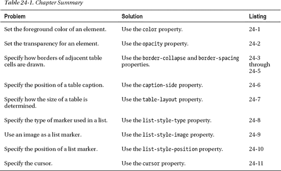

### 设置元素颜色和透明度

在本书的这一部分中，您已经看到了 CSS 颜色的不同用法，如`background-color`属性、`border-color`属性等等。还有两个与颜色相关的属性。表 24-2 描述了这些属性。

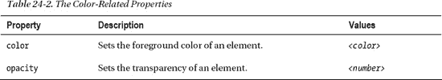

#### 设置前景色

属性为元素设置前景色。原则上，元素可以对颜色属性的含义有不同的解释，但实际上，`color`属性设置了文本的颜色。清单 24-1 显示了正在使用的`color`属性。

*清单 24-1。使用颜色属性*

`<!DOCTYPE HTML>
<html>
    <head>
        <title>Example</title>
        <meta name="author" content="Adam Freeman"/>
        <meta name="description" content="A simple example"/>
        <link rel="shortcut icon" href="favicon.ico" type="image/x-icon" />
        
    </head>` `    <body>
        

            There are lots of different kinds of fruit - there are over 500
            varieties of **banana** alone. By the time we add the
            countless types of apples, oranges, and other well-known fruit, we are faced
            with thousands of choices.
            **<a href="http://en.wikipedia.org/wiki/Banana">Learn more about Bananas</a>**
        

    </body>
</html>`

在这个例子中，我使用了两次`color`属性:一次是设置`span`元素的前景色和透明度，另一次是当鼠标悬停在`a`元素上时设置它们的前景色。你可以在图 24-1 中看到效果。这种效果在打印的页面上可能很难辨认。为了理解这种效果，您应该在浏览器中显示示例 HTML 文档。

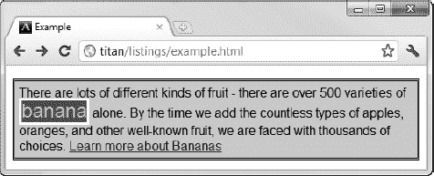

*图 24-1。使用颜色属性设置前景*

#### 设置元素不透明度

注意，在前面的例子中，我使用了`rgba`函数来设置`span`元素的颜色。我通过提供一个小于 1 的 alpha 值使文本变得稍微透明。从图中可能很难看出，但效果是文本允许一些背景颜色显示出来。

您可以使用`opacity`属性使整个元素及其文本内容透明。该属性的允许范围是从零(表示完全透明)到 1(表示完全不透明)。清单 24-2 显示了正在使用的`opacity`属性。

*清单 24-2。使用不透明度属性*

`<!DOCTYPE HTML>
<html>
    <head>
        <title>Example</title>
        <meta name="author" content="Adam Freeman"/>
        <meta name="description" content="A simple example"/>
        <link rel="shortcut icon" href="favicon.ico" type="image/x-icon" />
        
    </head>
    <body>
        

            There are lots of different kinds of fruit - there are over 500
            varieties of **banana** alone. By the time we add the
            countless types of apples, oranges, and other well-known fruit, we are faced
            with thousands of choices.
            <a href="http://en.wikipedia.org/wiki/Banana">Learn more about Bananas</a>
        

    </body>
</html>`

在这个例子中，我将`span`元素的不透明度设置为`0.4`。效果如图图 24-2 所示，但在打印页面上可能很难辨认。

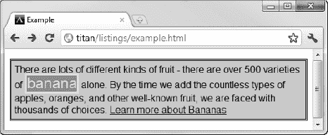

*图 24-2。设置元素的不透明度*

### 造型表

有许多属性可以让你设计出`table`元素的独特特征，我在第十一章中介绍过。表 24-3 总结了这些特性。

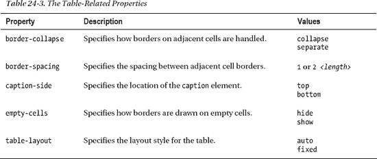

#### 折叠表格边框

属性让你控制浏览器为元素绘制边框的方式。你可以在图 24-3 中看到默认的方法。

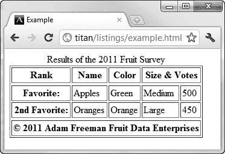

*图 24-3。带边框的表格的默认外观*

浏览器在表格周围画一个边框，在每个单元格周围画一个边框，创造出双边框效果。你可以通过应用`border-collapse`属性来解决这个问题，如清单 24-3 所示。

*清单 24-3。使用边框折叠属性*

`<!DOCTYPE HTML>
<html>
    <head>
        <title>Example</title>
        <meta name="author" content="Adam Freeman"/>
        <meta name="description" content="A simple example"/>
        <link rel="shortcut icon" href="favicon.ico" type="image/x-icon" />
        
    </head>
    <body>
        <table border="1">
            <caption>Results of the 2011 Fruit Survey</caption>
            <colgroup id="colgroup1">
                <col id="col1And2" span="2"/>
                <col id="col3"/>
            </colgroup>
            <colgroup id="colgroup2" span="2"/>
            <thead>
                <tr>
                    <th>Rank</th><th>Name</th><th>Color</th>
                    <th colspan="2">Size & Votes</th>
                </tr>
            </thead>
            <tbody>
                <tr>
                    <th>Favorite:</th><td>Apples</td><td>Green</td>
                    <td>Medium</td><td>500</td>
                </tr>
                <tr>
                    <th>2nd Favorite:</th><td>Oranges</td><td>Orange</td>
                    <td>Large</td><td>450</td>
                </tr>
            </tbody>
            <tfoot>
                <tr>
                    <th colspan="5">&copy; 2011 Adam Freeman Fruit Data Enterprises</th>
                </tr>    
            </tfoot>
        </table>` `    </body>
</html>`

`collapse`值告诉浏览器你不希望在相邻元素的每一条边上都画边框。你可以在图 24-4 中看到它的效果。

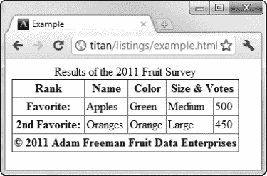

*图 24-4。折叠表格的边框*

#### 配置分隔边框

如果您使用默认的`separate`值作为`border-collapse`属性，您可以使用一些额外的属性来优化外观。属性`border-spacing`定义了相邻元素的边界之间将要绘制的空间量，如清单 24-4 中的所示。

*清单 24-4。使用边框间距属性*

`<!DOCTYPE HTML>
<html>
    <head>
        <title>Example</title>
        <meta name="author" content="Adam Freeman"/>
        <meta name="description" content="A simple example"/>
        <link rel="shortcut icon" href="favicon.ico" type="image/x-icon" />
        
    </head>
    <body>` `        <table border="1">
            <caption>Results of the 2011 Fruit Survey</caption>
            <colgroup id="colgroup1">
                <col id="col1And2" span="2"/>
                <col id="col3"/>
            </colgroup>
            <colgroup id="colgroup2" span="2"/>
            <thead>
                <tr>
                    <th>Rank</th><th>Name</th><th>Color</th>
                    <th colspan="2">Size & Votes</th>
                </tr>
            </thead>
            <tbody>
                <tr>
                    <th>Favorite:</th><td>Apples</td><td>Green</td>
                    <td>Medium</td><td>500</td>
                </tr>
                <tr>
                    <th>2nd Favorite:</th><td>Oranges</td><td>Orange</td>
                    <td></td><td></td>
                </tr>
            </tbody>
            <tfoot>
                <tr>
                    <th colspan="5">&copy; 2011 Adam Freeman Fruit Data Enterprises</th>
                </tr>    
            </tfoot>
        </table>
    </body>
</html>`

在这个例子中，我指定了 10 像素的边框间距。你可以在图 24-5 中看到效果。

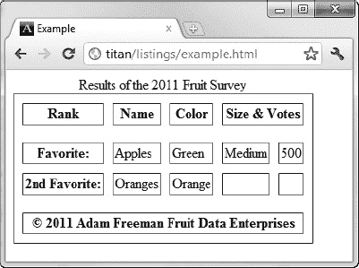

*图 24-5。使用边框间距属性*

#### 处理空单元格

您还可以告诉浏览器如何处理空单元格。默认情况下，当单元格为空时，浏览器会绘制一个单独的边框，如图 24-5 所示。您可以使用`empty-cells`属性来控制这种行为。默认的`show`值创建了图 24-3 中的效果，而`hide`值告诉浏览器不要绘制边框。清单 24-5 显示了在前一个例子的`style`元素中添加了`empty-cells`属性。

*清单 24-5。使用空单元格属性*

``

你可以在图 24-6 中看到这种变化的效果。

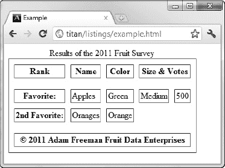

*图 24-6。使用空单元格属性*

#### 定位标题

正如我在第十一章中解释的，当你将一个`caption`元素添加到一个`table`中时，它会显示在表格的顶部，即使它不是第一个子元素。您可以使用`caption-side`属性来改变这种行为。该属性有两个值:`top`(默认)和`bottom`。清单 24-6 显示了这个属性的应用。

*清单 24-6。使用标题侧属性*

`<!DOCTYPE HTML>
<html>
    <head>
        <title>Example</title>
        <meta name="author" content="Adam Freeman"/>
        <meta name="description" content="A simple example"/>
        <link rel="shortcut icon" href="favicon.ico" type="image/x-icon" />
        
    </head>
    <body>
        <table border="1">
            <caption>Results of the 2011 Fruit Survey</caption>` `            <colgroup id="colgroup1">
                <col id="col1And2" span="2"/>
                <col id="col3"/>
            </colgroup>
            <colgroup id="colgroup2" span="2"/>
            <thead>
                <tr>
                    <th>Rank</th><th>Name</th><th>Color</th>
                    <th colspan="2">Size & Votes</th>
                </tr>
            </thead>
            <tbody>
                <tr>
                    <th>Favorite:</th><td>Apples</td><td>Green</td>
                    <td>Medium</td><td>500</td>
                </tr>
                <tr>
                    <th>2nd Favorite:</th><td>Oranges</td><td>Orange</td>
                    <td></td><td></td>
                </tr>
            </tbody>
            <tfoot>
                <tr>
                    <th colspan="5">&copy; 2011 Adam Freeman Fruit Data Enterprises</th>
                </tr>    
            </tfoot>
        </table>
    </body>
</html>`

你可以在图 24-7 中看到这个属性的效果。

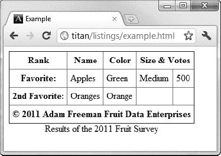

*图 24-7。使用标题侧属性移动标题*

#### 指定表格布局

默认情况下，浏览器根据每列中最宽的单元格来设置表格的宽度。这意味着您不必担心自己计算大小，但也意味着浏览器必须接收所有的表格内容，然后才能确定页面的布局。

浏览器显示表格的方式由`table-layout`属性控制，默认值(如上所述)由值`auto`设置。您可以使用另一个允许值`fixed`禁用自动布局。在固定模式下，表格的大小由表格和各个列的`width`值设置。如果没有可用的列宽信息，浏览器将在各列之间平均分配空间。

因此，浏览器能够在仅接收一行表格数据后确定每列的宽度。对后续行的数据进行包装以使其适合(这可能导致行比在`auto`模式下的行高)。

清单 24-7 显示了正在使用的`table-layout`属性。

*清单 24-7。使用表格布局属性*

`<!DOCTYPE HTML>
<html>
    <head>
        <title>Example</title>
        <meta name="author" content="Adam Freeman"/>
        <meta name="description" content="A simple example"/>
        <link rel="shortcut icon" href="favicon.ico" type="image/x-icon" />
        
    </head>
    <body>
        <table border="1">
            <caption>Results of the 2011 Fruit Survey</caption>
            <colgroup id="colgroup1">
                <col id="col1And2" span="2"/>
                <col id="col3"/>
            </colgroup>
            <colgroup id="colgroup2" span="2"/>
            <thead>
                <tr>
                    <th>Rank</th><th>Name</th><th>Color</th>
                    <th colspan="2">Size & Votes</th>
                </tr>
            </thead>
            <tbody>` `                <tr>
                    **<th>Really Really Really Long Title:</th>**
                    <td>Apples</td><td>Green</td>
                    <td>Medium</td><td>500</td>
                </tr>
                <tr>
                    <th>2nd Favorite:</th><td>Oranges</td><td>Orange</td>
                    <td></td><td></td>
                </tr>
            </tbody>
            <tfoot>
                <tr>
                    <th colspan="5">&copy; 2011 Adam Freeman Fruit Data Enterprises</th>
                </tr>    
            </tfoot>
        </table>
    </body>
</html>`

在这个例子中，我将`table`元素的`width`设置为占据 100%的可用空间，并将布局样式设置为`fixed`。我还更改了第二行中一个单元格的内容，以展示对布局的影响，如图 24-8 中的所示。

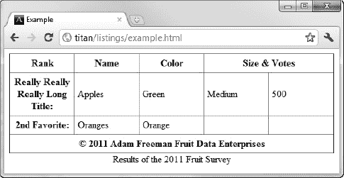

*图 24-8。使用表格布局属性*

请注意可用空间是如何在五列中平均分配的，以及第二行中的长标题是如何换行的，从而使该行比其他行高得多。

### 造型列表

有许多特定于样式列表的属性。表 24-4 总结了这些特性。

`list-style`速记属性的格式如下:

`list-style: <list-style-type> <list-style-position> <list-style-image>`

#### 设置列表标记类型

使用`list-style-type`属性为列表设置标记(有时也称为项目符号)的样式。您可以在表 24-5 中看到该属性的允许值。

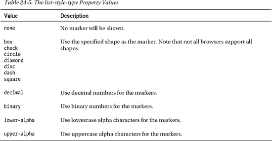

表 24-5 仅显示了部分可用样式。还有更多，代表不同的字母，符号风格和数字约定。您可以在`[www.w3.org/TR/css3-lists](http://www.w3.org/TR/css3-lists)`找到完整的列表。清单 24-8 显示了使用中的`list-style-type`属性。

*清单 24-8。使用列表样式类型属性*

`<!DOCTYPE HTML>
<html>
    <head>
        <title>Example</title>
        <meta name="author" content="Adam Freeman"/>
        <meta name="description" content="A simple example"/>
        <link rel="shortcut icon" href="favicon.ico" type="image/x-icon" />
        
    </head>
    <body>
        I like apples and oranges.

        I also like:
        <ol>
            <li>bananas</li>
            <li>mangoes</li>
            **<li style="list-style-type: decimal">cherries</li>**
            <li>plums</li>
            <li>peaches</li>
            <li>grapes</li>
        </ol>
    </body>
</html>`

您可以将该属性应用于整个列表或单个列表项。在这个例子中，我两者都做了(尽管结果对读者来说没有意义)。你可以在图 24-9 中看到效果。

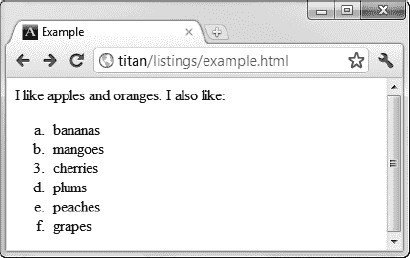

*图 24-9。设置列表标记类型*

#### 使用图像作为列表标记

您可以通过`list-style-image`属性使用图像作为标记。清单 24-9 展示了这个属性的实际应用。

*清单 24-9。使用图像作为列表标记*

`<!DOCTYPE HTML>
<html>
    <head>
        <title>Example</title>
        <meta name="author" content="Adam Freeman"/>
        <meta name="description" content="A simple example"/>
        <link rel="shortcut icon" href="favicon.ico" type="image/x-icon" />
        
    </head>
    <body>
        I like apples and oranges.

        I also like:
        <ul>
            <li>bananas</li>
            <li>mangoes</li>
            <li>cherries</li>
            <li>plums</li>
            <li>peaches</li>
            <li>grapes</li>` `        </ul>
    </body>
</html>`

你可以在图 24-10 中看到应用该属性的效果。

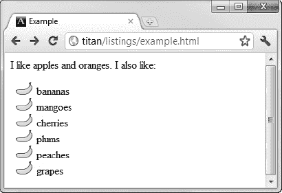

*图 24-10。使用图像作为列表标记*

#### 定位标记

您可以使用`list-style-position`属性指定标记相对于`li`元素内容框的位置。允许的值是`inside`(表示标记在内容框内)和`outside`(表示标记在内容框外)。清单 24-10 显示了使用中的`list-style-position`属性及其值。

*清单 24-10。指定标记*的位置

`<!DOCTYPE HTML>
<html>
    <head>
        <title>Example</title>
        <meta name="author" content="Adam Freeman"/>
        <meta name="description" content="A simple example"/>
        <link rel="shortcut icon" href="favicon.ico" type="image/x-icon" />
        
    </head>
    <body>
        I like apples and oranges.

        I also like:
        <ul>
            These are the inside items:
            **<li class="inside">bananas</li>**
            **<li class="inside">mangoes</li>**
            **<li class="inside">cherries</li>**
            These are the outside items:
            **<li class="outside">plums</li>**
            **<li class="outside">peaches</li>**
            **<li class="outside">grapes</li>**
        </ul>
    </body>
</html>`

我将`li`项分成了两个类，并应用了不同的`list-style-position`属性值。你可以在图 24-11 中看到效果。

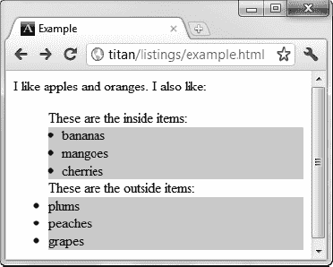

*图 24-11。定位标记*

在这个图中，我已经为所有的`li`元素设置了`background-color`属性，这样您就可以看到每个位置值的效果。

### 样式化光标

属性允许你改变光标的外观。表 24-6 总结了这一要素。

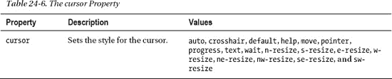

当鼠标经过样式化的元素时，`cursor`属性的不同值导致浏览器显示不同样式的光标。您可以在清单 24-11 中看到正在使用的属性。

*清单 24-11。使用光标属性*

`<!DOCTYPE HTML>
<html>
    <head>
        <title>Example</title>
        <meta name="author" content="Adam Freeman"/>
        <meta name="description" content="A simple example"/>
        <link rel="shortcut icon" href="favicon.ico" type="image/x-icon" />
        
    </head>
    <body>
        

            There are lots of different kinds of fruit - there are over 500
            varieties of banana alone. By the time we add the
            countless types of apples, oranges, and other well-known fruit, we are faced
            with thousands of choices.
        

    </body>` `</html>`

你可以在图 24-12 中看到效果。我已经放大了光标，以显示当我将鼠标放在`span`元素上时，它会切换到 Windows 7 等待光标。

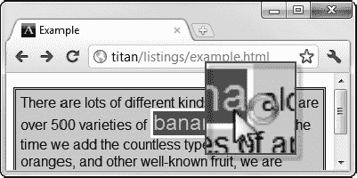

*图 24-12。设置光标样式*

### 总结

在这一章中，我描述了不适合其他地方的 CSS 属性。这并不是说这些属性不重要，只是它们不符合前几章的主题。本章中的属性允许您设置所有元素的颜色和不透明度，并对列表和表格应用特定的样式，这本身就是基本的 HTML 功能。