# 二十五、上下文中的 DOM

在本书的这一部分，您将探索*文档对象模型*(*DOM*)。到目前为止，您可以使用我向您展示的元素和 CSS 属性实现一些复杂的效果，但是如果您想要完全控制您的 HTML，您需要使用 JavaScript。DOM 是 JavaScript 和 HTML 文档内容之间的连接。使用 DOM，您可以添加、删除和操作元素。您可以使用*事件*来响应用户交互，并且您可以完全控制 CSS。

从这一点开始，你处于 HTML5 的编程端。到目前为止，您已经使用元素和 CSS 声明创建了内容，但是是时候戴上程序员的帽子开始使用 JavaScript 了。如果你需要复习，第五章给出了 JavaScript 基础知识的一个浏览。

### 了解文档对象模型

DOM 是表示 HTML 文档中元素的对象集合。名字说明了一切:DOM 实际上是一个*模型*，它由代表您的*文档*的*对象*组成。DOM 是 web 开发中的一个关键工具，它在 HTML 文档的结构和内容与 JavaScript 之间架起了一座桥梁。举例来说，清单 25-1 显示了一个简单的 HTML 文档。

*清单 25-1。一个简单的 HTML 文档*

`<!DOCTYPE HTML>
<html>
    <head>
        <title>Example</title>
        <meta name="author" content="Adam Freeman"/>
        <meta name="description" content="A simple example"/>
    </head>
    <body>
        

            There are lots of different kinds of fruit - there are over 500
            varieties of banana alone. By the time we add the
            countless types of apples, oranges, and other well-known fruit, we are faced
            with thousands of choices.
        

        

            One of the most interesting aspects of fruit is the` `            variety available in each country. I live near London, in an area which is
            known for its apples.
        

    </body>
</html>`

你可以在图 25-1 中看到浏览器是如何显示样本 HTML 文档的。

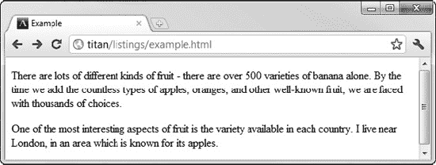

*图 25-1。显示基本的 HTML 文档*

作为显示 HTML 文档过程的一部分，浏览器解析 HTML 并创建一个模型。该模型保留了 HTML 元素的层次结构，如图 25-2 所示，每个元素由一个 JavaScript 对象表示。

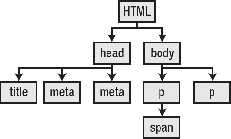

*图 25-2。HTML 文档中元素的层次结构*

正如您将在接下来的章节中看到的，您可以使用 DOM 来获取关于文档的信息或对其进行修改。这是现代 web 应用的基础。

模型中的每个模型对象都有属性和方法。当您使用这些来更改对象的状态时，浏览器会在相应的 HTML 元素中反映这些更改，并更新您的文档。

所有表示元素的 DOM 对象都支持相同的基本特性。这些是`HTMLElement`对象，由`HTMLElement`定义的核心功能总是可用的，不管对象代表哪种元素。此外，一些对象定义了额外的功能，允许您执行反映特定 HTML 元素独特特征的操作。我在第三十一章中描述了这些额外的特性。这是需要注意的重要一点:文档模型中代表一个元素的每个对象至少支持*的*的`HTMLElement`特性，在某些情况下，还支持额外的特性。

并非所有可用的对象都代表 HTML 元素。正如您很快会看到的，有表示元素集合的对象，有表示关于 DOM 本身的信息的对象，当然还有`Document`对象，它是我们进入 DOM 的门户，也是第二十六章的主题。

 **注意**我在这里跳过了一些细节。如果您熟悉面向对象编程的概念，那么知道`HTMLElement`是由 DOM 中包含的对象实现的接口可能会有所帮助。用于表示更具体元素的对象是从`HTMLElement`派生的接口，这意味着您可以将对象视为实现或`HTMLElement`，或其更具体的子类型。如果你不熟悉面向对象的概念，也不用担心。对于主流 web 编程来说，理解它们并不重要。我不会再提到它们，为了简单起见，我将把所有东西都称为*对象*。

### 了解 DOM 级别和合规性

当您开始使用 DOM 时，您会遇到提到 DOM 级别的 web 文章和教程(例如，某个特性是由 DOM Level 3 定义的)。DOM 级别是标准化过程的版本号，在大多数情况下，您应该忽略它们。

DOM 的标准化过程有好有坏。有描述每个 DOM 级别的标准和文档，但是它们并没有完全实现，浏览器只是简单地挑选有用的特性，而忽略了其他的。更糟糕的是，实现的特性之间存在一定程度的不一致。

部分问题是 DOM 规范是与 HTML 标准分开开发的。HTML5 试图通过包含一组应该实现的核心 DOM 特性来解决这个问题。然而，这尚未生效，分裂现象依然存在。

有许多方法可以处理 DOM 特性的可变性。第一种是使用 JavaScript 库，比如 jQuery，它消除了浏览器实现之间的差异。使用库的优点是一致性，但缺点是受限于库支持的特性。如果你想跳出这个库的特性，你就要直接使用 DOM，无论如何都会面临同样的问题。(这并不是说 jQuery 及其替代品没有价值；它们非常有用，非常值得一看。)

第二种方法是保守主义:只使用你知道被广泛支持的特性。这在很大程度上是最明智的方法，尽管它需要仔细彻底的测试。此外，你必须小心测试新版本的浏览器，以确保对功能的支持没有改变或删除。

#### 测试 DOM 特性

第三种方法是测试 DOM 对象上与某个特性相关联的属性或方法是否存在。清单 25-2 包含一个简单的例子。

 **提示**不要担心清单 25-2 中脚本的细节。我将在接下来的章节中解释它使用的所有对象和特性。

*清单 25-2。功能测试*

`<!DOCTYPE HTML>
<html>
    <head>
        <title>Example</title>
    </head>
    <body>
        

            There are lots of different kinds of fruit - there are over 500 varieties
            of banana alone. By the time we add the countless types of apples, oranges,
            and other well-known fruit, we are faced with thousands of choices.
            
        

        
    </body>
</html>`

在这个例子中，脚本使用一个`if`子句来确定`document`对象是否定义了一个名为`querySelectorAll`的方法。如果子句评估为`true`，那么浏览器支持该特性，我可以继续使用它。如果该子句评估为`false`，那么我可以采取另一种方法来实现相同的目标。

当涉及到 DOM 时，这是你经常会看到的建议，但它通常是圆滑地给出的，没有指出缺点，这可能是严重的。

第一个缺点是，并不总是有替代方法来实现给定功能的效果。我在清单 25-2 中的简洁例子是有效的，因为我测试的特性是建立在其他函数之上的便利性增强，但情况并非总是如此。

第二个缺点是，我只测试特性的*存在*，而不是其实现的质量和一致性。许多特性，尤其是当它们是新特性时，需要几个浏览器版本来稳定和实现一致性。这已经不是以前的问题了，但是由于浏览器实现您所依赖的特性的方式不同，您很容易得到意想不到的结果。

第三个缺点是你必须测试你所依赖的每一个特性。这需要极度的勤奋，产生的代码充满了无尽的测试。这并不是说这不是一个有用的技术，但它有缺陷，不应该作为适当测试的替代品。

### DOM 快速参考

以下部分提供了我在后面章节中描述的对象、方法、属性和事件的快速参考。

#### 文档成员

第二十六章描述了`Document`对象，它代表当前文档，是你进入 DOM 的门户。表 25-1 总结了该对象定义的成员。

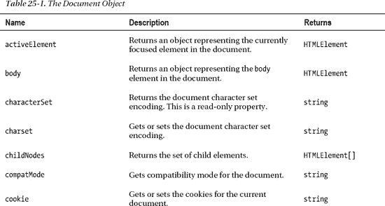

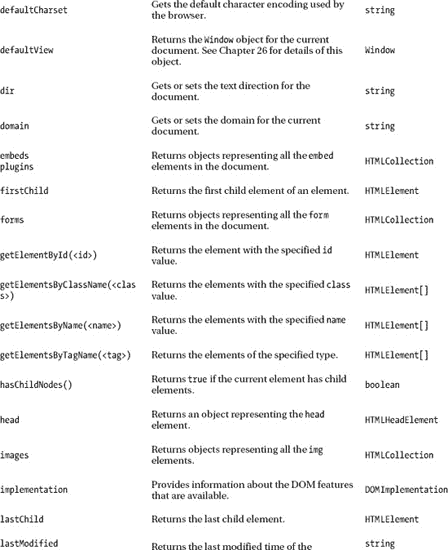

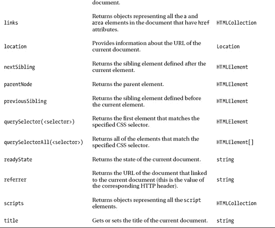

第二十六章也描述了`Location`对象，汇总在表 25-2 中。

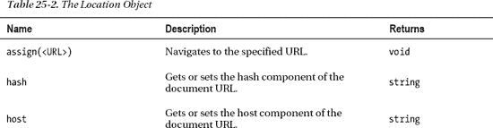

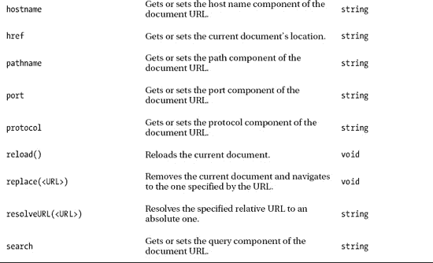

#### 窗口成员

第二十七章描述了`Window`对象，它定义了广泛的特性。表 25-3 总结了该对象定义的成员。

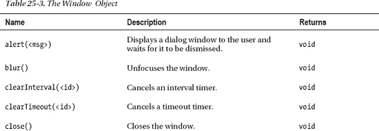

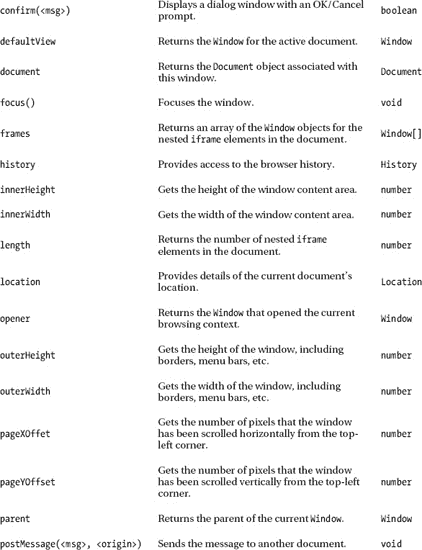

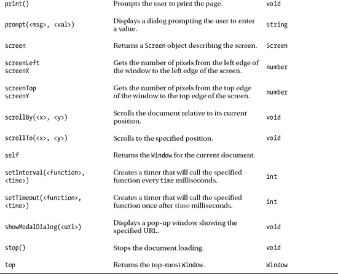

第二十七章也描述了`History`对象，其成员汇总在表 25-4 中。

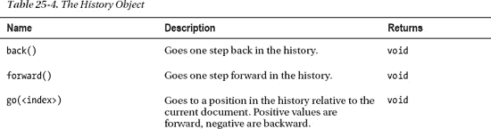

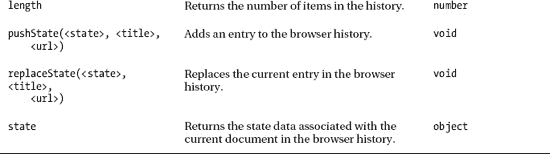

第二十七章也描述了`Screen`对象，其成员汇总在表 25-5 中。

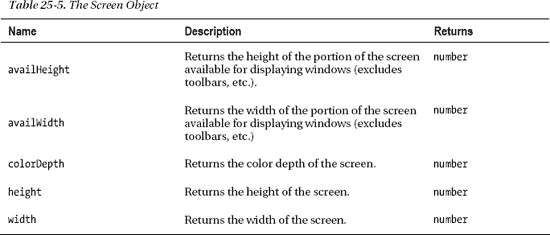

#### html element 成员

第二十八章描述了`HTMLElement`对象，它代表了文档中的 HTML 元素。表 25-6 总结了该对象定义的成员。

***表 25-6。**html element 对象*

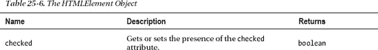

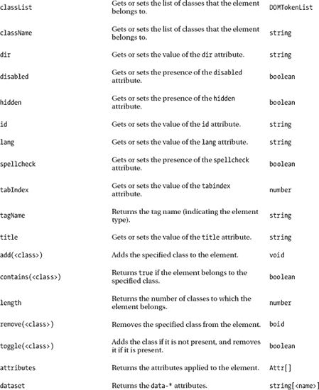

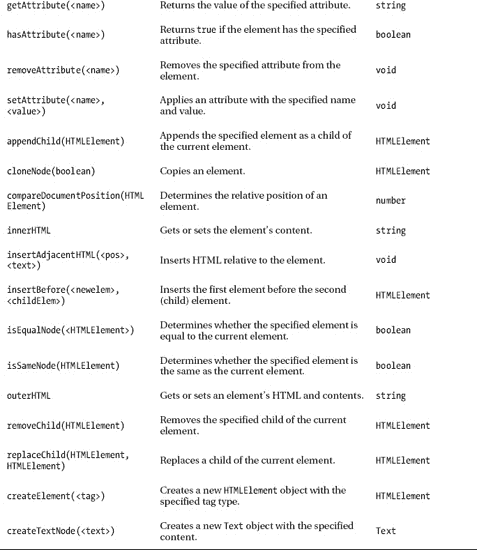

第二十八章也描述了`Text`对象，它用来表示文档中的文本内容。表 25-7 描述了`Text`对象的成员。

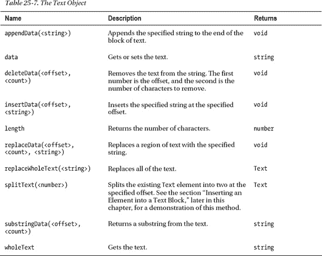

#### DOM CSS 属性

第二十九章描述了如何使用 DOM 来处理文档中的 CSS 样式。在表 25-8 中列出了`CSSStyleDeclaration`对象的属性及其对应的样式(以及描述它们的章节)。

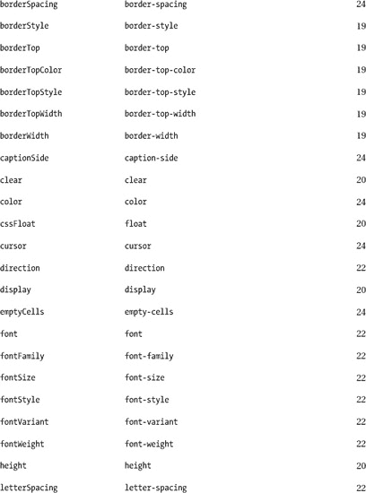

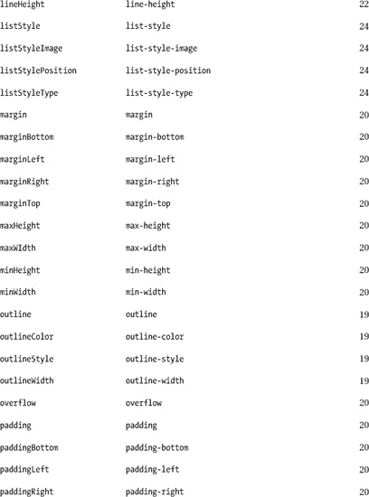

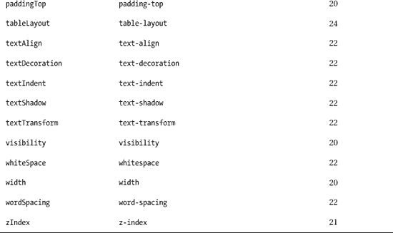

#### DOM 事件

第三十章讲解 DOM 事件系统。有许多不同的事件可用，如表 25-9 中所述。

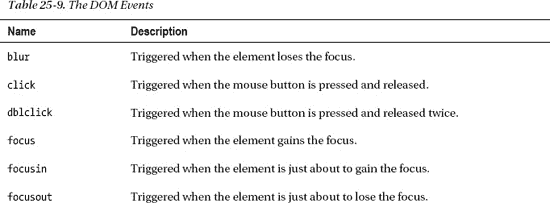

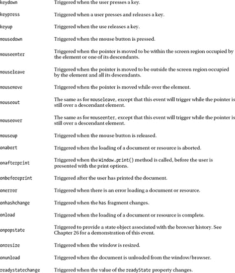

### 总结

在这一章中，我已经提供了一些 DOM 的上下文以及它在 HTML 文档中扮演的角色。我还解释了 DOM 规范级别与主流浏览器实现的特性之间的关系，以及确保您所依赖的 DOM 特性在目标浏览器中可用的不同方法。虽然，必须指出的是，这些方法中没有一个可以取代勤奋和彻底的测试。

这一章还包括一些我在后面章节中描述的对象、成员和事件的快速参考表。