# 二十六、使用文档对象

在这一章中，我将向您介绍 DOM 的关键组件之一:`Document`对象。`Document`对象是 DOM 功能的入口，它为您提供了关于当前文档的信息和一组特性，用于浏览、导航、搜索和操作结构和内容。表 26-1 对本章进行了总结。

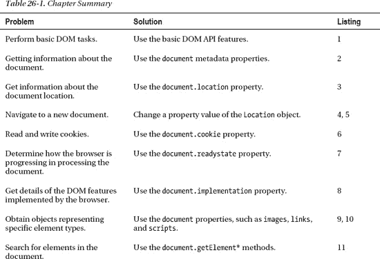

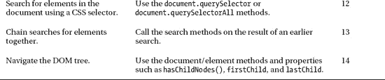

你通过全局变量`document`访问`Document`对象；这是浏览器为我们创建的关键对象之一。`Document`对象为您提供关于整个文档的信息，并允许您访问模型中的单个对象。开始使用 DOM 的最好方式是通过一个例子。清单 26-1 展示了上一章的示例文档，并添加了一个演示一些基本 DOM 特性的脚本。

*清单 26-1。使用文档对象*

`<!DOCTYPE HTML>
<html>
    <head>
        <title>Example</title>
        <meta name="author" content="Adam Freeman"/>
        <meta name="description" content="A simple example"/>
    </head>
    <body>
        

            There are lots of different kinds of fruit - there are over 500
            varieties of banana alone. By the time we add the
            countless types of apples, oranges, and other well-known fruit, we are faced
            with thousands of choices.
        

        

            One of the most interesting aspects of fruit is the
            variety available in each country. I live near London, in an area which is
            known for its apples.
        

        ****
    </body>
</html>`

这个脚本简短而简单，但是它巧妙地抓住了 DOM 的许多不同用途。我将把脚本分解成几个部分，并解释发生了什么。我们可以用`Document`对象做的最基本的事情之一是获取我们正在处理的 HTML 文档的信息。脚本中的第一行就是这样做的:

`document.writeln("<pre>URL: " + **document.URL**);`

在本例中，我已经读取了`document.URL`属性的值，它返回当前文档的 URL。这是浏览器用来加载运行脚本的文档的 URL。在本章后面的“从文档中获取信息”一节中，我将向您展示您可以从`Document`对象中获取的不同信息。

该语句还调用了`writeln`方法:

`**document.writeln(**"<pre>URL: " + document.URL**);**`

该方法将内容追加到 HTML 文档的末尾。在本例中，我已经编写了一个`pre`元素的开始标记和`URL`属性的值。这是一个非常简单的*修改 DOM* 的例子，意味着我改变了文档的结构。我在第二十八章中详细描述了 DOM 的操作。

接下来，我从文档中选择一些元素:

`var elems = document.**getElementsByTagName("p");**`

有一系列选择元素的方法，我将在本章后面的“获取 HTML 元素对象”一节中解释。`getElementsByTagName`选择给定类型的所有元素，在本例中是`p`元素。文档中包含的任何`p`元素都从方法中返回，并放在名为`elems`的变量中。正如我解释的，所有元素都由`HTMLElement`对象表示，它提供了表示 HTML 元素的基本功能。来自`getElementsByTagName`方法的结果是一个`HTMLElement`对象的集合。

现在我有了一个要处理的`HTMLElement`对象集合，我使用一个`for`循环来枚举集合的内容，并处理浏览器在 HTML 文档中找到的每个`p`元素:

`**for (var i = 0; i < elems.length; i++) {**
    document.writeln("Element ID: " + elems[i].id);
    elems[i].style.border = "medium double black";
    elems[i].style.padding = "4px";
**}**`

对于集合中的每个`HTMLElement`,我读取`id`属性以获得`id`属性的值，并使用`document.writeln`方法将结果附加到我之前开始的`pre`元素的内容中:

`for (var i = 0; i < elems.length; i++) {
    **document.writeln("Element ID: " + elems[i].id);**
    elems[i].style.border = "medium double black";
    elems[i].style.padding = "4px";
}`

`id`属性是由`HTMLElement`定义的多个属性之一。我会在第二十八章给你看其他属性。您可以使用这些属性来获取有关某个元素的信息或修改它(以及通过这样做来修改它所代表的 HTML 元素)。在本例中，我使用了`style`属性来更改 CSS `border`和`padding`属性的值:

`for (var i = 0; i < elems.length; i++) {` `    document.writeln("Element ID: " + elems[i].id);
    **elems[i].style.border = "medium double black";**
    **elems[i].style.padding = "4px";**
}`

这些改变为你之前使用`getElementsByTagName`找到的每个元素创建了一个内联样式(我在第四章中描述了内联样式)。当您更改一个对象时，浏览器会立即将更改应用到相应的元素，在本例中，是通过向`p`元素添加填充和边框。

脚本的最后一行写了我在脚本开始时打开的`pre`元素的结束标记。我使用了`write`方法来实现这一点，它就像`writeln`一样，但是没有将行尾字符附加到添加到文档中的字符串上。这并没有太大的区别，除非你正在编写预格式化的内容或者你已经指定了非标准空白处理的内容(详见第二十二章)。

使用`pre`元素意味着由`writeln`方法添加的行尾字符将用于构建内容。你可以在图 26-1 中看到文件显示的效果。

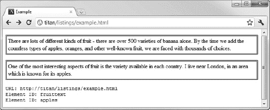

*图 26-1。脚本对基本 HTML 文档的影响*

### 使用文档元数据

正如我在上一节中解释的那样，`Document`对象的一个用途是为您提供关于文档的信息。表 26-2 描述了可以用来获取文档元数据的属性。

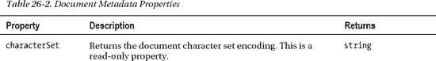

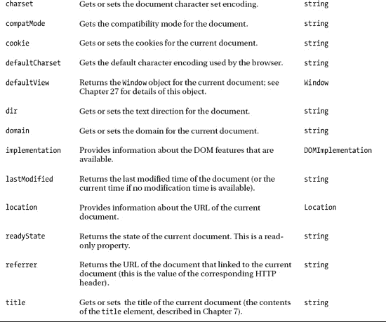

#### 从文档中获取信息

您可以使用元数据属性获得一些关于文档的有用信息，如清单 26-2 所示。

*清单 26-2。使用文档对象获取元数据*

`<!DOCTYPE HTML>
<html>
    <head>
        <title>Example</title>
        <meta name="author" content="Adam Freeman"/>` `        <meta name="description" content="A simple example"/>
    </head>
    <body>
        
    </body>
</html>`

这些属性为您所处理的文档提供了一些有用的信息。您可以在图 26-2 中看到浏览器显示的这些属性的值。

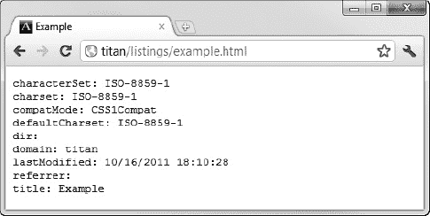

*图 26-2。关于文档*的基本信息

##### 理解怪癖模式

属性告诉你浏览器如何处理文档中的内容。世界上有很多不标准的 HTML，浏览器试图显示这样的页面，即使它们不符合 HTML 规范。其中一些内容依赖的功能可以追溯到浏览器竞争其独特差异的时代，而不是标准合规性。`compatMode`属性将返回两个值中的一个，如表 26-3 所述。

#### 使用位置对象

`document.location`属性返回一个`Location`对象，为您提供关于文档地址的细粒度信息，并允许您导航到其他文档。表 26-4 描述了`Location`对象的功能和属性。

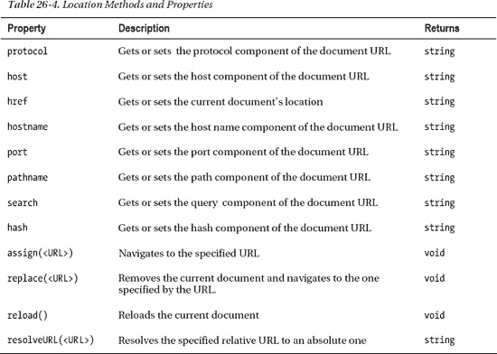

属性最简单的用途是获取当前对象的位置信息，如清单 26-3 所示。

*清单 26-3。使用 Location 对象获取关于文档*的信息

`<!DOCTYPE HTML>
<html>
    <head>
        <title>Example</title>
        <meta name="author" content="Adam Freeman"/>
        <meta name="description" content="A simple example"/>
    </head>
    <body>
        
    </body>
</html>`

`search`属性返回 URL 的查询字符串部分，hash 属性返回 URL 片段。图 26-3 显示了 URL `[`titan/listings/example.html?query=apples#apples`](http://titan/listings/example.html?query=apples#apples)`的`Location`属性返回的值。

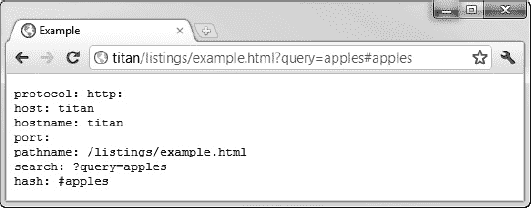

*图 26-3。使用位置对象获取信息*

 **提示**注意，当端口为 HTTP 的默认值)时，该属性不返回值。

##### 使用位置对象导航到别处

您还可以使用通过`document.location`属性获得的`Location`对象导航到其他地方。有几种不同的方法可以做到这一点。首先，你可以给我在前面的例子中使用的属性赋值，如清单 26-4 所示。

*清单 26-4。通过为位置属性*分配新值来导航到文档

`<!DOCTYPE HTML>
<html>
    <head>
        <title>Example</title>
        <meta name="author" content="Adam Freeman"/>
        <meta name="description" content="A simple example"/>
    </head>
    <body>
        

            There are lots of different kinds of fruit - there are over 500 varieties
            of banana alone. By the time we add the countless types of apples, oranges,
            and other well-known fruit, we are faced with thousands of choices.
        

        **<button id="pressme">Press Me</button>**
        

            One of the most interesting aspects of fruit is the variety available in
            each country. I live near London, in an area which is known for
            its apples.

        

        ****
        
    </body>
</html>`

这个例子包含了一个`button`元素，当点击这个元素时，会给`document.location.hash`属性分配一个新值。按钮和点击时将执行的 JavaScript 函数之间的关联是通过使用*事件*实现的。这就是`onclick`属性的用途，你可以在第三十章中了解更多事件。

这种变化导致浏览器导航到其`id`属性值与`hash`值匹配的元素，在本例中是`img`元素。你可以在图 26-4 中看到这种导航的效果。

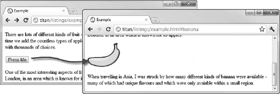

*图 26-4。使用位置对象导航*

虽然我导航到了同一文档中的不同位置，但是您也可以使用`Location`对象的属性导航到其他文档。然而，这通常是通过`href`属性完成的，因为您可以设置完整的 URL。您也可以使用`Location`对象定义的*方法*。

`assign`和`replace`方法的区别在于`replace`从浏览器的历史记录中删除当前文档，这意味着当用户点击后退按钮时，浏览器将跳过当前文档，就好像它从未被访问过一样。清单 26-5 展示了`assign`方法的使用。

*清单 26-5。使用位置对象*的分配方法导航

`<!DOCTYPE HTML>
<html>
    <head>
        <title>Example</title>
        <meta name="author" content="Adam Freeman"/>
        <meta name="description" content="A simple example"/>
    </head>
    <body>
        <button id="pressme">Press Me</button>
        
    </body>
</html>`

当用户单击`button`元素时，浏览器将导航到指定的 URL，在本例中是`[`apress.com`](http://apress.com)`。

#### 读写饼干

属性允许您读取、添加和更新与文档相关联的 cookies。清单 26-6 给出了一个演示。

*清单 26-6。读取和创建 cookie*

`<!DOCTYPE HTML>
<html>
    <head>
        <title>Example</title>
        <meta name="author" content="Adam Freeman"/>
        <meta name="description" content="A simple example"/>
    </head>
    <body>
        

        

        <button id="write">Add Cookie</button>
        <button id="update">Update Cookie</button>
        
    </body>
</html>`

属性的工作方式有点奇怪。当您读取属性的值时，您将获得与该文档相关联的所有 cookies。Cookies 是形式为`name=value`的名称/值对。如果有多个可用的 cookie，则所有 cookie 都作为 cookie 属性的结果返回，用分号分隔，例如:`name1=value1;name2=value2`。

相比之下，当您想要创建一个新的 cookie 时，您可以分配一个新的名称/值对作为属性`cookie`的值，它将被添加到文档的 cookie 集合中。一次只能设置一个 cookie 。如果您设置的值的名称部分对应于现有的 cookie，那么值部分将用于更新 cookie。

为了演示这一点，清单包含一个读取、创建和更新 cookies 的脚本。`readCookies`函数读取`document.cookie`属性的值，并将结果设置为段落(`p`)元素的内容。

文档中有两个`button`元素。当点击添加 cookie 按钮时，`createCookie`函数为`cookie`属性分配一个新值，该值将被添加到 Cookie 集合中。更新 Cookie 按钮导致调用`updateCookie`功能。该函数为现有的 cookie 提供一个新值。你可以在图 26-5 中看到这个脚本的效果，但是要真正感受一下发生了什么，我建议你加载这个文档并四处看看。

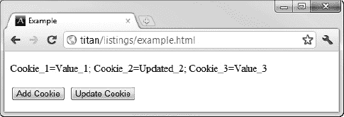

*图 26-5。添加和更新 cookie*

在本例中，我添加了三个 cookies，其中一个已经更新为新值。虽然`name=value`表单是添加 cookie 的默认表单，但是您可以应用一些额外的数据来改变 cookie 的处理方式。这些增加在表 26-5 中描述。

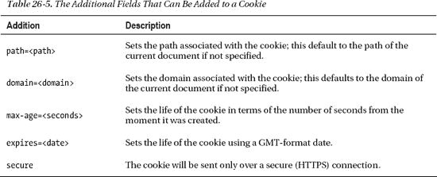

这些附加项中的每一项都被添加到名称/值对的前面，并用分号分隔，如下所示:

`document.cookie = "MyCookie=MyValue;max-age=10";`

#### 了解就绪状态

属性给出了关于加载和解析 HTML 文档过程中当前阶段的信息。记住，默认情况下，浏览器一遇到文档中的`script`元素就执行你的脚本，但是可以使用`defer`属性推迟脚本的执行(如第七章所述)。正如你已经在一些例子中看到的，我将在第三十章中详细解释，你可以使用 JavaScript 事件系统来执行单独的功能，以响应文档或用户动作的变化。

在所有这些情况下，了解浏览器在加载和处理 HTML 时所处的阶段是很有用的。`readyState`属性返回三个不同的值，在表 26-6 中有描述。

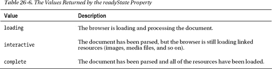

随着浏览器加载和处理文档，`readyState`属性的值从`loading`移动到`interactive`再到`complete`。该属性与每次`readyState`属性的值改变时触发的`readystatechange`事件结合使用最有用。我将在第三十章中解释事件，但是清单 26-7 展示了如何使用事件和属性来完成一个共同的任务。

*清单 26-7。使用文档就绪状态推迟脚本执行*

`<!DOCTYPE HTML>
<html>
    <head>
        <title>Example</title>
        <meta name="author" content="Adam Freeman"/>
        <meta name="description" content="A simple example"/>
        
    </head>
    <body>
        <button id="pressme">Press Me</button>` `        <pre id="results"></pre>
    </body>
</html>`

这个脚本使用文档就绪状态来推迟函数的执行，直到文档到达`interactive`阶段。这个脚本依赖于能够在文档中找到在脚本执行时浏览器还没有加载的元素。通过推迟执行直到文档被完全加载，我可以确信元素会被找到。这是将`script`元素放在文档末尾的替代方法。我将在本章后面的“获取 HTML 元素对象”一节中解释如何查找元素。我在第三十章中解释如何使用事件。

#### 获取 DOM 实现细节

属性为您提供了关于 DOM 特性的浏览器实现的信息。该属性返回一个`DOMImplementation`对象，其中有一个您感兴趣的方法:`hasFeature`方法。您可以使用这种方法来确定实现了哪些 DOM 特性，如清单 26-8 所示。

*清单 26-8。使用 document . implementation . has feature 方法*

`<!DOCTYPE HTML>
<html>
    <head>
        <title>Example</title>
        <meta name="author" content="Adam Freeman"/>
        <meta name="description" content="A simple example"/>
    </head>
    <body>
        
    </body>
</html>`

这个脚本检查一些不同的 DOM 特性和定义的特性级别。这并不像看起来那么有用。首先，浏览器并不总是正确地报告它们实现的特性。一些实现了特性，但是没有通过`hasFeature`方法报告它们，而另一些声称实现了特性，但是没有。第二，一个浏览器报告一个特性并不意味着它以一种有用的方式实现了。这已经不是什么大问题了，但是 DOM 实现之间还是有一些差异。

如果你打算写能在所有主流浏览器上工作的代码(你应该这样做)，那么`hasFeature`方法就没什么用了。相反，在测试阶段彻底检查您的代码，在需要时测试支持和回退，并且可选地，考虑使用 JavaScript 库(比如 jQuery)，这可以帮助消除 DOM 实现中的差异。

### 获取 HTML 元素对象

对象的关键功能之一是充当代表文档中元素的对象的网关。您可以用几种不同的方式来执行这项任务。有一些属性可以返回表示文档中特定类型元素的对象，有一些方便的方法可以让您使用搜索标准来匹配元素，并且您可以将 DOM 视为一棵树并在它的结构中导航。在接下来的小节中，我将介绍这些技术。

 **提示**显然，你想获得这些物品是为了用它们做有趣的事情。我将在第三十八章中描述如何使用这些对象，其中我描述了`HTMLElement`对象的特性。

#### 使用属性获取元素对象

`Document`对象为您提供了一组属性，这些属性返回表示文档中特定元素或元素类型的对象。这些特性总结在表 26-7 中。

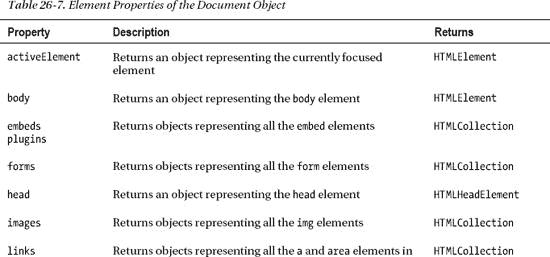

在表 26-7 中描述的大多数属性返回一个`HTMLCollection`对象。这是 DOM 表示代表元素的对象集合的方式。清单 26-9 展示了访问集合中包含的对象的两种方法。

*清单 26-9。使用 HTMLCollection 对象*

`<!DOCTYPE HTML>
<html>
    <head>
        <title>Example</title>
        <meta name="author" content="Adam Freeman"/>
        <meta name="description" content="A simple example"/>
        <link rel="shortcut icon" href="favicon.ico" type="image/x-icon" />
        
    </head>
    <body>
        <pre id="results"></pre>
        
        

            There are lots of different kinds of fruit - there are over 500 varieties
            of banana alone. By the time we add the countless types of apples, oranges,
            and other well-known fruit, we are faced with thousands of choices.
        

        
        

            One of the most interesting aspects of fruit is the variety available in
            each country. I live near London, in an area which is known for
            its apples.

        

        
        
    </body>` `</html>`

使用`HTMLCollection`的第一种方法是把它当作一个数组。属性返回集合中的项目数，并且支持标准的 JavaScript 数组索引器(?? 符号)来提供对集合中各个对象的直接访问。这是我在示例中使用的第一种方法，使用了`document.images`属性来获取一个包含表示文档中所有`img`元素的对象的`HTMLCollection`。

 **提示**注意，我使用了`innerHTML`属性来设置`pre`元素的内容。我将在第三十八章中更详细地解释这个属性。

第二种方法是使用`namedItem`方法，该方法返回集合中具有指定的`id`或`name`属性值的项目(如果有的话)。这是我在示例中使用的第二种方法，其中我使用了`namedItem`方法来检索表示具有`id`属性值`apple`的`img`元素的对象。

 **提示**注意，我读取了其中一个对象的`src`属性值。这是一个由用于表示`img`元素的`HTMLImageElement`对象实现的属性。我在第三十一章中对这种物体做了更多的解释。我使用的另一个属性`id`是`HTMLElement`的一部分，因此可用于所有类型的元素。

#### 使用数组符号获得一个命名元素

您还可以使用数组样式的符号来获得表示一个名为的元素*的对象。这是一个具有`id`或`name`属性值的元素。清单 26-10 提供了一个例子。*

*清单 26-10。获取命名元素对象*

`<!DOCTYPE HTML>
<html>
    <head>
        <title>Example</title>
        <meta name="author" content="Adam Freeman"/>
        <meta name="description" content="A simple example"/>
        <link rel="shortcut icon" href="favicon.ico" type="image/x-icon" />
        
    </head>
    <body>
        <pre id="results"></pre>
        
        
` `            There are lots of different kinds of fruit - there are over 500 varieties
            of banana alone. By the time we add the countless types of apples, oranges,
            and other well-known fruit, we are faced with thousands of choices.
        

        
        

            One of the most interesting aspects of fruit is the variety available in
            each country. I live near London, in an area which is known for
            its apples.

        

        
        
    </body>
</html>`

您可以看到我是如何使用数组风格的索引器来获得一个对象，该对象表示具有`apple`的`id`值的元素。以这种方式获取元素的一个奇怪之处在于，根据文档的内容和元素的顺序，可以得到不同种类的结果。

浏览器以深度优先的顺序查看文档中的所有元素，尝试将`id`或`name`属性与指定值匹配。如果第一个匹配是一个`id`属性，那么浏览器停止搜索(因为`id`值在文档中必须是惟一的)并返回一个代表匹配元素的`HTMLElement`。

如果第一个匹配是针对一个`name`属性值，那么您将收到一个`HTMLElement`(如果只有一个匹配元素)或者一个`HTMLCollection`(如果有多个)。一旦浏览器开始匹配`name`值，它就不会匹配`id`值。

您可以看到我如何使用`namedItem`属性作为测试，以查看我收到了哪种结果。在这个例子中，我收到了一个`HTMLElement`，因为我指定的值与一个`id`值匹配。

 **提示**你也可以将命名元素称为属性。所以，比如说，`document[apple]`和`document.apple`的意思是一样的。我倾向于使用点符号格式，因为这样可以更清楚地表明我在尝试获取元素对象，但这是个人喜好的问题。

#### 搜索元素

`Document`对象定义了许多方法，可以用来在文档中搜索元素。这些方法在表 26-8 中描述。

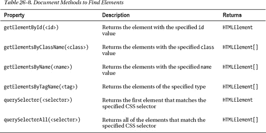

如您所料，其中一些方法会返回多个元素。我已经将这些表示为返回表中的一组`HTMLElement`对象，但严格来说这并不正确。事实上，这些方法返回一个`NodeList`，它是底层 DOM 规范的一部分，处理通用的结构化文档格式，而不仅仅是 HTML。然而，出于这些目的，您可以像对待数组一样对待它们，并将重点放在 HTML5 上。

搜索方法可以分为两类。清单 26-11 展示了这些类别中的第一个——那些名称以`getElement`开头的方法。

*清单 26-11。使用 document.getElement*方法*

`<!DOCTYPE HTML>
<html>
    <head>
        <title>Example</title>
        <meta name="author" content="Adam Freeman"/>
        <meta name="description" content="A simple example"/>
        <link rel="shortcut icon" href="favicon.ico" type="image/x-icon" />
        
    </head>
    <body>
        <pre id="results"></pre>` `        
        

            There are lots of different kinds of fruit - there are over 500 varieties
            of banana alone. By the time we add the countless types of apples, oranges,
            and other well-known fruit, we are faced with thousands of choices.
        

        
        

            One of the most interesting aspects of fruit is the variety available in
            each country. I live near London, in an area which is known for
            its apples.

        

        
        
    </body>
</html>`

这些方法正如您所期望的那样工作，并且只有一个行为需要注意。当使用`getElementById`方法时，如果没有找到具有指定的`id`值的元素，浏览器将返回`null`。相比之下，其他方法将总是返回一个`HTMLElement`对象的数组，但是`length`属性将返回`0`来表示没有匹配。

##### 使用 CSS 选择器搜索

一个有用的替代方法是使用 CSS 选择器进行搜索。选择器允许您在文档中找到更大范围的元素。我在第十七章和第十八章中描述了 CSS 选择器。清单 26-12 演示了用这种方式获取元素对象。

*清单 26-12。使用 CSS 选择器获取元素对象*

`<!DOCTYPE HTML>
<html>
    <head>
        <title>Example</title>
        <meta name="author" content="Adam Freeman"/>
        <meta name="description" content="A simple example"/>
        <link rel="shortcut icon" href="favicon.ico" type="image/x-icon" />` `        
    </head>
    <body>
        <pre id="results"></pre>
        
        

            There are lots of different kinds of fruit - there are over 500 varieties
            of banana alone. By the time we add the countless types of apples, oranges,
            and other well-known fruit, we are faced with thousands of choices.
        

        
        

            One of the most interesting aspects of fruit is the variety available in
            each country. I live near London, in an area which is known for
            its apples.

        

        
        
    </body>
</html>`

在这个例子中，我使用了一个选择器来匹配所有的`p`元素和一个`id`值为`apple`的`img`元素。使用其他文档方法很难达到同样的效果，我发现我使用选择器比使用`getElement`方法更频繁。

#### 将搜索链接在一起

一个很好的 DOM 特性是除了一个搜索方法之外，`Document`对象实现的所有搜索方法都由`HTMLElement`对象实现，允许你将搜索链接在一起。唯一的例外是`getElementById`方法，它只能通过`Document`对象使用。清单 26-13 展示了链式搜索。

*清单 26-13。将搜索链接在一起*

`<!DOCTYPE HTML>
<html>
    <head>
        <title>Example</title>
        <meta name="author" content="Adam Freeman"/>
        <meta name="description" content="A simple example"/>
        <link rel="shortcut icon" href="favicon.ico" type="image/x-icon" />
        
    </head>
    <body>
        <pre id="results"></pre>
        

            There are lots of different kinds of fruit - there are over 500 varieties
            of banana alone. By the time we add the countless
            types of apples,
            <span="orange">oranges</span="orange">, and other well-known fruit, we are
            faced with thousands of choices.
        

        
    </body>
</html>`

在这个例子中有两个链式搜索，这两个搜索都是从`getElementById`方法开始的(它给了我一个单独的对象来处理)。在第一个例子中，我使用了`getElementsByTagName`方法链接搜索，在第二个例子中，我通过`querySelectorAll`方法使用了一个非常简单的 CSS 选择器。每个例子都返回包含在`p`元素中的`span`元素的集合，该元素的`id`是`tblock`。

当然，您可以使用仅应用于`Document`对象的 CSS 选择器方法来实现相同的效果(我已经在示例的第三部分展示了这一点)，但是当您处理由脚本中的另一个函数(或第三方脚本)生成的`HTMLElement`对象时，这个特性会很方便。你可以在图 26-6 中看到搜索的结果。

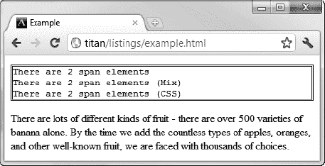

*图 26-6。将搜索链接在一起*

### 导航 DOM 树

搜索元素的另一种方法是将 DOM 视为一棵树，并浏览它的层次结构。所有 DOM 对象都支持一组属性和方法，让我们可以做到这一点；它们在表 26-9 中有描述。

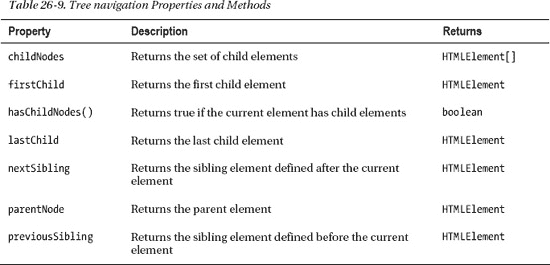

清单 26-14 展示了一个脚本，让你在文档中导航，在`pre`元素中显示当前选中元素的信息。

*清单 26-14。导航 DOM 树*

`<!DOCTYPE HTML>
<html>
    <head>
        <title>Example</title>
        <meta name="author" content="Adam Freeman"/>
        <meta name="description" content="A simple example"/>
        <link rel="shortcut icon" href="favicon.ico" type="image/x-icon" />
        
    </head>
    <body>
        <pre id="results"></pre>
        

            There are lots of different kinds of fruit - there are over 500 varieties
            of banana alone. By the time we add the countless
            types of apples,
            <span="orange">oranges</span="orange">, and other well-known fruit, we are
            faced with thousands of choices.
        

        
        
        

            One of the most interesting aspects of fruit is the variety available in
            each country. I live near London, in an area which is known for
            its apples.
        

        

            <button id="parent">Parent</button>
            <button id="child">First Child</button>
            <button id="prev">Prev Sibling</button>
            <button id="next">Next Sibling</button>
        

        
    </body>
</html>`

脚本的重要部分用粗体显示；这是进行实际导航的部分。脚本的其余部分处理设置、处理按钮点击和显示关于当前所选元素的信息。你可以在图 26-7 中看到脚本的效果。

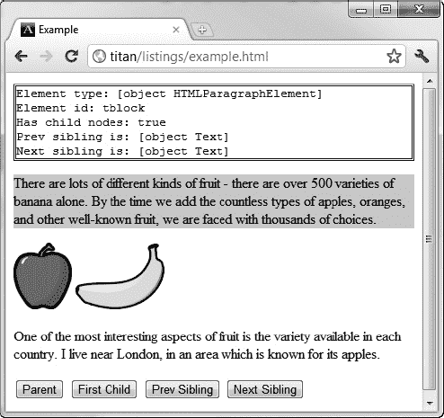

*图 26-7。导航 DOM 树*

### 总结

在这一章中，我向您介绍了`Document`对象，它是浏览器为您创建的，充当进入文档对象模型(DOM)的网关。我解释了如何获取关于文档的信息，如何查找和获取表示文档中元素的对象，以及如何将 DOM 作为树结构导航。