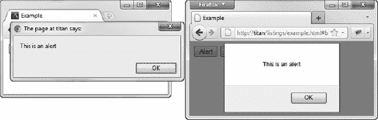

# 二十七、使用窗口对象

对象已经作为 HTML5 的一部分被添加到 HTML 规范中。在此之前，一直是非官方标准；浏览器以大体一致的方式实现了大致相同的功能。对于 HTML5，规范中的`Window`对象包含了事实上的功能和一些增强。此对象的实现是混合的；不同的浏览器有不同的合规水平。本章重点介绍具有合理支持级别的功能。

 **注意**本章描述的一些高级特性依赖于 DOM *事件*，这是第三十章的主题。如果你对事件不熟悉，你可能希望阅读那一章，然后回到这一章中的例子。

对于那些在别处没有自然归属的特性来说,`Window`对象有点像一个垃圾场。当我们浏览这个物体的特征时，你会明白我的意思。表 27-1 对本章进行了总结。

### 获取窗口对象

有两种方法可以得到一个`Window`对象。官方的 HTML5 方式是在`Document`对象上使用`defaultView`属性。另一种方法是使用所有浏览器都支持的`window`全局变量。清单 27-1 展示了这两种技术。

*清单 27-1。获取一个窗口对象*

`<!DOCTYPE HTML>
<html>
    <head>
        <title>Example</title>
    </head>
    <body id="bod">
        <table>
            <tr><th>outerWidth:</th><td id="owidth"></td></tr>
            <tr><th>outerHeight:</th><td id="oheight"></td></tr>
        </table>

        
    </body>
</html>`

在脚本中，我使用了`Window`对象来读取一对属性`outerWidth`和`outerHeight`的值，这将在下一节中解释。

### 获取窗口信息

顾名思义，`Window`对象的基本功能与当前显示文档的窗口有关。表 27-2 列出了处理这个功能的属性和方法。出于 HTML 的目的，浏览器窗口中的选项卡被视为独立的窗口。

清单 27-2 显示了如何使用这些属性来获取关于窗口的信息。

*清单 27-2。获取关于窗口*的信息

`<!DOCTYPE HTML>
<html>
    <head>
        <title>Example</title>
        
    </head>
    <body>
        <table border="1">
            <tr>
                <th>outerWidth:</th><td id="ow"></td><th>outerHeight:</th><td id="oh">
            </tr>
            <tr>
                <th>innerWidth:</th><td id="iw"></td><th>innerHeight:</th><td id="ih">
            </tr>
           <tr>
                <th>screen.width:</th><td id="sw"></td>
                <th>screen.height:</th><td id="sh">
            </tr>
        </table>

        
    </body>
</html>`

本例中的脚本在一个表格中显示了各种`Window`属性的值。注意，我使用了`screen`属性来获得一个`Screen`对象。该对象提供窗口显示的屏幕信息，并定义表 27-3 所示的属性。

你可以在图 27-1 中看到脚本的效果。

*图 27-1。显示关于窗口和屏幕的信息*

### 与窗口互动

`Window`对象提供了一组方法，通过这些方法你可以与包含你的文档的窗口进行交互。这些方法在表 27-4 中描述。

所有这些方法都应该谨慎使用，因为它们将浏览器窗口的控制权从用户手中夺走。用户对应用的行为有非常固定的期望，滚动、打印和自动关闭的窗口很大程度上不受欢迎。如果你必须使用这些方法，把控制权放在用户手中，并提供关于将要发生什么的清晰的视觉提示。

清单 27-3 显示了一些正在使用的窗口交互方法。

*清单 27-3。与窗口互动*

`<!DOCTYPE HTML>
<html>
    <head>
        <title>Example</title>
    </head>
    <body>
        

            <button id="scroll">Scroll</button>
            <button id="print">Print</button>
            <button id="close">Close</button>
        

        

            There are lots of different kinds of fruit - there are over 500 varieties
            of banana alone. By the time we add the countless types of apples, oranges,
            and other well-known fruit, we are faced with thousands of choices.
            
            One of the most interesting aspects of fruit is the variety available in
            each country. I live near London, in an area which is known for
            its apples.
            
            When traveling in Asia, I was struck by how many different
            kinds of banana were available - many of which had unique flavors and
            which were only available within a small region.

            And, of course, there are fruits which are truly unique - I am put in mind
            of the durian, which is widely consumed in SE Asia and is known as the
            "king of fruits." The durian is largely unknown in Europe and the USA - if
            it is known at all, it is for the overwhelming smell, which is compared
            to a combination of almonds, rotten onions and gym socks.
        

        
    </body>
</html>`

本例中的脚本打印、关闭和滚动窗口以响应按钮的按下。

### 提示用户

`Window`对象包含一组以不同方式提示用户的方法，如表 27-5 所述。

这些方法中的每一种都提供了不同类型的提示。清单 27-4 展示了如何使用它们。

*清单 27-4。提示用户*

`<!DOCTYPE HTML>
<html>
    <head>
        <title>Example</title>
        
    </head>
    <body>

        <button id="alert">Alert</button>
        <button id="confirm">Confirm</button>
        <button id="prompt">Prompt</button>
        <button id="modal">Modal Dialog</button>

        
    </body>
</html>`

应该谨慎使用这些功能。每个浏览器处理提示的方式不同，为用户创造了不同的体验。

作为一个例子，考虑图 27-2 ，它显示了 Chrome 和 Firefox 对警告提示采取的不同方法。提示可能看起来相似，但效果却大不相同。Chrome 从字面上理解了这个规范，并创建了一个模态对话框。这意味着在用户点击 OK 按钮并关闭提示之前，浏览器不会做任何事情。用户不能切换标签、关闭当前标签或使用浏览器做任何其他事情。Firefox 采取了更自由的观点，将提示的效果限制在当前标签页。这是一个更明智的方法，但是这是一个*不同的*方法，并且当选择在 web 应用中使用的特性时，不一致性是需要仔细考虑的事情。

*图 27-2。Chrome 和 Firefox 显示警告提示*

`showModalDialog`方法创建了一个弹出窗口——一个被广告商滥用的功能。事实上，它已经被如此滥用，以至于所有的浏览器都努力限制这个特性在用户先前已经认可的网站上使用。如果你依靠一个弹出窗口向用户显示关键信息，你就有可能根本看不到这些信息。

 **提示**如果想吸引用户的注意力，可以考虑使用 jQuery 等 JavaScript 库提供的内嵌对话框。它们使用简单，侵入性小，并且在行为和视觉上跨浏览器保持一致。关于 jQuery 的更多信息，请参见我的书 *Pro jQuery* ，由 Apress 出版。

### 获取一般信息

`Window`对象提供了对返回更多一般信息的对象的访问，包括当前位置的详细信息(加载文档的 URL)和用户的浏览历史。这些属性在表 27-6 中描述。

这个`Document`物体就是第二十六章的主题。由`Window.location`属性返回的`Location`对象与`Document.location`属性相同，我也在第二十六章中描述过。接下来我们将看看如何处理浏览器历史。

### 使用浏览器历史记录

`Window.history`属性返回一个`History`对象，您可以使用它对浏览器历史执行基本操作。表 27-7 描述了`History`对象定义的属性和方法。

#### 在浏览历史中导航

`back`、`forward`和`go`方法告诉浏览器导航到历史中的一个 URL。`back`和`forward`方法与浏览器的后退和前进按钮具有相同的效果。`go`方法导航到历史中相对于当前文档的位置。正值指定浏览器应该在历史中前进，负值指定后退。值的大小指定了多少步。例如，`-2`的值告诉浏览器导航到历史中最后一个之前的文档。清单 27-5 展示了这三种方法的使用。

*清单 27-5。在浏览器历史中导航*

`<!DOCTYPE HTML>
<html>
    <head>
        <title>Example</title>
    </head>
    <body>
        <button id="back">Back</button>
        <button id="forward">Forward</button>
        <button id="go">Go</button>

        
    </body>
</html>`

除了这些基本功能之外，HTML5 还支持在一定的限制下更改浏览器历史记录。最好从一个改变历史可以帮助解决问题的例子开始，如清单 27-6 所提供的。

*清单 27-6。处理浏览器历史记录*

`<!DOCTYPE HTML>
<html>
    <head>
        <title>Example</title>
    </head>
    <body>
        

        <button id="banana">Banana</button>
        <button id="apple">Apple</button>

        
    </body>
</html>`

此示例包含一个脚本，该脚本根据用户单击的按钮显示消息。一切都很简单。问题是当用户离开示例文档时，关于哪个按钮被单击的信息丢失了。你可以在图 27-3 中看到这个效果。

*图 27-3。常规历史序列*

事件的顺序如下:

1.  我导航到示例文档。显示`No selection made`消息。
2.  我点击`Banana`按钮。显示`Banana`消息。
3.  我导航到`[`apress.com`](http://apress.com)`。
4.  我单击 back 按钮返回到示例文档。

在这个序列的最后，我返回到示例文档，没有我先前选择的记录可用。这是浏览器的常规行为——浏览历史是使用 URL 处理的。当我单击 back 按钮时，浏览器返回到我的示例的 URL，我又从头开始了。我的会话历史如下所示:

*   `[`titan/listings/example.html`](http://titan/listings/example.html)`
*   `[`apress.com`](http://apress.com)`

#### 将条目插入历史记录

`History.pushState`方法允许您将一个 URL 添加到浏览器历史记录中，并带有一些约束。URL 必须来自与当前文档相同的服务器名称和端口。添加 URL 的一种方法是只使用附加到当前文档的查询字符串或散列片段，如清单 27-7 所示。

*清单 27-7。向浏览器历史记录添加条目*

`<!DOCTYPE HTML>
<html>
    <head>
        <title>Example</title>
    </head>
    <body>
        

        <button id="banana">Banana</button>
        <button id="apple">Apple</button>

        
    </body>
</html>`

本例中的脚本使用`pushState`方法向浏览器历史添加一个项目。它添加的 URL 是当前文档的 URL 加上一个指示用户单击了哪个按钮的查询字符串。我还添加了一些代码，使用`Location`对象(在第二十六章中描述)来读取查询字符串和选择的值。这个脚本产生了两个用户可以识别的变化。第一个发生在用户点击其中一个按钮时，如图图 27-4 所示。

*图 27-4。将项目推入浏览器历史记录的效果*

当用户点击香蕉按钮时，浏览器导航栏会显示我推入浏览历史的 URL。文档不会重新加载；只有历史记录和显示的 URL 会改变。此时，浏览器历史如下所示:

*   `[`titan/listings/example.html`](http://titan/listings/example.html)`
*   `[`titan/listings/example.html?banana`](http://titan/listings/example.html?banana)`

每次点击一个按钮，都会有一个新的 URL 被添加到历史记录中，创建用户导航路径的记录。当用户导航到别处，然后返回到文档时，这些额外条目的好处就来了，如图 27-5 所示。

*图 27-5。通过浏览器历史保存应用痕迹*

这一次，当用户单击 back 按钮时，加载我插入到历史记录中的 URL，脚本使用查询字符串保存一些简单的应用状态。这是一个简单但有用的技术。

#### 为不同的文件添加条目

向浏览器历史记录中添加项目时，不需要使用查询字符串或文档片段作为 URL。您可以指定与当前文档来源相同的任何 URL。然而，有一个奇怪的现象需要注意。清单 27-8 提供了一个演示。

*清单 27-8。在历史记录条目中使用不同的 URL*

`<!DOCTYPE HTML>
<html>
    <head>
        <title>Example</title>
    </head>
    <body>
        

        <button id="banana">Banana</button>
        <button id="apple">Apple</button>

        
    </body>
</html>`

这个脚本只有一个变化:我将`pushState`方法的 URL 参数设置为`otherpage.html`。清单 27-9 显示了`otherpage.html`的内容。

*清单 27-9。otherpage.html 的内容*

`<!DOCTYPE HTML>
<html>
    <head>
        <title>Other Page</title>
    </head>
    <body>
        <h1>Other Page</h1>
        

        
    </body>
</html>`

我仍然使用查询字符串来维护用户的选择，但是文档本身已经发生了变化。这就是奇怪的地方。图 27-6 显示了当你运行这个例子时，你会得到什么。

*图 27-6。在历史记录条目中使用不同的 URL*

如图所示，其他文档的 URL 显示在导航框中，但是文档本身没有变化。这里有一个问题:如果用户导航到另一个文档，然后单击 back 按钮，浏览器可以选择显示原始文档(本例中为`example.html`)或指定的文档(`otherpage.html`)。你无法控制哪一个将被使用。更糟糕的是，不同的浏览器有不同的操作方式。

#### 存储历史中的复杂状态

注意，当我在前几个例子中使用`pushState`方法时，我对前两个参数使用了空字符串(`""`)。所有主流浏览器都忽略了中间的论点，这里也不感兴趣。但是第一个参数可能非常有用，因为它允许您将复杂的状态对象与浏览器历史中的 URL 相关联。

在前面的例子中，我使用了查询字符串来表示用户的选择，这对于这样简单的数据来说很好，但是如果您有更复杂的数据要保存，就没什么帮助了。清单 27-10 展示了如何使用第一个`pushState`参数来存储更复杂的东西。

*清单 27-10。在浏览器历史中存储状态对象*

`<!DOCTYPE HTML>
<html>
    <head>
        <title>Example</title>
        
    </head>
    <body>
        <table border="1">
            <tr><th>Name:</th><td id="name"></td></tr>
            <tr><th>Color:</th><td id="color"></td></tr>
            <tr><th>Size:</th><td id="size"></td></tr>
            <tr><th>State:</th><td id="state"></td></tr>
            <tr><th>Event:</th><td id="event"></td></tr>
        </table>
        <button id="banana">Banana</button>
        <button id="apple">Apple</button>

        
    </body>
</html>`

在本例中，我使用一个具有三个属性的对象来表示用户的选择，这三个属性包含用户采摘的水果的名称、颜色和大小，如下所示:

`stateObj = { name: "apple", color: "red", size: "medium"}                        `

当用户做出选择时，我使用`History.pushState`方法创建一个新的历史条目，并将状态对象与它相关联，如下所示:

`window.history.pushState(stateObj, "");`

在这个例子中，我没有指定 URL，这意味着状态对象与当前文档相关联。(我这样做是为了论证可能性；我可以像前面的例子那样指定一个 URL。)

当用户返回到您的文档时，您可以使用两种方法来检索状态对象。第一种是通过`history.state`属性，就像这样:

`...
if (**window.history.state**) {
    displayState(**window.history.state**);
...`

你面临的问题是，并不是所有的浏览器都通过这个属性提供状态对象(比如 Chrome 就没有)。为了处理这个问题，您还必须监听`popstate`事件。我在第三十章中解释了事件，但是这个例子对于使用历史功能很重要，所以你可能想在阅读完那一章后再回到这一节。下面是监听和响应`popstate`事件的代码:

`window.**onpopstate** = function(e) {
    displayState(e.state);
    document.getElementById("event").innerHTML = "Yes";
}`

注意，我在一个`table`元素中显示了状态信息，以及如何获得状态对象的细节:通过属性还是事件。你可以在图 27-7 中看到这一点，但这是一个真正需要第一手实验的例子。

*图 27-7。使用浏览器历史中的状态对象*

 **注意**你必须小心不要依赖于可用的状态信息。浏览器的历史记录可能会在许多不同的情况下丢失，包括用户明确删除它。

#### 替换历史中的项目

前面的例子都集中在向当前文档之外的历史中添加条目，但是您可以使用`replaceState`方法来替换当前文档的条目。清单 27-11 提供了一个演示。

*清单 27-11。替换浏览器历史中的当前条目*

`<!DOCTYPE HTML>
<html>
    <head>
        <title>Example</title>
    </head>
    <body>
        

        <button id="banana">Banana</button>
        <button id="apple">Apple</button>

        
    </body>
</html>`

### 使用跨文档消息传递

`Window`对象是 HTML5 中另一个新特性的网关，这个新特性叫做*跨文档消息传递*。在正常情况下，来自不同来源(被称为*来源*)的脚本是不允许通信的，尽管脚本之间的通信是如此受欢迎的功能，以至于有无数的黑客和变通办法来绕过浏览器的安全措施。

 **注**这是一个使用*事件*的高级话题，在第三十章中有描述。在阅读本节之前，您可能希望先阅读那一章。

**了解剧本起源**

浏览器使用 URL 的组成部分来确定资源(如脚本)的来源。不同来源的脚本之间的交互和通信受到限制。如果协议、主机名和端口相同，那么即使 URL 的其他部分不同，两个脚本也被认为来自同一来源。下表给出了一些例子，每个例子都与 URL `[`titan.mydomain.com/example.html`](http://titan.mydomain.com/example.html)`进行了比较。

脚本可以使用`document.domain`属性来改变它们的原点，尽管只是为了扩大当前 URL 的焦点。例如，源自`[`server1.domain.com`](http://server1.domain.com)`和`[`server2.domain.com`](http://server2.domain.com)`的脚本都可以将`domain`属性设置为`domain.com`，以便具有相同的来源。

HTML5 通过表 27-8 中描述的`Window`方法提供了这种通信的规范。

为了设置这个特性的场景，清单 27-12 显示了我试图解决的问题。

*清单 27-12。跨文档问题*

`<!DOCTYPE HTML>
<html>
    <head>
        <title>Example</title>
    </head>
    <body>
        
Ready

        <button id="send">Send Message</button>
        
` `            **<iframe name="nested" src="http://titan:81/otherdomain.html" width="90%"
                    height="75px"></iframe>**
        

        
    </body>
</html>`

该文档包含一个从不同来源加载文档的`iframe`元素。只有当脚本来自相同的主机和端口时，它们才来自相同的源。我将从名为`titan`的服务器上的端口`80`加载该文档，因此端口`81`上的第二台服务器被视为不同的源。清单 27-13 显示了`otherdomain.html`文档的内容，它将由`iframe`加载。

*清单 27-13。otherdomain.html 文件*

`<!DOCTYPE HTML>
<html>
    <head>
        <title>Other Page</title>
    </head>
    <body>
        <h1 id="banner">This is the nested document</h1>
        
    </body>
</html>`

目标是让主文档`example.html`能够调用嵌入文档`otherdomain.html`的`script`元素中定义的`displayMessage`函数。

我使用了`postMessage`方法，但是我需要在包含我想要定位的文档的`Window`上调用该方法。幸运的是，`Window`对象提供了查找嵌入文档所需的支持，如表 27-9 所述。

对于这个例子，我将使用数组样式的符号来定位我想要的`Window`对象，这样我就可以调用`postMessage`方法。清单 27-14 显示了对`example.html`文档的必要补充。

*清单 27-14。定位一个窗口对象并调用 postMessage 方法*

`<!DOCTYPE HTML>
<html>
    <head>
        <title>Example</title>
    </head>
    <body>
        
Ready

        <button id="send">Send Message</button>
        

            <iframe name="nested" src="http://titan:81/otherdomain.html" width="90%"
                    height="75px"></iframe>
        

        
    </body>
</html>`

我找到包含我要向其发送消息的脚本(`window["nested"]`)的对象`Window`，然后调用`postMessage`方法。这两个参数是我想要发送的消息和目标脚本的来源，在本例中是`[`titan:81`](http://titan:81)`，但是如果您遵循本例，那么您的环境会有所不同。

 **注意**作为一种安全措施，如果用错误的目标原点调用`postMessage`方法，浏览器将丢弃消息。

为了接收消息，我需要监听另一个脚本中的`message`事件。(如前所述，我在第三十章中解释了事件，如果您不熟悉事件及其操作，您可能希望现在阅读该章。)浏览器传递一个`MessageEvent`对象，该对象定义了表 27-10 中所示的属性。

清单 27-15 展示了如何使用`message`事件接收跨文档消息。

*清单 27-15。监听消息事件*

`<!DOCTYPE HTML>
<html>
    <head>
        <title>Other Page</title>
    </head>
    <body>
        <h1 id="banner">This is the nested document</h1>
        
    </body>
</html>`

你可以在第三十章的中了解到`addEventListener`的方法。注意，当接收到消息事件时，我检查了`MessageEvent`对象的`origin`属性，以确保我识别并信任另一个脚本。这是一项重要的预防措施，可以防止来自未知和不可信脚本的消息被执行。我现在有了一个简单的机制，可以将消息从一个脚本发送到另一个脚本，即使它们有不同的来源。在图 27-8 中可以看到效果。

*图 27-8。使用跨文档信息功能*

### 使用计时器

由`Window`对象提供的一个有用的特性是设置一次性和循环定时器的能力。这些定时器用于在预设时间后执行一项功能。表 27-11 总结了支持该特性的方法。

`setTimeout`方法创建一个只执行一次指定函数的定时器，而`setInterval`方法创建一个重复执行函数的定时器。这些方法返回一个惟一的标识符，这个标识符以后可以用作`clearTimeout`和`clearInterval`方法的参数来取消计时器。清单 27-16 展示了定时器方法的使用。

*清单 27-16。使用计时方法*

`<!DOCTYPE HTML>
<html>
    <head>
        <title>Example</title>
    </head>` `    <body>
        

        

            <button id="settime">Set Time</button>
            <button id="cleartime">Clear Time</button>
            <button id="setinterval">Set Interval</button>
            <button id="clearinterval">Clear Interval</button>
        

        
    </body>
</html>`

本例中的脚本设置和取消调用`displayMsg`函数来设置`p`元素内容的计时器和时间间隔。你可以在图 27-9 中看到效果。

*图 27-9。使用计时器和时间间隔*

计时器和时间间隔可能很有用，但是您应该仔细考虑它们的使用。用户希望应用的状态保持一致，除非他们直接与之交互。如果您发现自己使用计时器来自动改变应用的状态，那么您可能希望考虑这样做的结果是对用户有帮助，还是仅仅是令人讨厌。

### 总结

在这一章中，我已经展示了通过`Window`对象组合在一起的奇怪的功能集合。有些特性与窗口直接相关，比如获取浏览器窗口的内部和外部大小以及显示窗口的屏幕。其他功能没有那么直接的关系。其中包括历史和跨文档消息传递功能，这是 HTML5 的重要功能。