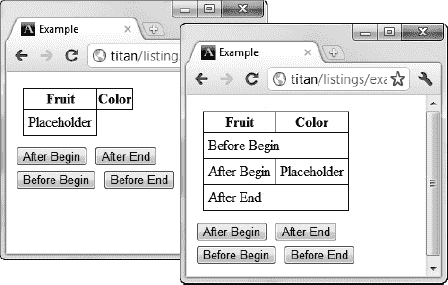

# 二十八、使用 DOM 元素

在前一章中，`HTMLElement`对象的一些特性泄露到了对文档级特性的讨论中。现在，我们可以将注意力转向元素对象本身，并给予它应有的关注。在这一章中，我将向您展示不同的`HTMLElement`属性和方法，并演示如何使用它们。表 28-1 对本章进行了总结。请注意，并不是所有的例子都适用于所有的主流浏览器。

### 使用元素对象

对象提供了一组属性，您可以使用这些属性来读取和修改关于所表示的元素的数据。表 28-2 描述了这些属性。

清单 28-1 显示了表中列出的一些基本属性的用法。

*清单 28-1。使用基本元素数据属性*

`<!DOCTYPE HTML>
<html>
    <head>
        <title>Example</title>
        <meta name="author" content="Adam Freeman"/>
        <meta name="description" content="A simple example"/>
        <link rel="shortcut icon" href="favicon.ico" type="image/x-icon" />
        
    </head>
    <body>

        

            There are lots of differentß kinds of fruit - there are over 500 varieties
            of banana alone. By the time we add the countless
            types of apples,
            <span="orange">oranges, and other well-known fruit, we are
            faced with thousands of choices.
        

        <pre id="results"></pre>
        
    </body>
</html>`

你可以在图 28-1 中看到浏览器为这些属性提供的结果。

*图 28-1。获取一个元素的信息*

#### 使用类

有两种方法可以处理一个元素所属的类。第一种是使用`className`属性，它返回一个类列表。您可以通过更改字符串的值来添加或移除类。在清单 28-2 中，你可以看到以这种方式读取和修改类。

 **提示**类的一个常见用途是用样式指向元素。你将在第二十九章中学习如何处理 DOM 中的样式。

*清单 28-2。使用类名属性*

`<!DOCTYPE HTML>
<html>
    <head>
        <title>Example</title>
        <meta name="author" content="Adam Freeman"/>
        <meta name="description" content="A simple example"/>
        <link rel="shortcut icon" href="favicon.ico" type="image/x-icon" />
        
    </head>
    <body>
        

            There are lots of different kinds of fruit - there are over 500 varieties
            of banana alone. By the time we add the countless types of apples, oranges,
            and other well-known fruit, we are faced with thousands of choices.
        

        <button id="pressme">Press Me</button>
        
    </body>
</html>`

在本例中，单击按钮会触发脚本，该脚本会向元素列表追加一个新类。请注意，我需要给附加到`className`属性值的值添加一个前导空格。这是因为浏览器需要一个类列表，每个类之间用空格隔开。当我做出这样的改变时，浏览器将应用选择器基于类的样式，这意味着在这个例子中有一个清晰的视觉变化，如图 28-2 所示。

*图 28-2。使用类名属性*

当您想要快速地向一个元素添加类时,`className`属性很容易使用，但是如果您想要做其他事情，比如删除一个类，它就变得很困难。幸运的是，您可以使用`classList`属性，它返回一个`DOMTokenList`对象。该对象定义了一些有用的方法和属性，允许你管理类列表，如表 28-3 所述。

除了这些属性和方法之外，您还可以使用数组样式的表示法通过索引来检索类。清单 28-3 中的显示了`DOMTokenList`对象的用法。

*清单 28-3。使用 classList 属性*

`<!DOCTYPE HTML>
<html>
    <head>
        <title>Example</title>
        <meta name="author" content="Adam Freeman"/>
        <meta name="description" content="A simple example"/>
        <link rel="shortcut icon" href="favicon.ico" type="image/x-icon" />
        
    </head>
    <body>
        

            There are lots of different kinds of fruit - there are over 500 varieties
            of banana alone. By the time we add the countless types of apples, oranges,
            and other well-known fruit, we are faced with thousands of choices.
        

        <pre id="results"></pre>
        <button id="toggle">Toggle Class</button>
        
    </body>
</html>`

在这个例子中，`listClasses`函数使用`classList`属性获取并枚举`p`元素所属的类，使用数组风格的索引器检索类名。

单击按钮时调用的`toggleClass`函数使用`toggle`方法来添加和删除一个名为`newclass`的类。这个类关联了一个样式，你可以在图 28-3 中看到这个类变化的视觉效果。

*图 28-3。枚举和切换一个类*

#### 使用元素属性

有一些最重要的全局属性，但也支持读取和设置元素的任何属性。表 28-4 描述了由`HTMLElement`对象为此定义的可用方法和属性。

处理属性的四种方法都很容易使用，并且正如您所期望的那样。清单 28-4 展示了这些方法的使用。

*清单 28-4。使用属性方法*

`<!DOCTYPE HTML>
<html>
    <head>
        <title>Example</title>
        <meta name="author" content="Adam Freeman"/>
        <meta name="description" content="A simple example"/>
        <link rel="shortcut icon" href="favicon.ico" type="image/x-icon" />
        
    </head>
    <body>
        

            There are lots of different kinds of fruit - there are over 500 varieties
            of banana alone. By the time we add the countless types of apples, oranges,
            and other well-known fruit, we are faced with thousands of choices.
        

        <pre id="results"></pre>
        ` `    </body>
</html>`

在这个例子中，我检查、添加和更改了`lang`属性的值。你可以在图 28-4 中看到这个脚本产生的结果。

*图 28-4。使用属性方法*

##### 使用数据-*属性

在第三章的中，我描述了 HTML5 如何支持以`data-`为前缀的自定义属性，比如`data-mycustomattribute`。您可以通过`dataset`属性在 DOM 中处理这些自定义属性，该属性返回一个值数组，由名称的自定义部分进行索引。清单 28-5 包含了一个例子。

*清单 28-5。使用数据集属性*

`<!DOCTYPE HTML>
<html>
    <head>
        <title>Example</title>
        <meta name="author" content="Adam Freeman"/>
        <meta name="description" content="A simple example"/>
        <link rel="shortcut icon" href="favicon.ico" type="image/x-icon" />
        
    </head>
    <body>
        

            There are lots of different kinds of fruit - there are over 500 varieties
            of banana alone. By the time we add the countless types of apples, oranges,
            and other well-known fruit, we are faced with thousands of choices.
        
` `        <pre id="results"></pre>
        
    </body>
</html>`

属性返回的值数组不像常规数组那样按位置索引。如果想枚举`data-*`属性，可以使用一个`for…in`语句，如清单所示。或者，您可以通过名称请求值。注意，您只需要提供属性名的自定义部分。例如，如果您想要`data-fruit`属性的值，您可以请求`value dataset[“fruit”]`。你可以在图 28-5 中看到这个脚本的效果。

*图 28-5。使用数据集属性*

##### 使用所有属性

您可以通过`attributes`属性获得包含元素所有属性的集合，该属性返回一个由`Attr`对象组成的数组。`Attr`对象的属性在表 28-5 中描述。

清单 28-6 展示了如何使用`attributes`属性和`Attr`对象来读取和修改元素的属性。

*清单 28-6。使用属性特性*

`<!DOCTYPE HTML>
<html>
    <head>
        <title>Example</title>
        <meta name="author" content="Adam Freeman"/>
        <meta name="description" content="A simple example"/>
        <link rel="shortcut icon" href="favicon.ico" type="image/x-icon" />
        
    </head>
    <body>
        

            There are lots of different kinds of fruit - there are over 500 varieties
            of banana alone. By the time we add the countless types of apples, oranges,
            and other well-known fruit, we are faced with thousands of choices.
        

        <pre id="results"></pre>
        
    </body>
</html>`

从清单中可以看出，`Attr`对象数组中的属性是按照位置和名称进行索引的。在这个例子中，我列举了应用于元素的属性的名称和值，然后修改其中一个属性的值。你可以在图 28-6 中看到这个脚本的效果。

*图 28-6。使用属性属性*

### 使用文本

元素的文本内容由一个`Text`对象表示，它在文档模型中作为元素的子元素出现。清单 28-7 显示了一个带有一些文本内容的元素。

*清单 28-7。具有文本内容的元素*

`...

    There are lots of different kinds of fruit - there are over 500 varieties
    of banana alone. By the time we add the countless types of apples, oranges,
    and other well-known fruit, we are faced with thousands of choices.

...`

当浏览器表示文档模型中的`p`元素时，元素本身会有一个`HTMLElement`对象，内容会有一个`Text`对象，如图图 28-7 所示。

*图 28-7。代表元素的对象与其内容之间的关系*

如果一个元素有子元素，并且它们包含文本，那么每个子元素都将以相同的方式处理。清单 28-8 给段落添加了一个元素。

*清单 28-8。在段落中增加一项内容*

`...

    There are lots of different kinds of fruit - there are over **<b>500</b>** varieties
    of banana alone. By the time we add the countless types of apples, oranges,
    and other well-known fruit, we are faced with thousands of choices.

...`

添加`b`元素改变了用于表示`p`元素及其内容的节点层次，如图图 28-8 所示。

*图 28-8。向段落*添加元素的效果

`p`元素的第一个子元素是一个`Text`对象，表示从块的开始到`b`元素的文本。然后是`b`元素，它有自己的子`Text`对象，代表包含在开始和结束标签之间的文本。最后，`p`元素的最后一个子元素是一个`Text`对象，表示跟随`b`元素直到块尾的文本。表 28-6 描述了`Text`对象支持的成员。

不幸的是，没有方便的方法来定位`Text`元素，除了通过找到它们的父元素对象并浏览它们的子元素。这使得使用`Text`元素变得更加困难。清单 28-9 展示了一些正在使用的`Text`元素的方法和属性。

*清单 28-9。处理文本*

`<!DOCTYPE HTML>
<html>
    <head>
        <title>Example</title>
        <meta name="author" content="Adam Freeman"/>
        <meta name="description" content="A simple example"/>
        <link rel="shortcut icon" href="favicon.ico" type="image/x-icon" />
        
    </head>
    <body>
        

            There are lots of different kinds of fruit - there are over <b>500</b>
            varieties of banana alone. By the time we add the countless types of apples,
            oranges, and other well-known fruit, we are faced with thousands of choices.
        

        <button id="pressme">Press Me</button>
        <pre id="results"></pre>
        
    </body>
</html>`

当按下`button`元素时，我显示`p`元素的第一个`Text`子元素中的字符数，并使用`replaceWholeText`方法更改其内容。

 **注意**处理文本时需要注意的重要一点是，空白是不会折叠的。这意味着任何用于向 HTML 添加结构的空格或其他空白字符都被视为文本的一部分。

### 修改模型

在前面的小节中，我已经向您展示了如何使用 DOM 来修改单个元素。例如，您可以更改属性和文本内容。您可以这样做，因为在 DOM 和文档本身之间有一个活动的链接。一旦对 DOM 进行了更改，浏览器就会在文档中进行相应的更改。您可以使用此链接进一步更改文档本身的结构。您可以随意添加、移除、复制和拷贝元素。这可以通过改变 DOM 层次结构来实现，因为链接是活动的，所以对层次结构所做的更改会立即反映在浏览器中。表 28-7 描述了可用于改变 DOM 层次结构的属性和方法。

这些属性和方法在所有元素对象上都可用。此外，`document`对象定义了两个允许您创建新元素的方法。当您想要向文档中添加内容时，这是非常重要的。这些创建方法在表 28-8 中描述。

#### 创建和删除元素

您通过`document`对象创建新元素，然后通过找到现有的`HTMLElement`并使用前面描述的方法之一插入它们。清单 28-10 提供了一个演示。

*清单 28-10。创建和删除元素*

`<!DOCTYPE HTML>
<html>
    <head>
        <title>Example</title>
        <meta name="author" content="Adam Freeman"/>
        <meta name="description" content="A simple example"/>
        <link rel="shortcut icon" href="favicon.ico" type="image/x-icon" />
        
    </head>
    <body>
        <table border="1">
            <thead><th>Name</th><th>Color</th></thead>
            <tbody id="fruitsBody">
                <tr><td>Banana</td><td>Yellow</td></tr>
                <tr><td>Apple</td><td>Red/Green</td></tr>
            </tbody>
        </table>

        <button id="add">Add Element</button>
        <button id="remove">Remove Element</button>

        
    </body>
</html>`

本例中的脚本使用 DOM 在 HTML `table`中添加和删除行(在第十一章中有描述)。当添加行时，我首先创建一个`tr`元素，然后用它作为`td`和`Text`对象的父元素。注意我是如何使用方法结果将调用链接在一起并(稍微)简化代码的。

如您所见，创建元素的过程很费力。您需要创建元素，将其与其父元素相关联，并对任何子元素或文本内容重复该过程。移除元素的过程也很笨拙。您必须找到元素，导航到父元素，然后使用`removeChild`方法。你可以在图 28-9 中看到这个脚本的效果。

*图 28-9。使用 DOM 创建和删除元素*

#### 复制元素

您可以使用`cloneNode`方法来复制现有的元素。这是一种避免从头开始创建所需元素的便捷方法。清单 28-11 展示了这种技术。

*清单 28-11。复制元素*

`<!DOCTYPE HTML>
<html>
    <head>
        <title>Example</title>
        <meta name="author" content="Adam Freeman"/>
        <meta name="description" content="A simple example"/>
        <link rel="shortcut icon" href="favicon.ico" type="image/x-icon" />
        
    </head>
    <body>
        <table border="1">
            <thead><tr><th>Multiply</th><th>Result</th></tr></thead>
            <tbody id="fruitsBody">
                <tr><td class="sum">1 x 1</td><td class="result">1</td></tr>
            </tbody>
        </table>

        <button id="add">Add Row</button>` `        
    </body>
</html>`

在这个例子中，我复制了表中的一个现有行来创建更多的行。方法的布尔参数指定了元素的子元素是否也应该被复制。在本例中，我指定了`true`，因为我希望包含在`tr`元素中的`td`元素构成我的新行的结构。

 **提示**注意这个例子中我需要为表格单元格设置文本的笨拙方式。处理对象真的是一件痛苦的事。关于更简单的方法，请参阅本章后面的“使用 HTML 片段”一节。

#### 移动元素

当将元素从文档的一个部分移动到另一个部分时，只需将想要移动的元素与其新的父元素相关联。你不需要把元素从它的起始位置移开。清单 28-12 通过将一行从一个表格移动到另一个表格提供了一个演示。

*清单 28-12。移动元件*

`<!DOCTYPE HTML>
<html>
    <head>
        <title>Example</title>
        <meta name="author" content="Adam Freeman"/>
        <meta name="description" content="A simple example"/>
        <link rel="shortcut icon" href="favicon.ico" type="image/x-icon" />
        
    </head>
    <body>
        <table border="1">
            <thead><tr><th>Fruit</th><th>Color</th></tr></thead>
            <tbody>
                <tr><td>Banana</td><td>Yellow</td></tr>
                **<tr id="apple"><td>Apple</td><td>Red/Green</td></tr>**
            </tbody>
        </table>

        <table border="1">
            <thead><tr><th>Fruit</th><th>Color</th></tr></thead>
            <tbody id="fruitsBody">
                <tr><td>Plum</td><td>Purple</td></tr>
            </tbody>
        </table>

        

            <button id="move">Move Row</button>
        

        
    </body>
</html>`

当`button`元素被按下时，脚本用`apple`的`id`移动`tr`元素，用`fruitsBody`的`id`调用`tbody`元素上的`appendChild`元素。这具有将行从一个表格移动到另一个表格的效果，如图图 28-10 所示。

*图 28-10。将元素从文档的一部分移动到另一部分*

#### 比较元素对象

可以用两种方式比较元素对象。第一个简单的方法是查看它们是否表示同一个元素，这可以使用`isSameNode`方法来完成。这允许你比较从不同查询中获得的对象，如清单 28-13 所示。

*清单 28-13。比较元素对象*

`<!DOCTYPE HTML>
<html>
    <head>
        <title>Example</title>
        <meta name="author" content="Adam Freeman"/>
        <meta name="description" content="A simple example"/>
        <link rel="shortcut icon" href="favicon.ico" type="image/x-icon" />
        
    </head>
    <body>
        <table border="1">
            <thead><tr><th>Fruit</th><th>Color</th></tr></thead>
            <tbody id="fruitsBody">
                <tr id="plumrow"><td>Plum</td><td>Purple</td></tr>
            </tbody>
        </table>
        <pre id="results"></pre>` `        
    </body>
</html>`

本例中的脚本使用两种不同的技术来定位元素对象:通过搜索特定的`id`和根据父元素的标记类型进行搜索。当比较这些对象时，`isSameNode`方法返回 true，因为它们表示相同的元素。

另一种方法是测试元素对象是否相等，这可以通过使用`isEqualNode`方法来实现。如果元素属于相同的类型，具有相同的属性值，并且它们的每个子元素也是相同的并且顺序相同，那么它们就是相等的。清单 28-14 展示了一对相等的元素。

*清单 28-14。使用相同的元素*

`<!DOCTYPE HTML>
<html>
    <head>
        <title>Example</title>
        <meta name="author" content="Adam Freeman"/>
        <meta name="description" content="A simple example"/>
        <link rel="shortcut icon" href="favicon.ico" type="image/x-icon" />
        
    </head>
    <body>
        <table border="1">
            <thead><tr><th>Fruit</th><th>Color</th></tr></thead>
            <tbody>
                **<tr class="plumrow"><td>Plum</td><td>Purple</td></tr>**
            </tbody>
        </table>

        <table border="1">
            <thead><tr><th>Fruit</th><th>Color</th></tr></thead>
            <tbody>
                **<tr class="plumrow"><td>Plum</td><td>Purple</td></tr>**` `            </tbody>
        </table>

        <pre id="results"></pre>
        
    </body>
</html>`

在这个例子中，两个`tr`元素是相等的，即使它们是文档不同部分中的不同元素。如果我改变了子元素`td`的任何属性或内容，那么这些元素将不再相等。

#### 使用 HTML 片段

`innerHTML`和`outerHTML`属性以及`insertAdjacentHTML`方法是方便的语法快捷方式，允许您处理 HTML 片段，从而避免了创建复杂的元素和文本对象层次结构的需要。清单 28-15 演示了如何使用`innerHTML`和`outerHTML`属性从元素中获取 HTML。

*清单 28-15。使用 innerHTML 和 outerHTML 属性*

`<!DOCTYPE HTML>
<html>
    <head>
        <title>Example</title>
        <meta name="author" content="Adam Freeman"/>
        <meta name="description" content="A simple example"/>
        <link rel="shortcut icon" href="favicon.ico" type="image/x-icon" />
        
    </head>
    <body>
        <table border="1">
            <thead><tr><th>Fruit</th><th>Color</th></tr></thead>
            <tbody>` `                **<tr id="applerow"><td>Plum</td><td>Purple</td></tr>**
            </tbody>
        </table>
        <textarea  rows="3" id="results"></textarea>
        

            <button id="inner">Inner HTML</button>
            <button id="outer">Outer HTML</button>
        

        
    </body>
</html>`

属性返回一个字符串，该字符串包含定义元素的 HTML 及其所有子元素的 HTML。属性只返回孩子的 HTML。在这个例子中，我定义了一对按钮，显示表格行的内部和外部 HTML。我将内容显示在一个`textarea`元素中，以便浏览器将这些属性返回的字符串视为文本，而不是 HTML。你可以在图 28-11 中看到脚本的效果。

*图 28-11。显示表格行*的 outerHTML 属性

##### 更改文档结构

您也可以使用`outerHTML`和`innerHTML`属性来改变文档的结构。我在本书这一部分的许多例子中使用了`innerHTML`属性，作为设置元素内容的一种便捷方式，因为我可以使用该属性来设置文本内容，而无需创建`Text`元素。清单 28-16 展示了如何使用这些属性来修改文档模型。

*清单 28-16。修改文档模型*

`<!DOCTYPE HTML>
<html>
    <head>
        <title>Example</title>
        <meta name="author" content="Adam Freeman"/>
        <meta name="description" content="A simple example"/>
        <link rel="shortcut icon" href="favicon.ico" type="image/x-icon" />
        
    </head>
    <body>
        <table border="1">
            <thead><tr><th>Fruit</th><th>Color</th></tr></thead>
            <tbody>
                <tr><td>Banana</td><td>Yellow</td></tr>
                <tr id="apple"><td>Apple</td><td>Red/Green</td></tr>
            </tbody>
        </table>

        <table border="1">
            <thead><tr><th>Fruit</th><th>Color</th></tr></thead>
            <tbody id="fruitsBody">
                <tr><td>Plum</td><td>Purple</td></tr>
                <tr id="targetrow"><td colspan="2">This is the placeholder</td></tr>
            </tbody>
        </table>

        

            <button id="move">Move Row</button>
        

        
    </body>
</html>`

在这个例子中，我使用了`innerHTML`属性来设置表格行的子元素，使用`outerHTML`来替换内联元素。这些属性作用于字符串，这意味着您可以通过读取属性值或从头开始创建字符串来获得 HTML 片段，如清单所示。你可以在图 28-12 的中看到效果。

*图 28-12。使用 innerHTML 和 outerHTML 属性*

##### 插入 HTML 片段

`innerHTML`和`outerHTML`属性对于替换现有元素很有用，但是如果你想使用一个 HTML 片段来插入新元素，你必须使用`insertAdjacentHTML`方法。这个方法有两个参数。第一个是来自表 28-9 的值，指示片段相对于当前元素应该插入的位置，第二个是要插入的片段。

清单 28-17 展示了使用`insertAdjacentHTML`方法在表格行元素中插入 HTML 片段。

*清单 28-17。使用 insertAdjacentHTML 方法*

`<!DOCTYPE HTML>
<html>
    <head>
        <title>Example</title>
        <meta name="author" content="Adam Freeman"/>
        <meta name="description" content="A simple example"/>
        <link rel="shortcut icon" href="favicon.ico" type="image/x-icon" />
    </head>
    <body>
        <table border="1">
            <thead><tr><th>Fruit</th><th>Color</th></tr></thead>
            <tbody id="fruitsBody">
                <tr id="targetrow"><td>Placeholder</td></tr>
            </tbody>
        </table>

        

            <button id="ab">After Begin</button>
            <button id="ae">After End</button>
            <button id="bb">Before Begin</button>
            <button id="be">Before End</button>
        

        
    </body>
</html>`

在这个例子中，我使用不同的位置值来演示如何在不同的位置插入 HTML 片段。这个例子最好在浏览器中实验，但是你可以在图 28-13 中看到基本效果。

*图 28-13。将 HTML 片段插入文档*

#### 将元素插入文本块

修改模型的一个重要变化是向文本块添加一个元素，由一个`Text`对象表示。清单 28-18 展示了这是如何做到的。

*清单 28-18。将元素插入文本块*

`<!DOCTYPE HTML>
<html>
    <head>
        <title>Example</title>
        <meta name="author" content="Adam Freeman"/>
        <meta name="description" content="A simple example"/>
        <link rel="shortcut icon" href="favicon.ico" type="image/x-icon" />
    </head>
    <body>
        
There are lots of different kinds of fruit - there are over
            500 varieties of banana alone. By the time we add the countless types of
            apples, oranges, and other well-known fruit, we are faced with thousands of
            choices.
        

        

            <button id="insert">Insert Element</button>
        

        
    </body>
</html>`

在这个例子中，我完成了一个稍微困难的任务，从现有的文本中取出一个单词，并使它成为一个新的`b`元素的子元素。与前面的例子一样，处理模型意味着一些冗长的代码。图 28-14 显示了结果。

*图 28-14。将元素插入文本块*

### 总结

本章介绍了`HTMLElement`和`Text`对象的功能，它们分别代表 HTML 文档中的元素和内容。您了解了如何从对象中获取元素信息；如何处理文本内容；以及如何使用 DOM 的功能来添加、修改、复制、移动和删除元素。使用 DOM 可能需要冗长的脚本，但是对象模型和向用户显示文档的方式之间的实时链接使得这种努力是值得的。