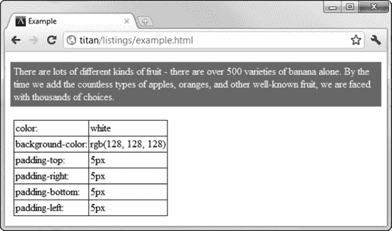

# 二十九、样式化 DOM 元素

正如您在《??》第四章中回忆的那样，您可以间接(通过样式表或`style`元素)或直接(通过`style`属性)将样式应用于元素。在这一章中，我将展示如何使用 DOM 来处理文档中的 CSS 样式——既有明确定义的样式，也有浏览器用来实际显示元素的*计算样式*。在 DOM 中使用 CSS 的规范包含一些深层次的对象类型，其中许多不是由浏览器实现的。我简化了这一章中的对象，把重点放在浏览器使用的对象上。表 29-1 提供了本章的总结。请注意，并不是所有的例子都适用于所有的主流浏览器。

### 使用样式表

您可以使用`document.styleSheets`属性访问文档中可用的 CSS 样式表，该属性返回表示与文档相关联的样式表的对象集合。表 29-2 总结了`document.styleSheets`属性。

每个样式表由一个`CSSStyleSheet`对象表示，该对象提供了一组属性和方法来操作文档中的样式。表 29-3 总结了`CSSStyleSheet`成员。

#### 获取关于样式表的基本信息

首先要获得关于文档中定义的样式表的一些基本信息。清单 29-1 给出了一个演示。

*清单 29-1。获取文档中样式表的基本信息*

`<!DOCTYPE HTML>
<html>
    <head>
        <title>Example</title>
        <meta name="author" content="Adam Freeman"/>
        <meta name="description" content="A simple example"/>
        <link rel="shortcut icon" href="favicon.ico" type="image/x-icon" />
        ****
        **<link rel="stylesheet" type="text/css" href="styles.css"/>**
        ****
    </head>
    <body>
        
There are lots of different kinds of fruit - there are over
            500 varieties of banana alone. By the time we add the countless types of
            apples, oranges, and other well-known fruit, we are faced with thousands of
            choices.
        

        

            One of the most interesting aspects of fruit is the variety available in
            each country. I live near London, in an area which is known for
            its apples.
        

        

        ****
    </body>
</html>`

本例中的脚本列举了文档中定义的样式表，并创建了一个包含每个样式表的基本信息的`table`元素。在这个文档中，有三个样式表。两个使用`script`元素定义，另一个包含在名为`styles.css`的外部文件中，并使用`link`元素导入到文档中。您可以在图 29-1 中看到脚本的输出。

*图 29-1。获取关于文档*中样式表的信息

注意，不是所有的属性都有值。例如，只有当样式表作为外部文件加载时，`href`属性才会返回值。

#### 使用媒体约束

正如我在第七章中所演示的，在定义样式表时，可以使用`media`属性来限制应用样式的环境。您可以通过`CSSStyleSheet.media`属性访问这些约束，该属性返回一个`MediaList`对象。`MediaList`对象的方法和属性在表 29-4 中描述。

清单 29-2 展示了`MediaList`对象的使用。

*清单 29-2。使用媒体列表对象*

`<!DOCTYPE HTML>
<html>
    <head>
        <title>Example</title>
        <meta name="author" content="Adam Freeman"/>
        <meta name="description" content="A simple example"/>
        <link rel="shortcut icon" href="favicon.ico" type="image/x-icon" />
        
        <link rel="stylesheet" type="text/css" href="styles.css"/>
        
    </head>
    <body>
        
There are lots of different kinds of fruit - there are over
            500 varieties of banana alone. By the time we add the countless types of
            apples, oranges, and other well-known fruit, we are faced with thousands of
            choices.
        

        

            One of the most interesting aspects of fruit is the variety available in
            each country. I live near London, in an area which is known for
            its apples.
        

        

        
    </body>
</html>`

在这个例子中，我为任何具有`media`属性的样式表创建了一个表，枚举了单个媒体、属性值中媒体的总数以及整个`media`字符串。你可以在图 29-2 中看到脚本的效果。

*图 29-2。使用媒体列表对象*

#### 禁用样式表

`CSSStyleSheet.disabled`属性允许您在一个步骤中启用和禁用样式表中的所有样式。清单 29-3 展示了如何使用这个属性来打开和关闭样式表。

*清单 29-3。启用和禁用样式表*

`<!DOCTYPE HTML>
<html>
    <head>
        <title>Example</title>
        <meta name="author" content="Adam Freeman"/>
        <meta name="description" content="A simple example"/>
        <link rel="shortcut icon" href="favicon.ico" type="image/x-icon" />
        
    </head>
    <body>
        
There are lots of different kinds of fruit - there are over
            500 varieties of banana alone. By the time we add the countless types of` `            apples, oranges, and other well-known fruit, we are faced with thousands of
            choices.
        

        
<button id="pressme">Press Me </button>
        
        
    </body>
</html>`

在本例中，单击按钮切换(唯一的)样式表上 disabled 属性的值。当一个样式表被禁用时，样式表中的任何样式都不会应用于元素，正如你在图 29-3 中看到的。

*图 29-3。禁用和启用样式表*

#### 使用个人风格

`CSSStyleSheet.cssRules`属性返回一个`CSSRuleList`对象，该对象提供对样式表中各个样式的访问。在表 29-5 中描述了该对象的成员。

样式表中的每个 CSS 样式都由一个`CSSStyleRule`对象表示(如果愿意，可以忽略术语上的不一致)。`CSSStyleRule`的成员见表 29-6 。

清单 29-4 显示了`CSSRuleList`对象的用法和`CSSStyleRule`对象的基本属性。我之所以说基本，是因为`style`属性返回了一个`CSSStyleDeclaration`属性，这个属性让你可以更深入地研究一个样式，这个对象就是你在将样式应用到单个元素时使用的对象。您可以在本章后面的“使用 CSSStyleDeclaration 对象”一节中了解更多关于`CSSStyleDeclaration`对象的信息。

*清单 29-4。使用 CSSRuleList 和 CSSStyleRule 对象*

`<!DOCTYPE HTML>
<html>
    <head>
        <title>Example</title>
        <meta name="author" content="Adam Freeman"/>
        <meta name="description" content="A simple example"/>
        <link rel="shortcut icon" href="favicon.ico" type="image/x-icon" />
        
    </head>
    <body>
        
There are lots of different kinds of fruit - there are over
            500 varieties of banana alone. By the time we add the countless types of
            apples, oranges, and other well-known fruit, we are faced with thousands of
            choices.
        

        

            One of the most interesting aspects of fruit is the variety available in
            each country. I live near London, in an area which is known for
            its apples.
        

        
<button id="pressme">Press Me </button>
` `        

        
    </body>
</html>`

这个例子对这些对象做了两件事。第一个是简单地获取关于已定义样式的信息，报告父样式表、选择器和样式中包含的各个声明。你可以在图 29-4 中看到这一点。

*图 29-4。获取关于风格的信息*

 **提示**注意我在样式声明中使用的速记属性是如何被浏览器扩展为它们的组成属性的。不是所有的浏览器都这样做。有些会显示速记属性，如果它们被使用过的话(例如，Firefox 显示速记属性；如图所示，Chrome 没有)。如果您试图将 CSS 解析为字符串，那么您需要考虑这一点。虽然，一般来说，像这样直接处理 CSS 值不是一个好主意。有关更好的方法，请参阅本章后面关于`CSSStyleDeclaration`对象的部分(“使用 CSSStyleDeclaration 对象”)。

该脚本还演示了更改样式是多么容易。当点击`button`时，其中一个样式的选择器从`#block1`变为`#block2`，这具有改变样式应用于哪个`p`元素的效果。正如对 DOM 的其他改变一样，浏览器会立即反映新的选择器，并更新样式的应用方式，如图图 29-5 所示。

*图 29-5。改变风格选择器*

### 使用元素样式

为了获得元素的样式属性中定义的属性，你要读取由`HTMLElement`对象定义的`style`属性的值(你可以在第二十八章中了解更多关于`HTMLElement`对象的信息)。style 属性返回一个`CSSStyleDeclaration`对象，它是可以通过样式表获得的同类对象。我将在下一节详细描述这个对象。为了演示`HTMLElement.style`属性，我使用了清单 29-5 中的`CSSStyleDeclaration.cssText`属性来显示和修改应用于一个元素的样式属性。

*清单 29-5。从 HTMLElement 中获取 CSSStyleDeclaration 对象*

`<!DOCTYPE HTML>
<html>
    <head>
        <title>Example</title>
        <meta name="author" content="Adam Freeman"/>
        <meta name="description" content="A simple example"/>
        <link rel="shortcut icon" href="favicon.ico" type="image/x-icon" />
    </head>
    <body>
        

            There are lots of different kinds of fruit - there are over
            500 varieties of banana alone. By the time we add the countless types of
            apples, oranges, and other well-known fruit, we are faced with thousands of
            choices.
        

        
<button id="pressme">Press Me </button>
` `        

        
    </body>
</html>`

这个脚本显示一个元素的`style`属性的值，当点击`button`时，改变这个值以应用不同的样式。你可以在图 29-6 中看到效果。

*图 29-6。读取和改变应用于元素的样式*

我在这个图中使用了 Firefox，因为它在`cssText`值中显示了简写的属性名。

 **提示**在关于样式表的章节中，我解释过试图解析`cssText`属性的值并不是一个好主意。这同样适用于处理单个元素。请参阅下面关于`CSSStyleDeclaration`对象的部分，以获得一种更健壮的方法来深入研究 CSS 属性值的细节。

### 使用 CSSStyleDeclaration 对象

无论您处理的是样式表还是元素的`style`属性，都没有关系。为了通过 DOM 完全控制 CSS，必须使用`CSSStyleDeclaration`对象。表 29-7 描述了这个重要对象的成员。

除了`item`方法，大多数浏览器都支持数组样式的符号，所以`item(4)`和`item[4]`是等价的。

#### 使用便利属性

使用`CSSStyleDeclaration`对象最简单的方法是通过便利属性，这些属性对应于单独的 CSS 属性。您可以通过读取相应的 object 属性来确定 CSS 属性的当前值，并通过为 object 属性分配新值来更改 CSS 值。

 **提示**本节我读取和修改的值是*配置的* *值*。您可以有效地读取和修改 HTML 文档中定义的值，无论是在样式表中还是直接应用于元素。当浏览器开始显示一个元素时，它将生成一组*计算值*，其中允许浏览器样式、样式表和样式属性级联，并使用我在第四章中描述的模型进行继承。有关如何获取元素的计算 CSS 值的详细信息，请参见“使用计算样式”一节。

清单 29-6 提供了一个演示。

*清单 29-6。使用 CSSStyleDeclaration 对象便利属性*

`<!DOCTYPE HTML>
<html>
    <head>
        <title>Example</title>
        <meta name="author" content="Adam Freeman"/>
        <meta name="description" content="A simple example"/>
        <link rel="shortcut icon" href="favicon.ico" type="image/x-icon" />
        
    </head>
    <body>
        
There are lots of different kinds of fruit - there are over
            500 varieties of banana alone. By the time we add the countless types of
            apples, oranges, and other well-known fruit, we are faced with thousands of
            choices.
        

        
**
            One of the most interesting aspects of fruit is the variety available in
            each country. I live near London, in an area which is known for
            its apples.
        

        
<button id="pressme">Press Me </button>
        
        

        
    </body>
</html>`

清单 29-6 中的脚本显示了四个`CSSStyleDeclaration`便利属性的值。这些是从从样式表和元素的`style`属性获得的对象中读取的，以演示获取这些对象的两种不同方式。您可以在图 29-7 中看到这些值是如何显示的。

*图 29-7。从样式便利属性中读取值*

`border`、`color`和`padding`便利属性对应于同名的 CSS 属性。`paddingTop`便利属性对应于`padding-top` CSS 属性。这是多单词 CSS 属性的一般命名模式:删除连字符，并将第二个和后续单词的第一个字母大写。如您所见，简写和单独的 CSS 属性都有方便的属性(例如，`padding`和`paddingTop`)。当没有为相应的 CSS 属性设置值时，便利属性返回一个空字符串(`""`)。

当单击按钮时，脚本使用从文档中第一个样式表获得的`CSSStyleDeclaration`对象上的`paddingTop`、`paddingBottom`、`paddingLeft`和`paddingRight`便利属性来修改单个填充属性的值。在图 29-8 中可以看到效果。不仅更改后的值会对文档的外观产生直接影响，而且速记和单个便利属性也会同步以反映新值。

*图 29-8。通过 CSSStyleDeclaration 对象改变 CSS 属性*

#### 使用常规属性

如果您已经知道需要使用的 CSS 属性的名称，并且有一个便利属性可用，那么使用便利属性就很简单。如果您需要以编程方式探索 CSS 属性，或者获取/设置一个没有相应便利属性的 CSS 属性，那么`CSSStyleDeclaration`对象的其他成员会非常有用。清单 29-7 展示了一些正在使用的属性。

*清单 29-7。使用 CSSStyleDeclaration 对象的常规属性*

`<!DOCTYPE HTML>
<html>
    <head>
        <title>Example</title>
        <meta name="author" content="Adam Freeman"/>
        <meta name="description" content="A simple example"/>
        <link rel="shortcut icon" href="favicon.ico" type="image/x-icon" />
        
    </head>
    <body>
        
There are lots of different kinds of fruit - there are over
            500 varieties of banana alone. By the time we add the countless types of
            apples, oranges, and other well-known fruit, we are faced with thousands of
            choices.
        

        
<button id="pressme">Press Me </button>
        
        

        ` `    </body>
</html>`

在这个例子中，我只从一个来源读取样式属性:样式表。我使用`getPropertyValue`方法检索 CSS 属性的值，使用`setProperty`方法定义新值。请注意，您在这些方法中使用了真正的 CSS 属性名称，而不是便利属性的名称。

##### 以编程方式浏览属性

在迄今为止的例子中，我已经明确地命名了我想要使用的 CSS 属性。如果我想在事先不知道的情况下获得关于哪些属性已经被应用的信息，我必须通过`CSSStyleDeclaration`成员进行探索，如清单 29-8 所示。

*清单 29-8。以编程方式探索 CSS 属性*

`<!DOCTYPE HTML>
<html>
    <head>
        <title>Example</title>
        <meta name="author" content="Adam Freeman"/>
        <meta name="description" content="A simple example"/>
        <link rel="shortcut icon" href="favicon.ico" type="image/x-icon" />
        
    </head>
    <body>
        
There are lots of different kinds of fruit - there are over
            500 varieties of banana alone. By the time we add the countless types of
            apples, oranges, and other well-known fruit, we are faced with thousands of
            choices.
        

        

        
    </body>
</html>`

本例中的脚本列举了样式表中第一种样式的属性。你可以在图 29-9 中看到结果。

*图 29-9。枚举样式中的属性*

##### 获取样式属性重要性

正如我在第四章中解释的，当浏览器评估哪些值用于显示一个元素时，你可以将`!important`应用到属性声明中，以赋予值优先权。当处理`CSSStyleDeclaration`对象时，您可以使用`getPropertyPriority`方法来查看`!important`是否已经应用到一个属性，如清单 29-9 所示。

*清单 29-9。了解财产的重要性*

`<!DOCTYPE HTML>
<html>
    <head>
        <title>Example</title>
        <meta name="author" content="Adam Freeman"/>
        <meta name="description" content="A simple example"/>
        <link rel="shortcut icon" href="favicon.ico" type="image/x-icon" />
        
    </head>
    <body>
        
There are lots of different kinds of fruit - there are over
            500 varieties of banana alone. By the time we add the countless types of
            apples, oranges, and other well-known fruit, we are faced with thousands of
            choices.
        

        

        
    </body>
</html>`

`getPropertyPriority`方法为高优先级值返回`important`，如果没有指定重要性，则返回空字符串(`""`)。

 **提示**你可以使用`setProperty`方法来指定一个值是否重要。我在本章前面演示`setProperty`方法时省略了重要性参数，但是如果您希望将`!important`应用于一个值，那么请将`important`指定为`setProperty`方法的第三个参数。

#### 使用细粒度的 CSS DOM 对象

通过枚举样式中的属性并使用`getPropertyValue`方法，您可以发现哪些属性已经被使用。但是，您仍然需要对每个属性有所了解才能使用它。例如，您必须知道`width`属性的值表示为长度，而`animation-delay`属性的值表示为时间跨度。

在某些情况下，您不希望提前了解这些知识，因此您可以使用`CSSStyleDeclaration.getPropertyCSSValue`方法来获取代表为样式中的每个属性定义的值的`CSSPrimitiveValue`对象。表 29-8 描述了`CSSPrimitiveValue`对象的成员。

`CSSPrimitiveValue`对象的关键是`primitiveType`属性，它告诉您属性值的单位。定义的单元类型集合如表 29-9 所示。这些对应于我在第四章中描述的 CSS 单元。

清单 29-10 显示了如何使用这个对象来确定 CSS 属性值的单位数量和单位类型。

*清单 29-10。使用 CSSPrimitiveValue 对象*

`<!DOCTYPE HTML>
<html>
    <head>
        <title>Example</title>
        <meta name="author" content="Adam Freeman"/>
        <meta name="description" content="A simple example"/>
        <link rel="shortcut icon" href="favicon.ico" type="image/x-icon" />` `
    </head>
    <body>
        
There are lots of different kinds of fruit - there are over
            500 varieties of banana alone. By the time we add the countless types of
            apples, oranges, and other well-known fruit, we are faced with thousands of
            choices.
        

        

        
    </body>
</html>`

对象最有用的特性之一是它可以在一个单位和另一个单位之间转换。在清单 29-10 中，脚本识别以像素表示的值，并请求以磅和英寸表示的相同值。这意味着您可以使用适合您的单位值，而不是最初表示的单位值。

注意，颜色值是通过`GetRGBColorValue`方法获得的，该方法返回一个`RGBColor`对象。这个对象有三个属性(红色、绿色和蓝色)，每个属性返回自己的`CSSPrimitiveValue`对象。你可以在图 29-10 中看到浏览器如何处理单元类型。

*图 29-10。使用 CSSPrimtiveValue 对象*

### 使用计算样式

到目前为止，本章中的所有例子都集中在样式表或`style`属性中为 CSS 属性指定的值上。这对于确定文档中直接包含的内容是有用的，但是正如我在第四章中解释的，浏览器汇集了许多来源的样式，以确定应该使用哪些值来显示一个元素。这些属性包括您没有明确指定值的属性，因为这些值是继承的，或者是浏览器样式约定的。

浏览器用来显示元素的 CSS 属性值集被称为*计算样式*。您可以使用`document.defaultView.getComputedStyle`方法获得一个包含元素计算样式的`CSSStyleDeclaration`对象。从此方法返回的对象包含浏览器用来显示元素的所有属性的详细信息，以及每个属性的值。

 **提示**你不能通过从`getComputedStyle`方法得到的`CSSStyleDeclaration`对象来修改计算出的样式。相反，您必须修改样式表或直接通过元素的 style 属性应用属性，如本章前面所示。

清单 29-11 展示了如何使用一些计算的样式值。

*清单 29-11。使用元素的计算样式*

`<!DOCTYPE HTML>
<html>
    <head>
        <title>Example</title>
        <meta name="author" content="Adam Freeman"/>
        <meta name="description" content="A simple example"/>
        <link rel="shortcut icon" href="favicon.ico" type="image/x-icon" />
        
    </head>
    <body>
        
There are lots of different kinds of fruit - there are over
            500 varieties of banana alone. By the time we add the countless types of
            apples, oranges, and other well-known fruit, we are faced with thousands of
            choices.
        

        

        
    </body>
</html>`

在这个例子中，我显示了一些我没有明确定义值的属性的值。你可以在图 29-11 中看到效果。您也可以看到为什么我只显示了几个属性。表中的第一行报告了计算样式中有多少特性。不同浏览器的数字不同，但 Chrome 报告的 223 是典型的。

*图 29-11。使用计算样式*

### 总结

在这一章中，我向你展示了使用 DOM 操作 HTML 文档中 CSS 属性和值的不同方法。您可以通过样式表或单个元素的样式属性来工作，并且可以使用大量的对象集合来深入挖掘样式的细节。不仅可以使用显式定义的属性和值，还可以使用浏览器用来显示元素的计算样式。这允许您将您定义的内容与实际使用的内容进行比较。