# 三十、处理事件

我在本书这一部分的例子中使用事件来响应按钮点击。在这一章中，是时候深入细节，解释事件到底是什么，向您展示它们是如何工作的，以及它们如何适应 DOM 的其余部分。简而言之，事件允许您定义 JavaScript 函数来响应元素状态的变化，比如当元素获得和失去焦点时，或者当用户在元素上单击鼠标按钮时。

在这一章中，我将重点介绍事件机制以及由`document`和`HTMLElement`对象定义的事件。这些是最常用的事件，适用于所有文档和元素。表 30-1 对本章进行了总结。

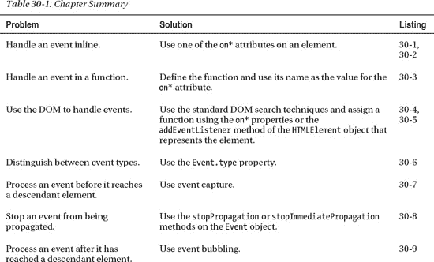

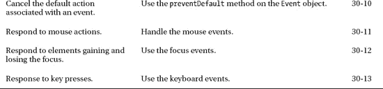

### 使用简单的事件处理器

有几种不同的方法可以处理事件。最直接的方法是使用一个*事件属性*创建一个*简单事件处理程序*。元素为它们支持的每个事件定义一个事件属性。例如，`onmouseover`事件属性是全局`mouseover`事件的事件属性，当用户将指针移动到元素所占据的浏览器屏幕区域时，就会触发该事件。(这是一般模式；对于大多数事件，都会有一个对应的事件属性定义为`on*<eventname>*`。

#### 实现简单的内联事件处理程序

使用事件属性最直接的方法是给属性分配一组 JavaScript 语句。当事件被触发时，浏览器将执行您提供的语句。清单 30-1 给出了一个简单的例子。

*清单 30-1。用内联 JavaScript 处理事件*

`<!DOCTYPE HTML>
<html>
    <head>
        <title>Example</title>
        
    </head>
    <body>        
        

            There are lots of different kinds of fruit - there are over
            500 varieties of banana alone. By the time we add the countless types of
            apples, oranges, and other well-known fruit, we are faced with thousands of
            choices.` `        

    </body>
</html>`

在这个例子中，我已经指定了两个 JavaScript 语句应该被执行来响应`mouseover`事件，方法是将它们设置为文档中`p`元素的`onmouseover`事件属性的值。以下是声明:

`this.style.background='white';
this.style.color='black'`

这些是直接应用于元素的`style`属性的 CSS 属性，如第四章中所解释的。浏览器将特殊变量`this`的值设置为代表触发事件的元素的`HTMLElement`对象，`style`属性返回该元素的`CSSStyleDeclaration`对象。

 **提示**注意，我使用双引号来分隔整个属性值，使用单引号来指定我想要的颜色作为 JavaScript 字符串文字。如果您愿意，可以按其他顺序使用它们，但这是在属性中嵌入引用值的技术。

如果将文档加载到浏览器中，那么在`style`元素中定义的初始样式将应用到`p`元素中。当你将鼠标移动到元素上时，JavaScript 语句将被执行并改变分配给`background`和`color` CSS 属性的值，使用我在第四章中描述的技术。你可以在图 30-1 中看到过渡。

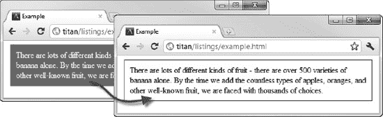

*图 30-1。处理鼠标悬停事件*

这是单向过渡；当鼠标离开元素的屏幕区域时，样式不会重置。许多事件是成对发生的。与`mouseover`相对应的事件称为`mouseout`，您通过`onmouseout`事件属性来处理该事件，如清单 30-2 所示。

*清单 30-2。处理鼠标释放事件*

`<!DOCTYPE HTML>
<html>
    <head>
        <title>Example</title>
        
    </head>
    <body>        
        

            There are lots of different kinds of fruit - there are over
            500 varieties of banana alone. By the time we add the countless types of
            apples, oranges, and other well-known fruit, we are faced with thousands of
            choices.
        

    </body>
</html>`

通过添加这个元素，您拥有了一个响应鼠标进入和退出它所占据的屏幕空间的元素。你可以在图 30-2 中看到新的过渡。

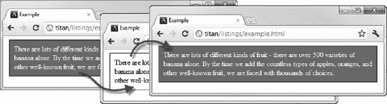

*图 30-2。组合对应事件的过渡效果*

清单 30-2 显示了内联事件处理程序的两个问题中的第一个:它们很冗长，使得 HTML 很难阅读。第二个问题是 JavaScript 语句只适用于一个元素。我必须在我想要以这种方式表现的每一个其他的`p`元素上重复这些语句。

#### 实现一个简单的事件处理函数

我们可以通过定义一个函数并将函数名指定为元素中事件属性的值来解决一些冗长和重复的问题。清单 30-3 展示了如何实现这一点。

*清单 30-3。使用函数处理事件*

`<!DOCTYPE HTML>
<html>
    <head>
        <title>Example</title>
        
        
    </head>
    <body>        
        

            There are lots of different kinds of fruit - there are over
            500 varieties of banana alone. By the time we add the countless types of
            apples, oranges, and other well-known fruit, we are faced with thousands of
            choices.
        

        

            One of the most interesting aspects of fruit is the variety available in
            each country. I live near London, in an area which is known for
            its apples.
        

    </body>
</html>`

在这个例子中，我定义了 JavaScript 函数，这些函数包含我想要执行的响应鼠标事件的语句，并在`onmouseover`和`onmouseout`属性中指定这些函数。特殊值`this`指的是触发事件的元素。

这种方法是对以前技术的改进。重复较少，代码也更容易阅读。但是我喜欢将我的事件从 HTML 元素中分离出来，为此我需要重新访问我们的老朋友 DOM。

### 使用 DOM 和事件对象

我在前面几节中演示的简单处理程序适合基本任务，但是如果您想要执行更复杂的处理(以及更优雅的事件处理程序定义)，请切换到使用 DOM 和 JavaScript `Event`对象。清单 30-4 展示了如何使用`Event`对象以及如何使用 DOM 将一个函数与一个事件关联起来。

*清单 30-4。使用 DOM 设置事件处理*

`<!DOCTYPE HTML>
<html>
    <head>
        <title>Example</title>
        
    </head>
    <body>        
        

            There are lots of different kinds of fruit - there are over
            500 varieties of banana alone. By the time we add the countless types of
            apples, oranges, and other well-known fruit, we are faced with thousands of
            choices.
        

        

            One of the most interesting aspects of fruit is the variety available in
            each country. I live near London, in an area which is known for
            its apples.
        

        ****
    </body>
</html>`

这就是你在前几章的例子中看到的方法。这个脚本(我不得不将它移到页面的底部，因为我正在使用 DOM)找到了我想要处理的所有元素，并为事件处理程序属性设置了一个函数名。所有事件都有这样的属性。都是以同样的方式命名:`on`，后接事件名称。您可以在本章后面的使用 HTML 事件一节中了解有关可用事件的更多信息。

 **提示**注意，我使用函数的*名*将其注册为事件监听器。一个常见的错误是在函数名后面加括号，所以用`handleMouseOver()`代替`handleMouse`。这相当于在脚本执行时调用函数，而不是在事件触发时。

清单中处理事件的函数定义了一个名为`e`的参数。这将被设置为由浏览器创建的一个`Event`对象，当事件被触发时，它代表事件。`Event`对象为您提供关于发生了什么的信息，并让您比在元素属性中包含代码更灵活地响应用户交互。在这个例子中，我使用了`target`属性来获取触发事件的`HTMLElement`，这样我就可以使用 style 属性并改变它的外观。

在向您展示 event 对象之前，我想演示一种替代方法来指定使用哪些函数来处理事件。事件属性(名为`on*`的属性)通常是最简单的方法，但是您也可以使用由`HTMLElement`对象实现的`addEventListener`方法。您还可以使用`removeEventListener`方法来分离一个函数和一个事件。这两种方法都允许你将事件类型和处理它们的函数表示为参数，如清单 30-5 所示。

*清单 30-5。使用 addEventListener 和 removeEventListener 方法*

`<!DOCTYPE HTML>
<html>
    <head>
        <title>Example</title>
        
    </head>
    <body>        
        

            There are lots of different kinds of fruit - there are over
            500 varieties of banana alone. By the time we add the countless types of
            apples, oranges, and other well-known fruit, we are faced with thousands of
            choices.
        

        

            One of the most interesting aspects of fruit is the variety available in
            each country. I live near London, in an area which is known for
            its apples.
        

        <button id="pressme">Press Me</button>
                
    </body>
</html>`

本例中的脚本使用`addEventListener`方法将`handleMouseOver`和`handleMouseOut`函数注册为`p`元素的事件处理程序。当点击`button`时，使用`removeEventListener`方法将`p`元素的`handleMouseOut`函数与`block2`的`id`值分离。请注意，我使用了`onclick`属性来设置按钮元素上的`click`事件的处理程序，以演示您可以在同一个脚本中自由地混合和匹配技术。

`addEventListener`方法的优点是它允许您访问一些高级事件特性，正如我简短描述的那样。`Event`对象的成员在表 30-2 中描述。

 **提示**`Event`对象定义了所有事件共有的功能。但是，当我在本章后面向您展示基本事件时，您将会看到，还有其他与事件相关的对象，它们定义了为特定类型的事件指定的额外功能。

#### 按类型区分事件

属性告诉你你正在处理哪种类型的事件。这个值以字符串的形式提供，比如`mouseover`。能够检测事件的类型允许你使用一个函数来处理多种类型，如清单 30-6 所示。

*清单 30-6。使用类型属性*

`<!DOCTYPE HTML>
<html>
    <head>
        <title>Example</title>
        
    </head>
    <body>        
        

            There are lots of different kinds of fruit - there are over
            500 varieties of banana alone. By the time we add the countless types of
            apples, oranges, and other well-known fruit, we are faced with thousands of
            choices.
        

        

            One of the most interesting aspects of fruit is the variety available in
            each country. I live near London, in an area which is known for
            its apples.
        

        ****
    </body>
</html>`

在本例的脚本中，我使用了`type`属性来确定我在一个事件处理函数`handleMouseEvent`中处理的是哪种事件。

#### 了解事件流程

一个事件的生命周期有三个阶段:*捕获*、*目标*和*冒泡*。在这一节中，我将解释其中的每一个阶段，并向您展示它们是如何工作的，以及您如何使用事件侦听器函数来控制它们。

##### 了解捕获阶段

当一个事件被触发时，浏览器识别与该事件相关的元素，该元素被称为事件的*目标*。浏览器识别`body`元素和目标之间的所有元素，并检查它们中的每一个，看它们是否有任何事件处理程序请求被通知它们后代的事件。浏览器在触发目标本身上的处理程序之前触发任何这样的处理程序。清单 30-7 提供了一个演示。

*清单 30-7。捕捉事件*

`<!DOCTYPE HTML>
<html>
    <head>
        <title>Example</title>
        
    </head>
    <body>        
        

            There are lots of different kinds of fruit - there are over
            500 varieties of banana alone. By the time we add
            the countless types of apples, oranges, and other well-known fruit, we are
            faced with thousands of choices.
        
` `                
    </body>
</html>`

在这个例子中，我定义了一个`span`元素作为`p`元素的子元素，并为`mouseover`和`mouseout`事件注册了处理程序。注意，当我向父元素(`p`元素)注册时，我向`addEventListener`方法添加了第三个参数，如下所示:

`textblock.addEventListener("mouseover", handleDescendantEvent, **true**);`

这个额外的参数告诉浏览器，我希望`p`元素在捕获阶段接收其后代元素的事件。当触发`mouseover`事件时，浏览器从 HTML 文档的根开始，沿着 DOM 向目标(触发事件的元素)前进。对于层次结构中的每个元素，浏览器会检查它是否对捕获的事件感兴趣。在图 30-3 中可以看到示例文档的顺序。

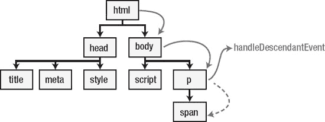

*图 30-3。捕获事件流程*

在每个元素中，浏览器调用任何支持捕获的侦听器。在这种情况下，浏览器将找到并调用我用`p`元素注册的`handleDescendantEvent`函数。当调用`handleDescendantEvent`函数时，`Event`对象包含关于目标元素的信息(通过`target`属性)，以及通过`currentTarget`属性导致函数被调用的元素。我使用这两个属性，这样我就可以改变`p`元素和`span`子元素的样式。在图 30-4 中可以看到效果。

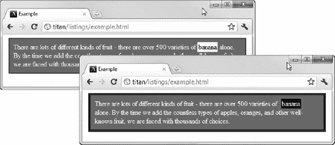

*图 30-4。处理事件捕获*

事件捕获使元素的每个祖先在事件被传递给元素本身之前有机会对事件作出反应。父元素事件处理程序可以通过调用`Event`对象上的`stopPropagation`或`stopImmediatePropagation`函数来停止事件向目标的流动。这些函数的区别在于，`stopPropagation`将确保为当前元素注册的所有事件侦听器都会被调用，而`stopImmediatePropagation`会忽略任何未触发的侦听器。清单 30-8 显示了在`handleDescendantEvent`事件处理程序中添加了`stopPropagation`函数。

*清单 30-8。阻止进一步的事件流*

`...
function handleDescendantEvent(e) {
    if (e.type == "mouseover" && e.eventPhase == Event.CAPTURING_PHASE) {
        e.target.style.border = "thick solid red";
        e.currentTarget.style.border = "thick double black";
    } else if (e.type == "mouseout" && e.eventPhase == Event.CAPTURING_PHASE) {
        e.target.style.removeProperty("border");
        e.currentTarget.style.removeProperty("border");
    }
    **e.stopPropagation();**
}
...`

随着这一改变，当调用了`p`元素上的处理程序时，浏览器捕获阶段结束。没有其他元素将被检查，目标和冒泡阶段(稍后描述)将被跳过。就这个例子而言，这意味着`handleMouseEvent`函数中的样式改变不会被应用来响应`mouseover`事件，正如你在图 30-5 中看到的。

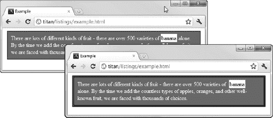

*图 30-5。停止事件传播*

注意，在处理程序中，我通过使用`eventPhase`属性检查事件类型并确定事件处于哪个阶段，如下所示:

`...
if (e.type == "mouseover" && **e.eventPhase == Event.CAPTURING_PHASE**) {      
...`

注册事件监听器时启用捕获事件不会停止针对元素本身的事件。在这种情况下，`p`元素占据了浏览器屏幕的空间，也将响应`mouseover`事件。为了避免这种情况，我检查以确保我只在处理处于捕获阶段的事件时应用样式更改(即，针对后代元素的事件，并且我只是因为注册了一个启用捕获的侦听器而进行处理)。`eventPhase`属性将返回表 30-3 中所示的三个值之一，代表事件生命周期中的三个阶段。我将在接下来的小节中解释其他两个阶段。

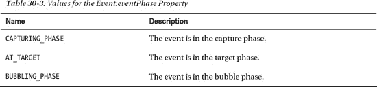

##### 了解目标阶段

目标阶段是三个阶段中最简单的。当捕获阶段结束时，浏览器触发已经添加到目标元素的事件类型的任何监听器，如图 30-6 所示。

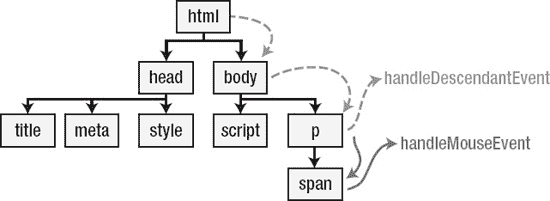

*图 30-6。目标阶段*

在前面的例子中，您已经看到了这个阶段。这里需要注意的唯一一点是，您可以多次调用`addEventListener`函数，因此对于给定的事件类型，可以有多个侦听器。

 **提示**如果在目标阶段调用`stopPropagation`或`stopImmediatePropagation`函数，则停止事件流程，冒泡阶段不会执行。

##### 理解泡沫阶段

目标阶段完成后，浏览器开始沿着祖先元素链向上返回到`body`元素。在每个元素中，浏览器检查是否有未启用捕获的事件类型的侦听器(例如，`addEventListener`函数的第三个参数是`false`)。这就是所谓的*事件冒泡*。清单 30-9 给出了一个例子。

*清单 30-9。事件冒泡*

`<!DOCTYPE HTML>
<html>
    <head>
        <title>Example</title>
        
    </head>
    <body>        
        

            There are lots of different kinds of fruit - there are over
            500 varieties of banana alone. By the time we add
            the countless types of apples, oranges, and other well-known fruit, we are
            faced with thousands of choices.
        

                
    </body>
</html>`

我添加了一个名为`handleBubbleMouseEvent`的新函数，并将其添加到文档中的`p`元素中。`p`元素现在有两个事件监听器，一个启用了捕获，另一个启用了冒泡。当您使用`addEventListener`方法时，您总是处于这些状态中的一种，这意味着除了它自己的事件之外，一个元素的监听器将总是被通知关于继承的元素事件*。选择是在后代事件的目标阶段之前还是之后调用侦听器。*

这个新添加的结果是，您有三个侦听器函数，它们将被文档中的`span`元素上的`mouseover`事件触发。在捕获阶段会触发`handleDescendantEvent`功能，在目标阶段会调用`handleMouseEvent`功能，在冒泡阶段会调用`handleBubbleMouseEvent`。你可以在图 30-7 中看到这样做的效果。

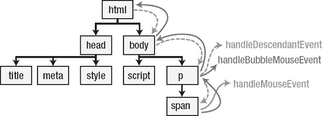

*图 30-7。泡沫阶段*

元素的外观现在受到所有监听器函数中样式变化的影响，如图图 30-8 所示。

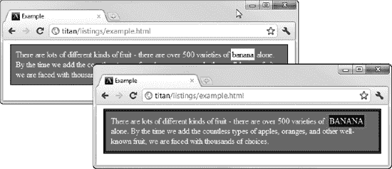

*图 30-8。为冒泡阶段添加一个处理程序的效果*

 **提示**不是所有事件都支持冒泡。您可以使用`bubbles`属性查看事件是否会冒泡。值`true`表示事件会冒泡，`false`表示不会。

#### 处理可取消事件

一些事件定义了触发事件时将执行的默认操作。例如，`a`元素上的`click`事件的默认动作是浏览器将在`href`属性中指定的 URL 处加载内容。当一个事件有一个默认动作时，它的`cancelable`属性的值将是`true`。您可以通过调用`preventDefault`功能来停止执行默认动作。清单 30-10 给出了一个在事件处理函数中处理可取消事件的例子。

*清单 30-10。取消默认操作*

`<!DOCTYPE HTML>
<html>
    <head>
        <title>Example</title>
        
    </head>
    <body>
        

            <a href="http://apress.com">Visit Apress</a>
            <a href="http://w3c.org">Visit W3C</a>
        

        
    </body>
</html>`

在这个例子中，我使用了`confirm`函数来提示用户查看他们是否真的想要导航到`a`元素所指向的 URL。如果用户点击`Cancel`按钮，那么我调用`preventDefault`函数。这意味着浏览器将不再导航到该 URL。

注意，调用`preventDefault`函数不会阻止事件流过捕获、目标和冒泡阶段。这些阶段仍将执行，但浏览器不会在冒泡阶段结束时执行默认操作。您可以通过读取`defaultPrevented`属性来测试查看`preventDefault`函数是否被早期的事件处理程序调用过；如果它返回`true`，那么`preventDefault`函数已经被调用。

### 处理 HTML 事件

HTML 定义了一组按类型分组的事件，我将在下一节描述这些事件。第一部分，文档和窗口事件，应用于`Document`和`Window`对象，我在第二十五章和第二十六章中讨论过。

其他事件由所有的`HTMLElement`对象定义，实际上是通用的。为了支持每种类型事件的独特特征，浏览器调度具有核心`Event`对象之外的附加属性的对象。当你浏览这些例子时，这是有意义的。

#### 文档和窗口事件

除了你在前面章节看到的特性外，`Document`对象定义了表 30-4 中描述的事件。你可以在第二十五章中看到这个事件的例子。

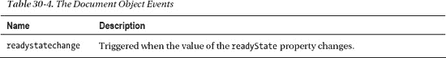

`window`对象定义了广泛的事件，在表 30-5 中有描述。您可以通过`body`元素处理其中的一些事件，但是对这种方法的支持不太全面，使用`window`更可靠。

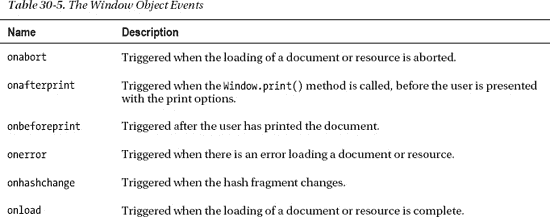

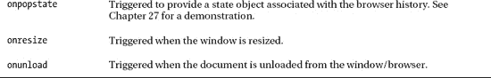

#### 处理鼠标事件

你已经在本章前面看到了`mouseover`和`mouseout`事件，但是鼠标相关事件的完整集合显示在表 30-6 中。

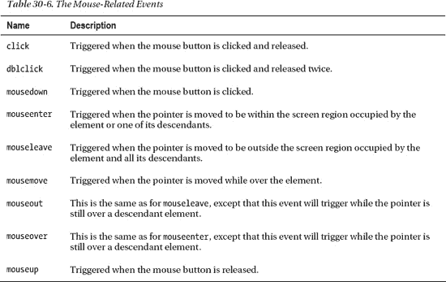

当鼠标事件被触发时，浏览器会调度一个`MouseEvent`对象。这是一个`Event`对象，其附加属性和方法如表 30-7 所示。

清单 30-11 展示了如何使用`MouseEvent`对象提供的附加功能。

*清单 30-11。使用 MouseEvent 对象响应鼠标事件*

`<!DOCTYPE HTML>
<html>
    <head>
        <title>Example</title>
        
    </head>
    <body>        
        

            There are lots of different kinds of fruit - there are over` `            500 varieties of banana alone. By the time we add the countless types of
            apples, oranges, and other well-known fruit, we are faced with thousands
            of choices.
        

        <table border="1">
            <tr><th>Type:</th><td id="eType"></td></tr>
            <tr><th>X:</th><td id="eX"></td></tr>
            <tr><th>Y:</th><td id="eY"></td></tr>
        </table>

                
    </body>
</html>`

本例中的脚本更新表格中的单元格，以响应两种鼠标事件。你可以在图 30-9 中看到效果。

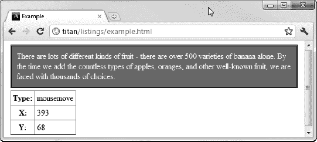

*图 30-9。处理老鼠事件*

#### 处理焦点事件

焦点相关事件被触发以响应获得和失去焦点的元素。表 30-8 总结了这些事件。

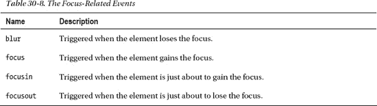

这些事件由一个`FocusEvent`对象表示，它将表 30-9 中显示的属性添加到核心`Event`对象功能中。

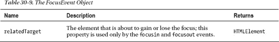

清单 30-12 展示了焦点事件的使用。

*清单 30-12。使用焦点事件*

`<!DOCTYPE HTML>
<html>
    <head>
        <title>Example</title>
        
    </head>
    <body>
        <form>
            

                <label for="fave">Fruit: <input autofocus id="fave" name="fave"/></label>
            

            

                <label for="name">Name: <input id="name" name="name"/></label>
            

            <button type="submit">Submit Vote</button>
            <button type="reset">Reset</button>
        </form>

        
    </body>
</html>`

本例中的脚本使用`focus`和`blur`事件来改变一对输入元素的样式。你可以在图 30-10 中看到效果。

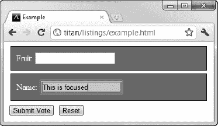

*图 30-10。使用聚焦和模糊事件*

#### 处理键盘事件

响应按键触发键盘事件。该类别中的事件集合如表 30-10 所示。

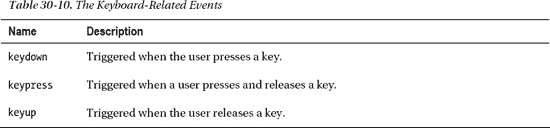

这些事件由一个`FocusEvent`对象表示，它将表 30-11 中显示的属性添加到核心`Event`对象功能中。

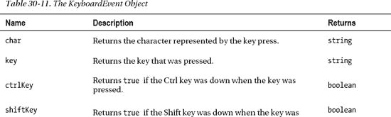

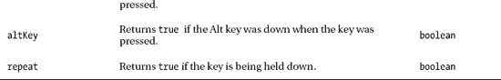

清单 30-13 显示了一些正在使用的键盘事件。

*清单 30-13。使用键盘事件*

`<!DOCTYPE HTML>
<html>
    <head>
        <title>Example</title>
        
    </head>
    <body>
        <form>
            

                <label for="fave">Fruit: <input autofocus id="fave" name="fave"/></label>
            

            

                <label for="name">Name: <input id="name" name="name"/></label>
            

            <button type="submit">Submit Vote</button>
            <button type="reset">Reset</button>
        </form>
        

        ` `    </body>
</html>`

本例中的脚本更改了一个`span`元素的内容，以显示发送给一对`input`元素的击键。注意我是如何使用`String.fromCharCode`函数将`keyCode`属性的值转换成一个更有用的值的。你可以在图 30-11 中看到这个脚本的效果。

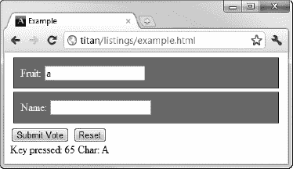

*图 30-11。使用按键事件*

#### 使用表单事件

`form`元素定义了该元素特有的两个特殊事件。这些在表 30-12 中描述。

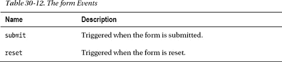

当我展示 Ajax 时，你可以在第 33 和 34 章看到表单事件是如何使用的。

### 总结

在这一章中，我解释了事件系统如何允许你对文档元素的状态变化做出反应。我向您展示了处理事件的不同方式，从简单的`on*`属性，使用处理函数，到`addEventListener`方法，每种方式都有自己的优点。我还解释了事件生命周期的三个阶段——捕获、到达目标和冒泡——以及如何在事件传播时使用这些阶段来拦截事件。我在本章结束时描述了适用于大多数 HTML 元素的事件。