# 三十一、使用特定于元素的对象

文档对象模型(DOM)定义了一组对象，代表文档中不同类型的 HTML 元素。这些对象可以被视为`HTMLElement`对象，在很大程度上，这就是你通常在脚本中所做的。但是，如果您想要访问某个元素特有的属性或特性，通常可以使用这些对象之一来实现。

这些物品没有多大用处。它们通常定义与元素支持的属性相对应的属性，元素的值可以通过`HTMLElement`的特性来访问。有几个例外——表单元素有一些用于输入验证的有用方法，表格元素有一些可用于构建表格内容的方法。

### 文档和元数据对象

本节描述了表示数据和元数据元素的对象。你可以在第七章中了解更多关于这些元素的信息。

#### 基础元素

`base`元素由`HTMLBaseElement`对象表示。该对象没有定义任何附加事件，但是有两个属性，如表 31-1 所示。

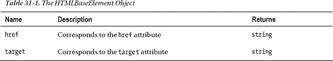

#### 身体元素

`body`元素由`HTMLBodyElement`对象表示。该对象没有定义任何额外的属性，但是事件集显示在表 31-2 中。

 **提示**一些浏览器通过`window`对象支持这些事件，我在第二十七章中描述过。

#### 链接元素

`link`元素由`HTMLLinkElement`对象表示，该对象定义了表 31-3 中所示的属性。

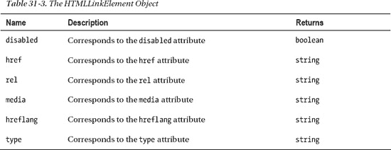

#### 元元素

`meta`元素由`HTMLMetaElement`对象表示，该对象定义了表 31-4 中所示的属性。

#### 脚本元素

`script`元素在 DOM 中由`HTMLScriptElement`对象表示，它定义了在表 31-5 中描述的附加属性。

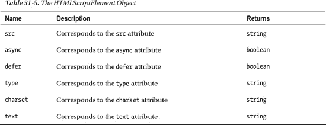

#### 样式元素

`style`元素在 DOM 中由`HTMLStyleElement`对象表示，它定义了表 31-6 中显示的附加属性。

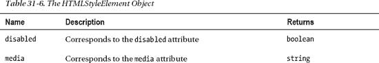

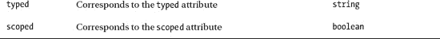

#### 标题元素

`title`元素由 DOM 中的`HTMLTitleElement`对象表示。该对象定义了表 31-7 中显示的属性。

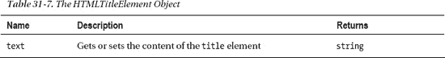

#### 其他文档和元数据元素

`head`和`html`元素分别由`HTMLHeadElement`和`HTMLHtmlElement`对象表示。除了`HTMLElement`之外，这些对象没有定义任何额外的方法、属性或事件。`noscript`元素没有特殊的 DOM 对象，只由`HTMLElement`表示。

### 文本元素

本节描述表示文本元素的对象。你可以在第八章中了解更多关于这些元素的信息。

#### a 元素

`a`元素由`HTMLAnchorElement`对象表示，该对象定义了表 31-8 中所示的属性。除了定义与元素属性相对应的属性之外，该对象还定义了一组方便的属性，允许您轻松地获取或设置由`href`属性指定的 URL 组件。

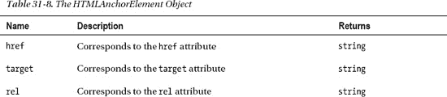

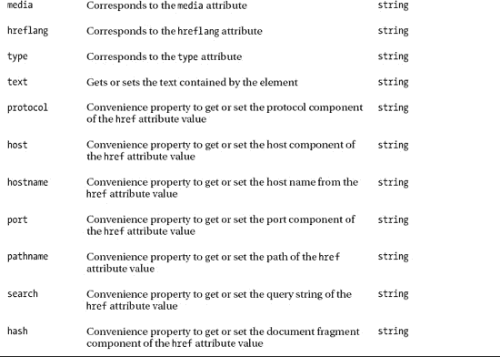

#### del 和 ins 元素

`del`和`ins`元素都由`HTMLModElement`表示。您可以使用由`HTMLElement`定义的`tagName`属性来区分它们。详见第二十六章。`HTMLModElement`定义的附加属性在表 31-9 中描述。

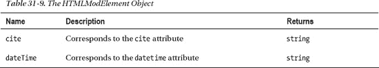

#### q 元素

`q`元素由`HTMLQuoteElement`对象表示。该对象定义的属性在表 31-10 中有描述。

#### 时间元素

`time`元素由`HTMLTimeElement`对象表示。该对象定义的附加属性如表 31-11 所示。

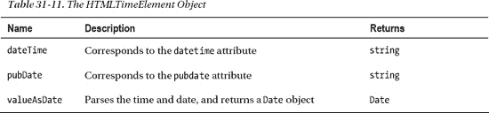

#### 其他文本元素

`br`和`span`元素分别由`HTMLBRElement`和`HTMLSpanElement`对象表示。除了`HTMLElement`之外，这些对象没有定义任何额外的方法、属性或事件。以下元素仅由`HTMLElement`表示:`abbr`、`b`、`cite`、`code`、`dfn`、`em`、`i`、`u`、`kbd`、`mark`、`rt`、`rp`、`ruby`、`s`、`samp`、`small`、`strong`、`sub`、`sup`、`var`和`wbr`。

### 分组元素

本节描述代表分组元素的对象。你可以在第九章中了解更多关于这些元素的信息。

#### block quote 元素

`blockquote`元素由`HTMLQuoteElement`对象表示。这和`q`元素使用的是同一个对象，我在表 31-10 中描述过。

#### 李元素

`li`元素由`HTMLLIElement`对象表示，该对象定义了表 31-12 中显示的属性。

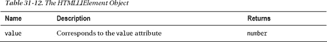

#### ol 元素

`ol`元素由`HTMLOListElement`对象表示，该对象定义了表 31-13 中所示的属性。

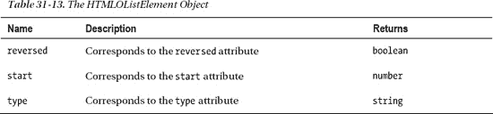

#### 其他分组元素

表 31-14 显示了由元素特定对象表示的分组元素集，这些对象除了`HTMLElement`的功能之外没有定义任何附加功能。

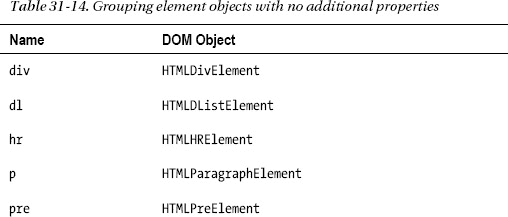

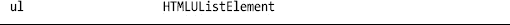

以下元素在 DOM 中没有对应的元素，分别用`HTMLElement` : `dd`、`dt`、`figcaption`和`figure`表示。

### 截面元素

本节描述代表截面元素的对象。你可以在第十章中了解更多关于这些元素的信息。

#### 细节元素

`details`元素由`HTMLDetailsElement`对象表示。该对象定义的属性在表 31-15 中描述。

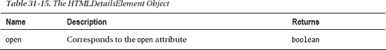

#### 其他截面元素

`h1` - `h6`元素由`HTMLHeadingElement`对象表示，但是这个对象没有定义任何额外的属性。以下部分元素没有用特定的对象表示:`address`、`article`、`aside`、`footer`、`header`、`hgroup`、`nav`、`section`和`summary`。

### 表元素

本节描述表示表格元素的对象。你可以在第十一章中了解更多关于这些元素的信息。

#### col 和 colgroup 元素

`col`和`colgroup`元素都由`HTMLTableColElement`对象表示，该对象定义了表 31-16 中显示的属性。

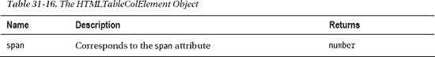

#### 表元素

`table`元素由`HTMLTableElement`对象表示。这是最有用的特定于元素的对象之一。该对象定义的属性和方法在表 31-17 中描述。

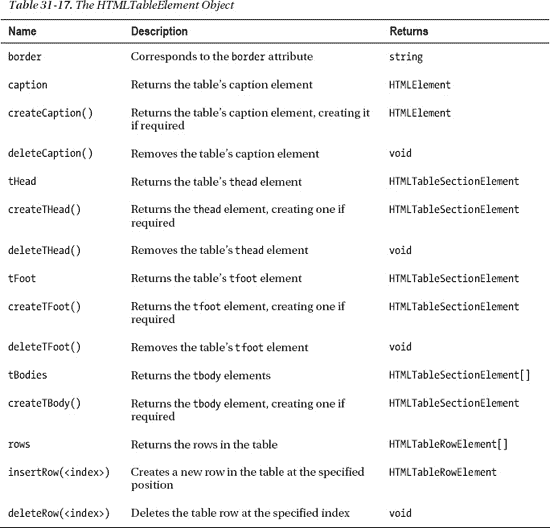

#### thead、tbody 和 tfoot 元素

`thead`、`tbody`和`tfoot`元素都由`HTMLTableSectionElement`对象表示。该对象定义的属性和方法如表 31-18 所示。

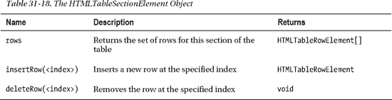

#### 第 th 元素

`th`元素由`HTMLTableHeaderCellElement`对象表示。该对象定义的属性在表 31-19 中描述。

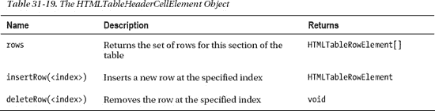

#### tr 元素

`tr`元素由`HTMLTableRowElement`对象表示，该对象定义了表 31-20 中所示的属性和方法。

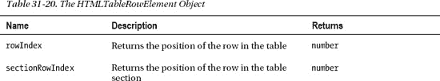

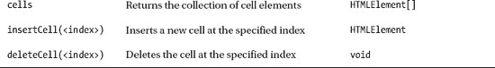

#### 其他表格元素

表 31-21 显示了表格元素的集合，这些元素由元素特定的对象表示，这些对象没有定义任何超出`HTMLElement`的附加功能。

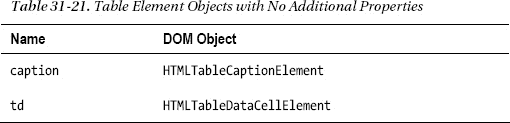

### 表单元素

本节描述了表示表单元素的对象。你可以在第十二章–第十四章中了解更多关于这些元素的信息。

#### 按钮元素

`button`元素由`HTMLButtonElement`对象表示，该对象定义了表 31-22 中所示的属性和方法。

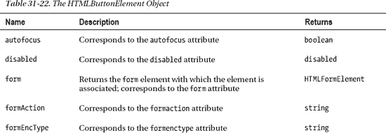

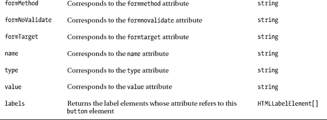

#### datalist 元素

`datalist`元素由`HTMLDataListElement`对象表示，该对象定义了表 31-23 中显示的属性。

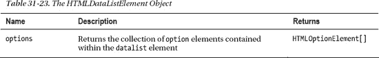

#### fieldset 元素

`fieldset`元素由`HTMLFieldSetElement`对象表示，该对象定义了表 31-24 中所示的属性。

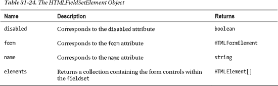

#### 表单元素

`form`元素由`HTMLFormElement`对象表示，该对象定义了表 31-25 中所示的属性和方法。

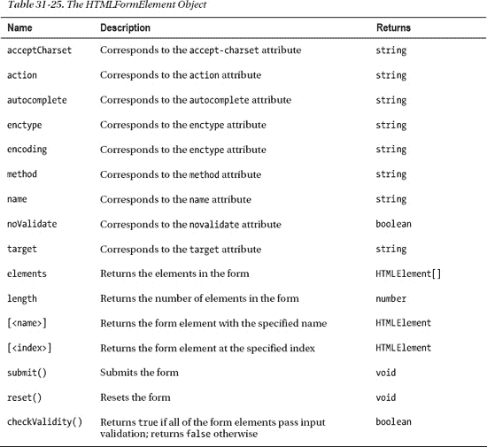

#### 输入元素

`input`元素由`HTMLInputElement`对象表示，支持表 31-26 中显示的属性和方法。

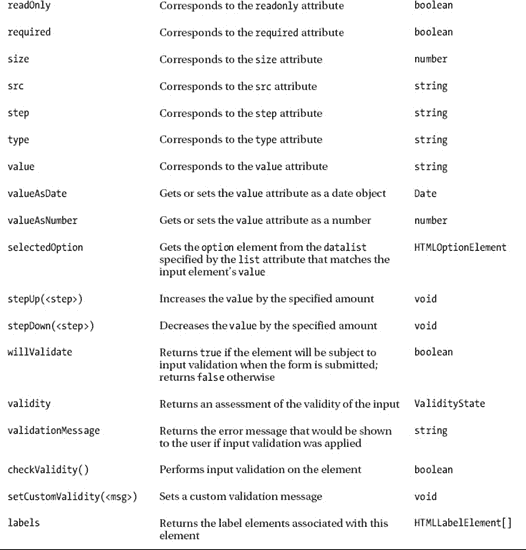

#### 标签元素

`label`元素由`HTMLLabelElement`对象表示，该对象定义了表 31-27 中所示的属性。

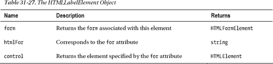

#### 传说元素

`legend`元素由`HTMLLegendElement`对象表示，该对象定义了表 31-28 中显示的属性。

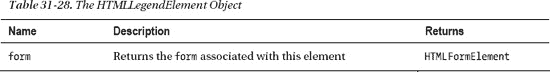

#### opt group 元素

`optgroup`元素由`HTMLOptGroupElement`对象表示，该对象定义了表 31-29 中所示的属性。

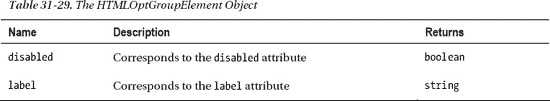

#### 选项元素

`option`元素由`HTMLOptionElement`对象表示，该对象定义了表 31-30 中所示的属性。

#### 输出元素

`output`元素由`HTMLOutputElement`对象表示，该对象定义了表 31-31 中所示的属性。

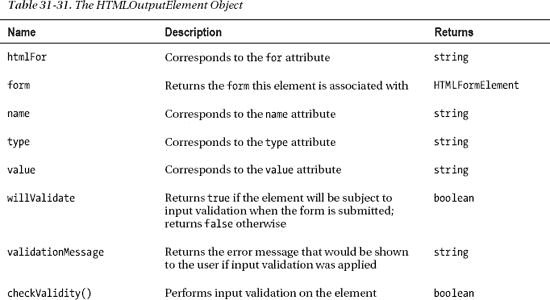

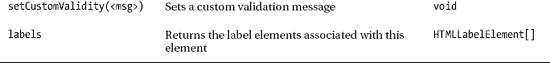

#### 选择元素

`select`元素由`HTMLSelectElement`对象表示，该对象实现了表 31-32 中所示的属性和方法。

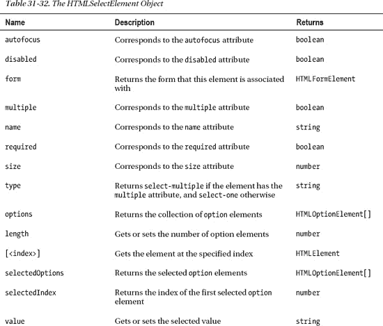

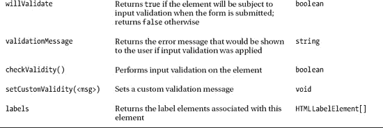

#### textarea 元素

`textarea`元素由`HTMLTextAreaElement`对象表示，它定义了表 31-33 中描述的方法和属性。

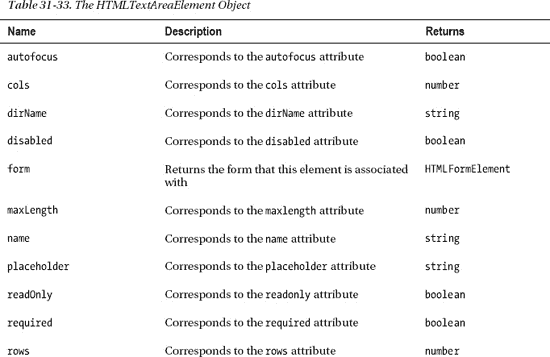

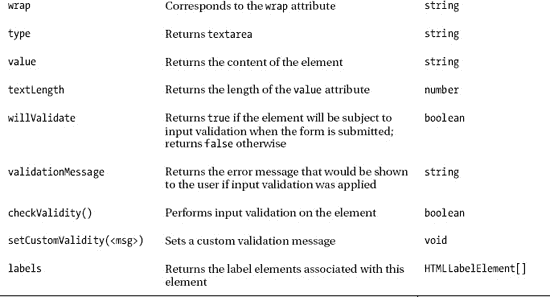

### 内容要素

本节描述表示用于在文档中嵌入内容的元素的对象。你可以在第十五章中了解更多关于这些元素的信息。

 **注**其他内容元素，如`canvas`和`video`，稍后在第三十四章中描述。

#### 面积元素

`area`元素由`HTMLAreaElement`表示，它实现了表 31-34 中所示的属性。

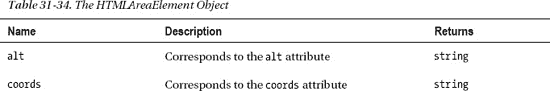

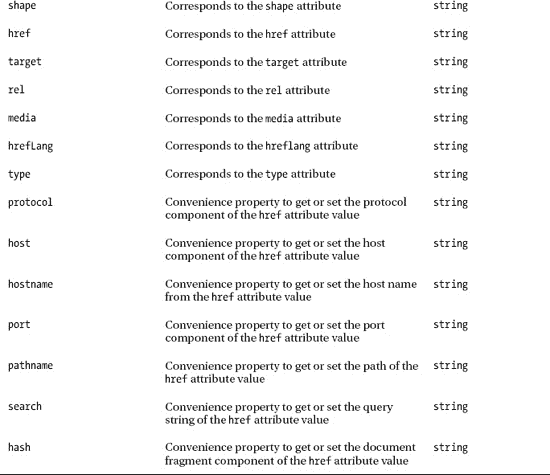

#### 嵌入元素

`embed`元素由`HTMLEmbedElement`对象表示，该对象实现了表 31-35 中所示的属性。

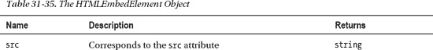

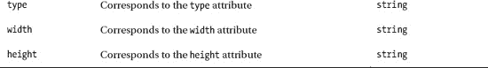

#### iframe 元素

`iframe`元素由`HTMLIFrameElement`对象表示，该对象实现了表 31-36 中描述的属性。

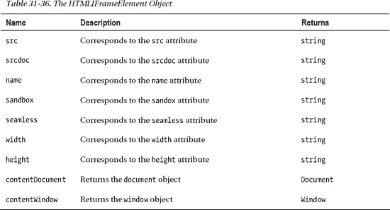

#### img 元素

`img`元素由`HTMLImageElement`对象表示，该对象实现了表 31-37 中描述的属性。

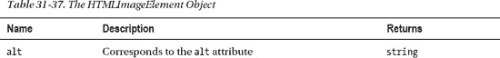

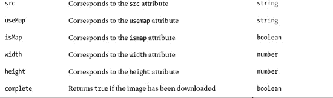

#### 地图元素

`map`元素由`HTMLMapElement`对象表示，该对象实现了表 31-38 中所示的属性。

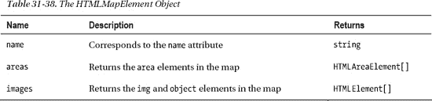

#### 计元素

`meter`元素由`HTMLMeterElement`对象表示，该对象实现了表 31-39 中所示的属性。

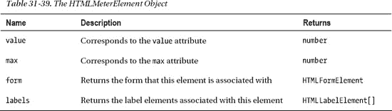

#### 物体元素

`object`元素由`HTMLObjectElement`对象表示，该对象实现了表 31-40 中所示的属性。

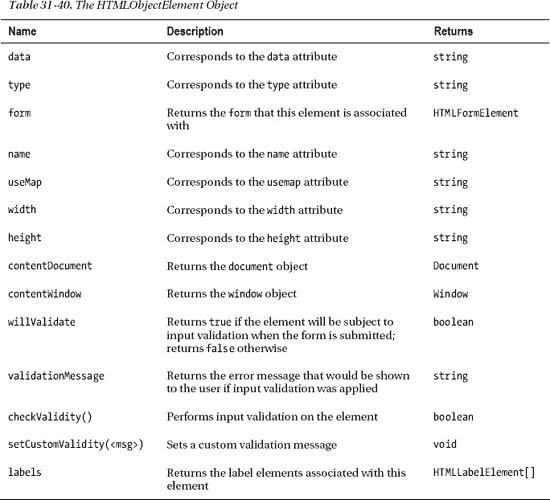

#### param 元素

`param`元素由`HTMLParamElement`对象表示，该对象实现了表 31-41 中所示的属性。

#### 进度元素

`progress`元素由`HTMLProgressElement`对象表示，该对象实现了表 31-42 中所示的属性。

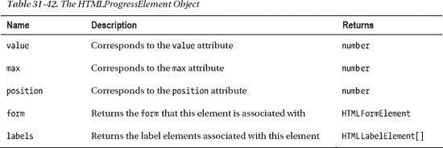

### 总结

在这一章中，我列出了用于表示 DOM 中不同类型元素的对象集。在大多数情况下，这些都不是特别有用——有两个例外。第一个例外是表单元素，它对验证和表单提交提供了一些有用的控制。第二个例外是表格元素，它提供了管理表格内容的方法。除了这些例外，本章中描述的对象很大程度上是代表特定属性的属性集合——这些属性的值可以通过无处不在的`HTMLElement`对象来访问。