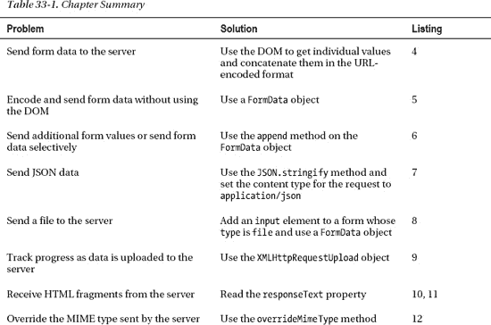
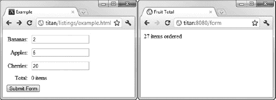
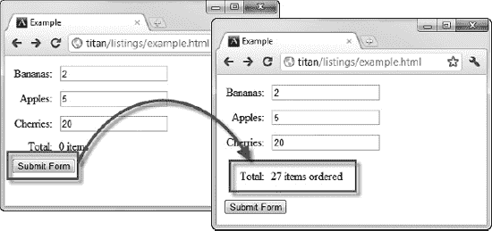
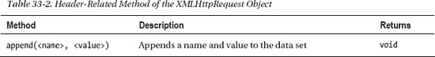
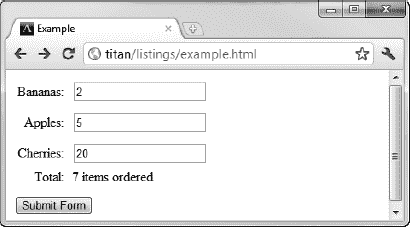
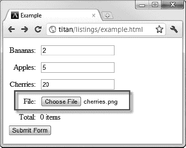
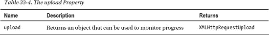
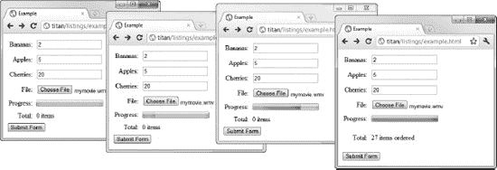

# 三十三、使用 Ajax——第二部分

在这一章中，我将继续描述 Ajax 是如何工作的，向您展示如何向客户端发送数据。发送表单和文件是 Ajax 的两种常见用途，它允许 web 应用为用户创建更丰富的体验。我还将向您展示如何在向服务器发送数据时监控进度，以及如何处理服务器在响应 Ajax 请求时发回的不同响应格式。表 33-1 对本章进行了总结。前三个清单设置了其他示例中使用的服务器和 HTML 文档。

### 准备向服务器发送数据

Ajax 最常见的用途之一是向服务器发送数据。最典型的情况是，客户端发送表单数据——输入到包含在`form`元素中的`input`元素中的值。清单 33-1 显示了一个简单的表格，这将是本章这一部分的基础。我把这个 HTML 保存到一个名为`example.html`的文件中。

*清单 33-1。基本形式*

`<!DOCTYPE HTML>
<html>
    <head>
        <title>Example</title>
        
    </head>
    <body>
        <form id="fruitform" method="post" action="http://titan:8080/form">
            

                

                    
Bananas:

                    
<input name="bananas" value="2"/>

                

                

                    
Apples:

                    
<input name="apples" value="5"/>

                

                

                    
Cherries:

                    
<input name="cherries" value="20"/>

                

                

                    
Total:

                    
0 items

                

            

            <button id="submit" type="submit">Submit Form</button>
        </form>  
    </body>
</html>`

本例中的表单包含三个`input`元素和一个提交`button`。`input`元素允许用户指定订购三种不同水果中的多少种，然后`button`将表单提交给服务器。有关这些元素的更多信息，请参见第十二章、第十三章和第十四章。

#### 定义服务器

对于示例，您需要创建处理请求的服务器。我再次使用了`Node.js`，很大程度上是因为它很简单并且使用了 JavaScript。获取`Node.js`的详细信息参见第二章。我不会深入研究这个脚本是如何工作的，但是因为它是用 JavaScript 编写的，所以您应该能够对发生的事情有一个大致的了解。也就是说，理解服务器脚本对于理解 Ajax 来说并不重要，如果愿意，您可以将服务器视为一个黑盒。清单 33-2 显示了`fruitcalc.js`脚本。

*清单 33-2。Node.js* 的 fruitcalc.js 脚本

`var http = require('http');
var querystring = require('querystring');
var multipart = require('multipart');

**function writeResponse(res, data) {**
    **var total = 0;**
    **for (fruit in data) {**
        **total += Number(data[fruit]);**
    **}**
    **res.writeHead(200, "OK", {**
        **"Content-Type": "text/html",**
        **"Access-Control-Allow-Origin": "http://titan"});**
    **res.write('<html><head><title>Fruit Total</title></head><body>');**
    **res.write('
' + total + ' items ordered
</body></html>');**
    **res.end();**
**}**

http.createServer(function (req, res) {
    console.log("[200] " + req.method + " to " + req.url);
    if (req.method == 'OPTIONS') {
        res.writeHead(200, "OK", {
            "Access-Control-Allow-Headers": "Content-Type",
            "Access-Control-Allow-Methods": "*",
            "Access-Control-Allow-Origin": "*"
            });
        res.end();
    } else if (req.url == '/form' && req.method == 'POST') {
        var dataObj = new Object();
        var contentType = req.headers["content-type"];
        var fullBody = '';

        if (contentType) {
            if (contentType.indexOf("application/x-www-form-urlencoded") > -1) {  

                req.on('data', function(chunk) { fullBody += chunk.toString();});
                req.on('end', function() {` `                    var dBody = querystring.parse(fullBody);
                    dataObj.bananas = dBody["bananas"];
                    dataObj.apples = dBody["apples"];
                    dataObj.cherries= dBody["cherries"];
                    writeResponse(res, dataObj);
                });

            } else if (contentType.indexOf("application/json") > -1) {
                req.on('data', function(chunk) { fullBody += chunk.toString();});
                req.on('end', function() {
                    dataObj = JSON.parse(fullBody);
                    writeResponse(res, dataObj);
                });

            } else if (contentType.indexOf("multipart/form-data") > -1) {
                var partName;
                var partType;
                var parser = new multipart.parser();
                parser.boundary = "--" + req.headers["content-type"].substring(30);

                parser.onpartbegin = function(part) {
                    partName = part.name; partType = part.contentType};
                parser.ondata = function(data) {
                    if (partName != "file") {
                        dataObj[partName] = data;
                    }
                };
                req.on('data', function(chunk) { parser.write(chunk);});
                req.on('end', function() { writeResponse(res, dataObj);});
            }
        }
    }
}).listen(8080);`

我突出显示了脚本中需要注意的部分:`writeResponse`函数。这个函数在从请求中提取表单值后被调用，它负责生成对浏览器的响应。目前，这个函数产生一个简单的 HTML 文档，如清单 33-3 所示，但是我们将在本章后面处理不同的格式时改变和增强这个函数。

*清单 33-3。由 writeResponse 函数生成的简单 HTML 文档*

`<html>
    <head>
        <title>Fruit Total</title>
    </head>
    <body>
        
27 items ordered

    </body>
</html>`

这是一个简单的回答，但却是一个良好的开端。效果是服务器通过`form`中的`input`元素合计用户订购的水果数量。服务器端脚本的其余部分负责解码客户端可能使用 Ajax 发送的各种数据格式。您可以像这样启动服务器:

* * *

`bin\node.exe fruitcalc.js`

* * *

该脚本仅供本章使用。它不是通用服务器，我不建议您将它的任何部分用于生产服务。许多假设和快捷方式与本章后面的例子联系在一起，该脚本不适合任何严肃的用途。

#### 理解问题

我想用 Ajax 解决的问题在图 33-1 中有清晰的说明。

*图 33-1。提交一份简单的表格*

当您提交表单时，浏览器会将结果显示为新页面。这有两层含义:

*   用户必须等待服务器处理数据并生成响应。
*   任何文档上下文都将丢失，因为结果显示为新文档。

这是应用 Ajax 的理想情况。您可以异步发出请求，这样用户就可以在处理表单的同时继续与文档进行交互。

### 发送表单数据

向服务器发送数据的最基本方式是自己收集和格式化数据。清单 33-4 展示了使用这种方法向`example.html`文档添加一个脚本。

*清单 33-4。手动收集和发送数据*

`<!DOCTYPE HTML>
<html>
    <head>
        <title>Example</title>
        
    </head>
    <body>
        <form id="fruitform" method="post" action="http://titan:8080/form">
            

                

                    
Bananas:

                    
<input name="bananas" value="2"/>

                

                

                    
Apples:

                    
<input name="apples" value="5"/>

                

                

                    
Cherries:

                    
<input name="cherries" value="20"/>

                

                

                    
Total:

                    
0 items

                

            

            <button id="submit" type="submit">Submit Form</button>
        </form>
       ****
    </body>
</html>`

这个脚本看起来比实际更复杂。为了解释，我将分解各个步骤。所有的动作都发生在`handleButtonPress`函数中，该函数被调用以响应`button`元素的 click 事件。

我做的第一件事是在浏览器已经分派给函数的`Event`对象上调用`preventDefault`方法。我在第三十章中描述了这种方法，当时我解释了一些事件有与之相关的默认动作。对于表单中的`button`元素，默认的操作是使用常规的非 Ajax 方法提交表单。我不希望这种情况发生——因此调用了`preventDefault`方法。

 **提示**我喜欢将对`preventDefault`方法的调用放在我的事件处理函数的开始，因为这使得调试更容易。如果我在函数末尾调用这个方法，脚本中任何未被捕获的错误都会导致执行终止并执行默认操作。这种情况发生得如此之快，以至于无法从浏览器脚本控制台读取错误的详细信息。

下一步是收集并格式化`input`元素的值，如下所示:

`var formData = "";
var inputElements = document.getElementsByTagName("input");
for (var i = 0; i < inputElements.length; i++) {
    formData += inputElements[i].name + "=" +  inputElements[i].value + "&";    
}`

我使用 DOM 获得一组`input`元素，并创建一个包含每个元素的`name`和`value`属性的字符串。`name`和`value`由等号(`=`)分隔，关于每个`input`元素的信息由&符号(`&`)分隔。结果看起来像这样:

`bananas=2&apples=5&cherries=20&`

如果你回头看看第十二章，你会发现这是表单数据的默认编码方式——即`application/x-www-form-urlencoded`编码。尽管这是`form`元素使用的默认编码，但它不是 Ajax 使用的默认编码，所以我需要添加一个头来告诉服务器预期的数据格式，如下所示:

`httpRequest.setRequestHeader('Content-Type','application/x-www-form-urlencoded');`

脚本的其余部分是一个普通的 Ajax 请求，就像前一章中的请求一样，只是有一些例外。

首先，当我在`XMLHttpRequest`对象上调用`open`方法时，我使用 HTTP `POST`方法。通常，数据总是使用`POST`方法而不是`GET`方法发送到服务器。对于发出请求的 URL，我读取了`HTMLFormElement`的`action`属性:

`httpRequest.open("POST", form.action);`

`form`动作将导致一个跨源请求，我使用前一章描述的 CORS 技术在服务器上处理这个请求。

第二点需要注意的是，我将我想发送给服务器的字符串作为参数传递给`send`方法，如下所示:

`httpRequest.send(formData);`

当我从服务器得到响应时，我使用 DOM 用`results`的`id`设置`div`元素的内容。你可以在图 33-2 中看到效果。

*图 33-2。使用 Ajax 发布表单*

服务器为响应表单 post 而返回的 HTML 文档显示在同一页面上，并且请求是异步执行的。这是一个比我们开始时更好的效果。

### 使用 Form Data 对象发送表单数据

收集表单数据的一种更简洁的方式是使用一个`FormData`对象，它被定义为`XMLHttpRequest` Level 2 规范的一部分。

 **注意**当我写这篇文章时，Chrome、Safari 和 Firefox 支持`FormData`对象，但是 Opera 和 Internet Explorer 不支持。

#### 创建表单数据对象

当你创建一个`FormData`对象时，你可以传递一个`HTMLFormElement`对象(在第三十一章中有描述)，表单中所有元素的值都会被自动收集起来。清单 33-5 给出了一个例子。清单只显示了脚本，因为 HTML 保持不变。

*清单 33-5。使用表单数据对象*

`...

...`

当然，关键的变化是使用了`FormData`对象:

`var formData = new FormData(form);`

需要注意的另一个变化是，我不再设置`Content-Type`头的值。当使用`FormData`对象时，数据总是被编码为`multipart/form-data`(如第十二章所述)。

#### 修改表单数据对象

`FormData`对象定义了一个方法，允许您将名称/值对添加到将被发送到服务器的数据中。该方法在表 33-2 中描述。

您可以使用`append`方法来补充从表单中收集的数据，但是您也可以不使用`HTMLFormElement`来创建`FormData`对象。这意味着您可以使用`append`方法来选择将哪些数据值发送给客户端。清单 33-6 提供了一个演示。我再次只显示了 script 元素，因为其他 HTML 元素没有改变。

*清单 33-6。使用 FormData 对象*有选择地向服务器发送数据

`...

...`

在这个脚本中，我创建了一个`FormData`对象，但没有提供一个`HTMLFormElement`对象。然后，我使用 DOM 查找文档中所有的`input`元素，并为所有那些`name`属性没有值`cherries`的元素添加名称/值对。你可以在图 33-3 中看到效果，服务器返回的总值不包括用户为樱桃提供的值。

*图 33-3。使用 FormData 对象有选择地发送数据*

### 发送 JSON 数据

使用 Ajax，您不仅限于发送表单数据。您可以发送几乎任何东西，包括 JavaScript 对象表示法(JSON)数据，它已经成为一种流行的数据格式。Ajax 的根在 XML 中，但这是一种冗长的格式。当您运行一个必须传输大量 XML 文档的 web 应用时，冗长会转化为带宽和系统容量方面的实际成本。

JSON 通常被称为 XML 的无脂肪替代品。JSON 易于阅读和编写，比 XML 更紧凑，并且获得了难以置信的广泛支持。JSON 已经超越了它在 JavaScript 中的根基，大量的包和系统理解并使用这种格式。

下面是一个简单的 JavaScript 对象在使用 JSON 表示时的样子:

`{"bananas":"2","apples":"5","cherries":"20"}`

这个对象有三个属性:`bananas`、`apples`和`cherries`。这些属性的值分别是`2`、`5`和`20`。

JSON 没有 XML 那么丰富的功能，但是对于许多应用来说，这些功能并没有被用到。JSON 简单、轻量、富于表现力。清单 33-7 展示了将 JSON 数据发送到服务器是多么容易。

*清单 33-7。向服务器发送 JSON 数据*

`...

...`

在这个脚本中，我创建了一个新的`Object`，并定义了与表单中`input`元素的`name`属性值相对应的属性。我可以使用任何数据，但是`input`元素很方便，并且与前面的例子一致。

为了告诉服务器我正在发送 JSON 数据，我将请求上的`Content-Type`头设置为`application/json`，如下所示:

`httpRequest.setRequestHeader("Content-Type", "application/json");`

我使用`JSON`对象在 JSON 格式之间进行转换。(大多数浏览器都直接支持这个对象，但是您可以使用在`[`github.com/douglascrockford/JSON-js/blob/master/json2.js`](https://github.com/douglascrockford/JSON-js/blob/master/json2.js)`提供的脚本为旧的浏览器添加相同的功能。)JSON 对象提供了两种方法，如表 33-3 所述。

在清单 33-7 的中，我使用了`stringify`方法并将结果传递给`XMLHttpRequest`对象的`send`方法。只有本例中的数据编码发生了变化。在文档中提交表单的效果保持不变。

### 发送文件

您可以使用一个`FormData`对象和一个`input`元素向服务器发送一个文件，元素的`type`属性为`file`。当提交表单时，`FormData`对象将自动确保用户选择的文件内容与表单的其他值一起上传。清单 33-8 展示了如何以这种方式使用`FormData`对象。

 **注意**对于还不支持`FormData`对象的浏览器来说，使用 Ajax 上传文件有些棘手。有很多破解和变通方法——一些使用 Flash，另一些涉及复杂的将表单发布到隐藏的`iframe`元素的序列。它们都有严重的缺点，应该谨慎使用。

*清单 33-8。使用 FormData 对象*向服务器发送文件

`<!DOCTYPE HTML>
<html>
    <head>
        <title>Example</title>
        
    </head>
    <body>
        <form id="fruitform" method="post" action="http://titan:8080/form">
            

                

                    
Bananas:

                    
<input name="bananas" value="2"/>
` `                

                

                    
Apples:

                    
<input name="apples" value="5"/>

                

                

                    
Cherries:

                    
<input name="cherries" value="20"/>

                

                

                    
File:

                    
**<input type="file" name="file"/>**

                

                

                    
Total:

                    
0 items

                

            

            <button id="submit" type="submit">Submit Form</button>
        </form>
        
    </body>
</html>`

在这个例子中，重要的变化发生在`form`元素中。元素的添加导致`FormData`对象上传用户选择的任何文件。你可以在图 33-4 中看到添加的效果。

*图 33-4。通过 FormData 对象添加 input 元素上传文件*

 **提示**在第三十七章中，我向你展示了如何使用拖放 API 让用户从操作系统中拖动要上传的文件，而不是使用文件选择器。

### 跟踪上传进度

当数据发送到服务器时，您可以跟踪数据上传的进度。你可以通过`XMLHttpRequest`对象的`upload`属性来实现，这在表 33-4 中有描述。

`upload`属性返回的`XMLHttpRequestUpload`对象只定义了为前一章描述的事件注册处理程序所需的属性:`onprogress`、`onload`等等。清单 33-9 展示了如何使用这些事件向用户显示上传进度。

*清单 33-9。监控和显示上传进度*

`<!DOCTYPE HTML>
<html>
    <head>` `<title>Example</title>
        
    </head>
    <body>
        <form id="fruitform" method="post" action="http://titan:8080/form">
            

                **
**
                    **
Bananas:
**
                    **
<input name="bananas" value="2"/>
**
                **
**
                

                    
Apples:

                    
<input name="apples" value="5"/>

                

                

                    
Cherries:

                    
<input name="cherries" value="20"/>

                

                

                    
File:

                    
**<input type="file" name="file"/>**

                

                

                    
Progress:

                    
<progress id="prog" value="0"/>

                

                

                    
Total:

                    
0 items

                

            

            <button id="submit" type="submit">Submit Form</button>
        </form>
        
    </body>
</html>`

在这个例子中，我添加了一个`progress`元素(在第十五章中描述)并使用它向用户提供数据上传进度信息。我通过读取`XMLHttpRequest.upload`属性获得一个`XMLHttpRequestUpload`对象，并注册函数来响应`progress`和`load`事件。

浏览器不会给出小数据传输的进度信息，所以测试这个例子的最好方法是选择一个大文件。图 33-5 显示了一个电影文件被发送到服务器的进度。

*图 33-5。数据上传到服务器时显示进度*

### 请求和处理不同的内容类型

到目前为止，所有的 Ajax 示例都返回一个完整的 HTML 文档，包括`head`、`title`和`body`元素。这些元素都是开销，考虑到服务器实际传输的数据很少，有用信息与无用信息的比例并不理想。

幸运的是，您不需要返回完整的 HTML 文档。其实根本不需要返回 HTML。在接下来的小节中，我将向您展示如何处理不同种类的数据，并通过这样做来减少 Ajax 请求带来的开销。

#### 接收 HTML 片段

最简单的改变是让服务器返回一个 HTML 片段，而不是整个文档。为此，我首先需要对`Node.js`服务器脚本的`writeResponse`进行修改，如清单 33-10 所示。

*清单 33-10。修改服务器以发送回一个 HTML 片段*

`...
function writeResponse(res, data) {
    var total = 0;
    for (fruit in data) {
        total += Number(data[fruit]);
    }
    res.writeHead(200, "OK", {
        "Content-Type": "text/html",
        "Access-Control-Allow-Origin": "http://titan"});
    **res.write('You ordered <b>' + total + '</b> items');**
    res.end();
}
...`

服务器现在只发送 HTML 的一个片段，而不是完整的文档。清单 33-11 显示了客户端的 HTML 文档。

*清单 33-11。使用 HTML 片段*

`<!DOCTYPE HTML>
<html>
    <head>
        <title>Example</title>
        
    </head>
    <body>
        <form id="fruitform" method="post" action="http://titan:8080/form">
            
` `                

                    
Bananas:

                    
<input name="bananas" value="2"/>

                

                

                    
Apples:

                    
<input name="apples" value="5"/>

                

                

                    
Cherries:

                    
<input name="cherries" value="20"/>

                

                

                    
Total:

                    
0 items

                

            

            <button id="submit" type="submit">Submit Form</button>
        </form>
        
    </body>
</html>`

我已经删除了一些最近添加的上传文件和监控进度的功能。我将数据作为 JSON 发送到服务器，并接收一个 HTML 片段作为返回(尽管我用来向服务器发送数据的数据格式和我从服务器返回的数据格式之间没有关系)。

因为我控制了服务器，所以我确保将`Content-Type`头设置为`text/html`，这告诉浏览器它正在处理 HTML，即使它获得的数据不是以`DOCTYPE`或`html`元素开始。如果您想覆盖`Content-Type`头并自己指定数据类型，您可以使用`overrideMimeType`方法，如清单 33-12 所示。

*清单 33-12。覆盖数据类型*

``

如果服务器没有按照您想要的方式对数据进行分类，指定数据类型会很有用。当您从文件中交付内容片段，并且服务器已经预先配置好应该如何设置`Content-Type`头时，这种情况最常发生。

#### 接收 XML 数据

XML 在 web 应用中不像以前那么流行了，大部分已经被 JSON 取代了。也就是说，处理 XML 数据仍然很有用，尤其是在处理遗留数据源时。清单 33-13 显示了向浏览器发送 XML 所需的服务器脚本的变化。

*清单 33-13。从服务器发送 XML 数据*

`function writeResponse(res, data) {
    var total = 0;
    for (fruit in data) {
        total += Number(data[fruit]);
    }
    res.writeHead(200, "OK", {
        "Content-Type": "application/xml",
        "Access-Control-Allow-Origin": "http://titan"});

    res.write("<?xml version='1.0'?>");
    res.write("<fruitorder total='" + total + "'>");
    for (fruit in data) {
        res.write("<item name='" + fruit + "' quantity='" + data[fruit] + "'/>")
        total += Number(data[fruit]);
    }
    res.write("</fruitorder>");
    res.end();
}`

这个修改后的函数生成一个简短的 XML 文档，如下所示:

`<?xml version='1.0'?>
<fruitorder total='27'>
    <item name='bananas' quantity='2'/>
    <item name='apples' quantity='5'/>
    <item name='cherries' quantity='20'/>
</fruitorder>`

这是我需要在客户端显示的信息的超集，但是它不再是我可以使用 DOM `innerHTML`属性显示的格式。幸运的是，`XMLHttpRequest`对象使得使用 XML 变得容易，这并不奇怪，因为 XML 是 *Ajax* 中的 *x* 。清单 33-14 显示了如何在浏览器中使用 XML。

*清单 33-14。使用 XML Ajax 响应*

``

对处理 XML 数据的脚本的所有修改都发生在`handleResponse`函数中。当请求成功完成时，我做的第一件事是覆盖响应的 MIME 类型:

`httpRequest.overrideMimeType("application/xml");`

在这个例子中并不需要这样做，因为服务器正在发送一个完整的 XML 文档。但是在处理 XML 片段时，明确告诉浏览器你在处理 XML 是很重要的；否则，`XMLHttpRequest`对象将无法正确支持`responseXML`属性，我在下面的语句中使用了该属性:

`var xmlDoc = httpRequest.responseXML;`

`responseXML`属性是`responseText`的替代属性。它解析收到的 XML，并将其作为一个`Document`对象返回。然后，您可以使用这种技术，使用 HTML 的 DOM 特性在 XML 中导航(在第二十六章的中描述)，如下所示:

`var val = xmlDoc.getElementsByTagName("fruitorder")[0].getAttribute("total");`

该语句获取第一个`fruitorder`元素中的`total`属性的值，然后我使用该值和`innerHTML`属性向用户显示结果:

`document.getElementById("results").innerHTML = "You ordered "+ val + " items";`

**HTML 与 XML 在 DOM 中的对比**

是入场的时候了。在本书的第四部分中，我故意淡化了 HTML 和 XML 之间的关系。还有大教堂。我描述的在 HTML 文档中导航和处理元素的所有特性同样适用于处理 XML。

事实上，表示 HTML 元素的对象是从 XML 支持中产生的一些核心对象派生出来的。对于大多数读者来说，HTML 支持是最重要的。如果您正在使用 XML，您可能希望花一些时间阅读核心 XML 支持，您可以在`[www.w3.org/standards/techs/dom](http://www.w3.org/standards/techs/dom)`找到它的定义。

话虽如此，如果您正在使用 XML 做大量的工作，您可能需要考虑一种替代的编码策略。XML 很冗长，在浏览器中执行复杂的处理并不总是理想的。一种更加定制和简洁的格式，比如 JSON，可能更适合您。

#### 接收 JSON 数据

JSON 数据通常比 XML 更容易处理，因为您最终会得到一个 JavaScript 对象，您可以使用核心语言特性来查询和操作它。清单 33-15 显示了生成 JSON 响应所需的对服务器脚本的修改。

*清单 33-15。在服务器上生成 JSON 响应*

`function writeResponse(res, data) {
    var total = 0;
    for (fruit in data) {
        total += Number(data[fruit]);
    }
    **data.total = total;**
    **var jsonData = JSON.stringify(data);**

    res.writeHead(200, "OK", {
        **"Content-Type": "application/json",**
        "Access-Control-Allow-Origin": "http://titan"});
    **res.write(jsonData);**
    res.end();
}`

要生成 JSON 响应，我需要做的就是定义对象的`total`属性，该属性作为`data`参数传递给函数，并使用`JSON.stringify`将对象表示为字符串。服务器向浏览器发送响应，如下所示:

`{"bananas":"2","apples":"5","cherries":"20","total":27}`

清单 33-16 显示了浏览器处理这个响应所需的脚本修改。

*清单 33-16。从服务器*接收 JSON 响应

``

JSON 非常容易使用，如这两个清单所示。这种易用性，加上表示的紧凑性，是 JSON 如此受欢迎的原因。

### 总结

在这一章中，我解释完了 Ajax 的复杂性。我向您展示了如何手动和使用`FormData`对象向服务器发送数据。您学习了如何发送文件，以及如何在数据上传到服务器时监控进度。我还介绍了如何处理服务器发送的不同数据格式:HTML、HTML 片段、XML 和 JSON。