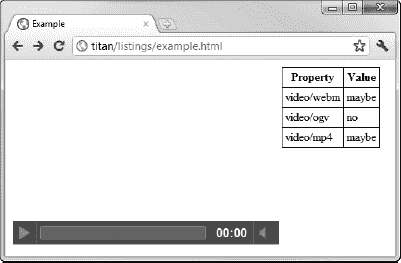

# 三十四、使用多媒体

HTML5 支持在浏览器中播放音频和视频文件，而无需使用 Adobe Flash 等插件。浏览器插件是浏览器崩溃的主要原因，尤其是 Flash，是众所周知的问题原因。

作为一个相关的题外话，我已经开始厌恶媒体播放的 Flash 了。我喜欢在写作的时候听播客，Chrome 默认使用 Flash 播放这些。我喜欢集成的便利性，但是时不时会出现问题，我有一台锁定的机器。把我逼疯了，每次都让我诅咒土坯。Flash 的无处不在很有用；这个软件的质量还有许多不足之处。

正如你将在本章看到的，HTML 对本地音频和视频的支持有很大的潜力，但仍有一些问题需要解决。这在很大程度上与每个浏览器支持的格式以及浏览器对其播放文件格式能力的不同理解有关。表 34-1 对本章进行了总结。

 **提示**如果你想重现本章中的例子，你可能需要给你的 web 服务器添加一些 MIME 类型。你可以在清单 34-7 中看到哪些是必需的。

### 使用视频元素

使用`video`元素将视频内容嵌入到网页中。表 34-2 描述了`video`元素。

清单 34-1 显示了这个元素的基本用法。

*清单 34-1。使用视频元素*

`<!DOCTYPE HTML>
<html>
    <head>
        <title>Example</title>
    </head>
    <body>
        **<video width="360" height="240" src="timessquare.webm"**
               **autoplay controls preload="none" muted>**
            **Video cannot be displayed**
        **</video>**
    </body>
</html>`

如果你以前看过网页中的视频，使用`video`元素的结果会很熟悉，如图图 34-1 所示。

*图 34-1。使用视频元素*

如果浏览器不支持`video`元素或无法播放视频，将显示回退内容(开始和结束标签之间的内容)。在这个例子中，我提供了一条简单的文本消息，但是一种常见的技术是使用非 HTML5 技术(比如 Flash)来支持旧浏览器，从而提供视频回放。

`video`元素有许多属性，我在表 34-3 中描述了这些属性。

#### 预加载视频

`preload`属性告诉浏览器，当包含`video`元素的页面第一次加载时，它是否应该乐观地下载视频。预加载视频可以减少用户开始回放时的初始延迟，但如果用户不观看视频，则可能会浪费网络带宽。该属性的允许值在表 34-4 中描述。

关于抢先加载视频的决定应该由用户想要观看视频的可能性来驱动，与自动加载视频内容所需的带宽相平衡。自动加载视频会带来更流畅的用户体验，但它会显著增加容量成本，当用户在没有观看视频的情况下离开页面时，这种成本就会被浪费掉。

这个属性的`metadata`值可以用来在`none`和`auto`值之间取得适度的平衡。`none`值的问题是视频内容显示为屏幕的空白区域。`metadata`值使浏览器获得足够的信息向用户显示视频的第一帧，而不必下载所有的内容。清单 34-2 显示了在同一文档中使用的`none`和`metadata`值。

*清单 34-2。使用预加载属性*的无和元数据值

`<!DOCTYPE HTML>
<html>
    <head>
        <title>Example</title>
    </head>
    <body>
        <video width="360" height="240" src="timessquare.webm"
                controls **preload="none"** muted>
            Video cannot be displayed
        </video>
        <video width="360" height="240" src="timessquare.webm"
                controls **preload="metadata"** muted>
            Video cannot be displayed
        </video>
    </body>
</html>`

您可以在图 34-2 的中看到这些值是如何影响显示给用户的。

*图 34-2。使用预加载属性*的无和元数据值

 **注意**`metadata`值给用户一个很好的预览，但是需要一些注意。在研究这个属性和使用网络分析器时，我发现浏览器倾向于抢先下载整个视频，即使只请求了元数据。平心而论，`preload`属性表达了浏览器可以随意忽略的偏好。但是，如果您需要限制带宽消耗，`poster`属性可能会提供一个更好的选择。详情见下一节。

#### 显示占位符图像

您可以使用`poster`属性向用户显示一个占位符图像。该图像将代替视频显示，直到用户开始播放。清单 34-3 显示了正在使用的`poster`属性。

*清单 34-3。使用海报属性指定占位符图像*

`<!DOCTYPE HTML>
<html>
    <head>
        <title>Example</title>
    </head>
    <body>
        <video width="360" height="240" src="timessquare.webm"
                controls preload="none" **poster="poster.png"**>
            Video cannot be displayed
        </video>
        
    </body>
</html>`

我截图了视频文件的第一帧，在上面叠加了`Poster`这个词。该图片包括视频控件，以向用户指示海报代表视频剪辑。在这个例子中，我还包含了一个`img`元素来演示海报图像是由`video`元素显示的，没有经过修改。图 34-3 显示了两种形式的海报。

*图 34-3。使用海报制作视频剪辑*

#### 设置视频尺寸

如果省略了`width`和`height`属性，浏览器将显示一个小占位符元素，当元数据可用时(即，当用户开始回放或`preload`属性设置为`metadata`时)，该元素的大小将调整为视频的固有尺寸。这可能会在调整页面布局以适应视频时产生不和谐的效果。

如果您指定了`width`和`height`属性，浏览器会保留视频的长宽比——您不必担心视频会在任何方向上被拉伸。清单 34-4 展示了`width`和`height`属性的应用。

*清单 34-4。应用宽度和高度属性*

`<!DOCTYPE HTML>
<html>
    <head>
        <title>Example</title>
        
    </head>
    <body>
        <video src="timessquare.webm" controls preload="auto" **width="600" height="240"**>
            Video cannot be displayed
        </video>
    </body>
</html>`

在这个例子中，我设置了`width`属性，使其与`height`属性不成比例。我还对`video`元素应用了一个样式，以强调浏览器只使用分配给该元素的部分空间来保持视频的纵横比。图 34-4 显示了结果。

*图 34-4。保存视频宽高比的浏览器*

#### 指定视频源(和格式)

指定视频的最简单方法是使用`src`属性，给出所需视频文件的 URL。这是我在前面的例子中采用的方法，在清单 34-5 中再次显示。

*清单 34-5。使用 src 属性*指定视频源

`<!DOCTYPE HTML>
<html>
    <head>
        <title>Example</title>
    </head>
    <body>
        <video **src="timessquare.webm"** controls width="360" height="240">
            Video cannot be displayed
        </video>
    </body>
</html>`

在这个清单中，我使用 source 元素来指定文件`timessquare.webm`。这是一个以`WebM`格式编码的文件。有了这个，你就进入了视频格式的艰难世界。在本书的前面，我提到了浏览器大战——几家公司试图通过对 HTML 和相关技术的非标准添加来控制浏览器市场。令人高兴的是，那些日子已经过去了，遵从标准被视为浏览器的一个卖点，还有速度、易用性和吸引人的标志。

遗憾的是，在视频格式方面，这一点还没有达到。如果一些公司能够建立自己的格式作为 HTML5 的主导格式，他们有可能赚很多钱。许可费可以收取，版税可以征收，专利组合可以增值。因此，没有普遍支持的视频格式，如果您希望使用视频来面向广泛的 HTML5 用户，您可以使用多种格式来编码您的视频。表 34-5 显示了目前有很强支持的格式(尽管这几乎肯定会随着时间的推移而改变)。

可悲的事实是，没有一种单一的格式可以用于所有的主流浏览器——在有之前，需要以多种格式编码同一视频。

 **注意**在视频编码中有一个完整的细节层次，我将直接跳过。它涉及容器、编解码器和其他令人兴奋的概念。结果是，每种格式中都有一些选项和选择，它们为了兼容性而牺牲了质量或紧凑性——鉴于浏览器对视频支持的不断变化，这些组合会频繁变化。我建议您参考主流浏览器的发行说明来确定支持级别，或者像我一样，对每种可能的排列进行编码，看看什么能提供最广泛的支持。

您使用`source`元素来指定多种格式。该元素在表 34-6 中描述。

清单 34-6 展示了如何使用`source`元素为浏览器提供视频格式的选择。

*清单 34-6。使用源元素*

`<!DOCTYPE HTML>
<html>
    <head>
        <title>Example</title>
    </head>
    <body>
        <video controls width="360" height="240">
            **<source src="timessquare.webm"/>**
            **<source src="timessquare.ogv"/>**
            **<source src="timessquare.mp4"/>**
            Video cannot be displayed
        </video>
    </body>
</html>`

浏览器按顺序在列表中向下移动，寻找可以播放的视频文件。这可能意味着需要多次请求服务器来获取每个文件的附加信息。浏览器判断是否可以播放视频的方法之一是通过服务器返回的 MIME 类型。通过将`type`属性应用于`source`元素，指定文件的 MIME 类型，可以向用户提供提示，如清单 34-7 所示。

*清单 34-7。在源元素上应用类型属性*

`<!DOCTYPE HTML>
<html>
    <head>
        <title>Example</title>
    </head>
    <body>
        <video controls width="360" height="240">
            <source src="timessquare.webm" **type="video/webm"** />
            <source src="timessquare.ogv" **type="video/ogg"** />
            <source src="timessquare.mp4" **type="video/mp4"** />
            Video cannot be displayed
        </video>
    </body>
</html>`

 **提示**`media`属性为浏览器提供视频最适合的设备类型的指导。关于如何定义该属性的值，详见第七章。

#### 追踪元素

HTML5 规范包括`track`元素，它为与视频相关的附加内容提供了一种机制。这包括副标题、题注和章节标题。表 34-7 描述了这个元素，但是目前主流浏览器都没有实现这个元素。

### 使用音频元素

元素允许您将音频内容嵌入到 HTML 文档中。该元素在表 34-8 中描述。

您可以看到,`audio`元素与`video`元素有很多共同之处。清单 34-8 展示了使用中的`audio`元素。

*清单 34-8。使用音频元素*

`<!DOCTYPE HTML>
<html>
    <head>
        <title>Example</title>
    </head>
    <body>
        **<audio controls src="mytrack.mp3" autoplay>**
            **Audio content cannot be played**
        **</audio>**
    </body>
</html>`

使用`src`属性指定音频源。尽管音频格式的世界没有视频那么有争议，但是*仍然*不是一种所有浏览器都可以自然播放的格式，尽管我更希望音频格式会比视频格式有所改变。

 **提示**通过应用`autoplay`属性，省略`controls`属性，可以创建一个音频自动播放，用户没有办法阻止的情况。代表你所有的用户，我恳求你不要这样做——尤其是如果你打算播放沉闷的、合成的、匿名的、本质上无法识别的音乐。将这样的音乐强加给你的用户，会让每一笔交易都让人想起漫长的电梯之旅，如果你的音轨中没有可辨别的乐器，这种情况尤其如此。请不要让你的用户听乏味、没有灵魂、毫无意义的音乐，当然也不要让它自动启动，让用户无法关闭它。

清单 34-9 展示了如何使用`source`元素来提供多种格式。

*清单 34-9。使用源元素提供多种音频格式*

`<!DOCTYPE HTML>
<html>
    <head>
        <title>Example</title>
    </head>
    <body>
        <audio controls autoplay>
            **<source src="mytrack.ogg" />**
            **<source src="mytrack.mp3" />**
            **<source src="mytrack.wav" />**
            Audio content cannot be played
        </audio>
    </body>
</html>`

在这两个例子中，我使用了`controls`属性，以便浏览器向用户显示默认控件。不同的浏览器之间会有一些差异，但是图 34-5 会给你一个预期的概念。

*图 34-5。谷歌浏览器中音频元素的默认控件*

### 通过 DOM 处理嵌入媒体

`audio`和`video`元素有足够的共同点，以至于`HTMLMediaElement`对象在 DOM 中为它们定义了核心功能。在 DOM 中，`audio`元素由`HTMLAudioElement`对象表示，但是这并没有定义除了`HTMLMediaElement`之外的额外功能。`video`元素由`HTMLVideoElement`对象表示。这确实定义了一些额外的属性，我将在本章后面描述。

 **提示**`audio`和`video`元素有如此多的共同点，唯一的区别是它们占据的屏幕空间大小。`audio`元素并不是用一大块屏幕来显示视频图像。您实际上可以使用`audio`元素来播放视频文件(尽管您显然只能获得原声音乐)，并且可以使用`video`元素来播放音频文件(尽管视频显示保持空白)。奇怪却真实。

#### 获取有关媒体的信息

`HTMLMediaElement`对象定义了许多成员，您可以使用它们来获取和修改关于元素和与之相关的媒体的信息。这些在表 34-9 中描述。

`HTMLVideoElement`对象定义了表 34-10 中显示的附加属性。

清单 34-10 展示了一些用于获取媒体元素基本信息的`HTMLMediaElement`属性。

*清单 34-10。获取关于媒体元素的基本信息*

`<!DOCTYPE HTML>
<html>
    <head>
        <title>Example</title>
        
    </head>
    <body>
        <video id="media" controls width="360" height="240" preload="metadata">
            <source src="timessquare.webm"/>
            <source src="timessquare.ogv"/>
            <source src="timessquare.mp4"/>
            Video cannot be displayed
        </video>
        <table id="info" border="1">
            <tr><th>Property</th><th>Value</th></tr>
        </table>
        
    </body>
</html>`

本例中的脚本在一个表中显示了许多属性的值，旁边是`video`元素。你可以在图 34-6 中看到结果。

*图 34-6。显示视频元素的基本信息*

我在图中展示了 Opera，因为它是唯一正确实现了`currentSrc`属性的浏览器。该属性显示`src`属性的值，或者来自媒体元素本身，或者来自正在使用的`source`元素(当有可用的格式选择时)。

#### 评估回放能力

`canPlayType`方法可以用来判断浏览器是否可以播放特定的媒体格式。该方法返回表 34-11 中显示的值之一。

这些值显然是模糊的——这又回到了一些媒体格式的复杂性和创建它们时可以使用的编码选项。清单 34-11 显示了正在使用的`canPlayType`方法。

*清单 34-11。使用 canPlayType 方法*

`<!DOCTYPE HTML>
<html>
    <head>
        <title>Example</title>
        
    </head>
    <body>
        <video id="media" controls width="360" height="240" preload="metadata">
            Video cannot be displayed
        </video>
        <table id="info" border="1">
            <tr><th>Property</th><th>Value</th></tr>
        </table>
        
    </body>
</html>`

在本例的脚本中，我使用了`canPlayType`方法来评估一组媒体类型。如果我收到一个`probably`响应，我为`video`元素设置`src`属性值。在这个过程中，我将每种媒体类型的响应记录在一个表格中。

当试图以这种方式选择媒体时需要小心，因为浏览器评估其播放格式能力的方式不同。例如，图 34-7 显示了 Firefox 的响应。

*图 34-7。评估 Firefox 中的媒体格式支持*

火狐非常看好`WebM`，并且确定`Ogg`和`MP4`文件不能播放——然而，火狐似乎很好地处理了`Ogg`视频文件。图 34-8 显示了 Chrome 的响应。

*图 34-8。评估 Chrome 对媒体格式的支持*

Chrome 的观点要保守得多，但它能愉快地播放我所有的三个媒体文件。事实上，Chrome 非常保守，我没有从`canPlayType`方法得到`probably`响应，所以没有进行媒体选择。

很难批评浏览器的反应不一致。变量太多，无法给出明确的答案，但是评估支持的不同方式意味着应该非常谨慎地使用`canPlayType`方法。

#### 控制媒体播放

`HTMLMediaElement`对象定义了许多成员，这些成员允许您控制回放并获得关于回放的信息。这些属性和方法在表 34-12 中描述。

清单 34-12 展示了如何使用表格中的属性来获取关于回放的信息。

*清单 34-12。使用 HTMLMediaElement 属性获取媒体播放的详细信息*

`<!DOCTYPE HTML>
<html>
    <head>
        <title>Example</title>
        
    </head>
    <body>
        <video id="media" controls width="360" height="240" preload="metadata">
            <source src="timessquare.webm"/>
            <source src="timessquare.ogv"/>
            <source src="timessquare.mp4"/>
            Video cannot be displayed
        </video>
        <table id="info" border="1">
            <tr><th>Property</th><th>Value</th></tr>
        </table>
        

            <button id="pressme">Press Me</button>
        

        
    </body>
</html>`

这个例子包括一个`button`元素，当按下它时，会导致`currentTime`、`duration`、`paused`和`ended`属性的当前值显示在一个表格中。在图 34-9 中可以看到效果。

*图 34-9。拍摄回放属性值的快照以响应按钮按下*

您可以使用回放方法来替换默认的媒体控制。清单 34-13 提供了一个演示。

*清单 34-13。替换默认媒体控件*

`<!DOCTYPE HTML>
<html>
    <head>
        <title>Example</title>
    </head>
    <body>
        <video id="media" width="360" height="240" preload="auto">
            <source src="timessquare.webm"/>
            <source src="timessquare.ogv"/>
            <source src="timessquare.mp4"/>
            Video cannot be displayed
        </video>
        

            <button>Play</button>
            <button>Pause</button>
        

        
    </body>
</html>`

在这个例子中，我从`video`元素中省略了`controls`属性，并使用由`button`按键触发的`play`和`pause`方法来开始和停止媒体播放。你可以在图 34-10 中看到效果。

*图 34-10。替换默认媒体控件*

 **提示**HTML 规范定义了一系列与加载和播放媒体相关的事件，通过`HTMLMediaElement`对象的`controller`属性公开。当我写这篇文章时，没有一个主流浏览器支持这个属性或它应该返回的`MediaController`对象。

### 总结

在本章中，我向您展示了 HTML5 如何通过`video`和`audio`元素支持本地媒体回放，以及如何使用 DOM 控制这些元素。鉴于 Flash 等插件的困难，原生媒体支持有很大的潜力，但这种方法仍处于采用的早期阶段。在格式支持问题得到解决，并且有足够多的浏览器支持这种方法之前，您将坚持使用混合匹配的方法。