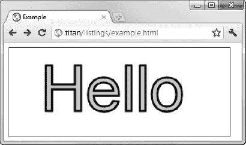

#三十六、使用画布元素——第二部分

在这一章中，我将继续描述`canvas`元素的特性，展示如何绘制更复杂的形状(包括弧线和曲线)，如何使用裁剪区域限制操作，以及如何绘制文本。我还描述了我们可以应用到画布上的效果和变换，包括阴影、透明、旋转和平移。表 36-1 对本章进行了总结。

### 使用路径绘图

第三十五章中的例子都依赖于我们画矩形的能力。矩形是一种有用的形状，但并不总是必需的。幸运的是，canvas 元素及其上下文提供了一组方法，允许我们使用*路径*来绘制形状。路径本质上是一组单独的线(称为子路径)，它们累积起来形成一个形状。我们绘制子路径就像用笔在纸上画画一样，不需要将笔尖从页面上抬起来——每个子路径都从画布上最后一个子路径结束的点开始。表 2 显示了可用于绘制基本路径的方法。

绘制路径的基本顺序如下:

*   调用`beginPath`方法
*   使用`moveTo`方法移动到开始位置
*   用`arc`、`lineTo`等方法画出子路径。
*   可选地调用`closePath`方法
*   调用`fill`或`stoke`方法

在接下来的小节中，我将向您展示如何将这个序列用于不同的子路径方法。

#### 用线条绘制路径

最简单的路径是由直线组成的。清单 36-1 提供了一个演示。

*清单 36-1。从直线创建路径*

`<!DOCTYPE HTML>
<html>
    <head>
        <title>Example</title>
        
    </head>
    <body>
        <canvas id="canvas" width="500" height="140">
            Your browser doesn't support the <code>canvas</code> element
        </canvas>
        
    </body>
</html>`

在这个例子中，我创建了三条路径。你可以在图 36-1 中看到它们是如何出现在画布上的。

*图 36-1。使用 lineTo 方法创建简单路径*

对于第一条路径，我明确地画了两条线，然后使用了`closePath`方法。画布将关闭路径。然后我调用`fill`方法用`fillStyle`属性指定的样式填充形状(我在这个例子中使用了纯色，但是我们可以使用第三十五章中描述的任何渐变和图案)。

对于第二个形状，我指定了三个子路径，但没有关闭形状。你可以看到我同时调用了`fill`和`stroke`方法，用颜色填充形状并沿着路径画一条线。请注意，填充颜色的绘制就像形状是闭合的一样。canvas 元素假设从最后一个点到第一个点的子路径，并使用它来填充形状。相比之下，`stroke`方法只遵循已经定义好的子路径。

 **提示**对于第二个形状，我在`stroke`方法之前调用了`fill`方法，这使得画布用纯色填充形状，然后沿着路径画一条线。如果`lineWidth`属性大于`1`，我们会得到不同的视觉效果，我们首先调用`stroke`方法。较宽的线条绘制在路径的两侧，因此当 fill 方法被调用时，部分线条被该方法覆盖，有效地缩小了线条宽度。

对于第三个形状，我只是在两点之间画了一条线，因为路径不必有多个子路径。当我们画线或保持形状打开时，我们可以使用`lineCap`属性来设置线条终止的样式。该属性的三个允许值是:`butt`、`round,`和`square`(默认为 butt)。清单 36-2 展示了这个属性及其使用中的每个值。

*清单 36-2。设置`lineCap`属性*

`<!DOCTYPE HTML>
<html>
    <head>
        <title>Example</title>
        
    </head>
    <body>
        <canvas id="canvas" width="200" height="140">
            Your browser doesn't support the <code>canvas</code> element
        </canvas>
        
    </body>
</html>`

本例中的脚本为每种样式画了一条非常粗的线。我还添加了一条引导线来演示`round`和`square`样式被绘制在线尾之外，如图图 36-2 所示。

*图 36-2。三种线帽风格*

#### 绘制矩形

`rect`方法向当前路径添加一个矩形子路径。如果你需要一个独立的矩形，那么第三十五章中描述的`fillRect`和`strokeRect`方法更合适。当你需要添加一个矩形到一个更复杂的形状时，`rect`方法很有用，如清单 36-3 所示。

*清单 36-3。用 rect 方法画矩形*

`<!DOCTYPE HTML>
<html>
    <head>
        <title>Example</title>
        
    </head>
    <body>
        <canvas id="canvas" width="500" height="140">
            Your browser doesn't support the <code>canvas</code> element
        </canvas>
        
    </body>
</html>`

当使用`rect`方法时，我们不必使用`moveTo`方法，因为我们将矩形的坐标指定为前两个方法参数。在清单中，我画了一对名为`closePath`的线来创建一个三角形，然后画了两个相邻的矩形。你可以在图 36-3 中看到结果。

*图 36-3。用 rect 方法画矩形*

子路径不一定要接触才能形成路径的一部分。我们可以有几个不相连的子路径，它们仍然被视为同一形状的一部分。清单 36-4 给出了一个演示。

*清单 36-4。使用断开的子路径*

`...

...`

在此示例中，子路径没有连接，但总体结果仍然是一条路径。当我调用`stroke`或`fill`方法时，效果被应用到我创建的所有子路径上，正如你在图 36-4 中看到的。

*图 36-4。使用断开的子路径*

### 画圆弧

我们使用`arc`和`arcTo`方法在画布上绘制弧线，尽管每种方法绘制弧线的方式不同。表 36-3 描述了画布中与圆弧相关的方法。

#### 使用 arcTo 方法

清单 36-5 演示了如何使用`arcTo`方法。

*清单 36-5。使用 arcTo 方法*

`<!DOCTYPE HTML>
<html>
    <head>
        <title>Example</title>
        
    </head>
    <body>
        <canvas id="canvas" width="500" height="140">
            Your browser doesn't support the <code>canvas</code> element
        </canvas>
        ` `    </body>
</html>`

用`arcTo`方法画出的圆弧依赖于两条线。第一行是从最后一个子路径的末端到前两个方法参数描述的点。第二条线是从前两个参数描述的点到第三个和第四个参数描述的点绘制的。然后，圆弧被绘制为最后一个子路径的端点和第二个点之间的最短直线，该直线描绘了半径由最后一个参数指定的圆弧。为了更容易理解，我在画布上添加了一些额外的路径来提供一些上下文，如图 36-5 所示。

*图 36-5。使用`arcTo`方法*

你可以看到用红色画的两条线。我已经指定了一个半径，两条线的长度都是一样的，这意味着我们最终得到了一个整洁的曲线，它刚好接触到前一个子路径的最后一个点，以及第三和第四个方法参数所描述的点。半径和线条长度的大小并不总是那么方便，所以画布会根据需要调整它绘制的弧线。作为示范，清单 36-6 使用第三十章中描述的事件来监控鼠标的移动，并在鼠标在屏幕上移动时为不同的点画出弧线。

*清单 36-6。响应鼠标移动画弧线*

`<!DOCTYPE HTML>
<html>
    <head>
        <title>Example</title>
        
    </head>
    <body>
        <canvas id="canvas" width="500" height="140">
            Your browser doesn't support the <code>canvas</code> element
        </canvas>` `        
    </body>
</html>`

本例中的脚本根据鼠标移动时按下的键来移动不同的点。如果按下 control 键，第一个点将被移动(代表前一个子路径的终点)。如果按下 shift 键，则移动第二个点(由`arcTo`方法的前两个参数表示的点)。如果两个键都没有按下，则移动第三个点(由第三和第四个方法参数表示的点)。值得花一点时间来研究这个例子，以了解弧线与两条线的位置之间的关系。你可以在图 36-6 中看到这个快照。

*图 36-6。线条和圆弧的关系*

#### 使用电弧法

使用`arc`方法稍微简单一些。我们使用前两个方法参数在画布上指定一个点。我们用第三个参数指定圆弧的半径，然后指定圆弧的开始和结束角度。最后一个参数指定是顺时针还是逆时针绘制弧线。清单 36-7 给出了一些例子。

*清单 36-7。使用电弧法*

`<!DOCTYPE HTML>
<html>
    <head>
        <title>Example</title>
        
    </head>
    <body>
        <canvas id="canvas" width="500" height="140">
            Your browser doesn't support the <code>canvas</code> element
        </canvas>
        
    </body>
</html>`

你可以在图 36-7 中看到这些弧线所描述的形状。

*图 36-7。使用电弧法*

正如第一个和第二个弧所示，我们可以使用`arc`方法来绘制完整的圆或规则的弧，正如您所期望的那样。然而，如第三个图形所示，我们可以使用`arc`方法来创建更复杂的路径。如果我们使用 arc 方法，并且已经绘制了一个子路径，那么将直接从前面的子路径的末端到 arc 方法的前两个参数描述的坐标绘制一条线。这条线是在我们描述的弧线之外画的。我用这个怪癖结合一个`for`环将围绕同一点画的四个小圆弧连接在一起，得到如图 36-7 所示的形状。

### 绘制贝塞尔曲线

画布支持绘制两种贝塞尔曲线:三次和二次。您可能在绘图包中使用过贝塞尔曲线。我们选择一个起点和终点，然后添加一个或多个控制点来塑造曲线。贝塞尔曲线在画布上的问题是，我们没有任何视觉反馈，这使得我们更难获得我们想要的曲线。在接下来的例子中，我将在脚本中添加一些代码来提供一些上下文，但是在一个真实的项目中，您必须进行实验来获得您需要的曲线。表 36-4 显示了我们可以用来绘制曲线的方法。

#### 绘制三次贝塞尔曲线

`bezierCurveTo`方法从前一个子路径的末端到第 5 个个和第 6 个个方法参数指定的点绘制一条曲线。有两个控制点——由前四个参数指定。清单 36-8 展示了这种方法的使用(以及一些额外的路径，以便更容易理解参数值和产生的曲线之间的关系)。

*清单 36-8。绘制三次贝塞尔曲线*

`<!DOCTYPE HTML>
<html>
    <head>
        <title>Example</title>
        
    </head>
    <body>
        <canvas id="canvas" width="500" height="140">
            Your browser doesn't support the <code>canvas</code> element
        </canvas>
        
    </body>
</html>`

为了让您了解曲线是如何绘制的，本例中的脚本会根据鼠标的移动来移动贝塞尔曲线上的控制点。如果按下 shift 键，则第一个控制点移动。如果按下控制键，则移动第二个控制点。你可以在图 36-8 中看到效果。

*图 36-8。绘制三次贝塞尔曲线*

#### 绘制二次贝塞尔曲线

二次贝塞尔曲线只有一个控制点，因此`quadraticCurveTo`方法比`bezierCurveTo`方法少两个参数。清单 36-9 显示了之前的例子，修改后显示一条二次曲线，用`quadraticCurveTo`方法绘制。

*清单 36-9。绘制二次贝塞尔曲线*

`<!DOCTYPE HTML>
<html>
    <head>
        <title>Example</title>
        
    </head>
    <body>
        <canvas id="canvas" width="500" height="140">
            Your browser doesn't support the <code>canvas</code> element
        </canvas>
        
    </body>
</html>`

你可以在图 36-9 中看到一个示例曲线。

*图 36-9。一条二次贝塞尔曲线*

### 创建裁剪区域

正如本章前面所演示的，我们可以使用`stroke`和`fill`方法来绘制或填充路径。还有一个替代方案，就是使用表 36-5 中描述的方法。

一旦我们定义了一个剪辑区域，只有出现在该区域内的路径才会显示在屏幕上。清单 36-10 给出了一个演示。

*清单 36-10。使用剪辑区域*

`<!DOCTYPE HTML>
<html>
    <head>
        <title>Example</title>
        
    </head>
    <body>
        <canvas id="canvas" width="500" height="140">
            Your browser doesn't support the <code>canvas</code> element
        </canvas>
        
    </body>
</html>`

本例中的脚本绘制了一个填充画布的矩形，创建了一个较小的剪辑区域，然后绘制了另一个填充画布的矩形。正如你在图 36-10 中看到的，只画出了第二个矩形中适合裁剪区域的部分。

*图 36-10。裁剪区域的效果*

### 绘图文本

我们可以在画布上绘制文本，尽管对这样做的支持是非常基本的。表 36-6 显示了可用的方法。

我们可以使用三个绘制状态属性来控制文本的绘制方式，如表 36-7 所示。

清单 36-11 展示了我们如何填充和描边文本。我们使用与 CSS 字体速记属性相同的格式字符串为`font`属性指定值，我在第二十二章的中描述过。

*清单 36-11。在画布上绘制文本*

`<!DOCTYPE HTML>
<html>
    <head>
        <title>Example</title>
        
    </head>
    <body>
        <canvas id="canvas" width="350" height="140">
            Your browser doesn't support the <code>canvas</code> element
        </canvas>
        
    </body>
</html>`

文本是使用`fillStyle`和`strokeStyle`属性绘制的，这意味着我们拥有与形状相同的颜色、渐变和图案。在这个例子中，我用两种纯色填充和描边文本。你可以在图 36-11 中看到效果。

*图 36-11。填充和描边文本*

### 使用效果和变换

我们可以在画布上应用一些效果和变换，如下面几节所述。

#### 使用阴影

有四个绘制状态属性，我们可以使用它们来为我们在画布上绘制的形状和文本添加阴影。这些属性在表 36-8 中描述。

清单 36-12 显示了我们如何使用这些属性来应用阴影。

*清单 36-12。对形状和文本应用阴影*

`<!DOCTYPE HTML>
<html>
    <head>
        <title>Example</title>
        
    </head>
    <body>
        <canvas id="canvas" width="500" height="140">
            Your browser doesn't support the <code>canvas</code> element
        </canvas>
        
    </body>
</html>`

本示例将阴影应用于文本、矩形和一个完整的圆。和两条弧线。如图 36-12 所示，无论形状是开放的、闭合的、填充的还是描边的，阴影都被应用到形状上。

*图 36-12。对文本和形状应用阴影*

#### 使用透明度

我们可以用两种方法来设置我们绘制的文本和形状的透明度。第一种是使用`rgba`函数(而不是`rgb`)指定一个`fillStyle`或`strokeStyle`值，如第四章所述。我们也可以使用通用的`globalAlpha`绘制状态属性。清单 36-13 显示了`globalAlpha`属性的使用。

*清单 36-13。使用 globalAlpha 属性*

`<!DOCTYPE HTML>
<html>
    <head>
        <title>Example</title>
        
    </head>
    <body>
        <canvas id="canvas" width="300" height="120">
            Your browser doesn't support the <code>canvas</code> element
        </canvas>
        
    </body>
</html>`

`globalAlpha`值的范围可以从 0(完全透明)到 1(完全不透明，这是默认值)。在这个例子中，我绘制了一些文本，将`globalAlpha`属性设置为 0.5，然后填充部分覆盖文本的矩形。你可以在图 36-13 中看到结果。

*图 36-13。通过 globalAlpha 属性使用透明度*

#### 使用构图

我们可以结合使用透明性和`globalCompositeOperation`属性来控制图形和文本在画布上的绘制方式。该属性的允许值在表 36-9 中描述。对于这个属性，*源*由属性设置后执行的任何操作组成，目标图像是属性设置时画布的状态

`globalCompositeOperation`属性的值可以产生一些惊人的效果。清单 36-14 包含一个`select`元素，该元素包含所有合成值的选项。值得花一点时间来研究这个例子，看看每个合成模式是如何工作的。

*清单 36-14。使用 globalCompositeOperation 属性*

`<!DOCTYPE HTML>
<html>
    <head>
        <title>Example</title>
        
    </head>
    <body>
        <canvas id="canvas" width="300" height="120">
            Your browser doesn't support the <code>canvas</code> element
        </canvas>
        <label>Composition Value:</label><select id="list">
            <option>copy</option>
            <option>destination-atop</option><option>destination-in</option>
            <option>destination-over</option><option>distination-out</option>
            <option>lighter</option><option>source-atop</option>
            <option>source-in</option><option>source-out</option>
            <option>source-over</option><option>xor</option>
        </select>
        
    </body>
</html>`

在图 36-14 中可以看到`source-out`和`destination-over`的值。有些浏览器对样式的解释略有不同，所以您可能看不到图中显示的确切内容。

*图 36-14。使用 globalCompositeOperation 属性*

#### 使用变换

我们可以对画布应用一个转换，然后将它应用于任何后续的绘制操作。表 36-10 描述了转换方法。

这些方法创建的转换仅适用于后续的绘制操作——画布的现有内容保持不变。清单 36-15 展示了我们如何使用缩放、旋转和平移方法。

*清单 36-15。使用转换*

`<!DOCTYPE HTML>
<html>
    <head>
        <title>Example</title>
        
    </head>
    <body>
        <canvas id="canvas" width="400" height="200">
            Your browser doesn't support the <code>canvas</code> element
        </canvas>
        
    </body>
</html>`

在本例中，我填充并描边了一些文本，然后缩放、平移和旋转画布，这将影响我随后绘制的填充矩形和描边矩形。你可以在图 36-15 中看到效果。

*图 36-15。变换画布*

### 总结

在这一章中，我已经展示了如何使用不同的路径在画布上绘画，包括直线、矩形、弧线和曲线。我还演示了 canvas 文本工具以及如何应用阴影和透明等效果。我通过演示画布支持的不同合成模式和转换完成了这一章。