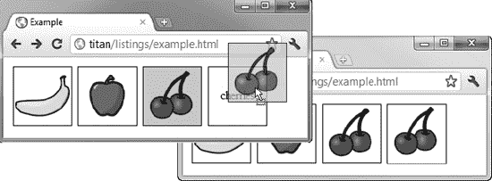

# 三十七、使用拖放

HTML5 增加了对拖放的支持。这是我们以前不得不依赖 jQuery 等 JavaScript 库来处理的事情。将拖放功能内置到浏览器中的好处是，它可以正确地集成到操作系统中，并且正如您将看到的，可以在不同的浏览器之间工作。

这项功能仍处于早期阶段，在主流浏览器提供的规范和实现之间还有很大的差距。并非所有的浏览器都实现了规范的所有部分，并且一些特性以完全不同的方式实现。在这一章中，我已经向你展示了目前的工作方式。这并不是 HTML5 标准定义的完整功能集，但它足以启动并运行。表 37-1 对本章进行了总结。

### 创建源项目

我们告诉浏览器文档中的哪些元素可以通过`draggable`属性拖动。该属性有三个允许值，在表 37-2 中描述。

默认值是`auto`值，由浏览器决定，这通常意味着默认情况下可以拖动所有元素，我们必须通过将`draggable`属性设置为`false`来显式禁用拖动。当使用拖放功能时，我倾向于将`draggable`属性显式设置为`true`，尽管主流浏览器默认认为所有元素都是`draggable`。清单 37-1 显示了一个简单的 HTML 文档，其中有一些可以拖动的元素。

*清单 37-1。定义可拖动项目*

`<!DOCTYPE HTML>
<html>
    <head>
        <title>Example</title>
        
    </head>
    <body>
        

            
            
            
            

                
Drop Here

            
            `

`        
    </body>
</html>`

在这个例子中，有三个`img`元素，每个元素的`draggable`属性都被设置为`true`。我还创建了一个具有`target`的`id`的`div`元素，我们将很快将其设置为被拖动的`img`元素的接收者。您可以在图 37-1 中看到该文档如何出现在浏览器中。

*图 37-1。三个可拖动图像和一个目标*

我们可以拖动水果图片，而不需要做任何进一步的工作，但是浏览器会指示我们不能将它们放在任何地方。这通常是通过将禁止进入标志显示为光标来实现的，如图图 37-2 所示。

*图 37-2。浏览器显示不能放下被拖动的项目*

#### 处理拖动事件

我们通过一系列事件利用拖放功能。这些是针对被拖动元素的事件和针对潜在拖放区的事件。表 37-3 描述了那些被拖动元素的事件。

我们可以使用这些事件在视觉上强调拖动操作，如清单 37-2 所示。

*清单 37-2。使用针对被拖动元素的事件*

`<!DOCTYPE HTML>
<html>
    <head>
        <title>Example</title>
        
    </head>
    <body>
        

            
            
            
            

                
Drop Here

            

        
    </body>
</html>`

我定义了一个新的 CSS 样式，应用于`dragged`类中的元素。为了响应`dragstart`事件，我将元素添加到这个类中，并为了响应`dragend`事件，将它从这个类中移除。为了响应`drag`事件，我将拖放区中显示的文本设置为被拖动元素的`id`值。在拖动操作期间，每隔几毫秒就调用一次拖动事件，因此这不是最有效的方法，但它确实演示了该事件。您可以在图 3 中看到效果。请注意，我们仍然没有一个工作的空投区，但我们越来越接近。

*图 37-3。使用 dragstart、dragend 和 drag 事件*

### 创建拖放区

要使一个元素成为拖放区，我们需要处理`dragenter`和`dragover`事件。这是针对空投区的两个事件。全套在表 37-4 中描述。

`dragenter`和`dragover`事件的默认动作是拒绝接受任何拖动的项目，所以我们必须做的最重要的事情是防止默认动作被执行。清单 37-3 包含了一个例子。

 **注意**拖放的规范告诉我们，我们还必须将`dropzone`属性应用于我们想要放入拖放区的元素，并且属性值应该包含我们愿意接受的操作和数据类型的细节。这不是浏览器实际实现该功能的方式。对于这一章，我描述了事物真正工作的方式，而不是它们是如何被指定的。

*清单 37-3。通过处理 dragenter 和 dragover 事件创建拖放区*

`<!DOCTYPE HTML>
<html>
    <head>
        <title>Example</title>
        
    </head>
    <body>
        

            
            
            
            

                
Drop Here

            

        

        
    </body>
</html>`

有了这些东西，我们就有了一个活跃的空投区。当我们拖动一个项目到拖放区元素上时，浏览器会显示如果我们拖放它，它将被接受，如图图 37-4 所示。

*图 37-4。浏览器指示可以删除某个项目*

#### 接收水滴

我们通过处理`drop`事件来接收被拖放的元素，当一个项目被放到拖放区元素上时，该事件被触发。清单 37-4 展示了我们如何使用一个全局变量作为被拖动元素和拖放区之间的通道来响应`drop`事件。

*清单 37-4。处理掉落事件*

`<!DOCTYPE HTML>
<html>
    <head>
        <title>Example</title>
        
    </head>
    <body>
        

            
            
            
            

                
Drop Here

            

        

        
    </body>
</html>`

当`dragstart`事件被触发时，我设置了`draggedID`变量的值。这允许我记下被拖动元素的`id`属性值。当`drop`事件被触发时，我使用这个值来克隆被拖动的`img`元素，并将其添加为拖放区元素的子元素。

 **提示**在这个例子中，我阻止了`drop`事件的默认动作。如果没有这一点，浏览器可以做一些意想不到的事情。例如，在这个场景中，Firefox 导航离开页面，并显示被拖动的`img`元素的`src`属性所引用的图像。

你可以在图 37-5 中看到效果。

*图 37-5。响应拖动事件*

### 使用数据传输对象

与拖放触发的事件一起调度的对象是`DragEvent`，它是从`MouseEvent`派生出来的。`DragEvent`对象定义了`Event`和`MouseEvent`对象的所有功能(在第三十章的中有描述)，其附加属性如表 37-5 所示。

我们使用`DataTransfer`对象将任意数据从被拖动的元素传输到拖放区元素。`DataTransfer`对象定义的属性和方法在表 37-6 中描述。

在前一个例子中，我克隆了元素本身；然而，`DataTransfer`对象允许我们使用更复杂的方法。我们能做的第一件事是使用`DataTransfer`对象将数据从被拖动的元素转移到拖放区，如清单 37-5 所示。

*清单 37-5。使用 DataTransfer 对象传输数据*

`<!DOCTYPE HTML>
<html>
    <head>
        <title>Example</title>
        
    </head>
    <body>
        

            
            
            
            

                
Drop Here

            

        

        
    </body>
</html>`

当响应`dragstart`事件时，我使用`setData`方法来设置我想要传输的数据。对于指定数据类型的第一个参数，只有两个受支持的值— `Text`或`Url`(浏览器只可靠地支持`Text`)。第二个参数是我们想要传输的数据:在本例中，是被拖动元素的`id`属性。为了检索值，我使用了`getData`方法，使用数据类型作为参数。

您可能想知道为什么这是比使用全局变量更好的方法。答案是它可以跨浏览器工作，我的意思不是跨相同浏览器中的窗口或标签，而是跨不同的*类型*的浏览器。这意味着我可以从 Chrome 文档中拖放元素到 Firefox 文档中，因为拖放支持与操作系统中的相同功能集成在一起。如果您打开一个文本编辑器，键入单词`banana`，选择它，然后将其拖动到浏览器中的拖放区，您将看到香蕉图像正在显示，就像我们在同一文档中拖动`img`元素时一样。

#### 按数据过滤拖动的项目

我们可以使用存储在`DataTransfer`对象中的数据来选择我们愿意在拖放区接受的元素种类。清单 37-6 展示了如何操作。

*清单 37-6。使用 DataTransfer 对象过滤拖动的元素*

`…

…`

在这个例子中，我从`DataTransfer`对象获取数据值，并检查它是什么。我表示，只有当数据值为`banana`时，我才愿意接受被拖动的元素。这具有过滤掉苹果和樱桃图像的效果。当用户将它们拖放到拖放区时，浏览器会显示它们不能被拖放。

 **提示**这种过滤在 Chrome 中不起作用，因为`getData`方法在为`dragenter`和`dragover`事件调用处理程序时不起作用。

#### 拖放文件

隐藏在浏览器深处的是另一个新的 HTML5 功能，称为*文件 API* ，它允许我们在本地机器上处理文件，尽管是以严格控制的方式。控制的一部分是我们通常不直接与文件 API 交互。相反，它是通过其他功能公开的，包括拖动和放下。清单 37-7 展示了当用户从操作系统中拖放文件到拖放区时，我们如何使用文件 API 来响应。

*清单 37-7。处理文件*

`<!DOCTYPE HTML>
<html>
    <head>
        <title>Example</title>
        
    </head>
    <body>
        

            
Drop Files Here

        

        <table id="data" border="1">
        </table>

        
    </body>
</html>`

当用户将文件放到拖放区时，`DataTransfer`对象的 files 属性返回一个`FileList`对象。我们可以将此视为一个由`File`对象组成的数组，每个对象代表用户拖放的一个文件(用户可以选择多个文件并一次性拖放)。表 37-7 显示了`File`对象的属性。

在这个例子中，`script`列举了放到拖放区的文件，并在一个表格中显示了`File`属性的值。你可以在图 37-6 中看到这个效果，我把一些示例文件放到了拖放区。

*图 37-6。显示关于文件的数据*

##### 在表单中上传拖放的文件

我们可以将拖放功能、文件 API 和使用 Ajax 请求上传数据结合起来，以允许用户从操作系统拖动想要包含在表单提交中的文件。清单 37-8 包含了一个演示。

*清单 37-8。结合拖放，文件 API 和表单数据对象*

`<!DOCTYPE HTML>
<html>
    <head>
        <title>Example</title>
        
    </head>
    <body>
        <form id="fruitform" method="post" action="http://titan:8080/form">
            

                

                    
Bananas:

                    
<input name="bananas" value="2"/>

                

                

                    
Apples:

                    
<input name="apples" value="5"/>

                

                

                    
Cherries:

                    
<input name="cherries" value="20"/>

                

                

                    
File:

                    
<input type="file" name="file"/>

                

                

                    
Total:

                    
0 items

                

            

            

                
Drop Files Here

            

            <button id="submit" type="submit">Submit Form</button>
        </form>
        
    </body>
</html>`

在这个例子中，我在取自第三十三章的例子中添加了一个拖放区，在那里我演示了如何使用`FormData`对象将表单数据上传到服务器。我们可以通过使用`FormData.append`方法，将一个`File`对象作为该方法的第二个参数传入，将文件放入拖放区。提交表单时，文件内容将作为表单请求的一部分自动上传到服务器。

### 总结

在这一章中，我展示了对拖放元素的支持。这个特性的实现还有很多不尽如人意的地方，但是它很有前途，我希望主流浏览器很快会开始解决这种不一致的问题。如果你不能等到那时(或者你不在乎在其他浏览器和操作系统之间来回拖动)，那么你应该考虑使用一个 JavaScript 库，比如 jQuery 和 jQuery UI。