# 三十八、使用地理定位

地理定位 API 允许我们获得关于用户当前地理位置的信息(或者至少是运行浏览器的系统的位置)。这不是 HTML5 规范的一部分，但它通常被归为与 HTML5 相关的新特性的一部分。表 **38-** 1 对本章进行了总结。

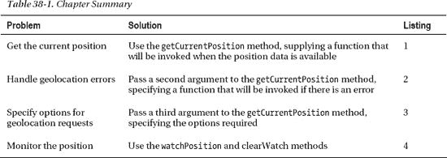

### 使用地理定位

我们通过全局`navigator.geolocation`属性访问地理位置特性，该属性返回一个`Geolocation`对象——这个对象的方法在表 **38-** 2 中有描述。

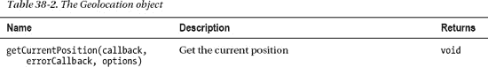

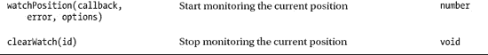

#### 获取当前位置

顾名思义，`getCurrentPosition`方法获取当前位置，尽管位置信息不是作为方法本身的结果返回的。相反，我们提供了一个成功回调函数，当位置信息可用时调用该函数——这考虑到了在请求位置和位置变为可用之间可能存在延迟的事实。清单 38 **-** 1 展示了我们如何使用这种方法获得位置信息。

*清单 **38-** 1。获取当前位置*

`<!DOCTYPE HTML>
<html>
    <head>
        <title>Example</title>
        
    </head>
    <body>
        <table border="1">
            <tr>
                <th>Longitude:</th><td id="longitude">-</td>
                <th>Latitude:</th><td id="latitude">-</td>
            </tr>
            <tr>
                <th>Altitude:</th><td id="altitude">-</td>
                <th>Accuracy:</th><td id="accuracy">-</td>
            </tr>
            <tr>
                <th>Altitude Accuracy:</th><td id="altitudeAccuracy">-</td>
                <th>Heading:</th><td id="heading">-</td>
            </tr>
            <tr>
                <th>Speed:</th><td id="speed">-</td>
                <th>Time Stamp:</th><td id="timestamp">-</td>
            </tr>
        </table>
        
    </body>
</html>`

本例中的脚本调用`getCurrentPosition`，将`displayPosition`函数作为方法参数传递。当位置信息可用时，指定的函数被调用，浏览器传入一个给出位置细节的`Position`对象——细节显示在一个`table`元素的单元格中。`Position`对象非常简单，正如你在表格 **38-** 3 中看到的。

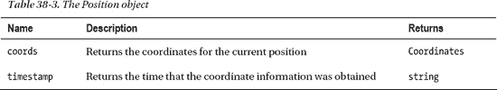

我们真正感兴趣的是由`Position.coords`属性返回的`Coordinates`对象。表格 **38-** 4 描述了`Coordinates`对象的属性。

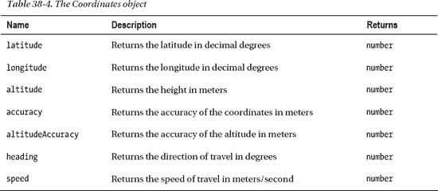

并不是`Coordinates`对象中的所有数据值都会一直可用。浏览器获取位置信息的机制是未指定的，并且使用了许多技术。移动设备越来越多地拥有 GPS、加速度计和指南针设施，这意味着最准确和完整的数据将在这些平台上可用。

我们仍然可以获得其他设备的位置信息——浏览器使用地理定位服务，试图根据网络信息确定位置。如果您的系统有 Wi-Fi 适配器，那么在范围内的网络会与作为街道级视图(如 Google Street View)调查的一部分的网络目录进行比较。如果 Wi-Fi 不可用，则可以使用您的 ISP 提供的 IP 地址来大致了解位置。

从网络信息推断出的位置的准确性各不相同，但它可能是惊人的准确。当我开始测试这个功能时，我惊讶地发现我的位置被报告得如此之窄。事实上，它是如此准确，以至于我在截图中替换了帝国大厦的位置——利用真实的位置信息(来自我和附近的 Wi-Fi 网络),你可以很容易地找到我的房子，并看到我的汽车停在车道上的照片。可怕的事情——以至于当一个文档使用地理定位功能时，所有浏览器做的第一件事就是要求用户授予许可——你可以在图 38-1 中看到 Chrome 是如何做到这一点的。

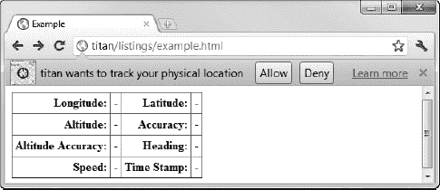

*图 **38-** 1。授予地理定位功能的权限*

如果用户批准了请求，那么就获得位置信息，并且当位置信息可用时，就调用回调函数。你可以在图 **38-** 2 中看到我的台式电脑提供的那种数据。

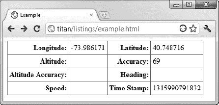

*图 **38-** 2。显示地理定位服务提供的位置信息*

我用来写书的电脑没有安装任何专门的定位硬件——没有 GPS、指南针、高度计或加速度计。因此，唯一可用的数据是纬度和经度以及这些值的准确性。对于我的位置，Chrome 估计我在已报告位置的 69 米(约 75 码)内(这在我的情况下是一个低估)。

 **提示** Chrome、Firefox 和 Opera 都使用谷歌地理定位服务。Internet Explorer 和 Safari 使用自己的。我只能报告我的位置，但微软服务报告的精度约为 48，000 米(约 30 英里)。我发现数据精确到大约 3 英里。苹果服务报告的精度为 500 米，但提供了所有数据中最好的——它在几英尺内确定了我的位置。哇哦！

### 处理地理位置错误

我们可以为`getCurrentPosition`方法提供第二个参数，这允许我们提供一个函数，如果在获取位置时出现错误，这个函数将被调用。向该函数传递一个`PositionError`对象，该对象定义了表 **38-** 5 中描述的属性。

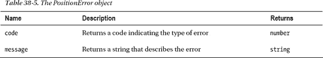

`code`属性有三个可能的值。这些属性在表 **38-** 6 中描述。

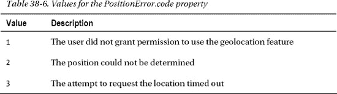

清单 38 **-** 2 展示了我们如何使用`PositionError`对象接收错误。

*清单 38 **-** 2。用 PositionError 对象*处理错误

`<!DOCTYPE HTML>` `<html>
    <head>
        <title>Example</title>
        
    </head>
    <body>
        <table border="1">
            <tr>
                <th>Longitude:</th><td id="longitude">-</td>
                <th>Latitude:</th><td id="latitude">-</td>
            </tr>
            <tr>
                <th>Altitude:</th><td id="altitude">-</td>
                <th>Accuracy:</th><td id="accuracy">-</td>
            </tr>
            <tr>
                <th>Altitude Accuracy:</th><td id="altitudeAccuracy">-</td>
                <th>Heading:</th><td id="heading">-</td>
            </tr>
            <tr>
                <th>Speed:</th><td id="speed">-</td>
                <th>Time Stamp:</th><td id="timestamp">-</td>
            </tr>
            **<tr>**
                **<th>Error Code:</th><td id="errcode">-</td>**
                **<th>Error Message:</th><td id="errmessage">-</td>**
            **</tr>**
        </table>

        ` `    </body>
</html>`

创建错误的最简单方法是在浏览器提示时拒绝权限。本例中的脚本显示了`table`元素中的错误细节，您可以在图 **38-** 3 中看到效果。

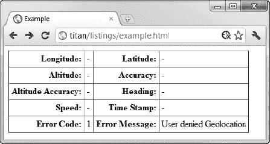

*图 38 **-** 3。显示地理位置错误的详细信息*

### 指定地理位置选项

我们可以提供给`getCurrentPosition`方法的第三个参数是一个`PositionOptions`对象。这个特性允许我们对获取位置的方式进行一些控制。表 **38-** 7 显示了该对象定义的属性。

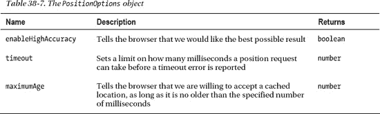

将`highAccuracy`属性设置为`true`只是要求浏览器给出最好的可能结果——并不能保证它会带来更准确的位置。对于移动设备，如果禁用了节能模式，或者在某些情况下打开了 GPS 功能，可能会获得更准确的位置(低精度位置可能来自 Wi-Fi 或手机信号塔数据)。对于其他设备，可能没有更高精度的数据可用。清单 38-3 展示了当请求一个位置时我们如何使用`PositionOptions`对象。

*清单 38-3。请求位置数据时指定选项*

`<!DOCTYPE HTML>
<html>
    <head>
        <title>Example</title>
        
    </head>
    <body>
        <table border="1">
            <tr>
                <th>Longitude:</th><td id="longitude">-</td>
                <th>Latitude:</th><td id="latitude">-</td>
            </tr>
            <tr>
                <th>Altitude:</th><td id="altitude">-</td>
                <th>Accuracy:</th><td id="accuracy">-</td>
            </tr>
            <tr>
                <th>Altitude Accuracy:</th><td id="altitudeAccuracy">-</td>
                <th>Heading:</th><td id="heading">-</td>
            </tr>
            <tr>
                <th>Speed:</th><td id="speed">-</td>
                <th>Time Stamp:</th><td id="timestamp">-</td>
            </tr>
            <tr>
                <th>Error Code:</th><td id="errcode">-</td>
                <th>Error Message:</th><td id="errmessage">-</td>
            </tr>
        </table>
        
    </body>
</html>`

这里有一个奇怪的地方，我们没有创建一个新的`PositionOptions`对象。相反，我们创建一个普通的`Object`并定义与表中的属性相匹配的属性。在这个例子中，我已经表明我不需要最高级别的分辨率，我准备在请求超时前等待 2 秒钟，并且我愿意接受已经缓存了 30 秒钟的数据。

### 监控位置

我们可以通过使用`watchPosition`方法接收关于位置的持续更新。这个方法采用与`getCurrentPosition`方法相同的参数，以相同的方式工作——不同的是回调函数将随着位置的改变而被重复调用。清单 38 **-** 4 展示了我们如何使用`watchPosition`方法。

*清单 38-4。使用观察位置方法*

`<!DOCTYPE HTML>
<html>
    <head>
        <title>Example</title>
        
    </head>
    <body>
        <table border="1">
            <tr>
                <th>Longitude:</th><td id="longitude">-</td>
                <th>Latitude:</th><td id="latitude">-</td>
            </tr>
            <tr>
                <th>Altitude:</th><td id="altitude">-</td>` `                <th>Accuracy:</th><td id="accuracy">-</td>
            </tr>
            <tr>
                <th>Altitude Accuracy:</th><td id="altitudeAccuracy">-</td>
                <th>Heading:</th><td id="heading">-</td>
            </tr>
            <tr>
                <th>Speed:</th><td id="speed">-</td>
                <th>Time Stamp:</th><td id="timestamp">-</td>
            </tr>
            <tr>
                <th>Error Code:</th><td id="errcode">-</td>
                <th>Error Message:</th><td id="errmessage">-</td>
            </tr>
        </table>
        **<button id="pressme">Cancel Watch</button>**
        
    </body>
</html>`

在这个例子中，脚本使用`watchPosition`方法来监控位置。这个方法返回一个 ID 值，当我们想要停止监控时，可以将这个 ID 值传递给`clearWatch`方法。当按下`button`元素时，我会这样做。

 **警告**主流浏览器的当前版本没有很好地实现`watchPosition`方法，更新的位置也不总是即将到来。使用定时器(我在第二十七章的中描述过)并定期调用`getCurrentPosition`方法可能会更好。

### 总结

在这一章中，我描述了地理定位 API，它提供了浏览器所在系统的当前位置信息。我解释说，浏览器获取位置数据的机制各不相同，位置数据不仅限于那些支持 GPS 的设备。