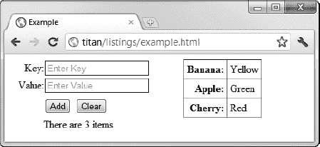

# 三十九、使用 Web 存储

Web 存储允许我们在浏览器中存储简单的键/值数据。Wen 存储类似于 cookies，但是实现得更好，我们可以存储更多的数据。有两种类型的 web 存储——本地存储和会话存储。这两种类型共享相同的机制，但是存储数据的可见性及其寿命不同。表 39-1 对本章进行了总结。

 **提示**还有另一种存储规范，索引数据库 API，它允许更丰富的数据存储和类似 SQL 的查询。在我写这篇文章的时候，这个规范仍然是易变的，浏览器实现也是实验性的和不稳定的。

### 使用本地存储

我们通过`localStorage`全局属性访问本地存储特性——该属性返回一个`Storage`对象，如表 39-2 所述。`Storage`对象用于存储成对的字符串，以键/值的形式组织。

对象允许我们存储键/值对，其中键和值都是字符串。键必须是惟一的，这意味着如果我们使用一个已经存在于`Storage`对象中的键来调用`setItem`方法，这个值就会被更新。清单 39-1 展示了我们如何添加、修改和清除本地存储中的数据。

*清单 39-1。使用本地存储器*

`<!DOCTYPE HTML>
<html>
    <head>
        <title>Example</title>
        
    </head>
    <body>` `        

            
<label>Key:</label><input id="key" placeholder="Enter Key"/>

            
<label>Value:</label><input id="value" placeholder="Enter Value"/>

            

                <button id="add">Add</button>
                <button id="clear">Clear</button>
            

            
There are  items

        

        <table id="data" border="1">
            <tr><th>Item Count:</th><td id="count">-</td></tr>
        </table>

        
    </body>
</html>`

在本例中，我报告了本地存储中的项目数量，并枚举了存储的名称/值对集以填充一个表元素。我添加了两个`input`元素，当按下`Add`按钮时，我使用它们的内容来存储项目。为了响应`Clear`按钮，我清除了本地存储器的内容。你可以在图 39-1 中看到效果。

*图 39-1。使用本地存储器*

浏览器不会删除我们使用`localStorage`对象添加的数据，除非用户清除浏览数据。(规范还允许出于安全原因删除数据，但没有明确说明需要删除本地数据的安全问题。)

#### 监听存储事件

通过本地存储功能存储的数据可用于任何具有相同来源的文档。当一个文档对本地存储进行更改时，就会触发`storage`事件，我们可以在来自相同来源的其他文档中监听该事件，以确保我们能够及时了解更改。

用存储事件调度的对象是一个`StorageEvent`对象，其成员在表 39-3 中描述。

清单 39-2 显示了一个我保存为`storage.html`的文档，它监听并分类本地存储对象发出的事件。

*清单 39-2。编目本地存储事件*

`<!DOCTYPE HTML>
<html>
    <head>
        <title>Storage</title>
        
    </head>
    <body>
        <table id="data" border="1">
            <tr>
                <th>key</th>
                <th>oldValue</th>
                <th>newValue</th>
                <th>url</th>
                <th>storageArea</th>
            </tr>
        </table>
        
    </body>
</html>`

通过共享已更改存储的任何文档的`Window`对象来触发`storage`事件。在这个例子中，每次收到一个事件，我都会在一个`table`元素中添加一个新行——你可以在图 39-2 中看到这个效果。

*图 39-2。显示存储事件的详细信息*

图中的事件向我展示了如何向本地存储添加新项目。顺序是:

*   添加新的一对:`Banana` / `Yellow`
*   添加新的一对:`Apple` / `Red`
*   将与`Apple`相关的值更新为`Green`
*   添加新的一对:`Cherry` / `Red`
*   按下`Clear`按钮(调用`clear`方法)

您可以看到，当事件中没有要报告的值时，使用了`null`。例如，当我向存储器中添加一个新项目时，`oldValue`属性返回`null`。表中最后一个事件的`key`、`oldValue,`和`newValue`属性为`null`。这是为响应被调用的`clear`方法而触发的事件，该方法从存储中删除所有项目。

属性告诉我们哪个文档触发了变化，这很有帮助。`storageArea`属性返回已经改变的`Storage`对象，它可以是本地或会话存储对象(我稍后将解释会话存储)。对于这个例子，我们只接收来自本地存储对象的事件。

 **注意**事件不会在做出改变的文档中被调度。我猜我们已经知道发生了什么。这些事件只能在来自同一来源的*其他*文件中找到。

### 使用会话存储

*会话存储*就像本地存储一样工作，除了数据对于每个浏览上下文是私有的，并且在文档关闭时被删除。我们通过`sessionStorage`全局变量访问会话存储，该变量返回一个`Storage`对象(之前在表 39-2 中描述过)。您可以在清单 39-3 中看到正在使用的会话存储。

*清单 39-3。使用会话存储*

`<!DOCTYPE HTML>
<html>
    <head>
        <title>Example</title>
        
    </head>
    <body>
        

            
<label>Key:</label><input id="key" placeholder="Enter Key"/>

            
<label>Value:</label><input id="value" placeholder="Enter Value"/>

            

                <button id="add">Add</button>
                <button id="clear">Clear</button>
            

            
There are  items

        

        <table id="data" border="1">
            <tr><th>Item Count:</th><td id="count">-</td></tr>
        </table>

        
    </body>
</html>`

这个例子的工作方式与本地存储的例子相同，只是可见性和寿命受到限制。这些限制对如何处理`storage`事件有影响——请记住，存储事件仅针对共享存储的文档触发。在会话存储的情况下，这意味着事件将只为嵌入的文档触发，比如那些在`iframe`中的文档。清单 39-4 显示了一个`iframe`被添加到先前包含 storage.html 文档的例子中。

*清单 39-4。通过会话存储使用存储事件*

`<!DOCTYPE HTML>
<html>
    <head>
        <title>Example</title>
        
    </head>
    <body>
        

            
<label>Key:</label><input id="key" placeholder="Enter Key"/>

            
<label>Value:</label><input id="value" placeholder="Enter Value"/>

            

                <button id="add">Add</button>
                <button id="clear">Clear</button>
            
` `            
There are  items

        

        <table id="data" border="1">
            <tr><th>Item Count:</th><td id="count">-</td></tr>
        </table>

**        <iframe src="storage.html" width="500" height="175"></iframe>**

        
    </body>
</html>`

您可以在图 39-3 中看到事件是如何报告的。

*图 39-3。会话存储中的存储事件*

### 总结

在本章中，我描述了 web 存储特性，它允许我们在浏览器中存储键/值对。这是一个简单的特性，但是本地存储的寿命使它特别有用，特别是对于存储简单的用户偏好。