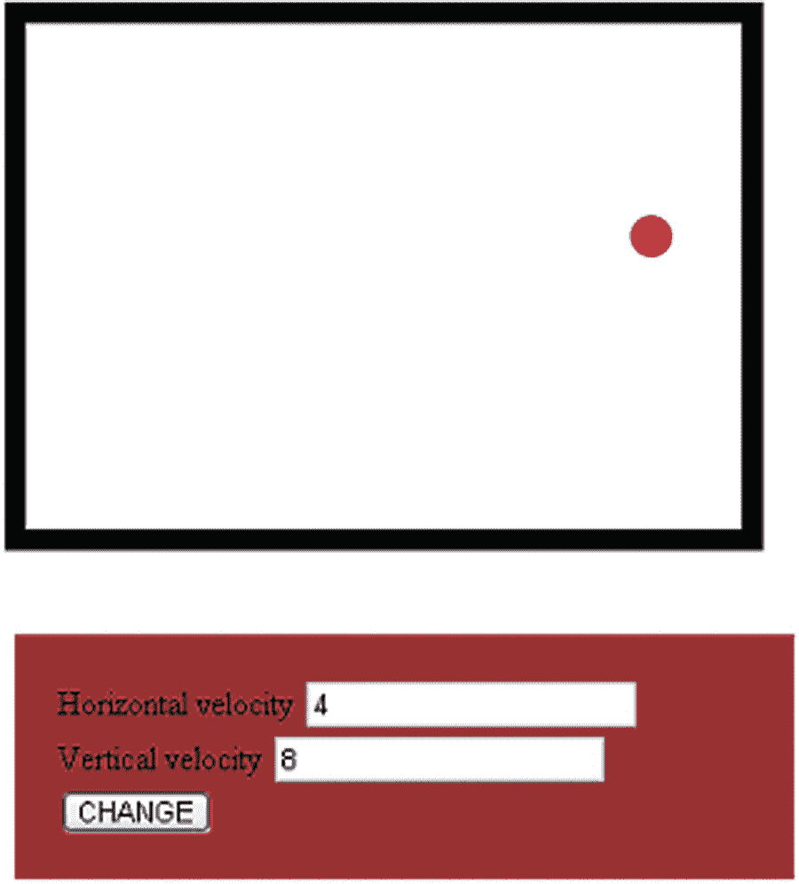
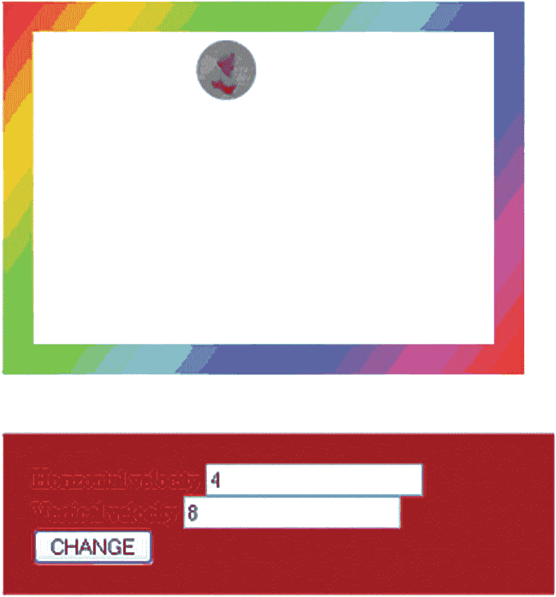
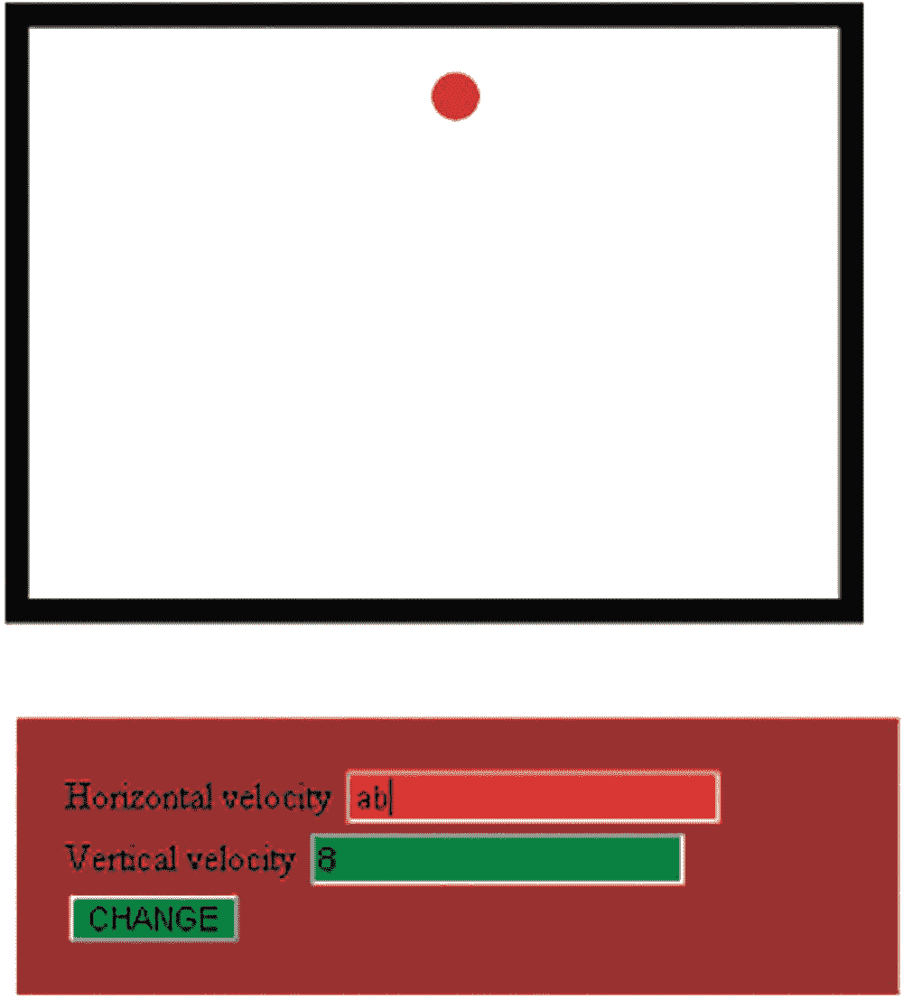
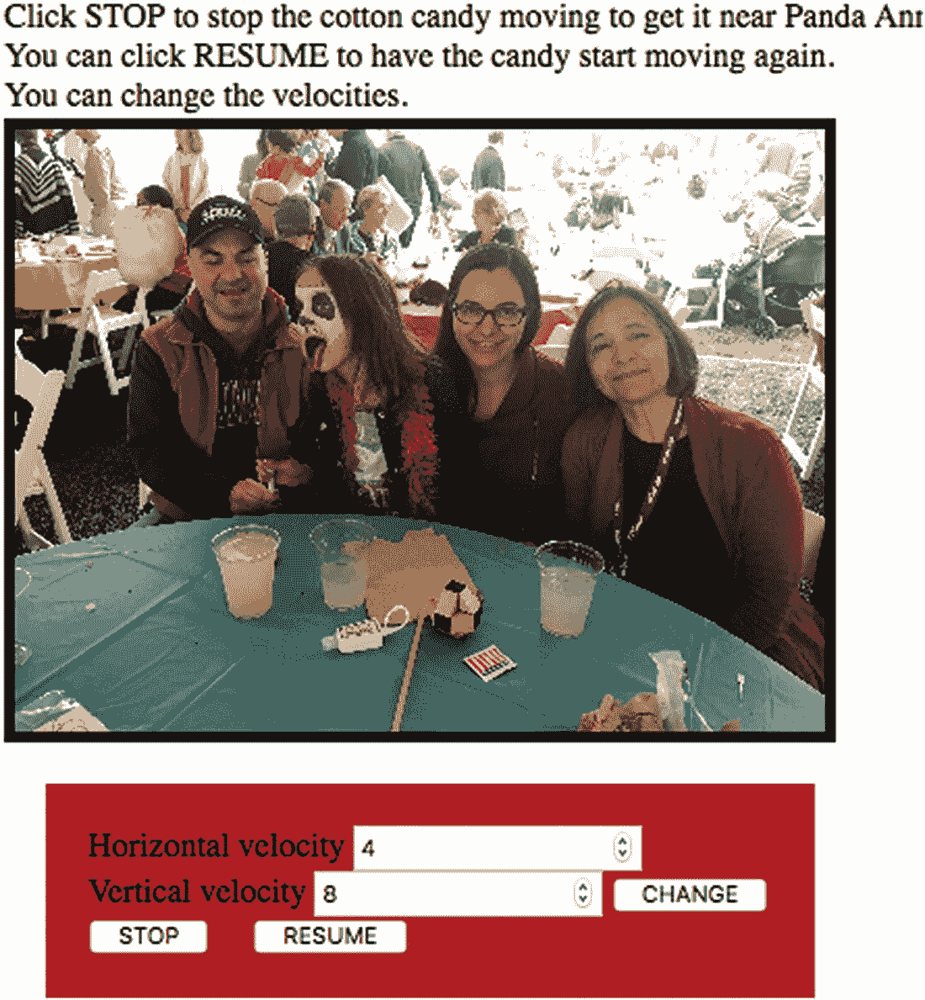

# 三、弹跳球

在本章中，我们将介绍

*   创建程序员定义的对象

*   使用`setInterval`制作动画

*   绘制图像

*   接受和验证表单输入

*   使用按钮

*   使用`for`循环

*   带渐变的绘图

*   预加载图像

## 介绍

动画，无论是在电影中，使用动画书，还是由计算机生成，都包括以足够快的速度显示一系列静止图像，以便我们将所看到的理解为运动，理解为生活。在这一章中，我将向你展示如何通过模拟一个在二维盒子中弹跳的球来制作动画场景，水平和垂直速度可以由玩家来改变。我们程序的第一次迭代以固定的时间间隔计算球的新位置并显示结果，它还确定球和墙何时会发生虚拟碰撞以及球如何从墙上反弹。之后，我们将看到如何用图像替换球，以及如何使用渐变绘制矩形。我们将研究用于验证表单输入的 HTML5 特性。最后，我将向您展示一个交互式示例，它为玩家提供了一种停止和重新开始弹跳的方法。这四个例子是:

*   在 2D 盒子中弹跳的球(见图 3-1

*   用一个图像替换球，并对盒子壁使用渐变(见图 3-2

*   验证输入(参见图 3-3

*   使图像在背景图像上反弹，并提供一种停止和恢复动作的方法(参见图 3-4

### 注意

我们要制作的这种动画叫做计算动画，在这种动画中，一个物体的位置被计算机程序重新计算，然后这个物体被重新显示。这与 cel(或逐帧)动画形成对比，后者使用预先绘制的单独静态图片。动画 gif 是 cel 动画的例子，可以在许多图形程序中制作。

你必须想象这些静态图片所代表的动画。在图 3-1 中，注意带有设置水平和垂直速度字段的表格。



图 3-1

弹跳球

在图 3-2 中，球已经被一个图像取代，墙壁也使用渐变填充。



图 3-2

球现在是来自外部文件的图像

HTML5 让您指定输入应该是什么。在这个例子中，我已经指定输入应该是一个数字，并指出最小和最大值。我使用 CSS 来指定如果用户输入了一个无效的条目，字段的颜色会变成红色。如图 3-3 所示。



图 3-3

显示错误输入的表单

这组应用程序演示了大量的编程，但它并不是真正的游戏，尽管人们喜欢看到头部或其他图像在盒子中跳动。受到最近的一张家庭照片的启发，我决定制作一个程序，它有一张跳动的照片，并带有停止和恢复动画的附加功能。我还包括显示背景图片的功能。图 3-4 为一张截图。游戏的目标是让移动的物体，一张棉花糖的照片，停下来靠近孩子，安妮卡，脸上涂着代表熊猫的颜料。见图 3-4 。这为我提供了一个例子来展示所谓的事件驱动编程的优势。



图 3-4

弹跳棉花糖游戏截图

## 关键要求

在开始编写任何代码之前，定义需求对于这个应用程序，实际上对于所有的编程都是非常重要的。该应用程序需要我在前面章节中演示过的东西:在画布元素上绘制形状和使用表单画布元素。在这个例子中，我们实际上将使用表单字段进行输入。在第二章描述的骰子游戏中，它们被严格用于输出。

在第一章中，HTML 文档使用了外部图像文件。在第二章中，我们完全用编码绘制了骰子的正面。在这一章中，我将演示两者:一个用代码绘制的弹跳圆圈和一个来自图像文件的弹跳图像。

为了实现这一点，我们需要一些代码能够在固定的时间间隔内做一些事情——现在，做什么并不重要。间隔需要足够短，以使结果看起来像运动。

在这种情况下，要做的事情是重新定位球，或者说球的位置。此外，代码需要确定球是否会碰到墙。现在，没有一个球，也没有任何墙壁。都是虚拟的，所以都是编码。我们将编写代码来计算球的虚拟位置和每面墙的虚拟位置。如果出现虚拟击球，代码会调整水平或垂直位移值，使球从墙上弹回。为了更准确，冒着变得迂腐的风险，代码设置了某些值，以便在下一次迭代中，球对象朝着不同的方向前进。

为了计算重新定位，我们使用初始值或者在表单的输入字段中输入的任何新值。然而，目标是产生一个健壮的系统，它不会对玩家的错误输入采取行动。错误的输入可能不是数字或超出指定范围的数字。我们可以不对错误的输入采取行动。然而，我们想给玩家反馈输入错误，所以我们会让输入框改变颜色，如图 3-3 所示。

为了给用户提供一种方式，现在称之为“播放器”，一种与应用程序交互的方式，我添加了代码来呈现播放器所看到的停止按钮和继续按钮。响应点击停止按钮的功能停止时间间隔事件。响应点击恢复按钮的函数启动时间间隔事件。

## HTML5、CSS、JavaScript 特性

让我们看看实现弹跳球应用程序所需的 HTML5、CSS 和 JavaScript 的具体特性。我们将建立在前几章的基础上，特别是 HTML 文档的一般结构，使用一个`canvas`元素，程序员定义的和内置的函数，以及一个`form`元素。

### 画一个球或一幅或多幅图像

如第二章所述，在画布上绘制任何东西，比如一个代表球的圆，需要在`HTML`文档的`body`部分包含`canvas`元素。接下来，我们需要定义一个变量`ctx`，并添加设置这个变量的值的代码，这样我们就可以使用 JavaScript 了。下面是实现这一点的语句:

```js
ctx = document.getElementById('canvas').getContext('2d');

```

正如我们在第二章中看到的，一个圆是通过绘制一个圆弧作为路径的一部分来创建的。下面几行代码启动路径，设置填充颜色，指定弧线，然后使用`fill`方法绘制一个封闭的填充路径。注意，`arc`方法使用变量来指定圆心坐标和半径。参数`0`和`Math.PI*2`代表角度，在本例中为`0`到`Math.PI*2`，形成一个完整的圆。`true`参数表示逆时针方向，尽管在这种特殊情况下，`false`会产生相同的效果。

```js
ctx.beginPath();
ctx.fillStyle ="rgb(200,0,50)";
ctx.arc(ballx, bally, ballrad,0,Math.PI*2,true);
ctx.fill();

```

对于弹跳球的第一个版本，该框被绘制为矩形轮廓。轮廓的宽度，称为笔画，使用

```js
ctx.lineWidth = ballrad;

```

你可以试试线宽。请记住，如果您将宽度设置得很小，并将球设置为快速移动，球可以一步弹过墙。

绘制矩形的语句是

```js
ctx.strokeRect(boxx,boxy,boxwidth,boxheight);

```

我把球的代码放在矩形的代码之前，这样矩形就会在上面。我觉得这样跳起来更好看。

该程序的第二个版本显示了球的图像。这需要代码通过调用`Image()`使用`new`操作符建立一个`img`对象，将它赋给一个变量，并给`src`属性一个值。在应用程序中，我们在一条语句中完成了所有这些工作，但是让我们来看看各个部分。

你会在第二章中读到`var`语句。这样的语句定义，或者说*声明*，一个变量。这里我们的`var`可以用 *img* 这个名字；与 HTML `img`元素没有冲突。`new`操作符名副其实:它创建了一个新对象，在这里是内置类型`Image`。Image 函数称为构造函数:它构造一个 Image 类型的对象。`Image`函数没有任何参数，所以只有左括号和右括号。

图像对象有属性，就像 HTML 元素如`img`一样。使用的特定图像由`src`属性的值指示。这里，`pearl.jpg`是与 HTML 文档位于同一文件夹中的图像文件的名称。下面两条语句设置了`img`变量，并将其`src`(源)设置为图像文件的地址，即 URL。

```js
var img = new Image();
img.src="pearl.jpg";

```

对于您的应用程序，请使用您选择的图像文件的名称。它可以是 JPG、PNG 或 GIF 类型，请确保将它放在与 HTML 文档相同的文件夹中，或者包含适当的路径。注意匹配名称和扩展名的大小写。

要在画布上绘制这个图像，我们需要一行代码来指定图像对象、图像左上角的位置以及图像显示中使用的宽度和长度。与矩形的情况一样，这段代码是对一个上下文对象的方法的调用，所以我使用 init 函数中定义的变量`ctx`。我需要调整用于圆心的`ballx`和`bally`值来表示上角。我用两倍的球半径来表示宽度和长度。声明是

```js
ctx.drawImage(img,ballx-ballrad,bally-ballrad,2*ballrad,2*ballrad);

```

现在让我们休息一下。亲爱的读者，轮到你做些工作了。考虑下面的 HTML 文档:

```js
<html>
<head>
<title>The Origami Frog</title>
<script>
var img = new Image();
img.src = "frogface.gif";
var ctx;

function init() {
        ctx =document.getElementById("canvas").getContext('2d');
        ctx.drawImage(img,10,20,100,100);

}
</script>
</head>
<body onLoad="init();">
<canvas id="canvas" width="400" height="300">
Your browser doesn't support the HTML5 element canvas.
</canvas>
</body>

</html>

```

找到你自己的图像文件，用它的名字代替`frogface.gif`。把标题改成合适的。用这条线做实验

```js
ctx.drawImage(img,10,20,100,100);

```

也就是说，更改 10，20 以重新定位图像，更改 100，100 以更改宽度和高度。进行更改，看看程序是否如您所愿做出响应。请记住，当您指定宽度和高度时，您可能会改变图片的形状，即*纵横比*。

这里要注意的重要一点是，由于代码是在画布上绘制或绘画，为了产生移动球的效果，我们还需要代码来擦除所有内容，然后在新的位置用球重新绘制所有内容。抹去一切的声明是:

```js
ctx.clearRect(boxx,boxy,boxwidth,boxheight);

```

也许可以只擦除(清除)画布的一部分，但我选择擦除然后重新绘制所有内容。在每种情况下，你需要决定什么是有意义的。

想象一下在画布上画两个图像。你需要用两个不同的变量来代替`img`。对于这个任务，给变量起一个独特的名字。如果是效仿苏斯博士，可以用`thing1`和`thing2`；不然就选对自己有意义的吧！

为了绘制背景图像，然后是移动的棉花糖，我的代码简单地首先绘制背景图像，总是在相同的位置，然后在计算的位置绘制棉花糖。完整的代码如下。你将在后面的章节中读到关于`moveandcheck`的内容。

```js
function moveball(){
 ctx.clearRect(boxx,boxy,boxwidth,boxheight);
 moveandcheck();
 ctx.drawImage(bkg,0,0,4000,3000,0,0,400,300);
 ctx.drawImage(ball,0,0,388,435,ballx-ballrad,bally-ballrad,388/10,435/10);
  ctx.strokeRect(0,0,400,300);
}

```

你可能会问为什么要重画背景。答案是，一旦在画布上绘制了一些东西，就有相当于颜料的点——术语是像素，图片元素——被设置为特定的颜色。每次迭代都会有一些变化(请等待下一节关于计时间隔的内容)，虽然画布的大部分保持不变，但生成新图片的最佳方式是清空画布，绘制背景，然后绘制球。

#### 梯度，附带解释数组

让我们看看如何使用渐变，一种彩虹般的颜色组合，为弹跳程序。您可以使用渐变来设置`fillStyle`属性。我不想把球放在一个填充的矩形上面，所以我需要弄清楚如何分别画出四面墙。

渐变是 HTML5 中的一种对象类型。有线性梯度和径向梯度。在这个应用中，我们使用线性梯度。代码使用我们之前用变量`ctx`定义的 canvas 上下文的方法，将变量定义为渐变对象。渐变的代码如下所示:

```js
var grad;
grad=ctx.createLinearGradient(boxx,boxy,boxx+boxwidth,boxy+boxheight);

```

渐变在矩形上延伸。

渐变包含多组颜色。一个典型的做法是编写代码来设置所谓的颜色停止点，例如使渐变成为彩虹。为此，我在一个名为`hue`的变量中设置了一个数组的数组。

您可以将数组视为值集合的容器。一个变量只能保存一个值，而一个数组可以保存多个值。在下一章，你将读到一个名为`everything`的数组，它将保存所有要在屏幕上绘制的对象。在描述刽子手游戏的第九章中，单词列表是一个单词数组。在这本书里，你会读到数组的许多应用。这里有一个具体的例子。下面的`var`语句将一个变量设置为一个特定的数组:

```js
var family  = ["Daniel","Aviva", "Annika"];

```

变量`family`是一个数组。它的数据类型是数组。它包括一份我家的名单。要访问或设置这个数组的第一个元素，可以使用`family[0]`。指定数组特定成员的值称为索引值或索引。数组索引从零开始。`family[0]`这个表达会产生`Daniel"`。表达式`family[1]`会产生`"Aviva"`。表达式`family[2]`会产生`"Annika"`。如果变量`relative`的值为 1，那么`family[relative]`将产生`Aviva`。要确定数组中元素的数量，可以使用`family.length`。在本例中，长度为 3。注:长度为 3；指数从 0 到 2。

数组中的各个项可以是任何类型，包括数组。例如，我可以修改族数组以提供更多信息:

```js
var family  = [["Daniel","son"],
  ["Aviva", "daughter"],
  ["Annika","granddaughter"]
 ];

```

带有换行符和缩进的格式不是必需的，但这是一个好习惯。它不由 JavaScript 解释。我们必须把括号和逗号弄正确！

`family[2][1]`这个表达产生了“孙女”。请记住:数组索引从 0 开始，因此数组的索引值 2(在这种类型的示例中有时称为外部数组)产生["Annika "，"孙女"]，对于该数组，索引 1 产生"孙女"。这些内部数组不必长度相同。考虑这个例子:

```js
var family  = [["Daniel","teacher"],
  ["Aviva", "government staff"],
  ["Annika"]
 ];

```

代码将检查数组的长度，如果它是 2 而不是 1，第二项将是个人的职业。如果内部数组的长度为 1，则可以认为这个人没有职业。

数组的数组对于产品名称和成本非常有用。以下语句指定了商店非常有限的库存:

```js
var inventory = [
                             ["toaster",25.99],
                             ["blender",74.99],
                             ["dish",10.50],
                             ["rug",599.99]
                             ];

```

这家商店有四种商品，最便宜的是盘子，在索引 2 的位置表示，最贵的是地毯，在索引 3。

现在，让我们看看如何使用这些概念来定义梯度。我们将使用一个数组，它的单个元素也是数组。

每个内部数组保存一种颜色的 RGB 值，即红色、黄色、绿色、青色、蓝色和品红色。

```js
var hue = [
    [255,   0,   0 ],
    [255, 255,   0 ],
    [  0, 255,   0 ],
    [  0, 255, 255 ],
    [  0,   0, 255 ],
    [255,   0, 255 ]
] ;

```

这些值代表从红色(RGB 255，0，0)到洋红色(RGB 255，0，255)的颜色，其间指定了四种颜色。JavaScript 中的渐变功能填充颜色以产生彩虹图案，如图 3-2 所示。通过沿从 0 到 1 的间隔指定点来定义渐变。您可以指定彩虹以外的渐变。例如，您可以使用图形程序选择一组 RGB 值作为所谓的停止点，JavaScript 将填充值以从一个值混合到下一个值。

数组数值并不是我们所需要的，所以我们必须处理它们来产生 JavaScript 所需要的东西。

数组的操作通常需要对数组的每个成员做一些事情。许多编程语言中都有这样的一个构造，那就是`for`循环，它使用一个叫做索引变量的变量。`for`回路的结构是

```js
for (initial value for indexing variable; condition for continuing; change for➥
 indexing variable) {
    code to be done every time. The code usually references the indexing variable

}

```

这里说:从这个初始值开始；只要这个条件成立，就继续做这个循环；并以这种指定的方式更改索引值。一个典型的变化表达式将使用运算符，如`++`。`++`操作员将指示变量增加 1。典型的`for`标题语句是

```js
for (n=0;n<10;n++)

```

这个`for`循环使用一个名为`n`的变量，其中`n`被初始化为`0`。如果`n`的值小于 10，则执行循环内部的语句。每次迭代后，`n`的值增加 1。在这种情况下，循环代码将被执行 10 次，n 保存值 0、1、2，一直到 9。

这里还有一个例子，一个演示数组的常见例子。让`grades`变量被设置为保存一组学生的成绩:

```js
var grades = [4.0, 3.7, 3, 2.3, 3];

```

根据学校的不同，这可能表示 A、A-、B、C+和 B 级。下面的代码片段计算平均绩点，并将其存储在名为`gpa`的变量中。注意，我们需要初始化名为`sum`的变量，以 0 值开始。`+=`运算符将索引值`g`处的`grades`数组中的值加到`sum`中保存的值上。

```js
var sum = 0;
for (g=0;g<grades.length;g++) {
 sum += grades[g];
}
var gpa;
gpa = sum/grades.length;

```

为了生成构建渐变所需的内容，代码从`hue`数组中提取值，并使用它们生成表示 RGB 值的字符串。我们使用`hue`数组和一个名为`color`的变量来设置色标以定义渐变。使用一个`for`循环将`color`设置为所需格式的字符串，即从`rgb(`开始，包括三个值，将色标设置在 0 和 1 之间的任意点。

```js
for (h=0;h<hue.length;h++) {
 color = 'rgb('+hue[h][0]+','+hue[h][1]+','+hue[h][2]+')';
 grad.addColorStop(h*1/hue.length,color);
}

```

赋值语句设置`color`可能对你来说很奇怪:有很多事情正在进行——那些加号在做什么？记住，我们的任务是生成表示特定 RGB 值的字符串。加号*不是*在这里表示数字的相加，而是字符串的连接。这意味着这些值粘在一起，而不是数学相加，所以当`5+5`产生 10，`'5'+'5'`将给出 55。因为第二个例子中的 5 是用引号括起来的，所以它们是字符串而不是数字。方括号表示数组的成员。JavaScript 将数字转换成等价的字符串，然后组合它们。请记住，它查看数组中的数组，因此方括号中的第一个数字(在本例中，由我们的变量`h`提供)给出了第一个数组，方括号中的第二个数字给出了我们在该数组中的数字。让我们看一个简单的例子。我们的循环第一次运行时，`h`的值将是 0，这给了我们`hue`数组中的第一个条目。然后，我们查找该条目的各个部分，以构建我们的最终颜色。

在这之后，我们的代码已经设置了变量`grad`用于指示填充模式。代码没有将`fillStyle`设置为一种颜色，而是将其设置为变量`grad`。

```js
ctx.fillStyle = grad;

```

画矩形和以前一样，但是现在用指定的填充。这是位于原始矩形的左、右、上、下的四面窄墙。我把墙做得和球的半径一样厚。该厚度在垂直壁的情况下是宽度，在水平壁的情况下是高度。

```js
ctx.fillRect(boxx,boxy,ballrad,boxheight);
ctx.fillRect(boxx+boxwidth-ballrad,boxy,ballrad,boxheight);
ctx.fillRect(boxx,boxy,boxwidth,ballrad);
ctx.fillRect(boxx,boxy+boxheight-ballrad,boxwidth,ballrad);

```

#### 设置定时事件

在 HTML5 中设置定时事件实际上类似于在旧版本的 HTML 中的做法。内置函数有两个:`setInterval`和`setTimeout`。我们将在第五章的记忆游戏中，在这里和`setTimeout`处查看`setInterval`。每个函数都有两个参数。请记住，参数是函数或方法调用中包含的额外信息。回到第一章，我们看到`document.write`将屏幕上显示的内容作为它的唯一参数。

我先描述第二个论点。第二个参数以毫秒为单位指定时间量。一秒有 1000 毫秒。这似乎是一个非常短的工作单元，但它正是我们想要的游戏。对于电脑游戏来说，一秒(1000 毫秒)相当长。

第一个参数指定在第二个参数指定的时间间隔内要做什么。第一个参数可以是函数的名称。对于该应用程序，`init`函数定义包含以下代码行:

```js
setInterval(moveball,100);

```

这告诉`JavaScript engine`每 100 毫秒调用函数`moveball`(每秒 10 次)。`moveball`是将在此 HTML 文档中定义的函数的名称；是*定时间隔事件*的*事件处理程序*。在编写代码定义函数之前，不要担心您是否编写了这行代码。重要的是应用程序运行时存在的内容。

JavaScript 还为事件处理程序提供了一种不同于函数名的方式。你可以写作

```js
setInterval("moveball();",100);

```

为了同样的效果。换句话说，对于动作是不带参数的函数调用的情况，函数名就可以了。对于更复杂的情况，您可以编写一个字符串来指定代码。假设我有一个名为`slide`的函数，它本身有一个参数，我希望这个参数是变量`d`值的 10 倍，我希望每 1 . 5 秒发生一次，我会编写代码

```js
setInterval("slide(10*d);",1500);

```

我注意到`moveball`不需要参数的原因是因为位置和位移使用了全局变量。

通常情况下，您希望在屏幕上显示时间的流逝。下面的例子将显示 0，1，…等等。数字每秒都在变化。

```js
<html>
<head>
<title>elapsed</title>
<script>

function init() {
        setInterval(increase,1000);
}
function increase() {
        document.f.secs.value = String(1+Number(document.f.secs.value));
}
</script>
</head>

<body onLoad="init();">
<form name="f">
<input type="text" name="secs" value="0"/>
</form>
</body>
</html>

```

这是一个花时间编写和运行的好例子，因为它展示了计时事件，也因为它让你知道一秒钟持续了多长时间。代码以名为`f`的形式从`secs`输入字段中取出值，将该值转换成一个数字，将`1`加到该数字上，然后将其转换回一个字符串，作为`secs`元素的`value`。尝试用语句替换`increase`函数中的单个语句

```js
document.f.secs.value = 1+document.f.secs.value;

```

看看会发生什么。这是数字和字符串区别的一课。请随便举个小例子。如果您想让数字以较小的增量上升，请将 1000 更改为 250，将 1 更改为 0.25。这使得脚本显示四分之一秒的变化。

如果你想让你的代码停止一个特定的事件，你可以设置一个全局变量(在任何函数之外的变量)。我使用一个名为`tev`的变量，这是我对定时事件的简写。

```js
var tev;

```

然后，您可以将`setInterval`调用修改为:

```js
tev = setInterval(moveball,100);

```

当您想要停止此事件时，您应该包括以下代码:

```js
clearInterval(tev);

```

顺便说一下，如果我的代码在没有发出`clearInterval`的情况下再次调用带有`setInterval`函数的语句，就相当于设置了一个额外的闹钟。效果将是提高速度。当我描述棉花糖游戏时，你会注意到我的代码包含了多个`clearInterval`语句。

重申一下，`setInterval`函数设置一个定时事件，该事件会一直发生，直到被清除。如果您知道您希望一个事件只发生一次，那么`setTimeout`方法正好设置一个事件。您可以使用任何一种方法来产生相同的结果，但是 JavaScript 同时提供了这两种方法来使事情变得更简单。

对于弹跳球应用程序，`moveball`函数计算球的新位置，进行计算以检查碰撞，当碰撞发生时，重定向球并绘制新的显示。这是一次又一次的重复——对`moveball`的调用不断发生，因为我们使用了`setInterval`。

#### 计算新位置和碰撞检测

既然我们知道了如何绘制，如何清除和重绘，以及如何在固定的时间间隔做一些事情，那么挑战就是如何计算新的位置以及如何进行碰撞检测。我们将通过声明变量`ballx`和`bally`来保存球中心的`x`和`y`坐标；`ballvx`和`ballvy`保持球位要改变的量；以及`boxboundx`、`inboxboundx`、`boxboundy`和`inboxboundy`来表示比用于碰撞计算的实际盒子稍小的盒子。球位置的变化量被初始化为 4 和 8(完全任意)，当球员做出有效的改变(见下一节)并点击改变按钮时，球位置的变化量被改变。这些量被称为位移或增量，以及不太正式的速度或速率。

在这种情况下，方向的改变非常简单。如果球“击中”一面垂直的墙，水平位移必须改变符号；也就是说，如果球向右移动了四个单位，我们撞到了一堵墙，我们要开始给它的位置加-4，这将使它向左移动。垂直位移保持不变。通过将*下一个*水平值与边界进行比较来确定命中。类似地，如果通过将垂直位置与适当的边界进行比较来确定球“击中”了水平墙，则垂直位移改变符号，而水平位移保持不变。变化是为了下一次迭代。碰撞检查进行了四次，即针对四面墙中的每一面。计算包括将建议的新 x 或 y 值(如果适用)与特定墙的边界条件进行比较。如果球的中心经过四面墙中的一面，正好在边界上，那么暂定的新位置将被调整。这样做的效果是使球稍稍移动到每面墙的后面，或者看起来被每面墙挤压。边界值设置在方框内，上角为`boxx`、`boxy`，宽度为`boxwidth`，高度为`boxheight`。我可以用更复杂的计算来比较圆上的任何一点和墙上的任何一点。然而，这里涉及到一个更基本的原则。没有墙，也没有球。这是基于计算的模拟。计算每隔一段时间进行一次。如果球移动得足够快，并且壁足够薄，比这里指定的`ballrad`更薄，球可以逃出盒子。这就是为什么我用下一步棋和一个稍微小一点的盒子来计算。

```js
var boxboundx = boxwidth+boxx-ballrad;
var boxboundy = boxheight+boxy-ballrad;
var inboxboundx = boxx+ballrad;
var inboxboundy = boxy+ballrad;

```

下面是`moveandcheck`函数的代码，该函数检查碰撞并重新定位球:

```js
function moveandcheck() {
   var nballx = ballx + ballvx;
   var nbally = bally +ballvy;
   if (nballx > boxboundx) {
      ballvx =-ballvx;
      nballx = boxboundx;
   }
   if (nballx < inboxboundx) {
      nballx = inboxboundx
      ballvx = -ballvx;
   }
   if (nbally > boxboundy) {
      nbally = boxboundy;
      ballvy =-ballvy;
   }

   if (nbally < inboxboundy) {
      nbally = inboxboundy;
      ballvy = -ballvy;
   }
   ballx = nballx;
   bally = nbally;
}

```

你可能会说这里实际发生的事情不多，你是对的。变量`ballx`和`bally`被修改，以便稍后在画布上绘制时使用。

从这段代码中并不明显，但是请记住，垂直值(y 值)随着屏幕的向下移动而增加，水平值(x 值)随着从左向右移动而增加。

#### 确认

表单，从用户/玩家/客户端获取输入的方式，是原始 HTML 的一部分。表单元素以一个`<form>`标签开始，它提供了一种指定提交表单时的动作的方法，并包含输入元素。HTML5 为验证表单输入提供了新的工具。表单的创建者可以指定输入域的类型是`number`而不是`text`，HTML5 会立即检查用户/玩家输入的数字。类似地，我们可以指定`max`和`min`值。该表单的代码是

```js
<form name="f" id="f" onSubmit="return change();">
  Horizontal velocity <input name="hv" id="hv" value="4" type="number" min="-10" max="10" />
<br>
  Vertical velocity <input name="vv" id="vv" value="8" type="number" min="-10" max="10"/>
<input type="submit" value="CHANGE"/>
</form>

```

输入仍然是文本，即一个字符串，但值是可以解释为指定范围内的数字的文本。

其他类型的输入包括`"email"`和`"URL"`，让 HTML5 检查这些输入非常方便。当然，您可以使用`isNumber`和更复杂的编码来检查任何字符串，看看它是否是一个数字，包括*正则表达式*(可以匹配的字符模式)，以检查有效的电子邮件地址和 URL。检查电子邮件地址的一个常用策略是让用户输入两次，这样你就可以比较两次，确保用户没有犯任何错误。

我们希望利用 HTML5 将为我们做的工作，但我们也希望让用户/玩家知道是否有问题。通过为有效和无效输入指定样式，您可以使用 HTML5 和 CSS 来做到这一点。

```js
input:valid {background:green;}
input:invalid {background:red;}

```

HTML5 验证在最新版本的浏览器中是有效的，至少在电脑上是有效的，但是你需要决定你想为老版本的浏览器和设备做什么。如果您使用兼容的浏览器，比如 Chrome，您可以测试下一节给出的例子。请注意，即使在指定了数字的地方输入了无效的值，例如“abc ”,球也会一直反弹，因为程序会继续使用当前的设置。

### 小费

在任何应用程序中，验证输入并向用户提供适当的反馈都是非常重要的。HTML5 提供的新特性之一是 input 元素中的 pattern 属性，其中一种称为正则表达式的特殊语言可以用来指定有效的输入。将“HTML5 正则表达式”放入搜索字段，以查找最新信息。

#### 停止和恢复由按钮触发的动画

当我决定添加停止和恢复时，我认为一个重要的教训是这可能只是一个添加，对程序的其余部分没有改变。这里发生的事情有一个术语叫做事件驱动编程。我们，建筑者，或多或少清楚地思考不同的事件。我还决定使用按钮元素，这是 HTML5 中引入的一个特性。button 元素提供了一种方式来指定事件，在本例中是`onClick`，以及将处理该事件的函数。标签`<button>`和标签`</button>`之间的文本显示在菱形按钮中。旧的方法是使用表单，对于我的例子来说，这意味着多个表单。

下面的代码生成了这两个按钮。下一节描述了`return`语句的重要性。`&nbsp;`是所谓的实体，产生一个空格，但不强制换行。

```js
<button onClick="return stopcc();">STOP </button>  &nbsp; &nbsp;
<button onClick="return resume();">RESUME </button>

```

我现在欠你`stopcc`函数和`resume`函数的定义。

`stopcc`功能的任务是停止背景上棉花糖图像的移动。您知道如何做:调用`clearInterval`。我的代码确实需要做更多的事情。因为我想要恢复弹跳，所以我编写代码来保存`ballvx`和`ballvy`值。这可能是不必要的，但某些情况下似乎需要这样做。代码还调用`moveBall`生成另一张图片。下一节将解释`return`的使用。代码如下。

```js
function stopcc() {
  clearInterval(tid);
  stoppedx = ballvx;
  stoppedy = ballvy;
  moveBall();
  return false;
}

```

`resume`函数确实包含了对`setInterval`的调用，但是我需要做一些别的事情来保护玩家免受他们自己的伤害。如果玩家没有停止动画就点击了恢复按钮，或者只是想看看会发生什么，那么调用多个`setInterval`会产生多个计时事件。这反过来会使弹跳越来越快。为了展示这一点，我插入了对`clearInterval`的调用。如果没有合适的定时事件，什么都不会发生。我的代码使用之前保存的值重置`ballvx`和`ballvy`。这可能没有必要，但这是一种预防措施。

```js
function resume(){
   clearInterval(tid);
   ballvx = stoppedx;
   ballvy = stoppedy;
   tid = setInterval(moveball,100);
   return false;
}

```

#### HTML 重新载入页面

在继续之前，我想提及一些可能会导致意外问题的问题。浏览器带有重新加载/刷新按钮。当单击按钮时，文档被重新加载。我们在第二章中的简单掷骰应用中使用了这个。然而，有时您可能想要阻止重新加载，在这种情况下，您可以在没有任何内容可返回的函数中放置一个`return (false);`来阻止页面重新加载。

当文档有表单时，重新加载并不总是重新初始化表单输入。您可能需要离开该页面，然后使用完整的 URL 重新加载它。

最后，浏览器试图使用先前下载到客户端(用户)计算机的文件，而不是基于日期和时间的检查从服务器请求文件。客户端计算机上的文件存储在所谓的缓存中。如果您认为自己做了更改，但浏览器没有显示最新版本，您可能需要采取清除缓存等措施。

#### 预加载图像

计算机是如此之快，而一般来说，我们的感知是足够慢的，以至于我们做任何事情都不会有延迟。然而，网站上的图像必须从服务器下载到我们的本地计算机，大图像显然是大文件。实际上，我应该提出另一个观点。我们的现代相机产生由数千个像素组成的图像，这被称为高分辨率。这会使文件变大。为了确保图像可以使用，一个技巧是创建在`body`元素中保存图像的`img`元素。对于这个例子，这包括背景照片和棉花糖照片。在通过`body`标签中的`onLoad`属性的动作调用`init`功能之前，文件将被加载。在棉花糖图像被绘制在其上之前，完全加载的背景图像将可被绘制。挑战在于如何防止这两幅图像被显示出来。答案是在`style`元素中包含以下指令。

```js
img {visibility: hidden;}

```

CSS 指令阻止任何`img`文件被显示。在我的例子中，`img`元素从不显示。显示的是由代码创建和操作的`Image`元素。

## 构建应用程序并使之成为您自己的应用程序

我现在将解释基本弹跳球应用程序的代码；使用球的图像和墙壁的渐变的应用程序；验证输入和弹跳棉花糖的应用程序。表 3-1 显示了所有的函数调用和被调用的内容。该表包括所有四个应用程序的函数。`stopcc`和`resume`功能只出现在第四个应用程序中。

表 3-1

弹跳球应用中的函数

<colgroup><col class="tcol1 align-left"> <col class="tcol2 align-left"> <col class="tcol3 align-left"></colgroup> 
| 

功能

 | 

调用方/被调用方

 | 

打电话

 |
| --- | --- | --- |
| `init` | `body`标签中`onLoad`的动作 | `moveball` |
| `moveball` | 由`init`和`setInterval`的动作直接调用 | `moveandcheck` |
| `moveandcheck` | 由`moveball`调用 |   |
| `change` | 由`form`标签中的`onSubmit`动作调用 |   |
| `stopcc` | 由`button`标签中的`onClick`动作调用 | `moveBall` |
| `resume` | 由`button`标签中的`onClick`动作调用 |   |

`moveandcheck`代码可以是`moveball`函数的一部分。我选择将它分开，因为定义执行特定操作的函数是一个很好的实践。通常，在开发应用程序时，更多更小的功能比更少更大的功能更好。顺便说一下，当你自己编程时，不要忘记在代码中加入注释，如第二章所述。并添加空行以使代码可读性更好。表 3-2 显示了基本弹跳球应用程序的代码，并解释了每一行的作用。

表 3-2

弹跳球应用程序

<colgroup><col class="tcol1 align-left"> <col class="tcol2 align-left"></colgroup> 
| 

密码

 | 

说明

 |
| --- | --- |
| `<html>` | 开始`html`。 |
| `<head>` | 开始`head`。 |
| `<title>Bouncing Ball``with inputs</title>` | 完成`title`元素。 |
| `<style>` | 开始`style`。 |
| `form {` | 开始表单样式。 |
| `width:330px;` | 设置`width`。 |
| `margin:20px;` | 设置`margin`。 |
| `background-color:brown;` | 设置背景`color`。 |
| `padding:20px;` | 设置内部`padding`。 |
| `}` | 关闭此样式。 |
| `</style>` | 关闭样式元素。 |
| `<script type="text/javascript">` | 开始`script`元素。(类型不是必需的。我在这里展示它只是为了让你知道你会在网上的许多例子中看到什么。) |
| `var boxx = 20;` | 盒子上角的 x 位置。 |
| `var boxy = 30;` | 盒子上角的 y 位置。 |
| `var boxwidth = 350;` | 方框宽度。 |
| `var boxheight = 250;` | 框高。 |
| `var ballrad = 10;` | 球的半径。 |
| `var boxboundx =``boxwidth+boxx-ballrad;` | 右边界。 |
| `var boxboundy =``boxheight+boxy-ballrad;` | 底部边界。 |
| `var inboxboundx =``boxx+ballrad;` | 左边界。 |
| `var inboxboundy =``boxy+ballrad;` | 顶部边界。 |
| `var ballx = 50;` | 球的初始 x 位置。 |
| `var bally = 60;` | 球的初始 y 位置。 |
| `var ctx;` | 保存画布上下文的变量。 |
| `var ballvx = 4;` | 初始水平位移。 |
| `var ballvy = 8;` | 初始垂直位移。 |
| `function init() {` | 开始`init`功能。 |
| `ctx = document.getElementById``('canvas').getContext('2d');` | 设置`ctx`变量。 |
| `ctx.linewidth = ballrad;` | 设置线条宽度 |
| `ctx.fillStyle ="rgb(200,0,50)";` | 设置填充样式 |
| `moveball();` | 第一次调用`moveball`功能，移动、检查并显示球。 |
| `setInterval(moveball,100);` | 设置定时事件。 |
| `}` | 关闭`init`功能。 |
| `function moveball(){` | 开始`moveball`功能。 |
| `ctx.clearRect(boxx,boxy,``boxwidth,boxheight);` | 清除(擦除)框(包括球上的任何油漆)。 |
| `moveandcheck();` | 做检查并移动球。 |
| `ctx.beginPath();` | 开始路径。 |
| `ctx.arc(ballx, bally, ballrad,0,Math.PI*2,true);` | 设置在球的当前位置画圆。 |
| `ctx.fill();` | 填写路径；也就是画一个实心圆。 |
| `ctx.strokeRect(boxx,boxy,``boxwidth,boxheight);` | 绘制矩形轮廓。 |
| `}` | 关闭`moveball`。 |
| `function moveandcheck() {` | 开始`moveandcheck`。 |
| `var nballx = ballx + ballvx;` | 设置暂定的下一个 x 位置。 |
| `var nbally = bally +ballvy;` | 设置暂定的下一个 y 位置。 |
| `if (nballx > boxboundx) {` | 这个 x 值超出右墙了吗？ |
| `ballvx =-ballvx;` | 如果是，改变水平位移。 |
| `nballx = boxboundx;` | 将下一个 x 精确地设置在这个边界上。 |
| `}` | 关闭子句。 |
| `if (nballx < inboxboundx) {` | 这个 x 值小于左边界吗？ |
| `nballx = inboxboundx;` | 如果是这样，将 x 值设置为正好在边界处。 |
| `ballvx = -ballvx;` | 改变水平位移。 |
| `}` | 关闭子句。 |
| `if (nbally > boxboundy) {` | y 值是否超出了底部边界？ |
| `nbally = boxboundy;` | 如果是这样，将 y 值设置为正好在边界处。 |
| `ballvy =-ballvy;` | 改变垂直位移。 |
| `}` | 关闭子句。 |
| `if (nbally < inboxboundy) {` | y 值是否小于上边界？ |
| `nbally = inboxboundy;` | 如果是这样，将 y 值设置为边界。 |
| `ballvy = -ballvy;` | 改变垂直位移。 |
| `}` | 关闭子句。 |
| `ballx = nballx;` | 将 x 位置设置为`nballx`。 |
| `bally = nbally;` | 将 y 位置设置为`nbally`。 |
| `}` | 关闭`moveandcheck`功能。 |
| `function change() {` | 开始`change`功能。 |
| `ballvx = Number(document.f.hv.value);` | 将输入转换成数字并分配给`ballvx`。 |
| `ballvy = Number(document.f.vv.value);` | 将输入转换成数字并分配给`ballvy`。 |
| `return false;` | 返回`false`以确保没有页面重载。 |
| `}` | 关闭功能。 |
| `</script>` | 关闭脚本。 |
| `</head>` | 关闭头部。 |
| `<body onLoad="init();">` | 开始`body`元素。设置对`init`功能的调用。 |
| `<canvas id="canvas" width=``"400" height="300">` | `canvas`元素的开始。 |
| `Your browser doesn't support the``HTML5 element canvas.` | 针对不兼容浏览器的消息。 |
| `</canvas>` | 关闭`canvas`元素。 |
| `<br/>` | 换行。 |
| `<form name="f" id="f" onSubmit=``"return change();">` | 表单开始。给出名称和 id(某些浏览器可能需要)。在提交按钮上设置操作。 |
| `Horizontal velocity <input name="hv"``id="hv" value="4" type="number"``min="-10" max="10" />` | 标记水平速度的输入字段。 |
| `<br>` | 换行。 |
| `Vertical velocity <input name=``"vv" id="vv" value="8" type="number"``min="-10" max="10"/>` | 标记垂直速度的输入字段。 |
| `<input type="submit" value="CHANGE"/>` | 提交按钮。 |
| `</form>` | 关闭`form`。 |
| `</body>` | 关闭`body`。 |
| `</html>` | 关闭`html`。 |

使用图像作为球和渐变填充墙的应用程序非常相似。表 3-3 显示了所有的代码——但是我只是注释了不同的代码。我没有偷懒；这个想法是让你看到每个应用程序是如何建立在前一个之上的。

表 3-3

第二个应用程序，使用图像作为球和渐变填充的墙

<colgroup><col class="tcol1 align-left"> <col class="tcol2 align-left"></colgroup> 
| 

密码

 | 

说明

 |
| --- | --- |
| `<html>` |   |
| `<head>` |   |
| `<title>Bouncing Ball with inputs</title>` |   |
| `<style>` |   |
| `form {` |   |
| `width:330px;` |   |
| `margin:20px;` |   |
| `background-color:#b10515;` |   |
| `padding:20px;` |   |
| `}` |   |
| `</style>` |   |
| `<script type="text/javascript">` |   |
| `var boxx = 20;` |   |
| `var boxy = 30;` |   |
| `var boxwidth = 350;` |   |
| `var boxheight = 250;` |   |
| `var ballrad = 20;` | 这不是一个实质性的变化，但图片需要一个更大的半径。 |
| `var boxboundx = boxwidth+boxx-ballrad;` |   |
| `var boxboundy = boxheight+boxy-ballrad;` |   |
| `var inboxboundx = boxx+ballrad;` |   |
| `var inboxboundy = boxy+ballrad;` |   |
| `var ballx = 50;` |   |
| `var bally = 60;` |   |
| `var ballvx = 4;` |   |
| `var ballvy = 8;` |   |
| `var img = new Image();` | 将`img`变量定义为一个`Image`对象。这就是`new`操作符和对`Image`函数的调用所做的事情。 |
| `img.src="pearl.jpg";` | 将该图像的`src`设置为`"pearl.jpg"`文件。 |
| `var ctx;` |   |
| `var grad;` | 将`grad`设置为变量。它将在`init`函数中被赋值。 |
| `var color;` | 用于设置梯度`grad`。 |
| `var hue = [` | 用于设置梯度`grad`。这是一个数组的数组，每个内部数组提供 RGB 值。 |
| `[255,   0,   0 ],` | 红色。 |
| `[255, 255,   0 ],` | 黄色。 |
| `[  0, 255,   0 ],` | 绿色。 |
| `[  0, 255, 255 ],` | 青色。 |
| `[  0,   0, 255 ],` | 蓝色。 |
| `[255,   0, 255 ]` | 紫色(洋红色)。 |
| `];` | 关闭数组。 |
| `function init(){` | 用于设置渐变。 |
| `var h;` |   |
| `ctx = document.getElementById('canvas').``getContext('2d');` |   |
| `grad = ctx.createLinearGradient(boxx,boxy,``boxx+boxwidth,boxy+boxheight);` | 创建并分配一个渐变值。 |
| `for (h=0;h<hue.length;h++) {` | 开始`for`循环。 |
| `color = 'rgb('+hue[h][0]+','``+hue[h][1]+','+hue[h][2]+')';` | 将`color`设置为表示 RGB 值的字符串。 |
| `grad.addColorStop(h*1/hue.length,color);` | 设置色标来定义渐变。 |
| `}` | 关闭`for`回路。 |
| `ctx.fillStyle = grad;` | 将填充设置为`grad`。 |
| `ctx.lineWidth = ballrad;` |   |
| `moveball();` |   |
| `setInterval(moveball,100);` |   |
| `}` |   |
| `function moveball(){` |   |
| `ctx.clearRect(boxx,boxy,boxwidth,boxheight);` |   |
| `moveandcheck();` |   |
| `ctx.drawImage(img,ballx-ballrad,``bally-ballrad,2*ballrad,2*ballrad);` | 画个像。 |
| `ctx.fillRect(boxx,boxy,ballrad,boxheight);` | 画左边的墙。 |
| `ctx.fillRect(boxx+boxwidth-ballrad,boxy,ballrad,boxheight);` | 画右边的墙。 |
| `ctx.fillRect(boxx,boxy,boxwidth,ballrad);` | 画顶墙。 |
| `ctx.fillRect(boxx,boxy+boxheight-ballrad,boxwidth,ballrad);` | 画底墙。 |
| `}` |   |
| `function moveandcheck() {` |   |
| `var nballx = ballx + ballvx;` |   |
| `var nbally = bally +ballvy;` |   |
| `if (nballx > boxboundx) {` |   |
| `ballvx =-ballvx;` |   |
| `nballx = boxboundx;` |   |
| `}` |   |
| `if (nballx < inboxboundx) {` |   |
| `nballx = inboxboundx;` |   |
| `ballvx = -ballvx;` |   |
| `}` |   |
| `if (nbally > boxboundy) {` |   |
| `nbally = boxboundy;` |   |
| `ballvy =-ballvy;` |   |
| `}` |   |
| `if (nbally < inboxboundy) {` |   |
| `nbally = inboxboundy;` |   |
| `ballvy = -ballvy;` |   |
| `}` |   |
| `ballx = nballx;` |   |
| `bally = nbally;` |   |
| `}` |   |
| `function change() {` |   |
| `ballvx = Number(document.f.hv.value);` |   |
| `ballvy = Number(document.f.vv.value);` |   |
| `return false;` |   |
| `}` |   |
| `</script>` |   |
| `</head>` |   |
| `<body onLoad="init();">` |   |
| `<canvas id="canvas" width=``"400" height="300">` |   |
| `This browser doesn't support``the HTML5 canvas element.` |   |
| `</canvas>` |   |
| `<br/>` |   |
| `<form name="f" id="f" onSubmit=``"return change();">` |   |
| `Horizontal velocity <input name=``"hv" id="hv" value="4" type=``"number" min="-10" max="10" />` |   |
| `<br>` |   |
| `Vertical velocity <input name=``"vv" id="vv" value="8" type=``"number" min="-10" max="10"/>` |   |
| `<input type="submit" value="CHANGE"/>` |   |
| `</form>` |   |
| `</body>` |   |
| `</html>` |   |

我选择在第一个应用程序中对风格信息构建进行适度的更改。表 3-4 显示了第三个弹跳球应用，带有表单验证。同样，我只对新代码进行了注释，但为了完整起见，我包含了所有代码。

表 3-4

第三个弹跳球应用程序，带有表单验证

<colgroup><col class="tcol1 align-left"> <col class="tcol2 align-left"></colgroup> 
| 

密码

 | 

说明

 |
| --- | --- |
| `<html>` |   |
| `<head>` |   |
| `<title>Bouncing Ball with inputs</title>` |   |
| `<style>` |   |
| `form {` |   |
| `width:330px;` |   |
| `margin:20px;` |   |
| `background-color:brown;` |   |
| `padding:20px;` |   |
| `}` |   |
| `input:valid {background:green;}` | 为有效输入设置反馈。 |
| `input:invalid {background:red;}` | 为无效输入设置反馈。 |
| `</style>` |   |
| `<script type="text/javascript">` |   |
| `var cwidth = 400;` |   |
| `var cheight = 300;` |   |
| `var ballrad = 10;` |   |
| `var boxx = 20;` |   |
| `var boxy = 30;` |   |
| `var boxwidth = 350;` |   |
| `var boxheight = 250;` |   |
| `var boxboundx = boxwidth+boxx-ballrad;` |   |
| `var boxboundy = boxheight+boxy-ballrad;` |   |
| `var inboxboundx = boxx+ballrad;` |   |
| `var inboxboundy = boxy+ballrad;` |   |
| `var ballx = 50` `;` |   |
| `var bally = 60;` |   |
| `var ctx;` |   |
| `var ballvx = 4;` |   |
| `var ballvy = 8;` |   |
| `function init(){` |   |
| `ctx = document.getElementById('canvas').``getContext('2d');` |   |
| `ctx.lineWidth = ballrad;` |   |
| `moveball();` |   |
| `setInterval(moveball,100);` |   |
| `}` |   |
| `function moveball(){` |   |
| `ctx.clearRect(boxx,boxy,boxwidth,boxheight);` |   |
| `moveandcheck();` |   |
| `ctx.beginPath();` |   |
| `ctx.fillStyle ="rgb(200,0,50)";` |   |
| `ctx.arc(ballx, bally, ballrad,0,Math.PI*2,true)` `;` |   |
| `ctx.fill();` |   |
| `ctx.strokeRect(boxx,boxy,boxwidth,boxheight);` |   |
| `}` |   |
| `function moveandcheck() {` |   |
| `var nballx = ballx + ballvx;` |   |
| `var nbally = bally +ballvy;` |   |
| `if (nballx > boxboundx) {` |   |
| `ballvx =-ballvx;` |   |
| `nballx = boxboundx;` |   |
| `}` |   |
| `if (nballx < inboxboundx) {` |   |
| `nballx = inboxboundx;` |   |
| `ballvx = -ballvx;` |   |
| `}` |   |
| `if (nbally > boxboundy) {` |   |
| `nbally = boxboundy;` |   |
| `ballvy =-ballvy;` |   |
| `}` |   |
| `if (nbally < inboxboundy) {` |   |
| `nbally = inboxboundy;` |   |
| `ballvy = -ballvy;` |   |
| `}` |   |
| `ballx = nballx;` |   |
| `bally = nbally;` |   |
| `}` |   |
| `function change() {` |   |
| `ballvx = Number(document.f.hv.value);` |   |
| `ballvy = Number(document.f.vv.value);` |   |
| `return false;` |   |
| `}` |   |
| `</script>` |   |
| `</head>` |   |
| `<body onLoad="init();">` |   |
| `<canvas id="canvas" width="400" height="300">` |   |
| `Your browser doesn't support the HTML5 element canvas.` |   |
| `</canvas>` |   |
| `<br/>` |   |
| `<form name="f" id="f" onSubmit="return change();">` |   |
| `Horizontal velocity <input name="hv" id=``"hv" value="4" type="number" min="-10" max="10" />` |   |
| `<br>` |   |
| `Vertical velocity <input name="vv" id=``"vv" value="8" type="number" min="-10" max="10"/>` |   |
| `<input type="submit" value="CHANGE"/>` |   |
| `</form>` |   |
| `</body>` |   |
| `</html>` |   |

第四个应用程序是带有弹跳棉花糖的游戏。我做的第一件事超出了 HTML/JavaScript/CSS 编程的范围。我使用 pixlr 提取了棉花糖原始图片的一部分，并使用另一张照片来填充缺失的空间。

我不打算包括棉花糖游戏的完整代码，而只是指出增加的部分。

<colgroup><col class="tcol1 align-left"> <col class="tcol2 align-left"></colgroup> 
| `<style>` |   |
| `...` |   |
| `img {visibility: hidden;}` | 将任何`img`元素设置为不可见。两个`img`元素将不可见。然而，加载的图像文件将被`drawImage`用于在画布上绘制。 |
| `</style>` |   |
| `<script type=”text/javascript”>` |   |
| `...` |   |
| `var bkg = new Image();` | `bkg`是保存一个`Image`对象的全局变量。 |
| `var stoppedx = ballvx;` | 会被`stopcc`改变。 |
| `var stoppedy = ballvy;` | 会被`stopcc`改变。 |
| `function init(){` |   |
| `...` |   |
| `bkg.src = "reunion.jpg";``ball.src = "candy.png";` | 设置这两个`Image`对象的`src`的值。 |
| `...` |   |
| `}` |   |
| `...` |   |
| `function stopcc() {` | `stopcc`功能的标题。 |
| `clearInterval(tid);` | 停止计时间隔事件。 |
| `stoppedx = ballvx;` | 保存当前的`ballvx`。 |
| `stoppedy = ballvy;` | 保存当前的`ballvy`。 |
| `moveball();` | 调用`moveball`显示场景。这有时是多余的。 |
| `return false;` | 返回`false`防止页面重新加载。 |
| `}` | 关闭`stopcc`功能。 |
| `function resume(){` | `resume`功能的标题。 |
| `clearInterval(tid);` | 停止计时`interval`事件。 |
| `ballvx = stoppedx;` | 将`ballvx`设置为`stoppedx`值。在大多数情况下，这将是在`stopcc`中设置的值。 |
| `ballvy = stoppedy;` | 将`ballvy`设定为停止值。在大多数情况下，这将是在`stopcc`中设置的值。 |
| `tid = setInterval(moveball,100);` | 开始计时间隔事件。 |
| `return false;` | 返回`false`防止页面重新加载。 |
| `}` | 关闭`resume`功能。 |
| `</script>` |   |
| `</head>` |   |
| `<body onload=”init();”>` | 身体标签。注意，`init`函数在所有东西都被加载时被调用，包括在``标签中提到的图像文件。 |
| `...` |   |
| `<form name="f" id="f" onSubmit="return change();">` |   |
| `...` |   |
| `<button onClick="return stopcc();">STOP </button>  &nbsp; &nbsp;` | 调用`stopcc`的按钮。注意使用`&nbsp;`定位下一个按钮。 |
| `<button onClick="return resume();">RESUME </button>` | 按钮来调用简历。 |
| `</form>` |   |
| `` | 一个`img`标签，使`candy.png`文件在任何事情发生之前被完全加载。 |
| `` | 一个`img`标签，使`reunion.jpg`文件在任何事情发生之前被完全加载。 |
| `</body>` |   |
| `</html>` |   |

有许多方法可以让你自己制作这样的应用程序。你可以选择你自己的球的图像，尝试墙壁的颜色，有或者没有渐变。您可以更改每面墙的位置和尺寸。您可以向页面添加文本和 HTML 标记。您可以更改表单的外观。

您可以包含多个球，跟踪每个球的位置。如果你决定使用两个球，你需要两组变量和两行代码，每一行都是你以前用过的。一种系统化的方法是使用编辑器中的搜索功能来查找所有的`ball`实例，并且对于每一行，用两行来代替`ballx`，这样就有了`ball1x`和`ball2x`，并且代替了`var ballx = 50;`

```js
var ball1x = 50;
var ball2x = 250;

```

这将第二个球放在画布上 200 像素。

你还需要第二套所有墙壁的对比。

如果你想使用两个以上的球，你可以考虑使用数组。后续章节将向您展示如何处理对象集。

你也可以试着写一些代码，让球每次碰到墙的时候都慢下来。这是一个很好的效果，并且模拟了真实的物理结果。在代码中通过改变适当变量的符号来改变方向的每个地方，添加一个因子来减小绝对值。例如，如果我选择减少 10%的值，我会写

```js
  if (nballx > boxboundx) {
        ballvx =-ballvx *.9;
        nballx = boxboundx;
  }

```

这意味着垂直方向的增量变化将下降到原来的 90%。

您可以使用自己的照片，使游戏更像游戏，从而在棉花糖游戏的基础上发展和/或从中获得灵感。考虑一个测试休息的地方是否足够好。限制停止和恢复动作的次数。研究本文剩余部分中的例子(并继续 HTML5 和 JavaScript 项目)来学习其他动作，比如使用鼠标或触摸。

## 测试和上传应用程序

第一个和第三个应用程序在 HTML 文档中完成。第二个和第四个应用程序要求图像文件存在于同一文件夹中。您可以在网上的任何地方访问文件，但您需要确保包含正确的地址。例如，如果您将 HTML 文档上传到名为`mygames`的文件夹中，并将`pearl.jpg`上传到名为`images`的`mygames`的子文件夹中，指示这一点的行必须是

```js
img.src = "img/pearl.jpg";

```

您还必须使用准确的文件扩展名，如 JPG，来指示正确的文件类型。一些浏览器是宽容的，但许多不是。您可以尝试提交错误数据，并使用不同的浏览器查看响应。

## 摘要

在这一章中，你学习了如何创建一个基于用户输入而改变动画的应用程序。我们讨论了许多编程和 HTML5 特性，包括:

*   使用`setInterval`为动画设置一个定时事件，并使用 clearInterval 来结束该事件

*   验证表单输入

*   使用程序员定义的函数来水平和垂直地重新定位一个圆或图像，以模拟一个弹跳的球

*   虚拟碰撞测试

*   绘制矩形、图像和圆形，包括颜色渐变

*   使用按钮元素

*   确保下载图像文件

下一章描述了玩家试图击中目标的炮弹和弹弓游戏。这些应用程序使用了与我们制作动画时相同的编程和 HTML5 特性，但是更进了一步。在第八章中，你还可以看到一个石头剪子布的动画示例。