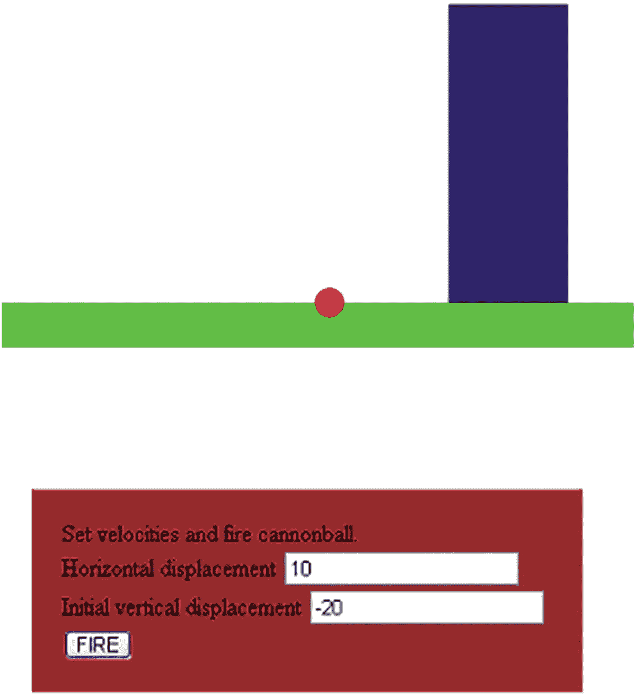
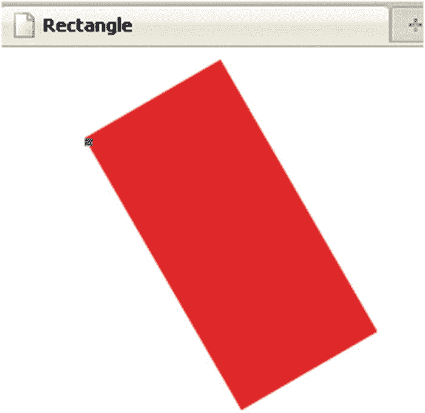
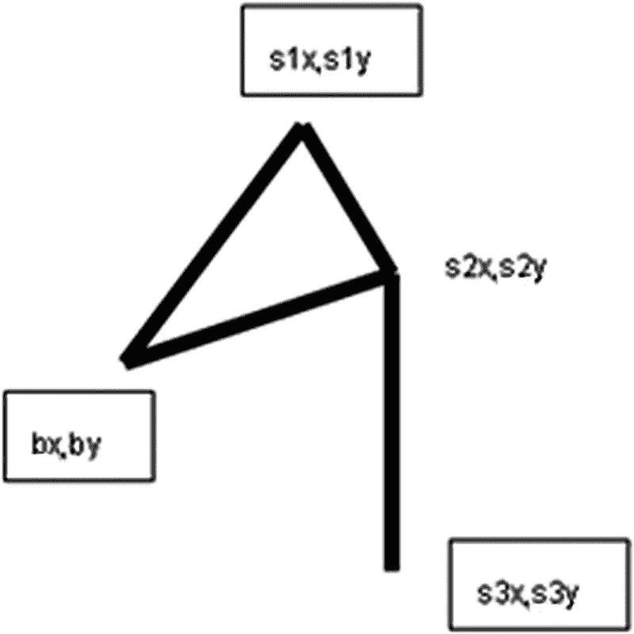

# 四、炮弹和弹弓

在本章中，我们将介绍

*   维护要在屏幕上绘制的对象列表

*   旋转屏幕上绘制的对象

*   鼠标拖放操作

*   模拟弹道运动(重力效应)和碰撞的计算

## 介绍

本章演示了动画的另一个例子，在这种情况下，弹道模拟，也称为抛射体运动。球或类似球的物体保持恒定的水平(x)位移，垂直位移由于重力而改变。产生的运动是一个弧。当球(实际上)碰到地面或目标时就会停止。您将看到的代码使用演示球在盒子中弹跳的相同技术来生成动画。该代码重新定位球，并以固定的间隔重绘场景。我们将看三个例子。

*   一个非常简单的弹道模拟。球在击中目标或地面之前起飞并沿弧线飞行。飞行的参数是水平和初始垂直速度，由玩家使用表单输入字段设置。当球碰到目标或地面时，它就停止了。

*   一种改进的炮弹，用一个长方形代表倾斜一定角度的大炮。飞行的参数是出炮速度和炮角度。同样，这些是由玩家使用表单输入字段设置的。该程序计算初始水平和垂直位移值。

*   一个弹弓。飞行的参数是由玩家拖动，然后释放，一个球的形状拴在一个代表弹弓的木棒上来决定的。速度是由球到弹弓上一个地方的距离决定的。角度是弹弓这部分与水平面的夹角。

图 4-1 显示了简单的(无加农炮)应用。



图 4-1

球落在了地上

图 4-2 显示了第二个应用程序的开始屏幕。目标是一个`Image`，代表大炮的矩形可以旋转。注意控件引用了一个角度和一个初速度。


图 4-2

以图像为目标的旋转加农炮

图 4-3 为成功命中后的场景。请注意，加农炮被旋转了，目标的原始图像被替换为新图像。


图 4-3

在开炮并击中目标后

弹弓应用程序的打开屏幕如图 4-4 所示。这个应用程序类似于大炮，但飞行的参数是由玩家使用鼠标在球(代表弹弓中的岩石)上拖动来设置的，目标现在是一只鸡。


图 4-4

弹弓应用程序的打开屏幕

对于弹弓，我决定让球一直飞下去，直到它落地。但是，如果鸡被打了，我想换成羽毛，如图 4-5 。请注意，当松开鼠标按钮，球飞起来的时候，弹弓的线还在原来的位置。我发现我需要更多的时间来观察琴弦，以便计划我的下一次拍摄。如果您愿意，您可以更改游戏，使字符串弹回到它们的原始位置，或者创建一个新的游戏按钮。在我的例子中，通过重新加载 HTML 文件来重放游戏。


图 4-5

球击中鸡后落在地上，那里只剩下羽毛

这些应用程序的编程使用了许多在弹跳球应用程序中演示的相同技术。球在飞行中的重新定位只是因为它需要模拟由于重力而改变的垂直位移的效果。slingshot 应用程序为玩家提供了一种新的与应用程序交互的方式，使用鼠标的拖放操作。

带加农炮的炮弹和弹弓使用加农炮和弹弓的绘图功能以及原始目标和命中目标的外部图像文件。如果你想改变目标，你需要找到图像文件，然后用应用程序上传。

## 关键要求

我们的第一个要求是通过设置一个事件以固定的时间间隔发生来制作动画，然后设置一个函数通过重新定位球和检查碰撞来处理该事件。我们在前一章的弹跳球应用程序中讨论了这一点。这里新增的是模拟重力的计算。由简单物理模型指示的计算基于以恒定量改变垂直位移，然后计算旧的和新的位移的平均值来计算新的位置，计算出新的垂直位移。

*   水平位移(由变量`dx`保存)是水平速度(`horvelocity`)，不变。代码:`dx = horvelocity;`

*   间隔开始时的垂直速度是`verticalvel1`

*   间隔结束时的垂直速度是`verticalvel1`加上加速量(`gravity`)。代码:`verticalvel2 = verticalvel1 + gravity;`

*   井段(`dy`)的垂直位移是`verticalvel1`和`verticalvel2`的平均值。代码:`dy = (verticalvel1 + verticalvel2)*.5;`

这是模拟重力或任何其他恒定加速度的标准方式。

### 注意

我把重力的值定为产生一个令人愉快的弧线。你可以使用一个标准值，但是你需要做一些研究来为大炮和弹弓的初始速度分配一个真实的值。您还需要确定像素和距离之间的映射。炮弹和弹弓的系数是不同的。

该程序的第二个版本必须根据初始值或玩家输入的加农炮口速度和加农炮角度来旋转加农炮，并根据这些值计算水平和垂直值。

该程序的第三个版本“弹弓”必须允许玩家按住鼠标按钮并沿着弹弓的弦拖动球，然后放开鼠标按钮来释放球。运动参数是根据球与弹弓顶部的角度和距离计算的。

该程序的第二版和第三版都需要用另一个图像替换目标图像。

## HTML5、CSS 和 JavaScript 特性

现在让我们看看 HTML5 和 JavaScript 的具体特性，它们提供了实现弹道模拟应用程序所需的内容。幸运的是，我们可以使用一个`canvas`元素、程序员定义的和内置的函数、一个`form`元素和变量，在前面几章介绍的内容基础上构建，特别是 HTML 文档的一般结构。让我们从程序员定义的对象和使用数组开始。

### 数组和程序员定义的对象

HTML5 让你在画布上画画，但是一旦画了什么东西，就好像放下了颜料或墨水；画出来的东西不会保留它的个性。HTML5 不像 Flash 那样将对象放置在舞台上，可以单独移动和旋转。然而，我们仍然可以产生相同的效果，包括单个对象的旋转。在后面的章节中，我们将在浏览器窗口中移动对象。

因为这些应用程序的显示有些复杂，所以我决定开发一种更系统的方法来在画布上绘制和重绘不同的东西。为此，我创建了一个名为`everything`的数组来保存要在画布上绘制的对象列表。将数组视为一个集合，或者更准确地说，是一系列项目。在前面的章节中，我们讨论了用来保存数值(如数字或字符串)的变量。数组是另一种类型的值。我的`everything`数组将作为需要在画布上绘制的待办事项列表。

我使用的术语*对象*在英语和编程上都有意义。用编程术语来说，一个对象由*属性*和*方法*组成，即数据和编码或行为。在第一章描述的带注释的链接例子中，我演示了`document`对象的`write`方法。我使用了变量`ctx`，它是一个`canvas`对象的 2D 类型上下文，方法如`fillRect,`，属性如`fillStyle`。这些是内置的；也就是说，它们已经是 HTML5 版本的 JavaScript 中定义的对象。对于弹道应用程序，我定义了自己的对象，特别是`Ball`、`Picture`、`Myrectangle`和`Sling`。这些不同对象中的每一个都包括一个`draw`方法的定义以及指示位置和维度的属性。我这样做是为了能画出每一个事物的清单。适当的`draw`方法访问属性来决定画什么和在哪里画。我还包括了旋转单个对象的方法。

定义一个对象很简单:我简单地为`Ball`、`Picture`和`Myrectangle`定义了一个名为*构造函数*的函数，并使用这些函数和操作符`new`将值赋给变量。然后，我可以使用熟悉的点符号来编写代码，以访问或分配属性，并调用我在构造函数中设置的方法。下面是一个`Ball`对象的构造函数:

```js
function Ball(sx,sy,rad,stylestring) {
  this.sx = sx;
  this.sy = sy;
  this.rad = rad;
  this.draw = drawball;
  this.moveit = moveball;
  this.fillstyle = stylestring;
}

```

术语`this`指的是这个函数与关键字`new`一起使用时创建的对象。从代码上看，`this.draw`和`this.moveit`被赋予了函数的名称，这一事实并不明显，但事实就是如此。这两个函数的定义如下。请注意，它们都使用术语`this`来获取绘制和移动对象所需的属性。

```js
function drawball() {
        ctx.fillStyle=this.fillstyle;
        ctx.beginPath();

        ctx.arc(this.sx,this.sy,this.rad,0,Math.PI*2,true);
        ctx.fill();
}

```

### 注意

JavaScript 已经开始增加对类和对象的支持，尽管它仍然不包括完全继承。一个相关网站是

[`https://developer.mozilla.org/en-US/docs/Web/JavaScript/Reference/Classes`](https://developer.mozilla.org/en-US/docs/Web/JavaScript/Reference/Classes)

`drawball`函数在画布上绘制一个填充圆，一个完整的圆弧。圆圈的颜色是创建此`Ball`对象时设置的颜色。

函数`moveball`不会立即移动任何东西。抽象地看这个问题，`moveball`改变了应用程序放置对象的位置。该函数改变对象的`sx`和`sy`属性的值，当它下一次显示时，这些新值用于绘图。

```js
function moveball(dx,dy) {
        this.sx +=dx;
        this.sy +=dy;
}

```

下一个声明变量`cball`的语句通过使用操作符`new`和函数`Ball`构建了一个类型为`Ball`的新对象。该函数的参数基于加农炮的设定值，因为我希望球出现在加农炮的开口处。

```js
var cball = new Ball(cannonx+cannonlength,cannony+cannonht*.5,ballrad,"rgb(250,0,0)");

```

`Picture`、`Myrectangle`和`Sling`的功能类似，稍后将进行解释。它们各自指定了一个`draw`方法。对于这个应用程序，我只为`cball`使用了`moveit`，但是我为其他对象定义了`moveit`，以防我以后想要在这个应用程序上构建。变量`cannon`和`ground`将被设置为保存一个`new Myrectangle`，变量`target`和`htarget`将被设置为保存一个`new Picture`。

### 小费

程序员编的名字是任意的，但是拼写和大小写保持一致是个好主意。HTML5 似乎不考虑大小写，这与 XHTML 版本形成对比。许多语言将大写字母和小写字母视为不同的字母。我一般使用小写，但是我将`Ball`、`Picture`、`Slingshot`和`Myrectangle`的第一个字母大写，因为按照惯例，打算作为对象构造函数的函数应该以大写字母开头。

使用数组方法`push`将每个变量添加到`everything`数组中，该方法在数组末尾添加一个新元素。

### 绘图的旋转和平移

HTML5 让我们翻译和旋转绘图。正如您在第 2 和 3 章中所看到的，图纸是根据坐标系绘制的，图像等对象是根据坐标系定位的。坐标系的一个重要方面是它的原点，即 0，0 位置。HTML5 提供了一种改变坐标系的方法。一个*平移*操作改变原点。我们大多数人都熟悉的一种情况是在我们的汽车中使用 GPS 系统。根据我们所处的位置给出了方向。你可以认为这是重置原点。*旋转*操作绕原点旋转！接下来的几段带你看一些例子。请花时间研究这些示例，并进行修改，看看会发生什么。

看一下下面的代码。我敦促你创建这个例子，然后用它来提高你的理解。该代码在画布上绘制了一个大的红色矩形，其左上角位于(50，50)处，其顶部有一个小的蓝色正方形。

```js
<html>
<head>
    <title>Rectangle</title>
    <script type="text/javascript">
        var ctx;
function init(){
   ctx = document.getElementById('canvas').getContext('2d');
        ctx.fillStyle = "rgb(250,0,0)";
        ctx.fillRect(50,50,100,200);
ctx.fillStyle = "rgb(0,0,250)";

        ctx.fillRect(50,50,5,5);
}
</script>

</head>
<body onLoad="init();">
<canvas id="canvas" width="400" height="300">
Your browser doesn't support the HTML5 element canvas.
</canvas>
</body>
</html>

```

结果如图 4-6 所示。


图 4-6

矩形(无旋转)

在本练习中，目标是旋转大矩形，以左上角的蓝色小方块为轴。我想逆时针旋转。

大多数编程语言都有一个小小的复杂之处，那就是旋转和三角函数的角度输入必须以*弧度*为单位，而不是度数。弧度在第二章和中有解释，但是这里有一个提醒。该测量基于圆中数学常数π弧度的两倍，而不是整圆的 360 度。幸运的是，我们可以使用 JavaScript 的内置特性，`Math.PI`。1π弧度相当于 180 度，π除以 2 相当于直角 90 度。为了指定 30 度的旋转，我们使用π除以 6，或者在编码中使用`Math.PI/6`。为了改变之前给出的`init`函数来做一个旋转，我放入一个负圆周率除以 6 的旋转(相当于逆时针旋转 30 度)，画出红色的矩形，然后旋转回来，撤销旋转，画出蓝色的正方形:

```js
function init(){
   ctx = document.getElementById('canvas').getContext('2d');
   ctx.fillStyle = "rgb(250,0,0)";
   ctx.rotate(-Math.PI/6);
   ctx.fillRect(50,50,100,200);
   ctx.rotate(Math.PI/6);
   ctx.fillStyle = "rgb(0,0,250)";
   ctx.fillRect(50,50,5,5);
}

```

可惜图 4-7 中的图不是我想要的。


图 4-7

绘制和旋转矩形

问题是旋转点在原点，(0，0)，而不是在红色矩形的角上。因此，我需要编写代码来执行一个转换，以重置原点，然后旋转，然后转换回来，以便在正确的位置绘制下一个项目。我可以使用 HTML5 的特性来做到这一点。画布上的所有绘图都是根据一个坐标系完成的，我可以使用`save`和`restore`操作来保存当前的坐标系——轴的位置和方向——然后恢复它以制作更多的绘图。这是代码。

```js
function init(){
   ctx = document.getElementById('canvas').getContext('2d');
   ctx.fillStyle = "rgb(250,0,0)";
   ctx.save();
   ctx.translate(50,50);             //move origin
   ctx.rotate(-Math.PI/6);           //do rotation
   ctx.translate(-50,-50);           // move origin back
   ctx.fillRect(50,50,100,200);      //draw rectangle
   ctx.restore();                    //undo all the transformations
   ctx.fillStyle = "rgb(0,0,250)";
   ctx.fillRect(50,50,5,5);          //draw little blue square
}

```

rotate 方法需要以弧度为单位的角度，顺时针方向为正方向。所以我的代码逆时针旋转了 30 度，产生了我想要的结果，如图 4-8 所示。



图 4-8

保存、翻译、旋转、翻译、恢复

我再次敦促你修改这个例子，以帮助你理解转换和弧度。做一些小的改变，一次一个陈述。

顺便说一下，我们不能期望我们的玩家用弧度来输入角度。他们，还有我们，太习惯于度(90 度是直角，180 度是你掉头时的弧度等等。).程序必须完成工作。从角度到弧度的转换要乘以 pi/180。

### 注意

大多数编程语言在三角函数和旋转操作中使用弧度表示角度。

在这种背景下，我向`everything`数组中的信息添加指示，指示是否有旋转，如果有，则指示所需的平移点。这是我的主意。这与 HTML5 或 JavaScript 无关，本来可以用不同的方式完成。底层任务是创建和维护模拟场景中对象的信息。HTML5 的 canvas 特性提供了一种画图和显示图像的方式，但是它并没有保留对象的信息！

第二个和第三个应用程序的`everything`数组中的项目本身就是数组。第一个(0 <sup>th</sup> index)值指向对象。第二个(1 <sup>st</sup> index)是`true`或`false`。值`true`意味着旋转角度值和平移的 x 和 y 值跟随其后。实际上，这意味着内部数组要么有两个值，最后一个是`false`，要么有五个值。

### 注意

此时，你可能会想:她设置了一个通用系统，只是为了旋转大炮。为什么不为大炮装些东西呢？答案是我们可以，但是一般的系统确实可以工作，而且仅仅为加农炮编写的东西可能有同样多的代码。

第一个应用程序使用从表单中提取的水平和垂直位移值。玩家必须考虑这两个不同的值。对于第二个应用程序，播放器再次输入两个值，但它们是不同的。一个是出炮口的速度，一个是炮的角度。剩下的工作由程序来完成。初始不变的水平位移和初始垂直位移是根据玩家的输入计算出来的:出炮速度和一个角度。计算基于标准的三角学。幸运的是，JavaScript 提供了 trig 函数作为内置方法的`Math`类的一部分。

图 4-9 显示了玩家指定的炮外位移值和角度值的计算。竖线的负号是由于 JavaScript 屏幕坐标的 y 值随着屏幕向下增加而产生的。


图 4-9

计算水平*垂直位移

在这一点上，您可能想跳过阅读炮弹应用程序的实现。然后你可以回来阅读弹弓需要什么。

### 绘制线段

对于 slingshot 应用程序，我通过定义两个函数`Sling`和`drawsling`添加了一个新的对象类型。我的理想化弹弓由四个位置表示，如图 4-10 。请理解，我们可以用许多不同的方式来做这件事。



图 4-10

理想化的弹弓

`Sling`函数类似于其他构造函数，例如`Ball`。

```js
function Sling(bx,by,s1x,s1y,s2x,s2y,s3x,s3y,stylestring) {
      this.bx = bx;
      this.by = by;
      this.s1x = s1x;
      this.s1y = s1y;
      this.s2x = s2x;
      this.s2y = s2y;
      this.s3x = s3x;
      this.s3y = s3y;
      this.strokeStyle = stylestring;
      this.draw = drawsling;
      this.moveit = movesling;
}

```

`Sling`函数将`drawsling`设置为每当`draw`与`Sling`对象结合使用时调用的函数。虽然在当前的应用程序中没有发生，`movesling`将被调用，如果你或我在这个应用程序上移动弹弓的位置。

绘制弹弓包括基于四个点绘制四条线段。这个点将会改变，我将在下一节描述。HTML5 让我们绘制线段作为路径的一部分。我们已经用路径来画圆了。您可以将路径绘制为笔画或填充。对于圆圈，我们使用了`fill`方法，但是对于弹弓，我只想要线条。画一条线可能涉及两个步骤:移动到线的一端，然后画它。HTML5 提供了`moveTo`和`lineTo`方法。在调用`stroke`或`fill`方法之前，不会绘制路径。`drawsling`功能很好的说明了画线。

```js
function drawsling() {
   ctx.strokeStyle = this.strokeStyle;
   ctx.lineWidth = 4;
   ctx.beginPath();
   ctx.moveTo(this.bx,this.by);
   ctx.lineTo(this.s1x,this.s1y);
   ctx.moveTo(this.bx,this.by);
   ctx.lineTo(this.s2x,this.s2y);
   ctx.moveTo(this.s1x,this.s1y);
   ctx.lineTo(this.s2x,this.s2y);
   ctx.lineTo(this.s3x,this.s3y);
   ctx.stroke();
}

```

它执行以下操作:

*   向路径添加一条从`bx,by`到`s1x,s1y`的线

*   向路径添加一条从`bx,by`到`s2x,s2y`的线

*   向路径添加一条从`s1x,s1y`到`s2x,s2y`的线

*   向路径添加一条从`s2x,s2y`到`s3x,s3y`的线

和往常一样，学习这个的方法是尝试你自己的设计。如果没有调用`moveTo`，下一个`lineTo`将从上一个`lineTo`的目的地抽取。想象你手里拿着一支笔，要么在纸上移动，要么举起来移动，但不画任何东西。您也可以连接弧。第五章演示绘制多边形。

### 鼠标事件用于拉动弹弓

slingshot 应用程序用鼠标拖放操作代替了表单输入。这很吸引人，因为它更接近于弹弓的物理行为。

当玩家按下鼠标按钮时，这是程序管理的一系列事件中的第一个。下面是需要完成的工作的伪代码。

*当玩家按下鼠标键时，检查鼠标是否在球的上面。如果不是，什么都不做。如果是，设置一个名为* `inmotion` *的变量。*

*如果鼠标正在移动，勾选* `inmotion` *。如果设置好了，移动弹弓的球和弦。一直这样做，直到松开鼠标按钮。*

*当玩家释放鼠标按钮时，将* `inmotion` *重置为* `false` *。计算球的角度和初速度，并由此计算水平速度和初始垂直速度。让球动起来。*

您可以使用 HTML5 和 JavaScript 来设置按下标准(左)鼠标按钮、移动鼠标和释放鼠标按钮的事件处理。代码使用了直接基于`canvas`元素的方法，而不是所谓的上下文。下面是代码，它在`init`函数中:

```js
canvas1 = document.getElementById('canvas');
canvas1.addEventListener('mousedown',findball,false);
canvas1.addEventListener('mousemove',moveit,false);
canvas1.addEventListener('mouseup',finish,false);

```

因为这个事件是在整个画布上发生的，所以`findball`函数必须确定鼠标是否在球上。第一个任务是获得鼠标的 x 和 y 坐标。当我最初写这篇文章时，不同的浏览器以不同的方式实现鼠标事件。以下是推荐用于 Firefox、Chrome 和 Safari 的编码和工作方式。当其他浏览器(如 Internet Explorer)支持 HTML5 时，将需要检查并可能修改这些代码。注意，当不支持`canvas`时，`canvas`元素内部的编码确实会返回一条消息。

```js
if ( ev.layerX ||  ev.layerX==0) {
   mx= ev.layerX;
   my = ev.layerY;
}
else if (ev.offsetX || ev.offsetX==0 ) {
   mx = ev.offsetX;
   my = ev.offsetY;
}

```

这是因为如果`ev.layerX`不存在，它的值将被解释为`false`。如果`ev.layerX`确实存在但值为 0，其值也将被解释为`false`，但`ev.layerX==0`将为`true`。

把这段代码想成是在说:有好的`ev.layerX`值吗？如果有，那就用吧。要不，我们试试`ev.offsetX`。如果这两个都不起作用，`mx`和`my`将不会被设置，我应该添加另一个`else`子句来告诉玩家代码在他的浏览器中不起作用。

现在，下一步是确定(`mx,my)`点是否在球上。我在重复自己的话，但重要的是要明白，球现在相当于画布上的墨水或颜料，如果不确定(`mx,my`)点是否在球的顶部，我们就无法继续下去。我们如何做到这一点？我们可以计算出(`mx,my`)离球的中心有多远，看看它是否小于球的半径。平面距离有一个标准公式。我的代码是这个想法的一个微小的变化。它通过计算距离的平方并将其与球半径的平方进行比较来做出决定。我这样做是为了避免计算平方根。

如果鼠标点击在球上，即在球中心的半径距离内，该函数将全局变量`inmotion`设置为`true`。`findball`函数以调用`drawall()`结束。

每当鼠标移动时，就会调用`moveit`函数，在这里我们检查`inmotion`是否是`true`。如果不是，什么都不会发生。如果是，使用与前面相同的代码来获取鼠标坐标和球的中心，并将弹弓的`bx,by`值设置为鼠标坐标。这有拖动球和拉伸弹弓弦的效果。

当释放鼠标按钮时，我们调用`finish`函数，如果`inmotion`不是`true`，该函数不做任何事情。这什么时候会发生？如果玩家在球上的*而不是*周围移动鼠标并按下和释放按钮。

如果`inmotion`是`true`，该函数立即将其设置为`false`，并进行计算以确定球的飞行，生成玩家使用表单在早期的炮弹应用程序中输入的信息。信息是与水平线的角度和球到弹弓直线部分的距离。这是(`bx,by`)到(`s1x, s1y`)的夹角，以及(`bx,by`)到(`s1x, s1y`)的距离，更准确的说是距离的平方。

我用`Math.atan2`来做这些计算:根据`x`的变化和`y`的变化来计算角度。这是`arctangent`功能的变体。

我使用`distsq`函数来确定从(`bx,by)`到(`s1x, s1y)`)的距离的平方。我想让速度依赖于这个值。将绳子拉得更远意味着飞行速度更快。我做了一些实验，决定用正方形除以 700 产生一个漂亮的弧线。

最后一步是首先调用`drawall()`，然后调用`setInterval`来设置计时事件。同样，`finish`在炮弹应用中做着与`fire`类似的工作。在第一个应用程序中，我们的玩家输入了水平和初始垂直值。在第二个应用程序中，玩家输入一个角度(以度为单位)和一个速度，剩下的由程序完成。在《弹弓》中，我们去掉了表格和数字，为玩家提供了一种在弹弓上拉回，或者虚拟拉回的方式。在响应鼠标事件和计算方面，该程序有更多的工作要做。

请注意，我没有对球员愚蠢地将球瞄准远离鸡的方向，或者直接瞄准向上，或者将球拉到地面以下做任何规定。在后一种情况下，球向上移动并停在地上。试验并决定您将包括哪些检查和消息。

### 使用数组拼接更改显示的项目列表

最后一个需要解释的任务是用另一个图片替换目标图片。因为我想要两种不同的效果，所以我使用了不同的方法。对于第二个应用程序，我希望球和原来的`target`一起消失，并显示我在变量`htarget`中设置的内容。我所做的是跟踪原来的`target`在`everything`数组中的位置，然后移除它并替换`htarget`。类似地，我将球从`everything`数组中移除。对于弹弓操作，我没有移除目标，而是将它的`img`属性改为`feathers`。注意，在代码中，`chicken`和`feathers`是`Image`对象。每个都有一个指向文件的`src`属性。

```js
        var chicken = new Image();
        chicken.src = "chicken.jpg";
        var feathers = new Image();
        feathers.src = "feathers.gif";

```

对于这两个操作，我使用数组方法`splice`。它有两种形式:您可以删除任意数量的元素，也可以删除然后插入元素。拼接的一般形式是

*arrayname.splice(拼接发生的索引，要删除的项目数，要添加的新项目)*

如果要添加一个以上的项目，则有更多的参数。在我的代码中，我添加了一个条目，它本身就是一个数组。我在`everything`数组中对对象的表示为每个对象使用一个数组。数组的第二个参数指示是否有旋转。

下面两行代码做了我需要做的事情:移除目标，在不旋转的情况下粘上`htarget`，然后移除球。

```js
everything.splice(targetindex,1,[htarget,false]);
everything.splice(ballindex,1);

```

顺便说一下，如果我只想删除数组中的最后一项，我可以使用方法`pop`。然而，在这种情况下，目标可能在`everything`数组中间的某个地方，所以我需要编写代码来跟踪它的索引值。

### 点之间的距离

在 slingshot 程序中有两个地方我使用了点与点之间的距离，或者更准确地说，距离的平方。我需要找出鼠标光标是否在球的顶部，我想根据弹弓的拉伸，即(bx，by)到(s1x，s1y)的距离，确定初始速度，相当于炮弹的速度。两点 x1，y1 和 x2，y2 之间的距离公式是(x1-x2)和(y1-y2)的平方和的平方根。我决定通过计算平方和来避免计算平方根。这为鼠标光标在球上提供了相同的测试。对于另一个任务，我决定用距离的平方来表示初速度。我试验了一些数字，正如我前面提到的，700 似乎是可行的。

## 构建应用程序并使之成为您自己的应用程序

现在让我们来看看炮弹基本发射的代码，没有大炮，基于水平和初始垂直速度；从大炮中发射炮弹，基于大炮的角度和初始速度；以及弹弓，基于从鼠标位置确定的角度和初始速度。和前几章一样，我将介绍这些函数，以及它们对每个应用程序的调用或被调用。在这种情况下，这三个应用程序的表虽然不完全相同，但很相似。这种调用比前面的例子更加多样化，因为有些情况下调用函数是因为它们被命名为程序员定义的对象的方法或声明(`var`)语句的一部分。这是*面向对象、事件驱动编程*的一个特点。我还将在表格中给出每个应用程序的完整代码，并解释每一行的作用。表 4-1 显示了基本炮弹应用的功能。

表 4-1

在最简单的炮弹应用中的功能

<colgroup><col class="tcol1 align-left"> <col class="tcol2 align-left"> <col class="tcol3 align-left"></colgroup> 
| 

功能

 | 

调用方/被调用方

 | 

打电话

 |
| --- | --- | --- |
| `init` | `body`标签中`onLoad`的动作 | `drawall` |
| `drawall` | 由`init`、`fire`、`change`直接调用 | 调用`everything`数组中所有对象的`draw`方法。这些是`drawball`、`drawrects`的功能 |
| `fire` | 由表单中的`onSubmit`属性的动作调用 | `drawall` |
| `change` | 由在`fire`中调用的`setInterval`函数的动作调用 | `drawall`，调用`cball`的`moveit`方法，也就是`moveball` |
| `Ball` | 由代码在`var`语句中直接调用 |   |
| `Myrectangle` | 由代码在`var`语句中直接调用 |   |
| `drawball` | 通过调用一个`Ball`对象的`draw`方法来调用 |   |
| `drawrects` | 通过调用`target`对象的`draw`方法来调用 |   |
| `moveball` | 通过调用一个`Ball`对象的`moveit`方法来调用 |   |

表 4-2 显示了最简单应用的完整代码，球以弧线运动，没有实际的大炮。

表 4-2

第一个炮弹应用

<colgroup><col class="tcol1 align-left"> <col class="tcol2 align-left"></colgroup> 
| 

密码

 | 

说明

 |
| --- | --- |
| `<html>` | 开始`html`标签。 |
| `<head>` | 开始`head`标签。 |
| `<title>Cannonball</title>` | 完成`title`元素。 |
| `<style>` | 开始`style`标签。 |
| `form {` | 表单的样式。 |
| `width:330px;` | `Width`。 |
| `margin:20px;` | 外部`margin`。 |
| `background-color:brown;` | 设置窗体的背景色。 |
| `padding:20px;` | 内部`padding`。 |
| `}` | 关闭此样式。 |
| `</style>` | 关闭`style`元素。 |
| `<script>` | 开始`script`标签。 |
| `var cwidth = 600;` | 设置用于清除的画布宽度值。 |
| `var cheight = 400;` | 设置画布`height`的值，用于清除。 |
| `var ctx;` | 保存画布上下文的变量。 |
| `var everything = [];` | 数组来保存所有要绘制的对象。初始化为空数组。 |
| `var tid;` | 保存计时事件标识符的变量。 |
| `var horvelocity;` | 变量来保持水平速度(又名位移)。 |
| `var verticalvel1;` | 用于保存间隔开始时的垂直位移的变量。 |
| `var verticalvel2;` | 重力改变后，间隔结束时保持垂直位移的变量。 |
| `var gravity = 2;` | 垂直位移的变化量。武断。形成一个漂亮的弧线。 |
| `var iballx = 20;` | 球的初始水平坐标。 |
| `var ibally = 300;` | 球的初始垂直坐标。 |
| `function Ball(sx,sy,rad,stylestring) {` | 定义一个`Ball`的功能开始。对象。使用参数设置属性。 |
| `this.sx = sx;` | 设置`this`对象的`sx`属性。 |
| `this.sy = sy;` | … `sy` |
| `this.rad = rad;` | … `rad` |
| `this.draw = drawball;` | … `draw`。由于`drawball`是一个函数的名字，这使得`draw`成为一个可以被调用的方法。 |
| `this.moveit = moveball;` | … `moveit`设置为功能`moveball`。 |
| `this.fillstyle = stylestring;` | … `fillstyle` |
| `}` | 关闭`Ball`功能。 |
| `function drawball() {` | `drawball`功能的标题。 |
| `ctx.fillStyle=this.fillstyle;` | 使用该对象的属性设置`fillStyle`。 |
| `ctx.beginPath();` | 开创一条道路。 |
| `ctx.arc(this.sx,this.sy` `,this.rad,0,Math.PI*2,true);` | 设置为画一个圆。 |
| `ctx.fill();` | 将路径绘制为填充路径。 |
| `}` | 关闭该功能。 |
| `function moveball(dx,dy) {` | `moveball`功能的标题。 |
| `this.sx +=dx;` | 将`sx`属性增加`dx`。 |
| `this.sy +=dy;` | 将`sy`属性增加`dy`。 |
| `}` | 关闭功能。 |
| `var cball = new Ball(iballx,ibally,` `10,"rgb(250,0,0)");` | 在指定的位置、半径和颜色创建一个新的`Ball`对象。将其赋给变量`cball`。请注意，此时没有绘制任何内容。这些信息只是为以后使用而设置的。 |
| `function Myrectangle(sx,sy,swidth,` `sheight,stylestring) {` | 构造一个`Myrectangle`对象的函数头。 |
| `this.sx = sx;` | 设置`this`对象的`sx`属性。 |
| `this.sy = sy;` | … `sy` |
| `this.swidth = swidth;` | … `swidth` |
| `this.sheight = sheight;` | … `sheight` |
| `this.fillstyle = stylestring;` | … `stylestring` |
| `this.draw = drawrects;` | … `draw`。这就建立了一个可以调用的方法。 |
| `this.moveit = moveball;` | ….`moveit`。这就建立了一个可以调用的方法。这个程序中不使用它。 |
| `}` | 关闭`Myrectangle`功能。 |
| `function drawrects() {` | `drawrects`功能的标题。 |
| `ctx.fillStyle = this.fillstyle;` | 设置`fillStyle`。 |
| `ctx.fillRect(this.sx,this.sy,` `this.swidth,this.sheight);` | 使用对象属性绘制矩形。 |
| `}` | 关闭该功能。 |
| `var target = new Myrectangle(300,100,` `80,200,"rgb(0,5,90)");` | 构建一个`Myrectangle`对象并分配给目标。 |
| `var ground = new Myrectangle(0,300,` `600,30,"rgb(10,250,0)");` | 建立一个`Myrectangle`物体并分配给地面。 |
| `everything.push(target);` | 将目标添加到`everything`。 |
| `everything.push(ground);` | 添加`ground`。 |
| `everything.push(cball);` | 添加`cball`(它将在最后绘制，因此在所有其他内容之上)。 |
| `function init(){` | `init`功能的标题。 |
| `ctx = document.getElementById` `('canvas').getContext('2d');` | 设置`ctx`以便在画布上绘图。 |
| `drawall();` | 画出一切。 |
| `}` | 关闭`init`。 |
| `function fire() {` | 头部为`fire`功能。 |
| `cball.sx = iballx;` | 将`cball`重新定位在`x`中。 |
| `cball.sy = ibally;` | 将`cball`重新定位在`y`中。 |
| `horvelocity =  Number(document.` `f.hv.value);` | 从表格中设置水平速度。打个电话。 |
| `verticalvel1 = Number(document.` `f.vv.value);` | 从表格中设置初始垂直速度。 |
| `drawall();` | 画出一切。 |
| `tid = setInterval` `(change,100);` | 开始计时事件。 |
| `return false;` | 返回`false`阻止刷新 HTML 页面。 |
| `}` | 关闭该功能。 |
| `function drawall() {` | `drawall`的功能头。 |
| `ctx.clearRect` `(0,0,cwidth,cheight);` | 擦除画布。 |
| `var i;` | 为`for`循环声明`var i`。 |
| `for (i=0;i<everything.length;i++)` `{` | 对于`everything`数组中的每一项… |
| `everything[i].draw();}` | …调用对象的`draw`方法。关闭`for`回路。 |
| `}` | 关闭该功能。 |
| `function change() {` | `change`功能的标题。 |
| `var dx = horvelocity;` | 将`dx`设置为`horvelocity`。 |
| `verticalvel2 =` `verticalvel1 + gravity;` | 计算新的垂直速度(添加重力)。 |
| `var dy = (verticalvel1 +` `verticalvel2)*.5;` | 计算时间间隔的平均速度。 |
| `verticalvel1 = verticalvel2;` | 现在把旧的变成新的。 |
| `cball.moveit(dx,dy);` | 移动`cball`计算量。 |
| `var bx = cball.sx;` | 设置`bx`以简化`if`语句。 |
| `var by = cball.sy;` | ...和`by` |
| `if ((bx>=target.sx)&&(bx<=` `(target.sx+target.swidth))&&` | 球在水平方向上是否在目标内… |
| `(by>=target.sy)&&(by<=` `(target.sy+target.sheight))) {` | 还有纵向？ |
| `clearInterval(tid);` | 如果是这样，停止运动。 |
| `}` | 关闭`if true`子句。 |
| `if (by>=ground.sy) {` | 球越过地面了吗？ |
| `clearInterval(tid);` | 如果是这样，停止运动。 |
| `}` | 关闭`if true`子句。 |
| `drawall();` | 画出一切。 |
| `}` | 关闭`change`功能。 |
| `</script>` | 关闭`script`元素。 |
| `</head>` | 关闭`head`元素。 |
| `<body onLoad="init();">` | 打开`body`，将通话设置为`init`。 |
| `<canvas id="canvas" width=` `"600" height="400">` | 定义`canvas`元素。 |
| `Your browser doesn't support` `the HTML5 element canvas.` | 向不兼容浏览器的用户发出警告。 |
| `</canvas>` | 关闭`canvas`元件。 |
| `<br/>` | 换行。 |
| `<form name="f" id="f"` `onSubmit="return fire();">` | 带有名称和 ID 的起始表单标记。这将建立对`fire`的调用。 |
| `Set velocities and fire` `cannonball. <br/>` | 标签和换行。 |
| `Horizontal displacement <input name=``"hv" id="hv" value="10" type=` | 输入字段的标签和说明。 |
| `<br>` | 换行。 |
| `Initial vertical displacement <input``name="vv" id="vv" value="-25"` | 输入字段的标签和说明。 |
| `<input type="submit" value="FIRE"/>` | 提交`input`元素。 |
| `</form>` | 关闭`form`元素。 |
| `</body>` | 关闭`body`元素。 |
| `</html>` | 关闭`html`元素。 |

您当然可以对这个应用程序进行改进，但是首先确保您理解了它，然后继续下一个，这可能更有意义。

### 炮弹:有大炮，角度和速度

我们的下一个应用程序添加了一个矩形来表示大炮，一个原始目标的图片而不是第一个应用程序中使用的简单矩形，以及第二个命中目标的图片。大炮按照表单中输入的内容旋转。我让`everything`数组成为数组的数组，因为我需要一种方法来添加旋转和平移信息。我还决定让炮弹击中目标时的结果更加戏剧化。这意味着用于检查碰撞的`change`函数中的代码是相同的，但是`if-true`子句中的代码删除了旧的目标，放入命中的目标，并删除了球。现在，说了这么多，大部分编码都是一样的。显示功能的表 4-3 增加了两行用于`Picture`和`drawAnImage`。

表 4-3

第二个炮弹应用程序中的函数

<colgroup><col class="tcol1 align-left"> <col class="tcol2 align-left"> <col class="tcol3 align-left"></colgroup> 
| 

功能

 | 

调用方/被调用方

 | 

打电话

 |
| --- | --- | --- |
| `init` | `body`标签中`onLoad`的动作 | `drawall` |
| `drawall` | 由`init`、`fire`、`change`直接调用 | 调用`everything`数组中所有对象的`draw`方法。这些是功能`drawball`和`drawrects` |
| `fire` | 由表单中的`onSubmit`属性的动作调用 | `drawall` |
| `change` | 由在`fire`中调用的`setInterval`函数的动作调用 | `drawall`，调用`cball`的`moveit`方法，也就是`moveball` |
| `Ball` | 由代码在`var`语句中直接调用 |   |
| `Myrectangle` | 由代码在`var`语句中直接调用 |   |
| `drawball` | 通过调用一个`Ball`对象的`draw`方法来调用 |   |
| `drawrects` | 通过调用`target`对象的`draw`方法来调用 |   |
| `moveball` | 通过调用一个`Ball`对象的`moveit`方法来调用 |   |
| `Picture` | 由代码在`var`语句中直接调用 |   |
| `drawAnImage` | 通过调用`Picture`对象的`draw`方法来调用 |   |

表 4-4 显示了第二个应用程序的完整代码，但是只有修改过的行有注释。

表 4-4

第二个炮弹应用

<colgroup><col class="tcol1 align-left"> <col class="tcol2 align-left"></colgroup> 
| 

密码

 | 

说明

 |
| --- | --- |
| `<html>` |   |
| `<head>` |   |
| `<title>Cannonball</title>` |   |
| `<style>` |   |
| `form {` |   |
| `width:330px;` |   |
| `margin:20px;` |   |
| `background-color:brown;` |   |
| `padding:20px;` |   |
| `}` |   |
| `</style>` |   |
| `<script type="text/javascript">` |   |
| `var cwidth = 600;` |   |
| `var cheight = 400;` |   |
| `var ctx;` |   |
| `var everything = [];` |   |
| `var tid;` |   |
| `var horvelocity;` |   |
| `var verticalvel1;` |   |
| `var verticalvel2;` |   |
| `var gravity = 2;` |   |
| `var cannonx = 10;` | 大炮的 x 位置。 |
| `var cannony = 280;` | 大炮的 y 位置。 |
| `var cannonlength = 200;` | 加农炮长度(即宽度)。 |
| `var cannonht = 20;` | 大炮高度。 |
| `var ballrad = 10;` |   |
| `var targetx = 500;` | 目标的 x 位置。 |
| `var targety = 50;` | 目标的 y 位置。 |
| `var targetw = 85;` | 目标宽度。 |
| `var targeth = 280;` | 目标高度 |
| `var htargetx = 450;` | 击中目标的 x 位置。 |
| `var htargety = 220;` | 击中目标的 y 位置。 |
| `var htargetw = 355;` | 击中目标宽度。 |
| `var htargeth = 96;` | 击中目标高度。 |
| `function Ball(sx,sy,rad,stylestring) {` |   |
| `this.sx = sx;` |   |
| `this.sy = sy;` |   |
| `this.rad = rad;` |   |
| `this.draw = drawball;` |   |
| `this.moveit = moveball;` |   |
| `this.fillstyle = stylestring;` |   |
| `}` |   |
| `function drawball() {` |   |
| `ctx.fillStyle=this.fillstyle;` |   |
| `ctx.beginPath();` |   |
| `//ctx.fillStyle= rgb(0,0,0);` |   |
| `ctx.arc(this.sx,this.sy,this.rad,` `0,Math.PI*2,true);` |   |
| `ctx.fill();` |   |
| `}` |   |
| `function moveball(dx,dy) {` |   |
| `this.sx +=dx;` |   |
| `this.sy +=dy;` |   |
| `}` |   |
| `var cball = new Ball(cannonx+cannonlength,` `cannony+cannonht*.5,ballrad,"rgb(250,0,0)");` |   |
| `function Myrectangle(sx,sy,swidth,sheight,` `stylestring) {` |   |
| `this.sx = sx;` |   |
| `this.sy = sy;` |   |
| `this.swidth = swidth;` |   |
| `this.sheight = sheight;` |   |
| `this.fillstyle = stylestring;` |   |
| `this.draw = drawrects;` |   |
| `this.moveit = moveball;` |   |
| `}` |   |
| `function drawrects() {` |   |
| `ctx.fillStyle = this.fillstyle;` |   |
| `ctx.fillRect(this.sx,this.sy,` `this.swidth,this.sheight);` |   |
| `}` |   |
| `function Picture (sx,sy,swidth,` `sheight,filen) {` | 用于设置`Picture`对象的函数的标题。 |
| `var imga = new Image();` | 创建一个`Image`对象。 |
| `imga.src=filen;` | 设置文件名。 |
| `this.sx = sx;` | 设置`sx`属性。 |
| `This.sy = sy;` | … `sy` |
| `this.img = imga;` | 将`img`属性设置为`imga`。 |
| `.     this.swidth = swidth;` | … `swidth` |
| `this.sheight = sheight;` | … `sheight` |
| `this.draw = drawAnImage;` | … `draw`。这将是该类型对象的`draw`方法。 |
| `this.moveit = moveball;` | …这将是`moveit`方法。没用过。 |
| `}` | 关闭`Picture`功能。 |
| `function drawAnImage() {` | `drawAnImage`功能的标题。 |
| `ctx.drawImage(this.img,this.sx,` `this.sy,this.swidth,this.sheight);` | 使用此对象的属性绘制图像。 |
| `}` | 关闭该功能。 |
| `var target = new Picture(targetx,targety,` `targetw,targeth,"hill.jpg");` | 构造新的`Picture`对象并赋给`target`变量。 |
| `var htarget = new Picture(htargetx,` `htargety, htargetw, htargeth, "plateau.jpg");` | 构造新的`Picture`对象并赋给`htarget`变量。 |
| `var ground = new Myrectangle(0,300,` `600,30,"rgb(10,250,0)");` | 构造新的`Myrectangle`对象并分配给`ground`。 |
| `var cannon = new Myrectangle(cannonx,` `cannony,cannonlength,cannonht,"rgb(40,40,0)");` | 构造新的`Myrectangle`对象并分配给`cannon`。 |
| `var targetindex = everything.length;` | 保存将成为`target`索引的内容。 |
| `everything.push([target,false]);` | 将`target`加到`everything`上。 |
| `everything.push([ground,false]);` | 将`ground`加到`everything`上。 |
| `var ballindex = everything.length;` | 保存将成为`cball`索引的内容。 |
| `everything.push([cball,false]);` | 将`cball`加到`everything`上。 |
| `var cannonindex = everything.length;` | 为卡农保存索引。 |
| `everything.push([cannon,true,0,` `cannonx,cannony+cannonht*.5]);` | 给`everything;`加炮预留旋转空间。 |
| `function init(){` |   |
| `ctx = document.getElementById` `('canvas').getContext('2d');` |   |
| `drawall();` |   |
| `}` |   |
| `function fire() {` |   |
| `var angle = Number(document.f` `.ang.value);` | 从表格中提取角度，转换成数字。 |
| `var outofcannon = Number` `(document.f.vo.value);` | 从表格中提取加农炮的速度，转换成数字。 |
| `var angleradians = angle*Math` `.PI/180;` | 转换为弧度。 |
| `horvelocity =  outofcannon*Math` `.cos(angleradians);` | 计算水平速度。 |
| `verticalvel1 = - outofcannon*Math` `.sin(angleradians);` | 计算初始垂直速度。 |
| `everything[cannonindex][2]=` `- angleradians;` | 设置旋转大炮的信息。 |
| `cball.sx = cannonx +` `cannonlength*Math.cos(angleradians);` | 将`cball`的`x`设定在将要旋转的炮口。 |
| `cball.sy = cannony+cannonht*.5` `- cannonlength*Math.sin(angleradians);` | 将`cball`的`y`设定在将要旋转的炮口。 |
| `drawall();` |   |
| `tid = setInterval(change,100);` |   |
| `return false;` |   |
| `}` |   |
| `function drawall() {` |   |
| `ctx.clearRect(0,0,cwidth,cheight);` |   |
| `var i;` |   |
| `for (i=0;i<everything.length;i++) {` |   |
| `var ob = everything[i];` | 提取对象的数组。 |
| `if (ob[1]) {` | 需要平移旋转？ |
| `ctx.save();` | 保存原始轴。 |
| `ctx.translate(ob[3],ob[4]);` | 做指示翻译。 |
| `ctx.rotate(ob[2]);` | 做指示旋转。 |
| `ctx.translate(-ob[3],-ob[4]);` | 翻译回来。 |
| `ob[0].draw();` | 绘制对象。 |
| `ctx.restore(); }` | 恢复坐标轴。 |
| `else {` | 否则(不旋转)。 |
| `ob[0].draw();}` | 画画。 |
| `}` | 关闭`for`回路。 |
| `}` | 关闭该功能。 |
| `function change() {` |   |
| `var dx = horvelocity;` |   |
| `verticalvel2 =verticalvel1 + gravity;` |   |
| `var dy=(verticalvel1 + verticalvel2)*.5;` |   |
| `verticalvel1 = verticalvel2;` |   |
| `cball.moveit(dx,dy);` |   |
| `var bx = cball.sx;` |   |
| `var by = cball.sy;` |   |
| `if ((bx>=target.sx)&&(bx<=(target` `.sx+target.swidth))&&` |   |
| `(by>=target.sy)&&(by<=(target` `.sy+target.sheight))) {` |   |
| `clearInterval(tid);` |   |
| `everything.splice` `(targetindex,1,[htarget,false]);` | 移除`target`并插入`htarget`。 |
| `everything.splice` `(ballindex,1);` | 移开球。 |
| `drawall();` |   |
| `}` |   |
| `if (by>=ground.sy) {` |   |
| `clearInterval(tid);` |   |
| `}` |   |
| `drawall();` |   |
| `}` |   |
| `</script>` |   |
| `</head>` |   |
| `<body onLoad="init();">` |   |
| `<canvas id="canvas" width="600"` `height="400">` |   |
| `Your browser doesn't support the``HTML5 element canvas` |   |
| `</canvas>` |   |
| `<br/>` |   |
| `<form name="f" id="f" onSubmit=` `"return fire();">` |   |
| `Set velocity, angle and fire` `cannonball. <br/>` |   |
| `Velocity out of cannon <input name=``"vo" id="vo" value="10" type=` | 表明这是从炮口出来的速度的标签。 |
| `<br>` |   |
| `Angle <input name="ang" id="ang"``value="0" type="number" min=` | 表明这是加农炮角度的标签。 |
| `<input type="submit" value="FIRE"/>` |   |
| `</form>` |   |
| `</body>` |   |
| `</html>` |   |

这个应用程序提供了许多可能性，让你把它变成你自己的。你可以改变大炮，球，地面和目标。如果你不想使用图像，你可以为目标和命中目标使用绘图。你可以在画布上画其他东西。你只需要确保炮弹(或者你设置的任何东西)在顶部或者你想让它在的任何地方。例如，你可以让地面盖住球。您可以对任何`Image`对象使用动画 GIF，包括`htarget`。你也可以为大炮和球使用图像。一种可能是使用动画 GIF 文件来表示旋转的炮弹。请记住，代码中引用的所有图像文件必须与上传的 HTML 文件位于同一个文件夹中。如果它们在 Web 上的不同位置，请确保引用是正确的。

HTML5 对音频和视频的支持因浏览器而异。你可以期待作为完成第六章测验的奖励的视频展示，以及作为第八章石头剪刀布游戏一部分的音频展示。如果你想解决这个问题，最好有炮弹击中目标时的声音和显示目标爆炸的视频剪辑。

离开游戏的外观，你可以发明一个评分系统，也许可以记录尝试次数和点击次数。

### 弹弓:用鼠标设置飞行参数

弹弓应用程序是建立在炮弹应用程序之上的。有差异，但大部分是相同的。回顾和理解更复杂的应用程序是如何在更简单的基础上构建的，将有助于您创建自己的作品。

创建弹弓应用程序包括设计弹弓，实现鼠标事件来移动球和弹弓的部件，然后发射球。形式是不存在的，因为玩家的移动只是鼠标动作。此外，当目标被击中时，我使用了一种稍微不同的方法。我检查球是否与目标内 40 像素的区域相交。也就是我要求球打到鸡的中间！当有点击时，我将`target.src`值改为另一个`Image`元素，从一张鸡的图片变成一张羽毛的图片。而且我不停止动画，所以球只有落地才停止。正如我前面指出的，我没有让弹弓吊索回到它们原来的位置，因为我想看看这个位置来计划我的下一次尝试。

表 4-5 显示了 slingshot 应用程序中调用和被调用的函数。该表与炮弹应用程序中的表非常相似。

表 4-5

弹弓应用程序中的函数

<colgroup><col class="tcol1 align-left"> <col class="tcol2 align-left"> <col class="tcol3 align-left"></colgroup> 
| 

功能

 | 

调用方/被调用方

 | 

打电话

 |
| --- | --- | --- |
| `init` | `body`标签中`onLoad`的动作 | `drawall` |
| `drawall` | 由`init,`直接调用`change` | 调用`everything`数组中所有对象的`draw`方法。这些是功能`drawball`、`drawrects`、`drawsling`和`drawAnImage` |
| `findball` | 由`mousedown`事件的`init`中的`addEventListener`动作调用 | `drawall and distsq` |
| `distsq` | 由`findball`调用 |   |
| `moveit` | 由`mousemove`事件的`init`中的`addEventListener`动作调用 | `drawall` |
| `finish` | 由`mouseup`事件的`init`中的`addEventListener`动作调用 | `drawall`和`distsq` |
| `change` | 由在`finish`中调用的`setInterval`函数的动作调用 | `drawall`，调用`cball`的`moveit`方法，也就是`moveball` |
| `Ball` | 由代码在`var`语句中直接调用 |   |
| `Myrectangle` | 由代码在`var`语句中直接调用 |   |
| `drawball` | 通过调用一个`Ball`对象的`draw`方法来调用 |   |
| `drawrects` | 通过调用`target`对象的`draw`方法来调用 |   |
| `moveball` | 通过调用一个`Ball`对象的`moveit`方法来调用 |   |
| `Picture` | 由代码在`var`语句中直接调用 |   |
| `drawAnImage` | 通过调用`Picture`对象的`draw`方法来调用 |   |
| `Sling` | 由代码在`var`语句中直接调用 |   |
| `drawsling` | 通过调用`mysling`的`draw`方法来调用 |   |

表 4-6 显示了 slingshot 应用程序的代码，并对新的或更改的代码行进行了注释。请注意，表单没有出现在`body`元素中。在查看代码之前，尝试确定哪些部分与炮弹应用程序中的相同，哪些部分不同。

表 4-6

弹弓应用程序

<colgroup><col class="tcol1 align-left"> <col class="tcol2 align-left"></colgroup> 
| 

密码

 | 

说明

 |
| --- | --- |
| `<html>` |   |
| `<head>` |   |
| `<title>Slingshot pulling back</title>` |   |
| `<script type="text/javascript">` |   |
| `var cwidth = 1200;` |   |
| `var cheight = 600;` |   |
| `var ctx;` |   |
| `var canvas1;` |   |
| `var everything = [];` |   |
| `var tid;` |   |
| `var startrockx = 100;` | 起动位置 |
| `var startrocky = 240;` | 起动位置 |
| `var ballx = startrockx;` | 设置`ballx`。 |
| `var bally = startrocky;` | 设置`bally`。 |
| `var ballrad = 10;` |   |
| `var ballradsq = ballrad*ballrad;` | 保存该值。 |
| `var inmotion = false;` |   |
| `var horvelocity;` |   |
| `var verticalvel1;` |   |
| `var verticalvel2;` |   |
| `var gravity = 2;` |   |
| `var chicken = new Image();` | 原始目标的名称。 |
| `chicken.src = "chicken.jpg";` | 设置图像文件。 |
| `var feathers = new Image();` | 击中目标的名称。 |
| `feathers.src = "feathers.gif";` | 设置图像文件。 |
| `function Sling(bx,by,s1x,s1y,s2x,s2y,` `s3x,s3y,stylestring) {` | 基于四个点和一种颜色定义弹弓的函数。 |
| `this.bx = bx;` | 设置属性`bx`。 |
| `this.by = by;` | … `by` |
| `this.s1x = s1x;` | … `s1x` |
| `this.s1y = s1y;` | … `s1y` |
| `this.s2x = s2x;` | … `s2x` |
| `this.s2y = s2y;` | … `s2y` |
| `this.s3x = s3x;` | … `s3x` |
| `this.s3y = s3y;` | … `s3y` |
| `this.strokeStyle = stylestring;` | … `strokeStyle` |
| `this.draw = drawsling;` | 设置`draw`方法。 |
| `this.moveit = movesling;` | 设置`move`方法(未使用)。 |
| `}` | 关闭该功能。 |
| `function drawsling() {` | `drawsling`的功能头。 |
| `ctx.strokeStyle = this.strokeStyle;` | 设置此样式。 |
| `ctx.lineWidth = 4;` | 设置线条宽度。 |
| `ctx.beginPath();` | 开始路径。 |
| `ctx.moveTo(this.bx,this.by);` | 移动到`bx,by`。 |
| `ctx.lineTo(this.s1x,this.s1y);` | 设置绘制到`s1x,s1y`。 |
| `ctx.moveTo(this.bx,this.by);` | 移动到`bx,by`。 |
| `ctx.lineTo(this.s2x,this.s2y);` | 设置绘制到`s2x,s2y`。 |
| `ctx.moveTo(this.s1x,this.s1y);` | 移动到`s1x,s1y`。 |
| `ctx.lineTo(this.s2x,this.s2y);` | 设置绘制到`s2x,s2y`。 |
| `ctx.lineTo(this.s3x,this.s3y);` | 绘制到`s3x,s3y`。 |
| `ctx.stroke();` | 现在画出路径。 |
| `}` | 关闭该功能。 |
| `function movesling(dx,dy) {` | `movesling`的标题。 |
| `this.bx +=dx;` | 将`dx`加到`bx`上。 |
| `this.by +=dy;` | 将`dy`加到`by`上。 |
| `this.s1x +=dx;` | 将`dx`加到`s1x`上。 |
| `this.s1y +=dy;` | 将`dy`加到`s1y`上。 |
| `this.s2x +=dx;` | 将`dx`加到`s2x`上。 |
| `this.s2y +=dy;` | 将`dy`加到`s2y`上。 |
| `this.s3x +=dx;` | 将`dx`加到`s3x`上。 |
| `this.s3y +=dy;` | 将`dy`加到`s3y`上。 |
| `}` | 关闭该功能。 |
| `var mysling= new Sling(startrockx,startrocky,``startrockx+80,startrocky-10,startrockx+80,``startrocky+10,startrockx+70,` | 构建新的`Sling`，并将其赋给变量`mysling`。 |
| `function Ball(sx,sy,rad,stylestring) {` |   |
| `this.sx = sx;` |   |
| `this.sy = sy;` |   |
| `this.rad = rad;` |   |
| `this.draw = drawball;` |   |
| `this.moveit = moveball;` |   |
| `this.fillstyle = stylestring;` |   |
| `}` |   |
| `function drawball() {` |   |
| `ctx.fillStyle=this.fillstyle;` |   |
| `ctx.beginPath();` |   |
| `ctx.arc(this.sx,this.sy,this.rad,` `0,Math.PI*2,true);` |   |
| `ctx.fill();` |   |
| `}` |   |
| `function moveball(dx,dy) {` |   |
| `this.sx +=dx;` |   |
| `this.sy +=dy;` |   |
| `}` |   |
| `var cball = new Ball(startrockx,startrocky,` `ballrad,"rgb(250,0,0)");` |   |
| `function Myrectangle(sx,sy,swidth,` `sheight,stylestring) {` |   |
| `this.sx = sx;` |   |
| `this.sy = sy;` |   |
| `this.swidth = swidth;` |   |
| `this.sheight = sheight;` |   |
| `this.fillstyle = stylestring;` |   |
| `this.draw = drawrects;` |   |
| `this.moveit = moveball;` |   |
| `}` |   |
| `function drawrects() {` |   |
| `ctx.fillStyle = this.fillstyle;` |   |
| `ctx.fillRect(this.sx,this.sy,` `this.swidth,this.sheight);` |   |
| `}` |   |
| `function Picture (sx,sy,swidth,` `sheight,imga) {` |   |
| `this.sx = sx;` |   |
| `this.sy = sy;` |   |
| `this.img = imga;` |   |
| `this.swidth = swidth;` |   |
| `this.sheight = sheight;` |   |
| `this.draw = drawAnImage;` |   |
| `this.moveit = moveball;` |   |
| `}` |   |
| `function drawAnImage() {` |   |
| `ctx.drawImage(this.img,this.sx,this.` `sy,this.swidth,this.sheight);` |   |
| `}` |   |
| `var target = new Picture(700,210,209,` `179,chicken);` | 构建新的`Picture`对象，并将其分配给`target`。 |
| `var ground = new Myrectangle(0,370,` `1200,30,"rgb(10,250,0)");` |   |
| `everything.push(target);` |   |
| `everything.push(ground);` | 把`ground`放在鸡爪上面。 |
| `everything.push(mysling);` |   |
| `everything.push(cball);` |   |
| `function init(){` |   |
| `ctx = document.getElementById` `('canvas').getContext('2d');` |   |
| `canvas1 = document.getElementById` `('canvas');` |   |
| `canvas1.addEventListener('mousedown',` `findball,false);` | 为`mousedown`事件设置事件处理。 |
| `canvas1.addEventListener('mousemove',` `moveit,false);` | 为`mousemove`事件设置事件处理。 |
| `canvas1.addEventListener('mouseup',` `finish,false);` | 为`mouseup`事件设置事件处理。 |
| `drawall();` |   |
| `}` |   |
| `function findball(ev) {` | `mousedown`事件的函数头。 |
| `var mx;` | 变量来保存鼠标 x。 |
| `var my;` | 用于保存鼠标 y 的变量。 |
| `if ( ev.layerX &#124;&#124;  ev.layerX` `== 0) {` | `ev.layerX`没事。 |
| `mx= ev.layerX;` | 用于`mx`。 |
| `my = ev.layerY; }` | 用`layerY`代替`my`。 |
| `else if (ev.offsetX &#124;&#124; ev.offsetX` `== 0) {` | 否则尝试偏移。 |
| `mx = ev.offsetX;` | 设置`mx`。 |
| `my = ev.offsetY; }` | 设置`my`。 |
| `if (distsq(mx,my, cball.sx,` `cball.sy)<ballradsq) {` | 鼠标在球上面吗？ |
| `inmotion = true;` | 设置`inmotion`。 |
| `drawall();` | 画出一切。 |
| `}` | 如果超过球，则关闭。 |
| `}` | 关闭功能。 |
| `function distsq(x1,y1,x2,y2) {` | `distsq`的标题。 |
| `return (x1-x2)*(x1-x2)+(y1-y2)*` `(y1-y2);` | 返回距离的平方。 |
| `}` | 关闭该功能。 |
| `function moveit(ev) {` | `mousemove`事件的函数头。 |
| `var mx;` | 对于鼠 x。 |
| `var my;` | 对于老鼠 y。 |
| `if (inmotion) {` | 运动中？ |
| `if ( ev.layerX &#124;&#124;  ev.layerX == 0) {` | `layerX`管用吗？ |
| `mx= ev.layerX;` | 用于`mx`。 |
| `my = ev.layerY;` | `ev.layerY`为`my`。 |
| `} else if (ev.offsetX &#124;&#124; ev.offsetX == 0) {` | `offsetX`管用吗？ |
| `mx = ev.offsetX;` | 用于`mx`。 |
| `my = ev.offsetY;` | 用`offsetY`代替`my`。 |
| `}` | 如果为真，则关闭。 |
| `cball.sx = mx;` | 定位球`x`。 |
| `cball.sy = my;` | …和`y` |
| `mysling.bx = mx;` | 位置`sling bx`。 |
| `mysling.by = my;` | …和`by` |
| `drawall();` | 画出一切。 |
| `}` | 运动中关闭。 |
| `}` | 关闭该功能。 |
| `function finish(ev) {` | `mousedown`的功能。 |
| `if (inmotion) {` | 运动中？ |
| `inmotion = false;` | 重置〔??〕。 |
| `var outofcannon = distsq(mysling.bx,mysling.by,` `mysling.s1x,mysling.s1y)/700;` | 基数`outofcannon`与`bx,by`到`s1x,s1y`的平方成正比。 |
| `var angleradians = -Math.atan2``(mysling.s1y-mysling.by,` | 计算角度。 |
| `horvelocity =  outofcannon*Math.cos` `(angleradians);` |   |
| `verticalvel1 = - outofcannon*Math.sin` `(angleradians);` |   |
| `drawall();` |   |
| `tid = setInterval(change,100);` |   |
| `}` |   |
| `}` |   |
| `function drawall() {` |   |
| `ctx.clearRect(0,0,cwidth,cheight);` |   |
| `var i;` |   |
| `for (i=0;i<everything.length;i++) {` |   |
| `everything[i].draw();` |   |
| `}` |   |
| `}` |   |
| `function change() {` |   |
| `var dx = horvelocity;` |   |
| `verticalvel2 = verticalvel1 + gravity;` |   |
| `var dy = (verticalvel1 +` `verticalvel2)*.5;` |   |
| `verticalvel1 = verticalvel2;` |   |
| `cball.moveit(dx,dy);` |   |
| `var bx = cball.sx;` |   |
| `var by = cball.sy;` |   |
| `if ((bx>=target.sx+40)&&(bx<=``(target.sx+target.swidth-40))&&``(by>=target.sy+40)&&(by<=` | 检查目标内部(40 像素)。 |
| `target.img = feathers;` | 改变目标`img`。 |
| `}` |   |
| `if (by>=ground.sy) {` |   |
| `clearInterval(tid);` |   |
| `}` |   |
| `drawall();` |   |
| `}` |   |
| `</script>` |   |
| `</head>` |   |
| `<body onLoad="init();">` |   |
| `<canvas id="canvas" width="1200"` `height="600">` |   |
| `Your browser doesn't support the` `HTML5 element canvas.` |   |
| `</canvas>` |   |
| `<br/>` |   |
| `Hold mouse down and drag ball. Releasing``the mouse button will shoot the slingshot.``Slingshot remains at the last position.` | 鼠标使用说明。 |
| `</body>` |   |
| `</html>` |   |

## 测试和上传应用程序

这些应用程序可以在没有外部图像文件的情况下创建，但是将图像用于目标和命中目标是很有趣的，所以当您上传项目时，您必须记住包括这些文件。你可以选择自己的目标。也许你对鸡有好感！

您需要测试程序在三种情况下是否正确执行:当球落在目标的左边时，当球击中目标时，以及当球飞过目标时。请注意，我修改了值，以便鸡需要被击中中间，因此球有可能接触到头部或尾部，而不会导致羽毛出现。

你可以改变加农炮及其目标和命中目标的位置，以及弹弓、小鸡和羽毛的位置，通过改变`startrockx,`等变量，你还可以修改重力变量。如果你把弹弓放在离目标更近的地方，你可以有更多的方式击中小鸡:向左拉更多的距离直接射击，而不是向下拉更多的距离。好好享受！

正如我提到的，您可以在炮弹或弹弓应用程序中为击中的目标使用动画 GIF。这会产生很好的效果。

如果你使用更多和/或更大的图片或其他媒体，那么最好使用一种技术来确保所有的媒体在使用前都从你的网站上下载。我在第六章描述了这样一个技术，当玩家成功完成一个回合时，播放一个视频片段和一个音频片段。

## 摘要

在本章中，您学习了如何创建两个弹道应用程序。理解它们之间的相同和不同是很重要的。编程技术和 HTML5 特性包括:

*   程序员定义的对象

*   `setInterval`为动画设置计时事件，就像对弹跳球所做的那样

*   使用`push`方法构建一个数组，并将该数组用作要显示内容的列表

*   使用`splice`方法修改数组

*   使用 trig 函数和变换来旋转加农炮，并解析加农炮和弹弓应用程序中的水平和垂直速度，以便模拟重力

*   使用`form`进行玩家输入

*   处理鼠标事件(`mousedown`、`mousemove`和`mouseup`)，用`addEventListener`获取玩家输入

*   在画布上绘制圆弧、矩形、直线和图像

程序员定义的对象和使用对象数组来显示的技术将在后面的章节中再次出现。下一章集中在一个熟悉的游戏，被称为记忆或注意力。它使用了不同的计时事件以及第一章中介绍的`Date`功能。