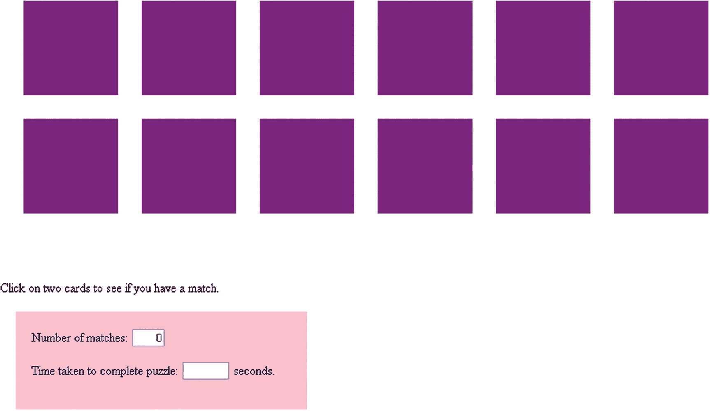
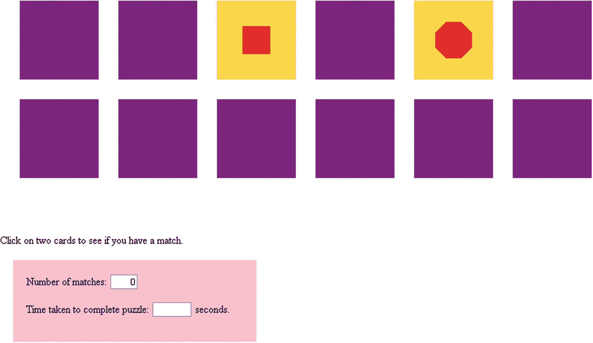
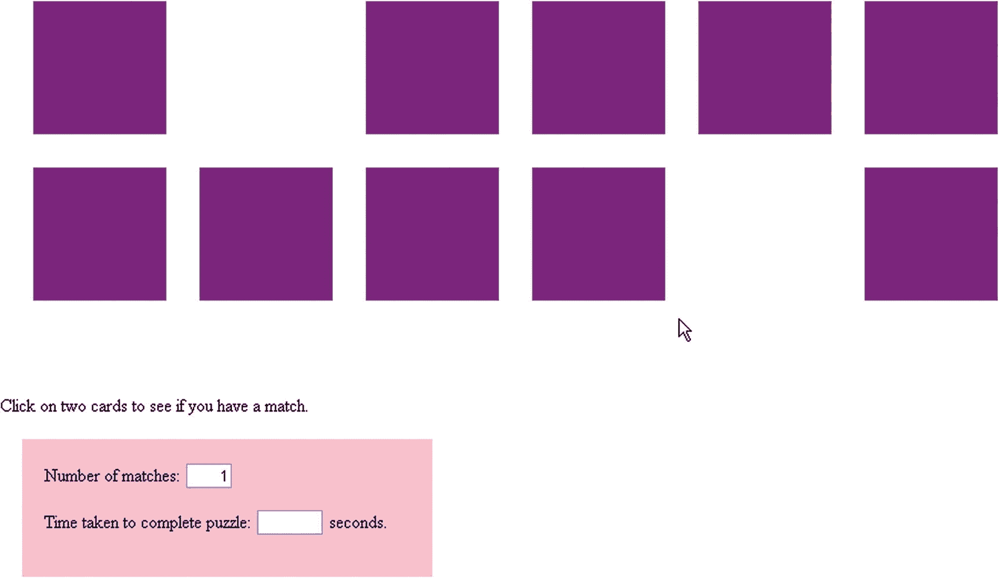
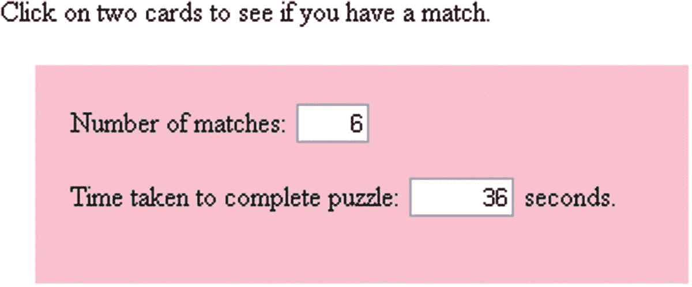
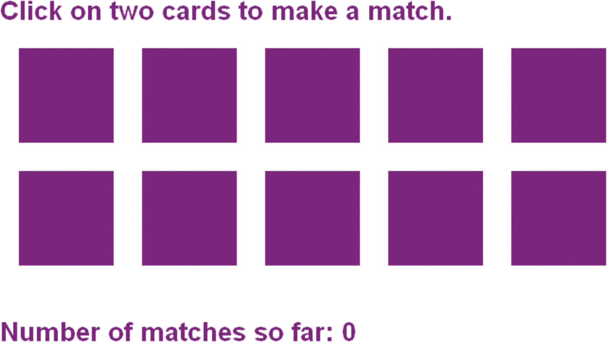
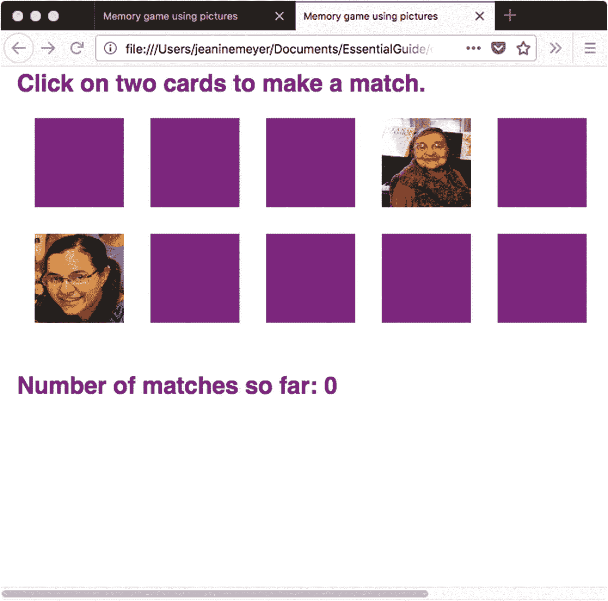
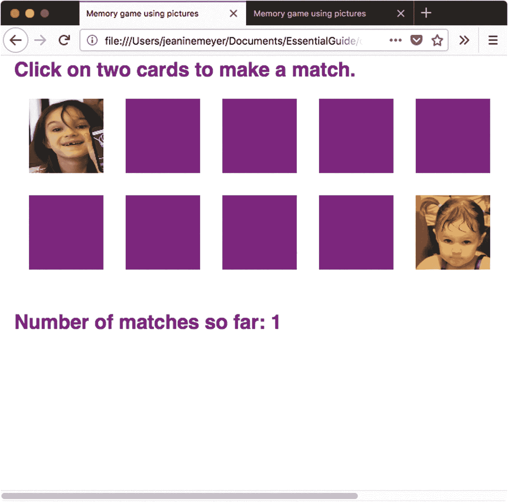
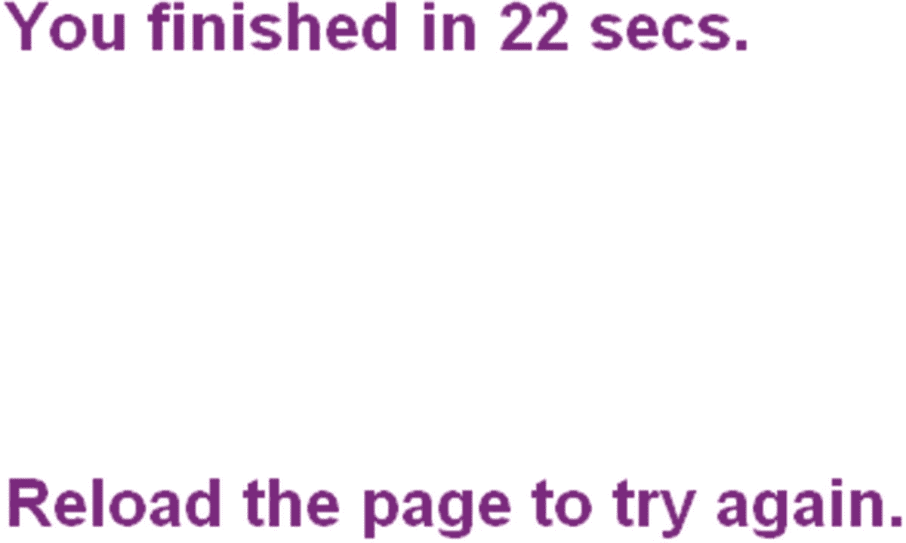
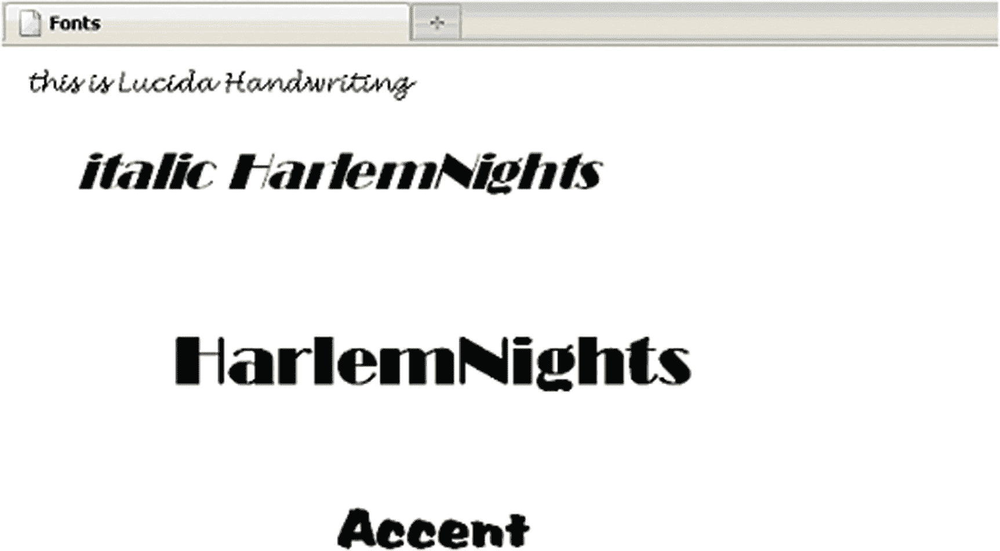
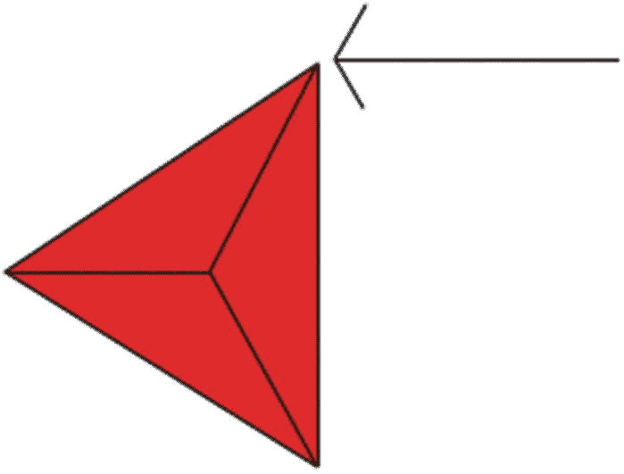

# 五、记忆游戏（又名集中注意力）

在本章中，我们将介绍

*   绘制多边形

*   将文本放置在画布上

*   表示信息的编程技术

*   编程暂停

*   计算运行时间

*   洗牌一组卡对象的一种方法

## 介绍

这一章演示了两个版本的纸牌游戏，分别被称为记忆或专注。纸牌面朝下出现，玩家一次翻两张(通过点击它们)试图找到匹配的对子。该程序从棋盘上移除匹配的牌，但(实际上)会将不匹配的牌翻回来。当玩家完成所有匹配后，游戏会显示经过的时间。

我描述的游戏的第一个版本使用多边形作为面卡；第二种用全家福。您会注意到其他差异，这些差异是为了说明几个 HTML5 特性，但我也敦促您考虑一下这些版本的共同点。

图 [5-1](#Fig1) 显示版本一的开启画面。当玩家完成游戏时，记录比赛的表单也会显示经过的时间。



图 5-1

记忆游戏第一版的开场画面

图 [5-2](#Fig2) 显示玩家点击两张牌(紫色方块)后的结果。描绘的多边形不匹配，所以暂停后，程序用卡片背面的图像替换它们，使卡片看起来翻转了。



图 5-2

两张卡片正面:不匹配

当两张卡匹配时，应用程序移除它们，并在表格中记录匹配情况(参见图 [5-3](#Fig3) )。



图 5-3

应用程序已移除两张匹配的卡

如图 [5-4](#Fig4) 所示，当玩家结束时，游戏显示结果——在本例中，36 秒内有 6 场比赛。



图 5-4

玩家完成游戏后的第一个版本

在游戏的第二个版本中，卡片正面显示的是人物的照片，而不是多边形。请注意，尽管许多记忆游戏认为图像只有在完全相同时才是相同的，但这个游戏类似于一副扑克牌中红心 2 与方块 2 的匹配。为了说明编程要点，我们将把一个匹配定义为同一个人，即使是在不同的图片中。这需要一种对我们用来确定匹配状态的信息进行编码的方法。游戏的第二版还演示了在画布上书写文本，如图 [5-5](#Fig5) 所示，它描绘了开始的屏幕。



图 5-5

记忆游戏，第二版，开屏

要查看在我们的新游戏中点击两张卡的一种可能结果，请看图 [5-6](#Fig6) 。



图 5-6

此屏幕显示不匹配的照片

因为结果显示了两个不同的人——在暂停让玩家观看两张照片之后——应用程序将卡片翻转过来，让玩家再试一次。图 [5-7](#Fig7) 显示了一个成功的选择——同一个人的两个图像(尽管在不同的图片中)。



图 5-7

这张截图显示了一场比赛(不同的场景，但同一个人)

应用程序从板上删除匹配的图像。当所有的牌都被移除时，完成游戏所用的时间会出现，同时会显示如何再次玩游戏的说明，如图 [5-8](#Fig8) 所示。



图 5-8

游戏最终画面(照片版)；所有图像都已匹配，因此不会出现卡片

你可以使用源代码中的照片来玩这个游戏，但是使用你自己的照片会更有趣。你可以从少量照片开始，比如两三对照片，然后逐步增加到整个家庭、班级或俱乐部的照片。对于游戏的第一个版本，你可以用自己的设计替换多边形。

## 关键要求

游戏的数字版本需要用不同的多边形或照片来表现卡片的背面(都是一样的)和正面。应用程序还必须能够告诉哪些卡匹配，以及卡在棋盘上的什么位置。此外，玩家需要反馈。在现实世界的游戏中，参与者翻转两张卡片并寻找匹配(这需要一些时间)。如果没有，他们就把牌翻过来。

电脑程序必须显示所选牌的正面，并在显示第二张牌后暂停，以便玩家有时间看到两张正面。这种停顿是计算机实现所需要的东西的一个例子，当人们玩游戏时，这种停顿或多或少是自然发生的。该应用程序还应该显示当前找到的配对数量，以及当游戏完成时，参与者找到所有配对所花费的时间。该程序的多边形和照片版本使用不同的方法来完成这些任务。

下面总结一下两个游戏版本必须做的事情:

*   把牌抽回来。

*   在玩家做出初始选择之前洗牌，这样就不会每次都出现相同的选择。

*   检测玩家点击卡片的时间，并区分第一次和第二次点击。

*   在检测到点击时，在游戏版本 1 的情况下，通过绘制多边形来显示适当的卡面，或者在版本 2 中显示正确的照片。

*   移除匹配的配对。

*   即使那些讨厌的玩家做了意想不到的事情，比如点击同一张卡两次，或者点击之前被卡占据的空白区域，也要适当地操作。

## HTML5、CSS、JavaScript 特性

让我们回顾一下具体的 HTML5 和 JavaScript 特性，它们提供了我们实现游戏所需的东西。我们将建立在之前的材料之上:HTML 文档的一般结构；如何在一个`canvas`元素上画矩形、图像、线段组成的路径；程序员定义的和内置的函数；程序员对象；`form`元素；和数组。

新的 HTML5 和 JavaScript 特性包括超时事件，使用`Date`对象计算运行时间，在画布上书写和绘制文本，以及一些有用的编程技术，您会发现这些技术在未来的应用程序中很有价值。

和前面几章一样，这一节概括地描述了 HTML5 的特性和编程技术。您可以在“构建应用程序”一节中看到上下文中的所有代码。如果您愿意，您可以跳到该部分来查看代码，然后返回到这里来解释这些特性是如何工作的。

### 代表卡片

当我们手里拿着一张实体卡时，我们可以看到它是什么。有卡面和背面，背面都一样。我们可以清楚地确定纸牌在游戏棋盘上的位置，以及它们是正面还是背面出现。要实现一个电脑游戏，我们必须表现所有的信息。编码是创建许多计算机应用程序的基本部分，不仅仅是游戏。

在这一章(以及整本书)，我描述了一种完成任务的方法。但是请记住，实现应用程序的一个特性很少只有一种方法。也就是说，构建应用程序的不同策略可能会有一些共同的技术。

我们处理卡片的方法将使用程序员定义的对象。在 JavaScript 中创建程序员定义的对象涉及到编写构造函数；在这种情况下，我们称之为`Card`。使用程序员定义的对象的优点是 JavaScript 提供了访问通用类型对象的信息和代码所需的点符号。我们在第 4 章中为炮弹和弹弓游戏做了这个。

我们将赋予`Card`对象属性来保存卡片的位置(`sx`和`sy`)和尺寸(`swidth`和`sheight`)，一个指向为卡片绘制背面的函数的指针，以及对于每种情况，指定适当正面的信息(`info`)。

在多边形的情况下，`info`的值将指示要绘制的边数。(在后面的部分中，我们将讨论绘制它的代码。)对于照片卡的正面，该值将是对我们创建的`Image`对象的引用`img`。该对象将保存一个特定的图像文件和一个编号(`info)`，该编号将匹配的图片联系在一起。为了绘制文件的图像，我们将使用内置的`drawImage`方法。

不用说，卡片并不是以物理实体的形式存在，而是有两面的。应用程序在画布上玩家希望看到的地方绘制卡片的正面或背面。函数`flipback`绘制卡片背面。为了给出一张被移除的牌的外观，`flipback`通过绘制一个矩形来有效地擦除一张牌，该矩形是棋盘的颜色。

两个应用程序都使用名为`makedeck`的函数来准备卡片组，这个过程包括创建`Card`对象。对于游戏的多边形版本，我们在`Card`对象中存储边数(从 3 到 8)。但是，应用程序在设置过程中没有绘制多边形。photos 版本设置了一个名为`pairs`的数组，列出照片的图像文件名。你可以按照这个例子来创建自己的家庭或团体记忆游戏。

### 小费

如果您使用在线代码玩游戏，如前所述，您可以下载图像文件。要制作你自己的游戏，你需要上传图片，然后修改代码来引用你的文件。代码指出了您需要更改的内容。

`makedeck`函数创建`Image`对象，并使用`pairs`数组将`src`属性设置为`image`对象。当代码创建`Card`对象时，它放入控制`pairs`数组的索引值，以便匹配的照片具有相同的值。与多边形版本一样，应用程序在创建卡片组的过程中不在画布上绘制图像。在屏幕上，所有的牌看起来都一样；然而，信息是不同的。这些牌在固定的位置——洗牌在后面。

对于`Card`和`Polygon`，代码对位置信息、`sx`和`sy`属性的解释有所不同。在第一种情况下，信息指的是左上角。在第二种情况下，该值标识多边形的中心。不过，你可以从另一个中计算出一个。

### 使用日期计时

我们需要一种方法来确定玩家花了多长时间来完成所有的匹配。JavaScript 提供了一种测量运行时间的方法。您可以在“构建应用程序”一节的上下文中查看代码。在这里，我解释了如何确定一个正在运行的程序中两个不同事件之间的秒数。

对`Date()`的调用生成一个带有日期和时间信息的对象。这两条线

```js
   starttime = new Date();
   starttime = Number(starttime.getTime());

```

将自 1970 年开始以来的毫秒数(千分之一秒)存储在变量`starttime`中。(JavaScript 使用 1970 的原因并不重要。)您可以用`Date`对象做算术，但是我选择了提取毫秒值。

当我们的两个内存程序中的任何一个确定游戏结束时，它再次调用`Date()`,如下所示:

```js
var now = new Date();
var nt = Number(now.getTime());
var seconds = Math.floor(.5+(nt-starttime)/1000);

```

这个代码

1.  创建一个`new Date`对象并将其存储在变量`now`中。

2.  使用`getTime`提取时间，将其转换为`Number`，并将其赋给变量`nt`。这意味着`nt`保存了从 1970 年开始直到代码调用`Date`时的毫秒数。然后程序从当前时间`nt`中减去保存的开始时间`starttime`。

3.  除以 1000 得到秒。

4.  添加`.5`并调用`Math.floor`将结果向上或向下舍入到整秒。我们希望小数部分等于或大于 0.5 的数字向上取整，小于 0.5 的数字向下取整。

如果您需要比秒提供的精度更高的精度，请省略或修改最后一步。

每当需要计算程序中两个事件之间经过的时间时，都可以使用这个代码。

### 提供暂停

当我们用真正的卡片玩记忆游戏时，我们不会有意识地在翻开不匹配的卡片之前暂停。但是如前所述，我们的计算机实现必须提供暂停，以便玩家有时间看到两张不同的卡。你可能还记得第三章[和第四章](03.html)[中的动画应用——弹跳球、炮弹和弹弓——使用 JavaScript 函数`setInterval`在固定的时间间隔设置事件。我们可以在记忆游戏中使用一个相关的函数`setTimeout`。(要查看上下文中的完整代码，请转到“构建应用程序”一节。)让我们看看如何设置事件，以及暂停时间用完时会发生什么。](04.html)

`setTimeout`函数设置了一个事件，我们可以用它来强制暂停。当玩家点击画布时调用的`choose`函数首先检查`firstpick`变量，以确定这个人是做了第一个还是第二个选择。在这两种情况下，程序都在画布上与卡片背面相同的位置绘制卡片正面。如果点击是第二个选择，并且两张卡片匹配，代码将变量`matched`设置为`true`或`false`，这取决于卡片是否匹配。如果应用程序确定游戏还没有结束，代码就会调用

```js
        setTimeout(flipback,1000);

```

这导致在 1000 毫秒(1 秒)内调用`flipback`函数。然后函数`flipback`使用`matched`变量来决定是否重画卡片背面或者通过在适当的卡片位置用桌子背景色画矩形来擦除卡片。

您可以使用`setTimeout`设置任何单独的定时事件。您需要指定时间间隔和时间间隔到期时要调用的函数。记住时间单位是毫秒。

### 绘图文本

HTML5 包括一个在画布上放置文本的机制。与以前的版本相比，这提供了一种更动态、更灵活的方式来呈现文本。您可以通过将文本放置与我们已经演示过的矩形、直线、弧线和图像的绘制相结合来创建一些好的效果。在这一节中，我们概述了在 canvas 元素中放置文本的步骤，并提供了一个简短的示例供您尝试。如果你愿意，可以直接跳到“构建应用程序”一节来查看完整的代码描述，这些代码会产生你在图 [5-5](#Fig5) 到 [5-8](#Fig8) 中看到的记忆游戏的照片版本。

为了将文本放到画布上，我们编写设置`font`的代码，然后使用`fillText`从指定的 x-y 位置开始绘制一串字符。下面的示例使用一组折衷的字体来创建单词(请参见本节后面的注意事项)。

```js
<html>
<head>
    <title>Fonts</title>
<script type="text/javascript">

var ctx;
function init(){
   ctx = document.getElementById('canvas').getContext('2d');
   ctx.font="15px Lucida Handwriting";
   ctx.fillText("this is Lucida Handwriting", 10, 20);
   ctx.font="italic 30px HarlemNights";
   ctx.fillText("italic HarlemNights",40,80);
   ctx.font="bold 40px HarlemNights";
   ctx.fillText("HarlemNights",100,200);
   ctx.font="30px Accent";
   ctx.fillText("Accent", 200,300);
}
</script>
</head>
<body onLoad="init();">
<canvas id="canvas" width="900" height="400">
Your browser doesn't support the HTML5 element canvas.
</canvas>
</body>

</html>

```

这个 HTML 文档生成了如图 [5-9](#Fig9) 所示的屏幕截图。



图 5-9

使用 font 和 fillText 函数在画布上绘制的不同字体的文本

### 警告

确保你选择的字体将出现在你所有玩家的电脑上。在第 [10 章](10.html)中，你将学习如何使用一个叫做`font-family`的 CSS 特性，它提供了一个系统的方法来指定主字体和备份。

请注意，虽然您看到的看起来是文本，但实际上您看到的是画布上的墨迹，即文本的位图图像，而不是可以就地修改的文本字段。这意味着要改变文本，我们需要编写代码来完全删除当前图像。我们通过将`fillStyle`设置为之前放入变量`tablecolor`中的值，并在适当的位置和必要的维度使用`fillRect`来实现。

创建文本图像后，下一步是将`fillStyle`设置为不同于`tablecolor`的颜色。我们将使用我们为卡片背面选择的颜色。对于照片记忆游戏的开始屏幕显示，下面是设置用于所有文本的字体的代码:

```js
ctx.font="bold 20pt sans-serif";

```

使用`sans-serif`字体是有意义的，因为它是任何计算机上都有的标准字体。

综合我们到目前为止所做的工作，下面是显示游戏中特定点的匹配数的代码:

```js
ctx.fillStyle= tablecolor;
ctx.fillRect(10,340,900,100);
ctx.fillStyle=backcolor;
ctx.fillText
     ("Number of matches so far: "+String(count),10,360);

```

前两条语句清除当前的计数，后两条语句放入更新的结果。表达式`"Number of matches so far: "+String(count)`值得更多的解释。它完成两项任务:

*   它采用变量`count`，这是一个数字，并把它变成一个字符串。

*   它将常量字符串`"Number of matches so far: "`与`String(count)`的结果连接起来。

串联证明了加号在 JavaScript 中有两种含义:如果操作数是数字，则符号表示加法。如果操作数是字符串，则表明这两个字符串应该连接在一起。一个符号有几个意思，一个有趣的说法是*操作符重载*。

如果一个操作数是字符串，另一个是数字，JavaScript 会做什么？答案取决于两个操作数中的哪一个是什么数据类型。您将看到一些代码示例，在这些代码中，程序员没有输入将文本转换为数字的命令，反之亦然，但是由于特定的操作顺序，该语句仍然有效。

不过，我建议不要冒险。相反，试着记住解释加号的规则。如果您注意到您的程序增加了一个数字，比如说从 1 到 11 到 111，而您期望的是 1、2、3，那么您的代码是连接字符串而不是增加数字，您需要将字符串转换为数字。

### 绘制多边形

创建多边形很好地展示了 HTML5 的绘图功能。为了理解这里用于绘制多边形的代码开发过程，可以将几何图形想象成一个类似轮子的形状，辐条从其中心向每个顶点发散。辐条不会出现在图中，但会帮助你，就像他们帮助我一样，弄清楚如何画一个多边形。图 [5-10](#Fig10) 用一个三角形说明了这一点。



图 5-10

将三角形表示为辐条几何形状有助于阐明绘制多边形的代码开发；箭头指示绘图路径中的第一点

为了确定辐条之间的角度，我们将数量`2*Math.PI (representing a complete circle)`除以多边形的边数。我们使用角度值和`moveTo`方法来绘制路径的点。源代码有一个简单的 HTML 程序画一个三角形，也就是设置一个变量`n`为`3`。你可以通过改变声明和初始化`n`的语句来修改它以绘制其他正多边形。

程序将多边形绘制成一条填充路径，该路径始于由`angle`值的一半指定的点(如图 [5-10](#Fig10) 中的箭头所示)。为了说明问题，我们使用了`moveTo`方法以及半径、`Math.sin`和`Math.cos`。然后，我们使用`lineTo`的方法，以顺时针方向进行 n-1 个点。对于三角形来说，n-1 就是多了两个点。对于八角形，它将是七个以上。在用`lineTo`点运行完一个`for`循环后，我们调用`fill`方法来产生一个填充的形状。要查看完整的带注释的代码，请转到“构建应用程序”一节。

### 注意

绘制和重绘多边形需要时间，但这不会给这个应用程序带来问题。如果一个程序有大量复杂的设计，提前准备好图片可能是有意义的。然而，这种方法要求用户下载文件，这可能需要相当长的时间。您需要进行试验，看看哪种方法总体上更好。

### 洗牌

如前所述，记忆游戏要求程序在每一轮之前洗牌，因为我们不希望牌一次又一次地出现在同一个位置。改变价值观的最佳方式是广泛研究的主题。在第 [10](10.html) 章中，描述了一种叫做 21 点的纸牌游戏，你会找到一篇文章的参考资料，该文章描述了一种据称是产生洗牌最有效方法的技术。

对于记忆力/专注力，还是按照我小时候玩游戏的方式来实现吧。我和其他人会摊开所有的卡片，然后拿起并交换配对。当我们认为我们已经做了足够多的次数，我们就会开始玩。在本节中，我们将探索这种方法背后的一些概念。(要检查`shuffle`函数，您可以跳到“构建应用程序”一节。)

要为洗牌的交换方法编写 JavaScript，我们首先需要定义“足够的次数”让我们把这一副牌中的牌数增加三倍，我们已经在数组变量`deck`中表示过了。但是既然没有卡片，只有代表卡片的数据，我们交换什么呢？答案是唯一定义每张卡的信息。对于多边形记忆游戏，这是属性`info`。对于图片游戏，是`info`和`img`。

为了得到一张随机的牌，我们使用表达式`Math.floor(Math.random()*dl)`，其中`dl`代表牌组长度，代表该副牌中牌的数量。我们这样做两次，以获得要(虚拟地)交换的卡对。这可能会产生相同的数字，这意味着一张卡与自己交换，但这不是真正的问题。如果发生了，这个过程中的这一步就没有作用了。代码要求进行大量的交换，因此一次交换不做任何事情是可以的。

实现交换是下一个挑战，它需要一些临时存储。我们将使用一个变量`holder`作为游戏的多边形版本，两个变量`holderimg`和`holderinfo`作为图片版本。

### 实现在卡片上点击

下一步是解释我们如何实现玩家的移动，也就是玩家点击一张卡片。在 HTML5 中，我们可以使用与处理`mousedown`事件相同的方法来处理`click`事件(在第 [4 章](04.html)中描述)。我们将使用`addEventListener`方法:

```js
canvas1 = document.getElementById('canvas');
canvas1.addEventListener('click',choose,false);

```

这出现在`init`功能中。`choose`函数必须包含代码来决定我们选择洗哪张牌。当玩家点击画布时，程序还必须返回鼠标的坐标。获取鼠标坐标的方法与第 [4](04.html) 章中的方法相同。

不幸的是，不同的浏览器以不同的方式实现对鼠标事件的处理。这个我在第 [4](04.html) 章讨论过，我在这里重复解释。以下内容适用于 Chrome、Firefox 和 Safari。

```js
if ( ev.layerX || ev.layerX==0) {
   mx= ev.layerX;
   my = ev.layerY;
}
else if (ev.offsetX || ev.offsetX==0 ) {
   mx = ev.offsetX;
   my = ev.offsetY;
}

```

这是因为如果`ev.layerX`不存在，它将被赋予一个值`false`。如果`it`确实存在但有值`0`，该值也会被解释为 false，但`ev.layerX==0`会是`true`。所以如果有一个好的`ev.layerX`值，程序就会使用它。否则代码看`ev.offsetX`。如果两者都不起作用，`mx`和`my`就不会得到设置。

因为卡片是矩形的，所以使用鼠标光标坐标(`mx`、`my`)、左上角的位置以及每张卡片的宽度和高度，浏览卡片组并进行比较操作相对容易。我们是这样构造`if`条件的:

```js
if ((mx>card.sx)&&(mx<card.sx+card.swidth)&&(my>card.sy)&&(my<card.sy+card.sheight))

```

### 注意

下一章描述了在运行时创建 HTML 标记的方式，展示了如何为位于屏幕上的特定元素设置事件处理，而不是使用整个`canvas`元素。

我们清除变量`firstpick`并将其初始化为`true`，这表明这是玩家两次选择中的第一次。第一次拾取后，程序将数值改为`false`，第二次拾取后，数值又回到`true`。像这样在两个值之间来回翻转的变量被称为*标志*或*切换*。

### 防止某些类型的欺骗

请注意，本节的细节仅适用于这些记忆游戏，但一般经验适用于构建任何交互式应用程序。玩家至少有两种方法可以阻挠游戏。在同一张卡上点击两次为一次；另一种方法是点击一张卡片被移除的区域(也就是说，棋盘被涂掉了)。

为了处理第一种情况，在决定鼠标是否在某张卡片上的`if-true`子句之后，插入`if`语句

```js
if ((firstpick) || (i!=firstcard)) break;

```

如果索引值(`i`)是好的，这一行代码触发从`for`语句的退出，这发生在以下任一情况:1)这是第一次选择，或者 2)这不是第一次选择，并且`i`不对应于选择的第一张牌。

防止第二个问题——点击“幽灵”卡——需要更多的工作。当应用程序从板上移除卡片时，除了在画布的该区域上绘画之外，我们还可以为`sx`属性赋值(-1)。这将把卡标记为已被移除。这是`flipback`功能的一部分。`choose`函数包含检查`sx`属性并进行检查的代码(仅当`sx`为> = 0 时)。该功能在下面的`for`循环中结合了两种作弊测试:

```js
for (i=0;i<deck.length;i++){
   var card = deck[i];
   if (card.sx >=0)
if ((mx>card.sx)&&(mx<card.sx+card.swidth)&&(my>card.sy)&&(my<card.sy+card.sheight)) {
        if ((firstpick)|| (i!=firstcard)) break;
         }
}

```

在三个`if`语句中，第二个是第一个的整个子句。第三个是单语句`break`，它导致控制离开`for`循环。一般来说，我建议使用括号(例如:`{ and })`表示`if true`和`else`子句，但是这里我使用了简化的格式来表示单个语句，这种格式也是因为它看起来足够清晰。

现在让我们继续构建我们的两个记忆游戏。

## 构建应用程序并使之成为您自己的应用程序

本节介绍了游戏两个版本的完整代码。因为应用程序包含多个函数，所以该部分为每个游戏提供了一个表，说明每个函数调用的内容和被调用的方式。

表 [5-1](#Tab1) 是记忆游戏多边形版本的函数列表。注意，一些函数的调用是基于事件完成的。

表 5-1

记忆游戏的多边形版本中的函数

<colgroup><col class="tcol1 align-left"> <col class="tcol2 align-left"> <col class="tcol3 align-left"></colgroup> 
| 

功能

 | 

调用方/被调用方

 | 

打电话

 |
| --- | --- | --- |
| `init` | 响应于`body`标签中的`onLoad`而被调用， | `makedeck``shuffle` |
| `choose` | 响应`init`中的`addEventListener`时调用。 | `Polycard``drawpoly`(作为多边形的`draw`方法调用)。 |
| `flipback` | 响应`choose`中的`setTimeout`调用而调用。 |   |
| `drawback` | 在`makedeck`和`flipback`中作为抽牌方法调用。 |   |
| `Polycard` | 在`choose`中调用。 |   |
| `shuffle` | 在`init`中调用。 |   |
| `makedeck` | 在`init`中调用。 |   |
| `Card` | 由`makedeck`调用。 |   |
| `drawpoly` | 在`choose`中称为`Polygon`的`draw`方法。 |   |

表 [5-2](#Tab2) 显示了应用程序完整多边形版本的注释代码。在回顾它的时候，想想它与其他章节中描述的应用程序的相似之处。请记住，这只是说明了命名应用程序组件和编程的一种方式。其他方法可能同样有效。

表 5-2

记忆游戏多边形版本的完整代码

<colgroup><col class="tcol1 align-left"> <col class="tcol2 align-left"></colgroup> 
| 

密码

 | 

说明

 |
| --- | --- |
| `<html>` | 开始`html`标签。 |
| `<head>` | 开始`head`标签。 |
| `<title>Memory game using polygons</title>` | 完成`title`元素。 |
| `<style>` | 开始`style`标签。 |
| `form {` | 指定表单的样式。 |
| `width:330px;` | 设置`width`。 |
| `margin:20px;` | 设置外部`margin`。 |
| `background-color:pink;` | 设置`color`。 |
| `Padding:20px;` | 设置内部`padding`。 |
| `}` | 关闭样式。 |
| `input {` | 设置输入字段的样式。 |
| `text-align:right;` | 设置右对齐—适用于数字。 |
| `}` | 关闭样式。 |
| `</style>` | 关闭`style`元件。 |
| `<script type="text/javascript">` | 启动`script`元素。`type`规范不是必需的，但是在这里包含了它，因为您将会看到它。 |
| `var ctx;` | 保存画布上下文的变量。 |
| `var firstpick = true;` | 声明并初始化`firstpick`。 |
| `var firstcard;` | 声明一个变量来保存定义第一次选择的信息。 |
| `var secondcard;` | 声明一个变量来保存定义第二次选择的信息。 |
| `var frontbgcolor = "rgb(251,215,73)";` | 设置卡片正面的背景颜色值。 |
| `var polycolor = "rgb(254,11,0)";` | 设置多边形的颜色值。 |
| `var backcolor = "rgb(128,0,128)";` | 设置卡片背面的颜色值。 |
| `var tablecolor = "rgb(255,255,255)";` | 设置纸板(表格)的颜色值。 |
| `var cardrad = 30;` | 设置多边形的半径。 |
| `var deck = [];` | 声明卡片组，最初是一个空数组。 |
| `var firstsx = 30;` | 设置第一张卡在 x 轴上的位置。 |
| `var firstsy = 50;` | 设置第一张卡在 y 轴上的位置。 |
| `var margin = 30;` | 设置卡片之间的间距。 |
| `var cardwidth = 4*cardrad;` | 将卡片宽度设置为多边形半径的四倍。 |
| `var cardheight = 4*cardrad;` | 将卡片高度设置为多边形半径的四倍。 |
| `var matched;` | 该变量在`choose`中设置，并在`flipback`中使用。 |
| `var starttime;` | 该变量设置在`init`中，用于计算经过的时间。 |
| `function Card(sx,sy,swidth,sheight,info) {` | `Card`功能的标题，设置卡片对象。 |
| `this.sx = sx;` | 设置水平坐标。 |
| `this.sy = sy;` | 设置垂直坐标。 |
| `this.swidth = swidth;` | 设置宽度。 |
| `this.sheight = sheight;` | 设置高度。 |
| `this.info = info;` | 设置`info`(边数)。 |
| `this.draw = drawback;` | 指定如何绘制。 |
| `}` | 关闭该功能。 |
| `function makedeck() {` | 用于设置台面的功能头。 |
| `var i;` | 用于`for`循环。 |
| `var acard;` | 变量来保存一对牌中的第一张。 |
| `var bcard;` | 变量来保存一对牌中的第二张。 |
| `var cx = firstsx;` | 变量来保存 x 坐标。从第一个 x 位置开始。 |
| `var cy = firstsy;` | 将保持 y 坐标。从第一个 y 位置开始。 |
| `for(i=3;i<9;i++) {` | 循环生成三角形到八边形的卡片。 |
| `acard = new Card(cx,cy,cardwidth,cardheight,i);` | 创建卡片和位置。 |
| `deck.push(acard);` | 添加到甲板上。 |
| `bcard = new Card(cx,cy+cardheight+margin,cardwidth,cardheight,i);` | 创建一张具有相同信息的卡片，但放在屏幕上上一张卡片的下方。 |
| `deck.push(bcard);` | 添加到甲板上。 |
| `cx = cx+cardwidth+ margin;` | 考虑到卡片宽度和边距的增量。 |
| `acard.draw();` | 在画布上画第一张牌。 |
| `bcard.draw();` | 在画布上画第二张卡片。 |
| `}` | 关闭`for`回路。 |
| `}` | 关闭该功能。 |
| `function shuffle() {` | `shuffle`功能的标题。 |
| `var i;` | 变量来保存对卡的引用。 |
| `var k;` | 变量来保存对卡的引用。 |
| `var holder;` | 进行交换所需的变量。 |
| `var dl = deck.length;` | 变量来保存一副牌中的牌数。 |
| `var nt;` | 互换数量指数。 |
| `for (nt=0;nt<3*dl;nt++) {` | `for`循环。 |
| `i = Math.floor(Math.random()*dl);` | 随机拿一张牌。 |
| `k = Math.floor(Math.random()*dl);` | 随机拿一张牌。 |
| `holder = deck[i].info;` | 存储`i`的信息。 |
| `deck[i].info = deck[k].info;` | 为`k`输入`i info`。 |
| `deck[k].info = holder;` | 将`k`中的内容放入`k`。 |
| `}` | 关闭`for`回路。 |
| `}` | 关闭功能。 |
| `function Polycard(sx,sy,rad,n) {` | `Polycard`的功能头。 |
| `this.sx = sx;` | 设置 x 坐标。 |
| `this.sy = sy;` | 设置 y 坐标。 |
| `this.rad = rad;` | 设置多边形半径。 |
| `this.draw = drawpoly;` | 设置如何绘制。 |
| `this.n = n;` | 设置边数。 |
| `this.angle = (2*Math.PI)/n` | 计算并存储角度。 |
| `}` | 关闭该功能。 |
| `function drawpoly() {` | 函数头。 |
| `ctx.fillStyle= frontbgcolor;` | 设置正面背景。 |
| `ctx.fillRect(this.sx-2*this.rad,this.sy-2*this.rad,4*this.rad,4*this.rad);` | 矩形的角向上，位于多边形中心的左侧。 |
| `ctx.beginPath();` | 开始路径。 |
| `ctx.fillStyle=polycolor;` | 改变多边形的颜色。 |
| `var i;` | 索引变量。 |
| `var rad = this.rad;` | 提取半径。 |
| `ctx.moveTo(this.sx+rad*Math.cos(-.5*this.angle),this.sy+rad*Math.sin(-.5*this.angle));` | 移到第一点。 |
| `for (i=1;i<this.n;i++) {` | 连续点的`for`循环。 |
| `ctx.lineTo(this.sx+rad*Math.cos((i-.5)*this.angle),this.sy+rad*Math.sin((i-.5)*this.angle));` | 设置线段的绘制。 |
| `}` | 关闭`for`回路。 |
| `ctx.fill();` | 填写路径。 |
| `}` | 关闭功能。 |
| `function drawback() {` | 函数头。 |
| `ctx.fillStyle = backcolor;` | 设置卡片背景颜色。 |
| `ctx.fillRect(this.sx,this.sy,this.swidth,this.sheight);` | 画矩形。 |
| `}` | 关闭功能。 |
| `function choose(ev) {` | 功能头为`choose`(点击一张卡)。 |
| `var mx;` | 保持鼠标`x`的变量。 |
| `var my;` | 保持鼠标`y`的变量。 |
| `var pick1;` | 保存对创建的`Polygon`对象的引用的变量。 |
| `var pick2;` | 保存对创建的`Polygon`对象的引用的变量。 |
| `if ( ev.layerX &#124;&#124;  ev.layerX == 0) {` | 可以用`layerX`和`layerY`吗？ |
| `mx= ev.layerX;` | 设置`mx`。 |
| `my = ev.layerY;` | 设置`my`。 |
| `}` | 如果为真，则关闭。 |
| `else if (ev.offsetX &#124;&#124; ev.offsetX == 0) {` | 可以用`offsetX`和`offset`吗？ |
| `mx = ev.offsetX;` | 设置`mx`。 |
| `my = ev.offsetY;` | 设置`my`。 |
| `}` | 关闭`else`。 |
| `var i;` | 在`for`循环中声明索引变量。 |
| `for (i=0;i<deck.length;i++){` | 循环通过整个甲板。 |
| `var card = deck[i];` | 提取一个卡引用来简化代码。 |
| `if (card.sx >=0)` | 检查卡是否被标记为已被移除。 |
| `if ((mx>card.sx)&&(mx<card.sx+card.swidth)&&(my>card.sy)&&(my<card.sy+card.sheight)) {` | 然后检查鼠标是否在这张卡上。 |
| `if ((firstpick)&#124;&#124; (i!=firstcard)) break;` | 如果是这样，检查玩家没有再次点击第一张牌，如果是这样，离开`for`循环。 |
| `}` | 关闭`if true`子句。 |
| `}` | 关闭`for`回路。 |
| `if (i<deck.length) {` | `for`循环提前退出了吗？ |
| `if (firstpick) {` | 如果这是第一次选择… |
| `firstcard = i;` | …设置`firstcard`以引用卡片组中的卡片 |
| `firstpick = false;` | 将`firstpick`设置为`false`。 |
| `pick1 = new Polycard(card.sx+cardwidth*.5,card.sy+cardheight*.5,cardrad,``card.info`T2】 | 创建以坐标为中心的多边形。 |
| `pick1.draw();` | 画多边形。 |
| `}` | 如果第一次选择，则关闭。 |
| `else {` | 否则… |
| `secondcard = i;` | …设置`secondcard`以引用卡片组中的卡片。 |
| `pick2 = new Polycard(card.sx+cardwidth*.5,card.sy+cardheight*.5,cardrad,``card.info`T2】 | 创建以坐标为中心的多边形。 |
| `pick2.draw();` | 画多边形。 |
| `if (deck[i].info==deck[firstcard].info) {` | 检查是否匹配。 |
| `matched = true;` | 将`matched`设置为`true`。 |
| `var nm = 1+Number(document.f.count.value);` | 增加匹配的数量。 |
| `document.f.count.value = String(nm);` | 显示新的计数。 |
| `if (nm>= .5*deck.length) {` | 检查游戏是否结束。 |
| `var now = new Date();` | 获取新的`Date`信息。 |
| `var nt = Number(now.getTime());` | 提取并转换时间。 |
| `var seconds = Math.floor(.5+(nt-starttime)/1000);` | 计算经过的秒数。 |
| `document.f.elapsed.value = String(seconds);` | 输出时间。 |
| `}` | 如果这是游戏的结尾，请关闭。 |
| `}` | 如果有匹配就关闭。 |
| `else {` | 否则… |
| `matched = false;` | 将`matched`设置为`false`。 |
| `}` | 关闭`else`子句。 |
| `firstpick = true;` | 重置〔t0〕。 |
| `setTimeout(flipback,1000);` | 设置暂停。 |
| `}` | 关闭不是第一次选择。 |
| `}` | 关闭好的选择(点击卡片— `for`循环提前退出)。 |
| `}` | 关闭该功能。 |
| `function flipback() {` | 功能头— `flipback`暂停后的处理。 |
| `if (!matched) {` | 如果不匹配… |
| `deck[firstcard].draw();` | …把牌抽回来。 |
| `deck[secondcard].draw();` | …把牌抽回来。 |
| `}` | …关闭该条款。 |
| `else {` | 否则需要撤牌。 |
| `ctx.fillStyle = tablecolor;` | 设置桌子/纸板的颜色。 |
| `ctx.fillRect(deck[secondcard].sx,deck[secondcard].sy,deck[secondcard].swidth,deck[secondcard].sheight);` | 抽出卡片。 |
| `ctx.fillRect(deck[firstcard].sx,deck[firstcard].sy,deck[firstcard].swidth,deck[firstcard].sheight);` | 抽出卡片。 |
| `deck[secondcard].sx = -1;` | 设定这个，这样卡就不会被检查。 |
| `deck[firstcard].sx = -1;` | 设定这个，这样卡就不会被检查。 |
| `}` | 如果没有匹配就关闭。 |
| `}` | 关闭该功能。 |
| `function init(){` | 函数头初始化。 |
| `ctx = document.getElementById('canvas').getContext('2d');` | 设置`ctx`进行所有绘图。 |
| `canvas1 = document.getElementById('canvas');` | 设置`canvas1`进行事件处理。 |
| `canvas1.addEventListener('click',choose,false);` | 设置事件处理。 |
| `makedeck();` | 创建甲板。 |
| `document.f.count.value = "0";` | 初始化可见计数。 |
| `document.f.elapsed.value = "";` | 清除所有旧值。 |
| `starttime = new Date();` | 设置开始时间的第一步。 |
| `starttime = Number(starttime.getTime());` | 重用该变量来设置基准的毫秒数。 |
| `shuffle();` | 打乱卡片信息值。 |
| `}` | 关闭该功能。 |
| `</script>` | 关闭`script`元件。 |
| `</head>` | 关闭`head`元素。 |
| `<body onLoad="init();">` | `Body`标记，设置`init`。 |
| `<canvas id="canvas" width="900" height="400">` | `Canvas`开始标记。 |
| `Your browser doesn't support the HTML5 element canvas.` | 警告消息。 |
| `</canvas>` | 关闭`canvas`元素。 |
| `<br/>` | 指令前换行。 |
| `Click on two cards to see if you have a match.` | 说明。 |
| `<form name="f">` | `Form`开始标记。 |
| `Number of matches:  <input type="text" name="count" value="0" size="1"/>` | 用于输出的标签和输入元素。 |
| `<p>` | 分段符。 |
| `Time taken to complete puzzle: <input type="text" name="elapsed" value="  " size="4"/> seconds.` | 用于输出的标签和输入元素。 |
| `</form>` | 关闭`form`。 |
| `</body>` | 关闭`body`。 |
| `</html>` | 关闭`html`。 |

无论您做出什么样的编程选择，都要在代码中添加注释(每行使用两个斜杠:`//`)并包含空行。您不需要注释每一行，但是当您必须返回代码进行改进时，做好注释工作会对您有好处。

您可以通过更改表单的字体、字体大小、颜色和背景色来更改此游戏。在这一节的后面，我们会建议更多的方法来使应用程序成为你自己的应用程序。

使用图片的记忆游戏版本与多边形版本的结构非常相似。它不需要一个单独的函数来画图。表 [5-3](#Tab3) 是这个版本游戏的功能列表。

表 5-3

记忆游戏照片版中的函数

<colgroup><col class="tcol1 align-left"> <col class="tcol2 align-left"> <col class="tcol3 align-left"></colgroup> 
| 

功能

 | 

调用方/被调用方

 | 

打电话

 |
| --- | --- | --- |
| `init` | 为响应 body 标签中的`onLoad`而调用 | `makedeck``shuffle` |
| `choose` | 响应`init`中的`addEventListener`而调用 |   |
| `flipback` | 响应`choose`中的`setTimeout`调用而调用 | `draw`方法用于`Card`对象 |
| `drawback` | 在`makedeck`和`flipback`中作为卡片的`draw`方法调用 |   |
| `shuffle` | 被叫进来`init` |   |
| `makedeck` | 被叫进来`init` |   |
| `Card` | 由`makedeck`调用 |   |

记忆游戏的照片版本的代码类似于多边形版本的代码。大部分逻辑都是一样的。但是因为这个例子演示了在画布上书写文本，所以 HTML 文档没有`form`元素。代码如下表 [5-4](#Tab4) 所示，不同行上有注释。我也指出你应该在哪里为你的照片放入图像文件的名字。在看这个记忆游戏的第二个版本之前，想想哪些部分可能是相同的，哪些部分可能是不同的。

表 5-4

记忆游戏照片版的完整代码

<colgroup><col class="tcol1 align-left"> <col class="tcol2 align-left"> <col class="tcol3 align-left"></colgroup> 
| 

密码

 | 

说明

 |
| --- | --- |
| `<html>` |   |
| `<head>` |   |
| `<title>Memory game using pictures</title>` | 完整的标题元素。 |
| `<script type="text/javascript">` |   |
| `var ctx;` |   |
| `var firstpick = true;` |   |
| `var firstcard = -1;` |   |
| `var secondcard;` |   |
| `var backcolor = "rgb(128,0,128)";` |   |
| `var tablecolor = "rgb(255,255,255)";` |   |
| `var deck = [];` |   |
| `var firstsx = 30;` |   |
| `var firstsy = 50;` |   |
| `var margin = 30;` |   |
| `var cardwidth = 100;` | 如果您希望图片具有不同的宽度，您可能需要对此进行更改... |
| `var cardheight = 100;` | ...和/或高度。 |
| `var matched;` |   |
| `var starttime;` |   |
| `var count = 0;` | 需要保持内部计数。 |
| `var pairs = [` | 这五个人的成对图像文件的数组。 |
| `[``"anneGorge.jpg"``,``"anneNow.jpg"``],[``"esther.jpg"``,``"pigtailEsther.jpg"``],[``"pigtailJeanine.jpg"``,``"jeanineGorge.jpg"``],[``"pigtailAviva.jpg"``,``"avivacuba.jpg"``],[``"pigtailAnnika.jpg"``,``"annikaTooth.jpg"``]` | 您可以在这里输入图片文件的名称。 |
|   | 您可以使用任意数量的成对图片，但是请注意保存最后一对图片的数组在括号后没有逗号。 |
| `];` |   |
| `function Card(sx,sy,swidth,sheight, img, info) {` |   |
| `this.sx = sx;` |   |
| `this.sy = sy;` |   |
| `this.swidth = swidth;` |   |
| `this.sheight = sheight;` |   |
| this.info `= info;` | 表示匹配。 |
| `this.img = img;` | `Img`参考。 |
| `this.draw = drawback;` |   |
| `}` |   |
| `function makedeck() {` |   |
| `var i;` |   |
| `var acard;` |   |
| `var bcard;` |   |
| `var pica;` |   |
| `var picb;` |   |
| `var cx = firstsx;` |   |
| `var cy = firstsy;` |   |
| `for(i=0;i<pairs.length;i++) {` |   |
| `pica = new Image();` | 创建`Image`对象。 |
| `pica.src = pairs[i][0];` | 设置为第一个文件。 |
| `acard = new Card(cx,cy,cardwidth,cardheight,pica,i);` | 创建`Card`。 |
| `deck.push(acard);` |   |
| `picb = new Image();` | 创建`Image`对象。 |
| `picb.src = pairs[i][1];` | 设置为第二档。 |
| `bcard = new Card(cx,cy+cardheight+margin,cardwidth,cardheight,picb,i);` | 创建`Card`。 |
| `deck.push(bcard);` |   |
| `cx = cx+cardwidth+ margin;` |   |
| `acard.draw();` |   |
| `bcard.draw();` |   |
| `}` |   |
| `}` |   |
| `function shuffle() {` |   |
| `var i;` |   |
| `var k;` |   |
| `var holderinfo;` | 交换的临时地点。 |
| `var holderimg;` | 交换的临时地点。 |
| `var dl = deck.length` |   |
| `var nt;` |   |
| `for (nt=0;nt<3*dl;nt++) {  //do the swap 3 times deck.length times` |   |
| `i = Math.floor(Math.random()*dl);` |   |
| `k = Math.floor(Math.random()*dl);` |   |
| `holderinfo = deck[i].info;` | 保存`info`。 |
| `holderimg = deck[i].img;` | 保存`img`。 |
| `deck[i].info = deck[k].info;` | 把`k`的`info`放到`i`里。 |
| `deck[i].img = deck[k].img;` | 把`k`的`img`放到`i`里。 |
| `deck[k].info = holderinfo;` | 设置为原来的`info`。 |
| `deck[k].img = holderimg;` | 设置为原来的`img`。 |
| `}` |   |
| `}` |   |
| `function drawback() {` |   |
| `ctx.fillStyle = backcolor;` |   |
| `ctx.fillRect(this.sx,this.sy,this.swidth,this.sheight);` |   |
| `}` |   |
| `function choose(ev) {` |   |
| `var out;` |   |
| `var mx;` |   |
| `var my;` |   |
| `var pick1;` |   |
| `var pick2;` |   |
| `if ( ev.layerX &#124;&#124;  ev.layerX == 0) {` | 提醒:这是处理三种浏览器之间差异的代码。 |
| `mx= ev.layerX;` |   |
| `my = ev.layerY;` |   |
| `} else if (ev.offsetX &#124;&#124; ev.offsetX == 0) {` |   |
| `mx = ev.offsetX;` |   |
| `my = ev.offsetY;` |   |
| `}` |   |
| `var i;` |   |
| `for (i=0;i<deck.length;i++){` |   |
| `var card = deck[i];` |   |
| `if (card.sx >=0)  //this is the way to avoid checking for clicking on this space` |   |
| `if ((mx>card.sx)&&(mx<card.sx+card.swidth)&&(my>card.sy)&&(my<card.sy+card.sheight)) {` |   |
| `if ((firstpick)&#124;&#124; (i!=firstcard)) {` |   |
| `break;}` |   |
| `}` |   |
| `}` |   |
| `if (i<deck.length) {` |   |
| `if (firstpick) {` |   |
| `firstcard = i;` |   |
| `firstpick = false;` |   |
| `ctx.drawImage(card.img,card.sx,card.sy,card.swidth,card.sheight);` | 画照片。 |
| `}` |   |
| `else {` |   |
| `secondcard = i;` |   |
| `ctx.drawImage(card.img,card.sx,card.sy,card.swidth,card.sheight);` | 画照片。 |
| `if (` card.info `==deck[firstcard].info) {` | 看看有没有匹配的。 |
| `matched = true;` |   |
| `count++;` | 增量`count`。 |
| `ctx.fillStyle= tablecolor;` |   |
| `ctx.fillRect(10,340,900,100);` | 擦除文本所在的区域。 |
| `ctx.fillStyle=backcolor;` | 重置为文本颜色。 |
| `ctx.fillText("Number of matches so far: "+String(count),10,360);` | 写出`count`。 |
| `if (count>= .5*deck.length) {` |   |
| `var now = new Date();` |   |
| `var nt = Number(now.getTime());` |   |
| `var seconds = Math.floor(.5+(nt-starttime)/1000);` |   |
| `ctx.fillStyle= tablecolor;` |   |
| `ctx.fillRect(0,0,900,400);` | 擦除整个画布。 |
| `ctx.fillStyle=backcolor;` | 为绘图设置。 |
| `out="You finished in "+String(seconds)+" secs.";` | 准备课文。 |
| `ctx.fillText(out,10,100);` | 写正文。 |
| `ctx.fillText("Reload the page to try again.",10,300);` | 写正文。 |
| `}` |   |
| `}` |   |
| `else {` |   |
| `matched = false;` |   |
| `}` |   |
| `firstpick = true;` |   |
| `setTimeout(flipback,1000);` |   |
| `}` |   |
| `}` |   |
| `}` |   |
| `function flipback() {` |   |
| `var card;` |   |
| `if (!matched) {` |   |
| `deck[firstcard].draw();` |   |
| `deck[secondcard].draw();` |   |
| `}` |   |
| `else {` |   |
| `ctx.fillStyle = tablecolor;` |   |
| `ctx.fillRect(deck[secondcard].sx,deck[secondcard].sy,deck[secondcard].swidth,deck[secondcard].sheight);` |   |
| `ctx.fillRect(deck[firstcard].sx,deck[firstcard].sy,deck[firstcard].swidth,deck[firstcard].sheight);` |   |
| `deck[secondcard].sx = -1;` |   |
| `deck[firstcard].sx = -1;` |   |
| `}` |   |
| `}` |   |
| `function init(){` |   |
| `ctx = document.getElementById('canvas').getContext('2d');` |   |
| `canvas1 = document.getElementById('canvas');` |   |
| `canvas1.addEventListener('click',choose,false);` |   |
| `makedeck();` |   |
| `shuffle();` |   |
| `ctx.font="bold 20pt sans-serif";` | 设置`font`。 |
| `ctx.fillText("Click on two cards to make a match.",10,20);` | 将说明显示为画布上的文本。 |
| `ctx.fillText("Number of matches so far: 0",10,360);` | 显示计数。 |
| `starttime = new Date();` |   |
| `starttime = Number(starttime.getTime());` |   |
| `}` |   |
| `</script>` |   |
| `</head>` |   |
| `<body onLoad="init();">` |   |
| `<canvas id="canvas" width="900" height="400">` |   |
| `Your browser doesn't support the HTML5 element canvas.` |   |
| `</canvas>` |   |
| `</body>` |   |
| `</html>` |   |

虽然这两个程序是真正的游戏，但它们还可以改进。比如玩家不能输。看完这些材料后，试着想出一个方法来强制亏损，也许是通过限制移动的次数或设置时间限制。

这些应用程序在加载时开始计时。有些游戏等到玩家完成第一个动作后才开始计时。如果您想采用这种更友好的方法，您需要设置一个初始化为`false`的逻辑变量，并在`choose`函数中创建一个机制来检查这个变量是否被设置为`true`。因为可能没有，所以您必须包含设置`starttime`变量的代码。

这是一个单人游戏。你可以想出一个办法让它成为两个人的游戏。你可能需要假设这些人正在适当地轮流，但是程序可以为每个参与者保留单独的分数。

有些人喜欢设置不同难度的游戏。为此，您可以增加卡片的数量、减少暂停时间和/或采取其他措施。

您可以使用自己的图片将此应用程序变成您的。当然，您可以使用朋友和家庭成员的图像，但您也可以创建一个教育游戏，用图片来表示项目或概念，如音符名称和符号、国家和首都、县和名称的地图等。你也可以改变线对的数量。代码指的是各种数组的`length`，所以你不需要通过代码来改变一副牌中的牌数。不过，您可能需要调整`cardwidth`和`cardheight`变量的值，以便在屏幕上排列卡片。

当然，另一种可能性是使用一副标准的 52 张牌(或 54 张带玩笑的牌)。关于使用扑克牌的例子，请跳到第 [10 章](10.html)，它将带你创建一个 21 点游戏。对于任何匹配游戏，您都需要开发一种方法来表示定义哪些卡片匹配的信息。

## 测试和上传应用程序

当我们，开发人员，检查我们的程序时，我们倾向于每次都做同样的事情。然而，用户、玩家和顾客经常做奇怪的事情。这就是为什么让别人来测试我们的应用程序是一个好主意。所以请朋友来测试你的游戏。您应该总是让没有参与构建应用程序的人来测试它。你可能会发现你没有发现的问题。

记忆游戏多边形版本的 HTML 文档包含了完整的游戏，因为程序可以动态地绘制和重绘多边形。游戏的照片版需要你上传所有的图片。您可以通过使用网页上的图像文件(在您自己的网页之外)来改变这个游戏。注意,`pairs`数组需要有完整的地址。

## 摘要

在本例中，您学习了如何使用编程技术和 HTML5 特性实现游戏的两个版本，即 memory 或 concentration。其中包括:

*   程序员定义的函数和对象的例子

*   如何使用`moveTo`和`lineTo`以及`Math`触发方法在画布上绘制多边形

*   关于如何使用表单向玩家显示信息的指导

*   在画布上用指定字体绘制文本的方法

*   关于如何在画布上绘制图像的说明

*   使用`setTimeout`强制暂停

*   使用`Date`对象计算运行时间

这些应用程序演示了表示信息的方法，以实现一个熟悉游戏的两个版本。下一章将暂时不使用 canvas 来演示 HTML 元素的动态创建和定位。它还将使用 HTML5 的`video`元素。