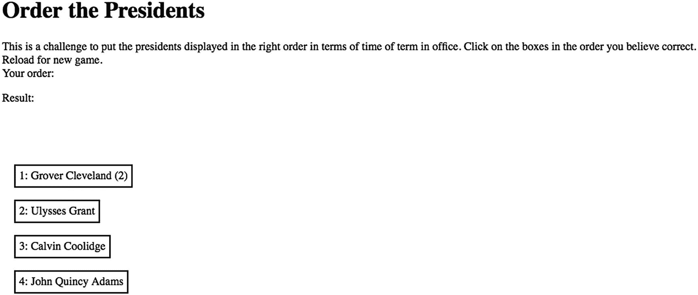
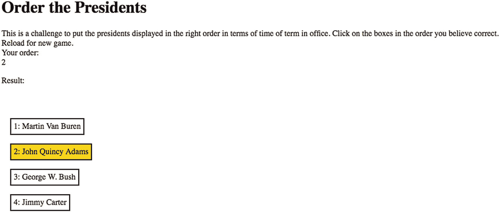
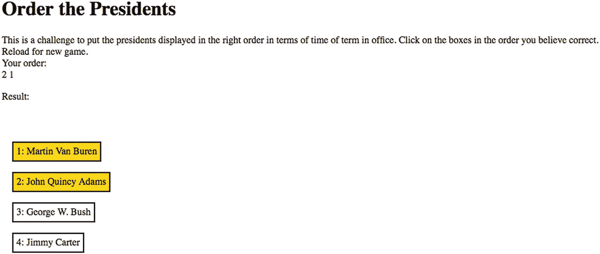
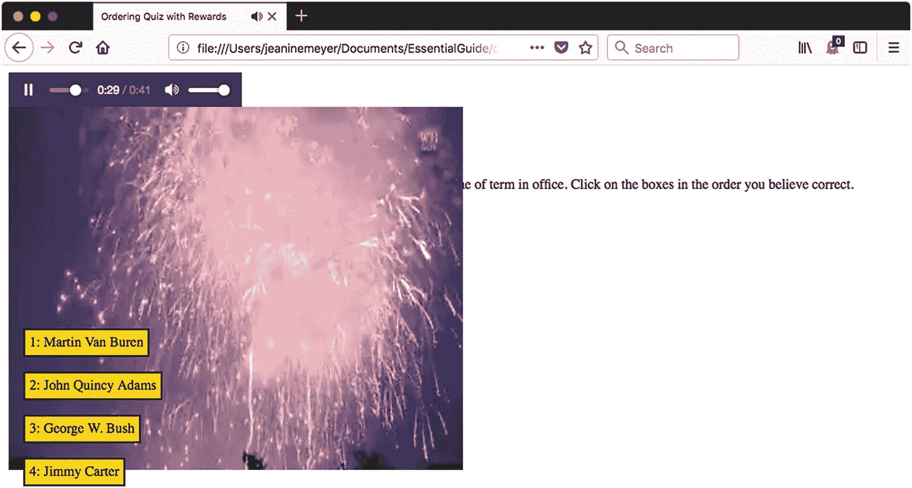
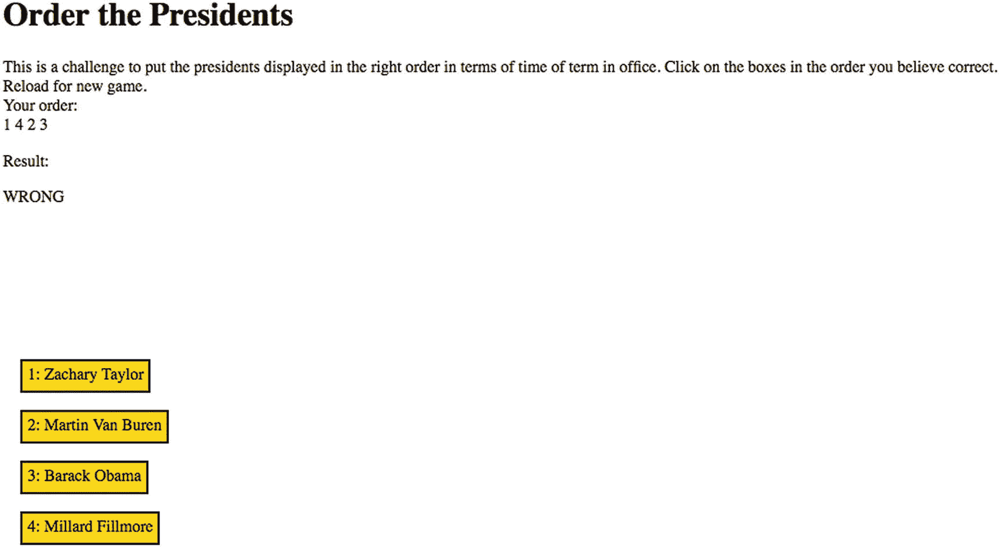

# 六、测验

在本章中，我们将介绍

*   通过代码创建 HTML 元素

*   响应鼠标在特定元素上的点击并停止响应鼠标在特定元素上的点击

*   创建和访问数组

*   播放音频剪辑和视频剪辑

*   检查玩家反应并防止不良行为

## 介绍

这一章演示了如何动态创建 HTML 元素，然后在屏幕上定位。这不仅不同于在`canvas`元素上绘图，也不同于使用 HTML 标记创建或多或少静态网页的老方法。我们的目标是制作一个小测验，让玩家按时间顺序排列一组美国总统。总统组是从完整的总统列表中随机选择的。正确排序有奖励:播放一个视频片段和一个音频片段。使用 HTML5 直接显示视频和音频(也称为*本地*)的能力是对旧系统的一大改进，旧系统需要在玩家的计算机上使用`<object>`元素和第三方插件。在我们的游戏中，视频和音频只是一个次要的角色，但是开发人员和设计人员可以使用 HTML5 和 JavaScript 在应用程序运行的特定时间点制作特定的视频，这一点非常重要。

自动播放是指在没有用户操作的情况下播放视频剪辑。截至 2018 年 4 月，Chrome 浏览器采用了视频自动播放的政策(详见 [`https://developers.google.com/web/updates/2017/09/autoplay-policy-changes`](https://developers.google.com/web/updates/2017/09/autoplay-policy-changes) )。该策略旨在防止在许多情况下自动播放。理由是自动播放视频可能会让用户支付数据费用，并可能使网络过载。视频广告可能很烦人。我接受这个推理；然而，我希望奖励在玩家成功完成游戏后立即生效。Chrome 浏览器有一种方法来确定他们所说的用户参与度。我为玩家成功设定的奖励包括一段静音的视频和一段音频。这似乎通过了 Chrome 的用户参与度测试，媒体也确实得到了播放。不过，自动播放政策是你需要知道的，并在未来进行调查。

测验的基本信息由一个数组组成，内部数组保存总统的姓名，第二项用于确保随机过程不会选择两个同名的实例。该程序选择四位总统的名字，并为包含名字和数字的框创建 HTML 标记。程序在窗口中定位盒子。图 6-1 为开启画面。



图 6-1

测验的开始画面

这给了我一个评论这个游戏的机会。我能按顺序背诵总统，所以能很好地玩这个游戏。这种情况有问题，因为我需要确保当玩家给出错误的答案或在其他方面表现不佳时，测试可以正常进行，我稍后会解释。本章的目的是介绍 HTML、CSS 和 JavaScript 的特性和通用技术，您可以用它们来构建自己的测验，选择自己的题目。请记住，你可能不是在为自己打造游戏。

顺便说一下，对于美国总统来说，我需要提供一些方法来解决格罗弗·克利夫兰(Grover Cleveland)的问题，他是唯一一位连任两届非连续总统的人。我选择将格罗弗·克利夫兰和 ?? 列入名单。也许你需要对你的主题采取类似的步骤。

玩家点击连续的选项。我开始了一个新游戏。图 6-2 显示了玩家选择她认为(知道)是这一套中最早的总统后的屏幕。请注意，数字 2 出现在您的订单下，约翰·昆西·亚当斯盒子现在是金色的。



图 6-2

玩家选择她认为是这一组 4 个中最早的总统

无论正确与否，任何被点击的方块都会变成金色。我不会试图犯任何错误。图 6-3 显示了两种选择以及出现在您订单下的数字 2 1。



图 6-3

玩家点击了约翰·昆西·亚当斯，然后点击了马丁·范·布伦

我完成了测验。图 6-4 显示的是车窗，有些挤压。此时显示的是一个视频剪辑和一个音频文件。我有一个自由女神像附近烟火的视频剪辑。这段视频的配乐是纽约，纽约。我决定找一个免费版的《褶边与华丽》(也叫《向酋长致敬》)。稍后，您将会看到我将视频和音频结合起来所需的一些小步骤。



图 6-4

在成功订购总统组之后

让我调用一个新游戏，现在输入一个错误的顺序。图 6-5 显示了做错订单的结果。显示玩家的订单，并出现消息`WRONG`。



图 6-5

玩家不正确的排序

## 问答游戏的关键要求

测验需要一种存储信息的方式，或者用一个更好的术语来说，一个知识库。我们需要一种随机选择具体问题的方法，这样玩家每次都会看到不同的挑战。因为我们存储的是名字，所以我们可以使用一个简单的技术。

接下来，我们需要向玩家提出问题，并对玩家的行为提供反馈。我们可以决定反馈的多少。我的游戏在点击后会改变盒子的颜色，订单会显示在“您的订单”标题下。我决定等到完成后再检查玩家的订单。我的技术评论员指出，在游戏的早期版本中，我的编码允许玩家点击同一个框两次。我决定不回应额外的点击来处理这个问题。您可以决定这是否是您想要采取的方法。总的问题是你需要期待玩家/客户/用户可以做奇怪的事情。有时你可能想告诉他们这是错误的，而有时你，也就是你的代码，应该简单地忽略这个动作。

我认为正确的排序应该得到奖励:播放一段爱国视频剪辑。正如我将要解释的，这需要获得一个视频剪辑和一个单独的音频剪辑。

## HTML5、CSS 和 JavaScript 特性

现在让我们深入研究 HTML5、CSS 和 JavaScript 的具体特性，这些特性提供了我们实现测验所需的内容。我再次建立在之前已经解释过的基础上，做了一些冗余，以防你在阅读中跳过。

### 在数组中存储和检索信息

你可能记得数组是一系列的值，变量可以被设置成数组。数组的各个组成部分可以是任何数据类型——包括其他数组！回想一下，在第五章的记忆游戏中，我们使用了一个名为`pairs`的数组变量，其中每个元素本身是一个由两个元素组成的数组，即匹配的照片图像文件。

在测验应用程序中，我们将再次使用数组的数组。对于智力竞赛节目，我们设置了一个名为`facts`的变量作为数组来保存总统姓名的信息。关键信息是数组中项目的顺序。`facts`数组的每个元素本身就是一个数组。创建这个应用程序时，我的第一个想法是，应该有一个简单的字符串对象数组，每个字符串包含一个总统的名字，数组按顺序排列。然而，我随后决定需要一个数组的数组，第二个元素包含一个布尔值(真/假),用于防止在一个游戏中两次选择相同的名称。

使用方括号访问或设置数组的各个组件。JavaScript 中的数组从零开始索引，到数组中元素总数减一结束。记住索引是从零开始的一个技巧是想象数组都是排成一行的。第一个元素将在开始处；第二个 1 单位远；第三个 2 单位远；等等。

数组的长度保存在名为`length`的数组属性中。要访问`facts`数组中的第一项，可以使用`facts[0]`；对于二次元，`facts[1]`，以此类推。您将在代码中看到这一点。

对数组中的每个元素做一些事情的常见方法是使用`forloop`。(另请参见第三章中关于在边界框壁上设置渐变的说明。)假设您有一个名为`prices`的数组，您的任务是编写代码将每个价格提高 15%。此外，每个价格必须至少增加 1，即使 1 大于 15%。您可以使用表 6-1 中的结构来执行这项任务。正如您在解释栏中看到的，`for`循环对数组的每个组件做同样的事情，在本例中使用索引变量`i`。这个例子也展示了`Math.max`方法的使用。

表 6-1

使用 For 循环增加数组中的价格

<colgroup><col class="tcol1 align-left"> <col class="tcol2 align-left"></colgroup> 
| 

密码

 | 

说明

 |
| --- | --- |
| `for(var i=0;i<prices.length;i++) {` | 执行括号内的语句，改变`i`的值，从 0 开始增加 1(这就是`i++`所做的),直到值不小于数组中元素的数量`prices.length`。 |
| `prices[i] += Math.max``(prices[i]*.15,1);` | 记得从里到外解读这个。计算数组`prices`的第`i`<sup>个元素的`.15`倍。看哪个更大，这个值还是 1。如果是这个值，那就是`Math.max`返回的。如果是 1(如果 1 比`prices[i]*.15`大)，就用 1。将该值与`prices[i]`的当前值相加。这就是`+=`的作用。</sup> |
| } | 关闭`for`回路。 |

注意，代码没有明确说明`prices`数组的大小。相反，它用表达式`prices.length`来表示。这很好，因为这意味着当你向数组中添加元素时，`length`的值会自动改变。当然，在我们的例子中，我们知道数字是 45，但是在其他情况下，最好保持灵活性。当一个事实是一条信息时，这个应用程序可以作为一个包含任意数量事实的测验的模型，其中信息的顺序很重要。

JavaScript 只支持一维数组。`facts`数组是一维的。但是数组中的项本身就是数组:`facts[0]`元素本身就是数组，以此类推。

### 注意

如果知识库非常复杂，或者如果我要共享信息或从其他地方访问信息，我可能需要使用数组之外的东西。我还可以将知识库与 HTML 文档分开存储，也许可以使用扩展标记语言(XML)文件。JavaScript 具有读入和访问 XML 的函数。最重要的是，我会把事实放在服务器上，这样任何玩家都无法查看源代码来了解订单的实际情况。我不这么做的理由是 1)我不想进入服务器端编程，2)如果一个玩家这么努力，他或她会学到一些东西。

测验的设计是为每个游戏随机选择一组四个名字，所以我们定义一个变量`nq`(代表测验中的数字)为 4。这永远不会改变，但是把它变成一个变量意味着如果我们想改变它，这很容易做到。

动态创建的 HTML(见下一节)将显示一列。这里用伪代码表示的逻辑如下

```js
Make a random choice, from 0 to facts.length. If this fact has been used, try again. Mark this choice as used.

Create new HTML to be a block, with the text and a number (1, 2, 3 or 4 and the name of the president.

Make the block visible and position it in the window.

Set up an event and event handling to respond to the player clicking in the box.

```

那么我们如何编码呢？我将在下一节解释新 HTML 的创建。如前所述，事实数组包含数组，每个内部数组的第二个元素是一个布尔变量。最初，这些值都是假的，这意味着游戏中还没有用到这些元素。当然，如果随机调用返回一个已经被选中的数字，我会使用另一种类型的循环，一个`do-while`结构，它会一直尝试，直到出现一个没有被使用的事实:

```js
do {c = Math.floor(Math.random()*facts.length);}
while (facts[c][2]==true);

```

一旦`facts[c][2]`为假，即当索引`c`处的元素可用时，`do-while`就退出。

`facts`数组是我完整创建的，并放在 HTML 文档中。它不会改变。相比之下，对于测验中的每一个游戏，我的代码都会创建一个名为“老虎机”的区域。它从一个空数组开始:

```js
var slots =[];

```

每当玩家移动一步，也就是点击一个方块，就会使用`push`方法将信息添加到这个数组中。老虎机数组由`checkorder`函数访问，该函数将在“检查玩家的答案”一节中描述。

### 在程序执行期间创建 HTML

HTML 文档通常由最初编写文档时包含的文本和标记组成。但是，您也可以在浏览器解释文件时向文档添加内容，特别是在执行`script`元素中的 JavaScript 时(称为*执行时间*或*运行时间*)。这就是我所说的动态创建 HTML。在这个应用程序中，就像本文中的大多数应用程序一样，`body`标签的`onload`属性被设置为调用一个名为`init`的程序。这个函数调用另一个设置游戏的函数。

对于测验应用程序，我创建了一个名为`pres`的类型。这通过以下方式完成:

```js
d = document.createElement('pres');

```

然后我需要在新创建的对象中放一些东西。这实际上需要几个语句。

我使用赋值语句。注意:`uniqueid`变量已经被设置。

```js
d.innerHTML= "<div  class='thing' id='"+uniqueid+"'>placeholder</div>";

```

`div`是一个块类型，这意味着它可以包含其他元素以及文本，并且在它的前后显示有换行符。我用

```js
thingelem = document.getElementById(uniqueid);

```

设置`thingelement`以引用新创建的对象。我用

```js
thingelem.textContent = String(i+1)+": "+facts[c][0];

```

以提供可视内容。`i+1`是为了让玩家看到从 1 而不是 0 开始的索引。

动态创建的 HTML 需要附加到已经可见的东西上，比如`body`元素，以便显示。这是使用`appendChild`完成的。

```js
document.body.appendChild(d);

```

`body`元素通常是合适的选择，但是您也可以在其他元素上使用`appendChild`,这会很有用。例如，您可以使用属性`childNodes`来获取特定元素的所有子节点的集合(NodeList ),为每个子节点做一些事情，包括删除它。

表 6-2 显示了我们将使用的方法。

表 6-2

动态创建 HTML 时通常使用的方法

<colgroup><col class="tcol1 align-left"> <col class="tcol2 align-left"></colgroup> 
| 

密码

 | 

说明

 |
| --- | --- |
| `createElement` | 创建 HTML 元素 |
| `appendChild` | 通过将元素追加到文档中的某个位置，将元素添加到文档中 |
| `getElementByID` | 获取对元素的引用 |

每个块的格式化是在 CSS 的 style 元素中完成的(见下一步)。代码为每个块创建一个唯一的 ID。这个惟一的 ID 是根据名称在`facts`数组中的索引构建的。在检查玩家点餐时使用。

一旦我们创建了这些新的 HTML 元素，我们就使用`addEventListener`来设置事件和事件处理程序。`addEventListener`方法用于各种事件。记住，我们在第四章中的`canvas`元素上使用了它。

安排程序响应玩家使用了`addEventListener`方法。语句`thingelem.addEventListener('click',pickelement);`定义了事件，即点击块，以及事件处理:调用`pickelement`函数。

### 注意

如果我们没有这些元素和能力来执行`addEventListener`并使用`this`引用属性(原谅笨拙的英语)，而是在画布上绘制东西，我们将需要执行计算和比较来确定*鼠标*光标在哪里，然后以某种方式查找相应的信息来检查匹配。(回忆一下第四章中弹弓的编码。)相反，JavaScript 引擎正在做大量的工作，而且比我们自己编写代码更有效、更快。

您将在“构建应用程序”一节中看到完整的代码。

### 在样式元素中使用 CSS

级联样式表(CSS)允许您指定 HTML 文档各部分的格式。第一章展示了一个非常基本的 CSS 例子，即使对于静态 HTML 来说，它也是强大而有用的。本质上，这个想法是使用 CSS 来格式化，也就是应用程序的外观，而保留 HTML 来构造内容。有关 CSS 的更多信息，请参见 David Powers 的《CSS3 入门》( Apress，2012)。

让我们在这里简单地看一下我们将使用什么来生成保存总统姓名的动态创建的块。

HTML 文档中的样式元素包含一个或多个样式。每种风格都指以下一种:

*   使用元素类型名称的元素类型

*   使用`id`值的特定元素

*   一个`class`的元素

在第一章中，我们为`body`元素和`section`元素使用了一种样式。为了测试，我为一类我命名为`thing`的元素写了一个指令。

现在让我们为一类元素设置格式。类是一个可以在任何元素开始标记中指定的属性。对于这个应用程序，我想出了一个类`thing`。是的，我知道这很无聊。它指的是我们的代码将放在屏幕上的东西。风格是

```js
.thing {position:absolute; left: 0px; top: 0px; border: 2px; border-style: double;➥
 background-color: white; margin: 5px; padding: 5px; }

```

`padding`设置决定了文本和文本框之间的间距；`margin`决定了元素周围的间距。我想到了一个填充的细胞来帮助我记住不同之处。事实上，`margin`设置在这里是不必要的，因为我的代码使用变量`rowsize`垂直定位块。

`thing`前的句点表示这是一个类规范。`position`被设置为`absolute`，`top`和`left`包括可以通过代码改变的值。

`absolute`设置指的是在文档窗口中指定`position`的方式——作为特定的坐标。另一种选择是`relative`，如果文档的一部分在一个包含块中，可以在屏幕上的任何地方，就可以使用这个选项。度量单位是像素，因此从左到上的位置被给定为 0 像素的 0px，边框、边距和填充度量分别是 2 像素、5 像素和 5 像素。

现在让我们看看如何使用样式属性来定位和格式化块。例如，在创建了保存总统姓名的动态元素之后，我们可以使用下面几行代码来获取对刚刚创建的`thing`的引用，将保存姓名的文本放入元素中，然后将它定位在屏幕上的指定点。

```js
thingelem = document.getElementBy(uniqueid);
thingelem.textContent=
     String(i+1)+": "+facts[c][0];
thingelem.style.top = String(my)+"px";
thingelem.style.left = String(mx)+"px";

```

这里，`my`和`mx`是数字。设置`style.top`和`style.left`需要一个字符串，所以我们的代码将数字转换成字符串，并在字符串末尾添加`"px"`。

### 响应玩家的移动

在`pickelement`函数中，你会看到响应和跟踪玩家动作的代码。`pickelement`标题有一个称为`ev`的单一参数。然而，还有一种我们称之为隐含参数的东西。调用该函数是因为对特定元素的操作。代码中的术语`this`指的是该元素。

在代码中，`this`指的是当前实例，即玩家点击的元素。我们为每个元素设置了事件监听，因此当执行`pickelement`时，代码可以引用*使用`this`听到*点击的特定元素。当玩家点击一个写有约翰·昆西·亚当斯名字的方块时，代码*知道*它，通过“知道”我比我想要的更拟人化了程序。换句话说，同样的`pickelement`函数将被调用于我们在屏幕上放置的所有方块，但是，通过使用`this`，代码可以引用玩家每次点击的特定方块。`pickelement`代码从`textContent`中的元素和第一个字符中提取 ID。ID 中的信息用于填充一个名为`slots`的数组，该数组将用于检查玩家的订单。来自`textContent`的字符，1 或 2 或 3 或 4，将用于向玩家显示已经做出的选择。

我们想在玩家点击盒子时改变它的颜色。我们可以这样做，就像改变`top`和`left`来重新定位模块一样。然而，JavaScript 的属性名与 CSS 中的略有不同:没有破折号。

```js
this.style.backgroundColor = "gold";

```

`gold`是一组已确定的颜色之一，包括`red`、`white`、`blue`等。那可以用名字来指代。或者，您可以使用 Adobe Photoshop 等程序或 [`pixlr.com`](http://pixlr.com) 等在线网站提供的十六进制 RGB 值。

函数执行另一个任务，我认为说这是一个迟到的添加是有用的，虽然有点尴尬。如果玩家，姑且称他为讨厌的玩家，不止一次点击一个方块会怎么样？在我的测试中，我从未尝试过这一点，但我的技术审查员指出了这一点。你需要为玩家和用户做奇怪的事情做准备和计划。解决方法很简单。我使用代码来停止监听点击事件。声明是

```js
this.removeEventListener('click',functionreference);

```

`functionreference`变量已被设置为指向`pickelement`。

`pickelement`函数提取块 ID 的原始数字部分，并将其转换为数字。这被添加(推)到一个名为`slots`的数组中。当`slots`数组的长度等于`nq`时，调用`checkorder`函数。

### 小费

您可以在样式部分指定字体。你可以在任何搜索引擎中输入“安全网页字体”,然后得到一个据称可以在所有浏览器和所有电脑上使用的字体列表。但是，另一种方法是指定一个有序的字体列表，这样如果第一个字体不可用，浏览器将尝试查找下一个。更多信息见第八章。

### 演示音频和视频

HTML5 提供了音频和视频元素，用于呈现音频和视频，或者作为静态 HTML 文档的一部分，或者在 JavaScript 的控制下。

简而言之，音频和视频有不同的文件类型，就像图像一样。文件类型因视频和相关音频的容器、音频本身以及视频和音频的编码方式而异。浏览器需要知道如何处理容器，如何解码视频以在屏幕上连续显示帧(组成视频的静止图像)，以及如何解码音频以将声音发送到计算机扬声器。

视频涉及大量数据，因此人们仍在研究压缩信息的最佳方法，例如，利用帧之间的相似性而不损失太多质量。网站现在显示在手机的小屏幕上，也显示在大的高清电视屏幕上，所以利用任何关于显示设备的知识是很重要的。考虑到这一点，虽然我们可以希望浏览器制造商在未来标准化一种格式，但 HTML5 `video`元素提供了一种通过引用多个文件来解决缺乏标准化问题的方法。因此，开发人员需要制作同一视频的不同版本(包括我们创建这个测验应用程序的人)。

我下载了一个 7 月 4 日的 fireworks 视频剪辑，然后使用一个免费工具(Miro video converter)创建了三个不同的版本，用不同的格式制作了同一个视频短片。然后我使用新的 HTML5 `video`元素和`source`元素来编码对所有三个视频文件的引用。元素中的`codecs`属性提供了关于在`src`属性中指定的文件的编码信息。然后，我决定不使用烟花视频的音频，而是使用传统上为美国总统播放的歌曲“荷叶边和花饰”。幸运的是，视频标签附带了一个名为`muted`的属性，可以让视频的音频静音。我不需要视频和音频完全同步，所以这种方法可行。在身体里，我有

```js
<audio id="ruffles" controls="controls"  preload="auto" alt="Hail to the Chief">
  <source src="hail_to_the_chief.mp3" type="audio/mpeg">
  <source src="hail_to_the_chief.ogg" type="audio/ogg">
Your browser does not accept the audio tag.
 </audio>
 <video id="vid"  preload="auto" width="50%" alt="Fireworks video" muted>
<source src="sfire3.webmvp8.webm" type='video/webm; codec="vp8, vorbis"'>
<source src="sfire3.mp4">
<source src="sfire3.theora.ogv" type='video/ogg; codecs="theora, vorbis"'>

```

包括`controls="controls"`将熟悉的控件放在屏幕上，允许玩家/用户开始或暂停音频剪辑。我不提供视频控件。

此时，您可能会问:当测验开始时，视频和音频控件在哪里？答案是我用 CSS 让这两个不显示:

```js
audio {visibility: hidden;}
video {visibility: hidden; display: none; position:absolute;}

```

您可能还会问，为什么我不编写代码来动态创建`video`和`audio`元素，而是将它们放在 HTML 文档中。答案是，我想确保音频和视频文件被完全下载。因为人类游戏确实需要一些时间，这可能在没有特殊工作的情况下发生，但这是一个很好的预防措施。

### 小费

CSS 有自己的语言，有时在术语中涉及连字符。表达元素在屏幕上如何分层的 CSS 术语是 z-index；JavaScript 术语是`zIndex`。

### 检查玩家的答案

`checkorder`函数执行检查玩家是否以正确的顺序点击了方块的任务。这对我来说并不明显，但我确实意识到我的程序不需要对选择的名字进行排序。相反，我的代码检查在`slots`数组中表示的玩家列表是否是无序的。`slots`数组将按照玩家的命令保存每个总统的索引位置。该代码循环访问这些项，以查看是否有任何项大于下一项。这个`for`循环完成了任务:

```js
var ok = true;
    for (var i=0;i<nq-1;i++){
       if (slots[i]>slots[i+1]){
              ok = false;
              break;
       }
    }

```

`ok`变量开始为真，如果与正确排序有任何差异，`for`循环中的代码将把`ok`的值改为`false`。当这种情况发生时，`break`语句使控制离开`for`循环。如果`ok`设置为`false`，则退出`for`循环。下一步是提供音频/视频奖励以及显示结果`CORRECT`或显示结果`WRONG`。

```js
if (ok){

       res.innerHTML= "CORRECT";
       song.style.visibility="visible";
       song.currentTime = 4; //prevent seconds of no sound
       song.play();
       v.style.visibility="visible";
       v.currentTime=0;
       v.style.display="block";

       v.play();
    }
    else {
       res.innerHTML = "WRONG";
    }

```

有了 JavaScript、HTML 和 CSS 的这些背景知识，我们现在可以描述测验应用程序的编码了。

## 构建应用程序并使之成为您自己的应用程序

测验的知识库在`facts`变量中表示，这是一个数组的数组。如果您想将测验更改为另一个主题，一个由成对的姓名或其他文本组成的主题，您只需更改`facts`。当然，您还需要更改在`body`元素中作为`h1`元素出现的文本，让玩家知道问题的类别。我定义了一个名为`nq`的变量，每次测验中的数字(屏幕上出现的配对数)是 4。当然，如果您想向玩家呈现不同数量的对子，您可以更改该值。其他变量用于块的原始位置和保存状态信息，比如是第一次点击还是第二次点击。

我为这个应用程序创建了四个函数:`init`、`setupgame`、`pickelement`和`checkorder`。我本可以将`init`和`setupgame`合并，将`pickelement`和 checkorder 合并，但是将它们分开以方便重放按钮，也是为了一般原则。为不同的任务定义不同的功能是一种很好的做法。表 6-3 描述了这些函数以及它们调用或被调用的内容。

表 6-3

测验应用程序中的功能

<colgroup><col class="tcol1 align-left"> <col class="tcol2 align-left"> <col class="tcol3 align-left"></colgroup> 
| 

功能

 | 

调用方/被调用方

 | 

打电话

 |
| --- | --- | --- |
| `init` | 由`<body>`标签中的`onLoad`动作调用 | `setupgame` |
| `setupgame` | `init` |   |
| `pickelement` | 因`setupgame`中的`addEventListener`调用而被调用 | 检查订单 |
| `checkorder` | `pickelement` |   |

`setupgame`函数是为块创建 HTML 的地方。简而言之，一个使用`Math.random`的表达式被求值以选择`facts`数组中的一行。如果该行已被使用，代码会再次尝试。当发现一个未使用的行时，它被标记为已使用(第三个元素，索引值为 2)并创建块。

当点击一个块时，调用`pickelement`函数。它添加到订单上显示的字符串中，并添加到将由`checkorder`使用的`slots`数组中。`checkorder`函数进行检查。它显示`WRONG`或`CORRECT`，如果顺序正确，使音频控制和视频可见并开始播放。

注意，我的程序中有多余的代码。我这样做是为了减轻重复播放的负担，而不需要重新加载或“重做”。

表 6-4 提供了代码的逐行解释。

表 6-4

总统测验的完整代码

<colgroup><col class="tcol1 align-left"> <col class="tcol2 align-left"></colgroup> 
| `<html>` | HTML 标签。 |
| `<meta charset="UTF-8">` | 定义字符集，在这种情况下是一种 Unicode 形式。可以省略，我确实在很多例子中省略了，但是在这里包含它是为了让你看到。 |
| `<head>` | 头部标签。 |
| `<title>Ordering Quiz with Rewards</title>` | 完整的标题元素。 |
| `<style>` | 样式标签。 |
| `.thing {position:absolute; left: 0px; top: 0px; border: 2px; border-style: double; background-color: white; margin: 5px; padding: 5px; }` | 我称之为总统名字的区块的格式。 |
| `audio {visibility: hidden;}` | 隐藏启动音频控制。默认定位。 |
| `video {visibility: hidden; display: none; position:absolute;}` | 视频开始时隐藏。 |
| `</style>` | 关闭样式元素。 |
| `<script type="text/javascript">` | 脚本标记，开始脚本元素，指定了 JavaScript。 |
| `var facts = [` | 事实声明数组。 |
| `["George Washington",false],` | 名称和未使用该名称的说明。 |
| `["John Adams",false],` |   |
| `["Thomas Jefferson",false],` |   |
| `["James Madison",false],` |   |
| `["James Monroe",false],` |   |
| `["John Quincy Adams",false],` |   |
| `["Andrew Jackson",false],` |   |
| `["Martin Van Buren",false],` |   |
| `["William Harrison",false],` |   |
| `["John Tyler",false],` |   |
| `["James Polk", false],` |   |
| `["Zachary Taylor",false],` |   |
| `["Millard Fillmore",false],` |   |
| `["Franklin Pierce",false],` |   |
| `["James Buchanan",false],` |   |
| `["Abraham Lincoln",false],` |   |
| `["Andrew Johnson",false],` |   |
| `["Ulysses Grant",false],` |   |
| `["Rutherford Hayes",false],` |   |
| `["James Garfield",false],` |   |
| `["Chester Arthur",false],` |   |
| `["Grover Cleveland (1)",false],` | 这就是我选择代表格罗弗·克利夫兰第一任期的原因。 |
| `["Benjamin Harrison",false],` |   |
| `["Grover Cleveland (2)",false],` | 这就是我选择代表格罗弗·克利夫兰的第二个任期的原因，他的第一个任期并不连续。 |
| `["William McKinley",false],` |   |
| `["Theodore Roosevelt",false],` |   |
| `["William Taft",false],` |   |
| `["Woodrow Wilson",false],` |   |
| `["Warren Harding",false],` |   |
| `["Calvin Coolidge",false],` |   |
| `["Herbert Hoover",false],` |   |
| `["Franklin Roosevelt",false],` |   |
| `["Harry Truman",false],` |   |
| `["Dwight Eisenhower",false],` |   |
| `["John Kennedy",false],` |   |
| `["Lyndon Johnson",false],` |   |
| `["Richard Nixon",false],` |   |
| `["Gerald Ford",false],` |   |
| `["Jimmy Carter",false],` |   |
| `["Ronald Reagan",false],` |   |
| `["George H. W. Bush",false],` |   |
| `["Bill Clinton",false],` |   |
| `["George W. Bush",false],` |   |
| `["Barack Obama",false],` |   |
| `["Donald Trump",false]` |   |
| `];` | 关闭事实数组。 |
| `var thingelem;` | 用于保存创建的元素。 |
| `var nq = 4;` | 陈述的事实数量。 |
| `var col1 = 20;` | 名称列的水平位置。 |
| `var row1 = 100;` | 名字的垂直位置。 |
| `var rowsize = 50;` | 分配给每个区块的间距。 |
| `var slots = [];` | 用于检查将索引保存到事实中。 |
| `var answertext=" ";` | 答案的初始值。 |
| `var song;` | 将保存对音频元素的引用。 |
| `var functionreference;` | 将保存对`pickelement`的引用。 |
| `var v;` | 将保存对视频元素的引用。 |
| `var res;` | 将引用结果的位置。 |
| `var ans;` | 将参考地方进行回答。 |
| `function init(){` | 表头`init`功能。 |
| `res = document.getElementById("results");` | 获取参考。 |
| `ans = document.getElementById("answer");` | 获取参考。 |
| `functionreference = pickelement;` | 用于移除事件处理的设置。 |
| `song = document.getElementById("ruffles");` | 获取参考。 |
| `v = document.getElementById("vid");` | 获取参考。 |
| `row1= .5* window.innerHeight;` | 适应窗户高度。 |
| `setupgame();` | 调用`setupgame`。 |
| `}` | 关闭`init`。 |
| `function setupgame() {` | 标题`setupgame`。 |
| `slots=[];` | 初始化插槽。多余的，但这样做是为了准备增强。 |
| `answertext="";` | 初始化`answertext`。多余的，但这样做是为了准备增强。 |
| `var i;` | 索引变量。 |
| `var c;` | 将掌握事实的索引。 |
| `var mx = col1;` | 初始水平设置。它不会改变。 |
| `var my = row1;` | 初始垂直设置。这将会改变。 |
| `var d;` | 保存新创建的元素。 |
| `var uniqueid;` | 会持有 ID。它将从随机索引中生成事实。 |
| `for (i=0;i<facts.length;i++) {` | `For`循环将所有事实标记为未使用。 |
| `facts[i][2] = false;` | 将事实标记为未使用。 |
| `}` | 关闭`for`回路。 |
| `for(i=0;i<nq;i++) {` | `For`循环选择并创建四个写有总统姓名的方框。 |
| `do {c = Math.floor(Math.random()*facts.length);}` | 随机选择。 |
| `while (facts[c][1]==true);` | 如果已经选择，重复`do`条款。 |
| `facts[c][1]=true;` | 现在将这个事实设置为正在使用。 |
| `uniqueid = "p"+String(c);` | 通过将`"p"`附加到转换为字符串的索引上来创建一个惟一的 ID。 |
| `d = document.createElement('pres');` | 创建一个元素。 |
| `d.innerHTML =` | 将其`innerHTML`设置为 |
| `"<div  class="thing" id='"+uniqueid+"'>placeholder</div>";` | 做一个`div`，`class="thing"`，ID 生成的`unqueid`。 |
| `document.body.appendChild(d);` | 将此附加到正文。这个动作使它可见。 |
| `thingelem = document.getElementById(uniqueid);` | 获取对它的引用。 |
| `thingelem.textContent=String(i+1)+": "+facts[c][0];` | 通过编号后跟名称来制作其内容。 |
| `thingelem.style.top = String(my)+"px";` | 将其垂直放置。 |
| `thingelem.style.left = String(mx)+"px";` | 水平放置。 |
| `thingelem.addEventListener('click',pickelement);` | 启用点击响应。 |
| `my +=rowsize;` | 垂直定位的增量`my`。 |
| `}` | 关闭`for`回路。 |
| `}` | 关闭`setupgame`。 |
| `function pickelement(ev) {` | `pickelement`的标题。当玩家点击方块时调用。注意:`ev`对于事件处理程序来说不是必需的，而是必须的。使用的是`this`术语。 |
| `var answert;` | 会持有数字 1，2 等。 |
| `var positiont;` | 将在原始数组中作为文本保存位置。 |
| `var positionn;` | 将保持数字的位置。 |
| `positiont = this.id.substring(1);` | 通过删除 ID 的第一个字母来创建职位。 |
| `answert= this.textContent.substring(0,1);` | 通过取`textContent`的第一个字符，创建将添加到答案中的内容。注意:如果少于 10 个选项，则有效。 |
| `answertext = answertext+answert+" ";` | 将这个问题的答案添加到已有的答案中。 |
| `ans.innerHTML= answertext;` | 显示`answertext`。 |
| `positionn = Number(positiont);` | 生成号码。 |
| `this.style.backgroundColor = "gold";` | 做块金。 |
| `this.removeEventListener('click',functionreference);` | 移除事件处理。 |
| `slots.push(positionn);` | 将`positionn`添加到检查中使用的插槽数组中。 |
| `if (slots.length==nq) {` | block 上有过`nq`的点击吗？ |
| `checkorder();` | ….如果是，调用`checkorder`。 |
| `}` | 关闭`if`。 |
| `}` | 关闭`pickelement`功能。 |
| `function checkorder(){` | `checkorder`的标题。 |
| `var ok = true;` | 从`ok`设置为`true`开始。 |
| `for (var i=0;i<nq-1;i++){` | 遍历插槽中的所有元素。 |
| `if (slots[i]>slots[i+1]){` | 如果第 I 个槽大于第(i+1)个槽。 |
| `ok = false;` | 将`ok`设置为`false`。回答不符合顺序。 |
| `break;` | 离开`for`循环。 |
| `}` | 关闭`if`。 |
| `}` | 关闭`for`回路。 |
| `if (ok){` | `ok`变量包含真或假。如果是真的， |
| `res.innerHTML= "CORRECT";` | 显示`CORRECT`。 |
| `song.style.visibility="visible";` | 使 song 元素(即控件)可见。 |
| `song.currentTime = 4;` | 这个音频剪辑有几秒钟的静止时间，所以这可以防止几秒钟没有声音。 |
| `song.play();` | 放这首歌。 |
| `v.style.visibility="visible";` | 将视频设置为`visible`。 |
| `v.currentTime=0;` | 设置为从起点开始。 |
| `v.style.display="block";` | 使可见(可能是多余的)。 |
| `v.play();` | 开始播放视频。 |
| `}` | 关闭`if ok true`子句。 |
| `else {` | `else`。 |
| `res.innerHTML = "WRONG";` | 显示`WRONG` |
| `}` | 关闭`else`。 |
| `}` | 关闭`checkorder`功能。 |
| `</script>` | 关闭`script`元素。 |
| `</head>` | 关闭`head`元素。 |
| `<body onload="init();">` | `Body`标记。注意`onload`的设置。 |
| `<audio id="ruffles" controls="controls"  preload="auto" alt="Hail to the Chief">` | `Audio`标记。 |
| `<source src="hail_to_the_chief.mp3" type="audio/mpeg">` | MP3 源。 |
| `<source src="hail_to_the_chief.ogg" type="audio/ogg">` | OGG 来源 |
| `Your browser does not accept the audio tag.` | 适用于旧浏览器。 |
| `</audio>` | 关闭`audio`元素。 |
| `<video id="vid"  preload="auto" width="50%" alt="Fireworks video" muted>` | 视频标签。注意到`muted`属性。 |
| `<source src="sfire3.webmvp8.webm" type='video/webm; codec="vp8, vorbis"'>` | WEBM 来源。 |
| `<source src="sfire3.mp4">` | MP4 来源。 |
| `<source src="sfire3.theora.ogv" type='video/ogg; codecs="theora, vorbis"'>` | OGG 来源。 |
| `Your browser does not accept the video tag.` | 对于较旧的浏览器。 |
| `</video>` | 关闭`video`元素。 |
| `<h1>Order the Presidents</h1>` | 航向。 |
| 这是一个挑战，让总统按照任期的时间顺序排列。按你认为正确的顺序点击方框。 | 说明书。 |
| `<br/>` | 换行。 |
| 为新游戏重新加载。 | 更多说明。 |
| `<br/>` | 换行。 |
| 您的订单: | 前往玩家的答案。 |
| `<div id="answer"></div>` | 玩家回答的地方。 |
| `<p>` | 垂直间距。 |
| 结果:`<div id="results"></div>` | 将保持结果。 |
| `</p>` | 垂直间距。 |
| `</body>` | 关闭`body`。 |
| `</html>` | 关闭`html`。 |

让这个应用程序成为您自己的应用程序的第一步是选择测验的内容。这里的值是名称，保存在文本中，但也可以是事件描述、数学表达式或歌曲名称。您还可以创建`img`标签，并使用保存在数组中的信息来设置`img`元素的`src`值。更复杂但仍然可行的方法是加入音频。从简单的开始，类似于美国总统的名单，然后变得更大胆。

您可以通过修改原始 HTML 和/或创建的 HTML 来更改应用程序的外观。您可以修改或添加到 CSS 部分。

你可以很容易地改变问题的数量(但不能超过 9 个)，或将四个问题的游戏改为四个问题的游戏，并在一定数量的猜测或点击按钮后自动进行新一轮游戏。你需要决定是否每一轮都要更换主席。

您还可以加入计时功能。有两种通用的方法:记录时间并在玩家成功完成一局/一轮游戏时简单地显示时间(参见第五章中的记忆游戏)或设定时间限制。第一种方法允许某人与自己竞争，但不会施加太大的压力。第二种情况会给玩家带来压力，你可以减少连续回合的时间。可以使用`setTimeout`命令来实现。

你可以把讨论事实的网站或谷歌地图位置的链接作为正确答案的迷你奖——或者作为线索。

您可能不喜欢视频播放时测验块停留在屏幕上的方式。您可以使用一个使每个元素不可见的循环来删除它们。期待第九章中的 Hangman 应用程序。

## 测试和上传应用程序

游戏的随机性不会影响测试。如果您愿意，您可以在`Math.random`编码后替换固定选项，进行大部分测试，然后删除这些代码行并再次测试。对于这个游戏和类似的游戏，重要的是要确保你的测试包括正确的猜测和错误的猜测，以及玩家的不良行为，比如点击已经做出的选择。

总统游戏在 HTML 文件中是完整的，但是音频和视频剪辑是不同的文件。如果你自己做测验，你没有义务同时使用音频片段和视频片段。对于媒体，您需要

*   创建或获取视频和/或音频

*   生产不同的版本，假设你想支持不同的浏览器

*   将所有文件上传到服务器

您可能需要与服务器工作人员合作，以确保正确指定不同的视频类型。这涉及到一个叫做 **htaccess** 的文件。HTML5 已经存在了一段时间，这种在网页上显示视频的方式应该为服务器工作人员所熟悉。

或者，您可以识别已经在线的视频和/或音频，并在`media`元素的`source`元素中使用绝对 URL 作为`src`属性。

## 摘要

在这一章中，我们实施了一个简单的测验，要求玩家将从美国总统的完整列表中随机选择的一小部分按顺序排列。将事件按时间顺序排列是一个合理的测验主题，但本章的主要内容是所使用的独特技术。该应用程序使用了以下编程技术和 HTML5 特性:

*   使用`document.createElement`、`document.getElementById`和`document.body.appendChild`在运行时创建 HTML

*   使用`addEventListener`设置鼠标`click`事件的事件处理

*   使用`removeEventListener`移除鼠标`click`事件的事件处理

*   使用代码更改 CSS 设置来更改屏幕上对象的颜色

*   创建一个数组的数组来保存测验内容

*   使用`for`循环迭代数组

*   使用`do-while`循环随机选择一个未使用的问题集

*   使用`substring`提取检查中使用的字符串

*   使用`Number`函数将字符串转换成数字

*   使用`video`和`audio`元素显示以不同浏览器可接受的格式编码的视频和音频

您可以使用动态创建和重新定位的 HTML 以及在前面章节中学习的画布上的绘制。第九章中描述的 Hangman 的实现就是这么做的。你可以像这里一样，把视频和音频作为应用程序的一小部分，或者作为网站的主要部分。在下一章中，我们将回到在画布上画一个迷宫，然后在迷宫中穿行而不穿过墙壁。