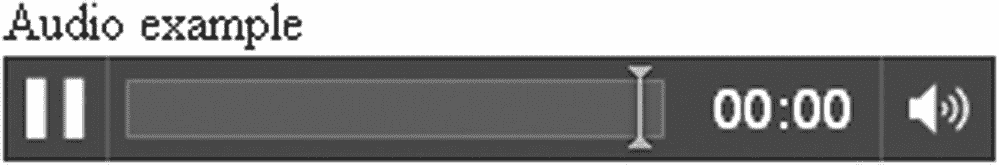

# 8.石头，布，剪刀

在本章中，我们将介绍

*   与电脑对战

*   创建用作按钮的图形

*   游戏规则的数组

*   `font-family`属性

*   继承的样式设置

*   声音的

## 介绍

本章结合了编程技术和 HTML5 JavaScript 特性来实现大家熟悉的石头剪子布游戏。在这个游戏的校园版中，每个玩家用手的符号来表示三种可能性中的一种:石头、布或剪刀。术语是玩家*抛出*三个选项中的一个。游戏规则是这样规定的:

*   石头压碎剪刀

*   纸覆盖岩石

*   剪刀剪纸

所以每个符号打败一个其他的符号:石头打败剪刀；纸打败了石头；剪刀打败了布。如果两个玩家扔同样的东西，那就是平局。

由于这是一个双人游戏，我们的玩家将与电脑对战，我们必须创造电脑的移动。我们将生成随机移动，玩家需要相信程序正在这样做，而不是基于玩家的投掷来移动。演示必须加强这种信任。

我们游戏的第一个版本只是使用了你将在这里看到的视觉效果。第二个版本增加了音频、由三个获胜事件控制的四个不同的剪辑以及平局选项。您可以使用源代码提供的声音文件，也可以使用您自己的声音。请注意，您需要更改代码中的文件名，以匹配您使用的声音文件。

在这种情况下，我们希望为玩家的移动使用特殊的图形。图 [8-1](#Fig1) 显示了应用程序的开始屏幕，包括三个用作按钮的图形，以及一个标有字符串`"Score:"`的字段，该字段保存初始值零。


图 8-1

石头剪刀布开场画面

玩家通过点击其中一个符号来移动。让我们看一个玩家点击石头图标的例子。我们假设电脑选择了剪刀。在一个简短的动画序列之后，一个剪刀符号开始变小并在屏幕上变大，出现一条文本消息，如图 [8-2](#Fig2) 所示。在添加了音频的版本中，音频剪辑将播放与石头压碎剪刀相对应的声音。请注意，现在的分数是 1。


图 8-2

玩家扔石头，电脑扔剪刀

接下来在游戏中，玩家和电脑打成平手，如图 [8-3](#Fig3) 所示。出现平局时分数没有变化，所以分数仍然是 1。


图 8-3

一条领带

后来，游戏已经打平，但玩家输了，分数降到负 1，这意味着玩家落后，如图 [8-4](#Fig4) 所示。


图 8-4

在游戏的后期，一个失败的举动

与本书中的所有示例一样，这个应用程序只是一个开始。普通版本和音频版本都为玩家保持一个连续的分数，在该分数中，损失导致减少。另一种方法是保留玩家和电脑各自的分数，只计算双方的胜利。你可以显示一个单独的游戏计数。如果您不想显示负数，这是更可取的。你也可以使用`localStorage`保存玩家的分数，如第 [7 章](07.html)中的迷宫游戏所述。

一个更精细的增强功能可能是视频剪辑(回头看第 [6](06.html) 章)或动画 gif，显示石头粉碎剪刀、纸覆盖石头和剪刀切纸。你也可以把它看作许多不同游戏的模型。在所有情况下，你都需要确定如何捕捉玩家的走法，如何生成电脑的走法；你需要代表并执行游戏规则；并且你需要维护游戏的状态并显示给玩家。石头剪子布游戏除了跑分没有状态信息。换句话说，一场游戏只有一个回合。这与第 [2](02.html) 章中描述的掷骰子游戏形成对比，在第章中，一个游戏可以包括一次到任意次掷骰子，或者第 [5](05.html) 章中描述的集中游戏，其中一轮包括两次纸牌选择，一个完整的游戏可以进行任意轮次，最少等于纸牌数量的一半。

### 注意

有石头剪子布的比赛，也有计算机系统，其中计算机根据玩家的移动历史来移动。甚至还有计算机对抗计算机的比赛。

## 关键要求

石头剪子布的实现使用了前面章节中演示的许多 HTML5 和 JavaScript 结构，在这里以不同的方式放在一起。编程类似于写作。它是以某种逻辑顺序将想法的表达放在一起，就像将单词组合成句子，将句子组合成段落，等等。在阅读本章的时候，回想一下你所学的关于在画布上绘制矩形、图像和文本，检测玩家点击鼠标的位置，使用`setInterval`设置定时事件来制作动画，以及使用数组来保存信息。这些是石头剪子布应用程序的构建块。

在设计这个应用程序时，我知道我想让我们的玩家点击按钮，一个按钮对应游戏中的一种投掷方式。一旦玩家投掷了一次，我想让程序自己移动，即随机选择，并在屏幕上显示与该移动相对应的图片。然后程序会应用游戏规则来显示结果。会播放一种声音，对应于一掷胜另一掷的三种可能情况，还有平局时的呻吟。

这个应用程序从屏幕上出现的按钮或图标开始。玩家可以点击这些图片进行移动。还有一个放乐谱的盒子。

应用程序必须随机生成计算机的走法，然后以一种看起来好像计算机和玩家同时出招的方式显示出来。我的想法是让适当的符号在屏幕上开始变小，然后变大，看起来就像电脑向玩家投掷一样。这个动作在玩家点击三个可能的投掷中的一个后立即开始，但它很快就足以给人一种两者同时发生的印象。

游戏规则必须遵守！这既包括什么打败什么，也包括解释它的民间信息——“石头砸剪刀”；“纸包石头”，还有“剪刀剪纸”。显示的分数会增加一分、减少一分或保持不变，这取决于该回合是赢、输还是平。

游戏的音频增强版本必须根据情况播放四个音频剪辑中的一个。

## HTML5、CSS 和 JavaScript 特性

现在让我们看看 HTML5、CSS 和 JavaScript 的具体特性，它们提供了我们实现游戏所需的东西。除了基本的 HTML 标签和函数以及变量，这里的解释都是完整的。如果你已经阅读了其他章节，你会注意到这一章的大部分内容重复了前面给出的解释。

我们当然可以使用其他章节中演示的按钮类型，但是我希望这些按钮看起来像它们所代表的投掷。正如您将看到的，我们实现按钮的方式是建立在前面章节中演示的概念之上的。我们再次使用 JavaScript 伪随机处理来定义计算机移动，并使用`setInterval`来显示计算机移动的动画。

我们的石头剪子布游戏将展示 HTML5 的原生音频设备。我们将整合音频编码和游戏规则的应用。

### 为玩家提供图形按钮

在屏幕上生成可点击的按钮或图标有两个方面:在画布上绘制图形，检测玩家何时将鼠标移到按钮上并点击了鼠标主按钮。

我们将生成的按钮或图标包括一个矩形的轮廓(笔画)，一个实心矩形，然后在矩形的顶部有一个垂直和水平边距的图像。由于所有三个按钮都会发生类似的操作，我们可以使用在第 4 章[的炮弹和弹弓游戏中首次介绍的方法。我们将通过编写一个名为`Throw`的函数来建立一个程序员定义的对象类。回想一下，对象由组合在一起的数据和编码组成。该函数被描述为一个*构造函数*，将与操作符`new`一起使用，创建一个类型为`Throw`的新对象。术语`this`在函数中用于设置与每个对象相关的值。](04.html)

```js
function Throw(sx,sy, smargin,swidth,sheight,rectcolor,picture) {
  this.sx = sx;
  this.sy = sy;
  this.swidth = swidth;
  this.bwidth = swidth + 2*smargin;
  this.bheight = sheight + 2*smargin;
  this.sheight = sheight;
  this.fillstyle = rectcolor;
  this.draw = drawThrow;
  this.img = new Image();
  this.img.src = picture;
  this.smargin = smargin;
}

```

函数的参数保存所有信息。名称`sx`、`sy`等的选择通过一个简单的修改避免了内置术语:将`s`放在前面。按钮的位置在`sx, sy`。矩形的颜色用`rectcolor`表示。图像的文件名由`picture`保存。我们认为的内部和外部宽度以及内部和外部高度是基于输入`smargin`、`sheight`和`swidth`计算的。`bheight`和`bwidth`中的`b`代表大。`s`代表小型储物。不要太纠结于专有名词——根本没有这种东西。名字由你决定，如果一个名字有用，意味着你记得它，它就有用。

一个`Throw`对象的`img`属性是一个`Image`对象。那个`Image`对象的`src`指向在`picture`参数中传递给函数的文件名。

注意，属性`this.draw`被设置为`drawThrow`。这将设置`drawThrow`函数作为`Throw`类型的所有对象的`draw`方法。代码比它需要的更通用:三个图形中的每一个都有相同的边距、宽度和高度。然而，编写通用的代码并没有什么坏处，如果您想在这个应用程序的基础上构建一个更复杂的表示玩家选择的对象的应用程序，大部分代码都是可行的。

### 小费

如果你有`this.draw = drawThrow;`之类的代码，还没有写`drawThrow`函数，那么写程序的时候也不用担心。你会的。有时，在函数或变量被创建之前，避免引用它们是不可能的。关键因素是，所有这些编码都是在您尝试执行程序之前完成的。

下面是`drawThrow`方法:

```js
function drawThrow() {
  ctx.strokeStyle = "rgb(0,0,0)";
  ctx.strokeRect(this.sx,this.sy,this.bwidth,this.bheight);
  ctx.fillStyle = this.fillstyle;
  ctx.fillRect(this.sx,this.sy,this.bwidth,this.bheight);
  ctx.drawImage(this.img,this.sx+this.smargin,this.sy+this.smargin,➥
      this.swidth,this.sheight);
}

```

正如承诺的那样，这使用黑色为颜色`rgb(0,0,0)`绘制了一个矩形的轮廓。回想一下，`ctx`是用用于绘图的`canvas`元素的属性设置的变量。黑色实际上是默认颜色，这一行就没有必要了。但是，我们将把它放在这里，以防您在之前已经更改过颜色的应用程序中重用这段代码。接下来，该函数使用为这个特定对象传入的`rectcolor`绘制一个填充矩形。最后，代码在矩形的顶部绘制一个图像，水平和垂直偏移一定的边距。计算出的`bwidth`和`bheight`分别比`swidth`和`sheight`大两倍的`smargin`值。这实际上使图像在矩形内居中。

三个按钮通过使用`var`语句创建为`Throw`对象，其中变量使用`new`操作符和对`Throw`构造函数的调用进行初始化。为了完成这项工作，我们需要石头、布、剪刀的照片，这些照片是我通过各种途径获得的。这三个图像文件与 HTML 文件位于同一文件夹中。

```js
var rockb = new Throw(rockbx,rockby,8,50,50,"rgb(250,0,0)","rock.jpg");
var paperb = new Throw(paperbx,paperby,8,50,50,"rgb(0,200,200)","paper.gif");
var scib = new Throw(scissorsbx,scissorsby,8,50,50,"rgb(0,0,200)","scissors.jpg");

```

与我们之前的应用程序一样，名为`everything`的数组被声明并初始化为空数组。我们将所有三个变量放入`everything`数组，这样我们就可以系统地处理它们。

```js
everything.push(rockb);
everything.push(paperb);
everything.push(scib);

```

例如，为了绘制所有的按钮，我们使用一个名为`drawall`的函数，该函数遍历`everything`数组中的元素。

```js
function drawall() {
  ctx.clearRect(0,0,cwidth,cheight);
  var i;
  for (i=0;i<everything.length;i++) {
    everything[i].draw();
  }
}

```

同样，这比要求的更通用，但是它是有用的，特别是当涉及到面向对象编程时，尽可能地保持事物的通用性。

但是我们如何让这些图形充当可点击的按钮呢？因为这些是在画布上绘制的，所以代码需要为整个画布设置 click 事件处理，然后使用编码来检查哪个按钮(如果有)被单击了。

在第 [4](04.html) 章描述的弹弓游戏中，你看到了处理整个画布的`mousedown`事件的函数计算鼠标光标是否在球上的代码。在第 6 章[描述的智力竞赛节目中，我们为每个国家和首都街区设置了事件处理。内置的 JavaScript 机制表明哪个对象收到了`click`事件。这个应用程序就像弹弓。](06.html)

我们在`init`函数中设置了事件处理，在下一节中有完整的解释。任务是让 JavaScript 监听鼠标点击事件，然后在点击发生时执行我们指定的操作。我们想要的是调用函数`choose`。下面两行完成了这项任务。

```js
canvas1 = document.getElementById('canvas');
canvas1.addEventListener('click',choose,false);

```

### 小费

我们的代码需要区分带有`id`画布的元素和由`getContext('2d')`返回的该元素的属性。这就是 HTML5 人决定要做的事情。这不是你可以自己推断出来的。

`choose`功能的任务是确定选择了哪种投掷方式，生成计算机移动并设置该移动的显示，以及应用游戏规则。现在，我们只看一下决定哪个按钮被点击的代码。

在我的实现中，我没有让任何讨厌的玩家在计算机移动出现时点击其中一个选项，也就是说，在屏幕上变得越来越大。我的能干的技术评论员，知道如何表现得像一个行为不端的玩家，提出了解决方案。我们使用一个全局变量，称为`inmotion`，并将其初始化为`false`。

```js
      var inmotion = false;

```

如果`inmotion`为`true`，则`choose`功能不起作用。该变量在`flyin`功能中被设置为`true`，并且在确定动画结束时也被设置回`false`。

代码从处理浏览器之间的差异开始。作为调用`addEventListener`的结果而被调用的函数被调用时带有一个保存事件信息的参数。这个参数，正如我们在`choose`函数中所称的`ev`，被检查以查看哪些属性可以被使用。这种复杂性是强加给我们的，因为浏览器使用不同的术语实现事件处理。

```js
function choose(ev) {
if (!inmotion) {
var mx;
var my;
if ( ev.layerX ||  ev.layerX == 0) {
  mx= ev.layerX;
  my = ev.layerY;
} else if (ev.offsetX || ev.offsetX == 0) {
  mx = ev.offsetX;
  my = ev.offsetY;
}

```

这部分代码的目标是让变量`mx`和`my`在鼠标按钮被点击时分别保存鼠标光标的水平和垂直坐标。某些浏览器将光标信息保存在名为`layerX`和`layerY`的`ev`参数的属性中，而其他浏览器则使用`offsetX`和`offsetY`。我们将使用局部变量来确保在所有浏览器中跟踪光标位置。如果`ev.layerX`对于该浏览器不存在，或者如果它存在并且具有值`0`，则条件`ev.layerX`将评估为`false`。因此，为了检查属性是否存在，我们需要使用复合条件`(ev.layerX || ev.layerX == 0)`来确保代码在所有情况下都有效。顺便说一句，如果第二个`if`测试失败，什么都不会发生。这段代码适用于 Chrome、Firefox 和 Safari，但可能最终会适用于所有浏览器。

下一段代码遍历`everything`的元素(有三个元素，但没有明确提到)来查看光标是否在任何一个矩形上。变量`ch`保存了对`Throw`的引用，因此所有的`Throw`属性，即`sx`、`sy`、`bwidth`和`bheight`，都可以在比较语句中使用。这是保存在`everything`数组中的所有投掷选择的简写。

```js
var i;
for (i=0;i<everything.length;i++){
  var ch = everything[i];
  if ((mx>ch.sx)&&(mx<ch.sx+ch.bwidth)&&(my>ch.sy)&&(my<ch.sy+ch.bheight)) {
    ...
    break;
  }
}

```

这...表示稍后将解释的编码。复合条件将点`mx,my`与代表玩家可能投掷的三个对象中的每一个的外部矩形的左侧、右侧、顶部和底部进行比较。这四个条件中的每一个都必须为真，点才会在矩形内。这是由& &符指示的。虽然很长，但这是检查矩形内部点的标准方法，您将习惯使用它。

这就是图形在画布上的绘制方式，以及它们作为按钮的作用。请注意，如果玩家在任何按钮之外单击，什么都不会发生。有些人可能会建议在这一点上向玩家提供反馈，比如一个警告框说:

```js
Please make your move by clicking on the rock, paper, or scissors!

```

其他人会告诉你不要在屏幕上乱糟糟的，并假设玩家会知道该怎么做。

### 生成计算机移动

生成计算机移动类似于生成掷骰子，正如我们在第 [2](02.html) 章的掷骰子游戏中所做的那样。在石头剪子布游戏中，我们希望从三个可能的投掷中随机选择，而不是六个可能的死亡面。我们用下面一行得到这个数字:

```js
var compch = Math.floor(Math.random()*3);

```

对内置方法`Math.random()`的调用产生一个从 0 到 1 的数，但不包括 1。将其乘以`3`得到一个从 0 到 3 的数，但不包括 3。应用`Math.floor`会产生一个不大于其参数的整数。它将数字向下舍入，去掉最高整数下限上的任何值。所以右边的表达式产生 0，1，或者 2，这正是我们想要的。这个值被分配给`compch`，它被声明(设置)为一个变量。

该代码采用计算机移动，通过涉及随机函数的计算选择数字 0、1 或 2 中的一个，并将其用作`choices`数组的索引:

```js
var choices = ["rock.jpg","paper.gif","scissors.jpg"];

```

这三个元素指的是按钮中使用的相同的三个图片。

在这一点上，以防你担心，石头、布、剪刀的排序是任意的。我们需要保持一致，但顺序并不重要。如果在每一种情况下，我们都用纸、剪刀、石头来订货，一切都还会正常。玩家永远看不到 0 代表石头，1 代表布，2 代表剪刀的编码。

`choose`函数中接下来的几行提取其中一个文件名，并将其分配给图像变量`compimg`的`src`属性。

```js
var compchn = choices[compch];
compimg.src = compchn;

```

本地变量的名称`compchn`代表计算机选择名称。`compimg`变量是保存一个`Image`对象的全局变量。代码将其`src`属性设置为适当图像文件的名称，该文件将用于显示计算机移动。

为了实现游戏规则，我设置了两个数组:

```js
var beats = [
  ["TIE: you both threw rock.","You win: paper covers rock.",➥
      "You lose: rock crushes scissors."],
  ["You lose: paper covers rock.","TIE: you both threw paper.",➥
       "You win: scissors cuts paper."],
  ["You win: rock crushes scissors.","You lose: scissors cuts paper.",➥
       "TIE: you both threw scissors"]];

```

以及:

```js
var points = [
  [0,1,-1],
  [-1,0,1],
  [1,-1,0]];

```

每个都是数组的数组。这两个阵列一起被称为*平行结构*，意味着元素相互对应。当我解释声音的添加时，我将描述另一个并行结构，第三个数组。`beats`数组保存所有的消息，而`points`数组保存要加到玩家分数上的金额。加 1 增加玩家的分数。加一个-1，玩家的分数减少 1，这是玩家输一轮时我们想要的效果。加 0 保持分数不变。现在，你可能认为在平局的情况下什么都不做比加零更容易，但是从编码的角度来看，以统一的方式处理这个问题是更容易的方法，加 0 实际上可能比做一个`if`测试来查看它是否是平局花费的时间更少。

每个数组中的第一个索引来自计算机棋步`compch`，第二个索引`i`表示内部数组中的元素，来自玩家棋步。`beats`和`points`阵列被称为并行结构。`beats`数组用于文本消息，而`points`数组用于计分。让我们通过选择一个对应于 2 的计算机棋步(比如剪刀)和一个对应于 0 的玩家棋步(比如石头)来检查信息是否正确。在`beats`数组中，计算机移动的值告诉我们转到索引值为 2 的数组。(我避免说第二个数组，因为数组从索引 0 开始，而不是从 1 开始。由 2 表示的值是数组的第三个元素。)元素是:

```js
["You win: rock crushes scissors.","You lose: scissors cuts paper.",➥
       "TIE: you both threw scissors"]];

```

现在使用播放器值，即`0`，来索引这个数组。结果是`"You win: rock crushes scissors."`，这正是我们想要的。对`points`数组做同样的事情，索引为 2 的元素是:

```js
[1,-1,0]

```

而这个数组中索引为 0 的值是`1`，也正是我们想要的:玩家的分数会被调整 1。

```js
result = beats[compch][i];
...
newscore +=points[compch][i];

```

回想一下运算符`+=`中的语句

```js
a += b;

```

解释如下:

*获取变量 a 的值*

*将+运算符应用于该值和表达式 b 的值*

*将结果赋回变量 a*

第二步是以一种通用的方式编写的，因为这可以应用于+解释为数字的相加以及字符串的连接。在这种特殊情况下，第二步是:

*将 a 和 b 相加*

这个结果被赋回给变量`a`。

两个变量`result`和`newscore`是全局变量。这意味着其他函数也可以使用它们，我们就是这样使用它们的:在一个函数中设置，在另一个函数中引用。

分数是用 HTML 文档的`body`元素中的`form`元素表示的。

```js
<form name="f">
Score: <input name="score" value="0" size="3"/>
</form>

```

为了向您展示这些事情是如何完成的，我们将对 score 字段使用样式。我们设置了两种样式，一种用于表单，另一种用于输入字段。

```js
form {
  color: blue;
  font-family: Georgia, "Times New Roman", Times, serif;
  font-size:16px;
}
input {
  text-align:right;
  font:inherit;
  color:inherit;
}

```

我们将表单中的文本颜色设置为蓝色，并使用`font-family`属性指定字体。如果客户端电脑上不存在特定字体，这是一种指定该字体和备份的方式。这是一个强大的功能，因为这意味着你可以在字体方面尽可能地具体，并且在工作中，仍然确保每个人都可以阅读材料。

### 小费

你可以在网上搜索网页安全字体，看看哪些字体可以广泛使用。然后你可以选择你最喜欢的字体作为第一选择，网页安全字体作为第二选择，最后选择衬线字体或无衬线字体。如果愿意，您甚至可以指定三个以上的选项。查看 [`http://en.wikipedia.org/wiki/Web_typography`](http://en.wikipedia.org/wiki/Web_typography) 获取创意。另一种选择是获取一种字体，并将该文件放在你的服务器上，并使用 CSS @font-face 规则将其与其他文件一起下载(参见 [`https://www.w3schools.com/css/css3_fonts.asp`](https://www.w3schools.com/css/css3_fonts.asp) )。

在这种风格中，我们指定名为`Georgia`的字体，然后是`"Times New Roman"`，然后是`Times`，然后是计算机上任何带有衬线的标准字体。衬线是字母上额外的小旗。因为名称涉及多个术语，所以`Times New Roman`周围的引号是必要的。其他字体名称的引号不会错，但它们不是必需的。我们还将大小指定为 16 像素。输入字段从它的父元素`form`中继承字体，包括大小和颜色。但是，因为分数是一个数字，所以我们使用`text-align`属性来表示字段中的右对齐。标签`Score`在`form`元素中。实际分数在`input`元素中。使用输入样式属性的`inherit`设置使两者以相同的字体、大小和颜色显示。

将提取输入字段中的值，并使用其名称`score`进行设置。举个例子，

```js
newscore = Number(document.f.score.value);

```

这里需要`Number`来产生字段中文本所代表的数字；这是 0，而不是“0”(字符)。如果我们把值保留为一个字符串，而代码使用一个加号把 1 加到一个字符串上，这就不是加法；而是字符串的连接。(顺便说一下，这被称为*操作符重载*:加号表示不同的操作，取决于操作数的数据类型。)将“1”连接到“0”上将产生“01”。你可能认为这没什么，但是下一次，我们会得到“011”或“010”或“01-1”。啊。我们不希望这样，所以我们编写代码来确保值被转换成数字。

要将调整后的新分数放回到字段中，代码为

```js
document.f.score.value = String(newscore);

```

现在，正如我经常告诉我的学生，我不得不告诉你真相。其实，`String`在这里可能没有必要。JavaScript 有时会自动进行这些转换，也称为*转换*。然而，有时并不是这样，所以将其显式化是一种很好的做法。

字段的大小是三个字符所需的最大值。Georgia 字体不是等宽字体，所有字符的大小都不一样，所以这是可能需要的最大空间。根据字段中的文本，您可能会注意到不同的剩余空间量。

### 注意

JavaScript 使用圆括号、花括号和方括号。它们不可互换。圆括号用于`function`标题以及函数和方法调用中；在`if`、`for`、`switch`、`while`报表表头；以及用于指定复杂表达式中的运算顺序。花括号用于界定函数的定义以及`if`、`for`、`switch`和`while`语句的子句。方括号用于定义数组并返回数组的特定成员。级联样式表的语言将每种样式用花括号括起来。HTML 标记包括`<`和`>`，通常称为尖括号或尖括号。

#### 使用动画显示结果

你已经在第 3 章[的弹跳球应用程序和第 4 章](03.html)[的炮弹和弹弓中看到了动画的例子。概括地说，动画是通过快速连续地显示一系列静止图片来制作的。单独的图片被称为帧。在所谓的*计算动画中，*对象在屏幕上的新位置是为每一个连续的帧计算的。制作动画的一种方法是使用`setInterval`命令设置一个`interval`事件，如下所示:](04.html)

```js
tid = setInterval(flyin,100);

```

这导致每 100 毫秒调用一次`flyin`函数(每秒 10 次)。用于定时器标识符的变量`tid`被设置，因此代码可以关闭`interval`事件。`flyin`功能将创建尺寸不断增加的`Throw`对象，并保存相应的图像。当对象达到指定的大小时，代码显示结果并调整分数。这就是为什么变量`result`和`newscore`必须是全局变量——它们在`choose`中设置，在`flyin`中使用。

`flyin`函数还使用一个名为`size`的全局变量，该变量从 15 开始，每次调用`flyin`时递增 5。当`size`超过 50 时，计时事件停止，显示结果信息，分数改变。

```js
function flyin() {
  inmotion = true;
  ctx.drawImage(compimg, 70,100,size,size);
  size +=5;
  if (size>50) {
    clearInterval(tid);
    ctx.fillText(result,200,100,250);
    document.f.score.value = String(newscore);
    inmotion = false;
  }
}

```

注意，`flyin`函数在每次被调用时都将`inmotion`设置为`true`，这意味着当`inmotion`已经为真时，它将被设置为`true`。这很好，也是这样做的。做任何检查都没有意义。请注意，它仅被设置为`false`一次。

顺便说一下，为了抓取这些截图，我不得不修改代码。图 [8-5](#Fig5) 是第一次调用`flyin`后的画面。


图 8-5

第一次调用 flyin，用一个小图像表示计算机移动

在对代码进行不同的修改后，图 [8-6](#Fig6) 显示了在后续步骤中暂停的动画。


图 8-6

动画的进一步发展

图 [8-7](#Fig7) 显示动画已完成，但就在带有结果的文本消息之前。


图 8-7

就在结果上显示文本之前

现在，这里有一个可以提供信息的坦白。您可能需要跳过前面的部分，或者等到通读完所有代码后再欣赏它。当我第一次创建这个应用程序时，我有在`choose`函数中显示消息和调整分数的代码。毕竟，这是代码决定值的地方。然而，这产生了很坏的影响。玩家在动画中看到计算机从屏幕上出现之前就看到了结果。看起来比赛被操纵了！当我意识到问题所在时，我修改了`choose`中的代码，将消息和新的得分值存储在全局变量中，在动画完成后，只显示消息并在`form input`字段*中设置更新的得分。在开始之前，不要假设你能了解你的应用程序的一切。一定要假设你会发现问题并能够解决它们。公司有专门致力于质量保证的团队。*

#### 音频和 DOM 处理

音频的情况与视频的情况非常相似(参见第 [6](06.html) 章)。同样，坏消息是浏览器不能识别相同的格式。同样，好消息是 HTML5 提供了`<audio>`元素，JavaScript 提供了播放音频的特性，以及引用不同浏览器接受的不同音频格式的方法。此外，还提供了从一种格式转换到另一种格式的工具。我在这些例子中使用的两种格式是 MP3 和 OGG，对于 Chrome、Firefox 和 Safari 来说已经足够了。我使用了免费的音频剪辑源，并在 WAV 和 MP3 中找到了可接受的样本。然后我用之前下载的 Miro 转换器来处理视频，为 WAV 文件制作 MP3 和 OGG，为其他文件制作 OGG。OGG 的米罗名字是`theor.ogv`，为了简单起见我改了一下。音频转换有许多替代方法。这里的要点是，这种方法要求每个声音文件有两个版本。

### 警告

音频文件引用的顺序应该并不重要，但是我发现了警告，如果 MP3 列在最前面，Firefox 将无法工作。也就是说，它不会继续尝试处理另一个文件。这个问题现在可能已经消失了，因为浏览器在处理媒体时变得更加健壮。

`<audio>`元素具有我在石头剪刀布游戏中没有使用的属性。属性在加载时立即开始播放，尽管你需要记住大文件的加载不是瞬间的。`src`属性指定了来源。然而，好的做法是不要在`<audio>`标签中使用`src`属性，而是使用`<source>`元素作为`<audio>`元素的子元素来指定多个源。`loop`属性指定循环，即重复剪辑。属性将控件放在屏幕上。这可能是一件好事，因为剪辑可以非常响亮。但是，为了让音频更有惊喜，也为了不增加视觉展示的混乱，我选择不这样做。

这里有一个简单的例子供你尝试。你需要从这本书的下载页面下载`sword.mp3`,或者找到你自己的音频文件并在这里按名称引用。如果你在 Chrome 中打开下面的 HTML，你会看到如图 [8-8](#Fig8) 所示的内容。



图 8-8

带控件的音频标签

```js
Audio example <br/>
<audio src="sword.mp3" autoplay controls>
Your browser doesn't recognize audio
</audio>

```

请记住:在我们的游戏中，我们将播放石头压碎剪刀、纸盖住石头、剪刀剪开纸以及任何平局的声音。以下是“石头剪子布”中四个音频片段的编码:

```js
<audio preload= "auto">
<source src="hithard.ogg" />
<source src="hithard.mp3" />
</audio>
<audio preload= "auto">
<source src="inhale.ogg" />
<source src="inhale.mp3" />
</audio>
<audio preload= "auto">
<source src="sword.ogg" />
<source src="sword.mp3" />
</audio>
<audio preload= "auto"r>
<source src="crowdohh.ogg" />
<source src="crowdohh.mp3" />
</audio>

```

这对于描述四组音频文件来说应该是合理的，但是您可能想知道代码如何知道播放哪一组。我们可以在每个`<audio>`标签中插入`id`属性。然而，为了展示更多在许多情况下有用的 JavaScript，让我们做些别的事情。你已经看到了方法`document.getElementById`。还有一个类似的方法:`document.getElementsByTagname`。该行:

```js
musicelements = document.getElementsByTagName("audio");

```

提取参数指示的标记名的所有元素，并创建一个数组，在这行代码中，该数组将数组赋给一个名为`musicelements`的变量。我们在`init`函数中使用这一行，所以它在应用程序的最开始执行。我们构造了另一个数组，这个数组叫做`music`，并增加了两个全局变量，总共有三个全局变量用于处理声音。

```js
var music = [
  [3,1,0],
  [1,3,2],
  [0,2,3]];
var musicelements;
var musicch;

```

你可以查一下`music`和`beats`是*并联结构*，0 代表碎岩剪刀，1 代表覆岩纸，2 代表剪刀切纸，3 代表平手。`choose`函数将有额外的一行:

```js
musicch = music[compch][i];

```

`musicch`变量——这个名字代表音乐的选择——将包含 0、1、2 或 3。当动画完成时，这会在`flyin`函数中设置一些事情发生。我们不立即播放剪辑，正如我在忏悔中解释的那样。

```js
musicelements[musicch].play();

```

使用`musicch`的索引引用了`musicelements`中的第 0、第 1、第 2 或第 3 个元素，然后调用其`play`方法并播放剪辑。

### 出发

应用程序首先调用`<body>`标签的`onLoad`属性中的一个函数。这是其他比赛的惯例。`init`功能执行几项任务。它将初始分值设置为 0。这是必要的，以防播放器重新加载文档；HTML 的一个特点是，浏览器可能不会重置表单数据。该函数从`canvas`元素中提取值，用于绘制(`ctx`)和事件处理(`canvas1`)。这需要在加载整个文档之后*发生，因为在此之前`canvas`元素不存在。该函数绘制三个按钮，并为画布上绘制的文本设置字体和填充样式。之后，除非玩家在三个符号中的一个上点击鼠标按钮，否则什么都不会发生。*

既然我们已经研究了用于这个游戏的 HTML5 和 JavaScript 的具体特性，以及一些编程技术，比如数组的数组的使用，那么让我们更仔细地看看代码。

## 构建应用程序并使之成为您自己的应用程序

基本的石头剪子布应用程序使用样式、全局变量、六个函数和 HTML 标记。表 [8-1](#Tab1) 中描述了这六种功能。我遵循惯例，函数以小写字母开头，除非函数是程序员定义的对象的构造函数。我首先展示基本的应用程序，然后展示添加音频所需的修改。

表 8-1

基本石头剪刀布应用程序中的函数

<colgroup><col class="tcol1 align-left"> <col class="tcol2 align-left"> <col class="tcol3 align-left"></colgroup> 
| 

功能

 | 

调用/调用者

 | 

打电话

 |
| --- | --- | --- |
| `init` | 由标签`<body>`中的`onLoad`动作调用 | `drawall` |
| `drawall` | `init`，`choose` | 调用每个对象的`draw`方法，在这个应用程序中总是在函数`drawThrow`中 |
| `Throw` | `var`用于全局变量的语句 |   |
| `drawThrow` | `drawall`使用`Throw`对象的`draw`方法 |   |
| `choose` | 由`init`中 addEventListener 调用的动作调用 | `drawall` |
| `flyin` | `choose`中`setInterval`的动作 |   |

从表中可以看出，大多数函数调用都是隐式完成的，例如通过事件处理，而不是一个函数调用另一个函数。在`init`功能完成设置后，主要工作由`choose`功能执行。游戏规则的关键信息保存在两个数组中。

表 [8-2](#Tab2) 显示了基本应用程序的代码，每一行都有注释。

表 8-2

基本石头剪刀布应用程序的完整代码

<colgroup><col class="tcol1 align-left"> <col class="tcol2 align-left"></colgroup> 
| 

密码

 | 

说明

 |
| --- | --- |
| `<html>` | 开始`html`标签。 |
| `<head>` | 开始`head`标签。 |
| `<title>Rock Paper Scissors</title>` | 完成`title`元素。 |
| `<style>` | 开始`style`部分。 |
| `form {` | 为所有`form`元素指定的样式。这份文件里只有一个。 |
| `color: blue;` | 文本颜色设置为蓝色，这是已知的 16 种颜色之一。 |
| `font-family: Georgia, "Times New``Roman", Times, serif;` | 设置要尝试使用的字体。 |
| `font-size:16px;` | 设置字符的大小。 |
| `}` | 封闭风格。 |
| `input {` | 为所有输入元素指定的样式。只有一个。 |
| `text-align:right;` | 使文本向右对齐，适合数字。 |
| `font:inherit` `;` | 从父级继承任何字体信息，即`form`。 |
| `color:inherit;` | 从父级继承文本的颜色，即`form`。 |
| `}` | 封闭风格。 |
| `</style>` | 关闭`style`元素。 |
| `<script >` | 开始`script`元素。 |
| `var cwidth = 600;` | 画布宽度，用于清除。 |
| `var cheight = 400;` | 画布高度，用于清除。 |
| `var ctx;` | Canvas ctx，用于所有绘图。 |
| `var everything = [];` | 保存三个图形。 |
| `var rockbx = 50;` | 岩石符号的水平位置。 |
| `var rockby = 300;` | 岩石符号的垂直位置。 |
| `var paperbx = 150;` | 纸张符号的水平位置。 |
| `var paperby = 300;` | 纸张符号的垂直位置。 |
| `var scissorsbx = 250;` | 剪刀符号的水平位置。 |
| `var scissorsby = 300;` | 剪刀符号的垂直位置。 |
| `var canvas1;` | 为画布设置单击事件监听的参考。 |
| `var newscore;` | 要为新分数设置的值。 |
| `var size = 15;` | 计算机移动时改变图像的初始大小。 |
| `var result;` | 作为结果消息显示的值。 |
| `var choices = ["rock.jpg",``"paper.gif","scissors.jpg"];` | 符号图像的名称。 |
| `var compimg = new Image();` | 用于每次计算机移动的图像元素。 |
| `var beats = [` | 保存所有消息的数组声明的开始。 |
| `["TIE: you both threw``rock","You win: computer played rock",``"You lose: computer threw rock"],` | 电脑扔石头时的那组信息。 |
| `["You lose: computer``threw paper","TIE: you both threw paper",``"You win: computer threw paper"],` | 电脑扔纸时的信息集。 |
| `["You win: computer``threw scissors","You lose: computer``threw scissors","TIE: you both threw``scissors"]];` | 电脑投剪刀时的那组信息。 |
| `var points = [` | 开始声明包含分数增量的数组:0 表示平局，1 表示玩家获胜，-1 表示玩家失败。 |
| `[0,1,-1],` | 电脑扔石头时的一组增量。 |
| `[-1,0,1],` | 电脑投纸时的一组增量。 |
| `[1,-1,0]];` | 电脑投剪刀时的一组增量。 |
| `Var inmotion = false;` | 当电脑移动出现时，用来阻止对玩家移动的反应。 |
| `function Throw(sx,sy, smargin,swidth,``sheight,rectcolor,picture) {` | 用于三个游戏符号的构造函数的头。参数包括 x 和 y 坐标、边距、内部宽度和高度、矩形的颜色以及图片文件。 |
| `this.sx = sx;` | 分配`sx`属性。 |
| `this.sy = sy;` | ...`sy`属性。 |
| `this.swidth = swidth;` | ...`swidth`属性。 |
| `this.bwidth = swidth + 2*smargin;` | 计算并指定外部宽度。这是内部宽度加上两倍的边距。 |
| `this.bheight = sheight + 2*smargin;` | 计算并指定外部高度。这是内部高度加上两倍的边距。 |
| `this.sheight = sheight;` | 分配`sheight`属性。 |
| `this.fillstyle = rectcolor;` | 分配`fillstyle`属性。 |
| `this.draw = drawThrow;` | 将绘制方法指定为`drawThrow`。 |
| `this.img = new Image();` | 创建一个新的`Image`对象。 |
| `this.img.src = picture;` | 将其`src`设置为图片文件。 |
| `this.smargin = smargin;` | 分配`smargin`属性。画画还是需要的。 |
| `}` | 关闭功能。 |
| `function drawThrow() {` | 用于绘制符号的函数的标题。 |
| `ctx.strokeStyle = "rgb(0,0,0)";` | 将矩形轮廓的样式设置为黑色。 |
| `ctx.strokeRect(this.sx,this.sy,``this.bwidth,this.bheight);` | 绘制矩形轮廓。 |
| `ctx.fillStyle = this.fillstyle;` | 设置填充矩形的样式。 |
| `ctx.fillRect(this.sx,this.sy,``this.bwidth,this.bheight);` | 画矩形。 |
| `ctx.drawImage(this.img,this.sx+this.``smargin,this.sy+this.smargin,this.swidth,``this.sheight);` | 在矩形内绘制图像偏移量。 |
| `}` | 关闭功能。 |
| `function choose(ev) {` | 在`click`事件上调用的函数的标题。 |
| `If (!inmotion) {` | 仅在计算机移动未出现(运动中)时做出响应。 |
| `var compch = Math.floor``(Math.random()*3);` | 基于随机处理生成计算机移动。 |
| `var compchn = choices[compch];` | 挑选出图像文件。 |
| `compimg.src = compchn;` | 设置已经创建的`Image`对象的`src`。 |
| `var mx;` | 用于鼠标`x`。 |
| `var my;` | 用于鼠标`y`。 |
| `if ( ev.layerX &#124;&#124;  ev.layerX``== 0) {` | 检查哪个编码适用于此浏览器。 |
| `mx= ev.layerX;` | 设置`mx`。 |
| `my = ev.layerY;` | 设置`my`。 |
| `} else if (ev.offsetX &#124;&#124;``ev.offsetX == 0) {` | 否则检查这个编码是否有效。 |
| `mx = ev.offsetX;` | 设置`mx`。 |
| `my = ev.offsetY;` | 设置`my`。 |
| `}` | 关闭子句。 |
| `var i;` | 用于索引不同的符号。 |
| `for (i=0;i<everything.length;i++){` | `For`标题，用于索引`everything`数组中的元素，即三个符号。 |
| `var ch = everything[i];` | 获取第 I 个元素。 |
| `if ((mx>ch.sx)&&(mx<ch.sx+ch``.bwidth)&&(my>ch.sy)&&(my<ch.sy+ch.bheight)) {` | 检查`mx, my`位置是否在该符号的边界内(外部矩形边界)。 |
| `drawall();` | 如果是这样，调用`drawall`函数，该函数将删除所有内容，然后在`everything`数组中绘制所有内容。 |
| `size = 15;` | 计算机移动图像的初始大小。 |
| `tid = setInterval``(flyin,100);` | 设置定时事件。 |
| `result = beats``[compch][i];` | 设置结果消息。请参见表格后面的部分，了解音频的添加内容。 |
| `newscore =``Number(document.f.score.value);` | 获取当前分数，转换成数字。 |
| `newscore +=``points[compch][i];` | 添加调整并保存，以便稍后显示。 |
| `break;` | 离开`for`循环。 |
| `}` | 结束`if`子句。 |
| `}` | 结束`for`循环。 |
| `}` | 结束`inmotion`为`false`的`true`类。 |
| `}` | 结束函数。 |
| `function flyin() {` | 处理定时间隔事件的函数的标题。 |
| `Inmotion = true;` | 计算机移动的出现。这被多次设置为`true`。 |
| `ctx.drawImage(compimg, 70,``100,size,size);` | 在屏幕上指定的位置和指定的尺寸绘制计算机移动图像。 |
| `size +=5;` | 通过增加`size`来改变尺寸值。 |
| `if (size>50) {` | 使用`size`变量查看该过程是否持续了足够长的时间。 |
| `clearInterval(tid);` | 停止计时事件。 |
| `ctx.fillText(result,``200,100,250);` | 显示消息。 |
| `document.f.score.value``= String(newscore);` | 显示新的分数。请参见表格后面的部分，了解音频的添加内容。 |
| `Inmotion = false;` | 设置回初始设置。 |
| `}` | 关闭`if true`子句。 |
| `}` | 关闭该功能。 |
| `var rockb = new Throw(rockbx,rockby,8,50,``50,"rgb(250,0,0)","rock.jpg");` | 创建岩石对象。 |
| `var paperb = new Throw(paperbx,paperby,8,50,``50,"rgb(0,200,200)","paper.gif");` | 创建纸张对象。 |
| `var scib = new Throw(scissorsbx,scissorsby,``8,50,50,"rgb(0,0,200)","scissors.jpg");` | 创建剪刀对象。 |
| `everything.push(rockb);` | 将岩石对象添加到`everything`数组中。 |
| `everything.push(paperb);` | 将纸张对象添加到`everything`数组中。 |
| `everything.push(scib);` | 将剪刀对象添加到`everything`数组中。 |
| `function init(){` | 加载文档时调用的函数的标题。 |
| `document.f.score.value = "0";` | 将分数设为零。我也可以用`... = String(0);`(实际上这是不必要的，因为在这种情况下 JavaScript 会将数字转换成字符串)。 |
| `ctx = document.getElementById``('canvas').getContext('2d');` | 设置用于所有绘图的变量。 |
| `canvas1 = document.getElementById``('canvas');` | 设置用于鼠标点击事件处理的变量。 |
| `canvas1.addEventListener``('click',choose,false);` | 设置`click`事件处理。 |
| `drawall();` | 画出一切。 |
| `ctx.font="bold 16pt Georgia";` | 设置用于结果消息的字体。 |
| `ctx.fillStyle = "blue";` | 设置颜色。 |
| `}` | 关闭该功能。 |
| `function drawall() {` | 函数的标题。 |
| `ctx.clearRect(0,0,cwidth,cheight);` | 清理画布。 |
| `var i;` | 索引变量。 |
| `for (i=0;i<everything.length;i++) {` | 遍历`everything`数组。 |
| `everything[i].draw();` | 画出各个元素。 |
| `}` | 关闭`for`回路。 |
| `}` | 关闭该功能。 |
| `</script>` | 关闭`script`元件。 |
| `</head>` | 关闭`head`元件。 |
| `<body onLoad="init();">` | 开始`body`标签。设置对`init`函数的调用。 |
| `<canvas id="canvas" width="600" height=``"400">` | 开始`canvas`标签。 |
| `Your browser doesn't support the HTML5``element canvas.` | 针对不兼容浏览器的消息。 |
| `</canvas>` | 结束标记。 |
| `<br/>` | 换行。 |
| `<form name="f">` | 表单的开始标签，给表单一个名字。 |
| `Score: <input name="score" value="0"``size="3"/>` | 标签，然后输入字段，初始值和大小。 |
| `</form>` | `form`的结束标签。 |
| `</body>` | `body`的结束标签。 |
| `</html>` | HTML 文档的结束标记。 |

音频增强版除了增加了`init`、`choose`和`flyin`函数之外，还需要三个全局变量。新的全局变量是

```js
var music = [
   [3,1,0],
   [1,3,2],
   [0,2,3]];
var musicelements;
var musicch;

```

`init`函数需要语句

```js
musicelements = document.getElementsByTagName("audio");

```

`document`方法`getElementsByTagName`产生文档中所有音频元素的数组，这正是我们需要的`musicelements`。

下面是`choose`函数中的子句，新行高亮显示。

```js
if ((mx>ch.sx)&&(mx<ch.sx+ch.bwidth)&&(my>ch.sy)&&(my<ch.sy+ch.bheight)) {
  drawall();
  size = 15;
  tid = setInterval(flyin,100);
  result = beats[compch][i];
  musicch = music[compch][i];
  newscore = Number(document.f.score.value);
  newscore +=points[compch][i];
  break;
}

```

同样，下面是完整的`flyin`函数，新行以粗体显示:

```js
function flyin() {
  inmotion = true;
  ctx.drawImage(compimg, 70,100,size,size);
  size +=5;
  if (size>50) {
    clearInterval(tid);
    ctx.fillText(result,200,100,250);
    document.f.score.value = String(newscore);
    musicelements[musicch].play();
    inmotion = false;
  }
}

```

添加音频增强，就像添加视频一样，提供了一个检查什么需要改变，什么保持不变的练习。首先开发一个基本的应用程序当然是有意义的。

我的想法是为四个结果发声。你也可以为任何赢的玩家鼓掌，为任何输的玩家喝倒彩，或者为平局鼓掌。

有些人喜欢包括额外的可能的动作，用有趣的评论描述什么打败什么，甚至用三种或更多的其他可能性来代替石头、布、剪刀。我的几个学生用不同的语言制作了这个游戏，比如西班牙语。更具挑战性的任务是通过隔离口语成分，以系统的方式使应用程序多语言化。一种方法是将`beats`数组改为数组的数组，第一个索引对应于语言。包含单词`Score`的标记中的标签也需要改变，这可以通过使其成为输入字段并使用 CSS 移除其边框来实现。为所谓的*本地化*准备应用程序已经成为 Web 开发的一个重要领域。

## 测试和上传应用程序

您需要创建或获取(这是一种礼貌的说法，指找到某样东西并将文件复制到您的计算机上)三个图像来表示石头、布和剪刀。如果您决定通过添加声音来增强应用程序，您需要制作或找到音频剪辑，将它们转换为两种常见格式，然后上传所有声音:这是四个文件乘以两种格式，总共八个文件。

因为这个应用程序涉及到一个随机的元素，所以要齐心协力去做所有的测试。你想测试一个玩家投掷三种可能性中的每一种与三种计算机移动中的每一种。您还想测试分数会随着情况的变化而上下波动，并保持不变。通常，我的测试程序是让石头反复投掷，直到我看到所有三台电脑至少移动两次。然后我转到布，然后剪刀，然后我不断改变我的投掷，说，布，石头，布，剪刀。

测试基本程序，然后决定您希望对演示文稿和评分进行哪些改进。当您在本地计算机上测试了程序并决定将其上传到服务器时，需要上传图像和 HTML 文档。如果你决定用不同的图像来显示计算机移动而不是玩家移动，你将不得不找到并上传更多的图像。有些人喜欢将图像和音频文件放在子文件夹中。如果这样做，不要忘记在代码中使用正确的名称。

## 摘要

在这一章中，你学习了如何使用 HTML5、JavaScript 和 CSS 的特性以及一般的编程技术来实现一个熟悉的游戏。其中包括

*   样式，特别是`font-family`属性

*   用于显示分数的表单和输入字段

*   对鼠标点击事件使用`addEventListener`的事件处理

*   使用`setInterval`和`clearInterval`的动画

*   用于声音的`audio`元素和用于不同浏览器的`source`元素

*   `getElementsByTagName`和`play`用于音频剪辑的具体控制

*   程序员定义的对象，用于在屏幕上绘制程序员创建的按钮，带有确定鼠标光标是否点击了特定按钮的逻辑

*   游戏规则的数组，以并行结构组织

下一章描述了另一个熟悉的童年游戏:刽子手。它结合了在画布上绘图和使用您在前面章节中学到的代码创建 HTML 元素的技术，以及一些新的 CSS 和 JavaScript 特性。