# 九、Hangman

在本章中，我们将介绍

*   CSS 样式

*   为字母按钮生成标记

*   对一系列图形使用数组

*   使用字符串作为密码

*   为单词列表创建一个外部脚本文件

*   设置和移除事件处理

## 介绍

本章的目标是继续演示 HTML5、层叠样式表(CSS)和 JavaScript 的编程技术和特性，结合 HTML 标记的动态创建以及在画布上绘制图形和文本。本章的例子是另一个熟悉的游戏 Hangman 的纸笔游戏。

以防万一你需要温习一下规则，游戏是这样玩的:一个玩家想到一个秘密单词，写下破折号，让另一个玩家知道这个单词有多少个字母。另一个人猜单个字母。如果字母出现在单词中，玩家一用实际的字母替换代表猜测字母的破折号。如果字母*没有*出现在密语中，第一个玩家画下一步的绞刑简笔画。在图 9-1 所示的例子中，绞刑架已经出现在屏幕上。接下来是头，然后是身体，左臂，右臂，左腿，右腿，最后是绳子。玩家可以就允许多少步达成一致。如果绞刑在单词被猜中之前完成，玩家二输掉游戏。是的，这是一个残忍的游戏，但它很受欢迎，甚至被认为是有教育意义的。

在我们的游戏中，计算机扮演一号玩家的角色，从一个单词列表(在这种情况下是一个公认的非常短的列表)中选择秘密单词。你可以用我的列表。当你制作你自己的游戏时，用你自己的。从小处着手是有意义的，一旦你对你的游戏满意了，就列出一个更长的清单。我为单词列表使用外部文件的技术支持这种方法。

对于用户界面，我选择将字母表中的每个字母放在屏幕上。玩家通过点击一个方块来选择一个字母。选择一个字母后，它的方块会消失。这个决定受到这样一个事实的影响，即大多数玩纸笔游戏的人写出字母表，并在选择字母时划掉字母。

图 9-1 为开启画面。计算机选择了一个有四个字母的单词。请注意，在我们的节目中，绞刑架已经出现在屏幕上。或者，您可以选择将此作为绘图过程的前一步或两步。

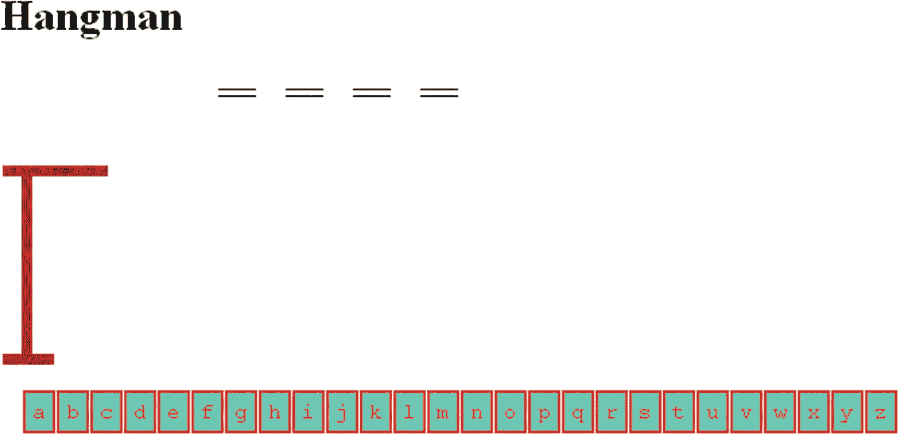

图 9-1

打开屏幕

使用小型单词库的一个好处是，我知道现在的单词是什么，即使我的编码使用随机过程来选择单词。这意味着我可以在没有压力的情况下开发游戏。我决定先选一个*一个*。如图 9-2 所示，这个字母没有出现在密语中，于是屏幕上画出一个椭圆形的头像，字母 *a* 的方块消失。

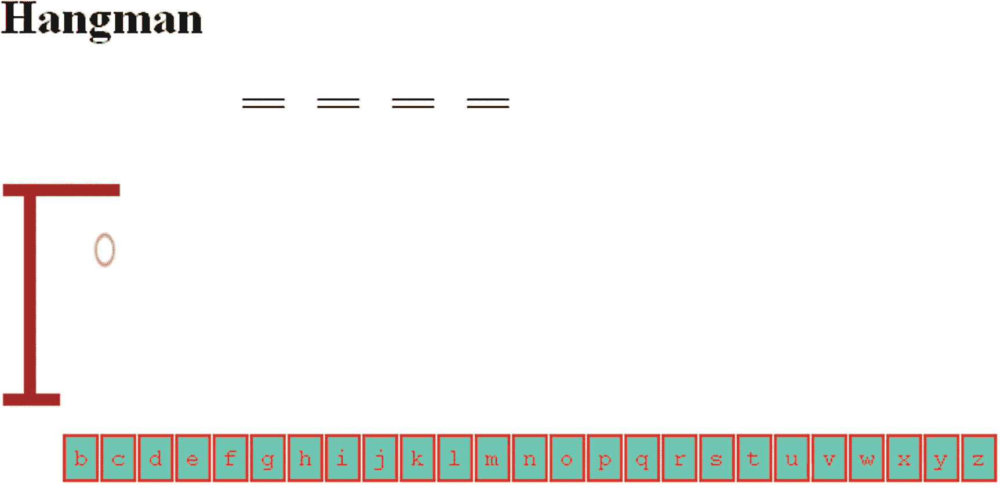

图 9-2

猜 a 后截图

通过元音，我猜出一个 *e* ，结果如图 9-3 所示。

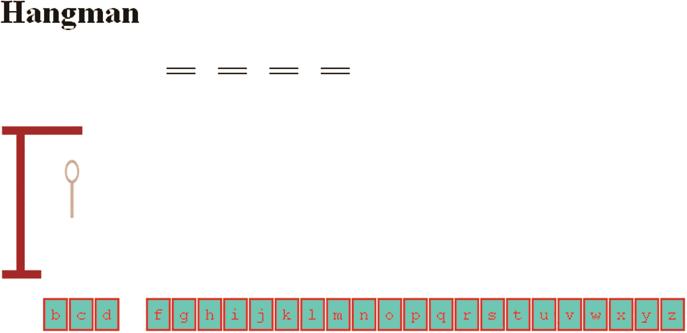

图 9-3

猜中一个 e 后的游戏

接下来，我猜中了一个 *i* ，导致我第三步走错，如图 9-4 。

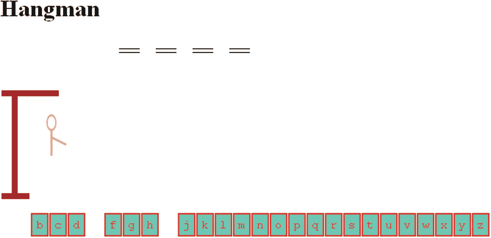

图 9-4

三次错误选择后的游戏画面

现在，我猜测一个 *o* ，这被证明是正确的(因为我有内部消息，所以我知道)，一个 o 出现在单词的第三个字母，如图 9-5 所示。

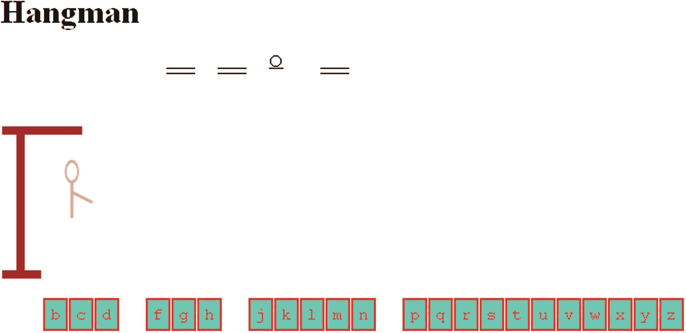

图 9-5

对 *o* 的正确猜测

我尝试下一个元音， *u* ，这也是正确的，如图 9-6 所示。

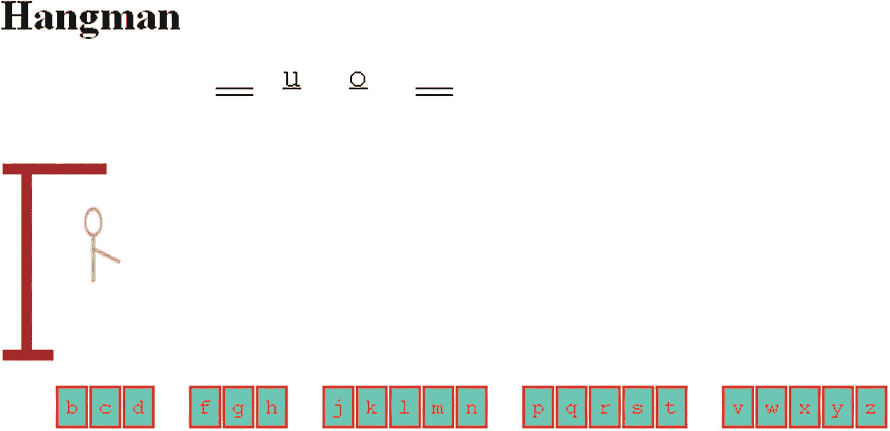

图 9-6

已经确认了两封信

我现在再做一些猜测，首先是一个 *t* ，如图 9-7 。

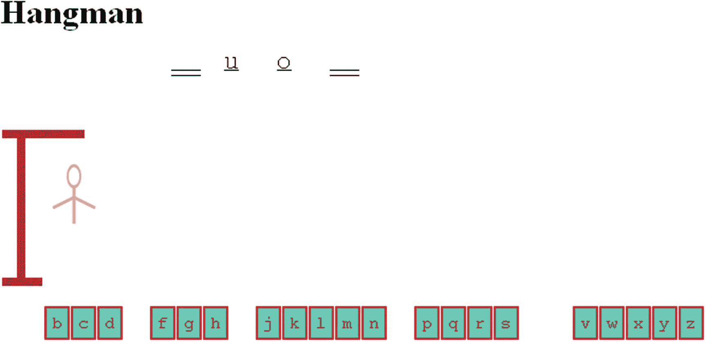

图 9-7

t 又猜错了

然后，我又猜错了，这次是一个 *s* ，如图 9-8 。

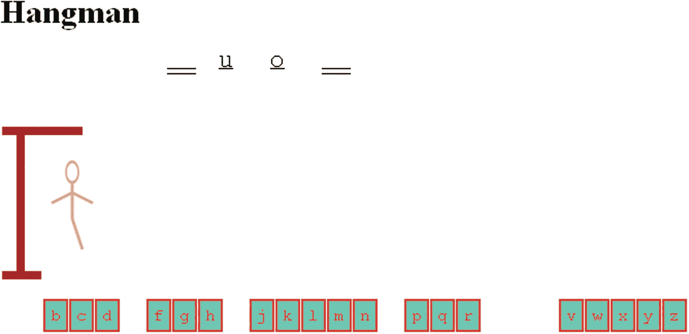

图 9-8

在对 s 的错误猜测之后

图 9-9 显示了另一个错误的猜测。

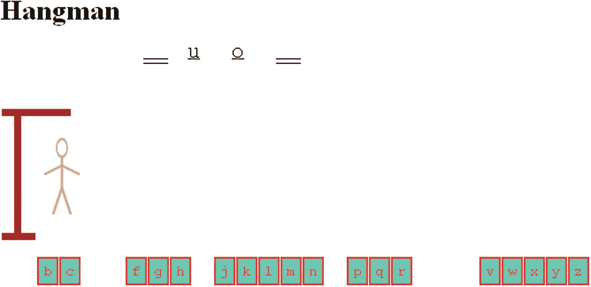

图 9-9

在对 d 的错误猜测之后

我决定做一个正确的猜测，即 *m* 。图 9-10 显示了三个识别出的字母和画在屏幕上的人的大部分。

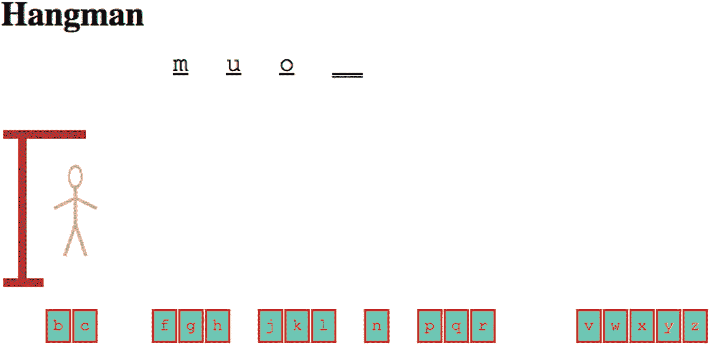

图 9-10

在对 m 的正确猜测之后

在这一点上，我正在努力失去，所以我猜测 *b* 。这导致了图 9-11 中所示的结果。

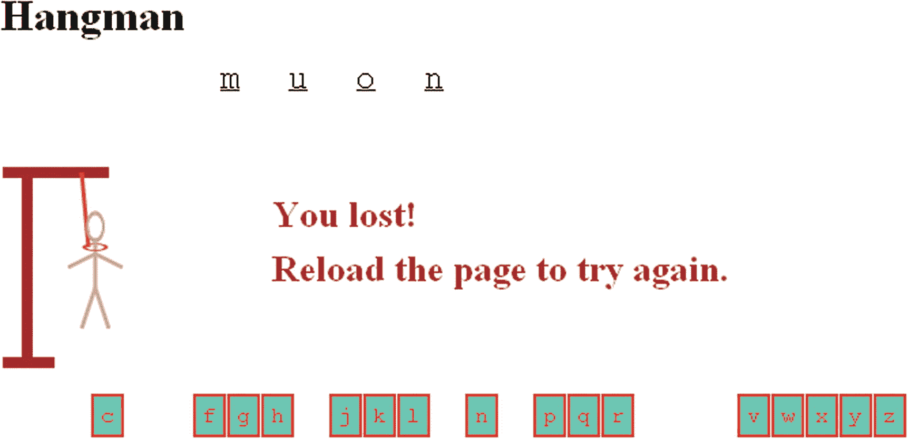

图 9-11

智乐

请注意，该图显示了一个套索；完整的秘密单词被揭示；并出现一条消息，告诉玩家游戏失败，并重新加载再试一次。

图 9-12 显示了另一个游戏的截图，计算机已经通过在两个位置显示字母 *e* 的猜测做出了响应。处理在一个单词中出现不止一次的字母并不困难，但是在我开始编程之前，这一点对我来说并不明显。

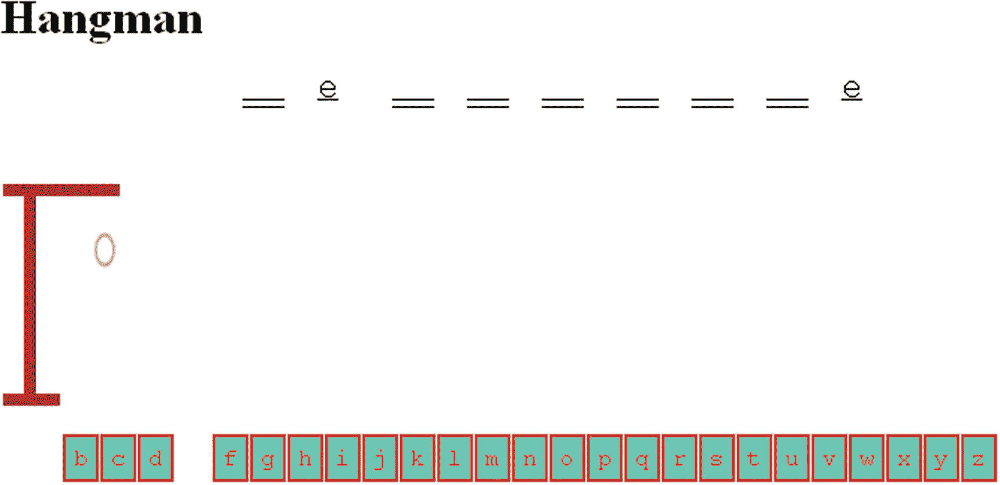

图 9-12

在这个游戏中，e 出现在两个地方

我做了一些其他的猜测，最终得到了这个单词的正确答案。同样，从中做出选择的列表不是很长，所以我可以从字母的数量中猜出单词。图 9-13 显示了一个获胜游戏的截图。注意在密语中有两个*e’*和三个*f’*s。

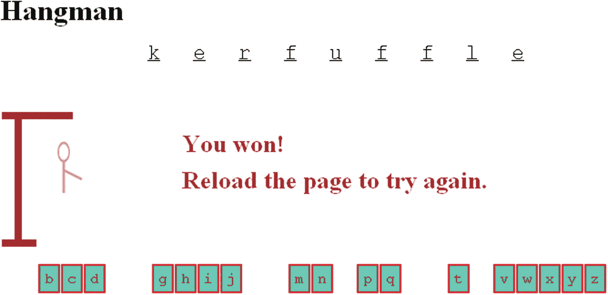

图 9-13

赢得比赛

编程技术和语言特性包括操作字符串；使用保存英语字母表的字母的数组；创建标记元素来保存表示秘密单词的字母表和空格，该秘密单词可以由字母替换，也可以不由字母替换；为创建的字母块处理事件；设置一组绘制悬挂步骤的函数；并将函数名放在一个数组中。这个实现还演示了如何使用外部脚本文件来保存单词列表。这个游戏在游戏中有回合，不像石头剪子布，所以程序必须在内部管理游戏状态，并在屏幕上显示出来。

## 关键要求

和前一章一样，这个游戏的实现使用了前几章演示的许多 HTML5 和 JavaScript 结构，但是它们在这里以不同的方式组合在一起。编程类似于写作。在编程中，你把各种构造放在一起，就像你写由你知道的单词组成的句子，然后把这些放入段落，等等。在阅读本章的时候，回想一下你已经学过的在画布上画直线、弧线和文字的知识；创建新的 HTML 标记；为屏幕上的标记设置鼠标单击事件；并使用`if`和`for`语句。

要实现 Hangman，我们需要访问单词列表。创建和测试程序不需要一个很长的列表，以后可以替换它。我决定把单词列表从程序中分离出来作为一个要求。我的单词表保存在文件`words1.js`中，完整显示如下:

```js
var words = [
     "muon", "blight","kerfuffle","qat"
      ];

```

玩家移动的用户界面可能以几种方式中的一种表现出来，例如，表单中的输入字段。然而，我认为更好的方法是让界面包含代表字母表字母的图形。有必要让每个图形充当一个可点击的按钮*和*提供了一种方法，使每个字母在被选中后消失。

这个游戏的纸笔版本包括一系列的图画，最终形成一个脖子上套着套索的简笔画。电脑游戏必须显示相同的图纸进展。这些图画可以是简单的线条和椭圆。

密码必须显示在屏幕上，开始时全部为空白，然后填入任何正确识别的字母。我选择使用双线作为空白，因为我希望识别的字母加下划线。另一种可能是问号。

最后，程序必须监控游戏的进程，并正确判断玩家何时输了，何时赢了。游戏状态对玩家来说是可见的，但是程序必须设置和检查内部变量来决定游戏是赢还是输。

## HTML5、CSS、JavaScript 特性

现在让我们看看 HTML5、CSS 和 JavaScript 的具体特性，它们提供了我们实现 Hangman 所需的东西。除了基本的 HTML 标签以及函数和变量的工作方式，这里的解释是完整的。然而，这一章的大部分内容重复了前几章给出的解释。和以前一样，您可以选择查看“构建应用程序”一节中的所有代码，如果您需要特定特性的解释，可以返回到这一节。

### 将单词列表存储为外部脚本文件中定义的数组

Hangman 游戏需要访问一个法律单词列表，这个列表可以称为单词库。可以肯定地说，一种方法是使用数组。我们将在这个初始示例中使用的短数组如下:

```js
var words = [
    "muon", "blight","kerfuffle","qat"
     ];

```

请注意，这些单词的长度都不同。这意味着我们可以使用最终版本所需的随机处理代码，并且在测试时仍然知道选择了哪个单词。我们将确保代码使用`words.length`,这样当你替换一个更大的数组时，编码仍然有效。

现在的问题是，如果我们想要引入不同的单词列表，如何使用不同的数组来实现这个目的。当然，更改 HTML 文档是可能的。但是，在 HTML5(或以前版本的 HTML)中，可以包含对外部脚本文件的引用，以代替 HTML 文档中的脚本元素，或者作为其补充。我们可以将声明和定义变量单词的三行代码放在一个名为`words1.js`的文件中。我们可以使用以下代码行将该文件包含在文档的其余部分中:

```js
<script src="words1.js" defer></script>

```

当浏览器继续处理基本 HTML 文档的其余部分时,`defer`方法将加载该文件。如果外部文件包含`body`的一部分，我们不能同时加载这两个文件，但是在这种情况下它可以工作。

我在为我的课程准备的程序版本中加入了一个更长的列表。这是中学的官方拼字比赛名单。我确实需要在 Excel 中做一些操作来生成 JavaScript。增强程序可以包括多个文件，这些文件带有供玩家从不同级别或语言中选择的代码。

### 生成并定位 HTML 标记，然后将标记更改为按钮，然后禁用按钮

字母按钮和密码破折号的创建是结合 JavaScript 和 CSS 完成的。

我们将编写代码为程序的两个部分创建 HTML 标记:字母图标和秘密单词的空白。(你可以去第六章中的问答游戏了解更多关于创建 HTML 标记的内容。)在每种情况下，HTML 标记都是使用以下内置方法创建的:

*   `document.createElement(x)`:为新元素类型`x`创建 HTML 标记

*   `document.body.appendChild (d)`:添加`d`元素作为`body`元素的另一个子元素

*   `document.getElementById(id)`:提取 ID 为`id`值的元素

创建的 HTML 包含每个元素的唯一 ID。该代码涉及设置某些属性:

*   `d.innerHTML`被设置为保存 HTML

*   `thingelem.style.top`设置为保持垂直位置

*   `thingelem.style.left`设置为保持水平位置

有了这个背景，下面是设置字母按钮的代码。我们首先声明一个全局变量`alphabet:`

```js
var alphabet = "abcdefghijklmnopqrstuvwxyz";

```

`setupgame`函数的代码用于制作字母按钮:

```js
var i;
   var x;
   var y;
   var uniqueid;
   var an = alphabet.length;
   for(i=0;i<an;i++) {

      uniqueid = "a"+String(i);
      d = document.createElement('alphabet');
       d.innerHTML = (
         "<div class="letters" id='"+uniqueid+"'>"+alphabet[i]+"</div>");
      document.body.appendChild(d);
      thingelem = document.getElementById(uniqueid);
      x = alphabetx + alphabetwidth*i;
      y = alphabety;
      thingelem.style.top = String(y)+"px";
      thingelem.style.left = String(x)+"px";
      thingelem.addEventListener('click',pickelement,false);
   }

```

变量`i`用于迭代字母表字符串。唯一 ID 是与索引值连接的`a`，索引值从 0 到 25。插入到创建的元素中的 HTML 是一个带有包含字母的文本的`div`。字符串用双引号括起来，该字符串内的属性用单引号括起来。元素分布在屏幕上，从位置`alphabetx`、`alphabety`(每个全局变量都在文档中声明过)开始，水平递增`alphabetwidth`。对于像素，`top`和`left`属性需要设置为字符串并以`"px"`结束。最后一步是设置事件处理，让这些元素充当按钮。

密语元素的创建是类似的。区别在于，每个元素都有两个下划线作为其文本内容。在屏幕上，这两条下划线看起来像一条长下划线。分配给`ch`(用于选择)是我们的程序如何选择密语。注意，长度是数据类型`String`的对象以及数组的属性。在这种情况下，我对单词列表使用长度。如果我的列表超过四个元素，这段代码仍然可以工作。

```js
var ch = Math.floor(Math.random()* words.length);
   secret = words[ch];
   for (i=0;i<secret.length;i++) {
      uniqueid = "s"+String(i);
      d = document.createElement('secret');
          d.innerHTML = (
            "<div class="blanks" id='"+uniqueid+"'> __ </div>");
      document.body.appendChild(d);
      thingelem = document.getElementById(uniqueid);
      x = secretx + secretwidth*i;
      y = secrety;
      thingelem.style.top = String(y)+"px";
      thingelem.style.left = String(x)+"px";
   }

```

在这一点上，你可能会问，字母图标是如何变成有边框的方块中的字母的？答案是我用了 CSS。CSS 的用处远远超出了字体和颜色。这些风格提供了游戏关键部分的外观和感觉。请注意，字母表`div`元素的类设置为`'letters'`，秘密单词字母`div`元素的设置为`'blanks'`。样式部分包含以下两种样式，为了便于阅读，我对它们进行了分组。换行符对浏览器没有意义。

```js
<style>
.letters {
  position:absolute;
  left: 0px; top: 0px;
  border: 2px; border-style: double;
  margin: 5px; padding: 5px;
  font-size: 24px;
  color:#F00; background-color:#0FC;
  font-family:"Courier New", Courier, monospace;
}
.blanks {
  position:absolute;
  left: 0px; top: 0px;
  border:none; margin: 5px; padding: 5px;
  color:#006; background-color:white;
  font-family:"Courier New", Courier, monospace;
  text-decoration:underline;
  color: black; font-size:24px;
}
</style>

```

后跟名称的点表示该样式适用于该类的所有元素。这与仅仅是一个名称形成对比，比如上一章中的`form`，其中一个样式被应用于所有的表单元素，或者一个`#`后跟一个名称，该名称引用文档中具有该名称 ID 的一个元素。请注意，字母的样式包括边框、颜色和背景色。指定字体系列是为任务选择您最喜欢的字体，然后在该字体不可用时指定备份的一种方式。CSS 的这个特性为设计者提供了广阔的空间。我在这里的选择是`"Courier New"`，第二个选择是`Courier`，第三个选择是任何可用的等宽字体(在*等宽字体*中，所有的字母都是一样宽的)。我决定使用等宽字体，以便在屏幕上制作大小和空间都相同的图标。`margin`属性设置为边框外的间距，`padding`是指文本和边框之间的间距。

我们希望代表字母表中字母的按钮在被点击后消失。`pickelement`函数中的代码可以使用术语`this`来指代被点击的对象。这两条语句(可以压缩成一条)通过设置`display`属性实现了这一点:

```js
var id = this.id;
document.getElementById(id).style.display = "none";

```

当游戏结束时，无论是赢还是输，我们通过迭代所有元素来删除所有字母的点击事件处理:

```js
for (j=0;j<alphabet.length;j++) {
    uniqueid = "a"+String(j);
    thingelem = document.getElementById(uniqueid);
    thingelem.removeEventListener('click',pickelement,false);
}

```

`removeEventListener`事件做的和它听起来的一样:它移除了事件处理。

### 在画布上创建渐进式绘图

在到目前为止的章节中，你已经了解了绘制矩形、文本、图像和路径。路径由直线和圆弧组成。对于 Hangman 来说，图纸都是路径。对于这个应用程序，代码已经将变量`ctx`设置为指向画布的 2D 上下文。绘制路径包括通过将`ctx.lineWidth`设置为一个数值和将`ctx.strokeStyle`设置为一种颜色来设置线宽。我们将在绘图的不同部分使用不同的线条宽度和颜色。

代码中的下一行是`ctx.beginPath();`，接下来是一系列绘制线条或弧线或移动虚拟笔的操作。方法`ctx.moveTo`在不绘图的情况下移动笔，而`ctx.lineTo`指定从当前笔位置到指示点绘制一条线。请记住，在调用`stroke`方法之前，不会绘制任何内容。每当调用`stroke`或`fill`方法时，`moveTo`、`lineTo`和`arc`命令设置绘制的路径。在我们的绘制函数中，下一步是调用`ctx.closePath;`，最后一步是调用`ctx.stroke();`来进行实际的绘制。例如，绞刑架是由以下函数绘制的:

```js
function drawgallows() {
   ctx.lineWidth = 8;
   ctx.strokeStyle = gallowscolor;
   ctx.beginPath();
   ctx.moveTo(2,180);
   ctx.lineTo(40,180);
   ctx.moveTo(20,180);
   ctx.lineTo(20,40);
   ctx.moveTo(2,40);
   ctx.lineTo(80,40);
   ctx.closePath();
   ctx.stroke();

}

```

头部和套索需要椭圆形。椭圆将基于圆，所以首先我将回顾如何画一个圆。你也可以回到第二章的。使用带有以下参数的`ctx.arc`命令绘制圆弧:圆心坐标、半径长度、以弧度表示的起始角度、结束角度，以及逆时针的`true`或顺时针的`false`。这只对不是完整圆的圆弧有意义，但是当你需要画这样的圆弧时，你需要记住这一点。

*弧度*是一个完整圆的固有测量值`Math.PI*2`。(人们熟悉的 360 度圆系统是很久以前人们发明的，并且是任意的。)从角度到弧度的转换是除以`Math.PI`再乘以`180`，但是在这个例子中并不需要，因为我们正在画完整的圆弧。

然而，我们想画一个椭圆形来代替圆形的头部(以及后来的套索的一部分)。解决方法是用`ctx.scale`改变坐标系。在第四章中，我们改变了坐标系来旋转代表大炮的矩形。在这里，我们操纵坐标系来压缩一个维度，使一个圆变成一个椭圆。我们的代码首先使用`ctx.save()`保存当前坐标系。然后，对于头部，它使用`ctx.scale(.6,1);`将 x 轴缩短到其当前值的 60 %,并保持 y 轴不变。使用绘制圆弧的代码，然后使用`ctx.restore();`恢复原来的坐标系。绘制头部的功能如下:

```js
function drawhead() {
   ctx.lineWidth = 3;
   ctx.strokeStyle = facecolor;
   ctx.save();  //before scaling of circle to be oval
   ctx.scale(.6,1);
   ctx.beginPath();
   ctx.arc (bodycenterx/.6,80,10,0,Math.PI*2,false);
   ctx.closePath();
   ctx.stroke();
   ctx.restore();
}

```

`drawnoose`函数使用相同的技术，除了对于套索，椭圆是宽的而不是窄的；也就是垂直的被挤压，而不是水平的。

绘图过程中的每一步都由一个函数表示，如`drawhead`和`drawbody`。我们将所有这些列在一个名为`steps`的数组中:

```js
var steps = [
      drawgallows,
      drawhead,
      drawbody,
      drawrightarm,
      drawleftarm,
      drawrightleg,
      drawleftleg,
      drawnoose
      ];

```

一个变量`cur`，跟踪当前步骤，当代码确认条件`cur`等于`steps`的长度时，游戏结束。

在做了这些实验后，我决定我需要在套索上画一个头和一个脖子。这是通过调用`drawnoose`函数中的`drawhead`和`drawneck`来完成的。顺序很重要。

使用绘图功能作为模型来制作您自己的绘图。一定要改变这些单独的功能。您也可以添加或删除功能。这意味着你将改变游戏进程中的步数，也就是说，玩家在输掉游戏前可以猜错的次数。

### 小费

如果你还没有这样做(或者即使你已经这样做了)，尝试绘画。创建一个单独的文件，只是为了绘制悬挂的步骤。尝试线条和弧线。您也可以包含图像。

### 维持游戏状态并确定输赢

编码和维护应用程序状态的需求是编程中的常见需求。在第二章中，我们的程序记录下一步是第一次掷骰子还是后续掷骰子。刽子手游戏的状态包括隐藏单词的身份，单词中的哪些字母被正确猜中，字母表中的哪些字母被尝试过，以及绞刑的进行状态。

当玩家点击一个字母块时调用的`pickelement`函数是关键动作发生的地方，它执行以下任务:

*   检查保存在变量`picked`中的玩家的猜测是否与保存在变量`secret`中的秘密单词中的任何字母相匹配。对于每个`match`，空白元素中的相应字母通过将`textContent`设置为该字母来显示。

*   使用变量`lettersguessed`记录已经猜出了多少个字母。

*   通过比较`lettersguessed`和`secret.length`来检查游戏是否已经获胜。如果游戏获胜，删除字母按钮的事件处理并显示适当的消息。

*   如果选择的字母与密语中的任何字母都不匹配(如果变量`not`仍然是`true`，则使用变量`cur`作为数组变量`steps`的索引来推进悬挂。

*   通过比较`cur`和`steps.length`来检查游戏是否已经输了。如果两个值相等，则显示所有字母，移除事件处理，并显示适当的消息。

*   无论是否匹配，通过将`display`属性设置为`none`使点击的字母按钮消失。

这些任务是使用`if`和`for`语句执行的。在确定字母被正确猜中之后，检查游戏是否已经获胜。类似地，只有当确定字母*没有*被正确识别并且悬挂已经进行时，才检查游戏是否已经失败。游戏的状态在代码中由`secret`、`lettersguessed`和`cur`变量表示。玩家看到秘密单词的下划线和填充字母以及剩余的字母块。

带有逐行注释的整个 HTML 文档的代码在“构建应用程序”一节中。下一部分描述了处理玩家猜测的首要任务。要记住的一个通用策略是，通过为数组的每个成员做一些事情来完成几个任务，即使这对数组的某些元素来说可能是不必要的。例如，当任务是揭示秘密单词中的所有字母时，所有字母的`textContent`都被改变，即使它们中的一些已经被揭示。类似地，变量`not`可以多次设置为`false`。

### 通过设置文本内容检查猜测并显示秘密单词中的字母

玩家通过点击一个字母来移动。`pickelement`函数被设置为每个字母图标的事件处理程序。因此，在函数中，我们可以使用术语`this`来指代接收(监听和听到)点击事件的对象。因此，表达式`this.textContent`将包含选中的字母。因此，声明

```js
var picked = this.textContent;

```

将玩家正在猜测的字母表中的特定字母赋给局部变量`picked`。然后，代码遍历保存在变量`secret`中的秘密单词中的所有字母，并将每个字母与玩家的猜测进行比较。以双下划线开始的创建的标记对应于秘密单词中的字母，因此当有正确的猜测时，对应的元素将被改变；也就是它的`textContent`会被设置为玩家猜出来的字母，保存在`picked`:

```js
for (i=0;i<secret.length;i++) {
      if (picked==secret[i]) {
         id = "s"+String(i);
         document.getElementById(id).textContent = picked;
                    not = false;
                    lettersguessed++;
                     ...

```

当猜测正确时，迭代不会停止；它继续前进。这意味着任何一个字母的所有实例都将被发现和揭示。每当有匹配时，变量`not`被设置为`false`。如果同一个字母有两个或更多的实例，这个变量会被设置多次，这不是问题。我加入了单词 *kerfuffle* 以确保重复的字母被正确处理(除了我喜欢这个单词的事实之外)。您可以在下一节检查所有代码。

## 构建应用程序并使之成为您自己的应用程序

Hangman 应用程序利用 CSS 样式、JavaScript 创建的 HTML 标记和 JavaScript 编码。有两个初始化和设置函数(`init`和`setupgame`)和一个完成大部分工作的函数(`pickelement`)，外加八个绘制悬挂步骤的函数。表 9-1 中描述了这些功能。

表 9-1

由调用调用的函数

<colgroup><col class="tcol1 align-left"> <col class="tcol2 align-left"> <col class="tcol3 align-left"></colgroup> 
| 

功能

 | 

调用/调用者

 | 

打电话

 |
| --- | --- | --- |
| `init` | 由`<body>`标签中的`onLoad`动作调用 | `setupgame` |
| `setupgame` | `init` | 第一个绘图功能，即`drawgallows` |
| `pickelement` | 由`setupgame`中`addEventListener`调用的动作调用 | 通过调用`steps[cur]()`的绘图功能之一 |
| `drawgallows` | `pickelement`中`steps[cur]()`的调用 |   |
| `drawhead` | `pickelement`、`drawnoose`中`steps[cur]()`的调用 |   |
| `drawbody` | `pickelement`中`steps[cur]()`的调用 |   |
| `drawrightarm` | `pickelement`中`steps[cur]()`的调用 |   |
| `drawleftarm` | `pickelement`中`steps[cur]()`的调用 |   |
| `drawrightleg` | `pickelement`中`steps[cur]()`的调用 |   |
| `drawleftleg` | `pickelement`中`steps[cur]()`的调用 |   |
| `drawnoose` | `pickelement`中`steps[cur]()`的调用 | `drawhead`，`drawneck` |
| `drawneck` | `drawnoose` |   |

注意大多数函数调用的间接模式。如果您决定改变悬挂进度，这种模式提供了相当大的灵活性。另请注意，您可以删除

```js
steps[cur]();
       cur++;

```

在`setupgame`函数中，如果你想让玩家从一张白纸开始，而不是从绞刑架的木梁开始。

Hangman 的完整实现如表 9-2 所示。

表 9-2

刽子手的完整实现

<colgroup><col class="tcol1 align-left"> <col class="tcol2 align-left"></colgroup> 
| 

密码

 | 

说明

 |
| --- | --- |
| `<html>` | 开始`html`标签。 |
| `<head>` | 开始`head`标签。 |
| `<title>Hangman</title>` | 完成`title`元素。 |
| `<style>` | 打开`style`元素。 |
| `.letters {position:absolute;left: 0px`；`top: 0px; border: 2px; border-style: double;``margin: 5px; padding: 5px; color:#F00;``background-color:#0FC; font-family:``"Courier New", Courier, monospace;` | 用指定的类字母指定任何元素的样式，包括边框、颜色和字体。 |
| `}` | 结束样式指令。 |
| `.blanks {position:absolute;left: 0px;``top: 0px; border:none; margin: 5px;``padding: 5px; color:#006; background-color:``white; font-family:"Courier New", Courier,``monospace; text-decoration:underline; color: black;` | 用指定的空白类指定任何元素的样式，包括边框、间距、颜色和字体，并加上下划线。 |
| `}` | 结束样式指令。 |
| `</style>` | 关闭`style`元素。 |
| `<script src="words1.js" defer></script>` | 要求包含保存在名为`words1.js`的外部文件中的单词列表的元素，带有与该文档的其余部分同时加载该文件的指令。 |
| `<script >` | `script`元素的开始标签。 |
| `var ctx;` | 用于所有绘图的变量。 |
| `var thingelem;` | 用于已创建元素的变量。 |
| `var alphabet = "abcdefghijklmnopqrstuvwxyz";` | 定义用于字母按钮的字母表的字母。 |
| `var alphabety = 300;` | 所有字母按钮的垂直位置。 |
| `var alphabetx = 20;` | 开始字母水平位置。 |
| `var alphabetwidth = 25;` | 为字母元素分配的宽度。 |
| `var secret;` | 将持有秘密的话。 |
| `var lettersguessed = 0;` | 对猜测的字母进行计数。 |
| `var secretx = 160;` | 机密字的水平起始位置。 |
| `var secrety = 50;` | 机密字的垂直位置。 |
| `var secretwidth = 50;` | 显示密码时分配给每个字母的宽度。 |
| `var gallowscolor = "brown";` | 绞刑架的颜色。 |
| `var facecolor = "tan";` | 脸的颜色。 |
| `var bodycolor = "tan";` | 身体的颜色。 |
| `var noosecolor = "#F60";` | 套索的颜色。 |
| `var bodycenterx = 70;` | 身体的水平位置。 |
| `var steps = [` | 保存构成向悬挂前进的绘图序列的功能。 |
| `drawgallows,` | 拉上绞架。 |
| `drawhead,` | 绘制头部。 |
| `drawbody,` | 绘制身体。 |
| `drawrightarm,` | 画右臂。 |
| `drawleftarm,` | 绘制左臂。 |
| `drawrightleg,` | 画右腿。 |
| `drawleftleg,` | 画左腿。 |
| `drawnoose` | 拉上套索。 |
| `];` | 结束数组步骤。 |
| `var cur = 0;` | 逐步指向下一个图形。 |
| `function drawgallows() {` | 绘制绞刑架的函数的头。 |
| `ctx.lineWidth = 8;` | 设置线条宽度。 |
| `ctx.strokeStyle = gallowscolor;` | 设置颜色。 |
| `ctx.beginPath();` | 开始定义路径。 |
| `ctx.moveTo(2,180);` | 移动到第一个位置。 |
| `ctx.lineTo(40,180);` | 画一条线。 |
| `ctx.moveTo(20,180);` | 移动到下一个位置。 |
| `ctx.lineTo(20,40);` | 画一条线。 |
| `ctx.moveTo(2,40);` | 移动到下一个位置。 |
| `ctx.lineTo(80,40);` | 划清界限。 |
| `ctx.closePath();` | 关闭路径。 |
| `ctx.stroke();` | 实际上画出了路径。 |
| `}` | 关闭该功能。 |
| `function drawhead() {` | 绘制受害者头部的函数的头。 |
| `ctx.lineWidth = 3;` | 设置线条宽度。 |
| `ctx.strokeStyle = facecolor;` | 设置颜色。 |
| `ctx.save();` | 保存坐标系的当前阶段。 |
| `ctx.scale(.6,1);` | 应用缩放，即挤压 x 轴。 |
| `ctx.beginPath();` | 开始一条路径。 |
| `ctx.arc (bodycenterx/.6,80,10,0,``Math.PI*2,false);` | 画弧线。请注意，x 坐标被修改为适用于缩放后的坐标系。完整的弧将是椭圆形的。 |
| `ctx.closePath();` | 关闭路径定义。 |
| `ctx.stroke();` | 进行实际的绘图。 |
| `ctx.restore();` | 恢复(回到)缩放前的坐标。 |
| `}` | 关闭该功能。 |
| `function drawbody() {` | 绘制主体的函数的标头，单行。 |
| `ctx.strokeStyle = bodycolor;` | 设置颜色。 |
| `ctx.beginPath();` | 开始路径。 |
| `ctx.moveTo(bodycenterx,90);` | 移动到位置(头部正下方)。 |
| `ctx.lineTo(bodycenterx,125);` | 划清界限。 |
| `ctx.closePath();` | 关闭路径定义。 |
| `ctx.stroke();` | 进行实际的绘图。 |
| `}` | 关闭该功能。 |
| `function drawrightarm() {` | 绘制右臂的函数的头。 |
| `ctx.beginPath();` | 开始路径。 |
| `ctx.moveTo(bodycenterx,100);` | 移动到位置。 |
| `ctx.lineTo(bodycenterx+20,110);` | 划清界限。 |
| `ctx.closePath();` | 关闭路径定义。 |
| `ctx.stroke();` | 进行实际的绘图。 |
| `}` | 关闭该功能。 |
| `function drawleftarm() {` | 绘制左臂的函数的头。 |
| `ctx.beginPath();` | 开始路径。 |
| `ctx.moveTo(bodycenterx,100);` | 移动到位置。 |
| `ctx.lineTo(bodycenterx-20,110);` | 划清界限。 |
| `ctx.closePath();` | 关闭路径定义。 |
| `ctx.stroke();` | 进行实际的绘图。 |
| `}` | 关闭该功能。 |
| `function drawrightleg() {` | 绘制右腿的函数的标头。 |
| `ctx.beginPath();` | 开始路径。 |
| `ctx.moveTo(bodycenterx,125);` | 移动到位置。 |
| `ctx.lineTo(bodycenterx+10,155);` | 划清界限。 |
| `ctx.closePath();` | 关闭路径定义。 |
| `ctx.stroke();` | 进行实际的绘图。 |
| `}` | 关闭该功能。 |
| `function drawleftleg() {` | 绘制左腿的函数的标头。 |
| `ctx.beginPath();` | 开始路径。 |
| `ctx.moveTo(bodycenterx,125);` | 移动到位置。 |
| `ctx.lineTo(bodycenterx-10,155);` | 划清界限。 |
| `ctx.closePath();` | 关闭路径定义。 |
| `ctx.stroke();` | 进行实际的绘图。 |
| `}` | 关闭该功能。 |
| `function drawnoose() {` | 绘制套索的函数的头。 |
| `ctx.strokeStyle = noosecolor;` | 设置颜色。 |
| `ctx.beginPath();` | 开始路径。 |
| `ctx.moveTo(bodycenterx-10,40);` | 移动到位置。 |
| `ctx.lineTo(bodycenterx-5,95);` | 划清界限。 |
| `ctx.closePath();` | 关闭路径定义。 |
| `ctx.stroke();` | 进行实际的绘图。 |
| `ctx.save();` | 保存坐标系。 |
| `ctx.scale(1,.3);` | 进行缩放，垂直挤压图像(在 y 轴上)。 |
| `ctx.beginPath();` | 开始一条路径。 |
| `ctx.arc(bodycenterx,95/.3,8,0,Math.``PI*2,false);` | 画一个圆(将变成椭圆形)。 |
| `ctx.closePath();` | 关闭路径定义。 |
| `ctx.stroke();` | 进行实际的绘图。 |
| `ctx.restore();` | 恢复保存的坐标系。 |
| `drawneck();` | 在套索顶部绘制颈部。 |
| `drawhead();` | 将头部画在套索上。 |
| `}` | 关闭该功能。 |
| `function drawneck() {` | 用于绘制颈部的函数的标题。 |
| `ctx.strokeStyle=bodycolor;` | 设置颜色。 |
| `ctx.beginPath();` | 开始路径。 |
| `ctx.moveTo(bodycenterx,90);` | 移动到位置。 |
| `ctx.lineTo(bodycenterx,95);` | 划清界限。 |
| `ctx.closePath();` | 关闭路径定义。 |
| `ctx.stroke();` | 进行实际的绘图。 |
| `}` | 关闭该功能。 |
| `function init(){` | 文档加载时调用的函数的头。 |
| `ctx = document.getElementById``('canvas').getContext('2d');` | 为画布上的所有绘图设置变量。 |
| `setupgame();` | 调用设置游戏的函数。 |
| `ctx.font="bold 20pt Ariel";` | 设置字体。 |
| `}` | 关闭该功能。 |
| `function setupgame() {` | 设置字母按钮和密码的函数的标题。 |
| `var i;` | 为迭代创建变量。 |
| `var x;` | 创建位置变量。 |
| `var y;` | 创建位置变量。 |
| `var uniqueid;` | 为每组已创建的 HTML 元素创建变量。 |
| `var an = alphabet.length;` | 将是 26 岁。 |
| `for(i=0;i<an;i++) {` | 迭代创建字母按钮。 |
| `uniqueid = "a"+String(i);` | 创建唯一标识符。 |
| `d = document.createElement('alphabet');` | 创建一个类型为`alphabet`的元素。 |
| `d.innerHTML = (` | 定义下一行中指定的内容。 |
| `"<div class="letters"``id='"+uniqueid+"'>"+alphabet[i]+"</div>");` | 指定一个具有唯一标识符和文本内容的类别字母`div`，它是字母表的第`i` *个*字母。 |
| `document.body.appendChild(d);` | 添加到正文。 |
| `thingelem = document.getElementById``(uniqueid);` | 获取具有 ID 的元素。 |
| `x = alphabetx + alphabetwidth*i;` | 计算其水平位置。 |
| `y = alphabety;` | 设置垂直位置。 |
| `thingelem.style.top = String(y)+"px";` | 使用样式`top`，设置垂直位置。 |
| `thingelem.style.left = String(x)+"px";` | 使用样式`left`，设置水平位置 |
| `thingelem.addEventListener('click',``pickelement,false);` | 为鼠标单击事件设置事件处理。 |
| `}` | 关闭`for`循环。 |
| `var ch = Math.floor(Math.random()*``words.length);` | 随机选择其中一个单词的索引。 |
| `secret = words[ch];` | 将全局变量`secret`设置为这个单词。 |
| `for (i=0;i<secret.length;i++) {` | 迭代秘密词的长度。 |
| `uniqueid = "s"+String(i);` | 为单词创建唯一的标识符。 |
| `d = document.createElement('secret');` | 为单词创建一个元素。 |
| `d.innerHTML = ("<div class="blanks" id='"``+uniqueid+"'> __ </div>");` | 将内容设置为空白类的一个`div`，其 ID 为刚刚创建的单词`uniqueid`。文本内容将是下划线。 |
| `document.body.appendChild(d);` | 将创建的元素作为主体的子元素追加。 |
| `thingelem = document.getElementById``(uniqueid);` | 获取创建的元素。 |
| `x = secretx + secretwidth*i;` | 计算元素的水平位置。 |
| `y = secrety;` | 设置其垂直位置。 |
| `thingelem.style.top = String(y)+"px";` | 使用样式`top`，设置垂直位置。 |
| `thingelem.style.left = String(x)+"px";` | 使用样式`left`，设置水平位置。 |
| `}` | 关闭`for`循环。 |
| `steps[cur]();` | 绘制步骤列表中的第一个函数，绞刑架。 |
| `cur++;` | 增量`cur`。 |
| `return false;` | 返回`false`来阻止 HTML 页面的任何刷新。 |
| `}` | 关闭该功能。 |
| `function pickelement(ev) {` | 作为单击结果调用的函数的标题。 |
| `var not = true;` | 将`not`设置为`true`，可以更改也可以不更改。 |
| `var picked = this.textContent;` | 从引用的对象中提取文本内容，即字母。 |
| `var i;` | 迭代。 |
| `var j;` | 迭代。 |
| `var uniqueid;` | 用于创建元素的唯一标识符。 |
| `var thingelem;` | 保存元素。 |
| `var out;` | 显示一条消息。 |
| `for (i=0;i<secret.length;i++) {` | 迭代秘密单词中的字母。 |
| `if (picked==secret[i]) {` | 说，“如果玩家猜对了信就等于这封秘密信……”。 |
| `id = "s"+String(i);` | 构造此字母的标识符。 |
| `document.getElementById(id).``textContent = picked;` | 将文本内容更改为字母。 |
| `not = false;` | 将`not`设置为`false`。 |
| `lettersguessed++;` | 增加正确识别的字母数。 |
| `if (lettersguessed==secret.length) {` | 他说，“如果整个秘密单词都被猜到了……”。 |
| `ctx.fillStyle=gallowscolor;` | 设置颜色，使用绞刑架的棕色，但可以是任何颜色。 |
| `out = "You won!";` | 设置消息。 |
| `ctx.fillText(out,200,80);` | 显示消息。 |
| `ctx.fillText("Re-load the page to``try again.",200,120);` | 显示另一条消息。 |
| `for (j=0;j<alphabet.length;j++) {` | 遍历整个字母表。 |
| `uniqueid = "a"+String(j);` | 构造标识符。 |
| `thingelem = document.getElementById``(uniqueid);` | 获取元素。 |
| `thingelem.removeEventListener('click',``pickelement,false);` | 移除事件处理。 |
| `}` | 关闭`j`进行循环迭代。 |
| `}` | 关闭`if (lettersguessed....)`，即测试全部完成。 |
| `}` | 关闭`if (picked==secret[i]) true`子句。 |
| `}` | 关闭秘密单词迭代中字母的`for`循环。 |
| `if (not) {` | 检查是否没有识别出字母。 |
| `steps[cur]();` | 进行挂起迭代的下一步。 |
| `cur++;` | 递增计数器。 |
| `if (cur>=steps.length) {` | 检查是否所有步骤都已完成。 |
| `for (i=0;i<secret.length;i++) {` | 开始对秘密单词中的字母进行新的迭代，以显示所有字母。 |
| `id = "s"+String(i);` | 构造标识符。 |
| `document.getElementById(id).textContent``= secret[i];` | 获取对元素的引用，并将其设置为机密字中的那个字母。 |
| `}` | 关闭迭代。 |
| `ctx.fillStyle=gallowscolor;` | 设置颜色。 |
| `out = "You lost!";` | 设置消息。 |
| `ctx.fillText(out,200,80);` | 显示消息。 |
| `ctx.fillText("Re-load the``page to try again.",200,120);` | 显示重新加载消息。 |
| `for (j=0;j<alphabet.length;j++) {` | 遍历字母表中的所有字母。 |
| `uniqueid = "a"+String(j);` | 构造唯一标识符。 |
| `thingelem = document.getElementById``(uniqueid);` | 获取元素。 |
| `thingelem.removeEventListener('click',``pickelement,false);` | 移除此元素的事件处理。 |
| `}` | 关闭`j`迭代。 |
| `}` | 关闭`cur`测试，以确定悬挂是否完成。 |
| `}` | 关闭`if (not)`测试(玩家的错误猜测)。 |
| `var id = this.id;` | 提取此元素的标识符。 |
| `document.getElementById(id).style.display``= "none";` | 让这个特殊的字母按钮消失。 |
| `}` | 关闭该功能。 |
| `</script>` | 关闭脚本。 |
| `</head>` | 关闭头部。 |
| `<body onLoad="init();">` | 建立对`init`调用的开始标签。 |
| `<h1>Hangman</h1>` | 用大写字母写游戏的名字。 |
| `<p>` | 段落的开始标记。 |
| `<canvas id="canvas" width="600" height="400">` | `canvas`元素的开始标记。包括维度。 |
| `Your browser doesn't support the HTML5``element canvas.` | 给使用不识别画布的浏览器的人的消息。 |
| `</canvas>` | `canvas`的结束标签。 |
| `</body>` | 关闭身体。 |
| `</html>` | 关闭文档。 |

Hangman 的一个变体是用俗语代替单词。在这个游戏的基础上创造一个对你来说是一个挑战。关键步骤是处理单词和标点符号之间的空白。你可能想立即显示单词和句号之间的空格、逗号和问号，给玩家这些提示。这意味着您需要确保`lettersguessed`从正确的计数开始。不要担心选择的字母与空格或标点符号进行比较。

另一种变化是改变字母表。我小心翼翼地把`26`的所有实例都换成了`alphabet.length`。您还需要更改输赢信息的语言。

游戏的一个合适的改进是制作一个新的单词按钮。要做到这一点，你需要将`setupgame`按钮的工作分成两个功能:一个功能创建新的字母图标和最长的秘密单词的位置。另一个确保所有的字母图标都是可见的，并为事件处理而设置，然后选择并设置秘密单词的空格，确保适当的数字是可见的。如果你这样做，你可能想显示一个分数和一些游戏。

继续教育的想法，假设你使用不寻常的词，你可能想包括定义。通过在画布上书写文字，可以在最后揭示定义。或者你可以制作一个按钮，点击它来显示定义，作为对玩家的提示。或者，您可以创建一个指向某个站点的链接，例如 Dictionary.com。

## 测试和上传应用程序

要测试这个应用程序，您可以下载我的单词表或创建自己的单词表。如果你自己创建一个，从一个准备为纯文本的短单词列表开始，命名为`words1.js`。测试时，不要总是用同样的模式猜测，比如按顺序选择元音。行为不端，游戏结束后还试图继续猜。当您对编码感到满意时，创建一个更长的单词列表，并将其保存在名称`words1.js`下。HTML 和`words1.js`文件都需要上传到你的服务器。

## 摘要

在本章中，您学习了如何使用 HTML5、JavaScript 和 CSS 的功能以及通用编程技术来实现一个熟悉的游戏，其中包括:

*   使用`scale`方法改变坐标系，通过前后保存和恢复来绘制一个椭圆形，而不是圆形

*   动态创建 HTML 标记

*   使用`addEventListener`和`removeEventListener`为单个元素设置和移除事件处理

*   使用样式从显示中移除元素

*   使用函数名数组建立绘图序列

*   操纵变量来维持游戏的状态，通过计算来确定是赢还是输

*   创建一个外部脚本文件来保存单词列表以增加灵活性

*   使用 CSS，包括选择字体的`font-family`、`color`和`display`

Hangman 游戏是演示编程概念的一个很有吸引力的例子，我在 press Publishers 的《编程 101:如何和为什么使用处理编程语言 ***、*** 进行编程》中使用了它。

本书的下一章也是最后一章描述了纸牌游戏 21 点的实现，也称为 21 点。它将建立在你所学的基础上，描述一些新的编程技术，HTML5 中添加的元素，以及更多的 CSS。