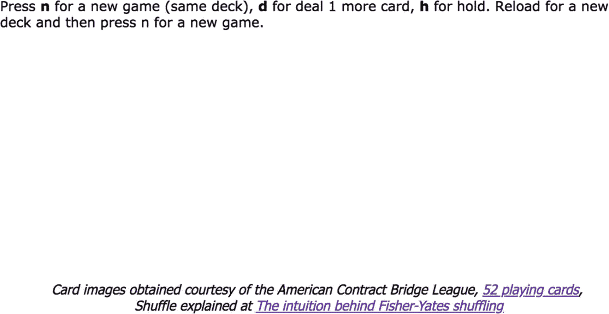
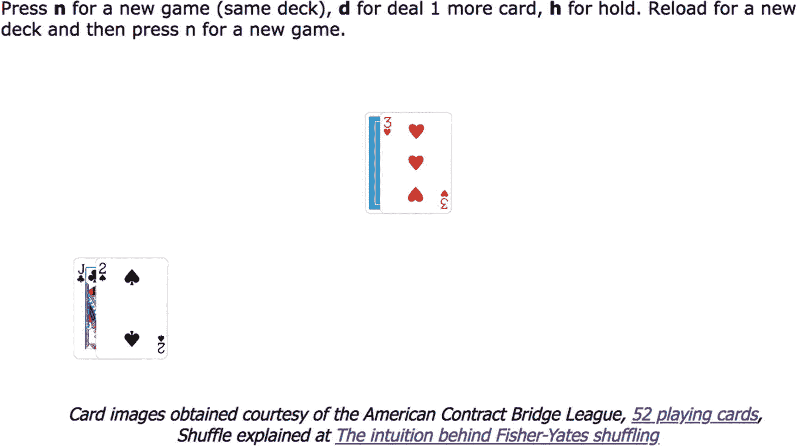
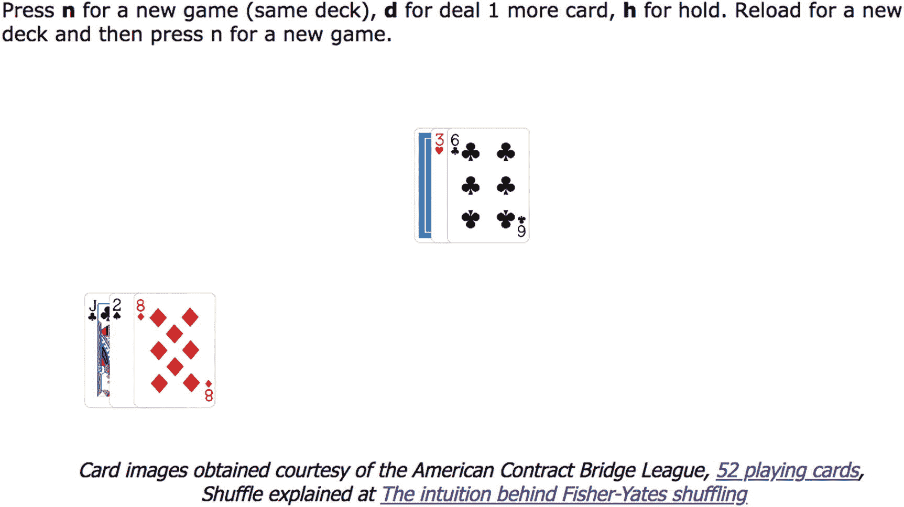
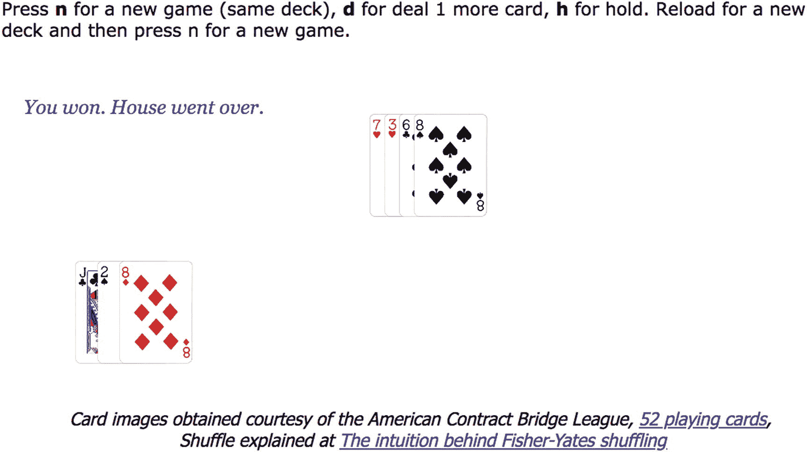
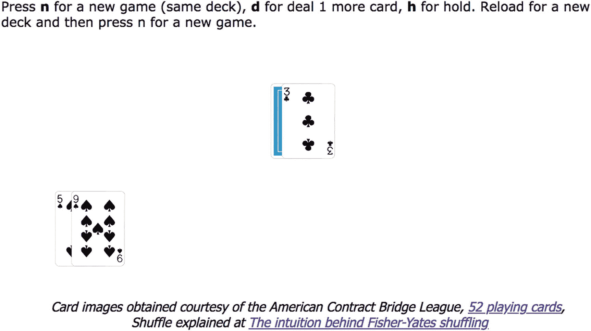
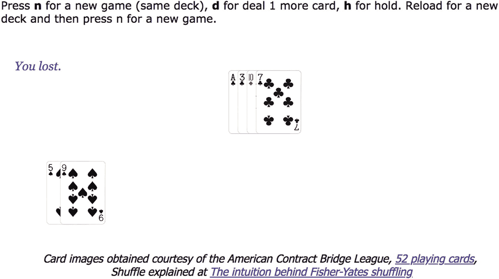
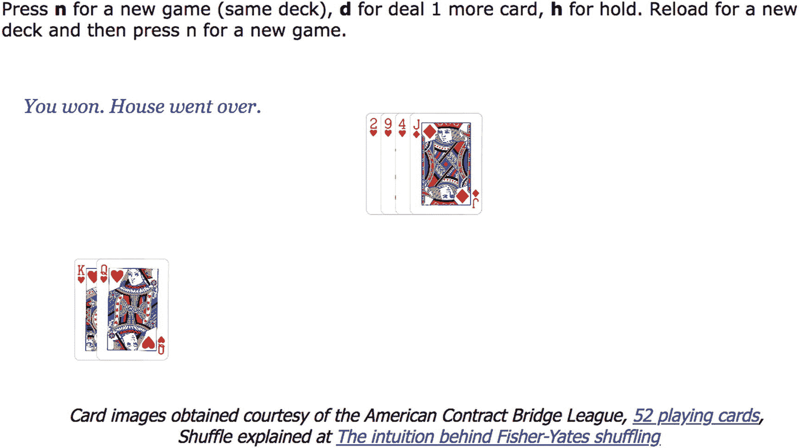
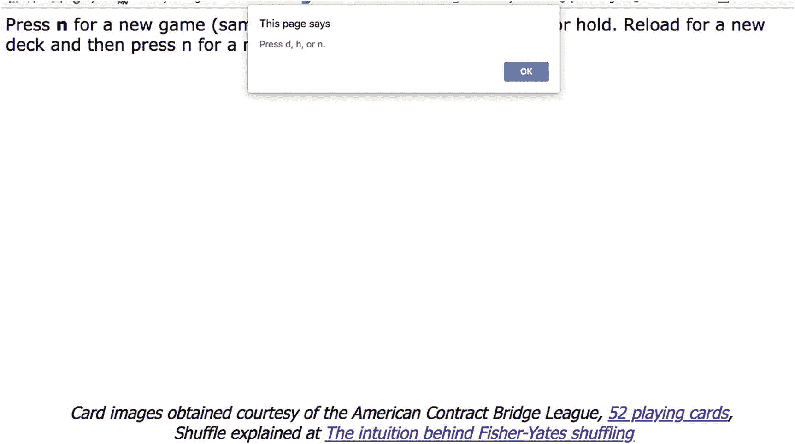

# 十、21 点

在本章中，我们将介绍

*   HTML5 的新标签`footer`和`header`

*   捕捉按键

*   程序员定义的对象

*   使用一组外部图像文件生成`Image`元素

*   洗牌

## 介绍

本章的目标是结合编程技术、HTML5 和 JavaScript 特性来实现纸牌游戏 21 点，也称为 21 点。实现将使用 HTML5 中引入的新标签，即`footer`和`header`。我们将使用页脚给予信用卡图像的来源和我们用于洗牌算法的网站。这些卡是使用程序员定义的对象和`Image`对象创建的，通过编码生成图像文件的名称。玩家使用按键来移动。

21 点的规则如下:

*玩家与庄家(也称为庄家)对弈。玩家和庄家* *每人发两张牌。庄家的第一张牌对玩家是隐藏的，但另一张是可见的。一张牌的价值是其有编号的牌的面值，10 代表一张 j、q 或 k，1 或 11 代表一张 a。一手牌的价值是牌的总和。该游戏的目标是在不超过*和*的情况下，让一手牌的值尽可能接近 21，以使其值大于其他人。因此，一张 a 和一张脸牌算作 21，一手赢牌。玩家可以采取的行动是要求另一张卡或持有* *。*

由于这是一个双人游戏，我们的玩家将与“计算机”对战，就像石头剪子布一样，我们的任务是生成计算机的动作。然而，我们受赌场惯例的指导—庄家将使用固定的策略。如果这手牌的价值低于 17，我们的庄家将要求另一张牌(赌场中的游戏策略可能稍微复杂一些，可能取决于 a 的存在)。类似地，如果玩家和豪斯的总数都在 21 以下，我们的游戏就会宣布平局；一些赌场可能有不同的做法。

开场截图如图 [10-1](#Fig1) 所示。



图 10-1

二十一点的开屏

用户按下 n 键后，下一个屏幕看起来会如图 [10-2](#Fig2) 所示。请记住，这是一个随机的过程，因此不保证每次都会出现相同的一组卡片。



图 10-2

发牌

图 [10-2](#Fig2) 显示了玩家看到的情况:除了庄家的一张硬牌之外，他或她所有的牌都是自己的。虚拟庄家不知道玩家的手牌。在这种情况下，玩家的手牌值为 2 加 10，总共为 12。庄家显示的是 3。玩家通过按 d 要求另一张牌。图 [10-3](#Fig3) 显示了结果。



图 10-3

有 20 分的玩家

玩家现在有一手值为 20 的牌，点击 h 停止游戏，看看庄家有什么牌。结果如图 [10-4](#Fig4) 所示。



图 10-4

玩家赢了 20 元，赌场赢了。

玩家赢了，因为房子倒了，而玩家没有。

玩家可以通过按 n 键或重新加载文档来开始新游戏。重新加载文档将意味着从一副完整的、刚刚洗过的牌开始。按 n 键继续当前的卡片组。任何想练习*算牌**的人，都应该选择按 n 键，这是一种记录牌中剩余牌并据此改变你玩法的方法。*

 *图 [10-5](#Fig5) 展示了一个新游戏。



图 10-5

新游戏

这次玩家按 h 保持，图 [10-6](#Fig6) 显示结果。



图 10-6

玩家输了

庄家拿着四张牌，总共 21 张。记住 ace 算 1 或 11。该玩家有 14 张牌，因此输了。

图 [10-7](#Fig7) 显示了另一场比赛的结果。最初给玩家的牌是两张共 20 张的正面牌。玩家按下 h 保持，庄家又打了两张牌走了过去。



图 10-7

玩家赢了

赌场中庄家的实际做法可能与此不同。这是一个研究的机会！玩家也可以通过查看房子而不暴露它来虚张声势。这可能会导致房子要求另一张卡，并去了。当且仅当玩家点击 h 键保持，从而停止抽牌时，游戏才决定。

您可能希望在按下非 d、h 或 n 键时向玩家提供反馈，如图 [10-8](#Fig8) 所示。



图 10-8

按错键时的反馈

## 关键要求

21 点游戏将使用前面游戏中描述的许多 HTML5、CSS 和 JavaScript 特性。

当开始实现时，我遇到的第一个问题是为卡片表面找到一个图像源。我知道我可以画自己的画，但我更喜欢比我能画出来的更精美的东西。

下一个挑战是如何用编程术语设计一张牌，以便我可以实现发牌，显示背面或正面。我还想研究如何洗牌。

另一个挑战是实现玩家玩游戏的方式。我选择使用按键:d 表示发牌，h 表示暂停，n 表示开始新游戏。当然，还有其他选择，例如，用文字或图形显示按钮，或者使用其他键，如箭头键。缺乏清晰、直观的界面使得有必要在屏幕上显示方向。

最后的挑战是维护游戏状态、可视显示和内部信息的一般挑战；生成计算机移动，并遵循规则。

## HTML5、CSS 和 JavaScript 特性

现在让我们看看 HTML5、CSS 和 JavaScript 的具体特性，它们提供了实现 21 点纸牌游戏所需的东西。除了基本的 HTML 标签和函数以及变量，这里的解释都是完整的。如果你已经阅读了其他章节，你会注意到这一章的大部分内容重复了前面给出的解释。请记住，您可以直接跳到“构建应用程序”一节来查看游戏的完整代码和注释，然后再回到这一节来获得更多的解释。

### 卡片正面的图像来源和设置图像对象

在制作第一版的时候，我确实找到了一个很好的 card faces 的来源，它附带了一个 Creative Commons 许可证，我很乐意展示链接和许可证，但是这个网站已经不存在了。我在美国合同桥牌联盟找到了另一个来源。这些数字文件被标记为免费，但我仍然请求并获得了许可，你可以从截图中看到我在网页上注明了数字文件的来源。

将文件复制到计算机后，您需要一种方法来访问 52 个卡面图像文件，而无需编写 52 个不同的语句。(注意卡背图像文件是异地访问的，即`init`函数。)这是可以实现的，因为文件名遵循一种模式。新卡片图像的模式与原来的略有不同，编码实际上更容易。`builddeck`功能如下:

```js
function builddeck() {
 var n;
            var si;
            var suitnames =["C","H","S","D"];
            var i;
            i=0;
            var picname;
            var nums=["A","2","3","4","5","6","7","8","9","10","J","Q","K"];
            for (si=0;si<4;si++) {
                for (n=0;n<13;n++) {
                    picname=nums[n]+suitnames[si]+".png";
                    deck[i]=new MCard(n+1,suitnames[si],picname);
                    i++;
                }
            }
   }
 }
}

```

注意嵌套的`for`循环。外环处理花色，内环处理花色中的 13 张牌。

在这个函数中，外环管理花色，内环管理每种花色中的牌。`picname`变量将被设置为我们从源文件下载的文件名。`MCard`函数是创建`MCard`对象的构造函数，即我们定义为程序员定义的对象类的对象。`n+1`会作为牌的数值，对于面牌会有一些调整。

### 注意

嵌套的 for 循环中的三个语句可以合并成`deck[i++]=new MCard(n+1,suitnames[si], suitnames[si]+"-"+nums[n]+".png");`。

这是因为`++`迭代运算符发生在为索引卡片组数组生成值之后。但是，我建议在这个学习示例中不要这样做！使用三个语句更容易编写和理解。

### 为卡片创建程序员定义的对象

正如我们在前面的章节中看到的，例如，弹弓游戏的第 4 章，JavaScript 为程序员提供了一种创建程序员定义的对象来将数据分组的方法；不同的数据片段被称为*属性*或*属性*，我们使用点符号来获得不同的属性。也可以通过定义*方法*将代码与数据关联起来，但是在这个例子中我们不需要这样做。提醒一下，设置新对象的函数称为*构造函数*函数。对于卡片，我将`MCard`定义为构造函数，这在前面的章节中已经在`builddeck`函数中使用过。该函数的定义如下:

```js
function MCard(n, s, picname){
   this.num = n;
   if (n>10) n = 10;
   this.value = n;
   this.suit = s;
   this.picture = new Image();
   this.picture.src = picname;
   this.dealt = 0;
 }

```

函数的行

```js
   if (n>10) n = 10;

```

将由牌面触发(杰克、皇后和国王)；记住，每个的值是 10。在这些情况下，该行将值更正为 10。

请注意，这条`if`语句在结构上不同于前面的`if`语句。有*而不是*任何左花括号和右花括号来分隔`if-true`子句。单语句子句是`if`语句的合法形式。我通常避免这种形式，因为如果我后来决定添加另一个语句，我将需要插入花括号。然而，我认为在这种情况下是可以的，在检查代码时，你会看到这两种变化。注意，当`n`等于 1 时，没有什么特别的事情发生。ace 的两个可能值的规则在程序的其他地方处理。

`MCard`对象的属性包括一个新创建的`Image`对象，它的`src`属性被设置为传入的`picname`。最后一个属性`dealt`，初始化为 0，将根据牌是给玩家还是给庄家而设置为 1 或 2。

### 开始游戏

对于我的游戏实现，玩家通过按 n 键选择用当前的牌组开始一个新游戏。如果玩家想要从一副新牌开始，玩家重新加载 HTML 文档。事实上，在赌场中，是庄家而不是玩家决定何时使用一副新牌。进行这种更改将是对实现的一个很好的补充。我还应该注意到，一些赌场使用多副牌来阻止一种叫做算牌的做法。我想到可以开发一个应用程序，为玩家提供一种练习算牌的方法。

另一个问题是关于玩家的行为。正如我所透露的，我倾向于假设玩家会表现得很好。如果一个玩家在游戏还没有开始的时候点击 d 表示再发一张牌或者 h 表示等待，应该怎么做？在这种涉及玩家非标准行为的情况下，我们作为应用程序构建者面临的选择包括:显示一条消息；试图猜测玩家想做什么，比如开始一个新游戏；或者什么都不做。我决定显示一条消息。为了跟踪游戏是否已经开始，我使用了一个全局变量`gamestart`，它被初始化为`false`。顺便说一下，这种变量的一个术语是*标志*。它存在于四个函数中(`deal`、`dealfromdeck`、`playerdone`和`newgame`)，您可以在代码表的上下文中检查它们。

### 发牌

函数`builddeck`构造了`MCard`对象的`deck`数组。玩家的手保持在名为`playerhand`的数组中，其中`pi`持有下一个位置的索引。类似地，庄家的手保持在名为`househand`的数组中，其中`hi`保存下一个位置的索引。`playerhand[pi].picture`是一个例子，显示了当对象是数组的元素时，引用`MCard`对象的属性的语法(标点符号)。

`dealstart`函数的任务是分发前四张牌:两张给玩家，两张给庄家。庄家的一张牌没有显示出来；也就是说，显示卡片的背面。当玩家请求一张新卡时，调用`deal`功能(见本章下文)。`deal`功能将向玩家发一张卡，并查看发牌者是否会得到一张新卡。`dealstart`和`deal`都通过调用`dealfromdeck`函数完成实际的发牌，将牌添加到`playerhand`和`househand`数组中，并在画布上绘制牌。从形式上来说，`dealfromdeck`是一个返回类型为`MCard`的值的函数。它的调用出现在赋值语句的右边。如果要显示卡片的正面，则绘制的`Image`对象被卡片引用。如果要显示卡片的背面，则`Image`对象保存在变量`back`中。

这里是`dealstart`函数。卡片被添加到`playerhand`数组和`househand`数组中。可以通过两种不同的方式将元素添加到数组中。一种方法是使用推送方法。另一种方法，也就是我在这里演示的，使用一个索引值，其中索引值是数组的当前长度。也就是说，这会将值放在数组中的下一个位置。请注意四组类似的语句:获取卡片、绘制图像、为下一次增加 x 位置以及增加索引变量，`pi`或`hi`，用于分发四张卡片，两张给玩家，两张给赌场。

```js
function dealstart() {
    playerhand[pi] = dealfromdeck(1);
    ctx.drawImage(playerhand[pi].picture,playerxp,playeryp,cardw,cardh);
    playerxp = playerxp+30;
    pi++;
    househand[hi] = dealfromdeck(2);
    ctx.drawImage(back,housexp,houseyp,cardw,cardh);
    housexp = housexp+20;
    hi++;
    playerhand[pi] = dealfromdeck(1);
    ctx.drawImage(playerhand[pi].picture,playerxp,playeryp,cardw,cardh);
    playerxp = playerxp+30;
    pi++;
    househand[hi] = dealfromdeck(2);
    ctx.drawImage(househand[hi].picture,housexp,houseyp,cardw,cardh);
    housexp = housexp+20;
    hi++;
  }

```

`deal`功能类似。如果`more_to_house`返回`true`，玩家的手牌和房子都会增加一张牌。

```js
function deal() {
    if (gamestart)  {
      playerhand[pi] = dealfromdeck(1);
      ctx.drawImage(playerhand[pi].picture,playerxp,playeryp,cardw,cardh);
      playerxp = playerxp+30;
      pi++;
      if (more_to_house()) {
        househand[hi] = dealfromdeck(2);
        ctx.drawImage(househand[hi].picture,housexp,houseyp,cardw,cardh);
        housexp = housexp+20;
        hi++;
      }
 }
   else{
      alert("Press n to start a new game with the same deck.\n
                 Reload page to start a game with a new deck.");
            }
 }

```

注意，`more_to_house`是一个产生`true`或`false`值的函数。该值将基于对经销商总额的计算。如果总数大于等于 17，返回值将是`false`；否则，它将成为`true`。函数调用被用作一个`if`语句的条件，所以如果`more_to_house`返回`true`，那么`if`子句中的语句将被执行。`more_to_house`代码可以放在`deal`函数中，但是将大任务分成小任务是很好的实践。这意味着我可以继续处理`deal`函数，并暂时推迟编写`more_to_house`函数。如果你想改进`more_to_house`的计算，你知道在哪里做。

从`deck`确定具体的卡是`dealfromdeck`函数的任务。同样，我将这个定义明确的任务作为自己的功能。参数是卡的接收者。我们不需要跟踪这个应用程序中的接收者，但是我们会在代码中保存这些信息，以便为构建其他纸牌游戏做准备。关键是牌已经发到了某个人手里。`dealt`属性从 0 开始变化。注意第`return card;`行，它做的工作是使`MCard`对象成为调用函数的结果。

```js
function dealfromdeck(who) {
  var card;
  var ch = 0;
  while ((deck[ch].dealt>0)&&(ch<51)) {
    ch++;
  }
  if (ch>=51) {
    ctx.fillText("NO MORE CARDS IN DECK. Reload. ",200,200);
    ch = 51;
    gamestart = false;
  }
  deck[ch].dealt = who;
  card = deck[ch];
  return card;
}

```

请记住，卡片组数组的索引是从 0 到 51。`while`语句是另一种类型的循环结构。在大多数计算机编程语言中，`while`循环是一个控制流语句，允许代码基于给定的布尔条件重复执行；`while`循环可以被认为是一个重复的`if`语句。只要括号内的条件保持为真，花括号内的语句就会执行。程序员有责任确保这种情况会发生——循环不会永远继续下去。我们应用程序中的`while`循环在识别出一张尚未发牌的牌时停止，也就是说，它的`dealt`属性为 0。当最后一张牌，即第 51 张牌可用并发出时，这个函数会说没有牌了。如果玩家忽略该消息并再次要求另一张牌，则将再次分发最后一张牌。

作为一个题外话，当发牌者选择将用过的牌收集在一起或者去一副新牌的时候，这个问题对于试图找出剩余牌的算牌者来说是很重要的。在许多赌场，庄家使用多副牌来阻止算牌。我的计划没有赋予众议院这种能力。如果你想用一个程序来练习算牌，你可以用这个程序来模拟这些效果。你可以让玩家控制牌副的数量，使用随机处理，等到剩余牌的数量低于一个固定的数量，或者其他什么。

当玩家请求另一张牌或者当玩家决定持有时，发牌者可以请求另一张牌。如前所述，评估庄家是否要求换牌的函数是`more_to_house`。计算是将手的值相加。如果有任何 ace，该函数将额外增加 10 点，如果这将使总数为 21 或更少，也就是说，它使 1 ace 计为 11。然后，它评估总和是否小于 17。如果是，它返回`true`，告诉调用函数请求一张新卡。如果值超过 17，则返回`false`。

```js
function more_to_house(){
  var ac = 0;
  var i;
  var sumup = 0;
    for (i=0;i<hi;i++) {
    sumup += househand[i].value;
    if (househand[i].value==1) {ac++;}
  }
  if (ac>0) {
    if ((sumup+10)<=21) {
       sumup += 10;
    }
  }

  housetotal = sumup;
    if (sumup<17) {
   return true;
  }
  else {
    return false;
  }
}

```

如果你想为房子尝试不同的策略，`more_to_house`就是你要改变的功能。

开始一个新游戏对程序员来说是一个挑战。首先要明白重新开始是什么意思。对于 21 点的实现，我为玩家提供了开始一手新牌的选项，这意味着继续使用同一副牌。要从一副没有分发出去的牌开始，玩家必须重新加载文档。我给玩家按下 n 键时调用的函数取的名字是`newgame`。所需的操作是清除画布，并重置玩家和庄家的指针，以及保存下一张牌的水平位置的变量。这个函数在调用`dealstart`时结束。

```js
function newgame() {
  if (!gamestart) {
     gamestart = true;
     ctx.clearRect(0,0,cwidth,cheight);
     pi=0;
     hi=0;
     playerxp = 100;
     housexp= 500;
     dealstart();
  }
}

```

### 洗牌

集中注意力游戏中的洗牌技术(见第 [5 章](05.html))代表了我和我的孩子在玩游戏时所做的一种实现:我们摊开纸牌，抓住一对并交换他们的位置。对于 21 点，一个朋友给我指了一个伊莱·本德斯基( [`http://eli.thegreenplace.net/2010/05/28/the-intuition-behind-fisher-yates-shuffling/`](http://eli.thegreenplace.net/2010/05/28/the-intuition-behind-fisher-yates-shuffling/) )的网站，解释了*费希尔-耶茨算法* *。*该算法的策略是随机确定牌组中的每个位置，从终点开始，向起点前进。该计算从 0 到当前位置(包括当前位置)确定一个随机位置，并进行交换。主要的`shuffle`功能如下:

```js
function shuffle() {
  var i = deck.length - 1;
  var s;
  while (i>0) {
      s = Math.floor(Math.random()*(i+1));
      swapindeck(s,i);
      i--;
  }
  }

```

回想一下，`Math.random() * N`返回一个从零到不包括`N`的数。取结果的`Math.floor`返回一个从零到`N`的整数。所以如果我们想要一个从`0`到`i`的数字，我们需要写`Math.floor(Math.random()*(i+1))`。为了使`shuffle`函数更容易阅读，我创建了一个名为`swapindeck`的独立函数，它交换位于函数参数所指示位置的两张卡片。为了执行交换，需要一个额外的位置，这就是变量`hold`。这个额外的位置是需要的，因为两个赋值语句不能同时完成。

```js
 function swapindeck(j,k) {
    var hold = new MCard(deck[j].num,deck[j].suit,deck[j].picture.src);
    deck[j] = deck[k];
    deck[k] = hold;
 }

```

### 捕捉按键

箭头键的使用在第 [7](07.html) 章的迷宫游戏中有描述。这实质上是对那种解释的重复。

检测键盘上的一个键被按下，并确定哪个键被称为*，捕获击键* *。*代码必须设置对按键事件的响应，类似于设置对鼠标事件的响应。编码从调用`addEventListener`方法开始，这次是调用这个应用程序的`window`。

```js
window.addEventListener('keydown',getkey,false);

```

这意味着当一个键被按下时，将调用`getkey`功能。

### 注意

还有`keyup`和`keypress`事件。`keydown`和`keyup`只发射一次。如果玩家按住键，一段时间后`keypress`事件会再次发生。

现在，正如您在这一点上可能预期的那样，获取哪个键的信息的编码涉及不同浏览器的代码。以下代码通过两种方式获得与密钥对应的数字，适用于 Chrome、Firefox 和 Safari:

```js
if(event == null)
  {
    keyCode = window.event.keyCode;
    window.event.preventDefault();
  }
  else
  {
    keyCode = event.keyCode;
    event.preventDefault();
  }

```

`preventDefault`函数做的就像它听起来的那样:它阻止任何默认动作，比如与特定键相关联的特殊快捷动作。该应用程序中唯一感兴趣的键是三个键 d、h 和 n。下面的`switch`语句确定哪个键被按下并调用正确的功能:`deal`、`playerdone`或`newgame`。一条`switch`语句将括号中的值与术语`case`之后的值进行比较，并开始执行第一条匹配的语句。`break;`语句导致执行跳出`switch`语句。`default`条款就是它听起来的样子。这不是必需的，但是如果存在，如果没有与提供的 case 值匹配的内容，则执行`default:`之后的语句。

```js
  switch(keyCode)  {
    case 68:  //d
       deal();
       break;
    case 72:  //h
       playerdone();
       break;
    case 78:  //n
       newgame();
       break;
    default:
       alert ("Press d, h, or n.");
  }

```

回想一下，您可以通过修改整个`switch`语句来确定任何键的键码，默认情况下只有下面一行:

```js
      alert(" You just pressed keycode "+keyCode);

```

做实验，按下按键，写下显示的数字。

### 警告

像我有时做的那样，如果你在电脑的不同窗口之间移动，你可能会发现当你回到 21 点游戏并按下一个键时，程序没有反应。您需要在包含 21 点文档的窗口上单击鼠标。这允许操作系统恢复对 21 点文档的关注，以便可以进行按键监听。

### 使用页眉和页脚元素类型

HTML5 增加了一些新的内置元素类型，包括`header`和`footer`。这些和其他新元素(例如，`article`和`nav`)背后的基本原理是提供服务于标准目的的元素，以便搜索引擎和其他程序知道如何处理材料，尽管仍然有必要指定格式。以下是我们将在本例中使用的样式:

```js
footer {
    display:block;
    font-family:Tahoma, Geneva, sans-serif;
    text-align: center;
    font-style:oblique;
}
header {
    width:100%;
    display:block;
}

```

`display`设置可以是`block`或`inline`。将这些设置为`block`会强制换行。注意，强制换行符对于某些浏览器来说可能是不必要的，但是使用它没有坏处。`font-family`属性是一种指定字体选择的方式。如果用户的计算机上有 Tahoma，就会使用它。下一个尝试的字体将是 Geneva。如果两者都不存在，浏览器将使用默认设置的无衬线字体。`text-align`和`font-style`设置是它们看起来的样子。`width`设置将该元素设置为包含元素的整个宽度，在本例中为`body`。随意实验！

注意，你不能假设页脚在屏幕的底部，页眉也不在顶部。我通过在 HTML 文档中使用定位实现了这一点。

我使用页脚来显示纸牌图像和洗牌算法的源代码。提供信用、显示版权和显示联系信息都是对`footer`元素的典型使用，但是对于如何使用这些新元素、将它们放在 HTML 文档中的什么位置以及如何格式化它们没有限制。

## 构建应用程序并使之成为您自己的应用程序

本游戏中使用的函数在表 [10-1](#Tab1) 中有描述。

表 10-1

二十一点功能

<colgroup><col class="tcol1 align-left"> <col class="tcol2 align-left"> <col class="tcol3 align-left"></colgroup> 
| 

功能

 | 

调用/调用者

 | 

打电话

 |
| --- | --- | --- |
| `init` | 由`<body>`标签中的`onLoad`函数调用 | `builddeck`、`shuffle`和`dealstart` |
| `getkey` | 由 init 中的`window.addEventListener`调用调用 | `deal`、`playerdone`和`newgame` |
| `dealstart` | `init` | `dealfromdeck`四次 |
| `deal` | `getkey` | 对`dealfromdeck`的两次调用和对`more_to_house`的一次调用 |
| `more_to_house` | `deal, playerdone` |   |
| `dealfromdeck` | `deal`，`dealstart, playerdone` |   |
| `builddeck` | `init` | `MCard` |
| `MCard` | `builddeck, swapindeck` |   |
| `add_up_player` | `playerdone` |   |
| `playerdone` | `getkey` | `more_to_house`、`dealfromdeck showhouse`和`add_up_player` |
| `newgame` | `getkey` | `dealstart` |
| `showhouse` | `playerdone` |   |
| `shuffle` | `init` | `swapindeck` |
| `swapindeck` | `shuffle` | `MCard` |

本例中的函数以过程调用模式为特色，只有`init`和`getkey`作为事件的结果被调用。请理解这样一个事实，即有许多方法来编写一个应用程序，包括函数的定义。一般来说，将代码分割成小函数是一种好的做法，但这不是必需的。类似的代码行在很多地方重复，所以有机会定义更多的函数。注释文件见表 [10-2](#Tab2) 。

表 10-2

21 点游戏的注释代码

<colgroup><col class="tcol1 align-left"> <col class="tcol2 align-left"></colgroup> 
| 

密码

 | 

说明

 |
| --- | --- |
| `<html>` | 开始`html`标签。 |
|  | 开始`head`标签。 |
| `<title>Black Jack</title>` | 完成`title`元素。 |
| `<style>` | 开始`style`标签。 |
| `body {` | 指定`body`元素的样式。 |
| `background-color:white;` | 设置背景颜色。 |
| `color: black;` | 设置文本的颜色。 |
| `font-size:18px;` | 设置字体大小。 |
| `font-family:Verdana, Geneva, sans-serif;` | 设置字体系列。 |
| `}` | 关闭样式。 |
| `footer {` | 指定页脚的样式。 |
| `display:block;` | 将此元素视为一个块。 |
| `font-family:Tahoma, Geneva, sans-serif;` | 设置字体系列。 |
| `text-align: center;` | 将文本居中对齐。 |
| `font-style:oblique;` | 使文本倾斜。 |
| `}` | 关闭样式。 |
| `header {` | 指定页眉的样式。 |
| `width:100%;` | 让它占据了整个窗口。 |
| `display:block;` | 将其视为一个块。 |
| `}` | 关闭样式。 |
| `</style>` | 关闭`style`元素。 |
| `<script>` | 启动`script`元素。 |
| `var cwidth = 800;` | 设置画布的宽度；清除画布时使用。 |
| `var cheight = 500;` | 设置画布的高度；清除画布时使用。 |
| `var cardw = 75;` | 设置每张卡片的宽度。 |
| `var cardh = 107;` | 设置每张卡的高度。 |
| `var playerxp = 100;` | 设置玩家手中牌的起始水平位置。 |
| `var playeryp = 300;` | 设置玩家手中牌的垂直位置。 |
| `var housexp = 500;` | 设置庄家手中牌的起始水平位置。 |
| `var houseyp = 100;` | 设置庄家手中牌的垂直位置。 |
| `var housetotal;` | 庄家手中的总价值。 |
| `var playertotal;` | 玩家手牌的总价值。 |
| `var pi = 0;` | 玩家手中下一张牌的索引。 |
| `var hi = 0;` | 庄家手中下一张牌的索引。 |
| `var deck = [];` | 掌握所有的牌。 |
| `var playerhand = [];` | 为玩家拿着牌。 |
| `var househand = [];` | 为庄家拿着牌。 |
| `var back = new Image();` | 用于卡片背面。 |
| `var ctx;` | 用于保存画布上下文。 |
| `var gamestart = false;` | 用于检查游戏是否已经开始。 |
| `function init() {` | 函数体中的`onLoad`调用该函数来执行初始化任务。 |
| `ctx = document.getElementById('canvas').``getContext('2d');` | 设置用于所有绘图的变量。 |
| `ctx.font="italic 20pt Georgia";` | 设置字体。 |
| `ctx.fillStyle = "blue";` | 设置颜色。 |
| `builddeck();` | 调用函数来构建卡片组。 |
| `back.src ="cardback.png";` | 指定牌背面的图像(注意，只显示一张背面:庄家的隐藏牌)。 |
| `canvas1 = document.getElementById('canvas');` | 为事件处理设置变量。 |
| `window.addEventListener('keydown',getkey,false);` | 设置`keydown`按压的事件处理。 |
| `shuffle();` | 调用函数来洗牌。 |
| `dealstart();` | 调用函数分发前四张牌。 |
| `}` | 关闭该功能。 |
| `function getkey(event) {` | 函数来响应 keydown 事件。 |
| `var keyCode;` | 保存指定密钥的代码。 |
| `if(event == null)` | 特定于浏览器的代码，用于确定事件是否为空。 |
| `{` | 开放条款。 |
| `keyCode = window.event.keyCode;` | 从`window.event.keyCode`获取键码。 |
| `window.event.preventDefault();` | 停止其他按键响应。 |
| `}` | 关闭子句。 |
| `else   {` | 条款。 |
| `keyCode = event.keyCode;` | 从`event.keyCode`中提取键码。 |
| `event.preventDefault();` | 停止其他按键响应。 |
| `}` | 关闭子句。 |
| `switch(keyCode)  {` | 基于`keyCode`的`switch`语句的标题。 |
| `case 68:` | d 键已被按下。 |
| `deal();` | 给玩家发另一张牌，也可能给庄家。 |
| `break;` | 离开开关。 |
| `case 72:` | h 键已被按下。 |
| `playerdone();` | 调用`playerdone`功能。 |
| `break;` | 离开开关。 |
| `case 78:` | 已按下 n 键。 |
| `newgame();` | 调用`newgame`功能。 |
| `break;` | 离开开关。 |
| `default:` | 默认选项，如果你觉得玩家使用不可识别的按键时没有必要向他们提供反馈，可以移除。 |
| `alert("Press d, h, or n.");` | 反馈信息。 |
| `}` | 关闭开关。 |
| `}` | 关闭该功能。 |
| `function dealstart() {` | 最初发牌功能的标题。 |
| `playerhand[pi] = dealfromdeck(1);` | 获取玩家的第一张牌。 |
| `ctx.drawImage(playerhand[pi].picture,``playerxp,playeryp,cardw,cardh);` | 在画布上绘制。 |
| `playerxp = playerxp+30;` | 调整水平指针。 |
| `pi++;` | 增加玩家的牌数。 |
| `househand[hi] = dealfromdeck(2);` | 获取庄家的第一张牌。 |
| `ctx.drawImage(back,housexp,houseyp,cardw,cardh);` | 在画布上绘制一张牌的背面。 |
| `housexp = housexp+20;` | 调整水平指针。 |
| `hi++;` | 增加庄家的牌数。 |
| `playerhand[pi] = dealfromdeck(1);` | 给玩家发第二张卡。 |
| `ctx.drawImage(playerhand[pi].picture,``playerxp,playeryp,cardw,cardh);` | 在画布上绘制。 |
| `playerxp = playerxp+30;` | 调整水平指针。 |
| `pi++;` | 增加玩家的牌数。 |
| `househand[hi] = dealfromdeck(2);` | 给庄家发第二张牌。 |
| `ctx.drawImage(househand[hi].picture,``housexp,houseyp,cardw,cardh);` | 在画布上绘制。 |
| `housexp = housexp+20;` | 调整水平指针。 |
| `hi++;` | 增加赌场的牌数。 |
| `}` | 关闭该功能。 |
| `function deal() {` | 用于处理游戏的函数的标题。 |
| `if (gamestart) {` | 检查游戏是否已经开始。 |
| `playerhand[pi] = dealfromdeck(1);` | 给玩家发一张牌。 |
| `ctx.drawImage(playerhand[pi].picture,``playerxp,playeryp,cardw,cardh);` | 在画布上绘制。 |
| `playerxp = playerxp+30;` | 调整水平指针。 |
| `pi++;` | 增加玩家的牌数。 |
| `if (more_to_house()) {` | `if`功能是告诉发牌者应该有更多的牌。 |
| `househand[hi] = dealfromdeck(2);` | 给房子发一张牌。 |
| `ctx.drawImage(househand[hi].picture,``housexp,houseyp,cardw,cardh);` | 在画布上绘制一张卡片。 |
| `housexp = housexp+20;` | 调整水平指针。 |
| `hi++;` | 增加庄家的牌数。 |
| `}` | 关闭`if true`子句。 |
| `}` | 关闭`if(gamestart)`的`if true`子句。 |
| `else{``alert("Press n to start a new game with the same deck.\n Reload page to start a game with a new deck.");` | 打印出消息给玩家开始新的游戏或重新加载以获得新的甲板。 |
| `}` | 为未开始的游戏关闭 else。 |
| `}` | 关闭该功能。 |
| `function more_to_house(){` | 决定庄家移动的函数的标题。 |
| `var ac = 0;` | 保存 ace 计数的变量。 |
| `var i;` | 迭代变量 |
| `var sumup = 0;` | 初始化变量的总和。 |
| `for (i=0;i<hi;i++) {` | 遍历所有的卡片。 |
| `sumup += househand[i].value;` | 增加庄家手中牌的价值。 |
| `if (househand[i].value==1) {ac++;}` | 记录 ace 的数量。 |
| `}` | 关闭`for`循环。 |
| `if (ac>0) {` | `if`语句来确定是否有 ace。 |
| `if ((sumup+10)<=21) {` | 如果是这样，会询问使其中一个 ace 的值为 11 是否仍会产生小于 21 的总数。 |
| `sumup +=10;` | 如果是，就去做。 |
| `}` | 关闭内部`if`。 |
| `}` | 关闭外部`if`。 |
| `housetotal = sumup;` | 将全局变量设置为总和。 |
| `if (sumup<17) {` | 询问总和是否小于 17。 |
| `return true;` | 如果是，则返回`true`,意味着可以再得到一张卡。 |
| `}` | 关闭子句。 |
| `else {` | 开始`else`子句。 |
| `return false;` | 返回`false`，意味着庄家不会再得到一张牌。 |
| `}` | 关闭`else`子句。 |
| `}` | 关闭该功能。 |
| `function dealfromdeck(who) {` | 从牌组发牌的函数的标题。 |
| `var card;` | 拿着卡。 |
| `var ch = 0;` | 保存下一张未加密卡的索引。 |
| `while ((deck[ch].dealt>0)&&(ch<51)) {` | 询问这张牌是否已经发出。 |
| `ch++;` | 增加`ch`继续下一张卡。 |
| `}` | 关闭`while`循环。 |
| `if (ch>=51) {` | 询问是否没有未打完的牌。 |
| `ctx.f illText("NO MORE CARDS IN``DECK. Reload. ",200,250);` | 直接在画布上显示消息。 |
| `ch = 51;` | 将`ch`设置为 51，使该功能生效。 |
| `gamestart = false;` | 阻止对任何玩家要求新卡的响应。 |
| `}` | 关闭`if true`子句。 |
| `deck[ch].dealt = who;` | 存储非零值`who`，因此这张牌被标记为已发。 |
| `card = deck[ch];` | 设置卡片。 |
| `return card;` | 返回一张卡片。 |
| `}` | 关闭该功能。 |
| `function builddeck() {` | 构建`MCard`对象的函数的头。 |
| `var n;` | 用于内部迭代的变量。 |
| `var si;` | 用于外层迭代的变量。 |
| `var suitnames= ["clubs","hearts",``"spades","diamonds"];` | 西装的名字。 |
| `var i;` | 跟踪放入卡片组数组的元素。 |
| `i=0;` | 将数组初始化为 0。 |
| `var picname;` | 简化编码。 |
| `var nums=["a","2","3","4","5","6","7",``"8","9","10","j","q","k"];` | 所有卡片的名字。 |
| `for (si=0;si<4;si++) {` | 对套装进行迭代。 |
| `for (n=0;n<13;n++) {` | 迭代花色中的牌。 |
| `picname=suitnames[si]+"-"+nums[n]+``"-75.png";` | 构造文件的名称。 |
| `deck[i]=new MCard(n+1,suitnames[si],``picname);` | 用指定的值构造一个`MCard`。 |
| `i++;` | 增量 I |
| `}` | 关闭内部`for`循环。 |
| `}` | 关闭外部`for`回路。 |
| `}` | 关闭该功能。 |
| `function MCard(n, s, picname){` | 用于创建对象的构造函数的头。 |
| `this.num = n;` | 设置`num`值。 |
| `if (n>10) n = 10;` | 在牌面牌的情况下进行调整。 |
| `this.value = n;` | 设置值。 |
| `this.suit = s;` | 设定套装。 |
| `this.picture = new Image();` | 创建一个新的`Image`对象，并将其指定为一个属性。 |
| `this.picture.src = picname;` | 将该`Image`对象的`src`属性设置为图片文件名。 |
| `this.dealt = 0;` | 将处理的属性初始化为 0。 |
| `}` | 关闭该功能。 |
| `function add_up_player() {` | 决定玩家手牌价值的函数的标题。 |
| `var ac = 0;` | 保存 ace 的计数。 |
| `var i;` | 用于迭代。 |
| `var sumup = 0;` | 初始化总和。 |
| `for (i=0;i<pi;i++) {` | 在玩家手中的牌上循环。 |
| `sumup += playerhand[i].value;` | 增加玩家手牌的价值。 |
| `if (playerhand[i].value==1)` | 询问牌是否是 a。 |
| `{ac++;` | 增加 ace 的计数。 |
| `}` | 关闭`if`语句。 |
| `}` | 关闭`for`循环。 |
| `if (ac>0) {` | 问是否有 a。 |
| `if ((sumup+10)<=21) {` | 如果这还不能让 sum 过去。 |
| `sumup +=10;` | 让一张 a 变成 11。 |
| `}` | 关闭内部`if`。 |
| `}` | 关闭外部`if`。 |
| `return  sumup;` | 返回总数。 |
| `}` | 关闭该功能。 |
| `function playerdone() {` | 当玩家说保持时调用的函数的头。 |
| `If (gamestart) {` | 检查游戏是否已经开始。 |
| `while(more_to_house()) {` | `more_to_house`功能指示发牌者应该得到另一张牌。 |
| `househand[hi] = dealfromdeck(2);` | 给庄家发一张牌。 |
| `ctx.drawImage(back,housexp,houseyp,``cardw,cardh);` | 在画布上绘制卡片。 |
| `housexp = housexp+20;` | 调整水平指针。 |
| `hi++;` | 增加庄家手牌的指数。 |
| `}` | 关闭`while`循环。 |
| `showhouse();` | 露出庄家的牌。 |
| `playertotal = add_up_player();` | 决定玩家的总数。 |
| `if (playertotal>21){` | 询问玩家是否结束。 |
| `if (housetotal>21) {` | 问房子是否结束了。 |
| `ctx.fillText("You and house both``went over.",30,100);` | 显示一条消息。 |
| `}` | 关闭内部`if`语句。 |
| `else {` | 开始`else`子句。 |
| `ctx.fillText("You went over and lost."``,30,100);` | 显示一条消息。 |
| `}` | 关闭`else`子句。 |
| `}` | 关闭外层子句(玩家结束)。 |
| `else` | `else`玩家没有结束。 |
| `if (housetotal>21) {` | 问经销商是否结束了。 |
| `ctx.fillText("You won. House went``over.",30,100);` | 显示一条消息。 |
| `}` | 关闭子句。 |
| `else` | 否则。 |
| `if (playertotal>=housetotal) {` | 比较两个数量。 |
| `if (playertotal>housetotal) {` | 执行更具体的比较。 |
| `ctx.fillText("You won. ",30,100);` | 显示获胜者消息。 |
| `}` | 关闭内部子句。 |
| `else {` | 开始`else`子句。 |
| `ctx.fillText("TIE!",30,100);` | 显示一条消息。 |
| `}` | 关闭`else`子句。 |
| `}` | 关闭外层子句。 |
| `else` | 否则。 |
| `if (housetotal<=21) {` | 检查经销商是否在。 |
| `ctx.fillText("You lost. ", 30,100);` | 显示一条消息。 |
| `}` | 关闭子句。 |
| `else {` | 开始`else`子句。 |
| `ctx.fillText("You won because``house went over.");` | 显示一条消息(玩家在下面，房子在上面)。 |
| `}` | 关闭子句。 |
| `gamestart = false;` | 重置`gamestart`。 |
| `}` | 关闭`if(gamestart)`的`if true`类。 |
| `else{``alert("Press n to start a new game with the same deck.\n Reload for a new deck and then press n to start a game.");``}` | 给玩家的消息。 |
| `}` | 关闭该功能。 |
| `function newgame() {` | 新游戏的函数头。 |
| `ctx.clearRect(0,0,cwidth,cheight);` | 清除画布。 |
| `pi=0;` | 重置播放器的索引。 |
| `hi=0;` | 重置经销商的索引。 |
| `playerxp = 100;` | 重置玩家手中第一张牌的水平位置。 |
| `housexp= 500;` | 重置庄家手牌的水平位置。 |
| `dealstart();` | 调用函数开始发牌。 |
| `}` | 关闭该功能。 |
| `function showhouse() {` | 显示庄家手牌的函数的标题。 |
| `var i;` | 用于迭代。 |
| `housexp= 500;` | 重置水平位置。 |
| `for (i=0;i<hi;i++) {` | `for`在手上打圈。 |
| `ctx.drawImage(househand[i].picture,``housexp,houseyp,cardw,cardh);` | 抽牌。 |
| `housexp = housexp+20;` | 调整指针。 |
| `}` | 关闭`for`循环。 |
| `}` | 关闭该功能。 |
| `function shuffle() {` | 洗牌的头。 |
| `var i = deck.length - 1;` | 将`i`变量的初始值设置为指向最后一张牌。 |
| `var s;` | 用于随机选择的变量。 |
| `while (i>0) {` | 只要`i`大于零。 |
| `s = Math.floor(Math.random()*(i+1));` | 随机挑选。 |
| `swapindeck(s,i);` | 在 I 位置与卡交换。 |
| `i--;` | 减量。 |
| `}` | 关闭`while`循环。 |
| `}` | 关闭该功能。 |
| `function swapindeck(j,k) {` | 用于交换的辅助函数。 |
| `var hold = new MCard(deck[j].num,deck[j].``suit,deck[j].picture.src);` | 将卡片保存在位置 j。 |
| `deck[j] = deck[k];` | 将 k 位置的卡片分配到 j 位置。 |
| `deck[k] = hold;` | 将暂停分配给 k 位置的卡。 |
| `}` | 关闭该功能。 |
| `</script>` | 关闭`script`元素。 |
| `</head>` | 关闭`head`元素。 |
| `<body onLoad="init();">` | 开始标记来设置对`init`的调用。 |
| `<header>``Press <b>n</b> for a new game (same deck), <b>d</b> for deal 1 more card, <b>h</b> for hold. Reload for a new deck and then press n for a new game.<br></header>` | 包含指令的标题元素。 |
| `<canvas id="canvas" width="800" height="500">` | 帆布开瓶器。 |
| `Your browser doesn't support the HTML5``element canvas.` | 对不兼容浏览器的警告。 |
| `</canvas>` | 关闭元素。 |
| `<footer>Card images obtained courtesy of the American Contract Bridge Association,``<a href="``http://acbl.mybigcommerce.com/52-playing-cards/`T2】`<br/>` | 打开 footer 元素，它给出了扑克牌图像的来源和链接。 |
| `Fisher-Yates shuffle explained at``http://eli.thegreenplace.net``/2010/05/28/the-intuition-behind-``fisher-yates-shuffling` | 添加关于洗牌算法的文章的学分。 |
| `</footer>` | 关闭页脚。 |
| `</body>` | 关闭身体。 |
| `</html>` | 关闭 HTML 文件。 |

您可以通过多种方式来改变游戏的外观和感觉，包括为玩家提供不同的方式来请求发一张新卡、用当前手牌持有或请求一手新牌。您可以创建或获取自己的卡片图像集。保持手到手的得分，也许包括某种赌博，将是一个很好的增强。改变庄家玩法的规则是可能的。正如我前面指出的，实现开始一副新牌是在计算机/庄家的控制下，基于一个分数或通过涉及随机处理的计算来完成，是一个值得考虑的想法。另一种增加游戏难度的方法是使用多副牌。记分是一个显而易见的功能，一种方法是添加一个钱包功能，从一些钱开始，在每场比赛中减少，在获胜时增加。分数和/或更完整的结果可以使用`localstorage`存储在本地计算机上。

## 测试和上传应用程序

这个程序需要大量的测试。请记住，当你作为测试者获胜时，测试并没有结束。当你经历了许多不同的场景，它就完成了。我第一次测试这个游戏是在没有洗牌的情况下进行的。然后，我进行洗牌，并跟踪测试揭示的案例。我按下 d 键是为了再发一张牌，按下 h 键是为了持有，按下 n 键是为了在不同的情况下玩新游戏。当您想让其他人来测试您的应用程序时，这绝对是一种情况。

上传应用程序需要上传所有图像。如果您使用与我在这里演示的不同的东西，您将需要更改`builddeck`函数来为文件构造适当的名称。

## 摘要

在这一章中，你学习了如何使用 HTML5、JavaScript 和 CSS 的特性以及一般的编程技术来实现一个纸牌游戏。其中包括:

*   基于外部文件的名称生成一组`Image`对象

*   为卡片设计一个程序员定义的对象类，包含`Image`元素、卡片花色和卡片价值

*   在屏幕上绘制图像和文本

*   使用`for`、`while`和`if`实现 21 点的逻辑

*   使用计算和逻辑来生成计算机的移动

*   为`keydown`事件建立事件处理，以便玩家可以指示请求发牌、持有或开始新游戏，并使用`switch`来区分按键

*   使用 HTML5 中新出现的`header`和`footer`元素来指示方向并注明出处

这是这本书的最后一章。我希望你把你所学到的东西拿来制作这些游戏和你自己发明的游戏的增强版。好好享受！

我的 *HTML5 和 JavaScript 项目*书，第 2 <sup>和</sup>版，已经更新，包括一个名为 Add to 15 的游戏的实现，新媒体的使用，以及一个工具的介绍，使你的项目*对不同屏幕尺寸和触摸的不同设备*做出响应，而不是鼠标事件或*对只使用键盘的人可用*。就编程技术而言，这是一本适合你的下一本书。如果你想探索一种不同的编程语言，请考虑*编程 101:使用处理编程语言揭示编程的方式和原因。**