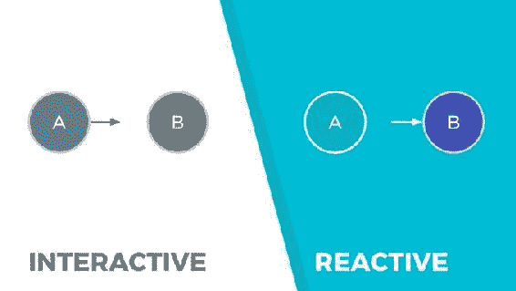
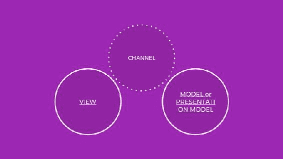

© Luca Mezzalira 2018 Luca MezzaliraFront-End Reactive Architectures[https://doi.org/10.1007/978-1-4842-3180-7_1](1.html)

# 1.什么是反应式编程？

Luca Mezzalira1  (1)London, Surrey, UK  

> 千里之行，始于足下。—老子，陶德昌

Have you ever heard about Reactive Programming or Reactive Systems? Do you think React.js is a reactive library? Have you ever thought about why you should use Rx.JS inside an Angular project? Is Rx.JS the new Loadash? If at least one of these questions is often in your mind, this is exactly the right book to find an answer! In these pages you will have a chance to learn more about reactive programming and reactive architecture for front-end development: a programming paradigm that is becoming more popular, every day, in the front-end community; but these days it is probably one of the most misunderstood and abused paradigm. The main goal of this book is to provide a good understanding of what reactive programming is, how to use it in our projects, and particularly how to create fully reactive architectures for creating resilient and maintainable projects. During this journey you will learn the following:

*   什么是反应式编程，为什么它很重要
*   这种编程范式的最佳用例是什么
*   如何用不同的框架构建一个完全反应式的架构
*   在前端生态系统中，反应式编程的未来会是怎样的

If you are wondering if the concepts learned inside this book are applicable also on a back-end architecture, my answer would be YES, or at least, the majority of them could be applied to your back-end architecture too. Bear in mind that this book will focus the attention on front-end architectures with JavaScript, but some of the concepts illustrated should be easily portable to other back-end programming languages such as Node.js, for instance. This book assumes that you already have good understanding of JavaScript, in particular ECMAScript 6 and 7 syntax; object-oriented programming; and possibly some knowledge of functional programming, but it’s not mandatory. Let the journey begin!

## 什么是反应式编程？

Every day when we open an editor or IDE to develop a program, we use our favorite programming language; sometimes we study a new one, but, consciously or unconsciously, we are making the decision of what kind of programming paradigm we are going to work with. Reactive programming is not a new paradigm: it’s one of the buzzwords we are used to hearing about in the JavaScript community in the past year or so, and it will become more than just a buzzword in the future. I don’t want to begin immediately by using too many technical terms because we will have enough time to learn about them while reading this book, but it’s important that you understand what is the benefit of working in a “reactive way.” If you read blog posts or articles on the Web, few of them are going to explain reactive programming with the spreadsheet cells example, where spreadsheet cells are reacting to changes happening in other cells after user input. This is definitely a good example but we can do better than this. I’m sure you are familiar with the dependency injection pattern where an object is injected via the constructor or in a public method exposed by a class or module. This pattern leverages several benefits like decoupling between two objects and the possibility of testing the hosting object in isolation without creating dependencies and so on. In some programming languages when we use dependency injection we are going to define an interface as function’s argument in the hosting object and then we can interact with the methods available in the injected object. The injected object in this case is used as an interactive object, because the host knows exactly what the contract is and how to use it. In reactive programming instead, the hosting object will just subscribe to the injected one, and it will react to the propagation of changes during the application lifetime. See Figure [1-1](#Fig1) .  Figure 1-1 Interactive vs. Reactive programming : in Reactive Programming the producer is A and the consumer is B Looking at the image above, we can immediately grasp the main difference between the two approaches :

*   在交互的例子中，对象 A 知道调用哪个方法，因为它确切地知道 B 的对象契约，而且如果我们必须了解谁影响了被摄取对象的状态，我们将搜索所有与我们交互的项目。
*   在反应型中，契约是标准的，对象 A 对对象 B 中发生的变化作出反应，最重要的是，我们确信任何操作都会发生在被注入的对象内部；因此，我们将对对象之间的关注点进行更强的分离。
*   因为宿主对象对注入的对象内部传播的任何值做出反应，所以我们的程序将是最新的，而不需要实现任何额外的逻辑。

It’s time for a simple example before we move ahead with other concepts. Let’s assume we have a class called Calculator with a method sum and a class Receipt with a method print as shown in Listing [1-1](#Par30). class Calculator {   sum(a, b){     return a + b;   } } class Receipt {   constructor(calculator){     this.calc = calculator;   }   print(itemA, itemB){     const total = this.calc.sum(itemA, itemB);     console.log(`total receipt £${total}`);   } } const pizza = 6.00; const beer = 5.00; const calc = new Calculator(); const receipt = new Receipt(calc); receipt.print(pizza, beer); Listing 1-1Check Snippet1.js As you can imagine, the program outputs “total receipt £11.” What we are doing in this example is creating the Calculator object and a Receipt object, and then we inject the Calculator instance called calc and we call the method print from the receipt instance with few arguments. Inside the print method we are writing in the console the total price of the elements passed. Checking the Receipt class implementation , you can spot in the print method that we are interacting with the method sum of the Calculator class and then getting the final result. Now let’s try to implement the same example in a reactive way in Listing [1-2](#Par36). class Calculator {   constructor(itemA, itemB){     const obs = Rx.Observable.of(itemA, itemB);     const sum$ = obs.reduce((acc, item) => (acc + item));     return {       observable: sum$     }   } } class Receipt {   constructor(observable$){     observable$.subscribe(value => console.log(`total receipt: £${value}`))   } } const pizza = 6.00; const beer = 5.00; const calc = new Calculator(pizza, beer); const receipt = new Receipt(calc.observable); Listing 1-2Check Snippet2.js As you can see in this example, the Receipt class is subscribing to an object called observable, injected via the constructor, and all the logic of how to sum the prices and propagate them is delegated to the Calculator class. Therefore, the Receipt class is just reacting to a change, happening in a certain moment of the program’s lifetime, displaying in the console the value emitted by the Calculator instance. Another thing to highlight here is the contract between the objects: instead of knowing exactly what method we should call, we pass an, with a default contract, and we react when something changes inside it. Overall, it’s a very simple example but I hope it helps you to understand the shift of mindset we are going to have when we work with reactive programming; in the next few chapters we will see more reactive examples like this one.

## 编程范例

It’s time to spend some words on programming paradigms to shed some light on reactive concepts and comparing them with functional and imperative programming.

### 命令式编程

Imperative programming is probably one of the most well-known programming paradigms. Often, it’s the first paradigm that we learn for understanding how a computer elaborates a program: it gives us all the tools for defining implementation details in depth and specifying exactly how a program should behave step by step. Let’s see an example of imperative programming: class Calculator {   constructor(){     this.VAT = 22;   }   sum(...items){     let total = 0;     let i = 0;     for(i; i < items.length; i++){       total = total + items[i];       total = total + items[i] * this.VAT/100;     }     return total;   } } class Receipt {   constructor(calculator){     this.calc = calculator;   }   print(...items){     let total = this.calc.sum(...items);     console.log(`total receipt £${total.toFixed(2)}`);   } } const JEANS = 80.00; const SHIRT = 35.00; const SHOES = 90.00; const COAT = 140.00; const HAT = 29.00; const calc = new Calculator(); const receipt = new Receipt(calc); receipt.print(JEANS, SHIRT, SHOES, COAT, HAT); //"total receipt £456.28" Similar to the example discussed before, the sum method of the calculator object is accepting multiple arguments instead of just a couple, and we are summing all of them and applying the VAT value calculated per item. As you can see, we are describing the exact implementation we want to perform: from defining a for statement in order to iterate trough the values in the array until expressing the VAT calculation for each single item. Basically what we are doing is focusing on any implementation detail; potentially we could change the way we were iterating through the array’s elements and start from the last element in the array instead of the first one or use a different variable name from “i”; these are the levels of detail we usually handle with imperative programming. Now it’s time to see how this example would be handled in functional and reactive programming.

### 函数式编程

Functional programming is getting more famous on a daily base. Many languages arise embracing this paradigm and many existing languages are embracing it too for the readability, maintainability, and testability improvements. If you are asking yourself why Functional Programming is becoming so popular, the answer can be found behind the concepts of this paradigm. When we talk about Functional Programming we are talking about functions: in particular we are talking about pure functions. A pure function is a function that, given an argument, is always returning the same result; it’s predictable, easy to test, and doesn’t generate any side effect inside the program. Another important topic related to functional programming is the concept of immutability. Immutability means that a specific value won’t ever change during its life cycle, but if we need to manipulate it, we will create a new instance that contains the manipulated version of the original object. Even if you are not familiar with this concept or have never dealt with it, I want you to see at least one concrete example. Usually when you are dealing with an array and you want to iterate trough the values and interact with them in an imperative programming way, you would write something like this: const originalArray = [1, 4, 8, 12]; for(let i = 0; i < originalArray.length; i++){   originalArray[i] = originalArray[i] + 1; } console.log(originalArray) //[2, 5, 9, 13] At this stage we have completely lost the initial values of the array called originalArray; if we want to have a copy of the initial values, we would create a new array that contains the modified values and then we would check that one. In functional programming, instead, we are working by default with immutable objects; therefore, every modification we need to apply won’t affect the original value but will generate a new one. Taking into consideration the previous example, we could write in a functional programming way like this: const originalArray = [1, 4, 8, 12]; const finalArray = originalArray.map(value => value+1); console.log(finalArray); //[2, 5, 9, 13] As you can see from these simple examples, functional programming is focused on what you are trying to achieve more than its implementation details. That’s a fundamental distinction compared to imperative programming. In fact, with functional programming we are describing our program, focusing on each action; and we need to do describe the data flow of our program more than focusing on each single detail such as which variable we have to define for iterating an array or how to increment the variable inside the for statement. Another important aspect of software programming is how to deal with state management . In Object-Oriented Programming we are used to encapsulating a state inside an object and changing it via different methods described in the same object. But in functional programming we are trying to compose it via pure functions that accept as the argument a state and return a new state. Redux ( [http://redux.js.org/](http://redux.js.org/) ), a very well-known library in the React community, aims to resolve the problem of state management by implementing a state machine pattern. In Redux, when we want to change the application state, we will need to call a method that accepts two arguments: the previous application state and an action. And it is returning the new state without mutating the previous one. An Action is a simple object used for identifying in which state the application should transform. Relying to pure functions will make our code more modular and more reusable, will create less bugs, and will suddenly become more testable! Let’s try now to convert the previous imperative example, porting it to functional programming. See Listing [1-3](#Par71). class Calculator {   getTotal(...items){       const total = items.map(::this.addVAT)                      .reduce(this.sumElements);     return total;   }   addVAT(itemValue){     return itemValue + this.calculateVAT(itemValue);   }   calculateVAT(value){     const VAT = 22;     return value * VAT/100;   }   sumElements(accumulator, value){     return accumulator + value   } } class Receipt {   print(total){     console.log(`total receipt £${total.toFixed(2)}`);   } } const JEANS = 80.00; const SHIRT = 35.00; const SHOES = 90.00; const COAT = 140.00; const HAT = 29.00; const calc = new Calculator(); const receipt = new Receipt(); receipt.print(calc.getTotal(JEANS, SHIRT, SHOES, COAT, HAT)); // "total receipt £456.28" Listing 1-3Check Snippet3.js As we can see in the sum method implementation, we are focusing more on the actions we want to implement more than how to apply them; therefore, first we know that we need to calculate the VAT value for each single element (map method) and then to sum the items for retrieving the total (reduce method). In this implementation we don’t need to specify how we are iterating through the array elements or specifying variables to keep the state of the iteration; we just focus on our goal. Another thing to notice in this implementation is how we are using functions as an argument of other functions; this mechanism is called high-order functions and it is another cornerstone of Functional Programming. Obviously, Functional Programming is not just that: it is a broad topic with many other patterns to take in consideration like currying, practical application, memoization, and so on, but this is not the main topic of the book. Bear in mind these concepts and possibly read a few posts online regarding them for mastering the different implementations because being familiar with Functional Programing will allow you to embrace Reactive Programming more easily. If you are not used to thinking functionally, I strongly suggest peaking at a book that describes this paradigm in your favorite language; it’s a great time investment, and you won’t regret it.

### 反应式编程

We have just briefly seen Imperative and Functional Programming, but then what about Reactive Programming? Reactive Programming is not a new concept – it’s been a while since it has been used on server-side programming – but it’s becoming very popular on the front-end ecosystem also. We have seen how to easily turn a quick example to Reactive Programming, but it’s not just that. With Reactive Programming we could easily transform our code to Imperative Reactive Programming or Functional Reactive Programming. The main concept behind this paradigm is the data flow and how an object observes and reacts to changes that happened during the life cycle of an application. Let’s start defining what Reactive Programming means : Reactive Programming is a paradigm based on asynchronous data streams that propagate changes during the application life cycle. What does it mean in practice? Let’s assume we have to develop a financial dashboard, and all the data are coming from a server that is aggregating them for client visualization. For the client we need to establish a polling mechanism or open a WebSocket communication for retrieving these pieces of information, and then we need to translate them into a nice user interface that will be consumed by our users. Trying to decompose the challenge we want to implement and how we would be reasoning without Reactive Programming, consider the following:

1.  1.我们需要创建一个代理、一个动作或一个命令来每隔几秒钟从服务器检索数据，从而触发轮询机制。
2.  2.在检索数据之后，我们需要分析这些数据，可能修改或分析它们以提供更友好的可视化。
3.  3.然后，我们通过中介、存储、控制器或任何其他与视图耦合的层将这些数据传递给不同的组件，以便更新数据。
4.  4.在最后一部分，我们将从视图中更新 DOM，可能只突出显示自上次更改以来已经更改的数据(在这种情况下，虚拟 DOM 机制可以帮助减少工作量)。

There a quite a few parts to take care and lots of events, commands, or signals to use in order to make these data flowing from different parts of our application to display them in our views. What would you say if you knew there is a better way to do it? It’s a paradigm that will allow us to write less code and become more expressive and pluggable inside our current applications. Obviously, I’m not saying we won’t implement all these tasks – Reactive Programming is not a silver bullet or a magic wand – but we will learn soon that this paradigm could have quite a few surprises in store regarding its simplicity and expressiveness. Another important concept on Reactive Programming is the way we are communicating within objects . If you remember, a few paragraphs before, I showed an example of how we could solve a simple problem of communication between objects by injecting an observable instance instead of an instance of a specific class or module. This could lead to many interesting scenarios that are currently not fully explored in the front-end panorama. What would you say if the contract between objects become a standard one, and the instance we inject will have a predefined contract that will allow the hosting object to subscribe to changes from the injected instance? This is not a new concept either: a similar idea was created in 1978 with Communicating Sequential Processes (CSP) . Despite the name, CSP allows you to work with sequential and parallel processes ; a process is not more than a “channel” used for the asynchronous communication between objects. In this way you are decoupling the objects using a channel for the communication; this channel though will allow you to not only pass data through it but to also do the following:

*   汇总数据
*   转换数据
*   减少数据
*   装饰数据

On top of that, we will be able to manipulate channels (splitting, piping, merging, and so on) for creating sophisticated interactions between objects (Figure [1-2](#Fig2)). Figure 1-2In this diagram we are injecting a channel to the view and the controller, presentation model, mediator, or model for allowing the update of the view when the main state changes CSP is a fine-grained implementation of what we are going to explore in the Reactive world. If you are interested in spending some time with CSP, I’d suggest checking the library called CSP-JS ( [https://github.com/ubolonton/js-csp](https://github.com/ubolonton/js-csp)) ). Understanding how CSP works will speed up your learning process on Reactive Programming. After this brief digression we can move back to the main topic of this book; it’s time now to see Reactive Programming in action in association with Imperative and Functional Programming. Let’s start with the Imperative example shown in Listing [1-4](#Par111). class Calculator {   constructor(){     this.VAT = 22;   }   sum(items){         const items$ = Rx.Observable.from(items);         const total$ = items$.map(value => value + (value * this.VAT/100))                                   .reduce((acc, value) => acc + value);     return total$;   } } class Receipt {   constructor(calculator){     this.calc = calculator;   }   print(...items){     const total$ = this.calc.sum(items);     total$.subscribe(total => console.log(`total receipt £${total.toFixed(2)}`));   } } const JEANS = 80.00; const SHIRT = 35.00; const SHOES = 90.00; const COAT = 140.00; const HAT = 29.00; const calc = new Calculator(); const receipt = new Receipt(calc); receipt.print(JEANS, SHIRT, SHOES, COAT, HAT); Listing 1-4Check Snippet4.js In this example, we didn’t change much compared to the imperative one, but let’s analyze what we have done:

*   在 Receipt 对象的 print 方法中，我们将参数转换为可观察值。
*   我们将可观察对象注入到计算器类的 sum 方法中。
*   在这里，我们首先通过 map 方法将 VAT 应用于每个单个元素。
*   然后我们将这些值相加，返回另一个可观察的对象。
*   最后但同样重要的是，我们订阅由 sum 方法返回的可观察对象，并在控制台中显示总价。

At this stage, I don’t want to go in too much depth with reactive terminology; but for now think about an observable as an object that is wrapping the data and exposes some methods for manipulating the values – a sort of channel where data are flowing inside and we can apply transformation to these data. After understanding how to implement some reactivity to Imperative Programming, let’s see how the Functional example would look like, as shown in Listing [1-5](#Par120). class Calculator {   getTotal(...items){     const items$ = Rx.Observable.from(items);     const total$ = items$.map(::this.addVAT)                      .reduce(this.sumElements);     return total$;   }   addVAT(itemValue){     return itemValue + this.calculateVAT(itemValue);   }   calculateVAT(value){     const VAT = 22;     return value * VAT/100;   }   sumElements(accumulator, value){     return accumulator + value   } } class Receipt {   print(total$){     total$.subscribe(total => console.log(`total receipt £${total.toFixed(2)}`));   } } const JEANS = 80.00; const SHIRT = 35.00; const SHOES = 90.00; const COAT = 140.00; const HAT = 29.00; const calc = new Calculator(); const receipt = new Receipt(); receipt.print(calc.getTotal(JEANS, SHIRT, SHOES, COAT, HAT)); Listing 1-5Check Snippet5.js Also in this case, the example is pretty much the same but now the Receipt is using the observable called total$ that got a different signature from the previous example where we got just a simple number. Once again, an observable allows subscribing to it and retrieving the values that are flowing inside it. At first glance these concepts could seem unimportant, but they will help us a lot when we try to create a full reactive architecture.

## 什么时候应该使用反应式编程？

Often, when a new trend is rising, a lot of developers are used to abusing the new technology or framework (hype-driven development). As we understood during this chapter, Reactive Programming is used for handling the propagation of data during the life cycle of an application. Therefore, a perfect fit for this paradigm would be a real-time data application like a financial dashboard or any monitoring system for instance. In a nutshell, we can say that any application that is heavily data driven could be a great fit for Reactive Programming. Obviously, it doesn’t mean you shouldn’t use this paradigm in other applications, but real-time web apps and applications with a large amount of asynchronous transactions and mutations are where Reactive Programming really shines. If we decide to use Reactive Programming inside existing architectures, such as Angular or Redux, for instance, it could be a good design decision because it could facilitate the update of our views or the state propagation inside components. Nowadays the Web is full of plenty of reactive examples, libraries and frameworks are raising them with great success, and embracing them will impose a shift of mindset in order to embrace the real power of this paradigm. Another great benefit of Reactive Programming is the simplicity of testing your code and describing data flows in a concise but clear manner. Reactive Programming is already implemented in production environments of several large organizations such as Netflix, Google, and Microsoft. Microsoft and Google, for instance, are a great contributor of the Reactive Programming movement ( [http://reactivex.io/](http://reactivex.io/) ). Netflix, as well, is another company that is contributing heavily to the evolution of this paradigm with Rx.JS 5, and Reactive Programming is applied in several implementations currently in production.

## 你应该如何编写一个完全反应式的应用程序？

One night I went to a meetup in London where we were discussing the JavaScript trends for 2017\. Funny enough, Reactive Programming was one of these trends and the facilitator asked a question to all of the attendees: “How many of you are working with Reactive Programming now?” And half of the room raised their hands asserting a positive answer. After this question, the facilitator asked the following one: “How many of you are using React.js only as Reactive library?” Then over 85% of the people that raised their hand at the previous question raised their hand again. That wasn’t surprising for me because it provides an understanding how few people are interpreting Reactive Programming in a correct way. We could decide to structure our projects with a fully Reactive architecture where the communication/interaction between objects, the state management, and the interaction with endpoints are all handled in a Reactive paradigm. Reactive Programming on the front end and back end brought up different architectures and implementations that are interesting to use but at the same time different from what we are used to dealing with. In this book we are going to explore different approaches currently available inside the front-end Reactive community.