# 三、反应式编程

> 所有的生活都是一场实验。你做的实验越多越好。—拉尔夫·瓦尔多·爱默生

After an overview of the most famous front-end architectures and their implementations, it’s time to dig into the main topic of this book: Reactive Programming with JavaScript. I watched many videos and read many articles and books on the argument, and I have to admit that often I had the impression that something was missing, like we were just scratching the surface instead of going in depth inside the Reactive ecosystem. The main aim of this chapter is to provide all the tools needed for understanding Reactive Programming more than focusing on a single library, embracing the concepts behind this programming paradigm. This should allow us to embrace any reactive library without the need to invest too much time for switching our mindset. I often saw developers embracing a specific library or framework and being real ninjas with them, but once moved away, they struggled with approaching different implementations – mainly because they didn’t understand what there was behind the implementation. Understanding the core principles of the reactive paradigm will allow you to master any library or framework independently from the different implementations without treating just as a “black box .” There are many reactive libraries available in the open source ecosystem and, we are going to discuss the most famous like Rx.JS and XStream. After that we are going to understand the key principles of Reactive programming such as what is a stream, the difference between hot and cold observables, and back pressure. Unfortunately, reactive programming has a high learning curve mainly due to the concepts it is leveraging, but once you get used to them, you will start reasoning in a reactive way for everything without any issue.

## 反应式编程 101

First and foremost, implementing reactive programming means working mainly with events streams , but in order to understand what an event stream is, we should start with a simple diagram for better understanding how a stream works. Figure 3-1 is called a marble diagram and it is used to represent an event stream.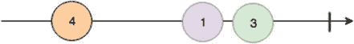 Figure 3-1Marble diagram representation example It’s very important to understand how it works because often in the documentation you can understand how the APIs work by just looking at the diagram without the need to read the full explanation. Also, marble diagrams are useful during the testing phase because when we need to simulate an event stream, we will use them against our event stream implementation. But let’s see what they are so we can understand better the concept of event stream. In a marble diagram, we can spot a horizontal line representing the time (our stream), and the value inside the colorful circles are events that are happening at a certain point in time in our application (events). The vertical line, instead, represents the end of our stream, after that point the stream is completed. So if we want to describe this diagram we can easily do it in this way :

*   应用程序启动后，流发出值 4。
*   一定时间后，流发出值 1，紧接着 3。
*   在所有这些事件之后，溪流完成了。

The stream could also end after an error, and in that case instead of seeing a vertical line, the marble diagram (Figure 3-2) will show an X symbol notifying when the error happened inside the stream.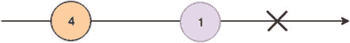 Figure 3-2Marble diagram with error The last bit to mention is when we apply transformation to the values inside a stream via operators. An operator is a method that allows us to manipulate the data in a stream or the stream itself. In this case the marble diagrams can show how the values are transformed like in this example with the map operator where we are adding 1 to any number emitted by the stream on the top and creating a second stream with the values manipulated (Figure 3-3). Figure 3-3Marble diagram with map operator applied to an initial stream that returns a new stream with data manipulated Until now, we understood that an event stream is a sequence of values (events) passed in a certain period (stream). We can then assume that everything inside an application could be a stream, and in a certain way it’s exactly what the reactive paradigm is leveraging: we can transform listeners with callbacks in event streams, we can wrap an http request in a stream and handle the response by manipulating the data before updating a view, and we can use streams as communication channels for passing data between two or more objects, and many other use cases. In the reactive panorama we need to introduce a particular type of stream: the observable. A great definition of observable is available on the Rx.JS 5 documentation:

> 可观察值是一种延迟求值的计算，从它被调用时起，可以同步或异步地返回零到(可能)无穷大的值。([`bit.ly/2sWVEAf`](http://bit.ly/2sWVEAf)

In order to consume data emitted by an observable, we need to create an observer (consumer); this subscribes to the observable and reacts every time a value is emitted by the observable (producer). If we want to summarize in technical words what an observable is, we could say that an observable is an object that wrap some data consumed by an observer (an object with a specific contract) and once instantiated provides a cancellation function. The observer is an object that allows us to retrieve the value emitted by an observable and has a specific contract exposing three methods: next, error, and complete functions. When you deal with observables and observers bear in mind two well-known design patterns for fully understand their mechanisms: the observer and the iterator patterns.

## 观察者模式

The Observer Pattern is a behavioral pattern where an object called Subject maintains a list of other objects (observers) that want to be notified when a change happens inside the program. The observers are usually subscribing to a change and then every time they receive a notification, they verify internally if they need to handle the notification or not. Usually, in typed languages, the Observer Pattern is composed by a subject and one or multiple observers. The subject is handling the subscription, unsubscription, and the notification to an observer; then each observer implements a specific interface that contains a publish method (update) for reacting to a notification originated by another object or a user interaction and shared through the Subject (Figure 3-4).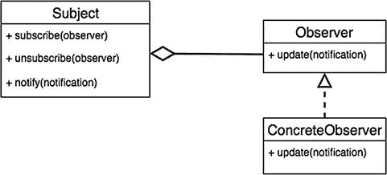 Figure 3-4Observer Pattern UML

## 迭代器模式

The Iterator Pattern is a behavioral pattern used for traversing a data container like an array or an object, for instance. As JavaScript developers, we should be familiar with this pattern, considering it was added in ECMAScript 2015. This pattern allows an object to be traversed calling a method (next) for retrieving a subsequent value from the current one if it exists. The iterator pattern usually exposes the next method and the hasNext method that returns a Boolean used for checking if the object traversed contains more values or not. In MDN we can find more information about the official JavaScript implementation in ECMAScript 2015: [`mzl.la/2sfrMxJ`](https://mzl.la/2sfrMxJ) (Figure 3-5).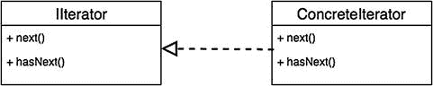 Figure 3-5Iterator Pattern UML

## 将守则付诸实践

Let’s create an example by walking through the code for a better understanding of how an observable/observer relation works in practice: const observable = Observable.range(1, 10); const observer = observable.subscribe(onData, onError, onComplete); function onData(value){         console.log(value); } function onError(err){         console.error(err); } function onComplete(){         console.log("stream complete!"); } As you can see from this first example in the first line we have created an observable that contains a range of values from 1 to 10; that means we have these values ready to be emitted to an observer when the observer will subscribe to it. On the second line we subscribe to the observable; the subscribe method in many libraries has three parameters that correspond to callbacks called once the observable is emitting a value, an error, or a complete signal. In the rest of the code we are just reacting to the information emitted by the observable printing to the console an output that could be either an event from the stream or an error or the complete signal. When an observable receives events can also allow us to manipulate the data for providing a different output from them like we have seen previously in the marble diagram where we were mapping each single value emitted, increasing by 1 each of them. Different Reactive libraries are providing different sets of utilities, but the most complete one when the book was written is without any doubt Rx.js. This library provides a set of operators for manipulating not only the events emitted by the observable but also with other observables; it is not unusual to transform observable of observables in flat observables: think about them as an array of arrays. These operators will allow us to flat the object nesting accessing directly to the values in the observables without the iteration complexity. We are going to see the possibilities offered by operators in the next section when we explore the different Reactive libraries so we can understand in practice how to use it and what we can do with them. Obviously, we will review only the most used ones because there are literally hundreds and our focus is on understanding the mechanism behind them more than exploring the entire library.

## 流实现

Now that we understood what streams are, it’s time to get a better understanding of what is available in the front-end reactive ecosystem. The first library we are going to take into consideration is Rx.JS 5.

## Rx。射流研究…

Rx.JS is the most famous and used reactive library at the moment; it’s used almost everywhere, from Angular 2 where the library is integrated inside the framework to many other smaller or larger frameworks that are embracing this library and leveraging its power. It’s one of the most complete reactive libraries with many operators and a great documentation, Rx.JS is part of Reactive Extensions ( [`reactivex.io`](http://reactivex.io) ). Learning it will mean being able to switch from one language to another using the same paradigm and often the same APIs. Rx.JS can be used on front-end applications as well on back-end ones with Node.js ; obviously its asynchronous nature will help out on both sides of an application’s development. There are two main versions available. Version 4 is the first JavaScript porting of the Reactive Extension, and then recently another implementation started to rise up that is version 5\. The two libraries have several differences in our examples and so we will use version 5. In this section, we won’t be able to play with all the operators available on Rx.JS because this library is broad enough for having its own book (in fact, there are many books available that I strongly suggest you give a go). Our main aim is to grasp a few key concepts, considering we are going to use it in many other examples in this and the next chapters. Therefore we are going to see Rx.JS in action in three different scenarios :

*   当我们需要减少数据来获取最终值时。
*   当我们从 HTTP 端点获取数据时。
*   当我们需要通过可观察物与多个物体交流时。

Considering how large Rx.JS is, we introduce another important concept such as the difference between hot and cold observables, to help to understand better how the other libraries work. Let’s start with a simple example on reducing an array of data and retrieve the sum of values filtering the duplicates present in the initial array . import Rx from "rxjs" const data = [1,2,10,1,3,9,6,13,11,10,10,3,19,18,17,15,4,8,4]; const onData = (value) => console.log(`current sum is ${value}`); const onError = _ => console.log("stream error"); const onComplete = _ => console.log("stream completed"); const obs = Rx.Observable.from(data)                             .filter(value => value % 2 === 0)                             .distinct()                             .reduce((acc, value) => acc + value); obs.subscribe(onData, onError, onComplete); As you can see in the example above, we are converting an array of numbers to an observable (Rx.Observable.from(data)), then we start to transform the values inside the array step by step, applying multiple transformations. In fact, first we are filtering the values creating a new array containing only the even numbers, then we remove all the duplicates inside the array with the distinct operator provided by Rx.JS; and finally we sum the values inside the array with the reduce operator. Figure 3-6 shows the final output in the browser console.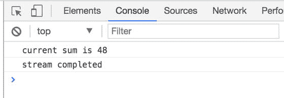 Figure 3-6 Final result returned by the previous snippet with Rx.JS Every time we are applying a transformation via an operator, we are creating a new observable that is returned at the end of the operation. This means we can concatenate multiple operators by applying several transformations to the same data source. In order to output the final result of our observable, we are subscribing to the observable with the subscribe method, and this method accepts three functions. The first one is triggered every time the observable emits data, the second one if the observable emits an error, and the last one is triggered once the observable receives a complete signal from the producer (in our case, the end of the array). Remember that these callbacks are not all mandatory; we can potentially skip to declare the error and complete callbacks if we don’t need to react to these events. Imagine for a moment how you would implement the same logic in imperative programming… done it? Ok, now you probably understood how functional and reactive paradigms can help to express complex operations in few lines of code, having a clear idea of what’s happening, without storing temporary values anywhere, and without generating any side effects. Everything is contained inside the observables and cannot be modified from external operations. The next example, instead, aims to retrieve the response from an API on the Web and then propagate the result to a hypothetical view. In this case we won’t use any specific architecture but we are going to work well with the single responsibility principle and good encapsulation . import Rx from "rxjs"; const URL = "https://jsonplaceholder.typicode.com/users"; const simplifyUserData = (user) => {     return {         name: user.name,         email: user.email,         website: user.website     } } const intervalObs = Rx.Observable.interval(1000)                                  .take(2)                                  .mergeMap(_ => fetch(URL))                                  .mergeMap(data => data.json())                                  .mergeAll()                                  .map(simplifyUserData) intervalObs.subscribe(user => {     console.log(`user name is ${user.name}`);     console.log(`user email is ${user.email}`);     console.log(`user website is ${user.website}`);     console.log('------------------------------'); }, error =>  console.error("error", error), complete => console.log("completed")) After creating the constant with the URL to consume, we are creating a method (simplifyUserData) for filtering the data we want to use in our application, by just returning a subset of the information instead of the entire record retrieved from that URL. The endpoint used is a public endpoint usually used for mocking data, but in our case we are going to receive an array of objects that looks like this: {   id: 1,   name: "Leanne Graham",   username: "Bret",   email: "Sincere@april.biz",   address: {     street: "Kulas Light",     suite: "Apt. 556",     city: "Gwenborough",     zipcode: "92998-3874" [....] } We want to consume this endpoint every second but only twice during the application life cycle. In order to do that we create an observable with an interval of a second (Rx.Observable.interval), specifying how many times we want to perform this operation (take operator) and then we want to fetch the data from a URL (first mergeMap) and then return the data fetched as JSON, splitting the object retrieved (mergeAll operator, we could have use other operators like concatAll, for instance, obtaining the same result) in order to emit a value per time instead of the entire array in one go. Finally we simplify the data with the method we created at the beginning of the script (map operator). The final output of this example should look like Figure 3-7.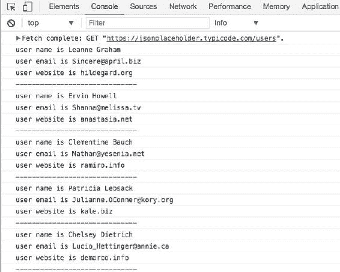 Figure 3-7 Output of previous example with Rx.JS Now we need to understand in depth why we have done all these operations for manipulating the data to get the result displayed in the screenshot above. After creating the interval observable, we perform at each tick a fetch operation. Fetch is not an observable but, as you can see from the example, we are not transforming it via an operator for translating it to an observable, but we are using the operator mergeMap and inside there we are performing the fetch operation .

*   这是因为 fetch 是一个承诺 A+，这些承诺被 Rx 识别。所以不需要像标准承诺一样使用 fromPromise 操作符，我们可以在 mergeMap 操作符创建的可观察对象中直接使用它们。
*   MergeMap 是一个做两件事的操作符。第一种方法是将两个流合并成一个唯一的流，然后用流内部发出的值进行迭代:在这种情况下，为了返回一个带有服务响应的流，它将承诺变平。
*   第二个 mergeMap 操作符与另一个 promise 一起使用，我们指定该流中发出的返回值应该是从端点获取的数据的 JSON 表示。
*   第二个承诺是由于 fetch API 契约，正如你在 MDN 规范中看到的:[`bit.ly/2sWVEAf`](http://bit.ly/2sWVEAf)。
*   最后一个操作符是 mergeAll 操作符，它通常用于合并一个可观测量中的所有可观测量，但在这种情况下，它将包含数组的最后一个承诺与检索到的数据合并，并以迭代的方式发出数组的每个单个值，而不是将整个数组作为唯一值发出，从而允许我们使用最后一个操作符(map)来简化发出的数据。
*   很容易理解 Rx 是多么的多才多艺和强大。JS 可能就是这种情况。显然，在这个阶段，我们知道需要做一些工作来熟悉 Rx 提供的所有不同运营商。但不要太难过，因为这是我们在掌握反应范式之前都做过的一步。
*   在回顾另一段代码之前，我们需要解释可观测量的另一个关键概念:当一个可观测量是热的还是冷的时，这意味着什么。

### 热和冷的可观测量

We can have two different types of observables: hot and cold. A cold observable is lazy and unicast by nature; it starts to emit values only when someone subscribes to it. Instead, the hot observables could emit events also before someone is listening without the need to wait for a trigger for starting its actions; also they are multicast by design. Another important characteristic that we should understand for recognizing hot and cold observables is to understand how the producer is handled in both scenarios. In cold observables, the producer lives inside the observable itself; therefore every time we subscribe to a cold observable, the producer is created again and again. Instead, in the hot observable the producer is unique and shared across multiple observers; therefore we will receive fresh values every time we are subscribing to it without receiving all of them since the first value emitted. Obviously, there are ways in hot observables to create a buffer of values to emit every time an observer is subscribing to it, but we are not going to evaluate each single scenario right now. Let’s see a hot and a cold observable in action for having a better understanding of how to use these two types of objects using Rx.JS.

### 冷可观察

The best way to understand a cold observable is seeing it in action: import Rx from "rxjs"; const source = Rx.Observable.interval(2000).startWith(123) source.subscribe(value => console.log("first observer", value)) setTimeout(_ =>{     source.subscribe(value => console.log("second observer", value)) }, 5000); setTimeout(_ =>{     source.subscribe(value => console.log("third observer", value)) }, 8000) The output of this small example is shown in Figure 3-8.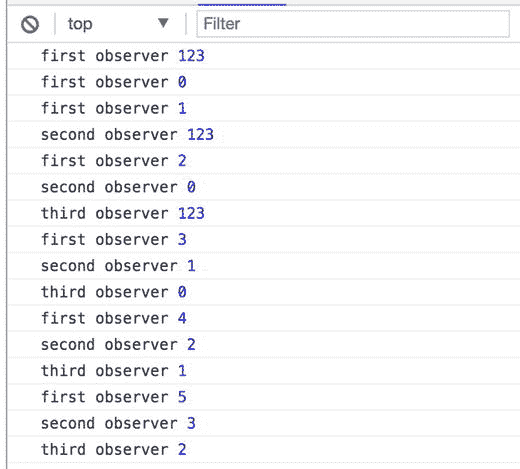 Figure 3-8Output of cold observable with Rx.JS In this example we are creating an observable that is emitting a sequential value every 2 seconds: it will start from 0 until infinite because we didn’t specify how many values we want to emit before the event streams is completed. We use the startWith operator when we want to show an initial value in our user interface or to start a sequence of events without waiting for the values passed asynchronously. In a cold observable we have the producer, in this case the observable emitting sequential numbers, which is instantiated three times – basically any time a consumer is subscribing to it. In the image above you can clearly see the sequence of numbers is starting every time a consumer is subscribing to the producer. We can conclude that the cold observable re-instantiates the producer any time a consumer is subscribing and it is unicast so the values produced are listened by a consumer per time; also we can have multiple consumers subscribing to the same producer. By default all the observables we create in Rx.JS are cold but we have different ways for transforming them into hot observables.

### 可观察到的热

Let’s see what a hot observable looks like: import Rx from "rxjs"; const source = Rx.Observable.interval(2000)                             .startWith(123)                             .publish()                             .refCount(); source.subscribe(value => console.log("first observer", value)) setTimeout(_ =>{     source.subscribe(value => console.log("second observer", value)) }, 5000); setTimeout(_ =>{     source.subscribe(value => console.log("third observer", value)) }, 8000) The output is shown in Figure 3-9. The example is very similar to the cold observable one, but in this case we are using other two operators: publish and refCount .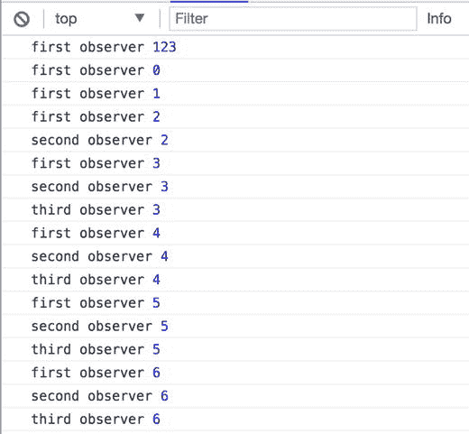 Figure 3-9 Output of hot observable with Rx.JS Publish operator is useful to transform our cold observables to hot observables because it returns a ConnectableObservable instead and observable object. A ConnectableObservable starts emitting values only when a connect method is called or, like in our example, when we use refCount operator. RefCount operator is used when we don’t need to control the start and stop of the ConnectableObservable but instead we automate this process; when a consumer subscribes to a ConnectableObservable, it is the logic provided by refCount that will trigger the connect method for emitting the values to the subscribers. Also the refCount logic will unsubscribe once there are any subscribers ready for receiving new values. When we have a hot observable the producer becomes multicast and the values emitted are shared across all the subscribers but at the same time we need to remember that by default, it’s not waiting for any consumer to subscribe. Instead it is emitting values immediately after the connect method is called. There are operators that will allow you to control when a hot observable starts to emit values like multicast and connect instead of refCount, which is automating these steps. Just keep this in mind when you work with Rx.JS because there are many opportunities available with this great library so keep an eye on the documentation and the implementation will become very smooth. Understanding what we are subscribing to and what are the characteristics and benefits of a hot or a cold observable could save a lot of debugging time and many headaches once our code hits the production stage. I think it is clear that Rx.JS is not just that – it’s way more than that but with these simple examples we are trying to memorize a few useful key concepts that will facilitate the integration of this library in our existing or new applications. Now it’s time to see another reactive library flavor with XStream. It’s important to understand that the concepts showed in the Rx.JS sections are very similar in other libraries; therefore owning them will allow you to pick the right library for the a project.

### X 流

XStream is one of the most recent reactive libraries created by André Staltz for providing a simple way to approach reactive programming tailored specifically for Cycle.js. XStream leverages a few concepts that we have already seen in action with Rx.JS like the observables but by simplifying the core concepts behind streams. All the streams are hot observables and there isn’t a way to create cold observables with this library. I personally think the author took into consideration the reactive programming learning curve when he worked on this library, and he tried smoothing out the entry level in order to be more approachable by newbies and experts as well. On top, XStream is very fast, second only to Most.js (another reactive library), and very light too, around 30kb; and with less than 30 operators available, it represents a super basic library for dealing with observables, perfect for any prototype or project that requires the use of observables but without all the “commodities ” offered by other libraries with plenty of operators. XStream is using instead of observables the streams concepts , which are event emitters with multiple listeners. A listener is an object with a specific contract, and it has three public methods: next, error, and complete; as the name suggests, a listener object is listening to events emitted by a stream. Comparing streams and listeners to Rx.JS observables and observers, we can say that a stream is acting like a hot observable and the listener like an observer mimicking the same implementation. Last but not least, in XStream we can use producers for generating events broadcasted via a stream to multiple objects. The producer controls the life cycle of the stream emitting the values at its convenience. A producer has a specific signature, and it exposes two main methods: start and stop. We will see later an example that will introduce the producer concept. Now it’s time to see XStream in action, porting the examples we have approached previously during the Rx.JS section. The first example is related to reducing an array of values that extracts just the even numbers, removing the duplicates and calculating their sum: import xs from 'xstream'; const data = [1,2,10,1,3,9,6,13,11,10,10,3,19,18,17,15,4,8,4]; const filterEven = (value) => value % 2 === 0; const removeDuplicates = (inputStream) => {     const buffer = [];     const outputStream = xs.fromArray(buffer);     inputStream.addListener({         next(value){             if(buffer.length === 0 || buffer.indexOf(value) < 0)                 buffer.push(value);         }     })     return outputStream; } const sumValues = (acc, value) => acc + value; const listener = {     next(value){         console.log(`current sum is ${value}`);     },     error(){         console.error("stream error");     },     complete(){         console.log("stream completed");     } } const stream = xs.fromArray(data)                  .filter(filterEven)                  .compose(removeDuplicates)                  .fold(sumValues, 0); stream.addListener(listener); The data object contains an array of unordered integers with duplicates values and even and odd numbers. Our aim for this exercise is to filter the array retrieving only the even numbers, removing the duplicates after the first transformation, and finally calculating the final sum. After instantiating the array source, we are defining the transformation we are going to apply; the first one is filtering the even numbers from the initial array with the method filterEven . In this method we are checking that each value we are going to receive is divisible by 2 or not. If so it means the value is an even number so we want to keep it, otherwise we will skip it (remember that a stream will emit 1 value per time). The second method is removeDuplicates , but in XStream there isn’t an operator for doing it automatically like for Rx.JS. As we said at the beginning, XStream is meant for learning how to handle streams more than having a complete library with many operators. Therefore we are going to use the compose operator that returns a stream and expects a new stream as input. OutputStream will be our new stream used by the next operator emitting the array generated inside the removeDuplicates method. Inside removeDuplicates we create an array for storing the unique values and we push them only if are not present inside the array. The last transformation for this exercise is calculating the sum of the values filtered in the previous steps. We are going to use the fold operator that requests a function with two arguments : an accumulator and the current value to evaluate for calculating the final result, very similar to the reduce method used when you wanted to calculate the values inside an array. Finally, we can create the stream using xs.fromArray passing the initial array, and this will produce an initial stream that will emit the array values. After that we apply all the different transformations via XStream operators like filter, compose, and fold. Bear in mind that the second parameter of the fold operator is the accumulator initial value, and in our case we want to start from the value zero and sum all the others. The last step is to listen to the stream creating a listener. As we said at the beginning of this section, a listener is just an object with a specific signature (next, error, complete), and in our case we output to the console the transformation made inside our stream. Opening the dev tools of your favorite browser, you should see something like Figure 3-10.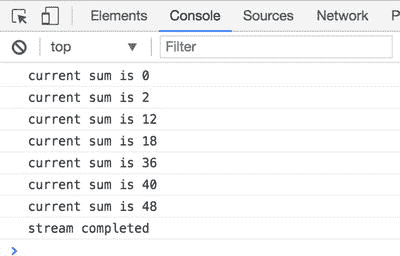 Figure 3-10 Output of XStream example, slightly different from the Rx.JS example due to the fold operator As we can see, this example made with XStream resembles the one we did previously with Rx.JS. The key takeaway here is the fact that understanding how the observables work are helping us to switch from a reactive library to another one without investing time on learning new concepts but just applying a few basic concepts with different syntax and operators. Our second example is based on retrieving some data from a REST endpoint every few seconds. In this case we can leverage the power of the producer objects available in XStream for fetching the remote data and emitting the result to a stream. Considering we want to retrieve the data every few seconds for a certain amount of times, we can use an interval stream instead of a set interval like we would do in plain JavaScript. This is our code example: import xs from "xstream"; import fetch from "fetch"; const URL = "https://jsonplaceholder.typicode.com/users"; const producer = {     emitter(){         const that = this;         return {             next(){                 emitUserData(listener);             },             complete(){                 that.stop()             }         }     },     start(listener){         xs.periodic(5000).take(2).addListener(this.emitter())     },     stop(){         listener.complete();     } } const emitUserData = (listener) => {     fetch.fetchUrl(URL, (error, meta, body) => {         if(error) return;         const data = JSON.parse(body.toString());         data.forEach(user => {             listener.next(user)         }, this);     }) } const simplifyUserData = (user) => {     return {         name: user.name,         email: user.email,         website: user.website     } } const listener = {     next(user){         console.log(`user name is ${user.name}`);         console.log(`user email is ${user.email}`);         console.log(`user website is ${user.website}`);         console.log('------------------------------');     },     error(){         console.error("stream error");     },     complete(){         console.log("stream completed");     } } const userStream = xs.create(producer).map(simplifyUserData); userStream.addListener(listener); As you can see in the example above, we start defining our producer object; remember that a producer is just an object that requires two methods: start and stop . The start method will be called once the first consumer subscribes to the stream. Keep in mind that a producer can have just one listener per time; therefore, in order to broadcast the results to multiple listeners, we have to create a stream that uses the producer to emit the values. Our producer contains also another method called emitter that returns a listener object that we are going to use inside the interval stream created in the start method. The start method uses the xs.periodic operator that accepts as an argument an interval of time when an event is emitted by the stream; so in our case, every 5 seconds a new event will be emitted. We also used the operator take that is used for retrieving a certain amount of values from that stream, ignoring all the others emitted. The last thing to do is to subscribe to that stream with a listener and every tick (next method) fetches the data from the endpoint. The endpoint is the same one as the previous example in Rx.JS, so we need to expect the same JSON object fetched from the endpoint. The main goal of this example is outputting a simplified version of this data that could be used in a hypothetical view of our application. When we create simplifyUserData method for extracting only the information we need from the value emitted in the stream; this function is returning a filtered object containing only a few fields instead of the entire collection. After that, we create our listener object with the typical signature next, error, and complete methods where we are handling the values emitted by the stream. Finally, we create the glue between the stream and the listener object by creating a stream with xs.create passing as the argument our producer. Then we iterate through all the values emitted, filtering the user data and in the last line of our script we associate the listener to the stream that will trigger the producer to start emitting the values. In this case there are some differences compared to Rx.JS example but again the key concepts are still there. The last example for the XStream library is focused on how we broadcast values to multiple listener objects; in this case XStream is helping us because all the streams are hot, therefore multicast by nature. We don’t need to perform any action or understand what kind of stream we are dealing with. That’s also why I recommend always starting with a simple library like XStream that contains everything we need for getting our hands dirty with streams and then moving to a more complete toolbox library like Rx.JS or Most.js . import xs from "xstream"; const periodicStream = xs.periodic(1000)                          .map(_ => Math.floor(Math.random()*1000) + 100); periodicStream.addListener({     next(value){         console.log("first listener", value);     } }) setTimeout(_ =>{     periodicStream.addListener({         next(value){             console.log("second listener", value);         }     }) }, 3000); setTimeout(_ =>{     periodicStream.addListener({         next(value){             console.log("third listener", value);         }     }) }, 6000); The first thing is to create a stream (periodicStream constant) that emits every second a random number. Then every time we are adding a new listener to the main stream, each listener receives the value emitted by the periodicStream. Checking the output on the browser’s console we can see how the stream works; remember that we said any stream in XStream is a hot one and multicast. Therefore we will have just one producer that won’t be re-created but every time a new listener is subscribing, we receive the value emitted from that moment onward (Figure 3-11).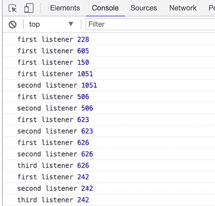 Figure 3-11Output XStream example with hot streams Now we can see we have the expected behavior, when the second and the third listener subscribe to the stream they receive the value emitted without any information of the previous values like we have seen in the cold observable example in Rx.JS. From this last example it is clear that if you need to manage with a certain granularity the streams type in a project, Rx.JS would be the right choice for that. Otherwise XStream could simplify and speed up your development, considering that it is pretty straightforward.

## 背压

Another important Reactive Programming concept is backpressure and how we can use it for improving our reactive applications. When we work with multiple streams, they could emit a large amount of events in a short period of time. Therefore we need a way for alleviating the amount of data consumed by the observers if we don’t really need all of them or if the process to elaborate them is too computationally intense, and the consumer is not able to keep up. Usually we have two possibilities to handle back pressure in our application: first, we can queue the value, creating a buffer and elaborate all the values received, so in this case we don’t miss the values emitted. This strategy is called loss-less strategy . Another strategy could be skipping some events and reacting only after a certain amount of time, filtering what we receive because maybe this information is not critical for what the consumer needs to do; in this case we call this strategy lossy strategy . Imagine, for example, that we are merging two observables with a zip operator . The first observable is providing some capital case letters every second, and the second observable is emitting lowercase letters every 200 milliseconds. The zip operator in this case will create a new observable with the values of the two streams coupled together, but because it needs to couple the letters from different streams that are emitting values with different speed, inside the zip operator we have a buffer for storing the values of the second observable until the first one is going to emit the following value. Figure 3-12 should shed some light on our final goal .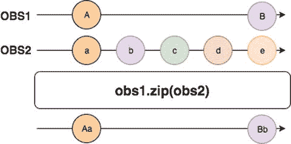 Figure 3-12Example of back pressure As you can see from the marble diagram above, the second stream is producing 5 times more values than the first one in the same amount of time, so the new observable will need to maintain the data in a buffer to match the values before emitting them to the consumer. Unfortunately, these kinds of scenarios in Reactive Programming are not rare and in this occasion, back pressure operators come to the rescue. These operators allow us to alleviate the pressure from the observer by simply stopping a reaction from values emitted by an observable, pausing the reception of values until we define when to resume receiving the values. Let’s write a concrete example with Rx.JS for understanding better the concept described. What we are going to create with Rx.JS and React is a simple box with a simulation of a stock that receives data in real time and it needs to display the stock value inside the component (Figure 3-13).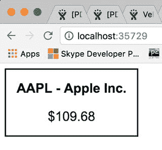 Figure 3-13Outcome of our next exercise on back pressure This small example is composed by two files: the main application and the React component . The main application will generate the observable that will produce random values in a specific range ready to be displayed inside the component. import React from "react"; import ReactDOM from "react-dom"; import Rx from "rxjs"; import Stock from "./Stock.jsx"; export default class App{     constructor(){         const cont = document.getElementById("app");         const observable = this.generateProducer();         const AAPL = "AAPL - Apple Inc.";         ReactDOM.render(<Stock producer$={observable} title={AAPL} />, cont);     }     generateProducer(){         const stockValuesProducer = Rx.Observable.interval(50) .map(value => { return (Math.random() * 50 + 100).toFixed(2); })         return stockValuesProducer;                           } } let app = new App(); What is happening in the main application file is that we are generating a producer (generateProducer method) that should simulate a constant interaction with a source of data, and every 50 milliseconds it is emitting a value between 100 and 150 with 2 decimals. This is a typical example where the back pressure operators could help out; we really don’t need to update the UI every 50 milliseconds because more than a useful experience, we are going to create a constant refresh that won’t be well received by our users, and it will be very intensive, in particular, on low-end machines. So what can we do to alleviate the pressure on the observer that is going to receive these values? If in generateProducer method , instead of returning the observable as it is, we could add a back pressure operator like this one: generateProducer(){         const stockValuesProducer = Rx.Observable.interval(50) .map(value => { return (Math.random() * 50 + 100).toFixed(2);                                                  })         return stockValuesProducer.sampleTime(500); } In this case, the sampleTime operator will emit a value only every 500 milliseconds, ignoring the other values received in the meantime. Just to fix this concept even better, Figure 3-14 shows how this works inside a marble diagram.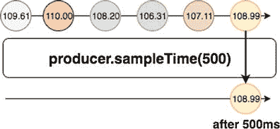 Figure 3-14Marble diagram showing sampleTIme operator with half-second debounce In the component code , we are going to subscribe to the observable received from the producer property and display the value in our UI: import React from "react"; export default class Stock extends React.Component{     constructor(){         super();         this.state = {stockValue: 0};     }     componentDidMount(){         this.props.producer$.subscribe(this.setStockValue.bind(this));     }     setStockValue(value){         this.setState({stockValue: value});     }     render(){         return (             
                 <h2>{this.props.title}</h2>                 
${this.state.stockValue}
             
         )     } } As we can notice inside the componentDidMount method , provided by the React component life cycle, we are subscribing to the producer (the observable created before in the main application) and then we set the stock value in the React state object for displaying it in our paragraph element. In Rx.JS we can use multiple back pressure operators like debounce or throttle, but there are many others for handling the back pressure properly. It’s important to remember to not create a huge buffer of data when the producer is emitting a large amount of data. So as a rule of thumb, remember that when we don’t need all the data emitted by an observable, we should really filter them for providing a better user experience to our users and improve the performance of our Reactive applications.

## 总结

In this chapter, we explained how to work with a few key reactive concepts; in particular, we introduced the concepts of streams, observables and observers on Rx.JS and streams and listeners in XStream. We also reviewed the most famous libraries implementations and how we can use them in order to manipulate our streams. We have discovered what and hot and cold observables are and how to handle the back pressure when we receive a large amount of data that we don’t need to share all of inside our stream. Now we have all the tools we need to see concrete implementation and how different frameworks/libraries introduced reactive programming in the front-end world. Obviously, the aim of this book is not going in depth on each single operator or a specific library but providing the knowledge to jump from a library to another one without headaches. There are also other libraries not mentioned in this chapter that could replace Rx.JS and XStream like, for instance, Most.js ( [`github.com/cujojs/most`](https://github.com/cujojs/most) ) or IxJS ( [`github.com/ReactiveX/IxJS`](https://github.com/ReactiveX/IxJS)) ) or Kefir ( [`rpominov.github.io/kefir/`](https://rpominov.github.io/kefir/)) ) or FlyD ( [`github.com/paldepind/flyd`](https://github.com/paldepind/flyd) ) or again Bacon.js ( [`baconjs.github.io/`](https://baconjs.github.io/) ). All of them have their pros and cons and I strongly suggest taking a look at each single one as well as picking the right library for your projects. In the next few chapters we are going to see Reactive programming in action. In particular we will explore Cycle.js and how this simple library is able to handle function reactive programming with its innovative architecture called MVI (Model-View-Intent). We then approach MobX, a library very famous in the reactive front-end world that is becoming more popular day by day and is solving the application state management in an easy and reactive way. We will finish this book with SAM Pattern, an architectural pattern that provides a reactive structure that is totally framework agnostic, giving us the possibility to integrate it in any existing or greenfield project.