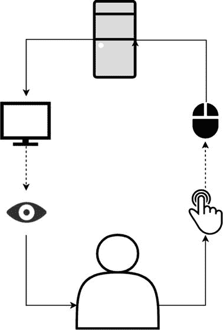
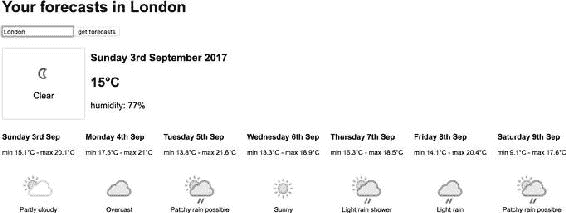
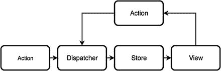
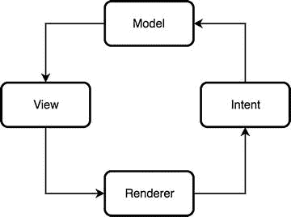
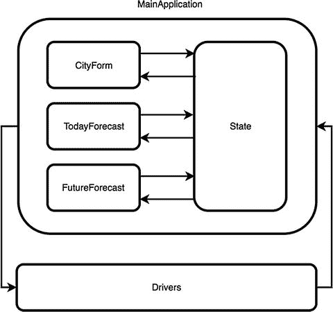

# 4.Cycle.js 和 MVI

Luca Mezzalira1  (1)London, Surrey, UK  

> 我们不能用创造问题时的思维来解决问题。
> 
> *   —Albert Einstein

In this chapter, we are introducing Cycle.js , a functional and reactive framework that is very interesting in the front-end panorama for the number of concepts ported from different languages and wired together from the knowledgeable mind of the creator and the Cycle community. Cycle.js (cycle.js.org) was created by André Staltz, one of the most famous and active advocate of the front-end reactive panorama; in fact, André is a contributor of Rx.JS and the mind behind XStream library. As we are going to see in the chapter, Cycle.js can be used in several ways. Its modularity guarantees great results in any project, providing a great level of encapsulation and enhancing the components’ reusability across multiple projects without the need of “copying and pasting” part of a specific flow from different files like in other framework implementations.

## Cycle.js 简介

The Cycle.js focus is on the interaction between computer and user, taking into consideration research on human-computer interaction and studies focused on the interfaces between human beings and computers. This interaction is a circular one between the inputs and outputs as shown in Figure [4-1](#Fig1). Figure 4-1Interaction schema between human and computer As we can see, a person can interact with a computer via its input methods (mouse, keyboard, microphone, touchpad…); for doing this, the person will use a hand or the voice as output. When the computer receives the input from the user, it will elaborate a new output related to the input received, providing it on the screen. The user then will be able to recognize and elaborate on the computer’s output via the user’s input sense (eyes or ears, for instance), understanding how his interactions affect the computer’s output, creating de facto, a circular interaction between computer and user: from here, the name of Cycle.js. We could summarize this interaction saying that between the human and the computer there is a dialogue where the two main actors are interacting with each other, reacting to the inputs and providing a new output. As we understand, this framework uses a different approach from the others we used to work with where the GUI is at the center; instead Cycle.js privileges more the interactions aspect over the graphical representation. In order to do that, Cycle.js introduces a message passing architecture where we send a message to an object and this one knows which part of the code to run based on the input received. This highly decoupled architecture stands on the opposite edge of the spectrum compared to more traditional architectures where dependency injection is heavily used and we favor objects interactions over reactivity. Cycle is not the only framework leveraging a message passing architecture; other examples could be retrieved in Akka with the actor-model architecture or in CSP (Communicating Sequential Processes) with channels. During the chapter, we will discover that using this approach will lead Cycle.js projects to a better separation of concerns and encapsulation, in favor of better components reusability across projects. But it’s time to see Cycle in action though, so let’s move to some concrete examples to truly appreciate the ideas behind this reactive framework.

## 构建简单的 Cycle.js 应用程序

The first key concept we need to stick in our mind when we work with Cycle.js is the fact that this framework is clearly separating the application logic from the side effects. For example, let’s assume we want to load some data from an endpoint after the user clicks on a button in our interface. Cycle.js separates completely the DOM rendering and the remote data fetching from the logic of preparing the HTTP request and the data manipulation to be presented in the DOM; in this way we can focus on what really matters inside our application delegating de facto the real action of manipulating the DOM or fetching remote data with a HTTPRequest object. Before examining a simple Cycle application, we need to explore how this framework is composed. In Cycle.js there are three key concepts to remember:

*   纯函数
*   流
*   司机

A pure function is a functional concept where a function can be defined as pure if it doesn’t create side effects inside the program, so when we pass a specific parameter it always returns the same output. We could summarize the pure function concept as a function where its output is determined only by the input values, and an example could be: function add(a, b){         return a + b; } In this case when I call the function add I receive a result based on the function’s arguments (a and b), and there is no possibility that external states or variables could affect the final result considering that our pure function is totally independent from the application where it is running. Another key concept is the stream , but considering we extensively talked about them in the previous chapters we can move to the next concept: the drivers. For better understanding the drivers , we need to analyze how Cycle.js is composed; otherwise we will struggle to catch why the drivers are used in this framework. Cycle.js is a modular architecture composed of multiple libraries . The core library is really small and it exposes just one method used for creating the glue between the application logic and the side effects like a DOM state rendering or remote data connection. By default, Cycle.js uses XStream as a main stream library but it allows us to use other libraries like Rx.JS, Most.js, or even a custom one created by us. We have already discussed how Cycle.js separates the application logic from the side effects : this is the key part for understanding the drivers. All the side effects in a Cycle application are handled by drivers, for instance, one of the most used ones is the DOM driver that performs the DOM manipulation received by the application logic that instead prepares a virtual DOM representation instead of interacting directly with the DOM. The communication between the drivers and the application is always made via observables; a driver can be a read and write or a read-only driver. The rule of thumb here is that a driver has always as input an observable but may or may not return an output . If we want to draw the anatomy of a Cycle application we could use this example as a skeleton: import xs from 'xstream'; import {run} from '@cycle/run'; import {makeDOMDriver, p} from '@cycle/dom' const main = sources => {     const sinks = {         DOM: xs.periodic(1000).map(v => p(`seconds: ${v}`))     }     return sinks; } const drivers = {   DOM: makeDOMDriver('#app') }; run(main, drivers); Let’s analyze what we have in this basic example. After importing XStream, Cycle run function, and the DOMDriver, all the Cycle.js applications have a run function; a pure function, composed by a sources object; and a sink object as output that contains the logic for the side effects to be applied after our application finishes the elaboration. For instance, in this example we have a stream that every second is incrementing a variable and returning a virtual DOM, in this case a virtual paragraph object. Taking a look at the DOM driver , we can see that as a parameter of the DOMDriver method we need to pass the HTML element to use for appending our future DOM elements created dynamically by our Cycle.js application. The last, but essential, thing to do is calling the method run provided by the framework for creating the glue between the main function and the drivers. What the run method is doing is simple to explain; this method is creating a circular dependency between the main function and the drivers retrieving the output of each function and returning as a source of the other as we explained at the beginning of this chapter. Obviously the input and output are always object-containing observables and it’s where Cycle is really shining with its architecture. An important piece of information that we didn’t mention before is related to the virtual DOM library used in Cycle.js. Cycle uses Snabbdom ( [http://bit.ly/2gtpUKP](http://bit.ly/2gtpUKP) ) out of the box, a JavaScript library leveraging similar concepts expressed in React.js like the Virtual DOM and good diffing algorithm, on top Snabbdom offers a modular and minimal implementation compared to React (only 200 lines of code). Performance wise, Snabbdom results faster and more performant than React.js version 15 and below; it’s heavily based on function and could be used with JSX syntax with Babel if we are familiar with React.js. Snabbdom would require another chapter for explaining in depth the beauty of this Virtual DOM library, but because it’s not the main topic of this chapter we can get more information with these resources: Snabbdom on github: [http://bit.ly/2gtpUKP](http://bit.ly/2gtpUKP) Snabbdom JSX: [http://bit.ly/2wxqDSE](http://bit.ly/2wxqDSE) React-less Virtual DOM with Snabbdom: [http://bit.ly/1QFVayF](http://bit.ly/1QFVayF) Now let’s try to see a more complete example where we are going to create a simple weather forecast application that allows the user to search for a specific city and retrieve the weather forecasts for the next five days, and the UI looks like Figure [4-2](#Fig2). Figure 4-2Cycle.js Project UI This example will follow us for the entire chapter and we will refine it with two different approaches in order to explore properly the different possibilities offered by Cycle.js. Let’s start to list what we need to do in order to create the weather application with Cycle.js:

*   我们需要使用两个驱动程序:一个用于 DOM 操作，另一个用于从远程 REST 服务获取数据。
*   我们需要创建一个带有按钮的输入字段，允许用户搜索特定的城市。
*   我们需要请求将数据呈现给天气预报服务(在本例中是第三方服务)。
*   我们需要创建一个 UI，顶部有一个标题，突出显示当天的预测，以及接下来几天的列表。

The first thing to create is the typical Cycle skeleton application with a run method , the drivers. and the main function : const main = sources => {     // here there will be our application logic } const drivers = {   DOM: makeDOMDriver('#app'),   HTTP: makeHTTPDriver() }; run(main, drivers); As planned, we have a DOM driver (makeDOMDriver) that will manipulate the DOM inside the div with id app and the HTTP driver that instead will perform the request to the weather forecast’s endpoint. That means in our main function we are going to return an object with two observables: one for the endpoint request providing which city the user is interested on, and one with the virtual DOM of our page. Then the drivers will take care to perform the actions for us. Let’s go ahead creating our application view, for instance, if we want to create the input field with the button shown in the application picture presented before, we need to create a function called getForm that will return to us the virtual DOM version of our elements: const getForm = () => div(".form", [     input("#location-input"),     button("#location-btn", "get forecasts") ]) Now we can observe for changes happening in both interactive elements in order to capture the text inserted by the user in the input field and when the user clicks the button for retrieving the forecast. In order to do that we are going to add these few lines in our main function : const input$ = sources.DOM.select("#location-input").events("focusout")                                       .map(evt => evt.target.value); const btn$ = sources.DOM.select("#location-btn").events("mousedown"); Remember that everything can be a stream when we work with reactive programming; therefore once the driver will render our interactive elements in the real DOM, it will provide us access to the real DOM available in the DOM object and we are able to observe the user interactions, thanks to the APIs provided by the DOM driver. Every time the user will click the button we will need to retrieve what he typed and prepare the request URL and the query string for allowing the HTTP driver to perform the real request. Because we need to react when the user clicks the button but also to understand what the user wrote in the input field, we are going to combine the two streams in a unique one, and we prepare the URL with the new parameters any time the producer is producing new values, so in the main function we will add: const merged$ = xs.combine(input$, btn$); const request$ = merged$.map(([city, mouseEvt]) => getRequest(city))                         .startWith(getRequest(INIT_CITY)) And we then create getRequest function that returns the composed URL: const getRequest = city => {     return {         url: `http://api.apixu.com/v1/forecast.json?key=04ca1fa2705645e4830214415172307&q=${city}&days=7`,         category: CATEGORY     } } The request$ stream will be the one that we are going to pass to the HTTP driver, and this one will perform the real HTTP request for us, as you can see Cycle is separating the application logic from the side effect, defining what the application should do from how to perform the real effect. In the combined stream, we can spot that there is a startWith method that returns a default city, in our case London, just for providing some information to the user the first time that accesses our weather application and he didn’t interact with our input field yet. It’s time to handle the response once the HTTP driver receives it; inside our main function again we are going to retrieve the HTTP object exposed by the driver, and we are going to prepare the data for a set of functions for generating the virtual DOM based on the data retrieved by the HTTP driver . const response$ = sources.HTTP.select(CATEGORY)                               .flatten() const vdom$ = response$.map(parseResponse)                        .map(simplifyData)                        .map(generateVDOM)                        .startWith(h1("Loading...")) And outside our main function we then create the functions needed for generating the UI : const parseResponse = response => JSON.parse(response.text); const simplifyData = data => {                                 return {                                     city: data.location.name,                                     current: data.current,                                     forecast: data.forecast.forecastday                                 }                             } const generateVDOM = data => div(".main-container", [         h1(`Your forecasts for ${data.city}`),         getForm(),         generateCurrentForecast(data.current),         generateNext5Days(data.forecast)     ]) As you can see in the main function, once we receive the response we need to select which one we handle, in this case the CATEGORY one described at the beginning of our application. Then we need to flatten the result because the HTTP driver returns always a stream of streams, so if we want to manipulate the data in this complex structure we need to create a flat stream (flatten method) . For creating the virtual DOM that will be passed to the DOM driver , we need now to do the following:

1.  1.解析响应并返回一个 JSON 对象(parseResponse 方法)。
2.  2.只提取我们的 UI 需要的数据，以便呈现最终结果(simplifyData 方法)。
3.  3.生成传递详细数据的虚拟 DOM(generateVDOM 方法)。

These three operations are generating a final stream with the virtual DOM that will be rendered via the DOM driver. The last bit of our main function is what it returns, so a sink object containing a stream for the DOM driver and one for the HTTP driver that represent the output of our Cycle application. This is the final implementation of our first Cycle example: import xs from 'xstream'; import {run} from '@cycle/run'; import {makeDOMDriver, div, h1, h2, h3, img, p, input, button} from '@cycle/dom'; import {makeHTTPDriver} from '@cycle/http'; import debounce from 'xstream/extra/debounce' import moment from 'moment'; const CATEGORY = "forecast"; const INIT_CITY = "London"; const getForm = () => div(".form", [     input("#location-input"),     button("#location-btn", "get forecasts") ]) const generateNext5Days = forecasts => {     const list = forecasts.map(forecast => {         return div(".forecast-box", [             h3(moment(forecast.date).format("dddd Do MMM")),             p(`min ${forecast.day.mintemp_c}°C - max ${forecast.day.maxtemp_c}°C`),             img(".forecast-img", {                 props: {                     src: `http:${forecast.day.condition.icon}`                 }             }),             p(".status", forecast.day.condition.text)         ])     });     return div(".forecasts-container", list) } const generateCurrentForecast = forecast => div(".current-forecast-container", [      div(".today-forecast", [              img(".forecast-img", {                 props: {                     src: `http:${forecast.condition.icon}`                 }             }),             p(".status", forecast.condition.text)         ]),         h3(moment(forecast.last_updated).format("dddd Do MMMM YYYY")),         h2(`${forecast.temp_c}°C`),         p(`humidity: ${forecast.humidity}%`)            ]) const parseResponse = response => JSON.parse(response.text); const simplifyData = data => {                                 return {                                     city: data.location.name,                                     current: data.current,                                     forecast: data.forecast.forecastday                                 }                             } const generateVDOM = data => div(".main-container", [         h1(`Your forecasts for ${data.city}`),         getForm(),         generateCurrentForecast(data.current),         generateNext5Days(data.forecast)     ])                             const getRequest = city => {     return {         url: `http://api.apixu.com/v1/forecast.json?key=04ca1fa2705645e4830214415172307&q=${city}&days=7`,         category: CATEGORY     } } const main = sources => {     const input$ = sources.DOM.select("#location-input").events("focusout")                               .map(evt => evt.target.value);     const btn$ = sources.DOM.select("#location-btn").events("mousedown");     const merged$ = xs.combine(input$, btn$);                             const request$ = merged$.map(([city, mouseEvt]) => getRequest(city))                             .startWith(getRequest(INIT_CITY))     const response$ = sources.HTTP.select(CATEGORY)                                   .flatten()     const vdom$ = response$.map(parseResponse)                            .map(simplifyData)                            .map(generateVDOM)                            .startWith(h1("Loading..."))     return {         DOM: vdom$,         HTTP: request$     } } const drivers = {   DOM: makeDOMDriver('#app'),   HTTP: makeHTTPDriver() }; run(main, drivers); It’s important to highlight a couple of things in this example. First of all, in our main function we are handling the input and the output of our application; we are not operating any real side effects that, instead, are delegated to the drivers. The drivers and the main applications are communicating via streams ; remember that Cycle.js is a message passing architecture, and this approach facilitates the data flow of our applications maintaining a high separation between application logic and side effects and a strong encapsulation. For the first time in this book, we are looking to a reactive implementation where the communication between different parts of our architecture are made by streams; interestingly there isn’t any knowledge in our application on how a driver is going to handle the side effects and we are not calling any specific method exposed by a driver. There is just a circular dependency between our main function and the driver that communicates only via streams. It’s important to iterate again these concepts because they will become very useful from now on considering we are going to discover MVI (model view intent), a reactive architecture heavily based on them.

## 模型视图意图架构

If you are familiar with ELM language and its architecture, MVI won’t surprise you at all, but we need to admit that this is definitely a great improvement from the architecture we used in the past and in other famous frameworks like Redux or Angular. But first, let’s see what the Model View Intent is and how it differs from the other frameworks. The first characteristic of this architecture is that it follows the unidirectional flow like the Flux pattern introduced by Facebook right after React.js, unidirectional flow is becoming a constant in many front-end reactive architectures. What it means is that the data flow is always going in a unique direction and it never changes; this helps the debugging of your application and the possibility of adding new team members without a long induction period for explaining how the architecture of your applications work or how the system works. Flux Pattern Flux is a pattern introduced by Facebook that forces a monodirectional communication flow in web applications (Figure [4-3](#Fig3)). Figure 4-3Flux data flow diagram As you can see from the schema above, every time the user interacts with an element in the view, this one dispatches an action that is caught by a global dispatcher. The main aim of the dispatcher is triggering the callbacks the stores have registered in order to listen for the actions they are interested in. Once the store receives the data from the action performed, the changes needed for the view emit a change event to the view that will retrieve the data from the store and then they will render the changes updating the components’ stated. For more information visit: [http://bit.ly/2rHN8F0](http://bit.ly/2rHN8F0) . Another characteristic we mentioned previously is the fact that the communication between Models Views and Intents happens via streams only; therefore there isn’t any direct control between different modules but just a stream as input and one as output, like we have seen in the communication between Cycle.js application logic and drivers. MVI is composed of three main modules :

*   我们精心设计用户交互并保存应用程序状态的模型。
*   我们将 UI 与模型提供的状态连接起来的视图。
*   我们订阅用户交互或输入，并将它们提供给模型以将状态更改为新状态的意图。

Figure [4-4](#Fig4) shows this architecture . Figure 4-4MVI data flow diagram The renderer part represents the DOM driver in this case. Let’s see now how we can change our simple Cycle.js example using model view intent architecture. The code we are going to explore is very similar to the previous example, so we will highlight only the key parts without investing too much time on how we have parsed the data retrieved from the HTTP driver or how we compose the virtual DOM elements rendered later on by the DOM driver. The first thing to do is to identify in our previous example the part in our main function that should be allocated to different parts of an MVI architecture. Originally our main function was implemented in the following way: const main = sources => {     const input$ = sources.DOM.select("#location-input").events("focusout")                               .map(evt => evt.target.value);     const btn$ = sources.DOM.select("#location-btn").events("mousedown");     const merged$ = xs.combine(input$, btn$);     const request$ = merged$.map(([city, mouseEvt]) => getRequest(city))                             .startWith(getRequest(INIT_CITY))     const response$ = sources.HTTP.select(CATEGORY)                                   .flatten()     const vdom$ = response$.map(parseResponse)                            .map(simplifyData)                            .map(generateVDOM)                            .startWith(h1("Loading..."))     return {         DOM: vdom$,         HTTP: request$     } } We can immediately identify the intent part in the first few lines of our implementation. As we said with the intent we are capturing the user intentions, therefore all the DOM interactions . In fact, the intent receives as input the real DOM after being rendered and as output the user intentions as streams: const intent = DOM => {     const input$ = DOM.select("#location-input").events("focusout")                                        .map(evt => evt.target.value);     const btn$ = DOM.select("#location-btn").events("mousedown");     return xs.combine(input$, btn$)                   .map(([city, mouseEvt])=> getRequest(city))                   .startWith(getRequest(INIT_CITY))    } The stream with the request will be passed to the model and to the HTTP driver for executing the request to the remote endpoint. Then we need to handle the response received from the HTTP driver , in this case the model will take care of it by preparing the data for the view: const model = (actions$, HTTP) => {     return HTTP.select(CATEGORY)                      .flatten()                      .map(parseResponse)                      .map(simplifyData) } As we can see the model receives the actions stream and the HTTP object, and in this case we don’t need to perform anything with the data inserted by the user because the response from the endpoint is providing all the data we need but potentially we could combine the data received and the user actions in order to prepare a new state for the view. The last part is merging the data prepared from the model with the view and generating the virtual DOM elements that will be passed to the DOM driver : const view = state$ => {     return state$.map(generateVDOM)                        .startWith(h1("Loading...")) } So our main function now will look like: const main = sources => {     const actions$ = intent(sources.DOM);     const state$ = model(actions$, sources.HTTP)     const vdom$ = view(state$);     return {         DOM: vdom$,         HTTP: actions$     } } Then we can take a look at the full example with MVI applied: import xs from 'xstream'; import {run} from '@cycle/run'; import {makeDOMDriver, div, h1, h2, h3, img, p, input, button} from '@cycle/dom'; import {makeHTTPDriver} from '@cycle/http'; import moment from 'moment'; const CATEGORY = "forecast"; const INIT_CITY = "London"; const getForm = () => div(".form", [     input("#location-input"),     button("#location-btn", "get forecasts") ]) const generateNext5Days = forecasts => {     const list = forecasts.map(forecast => {         return div(".forecast-box", [             h3(moment(forecast.date).format("dddd Do MMM")),             p(`min ${forecast.day.mintemp_c}°C - max ${forecast.day.maxtemp_c}°C`),             img(".forecast-img", {                 props: {                     src: `http:${forecast.day.condition.icon}`                 }             }),             p(".status", forecast.day.condition.text)         ])     });     return div(".forecasts-container", list) } const generateCurrentForecast = forecast => div(".current-forecast-container", [      div(".today-forecast", [              img(".forecast-img", {                 props: {                     src: `http:${forecast.condition.icon}`                 }             }),             p(".status", forecast.condition.text)         ]),         h3(moment(forecast.last_updated).format("dddd Do MMMM YYYY")),         h2(`${forecast.temp_c}°C`),         p(`humidity: ${forecast.humidity}%`)            ]) const generateVDOM = data => div(".main-container", [         h1(`Your forecasts in ${data.city}`),         getForm(),         generateCurrentForecast(data.current),         generateNext5Days(data.forecast)     ])   const parseResponse = response => JSON.parse(response.text); const simplifyData = data => {                                 return {                                     city: data.location.name,                                     current: data.current,                                     forecast: data.forecast.forecastday                                 }                             } const getRequest = city => {     return {         url: `http://api.apixu.com/v1/forecast.json?key=04ca1fa2705645e4830214415172307&q=${city}&days=7`,         category: CATEGORY     } } const model = (actions$, HTTP) => {     return HTTP.select(CATEGORY)                .flatten()                .map(parseResponse)                .map(simplifyData) } const intent = DOM => {     const input$ = DOM.select("#location-input").events("focusout")                               .map(evt => evt.target.value);     const btn$ = DOM.select("#location-btn").events("mousedown");     return xs.combine(input$, btn$)              .map(([city, mouseEvt])=> getRequest(city))              .startWith(getRequest(INIT_CITY)) } const view = state$ => {     return state$.map(generateVDOM)                  .startWith(h1("Loading...")) } const main = sources => {     const actions$ = intent(sources.DOM);     const state$ = model(actions$, sources.HTTP)     const vdom$ = view(state$);     return {         DOM: vdom$,         HTTP: actions$     } } const drivers = {   DOM: makeDOMDriver('#app'),   HTTP: makeHTTPDriver() }; run(main, drivers); MVI is not as complicated as it looks like; we just need to get used to it. I’d like to highlight a few key concepts that we need to bear in mind when we integrate this architecture in a Cycle.js application:

*   首先，我们将我们的 Cycle.js 项目转换成一个结构化的项目，其中的每个部分都可以被重用和单独测试。
*   这种架构甚至允许我们进一步将 MVI 架构应用于每个组件:一个 MVI 架构应用于表单，一个应用于当前日期，一个应用于工作日列表(由于其性质)。
*   使用流进行通信允许整个架构更加灵活，并增强了关注点的分离。

Before concluding the chapter with an overview of what Cycle.js brings to the reactive programming world, we need to enhance this example once again, introducing the official Cycle.js state management called Onionify.

## Cycle.js 和状态管理

After seeing MVI in action, our journey continues with Onionify, a library created for managing the application state in Cycle.js . As we know, handling the state is the key part of any web application. Cycle.js provides a unique approach to that, slightly different from what we are used to seeing with Angular or Redux. Onionify is a tiny library (2kb only) with only one purpose: managing the application state in Cycle applications. This library doesn’t provide a driver, as we have seen in other occasions, but instead Onionify is wrapping the entire Cycle.js application with a unique state that is injected across multiple components. The application state is a stream managed internally by Onionify, and each component can manipulate its own state and the parent components one via reducers. The components need to be “isolated” with the homonymous library called isolate . Isolate is a utility provided by Cycle.js that allows us to literally isolate a component, sharing only the sources provided by the main application; or a parent component, and returning a sink object that could be shared with the main application and/or other components. Let’s stop here for a moment and try to gather what we have learned until now about Cycle.js :

*   我们知道我们可以创建一个 MVI 架构的应用程序。
*   MVI 不仅可以应用于整个循环应用，还可以应用于组件。
*   这导致相同的架构应用于我们架构的所有级别，其中接收器和源是对象之间通信的唯一方式。

Considering all these facts, we can say that with Cycle.js, applying MVI, we can create a Fractal architecture that will allow us to use always the same “piece” (model view intent) for generating a bigger composition made by identical pieces applied several times. Fractal architecture Fractal architecture is not a new concept in the software development. This architecture with identical subsystems structures allows a high separation of concerns in order to shape a large project where modifying, deleting, or creating new parts won’t affect the entire application considering the isolation in which the subsystems live. Onionify applied in conjunction with MVI architecture helps by creating a solid and reusable architecture with strong separation of concerns and good encapsulation. Therefore we should be able to reuse part of our Cycle.js application in others just respecting the contract our components need, so using the correct sources (drivers and streams) and interacting with the sinks returned by them. In order to see Onionify in action, we are going to modify our weather application once again, splitting our MVI application in multiple components and using Onionify for changing the state. Figure [4-5](#Fig5) shows what our Cycle.js application will look like after introducing Onionify. Figure 4-5Cycle Onionify project diagram Let’s analyze what we have here compared to the previous application:

*   我们有三个组成部分:城市形态、今日预测和未来预测。
*   我们有一个状态，由主应用程序传递给由状态 observable 组成的 Onionify 包装器。
*   我们仍然以和以前一样的方式和车手交流；因此，我们仍然有 HTTP 和 DOM 驱动程序。

CityForm is the component with the main logic, and it is responsible for retrieving what the user is typing inside the input field and also to prepare the request that will perform then by the HTTP driver. import onionify from 'cycle-onionify'; import xs from 'xstream'; import {div, input, button, h1} from '@cycle/dom'; const INIT_CITY = "London"; const CITY_SEARCH = "citySearchAction"; const CATEGORY = "forecast"; const getRequest = city => ({         type: CITY_SEARCH,         city: city,         url: `http://api.apixu.com/v1/forecast.json?key=04ca1fa2705645e4830     214415172307&q=${city}&days=7`,         category: CATEGORY }) const getForm = location => div(".form", [     h1(`Your forecasts in ${location.city}`),     input("#location-input", {props: {value: `${location.city}`}}),     button("#location-btn", "get forecasts") ]) const parseResponse = response => JSON.parse(response.text); const simplifyData = data => function changeState(prevState) {                                 return {                                     city: data.location.name,                                     current: data.current,                                     forecasts: data.forecast.forecastday                                 }                             } const model = (actions$, HTTP) => {     const reducer$ = HTTP.select(CATEGORY)                .flatten()                .map(parseResponse)                .map(simplifyData)     return reducer$ } const intent = DOM => {     const input$ = DOM.select("#location-input").events("focusout")                       .map(evt => evt.target.value);     const btn$ = DOM.select("#location-btn").events("mousedown");       return xs.combine(input$, btn$)              .map(([city, mouseEvt]) => getRequest(city))              .startWith(getRequest(INIT_CITY)) } const view = state$ => state$.map(state => getForm(state)) export const CityForm = sources => {     const state$ = sources.onion.state$;     const actions$ = intent(sources.DOM);     const reducer$ = model(actions$, sources.HTTP);     const vdom$ = view(state$);     return {         DOM: vdom$,         onion: reducer$,         HTTP: actions$     } } As we can immediately recognize, we have a new parameter from the sources that is provided by Onionify wrapper; this library provides an onion object that contains the state stream, based on that we can interact with the parent state stream, reacting to that, or manipulating the internal component state as well. Overall the component is very similar to what we had in the previous application, and the only change is related to the application state that represents the response coming from the weather API, so the CityForm is using the state stream just for retrieving the location chosen by the user. The last thing to mention is to understand what this component is returning as sink and how we can immediately spot the onion property containing the HTTP response as the state of the application. As we can recognize, this component is self-contained, so if we would like to reuse it in another application we would be able to do it without the need for changing anything: that’s the power of working with a fractal architecture where the reusability, separation of concerns, and encapsulation are first citizens in the architecture. Before investigating how we need to modify App.js for handling Onionify library, let’s do a quick tour of the other two passive components: TodayForecast and FutureForecast. These two components are passive because they just need to render some content provided by the state; they don’t have user interactions and they are not going to manipulate any parent state or perform new HTTP requests. This is the TodayForecast component : import {div, h2, h3, img, p} from '@cycle/dom'; import moment from 'moment'; const generateCurrentForecast = forecast => div(".current-forecast-container", [     div(".today-forecast", [             img(".forecast-img", {             props: {                 src: `http:${forecast.condition.icon}`             }         }),         p(".status", forecast.condition.text)     ]),     h3(moment(forecast.last_updated).format("dddd Do MMMM YYYY")),     h2(`${forecast.temp_c}°C`),     p(`humidity: ${forecast.humidity}%`)        ]) const view = state$ => state$.map(state => generateCurrentForecast(state.current)) export const TodayForecast = sources => {     const state$ = sources.onion.state$;     const vdom$ = view(state$)     return {         DOM: vdom$     } } In this chunk of code we can spot in the TodayForecast function the state stream for rendering the view that corresponds to the weather data representation for the specific moment when the user is requesting the forecasts. Considering this is a passive component, its only duty is providing the virtual dom to the DOM driver for rendering the view. Obviously, in case of any user interaction that could change the application state, this will be reflected in the sink and it would have been able to share the new state via the onionify property of our sink – the same in case it would need to trigger a new HTTP request to the weather forecast endpoint. Let’s take a look to the FutureForecast component then: import {div, h3, img, p} from '@cycle/dom'; import moment from 'moment'; const generateNext5Days = forecasts => {     const list = forecasts.map(forecast => div(".forecast-box", [             h3(moment(forecast.date).format("dddd Do MMM")),             p(`min ${forecast.day.mintemp_c}°C - max ${forecast.day.maxtemp_c}°C`),             img(".forecast-img", {                 props: {                     src: `http:${forecast.day.condition.icon}`                 }             }),             p(".status", forecast.day.condition.text)         ])     );     return div(".forecasts-container", list) } const view = state$ => state$.map(state => generateNext5Days(state.forecasts)) export const FutureForecast = sources => {     const state$ = sources.onion.state$;     const vdom$ = view(state$)     return {         DOM: vdom$     } } Also, this component is very similar to the previous one, and it doesn’t need to share any state update. It’s just consuming the state stream in order to render the new virtual dom to provide to the DOM driver. Finally, it’s the turn of App.js where we can find the glue for our “onionified application ”: import xs from 'xstream'; import {run} from '@cycle/run'; import {makeDOMDriver, div, h1} from '@cycle/dom'; import {makeHTTPDriver} from '@cycle/http'; import isolate from '@cycle/isolate'; import onionify from 'cycle-onionify'; import {CityForm} from './CityForm'; import {TodayForecast} from './TodayForecast'; import {FutureForecast} from './FutureForecast'; const generateVDOM = ([formVNode, todayVNode, futureVNode]) => div(".main-container", [         formVNode,         todayVNode,         futureVNode     ]) const view = (locationDOM$, todayForecastDOM$, futureForecastDOM$) => {     return xs.combine(locationDOM$, todayForecastDOM$, futureForecastDOM$)              .map(combinedStreams => generateVDOM(combinedStreams))              .startWith(h1("Loading...")); } const main = sources => {     const cityLens = {         get: state => state,         set: (state, childState) => childState     }     const locationSink = isolate(CityForm, {onion: cityLens})(sources);     const todayForecastSink = isolate(TodayForecast, {onion: cityLens})(sources);     const futureForecastSink = isolate(FutureForecast, {onion: cityLens})(sources);     const locationReducer$ = locationSink.onion;     const httpRequest$ = locationSink.HTTP;     const vdom$ = view(locationSink.DOM,                        todayForecastSink.DOM,                        futureForecastSink.DOM);     return {         DOM: vdom$,         HTTP: httpRequest$,         onion: locationReducer$     } } const drivers = {   DOM: makeDOMDriver('#app'),   HTTP: makeHTTPDriver() }; const mainOnionified = onionify(main); run(mainOnionified, drivers); Here we can find quite a few interesting new concepts, so let’s start to describe what we are doing from the end of our JavaScript file. As we mentioned, Onionify is not a driver but a wrapper around our application; therefore we used it for wrapping our main function and we passed the decorated, or onionified, version of our main function to the run method. This allows us to pass the state through different components via the onionify property in our sources and sinks. Let’s now take a look on what the main function looks like. We start with a lens called cityLens. Lenses are used when a component needs to access the same object of its parent like in our case but also when we need to manipulate the state before it lands into a specific component. Technically speaking a lens is an object with a getter and a setter, nothing really complicated, but they are very useful in functional programming specifically when we use them for composing objects. Lenses are also well known in the Haskell language, in the JavaScript world they are used in conjunction with Immutable.js , and definitely they are present in Ramda (lensProp method for instance), a JavaScript functional library. After the lens definition , which will allow us to share the data present in the component with the others, we have the instantiation of our three custom components with the isolate utility offered by Cycle.js. We are passing the lens to each component and the sources, and this allows us to get interaction with the parent component inside each component . In this case it’s the parent component in the application itself but it’s clear by the approach, working in this way, we can wrap our component defining a standard input/output contract and reuse it easily in different parts of the same application or even better in other applications. After creating the instances of our components it’s time to pass the manipulated state and the HTTP request to the associated properties in our sink object. In this case we need to highlight a couple of things. In this project the state is handled by the endpoint response, and there isn’t any manipulation from other components that are just used for the rendering phase. Obviously, if we check other examples present in the Onionify repository ( [http://bit.ly/2eQXh9S](http://bit.ly/2eQXh9S) ), we can see that instead of passing just a stream as an application state like we are doing, we can combine multiple streams from different components in order to store a more complex application state. The last bit is retrieving all the streams containing the virtual dom prepared by the different components and combine them all together for producing the look and feel of our Cycle application. For doing that, we create a view method that collects all the streams and combines them in a unique one that will generate the final stream with the virtual dom that will be rendered by the DOM driver. I’d like to get your attention on the way we are doing that because as you can see, it’s a little bit verbose, in particular when the application grows and we need to merge multiple components. In these cases we should prepare some utils methods for handling these situations (wrapping in a single or multiple functions would make the deal). Cycle.js doesn’t come with anything useful out of the box, but there are some libraries that are aiming for that. At the moment, however, there is nothing official for achieving a more readable and flexible approach.

## 总结

In this chapter, we evaluated our first fully reactive framework, understanding what Cycle.js brings to the table, and the different architectural approaches used for achieving that. Cycle is maintained by a small but very talented community that is porting many reactive and functional concepts from other languages in the JavaScript community. I believe that it is one of the most innovative approaches we can find in the front-end reactive architecture ecosystem at the moment. MVI is, in my opinion, merging the best from older architectures like MVP, for instance, and the unidirectional flow that is characterizing the latest front-end architectures like Redux. There is still a lot to do in our reactive journey, so it’s time to move on and talk about our next functional reactive state management library: MobX.