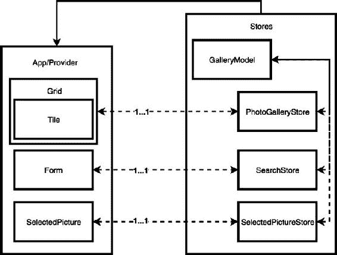
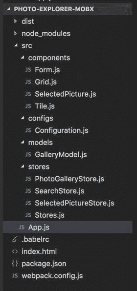
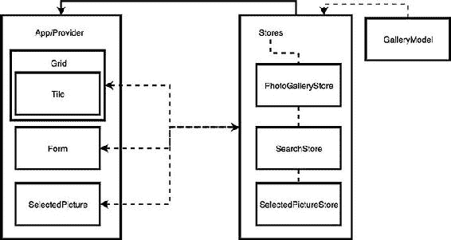

# 五、MobX：简单状态管理

> 做，或者不做。没有‘尝试’。—尤达

After a deep dive into the first reactive framework, we can continue our journey discovering others’ reactive architectures, reviewing a flexible and easy-to-use state management system like MobX . MobX is simple but very effective state management system that we can integrate in many projects independently from the stack we are using. Obviously being simple doesn’t mean incomplete; we can really structure complex applications with the help of MobX state tree: an opinionated, transactional and MobX powered state container heavily based on the tree data structure for handling the application state. During this chapter, we are going to review a couple of examples that will give us an idea of how to structure a MobX application and what are the benefits of using it in our projects.

## MobX 简介

The philosophy behind MobX is very simple: Anything that can be derived from the application state, should be derived. Automatically. Usually when we have a non-reactive application and we want to update its state, we create methods for manipulating manually specific parts of the model and for updating the views, potentially causing inconsistency between the two, sometimes increasing the coupling between them. With MobX we are trying to minimize these situations having an automated update, via subscription (observer) , to reactions that happened at the application state level (observables). MobX has a few key concepts to remember in order to properly embrace the library:

*   可观测量用于导出我们的应用程序的状态；这里的经验法则是，一个可观察对象应该存储一个定义我们的应用程序中的状态的值。
*   计算值是用于以同步方式使用函数从应用程序状态自动导出复杂值的属性；这种机制允许更好地预测和调试我们的计算值。计算值延迟更新。
*   反应类似于计算值，因为从应用程序状态开始生成新值，但在这种情况下，它们用于生成副作用。
*   动作是用于改变应用程序状态的方法；如果我们指定在严格模式下使用 MobX，动作是更新应用程序状态的唯一方式。
*   观察器在视图中用于对任何状态变化做出反应。

With just these concepts we can start to build a simple MobX application to get familiar with it. MobX finds the perfect fit with Virtual DOM libraries like React.js; actually, React and MobX are a great combination for creating reactive applications, but obviously this won’t mean other frameworks are out of scope, but React is combined perfectly with the MobX philosophy. Before going ahead, let’s see MobX in practice with a simple counter : import React from 'react'; import ReactDOM from 'react-dom'; import {observable} from 'mobx'; import {observer} from 'mobx-react'; const counterState = observable({     value: 0,     inc: function(){         counter.value++     },     dec: function(){         counter.value--     } }); @observer export class Counter extends React.Component{     render(){         return (
             {this.props.state.value}             
                 <button type="button" onClick={this.props.state.inc}>increment</button>                 <button type="button" onClick={this.props.state.dec}>decrement</button>             
         
)     } } ReactDOM.render(     <Counter state={counterState}></Counter>,     document.getElementById("app") ); In this example, we used React.js creating a component called Counter and passing an external object called counterState that represents the application state. CounterState is an observable, and it contains a property called value that is updated by two actions (inc and dec functions). The observable object, created in this way, automatically treats the methods that are updating the observable as actions. Every time one of these actions is triggered by the user interface, the value property will be updated and, by reaction, the view that is observing the application state. If we now check the React component we can immediately spot an @observer – this is a decorator that wraps our component into a function allowing us to create the reaction between what is observed in the React component and the application state present in the MobX observable. Es7 Decorators and Mobx Project Setup The Decorator pattern is used to express high-order function with a simple syntax; in fact, a decorator expressed with the syntax @decoratorName, it represents a function that is wrapping another function, extending its behavior. Decorators in JavaScript are introduced with ES7; therefore they are a fairly new addition to JavaScript specifications, and any decorator we are using in our examples can be removed if you prefer working directly with functions, as they are just a convenient way that MobX provides them out of the box to save you from having to write tons of code. In our example, we were decorating a React component in order to augment its behaviors and observe any change happening to a computed value or an observable. When we work with decorators and we use transpilers like Babel, we need to remember to set up the MobX project correctly using the Babel’s plug-ins: babel-plugin-transform-decorators-legacy and babel-plugintransform-decorators. These two plug-ins allow our MobX project to be transpiled correctly without any issue. Anyway, you can consult the setup of our examples, as they are all using Babel in combination with webpack and I kept to the bare minimum modules to strictly transpile the project. In few lines of code we were able to create a simple MobX – React application separating completely the application state and its behaviors from the user interface, allowing us to potentially reuse these two elements or changing them without incurring any potential bugs introduced by the changes. Also, MobX embraces fully the reactive paradigm where the application state is updated via observables decoupling de facto the view from the model via a common contract that can be understood by the two main actors. A nice thing to highlight is how MobX optimizes the computed values updated behind the scenes; this reactive library is taking care of updating only the computed values that are linked to a specific state, only when they change, and it won’t compute all the others present in the application. The mechanism is very similar to what React.js is doing during the reconciliation phase: checking what are the differences inside the dependency tree and via a diffing algorithm, updating only the values that should be changed, maintaining high performances also when the tree is deep and complex like in large applications. React Reconciliation and Mobx Diffing Algorithm React and MobX are sharing a couple of concepts like the diffing algorithm. Understanding how these algorithms work is very important because we can improve the performance of our applications just by following the best practices described in the documentation. Therefore I thought it would be beneficial to share some links for getting deeper into this argument: React reconciliation : [http://bit.ly/2xHYifx](http://bit.ly/2xHYifx) In-depth explanation of MobX: [http://bit.ly/2g2fYIW](http://bit.ly/2g2fYIW) Fundamental principles behind MobX: [http://bit.ly/2x7YcJL](http://bit.ly/2x7YcJL) After this introduction on the key elements behind MobX, it’s time to see a MobX application in the real world, so in this case we are going to build a MobX and React application based on an image gallery and the same one with MobX state tree. In this way we can compare the two approaches, understanding the pros and cons of both and describing the different architectural approach.

## 我们的第一个 MobX 和 React 应用

In this chapter’s projects, we are exploring four key architectural areas to cover in the majority of front-end applications like these:

*   如何在应用程序中管理数据流。
*   如何处理用户交互？
*   如何使用远程端点。
*   如何管理应用程序的状态？

The application we are going to build is an image gallery similar to Figure [5-1](#Fig1). Figure 5-1The project UI It could be interpreted as a component of a larger application but it’s important to cover the concepts listed above and then we will be able to replicate them in projects at scale. The service we are going to consume for searching images is the Flickr APIs. Flickrs allow us to perform a search on their catalogue based on a specific search term. Figure [5-2](#Fig2) shows how our MobX application is structured. Figure 5-2MobX project architecture diagram On the left of the diagram we have all the views, and in our case are passive views that are used only for rendering the user interface and gathering the interactions handled by the stores. Each view has a 1 to 1 relation with a store; this is very similar to what we have done in the second chapter when we analyzed the MVP architecture. Doing it will guarantee a great separation of concerns (view representation and application behaviours are separated) and components reusability (we could change completely the views without affecting the application behaviours and vice-versa) – two important principles to take into consideration in any software architecture. On the right we have instead all the stores instantiated from the stores object. In each store we are going to inject an application model called GalleryModel . This is not a concept requested by MobX, but we want to create solid architectures with great flexibility and high code standards, creating a model that will allow us to gather all the application states, or component states, inside a unique object that will be visible to all the stores. In this way, it will be easier to maintain separation of the different stores that are not aware of the existence of others and on top will facilitate the application debugging because the application state is present in a unique place instead of being spread in different stores. Considering MobX uses observables for storing the application state, this means that inside the model we are going to have observables and potentially some actions for changing the observable, but all the computed values will be closer to the view at the store level. Let’s now take a look at the folder structure used for this project.

### 检查文件夹结构

Obviously, the project is also available on the Github repository of this book, so feel free to download it to better help you to follow the next steps. As you can see in Figure [5-3](#Fig3) the folder structure resembles our architecture with a separation per file type (stores, models, components. and so on) instead of a domain approach (a search folder, am image gallery folder…). Figure 5-3MobX project structure In large applications I usually prefer gathering the files in domain folders, and this could really help to understand better the application, in particular, for new developers that are approaching the application for the first time. This way it’s easier to find a correlation of what we see on the screen and the folder name when the names are meaningful enough. It is time to write our MobX application, but the first thing we do is to compose the general structure of our application, defining it in the App.js file. We need to create three main React components: a text input for performing a search, a pictures grid, and a selected image component for better viewing an image. ... @observer export class App extends React.Component{     render(){         return (         <Provider {...stores}>             <MuiThemeProvider>                 
                     <Form/>                     <Grid style={style.child}/>                     <SelectedPicture style={style.child}/>                 
             </MuiThemeProvider>         </Provider>)     } } ReactDOM.render(     <App/>,     document.getElementById("app") ); There are a couple of things to highlight in these few lines of code: first of all is the observer decorator. We have already seen it in the first MobX example; the decorator allows us to react to a state change triggering the render function inside the React component like it would happen when we change the props or state property. Another key thing of the component is called Provider , wrapping our entire UI. This is provided by MobX-React library and it’s a utility for specifying a context that will be accessible by any part of the application. In this case, MobX is using it for providing access to the store objects inside any of our components via a dependency injection mechanism that we are going to see in action when we discuss stores. The Provider object contains a property called stores where we are providing all the stores that compose this application: ... const model = new Model(); const photoGallery = new PhotoGalleryStore(model); const search = new SearchStore(model); const selectedPicture = new SelectedPictureStore(model); export {     photoGallery,     search,     selectedPicture } In the stores object , we just exposed the three stores that interact with the views they are linked to. As we have seen before in the project architecture diagram, we want to have a 1 to 1 correlation between views and stores; this will help us in the future by reusing a specific part of a MobX application in other projects. An important thing to describe is the role of the Model object , in the tradition of MobX architecture we don’t have the concept of a model where the application state is spread across multiple stores. In our application instead, we used that for wrapping all the observables that represent the application state, leaving the domain-specific observables, the computed values, and the actions inside the stores. We are using this technique because otherwise, in order to change the value or observe a specific observable present in another store, we would need to get access and knowledge to other stores not only exposing the observable but potentially having the possibility to call actions or other methods available in the store itself. In this way, we have the application state represented inside the model that is injected inside each store, and they can observe or change the application state directly. This, in conjunction with the reactive paradigm, will trigger to update all the computed values that are observing a specific observable and it will update the related views. The search domain is composed by an input text with a button: ... @inject('search') @observer export default class Form extends React.Component{     setSearchTerm(evt){         this.props.search.changeSearchTerm(evt.target.value)     }     search(){         this.props.search.requestPics();     }     getButton(){         return (             <RaisedButton label="SEARCH" primary={true} style={style} onClick={this.search.bind(this)}/>         )     }     getSpinner(){         return (             <CircularProgress size={35} thickness={5}/>         )     }     render(){         return (             
                 <TextField hintText="e.g. Bear" onBlur={this.setSearchTerm.bind(this)}/>                 {                     this.props.search.isSearching ? this.getSpinner() : this.getButton()                 }             
         )     } } In the React components we can also inject our stores in order to interact with them; the rule of thumb here is always decoupling the behavior of our components from the look and feel; delegating, de facto, their logic to the store that will be responsible to interact with the rest of the application; retrieving from a remote endpoint; or manipulating the application state. This approach allows us to change the views without introducing bugs in their behaviors and also it definitely helps in the testing of the components and their behaviors because it becomes very easy to define the boundaries of the two worlds. MobX provides an inject decorator for implementing the dependency injection; therefore we can use this decorator for injecting the store inside the React component. The store is accessible via the props property available in any React component, so we can call a method simply writing this.props.store.method where store is the name we assigned to the store and method is the name of the method we want to call. The last important highlight of this component is the variable isSearching, clearly a Boolean, which is an observable with a domain specific to this component and not to the entire application. This property won’t be shared across other stores, so we can define it in the store dedicated to the Form component instead of defining it as an application state. As an observable, every time the value changes, the view subscribed to the observable property will automatically react to the change, calling the render function again. Let’s see how the Form’s store is implemented: import {observable, computed, action} from 'mobx'; import Config from '../configs/Configuration'; export default class SearchStore{     @observable isSearching = false;     constructor(model){         this.model = model;     }     @computed get url(){         return Config.getSearchURL(this.model.searchTerm);     }     @action changeSearchTerm(term){         this.model.searchTerm = term;     }     @action requestPics(){         this.isSearching = true;         fetch(this.url)             .then(this.onData)             .then(this.onResult.bind(this))     }     @action onData(response){         return response.json();     }     @action onResult(response){         this.isSearching = false;         this.model.picsList = response.photos.photo.map(value => {             return {                 id: value.id,                 title: value.title,                 image: Config.getPicURL(value),                 large_image: Config.getLargePicURL(value)             }         });     } } In the constructor, we have the model injected when we instantiated the store, and we have also the isSearching property as an observable like we described before. Finally we see in practice the computed values and the actions mentioned at the beginning of this chapter. In this store, we have a getter for the URL used for searching the images on Flickr, and this computed value will return a new URL every time the searchTerm changes (observable present in the model). We are going to review the main model at the end of this description. I’d like to capture your attention on the Config object; this is used as a static object for composing the URLs inside the application and in this case, we are just importing the Config object in the store that needs it, but in the next example on the MobX state tree, we are going to see a different approach that is way more elegant. Every time the textinput triggers the blur event we are calling the changeSearchTerm method in the store, updating the observable in the model. Instead, once the user is clicking the search button in the UI, we are performing the search method (requestPics method), and there we immediately change the isSearching observable forcing the component to update substituting the button with a spinner preventing the possibility of additional requests to the server. After that we are performing the real request to the Flickr APIs layer and once we retrieve the response, we are storing in the application model a filtered version of the data we received, composing also the URLs for the small and big pictures ( onResult method ). As we have seen until now, we have updated few observables that represent the application state, inside the model object ; now it’s time to see what the model looks like: import {autorun, observable} from 'mobx' export default class GalleryModel{     @observable searchTerm = "";     @observable picsList = [];     @observable selectedPictureURL = null;     constructor(){         autorun(()=> {             if(this.picsList.length > 0){                 this.selectedPictureURL = this.picsList[0].large_image             }         })     } } Our model is composed of a bunch of observables that can be available to all the stores; therefore any computed values that are using them will react to the change. Also in the constructor we can see another MobX method, autorun, which is used for handling side effects, in our case every time we are changing the picsList array we are defining the first image selected so the user will be able to see an image without interacting with the grid. In this case we wouldn’t be able to use computed values because they can be only getter related to a specific observable value; so autorun comes to the rescue by observing any value expressed in its body and reacting every time this value is updated. Autorun, like computed values, is reacting only when a change happens to an observable. It’s very handy in situations like this one where we need to create a side effect because the alternative would have been to change the selectedPictureURL inside a store that shouldn’t be aware of the existence of this value, considering it’s not using it all. Instead, with autorun we can wrap the update logic inside the model maintaining the contract where each store is related 1 to 1 with its view and update the application state related to itself without being aware of the existence of other observable. In the SearchStore we update the value of the picsList observable inside the main model. Now it’s the turn of the grid component that will render the results retrieved from the remote service. ... @inject('photoGallery') @observer export default class Grid extends React.Component{     render(){         const tiles = this.props.photoGallery.pics.map(pic => {             return (                 <Tile key={pic.id} data={pic}/>             )         })         return (           
             <Chip style={styles.chip}>                 {`total images: ${this.props.photoGallery.totalPics}`}             </Chip>             <GridList                 cellHeight={180}                 cols={3}                 padding={5}                 style={styles.gridList}>                     {tiles}             </GridList>           
         )     } } The Grid component has its own store, photoGallery, and it’s retrieving from there two main values: the pictures array and a property called totalPics used for displaying how many pictures were retrieved from the service. Another thing to notice is that we are dynamically creating the Tile components for populating the GridList component , and the tiles are created anytime we are updating the pics property from the store. The store for the grid component is this one: import {observable, computed, action, autorun} from 'mobx' export default class PhotoGalleryStore {     constructor(model){         this.model = model;     }     @computed get pics(){         return this.model.picsList     }     @computed get totalPics(){         return this.model.picsList.length;     }     @action selectedPicture(url){         this.model.selectedPictureURL = url;     } } As we can immediately spot, the pics property is a computed value. This is a suggestion I provide because if, for any given reason, we need to change the model or the store, we won’t have any coupling with the view, as long the contract between the objects remains the same then we would be able to refactor what we need without affecting the view. Also, the model is totally decoupled from the view, like in the MVP architecture, embracing, in a simple way, future changes inside our application and making it more robust and easy to test. Every time the user is clicking on a picture we need to change the image selected, but in order to do that we need to see who is calling the selectedPicture method present in the PhotoGalleryStore . ... @inject('photoGallery') @observer export default class Tile extends React.Component{     selectedPic(e){         this.props.photoGallery.selectedPicture(this.props.data.large_image)     }     render(){         return (             <GridTile                 style={styles.gridTile}                 onClick={this.selectedPic.bind(this)}                 title={this.props.data.title}>                              </GridTile>         )     } } In the Tile component, we are injecting the photoGallery store instance; this gives us the possibility of changing the large image by simply providing the large image URL present in the props object of the single tile. The selectedPicture method will then update the observable in the model where we store the picture URL to use for retrieving the large image, so the last bit of this example is introducing the SelectedPicture component. ... @inject('selectedPicture') @observer export default class SelectedPicture extends React.Component{     render(){         const url = this.props.selectedPicture.picPath;         return (             <Card style={style}>                 <CardMedia>                     {                         url ?  : ""                     }                 </CardMedia>             </Card>         )     } } This component is really simple; we are just displaying a different image every time the url property changes. Here also here we can see the MobX pattern for injecting a store (selectedPicture store) and to observe any change happening to a computed value or observable. The store for the SelectedPicture component is composed in this way: import {computed, action} from 'mobx'; export default class SelectedPictureStore{     constructor(model){         this.model = model;     }     @computed get picPath(){         return this.model.selectedPictureURL || ""     } } Also in this case we are not providing the observable to the view but just a computed value via a getter. Figure [5-4](#Fig4) shows the data flow in this application. Figure 5-4 Data flow diagram

1.  1.用户与调用商店中的动作的 UI 进行交互。
2.  2.该操作更新了主模型中的一个可观察对象。
3.  3.订阅该可观察对象的所有计算值都在更新该值。
4.  4.视图中存在的计算值或可观察值导致呈现具有新状态的组件。

This is a simple MobX example that provides the idea of how this framework is using the reactive programming paradigm via observables. As we can see, the single responsibility principle is respected and in a certain way enforced by the observables, computed values, and actions. At the same time we can spot a certain freedom that probably won’t help much in larger teams where any developer could possibly interpret this flexibility as a way to take shortcuts if needed. Not only for this reason but also for providing a more structured way for writing large applications, we can possibly use MobX state tree, an opinionated library that is creating clear boundaries around the application structure, and it helps to create a solid and scalable architecture enforcing the concepts of automatic derivation and immutable state in an effective way.

### MobX 状态树

As the name suggests, MobX state tree is based on immutable trees, in particular the benefits provided by this library are the following:

*   编写隐藏了反应式实现的“命令式”代码的可能性，因此接触反应式范例的新开发人员的学习曲线应该更容易。
*   可变数据结构，其中在幕后由库本身创建和维护不可变的树快照，还提供了与同构应用程序很好地工作的可能性，其中我们可以为特定状态注入树，应用程序将对此作出反应。
*   商店类型系统提供开箱即用的可能性，指定原始和自定义值。
*   商店级别的生命周期挂钩，类似于 React 组件中的挂钩。
*   明确如何构建存储以及如何更新应用程序状态的界限。

These are just a few of the key features provided by MobX state tree. The interesting point of MobX state tree is the fact we are dealing with a tree structure, similar to what we are used to when we work with the DOM on the UI. At the same time, this means we have a strong hierarchy to deal with. Therefore when we structure our state trees we need to pay more attention to how we encapsulate our data and how we handle the dependencies between different branches of the tree. The best way to understand the problems we might encounter using MobX state tree is trying to implement it in our previous project in order to find possible solutions and new approaches. Refactoring the previous project won’t require many changes; in fact the views will remain almost the same. Refer to Figure [5-5](#Fig5) for an eagle eye view of our architecture before deep diving inside the code. Figure 5-5MobX state tree application architecture Comparing this architecture with the previous one we immediately notice a few differences :

*   在组件内部，我们将注入整个树，而不像前面的实现那样只是一个特定的商店。
*   GalleryModel 不是在商店内创建的对象，而是由应用程序树组成的。
*   商店之间有一个层次结构，有一个根和多个节点(PhotoGalleryStore、SearchStore 和 SelectedPictureStore ),因此我们可以在商店之间双向遍历数据。

In a certain way, this last feature could be the most dangerous to deal with, because if we are not able to structure the stores in a smart way respecting our domain, we could end up in a large application with a lot of dependencies between stores, thus introducing coupling where it is not needed and complicating the evolution of our project or the refactor of specific design implementations. A suggestion I feel that is useful to share is that we should structure our large applications with multiple trees, as this will help us to maintain and potentially reuse our code in a better way. The trick is always dividing by domain our application; when we are able to identify clearly the boundaries of a specific domain, structuring a state tree becomes easier. After this brief excursus of MobX state tree architecture, it is time to see how we could apply this to our image gallery project, so we are going to analyze the differences compared with the previous project where we used just MobX with a custom architecture. App.js introduces a few new concepts strictly related to the MobX state tree library: ... const augmentedStore = types.compose(GalleryModel, Stores); const PicsGalleryStore = augmentedStore.create({     picsList: [],     searchTerm: "",     selectedPictureURL: "" }, {config: Config}); @observer export class App extends React.Component{     render(){         return (             <Provider store={PicsGalleryStore}>                 <MuiThemeProvider>                     
                         <Form/>                         <Grid style={style.child}/>                         <SelectedPicture style={style.child}/>                     
                 </MuiThemeProvider>             </Provider>)     } } ReactDOM.render(     <App/>,     document.getElementById("app") ) The application structure remains the same, but before defining the component we are using the types object provided by the MobX state tree for composing the main application model with the different stores. This will allow us to access the application state present inside the model from the root of our application tree without the need to create additional nested nodes. MobX state tree provides the possibility of composing trees and that is a very interesting feature mainly because our application could become quite large during the time, and working with composition over inheritance will allow us to be flexible enough for refactoring, adding new features, or making drastic changes without many problems. Another thing to highlight is that inside our composed tree variable we are defining the initial values of the application state. This is another feature of MobX state tree: it forces us to set a default value for mandatory objects like in this case the searchTerm, picsList, and the selectedPictureURL. This feature is part of the checks that the MobX state tree is doing at runtime; without defining these values, the application will trigger a meaningful error regarding the root cause of the problem, thanks to the type system check present inside the library. Finally, once we create the augmentedStore node , passing a third parameter for the configuration object, that is the way MobX state tree injects an object into a store; it’s just a simple dependency injection mechanism. This mechanism is very handy because it gives us the flexibility to inject multiple objects in a tree without the need to maintain singletons or instantiating different objects. In this case we are using the dependency injection for the configuration utils but potentially we could use it for a logger object or any other utility that we want to use in our application. The changes we have just seen in the main application lead to changes on the stores object : import { types } from "mobx-state-tree" import PhotoGalleryStore from './PhotoGalleryStore'; import SearchStore from './SearchStore'; import SelectedPictureStore from './SelectedPictureStore'; const stores = types.model({     photoGallery: types.optional(PhotoGalleryStore, {}),     search:types.optional(SearchStore, {}),     selectedPicture: types.optional(SelectedPictureStore, {}) }) export default stores; What we are doing is describing a tree composed by multiple nodes where we described the stores as optional values, appending them to the root of our state tree. Types.model represents the shape of an object and we are going to see in the other stores how we have modified them in order to accommodate the key parts of MobX described in the previous section. Considering the React components are maintaining the same structure from the previous examples, we are going to focus our attention on how MobX state tree handles stores and our custom addition of the model. We start with the GalleryModel : import {types} from 'mobx-state-tree'; const Picture = types.model("Picture", {     id: types.identifier(),     title: types.string,     image: types.string,     large_image: types.string }) const model = types.model({     searchTerm: types.string,     picsList: types.array(Picture),     selectedPictureURL: types.string }).actions(self => ({     setPicsList(arr){         self.picsList = arr;     },     setSelectedPictureURL(url){         self.selectedPictureURL = url;     },     setSearchTerm(value){         self.searchTerm = value;     } })) export default model; In this object we can start to see a more complete structure of a tree’s node. In this case we have defined the state of our application that will guarantee reactions every time a value in the model changes: the first object right after the types.model definition represents the observables objects like we had in the previous MobX example. Each of them need to be typed with a specific primitive or complex type like in the case of the picsList where we defined the Picture model that represents the data structure contained in each single element of our array. This feature will save us a lot of debugging time because we are sure we cannot have data discrepancies inside our models. This is exactly what we expect: otherwise the application won’t work. This is also another reason why at the beginning I was suggesting that you invest time defining the application’s domains; doing that will save you from the possibility of structuring your models in an incorrect way, producing de facto a system that will help out to resolve issues inside an application. Therefore we should always start our projects defining our models and their interaction with the main tree and then focusing on the UI of our application. Another constrain of MobX state tree is that we cannot update the observables directly but only via actions. These boundaries help a lot in large applications because they are providing direction without the possibility of having different implementations for achieving the same result. Therefore we have defined multiple actions for providing the possibility of updating the application state. Inside the actions object implementation we have added the argument self: it’s defined by the MobX for allowing us to maintain the right scope without creating a manual binding. Self will be available when we declare computed values later on in the chapter. Now we can add another piece to our knowledge of our MobX state tree, introducing the computed values in a model like we have done in the SearchStore : import { types, getParent, getEnv} from "mobx-state-tree"; const searchStore = types.model({     isSearching: false, }).views(self => ({     get url(){         return getEnv(self).config.getSearchURL(getParent(self).searchTerm);     } })).actions(self => ({     requestPics(){         self.isSearching = true;         fetch(self.url)             .then(self.onData)             .then(self.onResult.bind(this))             .catch((err) => console.log(err))     },     onData(response){         return response.json();     },     onResult(response){         const configuration = getEnv(self).config;         const model = getParent(self);         self.isSearching = false;         const picsArr = response.photos.photo.map(value => {             return {                 id: value.id,                 title: value.title,                 image: configuration.getPicURL(value),                 large_image: configuration.getLargePicURL(value)             }         })         model.setPicsList(picsArr);         model.setSelectedPictureURL(picsArr[0].large_image);     },     changeSearchTerm(term){         getParent(self).setSearchTerm(term);     }, })) export default searchStore; In this case we added another element to our model called views, and the views are expressed with an object literal and they are the translation of computed values in a MobX state tree model object. The views behave exactly in the same way as computed values: they react to any change of state. Thus we should be already familiar with this concept. Let’s try now to recap how a MobX state tree model is composed, considering we have explored the key parts :

*   模型需要一个描述模型状态的对象(类似于 MobX 中的 observables)。
*   视图需要一个对象，我们在其中指定链接到应用程序状态的计算值，它们对应用程序状态做出反应。
*   动作是 UI 用来与应用程序状态交互的方法。

With this in mind we can move forward analyzing the rest of the stores. In the SearchStore there are a couple of other important things to highlight, so let’s check the implementation of the computed value inside the views object: get url(){         return getEnv(self).config.getSearchURL(getParent(self).searchTerm);  } getEnv and getParent are the other two methods provided by MobX state tree. The first one is used for getting access to the objects injected inside the main tree, in our case the configuration util object used for creating the final URL to use when we consume the Flickr APIs. getParent, instead, allows us to retrieve the parent node of the tree, in our case the root that we composed with the main GalleryModel; searchTerm is an observable described inside the main model. As we can see, this approach could result in difficult maintenance, particularly when the tree has many nested nodes. That’s why we need to think twice when we work in this way: the secret here is keeping the trees with not many nested levels and to work more encapsulating the components of our application. The functionalities in the search store are exactly the same as the previous example but expressed in the MobX state tree way. Moving forward we can briefly take a look at the other two stores; the PhotoGalleryStore is implemented like this: import { types, getParent } from 'mobx-state-tree' const photoGalleryStore = types.model("Gallery", { }).views(self => ({     get totalPics(){         return getParent(self).picsList.length;     } })).actions(self =>({     setPictures(arr){         getParent(self).setPicsList(arr);     } })) export default photoGalleryStore; Once again, we are communicating with the GalleryModel via the getParent method, considering the main model is composed inside the root of our state tree. For the SelectedPictureStore , instead, the implementation is this one: import { types, getParent } from "mobx-state-tree"; const selectedPictureStore = types.model({ }).actions(self => ({     setPictureURL(url){         getParent(self).setSelectedPictureURL(url);     } })) export default selectedPictureStore; And also in this case we are just setting the final URL to display and automatically the components will react to the change happening to the selectedPictureURL observable in the main model. Overall, the porting from a MobX project to a state tree one doesn’t request much effort but provides a lot of value due to its opinionated nature of doing things and enforcing rules for a better application structure.

## 总结

In this chapter, we have evaluated how MobX can be used in the real world as a reactive state management providing automated and optimized derivations for improving our application performances and providing predictability. We discovered that MobX can be used in conjunction with React, but there are also several implementations for other virtual DOM libraries like Vue.js or Snabbdom. Last but not least we have evaluated two examples: one with MobX only; and another one with MobX state tree, an opinionated library, which provides a tree structure to our application state, mirroring the concepts behind a DOM tree and providing several utilities for composing and decorating our application state. Architecturally speaking, MobX provides a level of flexibility that is hard to find with other frameworks, and it’s the perfect companion for moving existing applications to a reactive paradigm improving their predictability and for anyone that wants to embrace the reactive paradigm quickly. Using a MobX state tree for new applications or proof of concepts provides a quick and well-designed structure improving our productivity without compromising on quality. And the last important point is that in both examples, we extracted the application state from the stores guaranteeing a better separation of concerns and less coupling between stores that are unaware of the existence of others maintaining their bounded context appropriately.