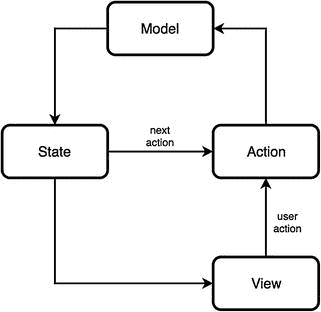

# 6.山姆:功能反应模式

Luca Mezzalira1  (1)London, Surrey, UK  

> 因为，你知道，弹性——如果你从淘金热的角度来考虑，那么你现在会非常沮丧，因为最后一块金子会消失。但好的一面是，有了创新，就不会有最后的掘金。每一个新事物都会产生两个新问题和两个新机会。—杰夫·贝索斯

In this chapter we are going to explore the SAM Pattern, less used inside the community but still part of the functional/reactive family. SAM stands for State-Action- Model , three actors that we have already encountered in other frameworks, but with the SAM pattern we are going to discover a different use for them. Let’s start with saying that SAM is following the unidirectional flow pattern, also is heavily based on functional concepts; in fact functions are first-class citizens for the correct implementation of the final architecture. Because SAM is a pattern, it’s totally framework agnostic, and it can be used with MobX, Cycle.js, Angular, or any other framework we are using in a specific project, also in our Vanilla JavaScript projects if we want. During this chapter, we explore a “vanilla” implementation of SAM in order to understand how this pattern uses the reactive paradigm for managing the data flow between objects.

## SAM 简介

SAM was created with clear goals in mind, and we could summarize them in this way:

*   组合:在 SAM 中，我们大量使用组合和纯函数；这允许我们减少对象之间的耦合，并且容易地在隔离模式的不同部分中进行测试。
*   单向数据流:正如我们在 Cycle.js 中看到的，SAM 也通过高阶函数利用单向数据流的概念，在我们应用程序的不同部分之间创建一个反应循环。
*   框架无关性:SAM 是框架无关性的，因此不仅可以在客户机上使用，如果需要的话也可以在服务器上使用。
*   被动视图:使用 SAM 允许我们拥有被动视图，它们与行为完全分离，允许我们单独测试特定视图，并在运行时或传输时潜在地更改它们，保持相同的行为。
*   分形架构:在我们的旅程中，我们已经遇到了包含分形架构范例的 Cycle.js。SAM 也在做同样的事情:提供使用封装良好的组件的灵活性，这些组件可以按照相同的架构原则组合在一起。

Figure [6-1](#Fig1) provides a schematic to understand this pattern. Figure 6-1SAM pattern schematic As mentioned before, SAM is composed by the state, action, and model , and the flow for a SAM project is the following one:

*   一个动作由用户交互触发，主要职责是将用户意图转化为要在模型中验证的数据。
*   模型需要评估动作接收到的数据，它可以接受也可以不接受。如果数据不符合预期，模型可以决定触发错误或无声地失败。模型还负责维护应用程序状态和触发状态表示。以这种模式实现模型的最佳方式是使用单个状态树。
*   顾名思义，状态是一个从模型中计算状态表示并通知视图需要呈现新内容的函数。状态还负责调用下一个动作谓词，这个名为 nap 的函数将调用任何需要调用的自动动作。

The reactivity in this pattern is composed by the loop of the main actors, which are changing the state representation after every action invoked. SAM pattern could be summarized with a mathematical formula : View = State( viewmodel(Model.present(Action(data))), nextActionPredicate(Model) ) SAM takes inspiration from React components implementation where React introduced a strong decoupling between the data to represent and the view itself; therefore any virtual DOM library fits very well in the SAM pattern. In fact, the state representation is just providing an output that will be computed by a virtual DOM library like React, Vue.js, or Snabbdom. Obviously, we can also think to use template libraries but the Virtual DOM ones fit better for the pattern purposes. The state representation is not meant to keep the state but to merge the data with the virtual dom or template, retrieving the state from the model and combining it with a specific interface. The model, as mentioned above, has to evaluate values provided by an action; it exposes only the present function, and it can decide to accept or refuse the data received, triggering an error or silently stopping the loop for a specific scenario. The actions are very similar to what an intent is doing in Cycle.js: they are preparing the data to be proposed to the model. The actions can be invoked by user interactions on the UI or via the nap method, and this method is called after the state representation for automatically changing the model and triggering another render of the view.

### SAM 模式数据流

If we were to summarize with code the SAM pattern data flow , we could do it with a skeleton like this: const model = {     status: STATUS.INIT,     present: data => {         if(model.status === STATUS.INIT){             model.status = STATUS.STATE1;         }         if(Array.isArray(data)){             model.status = STATUS.INIT;         }         state.render(model)     } }; const actions = {     state1: (value, present) => {         present({data: value});     } } const nap = model => {     if (model.status === STATUS.INIT) {         actions.state1(value, model.present);     } } const view = {     init: model => {         return 
 This is the initial view 
     },     state1: model => {         return 
 This is the state1 view 
     } } const state = {     init: model => (model.status === STATUS.INIT),     state1: model => (model.status === STATUS.ANOTHER_STATUS),     render: model => {         stateRepresentation(model);         nap(model);     } } const stateRepresentation = model => {     let representation = 
something went wrong!
     if(state.state1(model))         representation = view.state1(model);     if(state.init(model))         representation = view.init(model);     display(representation); }; const display = view => {     //append the view to the DOM } Starting from the top of our skeleton, we can immediately see the model that exposes only the present method and it is validating the data proposed by any action. When the validation succeeds, the present method invokes the state render function. The state object is responsible for preparing the view to display based on the application state provided by the model and to call the nap method for performing other automatic actions based on the application state. The state representation goal is composing the view (either a template or a Virtual DOM) with the application state retrieved from the model; and once everything is computed, this function invokes the display one where we are appending the UI into the DOM. After that, the next-action-predicate checks if in a specific status of our application it needs to invoke the next action automatically without the need for the model to have complicated logic to implement. For starting our application we can either call an action, for instance, consuming a remote endpoint; or display a static view where the user will be able to interact (searching in an input field, interacting with a button and so on). Let’s see how we can implement a simple project with SAM and React.js in order to shed some light on this reactive pattern.

## SAM 的基本实现

This time we want to build an interface similar to Figure [6-2](#Fig2). Figure 6-2Our new interface This interface has some peculiarities, so the first thing to do would be to load the countries data provided by an open API. Then we will need to generate the list on the left of the map above where every time a user is clicking on a country name, we want to display few information on the right side of our UI, like the country name, the flag, the population size, the capital, and an interactive map showing the country coordinates. Considering we start the application without any user interaction we are going immediately to set a default country, so we can fill up the space and provide some information on how to use our application to the final user. In this case the next-action-predicate will help us to achieve this task. We are going now to create the application based on the skeleton we have explored before; remember that the SAM pattern embraces the simplicity of a clean and robust architecture with the power of two programming paradigms like functional and reactive ones.

### 回顾示例

Let’s start to analyze our example from the beginning. The first thing to do is to wait until the first action for consuming a remote endpoint, retrieving the specific data requested for displaying the selected country details : document.addEventListener("DOMContentLoaded", function(event) {     actions.getCountries(REGION, model.present) }); We can immediately see that we are passing to the getCountries action a default country and the present method of the model that will be invoked once the promise inside the action will be fulfilled: getCountries: (region, present) => {         fetch(URL + region)             .then(response => response.json())             .then(data => {                 const countries = normaliseData(data);                 present(countries);             })     } Once we receive the response and we normalize the data filtering with only what the view needs, we call the present method injected as argument, and this method is responsible for accepting or not the data prepared by the action. Therefore we can say that these actions have the responsibility of preparing data that the model consumes and uses for then rendering a new state. Let’s see what our model looks like: const model = {     status: STATUS.INIT,     selectedCountryID: "",     countries: [],     present: data => {         if(data.selectedID !== "" || model.status === STATUS.INIT){             model.status = STATUS.SELECT_COUNTRY;             model.selectedCountryID = data.selectedID;         }         if(Array.isArray(data)){             model.status = STATUS.INIT;             model.countries = data;         }         state.render(model)     } }; The model is an object with a status property where we store the current application state, a few parameters used for rendering the new state like countries and selectedCountryID, and finally the method present that is invoked every time by actions only. Inside the present method we can see the checks for each single possible value we are going to receive from an action. This could become a long list of checks, so in large applications we would need to wrap these statements in external files for making the code more readable and easy to manage. Once the checks are passed the present function invokes the render method of the state object: const state = {     init: model => (model.status === STATUS.INIT && model.countries.length > 0 && model.selectedCountryID == ""),     selectCountry: model => (model.status === STATUS.SELECT_COUNTRY && model.selectedCountryID !== ""),     render: model => {         stateRepresentation(model);         nap(model);     } } In the state object, we have some methods used for understanding in which state the application is, like the init and selectCountry methods, and also the render method that is split in preparing the state representation and invoking the nap function. The state representation uses the application state for merging the data stored in the model with the UI to display: const stateRepresentation = model => {     let representation = 
something went wrong!
     if(state.selectCountry(model))         representation = view.selectCountry(model);     if(state.init(model))         representation = view.init(model);     display(representation); }; In the snippet above we can see that every time the function is called, we are performing some checks on different application states and when we identify in which one we are, we can retrieve the correct view to pass to the display method . This is what our view object looks like: const view = {     init: model => {         return 
             <CountriesList data={model.countries}/>             <SelectedCountry/>         
     },     selectCountry: model => {         const index = model.countries.findIndex( contry => contry.id === model.selectedCountryID);         const country = model.countries[index];         return 
                     <CountriesList data={model.countries} action={actions.selectCountry} present={model.present}/>                     <SelectedCountry country={country}/>                
     } } Because we decided to use React, the UI is composed by a bunch of custom components where we inject some properties retrieved from the model like the countries for rendering the list of countries but also the actions and the present method . So when a user clicks on a country name we invoke the action passing the selected country unique identifier and the model’s present method injected when we defined the component. Let’s have a look at the completed example: import React from "react"; import ReactDOM from "react-dom"; import SelectedCountry from "./components/SelectedCountry"; import CountriesList from "./components/CountriesList"; import {STATUS, URL, REGION, INIT_COUNTRY} from "./configurations/Config"; const model = {     status: STATUS.INIT,     selectedCountryID: "",     countries: [],     present: data => {         if(data.selectedID !== "" || model.status === STATUS.INIT){             model.status = STATUS.SELECT_COUNTRY;             model.selectedCountryID = data.selectedID;         }         if(Array.isArray(data)){             model.status = STATUS.INIT;             model.countries = data;         }         state.render(model)     } }; const normaliseData = data => {      return data.map(country => {         return {             id: country.alpha2Code,             name: country.name,             lat: country.latlng[0],             lng: country.latlng[1],             flag: country.flag,             capital: country.capital,             population: country.population         }     }) } const actions = {     selectCountry: (id, present) => {         present({selectedID: id});     },     getCountries: (region, present) => {         fetch(URL + region)             .then(response => response.json())             .then(data => {                 const countries = normaliseData(data);                 present(countries);             })     } } const nap = model => {     if (model.status === STATUS.INIT) {         actions.selectCountry(INIT_COUNTRY, model.present);     } } const view = {     init: model => {         return 
             <CountriesList data={model.countries}/>             <SelectedCountry/>         
     },     selectCountry: model => {         const index = model.countries.findIndex( contry => contry.id === model.selectedCountryID);         const country = model.countries[index];         return 
                     <CountriesList data={model.countries} action={actions.selectCountry} present={model.present}/>                     <SelectedCountry country={country}/>                
     } } const state = {     init: model => (model.status === STATUS.INIT && model.countries.length     > 0 && model.selectedCountryID == ""),     selectCountry: model => (model.status === STATUS.SELECT_COUNTRY &&     model.selectedCountryID !== ""),     render: model => {         stateRepresentation(model);         nap(model);     } } const stateRepresentation = model => {     let representation = 
something went wrong!
     if(state.selectCountry(model))         representation = view.selectCountry(model);     if(state.init(model))         representation = view.init(model);     display(representation); }; const display = view => {     const app = document.getElementById("app");     ReactDOM.render(view, app); } document.addEventListener("DOMContentLoaded", function(event) {     actions.getCountries(REGION, model.present) }); If we want to summarize the flow of this SAM application , we could come up with this list:

*   一旦用户与 countries 列表中的元素进行交互，就会触发一个动作，向模型的 present 方法提供国家 ID。
*   该模型检查从操作接收的数据类型，并将操作提供的 ID 存储在 selectedCountryID 中。
*   然后，模型触发状态表示，我们根据模型数据组装新视图。
*   视图被推送到 display 方法，该方法会将新的视图状态附加到 DOM。
*   最后，我们调用 nap 函数，检查在特定的应用程序状态下，我们是否需要触发任何自动操作。

SAM is an interesting pattern because it combines S.O.L.I.D. principles with different programming paradigms. When we want to implement it in a real project we need to be aware of the freedom provided by this pattern, considering at the moment there aren’t many frameworks that are enforcing SAM rules. At the same time, SAM provides us a great structure, a strong encapsulation, and applies the single responsibility principle very well for each main part of the pattern. This allows us to test quickly and in total isolation our projects, and considering it’s heavily based on pure functions, we are not going to have any side effects from them. Therefore the outcome predictability of this pattern is very high. As I said at the beginning of the chapter, we can implement SAM in our existing architectures or we could use an architecture that bases its foundations into SAM providing a solid structure for handling elegantly the data flow of our applications.

## 总结

In this chapter, we looked at another approach to reactive architectures. As we have learned, there are many interpretations and all of them are providing pros and cons to take in consideration. SAM in particular has solid foundations with great principles to be inspired by, and the simplicity of its implementation grants us the ability to apply the SAM pattern in any project, existing or greenfield, without the need to use specific frameworks for using it. Now it’s time to look at the future of reactive paradigm and in particular how we will envision this paradigm in the front-end panorama for the next years. But this time I won’t be alone, so let us move on to the last chapter of this book.