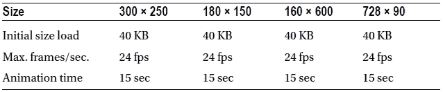

# 一、活动过程

欢迎来到 HTML5 广告。这第一章的目标是在我们深入研究大问题之前，获得整个活动流程的完整、端到端的视图。了解营销活动流程将有助于深入了解每个人是如何齐心协力按时开展营销活动的。此外，这本书还旨在阐明创意和发展在该计划中的位置。在将流程分解成重要的部分并逐一解构之后，我们将把所有的东西重新组合在一起，呈现给你一个大画面。

本章各节将概述许多事情，从典型的媒体购买和创意开发到发起活动和报告活动表现。技术、术语、流程和通用行业缩略语(可能会使新读者和用户感到困惑)——所有这些都将被回顾。还将回顾开展活动的不同方式——通过讨论品牌时间与直接回应创意，明确行动号召的重要性，以及时刻牢记用户体验。我们将讨论品牌故事的基本原理，以及广告商如何利用它来吸引潜在客户。我们还将提供对创意规格和限制的理解，因为它们与出版商有关，并在启动数字广告活动时指明下一步的方向。最后，我们将快速总结一下我们所讲述的内容，并让您熟悉这些术语。准备好开始了吗？那我们开始吧。。。

数字化战略

既然你正在读这本书，你可能想知道，“我在网上看到的那些广告是怎么做的？”或者“到底是谁想出来的？”在在线广告中，数字战略关注的是为品牌或广告商开发符合其目标、愿景和业务目标的创意营销信息的方法。这个策略可以采取你熟悉的信息的形式；类似于“返校特卖”或“阵亡将士纪念日特卖”数字战略通常是这一过程的第一步，它允许创意机构创建模型和设计，并向客户(广告商)推销新想法。根据广告公司的规模和结构，这一过程通常会涉及一名创意或艺术总监以及一名或多名文案、项目经理和技术专家，他们都致力于有效地推销创意，以使广告商接受营销信息。虽然图 1-1 应该能让你更好地了解这是如何运作的，但请记住每个机构的运作方式都是不同的。所以这只是一个例子。

图 1-1。典型的创意公司如何与广告商互动

这项工作可能需要数周(如果不是数月)的开发和规划，以确保向客户正确传达推介内容。在某些情况下，一家代理公司可能会投入这么多时间，结果却因为以下几个原因而被客户否决:因为它们与客户的目标不一致，因为执行成本太高，或者更糟糕的是，因为代理公司团队之间的微小差异毁了整个项目。最后一种情况是最不幸的，因为当这种情况发生时，伟大的想法可能会过早地进入坟墓。最终，这个过程的存在是为了发展广告活动，也就是说，广告商想要传达给观众和潜在客户的整体营销信息。该活动可能只存在于网上，也可能扩展到其他分销渠道，包括广播电视、印刷品和广告牌。

数字战略过程的另一个重要部分包括以前的战役情报。假设你是一个广告商，叫做乔氏五金，位于美国东北部。7 月份，你有一个销售雪铲的在线广告活动。在分析这场运动的表现时，你很可能意识到铲子卖得不是很好。一旦你意识到在 7 月中旬出售雪铲可能是一个错误，你所学到的东西可以用来将你的下一个活动变成一个更好的活动。(显然这个例子过于简单了，但是它的经验可以应用到更复杂的活动中。)

 **注意**由于动态活动允许实时分析信息，因此可以在活动进行的同时调整创意信息。没有必要等到活动结束后才利用学到的知识来做出改变。在第十一章会有更多关于这个的内容。

数字战略旨在识别营销人员面临的挑战，制定统一的解决方案，并有效地向目标受众传递信息。抓住这些要点并正确执行，将为成功的在线广告活动奠定基础。

媒体购买

既然你已经了解了成功营销活动的要素，并对相关各方有所了解，那么让我们看看下一步通常是什么:为特定的营销活动购买媒体。

 **注意**媒体购买可以发生在广告活动的任何阶段，但就本章的目的而言，我们假设购买发生在策略制定之后。

首先，让我们定义一下与数字广告业相关的媒体的含义。简而言之，该术语指的是通过各种出版商或网络等对广告目录的规划、实现和购买。为数字活动购买媒体的地方包括但不限于

*   出版商网站:今日美国、ESPN、英国广播公司、英国卫报等。
*   门户网站:雅虎、MSN、AOL 等。
*   广告网络:The Deck，Google AdSense，Chitika 等。
*   视频播放器:YouTube、Vevo、震颤视频等。

Publisher 网站

出版商网站是最传统的在线媒体购买方式；页面顶部的排行榜广告和网站左侧或右侧的方形广告就是典型的例子。这些是传统的，因为它们存在的时间最长。任何拥有热门博客或网站的人都可以出售这种形式的广告库存。事实上，和类似的网站帮助内容制作者和广告商这样做。任何人谁是获得一个网页的一群独特的访客，并希望一种形式的被动收入应该考虑包括广告。《纽约邮报》网站([www.nypost.com/](http://www.nypost.com/))是出版商网站上广告体验的典型例子。

网络门户

就广告库存而言，门户网站实际上类似于出版商网站。它们的不同之处在于它们是通向其他站点或站点信息子部分的网关。门户网站包括美国在线旅游、雅虎音乐和许多其他网站。AOL 的子部分包括 AOL 新闻、AOL 音乐、AOL 旅游和 AOL 货币。针对特定用户兴趣定制的每个子部分可以包括特定部分的广告目录。

盟营销

一个广告网络，是一个发布者网站的集合，可以在一个团体的基础上购买和出售广告，可以是大的或小的。它的主要功能是从出版商的贡献列表中积累广告清单，并将其与广告商的要求相匹配。通过广告网络，广告客户可以接触到比一次只通过一个发行商网站所能接触到的更多的网络素材。一个非常好的成功广告网络的例子是 Deck ( `http://decknetwork.net/`)。

视频播放器

视频播放器媒体购买是相当新的场景。如果你在 YouTube 或另一个向观众展示广告以向他们提供免费内容的内容提供商上观看一个受欢迎的视频，你就会看到它们。这将是在内容之前播放的典型的 15 或 30 秒的流内视频点。通常，视频自动播放；它禁止用户在广告播放之前跳到该内容。视频播放器广告也可以是下三分之一类型的广告单元，传统上称为“后置广告”，出现在播放器内容上

媒体购买者

保护任何或所有上述出口是它自己的工作。这就是媒体购买者介入的地方。媒体购买者在整个活动过程中起着至关重要的作用:媒体购买者通常是媒体代理的一部分，专门负责获得合适的媒体渠道。媒体采购员的工作之一是确保库存采购符合广告商的整体愿景。例如，如果我是广告客户 Titleist Golf Balls，我会希望我的媒体购买者将我的品牌放在所有的高尔夫网站和相关网络上。在狗展上展示高尔夫广告没有多大意义。

出版商库存

正如你可能猜到的，上述采购网点 都是基于可用的出版商库存。这可能会严重限制媒体购买者，并受到许多变量的影响，包括但不限于

*   星期几或一天中的时间
*   内容的流行度
*   所需视图的百分比

让我们快速看一下这种情况，因为它与广播电视的传统媒体购买形式有关。可以合理地假设，你会为超级碗第二节的 30 秒广告支付比深夜电视随机频道的相同广告多得多的费用。换句话说，随着网站内容越来越受欢迎，越来越多的广告商会想在上面投放广告。所以继续在你的博客上发布好的内容吧！

你能明白为什么媒体购买者很难在热门网站上获得库存吗？由于媒体购买者的工作是在计划的分配预算范围内搜寻和收集所有适合于传播广告客户信息的媒体，这实际上只不过是以新面貌出现的老式供求关系。

CPM 和路障

你现在可能想知道，如果媒体是基于受欢迎程度来销售的，那么这与实际的美元有什么关系呢？在数字广告行业，这个数额是由一个广告的浏览量来评估的。一个视图叫做一个印象。媒体购买者在查看媒体页时，将统计广告活动将在所有不同的地方进行，以产生估计的印象量。基于每 1000 次展示的成本可能从几分之一美分(对于不太受欢迎的内容)到几美元或更多，这取决于已经提到的许多变量。

由于每印象成本(也称为每千分之一成本(来自拉丁语“mille”，意思是“一千”))在流量大的网站上更高，因此很难在 CNN、纽约时报、BBC 和类似网站上获得主要库存。如果你想成为那天唯一的广告客户，那就特别困难。例如，像苹果这样的广告商通常会在开展活动的日子里购买所谓的“路障”或“接管”。不会出现与品牌信息相冲突的广告信息。

路障确实是最划算的买卖，而且通常代价很高也就不足为奇了。这个 buy 的特别之处在于，它通常允许你对出版商的页面内容做任何你想做的事情。这可能包括全屏视频、操作与广告单元交互的页面元素，有时甚至是更长的广告动画时间。一个路障，当做得很有品味时，可以提供一个独一无二的品牌体验。

实时竞价

在这一部分的开始，我提到了媒体购买通常是在广告活动的数字战略制定和广告商的信息最终确定之后进行的。虽然这在大多数情况下是正确的，但另一种形式的媒体购买在广告商中越来越受欢迎。这种新的媒体购买技术，即实时竞价，是通过需求方平台(DSP)完成的。DSP 也被称为媒体购买的交易平台。这意味着，当一个广告创意已经开发出来，并急切地等待一个地方运行，媒体可以通过这个交易台进行买卖，这样它就可以确保网站上的广告库存，并在购买的确切时间运行广告。显然，只有当广告商是最高出价者时，这才是正确的。rocket fuel([`rocketfuel.com`](http://rocketfuel.com))和类似公司受雇于媒体机构和广告商，实时管理出版商网站上的媒体库存购买，以消除浪费的广告支出。我喜欢把它看作是广告购买的易贝，只是它发生得更快，而且对广告商来说往往更具成本效益。

发行商规格

根据购买的媒体，广告需要开发不同的尺寸，以满足出版商可用库存中的所有位置。这就是为什么在进行任何开发之前，了解广告将在哪里投放是非常重要的。如果广告具有特定的功能和丰富的特性，如扩大房地产或强制视频播放，就更重要了。由于某些网站不允许这些功能，广告商最好事先了解这些要求。误解出版商的要求可能会导致广告体验降低或广告活动推迟。

我知道你在说什么。“我为什么要降低我的创造力？我想尽我所能制造最大的轰动，让我的目标观众惊叹不已！”好吧，如果你可以的话，那当然很好，但是最终，如果出版商因为某个特定的功能集而不刊登你的广告，你就不会引起任何轰动。出版商是一个很难改变的群体；毕竟，这是他们的内容和用户群。你会邀请某人到你的客厅，让他自由地重新布置房间，添加东西，甚至移走它们吗？可能不会——除非你得到了某种回报。我喜欢这句话，“不管你有多喜欢披萨，你永远不会把你房子的钥匙给送货员”。所以为了你自己，请仔细检查你的媒体计划；在任何开发开始之前，注意什么是可以接受的，什么是不可以接受的，以及在哪里可以接受。你可以考虑与你的出版商进行一对一的通话，在活动开始前解决所有未解决的细节问题。

广告尺寸

正如刚才提到的，不同的出版商需要不同大小的广告单元来满足他们的库存。桌面显示的典型广告尺寸是 160 像素宽，600 像素高；这就是所谓的 160 × 600 ad 单元或摩天大楼。其他典型尺寸为 300 × 250 和 728 × 90。对于移动设备，300 × 50 和 320 × 50 是非常标准的。但是注意每个发行商的要求不一样；它们可以从一个站点到下一个站点有很大的不同。与媒体计划相关的规格表应提供创意开发的技术细节。在建立创意之前，一定要向出版商和广告网络索取这张表；从长远来看，这样做会节省你的时间。我见过比你想象的更多的情况，一个创意被制作出来，试图把它放到酒吧的网站上，却发现他们不接受它的尺寸和功能。

响应性设计

理解媒体计划非常重要，但理解为什么出版商不能或不愿意在一个广告单元中采用某些格式或功能也很重要。他们的原因可能与他们站点架构中的技术限制有关；例如，它可能不接受特定的 HTML 元素、CSS 样式或 JavaScript 命令。当这种情况发生时，最好的办法是在开始之前与出版商召开动员会，解决所有的细节问题。

一种发展中的设计模式是响应式网页设计(RWD)；它也被称为适应性网页设计。关于 RWD 要考虑的一件事是，广告布局可能需要迎合网站的布局。因此，可能需要为 300 × 250 尺寸和 160 × 600 尺寸开发 728 × 90 的广告单元，并且所有这些都在同一个广告标签内。出版商的要求在这里是至高无上的；它们应该在开发和设计开始之前进行讨论。由于如此多的手机、平板电脑和电视能够访问网站，RWD 正在成为网络世界中一个令人感兴趣的巨大领域。出版商不希望增加他们的运营工作量，也不希望担心为每个可以访问网站的设备开发不同版本的网站。因此，他们严重依赖级联样式表(CSS) 和 JavaScript 来动态管理网站布局变化，而不管请求内容的屏幕。

使用 CSS 媒体查询(第三章中关于这个主题的更多内容)，出版商可以定制内容，使其格式适合访问它的设备或屏幕。例如，如果我在我的 27 英寸苹果 iMac 台式电脑上全屏观看 www.bostonglobe.com，我的全屏宽度将是 2560 像素，而如果我在我的 iPad 上纵向观看 ??，屏幕宽度将是 768 像素。当使用这个值来检查 CSS 媒体查询的屏幕宽度时，允许发布者动态地调整其站点布局并重新对齐内容。它仍然是相同的站点和 URL，但是布局发生了变化，这可能会导致如图 1-2 所示的图像。

图 1-2。www.bostonglobe.com[如何在苹果 iMac 上以 2560 像素显示，在苹果 iPad 上以 1024 像素横向显示](http://www.bostonglobe.com)

网站的动态适应对于任何出版商的网站开发者和设计者来说都是一股新鲜空气。然而，对于数字广告人来说，这有点像噩梦，因为在任何时候显示发生变化，无论我是在桌面上缩放窗口还是在平板电脑上切换横向和纵向方向，该特定页面上的广告库存都可能改变或请求另一个广告，如果该广告被请求不止一次，可能会产生重复的印象。这可能导致图 1-2【4 层楼高的潮汐】所示的 300 × 250 ad 的移除。这也引出了一个问题，即印象是否也需要适应新的布局，不是吗？如果《波士顿环球报》在我的媒体计划中，我如何能确定较小的展示将会到达我的目标受众？这是一个有趣的问题，这个行业正经历一段艰难的时间试图标准化，因为它影响了视觉广告布局和报道问题。

我的希望是，随着移动广告服务变得越来越受欢迎，并成为广告商媒体计划的主要焦点，广告服务公司和出版商将开发一种一致的方式，为多个屏幕和设备调整和定制他们的广告视图，而不管分销渠道如何。更有可能的是，这将需要一些时间来开发，甚至需要更多的时间来完全采用，但一个标准最终会诞生。幸运的是，数字广告有一个组织来帮助制定这些标准。

 **注**关于这个话题的更多信息，请看[www . ravel rumba . com/blog/Responsive-ads-real-world-ad-server-implementation/](http://www.ravelrumba.com/blog/responsive-ads-real-world-ad-server-implementation/)的“Responsive-ize it”一节。

IAB

在数字广告领域，有一个成熟的机构来帮助这个行业解决头痛的问题和碎片化相关的问题，无论是移动广告、显示广告，还是联网电视。互动广告局(IAB)提供广告尺寸、规格和度量标准的标准化，得到了许多出版商、广告服务器、创意机构和 IAB 工作组积极成员的认可。它通过平衡竞争环境，提供跨媒体购买和广告网络的规模。因为它设定了整个行业都知道的实践，所以采用更普遍。

IAB 规格和尺寸指南

IAB 致力于为所有分销渠道开发广告和广告形式创建一个全面的、不断发展的图表。表 1-1 提供了许多桌面广告的 IAB 规格和尺寸要求的示例。

表 1-1 。IAB 的一些桌面显示器尺寸指南

 **注**有关 IAB 展示指南的最新信息，请访问[www.iab.net/guidelines/508676/508767/displayguidelines](http://www.iab.net/guidelines/508676/508767/displayguidelines)

从表中可以看出，这些准则概述了广告的初始尺寸、广告动画的帧速率，甚至动画的持续时间。正如它所支持的行业一样，IAB 也在不断变化。它定期举行讨论和会议，以促进该行业的利益。

另一个评估你的广告是否符合 IAB 准则的有用工具是 Adobe 的广告认证。这个在线工具为您的广告创意提供了一套全面的分析工具，无论它是 Flash SWF 文件还是实际的广告标签。在整个过程中运行的广告将生成一份详细的报告，表明广告是否符合 IAB 规范。有关使用该工具的更多信息，请参见`https://adthenticate.adobe.com`。该工具旨在消除创意开发和出版商规格之间的猜测，因此没有混淆，也不需要重复工作。

创意

好了，回到竞选过程。你已经看到广告商想把他们的媒体费用花在哪里；现在一个广告需要设计和开发。在这一点上，为了有效地开发广告并清楚地传达广告客户的信息，你应该清楚地了解所有出版商的要求和规格。

创意是在发布当天呈现在发布者页面上的实际元素。是 SWF 文件或 HTML 传达了广告客户的信息——更确切地说，是视觉传达广告客户信息的文件。广告商的主要关注点是什么？是提供一个直接的有创意的回应，还是仅仅为了让用户尽可能长时间地停留在广告体验中？ 的目标是在一个创新的、可扩展的广告单元中创造广告主的愿景，这个单元将贯穿媒体计划中的每一个发布者网站。在行业术语中，这是创造性开发的 LCD(最小公分母)规范。按照这种规格开发和设计将允许最终的规模和更少的问题。

创意开发和设计

在这一阶段，广告商的创意机构将回到在数字战略部分提出的模型和设计。该机构将引进创意和技术团队成员(就是你！)为广告商设计和构建最终的广告体验。这包括利用技术和代码的设计技巧。设计师使用 Adobe Photoshop 和类似的工具，技术人员利用 JavaScript 等代码语言来完成执行。

因为广告体验各不相同，营销人员总是想要最新的东西，技术变化如此之快，有时很难跟上所有的变化。我通过阅读新技术和尝试不同的代码语言来保持领先。找到适合你的方法并坚持下去。根据广告的复杂程度和广告商的要求，设计和开发可能需要几周时间才能完成，因此这项活动可以与其他活动要求一起完成，如最终确定媒体购买。对一些人来说，创造性发展是竞选中最重要的过程；它传达了广告人的信息。也有人说是媒体在收买和优化目标受众。我自己觉得没有令人惊叹的创意信息，什么都做不了。有了引人注目的创意，你可以让人们想要他们以前不想要的东西。如果你能在大量受众中做到这一点，那么广告在哪里投放并不重要。但是请记住:你最后一次上网看广告是什么时候？无论如何，当一场运动既有效又及时时，它总是表现得很好。

品牌时间与直接回应

当谈到与观众沟通时，广告商有许多选择。它可以提供包括游戏或视频的广告体验，这通常会成为品牌时间的倡议。或者它可以允许观众或用户点击某些东西或填写表格并提交信息，希望获得潜在有用的个人信息(这种形式的广告称为直接响应)。某些选项在某些屏幕上和某些广告客户身上效果更好。来自广告服务公司 PointRoll 的统计数据显示，品牌时间在平板电脑和大屏幕上效果更好，而直接回应在手机上效果非常好。PointRoll 认为，大屏幕和平板电脑更像是一种靠后的广告方式，而手机则更像是一种基于实用的体验。当用户在移动时，它能迅速吸引他们的注意力。

广告人在创意开发中的另一个重点是有一个清晰的行动号召。如果你想让你的观众做些什么，告诉他们！如果你想让他们看视频或点击按钮，你可以通过指导观众来获得更高的回应率。除了保持 CTA(行动号召)清晰明了之外，某些出版商不会允许你开发不符合其试图传达的信息的创意。例如，假设我开发了一个广告，CTA 声明“点击此处获取免费优惠券！”然而，当观众点击时，会弹出一个没有优惠券链接的视频。出版商通常会保护自己的读者，不进行这样的误导性广告宣传。

因为这是创意的用户体验方面的所有部分，你会想尽你最大的努力来开发一个在视觉上和功能上都对你的观众有意义的广告活动。关键是记住用户；时刻记住他或她的全部经历。

讲故事

广告商的另一个主要关注点是通过一个或多个广告活动来讲述一个故事的能力。许多广告客户使用跨屏幕倡议来传达信息。这种跨媒体方式让广告商通过多个屏幕和设备向用户传递单一的内聚性信息。也许它是在指导用户访问一个广播点的网页以获取更多信息，或者它是从你的手机上传一张照片以便有机会在电视上看到你自己并赢得一个奖项。这种参与形式的可能性几乎是无限的，广告商的投资回报率(ROI)也是巨大的。有了他们通常得不到的用户群信息，他们可以更容易地锁定在特定时间、特定设备或屏幕上收听的个人。

创意液晶显示器

如前所述，这个开发过程的目标是创建一个 LCD 规范，这样广告就可以完美地在每一个出版商和广告网络上运行。这是一个创意机构需要做出许多艰难选择的地方。为了创造性地提高门槛，你可能需要忽略或打破一些出版商的规范，但为了在任何地方开展活动，你需要遵循最低的规范。这是一个艰难的决定，尤其是当你试图在这个领域创新的时候。

 **注意**有创意的广告客户将与广告服务器合作，要求特殊的出版商津贴来运行他们的创意。

这需要在投放之前与发布者进行一次性对话，以解决他们对广告执行的任何担忧。许多不同的事情可以解决，例如广告可以有多大的文件大小(或 k-weight)以及出版商将允许什么功能。在大多数情况下，展示创意将有助于出版商签署或同意执行。最糟糕的事情是他们让你修改一些东西。

这种一次性的对话总是会发生，但空间中的成员对它们的感觉是不同的，这取决于他们站在围栏的哪一边。一方面，这种对话可以让广告商或创意机构变得极具创新性，打破曾经适用于所有人的规则。另一方面，他们为其他寻求做类似事情的广告商树立了一个糟糕的先例，因为这不是一个公共标准，其他机构将不得不申请同样的特别许可。

归根结底，这个过程是政治和金钱驱动的。“嘿，欢迎来到广告界！”如果你和出版商关系密切，或者在一项活动中投入大量资金，你很有可能会被允许做任何你想做的事情。作为一项独立的工作，这一过程通常涉及到让广告服务供应商，如 PointRoll([`pointroll.com`](http://pointroll.com))、Media Mind(【www.mediamind.com】??)或 Crisp Media([www.crispmedia.com](http://www.crispmedia.com))获得许可，并运行一个大型的创新数字广告活动。这些公司专注于发展强大的出版商关系，以便广告商和创意机构能够专注于创新和继续发明。

广告服务

一旦创意被设计、开发并被广告商认可，它通常会被传递给广告服务器 。广告服务器的工作就像它的名字所说的那样:为创意团队设计和开发的广告服务。一旦广告服务公司获得创意，它将经历一个素材接收过程，在该过程中，对创意素材进行分析和处理，以确保所有文件都存在并符合规范，并遵循遵循出版商指导原则的一般最佳实践。如果确定创意文件完全不符合规范，通常会将它们返回给开发它们的机构进行进一步优化。如果素材只需要最少的工作——调整尺寸或削减 k-weight——广告服务公司通常会为创意机构完成工作，无论是满足客户还是确保继续工作，或者基于其他收入来源浮动成本。

跟踪

一旦素材被签署，它们将被发送给广告开发人员和工程师，以安装用于报告目的的跟踪和指标。跟踪是将额外的代码实现到创意素材中，以便在每次观看时产生印象，点击按钮和交互信标来跟踪用户交互。对于广告服务器，跟踪通常通过 API(应用编程接口)来安装。API 有多种形式，但在这种情况下，它是广告创意和广告服务平台之间的通信层。

这里有一些广告服务器可能捕获的跟踪指标:

*   印象
*   点击
*   互动或活动
*   交互作用时间
*   视频指标

*   播放/暂停/停止/重启/重放
*   开始率和完成率

根据创意的需要，其他跟踪要求可能是数据收集，如电子邮件地址、姓名和电话号码。这个信息是一个用户控制的过程:观众需要在广告的表单域中输入信息。

第三方跟踪

数字广告中的另一个跟踪概念涉及第三方重定向和第三方跟踪验证。第三方跟踪的情况是，另一家分析公司为了验证指标，将跟踪像素与广告服务器一起放在创意中。第三方跟踪中使用的平台包括 Dart、Atlas 和 ComScore 1x1 等。通常情况下，DoubleClick 的 Dart、微软的 Atlas 和 ComScore 都提供对创意中像素的跟踪，但它们并没有托管和服务。1x1 是不可见的 gif(图像文件),当用户查看广告或进行某种类型的交互时会触发。这可以是一个或几个像素，取决于广告客户对活动的需求。

另一种形式的第三方跟踪使用重定向。当用户在广告单元内执行点进动作时，进行重定向，并且用户在到达最终目的地之前被引导通过重定向服务器位置。广告商可以在广告单元中包括他们希望的任意多的重定向来验证点击跟踪。

 **注意**传统上，你添加到 URL 字符串的重定向越多，你可能会看到报告中的差异越多。此外，由于浏览器的限制，网址可能会被切断；用户最终会进入一个糟糕的登录页面。

图 1-3 和 1-4 显示了用户的一次点击操作是如何在显示登录页面之前 ping 几个不同的位置的。图 1-3 展示了什么叫做带内点击重定向。带内是 ping 服务器需要“菊花链”效应的两种方法中较老的一种。

图 1-3。带内点击重定向的工作原理

第二种方法，带外点击重定向，一次 pings 所有的服务器(见图 1-4 )。

图 1-4。带外点击跟踪的工作原理

 **注**关于如何设置合适的点击跟踪的更多信息，请参见 IAB 的点击测量 PDF:[`www . IAB . net/media/file/click-measurement-guidelines 2009 . PDF`](http://www.iab.net/media/file/click-measurement-guidelines2009.pdf)。

最佳化

跟踪完成后，需要一个额外的创意优化级别 ，以确保所有创意符合 k-weight 规范，并且不会占用用户机器的 CPU 能力。优化检查确保广告可以在多台机器、平台、出版商和设备上完美运行。优化过程可以包括重写代码、压缩位图图像、将图像转换为矢量图形、简化矢量图形以及基于用户交互来错开加载顺序。这可能需要相当长的时间，取决于广告的数量以及目标设备和屏幕(最终由媒体计划决定)。这些测试通常非常严格，因为每个广告必须实时运行在多台计算机和操作系统上，并且依赖于广告动画或视频持续时间的长度。因此，优化步骤的数量会增长得非常快。

标签

在创意运行一轮全面的预发布质量保证检查之后，广告服务公司将从创意素材中创建广告标签，以确保创意在其新的广告服务环境中准确执行。广告标签的创建通常包括上传到广告服务公司运营的内容管理系统(CMS)。无论是静态图像、HTML 还是 Flash 文件，创意素材都会被编译并存储在系统中。根据出版商的规格，广告服务器将生成几种不同标签类型和格式中的任何一种，包括以下内容:

*   iframe 标记
*   JavaScript 标签
*   Flash SWF 标签
*   图像和点击标签

 **注意**iframe 用于将一个 HTML 文档嵌入到另一个文档中。

对于更丰富的执行，一些发布者可能需要一个驻留在他们服务器上的文件；它允许广告服务器与发布者站点所在的域进行通信。当需要“iframe 破坏”(一个行业术语)时，这是一个需求。Iframe 破坏允许广告标签在发布者期望的广告 iframe 之外呈现；这又允许广告服务器直接与发布者的内容交互。这种类型的执行应事先与发布者建立联系，以确保各方都在同一页面上，并且在投放广告时该文件已准备就绪。这种类型的执行权限通常只授予受信任的 ad 服务器，因为破坏 iframe 会造成破坏。图 1-5 显示了一个广告标签如何对待 iframe 的“终结”和“非终结”。

图 1-5。当发布者的托管文件就位时，广告标签可以脱离 iframe

质量保证

一旦广告服务器生成并分析了广告标签，就运行最后一轮跟踪质量保证(QA) 以确保所有的印象都被激发并且度量都被考虑在内。假设跟踪电话准备就绪，唯一的标签被发送给媒体计划中的每一个发布者。收到标签后，发布者将执行自己的 QA，以确保它们在真实环境中与其他网站内容一起顺利运行。出版商可能需要几天时间来完成这一过程，这取决于其广告运营的规模和要安排的标签数量。

在这个阶段，发布者通常会向广告服务器提供一个测试页面，以便在广告服务器端完成更多的 QA 工作。测试页面通常反映广告上线当天页面的外观和功能。所使用的页面通常是主页，带有通常的虚拟副本——“lorem ipsum”类型的内容——而不是实际的编辑内容。执行该测试只是因为在真实环境中可能会发生任何事情。你可以让其他广告竞争电脑处理能力，或者隐藏导航菜单，把你的广告降低 20 个像素。无论是什么情况，这个测试都是为了消除任何可能破坏活动启动的神秘因素。这可能会导致广告服务器、出版商和创意代理之间的许多来回，这取决于问题的领域。这种反复肯定会很费时间，但是在发布前解决活动中可能出现的问题是很重要的。你可以把它想象成在赛车上路前的试驾。

活动启动

当发行商和广告服务器对所提供的标签最终同意时，它们将由发行商安排一个特定的发布日期并开始活动。最后，广告服务器、出版商、创意代理，以及最重要的广告商，对标签进行最后一轮检查。所有的检查都已到位，以确保在 的整个发射过程中性能保持平稳。

分析和报告

在活动开始和结束时，广告商和媒体代理将要求广告服务器和任何第三方测量公司运行他们的分析报告。这在开始时完成，以确保所有分析都被成功跟踪，并在结束时汇总所有结果和指标。广告服务器的报告将记录到目前为止的总数；该统计包括但不限于印象、点击、活动、视频指标、点击率(CTR)、点击率、互动时间和转化率。这些结果将作为最终报告提供给所有请求方，从中他们可以清楚地了解运动的总体表现。

这份报告中的信息对广告商来说是无价的；它概述了活动的关键绩效指标(KPI),无论它们是否与推动品牌知名度或互动率有关。报告可以以 Microsoft Excel 文档、CSV、XML 或 JSON 文件的形式发布，甚至可以通过用户控制的分析仪表板集中放置在广告服务器的 CMS 应用上。

一旦该报告被发出并被所有各方审阅，广告服务器基于 CPM 模型，基于所提供的总印象和可能的开发中的劳动力，向出版商或媒体代理记账。在这个阶段，媒体和创意人员可以了解哪些对他们的广告客户有用，哪些没用，并将最近获得的知识应用到未来更好的广告活动中。这种数字处理和统计分析可以反馈给负责数字战略的人，更重要的是，反馈给广告商。

付款

基于由广告客户的总数字支出所决定的总体预算，媒体代理将有特定的金额用于确保适当的媒体库存。另一项预算分配给创造性和技术设计。媒体预算将用于支付出版商的广告清单费用，也可能用于支付广告服务器制作和提供广告标签的费用。对于创意和技术开发，这些付款被发送到创意机构，也可能是广告服务器，用于优化素材所需的任何任务。

 **注意**根据活动的不同，可能需要某些一次性供应商——技术合作伙伴、支持者、数据提供商。他们的存在将导致额外的费用。

基于商定的 CPM，广告商、媒体代理或出版商将浮动成本。有时，广告服务器和媒体代理之间的交易是在满足一定数量的印象的基础上达成的。因为广告服务器也对 CPM 模型收费，如果给定数量的印象 x 得到保证，则广告服务器可以覆盖所有与生产相关的成本。如果你想增加你的整体销量，让客户尝试一个暂定的印象数——例如，每分钟 1 美元 10，000，000 或每分钟 0.5 美元 50，000，000——是一个很好的方法。如果没有满足约定的印象，媒体代理支付额外的费用来弥补没有计入广告服务器的费用。

有时候，事情并没有按计划进行，人们不得不承受由于技术或管理限制而错过印象的成本。这些不幸是以弥补为代价的。当广告服务公司做了一些阻碍标签按时发布给出版商的事情时，制成品通常是可支付的。如果出版商在计划最初要求的特定时间有两倍或三倍的图书广告库存，情况也是如此。这种弥补通常是通过免费广告服务或广告服务器覆盖的约定数量的额外印象来实现的。出版商的条款可能略有不同；它可能会提供另一天的广告清单或在其网站或网络内的另一部分以优惠价格甚至免费提供广告位，这取决于它与客户的关系。

正如你所看到的，很多人都把手伸向了广告商的支出领域。由于每一个活动都是不同的，取决于所需的工具和人员，因此在确定开展活动所需的条件时，必须了解预算限制。确保成功、减少制造品和安排准确的上市日期至关重要。

目标受众—更智能的未来

随着技术变得越来越复杂，媒体购买变得越来越智能，广告商能够非常容易地购买受众分群，并相应地锁定他们的受众。受众分群通常作为一组广义的个人进行销售，他们最有可能观看广告并对其品牌信息做出积极反应。公司使用许多不同的系统来获取用户的信息。这些信息包括但不限于

*   位置
*   在线行为和浏览历史
*   人口统计信息
*   发布者传递了数据

这些信息要么由广告服务器的广告标签直接提供，要么从浏览器 cookies 中获得，这些 cookie 曾经被用户访问过的网站丢弃。这样做的好处和好处是，观众可以根据自己的喜好定制个性化信息。广告商喜欢这种工具:他们获得了关于客户群、购买习惯和地点的重要信息。他们获得了影响观众的力量，尤其是当他们把脸书和推特这样的社交渠道结合在一起的时候。

有一句名言:“权力越大，责任越大。”在网络广告中，这当然是事实。由于在处理此类数据时用户隐私是一个大问题，接下来的部分将展示信息是如何被访问、收集、分发和使用的。

隐私

在线隐私目前是一个巨大的话题，不仅是在行业中，甚至在美国和欧洲的政府层面。不管你喜不喜欢，谷歌、雅虎、MSN、微软和许多其他公司都有你的信息。信不信由你，或多或少是你自己交给他们的。一个小问题:你有 Gmail、Yahoo 或 MSN 邮件账户吗？你使用社交网络吗——脸书、Google+等等？我想至少其中一个问题的答案是响亮的，是的。事实是，当你注册并向这些社交网络和出版商提供信息时，你实际上是在用这些信息来换取他们的工具和服务。你有效地让自己成为广告商眼中的谷歌和脸书的产品。这些服务向广告商出售受众信息，因为他们知道你的喜恶，你的年龄，甚至你住在哪里。这可能有点可怕，甚至有点老大哥的味道，但真的，你永远不会免费得到任何东西。所以在你交出你的信息之前明智地选择。

更多关于美国政府如何帮助网络用户了解他们的权利的信息，请访问[`onguardonline.gov`](http://onguardonline.gov)。

饼干

所以你可能会问自己，如果我不注册这些服务，他们怎么能得到我的信息？你不需要交出你所有的信息来被在线追踪。就其本身而言，在线行为对广告商来说是一个非常有价值的指标。你是否曾经在亚马逊或其他购物网站上购物，然后浏览了几个网页，发现你最初在亚马逊上看到的产品现在正在你上网的任何地方向你做广告？如果你有，你并不孤单。发生这种情况是因为您在浏览器存储中丢弃了一个 cookie。

每个浏览器都有一些内存专门用于在本地缓存中存储文件。它们可以被存储以优化您经常访问的网站的浏览。根据 cookie 来自哪个域(在这个例子中是 Amazon ),不同种类的信息位被存储在你作为观众的信息中。在亚马逊的例子中，这些信息可能是你看到了什么产品，它是什么颜色，你在一天中的什么时间查看它，或者其他大量的信息。

一旦 cookie 信息进入你的缓存，你就可以带着它去网上的任何地方。有点像数字购物护照！这些信息可以与数据提供商(Blue Kai 和类似的公司)共享，当您浏览时，这些数据提供商使用这些信息来查找您的更多信息。你浏览得越多，关于你和你的浏览行为的信息就积累得越多:你潜在的喜欢和不喜欢什么，你通常什么时候搜索网页——这样的例子不胜枚举。这些信息甚至可以与唯一的 ID 号配对，并加载到数据库中进行查找和重新定位。AdTruth ( `http://adtruth.com`)和像它这样的公司值得一查。严格地说，这些信息不是个人的；它只是关于你和你的在线行为的信息。但是，数据提供商可以将这些信息出售给广告商，帮助他们按群体或细分市场锁定受众，甚至可能锁定个人。

如果你是火狐浏览器用户，有一个真的很不错的浏览器插件，叫共谋 。当你浏览互联网时，它有助于可视化正在发生的事情(见图 1-6 )。

图 1-6。火狐浏览器插件勾结是什么样子

正如你所看到的，共谋显示了当你浏览网页时，哪些网站共享了你的信息，更重要的是，它们如何访问彼此的信息。图中的图像是通过访问五个不同的网址拍摄的。值得注意的是，除了输入 URL 之外，用户不用做太多事情就可以收集到多少信息。一个广告客户可以看到一些出版商在用户身上设置 cookies 来跟踪某些信息。然后，可以出售这些信息，以进行更好的媒体购买和/或定制广告本身的创意信息。

 **注**在其网站上了解更多关于共谋的信息:`www.mozilla.org/en-US/collusion/`。

发布者传递的数据

如你所知，当你使用 Gmail 或 Yahoo Mail 或类似的东西时，你实际上是允许将你的信息用于广告目的。发布者传递的数据允许发布者将加密的信息串放入广告服务器的广告标签中，并允许广告服务器确定它拥有什么样的观众，并制作适当的广告消息。这些信息可能包括年龄、地理区域、邮政编码、性别，甚至还有其他输入的兴趣。

这么说吧，从我的电子邮件和浏览记录来看，雅虎知道我 18 岁，对电子产品感兴趣。如果广告商向我推销新产品，雅虎可以向广告服务器传递信息，说明我对电子产品感兴趣，并且我已经 18 岁了。广告服务器有输入来确定准确的输出信息，也许是视频游戏系统和 iPod——谁知道呢？你现在已经明白了，可能会问自己，“等等，广告商有我的所有信息吗？”答案各不相同，但至少他们没有任何个人身份信息(PII)。

血浆无机碘

个人身份信息(PII) 是关于用户或用户活动的情报，会泄露他或她的确切身份。这包括但不限于姓名、地址、信用卡号和社会保险号。媒体机构和出版商希望获得尽可能多的关于受众的信息，以便做出更明智的商业决策，并通过锁定愿意倾听的人群，让广告商的资金更加有效。在处理观众的个人信息时，他们必须遵守关于在线隐私的联邦法律，不得恶意使用这些详细信息。这种类型的信息可以通过广告单元传递的唯一方式是通过使用选择加入过程。它可以是在广告中提交表单或注册免费服务之前的复选框选择。

对观众和用户来说幸运的是，法律还要求一个选择退出的过程。从根本上说，选择退出程序是为了让用户在自愿或不自愿地注册免费服务后，不允许在谷歌和脸书等网站和网络上分享他们的信息。选择退出的过程很棘手，因为它回避了一个问题，即适用于一家出版商的东西是否也适用于下一家。此外，他们已经掌握的关于你的所有信息会怎么样？

隐私的下一步是什么？

我的直觉告诉我，互联网和在线广告隐私的新规则、政策和指导方针迟早会出现；可能很快。国会积极寻求所有领先的在线素材和广告渠道的代表，与他们讨论这个话题和相关问题，并最终试图确定公司是否可以自我监管，或者需要美国政府介入。另一个问题是，整个世界都是在线的，各国的隐私法并不统一。

任何对在线隐私有疑问的人应该联系广告服务器、IAB、IAB UK 或当地的政治代表。如何利用受众的信息来投放量身定制的相关广告，应该有明显的好处，如果你觉得自己的权利受到了威胁，你应该表达自己的担忧。随着广告和技术变得越来越智能，你也应该这么做。

术语评论

在本章中，你已经接触了大量的行业术语和行话。目的是，在你必须与团队成员或潜在客户沟通的情况下，不要混淆，而是进行教育。使用表 1-2 复习本章迄今为止涉及的关键词和首字母缩略词。

表 1-2 。活动流程术语审查

| 单词 | 定义或含义 |
| --- | --- |
| 创意广告 | 一家创意公司开发了一条营销信息，并将其推销给客户，即广告商。 |
| 媒体购买 | 其中媒体代理在各种发布者站点和广告网络上保护广告库存以满足广告活动的发起。 |
| 印象 | 在整个广告活动中，广告在屏幕上出现的次数。 |
| 每千成本（cost per mille） | 每千分之一成本(千)；指的是提供的展示的计算。 |
| 路障(或接管) | 通常情况下，当一个广告商购买了出版商页面上的独家广告位时，他是某一天唯一的广告商，并拥有完全的创意控制权。 |
| 死后无子女。 | 需求方平台(或交易台)；它允许通过拍卖实时购买媒体。 |
| 安置 | 发布者页面或广告网络中特定部分的特定广告。 |
| 半铸钢ˌ钢性铸铁(Cast Semi-Steel) | 级联样式表；它们决定了页面或广告的外观和感觉。 |
| Java Script 语言 | 处理页面或广告的功能和逻辑的工具。 |
| 互联网架构委员会(Internet Architectrue Board) | 互动广告局；一个致力于在线广告发展和标准制定的组织。 |
| 液晶显示 | 最低公分母；指的是在整个媒体购买中运作良好的广告的开发。 |
| 三醋酸纤维素 | 行动号召；在你的创意中有一个清晰的行动号召将确保你的用户知道如何互动。 |
| k 重量 | 将在发布者页面上呈现的广告单元的二进制权重，例如 40 KB。 |
| CPU 进程 | 当一个繁重的创意(通常涉及大量的图形、动画和代码)被渲染到页面上时，中央处理器通常会达到峰值。这些因素会降低用户机器的速度，并阻碍整体用户体验。 |
| 第三方的 | 1 对 1 跟踪来自第三方广告供应商的像素，以验证在线广告中的指标。 |
| 羧甲基淀粉钠 | 内容管理系统，通常由广告服务公司用来存放创意和创建广告标签。也用于库存和汇总分析。 |
| iframe 破坏 | 当出版商允许广告创意在页面上指定的广告 iframe 之外工作时使用的术语。 |
| 点进率 | 点击率；它决定了特定广告活动的点击率除以提供的印象数。 |
| 交互作用时间 | 花费在广告体验中的互动时间。这可能是当用户扩展了广告素材、观看了视频或玩了游戏时。 |
| 转换策略 | 执行所需操作用户。例如，单击了解更多信息或单击某个按钮进入登录页面。 |
| 饼干 | 放在浏览器存储中的文件，其中包含有关用户在线行为的信息。其他供应商可以访问这些信息。 |
| 血浆无机碘 | 个人身份信息；指定查看广告或与广告交互的用户身份的任何信息。例如姓名、地址、SSID。 |
| 决定不参与 | 允许用户禁止与广告商共享信息的流程。 |

摘要

本章详尽地回顾了典型的广告活动流程。你已经看到了广告公司如何制定策略来实现广告商的目标、愿景和商业目的。还讨论了如何找到和购买媒体，是通过传统的购买方式，还是通过使用实时竞价方法的交易台。您还看到了创意设计和开发是如何进行的，以及数字故事是如何成为成功营销活动的关键因素。您了解了广告服务器如何接收素材并添加跟踪以利用关于观众的信息并定制消息。您看到了广告服务器的分析和报告如何等同于支付以及对未来活动的了解和洞察。引入了许多行业术语；会上讨论了关于该行业的许多关键点，包括隐私和出版商规范。对你来说，检查这个信息是非常重要的；本书的其余部分将触及这里概述的概念和术语。

现在是时候将您对活动流程的了解带入第二章，深入了解今天是什么让我们来到这里，并看看启动这一切的技术。这有点像历史课，但它为 HTML5 如何在 2012 年变得如此流行以及广告如何需要调整和效仿奠定了基础。

如果你准备好了，我们继续。。。