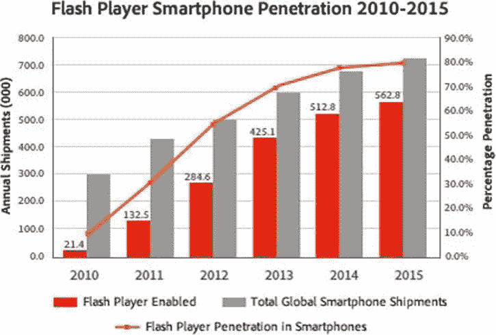

# 二、广告技术的演变

现在，您已经对营销活动流程有了深入的了解，是时候了解是哪些技术和业务推动我们走到今天这一步了。正如前一章所讨论的，这个行业一直在经历快速的变化，作为一名 HTML5 设计者和开发者，理解所有这些很重要。技术进步、流程改进和总体效率的提高呈现出可预测的规律性。随着新浏览器的开发、技术规范的编写和新插件的快速部署，需要考虑的重要方面从来都不会少。

首先，让我们讨论一下以前和现在网络的基础，内容是如何通过不同的技术呈现在屏幕上的，以及现在看到的在几年前是不可想象的改进。让我们看看从 HTML 到 Flash 平台的起源和过渡，以及 Web 上使用的技术背后的业务，并深入了解 HTML5 的新热点——并从广告客户的角度来看这一切。

本章将讨论 HTML5 是如何出现的，它的目标是什么，以及一个有影响力的先驱是如何将它推向主流市场的。在本章结束时，将有一个术语回顾，来回顾一些可能不熟悉的术语。最后，当我们深入到这本书的核心部分，学习更多关于如何用新兴的网络标准 : HTML、CSS 和 JavaScript 来开发和设计广告时，将会有一个到目前为止所学内容的总结。

早期的 Web 和 HTML

首先，尽管听起来很老套，但让我们沿着记忆的轨迹来一次旅行，讨论一下万维网的基础。那是 20 世纪 90 年代——珍珠酱、牛仔夹克，更重要的是早期网络的时代。这一切都始于一位名叫蒂姆·伯纳斯·李的麻省理工学院毕业生和计算机科学家，他创建了万维网规范，并提出超文本标记语言(HTML)作为所有浏览器最终都能理解并在屏幕上呈现元素的结构化语言。万维网联盟，或 W3C ，声明

HTML 是描述网页结构的语言。

除了 HTML 构建模块之外，还需要样式和功能。层叠样式表(CSS) 保持样式，JavaScript 是控制用户看到的网页内容的逻辑和功能(也称为页面内的“行为”)的语言。还有文档对象模型(DOM)，它是一个对象层次结构，用于在浏览器堆栈中读取和编辑对象。对于那些认真研究 web 开发的人来说，DOM ，这个庞大的话题本身就非常值得理解。

事后看来，早期的网络是不完整的。浏览器在设计上是原始的，试图计算已安装用户群的市场份额是一个很大的挑战。这使得浏览器上的 web 开发变得一团糟；每个都有自己的局限性和代码库。把它放在电视机的环境中，把电视当成你的浏览器；根据电视机的制造商——索尼、LG、三星等等——正在观看的节目需要考虑所有不同的电视，并做出相应的调整。这现在听起来完全不现实，但这正是早期网络的样子。这就是 HTML 规范开始时非常简单的原因。它首先需要被采用；然后它可以迭代，变得更加进步。

用 HTML 做广告

每个人现在都认识到网页是用 HTML、CSS 和 JavaScript 开发和设计的。随着互联网变得越来越主流，广告商 进入市场只是时间问题。这让我想起了一个问题“哪里看不到广告？”答案是，“在你睡觉的时候。”从 20 世纪 90 年代到 21 世纪初，几乎每个人都有机会上网，广告商需要进入出版商的页面，这样偶然上网的人——一个巨大的潜在观众——就会看到他们的广告。

自然，在开始的时候，广告是非常基本的；起初只是静态图像 。想想 56k 拨号调制解调器上的早期 AOL 启动页面；你知道，就是那种你必须拔掉手机才能使用的(如果你精通技术，你会有一个电话线分离器)。取决于你认为多久以前，广告库存是稀缺的，如果存在的话。

 **注**互联网时光倒流机 允许你在它的数据库中输入一个网址——例如[【AOL.com】](http://AOL.com)——然后查看网站历年来的旧版本。广告时段没有呈现，因为这些活动早就结束了，但你可以了解当时在哪里以及如何使用广告。请访问这里(注意，并非所有网站都支持):[`archive.org/web/web.php`](http://archive.org/web/web.php)。

弹出广告及其后续发展

我们都知道弹出式广告信息有多让人讨厌，它们在早期给互联网带来了多大的困扰，所以我就不多说些讨厌的话了，而是给你上一堂教育课。简而言之，令人讨厌的弹出广告只是 JavaScript 代码执行的一个片段。在 JavaScript 中，以下代码打开一个新的浏览器窗口，并接受以下参数或自变量或 URL、名称、规格和替换。

```html
window.open(URL,name,specs,replace);
```

使用前面的代码，当用户查看包含该代码的页面时，会生成一个新窗口。众所周知，当用户随意浏览网页时，打开许多新窗口是令人讨厌的，因此浏览器开发人员实现了所谓的弹出窗口拦截器来保持任何窗口打开。。。);用户不点击任何东西就可以执行代码。这是在线整体用户体验的一大进步；它迫使广告保持在特定的页面范围内。鉴于这种影响，就不同形式的在线广告而言，广告客户非常有限。他们知道，由于“新”屏幕的流行，他们想进入数字空间，但他们不太知道如何衡量他们的投资回报。通常，他们进行简单的广告活动；没什么特别的，因为创意的限制和他们永远无法衡量竞选表现的事实。对于媒体购买来说，这是一种非常不同的方式，也是一种新型的媒体库存，可以为广告商提供保障。在很长一段时间里，他们只需要担心电视作为他们的主屏幕，他们有尼尔森([nielsen.com](http://nielsen.com))和其他公司来分析他们电视广告的成功。

该领域的先驱们将广告客户的沮丧视为一个巨大的机会，开始在他们相对简单的广告活动中添加指标和创造性的增强。一开始，广告和指标的创意是非常温顺和原始的，要么是静态的，要么只有轻微的移动，使用动画 gif，只根据印象和点击量来衡量。此外，由于用户对浏览器的采用是分散的，广告设计师不得不利用特定于浏览器的代码来维护广告在各种环境下的外观。这种额外的努力，只是为了让一个简单的运动出门，被证明是一个耗时的过程。

富媒体

随着广告客户越来越多地要求他们的在线广告活动具有更多的创意和衡量标准，一种新的在线广告形式应运而生——富媒体广告 。由于在线广告在早期的网络中几乎是静态的，交互性、翻转和扩展广告体验的出现在广告市场中受到了真正的欢迎和迅速的采用，这使他们看到了一个新的、急需的创意窗口和有效衡量在线成功的方法。

另一方面，媒体供应商认为这是广告制作、购买和销售方式的转变。正如您可能猜到的，早期的富媒体广告是使用传统的 HTML、CSS 和 JavaScript 技术开发的。图 2-1 展示了第一个富媒体广告——电影《永不妥协》(Erin Brockovich)，由 PointRoll([pointroll.com](http://pointroll.com))公司制作并提供服务。


图 2-1。第一个富媒体广告

当然，从那以后事情发生了一些变化，但是在当时的网络空间，这确实是开创性的。用户第一次可以滚动广告单元，并让它扩展到更强大的体验。传统的“点击此处”的行动呼吁(CTA)被修改为显示“鼠标点击此广告”，邀请用户通过简单地滚动广告单元来互动，以获得更多内容。值得注意的是，即使在演示环境中，也有处理浏览器差异和不一致的消息。在大多数情况下，如果你看不到丰富的广告体验，广告服务器公司会为你提供一个静态或默认的广告(见图 2-2 )。


图 2-2。第一个富媒体广告的备份静态或默认广告

广告服务平台将足够聪明，能够通过使用所谓的“用户拥有”规则来确定用户是否能够以丰富的形式呈现广告。这种技术分析用户的系统和浏览器，并检测用户的机器能够在什么级别上呈现该单元。这种动态调整在富媒体之前是闻所未闻的。此外，在用户看到静态广告而不是丰富广告的情况下，广告平台将不同地报告印象；在大多数情况下，静态印象将以降低的 CPM 提供给广告商。

跟踪和测量

在早期的富媒体广告中，追踪和测量很少，但足以有效地向营销人员讲述一个故事。然而，如果广告商打算在这个领域投入更多的媒体资金，他们希望更多地了解他们的客户。随着越来越多的资金最终流入该行业，富媒体成为在线广告的常用手段。

由于广告商现在能够衡量有多少人互动、扩展和关闭了一个广告，他们可以包括照片画廊、电子邮件表单和其他吸引受众的创意元素，同时报告一切并将其反馈给广告商，以获得有价值的品牌洞察力。随着时间的推移，这种广告方式变得足够稳固，足以维持广告商的兴趣，但 HTML、CSS 和 JavaScript 在创造力以及在原生浏览器环境中可以做什么方面存在局限性。

对广告商来说幸运的是，有一个漂亮的小浏览器插件正在市场上获得牵引力。由 Macromedia 创建的著名的“skip intro”插件允许开发人员轻松创建丰富的动画并添加视频和交互性。简单来说，这个插件一手改变了网络广告的面貌。

闪光

在整个 2000 年代，数字广告 被动画 gif、HTML、CSS 和 JavaScript 推向了最大限度。通常，一些简单的互动和动画 gif 将是一个活动的创意范围。营销人员和广告商创造性地推动了这个极限，但是浏览器的局限性太明显了。广告商不能直接在浏览器中做他们想做的事情。对此限制的回应是 Macromedia 的 Flash 播放器 。

Flash 允许通过使用安装的插件在浏览器中提供华丽的、高度互动的内容。Flash 播放器迅速移动到最前面；它的普及和无处不在使它成为推动在线广告发展的主要平台。它最终为开发人员和设计人员提供了一种跨浏览器的方式来轻松开发在线体验，并在任何地方进行一致的部署。在它出现之前，这样的事情真是闻所未闻。

由于其快速的开发环境，从商业角度来看，Flash 创造性地解决了许多问题。通过使用该插件，web 开发人员确信，无论浏览器制造商、操作系统或版本如何，都可以获得相同的体验。一个曾经由静态广告和基本 HTML 驱动的体验主导的市场迅速过渡到 Flash，这要归功于它的易用性和庞大的安装用户群。

在全球主要市场中，闪存的市场渗透率将增长到 90%以上。没有其他浏览器插件有如此大的影响力。除了增强图形和交互性之外，它最终将支持视频和音频内容的双向流，这是一个浏览器无法想象的事情(至少在当时是这样)。

虽然许多开发人员和设计人员喜欢 Flash 的易用性，但其他人不喜欢它更简单的编程语言，它允许不成熟的开发人员构建低效和设计糟糕的程序或体验。Flash 的类似 JavaScript 的语言 、ActionScript 允许代码在动画帧上执行，由于早期 Flash 用户使用的糟糕的编码技术，它降低了浏览器体验，甚至经常因占用计算机资源而导致浏览器崩溃。由于广告的开发方式可能会降低用户机器的速度并过度使用系统资源，Flash 通常会受到核心软件开发人员社区的指责。

砖坯黏土

随着 Macromedia 的 Flash 在 web 开发和在线广告领域的持续增长，Adobe 看到了 Flash 的巨大商机，最终在 2005 年 12 月 3 日以 34 亿美元的天价收购了 Macromedia 及其所有产品。随着 Adobe 对 Flash 的收购及其第一个公司版本 9 的发布，Flash 已经拥有了多年的开发兴趣、用户群和平台开发。因此，Adobe 继续大力投资 Flash，将其作为开发和部署丰富的互联网应用和网络广告的巅峰之作。

Flash 播放器无处不在

到了第 9 版，安装了 Flash 播放器的市场令人震惊。到 2008 年 6 月，98.4%的用户安装了 Flash Player 或更高版本。有了这些数字，广告商们就只能依靠 Flash 平台来实现他们丰富的网络体验。他们不仅在在线广告活动中利用了该平台，还意识到了该平台在创建品牌网站、登录页面和其他网络素材方面的力量。

该领域的其他插件——包括 Java 小程序和较新的 Unity player——从未见过如此高的渗透率，这就是为什么广告商目前不认为它们是影响深远的在线广告的理想平台。

 **注**这里可以看到目前的 Flash Player 普及率:[`www . adobe . com/products/Player _ census/Flash Player/PC . html`](http://www.adobe.com/products/player_census/flashplayer/PC.html)。

Flash Player 视频

从这一刻起，网络上发生了很多变化；由于 Flash 和更快的机器，广告、缩略图大小的视频 和视频播放器差异的时代已经成为过去。从 2002 年 3 月发布的 Flash Player 版本 6 开始，视频可以包含在编译的 Flash 文件(SWF)本身中；从版本 8 开始，它可以支持来自服务器的流媒体视频内容。在很高的层面上，这永远改变了营销人员和广告商开发在线广告的方式！娱乐广告商现在可以为网络制作电影预告片，甚至可以在广告单元内观看。

网络视频过去是，现在仍然是一个巨大的话题。随着越来越多的广告商和人们想要网络视频，随着技术最终加速发展，YouTube 和其他价值数十亿美元的企业应运而生。随着拨号上网成为遥远的记忆，越来越多的人成为宽带互联网的用户，下载速度达到每秒 10 到 30 兆字节，随着 10.2 版 Flash player 的增强，视频现在可以全屏高清并卸载到用户机器的 GPU，这使得播放更加流畅；同时，CPU 被释放出来做诸如资源分配和代码执行之类的事情。

从出版商的角度来看，由于视频是以流的形式进入广告单元的，因此创意广告的整体 k-weight 尺寸没有额外的成本。现在，广告商可以在广告中做更多的事情，而不用担心用户体验不佳，甚至违反规范。随着网络高清视频成为常态，Akamai 等公司创建了真正的流媒体高清网络和交付解决方案，用于交付和分析视频性能。

用 Flash 做广告

随着 Flash Player 在主要市场中接近 100%的台式机上使用，广告商看到了在单个统一平台上创建具有全动态图形和动态数据的引人注目的交互式富媒体的机会。营销人员完全被吸引住了；Flash 解决了 HTML 早期版本中存在的所有问题。随着创意的进化，追踪也跟着进化；越来越复杂，事实证明，对广告商 和媒体买家来说，这是一个更好的投资回报(ROI) 。

广告服务公司可以跟踪任何东西:浏览量、滚动量，甚至视频里程碑和完成率。基本上，如果你能想到，他们会跟踪它。随着富媒体利用 Flash Player，指标和创造力飙升到新的水平。Flash 允许使用 API 进行更深入的跟踪和分析集成。开发 Flash 的 ActionScript APIs 是为了提供与广告服务平台的通信，这允许跨活动进行更集成的跟踪。

正如上一章关于浏览器 cookies 所讨论的，Flash 也有自己的方式将数据存储在其内部缓存中。默认情况下，本地共享对象(称为 Flash cookies)允许开发人员存储高达 100 千字节的数据，以在 ads 中提供更丰富的体验。然而，围绕隐私的法律问题仍然出现在广告中，无论是基于浏览器还是基于 Flash 的 cookies。不过，有一点是肯定的:有了 Flash，富媒体广告真正诞生了；通过使用一个真正的无处不在的插件，丰富的动画、视频、动态数据等最终可以在浏览器中完成。

HTML5

因此，现在我们知道 Flash 已经对在线广告产生了最大的影响，我们离看到 HTML5 如何再次做到这一点已经不远了。当然，HTML 到目前为止已经经历了几个版本，甚至一些变化(XHTML)，但是我们现在正在进行第五个版本。截至 2012 年，HTML5 草案还没有公开定稿，但广告商正在寻求利用 HTML5 的新功能来创建他们的下一个创新广告活动，采取 Flash 在插件中的做法，但全部在浏览器中进行。HTML5 规范从 Flash 中学到了很多东西，所以在全局中看到它的重要性是非常重要的。

HTML5 的特性包括画布元素、拖放和视频元素，这些都是从 Flash Player 和浏览器本身无法处理的东西中发展而来的。想想看:投币电话之前没有手机！你必须明白，Flash Player 做了浏览器在大约十年内做不到的事情，所以看到我们最终会回到 web 标准和 HTML5 是非常令人兴奋的，毕竟 Flash 已经用了这么长时间。

HTML5 看起来像是一个新手，但实际上 W3C 和工作组成员在 2008 年 1 月起草了第一个规范。从那以后，它经历了许多修订和公开的“最后呼吁”，W3C 内外的成员对当前规范的完整性进行了投票。

为什么是 HTML5？

有人可能会问，“是什么让 HTML5 这么快就出现了？”或者“为什么 Flash 在这么长时间内都很好，而突然之间，HTML5 成了每个在线用户的焦点？”有一个简单的答案。2007 年 6 月 29 日，苹果公司的史蒂夫·乔布斯通过发布 iPhone 改变了世界，其浏览器不支持 Flash 播放器。现在，我说改变世界有多种原因——首先，它将是第一款拥有玻璃触摸屏的完整网络浏览体验的智能手机。第二，它将永远改变网络，因为在它发布之前，几乎所有的网站都至少有一点 Flash 内容用于图形、视频或动态内容。最后，随着网络的发展，数字广告也将紧随其后，因为迄今为止几乎所有的数字广告都是用 Flash 制作的。

对于苹果决定不在 iOS 操作系统上支持 Flash，许多人有着复杂的感受。有人说这与商业有关；其他人更关注智能手机和平板电脑的整体性能和电池寿命。我自己并不太在意 Flash、HTML5 或者别的什么是新标准。几年前，当每个人都过渡到闪存时，情况也是如此。最终，从长远来看，使用 web 标准并从外部插件中移除任何依赖性将始终使您处于领先地位。就像那个时代所有受人尊敬的技术一样，它最终会走到尽头，减轻每个人的分裂。要深入了解史蒂夫·乔布斯对 Flash 平台的看法，请查看现在臭名昭著的帖子“关于 Flash 的想法”([apple.com/hotnews/thoughts-on-flash](http://apple.com/hotnews/thoughts-on-flash))。

HTML5 采用

现在你可能会说，“好吧，苹果通过移除 iPhone 上的 Flash Player 推动了 HTML5，但其他浏览器呢？”这是一个很好的问题，但却不容易回答。首先，如前一节所述，HTML5 处于工作规范状态，这意味着它还不完整。甚至在我写这篇文章的时候，它还在发展。因此，采用是分散的，支持往往是有限的，但不断增长。苹果首次发布的 iPhone 只实现了新网络标准的部分功能；事实上，直到今天，HTML5 的采用仍然非常分散。在桌面领域，浏览器都符合 HTML5 的不同级别，并且因为规范还没有最终确定，所以符合性总是在变化。你知道这会有多混乱吗？如果你访问[beta.html5test.com](http://beta.html5test.com)，你将能够看到你的浏览器与当前的 HTML5 规范相比排名如何。很可能它在 HTML5 的整体范围内是不合格的，有些功能完全不受支持。你可能会问:“为什么还选择使用它？”嗯，没关系！事实上，在撰写本文时，只有最前沿的测试版浏览器，如 Chrome Canary、Firefox 和 Webkit Nightly builds，支持大多数最新和最棒的功能(但不是全部)。当前 HTML5 的采用是名义上的；你可以看到开发人员和设计人员在这个分散的领域创建统一的体验是多么令人头疼。这很容易让人想起早期的网络。尽管如此，如果我们希望在移动和平板设备上渗透，我们需要开始利用 HTML5 的功能。对于广告主来说，这是必须的！

HTML5 视频

HTML5 整体功能集的一个小功能——它在一些博客和新闻论坛中被称为“Flash 黑仔”——是 HTML5 视频(将在第七章中更详细地介绍)。我想花一分钟来澄清一下，就像许多受过教育的开发人员以前做过的那样。首先，因为 Flash 是一个平台，它需要一个插件在你的浏览器中播放视频。Flash 可以支持渐进下载的视频以及流媒体。它还可以支持各种协议的视频，并在播放过程中自适应地改变。其次，由于 HTML5 的视频元素是 HTML 标记中的一个标签，目前处理这个标签有局限性。例如，几乎每个浏览器都有自己的文件包装器和编解码器来正确地呈现视频。事实证明，这对于视频转码工作以及任何试图在创意中加入视频的人来说都是一项艰巨的任务。此外，由于没有通过 HTML5 流式传输视频的标准，该领域也需要更多的开发。

在线视频大师 Robert Reinhardt 撰写的一篇非常全面的文章概述了围绕 HTML5 的视频元素的碎片化，更不用说对 HTML5 的整体支持了(参见“HTML5 视频的痛苦世界”:[transitioning . to/2012/01/The-World-of-Pain-That-html 5-Video/](http://transitioning.to/2012/01/the-world-of-pain-that-is-html5-video))。像流式传输和自适应比特率都是这篇文章中概述的内容。

HTML5 与 Flash 在移动设备上的对比

对于现代世界的广告客户来说，移动是一个重要的目标平台，了解不断发展的技术能在这里实现什么是很重要的。可以很有把握地说，手机在一开始确实很原始，当时仅有的智能手机是诺基亚、Palms 和黑莓，它们的网络浏览器也是如此。。。呃，找不到更好的词了，糟糕。大约在 2000 年代末，自苹果 iPhone 问世以来，手机已经成为一个巨大的市场。许多人预见到了这一点。由于 iPhone 的网络浏览器，它提供了一种功能齐全的实际网络体验，不像早期的设备那样提供网络，但视图不同。在 Flash 上投入了大量资金的 Web 开发人员和设计人员需要确保业务端的决策者明白，他们的在线计划需要支持 HTML5 在移动设备上不断增长的市场份额——哦，天哪，它还在增长！

行业内有很多困惑，因为它涉及到 HTML5/Flash 的争论。该领域的许多创业公司看到了这一点；他们进入这个市场，利用恐惧作为燃料，提供服务来缓解这种过渡，这反过来又使 HTML5 前进得更快。Adobe 和 Google 等公司开始制作工具，将 Flash 时间轴动画转换为 HTML、CSS3 和 JavaScript 动画，供新兴浏览器在不使用 Flash Player 插件的情况下呈现。

随着苹果的 iOS 占据了移动操作系统市场的巨大份额，谷歌的 Android 和黑莓的 Playbook 也推出了对 Flash 的支持。Adobe 的信条是，这些设备的用户将获得“完整的网络体验”，Flash Player 将在其产品路线图中得到支持并安装在移动设备上。事实上，Adobe 发布了这个统计数据，概述了 2015 年 Flash Player 在移动设备上的未来支持(见图 2-3 )。



图 2-3。展示了 Flash Player 在智能手机中的预计渗透率(鸣谢:Adobe)

Adobe 对在移动设备上支持 Flash 抱有很大的野心，认为有了 Android 和黑莓市场的巨大支持，苹果最终会让步在 iOS 上支持 Flash；有一段时间，这不是一件值得傻笑的事情。据说，苹果实际上给了 Adobe 一个机会来证明移动 Flash 播放器可以在他们的手机上运行，并且不会过度消耗用户设备的电池寿命，最终导致应用崩溃。我不知道这是否发生过，但 Adobe 在这件事上的态度大不相同。

这就是由来已久的 HTML5 与 Flash 业务背后的政治因素发挥作用的地方。希望有了目前概述的信息，您可以得出自己的结论。也就是说，2011 年底，Adobe 发布了一份公开声明，称他们公司将最终在移动设备上淘汰 Flash Player，并专注于利用 HTML5 的 web 标准。这引起了许多反响。首先，Adobe 忠实的开发者社区感到被背叛和被暗算；他们认为他们在手机上的未来被谋杀了。此外，许多业内人士认为这是 Adobe 向苹果投降的白旗。然而，如果你看看围绕它的商业决策，Adobe 为公司采取了一种完全不同的方法。Adobe 还表示，它将继续支持基于 Adobe 的集成运行时(AIR) 构建的原生移动应用。

 **注意**在高层次上，Adobe AIR 本质上是一个框架，它利用了与 Flash Player 中使用的非常相似的代码库和结构。借助 AIR，开发人员可以使用与使用 Flash Player 构建富互联网应用相同的方法，在桌面和移动设备上构建本机应用。事实上，在撰写本文时，Adobe AIR 已经发布了 3.2 版本，并继续在许多发行渠道中受到支持，包括桌面、移动和电视。

使用 AIR 构建原生应用的方法，当开发人员的应用被编译时，它实际上是将代码从原生 ActionScript 重写为 iOS 和 Android 操作系统的原生 Objective-C 或 Java。这意味着 AIR 编译器和打包器将实际上把一切都写入设备的程序集，这是非常低级的代码，比 iOS 或 Android 开发者为原生应用构建的 API 还要低。它非常接近机器代码！1 和 0，我的朋友；仅此而已。

移动广告的发展

随着 Adobe 概述的新闻，移动开发不得不进入使用 web 标准 的方法，并完全从 Flash 播放器中分离出来。这在一个已经很新的市场上引起了巨大的变化，移动广告也需要跟进。曾经由 Flash 主导的行业认为，它在 Android 操作系统和黑莓中有可取之处，它真的认为 iOS 最终也会接受它。

不用说，这种情况并没有发生，所以移动广告生态系统开始时规模相对较小。当广告客户知道他们想要进入这个领域时，他们会向他们的创意机构和第三方广告服务器寻求帮助，在这个更加分散的领域导航，并提供表达能力来巩固实际的移动投资回报。然而，软件、硬件、操作系统版本和软件开发工具包(SDK)之间的划分让人们不敢投入实际的媒体资金。从操作上来说，开发人员创建同一广告的 Flash 和 HTML5 版本没有任何意义，更不用说支持所有不同的大小，移动设备上所有不同的屏幕，以及不同的 SDK 接口。光是想想就累死了！

这给广告业带来了一个巨大的问题。记得上一章我们简要讨论了响应式设计和跟踪需求；目前，在线广告行业的这一部分仍然非常分散。客观地说，发行商 A 的页面上发生的情况对发行商 b 来说可能不一样。那么，当您试图通过广告网络购买媒体时会发生什么情况呢？当您需要担心所有这些不同的变量时，您应该如何增加工作负载的规模呢？

过渡到 HTML5

随着市场争先恐后地找出统一的发展方向，许多流行的浏览器和移动设备都过渡到(或正在过渡到)一个完全以 HTML5 为中心的平台，这使得广告商和营销人员需要跟进，以便将他们的品牌信息传递给他们的最终用户，而不管访问内容的屏幕或设备是什么。此外，越来越清楚的是，Flash 实际上是一个设计非常好的快速开发环境——迄今为止没有像 HTML5、CSS3 和 JavaScript 那样的环境，但我觉得随着工具的发展和碎片化的缓解，这种情况将会改变——因此，为了实现 Flash Player 长期以来一直做得很好的相同体验，目前的广告商对运营时间和成本感到沮丧。

IAB 增强功能和 SDK 提供商

在所有的混乱、分裂和运营困境中，IAB 一直致力于通过开发一些增强功能来帮助和支持涉及 HTML5 和移动的转型。随着移动应用支持的多样化，媒体购买者无法确保大规模的库存，因为无法保证它能在每个人的应用中工作。在整个移动生态系统中，在 iPhones 和 Android 设备上每个人都知道并喜欢的应用中，有许多不同的广告投放方式——例如，愤怒的小鸟、与朋友交谈和画点什么。在这些地方看到的广告通过 SDK 进入免费应用。这些 SDK 提供了广告创意(HTML5、CSS3 和 JavaScript)和应用代码库(Objective-C 或 Java)之间的沟通渠道。把它想象成两种不同语言之间的翻译器。

开放富媒体移动广告(ORMMA) 草案是根据行业需求制定的，旨在规范移动富媒体广告在各种平台上的显示方式。该领域还有其他 SDK 提供商，他们有自己的解决方案。仅举几个例子，有苹果的 iAds，谷歌的 AdMob，Medialets，千禧传媒，Opera 的 AdMarvel 和 RadiumOne。很容易想象这会增加多少碎片。没有标准，就无法在媒体购买或开发中提供规模！移动富媒体广告接口定义(MRAID) ，IAB 认可的 JavaScript API，强烈基于 ORMMA 计划的学习和发展。MRAID 是一个纯粹的基于 JavaScript 的 API，它以类似于 ORMMA 的方式与出版商的应用进行通信，但它要简单得多，因为它的存在只是为了在所有移动富媒体广告中提供少量的功能。最后，移动新星是由行业成员开发的格式，并被 IAB 采用为通用移动富媒体广告格式。这些格式旨在跨出版商进行扩展；也就是说，如果出版商通过了 IAB 的认证，他们应该采用他们的规范。

 **注意**我们将在第九章中更详细地介绍 SDK 和应用内广告。

开发工具

我们已经谈了一些公司运营中的问题，以及 IAB 如何试图通过标准化来提供便利，但我们还没有从创意的角度讨论过，在创建富媒体广告时，出现了哪些工具来减轻开发人员和设计人员的工作量。Adobe 的开发工具，如 Wallaby、Edge、Shadow，甚至 Flash，明确展示了 Adobe 作为一家公司，如何真正专注于新兴的 web 标准，并致力于为开发人员提供 HTML5 浏览器市场上的创意设计所需的最佳工具(请参见“Adobe”部分的更多信息)。

Sencha 是这一领域的新来者，它也在这一领域取得了许多进步，比如 Sencha Animator，甚至还有 HTML5 企业应用市场、ExtJS 和 Sencha Touch。Sencha Animator 是一个桌面应用，它简化了 HTML5、CSS3 和 JavaScript 创意的开发。这些工具可以用于从简单到复杂的任何动画，也可以轻松地包括交互性、自定义执行的 JavaScript 和跨平台视频，所有这些都在 Adobe 的 Flash Professional 用户非常熟悉的一个干净的用户界面中。这两家公司(以及这里没有提到的其他公司)都开发了这些工具，以帮助减轻在新浏览器上构建广告甚至富网络应用的运营成本。(要了解更多信息，请访问[Sencha.com](http://Sencha.com)和[Adobe.com](http://Adobe.com)查看当前产品下载。)

 **注意**我们将在第八章和第九章中更深入地挖掘移动工具集和程序。

HTML5 业务

不出所料，HTML5 既是一项业务，也是 web 技术的进步。接下来的章节将深入探讨不同公司对 HTML5 的立场，以及它们如何适应环境，并最终支持不断发展的规范。此外，这些部分将给出它们在广告部门中的位置。读完这一部分后，你应该对谁是这个领域的大玩家以及谁是新来者有更清楚的了解，并成为一个准备更充分的 HTML5 广告客户。此外，在本书中，我们将看看所有寻求帮助 HTML5 广告创作的公司。

苹果

苹果长期以来一直与创新、技术和在线改进联系在一起。由于 iPhone 和 iPad 在将网络转向 HTML5 方面负有部分责任，因此从这家公司开始并概述他们与 HTML5 和新兴网络标准相关的目标似乎是唯一合适的。正如你所记得的，许多人感谢史蒂夫·乔布斯推动了即将到来的网络标准，现在被称为 HTML5。每本关于史蒂夫·乔布斯的书都讲述了他对完美的专注。也许正是这种完美主义让苹果的市场份额和资本收益在过去几年里扶摇直上。经过与癌症的长期斗争，乔布斯于 2011 年去世，蒂姆·库克成为世界上最大、最赚钱的公司的首席执行官。

蒂姆·库克的核心愿景与史蒂夫的非常一致。新版 iPad、iPhone 和 Mac 已经如期发布，苹果的市场份额继续上升。苹果发布的硬件继续变得更快、更强大、更移动。拥有这些复杂的设备使开发人员和设计人员能够真正提高与 HTML5 相关的标准。至于 HTML5，苹果成员活跃在 W3C 中，并不断将他们的浏览器 Safari 构建成 HTML5、CSS3 和 JavaScript 发电站。

Safari 是一个使用 Webkit 构建的快速浏览器，Webkit 是一个开源项目，位于苹果的家乡加州库比蒂诺。每一个新的稳定的 Safari 版本通常不会包括 HTML5 提供的所有最新和最棒的内容，但用户总是可以每晚下载 Webkit，这是苹果 Safari 浏览器的前沿版本，可以试验可能(也可能不会)进入最终 HTML5 规范的功能。

国际天体物理十年(International Astrophysical Decade)

iAD 它有一些优点和缺点。从积极的一面来看，这是一个标准，由苹果公司开发，只需创建一次，就可以在他们庞大的广告网络中部署。第二，iAD 提供了一套软件，用于极其轻松地创建真正丰富的广告。然而，这是苹果，苹果在某种程度上被称为“围墙花园”——你需要遵循苹果的所有规则才能进入内部，一旦进入，就只有一套特定的功能可以玩。此外，被锁定在苹果开发的一套软件工具中，我注意到 iADs 的 k-weight 绝对巨大，尤其是对于移动设备而言；在我看来，这似乎是一个巨大的疏忽。除此之外，iAD 曾经以 100 万美元的最低竞选预算开始。然而，由于缺乏参与者，苹果公司最近再次将票价降至 10 万美元。我们将看看苹果计划如何在未来增强其工具和 iAD 平台，但我们将在第九章中更多地关注 iAD。

谷歌

像苹果一样，谷歌在网络上有着悠久的历史。作为一个搜索引擎，它已经进入了许多不同的网络市场:社交、地图、分析、浏览器和移动。与苹果的 Safari 浏览器非常相似，谷歌的浏览器 Chrome 是建立在 Webkit 引擎上的，谷歌的新兴网络浏览器 Chrome Canary 支持许多领先的 HTML5 功能，这些功能可能会也可能不会成为最终的 HTML5 规范。

AdMob

谷歌在移动领域的努力之一是其广告网络 AdMob 。AdMob 于 2009 年 11 月以 7.5 亿美元收购，拥有自己的移动出版商名单，这些出版商利用 AdMob SDK，允许广告商在 AdMob 网络上运行，并在应用之间保持相同的功能。除了广告网络，谷歌还为移动设备运行安卓操作系统。Android 在移动生态系统中拥有巨大的市场份额，但它对开放性的关注造成了它自己的市场微碎片化。Android 设备的屏幕大小可能会有所不同。由于系统是开放的，所以浏览器、视频播放器和其他功能集以及操作系统的版本也可能不同。与 Android 不同，苹果有一个受控的开发环境，通过明确保持操作系统关闭，让开发者知道他们正在进入什么。

关于 Google 最后要提到的是它的 Dart 编程语言。Dart 是谷歌在其 Chrome 浏览器中更快速地执行和替换 JavaScript 的方法，也解决了 JavaScript 的一些问题。Dart 是一种具有 C 风格语法的面向对象编程(OOP)语言。Dart 要么被编译成本机 JavaScript，要么直接在支持 Dart 虚拟机的最新浏览器上运行。截至 2012 年 3 月，苹果、Mozilla、微软和 Opera 都没有在浏览器中实现 Dart 的计划。但是，如果或当您部署到支持 DART 的浏览器时，请记住这种语言。这可能对未来的发展有益。

砖坯黏土

在前面的章节中已经有很多关于 Adobe 和 Flash 平台的内容。Adobe 长期以来一直以 Flash 平台扎根于 Web，Flash 插件也经历了一些变化(至少可以这么说)。然而，Adobe 作为 W3C 和工作组的积极成员，仍然致力于新兴的 web 标准，并为 HTML5 草案提供各种补充，如 CSS 区域和 CSS 着色器，旨在通过 CSS 样式提供布局和丰富的电影功能。

面向开发者的应用

此外，Adobe 还向开发者社区发布了一些有用的应用，这些应用专注于 HTML5、CSS3 和 JavaScript 的设计和开发，包括 Edge、Wallaby、Shadow，甚至 Flash Professional。Edge 是一款与 Flash 非常相似的工具，可以创建基于时间轴的动画。它们之间的主要区别在于，Edge 可以直接在最新的浏览器中使用，而不需要使用插件。Wallaby 是一个工具，将允许 Flash 设计师和动画师采取他们的。fla 文件，并将其导出到本机 HTML5、CSS3 和 JavaScript 动画。Shadow 是一个多设备开发套件；它允许开发者完全控制内容在各种显示器上的外观。最后，Flash Professional 支持导出到 HTML5 画布对象和创建 Sprite 工作表。

除了桌面应用，Adobe 还发布了平板电脑和移动设备的触摸应用。触控类 app 有 Photoshop、Proto、Ideas、出道；它们允许设计师和开发人员在旅途中进行创作，并使用他们的 Creative Cloud 工具无缝地将创作的内容整合回他们的桌面。创意云本质上是开发者所有创意素材的全球同步。Adobe 还在 PhoneGap 和 Typekit 领域进行了巨额收购交易。PhoneGap 允许 web 开发人员灵活地将他们的 HTML5、CSS3 和 JavaScript 文件打包，作为应用在移动设备上本地使用。另一方面，Typekit 是一个巨大的网络字体库，旨在让使用 CSS 网络字体的设计人员能够非常轻松地做到这一点。最后，Adobe 的 Flex 平台被捐赠给 Apache，作为完全由开发人员社区驱动的开源软件。

 **注意**要查看 Adobe 对新兴网络的看法，请访问[beta.theexpressiveweb.com。](http://beta.theexpressiveweb.com)

浏览器名

Mozilla 是一家专注于开源开发和更大网络社区参与的公司。Mozilla 是非常流行的浏览器 Firefox 和不太流行的电子邮件客户端 Thunderbird 的幕后推手。Mozilla 是一家非营利公司，专注于通过开放、安全和由更关心网络而不是商业方面的人来构建网络。

和其他公司一样，Mozilla 也为 HTML5 工作草案开发了一些功能，并开发了一款名为 Firefox Nightly 的尖端浏览器，用于测试最新功能。就像 Chrome Canary 和 Webkit Nightly 一样，这款浏览器可能包含一些从未真正纳入最终 HTML5 规范的功能，但它也包含一个用于浏览器的奇妙的 web inspector 工具包，名为 Firebug。使用 Firebug，开发人员可以轻松地在动态页面上调试 HTML、CSS 和 JavaScript。最后，Camino 是 Mozilla 的 Mac OSX 浏览器；它旨在为 Mac 用户提供一个开放的浏览器。

微软

微软几乎是一个家喻户晓的名字。它开发了 Windows 操作系统、Xbox 360 和网络浏览器 IE。多年来，IE 一直是事实上的标准浏览器，因为它是 Windows PCs 自带的。然而，随着浏览器公司的出现，以及微软推出 IE 第 6 版浏览器，许多用户转向 Firefox 或 Chrome，甚至成为苹果用户，并将 Safari 作为他们的主要网络浏览器。随着微软开始采用下一代网络标准，他们在 Windows XP 上仍然有一个挥之不去的客户群，Windows XP 最多只支持浏览器 IE8。因此，XP 用户永远不会有一个新兴的浏览器，除非他们更新到 Windows 7 或最新的 8 或在浏览器中安装谷歌的 Chrome 框架。

 **注**欲了解更多关于 Chrome 框架的信息，请访问[google.com/chromeframe](http://google.com/chromeframe)。

运行 Windows 7 及以上版本的用户可以使用 IE9，但它只支持部分 HTML5 功能。事实上，许多人认为 IE9 绝不是支持最新网络标准的新兴浏览器。参见[people.mozilla.com/∼prouget/ie9](http://people.mozilla.com/∼prouget/ie9)。此外，随着 Windows 8 和 IE10 的发布，IE9 很快就会过时。IE10 将是微软在新兴网络浏览器市场的第一个主要竞争者，因为它将支持 HTML5 的许多功能集。它还计划支持最新的 HTML5 规范，并提供所谓的插件免费浏览器，被称为“Metro”或以前被称为 Metro 的东西。Metro 本质上是 Windows 中新的非常著名的“开始”菜单。Metro 风格的应用将从前端支持 HTML5、CSS3 和 JavaScript，从后端支持各种微软技术。也有传言称，某些个人电脑将开始在电脑中安装 Kinect 摄像头，提供另一种与屏幕上的内容进行互动的方式。真的，没有插件的浏览器是什么意思？简单地说，不支持 Flash、Unity 和其他插件。是时候学习网络标准了，不是吗？

森查

就技术而言，Sencha 是城里的新成员。Sencha 总部位于加州，为桌面和移动设备开发基于 JavaScript 的框架，称为 Sencha Touch 和 ExtJS，用于 HTML5 web 应用构建。他们的网络开发应用可以很容易地与 Adobe 的 PhoneGap(或另一个打包者的设备)结合，后者将 HTML5、CSS 和 JavaScript 文件移植到本地文件，设备可以在浏览器环境之外运行这些文件。开发人员经常使用 Sencha 的工具快速构建网络应用，并部署到苹果应用商店和安卓市场等应用商店。

除了这个企业应用之外，Sencha 还运行一个名为 Sencha Animator 的产品，这是它使用 web 标准和基于 CSS3 的图形动画为基于时间轴的动画提供的解决方案。像 Adobe Edge 和 Flash 一样，Sencha 提供了一个在浏览器环境中处理丰富图形、动画甚至视频的界面。Animator 主要面向移动行业；此外，它还提供了对 ORMMA 和 MRAID API 的本地支持。在业务方面，自从最近 Adobe 的许多 Flash 员工被解雇后，一些人从 Adobe 转移到街上从事 Sencha 的新兴产品。我敢打赌，随着时间的推移，Sencha 将成为这个领域的一个更大的参与者。

边

以黑莓(Blackberry)操作系统而闻名的 RIM(research In Motion)已经在安全业务和企业领域存在了很长一段时间，但至少可以说，黑莓浏览器在移动领域也一直处于原始状态。直到最近，RIM 还没有提供真正的网络体验，但最近它已经开始制造消费者友好的 Playbook、Torch 和 Curve 平板电脑和手机，具有增强的浏览器、触摸屏支持，甚至 Flash 支持。然而，由于市场份额迅速下降，2011 年 RIM 决定退出消费市场，重返企业市场。

黑莓很快将发布其操作系统的第 10 版，支持另一个名为 Blackberry App World 的市场应用，但它在消费者的移动和平板电脑市场上仍然处于下风。它的主要竞争对手苹果留给它的市场份额微乎其微。

歌剧

我们不能忘记 Opera 浏览器 。尽管它在美国市场并不庞大，但它在欧洲和非洲市场拥有巨大的支持(尤其是 Opera Mini)，因为由于缺乏有线连接，移动互联网在那里更普遍。Opera 成立于 1994 年，首先开发网络产品，然后是 Opera 浏览器，最近是面向移动设备的 Opera。Opera 为开发者提供了强大的工具，包括蜻蜓(Opera 的 Firebug 等价物)、移动模拟器、电视模拟器、OperaDriver 和 OperaWatir。

 **注**要查看更多 Opera 的开发者工具，请访问[opera.com/developer/tools.](http://archive.org/web/web.php)

除了移动浏览器，Opera 还拥有 AdMarvel，一家移动广告服务公司和 SDK 提供商。AdMarvel 为移动出版商提供了通过 AdMarvel 平台投放广告的能力。

其他人

HTML5 和移动生态系统中还有许多其他浏览器、设备制造商和软件制造商。这些部分旨在描绘一幅更大的画面，并试图理解所有运动的部分。市场上有来自 Kindle、Nook、HTC、摩托罗拉、三星和华硕的设备，大多数使用开放的 Android 操作系统，并在其浏览器中支持至少一些 HTML5 功能。由于开放的 Android 操作系统以及不同的屏幕尺寸，移动开发人员和设计人员很难尝试标准化他们的产品部署。幸运的是，你会有一本概述一切的书！

 **注意**要查看 W3C 关于浏览器、操作系统和屏幕分辨率市场份额的月度统计，请访问[w3counter.com/globalstats.php.](http://w3counter.com/globalstats.php)

下一步是什么？

显然，这里有很多东西需要消化，你可能需要再次回顾这一章，并自己做一些研究，以真正理解一切是如何演变的，以及每个公司是如何适应这个难题的。这一章的重点不是让你晕头转向，但是我完全理解你在试图记住所有事情时的沮丧。在技术、政治和设备碎片化之间，我希望这堂历史课能让你对大局有更深刻的认识。事实上，形势变化如此频繁，以至于自写作之时起，许多事情无疑已经发生了变化或更新。公司改变他们的战略，被收购，开发新的设备，或者增加更多的部门。HTML5 草案将很快标准化；只有到那时，它才会被所有的浏览器制造商完全采用。这只是野兽的本性，需要一些时间来完成。我会尽量提供有用的链接，让你可以找到关于重要主题的最新信息，这样你就可以参考未来发生变化的内容。你可以看到移动市场确实在技术和广告方面加速了 HTML5。随着我们更多地讨论 HTML5 及其对广告的影响，我们将讨论更快的 JavaScript 执行浏览器的重要方面，广告服务器如何处理响应性 Web，k-weight 和文件大小不可避免的增加，文件加载问题，整体采用，用户体验，行业细分，以及如何在这个不断变化的市场中进行专业导航。请记住，这一章的目的只是给你一个我们今天所学到的背景知识。

术语评论

和上一章一样，我们看到了许多新的首字母缩写词、概念和单词。让我们快速回顾一下与第二章相关的一些术语。

表 2-1。HTML、Flash 和 HTML5 术语回顾

| 单词 | 定义或含义 |
| --- | --- |
| 应用接口 | 应用界面 |
| CSS3 | 对级联样式表规范的 CSS 级补充 |
| CSS 预处理器 | 一种使用变量、常量和混合的语言，但是符合真正的 CSS，所以浏览器能够理解 |
| 数字正射影像图 | 文档对象模型 |
| 国家政治保卫局。参见 OGPU | 图形处理单元 |
| 超文本标记语言 | 超文本标记语言；网络和浏览器的语言 |
| HTML5 | 超文本标记语言，第 5 版 |
| 爪哇 | 谷歌 Android 的原生编程语言 |
| Java Script 语言 | 所有浏览器中处理功能和逻辑的代码库 |
| 目标-C | 苹果 iOS 的原生编程语言 |
| 静态(默认) | 当用户无法查看富广告时提供的故障转移图像 |

摘要

在这一章中，我们详细回顾了 HTML5 的出现。既然我们已经努力理解了将 HTML5 引向这个方向的技术和业务规则，那么是时候深入研究工作规范以了解广告行业如何应对这些变化了。在接下来的章节中，我们将采用一种完全不同的方法，更深入地研究 HTML、CSS 和 JavaScript 在新兴网络和广告中的实际应用。

进入下一章，我希望你现在对来自 Flash 或 Actionscript 背景的代码有一个基本的了解，并且理解 HTML5 还不是一个正式的标准。它仍在开发中，W3C 和 WHATWG 正在弄清楚哪些应该保留，哪些应该删除或添加到各自的规范中。随着我们更多地了解与广告相关的 HTML5，还有更多的内容要介绍，所以请准备好做笔记，为一些页面添加书签，并跟随一些示例。最终了解了活动流程、行业和技术后，您现在就可以开始真正钻研了。我很激动，让我们开始吧！