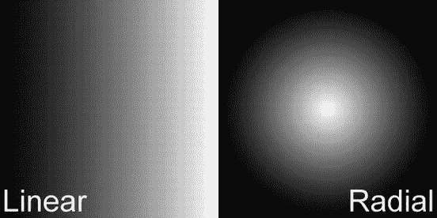

# 四、使用画布、SVG 和 Web 字体

我们已经讨论了基本的网络标准、新兴的浏览器，以及广告如何融入 HTML5 这个大话题。现在是时候深入研究驱动 HTML5 的技术了，包括新的 canvas 元素、SVG 和 Web 字体支持。我们将首先谈论 HTML5 规范中最大的进步之一，canvas。

canvas 元素是新的显示 API，用于直接在浏览器中处理图形。如果你来自一个使用显示列表 API 的 Flash 背景，canvas 将是一个受欢迎的过渡调整。这个元素可以提供完整的动画、图像操作，显然还有一个绘图工具，并且在本机浏览器环境中完成所有这些，而不需要像 Flash 这样的插件。我们将更深入地提供处理 canvas 元素的用例和示例，因为它与广告有关，并深入研究工具和 API，这可以帮助 Flash 开发人员过渡到使用它们进行创造性开发。对于 CSS 方面的事情，我们将讨论 web 字体如何通过普通的 CSS 语法直接在浏览器中提供丰富的字体呈现。我们还将讨论字体松鼠，以及这个工具和其他工具如何帮助将许多字体格式转换成浏览器友好的格式。最后，我们将回顾浏览器中的 HTML5 标记如何解释可缩放矢量图形(SVG) ，以及 SVG 如何为图标和符号提供优于传统图像的诸多优势。作为上一章关于图像和图标讨论的后续，你将深入了解如何优化任何屏幕的图形。简而言之，这一章充满了有用的花絮，所以一定要关注并跟随。

帆布

canvas 元素，用于在现代浏览器中渲染图形，可以说是 HTML5 规范最大的补充之一。对于广告来说，这是一个特别大的规范，因为有了它，人们最终可以像 Flash 一样绘制丰富的图形——但本质上，直接在浏览器中！“画布”标签最初由苹果公司于 2004 年开发，用于 Mac OSX 操作系统的 dashboard widgets 及其浏览器 Safari。不久之后，Web 超文本应用技术工作组(WHATWG)将其添加到 HTML5 标准中，后来它被 Firefox、Opera、Google 以及最终的微软所采用。

canvas 元素通过渲染图形、动画甚至交互性为浏览器带来了许多好处。使用 canvas 元素有许多不同的方式；下面几节将更深入地探讨如何使用它。在标记中设置 canvas 元素非常简单。这是一个标签，就像你使用的其他标签一样:

、、。清单 4-1 概述了如何创建元素。

***清单 4-1 。*** 如何创建画布元素

```html
<!DOCTYPE HTML>
<html>
<head>
<meta http-equiv="Content-Type" content="text/html; charset=UTF-8">
</head>
<body>
<canvas id="adCanvas" width="100" height="100"></canvas>
</body>
</html>
```

如您所见，在 HTML5 中创建标签相当简单。如果你打开你最喜欢的文本编辑器，输入清单 4-1 代码，保存为 canvas.html，并在你最喜欢的现代浏览器中打开它，你会注意到没有任何东西呈现到屏幕上。不要惊慌；把它想象成一个艺术家把他的画布放在画架上——这一次你是艺术家，尽管你还没有真正开始画任何东西。要在画布上画画，你需要利用这个新的 HTML5 元素的真正力量；那是在它的 API 里，全部都是 JavaScript。JavaScript 控制图形、动画和交互性的绘制。(最好将元素看作是您将利用 JavaScript 创建的图形的容器或外壳。)

在介绍 canvas 的 JavaScript 实现之前，请注意元素在 HTML 标记中有一些 DOM 属性，包括宽度和高度。

 **注** DOM 是指页面的文档标记，由元素、属性和标签组成。canvas 元素是 DOM 结构的一部分，它可以有各种属性，包括 ID、类、高度和宽度。

更重要的是，canvas 有几个方法来绘制路径、形状、渐变和字符，以及添加图像和合成。这只是开始！除了检测用户输入和渲染复杂的动画之外，还可以指示该元素做许多事情，例如交互式游戏。它甚至可以在浏览器中多次使用，通过创建一堆画布元素，一个在另一个之上，来表示一个复杂的图像组合，甚至可以在页面的不同区域使用。作为开发人员和设计人员，利用这个强大的 Web 新功能真的取决于您。

让我们以清单 4-1 中的代码为基础，通过添加一些简单的 JavaScript 代码，在屏幕上呈现一个绿色的正方形。尝试在你的文本编辑器中按照清单 4-2 中的进行操作。

***清单 4-2 。*** 用画布将一个绿色方块渲染到屏幕上

```html
<!DOCTYPE HTML>
<html>
<head>
<meta http-equiv="Content-Type" content="text/html; charset=UTF-8">
</head>
<body>
<canvas id="adCanvas" width="300" height="250"></canvas>
</body>
<script type="text/javascript">
//get a reference to the canvas
var canvas = document.getElementById('adCanvas');
var context = canvas.getContext('2d');
//draw a green square
context.fillStyle = 'green';
context.fillRect(0, 0, 250, 250);
</script>
</html>
```

一旦你刷新你的页面，你应该得到一个绿色小方块的图像，如图 4-1 所示。


图 4-1。用画布元素制作的 250 × 250 的正方形

如果你看到正方形，你就准备好回顾正在发生的事情。如果没有，请确保您使用的是支持 canvas 的现代浏览器，并仔细检查您的代码。

 **注意**在[caniuse.com/#feat=canvas](http://caniuse.com/#feat=canvas)检查帆布支撑。

首先，让我们创建一个变量来获取对 DOM 中 canvas 元素的引用。在这种情况下，通过在标记中写入<canvas ID = " ad canvas " width = " 300 " height = " 250 "></canvas>来赋予它 ID“ad canvas”。一旦有了引用，就向画布添加一个 2D 上下文，这样画布就知道如何绘制图形。简而言之，2D 上下文表示一个平面笛卡尔坐标系，其中原点(0，0)位于画布的左上角，向右时 x 值增加，向下时 y 值增加-类似于您在代数中所学的内容。

有了这个元素和背景，让我们开始在画布上“绘画”。为此，告诉 fillStyle 属性以绿色呈现(它也可以取一个十六进制和 RGB 值)，然后调用 fillRect 方法，通过编写 context.fillRect(0，0，250，250)传入特定的参数或自变量来呈现一个矩形；。在图 4-1 中，一个正方形是通过为其 x 坐标传入 0，为其 y 坐标传入 0，为其宽度和高度都传入 250 而创建的。该值采用浮点数；也就是说，不在整数上绘制，如 10，将导致子像素走样。如果你试图保持艺术的清晰度，这可能会有问题。(如果你想深入了解画布的其他属性和方法，请查看 roblaplaca.com/examples/canvasHelloWorld[的综合备忘单。](http://roblaplaca.com/examples/canvasHelloWorld)

 **注**这本书印刷时唯一可用的上下文支持是 2D。在第十二章中有更多关于 3D 和 WebGL 的内容。

这可能看起来很简单，但它很强大。还要记住，您已经看到了这个元素所能做的事情的开始。有许多用例需要涵盖；接下来，我将展示在实际方法中利用 canvas 的例子，特别是当它与构建在线广告相关时，包括图形动画和处理用户输入。

插画到画布

你可能已经在问自己，“等等，为什么我需要使用 JavaScript 以编程方式在画布上绘图？我是一名设计师；我不能用我正常的设计工具吗？”你不是唯一一个问这个问题的人；有一个很好看的工具，是专门为设计师使用而开发的，叫 AiCanvas(visit mix . com/labs/Ai 2 Canvas)；它允许设计师在他们知道和喜爱的基于矢量的程序中进行设计，尤其是 Adobe Illustrator。

Ai  Canvas 插件使 Adobe Illustrator 能够将矢量和位图作品直接导出到 HTML5 canvas 元素，该元素可以在支持 Canvas 的浏览器中呈现。该插件提供绘图、动画和事件等编码选项，以便您可以构建交互式的、设计良好的基于画布的 web 应用。

[visitmix.com/labs/ai2canvas](http://visitmix.com)

在创意部门，当你在一个团队中工作时，这个工具特别有用，在这个团队中，设计师需要向开发人员提供概念和模拟。你可以让你的设计师在 Illustrator 中工作，让你的开发人员在 JavaScript 中工作。该工具在设计和功能之间提供了一个清晰的分离，当客户需要改变时(他们总是这样)，它会提供帮助。除了使用 Illustrator 以这种方式绘图之外，该插件还支持动画、事件处理甚至调试。(如果你问我的话，我会觉得很甜蜜，而且这一切都是免费的。)这些特性使得这个插件成为任何设计者的工具箱的一个有价值的补充。由于它适用于某些应用，如果您真的想使用 canvas 来处理高度可视化和复杂的艺术作品，我建议您检查一下。但是请记住，随着图形变得更加复杂，k 权重肯定会增加，插件将生成的未经优化的 JavaScript 也会增加。因此，正确地计划你的执行，让你的客户和出版商知道你在做什么，特别是如果 k-weight 约束很紧的话。

将闪烁到画布

如果你从事 Flash 工作，或者认识一些现在或过去从事 Flash 工作的人，他们会告诉你，就为网络制作创新的丰富图形而言，这是一个突破性的平台。正如你现在所知道的，canvas 元素是一个受欢迎的附加元素，因为它让设计人员和开发人员在 HTML5 广告中更好地利用图形。现在，在最新的 Adobe Flash Professional CS6 中，由于一个名为 CreateJS 的库和工具包，设计人员可以更轻松地使用 canvas 元素。

CreateJS

CreateJS 的产品套件中有很多很棒的东西。

*   EaselJS(稍后将详细介绍)
*   TweenJS(用于动画)
*   SoundJS(用于 HTML5 音频)
*   预加载(用于预加载素材)
*   Zoe(一个精灵表生成器)

 **注意** TweenJS，SoundJS，PreloadJS，Zoe 不在本章讨论。你可以在 http://createjs.com 了解更多关于这些图书馆的信息。

对于设计人员和开发人员来说，由 Grant Skinner 开发的 CreateJS 框架提供了一套完整的 JavaScript 库，用于图形、动画、声音和预加载，以帮助构建 HTML5 内容。

图形动画

EaselJS 是一个 JavaScript 库，是 CreateJS 的一部分，它允许 Flash 设计人员和开发人员在 Flash 创作环境中创建图形。使用 EaselJS，您可以访问 Actionscript 3.0 中的许多类似语法，同时利用 JavaScript 创建本地浏览器图形和动画。根据 Grant Skinner 的说法，EaselJS 练习了十多年来 Flash 的显示列表 API 的开发；他想将其移植到一个全面的 JavaScript 库，用于处理 HTML5 中的 canvas 元素。在语法上，EaselJS 非常类似于在 ActionScript 3 (AS3) 中使用显示列表 API，如清单 4-3 所示。

***清单 4-3 。***EaselJS 的一个例子

```html
<!DOCTYPE HTML>
<html>
<head>
<meta charset="UTF-8">
<title>EaselJS</title>
<script src="easeljs-0.4.2.min.js"></script>
<script src="BoxBlurFilter.js"></script>
<style>
* {background-color: #000;}
</style>
</head>
<body onLoad="init()">
<canvas id="canvas" width="1024" height="768"></canvas>
</body>
<script>
var stage,
      canvas = document.getElementById("canvas"),
      context = canvas.getContext("2D"),
      logoImage = new Image(),
      logo,
      fps = 30,
      speed = 0.2;

function init() {
      stage = new Stage(canvas);
      //Keep a local image or you'll get the following error:
      //Unable to get image data from canvas because the canvas has been tainted by cross-origin data.
      logoImage.src = 'logo.jpg';
      logoImage.onload = function () {
            logo = new Bitmap(logoImage);
            logo.cache(0, 0, logoImage.width, logoImage.height);
            logo.regX = logo.image.width * 0.5;
            logo.regY = logo.image.height * 0.5;
            stage.addChild(logo);
           Ticker.setFPS(fps);
           Ticker.addListener(window);
      }
}
function tick() {
      var splitX = (stage.mouseX - logo.x) * speed;
      var splitY = (stage.mouseY - logo.y) * speed;
      logo.x += splitX;
      logo.y += splitY;
      logo.updateCache();
      logo.filters = [new BoxBlurFilter(5000, 5000, 2)];
      stage.update();
}
</script>
</html>
```

好吧，这需要完成相当多的代码，但任何来自 Flash 或 ActionScript 背景的人都会证明，就语法而言，它非常接近 JavaScript。在 init 函数中，与 Flash 的相似之处非常大。因此，如果你在 HTML5 中使用图形，我强烈建议你看看 EaselJS——不仅仅是因为它的易用性，还因为它的轻量级。它只有大约 45 千字节——通常足以带来一些开销来绘制一些真正令人惊叹的图形，假设出版商默认在其网站上没有包含这个库。

让我们分解清单 4-3 中的代码样本。首先设置 canvas 元素，通过编写 var stage 创建一些变量，canvas = document . getelementbyid(" canvas ")，context = canvas.getContext("2D ")，logoImage = new Image()，logo，fps = 30，speed = 0.2。对于偶尔使用 JavaScript 的用户来说，目前还没有什么新东西。第二，通过编写 init()创建 init 方法；，将事情拉开序幕。然后将 canvas 元素传递给 stage 对象，如 EaselJS 中所指定的那样—同样，非常类似于 ActionScript。第三，创建图像，并通过编写 logo = new Bitmap(logoImage)将其赋给一个位图对象；并通过调用 addChild 方法(另一个 ActionScript 代码片段)添加到舞台。最后一部分是驱动动画的部分。Ticker 对象本质上是应用的心跳；它以每秒一定的帧数被调用。在这种情况下，30，如上面通过编写 Ticker.setFPS(fps)在变量中定义的；。tick 方法在动画的每一帧都会被调用。应用基于用户鼠标坐标的 logo 移动，通过调用 EaselJS 框架中的 BoxBlurFilter 来应用一个好看的运动模糊滤镜，这个框架可以在 tick 方法和 Wahlaa 中找到！。您刚刚使用 EaselJS 创建了第一个基于画布的动画。显然，这个库还有更多内容，我鼓励你在自己的时间里通过深入研究文档[[http://www.createjs.com/Docs/EaselJS]]来尝试更多内容。也许，开始采取以前的 Flash 为基础的广告单元，并将其转换过来。如果您真的想使用 canvas 元素，我强烈建议您非常熟悉 EaselJS。当使用 canvas 元素时，它将使开发更加清晰，尤其是如果您来自 Flash/ActionScript 背景。

其他 JavaScript 库

您可能知道也可能不知道许多其他 JavaScript 库可以使用 canvas 元素，而不仅仅是 EaselJS。了解市场中的其他人是很重要的，因为你很有可能在未来的活动中或者在代理和广告服务器之间移交素材时遇到他们。我们来看两个比较流行的:KinectJS 和 ProcessingJS。

kinectjs〔??〕

Kinect js([kineticjs.com](http://kineticjs.com))是一个 canvas JavaScript 库，它通过为桌面和移动设备启用路径和像素检测来扩展 canvas 的二维上下文。您可以在画布上添加内容，然后向其中添加事件监听器—独立于其他元素移动、缩放和旋转它们，以支持动画、交互性和过渡。KinectJS 可以处理许多类型的交互事件，包括鼠标点击、触摸、点击和拖动。凭借其丰富的功能集和较小的文件大小(66 千字节)，您肯定会在许多利用 canvas 元素的广告活动中看到这个库。

加工 j

我想介绍另一个库，但它肯定不是市场上不断增长的 canvas JavaScript 库列表中的最后一个。Processing js([processingjs.org](http://processingjs.org))是从 Processing language 发展而来，这是一种基于 Java 的可视化语言，已经在许多故事片中用于创建基于节点的、“网络”和抽象元素。ProcessingJS 的库很强大；它可以创造一些非常引人注目的创造性体验([processingjs.org/exhibition](http://processingjs.org/exhibition))。我包括这个库是因为它既惊人又沉重——如此沉重以至于我建议不要在广告环境中使用 ProcessingJS 作为代码基础。仅包括库就有惊人的 400 多千字节，更不用说您自己的代码库来处理 canvas 元素了。当您和您的客户使用 canvas 构建体验时，请记住这一点。仅仅因为它看起来很棒，并不意味着你的所有用户都会得到相同的体验，尤其是当文件这么大的时候。

这些库就在那里，大部分都是免费使用的。我提到它们只是为了展示有许多选择，但并不是每一个都适合广告空间。因此，请记住整体用户体验、加载时间和发布者 k-weight 限制。从已定义的发布规范向后工作将允许您选择正确的库，如果您需要走这条路的话。

画布示例

到目前为止，我已经介绍了一些关于 canvas 元素的工作，以及在使用这个新元素时可以加快开发时间的外部 JavaScript 库。你已经看到了它能做什么，它如何帮助你的创意过程，甚至在广告中使用它时的一些限制。在接下来的几节中，我们将介绍如何在不需要第三方插件的情况下使用 canvas 元素。这将允许您快速上手，而不需要依赖外部库。也就是说，如果您确实使用了一个库，那么当您使用它们时，语法无疑会发生变化，所以在深入研究之前，一定要查看 API 文档。

线

广告语在广告活动中一直被使用。它们非常适合呈现路径——地图方向、矢量图，甚至是图表。广告创意中的线条使用案例非常广泛。清单 4-4 展示了如何使用 HTML5 的 canvas 元素呈现一个简单的线条。

***清单 4-4 。*** 用画布渲染一条线

```html
<!DOCTYPE HTML>
<html>
<head>
<meta http-equiv="Content-Type" content="text/html; charset=UTF-8">
</head>
<body>
<canvas id="adCanvas"></canvas>
</body>
<script>
//get a reference to the canvas
var canvas = document.getElementById('adCanvas');
var context = canvas.getContext('2d');
var adWidth = 300;
var adHeight = 250;

canvas.width = adWidth;
canvas.height = adHeight;
context.moveTo(0,0);
context.lineTo(adWidth,0);
context.moveTo(adWidth,0);
context.lineTo(adWidth,adHeight);
context.moveTo(adWidth,adHeight);
context.lineTo(0,adHeight);
context.moveTo(0,adHeight);
context.lineTo(0,0);
context.stroke();
</script>
</html>
```

这段代码概述了一个动态的方式来添加一个广告边框。首先获取对 canvas 元素的引用，并将其命名为 canvas。接下来，设置一个 2D 绘图上下文，并声明两个变量 adWidth 和 adHeight。这些值将动态地将画布元素更新为所需的尺寸。这个例子使用了普通的广告尺寸 300 × 250。最后，使用 canvas 的绘图 API，通过使用方法 lineTo 和 moveTo 的序列，在整个元素周围移动和添加一条线，这呈现了图 4-2 中的图像。


图 4-2。使用 canvas 元素创建 300 × 250 的边框

如您所见，使用 canvas 元素绘制动态广告边框相当简单。(这非常有用，因为出版商和 IAB 规范要求您在广告周围添加 1 像素的边框。)然而，事情并没有就此结束。试着用线做一下，看看你还能想出什么。请记住，你可以用你的设计工具做的任何事情，你几乎都可以用画布来做，甚至添加贝塞尔曲线和弧线。如果你需要一个起点，从 W3C 学校“尝试”编辑器([w3schools.com/html5/tryit.asp?filename=tryhtml5_canvas_line](http://w3schools.com/html5/tryit.asp?filename=tryhtml5_canvas_line))开始。

形状

如果你能创造线条，你就能创造形状(这里没什么大惊小怪的！).让我们来看看使用画布创建复杂的形状。成功地将一个绿色正方形渲染到屏幕上，让我们制作一个星形(见清单 4-5 )。为了节省空间，我将省略完整的 HTML 标记，重点放在 JavaScript 部分。

***清单 4-5 。*** 用画布做出星形

```html
<script>
//get a reference to the canvas
var canvas = document.getElementById('adCanvas');
var context = canvas.getContext('2d');
//draw a star
context.save();
context.beginPath();
context.moveTo(92.0, 1.1);
context.lineTo(120.1, 58.1);
context.lineTo(183.0, 67.2);
context.lineTo(137.5, 111.5);
context.lineTo(148.2, 174.1);
context.lineTo(92.0, 144.6);
context.lineTo(35.8, 174.1);
context.lineTo(46.5, 111.5);
context.lineTo(1.1, 67.2);
context.lineTo(63.9, 58.1);
context.lineTo(92.0, 1.1);
context.closePath();
context.fillStyle = 'rgb(255, 255, 0)';
context.fill();
context.stroke();
context.restore();
</script>
```

您可能已经注意到 canvas 元素的尺寸需要增加到 200 × 200 才能看到完整的星星。如果您试图绘制比画布尺寸支持的更大的东西，请记住这一点，因为您的绘制将渲染元素并产生剪辑。

查看清单 4-5 ，你可以看到同样的方法被用来画线，但是这次在起点和终点的位置上有一点复杂。您还可以看到添加了一个 fillStyle 方法，并在 RGB(红绿蓝)空间中赋予了黄色值。如果你跟着做，你应该会在你的浏览器中看到图 4-3 中的图像。


图 4-3。使用画布元素制作的星星

这看起来很简单，但实际上非常强大。现在，您可以让浏览器完成所有繁重的工作，而不是引入大的位图图形，这会导致最终用户的加载时间更长。请记住，如果它是一个矢量形状，您可以使用 canvas 元素或多或少地重新创建它

梯度

canvas 元素的另一个特性是它使用渐变的能力。渐变对于将形状从一种颜色填充到另一种颜色或者在堆栈中建立多个颜色值非常有用。渐变在网上很多东西都有广泛应用。长久以来，开发人员和设计人员使用 CSS 创建并重复 1 像素宽的渐变条带。现在，有了 canvas 元素的原生渐变支持，浏览器又可以处理繁重的工作了。当客户将 Photoshop 文档交给您时，这一点非常重要，您需要在浏览器中重新创建精确的表示，同时最小化 k 权重。不要从 PSD 中引入位图，而是让画布来处理它。这可能有点耗时，但最终结果是值得等待的。渐变可以是*线性*或*径向*或者在 0 和 1 之间有多个颜色停止点。

线性渐变和径向渐变的主要区别在于渐变的起点。图 4-4 显示了它们之间的视觉差异。



图 4-4。线性渐变和径向渐变的区别

清单 4-6 为图 4-3 中的星形制作一个线性渐变填充。

***清单 4-6 。*** 使用画布进行线性渐变填充

```html
<script>
//greenish gradient
var gradient=context.createLinearGradient(0,0,200,50);
gradient.addColorStop(0,"#FFFF00");
gradient.addColorStop(1,"#00FFFF");
context.save();
context.beginPath();
context.moveTo(92.0, 1.1);
context.lineTo(120.1, 58.1);
context.lineTo(183.0, 67.2);
context.lineTo(137.5, 111.5);
context.lineTo(148.2, 174.1);
context.lineTo(92.0, 144.6);
context.lineTo(35.8, 174.1);
context.lineTo(46.5, 111.5);
context.lineTo(1.1, 67.2);
context.lineTo(63.9, 58.1);
context.lineTo(92.0, 1.1);
context.closePath();
context.fillStyle = gradient;
context.fill();
context.stroke();
context.restore();
</script>
```

即使快速浏览一下加粗的代码也可以发现，制作渐变就像在 2D 上下文对象上调用 createLinearGradient 方法并传递正确的参数一样简单。创建渐变后，通过调用 addColorStop 方法并指定浮点偏移量(0–1)和十六进制格式的颜色值来添加颜色停止点。因此，您可以在 0.2、0.4、0.8 等位置指定一个停止点，以获得完整的粒度和灵活性。最后，将这个新的渐变值添加到星星形状的填充样式中，产生了图 4-5 所示的输出。


图 4-5。创建线性渐变

形象

虽然最好让 canvas 元素处理广告中的图形合成，但有时您无法避免使用位图图像，例如当您与希望展示新产品的零售客户或希望展示最新车型的汽车公司合作时。记住这一点，让我们进入在 HTML5 的画布上处理图像的领域。这样工作的话，开发者可以很容易地在画布上绘制一个图像位图(见清单 4-7 )。

***清单 4-7 。*** 画布位图图像

```html
<script type="text/javascript">
//get a reference to the canvas
var canvas = document.getElementById('adCanvas');
var context = canvas.getContext('2d');
//draw image
var img=new Image();
img.src="test.jpg";
img.onload = function(){
     context.drawImage (img,0,0);
};
</script>
```

正如您在清单脚本中看到的，我创建了一个新的图像对象 img，并将其源指定给 test.jpg(注意，这将随着您使用的图像路径而改变)。一旦图像被加载，它将触发 onload 事件，该事件将执行函数来调用 drawImage 并将图像绘制到画布元素上。

事件

正如您已经意识到的，canvas 元素是 HTML5 中的一个很好的特性，用于将矢量和位图图形呈现到屏幕上。但事情还没完。画布也能反应；它可以处理来自浏览器或用户输入的事件，包括鼠标、触摸和 DOM 事件。清单 4-8 展示了画布如何通过将输出记录到浏览器的 JavaScript 控制台来对许多事件做出反应。

***清单 4-8 。*?? 使用 Canvas 将日志输出到 JavaScript 控制台**

```html
<script type="text/javascript">
//get a reference to the canvas
var canvas = document.getElementById('adCanvas');
var context = canvas.getContext('2d');
//Mouse Events
canvas.addEventListener('click', function(evt){
     console.log('Click: ' + evt);
});
canvas.addEventListener("mouseover", function(evt) {
     console.log('MouseOver: ' + evt);
});
canvas.addEventListener("mouseout", function(evt) {
     console.log('MouseOut: ' + evt);
});
canvas.addEventListener("mousemove", function(evt) {
     console.log('MouseMove: ' + evt);
});
//Touch Events
canvas.addEventListener("touchstart", function(evt) {
     console.log('TouchStart: ' + evt.touches.length);
});
canvas.addEventListener("touchmove", function(evt) {
     evt.preventDefault();
     var touch = evt.touches[0];
     console.log("Touch x:" + touch.pageX + ", y:" + touch.pageY);
});
canvas.addEventListener("touchend", function(evt) {
     console.log('TouchEnd: ' + evt);
});
canvas.addEventListener("touchcancel", function(evt) {
     console.log('TouchCancel: ' + evt);
});
</script>
```

用户输入在鼠标点击和触摸事件时被处理，输出被记录到 JavaScript 控制台。请记住，如果设备支持的话，您可以将它扩展到使用鼠标甚至手指绘画的用户。让用户用 canvas 元素输入可以提供交互性，这是一个很好的特性，可以融入到您的创意中。它可能涉及到在画布上开始或停止动画，甚至与你的广告单元内的游戏互动。在制作需要交互性和用户输入的广告时，请记住这一点。

保存

现在，您已经知道如何通过控制用户输入来提供交互性，让我们尝试将画布上的图像保存到本地驱动器。要将画布存储为图像，请将图像源设置为图像 todataURL。从那里，用户可以将其保存到本地机器。相当酷！尤其是当你想让用户在体验中定制一些东西，并把它带走，或者通过电子邮件或社交网站分享。

 **注意**如果画布上有来自其他域的颜料，toDataURL()方法将抛出一个 SECURITY_ERR 异常。

清单 4-9 展示了如何通过 toDataURL 方法使用 canvas 保存图像格式。

***清单 4-9 。*** 使用画布保存图像

```html
<script type="text/javascript">
//get a reference to the canvas
var canvas = document.getElementById('adCanvas');
var context = canvas.getContext('2d');
var img=new Image();
img.src="test.jpg";
img.onload = function(){
     context.drawImage (img,0,0);
};
//Mouse Events
canvas.addEventListener('click', function(evt){
     console.log('Click: ' + evt);
     // no argument defaults to image/png; image/jpeg, etc. also work on some. image/png is the only one that must be supported per spec.
     try {
          window.location = canvas.toDataURL("image/png");
     } catch (error) {
          console.log(error);
     }
});
</script>
```

你现在可以在你的画布容器中保存图像了！如果你正在创建一个交互式广告单元，你想让用户用它来绘画或创作，如果你想让用户能够把它保存到他们的机器上或与另一个 web 服务共享，这是非常有用的。如清单 4-9 中的所示，将图像绘制到画布上，单击鼠标调用方法 toDataURL，将画布保存为默认 mime 类型为 png 的图像。您也可以保存为其他格式，如 jpeg 和 gif，以及通过设置正确的 mime 类型。

动画片

让 canvas 元素处理动画是设计师的另一大优势——尤其是动画师。在浏览器中可以用几种不同的方式处理动画。清单 4-10 展示了符合 HTML5 的浏览器中最合理的方法，requestAnimationFrame 方法。

***清单 4-10 。*** 使用画布制作动画

```html
<script>
var canvas = document.getElementById('adCanvas');
var context = canvas.getContext('2d');
var gradient = context.createLinearGradient(0, 0, 200, 200);
gradient.addColorStop(0, '#000000');
gradient.addColorStop(1, '#999999');
context.fillStyle = gradient;
var x = 0, y = 0;
var shapeWidth = 50, shapeHeight = 50;
var speed = 12;
function animate() {
reqAnimFrame = window.mozRequestAnimationFrame || window.webkitRequestAnimationFrame || window.msRequestAnimationFrame || window.oRequestAnimationFrame;
     reqAnimFrame(animate);
     x += Math.round(speed);
     if (x <= 0 || x >= canvas.width - shapeWidth) {
          speed = Math.round(−speed);
     }
     draw();
}
function draw() {
     context.clearRect(0, 0, 500, 170);
     context.fillRect(x, y, shapeWidth, shapeHeight);
}
animate();
</script>
```

从清单中可以看出，canvas 元素通过利用 requestAnimationFrame 非常容易地处理动画；它告诉浏览器你正在有意地尝试制作动画。首先，获取 canvas 元素并添加它的 2D 上下文(没有什么新的)。然后添加一些设置变量来控制动画的 x，y，宽度，高度和速度。接下来，设置一个名为 animate 的函数，它在每次请求帧时调用自身，并调用 draw 方法。

 **注意**当函数被附加到一个对象上时，它们被称为方法。

最后，draw 方法中有两个方法，clearRect 和 fillRect，它们负责将正方形清除并绘制到屏幕上。如果您的目标需求包括所有现代 HTML5 浏览器，请记住包括 requestAnimationFrame 的供应商前缀的完整列表(暂时)。

高级画布

从上面的简短示例中，您现在应该对 canvas 元素的功能以及它给 HTML5 规范带来的许多增强有了很好的理解。以下是一些更高级的画布示例,你可以在自己的时间里查看。

*   impact js . com
*   [craftymind.com/factory/html5video/CanvasVideo.html](http://craftymind.com/factory/html5video/CanvasVideo.html)
*   [哇。什么. jp/jscloth](http://gyu.que.jp/jscloth)
*   [fir.sh/projects/jsnes](http://fir.sh/projects/jsnes)
*   [spielzeugz.de/html5/liquid-particles.html](http://spielzeugz.de/html5/liquid-particles.html)
*   [nihilogic.dk/labs/canvas3dtexture_0.2](http://nihilogic.dk/labs/canvas3dtexture_0.2)
*   [William Malone . com/articles/create-html 5-canvas-JavaScript-drawing-app](http://williammalone.com/articles/create-html5-canvas-javascript-drawing-app)

在探索新的库和教程时，请记住文件的重量和整体性能，尤其是在观看演示并试图为您的广告创意提供参考时。也要记住，没有人会上网看你的广告，所以尽量避免矫枉过正。通常，最好的方法是给浏览者一个体验，让他们在登陆页面上获得更全面的体验。过于复杂的广告会让用户的机器不堪重负，甚至崩溃，这取决于设备、机器的局限性，甚至是广告发布者。最后，看看[html5rocks.com/en/tutorials/canvas/performance](http://html5rocks.com/en/tutorials/canvas/performance)关于在网络上最大化你的画布性能的提示，包括复杂图形的画布元素分层和避免不必要的舞台变化。

画布浏览器支持

因为 canvas 元素是 HTML5 规范的一个新兴特性，所以许多旧浏览器不支持它。因此，如果您需要为不支持新元素的浏览器设计，您将需要使用 polyfills 和 shivs。例如，闪存可以作为针对桌面和显示器的完美故障切换。要检测桌面和移动设备对现代浏览器的支持，可以使用一个名为 Modernizr 的库([modernizr.com](http://modernizr.com))。Modernizr 或多或少面向 k-weight 不是主要问题的 web 内容开发。在网络广告中，让你的广告创意包含 Modernizr 可以显著增加 k-weight。弄清楚你的出版商是否包括 Modernizr，以及它是否能为广告提供合适的“挂钩”。如果你能利用它，Modernizr 是一种用于特征检测的中国餐馆菜单；您只需要包含您绝对需要检查的内容，这样可以节省整体 k 重量。在理想的情况下，出版商和广告网络将默认包含这个库，这样广告就可以挂钩到网站内容已经检查过的有用功能。请务必联系您的出版商，了解其页面是否使用 Modernizr，以及广告创意是否可以检测到受支持的功能。清单 4-11 展示了一个为画布使用 Modernizr 的例子，不包括库。

***清单 4-11 。*** 使用 Modernizr 进行画布检测

```html
if (Modernizr.canvas) {
    // canvas is supported—do canvas stuff
}else{
    //canvas is not supported use Flash or something similar as a failback
}
```

正如你所看到的，广告设计者可以通过简单地包含一个条件(if/else)语句来非常容易地使用它，如果出版商已经将它包含在他们的网站中。

你可能会问，老的浏览器呢，比如微软的 IE6 到 IE8？他们可以从利用 ExplorerCanvas(excan vas . SourceForge . net)中受益，这是一个用于与不支持新元素的浏览器一起工作的聚合填充。canvas 元素还可以以多种不同的方式使用。将多个元素堆叠在一起形成最终的组合是一种方法，它避免了画布状态的改变。在画布上绘画是一项昂贵的操作，因为一些浏览器在机器的 CPU 上处理所有的处理能力。然而，随着现代浏览器的版本，如 Chrome 版，为 canvas 元素提供硬件加速的 GPU 支持，性能和渲染将大大加快。随着越来越多的浏览器采用这些功能，它们将非常有助于部署到移动设备上，在移动设备上消耗 CPU 会耗尽电池的寿命，最终导致浏览器崩溃。(一个非常好的写在画布上的表现发现在 html5rocks.com/en/tutorials/canvas/performance.)

动画 Gif

你听说过这样一句话吗，“仅仅因为你可以用一种方式做某事并不一定意味着这是最好的方式”？浏览器动画中一个经常被忽视的组件是传统的动画 gif 格式。是的，我知道，这是一种在网络上创建动画的稍微成熟和原始的方法，但它今天仍然有一些吸引力。你可能还记得，在 Flash 广告出现之前，动画 gif 非常流行。还记得第一章中的静态 HTML 或通过简单的 gif 图像制作动画的 HTML 广告吗？动画 gif 可以在必要时快速制作一系列图像的动画，或者如果你不太了解如何在画布上工作(不过，这应该不再是一个问题！).这也是将视频帧转换成图像序列的一个很好的解决方法，这样开发人员可以在 iPhones 和 iPads 以及类似设备上模拟自动播放(苹果禁止自动播放视频，因为它会吞噬客户的数据计划)。此外，动画 gif 在任何地方都被接受，在几乎所有的浏览器上。像 Adobe 的 Photoshop 和 Adobe Fireworks 这样的软件可以非常容易地创建动画 gif，只需做一点工作。一些在线网络服务甚至更简单:

*   吉忍者:吉忍者. com
*   Mothereffing 动画 gif:[mothereffinganimatedgif.com](http://mothereffinganimatedgif.com)

您会发现，并不是每种类型的动画都需要 canvas 元素，尤其是因为它是一个新兴的特性。动画 gif 仍然是一个有用和可行的功能；因此，利用它们在创建时的易用性和渲染时的整体文件大小。然而，如果你想用更丰富的动画让你的客户惊叹，你最好使用 canvas 元素。我建议在你承诺一个或另一个功能之前，从出版商或广告网络那里了解活动的目标和要求。谁知道呢，你也许可以很容易地利用这两者，首先用 canvas 进行开发，然后在不支持 HTML5 体验的用户浏览器上优雅地退化为动画 gif 体验。与您的第一和第三方广告服务器合作，提供用户代理检测，并适当地提供创意和标签。要利用 canvas 元素的动画 gif 故障转移，请将动画 gif 图像包装在 canvas 标记中；比如

<canvas></canvas>

。对于支持 canvas 的浏览器，inside 元素(在本例中是 img 标签)将被省略；否则，对于不支持 canvas 的浏览器，标签会被识别，并且图像会呈现到屏幕上。

广告中的画布

太好了，您已经了解了使用新 canvas 元素的设计师和开发人员可以使用的所有惊人的功能和增强功能，但是在广告领域，一切是如何进行的呢？嗯，canvas 元素为广告带来了许多新的增强。首先，人们第一次可以直接在浏览器中创建类似 Flash 的图形，而无需使用第三方插件。随着现代浏览器变得无处不在，将会有一套在网络上创建图形的标准。此外，canvas 在移动和平板设备上非常棒；跨制造商、操作系统和浏览器的支持非常强大。移动设备上的浏览器将很快通过图形处理单元(GPU)利用硬件支持来加快渲染速度，并大大减轻 CPU 的负担。Canvas 是在线广告和整个网络的一个巨大的游戏改变者。使用 canvas 元素的活动示例可在以下 URL 中找到:

*   [`bit.ly/QIpVJa`](http://bit.ly/QIpVJa)
*   [`bit.ly/OAf8BX`](http://bit.ly/OAf8BX)

我期望在不久的将来看到更多的广告设计师和开发者在他们的 HTML5 活动中使用 canvas。简而言之，画布将长期存在。这将是在网络上处理图形的一个习惯元素——但是，请记住，它还在发展中。因此，将它用于活动中的任何动画和图形可能不是最明智的做法，除非您已经准备好了故障转移。

挽救（saving 的简写）

正如您所看到的，canvas 元素非常适合在 HTML5 中创建丰富的图形和动画，但是还有一种已经存在了很长时间的图形语言(自 2003 年以来):SVG。SVG(可缩放矢量图形),现在通过 HTML5 支持内联。(“内联”意味着可以简单地通过在 HTML 标记中添加<svg>标签来包含 SVG 内容。)</svg>

我们先来分解一下 SVG 是做什么的。可缩放矢量图形本质上是 XML 标记，它以浏览器可以理解的方式定义了一组笔画、填充和图形指令。在任何大小或缩放水平下，SVG 都可以将艺术清晰地呈现在屏幕上。在广告活动中，保持品牌名称、标志、字体和整体文案的易读性尤为重要。在像素密度不断变化的移动设备生态系统中，SVG 仍然会清晰地呈现在屏幕上，所以无论何时何地都可以使用 SVG。

SVG 强大而简单，因为它是基于矢量的——这意味着笔画和填充是通过坐标在屏幕上以数学方式呈现的。相比之下，位图是以像素为单位渲染的，如果位图没有驻留在整个像素上，则会导致子像素锯齿和羽化或模糊图像的产生。原生 SVG 支持是对 HTML5 规范的重要增强；它允许设计师在 Adobe 的 Illustrator(或任何他们选择的矢量工具)中进行创作，并通过将他们的作品保存为 SVG 文件导出到屏幕上。这种文件格式是 W3C 规范，在各种浏览器中得到广泛支持。SVG 真的很擅长节省 art 的 k-weight 以及它的易读性和整体保真度。参见图 4-6 ，图中显示了百事可乐的标志(来自【brandsoftheworld.com】??)。


图 4-6。百事可乐标志的 SVG 和 IMG 版本

图 4-6 将一个矢量(SVG)版本放置在一个位图(IMG)版本之上。您可以看到 SVG 版本与位图图像一样清晰，无论图像的缩放比例或屏幕上的缩放级别如何，它都会保持清晰，而位图的质量会随着缩放比例的增加而下降。此外，SVG 版本是 8kb，而 IMG 图像是 12kb。这看起来没什么大不了的，但是当你添加更多的图像和更多的颜色值，图形变得更复杂时，你会很快注意到这种方法可以在你的广告中节省大量的文件大小。(你会在 bogotobogo.com/svg.html 的[找到更多使用 SVG 的例子。在 HTML5 中发起利用 SVG 的活动之前，记得使用 caniuse.com/svg-html5](http://bogotobogo.com/svg.html)的[来检查浏览器支持。)](http://caniuse.com/svg-html5)

拉斐尔 t 0

我想让你注意一个强大的 JavaScript 库，叫做 raphaljs([raphaeljs.com](http://raphaeljs.com))，它可以通过网络上的矢量图形简化你的工作流程。raphaljs 使用 SVG W3C 推荐标准，其中您在它的库中创建的对象也是 DOM 对象；因此，您可以为用户输入或其他事件附加通常的 JavaScript 事件处理程序。raphaljs 也非常跨浏览器友好，如 Firefox 3.0、Safari 3.0、Chrome 5.0、Opera 9.5、IE6.0，以及这些浏览器的所有新版本都支持它。然而，在广告领域，raphaljs 有点大，除非你有空间玩 k-weight。因为它有大约 89 千字节缩小版和超过 200 千字节未缩小版，它可能会让一些出版商倾家荡产。所以在走这条路之前要小心，因为可能很难改变创意或让出版商在规格上让步。

同步化多媒体整合语言(Synchronous Multimedia Integrate Language)

SMIL (同步多媒体集成语言)允许在 SVG 元素中使用动画。根据 Mozilla 开发者网络(【developer.mozilla.org/en/SVG/SVG_animation_with_SMIL】??)的说法，SMIL 提供了动画元素的数字属性、变换属性、颜色属性和运动路径的能力。清单 4-12 展示了如何在 SVG 中利用 SMIL。

***清单 4-12 。*** 利用 SVG 内的 SMIL

```html
<svg width="300px" height="100px">
     <rect x="0" y="0" width="300" height="100" fill="white" stroke="white" stroke-width="1" />
     <circle cx="0" cy="50" r="50" fill="green" stroke="white" stroke-width="1">
          <animate attributeName="cx" from="0" to="300" dur="1s" repeatCount="indefinite" />
     </circle>
</svg>
```

在这个清单中，一个绿色圆圈在 1 秒钟内移动了 300 个像素，这个过程一直重复。如果你看一下加粗的代码行，这很容易实现。在浏览器中测试列表；你会注意到 SVG 动画出奇的快。还有更多的功能可以利用——这个简单的代码只显示 x 值上的动画——所以一定要查看 URL[[`srufaculty.sru.edu/david.dailey/svg`](http://srufaculty.sru.edu/david.dailey/svg)]，了解更多信息并开始尝试。尝试调整颜色，沿着设定的路径制作动画，甚至在制作动画时操纵形状。最后，在利用 SMIL 清单之前，总是使用 caniuse.com/svg-smil 的[来检查整体支持。](http://caniuse.com/svg-smil)

画布和 SVG

您可能会想，“我有 canvas 元素和 SVG 支持，但是我使用哪一个呢？”从最终用户的角度来看，它们在处理能力上是相似的，但是在技术上有很大的不同。两者都支持布局、渐变、动画、用户输入和遮罩，但一个由 JavaScript API 驱动，另一个由 XML 标记形成。SVG 的一个好处是它可以通过 CSS 进行样式化，因为在文档的标记中有实际的 DOM 元素，而 canvas 只是 DOM 中的一个对象(容器), CSS 样式化是被禁止的，除非你只针对 canvas 元素本身。简而言之，你应该真正利用这两者，这取决于创意的要求和活动的范围。要获得非常详细和全面的文章，请访问 Opera 浏览器的开发者网站([dev . Opera . com/articles/view/SVG-or-canvas-chopping-between the two](http://dev.opera.com/articles/view/svg-or-canvas-choosing-between-the-two))。

广告中的 SVG

在 web 标准广告中使用 SVG 是一件大事。多年来，我一直在 Flash 中使用矢量艺术来节省文件大小，这同样适用于现在的浏览器开发。SVG 不仅通过直接在浏览器标记中描述一堆数学坐标来呈现简单和复杂的矢量图形；它在品牌识别、保持图像保真度和字体渲染方面也非常重要(如下一节所述)。此外，SVG 可以通过设计者已经在使用的程序保存。这使得学习曲线更容易应付。SVG 渲染速度很快，正如你所看到的，与 SMIL 动画结合得很好。因此，我强烈建议您在广告活动中使用 SVG，尤其是在图形是强制性的、目标屏幕各不相同以及在 publisher 页面的开发和测试过程中文件大小受到限制的情况下。

网页字体

进入使用 CSS3 的 HTML5 的创造性开发，让我们稍微改变一下思路，了解更多关于使用 CSS3 web 字体将字体渲染到屏幕上的信息。很长一段时间，网络上的字体都很可怕；只有精选的几种“网络安全”字体可用:Arial、Courier、Times、Verdana 等。。。虽然这很好，因为它为最终用户提供了一致的体验，但它严重限制了设计师的创造力。设计师希望在网络上复制他们的印刷创意水平，但他们不能，除非他们将排版设计保存为图像，或者在 Flash 成为广告标准时利用它。保存为图像是一件痛苦的事情—更新并不容易，因为它们经常被制作成图像，并且随着更多的图像文件到达最终用户，导致更长的加载时间。此外，你当然可以用设计好的排版抛弃动态文本内容的可能性。当 Flash 成为标准时，品牌和营销人员爱上了它丰富的字体渲染和用品牌的精确字体提供动态文本的能力。

严格地说，网络字体并不是新的；他们一直处于 CSS 级，但是有限的浏览器采用和分散的供应商支持破坏了他们与设计师合作的能力。在最新的 CSS level 3 spec (CSS3)中，包含 web 字体带来了通过 CSS 渲染任何设计者字体的能力，包括字体的 at-rule 集。清单 4-13 展示了一种在你的 CSS 样式中包含网络字体的可靠方法——具体来说，就是 Oxygen，谷歌免费网络字体库中的一种字体。

***清单 4-13 。*** 使用 CSS3 网页字体(HTML)

```html
<!DOCTYPE HTML>
<html>
<head>
<meta http-equiv="Content-Type" content="text/html; charset=UTF-8">
<link href=' [`fonts.googleapis.com/css?family=Oxygen`](http://fonts.googleapis.com/css?family=Oxygen) ' rel='stylesheet' type='text/css'>
<style rel='stylesheet' type='text/css'>
html, body {
     font-family: 'Oxygen', sans-serif;
}
</style>
</head>
<body>
</body>
</html>
```

 **注意**谷歌的开源和免费网络字体列表可以在[google.com/webfonts](http://google.com/webfonts)找到。

请注意，我已经链接到了 Google 域名上的外部 CSS 文件。加载后，新的字体系列 Oxygen 可以添加到样式表中，或者作为 HTML 标记中的内联样式。够简单吗？清单 4-14 查看我们链接到的谷歌提供的样式表中发生了什么。

***清单 4-14 。*** 使用 CSS3 网页字体(CSS)

```html
@font-face {
     font-family: 'Oxygen';
     font-style: normal;
     font-weight: 400;
     src: local('Oxygen'),url('http://themes.googleusercontent.com/static/fonts/oxygen/v1/←
     eAWT4YudG0otf3rlsJD6zOvvDin1pK8aKteLpeZ5c0A.woff') format('woff');
}
```

当我们链接到 Google 提供的 CSS 文件时，请注意 CSS 语法实际上是为 Oxygen 声明了一个新的字体规则，这样当 font family 属性被分配给 Oxygen 时，文档的其余部分就可以理解它是什么了。在清单中，设置了供浏览器使用的字体系列、字体样式、字体粗细和字体文件的来源。这一部分可能看起来令人困惑，但它实际上只是针对 WOFF 字体文件。这些任意字符是 Google 在服务时生成的，很可能是为了掩盖服务器上的文件名和统计对文件的请求。WOFF 字体文件是分散的 web 字体空间中的许多格式之一(我们将在下面的部分中更详细地介绍)。谷歌服务的好处在于，它能检测到哪个浏览器在请求字体，并为那个特定的浏览器提供合适的格式。

woff〔??〕

从我们刚刚讨论的那个开始，WOFF (web 开放字体格式)字体文件是一个为浏览器提供 web 字体的开发标准。WOFF 文件本质上是 TrueType 文件，经过压缩后可通过 Web 传送，并带有附加的元数据信息。WOFF 格式的总体目标是有一个能被所有浏览器接受的标准，并且足够轻量级，以最小带宽服务于浏览器和设备(如移动设备)。在撰写本文时，Mozilla 的 Firefox 版本 3.6 及更高版本、Google 的 Chrome 版本 5 及更高版本和 Opera 都支持 WOFF 格式；微软的 IE9 也支持它。对于 Apple 和 Safari，从版本 5.1 开始，仅在 Mac OS X Lion 上提供支持。许多人认为，在不久的将来，WOFF 文件将成为 web 字体交付的事实标准。我希望它能让这个空间的碎片化消失。

TrueType Font

TrueType 字体(TTF) 是我将要讨论的最古老的字体格式。TrueType 字体由苹果公司在 20 世纪 80 年代开发，在 OS X 狮子(10.7 版)和 Safari 5.1 版之前，苹果公司的 Safari 浏览器中使用 TrueType 字体。如果您尝试通过在 Safari 浏览器中查看我们的 Oxygen 样式表 URL 来验证这一点，您会从 Google 得到以下响应:

```html
@font-face {
  font-family: 'Oxygen';
  font-style: normal;
  font-weight: 400;
  src: local('Oxygen'), url('http://themes.googleusercontent.com/static/fonts/oxygen/v1/ WNVARKadHCfwbQ2n3MQeIOvvDin1pK8aKteLpeZ5c0A.ttf
') format('truetype');
}
```

谢天谢地，谷歌正在为你做浏览器检测，如你所见，字体空间已经变得相当分散。

嵌入式 OpenType

恰如其分的 web 字体碎片和我们的 Google web 字体例子对于 Oxygen ( 清单 4-14 )，Embedded OpenType(【EOT】)字体文件都是在微软浏览器、Internet Explorer 中使用的。从 IE 浏览器向我们的样式表发出请求将会得到 Google 的如下响应:

```html
@font-face {
  font-family: 'Oxygen';
  font-style: normal;
  font-weight: 400;
  src: url('http://themes.googleusercontent.com/static/fonts/oxygen/v1/←
RuRdwqUdkfYP0fpTfyGHiA.eot');
  src: local('Oxygen'), url('http://themes.googleusercontent.com/static/fonts/oxygen/v1/←
 RuRdwqUdkfYP0fpTfyGHiA.eot') format('embedded-opentype'), url('http://themes.googleusercontent.com/static/fonts/oxygen/v1/←
RzoNiRR1p2Mqyyz2RwqSMw.woff') format('woff');
}
```

谷歌正在通过向 ie 浏览器提供 EOT 文件来处理浏览器，并通过新采用的 WOFF 格式来处理浏览器。这是一个很好的方式来告诉你，你需要经常根据你的目标受众提供多种字体。

对字体使用 SVG

让我们最后看一下 SVG；特别是将 SVG 文件作为字体字符表。我们仍然依赖 SVG 字体，因为旧版本的 mobile Safari(在 iPhone 和 iPad 上)只接受这种文件格式。但是 SVG 字体并不是你刚刚学到的真正的字体格式；它们只是表示为标准 SVG 元素和属性的字体轮廓的指令。你可能认为包含所有的字形很好，但是如果你只需要 10 个而不是 200 个呢？这是使用 SVG 作为 Web 字体的最大困难之一。EOT 和 WOFF 将压缩嵌入到字体格式中；它允许快速传输和下载时间。然而，就规范的本质而言，SVG 字体是未压缩的，非常大，尤其是对于移动应用。SVG 的另一个问题是，某些字体文件包含关于某些字符如何一起使用的信息。当字体转换为 SVG 时，这些信息会丢失。关于如何布局某些连字、特殊字符、行距和字距调整的重要元数据信息也丢失了。从 Mobile Safari 版本 5 开始，mobile Safari 已经采用了即将成为标准的 WOFF 格式，但是对于 Android 用户，你需要提供 TTF 或 SVG 格式。

字体松鼠

你可能会想，“我必须记住 web 字体的语法，这太可笑了，更不用说如何生成不同的文件格式，以及哪些浏览器支持哪些格式。”我们将我在这里告诉你一个非常好的书签工具是字体松鼠(Font Squirrel for web Font creation)([fontsquirrel.com/fontface/generator](http://fontsquirrel.com/fontface/generator))字体松鼠允许开发者上传一个字体文件到他们的用户界面；这项免费的服务会处理到其他格式的转换过程，并为您提供坚如磐石的 CSS 语法，供您在创作中使用。要详细了解 Font Squirrel 是如何生成其代码的，可以看看 Paul Irish 的博客中关于 font face 实现语法的文章([paulirish . com/2009/防弹-字体-面孔-实现-语法](http://paulirish.com/2009/bulletproof-font-face-implementation-syntax))。

使用这项免费服务时，你会发现你试图上传的一些字体会被列入黑名单，禁止转换。您需要具备许可条款才能执行此操作；因此，考虑探索替代途径。这就把我们带到了网络字体许可的话题上。

网络字体许可

虽然网上有许多免费的开源网络字体服务，包括谷歌和 Adobe 的 Typekit，但你可能想知道如何从成熟的字体代工厂获得许可的字体——Helvetica 新、Futura 和 Myriad，仅举几例。网络上有授权字体的付费服务，比如一些来自 Typekit 的 Monotype 和 WebType。这些服务提供了大多数品牌正在使用或可能使用的许多流行字体，使用租赁许可商业模式。它们允许开发人员托管或提供托管，并通过处理浏览器碎片来缓解常见问题。你不应该感到惊讶，购买字体许可证以在某些创意中使用特定字体并不意味着你也可以在网络嵌入中使用它，或@font-face。@font-face 有特定的许可证；它们通常与特定的铸造厂分开销售。在开始一项活动之前，你是你的广告客户，看看他们是否已经为他们的网站购买了字体许可。如果他们有，你很可能会用它来做广告。关于网络字体协议(最终用户许可协议)的更多信息可以在[blog.themeforest.net/general/font-licensing-for-the-web](http://blog.themeforest.net/general/font-licensing-for-the-web)找到。

广告中的网络字体

很明显，广告商的营销团队希望你在设计的任何活动中使用品牌的标识和特定的字体系列。随着 Flash 和它使用的字体渲染引擎逐渐成为过去，你将需要使用更新的 web 标准来利用 web 字体。这无疑引起了出版商的一些关注，因为额外字体系列的 k-weight 限制需要修订。正如您所看到的，Oxygen 字体系列可以将所有文件格式的总大小增加 100 千字节左右，并为跨浏览器广告服务提供全部字体。因此，从谷歌那里得到一个提示:根据请求检测用户代理并提供适当的文件是最有意义的，特别是如果用户使用的是蜂窝连接和有限带宽的设备。

由于您希望支持所有各种格式，以实现无缝的跨浏览器体验，因此需要提及的另一件事是，在投入生产环境之前，确保您的广告服务器的 mime 类型能够处理更新的文件格式。也请不要使用像 JavaScript 库 Cufon[[`cufon.shoqolate.com`](http://cufon.shoqolate.com)这样的解决方案。它们可以渲染 web 字体，但它们会导致可访问性和性能问题，并且由于文件大小增加而需要很长时间来加载。许多讨论都是关于为移动访问者提供网络字体，因为他们的下载成本更高，获得内容的等待时间也更长。即便如此，我认为无论用户在什么设备或屏幕上，广告商和品牌都希望获得一致的体验。因此，是否为移动用户提供特殊的网页字体真的是一个广告客户的电话。然而，你应该向你的客户概述速度与视觉连续性的关系，然后让他们做出决定。在某些情况下，出版商和内容所有者可能不想让步，可能只是对他们的移动广告库存中的任何网络字体说不。当你计划在出版商和广告网络中使用网络字体时，一定要记住这一点。

Firefox 和 Opera 等非 Webkit 浏览器的另一个常见问题是处理 FOUT(非样式文本的闪烁)。这个问题很可能迟早会出现。FOUT 指的是在设置字体样式之前呈现到屏幕上的内容。在 Google 的免费网络服务中，有一个解决这个问题的好办法，就是利用 JavaScript 技术来检测样式何时被加载。如果你没有使用谷歌的服务，你可以隐藏所有屏幕上的文字 2 到 5 秒钟，然后打开它的可见性。Hacky，当然，但是如清单 4-15 所示，它是有效的。

***清单 4-15 。*** 保罗爱尔兰人的 FOUT 剧本

```html
<script>
              (function(){
                // if firefox 3.5+, hide content till load (or 3 seconds) to prevent FOUT, from paulirish.com
                var d = document, e = d.documentElement, s = d.createElement('style');
                if (e.style.MozTransform === ''  || e.style.OTransform === ''){
                  s.textContent = 'body{visibility:hidden}';
                  var r = document.getElementsByTagName('script')[0];
                  r.parentNode.insertBefore(s, r);
                  function f(){ s.parentNode && s.parentNode.removeChild(s); }
                  addEventListener('load',f,false);
                  setTimeout(f,3000);
                }
              })();
       </script>
```

请记住，还有供应商特定的 CSS 属性，如 Webkit 字体平滑和易读性优化，这将使您的字体消除锯齿并平滑任何粗糙点。

有关 CSS3 网络字体的更多信息，请参见[www.w3.org/TR/css3-webfonts](http://www.w3.org/TR/css3-webfonts)。冒着打死马的风险，再次注意它仍在出现，但采用正在快速增长；所以一定要去 caniuse.com/#feat=fontface 的[看看目前支持的浏览器。](http://caniuse.com/#feat=fontface)

摘要

这一章，关于使用 HTML5 canvas 元素，SVG 规范，和使用 web 字体，已经涵盖了很多！我已经为 HTML5 给浏览器带来的强大功能以及开发人员和设计人员现在可以利用的功能做好了准备。您已经看到了代码示例，展示了如何将 canvas 元素用于图形、图像和动画，以及 SVG 和 SMIL 如何提供类似的体验。我们已经讨论了这些方法之间的差异以及每种方法如何在广告领域发挥作用。您还看到了如何在浏览器中创建原生图形，而无需利用第三方插件——这是 HTML5 在 web 标准方面的巨大进步。

在下一章中，将会有更多关于使用 JavaScript 和 CSS3 的图形的讨论，以及关于如何使用网络标准将动画和演示带给你的创意人员。所以如果需要的话就休息一下，因为我们才刚刚开始！