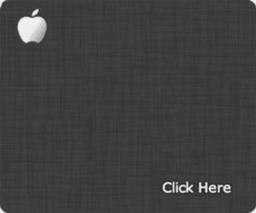

# 五、动画和演示

正如您所看到的，在浏览器中可以以多种形式处理动画:通过新的 canvas 元素、动画 gif，甚至是使用 SMIL 的 SVG 中的动画。本节将介绍在浏览器中构建动画以及使用 CSS level 3(或 CSS3)创建动画。除了 CSS 动画、变换和过渡，CSS3 带来的所有新的演示和样式都将被详细介绍。随着本章深入 CSS3 的世界，将回顾特性、浏览器支持和需要记住的重要“问题”。一旦你吃饱了，我们将讨论 sprite sheets 的重要主题(它们对设计人员和开发人员的 web 优化产生的巨大影响)，更重要的是，访问 Web 的移动设备，这是一项优化文件大小至关重要的技术。

请注意，从本章开始以及本书的其余部分，我将把 CSS 规范第 3 级称为 CSS3。此外，您应该理解 HTML5 不是 CSS3，反之亦然，但是您可能知道 HTML5 正在成为浏览器利用、新的 HTML 标记、更新的 CSS 规范以及新的 JavaScript 和 DOM APIs 中所有新出现的事物的总称。因此，虽然这并不准确，但这两个术语经常互换使用，通常，任何符合 HTML5 的浏览器都会呈现大多数 CSS level 3 特性。尽管 CSS3 在技术上不是 HTML5 规范的一部分，但了解所有新的 web 技术以及它们如何互补仍然是有益的。说了这么多，准备学习什么是 CSS3，它将如何影响你的 web 开发，更具体地说，CSS3 将如何帮助你为支持它的现代浏览器构建广告。

还要注意，下面的内容假设您熟悉基本的 CSS 和 DOM 元素的样式，并且对供应商前缀有所了解，因为它们将在本章中频繁使用。如果你需要复习，去 http://developer.mozilla.org/en-US/learn/cssCSS3 吧。

在我撰写本文时，CSS3 是 W3C 级联样式表标准的最新工作草案。一直处理网页的样式和布局的相同规范已经更新了许多新的补充，这使得一些开发人员在发布的早期挠头。CSS3 不仅处理样式和布局，而且它现在允许处理动画、丰富的效果和内容，甚至 3D，所有这些都在 CSS 排列中。你可以在图 5-1 中看到 CSS3 的新鲜、新的(尽管还是非官方的)标志。


图 5-1。 CSS3 的官方新标志

CSS3 给现代浏览器带来了一个全新的效率世界，你将在本章中听到所有这些。然而，由于到 2012 年末，最终的规范还没有确定，我只能介绍到目前为止已经发布的内容。因此，请务必访问一个非常有用的网站来查看一下这份说明书，[`css3clickchart.com`](http://css3clickchart.com)。此外，您将了解 Adobe、Apple 和 Google 等公司提交并包含在规范中的特性，这些公司正在做一些了不起的事情。

不过，首先，让我们来看看 CSS3 动画，这是有史以来第一次，你可以在网页的 CSS 中利用关键帧数据，更重要的是，你的网络广告。有了这个更新，最新的浏览器可以本地处理动画，从而提供了另一种在浏览器中制作动画的方式。但是不要太不知所措——你会发现它的优点和缺点，并学习在许多不同的场景中处理动画的理想方法。

浏览器支持

不过，首先，让我们讨论一下使用 CSS3 动画时浏览器支持的普遍问题。目前，由于 CSS3 动画仍处于工作草案状态，浏览器正在以不同的速度采用这些功能。例如，微软刚刚在 Windows 8 的最新版本 10 中采用了它们。来自 http://caniuse.com[的](http://caniuse.com)图 5-2 中的图表显示了截至 2012 年 11 月对 CSS3 动画的支持。


图 5-2。浏览器支持 CSS3 动画(2012 年 11 月；http://caniuse.com

因此，当你通过 CSS3 开展一项使用动画的活动时，请记住，你的老 IE 或 Opera Mini 上的观众将需要优雅地切换到另一种形式的动画，甚至可能是静态体验。与您的广告服务器合作伙伴合作，将特定的创意瞄准特定的浏览器、浏览器版本和设备，这样您的用户群仍然可以获得某种体验，即使这不是最引人注目的体验。通常，第一方或第三方广告服务器可以做到这一点。

在处理广告和整体浏览器支持时，请记住查看您广告的目标受众的类型。这可能包括各种浏览器、浏览器版本、操作系统和设备。考虑到这一点，一个非常好的名为 CSS3 Maker([`css3maker.com`](http://css3maker.com))的 CSS3 生成器能够为您的广告内容生成新的 CSS3 功能，并检查当前浏览器对该给定功能的支持。图 5-3 显示了截至 2012 年 11 月 CSS3 中的一些支持。


图 5-3。浏览器支持 CSS3 特性(2012 年 11 月；http://html5rocks.com/en/features/presentation

要获得最新的信息，你可以随时去[`w3.org/Style/CSS/current-work`](http://w3.org/Style/CSS/current-work)查看 W3C 关于 CSS level 3 规范的最新工作和工作组讨论，并且像往常一样，在使用你的用户的浏览器可能不支持的功能之前，快速参考书签[`caniuse.com`](http://caniuse.com)。

 **注意**如果你绝对需要通过 IE9 浏览器在 IE6 上锁定目标用户，而一个客户坚持使用 CSS3 的特性，那么访问[`css3pie.com`](http://css3pie.com)，或者让客户下载谷歌的 Chrome 框架[www.google.com/chromeframe](http://www.google.com/chromeframe)。无论在哪种情况下，它都会帮到你。

CSS3 动画

如前所述，CSS3 动画是草案的全新补充。随着该规范的最新更新，浏览器供应商正在通过 CSS 支持动画，W3C 甚至符合更新(大部分)，使其很快成为浏览器中的标准。

这个 CSS 模块为作者描述了一种方法，通过使用关键帧，使 CSS 属性的值随时间变化而变化。这些关键帧动画的行为可以通过指定它们的持续时间、重复次数和重复行为来控制。

w3 . org/tr/CSS 3 动画

这是一件大事。在 CSS3 动画出现之前，你需要使用 gif 动画、Flash 等第三方插件或者昂贵的 JavaScript 命令来制作动画。这显然是在我们刚刚在画布和 SVG 动画中所涉及的内容之前。在大多数情况下，动画越复杂和健壮，用户处理和渲染动画就越费力。现在有了 CSS3，动画可以卸载到用户机器或设备的 GPU 上，这种方法为浏览器中的动画提供了一种更加流畅和无缝的方法。这太令人兴奋了！

让我们来看看 CSS3 中的新动画属性，你今天可以利用它们(见表 5-1 )。

表 5-1。 CSS3 动画属性

| 财产 | 使用 |
| --- | --- |
| 动画延迟 | 定义动画开始的时间。 |
| 动画方向 | 定义动画是否应该在交替循环中反向播放。 |
| 动画-时长 | 定义动画完成一个循环需要多少秒或毫秒。 |
| 动画填充模式 | 指定 CSS 动画在执行之前和之后应该如何将样式应用于其目标。 |
| 动画-迭代-计数 | 定义动画应该播放的次数。 |
| 动画名称 | 指定@关键帧动画的名称。 |
| 动画-播放-状态 | 指定动画是正在运行还是暂停。 |
| 动画-计时-功能 | 指定动画的速度曲线。 |

当在 CSS3 兼容浏览器中使用时，所有这些属性构成了浏览器要处理的动画的定义。让我们来看一个例子，您可能想在下一次营销活动或未来的某个时间使用它。让我们称这个动画为“glow”并密切注意厂商前缀(见清单 5-1 )。

***清单 5-1。*** CSS3 发光动画

```html
<html>
<head>
<meta http-equiv="Content-Type" content="text/html; charset=UTF-8">
<style>
#square {
       -webkit-animation-name: glow;
       -moz-animation-name: glow;
       -ms-animation-name: glow;
       -o-animation-name: glow;
       animation-name: glow;
       -webkit-animation-duration: 1s;

       -webkit-animation-iteration-count: 15;
       -moz-animation-iteration-count: 15;
       -ms-animation-iteration-count: 15;
       -o-animation-iteration-count: 15;
       animation-iteration-count: 15;
       -webkit-animation-direction: alternate;

       -webkit-animation-timing-function: ease-in-out;
       -moz-animation-timing-function: ease-in-out;
       -ms-animation-timing-function: ease-in-out;
       -o-animation-timing-function: ease-in-out;
       animation-timing-function: ease-in-out;

       -webkit-animation-fill-mode: forwards;
       -moz-animation-fill-mode: forwards;
       -ms-animation-fill-mode: forwards;
       -o-animation-fill-mode: forwards;
       animation-fill-mode: forwards;

       -webkit-animation-delay: 2s;
       -moz-animation-delay: 2s;
       -ms-animation-delay: 2s;
       -o-animation-delay: 2s;
       animation-delay: 2s;
}

@keyframes "glow" {
 0% {
    -webkit-box-shadow: 0px 0px 0px #999999;
       box-shadow: 0px 0px 0px #999999;
 }
 50% {
    -webkit-box-shadow: 5px 5px 15px #ffffff;
       box-shadow: 5px 5px 15px #ffffff;
 }
 100% {
    -webkit-box-shadow: 0px 0px 0px #999999;
       box-shadow: 0px 0px 0px #999999;
 }

}

@-moz-keyframes glow {
 0% {
   box-shadow: 0px 0px 0px #999999;
 }
 50% {
   box-shadow: 5px 5px 15px #ffffff;
 }
 100% {
   box-shadow: 0px 0px 0px #999999;
 }

}

@-webkit-keyframes "glow" {
 0% {
   -webkit-box-shadow: 0px 0px 0px #999999;
   box-shadow: 0px 0px 0px #999999;
 }
 50% {
   -webkit-box-shadow: 5px 5px 15px #ffffff;
   box-shadow: 5px 5px 15px #ffffff;
 }
 100% {
   -webkit-box-shadow: 0px 0px 0px #999999;
   box-shadow: 0px 0px 0px #999999;
 }

}

@-ms-keyframes "glow" {
 0% {
   box-shadow: 0px 0px 0px #999999;
 }
 50% {
   box-shadow: 5px 5px 15px #ffffff;
 }
 100% {
   box-shadow: 0px 0px 0px #999999;
 }

}

@-o-keyframes "glow" {
 0% {
   box-shadow: 0px 0px 0px #999999;
 }
 50% {
   box-shadow: 5px 5px 15px #ffffff;
 }
 100% {
   box-shadow: 0px 0px 0px #999999;
 }
}
</style>
</head>
<body>
     <div id=square></div>
</body>
</html>
```

如果您正在跟进，不要害怕 CSS3 中新的关键帧块。这个例子使用 CSS 中的 box-shadow 属性，通过使用关键帧的 percent 方法，对 DOM 中的 square 元素应用发光动画。该动画甚至符合 publisher 动画规范，因为它只有 15 秒长，您可以通过查看动画迭代计数来了解这一点。正如你所看到的，这是相当冗长的，只是为了完成一些相当简单的事情，所以请记住，CSS 也有一种速记的方式来编写动画的属性。下面是如何使用速记技术编写 glow 示例。

```html
#square {
     -webkit-animation: glow 1s 15s alternate forwards ease-in-out;
     -moz-animation: glow 1s 15s alternate forwards ease-in-out;
     -ms-animation: glow 1s 15s alternate forwards ease-in-out;
     -o-animation: glow 1s 15s alternate forwards ease-in-out;
     animation: glow 1s 15s alternate forwards ease-in-out;
}
```

我想你会同意这种技术在手指上要容易得多。显然，您仍然需要定义什么是“发光”，使用关键帧来激活方形元素。此外，请记住，我们使用了所有必要的供应商前缀，以允许这种效果跨浏览器运行。这可能会减少，取决于您的活动的需求和您的目标受众的浏览器。

 **注意**把你所有的动画关键帧定义放在一个单独的样式表上是个好主意。这样，它就不会弄乱你的主样式表，并保持风格与核心布局的分离。

至于动画属性，方向取两个不同的值，正常和交替。计时函数采用几个不同的值，缓动、缓出、缓入、缓出、线性和三次贝塞尔(x1，y1，x2，y2)，这允许自定义计时函数(使用三次贝塞尔时，一个非常好的 web 工具是[`cubic-bezier.com`](http://cubic-bezier.com))。填充模式的值为向前、向后、两者或无。Delay 是动画开始前的时间偏移量，在上面的例子中，它将在 DOM 加载后 2 秒开始。最后，play state 属性确定动画是正在运行还是暂停，这对于通过 JavaScript 检测动画是否正在运行非常有用。利用所有这些优势，您将能够创建一个非常可信和真实的动画，您可能会记得在广告中使用 Flash。

 **注意**属性的速记顺序无关紧要，除非同时使用持续时间和延迟时间，它们需要按顺序排列，持续时间比延迟时间优先。

现在已经介绍了基于 CSS 的动画的基础知识，让我们看看如何在 CSS 中使用@keyframes 规则并使用这些新属性。如上所示，我们的第一个例子涉及百分比。清单 5-2 使用来自的单词*和*到*来声明我们的关键帧事件。*

***清单 5-2。*** CSS3 关键帧示例

```html
<!DOCTYPE HTML>
<html><head>
<meta http-equiv="Content-Type" content="text/html; charset=UTF-8">
<style>
#square {
 width:100px;
 height:100px;
 background:black;

 -webkit-animation:spin 5s; /* Safari and Chrome */
 -moz-animation:spin 5s; /* Firefox */
 -ms-animation:spin 5s; /* IE */
 -o-animation:spin 5s; /* Opera */
 animation:spin 5s;

 -webkit-animation-iteration-count: infinite;
 -moz-animation-iteration-count: infinite;
 -ms-animation-iteration-count: infinite;
 -o-animation-iteration-count: infinite;
 animation-iteration-count: infinite;

 -webkit-animation-timing-function: ease-in-out;
 -moz-animation-timing-function: ease-in-out;
 -ms-animation-timing-function: ease-in-out;
 -o-animation-timing-function: ease-in-out;
 animation-timing-function: ease-in-out;
}

@keyframes spin {
from {
  background:black;
  -webkit-transform: rotate(0deg);
  -moz-transform: rotate(0deg);
  -o-transform: rotate(0deg);
  -ms-transform: rotate(0deg);
  transform: rotate(0deg);
} to {
  background:yellow;
  -webkit-transform: rotate(360deg);
  -moz-transform: rotate(360deg);
  -o-transform: rotate(360deg);
  -ms-transform: rotate(360deg);
  transform: rotate(360deg);
  }
}

@-moz-keyframes spin {/* Firefox */
from {
  background:black;
  -webkit-transform: rotate(0deg);
  -moz-transform: rotate(0deg);
  -o-transform: rotate(0deg);
  -ms-transform: rotate(0deg);
  transform: rotate(0deg);
} to {
  background:yellow;
  -webkit-transform: rotate(360deg);
  -moz-transform: rotate(360deg);
  -o-transform: rotate(360deg);
  -ms-transform: rotate(360deg);
  transform: rotate(360deg);
  }
}

@-webkit-keyframes spin {/* Safari and Chrome */
from {
  background:black;
  -webkit-transform: rotate(0deg);
  -moz-transform: rotate(0deg);
  -o-transform: rotate(0deg);
  -ms-transform: rotate(0deg);
  transform: rotate(0deg);
} to {
  background:yellow;
  -webkit-transform: rotate(360deg);
  -moz-transform: rotate(360deg);
  -o-transform: rotate(360deg);
  -ms-transform: rotate(360deg);
  transform: rotate(360deg);
  }
}

@-o-keyframes spin {/* Opera */
from {
  background:black;
  -webkit-transform: rotate(0deg);
  -moz-transform: rotate(0deg);
  -o-transform: rotate(0deg);
  -ms-transform: rotate(0deg);
  transform: rotate(0deg);
} to {
  background:yellow;
  -webkit-transform: rotate(360deg);
  -moz-transform: rotate(360deg);
  -o-transform: rotate(360deg);
  -ms-transform: rotate(360deg);
  transform: rotate(360deg);
  }
}

</style>
</head>
<body>
   <div id='square'></div>
</body>
</html>
```

好了，我们来分解一下这个例子。首先，让我们设置 HTML 文档，然后通过编写#square {，包含一些 CSS 来指向 ID 为“square”的 div。。。};没什么新鲜的。现在给正方形一个黑色的背景色，宽度和高度为 50 像素。最后也是最重要的，制作一个名为“spin ”的动画，时长 15 秒，重复“无限”。现在，使用 CSS3，通过@keyframes 规则声明旋转动画。在规则内，通过动画显示正方形并将其旋转 360 度来定义其起点(“from”)和终点(“to”)。(我包括了必要的前缀，因为我在所有浏览器上工作，但是请记住，最终的规范将不包括前缀。然而，为了向后兼容，浏览器可能仍然支持它，这样将来就不会出现代码中断。)最后，在你的浏览器里打开这个——就这样！这是非常惊人的东西，仅仅使用直接的 CSS。

使用 CSS 动画时，有一些事情需要注意。首先，它们不能堆叠，也就是说，你不能让一个名为“wiggle”的动画和一个名为“spin”的动画同时使用。只有最后应用的动画，在本例中是“spin”，将被应用到你的目标 DOM 对象上(注意，随着规范的最终确定，这很可能会改变，但是在撰写本文时，它在我测试过的浏览器中是这样的)。此外，当使用 CSS3 动画时，您可能会注意到在应用动画和动画结束时屏幕会有轻微的闪烁。这是浏览器利用机器的 GPU 来处理动画。如果你问我，我会说这是一个 bug，它需要一个巧妙的解决方法。最有效的方法是对变换应用 z 索引，即使你不打算在(3D) z 空间制作动画。包含 z 轴属性最初启用硬件加速 (GPU)，并消除动画出现时的屏幕闪烁。(如果你对“癫痫效应”感兴趣，这对你没多大关系，尽管你的客户可能会要求去掉它。)

最后，请记住，W3C 的规范很可能比浏览器实际支持的要有限得多。苹果、Mozilla、谷歌和其他厂商支持各种功能，这些功能可能不会成为 W3C 的决定，但它们仍然很有趣，尤其是在创建 3D 和有趣的视差效果方面。然而，我提醒你要了解你的用户群——你的活动是为谁开发和部署的？这应该决定你在下一次活动中应该和不应该使用什么功能集。

供应商前缀

正如在第三章中所讨论的，为了使用浏览器最新最棒的 CSS3 特性，厂商前缀就是你的通行证。动画前缀没有什么不同:仍然需要明确的方法来调用浏览器的渲染引擎。把它们想象成自己的 API 来指导浏览器制作动画——因为这就是它们。可以预见，开发人员和设计人员对供应商前缀又爱又恨。一方面，它们允许使用最新和新兴的技术；另一方面，如果浏览器制造商在最终的 CSS 规范中放弃他们自己的前缀，它们会带来冗长语句的代价。如果发生这种情况，网络会变得非常丑陋！理解一个厂商前缀的属性是 CSS 规范的一部分还是最终将成为它的一部分可能是一个挑战，因为一些厂商甚至没有提交他们所有的(特定于浏览器的)属性用于 W3C 标准化。在某些情况下，你会发现网站只使用-webkit 前缀，尤其是在移动设备中，即使 Opera、IE 和 Firefox 都有移动版本的浏览器。说了这么多，让我们回顾一下清单 5-3 中的一些厂商前缀，并看看 CSS 中径向渐变类的前缀。

***清单 5-3。*** CSS3 厂商前缀示例

```html
<!DOCTYPE HTML>
<html>
<head>
<meta http-equiv="Content-Type" content="text/html; charset=UTF-8">
<style>
#square {
 width:500px;
 height:500px;
}

.radial-gradient {
  background: -webkit-radial-gradient(10% 10%, yellow, black);
  background: -moz-radial-gradient(10% 10%, yellow, black);
  background: -o-radial-gradient(10% 10%, yellow, black);
  background: -ms-radial-gradient(10% 10%, yellow, black);
  background: radial-gradient(10% 10%, yellow, black);
}

</style>
</head>
<body>
   <div id='square' class='radial-gradient'></div>
</body>
</html>
```

神圣的重复！如果你是一名开发人员或程序员，不得不一遍又一遍地做任何事情是你可以做得更好的明显标志。这个例子给出了设计者和开发者在使用新兴功能创建跨浏览器体验时所面临的操作负载的概念——在这种情况下，新兴是在 iPhone 和 iPad 等设备上渗透的一个要求。平时听到“运营规模”和“新兴”用在同一句话里，我都会笑。现在你也可以了！

广告行业的一个常见困境是，许多客户希望使用最新、最棒的可用功能，但他们不明白开发这些功能需要什么，也不明白为什么要花这么长时间来完成对他们来说相当简单的事情。在这个简单的渐变例子中，如果实现了标准化，需要的代码量是原来的四倍。由于我们的代码现在是原来的四倍大，从服务器下载更多的字节也会被吃掉。另外，当需要进行更新时，我们现在必须在五个不同的地方进行更新，以达到相同的效果。随着代码的增长，它会很快让人筋疲力尽。

这个话题引起了整个行业的极大关注；2012 年 4 月甚至有过一次讨论，W3C 和 Opera 质疑是否将 webkit 前缀作为标准加入。本质上，Opera 将在浏览器引擎中采用 Webkit 命令，以适应大多数程序员省略特定前缀的懒惰。在我看来，这违背了 W3C 所代表的一切——在 CSS 领域，应该创建一个独立于供应商的标准来消除对任何和所有前缀的需要，从而创建真正的浏览器互操作性。将 Webkit 作为一个标准并让其他浏览器制造商采用它，这根本不是在创造一个标准；它创造了与流行的东西的一致性，并且由于开发人员的懒惰而被最普遍地使用。关于这个话题的好文章可以在[`www.sitepoint.com/opera-css3-webkit-prefix`](http://www.sitepoint.com/opera-css3-webkit-prefix)找到。

无前缀前进

开发人员的普遍共识似乎是，head 的方法是根本没有前缀。随着这些新特性在开放网络中变得标准化，跨浏览器调用这些新特性的能力是需要的，也应该发生。CSS3 规范中的一些新特性目前已经基本完成，处于采用过程中的“候选推荐”阶段。这意味着其中一些根本不需要前缀，因为浏览器开始支持无前缀。这些属性中的一些在表 5-2 中列出。

表 5-2 。CSS 无前缀属性

| 财产 | 使用 |
| --- | --- |
| 边框半径 | 用于圆化 DOM 对象的边框。 |
| 箱形阴影 | 用于给 DOM 对象添加阴影效果。 |
| 颜色 （RGBA） | 允许通过 RGB 和 alpha(透明度)设置来定义颜色。 |
| 颜色(HSLA) | 允许以 HSL(色调、饱和度和亮度)或 HSLA 格式(色调、饱和度、亮度和 alpha)定义颜色。 |
| 媒体查询 | 根据媒体类型(印刷品、屏幕等)为浏览器提供样式。)和媒体条件(屏幕大小、肖像、风景等)。). |
| 多重背景 | 允许在单个元素上放置多个背景图像。 |
| 不透明 | 允许将透明度设置应用于元素及其所有子元素。 |

这实际上是需要前缀的新兴特性。然而，如你所知，网络发展非常迅速；因此，请继续查看今天可以投入使用的功能。网站上也有一些非常好的工具，任何开发人员或设计人员都可以使用它们来消除编写 CSS3 时的猜测。一个这样的工具是无前缀的([`leaverou.github.com/prefixfree`](http://leaverou.github.com/prefixfree))。Prefix Free 是一个包含在文档中的 JavaScript 文件，它将当前浏览器的前缀添加到任何 CSS 代码中，但仅在需要时应用它。最小的代码膨胀！它的小文件大小(只有 8 千字节)使它特别适合做广告。但是，它有一些限制，所以在生产活动中实现它之前，一定要在网站上仔细阅读。另一个有用的工具是 Prefixr(【http://prefixr.com】??)。你粘贴你的 CSS 语法，然后按下按钮，WHALAA！它允许您更新您的 CSS，以包含跨浏览器部署可能需要的所有供应商前缀。

JavaScript 动画与 CSS3 动画

在上一章学习了一些 JavaScript 和 canvas 元素动画之后，您很可能想知道 JavaScript 和 CSS3 动画之间的区别是什么？事实上，两者都有利弊；查看您的活动的最终目标和要求，以确定使用哪种方法。然而，我可以提供一些信息让你开始。首先，JavaScript 是一种解释型语言。JS 动画依靠浏览器的 JavaScript 引擎在运行时解释、解析和执行指令。另一方面，浏览器可以在浏览器的底层代码库(引擎)中本地实现 CSS3 动画。通常用 C、C++或类似的语言编写，这些代码被编译成机器语言，所以它总是存在、发布和安装在浏览器中。这使得 CSS3 通常可以进行硬件加速，并卸载到机器的 GPU 上进行动画等密集型操作，这使得用户可以在 iOS Safari 或 Android 的原生浏览器等移动浏览器上获得更好的体验。

在这两者之间，许多开发人员会认为这归结于易用性、可扩展性、支持和整体性能的某种组合。如果您需要针对较旧的浏览器，JavaScript 是明显的赢家。如果你只关心主观易用性、现代网络和硬件支持，CSS3 是一个可行的解决方案。此外，记住 JavaScript 在新的浏览器引擎上速度惊人！作为广告界的一名开发人员，优化和性能就是一切，您最终应该利用这两者，同时考虑活动和目标受众的需求。在一天结束的时候，有很多方法可以完成一些事情。知道一种做事情的方法并不意味着它在任何时候、任何情况下都是最好的方法。了解谁是你的目标受众，以及他们使用的主要浏览器。这可能涉及到出版商方面的一些浏览器统计调查，以找出他们的用户的主要用户群是什么。

如果你还没有使用 http://stackoverflow.com，我强烈建议你熟悉一下它。如果你有关于这个或其他话题的问题，很可能你不会是第一个问的人。

最后，我不能执行所有已知的测试来找出哪种动画技术在你的特定场景中更好。我想授权你自己去测试；作为回报，用一个非常棒的工具:[`jsperf.com`](http://jsperf.com)记录你的测试，为开发者社区做点贡献。如果您需要重新创建 bug 或测试脚本中多种执行方式之间的差异，请熟悉使用这种方法。

requestAnimationFrame、setInterval 和 setTimeout？

让我们来谈谈通过 JavaScript 驱动动画的代码。传统上，在 requestAnimationFrame 可用于支持 IE10、Firefox 4、Chrome 10、Safari 6 和其他现代浏览器之前，动画是通过调用 setInterval 或 setTimeout 来实现的。通过重复调用这些 JavaScript 方法之一，浏览器会一遍又一遍地执行命令，通常直到满足某个条件并停止动画。如果出于某种原因它从未停止，浏览器将永远执行脚本，并最终崩溃或冻结(这种情况有时仍会发生在编写得很差的脚本中)。然而，由于 requestAnimationFrame 是由 Mozilla 引入并由 Webkit 重复的，所以目标很简单:提供一个本地 API 来完全控制浏览器中的动画。无论是 DOM 元素、CSS、基于画布，甚至是 WebGL(在第十二章中会有更多关于 WebGL 的内容)，浏览器都会在一个动画阶段处理和优化任何动画，从而提高整体动画质量。如果你的动画在一个不可见的标签中循环播放——比如说，你的广告的动画，而用户没有看到广告——浏览器不会让它继续运行，也不会占用系统资源。出版商应该会喜欢这一点——这意味着可以分配更少的资源和更少的内存使用，最终导致更长的电池寿命，尤其是对支持新方法的移动设备而言。我觉得微软的开发者中心解释得很完美:

*msRequestAnimationFrame 方法通过考虑 web 应用的可见性和显示器的刷新率来确定每秒分配给动画的帧数，从而提供流畅的动画和最佳的能效。msRequestAnimationFrame 是调度非声明性脚本动画的一种非常有效的方法，应该用来代替 setTimeout 和 setInterval。*

[msdn.microsoft.com/en-us/library/windows/apps/hh453391.aspx](http://msdn.microsoft.com/en-us/library/windows/apps/hh453391.aspx)

因此，如果你正在为现代浏览器制作动画，停止使用 JavaScript 中的 setInterval 或 setTimeout，并学会利用 requestAnimationFrame。否则，尽可能在支持的地方使用基于 CSS3 的动画。学习和使用这两者将会节省时间并减少麻烦，特别是当你由于出版商回扣或从创意代理处获得素材而不得不进行优化或调试时。

CSS3 与 Flash

你所要做的就是通读声称 Flash 已死的网络文章，不久你就会感受到网络上的疯狂。暴民尖叫，“HTML5 万岁！”回到现实，我在这里不是为了选择立场，甚至不是为了深入讨论这个琐碎的话题。这不是这本书的内容，我也不想在这本书上浪费你的时间。简单地说，这两种技术各有利弊，但有一点是肯定的:HTML5、CSS3 和 JavaScript 将会继续存在，所以不管你是否选择使用它们，你都应该学习它们。在我看来，Flash 仍然是一个令人惊叹的平台，并且在最新的 web 标准上已经有很多年了。

然而，CSS3 特别是其对新兴浏览器的动画特性，展示了 web 标准将如何很快成为未来的标准。Sencha 的博客上有一个很好的并排对比，展示了两个相同的广告，一个用 CSS3 制作，一个用 Flash 制作，是如何配对的([`dev.sencha.com/deploy/css3-ads`](http://dev.sencha.com/deploy/css3-ads))。改进是必要的，但初步看来，它们非常接近，这表明无插件但丰富的网络就在眼前。不明显的是，这个例子还展示了更广泛的东西:CSS3 广告与 Flash 广告存在于同一个领域，我认为这是 web 广告在一段时间内的发展方向:Flash 和 web 标准(HTML5/CSS3/JS)的结合和谐共存。(提示励志音乐。。。)

我想到的一件事是文件大小。我制作网络广告已经有一段时间了，并且知道出版商对文件大小规格有严格的控制，我有几个问题想得到解答。

*   HTML/CSS/JavaScript 广告应该有多少 k-weight？
*   能否按顺序控制素材和外部文件的加载？
*   分析和测量会受到怎样的影响？
*   如果一次将多个单元加载到页面上，性能和用户体验会发生什么变化？

随着客户希望将 HTML5 用于 reach，这些问题越来越频繁地出现，事实上，在规范制定、测试和采用之前，没有什么灵丹妙药。使用 Flash 播放器的广告不是一夜之间就被采用的，那么这有什么不同呢？不过，有一点是肯定的:出版商、代理商和广告服务平台，以及 IAB，需要在这些紧迫问题成为整个行业非常明显和普遍的问题之前，制定并商定一套标准来解决它们。幸运的是，有一个活跃的工作组致力于这项倡议和许多其他推动我们行业的倡议。您可以通过访问了解有关这些功能的更多信息。[`iab.net/member_center/committees`](http://iab.net/member_center/committees)。

CSS3 演示和风格

现在我已经介绍了很多关于 CSS3 动画以及它们如何在空间中发挥作用的内容，这一节将回顾现代 Web 中新的 CSS3 演示增强功能。传统上，CSS 代表布局和风格，但随着最新功能的出现——阴影、变换和渐变——CSS 可以比以往做更多的事情。已经介绍了一些新的选择器、伪类、web 字体和动画，让我们深入研究一下 CSS 的传统表示和样式的其他增强。

方框阴影

CSS3 框阴影是一个新特性，几乎是为 W3C 最终版本和支持浏览器供应商而设置的。框阴影允许对图像、画布或 div 元素等 DOM 对象应用平滑的阴影效果。清单 5-4 展示了一个在广告中工作的盒子阴影。

***清单 5-4。*** 框影广告举例

```html
<style>
#ad {
  position: absolute;
  width: 300px;
  height: 250px;
  background-color: white;
  -webkit-box-shadow: 0px 0px 20px 0px rgba(0, 0, 0, 1);
  box-shadow: 0px 0px 20px 0px rgba(0, 0, 0, 1);
}</style>
```

如您所见，这只是您习惯的常规 CSS 语法，做了一些更新以获得新的浏览器效果。假设我们的 ad 元素具有 ad 的 ID，这个 CSS 块将在发布者页面上为我们的广告应用一个漂亮的投影。这个列表会产生如图 5-4 所示的效果。


图 5-4。使用 CSS3 的带有框阴影的广告容器

正如你所看到的，一些非常简单的 CSS 可以为我们的广告目录在发布者页面上的位置应用漂亮的阴影。框阴影属性使用两个必需的参数，水平阴影位置和垂直阴影位置，后面是四个可选参数，模糊(我们设置为 20 像素)、扩散、颜色和插入。

 **注意**颜色可以使用十六进制、RGBA 或 HSLA 颜色值作为框阴影属性。

多重背景

基于你在清单 5-4 中看到的，多重背景是一个新特性，它允许设计师将多重背景图像应用于一个元素。如果您想从两个独立的图像源创建一个复杂的广告背景图像，这可能会很有帮助。事实上，让我们在构建广告背景时尝试这样做(见清单 5-5 )。

***清单 5-5。*** 多重背景举例

```html
<!DOCTYPE HTML>
<html>
<head>
<meta http-equiv="Content-Type" content="text/html; charset=UTF-8">
<style>
#ad {
 position: absolute;
 width: 300px;
 height: 250px;
 background-color: white;
 -webkit-box-shadow: 0px 0px 20px 0px rgba(0, 0, 0, 1);
 box-shadow: 0px 0px 20px 0px rgba(0, 0, 0, 1);

 /*
 top level icon (x,y,repeat)
 bottom level background (x,y,repeat)
 */
 background:
  url(logo.png) 20px 10px no-repeat,
  url(300x250Bg.jpg) 0px 0px no-repeat;
}
</style>

</head>
<body>
   <div id='ad'></div>
</body>
</html>
```

如果您添加前面的代码并刷新浏览器，您将会看到该示例在两个单独的图像中加载到 div 元素 ad 的背景属性中(参见图 5-5 )。注意参数是 URL，X，Y 和 repeat。


图 5-5。使用 CSS3 的多背景广告背景

通过 CSS 调用 background 属性提供了一个以逗号分隔的 URL 位置图像资源列表。图像的顺序很重要，所以首先添加顶层素材，最后添加底层素材。

文本阴影

让我们通过添加行动号召(CTA)为我们的广告单元添加一些文案。但是我们也给 CTA 添加一个阴影。文本阴影与框阴影非常相似，只是文本阴影只能应用于字体。让我们看看如何处理文本阴影(见清单 5-6 )。

***清单 5-6。*** 文字阴影举例

```html
<!DOCTYPE HTML>
<html>
<head>
<meta http-equiv="Content-Type" content="text/html; charset=UTF-8">
<style>
#ad {
  position: absolute;
  width: 300px;
  height: 250px;
  background-color: white;
  -webkit-box-shadow: 0px 0px 20px 0px rgba(0, 0, 0, 1);
  box-shadow: 0px 0px 20px 0px rgba(0, 0, 0, 1);

  background:
   url(logo.png) 20px 10px no-repeat,
   url(300x250Bg.jpg) 0px 0px no-repeat;
}
#cta {
  position: absolute;
  top: 210px;
  left: 190px;
  color: white;
  font-family: Verdana;
  font-size: 16px;
  cursor: pointer;
  text-shadow: 0px 0px 5px #000000;
}
</style>
</head>

<body>
<div id=ad>
  <section>
    <div id=cta>Click Here</div>
  </section>
</div>
</body>
</html>
```

添加更新的代码并刷新您的浏览器，您将在我们的广告中看到文本阴影的示例(参见图 5-6 )。


图 5-6。使用 CSS3 中文本阴影属性的 CTA 广告

虽然投影可能很难看到，但在副本上添加它可以让用户通过将它从背景中分离出来，更清楚地查看重要信息。在 CTA 这种重要的广告文案上使用投影时尤其如此。text shadow 属性的语法与 box-shadow 属性的语法相同，但它仅适用于字体。它还允许在浏览器中添加这种效果，而不必使用应用了投影效果的图像。

 **注意**一个文本阴影也可以应用到网页字体上(参见第四章)。

边框半径

该规范的另一个几乎最终确定的特性是边框半径，这可能是早期 CSS3 的特性之一，让所有的设计师都为之雀跃。他们呼吁这种效果很久了，原因是在 border radius 之前，设计师需要通过 Photoshop 导出圆角图像，并将其加载到页面中。这种软件开发起来很耗时，而且下载到用户机器上的成本也很高。现在不需要 Photoshop，我们可以让浏览器来处理繁重的工作。让我们给我们的广告例子添加一些圆角边框(见清单 5-7 )。

***清单 5-7。*** 边框半径示例

```html
<!DOCTYPE HTML>
<html>
<head>
<meta http-equiv="Content-Type" content="text/html; charset=UTF-8">
<style>
#ad {
  position: absolute;
  width: 300px;
  height: 250px;
  background-color: white;
  -webkit-box-shadow: 0px 0px 20px 0px rgba(0, 0, 0, 1);
  box-shadow: 0px 0px 20px 0px rgba(0, 0, 0, 1);

  background:
   url(logo.png) 20px 10px no-repeat,
   url(300x250Bg.jpg) 0px 0px no-repeat;

  -webkit-border-radius: 10px;
  -moz-border-radius: 10px;
  border-radius: 10px;
}
#cta {
  position: absolute;
  top: 210px;
  left: 190px;
  color: white;
  font-family: Verdana;
  font-size: 16px;
  cursor: pointer;
  text-shadow: 0px 0px 5px #000000;
}
</style>
</head>

<body>
<div id=ad>
  <section>
    <div id=cta>Click Here</div>
  </section>
</div>
</body>
</html>
```

添加边框半径的 CSS 属性(在清单 5-7 中以粗体显示)并刷新您的浏览器将为我们的广告元素添加一个 10 像素的圆角。边框半径语法相当简单:您所需要做的就是向它传递一个想要舍入的值(以像素为单位)。你可以在图 5-7 中看到效果。



图 5-7。我们使用 CSS3 的圆形边框广告

 **注意**边框半径可以独立调整，而不是四个角同时调整。如果你的客户是 CVS 药房([www.cvs.com](http://www.cvs.com))，这可能会有所帮助。

梯度

CSS3 现在提供了渐变，这是该规范的另一个特性，允许设计人员删除图像，并利用浏览器的图形。正如您在 canvas 元素中学习的那样，它允许通过 JavaScript 定义线性或径向颜色渐变。现在有了我们的 CSS 语法，我们可以在不接触脚本文件的情况下做类似的事情。让我们通过使我们的 CTA 更像一个有风格的按钮来给我们的广告例子添加一个渐变(见清单 5-8 )。

***清单 5-8。*** 渐变 CSS3 示例

```html
<!DOCTYPE HTML>
<html>
<head>
<meta http-equiv="Content-Type" content="text/html; charset=UTF-8">
<style>
* {
  font-family: Verdana;
}
#ad {
  position: absolute;
  left: 30px;
  top: 30px;
  width: 300px;
  height: 250px;
  background-color: white;
  -webkit-box-shadow: 0px 0px 20px 0px rgba(0, 0, 0, 1);
  box-shadow: 0px 0px 20px 0px rgba(0, 0, 0, 1);

  background:
   url(logo.png) 20px 10px no-repeat,
   url(300x250Bg.jpg) 0px 0px no-repeat;

  -webkit-border-radius: 10px;
  -moz-border-radius: 10px;
  border-radius: 10px;
}
#cta {
  position: absolute;
  top: 190px;
  left: 160px;
  color: white;
  font-size: 16px;
  cursor: pointer;
  text-shadow: 0px 0px 5px #000000;
}

.button {
  font-size: 16px;
  color: white;
  padding: 10px 20px;
  background: -moz-linear-gradient(
    top,
    #e3e3e3 0%,
    #545454);
  background: -webkit-gradient(
    linear, left top, left bottom,
    from(#e3e3e3),
    to(#545454));
  -moz-border-radius: 0px;
  -webkit-border-radius: 0px;
  border-radius: 10px;
  border: 1px solid #000000;
  -moz-box-shadow:
    0px 1px 3px rgba(0,0,0,0.5),
    inset 0px 0px 2px rgba(255,255,255,0.7);
  -webkit-box-shadow:
    0px 1px 3px rgba(0,0,0,0.5),
    inset 0px 0px 2px rgba(255,255,255,0.7);
  box-shadow:
    0px 1px 3px rgba(0,0,0,0.5),
    inset 0px 0px 2px rgba(255,255,255,0.7);
  text-shadow:
    0px -1px 0px rgba(000,000,000,0.4),
    0px 1px 0px rgba(255,255,255,0.3);
}
</style>
</head>

<body>
<div id=ad>
  <section>
    <div id=ctaclass=button>Click Here</div>
  </section>
</div>
</body>
</html>
```

如果你已经跟随了，刷新你的浏览器，你会注意到结果(见图 5-8 )。


图 5-8。我们的广告带有一个性感的 CTA 按钮，使用 CSS 渐变和圆形边框

使用 CSS 添加渐变是利用浏览器构建光滑按钮或复杂背景的好方法，而不是使用传统的图像方法。对终端用户来说也更容易，因为它不会消耗掉 k-weight，也不会因为另一次下载而向用户征税，这两者在广告界都是巨大的收益。我自己经常使用的一个工具是在[`colorzilla.com/gradient-editor`](http://colorzilla.com/gradient-editor)，特别是因为它易于使用，添加了所有的厂商前缀，并通过过滤器属性提供了旧的微软浏览器支持。

过渡

CSS3 Transitions 模块提供了一个很好的方法来为某些元素添加过渡属性。过渡可以应用于背景、颜色、高度、宽度和其他特定属性，或者可以使用特殊的“all”关键字将过渡应用于元素上的所有属性。过渡允许广告体验扩展和收缩，创建一个标志性的富媒体扩展效果。清单 5-9 展示了当用户点击 CTA 时，如何转换广告容器以扩展 500 像素(让我们也添加一点 JavaScript)。

***清单 5-9。*** CSS 转场示例

```html
<!DOCTYPE HTML>
<html>
<head>
<meta http-equiv="Content-Type" content="text/html; charset=UTF-8">
<style>
* {
  font-family: Verdana;
}
#ad {
  position: absolute;
  left: 30px;
  top: 30px;
  width: 300px;
  height: 250px;
  background-color: white;
  -webkit-box-shadow: 0px 0px 20px 0px rgba(0, 0, 0, 1);
  box-shadow: 0px 0px 20px 0px rgba(0, 0, 0, 1);

  background:
   url(logo.png) 20px 10px no-repeat,
   url(300x250Bg.jpg) 0px 0px repeat;

  -webkit-border-radius: 10px;
  -moz-border-radius: 10px;
  border-radius: 10px;

  -webkit-transition: all 1s ease-in-out;
  -moz-transition: all 1s ease-in-out;
  -ms-transition: all 1s ease-in-out;
  -o-transition: all 1s ease-in-out;
  transition: all 1s ease-in-out;
}
#cta {
  position: absolute;
  top: 190px;
  left: 160px;
  color: white;
  font-size: 16px;
  cursor: pointer;
  text-shadow: 0px 0px 5px #000000;

  -webkit-transition: all 1s ease-in-out;
  -moz-transition: all 1s ease-in-out;
  -ms-transition: all 1s ease-in-out;
  -o-transition: all 1s ease-in-out;
  transition: all 1s ease-in-out;
}

.button {
  font-size: 16px;
  color: white;
  padding: 10px 20px;
  background: -moz-linear-gradient(
    top,
    #e3e3e3 0%,
    #545454);
  background: -webkit-gradient(
    linear, left top, left bottom,
    from(#e3e3e3),
    to(#545454));
  -moz-border-radius: 0px;
  -webkit-border-radius: 0px;
  border-radius: 10px;
  border: 1px solid #000000;
  -moz-box-shadow:
    0px 1px 3px rgba(0,0,0,0.5),
    inset 0px 0px 2px rgba(255,255,255,0.7);
  -webkit-box-shadow:
    0px 1px 3px rgba(0,0,0,0.5),
    inset 0px 0px 2px rgba(255,255,255,0.7);
  box-shadow:
    0px 1px 3px rgba(0,0,0,0.5),
    inset 0px 0px 2px rgba(255,255,255,0.7);
  text-shadow:
    0px -1px 0px rgba(000,000,000,0.4),
    0px 1px 0px rgba(255,255,255,0.3);
}

#close {
  position: absolute;
  top: 10px;
  left: 480px;
  opacity: 0;
  cursor: pointer;
  color: white;

  -webkit-transition: all 1s ease-in-out;
  -moz-transition: all 1s ease-in-out;
  -ms-transition: all 1s ease-in-out;
  -o-transition: all 1s ease-in-out;
  transition: all 1s ease-in-out;
}
</style>
</head>

<body>
<div id=ad>
  <section>
    <div id=close>X</div>
    <div id=cta class=button>Click Here</div>
  </section>
</div>
</body>
</html>

<script>
var ad = document.querySelector('#ad’);
var cta = document.querySelector('#cta’);
var close = document.querySelector('#close’);
cta.addEventListener('click’, expandAd, false);
close.addEventListener('click’, collapseAd, false);

function expandAd () {
  ad.style.width = '500px’;
  cta.style.left = '360px’;
  close.style.opacity = 1;
}

function collapseAd () {
  ad.style.width = '300px’;
  cta.style.left = '160px’;
  close.style.opacity = 0;
}
</script>
```

如果您一直在跟进，请密切关注清单 5-9 代码中的粗体部分。在它的 CSS 中，transition:全 1 ease-in-out；已经添加到所有要移动的元素中—在本例中，是我们的广告、CTA 和新的关闭图标。在 HTML 标记中，通过编写< div id=close > X < /div >，在我们的 section 容器中添加了一个新的 div 元素。这将结束扩展的广告体验。最后，看一下清单代码末尾的 JavaScript。最少的 JavaScript 代码首先声明变量来引用我们的 DOM 中的对象。在这种情况下，它是我们的广告、CTA 按钮和新的关闭图标。接下来，通过编写 cta.addEventListener('click '，expandAd，false)，为用户的鼠标单击添加事件侦听器；以及 close.addEventListener('click '，collapseAd，false)；。这样做可以适当地处理用户的动作，并分别调用 expandAd 和 collapseAd。在 expand 方法中，广告的宽度扩展到 500 像素，按钮在其 left 属性上移动，关闭图标的不透明度通过将其值设置为 1 来切换。(不透明度属性是 CSS3 规范中另一个几乎定型的特性；它提供了在 0 和 1 之间调整元素或图像填充的能力。)相反，通过调用 collapseAd 函数，广告被重置为其原始设置。图 5-9 显示了点击 CTA 按钮会在浏览器中得到什么。


图 5-9。我们的广告使用 CSS3 过渡进行扩展

希望你能从清单 5-9 中看到，你可以使用 CSS 相当容易地重新创建一个扩展的广告单元，并使用一点 JavaScript 进行控制。此外，请记住，您可以对多个 CSS 属性使用过渡，包括颜色、高度、边距等等。如果你需要广告向不同的方向和维度扩展，这将非常有帮助。

 **注意**可以通过编写 element . addevent listener(' transition end '，transitionEndHandler)为 DOM 的 transitionend 事件添加一个 JavaScript 事件监听器；。当转换完成时，这对于以某种方式控制您的广告内容非常有用。

CSS3 变换

让我们通过讨论 CSS3 转换来总结这些例子，CSS3 转换允许在关系空间中操作和转换元素。transform 属性将 2D 或 3D 变换应用于元素，这允许您旋转、缩放、移动和倾斜以创建一些真正有趣的变换。默认情况下，transform 应用于元素的左上角，即(0，0)，但是您也可以调整元素的 transform-origin 属性来重新定向中心点。还有一个 Webkit 浏览器当前支持的属性，它允许嵌套项目保留元素所在的空间(2D 或 3D)。transform-style 属性标识如何在所需空间中呈现嵌套元素。清单 5-10 为我们的扩展广告单元增加了一个快速 3D 翻转。

***清单 5-10。*** CSS3 变换示例

```html
<!DOCTYPE HTML>
<html>
<head>
<meta http-equiv="Content-Type" content="text/html; charset=UTF-8">
<style>
* {
  font-family: Verdana;
}
#ad {
  position: absolute;
  left: 30px;
  top: 30px;
  width: 300px;
  height: 250px;
  background-color: white;
  -webkit-box-shadow: 0px 0px 20px 0px rgba(0, 0, 0, 1);
  box-shadow: 0px 0px 20px 0px rgba(0, 0, 0, 1);

  background:
   url(logo.png) 20px 10px no-repeat,
   url(300x250Bg.jpg) 0px 0px repeat;

  -webkit-border-radius: 10px;
  -moz-border-radius: 10px;
  border-radius: 10px;

  -webkit-transition: all 1s ease-in-out;
  -moz-transition: all 1s ease-in-out;
  -ms-transition: all 1s ease-in-out;
  -o-transition: all 1s ease-in-out;
  transition: all 1s ease-in-out;
}
#cta {
  position: absolute;
  top: 190px;
  left: 160px;
  color: white;
  font-size: 16px;
  cursor: pointer;
  text-shadow: 0px 0px 5px #000000;

  -webkit-transition: all 1s ease-in-out;
  -moz-transition: all 1s ease-in-out;
  -ms-transition: all 1s ease-in-out;
  -o-transition: all 1s ease-in-out;
  transition: all 1s ease-in-out;
}

.button {
  font-size: 16px;
  color: white;
  padding: 10px 20px;
  background: -moz-linear-gradient(
    top,
    #e3e3e3 0%,
    #545454);
  background: -webkit-gradient(
    linear, left top, left bottom,
    from(#e3e3e3),
    to(#545454));
  -moz-border-radius: 0px;
  -webkit-border-radius: 0px;
  border-radius: 10px;
  border: 1px solid #000000;
  -moz-box-shadow:
    0px 1px 3px rgba(0,0,0,0.5),
    inset 0px 0px 2px rgba(255,255,255,0.7);
  -webkit-box-shadow:
    0px 1px 3px rgba(0,0,0,0.5),
    inset 0px 0px 2px rgba(255,255,255,0.7);
  box-shadow:
    0px 1px 3px rgba(0,0,0,0.5),
    inset 0px 0px 2px rgba(255,255,255,0.7);
  text-shadow:
    0px -1px 0px rgba(000,000,000,0.4),
    0px 1px 0px rgba(255,255,255,0.3);
}

#close {
  position: absolute;
  top: 10px;
  left: 480px;
  opacity: 0;
  cursor: pointer;
  color: white;

  -webkit-transition: all 1s ease-in-out;
  -moz-transition: all 1s ease-in-out;
  -ms-transition: all 1s ease-in-out;
  -o-transition: all 1s ease-in-out;
  transition: all 1s ease-in-out;
}

.flip3D {
  -webkit-transform: rotateY(360deg);
  -moz-transform: rotateY(360deg);
  -o-transform: rotateY(360deg);
  -ms-transform: rotateY(360deg);
  transform: rotateY(360deg);
  -webkit-transform-style: preserve3d;
  -moz-transform-style: preserve3d;
  -ms-transform-style: preserve3d;
  transform-style: preserve3d;
}
</style>
</head>

<body>
<div id=ad>
  <section>
    <div id=close>X</div>
    <div id=cta class=button>Click Here</div>
  </section>
</div>
</body>
</html>

<script>
var ad = document.querySelector('#ad');
var cta = document.querySelector('#cta');
var close = document.querySelector('#close');
cta.addEventListener('click', expandAd, false);
close.addEventListener('click', collapseAd, false);

function expandAd () {
  ad.style.width = '500px';
  cta.style.left = '360px';
  close.style.opacity = 1;
  cta.style.opacity = 0;
  ad.classList.toggle("flip3D");
}

function collapseAd () {
  ad.style.width = '300px';
  cta.style.left = '160px';
  close.style.opacity = 0;
  cta.style.opacity = 1;
  ad.classList.toggle("flip3D”);
}
</script>
```

同样，您可能已经注意到了更新代码中的粗体部分。在我们的 CSS 中要做的第一件事是添加一个. flip3D 类，并通过为所有浏览器供应商编写 rotateY(360deg)来定义它的转换属性。其次，添加 style 的另一个转换属性，它告诉浏览器在应用转换时保留 3D 空间。接下来，利用 HTML5 浏览器中一个叫做 classList API 的新特性；在我们的 JavaScript 中，通过调用 ad.classList.toggle('flip3D ')来切换 flip3D 类；。这指示浏览器在展开和折叠时添加或移除类([`developer . Mozilla . org/en-US/docs/DOM/element . class list`](http://developer.mozilla.org/en-US/docs/DOM/element.classList)有关于 classList API 的更多信息)。

添加清单 5-10 中的代码并刷新你的浏览器应该会给人一种类似于图 5-10 中快照所示的体验。


图 5-10。我们的广告使用 CSS3 变换进行 3D 旋转扩展

当使用这个新的 CSS3 特性时，请记住这个规范处于工作草案状态，需要供应商前缀。在 http://w3.org/TR/css3-2d-transforms 有更多关于转变的内容。在 http://caniuse.com 的[检查浏览器支持。](http://caniuse.com)

 **注意** CSS3 的过渡和变换在纸上演示起来很复杂。在[`w3.org/TR/css3-transitions`](http://w3.org/TR/css3-transitions)和[`w3.org/TR/2012/WD-css3-transforms-20120911`](http://w3.org/TR/2012/WD-css3-transforms-20120911)有更详细的信息。

在总结我们的 CSS3 示例时，可以简要讨论一些其他特性。一个新增功能是通过 text-overflow 属性进行文本换行，这是一个很棒的新功能，它允许您操纵一行文本在靠近对象的容器元素或浏览器窗口的边缘时如何换行。这在响应式广告技术中很有帮助；当广告控制尺寸时，你可以指定你想要广告文案的换行方式。这在处理动态数据和 web 服务时也非常有用，因为在动态数据和 web 服务中，字符数会根据服务器返回的信息量而变化很大。(在第十一章中会有更多关于这个话题的内容。)以我们的广告为例，添加一个 text-overflow: ellipsis 的 CSS 属性，并让浏览器处理 add "。。."这比我们想要的 300 × 250 的广告区域要大。清单 5-11 展示了这种技术。

***清单 5-11。*** 正文-溢出示例

```html
<!DOCTYPE HTML>
<html>
<head>
<meta http-equiv="Content-Type" content="text/html; charset=UTF-8">
<style>
* {
 font-family: Verdana;
}
.adContainer{
 position: absolute;
 width: 300px;
 height: 250px;
}
#ad {
 position: relative;
 width: 100%;
 height: 100%;
 background-color: white;
 -webkit-box-shadow: 0px 0px 20px 0px rgba(0, 0, 0, 1);
 box-shadow: 0px 0px 20px 0px rgba(0, 0, 0, 1);

 -webkit-border-radius: 10px;
 -moz-border-radius: 10px;
 border-radius: 10px;

 -webkit-transition: all 1s ease-in-out;
 -moz-transition: all 1s ease-in-out;
 -ms-transition: all 1s ease-in-out;
 -o-transition: all 1s ease-in-out;
 transition: all 1s ease-in-out;

 white-space:nowrap;
 overflow:hidden;
 text-overflow: ellipsis;
}
</style>
</head>

<body>
  <div class='adContainer'>
   <div id='ad'>
```

Lorem Ipsum 只是印刷和排版行业的虚拟文本。自 16 世纪以来，Lorem Ipsum 一直是行业的标准虚拟文本，当时一个不知名的印刷商拿走了一条铅字，并将其打乱，制成了一本铅字样本书。它不仅存活了五个世纪，而且飞跃到电子排版，基本上保持不变。它在 20 世纪 60 年代随着包含 Lorem Ipsum 段落的 Letraset 表的发布而流行起来，最近随着 Aldus PageMaker 等桌面出版软件包括 Lorem Ipsum 的版本而流行起来。

```html
  </div>
 </div>
</body>
</html>
```

CSS3 的功能相当多。我将在第十二章中回顾更多来自 Adobe 和 Google 等供应商的新兴 CSS3 提交，包括着色器、过滤器、区域和排除。但是今天就开始和他们玩吧——如果没有别的原因，只是为了测试他们的表现，为你的广告增添一些活力。一个开始深入挖掘的好地方是 http://css3clickchart.com 的[，它概述了常见的和新兴的 CSS 特性。如果你有兴趣学习更多关于 CSS3 动画的知识，丹·伊登的 animate . CSS(【http://daneden.me/animate】??](http://css3clickchart.com))是一个快速入门的好工具——但是总是有一个优雅的回切，因为它可能不是在所有地方都工作。

如果你一直跟着做，你会发现通过添加一些简单的 CSS 来创建一个看起来很好的简单广告是相当简单的。您看到了从添加多个背景图像、圆角、添加渐变，甚至利用一点 JavaScript 进行控制的过渡和变换。充分利用所有这些工具，你就能想出一些让你的客户惊叹不已的广告。

在广告中

所以 CSS3 动画以及它们如何影响广告空间是巨大的！说真的，你上一次没有看到动画广告或利用刚刚提到的一些演示功能是什么时候？通常是“让我的 logo 变大”和“我们能在这里加一点动画吗？”广告商都在争夺用户的注意力，所以让广告持续流动对他们来说非常重要。粒子发生器(或系统)和加载器图标是对 CSS3 动画非常有帮助的几个例子，特别是如果它们利用 GPU 的话。使用它们的一个主要例子是在假日季节，这时广告需要雪花飘落的效果。

通过 CSS3 处理雪动画并利用 z 空间将使动画在 GPU 上超级流畅地运行(即使对于移动设备)。显然，这也可以在 JavaScript 中完成，但是取决于其他动画的数量，CSS3 最有可能出现在上面。

加载图标在广告中是巨大的，用户选择更多的内容，广告在最初的加载中会拉进更多的内容。微调器、加载器和其他类似的图标都可以卸载到浏览器中，而不是发出额外的 HTTP 请求来获取动画 GIF。同样，这有助于基于用户交互的附加后续加载。通常，ads 将加载 70-100 千字节的初始 k 权重限制；在用户交互之后，他们将加载额外的 100 甚至 200 千字节的重量(取决于 pub 规范)。

简而言之，如果你在下一次广告活动中使用(或计划使用)任何新兴的 CSS3 功能，我有三个简单的规则可以遵循。

1.  了解您的目标受众，并了解出版商目前在功能方面的优势。有可能它出售与其内容一致的媒体库存。如果它的内容面向更懂技术的受众，并且出版商不太关心 IE6 到 IE8 的用户，你应该可以使用更前沿的功能。
2.  如果你需要安抚群众，与你的出版商合作，包括多填充。更有可能的是，你需要额外的 k 重量津贴，如果它还没有被烤入网站。
3.  为你的广告使用 CSS 重置。埃里克·迈耶对 HTML5 的重置是其中较好的一个([`html5doctor.com/html-5-reset-stylesheet`](http://html5doctor.com/html-5-reset-stylesheet))。请记住，您应该只重置广告内容，而不是广告所在的页面。因此，请确保适当命名您的 CSS 规则。如果底层的浏览器技术以不同的方式呈现创意，那么在多种浏览器之间努力让创意体验保持一致是没有意义的。如果不复位，从零开始，调试起来会很乱。

由于 CSS3 规范正在发展，许多供应商提交的内容已经准备就绪，一些浏览器迫不及待地想让 W3C 采用，所以我们产生了分歧。理解在现代浏览器中你能做什么和不能做什么是非常重要的。定义您的活动范围将决定您现在和未来活动中可以利用的功能。不要仅仅依赖 CSS3 的核心特性。通过参考[`caniuse.com`](http://caniuse.com)从所有浏览器中的标准功能开始，并在支持更丰富功能集的浏览器中为您的广告添加渐进式增强。

子画面

在这个关于 CSS3 的大讨论中，最后但同样重要的是文件大小和控制图像使用，尤其是在带宽有限的设备上。有时你无法摆脱使用图像，有时你会有一个活动，有很多他们，所以现在是一个伟大的时间来讨论雪碧表。一个完美的用例是游戏中的角色动画。当您需要按顺序将特定的位图数据帧重绘到屏幕上时，通常无法处理图像。为了优化这个用例，我们可以使用一个 sprite 表，它在一个大的图像表中包含动画的每一帧。Sprite sheets 是理想的，因为只有一个对托管图像素材的服务器的请求。一旦文件存储在浏览器缓存中，开发人员可以通过 CSS 和/或 JavaScript 将 sprite 表移动到特定区域，以在任何给定的时间点显示特定的动画帧。这在动画中非常强大，但在向出版商的页面发送带有图像的广告时也应该是最佳实践。sprite 工作表提供了巨大的图像优化优势，因为其中的所有图像都可以共享像素数据。也就是说，JPEG、GIF 或 PNG 图像编解码器不需要为不同的图像多次写入该信息；一旦写入，它将被工作表中具有相同值的所有其他图像共享。如果您注意到您经常压缩图像以达到 k 权重限制，请尝试将您的所有图像尽可能紧密地捆绑在一个文件中(具有足够的全像素填充)，然后压缩它。与压缩单个文件相比，您可能会节省更多的 k-weight，此外，您还会消除多个 HTTP 请求的开销。

那么你如何使用雪碧工作表呢？CSS 可以在给定的时间点偏移背景元素的顶部和左侧属性，以创建从一个区域到另一个区域的无缝过渡。图 5-11 显示了六个流行的网络图标的混搭，单独计算，总计 84 千字节。然而，使用 sprite sheet 方法可以将其降低到 66 千字节。(它甚至可以被压缩，使用一个叫做 ImageOptim(【http://imageoptim.com】)的免费工具，一直压缩到 55 千字节。)


图 5-11。以 55 千字节保存为 PNG 文件的 sprite 工作表示例

现在你已经有了最终的图像素材，只需使用清单 5-12 中所示的 CSS 代码来调整这个 sprite 工作表的 CSS。

***清单 5-12。*** 雪碧工作表 CSS

```html
.linkedin, .twitter, .yahoo, .yelp, .youtube, .rss{
       background: url(sprites.png) no-repeat;
}
.linkedin{
       background-position: -7px 0;
       width: 256px;
       height: 256px;
}
.twitter{
       background-position: -269px 0;
       width: 256px;
       height: 256px;
}
.yahoo{
       background-position: -8px -252px ;
       width: 256px;
       height: 256px;
}
.yelp{
       background-position: -269px -252px ;
       width: 256px;
       height: 256px;
}
.youtube{
       background-position: -531px 0;
       width: 256px;
       height: 256px;
}
.rss{
       background-position: -531px -253px ;
       width: 256px;
       height: 256px;
}
```

从我们的例子中可以看出，我们最初通过编写 background:URL(sprites . png)no-repeat；然后，根据指定的类别，我们简单地在特定的 X，Y 位置偏移背景图像，以便只显示图像中我们正在寻找的部分。网络上到处都是雪碧。事实上，即使是流行的[Apple.com](http://Apple.com)导航条也是由一个精灵表组成的。(如果你查看源代码，你会发现有一个请求是发给 http://images.apple.com/global/nav/img/globalnavbg.png 的。)所以发挥创造力，尝试它们，并记住优化，同时减少对服务器的请求。动画 GIF 雪碧表有人吗？

最后，创建 sprite 工作表的一个非常好的工具是直接的 Adobe Flash CS6，但是它的价格很高。因此，如果你没有 Flash，我建议你下载格兰特·斯金纳和他的团队开发的 AIR 应用 Zoe([`easeljs.com/zoe.html`](http://easeljs.com/zoe.html))，或者使用一些免费的在线工具，叫做 SpritePad(【http://spritepad.wearekiss.com】??【个人最喜欢的】，和 SpriteCow([`spritecow.com`](http://spritecow.com))。前往[`css-tricks.com/css-sprites`](http://css-tricks.com/css-sprites)了解更多关于 sprite sheet 使用的详细信息。

手机上的精灵表

在移动开发中，由于不一致的网络连接的可能性，我们经常试图节省对服务器的 HTTP 请求，sprite sheets 是广告优化中的一个巨大进步。理想情况下，我们的目标是在移动设备中使用尽可能少的图像，并走 SVG、canvas 或基于字体的图标的路线，而不是位图，因为屏幕像素密度更高，文件大小也更大，但有时这是无法避免的。可以理解的是，对于这种情况有许多不同的观点，无论是使用 CSS 和 JavaScript 的动画 gif 还是 sprite 工作表。无论哪种方式，只要确保你理解活动的需求和目标，以及你的用户体验。将一个 sprite 工作表更新为 Photoshop (PSD)文件比需要重新编辑和重新导出 30 个独立的图像要简单得多。如果你有兴趣更多地了解这个话题，并且喜欢听人们谈论这些话题，我建议你看看 *5by5* 脱口秀*吹毛求疵*，特别是第 61 集，【http://5by5.tv/hypercritical/61】??。

摘要

在结束这一章时，让我们回顾一下到目前为止所讨论的内容。CSS3 还不是最终版本，但是它为开发者和设计者提供了许多惊人的特性。在浏览器支持的情况下，它也可以用于生产活动。您已经看到了决定动画何时使用 JavaScript 或 CSS3 的一些关键因素；已经讨论了性能和易用性，以及使设计和开发更容易的工具。提交的规范和工作草案中的所有演示更新都经过了详细的审核，我还提供了代码示例，您可以在下一次广告活动中加以利用。最后，我介绍了 sprite sheets，这是一个非常重要的主题——它们的使用方式、用途以及使用它们带来的性能提升，特别是在移动设备上。

优化对于广告和整个网络来说都是至关重要的，我鼓励你花时间将这些实践融入到你的工作流程中，这样每个人都可以更快地运行网络。对使用这些新特性感到兴奋，并做好准备学习新技术。CSS3 不再仅仅是关于布局和风格。远不止这些。结合 GPU 支持、丰富的图形和 JavaScript，CSS level 3 是对设计师工具带的一个很好的补充。

在第六章中，焦点转移回 HTML5 领域，尤其是新的 JavaScript APIs 可以利用。我们将更详细地讨论一些更新的可用标记和元素，包括 HTML5 输入，以及拖放 API 和 Web 工作器。