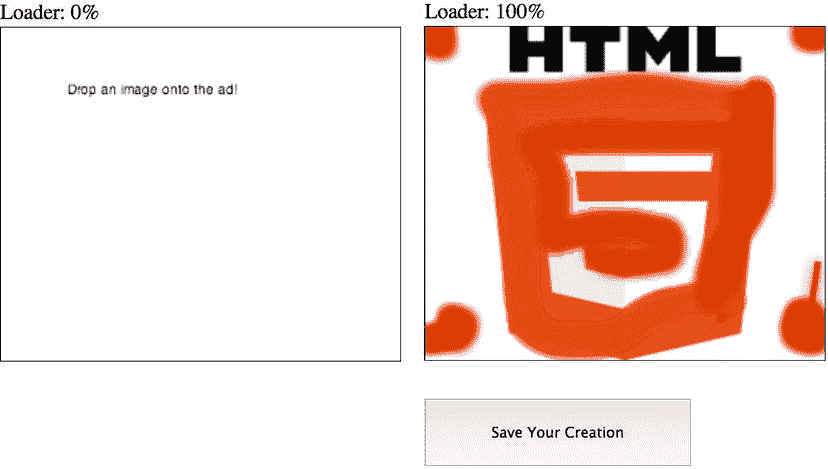

# 六、HTML5 API

许多人在访问一个新的国家时会请翻译或导游。他们依靠的是一个对这片土地和这里的人了如指掌的人，一个能告诉你当你到达时该做什么和不该做什么的人。在这种情况下，把新国家想象成所有现代浏览器技术，把翻译器想象成用于与这些技术通信的应用编程接口(API)。要在这个国家或任何一个新的国家把事情做好，你需要“说到做到”——这基本上就是 API 所做的。它们是一个通信层，通过代码通信来提供对特定技术形式的访问。

在本章中，我们将涉及很多 HTML5 APIs。既然到目前为止你已经了解了一些，那就认为你已经有了一个良好的开端。canvas、CSS3 甚至 SVG 都是 API，本章将回顾新兴的 HTML5 浏览器带给我们的一些新 API。然而，我们不会涵盖所有这些，因为在本书的范围内有太多的事情要做。然而，你可以在 http://platform.html5.org 看到它们中的大多数。另外，请记住，大多数 API 并不是实际 HTML5 规范的一部分。有几个是从 HTML5 规范开始的，后来被移到他们自己的标准中，因此默认采用了 HTML5 这个总括术语。虽然这些 API 中的大多数都需要某种级别的 JavaScript 来操作，但是它们都做不同的事情，并且以不同的方式运行。此外，研究它们将完全改变你在浏览器中使用标准的方式。相信我！所以让我们开始挖掘 HTML5 的真正肌肉。一定要戴上编码的帽子，因为 HTML5 APIs 严重依赖 JavaScript。

拖放式

首先，我们来聊聊拖放(DnD) API，这是 HTML5 规范中相对较新的一项。这个 API 提供了一个非常简单的方法来在页面或内容上拖放元素，就像一个广告单元。此外，它需要最少的代码来实现。最初由微软在 Internet Explorer 浏览器的第 5 版中创建，由于 API 规范中的错误、浏览器中的实现以及围绕拖动事件的使用，它经历了一些开发人员的反弹(至少可以这么说)。详见[`quirksmode . org/blog/archives/2009/09/the _ html 5 _ drag . html`](http://quirksmode.org/blog/archives/2009/09/the_html5_drag.html)。

经过一些改进，由于 IE、Opera、Firefox、Safari 和 Chrome 都以某种方式支持它，这个 API 现在为现代浏览器环境带来了原生的拖放支持，而无需第三方插件或 JavaScript 库。只需在您希望用户拖动的任何 DOM 元素上添加一个“draggable = true**”**属性(同时通过 JavaScript 在“拖放区”上包含一些基本的事件侦听器/处理程序)，您就可以指示浏览器将元素放到哪里。

 **注意**默认情况下，元素 img 和 a(带有 href)是可拖动的，但是请记住，不是所有的元素(例如图像)都可以是拖放区域。

拖放式 API 已经走过了漫长的道路。在使用浏览器的原生功能之前，开发人员和设计人员需要使用 jQuery 等外部库或 Flash 等插件。感谢 HTML5 规范，默认情况下，它现在是现代浏览器的主要组件。几乎任何东西都可以拖动:图像、链接、文本——实际上是任何 DOM 节点。还要注意的是，对原生浏览器的支持使得网络速度更快，反应更灵敏，对我们来说，就是广告创意。只要你能利用浏览器的本地 API，就去做吧！毕竟，标准化和构建硬连接到浏览器环境中的用户友好的 API 是 HTML5 和本书的全部内容。清单 6-1 概述了如何在一个非常简单的广告中使用 DnD，其中发布者是一个产品制造商，广告是一个产品拖放区，通过拖放保存。

***清单 6-1 。*** 拖放示例

```html
<!DOCTYPE HTML>
<html>
<head>
<style type="text/css">
* {
  margin:0px;
  padding:0px;
}
#ad {
  width:300px;
  height:250px;
  border:1px solid #000;
  overflow: hidden;
}
#logo {
  position: absolute;
  top: 5px;
  left: 1px;
  width: 300px;
  height: 250px;
  font-family: Arial, "MS Trebuchet", sans-serif;
  font-size: 40px;
  text-align: center;
  color: #fff;
  z-index: 3;
}
#cta {
  position: absolute;
  top: 220px;
  left: 1px;
  width: 300px;
  height: 250px;
  font-family: Arial, "MS Trebuchet", sans-serif;
  font-size: larger;
  text-align: center;
  color: #fff;
  z-index: 2;
}
#dropper {
  position: relative;
  top: 25px;
  left: 80px;
  z-index: 101;
}
#dropArea {
  position: absolute;
  top: 60px;
  left: 10px;
  width: 280px;
  height: 150px;
  background: #f2f5f6; /* Old browsers */
  background: -moz-linear-gradient(top,  #f2f5f6 0%, #e3eaed 37%, #c8d7dc 100%); /* FF3.6+ */
  background: -webkit-gradient(linear, left top, left bottom, color-stop(0%,#f2f5f6), color-stop(37%,#e3eaed), color-stop(100%,#c8d7dc)); /* Chrome,Safari4+ */
  background: -webkit-linear-gradient(top,  #f2f5f6 0%,#e3eaed 37%,#c8d7dc 100%); /* Chrome10+,Safari5.1+ */
  background: -o-linear-gradient(top,  #f2f5f6 0%,#e3eaed 37%,#c8d7dc 100%); /* Opera 11.10+ */
  background: -ms-linear-gradient(top,  #f2f5f6 0%,#e3eaed 37%,#c8d7dc 100%); /* IE10+ */
  background: linear-gradient(to bottom,  #f2f5f6 0%,#e3eaed 37%,#c8d7dc 100%); /* W3C */
  filter: progid:DXImageTransform.Microsoft.gradient( startColorstr='#f2f5f6', endColorstr='#c8d7dc',GradientType=0 ); /* IE6-9 */

  border: 1px dashed;
  border-radius:10px;

  z-index: 81;
}
#background {
  position: absolute;
  top: 1px;
  left: 1px;
  width: 300px;
  height: 250px;
  background: #c0c5d6; /* Old browsers */
  background: -moz-linear-gradient(top,  #c0c5d6 0%, #3f4c6b 100%); /* FF3.6+ */
  background: -webkit-gradient(linear, left top, left bottom, color-stop(0%,#c0c5d6), color-stop(100%,#3f4c6b)); /* Chrome,Safari4+ */
  background: -webkit-linear-gradient(top,  #c0c5d6 0%,#3f4c6b 100%); /* Chrome10+,Safari5.1+ */
  background: -o-linear-gradient(top,  #c0c5d6 0%,#3f4c6b 100%); /* Opera 11.10+ */
  background: -ms-linear-gradient(top,  #c0c5d6 0%,#3f4c6b 100%); /* IE10+ */
  background: linear-gradient(to bottom,  #c0c5d6 0%,#3f4c6b 100%); /* W3C */
  filter: progid:DXImageTransform.Microsoft.gradient( startColorstr='#c0c5d6', endColorstr='#3f4c6b',GradientType=0 ); /* IE6-9 */

  z-index: 0;
}

/******Mock Publisher Content********/
#publisherContent {
  position: absolute;
  top: 300px;
  left: 100px;
}

#pubProduct {
  position: absolute;
  top: 0px;
  left: 0px;
  width:100px;
  height:100px;
  background: url(hammer.png) no-repeat;

  z-index: 90;
}

</style>
<script type="text/javascript">
//fires when product is over the drop area
function allowDrop(event) {
  //cancel default for drop event to fire
  event.preventDefault();
  console.log("YOU'RE OVER THE DROP AREA!!!")
}

function dropArea(event){ 
  var data = event.dataTransfer.getData("Text");
  var dropArea = document.getElementById('dropper');
  var element = document.getElementById(data);
  dropArea.appendChild(element);

  console.log(element)
}

//initial drag when product is selected
function drag(event) {
  var dropImg = document.createElement("img");
  dropImg.src = "add.png";
  dropImg.width = "48px";
  dropImg.height = "48px";
  dropImg.style.opacity = "0.5";

  event.dataTransfer.effectAllowed='all';
  event.dataTransfer.setData("Text", event.target.getAttribute('id'));
  event.dataTransfer.setDragImage(dropImg, 25, 25);
}

function adInit(event) { 
  console.log(event.type)
}

window.addEventListener('DOMContentLoaded', adInit, false);
</script>
</head>

<body>
<div id="publisherContent">
  <div id="pubProduct" draggable="true" ondragstart="drag(event)"></div>
</div>

<div id="ad">
  <div id="logo">Shopping Cart</div>
  <div id="cta"> Drag Products To Drop Area! </div>
  <div id="dropArea" ondrop=dropArea(event) ondragover=allowDrop(event)>
    <div id="dropper"></div>
  </div>
  <div id="background"></div>
</div>
</body>
</html>
```

希望您正在使用您最喜欢的文本编辑器。现在让我们看一下代码。首先，我们使用清单中的 CSS 做一些基本的广告设置和设计。第二，在 HTML 中，我们模拟发布者内容(publisher content)并将发布者页面中的模拟产品放到广告区域(ad)。接下来，在我们的 publisherContent div 中，有一个示例产品 pubProduct，它的 draggable 属性被设置为 true，并且有一个事件 ondragstart，要用名为 **drag(event)** 的函数来处理。

 **注意**你必须在“事件”中传递参数；否则代码将无法正常运行。

接下来，我们通过利用 ondrop 和 ondragover 事件在广告中添加更多的事件处理程序。这些事件分别附加 dropArea(事件)和 allowDrop(事件)。接下来，使用 JavaScript 编写我们的函数。对于拖动，我们通过调用 setDragImage() 方法并向其传递三个参数来使用带有来自 dataTransfer 对象的方法的拖动图像。第一个参数是图像资源，第二个和第三个是图像的 x 和 y 坐标位置，即鼠标开始拖动的位置。如果您希望在用户拖动时为元素创建自定义图像，这可能会很有帮助。

接下来，我们处理 allowDrop 方法，它表示何时可以将产品放到内容区域。在这种情况下，我们使用整个广告作为拖放区。

 **注意**默认情况下，dragOver 和 dragEnter 事件不能放下元素。您必须通过调用 event.preventDefault()显式取消这些默认浏览器操作；删除一个元素。

最后，一旦你知道你被允许放下产品，一旦用户放开鼠标，这个动作可以用 dropArea 处理程序来处理。在 dropArea 方法中，我们通过再次调用 dataTransfer 对象来获取产品的数据，但这次我们通过编写 var data = event . data transfer . get data(" Text ")来检索数据。有了数据对象，我们就可以将数据注入到广告的不动产中。用户现在看到了广告区域内的元素，如图 6-1 中的展示了 。


图 6-1。展示了广告的拖放示例

我希望你都明白了；我知道这很多。如果你没有，你可以通读一遍前面的代码，并为后续学习的访问[`html5laboratory.com/drag-and-drop.php`](http://html5laboratory.com/drag-and-drop.php)。对于一些用户来说，DnD 是一块隐藏的宝石，尤其是在广告环境中，所以如果它是广告体验中的一个特定功能，一定要包括一个相关且清晰的行动号召，以确保你的用户采取适当的行动。

广告中的拖放

有了一些基本的 DnD 入门知识，让我们想想拖放(DnD) API 如何应用于广告领域。起初，我认为 DnD API 可以带来玩互动游戏的新方法。例如，它允许用户更准确地玩国际象棋游戏，因为它类似于用户的自然行为。它可以重新创建一个交互式的购物车体验，用户可以将产品拖到收银台购物车中，购物车会根据放入的产品数量而装满。我认为一旦你开始使用这个 API，使用这个标准的可能性是无限的。

它可以将元素拖到待办事项列表中，以便用户可以在以后打印，甚至可以用于 mix up 益智游戏的功能，其中用户需要为隐藏的提议组装拼图。我还看到 DnD 带来了处理复杂的出版商集成的能力——例如，用户将出版商页面上的精选内容拖放到广告的拖放空间(正如刚才所讨论的)。这可能有点像寻找复活节彩蛋，最终用户在站点内找到相关内容，并通过发现这些“彩蛋”获得特殊待遇

诚然，DnD 仍有相当一部分古怪的问题，但如果你有兴趣深入了解 DnD 的空气污染指数，请前往 http://html5rocks.com/en/tutorials/dnd/basics。你可以在 http://dev.w3.org/html5/spec/dnd.html#dnd 的[和](http://dev.w3.org/html5/spec/dnd.html#dnd)[的 http://whatwg . org/specs/we B- apps/current-work/multipage/dnd . html # dnd](http://whatwg.org/specs/web-apps/current-work/multipage/dnd.html#dnd)查看目前的规格。

文件

html 5 中更新的文件 API 允许网页内容提示用户选择他们机器上的本地文件，然后在浏览器中阅读这些文件的内容，而不需要服务器端的帮助或插件。这种选择可以通过使用 HTML 输入元素或刚刚学会的 DnD API 来完成。如果你使用 Gmail(谷歌的邮件服务)和一个现代浏览器，当你把文件附加到邮件中时，你很可能在不知不觉中使用了文件 API。你可能会想，“当然，我以前也给电子邮件添加过附件，”但是你知道你可以把这些附件从你电脑的操作系统拖到 Gmail 里吗？DnD 可以让你将文件数据传输到 Gmail 的应用中，但在浏览器中阅读文件会充分利用文件 API。

DnD 和文件 API 一起使用时，会提供与在您的操作系统或桌面 上使用本机应用相同的体验。HTML5 的这一新增功能本质上允许用户将 web 应用视为其本地操作系统(OS)的扩展。如果你要求用户上传他们自己的图片到你的广告单元，这将是一个巨大的帮助。他们所需要做的就是把它从桌面拖到浏览器定义的拖放区——在我们的例子中，它可以是广告。

传统上，文件 API 使用<input type="file">给用户一个基本的输入，允许本地操作系统文件选择器窗口，也允许 HTML 文档引用位于用户文件系统上的文件——但仅此而已。

如今，文件 API 允许用户直接在浏览器中读取各种文件格式的文件，而无需服务器端技术。使用新的 FileReader API，可以将文件读取为字符串、数组缓冲区，甚至是 BLOB (二进制大对象)输入。有了浏览器自带的这些信息，就可以读取、解释、显示甚至操作文件中的二进制信息，然后保存到更新和修改的版本中。通过 JavaScript ，文件 API 提供了一个原生机制来读取文件的数据，并按照您的意愿写入。随着 web 变得更加以应用为中心(正如 HTML5 所希望的)，用户计算机的原生文件系统和 Web 上的应用将变得更加交织在一起。对于许多普通的日常用户来说，Web 和原生操作系统之间的界限将会变得模糊。例如，不需要用户检索保存在他们机器上的名为 someimage.jpg 的素材，文件 API 和文件阅读器 API 可以被附加到 DnD API 上，以无缝集成操作系统和网络应用，甚至允许访问用户的内置摄像头，捕捉位图图像信息并将其保存到网页或广告中——同样，所有这些都在浏览器的原生架构内。

这种方法比仅仅要求用户提供以前保存的图像资源要高级得多，你说呢？此外，您甚至可以使用 XMLHttpRequest (AJAX)方法 从另一个数据源检索信息，并将其作为 BLOB、Array 或 String 对象导入，以便 FileReader API 进行解释，并可能在以后要求用户进行操作。使用 AJAX 方法，这个过程可以在不触发页面刷新的情况下发生，这同样使最终用户可以无缝集成。

记住这一点，让我们看看如何在 JavaScript 中使用文件 API。清单 6-2 要求用户将自己的图像拖入广告体验中。

***清单 6-2 。*** 文件 API 示例

```html
<!DOCTYPE html>
<style type="text/css">
* {
  margin: 0px;
  padding: 0px;
}
#drop_zone {
    width:300px;
    height: 250px;
    background-color:#999;
    border: 1px dashed #000;
}
p {
    width: 300px;
}
</style>
<head>
    <meta charset=utf-8>
    <body>
        <div class="percent">0%</div>
        <input type=file>
        <div id="drop_zone">Drop Zone</div>
        <p>Select an image from your machine or drop onto the drop zone to read the contents of the file without using a server</p>
        <script>
            function adInit(event) {
                event.preventDefault();
                var upload = document.getElementsByTagName('input')[0];
                var progress = document.querySelector('.percent');
                var dropZone = document.getElementById('drop_zone');
                dropZone.addEventListener('drop', handleFileSelect, false);

                // Check for the various File API support.
                if (window.File && window.FileReader && window.FileList && window.Blob) {
                    var reader = new FileReader();
                    console.log('Sweet! All File APIs supported');

                    upload.onchange = function (event) {
                        var file = upload.files[0];
                        var img = new Image();
                        reader.onload = function (event) {
                            console.log(event.type);
                        };
                        reader.onprogress = function (event) {
                            console.log(event.type);
                            var percentLoaded = Math.round((event.loaded / event.total) * 100);
                            progress.textContent = percentLoaded + '%';
                            console.log(percentLoaded)
                        };
                        reader.onloadend = function (event) {
                            if (!file.type.match('image.*')) {
                                alert("Not an image!!");
                            } else {
                                img.src = event.target.result; 
                                if (img.width >= 300) {
                                    img.width = 300;
                                } 
                            }
                            console.log(event.type);
                            dropZone.innerHTML = '';
                            dropZone.appendChild(img);
                        };
                        reader.onerror = function (event) {
                            console.log(event.type);
                        };

                        reader.readAsDataURL(file);
                        console.log(reader);
                        return false;
                    };

                    function handleFileSelect(event) {
                        event.stopPropagation();
                        event.preventDefault();
                        //event.dataTransfer.dropEffect = 'copy'; // Explicitly show this is a copy.
                        var files = event.dataTransfer.files; // FileList object.
                        var file = files[0];

                        reader.onloadend = function (event) {
                            console.log(event.target);
                            dropZone.style.width = "300px";
                            dropZone.style.height = "300px"; 
                            dropZone.style.background = 'url(' + event.target.result + ') no-repeat center';
                        };

                        reader.readAsDataURL(file);
                        return false;

                        console.log(file) 
                    }
                } else {
                    alert('The File APIs are not fully supported in this browser.');
                }
            }

            window.addEventListener('DOMContentLoaded', adInit, false);
        </script>
    </body>
</html>
```

如这段代码所示，首先允许用户选择本地计算机上的图像文件，或者通过将标记中的一个区域定义为 drop_zone，将图像拖动到广告的拖放区。一旦加载 DOM 后广告启动，adInit 函数 被触发；它通过获取对 DOM 对象的变量引用来开始。(您可以看到，通过调用 getElementsByTagName、getElementById 和新的 querySelector，我使用了各种方法来获取引用。)一旦用户将图像拖放到拖放区域，我们在创建一个文件读取器引用后运行几个方法，首先调用 upload.onchange，它在输入元素改变状态时处理抓取用户图像文件。第二，我们使用文件阅读器——姑且称之为 reader——并将特定的方法附加到对象上——onload、onprogress、onloadend、onerror 和 readAsDataURL——当用户将图像放到拖放区域时，所有这些方法都会处理特定的命令。最后，我们来关注一下 onloadend 方法，该方法通过编写 drop zone . style . background = ' URL('+event . target . result+')no-repeat center '，通过 CSS 将用户的图片写入 drop_zone 元素中；。一旦发生这种情况，图像就显示在浏览器中，而不需要往返服务器。这显示在图 6-2 中，使用了我桌面上的一个示例图像。


图 6-2。一个图片文件的例子上传

 **注意**通过多重属性，用户可以一次选择多个文件。

广告中的文件访问

现在我们已经让用户能够上传图像，他们可以对文本文件、PDF、PSD——你能想到的都可以——做同样的事情，并让浏览器解析、操作和呈现信息到屏幕上。了解了这些信息后，让我们允许用户将图像从桌面拖放到广告的实际区域，并让他们使用 HTML5 canvas 元素在图像上绘画。由此，让我们也允许用户在本地保存被操作的文件。清单 6-3 给出了一个例子。

***清单 6-3 。*** 用画布文件 API 示例

```html
<!DOCTYPE html>
<style type="text/css">
    * {
        margin: 0px;
        padding: 0px;
        position: relative;
    }
    canvas {
        position: absolute;
        top: 20px;
        left: 0px;
        width: 300px;
        height: 250px;
        border: 1px solid #000;
    }
    .percent {
        position: absolute;
        top: 0px;
        left: 0px;
        width: 100%;
    }
    button {
        position: absolute;
        top: 300px;
        width: 200px;
        height: 50px;
        visibility: hidden;
    }
</style>
<head>
    <meta charset=utf-8>

    <body>
        <div class="percent">Loader: 0%</div>
        <canvas width=300 height=250>
            <p>No Canvas Support</p>
        </canvas>
        <button></button>
        <script>
            function adInit(event) {
                event.preventDefault();

                var canvas = document.getElementsByTagName('canvas')[0],
                    context = canvas.getContext('2d'),
                    progress = document.querySelector('.percent'),
                    img = document.createElement("img"),
                    saveBtn = document.querySelector("button"),
                    mouseIsDown = false,
                    hasText = true,
                    clearCanvas = function () {
                        if (hasText) {
                            context.clearRect(0, 0, canvas.width, canvas.height);
                            hasText = false;
                        }
                    };

                // GENERIC CTA
                context.fillText("Drop an image onto the ad!", 50, 50);

                // Image for loading
                img.addEventListener("load", function () {
                    clearCanvas();
                    context.drawImage(img, 0, 0, 300, 250);
                }, false);

                // To enable drag and drop
                canvas.addEventListener("dragover", function (evt) {
                    evt.preventDefault();
                }, false);

                canvas.addEventListener("drop", function (event) {
                    var files = event.dataTransfer.files;

                    if (files.length > 0) {
                        var file = files[0];

                        if (typeof FileReader !== "undefined") {
                            var reader = new FileReader();

                            reader.onload = function (event) {
                                console.log(event.type);
                            };
                            reader.onprogress = function (event) {
                                console.log(event.type);
                                var percentLoaded = Math.round((event.loaded / event.total) * 100);
                                progress.textContent = "Loader: " + percentLoaded + '%';
                                console.log(percentLoaded)
                            };
                            reader.onloadend = function (event) {
                                console.log(event.type);
                                if (!file.type.match('image.*')) {
                                    alert("Not an image!!");
                                } else {
                                    img.src = event.target.result;
                                }

                                beginCanvasDrawing();
                            };
                            reader.onerror = function (event) {
                                console.log(event.type);
                            };

                            reader.readAsDataURL(file);
                        }
                    }
                    event.stopPropagation();
                    event.preventDefault();
                }, false);

                function beginCanvasDrawing() {
                    var brush = "rgba(200, 34, 2, .5)";

                    canvas.addEventListener("mousedown", function (event) {
                        mouseIsDown = true;
                        clearCanvas();
                        context.beginPath();//starts the drawing once users mouse is down
                    }, false);

                    canvas.addEventListener("mousemove", function (event) {
                        if (mouseIsDown) {
                            canvas.style.cursor = "pointer";
                            context.strokeStyle = brush;

                            context.shadowOffsetX = 0;
                            context.shadowOffsetY = 0;
                            context.shadowBlur    = 15;
                            context.shadowColor   = brush;

                            context.lineWidth = 5;
                            context.lineJoin = "round";
                            context.lineTo(event.layerX, event.layerY);
                            context.stroke();
                        } else {
                            console.log("hold mouse button down")
                        }
                    }, false);

                    canvas.addEventListener("mouseup", function (event) {
                        mouseIsDown = false;
                        var colors = context.getImageData(event.layerX, event.layerY, 10, 10).data;
                        console.log(colors);
                        brush = "rgba(" + colors[0] + ", " + colors[1] + ", " + colors[2] + ", " + colors[3] + ")";
                        console.log(brush);
                    }, false);

                    saveBtn.style.visibility = "visible";
                    saveBtn.innerHTML = "Save Your Creation";
                    saveBtn.addEventListener("click", function (event) {
                        var newImg = new Image();
                        newImg.src = canvas.toDataURL();
                        window.location.href = newImg.src.replace('image/png', 'image/octet-stream'); 
                    }, false);
                }
            }

            window.addEventListener('DOMContentLoaded', adInit, false);
        </script>
    </body>
</html>
```

从代码中可以看出，用户被要求将图像拖放到广告的 canvas 元素上，DND API 和 File API 将图像呈现到屏幕上。从那里，我们将调用一个方法 beginCanvasDrawing ，该方法将调用我们特定的画布绘制函数，允许用户在浏览器中插入图像后进行“绘制”。

在 beginCanvasDrawing 中，我们将检测用户是否在用鼠标绘图，并为用户提供一个按钮来保存新的图像组合。一旦用户选择了按钮，就会创建一个新图像，并且画布的新位图信息会应用到图像的源。在那里，通过将图像的文件类型替换为 image/octet-stream，图像被保存到他们的文件系统，这允许用户将图像信息保存为二进制文件。图 6-3 显示了浏览器应该呈现的内容。



图 6-3。带有文件和画布的图像文件上传示例

 **注意**你可以检测浏览器是否支持文件写入器 API，并以这种方式在本地保存信息。否则，您可以使用服务器端代码来获取二进制信息，并以正确的文件名保存素材。

此外，HTML5 被设置为支持 ，而不是导航到 URL 。(参见[`html5-demos.appspot.com/static/a.download.html`](http://html5-demos.appspot.com/static/a.download.html)的例子。还有，看[`nihilogic.dk/labs/canvas2image`](http://nihilogic.dk/labs/canvas2image)；这是一个有用的轻量级库，可以从 canvas 元素中保存不同的图像类型。)

我自己仍然记得当 Flash Player 10 让广告开发人员获得文件访问权来创建用户生成的内容(经过用户许可)时，我是多么兴奋。现在，在浏览器中，我们可以做同样的事情——获取本地文件，从用户的机器上访问视频或音频。如果你问我，我会说这些都是非常令人惊奇的东西！

 **注意**记住，这个 API 实际上并不是 HTML5 规范的一部分，它处于工作草案状态。因此，随着规范工作的继续，功能可能会有所改变。参见[www.w3.org/TR/FileAPI](http://www.w3.org/TR/FileAPI)获取更多关于文件 API 的信息。

页面可见性

页面可见性 API 是我期待已久的东西！我非常渴望开始利用这个特性，因为它为最终用户和开发人员提供了巨大的性能优势。页面可见性 API 允许浏览器根据页面的可见性来处理或“切换”内容和系统资源。简而言之，如果你没有在看什么东西，比如说，如果它在另一个标签上，浏览器将停止为该内容分配资源，为用户当前正在查看的内容释放更多的系统资源。让我们看看如何在一个广告例子中使用页面可见性 API(参见清单 6-4 )。

***清单 6-4 。*** 页面可见性 API 示例

```html
<!DOCTYPE html>
<head>
    <meta charset=utf-8>
    <body>
    </body>
        <script>
            var isHidden,
              state,
              visibilityChangeEvent;

            function adInit(event) {
                console.log(event.type)

                   if (typeof document.hidden !== "undefined") {
                       isHidden = "hidden";
                       visibilityChangeEvent = "visibilitychange";
                       state = "visibilityState";
                   } else if (typeof document.mozHidden !== "undefined") {
                       isHidden = "mozHidden";
                       visibilityChangeEvent = "mozvisibilitychange";
                       state = "mozVisibilityState";
                   } else if (typeof document.msHidden !== "undefined") {
                       isHidden = "msHidden";
                       visibilityChangeEvent = "msvisibilitychange";
                       state = "msVisibilityState";
                   } else if (typeof document.webkitHidden !== "undefined") {
                       isHidden = "webkitHidden";
                       visibilityChangeEvent = "webkitvisibilitychange";
                       state = "webkitVisibilityState";
                   } 

              document.addEventListener(visibilityChangeEvent, function (event) {
                    if (document[state] == "hidden") {
                                  pauseAd();
                                   } else {
                                   startAd();
                                   }

              }, false);
            }

            function pauseAd () {
              console.log("pauseAd");
              //code to pause ad animation or video
            }

            function startAd () {
              console.log("startAd");
              //code to resume ad animation or video
            }

            window.addEventListener('DOMContentLoaded', adInit, false);
        </script>
    </html>

```

如代码所示，您可以监听文档可见性的状态变化，并触发 pauseAd 或 startAd 方法，这将分别暂停或开始广告的动画或视频播放，如果创意利用这些功能的话。

广告中的页面可视性

我想你会同意，在广告领域，这可能是为用户提供最佳体验的巨大优势。我们可以暂停动画、视频播放，甚至是隐藏的浏览器标签上的外部请求。我甚至可以说，这应该是未来数字广告 的绝对标准(因为浏览器采用了这一功能)。

为了获得更大的粒度，JQuery 还有一个插件来检测元素在页面上的可见性。当计算真实可见广告印象与提供的广告印象时，或者甚至当消除用户当前没有查看的页面上的广告单元的资源时，该插件可能更加有益。想一想——为什么要在没人看的时候初始化创意内容？“如果一个广告出现在页面上，但没有人浏览，它还能算作一个印象吗？”传统上是这样的，但是随着类似措施的实现，这种情况不会持续太久——这将给广告商带来更好的广告回报。

 **注意**要检测元素可见性，看看 [`inview`](http://inview) 插件[`github.com/protonet/jquery.inview`](https://github.com/protonet/jquery.inview)。

在撰写本文时，该规范仍处于工作草案状态，因此对页面可见性 API 的支持非常少。在我写这篇文章时，它只在 Chrome 13+，Firefox 10+和 Internet Explorer 10+中受支持。随着供应商市场的采用和用户群的增长，我希望看到更广泛的实现，甚至可能出现围绕这一点的 IAB 标准。当前工作草案见[`dvcs . w3 . org/Hg/web perf/raw-file/tip/specs/page visibility/overview . html`](http://dvcs.w3.org/hg/webperf/raw-file/tip/specs/PageVisibility/Overview.html)。

历史

现在我们来讨论一下历史 API。每个互联网浏览器都有它，几乎每个互联网用户都经常点击浏览器的后退按钮，以便回到浏览器的时间。它无疑是浏览器整体界面中最受欢迎的按钮。history API 提供了一种在用户的浏览器历史中添加和删除记录的方法，在这种方法中，可以保留恢复页面状态的数据并更新 URL，而无需刷新页面内容。这种方法与选择 Back 按钮有很大不同，因为这样做时，页面总是会重新加载，实际上导致浏览器重新呈现内容，向服务器发出请求，并再次触发任何广告展示。

history API 有一堆有用的特性，在你的下一次广告活动中使用它也会很有趣。例如，您可以构建一个创意，假装知道用户最后访问了哪里。是的，有点令人毛骨悚然；这可能会吓到一些用户，甚至引起一些反弹，但它确实是无害的，因为您不会收集任何个人身份信息。您只需调用浏览器存储内存中的历史记录。

对于广告开发人员来说，这个 API 有点棘手。假设用户正在浏览广告内容，可能在动态产品提要中搜索不同的产品，开发人员将每个用户交互记录到浏览器的历史记录中。现在，如果用户使用浏览器的后退按钮，它将返回到之前在广告内容中查看的状态，而不是返回到之前的页面内容。虽然这都是非常新的和新兴的，我们将不得不看看数字广告适合在它的历史 API 的使用；它可能会与许多事情发生冲突，甚至可能是数字广告的禁区。无论事情如何发展，历史 API 都值得熟悉；我甚至看到一些有趣的例子，复制了滚动文本的老套字幕，但是在这种情况下，是在 URL 栏中。

有趣的是，出版商和内容制作者将如何在他们的页面中实现历史 API。例如，当使用 API 并调整用户的浏览器状态时，如果没有页面重新加载，屏幕上的广告内容不会重新加载；因此，没有印象会火。然而，有人再次看到了内容，甚至可能是一个全新的人，这应该会产生新的印象，对吗？

有关历史 API 的更多信息，请访问[`dev . Opera . com/articles/view/introducing-the-html 5-History-API/`](http://dev.opera.com/articles/view/introducing-the-html5-history-api/)查看 Opera 的开发频道

网络存储

在任何应用中，保存数据都是一项非常普通的任务，而在 HTML5 中，它在 Web 上变得更加重要。有时，您会希望存储数据以供以后参考；其他时候，您可以使用 HTML5 历史 API 保存的关于用户浏览历史的数据。你甚至可以保存数据供离线查看，你将在第十章中了解到。无论从哪个角度来看，存储都是软件开发中的一个重要特性，所以让我们来看看在 HTML5 中使用 web 存储 API 的情况。

你需要记住两种类型的网络存储。

*   localStorage:保存没有截止日期的数据
*   sessionStorage:保存一个浏览会话的数据

在浏览器重启后， *localStorage* 中的数据仍然存在，而 *sessionStorage* 仅在页面刷新时才存在。该规范是用于浏览器中数据的名称/值对的数据存储的 API。这是非常革命性的，因为您不必通过服务器请求来请求保存的信息；一切都保存在客户端。现代浏览器通常允许高达 5 兆字节的客户端存储，而在 HTML4 中，cookie 用于存储关于用户会话的少量信息，高达 4 千字节的存储，并且它随每个 HTTP 请求一起传输。现在，你可以通过 *Base64* 编码将图像保存到一串文本中，并将其保存在浏览器每个域 5 兆字节的存储空间内(大约)。另一个很好的特性是，如果你试图超过浏览器设置的默认存储量，浏览器会要求用户允许或拒绝存储更多的信息。

本地存储

现在，sessionStorage 是一种在本地存储客户端数据(名称/值对)的方法——很像 cookies，但它有更多的优点。通过 sessionStorage，您现在可以将用户浏览会话的数据保存在内存中，以便以后在广告体验中检索，而无需多次往返服务器。使用 sessionStorage 的真正优势在于它支持所有主流浏览器，甚至低至 IE8！同样，它的操作类似于 cookies，但与 cookies 不同，web 存储数据不会随每个服务器请求一起发送，并且没有 cookies 的 4kb 数据存储大小限制。存储的数据是受域限制的；这意味着浏览器的会话存储对象信息仅对最初放置该数据的域是可读的。

 **注意**如果用户在同一个站点打开了多个窗口，每个窗口都有自己的 sessionStorage 对象。

本地存储

由于我是 Mac 用户，所以疯狂使用 Command+Tab；对于 Windows 用户，应该是 Ctrl+Tab。它提供了一种在我的机器上的多个窗口/应用之间切换的简单方法，如果你像我一样，你很可能会几次误按 Command+Q 或 Ctrl+Q 退出应用。(当你在网上填写一个大表格时，没有什么比手指滑动并选择 Q 而不是 Tab 更令人沮丧的了！

现在有了 localStorage ，开发人员可以通过保存用户在表单文本字段中输入的内容来帮助用户。在这种情况下，如果我退出(我经常不经意地这样做)，我可以在重启浏览器后回到网站，从离开的地方继续。这对用户体验非常有益。这背后的驱动技术是 localStorage，它允许开发人员保存浏览器的持久数据，这样，如果用户关闭并重新打开浏览器，数据将会保留，开发人员可以在以后检索数据。

如上所述，保存 localStorage 时没有应用浏览器到期日期。也就是说，它永远存在，除非开发人员清除或修改它，或者用户完全删除浏览器应用或清除所有浏览器内存。

无论您使用 sessionStorage 还是 localStorage，存储和检索值的语法都是相同的——如下例所示，其中存储了用户名。

```html
localStorage.setItem("userName", "John");
```

或者

```html
sessionStorage.setItem("userName", "John");
```

让我们看看在 ad 单元中使用 localStorage。在清单 6-5 中，用户被提示输入他或她的名字；然后，name 值进入 localStorage 对象，该对象允许广告在广告文本中使用该名称，即使用户稍后在另一个发布者站点上看到该广告。

***清单 6-5 。*local storage API 示例**

```html
<!DOCTYPE HTML>
<html>
<head>
</head>
<style>
    * {
        margin: 0px;
        padding: 0px;
        position: relative;
        font-family: Verdana;
    }
    #ad {
      position: relative;
      top: 0px;
      left: 0px;
      width: 300px;
      height: 250px;
      border: 1px solid black;
      text-align: center;
    }
    #name {
      font-size: 60px;
      z-index: 20;
      color: white;
    }
    #usersName {
      font-size: 50px;
      z-index: 20;
      font-weight: bold;
    }
    #cta {
      z-index: 10;
      -moz-box-shadow: 0px 0px 0px 0px #caefab;
      -webkit-box-shadow: 0px 0px 0px 0px #caefab;
      box-shadow: 0px 0px 0px 0px #caefab;
      background:-webkit-gradient( linear, left top, left bottom, color-stop(0.05, #77d42a), color-stop(1, #5cb811) );
      background:-moz-linear-gradient( center top, #77d42a 5%, #5cb811 100% );
      filter:progid:DXImageTransform.Microsoft.gradient(startColorstr='#77d42a', endColorstr='#5cb811');
      background-color:#77d42a;
      -moz-border-radius:42px;
      -webkit-border-radius:42px;
      border-radius:42px;
      border:3px solid #268a16;
      display:inline-block;
      color:#306108;
      font-family:arial;
      font-size:28px;
      font-weight:bold;
      padding:20px;
      text-decoration:none;
      text-shadow:1px 1px 0px #aade7c;
    }
    #cta:hover {
      background:-webkit-gradient( linear, left top, left bottom, color-stop(0.05, #5cb811), color-stop(1, #77d42a) );
      background:-moz-linear-gradient( center top, #5cb811 5%, #77d42a 100% );
      filter:progid:DXImageTransform.Microsoft.gradient(startColorstr='#5cb811', endColorstr='#77d42a');
      background-color:#5cb811;
    }
    #cta:active {
      position:relative;
      top:1px;
    }
    #background {
      z-index: 0;
      width: 300px;
      height: 250px;
      position: absolute;
      top: 0px;
      left: 0px;
      background: rgb(201,222,150); /* Old browsers */
      background: -moz-linear-gradient(top,  rgba(201,222,150,1) 0%, rgba(138,182,107,1) 44%, rgba(57,130,53,1) 100%); /* FF3.6+ */
      background: -webkit-gradient(linear, left top, left bottom, color-stop(0%,rgba(201,222,150,1)), color-stop(44%,rgba(138,182,107,1)), color-stop(100%,rgba(57,130,53,1))); /* Chrome,Safari4+ */
      background: -webkit-linear-gradient(top,  rgba(201,222,150,1) 0%,rgba(138,182,107,1) 44%,rgba(57,130,53,1) 100%); /* Chrome10+,Safari5.1+ */
      background: -o-linear-gradient(top,  rgba(201,222,150,1) 0%,rgba(138,182,107,1) 44%,rgba(57,130,53,1) 100%); /* Opera 11.10+ */
      background: -ms-linear-gradient(top,  rgba(201,222,150,1) 0%,rgba(138,182,107,1) 44%,rgba(57,130,53,1) 100%); /* IE10+ */
      background: linear-gradient(to bottom,  rgba(201,222,150,1) 0%,rgba(138,182,107,1) 44%,rgba(57,130,53,1) 100%); /* W3C */
    }
</style>
<body>
<div id='ad'>
  <div id='name'>Hello!<span id='usersName'></span></div>
  <a id='cta'>Click Here</a>
  <div id='background'></div>
</div>
</body>
</html>
<script>

function adInit () {
  if(localStorage) {
    if (localStorage.getItem('userName') === '' || localStorage.getItem('userName') === null) {
      var uname = prompt('Enter Your Name');
      localStorage.setItem('userName', uname);
      document.getElementById('usersName').innerHTML = uname;
    } else {
      document.getElementById('usersName').innerHTML = '<br>' + localStorage.getItem('userName');
    }
  } else {
    alert('Browser not supported!');
  }
}
window.addEventListener('load', adInit, false);
</script>
```

让我们回顾一下代码，并在您最喜欢的文本编辑器中随意跟随。通过为要加载的文档添加一个事件监听器，并附加一个名为 adInit 的处理函数来启动。该函数首先检测浏览器是否支持 localStorage。如果是，该函数将继续检测是否为名为 username 的项输入了值。如果没有，则提示用户输入他或她的名字并将其呈现到广告单元中。现在，如果用户刷新页面，在另一个网站上查看广告，甚至关闭浏览器，该名称将再次显示在广告单元中，直到数据被清除或修改。

通过刷新浏览器，你应该会看到类似于图 6-4 中的图片的东西。


图 6-4。带有用户名的 localStorage 广告示例

如果你看到与图中相似的东西，干得好！如果没有，重新检查代码并再试一次。现代网络浏览器甚至有工具来帮助你。通过使用 web 检查器并转到 Resources 选项卡，您可以查看浏览器保存的所有存储项目。图 6-5 显示了使用谷歌的 Chrome 浏览器时的样子。(在第十章的中会有更多关于数据存储和测量的内容。)


图 6-5。谷歌 Chrome 浏览器上的 localStorage web inspector 视图

 **注意**使用 web inspector，还可以查看本地数据库、web 存储项目、cookies 和 HTML5 应用缓存条目。

用户隐私

与数据存储相关的隐私问题一直是数字广告相关各方讨论的重要话题。目前，许多初创公司试图利用设备和用户“指纹识别”方法；它通过各种形式的网络存储在用户的机器上存储唯一的、可跟踪的 id，用于跨网站、广告网络或两者的测量。诉讼还涉及 Bluecava 和 Ringleader 这样的公司，因为他们复杂的用户检测技术，利用 HTML5 存储和数据库来锁定和跟踪未知用户。开发人员甚至开发了被称为“僵尸 Cookie”的技术，这种技术可以在几乎所有情况下持续存在，因为它在各个领域存储值，包括 web 存储、Cookie 和数据库。

最后，HTML5 存储很有前途，但隐私有点令人担忧。如果你需要支持早期的浏览器，你可以利用网上一些很棒的 polyfills 在商店试试这些:[`github.com/marcuswestin/store.js`](http://github.com/marcuswestin/store.js)和[`github.com/jensarps/IDBWrapper`](http://github.com/jensarps/IDBWrapper)。你可以在 http://dev.w3.org/html5/webstorage 的[了解更多关于网络存储 API 的信息，在 http://dev.w3.org/html5/webstorage#privacy 的](http://http://dev.w3.org/html5/webstorage)[了解更多关于第三方广告网络中用户隐私的信息。](http://dev.w3.org/html5/webstorage#privacy)

网络工作者

你很可能在浏览网页时看到过浏览器通知(见图 6-6 )。


图 6-6。“浏览器无响应”屏幕

我使用 Chrome，但其他浏览器有类似的消息向您(作为用户)显示页面内容变得没有响应，并要求您停止并清除代码执行。无论信息是什么，你都会觉得浏览器让你失望了。不要烦恼；谷歌的 Web 工作器 团队在新浏览器中推出了一个惊人的新功能。

当执行密集型脚本时，浏览器可能会变得无响应，直到页面上的代码(或广告)最终执行完毕。在某些情况下，这可能需要一段时间，最坏的情况是，它永远不会停止执行。这可能会将用户锁定在用户界面 (UI)元素之外，暂停动画，停止视频播放，或者最糟糕的是，使浏览器崩溃。

这里发生的事情是，浏览器试图完成解释和运行有问题的脚本，它将利用所有可用的系统资源来这样做。为了在新的现代浏览器市场中解决这个问题，可以使用网络工作者。

本质上，web worker 是由浏览器在后台解释的 JavaScript，独立于其他脚本和 DOM，最终不会影响整体性能。这真的很牛逼；你可以继续在广告创意的用户界面中做任何你想做的事情:点击、轻击、悬停、滚动——你明白了——所有这些都是在工作脚本并行运行的同时“帮助”其他脚本和内容中的功能。Web 工作者使用 JavaScript 提供了一个非常需要的多线程方法来进行创造性开发，如图 6-7 所示。


图 6-7。典型网络工作者工作流程演示

希望在看完图 6-7 后，你会同意委派另一个工人来做你的工作比你自己承担所有工作更有效率。这是网络工作者努力要实现的目标。他们将繁重的 JavaScript 执行任务分解成多个工作线程。

在 Web 工作器 出现之前，开发人员需要变得狡猾，将他们的代码分解开来，这样浏览器就可以一次解释更小的“代码块”。这相当于在单线程浏览器世界中使用劣质的多线程方法。显然，这从来没有真正工作得太好，因为它要求脚本严重依赖于计时器和间隔，所有这些都大大降低了体验，这取决于用户的机器资源 。对于用户来说，它也经常产生不希望的“突突”或交错加载的效果。

最初是 Google 在 Gears 项目 中提出的一个概念，Web 工作器 最终从其他浏览器供应商和 W3C 那里获得了足够的认可，从而产生了自己的规范。通过将物理或数学负载到一个单独的线程上，它可以真正地加快搜索输入、数学计算甚至复杂动画的文本过滤。有人说粒子发生器吗？

Web 工作器 是模块化项目代码的好方法，也很有创意。如果您有 UI 代码，允许它成为标记的一部分，并独立于 worker 脚本加载它，worker 脚本可以处理随机数生成器或其他与 UI 不直接相关的东西。

 **注意**网络工作者需要被托管在本地或远程服务器上才能工作。

广告业的网络工作者

在广告业，网络工作者可以极大地提升用户体验。我们终于有了一个独立于页面上的任何东西在后台运行 JavaScript 的 API，这将允许长时间运行的任务被完成，而不会使页面无响应。如果你用 JavaScript 做任何种类的计算或复杂的算法，你绝对应该选择使用 web worker，如果它们在你的目标浏览器中可用的话。最终用户将获得更好、更快的体验。让我们来看看如何使用一个简单的 worker，它从浏览器中的 Navigator 对象 返回用户的信息(参见清单 6-6 )。

***清单 6-6 。*** 网络工作者广告示例 (主脚本)

```html
<!DOCTYPE HTML>
<head>
<script>
if (!!window.Worker) {
       var worker = new Worker('worker.js');

       // Receive the message from the worker thread
       worker.onmessage = function (event) {
              var workerMsg = event.data;
              document.write(workerMsg);
       };
} else {
       console.log('No Worker Support')
}
</script>
</head>
<body>
</body>
</html>

//Code in worker.js file
for (property in navigator) {
       postMessage("<b>" + property+"</b>: "+navigator[property]+"<br>");
}
```

从我们的例子中可以看到，我们不是通过编写来设置 worker.js 脚本文件，而是通过编写 var worker = new worker('worker.js ')来创建一个新的 Worker 对象，并将脚本文件的位置传递给它；。

接下来，worker 脚本将运行其 for 循环，该循环将通过 postMessage 调用返回用户的 Navigator 对象的所有属性。回到主脚本，我们通过编写 worker.onmessage 来处理 postMessage 调用；通过该事件，我们调用一个新变量 workerMsg，并将其设置为 event.data。

最后，我们只是将结果输出到 DOM 供您查看，但实际上，这些信息可以用于更具体地绑定到广告服务器的其他目的，例如检测用户的用户代理、平台、应用名称和版本号。

有很多方法可以利用一个工人。也许你想做一些复杂的数学或重复的动画功能；无论哪种方式，请记住，性能最终决定一切，在广告中，以及在一般的网络上，提供快速的体验大有帮助。

 **注意** Web 工作器 不能访问以下 JavaScript 对象:DOM、窗口、文档和父对象。

克-奥二氏分级量表

你介绍过两个不同人群的人互相认识吗？比起让他们在没有你的情况下第一次聊天，你通常会促进介绍和对话，以确保双方彼此感到舒适。同样的原则也适用于网络上的资源共享。跨来源资源共享(CORS) 定义了当使用普通 HTTP 请求访问来自不同来源的资源时，浏览器(客户端)和服务器(主机)可以并且应该如何相互通信。

CORS 允许浏览器和服务器了解彼此的足够信息，以确定请求或响应是否应该发生。这意味着需要在服务器或主机级别以及客户端级别进行一些配置。CORS 是一种规范，它允许跨域请求的开放访问资源共享，而不受“同域”策略的限制，该策略授权运行在来自同一站点的页面上的脚本访问彼此的方法和属性。

让我们面对现实吧，我们经常需要从一个资源请求数据，而这个资源与我们请求的资源没有相同的域。对于这一点，有一些变通办法，比如使用 JSON-P 或定制代理服务，但是这需要更多的操作时间来开发——此外，在您需要的时候请求您需要的东西，并且知道来源可以被客户端信任并且您被允许这样做，这不是很好吗？回到上面的例子，因为我们的两个朋友相遇了，他们应该感到足够舒服，可以在将来互相拜访。

 **注意**在[`json-p.org`](http://json-p.org)有更多关于 JSON-P 的信息。

广告界的 CORS

假设 DoubleClick 上的一个广告想要访问网站[www.nytimes.com](http://www.nytimes.com)上的一些信息。这种类型的整合发行商运营通常是一种路障广告体验，需要创意机构、发行商和广告服务器花费大量时间来开发和完成。由于发布者和广告服务器位于不同的域中，在浏览器的同源策略下，传统上不允许两者之间的任何脚本或对脚本的访问，如前所述。

然而，通过在服务器和客户端支持 CORS，[www.nytimes.com](http://www.nytimes.com)域可以添加一些特殊的响应头，允许双击分别访问网站的数据。这可能意味着由第三方广告服务器 DoubleClick 提供的广告可以依赖于由*纽约时报*托管的脚本，甚至可以解析来自其网站的数据——本质上，成为所有未来数据传输的“白名单”,或者只是在活动期间。回想一下我们在第四章中的画布例子，在那里我们不能引用外部域的图像。现在有了 CORS，我们可以了！在启用 CORS 的情况下，我们可以干净地从外部域提取图像，而不会在浏览器中出现任何错误。当广告服务器成为“白名单”时，这变得非常有趣，某些数据提供商和出版商允许他们从各种可信来源获取信息。让我们看看清单 6-7 中的，我们使用 CORS 从一个域请求数据，以显示响应信息。

***清单 6-7 。*** CORS API 示例

```html
<!DOCTYPE HTML>
<head>
<script>
var call = new XMLHttpRequest();
var url = 'http://free.worldweatheronline.com/feed/weather.ashx?q=19043&format=json&num_of_days=3&key=XXXXXXXXXXXXXX';

function callOtherDomain() {
  if(call) {
    call.open('GET', url, true);
    call.withCredentials = true;
    call.onreadystatechange = gotThatData;
    call.send();
  }
}

function gotThatData (data) {
       console.log(data)
}

callOtherDomain()
</script>
</head>
<body>
</body>
</html>
```

从清单中，您可以看到我们通过编写 var call = new XMLHttpRequest()来使用 XMLHttpRequest object XMLHttpRequest 对象；。从那里，我们设置另一个变量，url，它将指向免费天气服务，我们试图在那里访问信息。接下来，我们设置一个函数 callOtherDomain()，它将处理对域的请求并提供对函数 gotThatData()的回调，在这里我们只需注销响应(如果有)。

如果你在你的浏览器中跟踪并发出那个请求，首先，你需要你的免费 API 键来请求[www.worldweatheronline.com](http://www.worldweatheronline.com)，但是之后，你应该会在浏览器的控制台中看到一些非常有趣的东西——就像你在图 6-8 中看到的一样。


图 6-8。失败的 CORS 请求的演示

这条消息基本上是在告诉你，天气服务的域名还没有建立，CORS 使用的是我的本地主机域名。如果不是这样，您将能够在我们的浏览器中看到响应数据。

为了利用 API，广告需要从其他域获取信息，这意味着服务器的响应头需要包含一些基本的访问，通过 Access-Control-Allow-Origin: *(公共)或 Access-Control-Allow-Origin:[`example.com`](http://example.com)(受保护)。在第一个例子中，它是一个通配符，因此允许任何域访问信息。在后一种情况下，URL 将与您请求广告内容的域相匹配。如果该域与访问控制头不匹配，对广告的响应将失败。

另一个有趣的问题涉及用户的个人和私人数据。在任何形式的广告中，这都是一个重要的话题，尤其是在域之间共享数据时，因此请务必与发布者和数据提供商核实，以确保他们的服务条款(TOS )符合您打算在广告中使用的功能。有很多网络服务你可以“技术上”使用，但是你最不想担心的就是诉讼！

此外，当您与发布者合作进行这些丰富的集成时，一定要获得一个测试页面，但要确保测试页面与活动页面托管在同一个域中，并尽可能地代表发布当天的体验。如果您要在广告服务器、发布者和数据提供商的域之间发布和请求数据，它们都需要 CORS 访问权限才能做到这一点。我见过许多活动被“列入白名单”到一个沙盒或测试帐户，只是为了让它上线后就破产，因为内容托管在不同的域上。

最后，请记住，正如 cani use([`caniuse.com/#feat=cors`](http://caniuse.com/#feat=cors))所概述的，CORS 还处于工作草案规范中，但它很快显示出在所有主流浏览器中的采用。在 www.w3.org/TR/cors 有更多关于 CORS 规格的信息。同时，请访问[`enable-cors.org`](http://enable-cors.org)，深入了解如何在您的服务器上启用 CORS。

微观数据

万一你想进一步扩展 HTML5，microdata API 为你的 HTML 标记增加了一个补充的语义层。有了这些添加的信息，搜索引擎、浏览器和机器阅读器可以挖掘标记中的所有元数据，并最终为不同的设备提供更丰富、适应性更强的体验，包括那些可以帮助有特殊需求的个人的设备(如果开发人员提供了这些信息)。微数据在标记属性中使用简单的名称/值对来定义项目。在动态广告或素材标记中，从语义上了解一个值最后更新的时间，甚至只是跟踪创意的变化，这真的很有帮助。在下面的例子中，使用 itemprop=date，您可以将时间戳直接添加到广告的标记中，并在以后解析或过滤特定的信息。让我们来看看一些样本标记(见清单 6-8 )可能包含在销售饮料产品的动态零售广告中。

***清单 6-8 。*** 微数据示例

```html
<!DOCTYPE html>
<html lang="en">
<head>
<meta charset=utf-8>
<body>
<span itemprop=products>
<span itemprop=name><a itemprop=url 
href="http://www.retailer.com/soda">Soda</a></span>
<time itemprop=date datetime="2012-06-04">Last Updated</time><span itemprop=name><a itemprop=url 
href="http://www.retailer.com/juice">Juice</a></span>
<time itemprop=date datetime="2012-06-14">Last Updated</time><span itemprop=name><a itemprop=url 
href="http://www.retailer.com/milk">Milk</a></span>
<time itemprop=date datetime="2012-06-05">Last Updated</time><span itemprop=name><a itemprop=url 
href="http://www.retailer.com/beer">Beer</a></span>
<time itemprop=date datetime="2012-06-10">Last Updated</time>
</span>
</body>
</html>
```

现在，您可以解析标记中的所有 itemprop=products 节点，同时引用 itemprop=date 和 datetime 属性。如果您在任何地方看到与当前日期不同的日期产品，您就知道该产品没有更新。这也是可访问富互联网应用(ARIA)的良好实践；尽管它不是(至少到 2012 年底还不是)网络广告的标准，但它仍然是网络内容开发的绝佳实践。有关微数据 API 或 ARIA 的更多信息，请参见[www.w3.org/TR/microdata/#using-the-microdata-dom-api](http://www.w3.org/TR/microdata/#using-the-microdata-dom-api)和[www.w3.org/TR/wai-aria](http://www.w3.org/TR/wai-aria)。

摘要

在这一章中，我们仅仅触及了这些有用而强大的 API 的皮毛。为了找到更多信息并深入了解每一种方法，请深入研究代码并尝试各种可能的方法。所有这些 API 和即将出现的类似技术都可以归类为现代网络，它们将影响未来广告的创作方式。

这一章涵盖了很多 API，老实说，如果我要列出所有其他与 HTML5 密切相关的 API，单单这一章就可能是一本非常大的书。只知道浏览器发展很快，市场竞争巨大。这些新兴特性从 W3C 和 WHATWG 中获得标准还需要一段时间，这些委员会通常很难跟上！也就是说，尽可能多地收藏有用的信息，并使用像 http://html5please.com 这样的在线工具来缓解你的开发困境。

在本章结束时，你应该知道还有一个 API 我们还没有讨论，一个如此庞大和开创性的 API，它有理由有自己的一章。媒体 API 就是那个 API，它是真正的 HTML5 规范的很大一部分。仅这个 API 就引起了许多争论，所谓的 Flash 与 HTML5 之战，以及过去几年网络上的整体混乱。下一章将关注 HTML5 中最流行的特性:浏览器中的本地音频和视频支持。