# 七、HTML5 媒体

在本章中，您将学习如何使用新的 HTML5 video 元素在跨浏览器的广告中部署视频。我还将介绍当浏览器不能识别新的视频元素时对插件的故障转移支持。在处理视频时，有许多事情需要注意，包括浏览器支持、转码、压缩、交付等等。本章不会让你成为专家，但它会给你一个自学的平台，这样你就可以在处理视频和网络标准时做出更明智的决定。

过去，Flash 被用于独立于操作系统的漂亮的跨浏览器视频体验。无论您是向支持 QuickTime 的 Mac 用户部署视频，还是向支持 Windows Media Player 的 Windows 用户部署视频，Flash 都是一个无处不在的选项，只需部署一次视频，就可以通过一种普遍接受的格式(FLV)将视频发送给每个人。因为 Flash 播放器在所有的桌面屏幕上无处不在，这就创造了一个可以在整个生态系统中完美运行的视频解决方案。然而，随着新兴的手机和平板电脑市场，营销人员和创意开发人员现在面临着使用 HTML5 的新视频元素构建“仅浏览器”解决方案。有了 HTML5 ，视频现在是浏览器架构的一流成员。这意味着视频现在是 HTML 规范的一部分，就像段落和 div 一样。

在我从事开发工作之前，我大量参与了视频制作和后期制作，所以我知道内容创作者为了实现高质量的作品所付出的努力。处理在线视频所需的格式、编解码器 和数学知识可能会让人精疲力尽，因此我将介绍浏览器可以解码的格式，并在此过程中提供有用的提示。如果您对哪些视频格式适用于哪些浏览器、什么是编解码器以及如何使用它们来获得最佳质量，或者如何准确遵循出版商和设备规范感到困惑，本章将通过关注行业术语来快速理解这一切。本章将详细解释如何为 HTML5 浏览器和设备开发、设计和优化数字媒体内容。我们开始吧！

HTML5 视频

在这一节中，我将讨论 HTML5 中用于控制和处理视频回放的新 API，这无疑是新规范最大的增强之一。HTML5 视频 API 引发了一场大规模的“Flash 已死”的辩论，在网络和广告行业引发了许多混乱和困惑。正如您所了解的，Flash(尤其是视频，具有丰富的功能集和无处不在的播放器，如 GPU 加速视频播放、自适应比特率流和针对内容创作者的数字版权管理保护)长期以来一直是网络广告之王。然而，随着 HTML5 现在允许原生视频支持，你还需要依赖 Flash 吗？

当 HTML5 视频在 2007/2008 年随着苹果 iPhone 和后来的 iPad 的推出而爆发时，出版商和内容所有者惊慌失措地想出如何在新设备上提供和访问他们的视频内容；目前，如果你想让人们看到你的视频内容，你需要考虑 HTML5 视频以及 Flash。当你的目标用户是使用旧操作系统和浏览器(比如 IE8)以及移动和平板设备的用户时，这一点尤为重要。

你很可能知道在你的下一次数字营销活动中有一个视频是非常重要的。当前的数字视频市场规模巨大，2012 年约为 40 多亿美元，而且近期没有放缓的迹象。但是，在这个新的现代网络中，如何跨屏幕、设备和浏览器提供视频内容呢？HTML5 视频对于任何内容制作者、发布者和设计者来说都是一个大新闻，因为通过在 HTML 标记中实现一个简单的视频标签，您现在可以非常轻松地创建一个视频播放控制器。在我展示其简单性之前，我将与您一起回顾一下它是如何使用 Flash 实现的。清单 7-1 展示了一个使用这种方法的样本视频。

***清单 7-1。*** Flash 视频播放举例

```html
<div id="flashContent">
<object classid="clsid:d27cdb6e-ae6d-11cf-96b8-444553540000" width="640" height="360" id="VideoTest" align="middle">
<param name="movie" value=" VideoTest.swf" />
<param name="quality" value="high" />
<param name="bgcolor" value="#ffffff" />
<param name="play" value="true" />
<param name="loop" value="true" />
<param name="wmode" value="window" />
<param name="scale" value="showall" />
<param name="menu" value="true" />
<param name="devicefont" value="false" />
<param name="salign" value="" />
<param name="allowScriptAccess" value="sameDomain" />
<!--[if !IE]>−−>
<object type="application/x-shockwave-flash" data="VideoTest.swf" width="640" height="360">
        <param name="movie" value="VideoTest.swf" />
        <param name="quality" value="high" />
        <param name="bgcolor" value="#ffffff" />
        <param name="play" value="true" />
        <param name="loop" value="true" />
        <param name="wmode" value="window" />
        <param name="scale" value="showall" />
        <param name="menu" value="true" />
        <param name="devicefont" value="false" />
        <param name="salign" value="" />
        <param name="allowScriptAccess" value="sameDomain" />
        <!--<![endif]-->
                <a href="http://www.adobe.com/go/getflash">
                </a>
        <!--[if !IE]>−−>
</object>
<!--<![endif]-->
</object>
</div>
```

我想你会同意，仅仅在屏幕上显示一个视频就需要很多代码！现在，要在广告创意中实现 HTML5 视频元素，只需通过编写以下代码在 DOM 中创建视频元素:

```html
<video></video>
```

接下来，您将需要包括一些属性来为您的特定用例定制视频体验。在下面的例子中，我包含了一个源、一个高度属性和一个宽度属性:

```html
<video src='yourVideoFile.mp4' height='640' width='360'></video>
```

通过编写这些内容，我已经指示浏览器呈现一个 HTML5 视频元素，以 640x360 的尺寸播放文件 yourVideoFile.mp4。如果您想要包含视频控件，只需通过编写以下代码添加另一个属性:

```html
<video controls src='yourVideoFile.mp4' height='640' width='360'></video>
```

浏览器现在将呈现玩家的控件。否则，您可以隐藏控件并创建自己的控件。可以通过使用 CSS 样式化控件元素和使用 JavaScript 处理视频行为来实现这一点。显然，这种方法比基于 Flash 的例子更加简单。

让我们首先看看驱动 HTML5 视频的标记，并解构其语法，然后我将进入开发的本质。考虑一下清单 7-2 中的代码。

***清单 7-2。*** HTML5 视频回放示例

```html

<html>
<head></head>
<body>
<video>
        <source src="sample.mp4" type='video/mp4; codecs="avc1.42E01E, mp4a.40.2"' />
        <source src=" sample.webm" type='video/webm; codecs="vp8, vorbis"' />
</video>
</body>
</html>
```

前面的代码使用新的 HTML5 视频标记和必要的源标记，这允许浏览器调用支持的视频文件。理想情况下，每个浏览器都可以处理一种支持的文件格式。如果是这种情况，让视频源内联 也可以，如下例所示:

```html
<video src="sample.mp4"></video>
```

确保托管和传送文件的服务器设置了正确的 MIME 类型，以传送每个视频文件的文件格式，这一点很重要。另外，一定要指定 type 属性，这样用户的浏览器就不会下载它不能播放的文件。本质上，用 MIME 类型和编解码器 来指定类型允许浏览器有效地选择它需要的文件。

所以，你可能会问，“如果我的广告活动需要达到尽可能广泛的受众，会发生什么？包括对老 IE 版本的支持？”简单来说，你真的有两个选择:要么使用谷歌的 Chrome 框架，要么进行快速故障回复。

谷歌的 Chrome frame 在 IE 浏览器中注入了一个 Webkit 渲染引擎，让你能够在较老的 IE 环境中渲染 HTML5 内容。或者，使用快速回切将允许您的用户首先获得 HTML5 视频，如果不支持视频标签，将通过 SWF 文件的对象标签使用之前的方法。

HTML5 视频对浏览器来说是一个很大的进步。视频元素支持一系列特性和属性，并且在当前浏览器市场中的支持几乎是稳定的。然而，与所有新兴事物一样，它可能会有一些不一致之处，并且它不会因为其碎片化而停留在视频元素本身。跨浏览器、屏幕和设备的支持需要大量的源视频文件来实际回放 HTML5 视频标签中的视频资源。正如您可能已经猜到的，创建、调整大小、转码和托管所有不同的素材版本需要一些时间和金钱，如果您正在谈论多点流，您甚至需要创建更多的内容(稍后将详细讨论这些主题)。一个值得访问的链接是[`caniuse.com/video`](http://caniuse.com/video)，它可以更好地帮助你开发跨浏览器的视频。

内容创建

创意机构专门为各种屏幕拍摄视频。你再也看不到在线广告单元中重新定位的广播电视广告。他们通常会设置路障，用完整的互动视频和声音占据用户屏幕的很大一部分。其他人专门为桌面制作场景，并在不同屏幕上无缝工作的环境中拍摄他们的演员。在任何情况下，数字广告都是关于创造性地产生影响，大多数有影响力的广告都有视频。既然您已经了解了构建 HTML5 视频元素的内容，那么真正精彩的部分就在您将视频元素与 canvas、SVG 和 CSS3 等其他新兴 web 技术集成在一起的时候。记住这一点，你就可以在下一次在线活动中创造出一些令人惊讶的丰富功能和图形。然而，在你走上这条路之前，有一些东西你想用在视频元素上，也有一些你想避免的。让我们看看每一个，从你应该使用的东西开始。

你应该用什么

海报图像是静态图像(或动画 GIF)，在视频回放开始之前最初可以看到。我认为这是你的 CTA 信息，吸引用户点击并播放你的视频内容。海报图像不是必需的属性，但是就广告而言，你应该使用它，这样如果你的用户从未点击你的视频，他们仍然会得到一个静态的(或动画)图像或信息。

接下来是控制；控件包括播放/暂停控件、静音/取消静音、搓擦条、当前时间指示器(CTI)以及浏览器本身与视频标签一起使用的全屏图标。给视频添加控制很简单，如下所示:

```html
<video src="sample.mp4" controls></video>
```

如果您将视频用于动画以外的任何目的，您应该确保您的控件已打开。如果你不喜欢浏览器使用的原生控件，也不用担心；你可以通过 CSS 来设置它们的外观，并通过 JavaScript 添加它们的功能来控制视频。但是，如果您选择对控件使用 CSS 和 JavaScript，请确保删除 video 标签中的 controls 属性。因为视频现在是一等公民，也是 DOM 的一部分，所以您还可以使用最新的 CSS3 属性(如反射、遮罩、渐变、变换、过渡和动画)来设置它的样式(假设您的浏览器支持它们)。你甚至可以在视频元素上使用 SVG 和 SMIL 制作动画。也许您想在视频在屏幕上移动时使用 SVG 滤镜模糊视频，或者让视频元素像栅栏上的大门一样打开。有很多技巧和窍门可以让你的视频在下一次活动中表现得更好、更独特。

你不该用的东西

当你在下一个战役中使用视频的时候，你几乎不应该使用循环属性 ，它会一遍又一遍的播放你的视频。这将创造一个糟糕的用户体验，并让出版商或广告服务公司在活动开始前就将其标记出来。

其次是对自动播放的使用和依赖。自动播放是横幅内强制视频的一个很好的功能，就像动画一样，但一些利用蜂窝网络或数据计划的移动设备，如苹果 iPad 和 iPhone，限制自动播放属性的工作，以保护客户的数据计划不超过他们甚至没有选择观看的内容的限制。如果你确实在桌面广告中使用自动播放视频，确保默认关闭音频。没有人想去一个网站阅读或观看内容，并以完整的声音播放广告。那对每个用户来说都是很差的体验！

另一件要注意的事情是删除视频中的小字体。如果你不这样做，你的视频副本(取决于浏览器的缩放级别)可能会看起来很差，并产生不必要的文本锯齿。

此外，如果你是动画的视频元素，尽一切努力保持视频播放器在一个完整的像素。这将再次消除视频播放器的任何不必要的混叠。

最后，密切关注更大数据速率视频的 CPU 和 GPU 负载。事实上，如果你在播放过程中注意到浏览器停滞不前，很可能是因为你正在播放的视频占用了太多的系统资源。我的建议是进一步优化你的视频(后面会有更多)。

最后，在创建在线视频内容时，你所使用的工具才是最重要的。请记住，HTML5 视频只是在没有插件的情况下在浏览器内播放视频内容的一种方式。如何创造创意内容完全取决于你和活动的要求。我建议使用以下一些工具。对于高端运动图形和在绿/蓝屏上拍摄的抠像镜头，我喜欢 Adobe 的 After Effects([`adobe.com/products/aftereffects.html`](http://adobe.com/products/aftereffects.html))。为了 3D 的需要，我使用 http://maxon.net/products/cinema-4d-studio 马辰的 4D 电影院。将两者结合使用可以制作出可以部署到任何屏幕上的精彩视频。使用 Adobe 的 Media Encoder(【http://adobe.com/products/mediaencoder.html】)、Apple 的 QuickTime Pro([`Apple . com/us/product/d 3380 z/A/QuickTime-7-Pro-for-MAC-OS-x`](http://apple.com/us/product/D3380Z/A/quicktime-7-pro-for-mac-os-x))等工具，为设计人员和开发人员提供强大的功能，包括设置压缩、大小、帧速率等，以便根据他们的喜好和出版商的要求调整他们的视频内容。

编码和代码转换

现在，您已经了解了视频资源的内容创建部分以及 HTML5 视频标签的基本构建块，您可以进入视频编码和转码的复杂世界了。简而言之，*编码*是用于视频的初始压缩技术，通常来自后期制作视频工作室，*转码*是将视频从一种格式转换为另一种格式。

编码

在网络广告如日中天的时代，获取原始的 MOV 或 AVI 文件并将其转码为适合在 SWF 中播放的 FLV 视频是非常常见的。对于初始编码任务 ，这通常是一种*无损*压缩，这意味着文件的核心保真度保留在输出文件中。当带宽限制不是问题时，这种*无损*技术或多或少用于传输文件，输出非常适合存档或回放最真实的源视频。

转码

另一方面，转码通常是一种*有损*压缩技术。当您生成通过 Web 回放的视频文件时，通常使用 Lossy，这通常是为了通过 HTTP 或 RTMP 协议进行传输。有损不会保持原始源视频文件的质量；它牺牲了一些整体视频质量，以获得更小的文件大小。非常好的压缩技术也可以用来以非常小的占用空间保持非常高质量的图片，我将在下面的部分中讨论其中的一些。

对视频进行编码和转码是大部分时间花在网络视频上的地方，你很快就会发现，网络视频的质量取决于用于转码的源文件。我们称之为“垃圾进，垃圾出”规则。基本上，你不能提高视频的质量和播放已经严重压缩或改变很差。视频压缩很像图像压缩；一旦文件中的数据丢失，它就永远消失了！用于网络交付的视频编码/代码转换既是一门艺术，也是一门科学。说真的，可以就其背后的技术、理论和实践写一整本书(许多人已经这样做了)。这一部分不是为了让你成为压缩专家，而是在你下一次 HTML5 活动中处理视频时给你一个高层次的策略。让我们来看看在处理视频时你可以调整的一些设置。

多通道的

*多通道编码* ，也称为*两通道*甚至*三通道*，是一种使用多通道将视频编码和转码为另一种格式以保持最佳质量的技术。基本上，视频编码器/代码转换器在应用任何压缩之前首先检查视频:这是一次通过。接下来，从开始到结束，以及中间的每一帧，后续的视频传递发生两到三次，以在第一次传递给编码器一些如何进行压缩的指导之后应用压缩。在检查文件时，编码器创建关于源视频的信息，并将该信息写入日志文件；一旦写入该信息，编码器就可以查找该信息，并确定在用户为该过程设置的预定限制内调整视频质量的最佳方式。

多通道编码 仅用于可变比特率编码(VBRs)作业，因为恒定比特率(CBR)编码不为编码器提供任何“让步”来调节每帧的可用比特率。我喜欢把这个过程看作是“会说话的脑袋”视频和“动作序列”之间的区别。正在说话的头部视频通常很少移动，因此帧之间的比特率可以保持一致，并且通常一遍作业就足够了。随着场景中的帧因不同的颜色值、混合和/或严重的运动模糊而变得更加复杂，动作序列需要调整其可用的比特率。该序列通常需要两遍甚至三遍才能在指定的视频比特率内获得所需的质量和大小。这种多通道技术为某些视频可能存在的可变场景差异创造了更好的整体质量。

比特率

*比特率*通常是开发者在对网络视频进行转码时调整的那些预先确定的用户设置之一。比特率实际上是视频中存储的信息量，在大多数情况下，比特率越高，视频质量越清晰。当然，如果您将 FLV 等高度压缩的视频资源转码为未压缩的编解码器，这是不正确的。压缩算法会将更多的数据写入整个视频，而不会增加图像保真度，但这实际上是矫枉过正，因为图像信息在压缩作业之前就已经丢失了。这种做法将在已经受损的视频中为您提供明显更高的比特率。比特率在 HTML5 视频的交付中发挥着巨大的作用，我稍后将讨论自适应比特率流。

脱颖而出〔??〕〔??〕

在传统的广播电视中，运动图像是以隔行图像格式从电视台前端传输的。这意味着图片实际上将由多条单独的扫描线组成，其中每两到三帧视频将是前一帧和下一帧的混合，从而创建一个*交错*图像。随着更新的电视和电脑显示器技术的发展，网络上的视频图像是以渐进的方式传输的，这意味着每一帧都是一次传送到屏幕上的独立图像。迷惑？图 7-1 解释道。通过看左边的图像，你可以看到有一个模糊或重影的效果。这种效果就是交错的画面。在右边，你可以看到图像*被去交错*，或者说是渐进的，它不会产生模糊效果，因为图像是一秒钟的全帧。对于网络交付，最好使用渐进式方法。

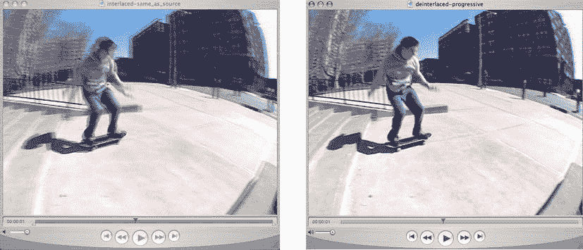

图 7-1。隔行视频素材(左)和逐行视频素材(右)之间的视觉差异

FPS

*每秒帧数* (FPS) 是组成整个视频序列的单个视频帧。可以把这想象成一组图像组成一秒钟的视频。当你还是个孩子的时候，你有没有制作过一本动画书，你在每张纸上画相同的图片，然后稍微调整一下，这样当你翻阅的时候，它就创建了一个无缝的动画。这本质上就是视频在做的事情。如果你还记得《??》第五章中关于 CSS sprite sheets 的讨论，同样的原理也适用于这里。对于去隔行视频，由于混合帧的出现，典型的 FPS 是 23.976 或 29.97，而逐行视频的典型 FPS 是 24 或 30，因为完整的单个图像在没有混合的情况下被渲染。具有大量快速移动动作的视频通常需要更高的帧速率来对抗不想要的抖动效果，如果您正在寻找超清晰的慢动作视频，同样的规则也适用。一些高端相机每秒拍摄几千帧视频，这可以创造出真正令人惊叹的慢动作镜头，用于创意。同样，对于 web 回放，您通常希望使用 24 或 30 FPS。

长宽比

与图像非常相似，视频也有宽度属性和高度属性。在视频中，很像图像，保持原始尺寸的比例很重要。在视频中，*长宽比* 是其宽度和高度的比例关系。网络视频中最常见的宽高比是 16:9 的宽屏格式和 4:3 的标准格式。这种比例关系与视频中像素的大小直接相关，因为像素可以是正方形或长方形。你会经常听到这被称为“16 乘 9”或“4 乘 3”保持您正在转码的视频的宽高比很重要，因为这将保持源视频资源和转码后的文件之间的一对一关系。但是，在某些情况下，您的创意会要求您将视频资源调整到非 16:9 或 4:3 设计的大小。在这种情况下，您将使用一种称为*信箱*或*信箱* 的技术，在分配的视频空间中的空白区域添加黑条。图 7-2 展示了一个比例正确的视频，其中应用了 16:9 和 4:3 宽高比的信箱和边框。


图 7-2。信箱视频和 pillarbox 的区别

最常见的情况是将视频提供给不同大小的广告单元或出版商的视频播放器。如果广告商的视频资源是 16:9，播放器环境是 4:3，您会注意到视频顶部和底部有黑条或信箱，以保持视频的比例。

工具

在我深入探讨视频编解码器这个大话题之前，你可能想知道为什么在使用 HTML5 时要学习所有这些与视频相关的信息。嗯，视频是目前在线广告中最流行的媒体，确保最佳的视频播放将赢得你的客户。因此，我将介绍需要了解的不同视频属性，以及该领域需要关注的不同编解码器/格式。这一切都归结于为分散的浏览器空间开发和交付最佳的 HTML5 视频。在开始实现之前，让我们看看一些创建 HTML5 视频的工具。

为什么会有所有这些不同的视频设置、变化以及分散的浏览器和设备支持？嗯，专利、版税(即金钱)和压缩质量是阻止某些东西开源和免费使用的原因。我喜欢这样想:每当你有一个真正伟大的产品，你通常会收费使用它，即使有免费的替代品。例如，你为有线电视付费，因为它质量更好，提供更多的频道，而不是标准的空中天线广播，在空中天线广播中，你只能收到有限的频道，而且广播质量很差。目前，如果你想将你的视频内容部署到最广泛的用户群，你需要在 HTML5 空间中容忍这些碎片化的编解码器和视频格式。有许多工具可以帮助你提供在线视频服务。其中许多都是用来转换视频成适当的格式使用免费或购买的程序在您的电脑上。这包括但不限于开源的 FFMPEG([`ffmpeg.org`](http://ffmpeg.org))、FireOgg([`firefogg.org`](http://firefogg.org))、QuickTime Pro([`apple.com/quicktime`](http://apple.com/quicktime))和 Adobe Media Encoder([`adobe.com/products/mediaencoder.html`](http://adobe.com/products/mediaencoder.html))，甚至更强大的视频应用，如 Adobe After Effects([`adobe.com/products/aftereffects.html`](http://adobe.com/products/aftereffects.html))、Avid([`avid.com`](http://avid.com))和 Apple Final Cut Pro([`apple.com/finalcutpro`](http://apple.com/finalcutpro))。

到目前为止，FFMpeg 是最健壮的，而且它是开源的，这意味着你可以轻松自由地通用转码/编码成各种不同的格式。这个工具可以将任何视频和音频格式转换成适合各种屏幕的格式。如果你习惯使用命令行，我强烈建议你使用 FFMpeg。这很可能是目前最强大的视频转换工具。此外，还有许多用于转换不同格式的插件和库。请务必咨询您的发行商，因为他们需要为他们的播放器提供一定大小的视频资源，并确保经常检查他们的规格并正确调整。

视频编解码器

现在，您已经了解了视频编码和转码的内容，我将谈谈您可以随意使用的视频编解码器，以及在利用 HTML5 视频时您将使用的编解码器。编解码器可能会有点混乱，因为有太多的编解码器可供选择，并且都有一定的变化和浏览器支持。一个*视频编解码器*是根据您的需要压缩视频的软件，正如您刚刚了解到的所有先前的视频属性，所有这些都可以使用视频特定编解码器进行配置。

本节并不打算让您成为视频编解码器方面的专家，但它会让您知道下次想要在您的活动中包含 HTML5 视频时，以及当您遇到来自各种创意机构的视频素材时，应该注意什么。编解码器具有特定的浏览器和设备支持，并且需要一个耗时的过程来向多个用户正确传送视频。图 7-3 展示了过去 12 年间视频编解码器的激增。

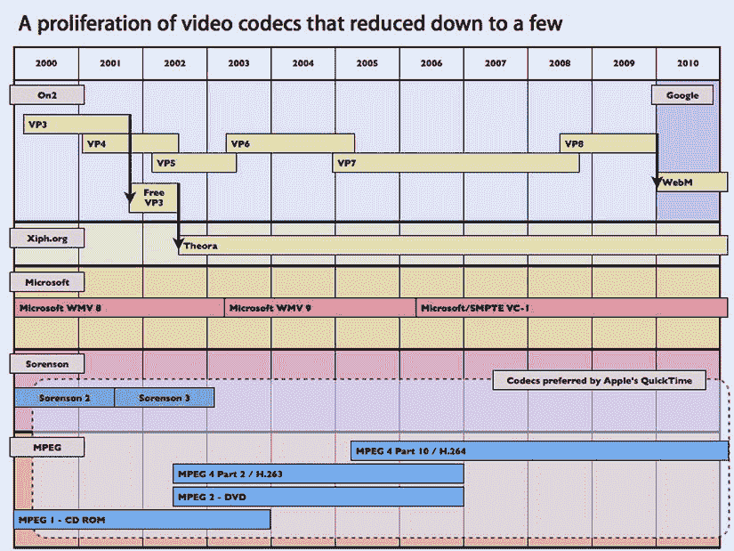

图 7-3。浏览器和制造商支持的各种视频编解码器(来源:【http://appleinsider.com】??

这可能看起来令人困惑，但正如您所看到的，大多数编解码器来了又去，就像许多其他技术一样，在本节的剩余部分，我将只讨论在今天的 HTML5 视频市场上仍然显而易见的编解码器技术，它们是 MP4 (H.264)、WebM (VP8)和 OGV (Theora)。我将排除 VC-1，因为在撰写本文时，没有浏览器支持这种编解码器/包装器变体。

H.264

我现在将讨论可能是现代网络上最流行的视频编解码器，MPEG 的 H.264 。H.264 编解码器是一种高度优化的编解码器，可提供最高的压缩率，对整个视频的质量几乎没有影响。H.264 可以在相对较低的比特率下提供很好的有损质量。H.264 带有许多可调整的参数和功能，事实上如此之多，如果你查找 H.264，你会对这种编解码器的能力感到惊讶。但是，您需要特别注意它的配置文件，即基线、主和高。某些设备(如旧款 iPhones 和 iPod touches)只能支持基本配置文件，而其他高端设备(如台式电脑和蓝光播放器)支持主配置文件到高配置文件。配置文件的级别是在 1 到当前的 5.2 之间的范围内测量的，随着配置文件级别的增加，比特率和通常的质量也会增加。

 **注**要了解更多 H.264 视频，我建议在[`sonnati.wordpress.com`](http://sonnati.wordpress.com)阅读法比奥·索纳蒂的作品。

H.264 由苹果、微软和各种其他大公司大力推动，目前苹果、微软和谷歌在其各自的浏览器中支持 h . 264，尽管谷歌已经提到它将停止对编解码器的支持，以支持其 VP8 替代方案(在下一节中对此有更多介绍)。然而，在撰写本文时，谷歌仍然在 Chrome 版本中支持它。此外，Mozilla 甚至讨论过支持 H.264，因为缺乏对其支持的开源编解码器 Ogg Theora 的支持(下一节将详细介绍)。H.264 在其称为 X264 ( [`x264.nl`](http://x264.nl) )的复杂编码算法上也有免版税的开源版本。

苹果公司是 H.264 编解码器的主要支持者，因为这是其 Safari 浏览器中唯一支持的编解码器，建议通过 Safari 为 iDevices 提供如图图 7-4 所示的编码设置。

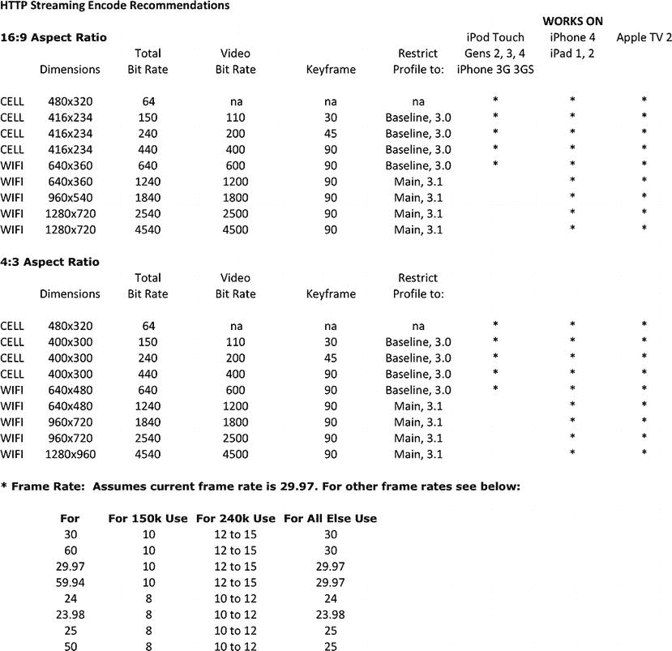

图 7-4。苹果对 iOS 设备的编码建议

当您将视频部署到移动 iOS 设备时，关注这张图表非常重要。因为就像整体视频景观在编解码器中被分割一样，苹果自己的设备需要进行特定的调整，以补偿其旧设备，如 iPhone 3G，更不用说 WiFi 和手机网络连接了。这只会增加开发跨屏幕和设备部署的视频的时间。

请记住，H.264 不是自由软件；它由许多不同的公司拥有和申请专利，包括微软，它由一个名为 MPEG-LA 的财团管理。苹果公司为其生产的每一台可以编码和解码 H.264 视频的电脑、设备、相机和配件支付许可证。下次你购买苹果产品的时候考虑一下这个问题，因为你支付的一部分是使用 H.264 技术的能力。

VP8

HTML5 视频领域另一个流行的编解码器是 VP8 。曾经是 On2 的一项技术，后来被 Google 收购，被重新命名为 WebM 编解码器。谷歌一直在推动这一事实上的编解码器，在现代浏览器中使用 HTML5 传输视频时使用。然而，要使它完全成形，浏览器厂商需要采用它作为他们视频需求的标准。正如你刚刚了解到的，苹果和微软并没有太多地采用 WebM，因为他们长期支持 H.264。VP8/WebM 在编码算法和质量上与 h . 264 相当，但更重要的是它没有许可成本，这是开放 web 标准和支持它的浏览器(如 Firefox、Chrome 和 Opera)的巨大胜利。

西奥拉

H.264 虽然是开放标准，但并不是免费的。它是基于各种公司贡献的视频压缩和相关技术专利池，以换取“公平、合理和非歧视性”的许可费。Mozilla、Opera 和其他自由和开放源码的倡导者反对使用任何可能需要许可费的技术来生产或分发网络内容，因为否则将违背他们对开放网络的支持。正因为如此，除了 VP8 之外，他们还依赖于一种开源视频压缩技术，即 Xiph 基金会的 Theora。关于 H.264 的 Ogg Theora 战争结束了，HTML5 工作组成员同意，不要将 Ogg Theora 或 H.264 或任何其他东西定义为通过 HTML5 视频标签提供的视频的“基线”编解码器，而是应该由市场和网络用户及互联网广播公司投票决定(这显然造成了碎片化)。Theora 是早期版本的 Flash Video (FLV)中使用的旧 VP3 编解码器。他们采用了旧版本并加以改进。效率不如 H.264，但开源了。

从历史上看，HTML 总是与其他类型的图像媒体文件一起工作；没有基线图形格式。例如，开发人员自己决定是使用 GIF、JPEG 还是 PNG 格式。现代浏览器都支持它们，在我看来视频也应该效仿。

GOP 和关键帧

在压缩技术中，你有所谓的一组图片(GOP) 。该组由关键帧间隔决定。如果您曾经做过 Flash 动画或任何基于时间轴的动画工作，您会知道关键帧是重要事件发生的重要时间点。在视频压缩中，这些是视频回放中的点，在这些点上，编码/转码引擎有机会休息并重新分析视频内容，以确保其与编码过程的其余部分保持一致。有些编解码器支持不同的压缩算法 ，如 I、P 和 B 帧。

*   *I 帧*:这是压缩率最低的帧，但不需要其他帧解码。
*   *P 帧*:使用前一帧的信息进行解压缩。
*   *B 帧*:这使用视频的前一帧和前一帧来获得参考，并获得最高的智能压缩量。

图 7-5 显示了不同帧类型的视频关键帧。如果您的客户要求您使用 HTML5 视频元素为各种屏幕优化他们的视频内容，请记住这些信息。但是，请注意，某些编解码器仅允许特定的关键帧设置。


图 7-5。压缩的 I、P 和 B 帧

有趣的是，压缩技术决定了编码文件的整体质量和大小；人们经常担心视频的大小，但实际上是大小加上时长。例如，如果您有一个 6MB 的文件，视频持续时间为 1 分钟，这意味着每 10 秒钟的视频就有 1MB 的数据。如果一分钟的视频有 60MB 的文件，那么每 10 秒钟就有 10MB 的数据，即每秒 1MB。所以，你需要在视频的大小和时长之间找到一个好的平衡点。一些机器和解码器根本不够快，无法以如此快的速度解码视频帧。如果数据速率太高而无法处理，你经常会看到机器在播放时被卡住；其他有足够的权力将处理它没有问题，并提供惊人的播放质量。这也是为什么更高端的显卡被用于专业视频编辑设备，以处理高数据速率。然而，对于 Web 和 HTML5 视频，在大小和持续时间之间保持良好的关系，尤其是在向手机和平板电脑等系统资源比台式机慢的设备交付时。

第十六章的规则

关于视频代码转换，最后一点需要注意的是“16 规则”如果您还没有，您会发现在为 Web 创建视频时，处理不同大小的视频资源并需要转码为不同的大小会有很多时间。我之前提到过，视频编码领域有一门科学，没有人比视频专家罗伯特·莱因哈特更擅长这门科学。据我所知，莱因哈特是第一个为这一规则命名的人。基本上，在高层次上，它分解了当执行代码转换作业时以及当机器解码视频以进行播放时，视频应该被转换成的最佳大小。如果你看一下图 7-6 ，你会注意到视频编码最好以 16 的倍数进行，质量会下降到 8(更好)和 4(好)。

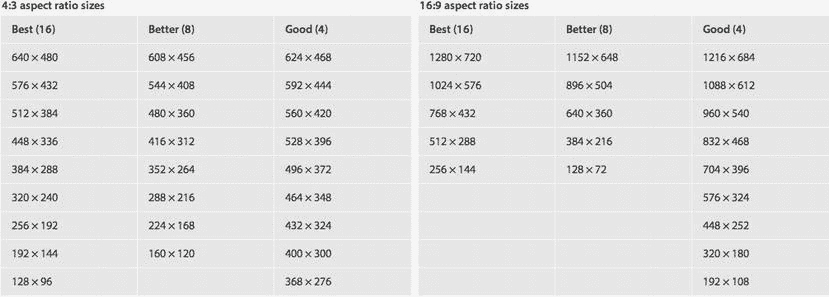

图 7-6。 Robert Reinhardt 的图表用于优化视频大小

Reinhardt 的发现揭示了当帧宽度和高度使用 16 的倍数时，视频表现最佳。当您对下一个视频进行转码时，请记住这一点，虽然您可以使用任何宽度，但非最佳尺寸可能会导致质量下降和丢帧，并会对解码回放造成不必要的负担。为了保持最佳输出，您应该始终使用 16、8 或至少 4 的倍数的宽度和高度。倍数越低，质量和性能受到的影响就越大。一个非常好的书签工具是 Reinhardt 在 http://videorx.com/video-sizer 的视频分级器。此工具允许您插入您的数字，并在使用所需设置时获得关于转换工作好坏的即时反馈。如果你有兴趣了解更多关于编码、转码和压缩技术的知识，我强烈推荐你访问他的网站(【http://videorx.com/】??)。

包装纸

您已经了解了您需要了解的关于视频编解码器的知识，所以现在我将介绍支持每种类型的文件格式。容器格式，或*包装器*，是存储视频信息的文件格式。这是典型的 MOV、AVI 和 FLV 文件格式。这些容器都包含编码的视频信息以及关于文件的基本元数据信息。视频的包装很像图像的 PNG、JPEG 和 GIF 文件。事实上，它们在 HTML 标记中是如此的相似，如果你知道如何使用 img 标签，在你的浏览器中包含视频是非常简单的。

MP4

MP4 是大多数 HTML5 浏览器的常见网络视频格式，如苹果的 Safari、微软的 Internet Explorer 以及目前的谷歌 Chrome。如前所述，它实际上是容纳 AVC/H.264 编解码器的容器格式。对于这种容器类型，文件扩展名会有所不同，可以包括 M4P、M4V，甚至 Adobe 的 F4V。图 7-7 显示了撰写本文时当前的浏览器支持。

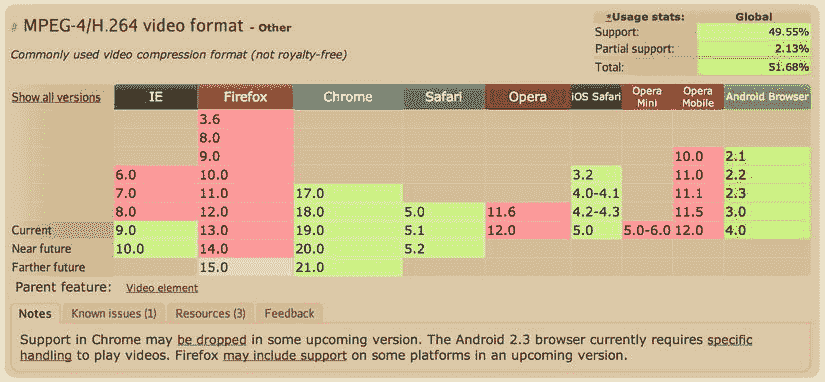

图 7-7。当前浏览器对 H.264/MP4 视频的支持(来源:【http://caniuse.com】??

MP4 是处理 HTML5 视频时的常用格式。事实上，根据我的经验，这是你最终要处理的最常见的形式，尤其是在移动设备上运行的广告活动中。广告商将希望瞄准市场上越来越多的苹果 iPhones 和 iPads，将 MP4 与 H.264 结合使用是实现这一目标的唯一途径。

 **注意**移动视频通常在设备的原生视频播放器中播放，而不是在浏览器中。

WebM

另一种视频容器格式是 WebM ，如你所知，它包含了 Google 的开源 VP8 编解码器。简单来说，WebM 可以提供与 MP4 视频一样的质量，而不需要在微软和苹果浏览器上的渗透。此外，如果你关心支付版税或许可费，WebM 格式是你最好的选择，因为它没有专利。WebM 是为 Web 设计的，旨在缓解开放 Web 上的视频问题。谷歌试图提供一种高质量和高效的编码工具，任何人都可以免费用于他们的网络内容，谷歌正在积极努力使 WebM 成为通过 HTML5 视频标签在线提供音频和视频的开源标准。在撰写本文时，[`caniuse.com`](http://caniuse.com)概述了对 WebM 格式的支持，如图图 7-8 所示。

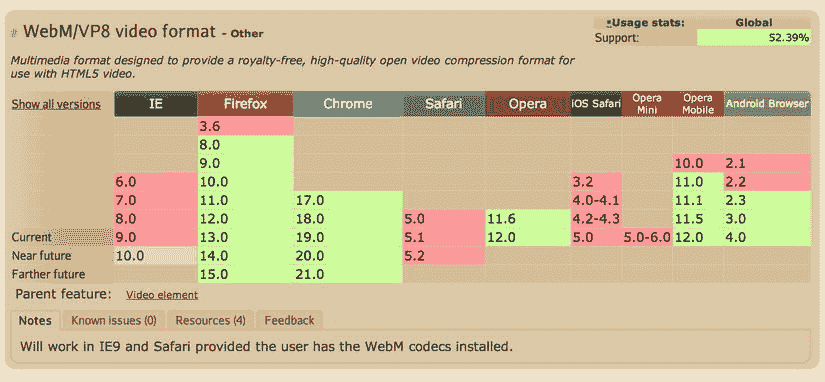

图 7-8。当前浏览器对 VP8/WebM 视频的支持(来源:【http://caniuse.com】??

如果你有兴趣了解更多关于 WebM 视频容器格式的信息，我建议你访问谷歌位于 http://webmproject.org/docs/container 的 WebM 网站。请记住，任何提供给 Chrome、Firefox 和 Opera 用户的视频广告都可以安全地依赖这种格式。

 **注意**安装了 VP8/WebM 编解码器的用户将能够在 Safari 和 IE 上观看视频。

格式

最后，还有 OGG 视频格式 。OGG 是一种开放容器格式，由开源基金会 Xiph 管理。仅举几个例子，OGG 的容器格式包括 OGG、OGV 和 OGA。基于 Theora 的视频压缩算法和 Vorbis 的音频压缩算法，OGG 旨在创建一个真正开源的视频编解码器/包装器，供任何人使用，而不管版税或许可权。很像前面的例子，图 7-9 概述了浏览器对 OGG 视频格式的支持。

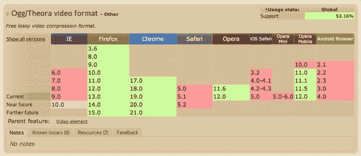

图 7-9。当前浏览器对 http://caniuse.com/OGG 视频的支持(来源:

从这些图表中，我想你可以清楚地看到，在 HTML5 视频编解码器支持方面，谷歌 Chrome 是最强大的功能丰富的浏览器。然而，当使用 HTML5 视频时，您的大多数客户都希望跨所有浏览器访问，尽管对 HTML5 视频元素的支持几乎是 100%，但填充该元素的视频编解码器/格式仍然非常零碎，这要求您开发所有这些格式以实现跨浏览器渗透。是的，这确实是一个非常耗时的过程。

为了同时支持 HTML5 兼容浏览器和旧版本浏览器，建议您使用浏览器和设备检测，并通过在视频元素中包含 embed 或 object 标签来优雅地降级到替代视频体验，例如 Flash 故障转移，如下所示:

```html

<video controls height='640' width='360'>
<source src='yourVideo.mp4' type='video/mp4' />
    <source src='yourVideo.webm' type='video/webm' />
    <! -- Flash Code Here -->
    <embed src='yourVideo.flv' width='640' height='360' quality='high' type='application/x-shockwave-flash'></embed>
</video>
```

通过将闪存故障转移代码包含在视频标签中，如果浏览器无法识别视频标签，它将忽略该视频标签并使用闪存代码。相反，支持视频元素的浏览器不会呈现视频标记中的部分，在本例中是 Flash 嵌入代码。

阿尔法支持

*Alpha 视频* 是视频的透明部分。通常，视频将在绿色或蓝色屏幕上拍摄，然后在后期制作中使用*键*，即移除绿色或蓝色背景元素。完成抠像后，视频将被导出到支持 alpha 透明度信息的视频编解码器和格式。这在覆盖页面内容或在广告视频内容和发布者页面内容之间提供无缝集成的视频中很常见。图 7-10 显示了苹果的 QuickTime (QT) 7 Pro 中的编解码器“animation”以及 millions+的设置，millions+代表百万种颜色；另外，视频中保留了 alpha 信息。如果您从客户或代理处获取视频文件，最好使用 Apple 的 QuickTime 打开视频，然后按 Command+I(对于 Mac)或 Control+I(对于 Windows ),这将打开 QT 检查器面板。

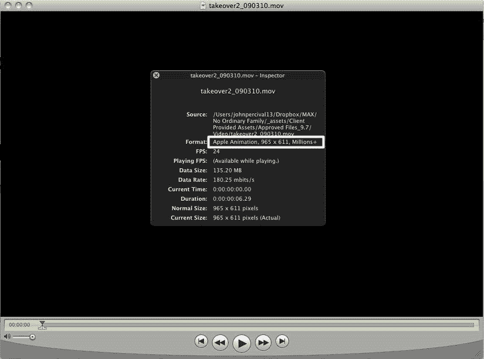

图 7-10。苹果 QuickTime 播放器中的百万+信息

这种抠像技术会剔除所有具有相关颜色值的像素，这是您每天都会看到的，甚至可能不会注意到的。事实上，你有没有碰巧看到昨晚的天气预报？嗯，气象学家很可能站在一个绿色屏幕前，而不是一张实际的地图前。这里需要理解的重要一点是，这是任何媒体中视频的一个巨大的功能部分，当然还有在线媒体。在前沿广告活动中，在发布者页面上放置视频(无论是否互动)是必不可少的。一些最具创新性的主屏幕收购通过使用 alpha video 取得了很好的效果。

然而，在 HTML5 视频支持中，目前没有支持 alpha 通道的跨浏览器编解码器/包装器——没有 H.264、VP8 甚至 Vorbis。只有 VP8 显示出未来可以处理支持的承诺，但它仅限于在某些浏览器上工作，最重要的是，苹果的 Safari 没有显示出支持它的迹象，这是对移动设备整体市场份额的巨大损失。很明显，这是一个很大的问题，很快就会得到解决，但在此期间，设计人员和开发人员需要利用 HTML5 的 canvas 元素，在播放期间将视频中的位图数据写入 canvas 元素，并在那里输入像素。你可以在 http://jakearchibald.com/scratch/alphavid 的或者 http://github.com/m90/jquery-seeThru 的[找到一个很好的例子。虽然没有真正的 HTML5 视频编解码器支持 alpha 信息，但对最终用户的影响基本相同；但是，请记住性能，因为通过组合两个元素将视频信息写入 canvas 元素，您实际上使浏览器的负载加倍了。在此期间，直到 HTML5 视频本身支持处理阿尔法信息的编解码器；您可以随时回切以使用 Flash Player，因为自 2005 年以来，它就通过 VP6 编解码器支持此功能。](http://github.com/m90/jquery-seeThru)

视频传输

所以，你现在知道在网络上对视频进行编码和转码需要做多少工作了；我现在将谈论在网络上实际传送视频。HTML5 视频最大的问题之一是它的交付。传统上，Flash 广告会从流媒体服务器上下载视频，以避免在广告的整体 k 权重中产生任何视频文件大小。然而，对于 HTML5，我们目前受限于标准的流媒体解决方案，正因为如此，大多数通过桌面和移动交付的 HTML5 视频仍然使用基于 HTTP 的渐进式下载作为主要交付方法。虽然这种方法在所有浏览器中都得到了广泛的支持，但它不可避免地会增加广告的权重，并通过更长的“等待”时间来影响用户的体验。当更大尺寸和更高质量的视频素材(HD)的视频比特率增加时，这也变得越来越糟糕。

在视频创作和交付的庞大世界中，最终要定义你想要接触的目标用户群(在广告中通常是每个人)、你可支配的资源以及客户周转时间。在操作上，转换所有不同风格的视频可能是一项非常耗时的任务，因为浏览器和设备需要不同的编解码器和格式。以下部分将帮助您了解该领域当前的问题，如何解决这些问题，以及如何在符合 HTML5 的视频播放器中有效地交付您的内容。

通过视频广告网络和出版商的交付规格可能会很棘手。每个出版商和网络都有自己的规范，这增加了这个领域的混乱。这些规范通常是为了确保对最终用户的影响较小，并确保视频内容达到最大范围，同时尽可能与发布者的视频内容相匹配。以下部分涵盖了当今网络上视频传输的两种方式。

进步分子

*渐进式*视频传输是指文件从一台服务器上传下来，并存储在客户端以供播放。渐进式交付是一种非常常见的视频传输形式，因为它可以被所有浏览器和设备接受，甚至像 YouTube 这样的主要网站每天都在使用这种方法。渐进式可以允许用户在完全下载之前开始观看视频，因此等待时间显著减少，但它也有很大的成本，因为实际文件是缓存在客户端上的。Progressive 通常是通过 HTTP 协议提供的，因为实际的素材存储在客户机上，所以理论上用户可以保存该素材供以后查看。对于广告来说，这不是一个问题，但对于优质的长篇内容，在这方面几乎没有保护，这使得这种交付形式对内容所有者来说不太理想。清单 7-3 展示了一个 HTML5 视频标签的例子；指向 MP4、WebM 或 OGG 等视频资源，您会看到该视频将被逐步下载。

***清单 7-3。*** HTML5 渐进式视频示例

```html
<video autoplay src='http://cdn.someSite.com/someVideo.mp4'></video>
```

如你所见，我正在通过 HTML5 视频源从 someSite.com 的服务器上下载 MP4 视频资源。如果要将这一行代码插入到文本编辑器中，请将其保存为。html 文件，并在浏览器中打开它，您就可以看到视频自动播放。(请记住，您需要更新您的视频 src 属性，以指向实际视频所在的位置。).虽然这种方法在广告场合不太理想，但 IAB 为视频文件大小设定的规范是 2.2MB。有关富媒体指南的更多信息，请访问 www.iab.net/displayguidelines。

流动

接下来，我将讨论第二种网络视频传输形式。*流式传输*交付是指视频素材由流式服务器提供，并根据用户请求实时呈现给用户。由于素材没有存储在客户端的机器上，流媒体是保护优质内容以及规避发行商文件大小限制的理想选择。出版商和广告服务器可能需要使用流式视频，因为它不会像渐进式下载那样影响广告单元的整体文件大小。常见的流服务器协议是实时消息协议(RTMP) 。这种服务器协议最初由 Macromedia 开发，后来被 Adobe 收购，它支持内容保护加密和 HTTP 隧道以穿越防火墙限制。也存在许多其他流媒体服务器，如苹果 QuickTime 流媒体服务器，但它们的运行和操作都非常昂贵，除非你是一家专注于视频传输的大公司。如果你是 Hulu 或网飞这样的主要内容提供商，流媒体服务器或多或少是保护你的内容免受下载和盗版以及提供良好用户体验的必要条件。

客户可能会要求您进行实时直播，例如在通过网络传输的同时拍摄视频并压缩视频。这在体育、政治和新闻等公开广播的重大事件中很受欢迎。Influxis([`influxis.com`](http://influxis.com))等公司使用基于 Adobe Media Server(正式名称为 Flash Media Server)的技术使这变得非常简单，Adobe Media Server 支持将视频流传输到 Flash 播放器和 HTML5 视频播放器。然而，请记住，也有免费的替代产品，如 UStream、JustinTV 等，但它们不提供与付费服务相同的支持、质量和服务。

从用户体验的角度来看，流媒体也是相当困难的，因为用户不能像渐进式文件那样准确地浏览时间线。这是因为播放器需要使用用户想要的更新来 ping 流媒体服务器，并且因为信息不存在于客户端(像 progressive)，所以需要在用户放下视频播放头时发出请求，这产生了一些不需要的视频缓冲。

还有所谓的 HTTP 上的*自适应流*，它基本上通过标准 HTTP 协议传输小块视频信息，但我将在下面的部分中更详细地讨论这一点。

自适应流式传输

带宽在网络上是一个至关重要的问题，你需要知道你用了多少带宽来通过 HTML5 进行视频传输。越来越多的设备正在访问信息，作为开发人员和设计人员，我们需要尽可能节省带宽，尤其是在通过各种网络连接提供较大文件时。作为广告客户，您需要考虑到用户可能正在无线设备上通过较差的蜂窝网络连接查看内容，或者更糟的是离线查看内容。幸运的是，使用复杂的编程技术；开发人员可以利用带宽检测，并在最终用户请求时向其提供适当的视频文件，同时在用户连接中断时限制播放。

我现在将介绍*自适应比特率流* 。这项技术算不上新技术，但通过检测和适应各种条件来提供高质量的视频体验比以往任何时候都更重要。在自适应比特率流中，服务器 pings 请求内容的用户，并了解用户可以处理视频回放和比特率质量的级别。之前，我讨论了视频文件的比特率以及比特率如何保存视频素材的所有信息。一旦收集了关于用户处理视频内容的能力的信息，就如描述或清单文件所描述的那样传送适当比特率的视频。这个过程发生在整个视频回放过程中，并且随着带宽的增加或减少而适应或改变。这为最终用户提供了一个无缝的回放，无论连接质量如何，这是一个对长格式内容非常重要的功能，尤其是在移动设备上。典型的使用案例从较低比特率的视频开始，随着带宽被检测到并被发现更加充足而逐渐增加。这个上升时间可能需要几秒钟，所以短格式内容可能看不到效果。

现在，您已经了解了自适应比特率的基础知识，让我们深入了解支持它的各种技术，以及如何在 HTML5 视频工作流中利用每项技术。请记住，视频流可能还没有标准，但当您知道您的广告将针对特定的浏览器和设备时，我们鼓励您使用这些技术。

流媒体

HTTP Live Streaming (HLS) 是 Apple 的规范，用于以 M3U8 文件的方式通过 HTTP 传输视频文件的片段(传输流)。苹果的开发者工具包括一个媒体分割器，这是一个命令行工具，供 Mac 用户分割和创建他们想要使用的视频素材的清单文件。清单 7-4 指示媒体文件分段器([`developer . apple . com/library/IOs/# documentation/networking internet/conceptual/streaming media guide/UsingHTTPLiveStreaming/UsingHTTPLiveStreaming . html`](http://developer.apple.com/library/ios/#documentation/networkinginternet/conceptual/streamingmediaguide/UsingHTTPLiveStreaming/UsingHTTPLiveStreaming.html))在您的位置获取一个 H.264 文件，并将输出分段到一个 M3U8。M3U8 文件只是一个描述文件，指示 HTML5 视频播放器如何播放视频片段以及特定的视频元数据。在本例中，将段和 M3U8 文件保存在您想要的目标位置，每个块的目标持续时间大约为 17 秒。

***清单 7-4。*** 媒体分割器示例

```html
mediafilesegmenter Your/File/Location.mov -t 17 -f Your/File/Destination.m3u8
```

由于媒体文件被分割成更小的“块”或片段，因此视频资源的传送是突发的，而不是一个大的渐进式下载，这改善了整体回放体验。这在 HTML5 广告中对您的意义在于，您现在不是定位源资源，而是在您的视频源属性中定位 M3U8 文件。基于前面的命令，清单 7-5 展示了一个清单文件的输出，该文件被称为 M3U8 文件。

***清单 7-5。*** M3U8 举例

```html
M3U8 File:
#EXTM3U
#EXT-X-TARGETDURATION:18
#EXT-X-VERSION:3
#EXT-X-MEDIA-SEQUENCE:0
#EXT-X-PLAYLIST-TYPE:VOD
#EXTINF:16.984,
fileSequence0.ts
#EXTINF:17.017,
fileSequence1.ts
#EXTINF:16.95,
fileSequence2.ts
#EXTINF:17.017,
fileSequence3.ts
#EXTINF:16.95,
fileSequence4.ts
#EXTINF:17.017,
fileSequence5.ts
#EXTINF:16.95,
fileSequence6.ts
#EXTINF:17.017,
fileSequence7.ts
#EXTINF:16.984,
fileSequence8.ts
#EXTINF:16.316,
fileSequence9.ts
#EXT-X-ENDLIST

HTML5:
<video src=index.m3u8></video>
```

如您所见，M3U8 文件按顺序描述了所有视频传输流以及传输流(TS)资源的相对路径。请注意，这些可能是到另一个位置的绝对路径，甚至是远程的另一台服务器上的路径。注意这一点很重要，因为您可以在 M3U8 清单中动态插入视频广告。

由于这是苹果公司的定义，而不是一个开放的网络标准，采用仅限于某些设备和浏览器；然而，在最近的新闻中，Adobe 展示了 Flash Player 10.1 中对 HLS 的支持，因此如果您的目标是 HTML5 的 Flash Player 回切，您可以使用相同的交付机制。要查看 HLS 的良好示例，请访问 Wowza 在[`wowza.com/html/iphone.html`](http://wowza.com/html/iphone.html)的示例。

 **注**在撰写本文时，HTML5 HLS 支持仅在 iOS、Safari、Android 3.0+中。

快速交货服务（Hot Delivery Service 的缩写）

说到 Adobe 对 HLS 的支持，Adobe 也支持自己的通过 HTTP 传输视频的规范。Adobe 的解决方案叫做 HTTP 动态流(HDS) 。Adobe 有自己的清单规范，用于通过 HTTP 向其开源媒体框架(OSMF)提供视频数据包。与 HLS 非常相似，HDS 需要一个视频资源(MP4)和一个清单文件，即 F4M 文件。

下面是 F4M 清单文件的一个例子；请注意，该文件只是一个简单的 XML 模式，其中有一个基本文件节点，其中包含一个媒体和不同媒体 URL，用于不同比特率的各种视频。

```html

<?xml version="1.0" encoding="utf-8"?>
<manifest FontName3">http://ns.adobe.com/f4m/1.0">
    <id>videoRx.com :: Adaptive Bitrate Video Player</id>
    <mimeType>video/mp4</mimeType>
    <baseURL>rtmp://hosted.videorx.com/vods3</baseURL>
    <media url="vid1.mp4" bitrate="385" width="364" height="156" />
    <media url="vid2.mp4" bitrate="508" width="436" height="184" />
    <media url="vid3.mp4" bitrate="651" width="506" height="214" />
    <media url="vid4.mp4" bitrate="1030" width="646" height="274" />
    <media url="vid5.mp4" bitrate="1487" width="858" height="364" />
</manifest>
```

 **注意**在撰写本文时，只有 Windows 和 Linux 操作系统支持 Adobe file packager for HDS。

平滑流式传输

既然你已经看到了苹果和 Adobe 通过 HTTP 传输视频内容的规范，让我们来看看微软的平滑流规范。清单 7-6 展示了为 Silverlight、Windows Media Player 和其他能够平滑流式传输的设备生成自适应流式传输的清单文件。

***清单 7-6。*** 微软的流畅流媒体例子(来源:[Silverlight.net](http://Silverlight.net))

```html
<SmoothStreamingMedia
  MajorVersion="2"
  MinorVersion="0"
  Duration="5964800000">
  <StreamIndex
    Type="video"
    Chunks="299"
    QualityLevels="3"
    MaxWidth="368"
    MaxHeight="208"
    DisplayWidth="368"
    DisplayHeight="208"
    Url="QualityLevels({bitrate})/Fragments(video={start time})">
    <QualityLevel
      Index="0"
      Bitrate="477000"
      FourCC="WVC1"
      MaxWidth="368"
      MaxHeight="208"
      CodecPrivateData="250000010FC38E0B70678A0B7819E80450808E8E7474400000010E5A67F840" />
    <QualityLevel
      Index="1"
      Bitrate="331000"
      FourCC="WVC1"
      MaxWidth="284"
      MaxHeight="160"
      CodecPrivateData="250000010FC38A08D04F8A08D813E80450808A1950CF400000010E5A67F840" />
    <QualityLevel
      Index="2"
      Bitrate="230000"
      FourCC="WVC1"
      MaxWidth="224"
      MaxHeight="128"
      CodecPrivateData="250000010FC38606F03F8A06F80FE80450800704704DC00000010E5A67F840" />
    <c n="0" d="19999968" />
    <c n="298" d="4166661" />
  </StreamIndex>
  <StreamIndex
    Type="audio"
    Index="0"
    FourCC="WMAP"
    Chunks="299"
    QualityLevels="1"
    Url="QualityLevels({bitrate})/Fragments(audio={start time})">
    <QualityLevel
      Bitrate="64000"
      SamplingRate="44100"
      Channels="2"
      BitsPerSample="16"
      PacketSize="2973"
      AudioTag="354"
      CodecPrivateData="1000030000000000000000000000E00042C0" />
    <c n="0" d="22755555" />
    <c n="298" d="4992290" />
  </StreamIndex>
</SmoothStreamingMedia>
```

为了节省空间，我删除了 0 到 298 之间的段，但是在本例中，您可以看到，这种格式将媒体分成流索引，其中类型为视频或音频。同样，您应该看到不同交付规范之间的趋势，因为它们都依赖于某种形式的指令或清单文件。

 **注意**某些活动可能需要流畅的流媒体才能使用。这通常是对 Silverlight 播放器、Windows Phone 7 和 Xbox 游戏机的微软视频广告的要求。

MPEG-DASH

从前面的例子中可以看出，通过 HTTP 传输视频的碎片越来越多，竞争越来越激烈。当开放的网络世界寻找一站式 HTTP 交付解决方案，以满足来自 Adobe、微软和苹果的所有平台和浏览器时，DASH promoters group([`dashpg.com`](http://dashpg.com))正准备这样做。目前，该小组正在制定一个标准，希望在市场上获得采用，并成为跨浏览器和设备的普遍解决方案，同时使用 HTML5 视频。

遇见 MPEG-DASH 。DASH 代表 HTTP 上的动态自适应流。该小组在该规范上的工作始于 2010 年，目的是为音频和视频提供一种不可知的交付机制，这种机制需要一个标准清单文件来跨防火墙和直接 HTTP 部署。Adobe、Akamai、微软等公司，甚至思科和三星等设备制造商在行业中的采用越来越强劲。

2012 年，Adobe 和 Akamai 在 NAB 会议上发布了 DASH 在最新 Flash 播放器中工作的示例，这引起了业界的极大兴趣，尤其是对 HTML5 支持的意向。DASH 使用所谓的*媒体呈现描述* 或 MPD 清单来定义其传输流，很像 HLS 中的早期示例清单。DASH 演示文件(MPD)有望成为在 HTML5 浏览器和设备中交付所有视频的全方位解决方案，而不仅仅是 Flash Player。清单 7-7 显示了一个 DASH 清单文件的例子。

***清单 7-7。*** MPEG-DASH 示例

```html
<MPD type="static"  profiles="urn:mpeg:dash:profile:full:2011" minBufferTime="PT1.2S" mediaPresentationDuration="PT0H2M59.23S">
  <Title>MPEG-DASH Example</Title>
 </ProgramInformation>
 <Period start="PT0S" duration="PT0H2M59.23S">
  <AdaptationSet>
   <ContentComponent id="1" contentType="video"/>
   <SegmentTemplate initialization="vid.mp4"/>
   <Representation id="1" mimeType="video/mp4" codecs="avc1.64001f" width="1280" height="720" startWithSAP="1" bandwidth="534520">
    <SegmentTemplate timescale="1000" duration="9750" media="vid.mp4." startNumber="1"/>
   </Representation>
   <Representation id="2" mimeType="video/mp4" codecs="avc1.64001f" width="1280" height="720" startWithSAP="1" bandwidth="812797">
    <SegmentTemplate timescale="1000" duration="9750" media="vid.mp4" startNumber="1"/>
   </Representation>
   <Representation id="3" mimeType="video/mp4" codecs="avc1.64001f" width="1280" height="720" startWithSAP="1" bandwidth="1607936">
    <SegmentTemplate timescale="1000" duration="9750" media="vid.mp4" startNumber="1"/>
   </Representation>
   <Representation id="4" mimeType="video/mp4" codecs="avc1.64001f" width="1280" height="720" startWithSAP="1" bandwidth="3088816">
    <SegmentTemplate timescale="1000" duration="9750" media="vid.mp4" startNumber="1"/>
   </Representation>
   <Representation id="5" mimeType="video/mp4" codecs="avc1.64001f" width="1280" height="720" startWithSAP="1" bandwidth="3861547">
    <SegmentTemplate timescale="1000" duration="9750" media="vid.mp4" startNumber="1"/>
   </Representation>
  </AdaptationSet>
  <AdaptationSet>
   <ContentComponent id="1" contentType="audio" lang="en"/>
   <SegmentTemplate initialization="vid.mp4"/>
   <Representation id="1" mimeType="audio/mp4" codecs="mp4a.40.02" sampleRate="44100" numChannels="2" lang="en" startWithSAP="1" bandwidth="257141">
    <SegmentTemplate timescale="1000" duration="9980" media="audio.m4s" startNumber="1"/>
   </Representation>
  </AdaptationSet>
 </Period>
</MPD>
```

在前面的例子中，您可以看到 MPD 文件实际上只是简单的 XML，概述了视频播放器摄取的指令。您会注意到，在 XML 中，某些节点概括了 DASH player 要解释的指令的表示。DASH 与视频编解码器无关，理想情况下，通过浏览器和设备的采用，MPEG-DASH 将成为通过 HTTP 传输 HTML5 视频的事实标准。如果这种采用，我相信会的，你会看到完全在客户端处理的动态视频广告的非常好的用途。基本上，清单文件实际上只是一个播放列表或描述文件；当观众开始观看开始的几个片段时，描述中后面的片段可以被保留用于目标广告。这将消除在服务器上渲染成千上万的定制视频排列以将它们瞄准正确观众的需要。借助 DASH，可以相当简单地实现真正可寻址的视频内容。

 **注**你会在第十一章中了解到更多关于动态广告的内容。

云服务

你可能会问，“关于视频的编码、转码和交付问题，有这么多讨论，一个组织如何在运营上理解这些问题并实现盈利？”

不用担心，有很多云编码服务 ，如`Encoding.com` (Vid.ly)、Wowza、Zencoder、Akamai 和其他旨在为企业和内容所有者缓解这种视频碎片化的服务。这些服务允许您将源媒体素材上传到他们基于云的服务；然后你选择你想要的目标设备和浏览器，它们处理代码转换和交付过程。可以说，你甚至可以打开“遮光罩”，真正自定义你在本章中学到的视频编码参数，也就是说，如果你觉得这样做足够舒服的话。这些云服务通常位于亚马逊云服务器之上，随着更多的请求进入，它们会启动更多的服务器来处理转码作业。这极大地减少了运行和维护几个服务器的开销，这些服务器在给定时刻可能工作，也可能不工作。如果您正在为一个主要的媒体网络构建一个内容站点，或者是一个希望在所有屏幕上进行部署的内容所有者，那么您会想要看看这些白标解决方案中的一个。有一个外部服务处理你的视频转换成所有正确的格式是一件幸事；它允许你“推卸责任”给你的客户，让你从管理、转换和托管所有视频素材的操作噩梦中解脱出来。这个过程适用于 YouTube、Vimeo、Ooyala、Brightcove 和其他网站。我相信随着更多像开源 WebM 编码和播放器无关的 MPEG-DASH 交付这样的解决方案变得可用，我们作为一个行业将会走出碎片化的困境。我希望几年后我们都能反思这一点，并对我们不得不跨越的部署视频的疯狂障碍摇头。

内容交付网络

如果你希望托管你的素材，而不是让第三方来托管，这些云服务中的大多数会自动将转码后的视频文件传输到你的托管服务器上，并允许缓存到内容交付网络(CDN) 。在 CDN 上存储素材(视频、JavaScript 文件、CSS 文件、图像等)允许素材存储在共享网络上的多个服务器位置。在多个服务器上缓存这些素材被称为*边缘缓存*。本质上，您将素材放在网络的最边缘，因此请求素材的用户不必向离他们太远的位置发出 HTTP 请求。我喜欢维基百科给 cdn 的定义:

CDN 是一个包含数据副本的计算机系统，放置在网络中的不同点，以最大化带宽，通过网络从客户端访问数据。与所有客户端访问相同的中央服务器相反，客户端访问客户端附近的数据副本，以避免该服务器附近的瓶颈。
*来源:维基百科*

你可以在图 7-11 中看到这个过程的可视化。


图 7-11。网络上单个服务器和多个服务器的过程(CDN)

图 7-11 在左边展示了一个服务器如何包含数据，而右边的图像(CDN)有多个数据副本来支持多个用户请求内容。事实上，如果你正在建立任何大型企业视频网络，如 YouTube、网飞或 Vimeo，CDN 将是你的用户的一个要求，因为它将加快视频播放到用户机器的响应时间。

HTML5 视频开发

对于许多浏览器来说，HTML5 video 仍然是一个相对较新的功能，有些技术已经做了很长时间，比如 Flash，浏览器需要花时间来实现规范并获得用户的采纳。很明显，当谈到视频编解码器和交付时，这是一个碎片化的空间，但对于全屏支持和字幕来说更是如此。

全屏 API

全屏 API 是 Flash 和 Silverlight 等插件已经有一段时间的特性，它也正在成为浏览器的一个特性。目前，浏览器中的大多数全屏选项只是将视频对象缩放到浏览器窗口的高度和宽度，而不是接管显示器全屏的预期方法。这是在广告中提供游戏的广告商特别是娱乐客户喜欢的另一个功能，因为它允许用户完全沉浸在内容中，无论是互动游戏还是高清视频预告片。至少可以说，全屏 API 在不同的浏览器厂商中有很大的差异，所以请务必查看 http://caniuse.com/#search=fullsc[的最新信息。](http://caniuse.com/#search=fullsc)

全屏 API 的有趣之处在于，当它被支持时，它应该在 CSS 中包含一个伪类。这里有一个例子:

```html
<style>
            video:-webkit-full-screen {...}
            video:-moz-full-screen {...}
            video:fullscreen {...}
</style>
```

前面的代码允许开发人员和设计人员在全屏模式下自定义视频和广告内容的布局。目前，如果您想对视频或画布元素使用全屏 API，您将需要使用 Webkit 和 Mozilla 的供应商前缀来调用 JavaScript 方法，如下所示:

```html
<script>
someElement.requestFullscreen(); //go fullscreen
someElement.exitFullscreen(); //exit fullscreen
</script>
```

请注意，在 Opera 的新版本中，您不必这样做，因为有本地支持！

字幕和说明文字

HTML5 视频的另一个发展中的功能是所谓的文本轨道 API ，它将允许全球观众访问视频内容。例如，广告和广告商可能希望将其内容的画外音作为字幕，并普遍使用创意元素，这意味着只要字幕使用正确的语言，就可以让单个视频资源在多个位置运行。Google I/O 演示中的图 7-12 显示这可能是一个非常有益的特性。

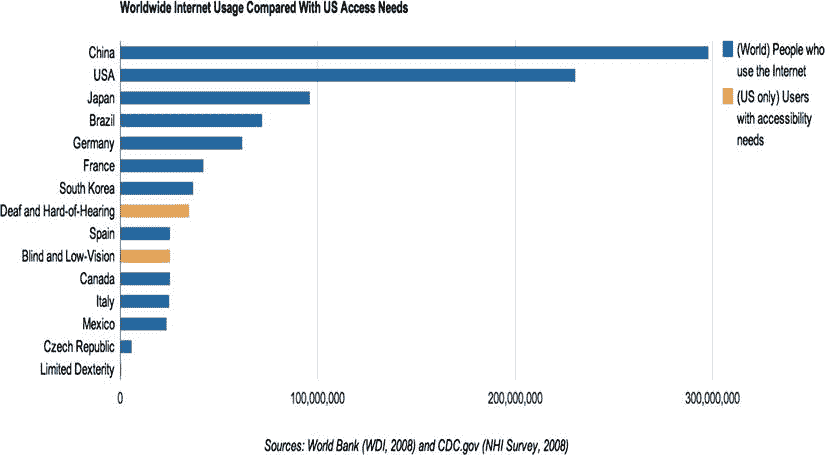

图 7-12。与美国接入需求相比的互联网使用情况

虽然这只是整个市场的一小部分，但我们不应该将这些用户排除在在线体验之外。网络应该为每个人服务！利用字幕的另一种可能方式是在视频播放时包含相关数据。想想基于位置的齿轮报价，并通过字幕文本添加本地化的方向。使用字幕的一个好处是它们是可搜索的，因此内容提供商和出版商也将从 SEO 增长中受益。WebVTT 文件 概述了用于视频解析的描述文件，并收集了回放时应该在屏幕上预设的信息。清单 7-8 演示了 WebVTT 文件格式。

***清单 7-8。*** WebVTT 示例

```html
WEBVTT FILE
0:00:00.000 --> 0:00:02.000
<b>Hello, World!</b>
0:00:03.040 --> 0:00:06.920 T:60% A:middle
Just <i>dropping</i> by to say <i>HELLO!</i>
```

在这段代码中，一个示例 WebVTT 文件在视频回放时显示屏幕上的文本。正如你所看到的，在 0 秒和 2 秒的时间之间，单词“Hello，World”将以粗体文本出现。使用一些基本的 HTML 标记来加粗、倾斜和加下划线，以及使用中间位置，你可以真正地给副标题内容添加一些味道。当前规范允许水平文本位置、对齐和垂直线位置。您甚至可以使用 CSS，通过一个名为 cue 的新伪元素，根据您的喜好来设计标题。参见清单 7-9 了解更多关于如何在 CSS 中实现 cue 元素的信息。

***清单 7-9。*** WebVTT Cue 示例

```html
WEBVTT

1
0:00:00.000 --> 0:00:05.000
<b>Hello, World</b>

2
0:00:05.000 --> 0:00:10.000
How <i>are</i> you <i>,<c.green>Today?!</c></i>

CSS

 <style>
        .green {
            color: green;
            text-transform: uppercase;
        }
</style>

HTML
<video width="640" height="360">
  <source src="someVideo.mp4" type="video/mp4" />
  <source src=" someVideo.webm" type="video/webm" />
  <source src=" someVideo.ogg" type="video/ogg" />
  <track src="helloWorld.vtt" kind="subtitles" srclang="en" label="English" />
</video>
```

 **注意**确保你的服务器的。htaccess 或 [http.conf](http://http.conf) 文件被配置为支持 VTT MIME 类型。请使用 AddType text/vtt .vtt。

使用 HTML5 视频中的 track 标签，您可以显示字幕、副标题和/或关于视频内容的元数据，使用前面的示例，您可以看到您甚至可以将特定的 CSS 规则指向副标题信息。track 元素的文件格式使用一个 WebVTT 文件，浏览器支持目前是有限的，但它即将到来！使用前面的代码，你应该会看到一个类似于图 7-13 的例子。

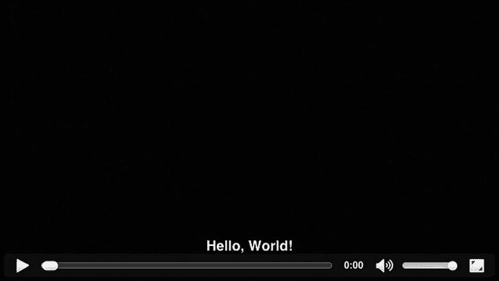

图 7-13。 WebVTT 视频字幕

如果您没有看到这一点，请确保您的浏览器支持 WebVTT 和 HTML5 视频轨道元素；如果你的浏览器两者都不支持，我建议你使用一个很棒的叫做 captionatorjs.com 的 JavaScript polyfill。

这可能是使用网络标准的动态视频广告的巨大进步。真正令人兴奋的是，如果 WebVTT 格式开始支持更多的 CSS 功能，甚至 CSS3 的功能，包括变换和动画，您将有能力在视频上进行一些非常真实的动态内容插入。在那之前，我们只能等待并找出答案。关于 WebVTT 规范的更多信息，我鼓励你访问[`dev.w3.org/html5/webvtt`](http://dev.w3.org/html5/webvtt)，如果你有兴趣了解你的 WebVTT 是否有效，你可以将有用的链接【http://quuz.org/webvtt】?? 加入书签。

 **注意**我将在第十二章中讨论其他新兴的 HTML5 视频功能，如网络摄像头和麦克风接入。

视频测量

如你所知，视频的很大一部分是对广告客户的衡量，这样他们就可以看到他们的活动如何为他们服务。他们通常想知道观众观看视频时视频的表现如何。测量还包括视频开始、完成、四分位数、播放、暂停、重放、声音开/关等。几乎任何用户操作的开关、按钮或开关，广告服务器都会报告。HTML5 视频 API 通过 JavaScript 公开所有这些视频属性，因此附加事件和跟踪调用非常简单。有关所有视频属性的更多信息，请访问[www.w3.org/2010/05/video/mediaevents.html](http://www.w3.org/2010/05/video/mediaevents.html)。

QOS

除了正常的广告服务器报告，广告商还可以将分析引擎嵌入到他们的视频内容和视频播放器中，以实时报告视频的服务质量(QOS)。Akamai 等公司利用其媒体分析工具，这是一种可以捆绑到视频播放器中的 API，因此可以对视频进行实时技术分析。这种分析可以包括服务的最高比特率、带宽和网络连接、每秒帧数，甚至回放帧速率。通过这些测量，公司可以切入可能效率低下的媒体文件，并重新优化以获得更好的用户体验。很多这种 QOS 与视频的“垃圾输入，垃圾输出”规则直接相关，在这种情况下，您只能保持转码后的视频文件的质量；你不能在他们被操纵变坏后再增加他们。这些分析允许广告商、内容所有者和广告服务器测试他们的内容如何表现的真实世界的例子。

视频播放器

随着越来越多的浏览器市场及其各自的用户群支持 HTML5 视频标签，各种视频播放器变得越来越符合 HTML5。YouTube、Vimeo、Brightcove 和其他公司通过提供 HTML5 视频来实现这一点，同时根据需要优雅地失败于 Flash 或 Silverlight 体验。此外，网飞和 Hulu 等需要 DRM 保护的公司依赖于这些插件技术，因为 HTML5 视频规范中没有流保护标准，但有一个标准正在制定中。我已经讨论过的一些交付格式(比如 HLS)可以使用从服务器到客户端的令牌/密钥交换来提供某种保护，但是这个特性目前只在 Safari 浏览器中受支持。

由于广告客户需要将广告部署到各种视频播放器，IAB 和行业工作组已经开发了一个通用的标准规范，用于将广告标签传送到出版商和网络视频播放器。该规范称为“广阔”。

广阔的

视频广告投放模板(VAST ) 是视频播放器的通用标签投放格式。目前在 2.0 版本中，VAST 的目标是通过创建一个所有播放器都可以并且应该遵守的通用定义，来缓解所有各种视频播放器的广告交付要求。VAST 允许在视频内容之间轻松插入广告，也称为*视频预播放或流内视频* 。视频播放器将通过 URL 请求联系广告服务器，广告服务器将使用有效的 XML 标记进行响应。清单 7-10 显示了一个来自虚拟广告服务器的巨大响应的例子。

***清单 7-10。*** 浩瀚的例子

```html
<VAST version="2.0">
<Ad id="12345">
<InLine>
<AdSystem>Acudeo Compatible</AdSystem>
<AdTitle>VAST 2.0 Instream Test</AdTitle>
<Description>VAST 2.0 Instream Test</Description>
<Error>http://url/error</Error>
<Impression>http://tracking/impression</Impression>
<Creatives>
<Creative AdID="12345">
<Linear>
<Duration>00:00:30</Duration>
<TrackingEvents>
<Tracking event="creativeView">http://tracking/creativeView</Tracking>
<Tracking event="start">http://tracking/start</Tracking>
<Tracking event="midpoint">http://tracking/midpoint</Tracking>
<Tracking event="firstQuartile">http://tracking/firstQuartile</Tracking>
<Tracking event="thirdQuartile">http://tracking/thirdQuartile</Tracking>
<Tracking event="complete">http://tracking/complete</Tracking>
</TrackingEvents>
<VideoClicks>
<ClickThrough>http://www.somedomain.com</ClickThrough>
<ClickTracking>http://tracking/click</ClickTracking>
</VideoClicks>
<MediaFiles>
<MediaFile delivery="progressive" type="video/x-flv" bitrate="800" width="640" height="360" scalable="true" maintainAspectRatio="true">
http://cdn.somedomain.com/video</MediaFile>
</MediaFiles>
</Linear>
</Creative>
<Creative AdID="12345Companion">
<CompanionAds>
<Companion width="300" height="250">
<StaticResource creativeType="image/jpeg">http://cdn.somedomain.com/some.jpg</StaticResource>
<TrackingEvents>
<Tracking event="creativeView">http://tracking </Tracking>
</TrackingEvents>
<CompanionClickThrough>http://www.somedomain.com</CompanionClickThrough>
</Companion>
</CompanionAds>
</Creative>
</Creatives>
</InLine>
</Ad>
</VAST>
```

从示例中可以看出，XML 概述了视频播放器要处理的许多有用的值，包括各种广告服务器 id、创意和媒体 URL、跟踪节点以及创意的大小。根据这些信息，视频播放器将拥有部署广告所需的一切。

 **注意**有不同版本的广告可以投放:线性和非线性。*线性*表示它发生在视频内容之前，而*非线性*发生在内容中间，通常作为叠加。

如果您要测试前面的巨大广告标签，它会失败，因为它只是一个模拟；但是，您可以通过访问 IAB 的网站并下载一些样本(http://IAB . net/guidelines/508676/digital video/vsuite/vast/vast _ copy/vast _ XML _ samples)来了解这些样本标签是如何工作的。一旦你得到一个样本，打开谷歌位于[`developers . Google . com/interactive-media-ads/docs/VAST Inspector _ dual`](http://developers.google.com/interactive-media-ads/docs/vastinspector_dual)的 VAST Inspector 并粘贴广告标签。你应该看到一些示例内容，如图图 7-14 所示。

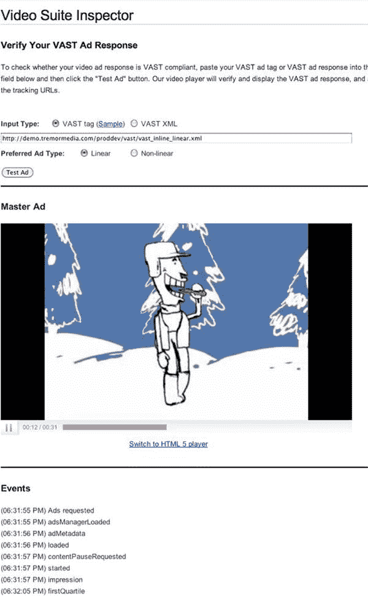

图 7-14。典型的流内巨幅广告

请记住，许多出版商和广告网络依赖于出版商端平台，如 Adobe 的 Auditude([`adobe.com/products/auditude.html`](http://adobe.com/products/auditude.html))或平台([`theplatform.com`](http://theplatform.com))来处理他们的媒体内容和传播他们的广告。这些工具可以将视频资源编码为所需的规格，以便它们可以跨平台和设备运行。使用这个平台对广告商和广告服务器同样有利，因为他们可以利用出版商的交付规范，提供与他们制作的内容质量一样好的视频广告。当内容切换到广告时，这提供了类似广播的体验，反之亦然。

视频播放器广告界面定义

既然你已经知道了如何通过 VAST 向视频播放器提供视频广告，你可能会想，“我如何让它具有互动性？那不会和视频播放冲突吗？”这就是 VPAID 发挥作用的地方。视频播放器-广告接口定义(VPAID) 本质上是一个 API，通过各种暴露的 API 调用，从广告单元内部与视频播放器进行通信。

VPAID API 被嵌入到创意的 JavaScript 中，向发布者视频播放器发出某些命令，例如“暂停视频；用户想要扩展广告”或“您可以恢复播放；用户已关闭广告。这些指令允许播放器内容和广告体验之间的无缝集成。此外，它是由 IAB 和其他机构支持的业界采用的标准。利用 VPAID 的广告与 VAST 协同工作；VPAID 处理交互性，VAST 处理交付。利用这两个优势将使您的广告标签可以轻松地在多个视频播放器上运行，但请确保您联系了某些出版商，以确保他们的播放器符合 VAST 标准，并且可以在开发您的创意执行之前处理 VPAID API。

使用 VPAID，如果广告商想要做与页面周围元素互动的播放器外视频广告，这可能会变得非常有趣。显然，这将是一个相当复杂的媒体计划，因为出版商很可能都需要一个特定的创意版本，但一次性的解决方案可以更容易地完成。有关 VPAID 和 JavaScript API 文档的更多信息，请访问[`iab.net/media/file/VPAID_2.0_Final_04-10-2012.pdf`](http://iab.net/media/file/VPAID_2.0_Final_04-10-2012.pdf)；请注意，3.0 版本将很快推出。

VMAP

视频多广告播放列表(VMAP) 是一种新的协议，当内容所有者不控制视频播放器或内容分发出口时，它允许内容所有者描述广告时段或插播应该放置在他们的视频内容中的何处。视频广告增强包括对“可跳过”视频广告的支持，这允许发布者和内容所有者基于可以播放完整或提供可跳过功能的广告来进行不同的定价。此外，还支持在单个广告时段中显示“pod”或多个广告。这允许创建与广播电视类似的体验，在广播电视中，你经常会在 30 秒的广告时段中看到两个 15 秒的广告。欲了解更多关于国际实验室 VMAP 规范的信息，请访问 http://iab.net/guidelines/508676/digitalvideo/vsuite/vmap。

移动视频

移动视频内容 正在快速增加，随着越来越多的人将目光放在更小的屏幕上，广告商很快也会跟进。目前，技术的碎片化很难部署移动广告活动，但使用 VAST 和 VPAID，广告商可以更容易地进入移动视频领域。为了了解当前移动视频的前景，请看图 7-15 中 eMarketer 的图表。

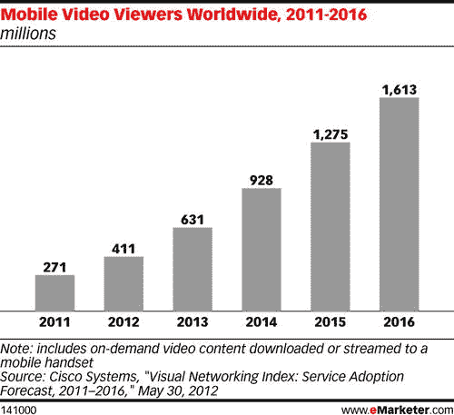

图 7-15。2011 年至 2016 年全球移动视频观众预测(来源:eMarketer.com)

这显示了相当惊人的增长，使用 IAB 的标准交付格式，如 VAST，广告商可以向每个支持 VAST 标签格式的视频播放器交付跨屏幕视频。目前包括 YouTube、VEVO、震颤和 Adap.tv 等，其采用率正在迅速增长。这在桌面和移动上都适用，由于 iOS 不支持 Flash，如果你正在部署到移动设备，你绝对需要开始使用 HTML5 视频。

还应注意，所有视频都在电话设备的本机播放器中播放。使用 CSS 和 JavaScript 来样式化和控制播放器控件不可能发生在移动设备上，除非它在平板设备上内嵌播放。在为移动设备部署时，以下内容应该会让您对视频规范有一个很好的了解:

*   格式:H.264/MP4
*   分辨率:480x360 或 640x360
*   视频时长:15 至 30 秒
*   视频比特率:600k 至 1024 kbps 或更快
*   音频:64k 到 128k @ 44.1kHz 或更快
*   帧速率:24 或 30 帧/秒
*   文件大小:2.2MB 或更小，除非使用流式传输

HTML5 音频

我刚刚详尽地回顾了 HTML5 视频领域，概述了许多可以利用的特性，但也回顾了一些问题。如你所知，没有音频，视频什么都不是，最后在 HTML5 中，音频现在是浏览器的原生功能。很长一段时间，你需要依赖插件或应用在浏览器环境中回放音频，就像视频一样。在接下来的几节中，我将回顾如何使用 HTML5 和 JavaScript 加载音频并与之交互；我还将讨论浏览器不支持 HTML5 时的故障转移，以及目前市场上的支持。我将关注满足所有浏览器所需的不同音频格式。看完前面几节，理解 HTML5 中的音频会容易很多。我先解决了最难的部分，你不高兴吗？

音频标签

HTML5 的新标签是音频标签，就像视频一样，音频在 HTML5 兼容的浏览器中成为一等公民，有许多很好的特性可以利用。让我们通过查看一些代码来深入研究 HTML5 中的新音频元素，以使其工作(参见清单 7-11 )。一定要注意源标签，以满足不同的浏览器环境。

***清单 7-11。*** HTML5 音频示例

```html
<!doctype html>
<html>
  <head>
    <meta charset="UTF-8"/>
  </head>
    <body>
    <audio controls>
<source src="sampleAudioFile.mp3" type="audio/mpeg" />
<source src=" sampleAudioFile.ogg" type="audio/ogg" /> <!—Support Old FireFox -->
<object type="application/x-shockwave-flash" width="250" height="50">
<param name="movie" value="sampleAudioPlayer.swf" />
<param name="FlashVars" value="mp3=sampleAudioFile.mp3" />
<embed href="sampleAudioPlayer.swf" width="200" height="20" name="movie" type="application/x-shockwave-flash" flashvars="sampleAudioFile.mp3"></embed>
</object>
</audio>
</html>
```

让我们看看前面的代码。首先添加属性*控件*，正如您从视频部分所了解的，它允许用户看到浏览器对元素的本地控件。对于音频，它看起来像图 7-16 。


图 7-16。html 5 中带控件的音频元素

请记住，您可以像处理视频标签一样处理控件。在示例中，我相信您会同意它看起来非常类似于视频实现，为旧浏览器提供了快速回切，并包括多个音频文件，以支持需要不同音频编解码器和格式的所有浏览器。

音频格式和编解码器

让我们来谈谈在开发利用音频的广告时，您最有可能遇到的不同编解码器。音频比视频稍微简单一点，因为就视觉完整性而言，需要考虑的要少得多；然而，音频仍然必须清晰，并为网络正确压缩。你在下一个活动中瞄准的大多数浏览器都支持表 7-1 中概述的格式。

表 7-1 。HTML5 音频格式和浏览器支持

| 浏览器 | 版本 | 多媒体数字信号编解码器 |
| --- | --- | --- |
| 微软公司出品的 web 浏览器 | 9+ | MP3，AAC |
| 铬 | 9+ | OGG、MP3、WAV |
| 火狐浏览器 | 4+ | 奥格，威 |
| 旅行队 | 5+ | MP3，AAC，WAV |
| 歌剧 | 10+ | 奥格，威 |
| 机器人 | 2.3+ | 设备相关 |
| 移动旅行 | 3+ | MP3，AAC |
| 黑莓 | 6+ | MP3，AAC |

正如您从表 7-1 中看到的，音频支持相当分散，因此如果您打算在活动中使用多个浏览器，请确保包含多个音频源。您可能还希望将音频流式传输到您的广告中，并且您需要依靠前面讨论的一种自适应流式传输技术。唯一的区别是，你不使用 MP4 或另一个视频文件，你会包括你的音频文件，并相应地调整比特率设置。最后要注意的是，为不支持音频标签的浏览器提供回切是很重要的，所以利用 Flash 或 Silverlight 等插件来处理这一点。

 **注意**我将在第十二章中讨论 HTML5 音频的更多新兴特性，包括网络音频 API。

音频工具

如果您需要将音频文件转换成以前的格式以支持多浏览器，网上有许多免费服务。例如，如果你打算转换成所有以前的音频格式(OGG、WAV、AAC 和 MP3)，我建议你去 http://audio.online-convert.com 看看，在那里你可以转换成这些格式和许多其他格式。

音频 JavaScript API

正如您可能已经猜到的，您可以像在视频中一样使用 JavaScript 来控制音频回放。如果你正在为浏览器的内部播放器定制你自己的控制，这是非常有用的。因为您可能要重新创建播放/暂停和音频开/关的定制按钮，所以您需要利用 JavaScript API 来添加事件和检查格式。清单 7-12 展示了前一个例子，在这里我将展示如何使用 JavaScript 来构建它们，而不是使用浏览器的默认控件。

***清单 7-12。*** HTML5 音频 JavaScript 示例

```html
<!doctype html>
<html>
<head>
<meta charset="UTF-8"/>
</head>
<body>
<button onClick="handleEvent(this);">Play Audio</button>
<button onClick="handleEvent(this);">Pause Audio</button>
<button onClick="handleEvent(this);">Audio On</button>
<button onClick="handleEvent(this);">Audio Off</button>
</body>

<script>
var player = new Audio ();
if (document.createElement('audio').canPlayType('audio/ogg')) {
   //play ogg file
   player.src = 'someAudioFile.ogg';
} else if (document.createElement('audio').canPlayType('audio/mpeg')) {
   //play mp3 file
   player.src = 'someAudioFile.mp3';
} else if (document.createElement('audio').canPlayType('audio/mp4')) {
   //play aac file
   player.src = 'someAudioFile.aac';
} else {
    //Flash or Silverlight failover
}

function handleEvent (event) {
   var t = event.textContent;
   switch (t) {
      case 'Play Audio' :
         player.play();
         break;
      case 'Pause Audio' :
         player.pause();
         break;
      case 'Audio On' :
         player.volume=1;
         break;
      case 'Audio Off' :
         player.volume=0;
         break;
    }
   console.log(t);
}
</script>
</html>
```

从示例中可以看出，您从 HTML 标记中删除了音频元素，并将其添加到 JavaScript 中。你要做的第一件事是创建按钮来切换你的音频播放/暂停和声音开/关。接下来进入 JavaScript，通过编写 var player = new Audio()行创建一个新的音频对象；。在那里，您检查浏览器可以回放哪种音频格式。在这个条件检查中，您使用 canPlayType 方法来确定它是 OGG、MP3 还是 AAC。一旦确定了浏览器可以播放的内容，就可以通过编写 player.src = 'someAudioFile '来指定您转换为播放器的 source 属性的特定音频格式。从那里，您可以通过单击 Play Audio 按钮开始，该按钮贯穿名为 handleEvent 的 case 语句。最后，通过将 play()或 pause()方法附加到 player 对象，以及将音量调整为 1 或 0，来处理所有特定的事件。给自己一个机会吧！此外，通过访问[`caniuse.com/#feat=audio`](http://caniuse.com/#feat=audio)，了解新兴浏览器及其对音频标签的支持。

术语回顾

我在这一章中介绍了很多新的术语和缩略语。为了更好地为您提供快速参考，我将详细概述一些我已经触及的内容；参见表 7-2 。

表 7-2 。HTML5 媒体术语回顾

| 单词 | 定义或含义 |
| --- | --- |
| 编码 | 这是根据不同的回放规范为输出准备一个视频项目。 |
| 转码 | 这是根据不同的播放规范，从一种格式到另一种格式的转换过程。 |
| CBR | 这是编解码器的输出比特率数据应该设置的速率，它是一个常量值。 |
| 可变码率 | 这改变了每个时间段要消耗的输出数据量。VBR 允许在复杂场景中使用较高的比特率，在不太复杂的场景中使用较低的比特率。 |
| 比特率 | 这是每单位回放时间用于表示音频或视频的位数。 |
| 英国制药学会会员 | 这是一秒钟内渲染到屏幕上的视频帧数。 |
| 纵横比 | 这是视频或图像的宽度和高度之间的比例关系；通常是 16:9 或 4:3，但也存在其他比例。 |
| 多媒体数字信号编解码器 | 这是一种能够对数字数据进行编码或解码的设备或软件。 |
| 大老党 | 这是编码视频文件中的一组连续图片。 |
| 阿尔法通道 | 这是为透明度信息保留的像素数据。这通常用于在彼此之上叠加或合成图形。 |

摘要

我们正处于行业的一个巨大转折点，在线音频和视频交付比以往任何时候都更加混乱和重要。客户希望他们制作的视频能够以最佳的质量和清晰的音频传送到每一个屏幕上，而用户希望快速启动的视频质量好，播放时不会出现停顿。然而，由于只有特定的视频格式才能在特定的浏览器、操作系统和设备上播放得很好，因此创建一个无处不在的高质量跨屏幕体验是一项挑战，而且通常非常耗时。

本章涵盖了很多内容，但重要的是要理解大环境，并理解创建、交付和优化网络视频和音频的所有活动部分，尤其是使用 HTML5 的在线广告。如果你使用的是质量低劣的视频资源和用户甚至无法播放的交付机制，你的潜在客户就不会给你时间。如果您的下一个活动需要某种形式的媒体，我建议您回顾一下这一章，这样您就可以确保了解视频创建、压缩和交付的整个流程。但更重要的是，确保你的客户理解。视频，像目前网络上的许多东西一样，是超级碎片化的，但这个过程变得越来越容易处理，你会牢牢抓住竞争，因为你现在正在处理它。不要害怕在下一次广告活动中使用 HTML5 视频，并寻找与 VAST 和 VPAID 的集成点，以帮助加快您的活动需求。这将确保你的视频可以跨媒体购买，而我介绍的技术将确保它可以跨浏览器和设备。尝试不同的压缩技术，并开始熟悉使用 JavaScript APIs。此外，确保在不同的网络条件下，在不同的设备上测试您的创意和视频，包括移动设备、平板电脑和操作系统。如果在时间紧迫的情况下很难将所有事情都考虑进去，请记住我提到的帮助你快速开始的在线服务。

本书接下来的几章是关于移动设备的，我会在这几章中更多地讨论视频。把你在这里学到的东西应用到未来。