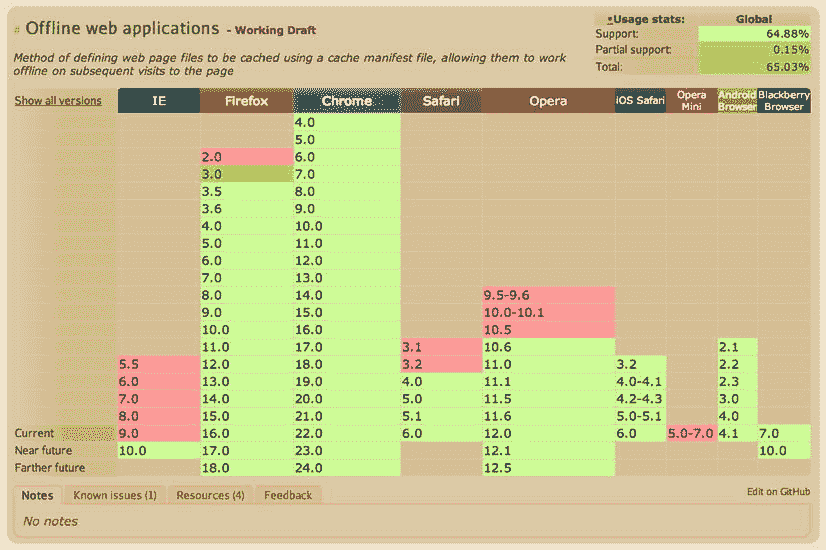
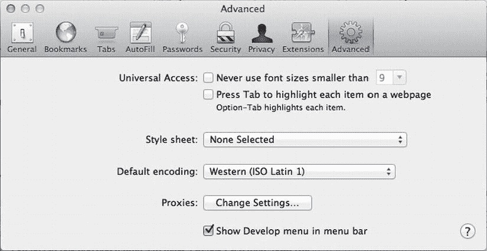
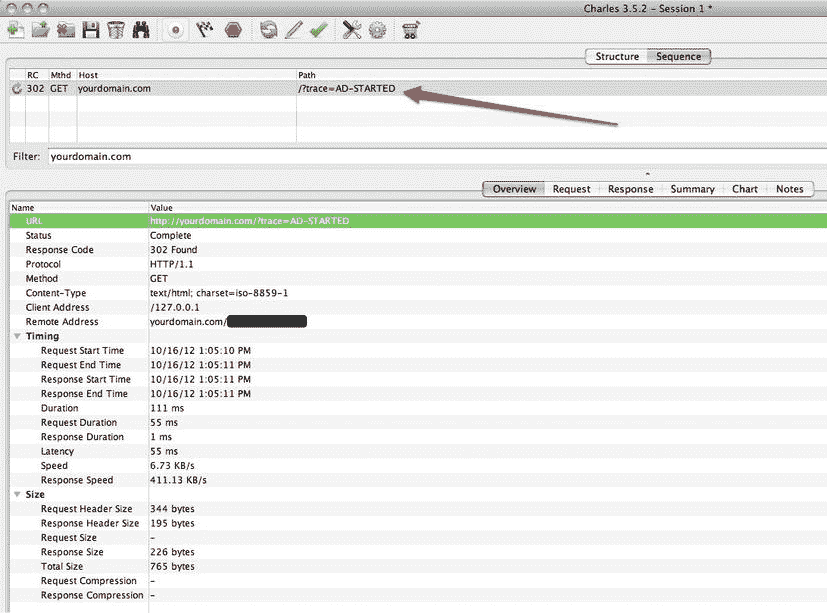
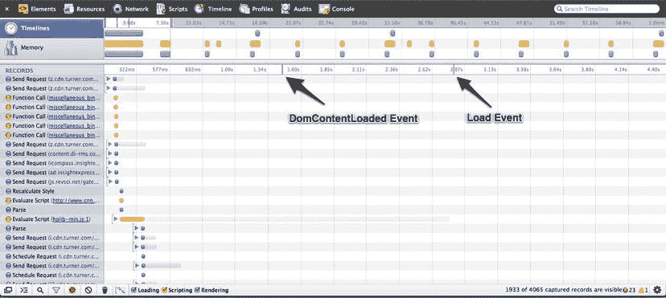
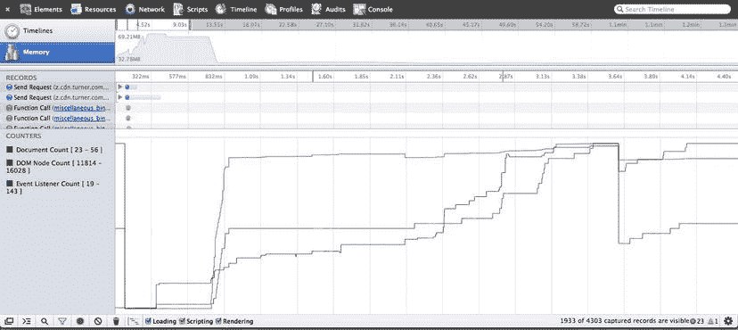
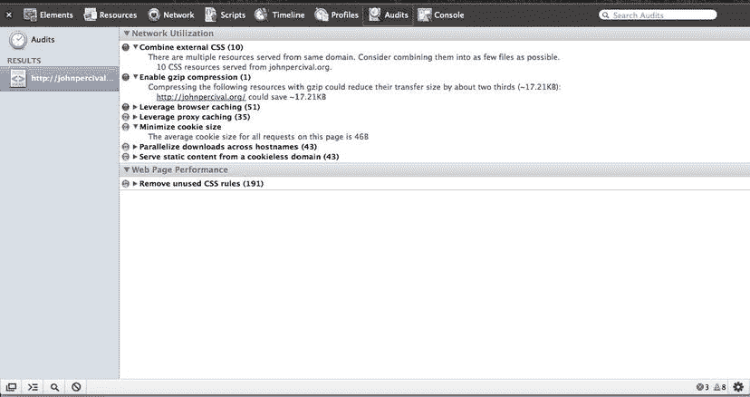

# 十、离线存储，跟踪、调试和优化

本章重点介绍移动和平板设备上日益重要的广告离线支持、强制跟踪，以及在浏览器和设备上调试的繁琐且通常非常耗时的过程。离线支持正成为许多网络应用的一项要求，广告也在迅速跟进。在这一章中，我将回顾如何处理离线事件，检测用户何时恢复在线，甚至讨论当用户网络连接不良时检测的 API。我将介绍如何使用 HTML5 的 AppCache API 将素材缓存到客户端浏览器和设备。我还将讨论通过跟踪像素和 JavaScript 来跟踪用户在广告中的交互，我将使用这些方法来处理跟踪调用，并使用 HTML5 的 API 在客户端数据库中存储调用。此外，我将讨论 IndexDB API 和 WebSQL API 之间的差异和浏览器支持。我还将讨论 Lawnchair JS 等 API，以及如何处理跨浏览器存储和缓存，以及如何在用户离线时启动跟踪调用。最后，我将详细介绍桌面浏览器和移动设备上的调试和优化。太多了，我们开始吧。

离线支持

从我记事起，我就一直从网络接入的角度来认识网络。从过去开始，我们有拨号调制解调器，然后是 DSL，然后是电缆线路，然后是今天的光纤。然而，在当今世界，我们还必须关注 2G、3G 甚至 4G LTE 连接等无线蜂窝网络，以及智能手机、电子阅读器和平板电脑等越来越多的设备是如何移动的。随着这些设备能够进入典型计算机不能进入的领域，如飞机、火车和汽车，网络连接可以来来去去，迅速而突然。幸运的是，开发人员可以使用浏览器的一个有用的新功能来检测用户是否可以访问网络。清单 10-1 概述了如何在兼容的浏览器中检测这一点。

***清单 10-1 。*** 检测离线示例

```html
<!DOCTYPE HTML>
<html>
<head>
<script>
function networkIndicator() {
document.getElementById('status').textContent = navigator.onLine ? 'online' : 'offline';
}
</script>
</head>
<body onload="networkIndicator()" ononline=" networkIndicator ()" onoffline=" networkIndicator ()">
<p>The network is: <span id="status"></span></p>
</body>
</html>
```

从前面的代码中，您可以看到我正在创建一个名为 networkIndicator 的函数，它会将 status 元素中的文本更新为 online 或 offline。然后在 body 元素的 onload 方法上，我调用了 ononline 和 onoffline 处理程序上的 networkIndicator 函数。这种简单的检测可以确定是否有网络连接。另外，前面的代码，当用户的网络访问变为连接或断开时，它还会调度下面这些你可以通过 JavaScript 处理的事件:

```html
<script>
window.addEventListener("offline", function(e) {
        alert("offline");
});

window.addEventListener("online", function(e) {
    alert("online");
});
</script>
```

检查浏览器的 navigator.onLine 属性并在没有网络连接时提供替代体验是任何 HTML5 web 应用的必备功能，随着更多的广告进入 web 标准世界，您需要为需要它的出版商考虑这一点。就个人而言，将线下支持纳入品牌活动是最有意义的，因为游戏、视频或某种形式的重度用户互动是活动成功的最重要因素。对直接回应广告提供离线支持可能不是最有意义的，因为如果用户无法连接到任何网络，他们将无法点击/点击目的地和登录页面。然而，将游戏的元素缓存到设备或者甚至更小的预告视频以供离线使用允许用户在广告体验中进行交互并花费宝贵的时间。当品牌或广告商在活动结束后重新获得联系进行分析时，所有这些都可以被跟踪。基本上，如果用户有网络接入，你可以为他们提供完整的体验；例如，它可以是一个功能丰富的游戏或一个长篇视频广告。此外，你可以将重要的甚至替代的素材缓存到用户的浏览器中，这样当他们离线时，仍然可以在某种程度上与广告进行交互。

 **注意**出版商可能会要求不缓存任何内容供离线使用，或者对离线内容进行某些 k 权重限制。在开发广告之前，请咨询您的出版商或应用开发商。

广告中的离线支持绝不是标准做法。事实上，整个行业都在朝着一个坚实的标准努力，因为在检查可靠的连接状态时，使用 navigator.onLine 存在漏洞。例如，如果您的 ISP 关闭，但您的无线路由器启动并运行，会发生什么情况？浏览器可能会说用户在线，但实际上他们并不在线。更好的测试方法是通过 XMLHttpRequest (Ajax request )从服务器请求一个小素材来进行小检查，这样对最终用户来说是透明的，他们不会遇到任何带宽瓶颈，也不会刷新页面。使用清单 10-2 中显示的代码，您可以自信地识别用户是否连接。

***清单 10-2 。*** 使用 Ajax 检测离线示例

```html
<script>
function testConnection (fileToPing) {
  var xhr;
  if (window.XMLHttpRequest) {
    xhr = new XMLHttpRequest();
  } else {
    //For IE6, IE5
    xhr = new ActiveXObject("Microsoft.XMLHTTP");
  }

  xhr.onreadystatechange=function() {
    if (xhr.readyState==4 && xhr.status==200) {
      console.log("Online")
    } else {
      console.log("Offline")
    }
  }

  xhr.open("GET",fileToPing,true);
  xhr.send();
}

testConnection("http://www.yourdomain.org/1x1.gif");
</script>
```

清单 10-2 创建了一个名为 testConnection *，*的方法，该方法带有一个参数 fileToPing，这是一个你想要 Ping 的 URI 的字符串值，用来检查连接。该函数创建一个 XMLHttpRequest，并从服务器头检查状态是否为 200。如果是这样，您知道您对该素材的请求已经正确解析，因此用户已经连接。如果您没有从服务器获得 200 响应，您将确信用户离线。

 **注意**你必须在你的服务器上允许你想要请求的域名的访问控制允许来源。例如，使用 Access-Control-Allow-Origin:[`yourdomain.com`](http://yourdomain.com)或*，这将允许任何来源访问素材。

最好的情况是使用这两种技术来获得关于用户连接的最多信息。另外，一定要问清楚线下是否是发布者和/或广告主的强制要求。无论您使用 HTML5 还是从 API 调用到应用的 SDK 的特定“挂钩”,都要确保预先了解工作的全部范围。这是至关重要的信息，因此设计师和开发人员可以考虑以这种方式开发和设计广告的额外时间(如果有的话)。

有时文件会被缓存到浏览器/设备中，而您不希望它们被缓存。如果您为了验证指标而发出第三方或第四方跟踪电话，就可能出现这种情况。如果您不想允许缓存您的文件，您可以在向这些文件位置发出特定的 HTTP 请求时使用“cache-bust”方法。清单 10-3 展示了你将如何做来给第三方留下 1x1 的印象。

***清单 10-3 。*** 缓存缉捕举例

```html
<!DOCTYPE HTML>
<html>
<head>
<script>
function fireImpression () {
   var beacon = new Image ();
   beacon.src = "http://tracking.somedomain.com?r=" + cacheBust();
}
function cacheBust () {
   var num = Math.random();
   return num;
}
</script>
</head>
<body onload=fireImpression()>
</body>
</html>

```

使用前面的代码片段时，您创建了一个新的图像，并将该图像的源设置为您想要访问的 URI，但是您将一个缓存破坏方法连接到该字符串。这种破坏缓存的方法称为 cacheBust，它告诉浏览器生成一个随机数，并将其添加到查询字符串中的 r 参数中。这会产生类似于[`tracking.somedomain.com 的东西吗？r=0.123456`](http://tracking.somedomain.com?r=0.123456) ，这种做法可以用于任何 HTTP 请求；请记住，缓存素材在大多数情况下是一件好事，比如不会改变的较重的 k-weight JavaScript 库、图像或 CSS 文件。然而，对于报告和分析，为了获得准确的结果，缓存破坏是相当强制性的。

当使用应用内时，一些 SDK 要求将广告缓存到设备上以供离线使用。例如，如果你要查看*华尔街日报* iPad 应用，内容和广告会被缓存到设备中，这样用户就可以在离线模式下查看内容。如果用户要登上一架没有连接的飞机，这将非常有用。在这种情况下，当前的 SDK 提供商 AdMarvel 通过缓存文件将应用内容和所有广告缓存到设备中。清单 10-4 展示了如何使用 AdMarvel SDK 实现这一点。

***清单 10-4 。*** AdMarvel 缓存文件示例

```html
ADMARVEL-CACHE
assets/style.css       http://cdn.domain.com/assets/style.css
assets/script.js       http://cdn.domain.com/assets/script.js
assets/logo.png       http://cdn.domain.com/assets/logo.png

```

缓存文件保存为制表符分隔的。txt(纯文本)文件，通过相对和绝对位置(本地/远程)定位构成广告体验的所有素材，并与广告创意一起交付给 AdMarvel。

 **注意**每个 SDK 都有自己实现缓存广告素材的方式。请务必在活动开始前与他们核实。

网络连接 API

本节介绍网络连接 API ，它允许开发者查询用户当前使用的网络连接的强度和类型。在撰写本文时，该 API 目前还不被任何现代浏览器支持，但是它的 API 文档正在修订中，当这一新兴标准在现代浏览器中可用时，它将提供许多有用的特性。目前的 API 允许开发人员检测用户是否在使用以太网、WiFi、2G、3G、4G、无或未知连接。将这类信息与 Navigator.onLine 和 Ajax 测试结合起来，开发人员可以将他们的广告体验用于复杂的离线使用。如果您不能等到规范最终确定或浏览器将它实现到他们的架构中，您可以通过 SDK 从应用内广告中利用这一点。事实上，在 MRAID，广告开发人员和设计人员可以通过调用 getNetwork *方法向 MRAID 兼容的 SDK 查询有关用户连接的信息。*此外，当网络连接发生变化时，他们可以为 networkChange 事件添加一个事件监听器。目前，MRAID 可能的连接类型有离线、WiFi、手机和未知。理想情况下，我们会看到这些 API 很快成形，并立即实现，这样采用就会很快。只有这样，您才能提供准确的网络连接检测，并提供丰富的离线体验。

 **注意**如果您的广告需要离线可用性，请确保删除 tap 周围的任何 CTA，因为离线查看广告时将没有网络，因此用户将无法查看页面。

应用缓存

在这一节中，我将介绍离线 web 应用规范以及如何使用应用缓存。本节面向希望为其 web 应用提供离线支持的出版商和内容所有者。在 HTML5 中，通过创建一个简单的清单文件来支持应用缓存，该文件列出了应用脱机使用的素材。这些素材是需要存储到用户浏览器的文件，以便在没有任何互联网访问的情况下正确呈现。在我们深入探讨之前，请记住，将所有素材缓存到用户的浏览器可能会导致很长的缓存时间以及臃肿的清单文档，因此请明智地选择存储。

当用户在无法访问网络的情况下查看文档时，浏览器会切换到使用本地缓存的资源。因此，理论上，假设应用缓存正确地将文件存储到了设备上，用户应该能够在地铁或没有飞行 WiFi 的飞机上完成与游戏的交互或观看视频。有了强大的浏览器支持，特别是在移动领域，这是你可以立即开始利用的东西。图 10-1 概述了截至 2012 年 11 月对应用缓存的巨大支持。



图 10-1。演示浏览器对 HTML5 应用缓存的支持(来源:caniuse.com)

使用 HTML5 应用缓存，出版商可以提供更快、响应更快的 web 应用，这对于最终用户来说是一种更好的用户体验。此外，如果你是 Chrome 用户，我建议使用 chrome://appcache-internals，它可以帮助检测哪些域正在你的浏览器中存储素材。

应用缓存示例

因为我刚刚介绍了为什么您应该利用离线素材缓存，所以我将展示如何将理论付诸实践。虽然 HTML5 AppCache API 通常用于缓存 web 应用中的特定素材，但您也可以使用类似的缓存机制来缓存离线广告内容。当然，这肯定意味着如果你在发布端，这将增加你的工作量，因为你需要在每次新闻广告更新时更新缓存清单。当出版商的内容(如杂志、报纸和其他完全缓存在用户设备上的内容)需要离线查看时，这一点变得越来越重要。查看以下代码片段，了解如何使用 AppCache 。在 HTML 标记中，添加对。通过编写以下内容来创建 appcache 文件:

```html
<!DOCTYPE HTML>
<html manifest="cache.appcache">
. . .
</html>
```

在前面的示例中，您向名为 manifest 的 HTML 文件中的 HTML 节点添加了一个属性，并将该属性设置为 cache.appcache *，*，它是与 HTML 文件位于同一目录中的清单文件。

接下来，让我们看看如何构建清单文件。您可以使用下面的示例清单结构来构建您的离线广告，但是请注意，根据发布者和广告内容的不同，这些素材需要针对您自己的特定用例进行更改。在构建清单缓存文件之前要做的第一件事是设置您的服务器接受 MIME 类型的. appcache。appcache 到我的。我的服务器根目录下的 htaccess 文件。请记住，一些服务器可能没有这个文件，或者它可能是隐藏的，所以一定要查看隐藏文件来找到它。否则，就创建一个。

 **注**了解更多信息。htaccess，我推荐去[`htaccesstools.com`](http://htaccesstools.com)看看。

一旦您的服务器被配置为接受 appcache 文件类型，您就可以用您的缓存素材构建一个清单文本文件，并将其保存为 yourfile.appcache。

***清单 10-5 。*** 构建一个 HTML5 AppCache 文件

```html
CACHE MANIFEST
# 2012-12-13:v1 – Keep the version to purge the cache when updates are needed

# Explicitly cached entries
CACHE:
index.html
css/style.css
ad/adstyle.css
js/script.js
ad/adscript.js
ad/bg.jpg
img/button.png
img/bg.jpg
fonts/webfont.otf
fonts/webfont.ttf
fonts/webfont.woff
fonts/webfont.svg
media/audio.mp3
media/video.mp4
media/video.webm

# offline.html will be served if the user is offline and request new "non-cached" assetsFALLBACK:
index.html offline.html

# Resources that require the user to be online.
NETWORK:
submit.aspx
http://api.twitter.com
etc. . .
```

 **注意**您可以通过以#开始一行来向清单文件添加注释。此外，如果一项素材下载失败，整个缓存都会失败。

让我们回顾一下清单。您要做的第一件事是定义缓存清单，并设置一个带有上次更新日期和版本号 1 的注释。你要做的第二件事是，通过编写 ad/style.css、ad/adscript.js 和 ad/bg.jpg，列出你需要缓存到用户浏览器供离线使用的所有素材和文件，包括广告的素材，记住，这不需要是你的所有素材，只要足以提供可接受的离线体验即可。在这个例子中，我已经包括了 CSS、JS、图像、字体、媒体和广告素材，但是这很可能是多余的，这取决于您的 web 应用和广告的创意需求。此外，要小心你在广告中缓存的内容。一旦 JavaScript 文件等素材被缓存，即使您在服务器上更改文件，浏览器也将继续使用缓存的版本。确保浏览器更新缓存素材的唯一方法是更改。appcache 文件，这就是为什么要通过编写在注释部分添加日期和版本。# 2012-12-13:v1。清单文件中的下一步是在清单的 FALLBACK 部分下为您的 index.html 文件提供一个备用 offline.html 文件，当用户离线并试图访问未缓存的信息时，将会提供该文件。在用户访问他们看不到的信息时，这是一个很好的选择；在这种情况下，他们将获得默认的缓存素材，而不是他们在线时没有缓存的素材。

出版商可能会从 HTML5 的 AppCache API 中看到真正的好处，因为他们可以有效地为他们的客户和访问者创建非常丰富的离线体验，同时仍然为他们提供用户想要的内容。广告或多或少会找到自己的方式来为用户缓存素材，但在走上任何特定的道路之前，一定要与你的出版商、广告服务器和代理商进行对话。

既然已经在 HTML 文档中设置并分配了缓存文件，让我们使用一些 JavaScript 来检测素材的加载和缓存(参见清单 10-6 )。

***清单 10-6 。*** HTML5 AppCache JavaScript 示例

```html
<script>
var cache = window.applicationCache;

cache.addEventListener('cached', handleCacheEvent, false);
cache.addEventListener('checking', handleCacheEvent, false);
cache.addEventListener('downloading', handleCacheEvent, false);
cache.addEventListener('error', handleCacheError, false);//Good to use if the manifest is moved or if the user is offline
cache.addEventListener('noupdate', handleCacheEvent, false);
cache.addEventListener('obsolete', handleCacheEvent, false);
cache.addEventListener('progress', handleCacheEvent, false);

// When a new manifest is downloaded, swap the new cache assets and reload.
cache.addEventListener('updateready', reloadAssets, false);

function reloadAssets (){
     if (cache.status == cache.UPDATEREADY) {
          cache.swapCache();
          if (confirm('A new version is available')) {
               window.location.reload();
          }
     }
};

function handleCacheEvent () {
. . .
}
</script>
```

使用前面的 JavaScript，您可以将事件侦听器添加到 applicationCache，并在素材处于缓存过程的不同阶段时、素材正在下载时、素材准备就绪时以及其他事件中进行处理。当确定用户是否有最新和最大的素材可供脱机使用时，以及当对您的缓存清单文件进行常规调试时，这非常有用。

因此，您可能想知道为什么要在本地缓存素材。浏览器没有原生缓存吗？是的，确实如此，但这通常是不可靠的，因为用户和浏览器通常会在缓存池填满太多后清除缓存，或者这可能是默认的浏览器设置，在每次浏览器会话后清除缓存。

缓存资源可以创建更快的 web 内容，无论网络连接如何，这都是一种全面的改进。当你进入动态广告时，这可能是非常有益的，用户可能会在整个活动周期中看到各种各样的广告版本。既然只有广告的某些部分是动态的(文本、图片等等)，为什么不在随后的视图中下拉动态素材，让其他素材保持不变呢？这将允许更快的加载时间，并且能够只从服务器中提取您需要的素材，从而减少需要发生的请求的数量。今天，这些做法正在许多网络应用中使用，包括谷歌的 iOS 和 Android 版 Gmail。一篇关于缓存及其对网络影响的非常好的文章可以在[`www.stevesouders.com/blog/2012/10/11/cache-is-king`](http://www.stevesouders.com/blog/2012/10/11/cache-is-king)找到

 **注**关于 AppCache 的更多信息和事实，请访问[`appcachefacts . info`](http://appcachefacts.info)。

跟踪

追踪广告是任何活动的关键部分。分析团队渴望广告服务公司收集的指标，以便他们可以更好地调整他们的媒体支出，并更好地教育他们的客户在他们的在线广告活动中什么是有效的，什么是无效的。要做到这一点，跟踪必须贯穿整个广告，这样当用户与广告内容互动时，报告公司可以了解互动的发生。跟踪需求的一个重要主题是当网络访问不存在时跟踪用户的能力。这种离线跟踪在移动设备中很重要，用户更倾向于在离线情况下与手机和平板电脑应用进行交互。

正如你在本书的前几节中所知道的，只有当用户访问了 cookie 丢弃域或者将他们的浏览器设置切换为全部接受时，移动苹果设备上的 cookie 丢弃才被接受。虽然这消除了广告客户寻求瞄准的很大一部分市场，但其他浏览器在 iOS 上越来越受欢迎，如谷歌的 Chrome 浏览器，它默认接受 cookies，而不管域如何，在撰写本文时，iOS 版 Chrome 大约有 20，000 个用户评级。虽然不是安装的真实衡量标准，但这仍然是一个有希望的数字，但由于没有能力使 Chrome 成为用户的默认移动网络浏览器(除非你“越狱”你的 iOS 设备)，你肯定会看到比 Chrome 更多的移动 Safari 流量。移动领域的其他浏览器，如 Opera Mini，处理追踪的方式有所不同。对于像非洲这样的发展中国家的很大一部分市场份额来说，有线网络很少，大多数是带有 Opera Mini 的电话。然而，对于 Opera Mini，JavaScript 在默认情况下是不打开的，或者是不存在的，所以在这些场景中，唯一的跟踪形式称为*像素跟踪* ，或者使用 1x1 图像，其中用户单击 HTML 标记中的标签，请求通过重定向 URL。然而，在大多数情况下，JavaScript 是最常见的，许多分析平台如谷歌的分析使用清单 10-7 所示的跟踪方法。

***清单 10-7 。*** 谷歌分析追踪示例

```html
<script type="text/javascript">
  var _gaq = _gaq || [];
  _gaq.push(['_setAccount', 'UA-25177661-1']);
  _gaq.push(['_trackPageview']);

  (function() {
    var ga = document.createElement('script');
    ga.type = 'text/javascript'; ga.async = true;
    ga.src = ('https:' == document.location.protocol ? 'https://ssl' : 'http://www') + '.google-analytics.com/ga.js';
    var s = document.getElementsByTagName('script')[0]; s.parentNode.insertBefore(ga, s);
  })();
</script>
```

现在，在基于 HTML 的广告中，你可以使用网络分析平台，如谷歌概述的平台，来处理你的指标。但是，如果浏览器中禁用了 JavaScript，那么基于 JavaScript 的跟踪也会被禁用。一个好的解决方法是使用 image*beacon*，这是一个 ping 服务器的 1x1 GIF 图像，通常带有特定的查询参数，指示会话 id 或创意 id，以及活动类型和一个随机数来缓存 bust。不管怎样，最好是了解你的受众是谁。如果你的目标是一堆移动设备，请记住，一些移动浏览器在一些手机上默认没有 JavaScript，例如黑莓的 OS5 和更老的手机以及大多数诺基亚功能手机。

存储和发射离线跟踪

虽然线下广告跟踪没有标准定义，但需要一个标准，理想情况下，通过实践和采用，我们将在未来的活动中有一个干净的线下实现方式。Crisp Media 的开发副总裁兼 ORMMA initiative 的联合创始人 Nathan Carver 声明如下:

“这确实在一定程度上取决于广告。如果是直接回应，比如说，那么线下就没有意义了。真的只有品牌广告受益于线下。最终，这是 SDK 目前的差异化空间。存储转发或保管/分享技术可能真的有所帮助，但目前还没有关于线下市场的定义。”

内森·卡弗

首先，用户在网上与广告互动；在整个交互过程中，网络连接变得很差，用户不可避免地会离线一会儿。由于广告已经被缓存到用户的设备(使用广告服务设备检测)，用户不会注意到他们实际上是离线的，因为广告的所有功能仍然完好无损。这里重要的变化是广告中的每一次互动都是可追踪的；如果用户离线，这些跟踪活动将无法返回到服务器。也就是说，你需要在客户端捕捉这些互动，以免它们永远消失，失去宝贵的品牌洞察力。通过使用 HTML5 和各种其他 API，您可以利用各种新技术来实现这一点，包括本地存储/会话存储，甚至客户端数据库，如 WebSQL 和 IndexedDB，您将在下面的部分中了解到一些内容。让我们看看如何使用 HTML5 的本地存储技术来处理清单 10-8 中的离线点击跟踪。

***清单 10-8 。*local storage 离线点击跟踪示例**

```html
<script>
var NetworkAccess = navigator.onLine;
var trackingCalls = {
    "clicks" : [{
        "name": "clickButton1",
        "online": "1023-online",
    }, {
        "name": "clickButton2",
        "online": "1024-online",
    }]
}

function trackClick(name) {
    if (!NetworkAccess) {
        //No network - clicks won't fire
        return false;
    } else {
        var trackingID;
        var clickName;
    }

    for (var n = 0; n < trackingCalls.clicks.length; n++) {
        if (name == trackingCalls.clicks[n].name) {
            clickName = trackingCalls.clicks[n].name;
            trackingID = trackingCalls.clicks[n].online;
        }
    }

    if (trackingID){
        location.href = "http://clicks.someurl.com?clickName=" + clickName + "&trackingID=" 
+ trackingID + "&r=" + cacheBust();
    }
}

function cacheBust () {
    var num = Math.random();
    return num;
}

function buttonClick (event) {
    var type = event.target.attributes.value.value;
    switch (type) {
        case "buttonOne" :
            trackClick("clickButton1");
            break;
        case "buttonTwo" :
            trackClick("clickButton2");
            break;
    }
    console.log(type)
}

function AdInit () {
    console.log("AdInit : NetworkAccess " + NetworkAccess)
    document.removeEventListener("DOMContentLoaded", AdInit);

    //set up Ad UI here

    document.getElementById('buttonOne').addEventListener('click', buttonClick, false);
    document.getElementById('buttonTwo').addEventListener('click', buttonClick, false);
}

document.addEventListener("DOMContentLoaded", AdInit, false);
</script>
```

让我们回顾一下这段代码。您要做的第一件事是通过检查 NetworkAccess 和重要的 trackingCalls JavaScript 对象在脚本顶部设置您的跟踪变量，该对象存储所有在线使用的点击。接下来，在脚本的底部，您开始监听您的 DOMContentLoaded 事件，并启动 adInit 函数，这将启动程序；那里没什么新东西。接下来，如果用户在广告环境中单击 buttonOne 或 buttonTwo，它将通过一个名为 buttonClick 的函数，该函数将接受事件参数并执行一个 switch/case 来确定哪个按钮被单击。根据触发的事件，您将调用函数 trackClick 并为按钮传入字符串值；在这种情况下，它可以是 track click(" click button 1 ")；或者 track click(" click button 2 ")；。现在，如果您使用 trackClick 功能，您会注意到您做的第一件事是检测用户是否可以访问网络。如果没有，您只需将用户从函数中返回。但是，如果它们这样做了，您需要设置两个新的变量 trackingID 和 clickName *，*，这两个变量将存放您想要保存的跟踪值。当 for 循环遍历 JavaScript 对象中定义的所有跟踪点击时，您可以根据用户的操作来跟踪用户并将其发送到适当的 URL(如果已连接)。

既然您已经了解了如何处理离线点击，那么让我们从广告体验的角度来看一下用户活动。同样，这是你想报道的广告的局部内容，不会将用户从广告体验中引开。理解互动是很重要的，比如滑动、触摸、视频播放、游戏，以及其他对广告商的品牌认知活动很重要的东西。看看清单 10-9 中修改后的代码。

***清单 10-9 。*** LocalStorage 离线活动跟踪示例

```html
<script>
var NetworkAccess = navigator.onLine;
var trackingCalls = {
    'pings': [{
        'name': 'touchstart',
        'online': '1011-online',
        'offline': '1011-offline'
    }, {
        'name': 'touchmove',
        'online': '1012-online',
        'offline': '1012-offline'
    }]
}

function trackPing (name) {
    var activityName;
    var onlineTrackingID;
    var offlineTrackingID;

    for (var n = 0; n < trackingCalls.pings.length; n++) {
        if (name == trackingCalls.pings[n].name) {
            activityName = trackingCalls.pings[n].name;
            onlineTrackingID = trackingCalls.pings[n].online;
            offlineTrackingID = trackingCalls.pings[n].offline;
        }
    }

    if (NetworkAccess) {
        fire('http://tracking.someurl.com?trackingName=' + activityName + '&trackingID=' + onlineTrackingID + '&r=' + cacheBust(), false);
    } else {
        var t = new Date().getTime();
        var m = new Date().getMonth()
        var d = new Date().getDate();
        var y = new Date().getFullYear();
        var timeStampedName = activityName+t+m+d+y;
        //No network - storing offline tracking
        storeOffline(timeStampedName, offlineTrackingID);
    }
}

function storeOffline (name, id) {
    //store client side and add listeners for network events
    console.log('Storing Offline : ' + name + ' + ' + id)
    localStorage.setItem(name, id);
}

 //on reconnect fire off all the cached pings
function checkOfflineStorage () {
    if(NetworkAccess) {
        if (localStorage.length >= 1) {
            for (var i = 0; i < localStorage.length; i++) {
                var key = localStorage.key(i);
                var value = localStorage[key];
                var offlineCall = 'http://tracking.someurl.com?trackingID=' + value + '&r=' + cacheBust();
                fire(offlineCall, true);
            }
        } else {
            console.log('No offline metrics stored')
        }
    }
    console.log('NetworkAccess ' + NetworkAccess)
}

//Tracking Utils
function fire(url, clear) {
    var trackingImg;
    if (clear === true) {
        trackingImg = new Image ().src = url;
        console.log(trackingImg);
        setTimeout(clearStorage, 3000);
    } else {
        trackingImg = new Image ().src = url;
    }
}

function clearStorage() {
    console.log('clearing storage');
    localStorage.clear();
}

function cacheBust () {
    var num = Math.random();
    return num;
}

function userAction (event) {
    var type = event.type;
    switch (type) {
        case 'touchstart' :
            trackPing('touchstart');
            break;
        case 'touchmove' :
            trackPing('touchmove');
            break;
    }
    console.log(type)
}

function AdInit () {
    console.log('AdInit')
    document.removeEventListener('DOMContentLoaded', AdInit);

    //set up Ad UI here
    window.addEventListener('touchstart', userAction, false);
    window.addEventListener('touchmove', userAction, false);

    checkOfflineStorage();
}

window.addEventListener('online', checkOfflineStorage);
window.addEventListener('offline', checkOfflineStorage);

document.addEventListener('DOMContentLoaded', AdInit, false);
</script>
```

让我们回顾一下代码示例。同样，它在设置上与点击跟踪示例非常相似，但是现在一旦您进入 adInit 函数，您就可以通过调用 window . addevent listener(" online "，checkOfflineStorage，false)为 ad 环境设置您的触摸事件侦听器，并为在线/离线状态设置一个事件侦听器；。接下来，调用 checkOfflineStorage 函数来确定是否有任何存储的离线活动。在 checkOfflineStorage 中，首先检查用户是否有网络连接，以及 localStorage 对象中是否存储了项目。如果有网络但没有存储，您只需通过编写 console.log('没有存储离线指标')来登录控制台。但是，如果有项目存储在 localStorage 中，您可以通过获取它们的键/值并将其传递给一个名为 fire *的函数来遍历它们。*现在，在 fire 函数中，通过编写 if (clear === true ),您检查是否需要在启动跟踪调用后清除存储。现在，您将创建图像对象，并将 URL 请求添加到跟踪服务器，方法是将该值设置为图像的 source 属性。最后，一旦您启动了所有的调用，您就可以设置一个超时来调用函数 clearStorage，这将清除用户浏览器中所有的 localStorage 跟踪调用。现在代码中有很多内容，所以我建议使用您最喜欢的文本编辑器，并在您最喜欢的浏览器的 web inspector 中检查所有日志。请记住，这种技术对于数字杂志和出版物变得越来越重要，因为它们的所有内容都被缓存到用户的设备上。通过 JavaScript 使用 HTML5 的离线检测，可以相应地处理度量；除了前面的 XMLHTTPRequest 方法，您还可以确保用户是否真正连接。

对于与 SDK 供应商(如 AdMarvel 或 Medialets)合作的移动人员来说，他们很有可能为您提供离线指标的缓存。作为一名广告设计师，你很可能只需要调用特定的 SDK 方法，SDK 会为你处理这些。除此之外，MRAID 工作组已经提出了包括实现离线跟踪的标准方法的想法，但现实是这个领域还太年轻，还不能标准化。让我们看看 MRAID API 文档中的引用:

能够在设备没有网络连接的情况下工作的富媒体广告需要能够存储并稍后转发关于用户如何以及何时与广告交互的指标。MRAID 然而，在测量方法和指标本身标准化之前(例如通过正在进行的 IAB/MMA/MRC 应用内广告测量指南项目)，为 MRAID 增加测量功能还为时过早。MRAID 工作组期望这种能力将被评估并可能作为未来 3.0 版本的一部分添加到 MRAID 中。

MRAID 工作组

MRAID 的工作组有一个很好的方法，我认为在确定一个解决方案并将其称为标准之前，最好先看看所有提议的解决方案。会是 HTML5 和各种允许标准化离线跟踪的 JavaScript APIs 吗？或者它会是只涉及 SDK 的其他东西吗？或许两者都有？与此同时，客户会要求你这样做，这最终会成为在线广告领域的标准操作程序。现在，你必须拿出你自己的自制解决方案，就像之前概述的那样，或者你甚至可以看看轻量级的 JavaScript 库，比如 lawn chair([`brian.io/lawnchair`](http://brian.io/lawnchair))来满足你的需要。

Lawnchair 似乎是客户机数据库存储的一个可能的答案，因为它通过 JavaScript 使用简单的名称/值对赋值，并通过 JSON 检索值。它还可以配备许多适配器，以便在一些浏览器不接受其他技术的情况下，优雅地切换到其他客户端存储技术。这意味着它将使用 blackberry-persistent-store、DOM storage、WebSQL 和 IndexDB，等等。Lawnchair 缓解了存储技术之间的碎片化，并为开发人员提供了一种节省价值的简单方法。另外，缩小后只有 6KB，压缩后更小。这非常有利于创建用户交互的离线档案，并最终在用户重新获得网络连接时迭代交互并启动用户活动。

 **注意**如果大多数用户与广告交互，并且从未重新获得网络访问权以将指标推送到报告服务器，则跟踪可能会偏离离线使用。应该向所有团队传达这永远不会是 100%准确的。

索引 b

在讨论离线缓存和离线指标的话题时，我不得不提到 HTML5 中一个新出现的 API，名为 IndexDB 。IndexDB 是一个 API，用于在客户端以非常结构化的方式存储大量数据。使用 IndexDB 通常意味着您有大量的数据要处理，并且比使用 sessionStorage 或 localStorage 的典型 DOM 存储要多得多，这可能会面临浏览器对存储到客户端的数据量的限制。虽然这两个 API 都为客户端浏览器提供了处理大量数据的好方法，但是当您处理非常大的数据池并且需要以结构化的方式大规模处理数据时，IndexDB 将是您的首选。由 Mozilla group 开发，使用这种精心制作的网络存储，你可能允许用户在广告体验中定制一个详细的载体，并在下次访问另一个网站的广告时从他们停止的地方继续。

IndexDB 现在是 HTML5 工作组正在研究的最新规范。根据 W3C 的说法，以前 WebSQL API 是离线存储大量数据的主要方式，但该规范已经停止发展。(然而，它仍然在一些浏览器中使用。)据说该行业在可预见的将来会向 IndexDB 过渡。 *Origin* ，或者说创建数据库的站点的域，作用于每个 IndexDB 数据库，这可能是处理广告离线数据的一个好的解决方案，但是要注意的是，它可能还不能在所有的浏览器中工作。请务必关注 http://caniuse.com/#feat=indexeddb 的[以确定支持。](http://caniuse.com/#feat=indexeddb)

Web 检查器

可以说最流行的 web 开发工具是 Web Inspector ，它内置于所有现代浏览器中。如果你使用 Chrome、Opera、Firefox 或 IE 10，你只需右击你的浏览器窗口并选择 Inspect Element *。*这将在你的浏览器中打开 Web Inspector，并为你提供一系列工具，用于检查你的 DOM 中的元素，查看加载的脚本，分析网络流量，了解离线存储，以及实时执行命令。如果您使用的是 Safari，您需要首先进入浏览器偏好设置，并在菜单栏中启用开发菜单。启用后，您将能够像其他元素一样右键单击并检查元素。图 10-2 显示了在苹果的 Safari 浏览器中寻找什么。



图 10-2。 Safari 的开发菜单设置

除了流行的 Web Inspector，还有一个名为 Firebug 的浏览器扩展，它本质上做类似的事情，并为开发人员提供类似的工具，用于在各种浏览器上调试 Web 内容。要了解更多关于 Firebug 的信息，请访问 http://getfirebug.com。Firefox 最近也更新了它的网页检查器，可以观看 3D 内容。如果您需要了解元素的堆叠顺序并确定某些元素是否位于其他元素之上，这将非常有用

开发工具

如果你曾经做过一段时间的开发人员，你就会知道有多少时间可以投入到代码调试的艺术和过程中。如果你是开发新手，相信我说的，“习惯于不工作的东西，并开始学习解决它们。”除了拥有正确的工具、工作流程和技术之外，耐心是调试中的一个关键特质。在这一节中，我将回顾一些非常棒的免费工具，以及一些惊人的技术，它们将在为多个平台和设备进行调试时为您带来竞争优势。

网络上有大量的开发者工具。只要谷歌一下任何网络开发工具，你就会看到很多结果。我最喜欢的几个在线工具是 js console([`jsconsole.com`](http://jsconsole.com))用于调试移动设备上的 JavaScript，JSBin([`jsbin.com`](http://jsbin.com))用于快速模仿并与朋友和同事分享代码，js beautiier([`jsbeautifier.org`](http://jsbeautifier.org))用于干净地取消库和代码的混淆以提高可读性，remote tilt([`remote-tilt.com`](http://remote-tilt.com))用于在原生设备之外处理动作事件。Remy Sharp 是 extra ordinaire 的开发者，他开发了除 JSBeautifer 之外的所有这些工具，我个人在调试广告内容时在无数的活动中使用过它们。其他非常有用的工具包括 DOM monster([`mir.aculo.us/dom-monster`](http://mir.aculo.us/dom-monster))、y slow([`yslow.org`](http://yslow.org))和 page speed([`developers.google.com/speed/pagespeed`](http://developers.google.com/speed/pagespeed))，所有这些工具都允许调试和优化你的网页内容。

我最喜欢的一个工具是 HTTP 监控工具。这些类型的工具捕获并记录浏览器中发生的所有 HTTP 流量。例如，如果您有一个发出许多 HTTP 请求并调用外部服务的广告，那么这个工具非常有价值，可以让您了解“幕后”到底发生了什么。其中一些工具是查理(Mac 版)([`charlesproxy.com`](http://charlesproxy.com))和菲德勒(PC 版)([`fiddler2.com/fiddler2`](http://fiddler2.com/fiddler2))，它们甚至可以代理到你的移动设备上，用于捕捉智能手机、平板电脑和电视上的网络流量。这些 HTTP 监控工具真正了不起的地方是能够验证跟踪、报告和重定向来自广告的呼叫。开展活动后，进行测试以确保报告的准确性至关重要。对于那些使用 Firefox 的人来说，还有一个免费的浏览器插件叫做 http fox([`addons.mozilla.org/en-us/firefox/addon/httpfox`](http://addons.mozilla.org/en-us/firefox/addon/httpfox))，它本质上做的事情和 Charles and Fiddler 一样，但是直接在浏览器内部。另一个是 Firefox 插件 Live HTTP Headers([HTTP://addons . Mozilla . org/en-US/Firefox/addon/Live-HTTP-Headers](http://addons.mozilla.org/en-US/firefox/addon/live-http-headers))，它允许用户在浏览时查看页面的 HTTP 标题。HTTP 监控对于移动调试非常有帮助，因为移动设备目前缺少本地开发工具。要使用 Charles 共享到您的设备，请查看以下步骤。

对于 iDevices ，连接到计算机和无线设备之间的共享网络，然后转到 iDevice 上的设置。在 HTTP Proxy 下，选择 Manual，并在 server spot 中输入您计算机的 IP 地址；然后输入任何未使用的端口，如 *8888* 。接下来，开始访问移动 Safari 或某个应用(任何有网络流量的东西)，最终 Charles 会提示您，另一个服务正在请求使用这个网络作为代理。选择“允许”，并开始使用您的设备，同时在您的电脑上查看网络流量。

当您需要调试应用内部的广告时，如果您没有浏览器的本机功能(如控制台日志),那么在移动设备上调试可能会更成问题。在移动应用中进行调试时，您可以利用 HTTP 请求的能力来欺骗调用，使其成为跟踪语句，以了解您的 ad 代码内部发生了什么。一个很好的例子是创建一个虚拟图像文件，并将其来源分配给一个带有一些日志语句 URL 参数的假跟踪调用。下面的例子概述了我正在讨论的内容:

```html
<script>
function adInit() {
        var traceImage = new Image();
        traceImage.src = "http://yourdomain.com?trace=statement";
}
</script>
```

现在，当调用函数 adInit 时，您将在 HTTP 监视器中看到一个对伪 URL 的请求，trace 的查询参数等于您想要输出的任何语句。在这种情况下，这可能是在广告体验中开始的功能，所以它可能看起来像下面的代码片段(和图 10-3 ):



图 10-3。网络监控查理斯(Mac)

```html
<script>
function adInit() {
        var traceImage = new Image();
        traceImage.src = "http://yourdomain.com?trace=AD-STARTED";
}
</script>

```

从示例中可以看出，这在调试浏览器和移动设备中的网络流量时非常有用。使用这些技巧，开发人员可以深入了解他们的代码是如何执行的，即使他们不能在物理设备上测试。

移动开发工具

移动开发工具是一个正在成长的行业。这曾经是一个完全令人头痛的管理问题，因为工具不可用，而移动广告作为一项业务已经飞速发展，所以需求很大。Adobe Edge Inspect([`html.adobe.com/edge/inspect`](http://html.adobe.com/edge/inspect))和 Weinre([`pmuellr.github.com/weinre`](http://pmuellr.github.com/weinre))等工具直接在你的台式机上为移动设备和平板电脑提供远程调试和开发。其他一些真正伟大的开发工具是在你的个人电脑上测试移动模拟器和仿真器的能力。这将使用苹果的 Xcode 和 Mac AppStore 上的 iOS 模拟器、谷歌的 Android 开发工具([`developer.android.com/tools/index.html`](http://developer.android.com/tools/index.html))、黑莓 10([`developer.blackberry.com/platforms/bb10`](http://developer.blackberry.com/platforms/bb10))、Windows Phone([`microsoft.com/en-us/download/details.aspx?id=27570`](http://microsoft.com/en-us/download/details.aspx?id=27570))和 Opera 的移动模拟器([`opera.com/developer/tools/mobile`](http://opera.com/developer/tools/mobile))。这些工具中的每一个都提供了与您在设备上观看内容时所期望的非常相似的体验。然而，对设备本身进行测试是目前为止作为开发人员所能做的最好的测试。如我所说，如果你需要去你当地的电子商店测试一些广告，那就去做吧！

现在也有很多服务可以用来测试你的内容在各种设备上的表现和功能。一个这样的服务叫做 device anywhere([`keynotedeviceanywhere.com`](http://keynotedeviceanywhere.com))，它有效地允许在任何特定设备上虚拟查看你的内容。你想知道你的广告在运行 iOS 3.1 的第一代苹果 iPad 上是什么样子的？它掩护你。运行 Android 2.3 的 HTC 怎么样？是的，那个也是！DeviceAnywhere 是一个很好的工具，可以利用它访问的设备，但在我看来，它仍然缺乏动手调试的经验。如果你是一个出版商，想在移动设备上测试你的网络内容，但手头的资源有限，那就去看看 Akamai 的 MobiTest(【http://mobitest.akamai.com/m/index.cgi】??)。该工具允许用户从不同的位置在不同的设备上测试页面内容，您甚至可以视频捕捉结果以与其他同事共享。再说一次，这些工具中的大多数都是你试图为像我这样的怀疑者测试的环境的虚拟窗口；你可能只需要在真实的东西上测试。

最佳化

在制作网页内容或广告时，优化是一个持续的过程。即使不是为了满足发布者的要求而提高性能，DOM 中的每一项添加内容或加载到广告中的任何附加素材最终都需要进行优化。此外，带宽是一种有限的资源，用户体验是首要的，所以一定要使用 Adobe 的 Photoshop 或 Fireworks 等程序使用适当的设置来压缩图像。如果你是一名 Mac 用户，可以使用名为 ImageOptim([`imageoptim.com`](http://imageoptim.com))和 image alpha([`pngmini.com`](http://pngmini.com))的图像优化应用来优化透明的 PNG。

对于脚本方面的事情，请确保您通过自己的垃圾收集来完成清理工作；如果您有事件侦听器，请确保在处理完事件后删除它们。此外，确保在不需要动画循环或迭代过程时移除它们。像 setInterval 和 setTimeout 这样的计时器会变得很贵，很快就会变得很累，所以一定要在不使用时清除它们。

确保总是缩小基于文本的文件,如制作广告的 HTML、CSS 和 JavaScript，并保留一份更详细的版本，以便回去进行编辑，这样你就不必处理缩小的版本。在缩小的同时，确保尽可能使用 GZIP 压缩。通过对基于文本的文件进行 gzip 压缩，您创建了一个. gz 版本的文件，它比单独的缩小版本要小得多。通过 GZIP 压缩允许最小的文件传输大小，这将最小化带宽限制，并提供整体更快的网络体验。只要确保你的托管服务器或 CDN 有适当的配置来提供 GZIP 文件。如果请求浏览器的用户不能在呈现文件之前解压缩或解压文件，则用户将只得到缩小版本的资源，尽管现在大多数浏览器都支持压缩内容。要测试你的服务器是否提供 gzip 文件，请访问[`gidnetwork.com/tools/gzip-test.php`](http://gidnetwork.com/tools/gzip-test.php)。此外，最好使用自动构建系统，该系统获取您的源文件，将其缩小，GZIP 压缩，并将其放置在您的托管服务器上的所需位置。蚂蚁[[`ant.apache.org/`](http://ant.apache.org/)]、玛文[[`maven.apache.org/`](http://maven.apache.org/)]等工具可以自动帮你做到这一点。

通过检查你最喜欢的网页检查器中的“时间线”标签来避免对 DOM 的回流和重绘。通过使用这个工具，您将能够看到当用户请求您的内容时，浏览器实际上在执行什么任务。通过在需要回流和/或重画之前处理所有的 DOM 设置，这将消耗更少的进程并提供更好的整体用户体验。图 10-4 展示了在 CNN.com 请求页面时，你的网页检查器中的时间线部分会是什么样子。



图 10-4。浏览器的时间线检查器

正如你所看到的，当你输入网址后按回车键会发生很多事情。在本例中，您可以看到 HTTP 请求及其响应时间、脚本文件中的函数调用，甚至是对 DOM 的重画和渲染。此外，更重要的是，你甚至可以看到你正在检查的页面上有什么广告。真正有用的是，您可以检查 DOM 事件“content loaded”和“load”何时触发，并在需要深入研究特定于广告的优化之前获得对页面优化的更好评估。在这种情况下，触发 DOMContentLoaded 用了不到 1.6 秒，触发 Load 事件用了大约 2.8 秒。这对广告服务器来说很重要，因为服务器通常希望监听这些事件中的一个，并在主要内容呈现到屏幕上之后提供广告。这样你就可以确定页面是否需要更好的优化，你的广告内容或者两者都需要。

除了时间线中的“waterflow”视图，您还可以检查用于呈现页面内容的内存，包括 DOM 标记、样式、脚本甚至广告。图 10-5 显示了当你请求同一个页面时，内存部分的样子。



图 10-5。浏览器的内存使用情况

在这张图片中，您会看到请求开始时出现了一个大尖峰，因为浏览器需要尽快填充所有 DOM 节点并解析脚本和样式。此外，在内容请求的开始，您可以看到仅向用户呈现页面就使用了将近 70MB 的内存。

 **注意**这些测量值取决于系统性能和网络连接速度。请自行进行代码优化。

在你的优化技术中使用的另一个重要工具是在你的浏览器的网页检查器中使用审计标签。审计功能允许开发人员对您请求的页面进行一些检查和平衡。在评估了页面内容、广告等之后，web inspector 将提供如何提高性能和加速页面渲染的提示。它可能会建议您压缩基于文本的文件，甚至删除没有呈现的元素上的样式声明。【http://johnpercival.org】图 10-6 展示了对我的域名[的审计。](http://johnpercival.org)



图 10-6。浏览器的审计工具

 **注意**我完全意识到我的领域需要优化，这就是为什么它是一个完美的测试案例。

对网络内容的优化分析适用于手机，也适用于桌面和其他使用网络连接的格式。习惯于检查和撕毁网页和广告，试图从你的内容中获得最小的数字足迹。再次提醒你，没有人会去网上看广告，除非你是制作广告的人。看电视广告也是如此。广告应该是有影响力的、引人注目的和吸引人的，而不是仅仅因为一些写得不好的广告代码正在吞噬系统资源就让你的计算机或设备负担过重。时刻牢记这一点，让网络成为每个人更好的体验。调试和优化是耗时的过程，只有经常重复地做，你才能掌握它们。这一章不会让你成为专家，但它会给你优势，并允许你使用各种伟大的工具来帮助你前进。这些工具中的一些可能会成为你的最爱，而另一些你甚至不会给第二次机会。我鼓励您在尝试其他方法的同时，找到适合您的开发工作流程。

移动提示和技巧

既然你已经对如何调试和优化你的内容有了一个好的想法，让我们来看看你在处理 HTML5 广告时通常会看到的一些常见的“陷阱”或陷阱，无论是在桌面上还是在移动设备上。让我们从 HTML 和 CSS 命名空间开始；如果您的广告中的任何标记与发布者页面上的元素同名，并且没有包装在 iframe 中，则该元素的样式和功能可能会继承到您的广告中。为了避免这种情况，通常的标准做法是在所有 ad 元素中使用前缀命名约定。我喜欢做广告服务前缀；例如，如果 AdMob 提供内容，它将是 am-container；PointRoll 应该是 pr-container。另一个很好的技巧是从 CSS 顶层元素向下命名空间。这可能是您的广告容器元素，因此您的所有 CSS 样式将被专门设置为广告元素，而不是出版商的页面。通过编写类似于 *#adContainer 的东西。banner {…}* 您可以通过 ID 明确定位广告容器，并定位嵌套元素，如我们示例中的 banner 类。

接下来我将讨论素材缓存。缓存经常是移动应用的一个问题，尤其是当用户注意到你的广告内容过时，但你知道你已经更新了它。确保您的客户端已退出应用/网络浏览器，清除了浏览器缓存，并从任何后台进程中删除了应用。在 iOS 的情况下，这可以通过双击设备的 home 按钮，轻按，并按住应用，直到出现关闭按钮来完成。对于 Android，你需要进入正在运行的应用并明确地终止它们的进程。

手机网络工具包

Webkit 有一个非常复杂的渲染引擎，它是 iOS 和 Android 设备的默认设备浏览器引擎。它也有许多有用但常常隐藏的属性可以利用。如果你注意到 Webkit 正在以一种奇怪的方式处理你的内容，甚至可能是一种理想的方式，但不太确定为什么，我建议访问 Webkit.org，了解这个强大的浏览器的内部工作方式。简单来说，我在这里列出了一些你在广告界最常遇到的例子。当您在创造性的开发、调试和测试中注意到一些有用的属性时，我希望这些有用的属性会对您有所帮助。第一个是当 Webkit 在 DOM 元素上执行任何类型的 CSS 动画时的字体渲染故障。当字体在动画中看起来清晰时，经常会出现这种故障，但在动画完成时，字体会无缘无故地变得更粗，并经常导致不必要的闪烁效果。如果您或您的客户注意到了这一点，请尝试对包装文本的容器 div 应用以下 CSS 规则:

```html
<style>
.smoothFont {
        -webkit-backface-visibility: hidden;
        -webkit-transform: translate3d(0, 0, 0);
}
</style>
```

该规则将在广告体验期间将 GPU 设置为“开启”，这不会导致任何字体故障。还要记住，随着越来越多的浏览器利用 GPU，这个问题可能会在未来的浏览器版本中自行解决。另一个有用的 Webkit 技巧是防止 Safari 在设备方向改变时调整文本大小。旋转设备时，浏览器会调整文本大小。如果出于某种原因，您想防止这种影响，请使用下面的 CSS 规则:

```html
<style>
.maintainSize {
        -webkit-text-size-adjust: none;
}
</style>
```

 **注意** text-size-adjust 是一个只有 Webkit 才有的 CSS 属性，允许你控制文本调整。

如果你是一个出版商，你会经常想要为你的移动访问者创建一个 web 应用体验。如果您负责构建广告将在其上运行的内容，并希望您的武器库中有一个方便的脚本来隐藏移动网页的默认工具栏，请查看以下代码片段，它可以附加到 DOM load 事件:

```html
<script>
window.addEventListener('load', function() {
        setTimeout(scrollTo (0, 1));
}, false);
</script>
```

此外，既然我们在谈论手机，那么可以相当肯定地说，你生活在一个触摸世界。虽然这对于 UI 来说非常棒，但对于创建用户习惯于鼠标输入的传统行为来说，这确实带来了一些挑战。其中一个挑战是创建一个“悬停”效果，虽然这在技术上是不可能的，但你仍然可以让 UI 中的按钮做出反应，就好像它们真的被点击了一样。以下 JavaScript 示例可以帮助您模拟这种效果，这对于某些设计交互非常有用:

```html
<script>
var myLinks = document.getElementsByTagName('a');

for(var i = 0; i < myLinks.length; i++){
        myLinks[i].addEventListener('touchstart', function () {
                this.className = "hover";
        }, false);
        myLinks[i].addEventListener('touchend', function (){
                this.className = "";
        }, false);
}
</script>
```

如您所见，您获取了所有的 a 标签，并在 touchstart 和 touchend 事件上添加了一个悬停类。现在，一旦您将 JavaScript 添加到文档中，您就可以像在 CSS 中一样使用 hover 类来设计样式了。

最后一个移动代码片段再次与触摸事件相关。您通常会注意到，当您与 DOM 中支持触摸的对象进行交互时，整个浏览器窗口都会移动，而不是您的目标对象。开发人员没有包括 preventDefault 方法，该方法在您用手指移动元素时告诉浏览器“后退”,通常会导致这种情况。加这个真的很简单，看看下面:

```html
<script>
document.ontouchmove = function(event){
        event.preventDefault();
}
</script>
```

请记住，大多数情况下，出版商会包含特定的 HTML 元标签来锁定浏览器的视窗，但如果您需要在广告结束时解决这个问题，知道另一个选项仍然很好。

摘要

这一章充满了关于离线存储资源的有用的技巧和诀窍，离线使用的跟踪，以及一般的调试和优化。您深入了解了如何使用 HTML5 的 AppCache 缓存素材，以及哪些素材由于文件大小而不应该缓存。我讨论了在应用内部，这最终取决于出版商的要求，因为如果一个应用不支持离线，你的广告也不会得到支持。除了 HTML5 的应用缓存，您还将了解如何使用 navigator.onLine 检测您的 web 内容何时在线和离线，以及如何在应用中利用 SDK。我简要地谈到了新兴的 API，如网络连接 API，以及一旦规范最终确定，浏览器的采用，您将拥有一个非常好的 API 来为最终用户提供自适应的体验。在离线状态下，我讨论了如何在离线状态下使用离线跟踪技术来记录指标。无论您是使用缓存文件和 SDK 在应用中跟踪指标，还是在使用 DOM 存储或客户端数据库的移动设备上跟踪指标，请放心，您有能力完成这项工作。最后，我讨论了调试和优化这个复杂的主题。这个话题是我非常热衷的，如果你打算用 HTML5 在网上提供广告内容，你也应该如此。我涵盖了所有的工具和技术，您可以在您的指尖获得最小的文件大小，并分析您的广告内容跨多个屏幕。

当您思考离线、跟踪和调试时，您将进入 HTML5 动态广告的巨大领域。当你在广告中加入动态元素时，事情变得非常令人兴奋，但是它们的创建和调试也变得非常复杂。但是，请放心，您现在已经掌握了处理下一章主题的知识。