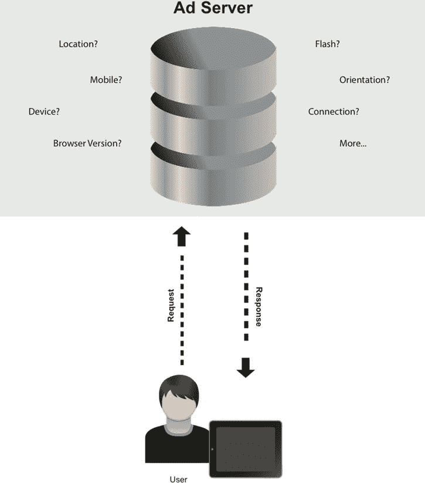
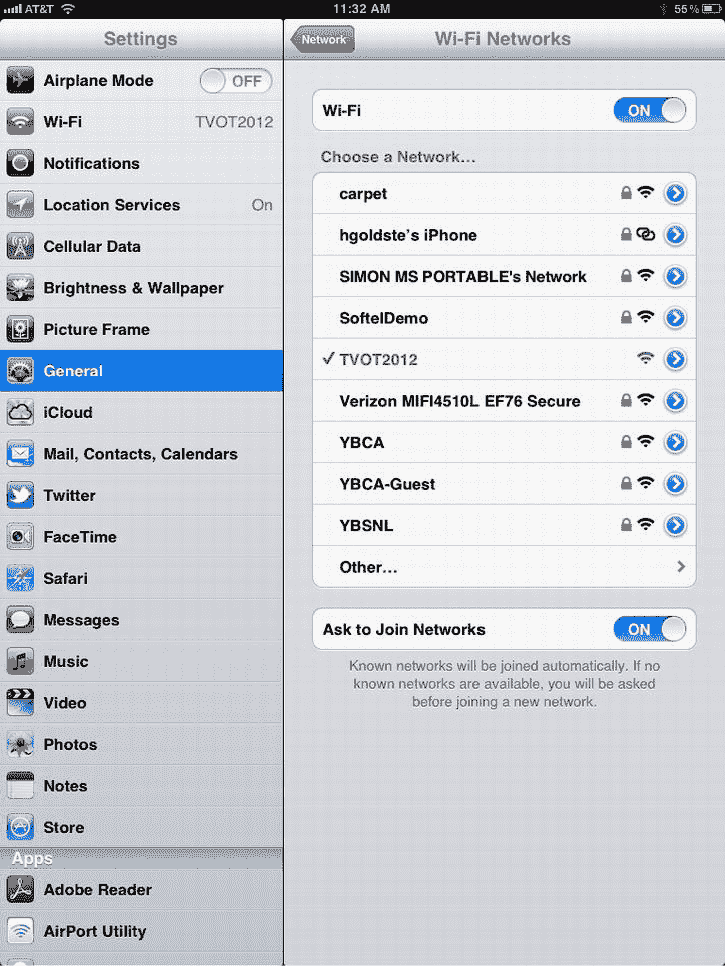
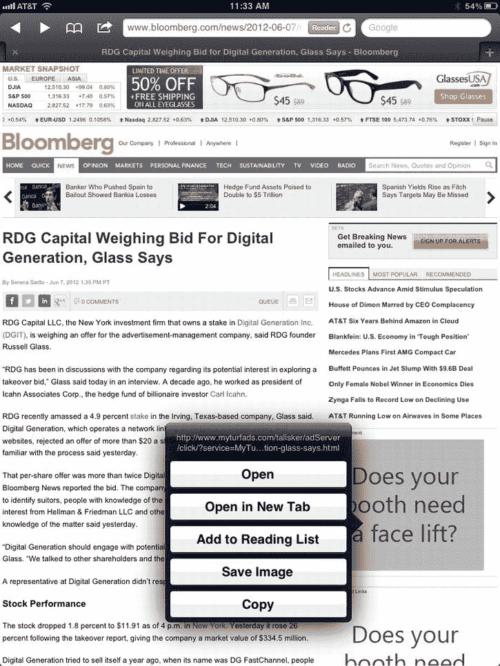
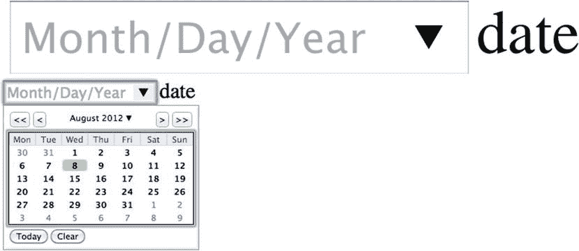
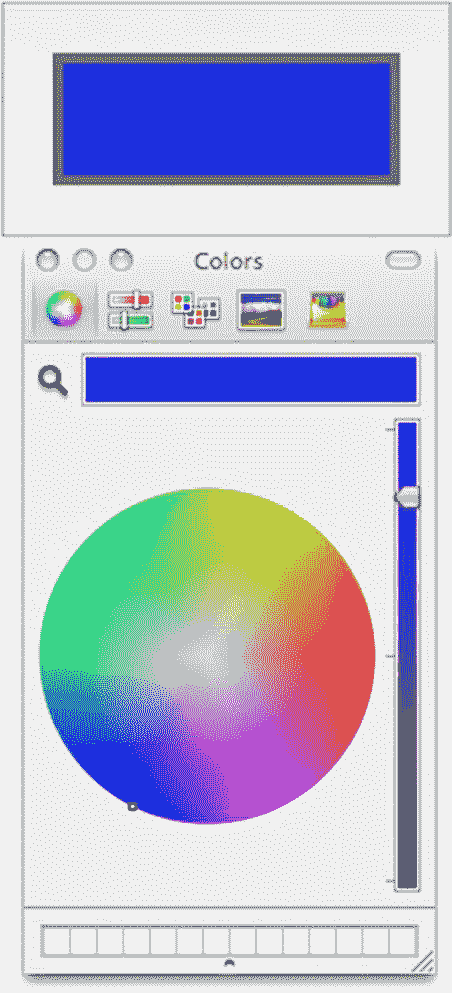
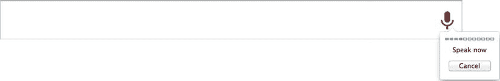
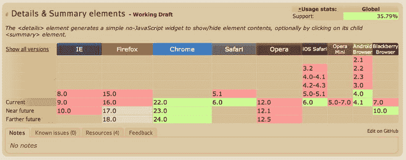
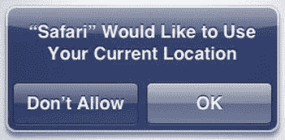
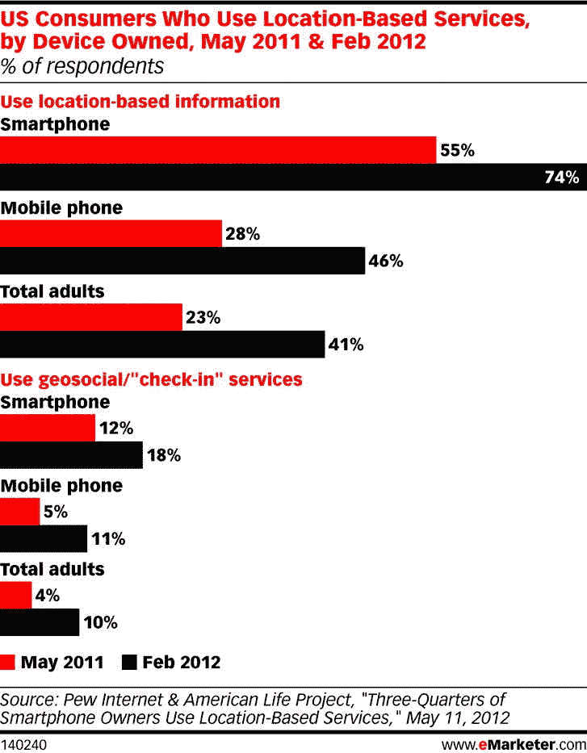
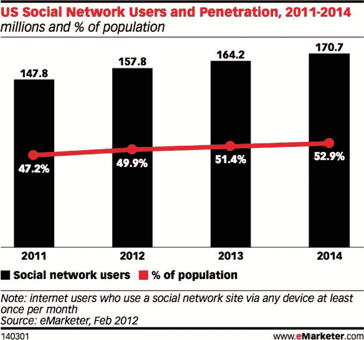

# 十一、使用 HTML5 的动态广告

动态广告在当今世界并不新鲜。用户和营销人员已经习惯于看到丰富创意与相关信息和数据相结合的概念。然而，这种动态行为传统上是使用 Flash 完成的，广告将引用外部 web 服务来更新其创意内容，这些内容可以是更新的文本、新图像，甚至是全新的广告体验。在这一章中，我将把重点放在帮助塑造动态广告市场的相同概念上，但我将主要关注 HTML5 和相关的开放网络技术。

让我们更深入地探讨“动态”这一主题，并弄清楚如何利用外部数据、发布者传递的数据、公共和私有 web 服务以及各种 API 来操纵广告投放时的创意。我将介绍基于地理定位的本地目标用户，并演示广告不一定要“嵌入”其中。我将回顾广告服务器和广告服务技术如何使用定制宏来帮助加速运行时动态，我还将展示广告如何能够及时、相关和高效地动态创建“热插拔”内容。使用这些技术，我将介绍您的广告将利用动态数据的技术，包括 XML、JSON 和直接 JavaScript。学习这些工具将最终打开在线广告的新世界。

交付规则

让我们从最基本的动态广告形式开始，它们是广告服务器的动态属性。通常，广告服务器可以为请求广告内容的用户设置传送规则。这种关系是这样的:“嘿，广告服务器，我是一个横向的 iPad 用户。给我一个不是基于 Flash 并且大小合适的创意。”然后,广告服务器将通过浏览器字符串(用户代理)查找来仔细检查用户是否确实在 iPad 上，然后将根据请求交付适当的创意类型。图 11-1 解释了用户和广告服务器之间的请求-响应关系。



图 11-1。具有动态输入/输出值的典型广告服务器请求-响应

交付规则有很大的威力，因为它们是广告服务器的第一道入口；广告服务公司试图使这种广告响应超快，以便为观看内容的每个人留下印象。他们通常以毫秒为单位来判断这个响应时间。广告服务器不仅仅使用浏览器嗅探技术；它们可以嗅出用户 cookies 或存储在客户端浏览器缓存中的数据，以及 IP 地址、ISP 和其他各种数据，我将在后面介绍。递送规则或设置通常适用于如何通过请求用户的广告标签将广告提供给发布者页面。交付规则通常可以有频率、轮换和用户自定义规则以及与之相关联的特定创作类型。这些规则还可以与其他变量配对，例如一天中的时间、位置以及广告服务器可以分析的任何其他变量。我将在接下来的小节中逐一介绍这些技术。

*频率*是用户会看到广告的次数。如果活动持续一天，并且用户一天多次频繁访问发布者页面，则该用户可以在初始查看之后“限制频率”,并且此后提供不同的创意。 *轮换*简单来说就是一个用户在一次活动执行中可能看到多少不同的创意。如果广告商准备好了多个创意版本，广告服务器可以将它们轮流放置，这样用户就可以通过多个广告请求来观看新鲜内容。*用户散列规则*检测客户端浏览器或设备能够呈现什么。这可能是一个静态创意，Flash 创意，或 HTML5 创意。这实际上取决于客户端浏览器可以处理哪些功能，包括浏览器的特定功能。如果用户不能支持 HTML5，用户能支持 Flash 吗？如果没有，图像怎么样？

 **注意**每个广告服务供应商都有不同的能力。接触他们，以确定什么对你和你的竞选活动有效。

利用这些广告服务设置，可以实现一些非常巧妙和动态的用例。例如，你可以通过相同的广告标签向 iPad 用户和智能电视用户提供创意。这使得发行商可以通过他们所有的分销渠道销售媒体，并让他们的 AdOps 团队高枕无忧，因为他们只需要传输一个标签。您能想象为每个移动设备、平板电脑、电脑、电视等处理多个标签有多难吗？很快就变得疯狂了！

随着广告服务器和技术供应商向其注入更多数据，交付规则变得更加强大。广告服务器可以分析的数据越多，广告体验就越定制。这种技术通常由所谓的*动态创造性优化* (DCO) 驱动。DCO 引擎允许在许多变量甚至第三方变量或输入上提供动态创意。真正智能的 DCO 引擎可以考虑位置、性别、年龄、性取向和兴趣，以及许多其他输入值。利用这些有价值的数据，营销人员可以更有效地锁定他们的受众，知道他们想要触及哪些受众群体(以及哪些创意信息)。一些广告服务器甚至可以检测 WiFi 热点，并根据他们使用的网络服务相应地定向广告。例如，图 11-2 是我去年在三藩市参加会议时收到的。当我访问出版商网站[Bloomberg.com](http://Bloomberg.com)时，广告服务器根据我的 IP 地址知道我在使用免费的会议 WiFi，并相应地定向广告。为了更好地理解这种动态能力，请看下面的一系列图片。


图 11-2。Bloomberg.com[上的初始屏幕](http://Bloomberg.com)使用 AT & T 的 3G 服务

这第一张图片是我在 iPad 上使用 AT & T 的 3G 网络时向[Bloomberg.com](http://Bloomberg.com)发出的最初请求。如你所见，我在屏幕右侧看到一些广告。现在，如果我跳上会议的 w if I，正如你将在图 11-3 中看到的，我将看到更新的体验。



图 11-3。屏幕使用旧金山的免费会议 WiFi

图 11-3 展示了我在 iPad 上进入设置应用打开会议的免费 WiFi 时的情况。图 11-4 展示了更新后的广告体验。


图 11-4。使用免费 WiFi 服务后更新的【Bloomberg.com 站点

正如你从图 11-4 中看到的，我被广告服务器根据我的已知位置定向了一个特定的广告。因为我使用的是的免费 WiFi 服务，广告服务器知道我在哪里，可以根据那个 IP 地址提供相关的广告。现在如果我点击并按住广告，如图图 11-5 所示，你会看到广告服务器的域名。



图 11-5。负责显示这些动态广告的广告服务器

如图 11-5 所示，你可以看到，当我点击并按住广告时，我看到的是这个广告单元的点击目的地，http://myturfads.com[是广告服务器，负责识别我在免费网络上的 IP 地址，并呈现这些相关的动态广告。](http://myturfads.com)

发布者传递的数据

广告服务器本身就非常强大，当与 DCO 产品和动态交付规则结合使用时，它们真的非常强大。但有趣的是，广告服务器甚至可以使用出版商的数据来为广告体验带来更多动态。发布者传递的数据可以用于提供动态广告，方法是将发布者知道的访问者信息传递到广告服务器的广告标签中。该信息通常以字符串值的形式通过广告标签，通常以逗号或竖线分隔，但它通常可以在来自发布者的标签传递中加密，然后由广告服务器解密。这种加密是为了防止恶意行为在不知情的情况下利用用户的数据。发布者通常通过向用户/成员提供注册的免费服务来收集这些数据。这可能是一个电子邮件帐户，免费音乐流媒体帐户，甚至是一个社交网络。以下示例可以表示 ad 标记输入的许多值，如年龄、邮政编码、性别和兴趣:

```html
var adInput = "29|19428|M|Business,Technology"

Or Base64 encoded:

var adInput = "Mjl8MTk0Mjh8TXxCdXNpbmVzcyxUZWNobm9sb2d5";
```

 **注**关于 Base64 编码的更多信息，请访问[`base64encode.org`](http://base64encode.org)。

如您所见，adInput 变量可能是广告服务器的广告标签的主要输入。然后，当广告在其页面上呈现时，发布者将填充数据。利用这种类型的数据传递的出版商有 Yahoo、MSN、AOL 和许多许多其他出版商，因为它允许在其用户群中使用更相关的广告方法。如果你还记得第一章，我提到过，大多数免费服务，如雅虎和谷歌，为他们的广告商提供庞大的用户群，以换取媒体费用。换句话说，出版商提供收集用户信息的免费服务。因此，用户是出版商出售的产品，广告商是出版商的客户。然而，这并不都是消极的。人们发现，使用这些丰富的集成将使您的活动提高十倍，因为它将正确的消息在正确的时间关联到正确的用户，用户可以从他们真正关心的广告中受益。

宏和变量

宏是我要介绍的最后一个广告服务功能。软件中的宏通常被用作临时替代值，以后会被替换。当您在 JavaScript 中引用其他值的地方使用变量时，您可能对此很熟悉。

一个简单的例子是 var man = john，其中 man 是变量，john 是值。更进一步，宏可以用于大量的服务器端值替换。例如，假设你开发了一个创意，你所有的点击链接都依赖于广告发布页面。如果是这种情况，而你没有宏指令，创意就需要用许多不同的方式来开发，以满足每一个位置。但是，对于宏，您可以使用这些替代宏值，并且在发布广告时，根据发布者的位置，这些值会被切换到正确的值。如果你向 CNN.com 和 BBC.com 提供相同的广告，下面的代码示例将更好地展示这个概念:

```html
Ad server assignment forCNN.com:
MACRO= "http://www.cnn.com"

Ad server assignment for BBC.com:
MACRO= "http://www.bbc.co.uk"

HTML for creative:
<a href=MACRO target="_blank"></a>

```

正如您所看到的，以这种方式开发比在未来需要做出改变时更新大量创意更具可伸缩性。

使用 XML 和 JSON

到目前为止，从广告服务器的角度来看，您已经对广告如何动态地针对您这个用户有了相当的了解，但是让我们稍微转换一下话题，更多地讨论动态广告的技术方面，因为它们与 HTML5 和开放 Web 相关。尤其是在创意方面，你可以利用数据来操纵广告中的创意元素。但在你走上这条路之前，你需要弄清楚你的创意如何处理来自各种服务的外部数据。在 HTML5 中工作的两个最常见的通信层是可扩展标记语言(XML)和 JavaScript 对象符号(JSON) 。XML 和 JSON 在业界被广泛采用，因为它们被用于各种数据端点的许多 RESTful APIs 中。

 **注意**要获得 RESTful APIs 的详细信息，请访问[`blog.apigee.com/detail/restful_api_design`](http://blog.apigee.com/detail/restful_api_design)。

使用一种所有低级代码语言都能理解和解析的通用语言，可以让 web 开发人员轻松采用、交流和普及。从引入一个品牌的 Twitter feed 到引入一个股票行情自动收录器，甚至使用一个天气 feed 或当地零售产品，都可以被引入广告创意。传统上，这都是使用 XML 或 JSON 数据完成的，下面几节将展示使用 XML 和 JSON 与外部数据提供者合作的最佳方式。

XML

XML 可能是 web 服务最常用的语言。我不打算深入 XML 的本质，但是在广告世界中，广告会通过 HTTP 请求向某个 web 服务发出请求，通常带有一些必要的 URL 查询参数。web 服务对该请求提供的响应传统上是 XML 格式的。清单 11-1 展示了来自雅虎开放天气服务的请求和 XML 响应。

***清单 11-1*** 。雅虎的天气 API XML 示例

```html
HTTP Request:
http://query.yahooapis.com/v1/public/yql/jonathan/weather?zip=19428

Server Response:
<query yahoo:count="1" yahoo:created="2012-08-01T23:15:47Z" yahoo:lang="en US" xmlns:yahoo="http://www.yahooapis.com/v1/base.rng">
<results>
<channel>
<title>Yahoo! Weather - Conshohocken, PA</title>
<link>http://us.rd.yahoo.com/dailynews/rss/weather/Conshohocken__PA/*http://weather.yahoo.com/forecast/USPA0326_f.html</link>
<description>Yahoo! Weather for Conshohocken, PA</description>
<language>en-us</language>
<lastBuildDate>Wed, 01 Aug 2012 6:34 pm EDT</lastBuildDate>
<ttl>60</ttl>
<yweather:location city="Conshohocken" country="US" region="PA" xmlns:yweather="http://xml.weather.yahoo.com/ns/rss/1.0"/>
<yweather:units distance="mi" pressure="in" speed="mph" temperature="F" xmlns:yweather="http://xml.weather.yahoo.com/ns/rss/1.0"/>
<yweather:wind chill="70" direction="0" speed="0" xmlns:yweather="http://xml.weather.yahoo.com/ns/rss/1.0"/>
<yweather:atmosphere humidity="94" pressure="29.85" rising="2" visibility="4" xmlns:yweather="http://xml.weather.yahoo.com/ns/rss/1.0"/>
<yweather:astronomy sunrise="5:57 am" sunset="8:12 pm" xmlns:yweather="http://xml.weather.yahoo.com/ns/rss/1.0"/>
<image>
<title>Yahoo! Weather</title>
<width>142</width>
<height>18</height>
<link>http://weather.yahoo.com</link>
<url>http://l.yimg.com/a/i/brand/purplelogo//uh/us/news-wea.gif</url>
</image>
<item>
<title>Conditions for Conshohocken, PA at 6:34 pm EDT</title>
<geo:lat xmlns:geo="http://www.w3.org/2003/01/geo/wgs84_pos#">40.08</geo:lat>
<geo:long xmlns:geo="http://www.w3.org/2003/01/geo/wgs84_pos#">−75.3</geo:long>
<link>http://us.rd.yahoo.com/dailynews/rss/weather/Conshohocken__PA/*http://weather.yahoo.com/forecast/USPA0326_f.html</link>
<pubDate>Wed, 01 Aug 2012 6:34 pm EDT</pubDate>
<yweather:condition code="30" date="Wed, 01 Aug 2012 6:34 pm EDT" temp="70" text="Partly Cloudy" xmlns:yweather="http://xml.weather.yahoo.com/ns/rss/1.0"/>
<description>
<![CDATA[ <br /> <b>Current Conditions:</b><br /> Partly Cloudy, 70 F<BR /> <BR /><b>Forecast:</b><BR /> Wed - Scattered Thunderstorms. High: 82 Low: 66<br /> Thu - Partly Cloudy. High: 91 Low: 70<br /> <br /> <a href="http://us.rd.yahoo.com/dailynews/rss/weather/Conshohocken__PA/*http://weather.yahoo.com/forecast/USPA0326_f.html">Full Forecast at Yahoo! Weather</a><BR/><BR/> (provided by <a href="http://www.weather.com" >The Weather Channel</a>)<br/> ]]>
</description>
<yweather:forecast code="47" date="1 Aug 2012" day="Wed" high="82" low="66" text="Scattered Thunderstorms" xmlns:yweather="http://xml.weather.yahoo.com/ns/rss/1.0"/>
<yweather:forecast code="30" date="2 Aug 2012" day="Thu" high="91" low="70" text="Partly Cloudy" xmlns:yweather="http://xml.weather.yahoo.com/ns/rss/1.0"/>
<guid isPermaLink="false">
USPA0326_2012_08_02_7_00_EDT
</guid>
</item>
</channel>
</results>
</query>
```

从清单 11-1 中可以看到，该广告使用查询参数 zip=19428 向 http://query.yahooapis.com[域发出 HTTP 请求，并获得一个有效的 XML 作为响应，其中包含用户定义的邮政编码的详细天气情况。这个真的很厉害！如果您从您的广告服务器中了解到，您可以让广告服务器在最初的广告请求中检测您的位置，将位置数据转换为邮政编码，并将该邮政编码传递给气象服务，以提供相关和最新的广告体验，这是用户在广告投放时真正关心的。](http://query.yahooapis.com)

数据

JSON 与 XML 非常相似，它以层次结构来组织数据，但它的主要区别在于它实际上是由浏览器本地解析的 JavaScript 对象，而不管 XML 清单如何。JSON 和 JSON-P 的另一个好处是，它不关心它来自哪个领域。这意味着，如果托管信息的域(在本例中是 Yahoo)与发出请求的域(在本例中是 ad)不是同一个域，那么 XML 的响应就会受到影响。有办法绕过这种跨源策略，要么使用 CORS，你在第六章中了解到，要么简单地使用 JSON-P。有时 JSON-P 不是 web 服务响应数据格式的一个选项，但如果是，你就永远不需要担心处理 HTML5 广告时的域安全问题。以雅虎的天气服务为例，发出 JSON 请求与 XML 非常相似。清单 11-2 展示了使用 JSON 的同一个例子。

***清单 11-2*** 。雅虎天气 API JSON 示例

```html
Request:
http://query.yahooapis.com/v1/public/yql/jonathan/weather?zip=19428&format=json

Response:
{
    "query": {
        "count": 1,
        "created": "2012-08-01T23:29:00Z",
        "lang": "en-US",
        "results": {
            "channel": {
                "title": "Yahoo! Weather - Conshohocken, PA",
                "link": "http://us.rd.yahoo.com/dailynews/rss/weather/Conshohocken__PA/*http://weather.yahoo.com/forecast/USPA0326_f.html",
                "description": "Yahoo! Weather for Conshohocken, PA",
                "language": "en-us",
                "lastBuildDate": "Wed, 01 Aug 2012 6:53 pm EDT",
                "ttl": "60",
                "location": {
                    "city": "Conshohocken",
                    "country": "US",
                    "region": "PA"
                },
                "units": {
                    "distance": "mi",
                    "pressure": "in",
                    "speed": "mph",
                    "temperature": "F"
                },
                "wind": {
                    "chill": "72",
                    "direction": "0",
                    "speed": "0"
                },
                "atmosphere": {
                    "humidity": "94",
                    "pressure": "29.85",
                    "rising": "0",
                    "visibility": "5"
                },
                "astronomy": {
                    "sunrise": "5:57 am",
                    "sunset": "8:12 pm"
                },
                "image": {
                    "title": "Yahoo! Weather",
                    "width": "142",
                    "height": "18",
                    "link": "http://weather.yahoo.com",
                    "url": "http://l.yimg.com/a/i/brand/purplelogo//uh/us/news-wea.gif"
                },
                "item": {
                    "title": "Conditions for Conshohocken, PA at 6:53 pm EDT",
                    "lat": "40.08",
                    "long": "-75.3",
                    "link": "http://us.rd.yahoo.com/dailynews/rss/weather/Conshohocken__PA/*http://weather.yahoo.com/forecast/USPA0326_f.html",
                    "pubDate": "Wed, 01 Aug 2012 6:53 pm EDT",
                    "condition": {
                        "code": "30",
                        "date": "Wed, 01 Aug 2012 6:53 pm EDT",
                        "temp": "72",
                        "text": "Partly Cloudy"
                    },
                    "description": "\n<br />\n<b>Current Conditions:</b><br />\nPartly Cloudy, 72 F<BR />\n<BR /><b>Forecast:</b><BR />\nWed - Scattered Thunderstorms. High: 82 Low: 66<br />\nThu - Partly Cloudy. High: 91 Low: 70<br />\n<br />\n<a href=\"http://us.rd.yahoo.com/dailynews/rss/weather/Conshohocken__PA/*http://weather.yahoo.com/forecast/USPA0326_f.html\">Full Forecast at Yahoo! Weather</a><BR/><BR/>\n(provided by <a href=\"http://www.weather.com\" >The Weather Channel</a>)<br/>\n",
                    "forecast": [{
                        "code": "47",
                        "date": "1 Aug 2012",
                        "day": "Wed",
                        "high": "82",
                        "low": "66",
                        "text": "Scattered Thunderstorms"
                    }, {
                        "code": "30",
                        "date": "2 Aug 2012",
                        "day": "Thu",
                        "high": "91",
                        "low": "70",
                        "text": "Partly Cloudy"
                    }],
                    "guid": {
                        "isPermaLink": "false",
                        "content": "USPA0326_2012_08_02_7_00_EDT"
                    }
                }
            }
        }
    }
}

```

正如您在清单 11-2 中看到的，请求几乎是相同的。唯一需要改变的是数据的格式。在这种情况下，您向名为 format=json *的请求添加一个额外的查询参数。*这又是一个非常强大的功能，它允许广告从不同的领域获取数据，而不需要“白名单”想一想当你可以动态地改变你的广告而不“实际上”改变它的可能性。

 **注意**有客户端 XML 到 JSON 的格式化程序(参见[`thomasfrank.se/xml_to_json.html`](http://thomasfrank.se/xml_to_json.html))，但是它们不能解决跨域策略的问题。

内容格式化

所以，你可能会问自己，这种动态数据很好，但我不需要处理和调节注入广告的数据吗？这是一个很棒的问题，显而易见的答案是肯定的！像使用脏话过滤器、添加省略号、调整文本大小、插入换行符代码等都需要考虑在内。

首先，脏话过滤器通常可以在后端或服务器端完成。在这些数据被输入到服务中之前，通常最好的做法是对针对该品牌的脏话和负面评论进行处理。也就是说，接触后端开发人员以确保这项技术到位总是好的。如果不是，清单 11-3 显示了一个很好的使用 JavaScript 的客户端脏话过滤器。

***清单 11-3*** 。JavaScript 发誓过滤器示例

```html
<html>
<head>
<script type="text/javascript">
//Grow this list for as long as you wish...
var keyWords = [D'oh,'jeez','dagnabit','boo','agh','Golly'];

function replaceChars(chr,cnt) {
  var s = '';
  for (var i=0; i<cnt; i++) {
    s += chr;
    console.log(s);
  }
  return s;
}

function checkWords() {
  var inputText = document.getElementById('textArea').value;
  var outputText = document.getElementById('conditionedText');

  for (var i=0; i < keyWords.length; i++) {
    var rg = new RegExp(keyWords[i]+' ',"ig");
    inputText = inputText.replace(rg,replaceChars('*',keyWords[i].length)+' ');
  }

  outputText.textContent = inputText;
}
</script>
</head>
<body>
<textarea id="textArea" rows="5" cols="13">
This chapter is dagnabit amazing!
</textarea>
<button onclick="checkWords()">Submit!</button>
<div id="conditionedText"></div>
</body>
</html>
```

你这么说真是太好了！如您所见，您可以向关键字数组中添加任意数量的单词，并且可以随意使用对您来说最有意义的单词。将 JSON 文件中的单词外部化也可能是一个更好的主意，这样就可以轻松地进行更新，而无需深入核心脚本文件。这也可以用于我们在第六章中学到的网络工作者。

另一种调节数据的方法是 CSS 的“HTML5 新特性”省略号文本属性。如果您不确定 web 服务返回的字数，您可以设置文本区域的宽度和高度值，并将文本区域内的副本设置为 overflow: ellipsis。看看清单 11-4 中的。

***清单 11-4*** 。溢出省略号示例

```html
<html>
<head>
</head>
<body>
<div id="textArea">
Lorem Ipsum is simply dummy text of the printing and typesetting industry. Lorem Ipsum has been the industry's standard dummy text ever since the 1500s, when an unknown printer took a galley of type and scrambled it to make a type specimen book. It has survived not only five centuries, but also the leap into electronic typesetting, remaining essentially unchanged. It was popularised in the 1960s with the release of Letraset sheets containing Lorem Ipsum passages, and more recently with desktop publishing software like Aldus PageMaker including versions of Lorem Ipsum.
</div>
</body>
<style type="text/css">
#textArea {
  text-overflow: ellipsis;
  -o-text-overflow: ellipsis;
  -moz-text-overflow: ellipsis;
  -ms-text-overflow: ellipsis;
  -webkit-text-overflow: ellipsis;
  height: 100px;
  width: 200px;
  overflow: hidden;
  white-space: nowrap;
  padding: 5px;
}
</style>
</html>
```

现在，填充名为 textArea 的 div 的任何副本都将在副本的末尾附加一个省略号，以防单词溢出 div 容器。还有另一个对移动设备有用的 CSS 技巧，叫做 overflow: scroll。在移动设备(iOS 5 以上)上使用以下 CSS 将为您提供与本机操作系统类似的本机优雅滚动功能:

```html
#textArea {
        overflow: scroll;
-webkit-overflow-scrolling: touch;
}
```

接下来，我将讨论随着数据和单词的增长而调整文本大小的概念。同样，在处理动态数据时，您不知道响应中有多少数据。除非您事先与可能采用字符限制的后端开发人员讨论这个问题，否则您将需要使用一些文本大小调整代码，您可以通过 JavaScript 利用这些代码来检测 div 容器的大小和填充容器的字数。使用 Nikolay Kuchumov 的位于[`jsfiddle.net/qW5h2/1`](http://jsfiddle.net/qW5h2/1)的例子，你可以减小字体的大小，以适应其设计的分配空间。这有点棘手，如果副本明显减少，甚至会反过来咬你一口，特别是如果你的客户是制药公司，出于法律原因，每个字都需要清楚。最好的办法是与您的 web 服务提供商沟通，如果时间允许，他们可能会添加一个带有字体大小值的特殊节点。通过这种方式，ad 可以适当地检查该节点的值和大小，而无需执行任何逻辑。

我还想提到另一个技巧，那就是视口大小的概念。这对移动设备越来越重要。简而言之，视口大小/比例可以根据视口的缩放级别动态更新屏幕上字体的大小和比例。如果你在 vw *中使用 CSS 字体大小，这是需要注意的。*请记住，这将改变之前显示的容器大小方法，但是在这些技巧之间，您应该很好地了解什么技术最适合您和您的活动。更多关于视窗尺寸类型的信息，请访问[`css-tricks.com/viewport-sized-typography`](http://css-tricks.com/viewport-sized-typography)。

 **注意**还有一个非常好的轻量级 jQuery 插件叫做 FitText([`fittextjs.com`](http://fittextjs.com))用于响应字体大小。

HTML5 数据属性

现在，您已经了解了利用广告中的数据是多么有效，让我们来看看 HTML5 允许您在新的浏览器市场中使用的一些新功能。HTML5 中新增了可选的任意数据属性，可以在 HTML 标记中使用。以“宏和变量”一节中的例子为例，您可以在 HTML 中插入这些未定义的宏值，而不会影响您的有效标记。data 属性是向标记中添加动态值的好方法，而不用通过脚本将它们移植到 DOM 中。清单 11-5 展示了如何在你的广告中使用自定义数据属性，如果你想从一个零售商店的 web 服务中动态添加产品，比如来自(【http://shoplocal.com】??)的一个。

***清单 11-5*** 。HTML5 数据属性示例

```html
<!DOCTYPE HTML>
<html>
<head>
</head>
<body>
<div data-name="product" data-url="http://www.productURL.com"></div>
</body>
<script>
var element = document.getElementsByTagName('div')[0];
var name = element.dataset.name = "product"
var url = element.dataset.url = "http://www.productURL.com"
console.log('name' + name, 'url' + url)
</script>
</head>
</html>
```

 **注**关于[ShopLocal.com](http://ShopLocal.com)零售 API 的更多信息，请访问[`aboutshoplocal.com/products/paperboy`](http://aboutshoplocal.com/products/paperboy)。

data 属性只需使用 data-*，其中*代表您想要的任何值。在这种情况下，您使用名称和 URL，因为它们与产品信息相关，可以根据来自 Shoplocal API 的响应在您的广告中动态填充。只是重申一下，这可以是你想要的任何名字！发疯吧——这些都是有效的 HTML！

使用数据属性的真正好处是，通过添加的所有属性，您可以立即向用户显示信息，而不必担心发出任何额外的外部请求或进行任何服务器端查询。由于数据是放在标记中的，所以它已经存在了。这极大地提高了性能，因为数据已经存在于 DOM 中。您不需要“请求更多信息”,因为这些信息已经包含在初始回复中了。有关 HTML5 中自定义数据属性的更多详细信息，请访问[`html5doctor.com/html5-custom-data-attributes`](http://html5doctor.com/html5-custom-data-attributes)。

H TML5 中另一个真正有用的新属性叫做 hidden。使用 hidden 属性时，浏览器不应呈现元素；但是，该元素在标记中仍然可见，并且可以从 DOM 中访问。当您想要显示元素时，可以使用 JavaScript 移除隐藏的属性。这很简单。清单 11-6 定义了一个隐藏的宏值。在 JavaScript 执行并检测到您的值被广告服务器替换后，您可以将元素及其值呈现到屏幕上供用户显示。这在您需要在将数据呈现给用户之前请求数据的情况下非常有用。

***清单 11-6*** 。HTML5 隐藏属性示例

```html
<!DOCTYPE HTML>
<html lang=en>
<head>
<script>
var output = document.getElementsByTagName('p')[0];

function onAdServerComplete (value) {
        // macro value
        var welcome = "Hello " + value;
        output.innerHTML = welcome;
        output.removeAttribute('hidden');
}

//Example Callback with value from AdServer
onAdServerComplete("John");
</script>
</head>
<body>
<p hidden>MACRO</p>
</body>
</html>
```

内容可编辑

下一个特性与其说是 API，不如说是属性，但它仍然是用户交互的重点，这是 HTML5 规范和动态数据的主要特性。信不信由你，*内容可编辑*自微软的 Internet Explorer 5.5 版本以来就已经存在，现在它在所有五种主要的现代浏览器中都得到支持。当使用内容可编辑特性时，您需要做的就是在您想要使之可编辑的元素上将 content editable 属性设置为 true。您还可以将此功能与推送至服务器或客户端存储的能力相结合，并管理更改，以便在用户再次体验时参考。清单 11-7 展示了 contenteditable 属性的作用。

***清单 11-7*** 。内容可编辑示例

```html
<!DOCTYPE html>
<html lang="en">
<head>
<meta charset=utf-8>
<body>
<header contenteditable=true>Enter Some Text Here</header>
</body>
</html>
```

漂亮，简单，对吧？现在，您可以编辑 header 元素中的任何内容。实际上，您可以将该属性添加到 body 元素中，并允许编辑整个页面。广告中可编辑的内容有很大的潜力。实际上，您可以让用户编辑创意元素，允许他们创造性地改变自己的广告体验，而不是为所有用户输入使用输入字段。例如，如果您有一个广告活动，要求用户输入信息，允许他们定制、操作和编辑任何内容，包括广告本身的风格，会怎么样？这可能不是所有时候的理想情况，但对于特定的活动，这可能是一种独特的方法。当其他广告客户向他们的终端用户强行灌输信息时，这可以采取相反的方法，要求用户进行创造性的输入。这样，你就可以允许用户编辑整个广告，并将更改保存到浏览器或服务器上，下次他们按顺序查看广告时，就会看到他们曾经编辑过的最新保存版本。这也将允许品牌好好看看他们的用户是如何定制他们的品牌体验的，这将为品牌关系提供重要的细节。看一下清单 11-8 ，用户可以编辑广告体验的 CSS 样式，并将他们的更改保存到浏览器存储中。

***清单 11-8*** 。内容可编辑广告示例

```html
<!DOCTYPE html>
<head>
    <meta charset=utf-8>
<style type="text/css">
    * {
        -webkit-tap-highlight-color:rgba(0,0,0,0);
        outline: none;
        text-rendering: optimizeLegibility;
    }
    #cta {
        font: 175% sans-serif;
        text-align: center;
        margin-bottom: 20px;
    }
    #ad style{
        display: block;
        text-align: center;
    }
    #ad:hover{
        background-color: #999;
        width: 300px;
        height: 250px;
    }
    button {
      margin-top: 20px;
      margin-bottom: 20px;
      width: 300px;
      height: 30px;
    }
</style>
    <body align="center">
      <div id="cta">Edit Your Own CSS!</div>
        <div id="ad" contenteditable>
            <div id="style">
              <style contenteditable>
              #ad {
                  background-color: #fff;
                  width: 300px;
                  height: 250px;
                  border: 1px solid #000;
              }
              </style>
            </div>
        </div>
        <button id="clearValues">clear storage</button>
        <div id="output"></output>

        <script type="text/javascript">
        var adStyle = document.querySelector('#style'),
            clearIt = document.querySelector('#clearValues'),
            output = document.querySelector('#output');

        function adInit () {
            if (localStorage.getItem('adValue') === 'null' || localStorage.getItem('adValue') === null) {
                console.log('init')
            } else {
                adStyle.textContent = localStorage.getItem('adValue');
                console.log(localStorage.getItem('adValue'))
                output.textContent = "Values Loaded!!!";
            }

            adStyle.addEventListener('DOMCharacterDataModified', updateAdStyle, false);//Fires everytime a character is changed
            clearIt.addEventListener('click', clear, false);

            adStyle.focus();
        }

        function updateAdStyle () {
            if(localStorage) {
                output.textContent = "Values Saved!!!";
                console.log(adStyle.textContent);
                //store the values
                var styleFix = "<style contenteditable>" + adStyle.textContent + "</style>";
                localStorage.setItem('adValue', styleFix);
            }
        }

        function clear () {
            if(localStorage.getItem('adValue') != 'null' || localStorage.getItem('adValue') != null) {
              localStorage.clear();
            }
            output.textContent = "";
            console.log('clear')
        }
        window.addEventListener('DOMContentLoaded', adInit, false);

        </script>
</body>
</html>
```

正如您在前面的例子中看到的，您允许用户直接在页面上编辑 CSS，或者在本例中是 300 250 ad 单元。根据用户所做的编辑，在 localStorage 中存储一个名为 adValue 的长字符串值。现在，下一次用户查看广告时，这些值将被存储，并且仍然可以被操作。这真的打开了真正定制广告体验的大门。

HTML5 表格和输入

表单很可能是你第一次意识到你的网页内容可以变成交互式的。你不仅可以和你的用户互动，还可以根据他们的输入来定制你的网站和内容。这实质上是动态内容的整个基础。允许互动，优化反馈，并特别向与广告互动的用户呈现信息。也就是说，谈到动态广告，我不能不提到 HTML5 中表单和输入的更新。表单和输入标签长期以来一直与 Web 上的用户输入相关联。HTML5 表单最令人兴奋的新特性之一是使用客户端验证的能力。

以下是 HTML4 的前一种方法:

```html
<!DOCTYPE HTML PUBLIC "-//W3C//DTD HTML 4.01 Transitional//EN" "http://www.w3.org/TR/html4/loose.dtd">
<html>
<head>
<meta http-equiv="Content-Type" content="text/html; charset=UTF-8">
</head>

<body>
<form>
        <input name="email" oninput=validate(this);>
</form>
</body>
</html>

function validate (input) {
...tons of validation code and regex magic
}
```

这是 HTML5 的新方法:

```html
<!DOCTYPE HTML>
<html>
<head>
<meta http-equiv="Content-Type" content="text/html; charset=UTF-8">
</head>
<body>
<form>
    <input type=email required>
</form>
</body>
</html>
```

就这样！你注意到粗体字了吗？只要确保在 input 元素中包含所需的属性，浏览器就会处理输入验证。对于新手来说，这似乎合乎逻辑，没有什么了不起的，但实际上，在此之前，您需要包含一些长的 JavaScript 验证/regex 函数来检查字符串值，以确保它的格式良好，便于服务器处理。现在，浏览器会为您处理这一切。好好想想吧！每个开发人员都希望确保他们的输入得到正确的验证，所以如果每个开发人员都这样做，就让浏览器自己处理吧。为什么要为每个需要的项目重复自己？这也是 HTML5 努力实现的目标。

除了表单验证，HTML5 兼容的浏览器还包括本机数据类型，如日期、颜色、电子邮件、URL 和电话号码表单标记，所有这些都带有必要的客户端验证，正如您在前面的示例中所了解的。让我们分别来看看如何使用它们。首先，约会。

默认情况下，浏览器可以在浏览器的 UI 中为用户包含日历选择器元素。 图 11-6 展示了浏览器 Chrome 如何处理<输入 type = " date "></输入>。



图 11-6。Chrome 浏览器如何处理日期输入

接下来是颜色输入。使用<input type="color"> 可以告诉浏览器显示一个色轮供用户选择十六进制值，如图图 11-7 所示。请注意，并非所有的浏览器都处理这些输入。浏览器对于 UI 元素也有自己的视觉差异。



图 11-7。Chrome 浏览器如何处理颜色输入

 **注意**浏览器不能识别的任何输入类型都会优雅地降级为默认文本输入。

HTML5 还支持数字增量和滑块作为输入。只需添加以下输入，就可以让用户增加值并滑动一个简单的(但 CSS 可以换肤的) UI 元素。

```html
<input type="number"></input>
<input type="range" min="1" max="5">range</input>
```

尝试之前的输入标签，你会注意到数字类型会在右边有箭头，范围类型会呈现一个简单的滑块，如图 11-8 中的所示。


图 11-8。Chrome 浏览器如何处理数字和范围输入

这些新的(和旧的)输入格式真正有趣的是与它们相关联的新属性，比如占位符、必填项和真正酷的模式。这些属性中的每一个都有它自己的好处；例如，placeholder 属性允许输入字段显示一些示例文本，以表明用户应该输入什么样的文本格式。这对于特定的文本格式很有帮助，例如信用卡、电话号码，甚至是社会保险号。

正如您所了解的，required 是一个很好的属性，可以确保用户在提交之前填写表单中的某个部分。浏览器现在将检查是否需要任何输入，并在用户试图提交表单时标记它们。

模式属性本质上允许您直接在 HTML 标记中使用自己的正则表达式(regex)。传统上，这只能通过 JavaScript 来处理，如果您希望您的用户显式地输入诸如五位数的邮政编码之类的内容，您可以使用 regex 模式来确保在用户提交数据之前客户端验证已经就绪。清单 11-9 概述了我正在讨论的内容。

***清单 11-9*** 。模式属性示例

```html
<!DOCTYPE html>
<html>
<body>
<form>
  Zip code: <input type="tel" pattern="^\d{5}$" title="Five digit ZIP code" />
  <input type="submit" />
</form>
</body>
</html>
```

正则表达式是非常强大的代码，可以被调整以适应各种各样的用例。在前面的例子中，您使用的是^\d{5}$的 regex 模式，它确保用户输入正确的美国邮政编码的五位数。

 **注意**对于有用的正则表达式测试器/验证器，请访问[`regexpal.com`](http://regexpal.com)。

输入的另一个真正酷的地方是，您可以基于从用户交互(或非交互)中应用的伪类来定制您的 CSS。下面的 CSS 示例显示了如何为未验证的表单元素显示错误区域:

```html
input {
     border: 1px solid #000000;
}
input:focus {
     border: 2px dashed #666666;
}
input:invalid {
     border: 5px solid #FF0000;
}
```

看看前面的 CSS 声明，您可以在焦点上更新边框粗细和颜色，当值无效时，为用户提供更大的边框粗细和亮红色表示“错误”

这些输入的另一个真正有用的特性是 datalist 元素。你是否曾经开始在 Google 上搜索某样东西，并注意到你正在搜索的主题已经被预先填充在输入框下面的列表中？嗯，使用 HTML5 datalist 元素，您可以在用户向 input 标签输入信息时提供类似的有用提示。如果用户试图通过一堆类别过滤广告，datalist 元素会非常有帮助。以之前的 ShopLocal retail 为例，可以向您的用户展示各种类别和产品的广告。为用户过滤它们不是很有帮助吗？让我们来看看下面的例子:

```html
<body>
<input type="text" name="categories" list="categories" />

<datalist id="categories">
    <option value="Electronics">
    <option value="Furniture">
    <option value="Office Supplies">
    <option value="Kitchen">
    <option value="Bedding">
    <option value="Bath">
</datalist>
</body>
```

从代码中可以看出，您有一个名为 categories 的数据表，其中包含所有可能类别的选项值。现在，当用户开始在输入字段中输入内容时，使用名为 categories 的列表属性,您可以在用户输入时向他们显示选项。

表单并没有就此结束，它有很多改进，甚至工作组也在为 HTML5 和 HTML 制作更多的内容。也就是说，一个用于输入的成熟的 JavaScript 语音 API 正在开发中，目前谷歌 Chrome 浏览器的新版本支持该 API。显然是由 Google 的人带头的，您可以在浏览器中开始利用这一点，在您的输入标签中包含以下内容:

```html
<input type="text" x-webkit-speech />
```

在输入标签中使用先前的 x-webkit-speech 属性将在输入文本区域产生图 11-9 。



图 11-9。Chrome 浏览器如何支持语音输入

您还可以使用下面的代码片段解析输入语音的结果，方法是侦听传入的事件并从该事件中获取 results 对象。接下来，您将使用结果的发音和置信度注销到控制台，这是 speech API 中分析用户输入的两个属性。

```html
<script>
input.addEventListener('webkitspeechchange', function(event) {
     if (event.results) {
          for (var i = 0, result; result = event.results[i]; ++i) {
          console.log('Speech: ' + result.utterance + ' ' + result.confidence);
     }
  }
}, false);
</script>
```

 **注意**你可以去[`developer . Chrome . com/extensions/experimental . speech input . html`](http://developer.chrome.com/extensions/experimental.speechInput.html)了解更多关于 Chrome 的语音 API。

如果你熟悉语音到文本识别服务，比如 Dragon diction，甚至苹果的 Siri，这个功能对你和你的用户来说会非常熟悉和有用。有关 JavaScript speech API 工作规范的更多信息，请访问[`lists . w3 . org/Archives/Public/Public-web apps/2011 octdec/att-1696/speech API . html`](http://lists.w3.org/Archives/Public/public-webapps/2011OctDec/att-1696/speechapi.html)。所以，你可能会想，“如果一些浏览器不能识别它们，那么这些令人敬畏的属性有什么用呢？”好问题。一定要看看 http://caniuse.com 的[或者利用 Modernizer 之类的工具(如果你有的话)；否则，您可以像这样做一些简单的 JavaScript 检查:](http://caniuse.com)

```html
<script>
if (!'x-webkit-speech' in document.createElement('input') ) {
    // no speech input
}  else {
    // speech!
}
</script>

```

最后，记住你的用户群，并记住不是所有的用户都有能力呈现现代网络的所有特性。

详细信息和汇总元素

细节元素是现代浏览器中一个伟大的新特性。你有没有想过最初只显示一点信息，然后在用户选择后显示更多信息，有点像手风琴打开/关闭的效果？嗯，细节元素可以帮助你快速做到这一点。看一下清单 11-10 ，它将细节元素合并到示例广告中。对于本例，假设您知道用户在哪里，并且希望根据他们的位置显示最近的商店。

***清单 11-10*** 。详细信息/摘要示例

```html
<!DOCTYPE HTML>
<html lang=en>
<head>
<style type="text/css">
        summary {
                -webkit-tap-highlight-color:rgba(0,0,0,0);
                        outline: none;/*removes outline*/
        }
        li:nth-child(odd) {
                background: #CCC;
                color: green;
        }
</style>
</head>
<body>
<details>
        <summary>Closest Store Locations</summary>
          <ul>
          <li><p>500 Ford Street, East Lanford IL 12345</p></li>
          <li><p>13 West Nectar Road, Brunswick FL 12345</p></li>
          <li><p>275 Bimba Drive, Clifton PA 12345</p></li>
          </ul>
</details>
</body>
</html>
```

如果您在浏览器中预览它，您会看到您可以打开和折叠信息，这是一个非常有用的 UI 元素，也可以通过 CSS 进行样式化。您甚至可以添加一些属性，比如 open，它允许浏览器在文档加载时默认打开 details 元素。您甚至可以将细节和摘要元素嵌套在一起，创建一个非常复杂的 UI 元素堆栈。从图 11-10 可以看出，在本文撰写之时，details 元素仅在 Chrome、Safari 6 和 Android 4.0 中受支持。但是，请注意这个元素，因为采用应该很快就会开始。



图 11-10。对明细和汇总元素的支持。来源:http://caniuse.com/#feat=details[。](http://caniuse.com/#feat=details)

你可能会问自己，“等等！我们怎么知道用户在哪里？”这是一个很好的问题，我很高兴向您介绍下一部分。

地理定位

现代网络堆栈的另一个巨大的补充是地理定位 API。地理位置数据是用户的纬度和经度坐标。传统上，你需要利用像[`maxmind.com`](http://maxmind.com)这样的网络服务，并经历一个查找用户 IP 地址并将其绑定到一个大概位置的过程。这不是防错的，因为它是由互联网服务提供商(ISP) 将 IP 分配给用户。(这可能是威瑞森、康卡斯特和其他你付费购买互联网服务的公司。)在我目前的使用案例中，使用 Comcast 的互联网服务，我的 IP 地址假设我在费城地区周围，这是在 WiFi 上，考虑到我只是在城外，这已经很好了；然而，我在某些情况下看到 IP 查找甚至不准确的状态。当用户使用手机运营商网络时，情况会越来越糟。因此，对于真正准确的使用，IP 位置查找是非常不可预测和不可靠的，尤其是对于移动设备。

幸运的是，有了新的地理定位 API，您可以获取用户的实际纬度和经度，这被证明是一个比昂贵(很少可靠)的查找服务更快、更准确的工具。我提到这个词*昂贵的*是因为这些查找工具中的一些不是免费的，因为它们向远程服务器和查找数据库发出请求来收集用户的大概位置，这反过来又会耗费时间。地理定位 API 通过浏览器在地理上定位用户(具有选择加入权限)。我强调“有权限”是因为一旦你试图检测到一个用户，浏览器的初始默认动作将提示用户一个警告，说明内容的域正在请求访问他们的位置。这个提示是所有浏览器和设备都采用的安全措施。图 11-11 展示了这是如何出现在谷歌的 Chrome 浏览器中的。


图 11-11。谷歌 Chrome 浏览器中的地理定位提示

图 11-12 显示了它在 iDevice 的移动 Safari 浏览器上。



图 11-12。手机 Safari 上的地理定位提示

如果用户选择、允许、拒绝或者只是等待太长时间才回复，那么开发人员可以根据执行的操作过程，通过检测 PERMISSION_DENIED、POSITION_UNAVAILABLE 或 TIMEOUT 来处理用户如何响应。在任何情况下，确保你的广告创意足够智能，以适应各种用户输入，因为不是每个人都允许基于位置的服务。清单 11-11 展示了如何使用 JavaScript 进行地理定位。

***清单 11-11*** 。地理定位 API 示例

```html
<!DOCTYPE html>
<head>
<meta charset=utf-8>
<body>
<header>
      <h1>geolocation</h1>
      <div id="coords"></div>
</header>
<script>
function success(position) {
  var lat = position.coords.latitude;
  var long = position.coords.longitude;
  document.getElementById('coords').innerHTML = "<p><strong>lat: </strong>" + lat + " <br><strong>long: </strong>" + long + "";
}

function error(error) {
    switch (error.code) {
    case error.PERMISSION_DENIED:
        alert("user did not share geolocation data");
        break;
    case error.POSITION_UNAVAILABLE:
        alert("could not detect current position");
        break;
    case error.TIMEOUT:
        alert("retrieving position timed out");
        break;
    default:
        alert("unknown error");
        break;
    }
}

function adInit(event) {
  console.log(event.type)
  if (navigator.geolocation) {
          navigator.geolocation.getCurrentPosition(success, error);
        } else {
          error('not supported');
        }
}

window.addEventListener('DOMContentLoaded', adInit, false);
</script>
</body>
</html>
```

正如您在前面的代码示例中看到的，您检查了 navigator.geolocation 对象，如果它是真的，您就知道您的浏览器或设备支持地理定位 API。之后，调用 navigator . geolocation . getcurrentposition 并传入两个参数，一个是成功*回调*函数，一个是*错误*回调函数。一旦您运行这个命令，用户将会注意到前一个提示的轮廓，并且用户将需要采取必要的操作。假设他们选择了 allow，它将通过 success 方法运行；否则，它将通过 error 方法运行，您可以通过查看在回调中收到的错误代码来处理错误发生的原因。

一旦用户允许共享他们的位置，您就可以从 position 对象中获取纬度和经度值，该对象随成功回调一起提供。有了这些位置信息，你可以将它与基于位置的服务联系起来，或者将纬度/经度地理编码到一个邮政编码中，以查询雅虎的天气服务或谷歌的地图服务等服务。底线是地理定位在广告环境中提供了一些丰富的体验。

广告中的地理定位

位置是网络广告的重要组成部分。如你所知，广告商希望通过尽可能多的必要方式锁定用户，以确保他们的媒体投资获得良好的投资回报。有了这个新的 API，开发人员可以做到这一点！当与谷歌、苹果或必应(Bing)等地图服务配对时，或者当您想要定位用户并通过向他们提供进入商店的详细指示来导航他们到最近的零售店时，这些位置信息非常有用。

及时和相关的广告大有帮助；例如，如果你来自芝加哥，注意到一个广告给你提供了关于英国伦敦的产品和方向的信息，这对广告商，更重要的是对你，最终用户来说，是非常浪费和无用的。广告商每年花费数百万美元通过各种输入来锁定受众。使用位置作为创意的输入，广告商能够向用户传递特定的动态信息，这实际上是为了与潜在消费者创建更加个性化的交互。品牌和广告商喜欢这种关系，因为它创造了回头客，因为用户最终会信任品牌。

好了，策略说够了。让我们来看一个地理定位的例子，在这个例子中，您根据用户的位置提供一个特定的位置，并利用 WatchPosition API 将用户导航到提供优惠的商店(参见清单 11-12 )。

***清单 11-12*** 。地理位置广告示例

```html
<!DOCTYPE html>
<html>
<head>
    <meta charset=utf-8>
</head>
    <body>
        <header>
            <h1>Find The Product!</h1>
            <div id="coords"></div>
        </header>
        <script>
            var MAGIC_LOCATION = "40.068134,-75.318797"//Don't be creepy
            var location = document.getElementById('coords');
            var watch;

            function success(position) {
                var lat = position.coords.latitude;
                var long = position.coords.longitude;
                location.innerHTML = "<p><strong>lat: </strong>" + lat + " <br><strong>long:
</strong>" + long + "";

                //start watching the users location
                watch = navigator.geolocation.watchPosition(updatePosition, error);
            }

            function error(error) {
                switch (error.code) {
                case error.PERMISSION_DENIED:
                    alert("user did not share geolocation data");
                    break;
                case error.POSITION_UNAVAILABLE:
                    alert("could not detect current position");
                    break;
                case error.TIMEOUT:
                    alert("retrieving position timed out");
                    break;
                default:
                    alert("unknown error");
                    break;
                }
            }

            function updatePosition(position) {
                var lat = position.coords.latitude;
                var long = position.coords.longitude;
                var newLocation = lat + ',' + long;
                //This fires everytime the users location changes
                if (newLocation === MAGIC_LOCATION) {
                    //You win!
                    productFound();
                    location.innerHTML = "<p><strong style='color:red'>" + newLocation + "</strong>";
                } else {
                    location.innerHTML = "<p><strong style='color:blue'>" + newLocation + "</strong>";
                }
            }

            function productFound() {
                navigator.geolocation.clearWatch(watch);
                window.alert("You Win!")
                //show coupon to the user to buy the product at the store
            }

            function adInit(event) {
                console.log(event.type)
                if (navigator.geolocation) {
                    navigator.geolocation.getCurrentPosition(success, error);
                } else {
                    console.error('geo not supported');
                    //supply different ad experience
                }
            }

            window.addEventListener('DOMContentLoaded', adInit, false);
        </script>
    </body>
</html>
```

正如你从这个例子中看到的，我已经扩展了它，使它成为一个独特的游戏。还记得“你是热的，暖的，还是冷的”游戏吗？你知道，就是用户试图在另一个人的帮助下盲目地寻找某样东西？现在，这可以在数字世界中复制！试着以这个例子为例，将其更新为使用您所在地区的商店位置。甚至可能设置一个时间限制。如果一个用户能在规定时间内找到它，他们会得到一个特别的优惠怎么样？这项技术的可能性是无限的。

同样，请记住地理定位是一个选择加入的过程，用户必须明确“同意”或“允许”该功能。确保处理用户可能做出的所有响应，并注意用户位置的轮询。有了这个 API，开发人员可以利用 watch position 方法，如果用户在移动中，它将持续检查用户的更新位置。虽然这对于提供准确和实时的方向非常有用，但请记住，您轮询和请求用户的确切位置越频繁，处理请求所消耗的电池和资源就越多。对于移动用户来说，最好将它保持在最低限度，甚至允许用户根据自己的意愿更新他们的位置。随着 Battery API 的最终确定和广泛采用，您可以使用更复杂的方法来检测当前电池百分比的状态，然后再进行位置轮询。地理定位为营销人员打开了新的广告世界，在日益增长的移动领域，用正确的信息抓住移动用户变得前所未有的重要。不相信我？看一下图 11-13 中来自 eMarketer.com 的图形。



图 11-13。美国消费者对定位服务的使用

在图 11-13 中可以看到，location 挺大的，而且用得比较勤！如果你没有在下一个移动广告中使用它，我相信你会在客户要求后不久使用它。同样，地理位置 API 是一种规范，尽管它是独立的，但经常被合并到 HTML5 中。在 http://isgeolocationpartofhtml5.com 的[亲自看看。然而，它确实与 HTML5 的许多新功能密切相关。如果你想了解更多关于地理定位规范的信息，请访问 http://dev.w3.org/geo/api/spec-source.html](http://isgeolocationpartofhtml5.com)。

位置的 Web 服务

在这一节的最后，我想看看其他一些针对位置和其他 API 的 web 服务。请记住，这些 API 有付费和免费两种版本，因此请根据您的活动目标和预算做出明智的选择。也许最受欢迎的位置 API 应该是谷歌的地图 API([`developers.google.com/maps`](http://developers.google.com/maps))；然而，如果你计划在你的制作工作中使用谷歌地图，并且你期望从你的广告中获得大量的流量，你最终会为此付费，因为谷歌限制了其免费服务的请求数量。如果你负担不起谷歌，另一个很好的选择是开放的街道地图 API([`openstreetmap.org`](http://openstreetmap.org))，这是一个很好的免费服务，但往往缺乏谷歌的功能和地理信息。其他一些有用的定位服务有 IPinfoDB([`ipinfodb.com/ip_location_api.php`](http://ipinfodb.com/ip_location_api.php))、info chimps([`infochimps.com`](http://infochimps.com))和 Open B Map([`openbmap.org/api/openbmap_api.php5`](http://openbmap.org/api/openbmap_api.php5))。此外，如果美国法律不限制你，你可以利用在[`bluevia.com/en/page/tech.APIs.UserContextAPI`](http://bluevia.com/en/page/tech.APIs.UserContextAPI)找到的其他有用数据。

 **注意**小心处理这些信息。尽管广告商会恳求你跟踪和存储他们潜在客户的数据，但请注意，这可能并不总是符合人类的最佳利益，你可能会面临法律问题。

社会的

社交广告市场正在快速增长。如果你想一想，有什么比你的朋友在说什么更有活力和相关性呢？无论发生在哪个平台上，社交聊天总是在发生。使用社交平台，例如 four square([`developer.foursquare.com/docs`](http://developer.foursquare.com/docs))、Facebook([`developers.facebook.com`](http://developers.facebook.com))、Twitter([`dev.twitter.com`](http://dev.twitter.com))、insta gram([`instagram.com/developer`](http://instagram.com/developer))、LinkedIn([`developer.linkedin.com/apis`](http://developer.linkedin.com/apis))、Google+([`developers.google.com/`](http://developers.google.com/)+/API)、SoundCloud([`developers.soundcloud.com`](http://developers.soundcloud.com))等等，开发人员和设计人员可以利用这些丰富的社交平台，为用户的社交图提供更加集成的体验。如果你的一个朋友喜欢耐克的活动，这些信息可以实时呈现给你。或者，如果你想看看对这部新电影预告片的评论，为什么不从这部电影的 Twitter 账户中引入标签呢？有了各种将社交数据引入广告的 API，这一切都成为可能。

 **注意**Open Graph API([`ogp . me`](http://ogp.me))允许用社交网络的元数据来标记网络内容和广告，以在用户的社交图中从网络内容创建丰富的对象。

社交 API

几乎每个人和他们的母亲都在脸书、推特或 Linkedin 上。我是说，连国王都在上面，而且他已经死了很多年了([`twitter.com/ElvisPresley`](http://twitter.com/ElvisPresley))]！社交几乎是当今互联网的主流；我们比历史上任何时候都更能接触和洞察人们在说什么，他们的感受如何，以及个人信息。更相关的是与我们的朋友、家人以及我们关注的其他人的对话。社交几乎是许多人的生活来源。请看一下图 11-14 中来自[eMarketer.com](http://eMarketer.com)的图形。



图 11-14。对细节和摘要元素的支持

这就是证据！到 2014 年，超过一半的美国人将会与某种社交网络联系在一起。有了这些数据和将它们添加到广告中的潜在能力，包括地理定位。。。我想你明白我的意思；挺厉害的！在广告中加入社交元素可以很好地利用动态内容。说真的，还有什么比活生生的社交图更“活”的呢？有许多社交平台可以利用，但在利用这些社交 API 时，一定要记住权利和使用规则。像现在拥有 Instagram 的脸书这样的公司，允许开发者将他们的服务和平台整合到其他网络应用中；然而，在撰写本文时，脸书(和其他人)不允许你将用户的信息引入第三方广告体验。

同步单位

同步广告单元是指同一页面上的两个广告似乎在相互交流，从而为最终用户创造一种“捆绑在一起”的效果。这可以是从排行榜广告(728±90)单元开始并解析到盒子(300±250)单元的动画。同步单元通常由发行商一起出售，这通常是一个障碍，传统上，对于 Flash，您需要使用外部接口调用 JavaScript，以便在页面上的两个单元之间进行通信。既然你没有被“黑盒子”在 SWF 容器中，你的广告可以进行你自己特定的 JavaScript 调用来产生同步效果。看一下清单 11-13 ，其中 728 90 单位与 300 250 配套单位同步 CSS 过渡效果。

***清单 11-13*** 。同步广告示例 728 广告

```html
<!DOCTYPE HTML>
<html lang=en>
<head>
</head>
<style type="text/css">
#ad728 {
        position: absolute;
        top: 0px;
        left: 0px;
        width: 728px;
        height: 90px;
        border: 1px solid #000;
        font-family: Arial;
        font-size: 80px;
        background-color: red;
        color: black;
        opacity: 1;
        -webkit-transition-property: color;
        -webkit-transition-duration: 1s;
    -webkit-transition-timing-function: cubic-bezier(0.5, 0.2, 0.9, 0.4);
}
#ad728:hover {
        color: white;
}
</style>
<body align=center>
        <div id="ad728">728x90</div>
</body>
<script type="text/javascript">
        var ad300 = "stop";
        var ad728 = document.getElementById('ad728');
        var ad728value = window.getComputedStyle(ad728,null).getPropertyValue("color");

        ad728.addEventListener('webkitTransitionEnd', function(event) {
                if(ad728value === "red") {
                        ad300 = "play";
                } else {
                        ad300 = "stop";
                }
        }, false );
</script>
</html>

```

在本例中，您将看到 728 90 单位在其 CSS 颜色属性上获得了过渡效果。一旦用户悬停在 728 单元上，您将听到 webkitTransitionEnd *，*的事件，该事件在转换事件结束时触发。这很有用，因为现在您可以处理这些事件并启动其他函数。在这种情况下，您为 300 单元设置一个值来监听名为 ad300 *的变量上的播放值。* 清单 11-14 显示了 300 个单元监听从停止到播放*的值变化。*

***清单 11-14*** 。同步广告示例 300 广告

```html
<!DOCTYPE HTML>
<html lang=en>
<head>
</head>
<style type="text/css">
#ad300 {
        position: absolute;
        top: 0px;
        left: 0px;
        width: 300px;
        height: 250px;
        border: 1px solid #000;
        font-family: Arial;
        font-size: 50px;
        background-color: red;
        color: black;
        opacity: 1;
        -webkit-transition-property: color;
        -webkit-transition-duration: 1s;
    -webkit-transition-timing-function: cubic-bezier(0.5, 0.2, 0.9, 0.4);
}
</style>
<body align=center>
        <div id="ad300">300x250</div>
</body>
<script type="text/javascript">
        var checker300 = window.setInterval(check, 100);

        function check () {
                if (ad300 === "play") {
                        animate300();
                } else {
                        console.log('300 is stopped');
                }
        }

        function animate300 () {
                clearInterval(checker300);
                document.getElementById('ad300').style.color = 'white';
        }
</script>
</html>
```

如您所见，您触发了一个间隔来检查共享的 ad300 值，以确定是停止还是播放 300 单元的动画。对于这种类型的执行，有一些事情需要记住。首先，你需要知道出版商的页面是如何向你提供服务的。您是在 iframe、安全框架、MRAID 容器还是 CSS 溢出设置为隐藏的 div 中？这些都会影响到如何处理通过 JavaScript 的交流。例如，如果在一个包含 overflow : hidden 的 div 中为您提供发布者页面，您需要做的就是让两个广告在脚本中以相同的共享值进行通信(就像前面的示例)。同样，将 0 设置为 1 可以做到这一点，当该值发生变化时，让“checker”间隔轮询会很有帮助。此外，您可以从 728 单元为 300 单元分派定制事件来监听和处理。如果你通过某个容器(iframe 或 MRAID)接受服务，你需要通过该容器进行通信，以便广告连接。考虑到此时两个广告都将被包装，这有点棘手，如果它跨广告网络运行，就不知道容器会是什么，除非您有一个广告加载程序脚本文件，其唯一的工作是检测广告投放的环境。如果是 iframe，假设你有读写值的权限，你应该能够定位父窗口。如果是在 MRAID，你需要看看是否有某些 MRAID 或出版商的电话，以便让广告传输数据。

此外，您可能认为轮询值并不是一种真正优化的技术。事实并非如此，一些浏览器会在一定时间后简单地去除重复出现的间隔调用。幸运的是，HTML5 还有一个新特性，叫做跨文档消息传递的通信 API。它非常适合同步广告开发！

通信 API

用于跨文档消息传递的通信 API 允许通过窗口对象进行传输，而不管域安全性以及内容是否包装在发布者页面上的 iframe 中。基本上，如果你想发送信息给另一个广告，说“嘿，300 单位，这是 728 单位告诉你动画！”然后，您可以让发布者的页面或页面上的其他元素(从不同的域托管)侦听消息并做出相应的反应。这是通过使用一种叫做 postMessage 的方法来完成的；清单 11-15 展示了修改后的同步广告示例。

***清单 11-15*** 。通信 API 728 示例

```html
<!DOCTYPE HTML>
<html lang=en>
<head>
        <style type='text/css'>
#ad728 {
        position: absolute;
        top: 0px;
        left: 0px;
        width: 728px;
        height: 90px;
        border: 1px solid #000;
        font-family: Arial;
        font-size: 80px;
        background-color: red;
        color: rgb(0, 0, 0);
        opacity: 1;
        -webkit-transition-property: color;
        -webkit-transition-duration: 1s;
    -webkit-transition-timing-function: cubic-bezier(0.5, 0.2, 0.9, 0.4);
}
#ad728:hover {
        color: rgb(255, 255, 255);
}
</style>
</head>
<body align=center>
        <div id='ad728'>728x90</div>
</body>
<script type='text/javascript'>
var ad728 = document.getElementById('ad728'),
        ad728value;

function adInit () {
        console.log('adInit');
        ad728.addEventListener('webkitTransitionEnd', nudge300, false);
}

function nudge300 (event) {
        console.log(event);
        ad728value = window.getComputedStyle(ad728,null).getPropertyValue('color');

        if (ad728value === 'rgb(255, 255, 255)') {
                if(typeof window.postMessage === 'undefined'){
                        console.error('Your browser does not support the communication API');
                        //fail over to our other method
                } else {
                        //Same Domain
                        console.log('Message: ' + window.postMessage)
                        window.postMessage('play300', 'http://johnpercival.org');//Insert your domain here

                        //Cross Domain
                        //document.getElementsByTagName('iframe')[0].contentWindow.postMessage('play300', 'http://johnpercival.org');
                }
        } else {
                //some other color
                console.log(ad728value);
        }
};

window.addEventListener('load', adInit, false);
</script>
</html>
```

首先，像前面一样设置 728 单元，但主要区别是您使用了一个接受两个参数的 postMessage 调用。第一个是要传递的字符串值，第二个是窗口对象的域(在本例中是我的域，但一定要使用托管文件的域)，通常是 ad 服务器。

 **注意**如果不太在意域名来源，可以传递一个文字字符串值*，它是通配符，允许所有域名转移。

现在，一旦用户悬停在 728 单元上，您就可以向任何收听者发布消息。在这种情况下，它将是 300 单位，如清单 11-16 中的所示。

***清单 11-16*** 。通信 API 300 示例

```html
<!DOCTYPE HTML>
<html lang=en>
<head>
        <style type="text/css">
#ad300 {
        position: absolute;
        top: 0px;
        left: 0px;
        width: 300px;
        height: 250px;
        border: 1px solid #000;
        font-family: Arial;
        font-size: 50px;
        background-color: red;
        color: black;
        opacity: 1;
        -webkit-transition-property: color;
        -webkit-transition-duration: 1s;
    -webkit-transition-timing-function: cubic-bezier(0.5, 0.2, 0.9, 0.4);
}
</style>
</head>
<body align=center>
        <div id="ad300">300x250</div>
</body>
<script type="text/javascript">

function adInit () {
   window.addEventListener('message', messageHandler, true);
   console.log('adInit')
}

function messageHandler(event) {
   switch(event.origin) {
      case "http://johnpercival.org":
        //only listen for events from our domain
         if(event.data === 'play300') {
                animate300();
         } else {
                //not our 300's message to animate
         }
         break;
   }
}

function animate300 () {
        document.getElementById('ad300').style.color = 'white';
}

window.addEventListener('load', adInit, false);
</script>
</html>
```

在接收器中，300 单位，非常简单。您设置了一个事件监听器来监听消息事件，并使用 messageHandler 函数对其进行相应的处理。在该处理程序中，您检查事件的来源，确保它来自[johnpercival.org](http://johnpercival.org)或您选择的域，最后检查附加到该事件的数据是否具有 play300 *的值。*如果是这样，你只需调用 animate300 方法来创建同步效果。

虽然这只是剥猫皮的一种方式，但是还有很多其他方式可以达到你想要的效果。请记住，这种风格可以在两个单元之间共享。请记住，我说过保持名称间距以广告服务器供应商为前缀，例如 AdServer-AdContainer。在向页面交付同步单元的情况下，我建议在名称空间前加上单元的大小。所以，AdServer-AdContainer 就变成了 AdServer-300x250-Container。这有点冗长，但适当地保留这个前缀将确保你的风格和其他事件不会在广告中共享，甚至在页面内容中共享。

 **注意**这种方法可以用于在出版商的页面内容和托管在其他域上的广告之间传输数据。

高级动力学

高级动力学是真正令人兴奋的地方。当集成多个 HTML5 特性、web 服务、API 和 publisher 买入时，您可以创建一个前沿的活动。没有什么可以阻止你使用位置数据、天气服务、商店查询服务、股票订阅，甚至要求用户提供一些输入来定制和制作个性化的广告体验。当然，这需要时间、精力和金钱来完成，但是执行起来会很惊人，并且对最终用户非常有用。

通常，你会陷入寻找一个 web 服务来满足你的需求。在这种情况下，请查看 GitHub 上的开发人员社区并四处询问。如果您有服务器端编码技能，那么您可以自己编写，甚至向客户展示创建 web 服务的额外成本。这可能会让客户不想要这项服务，或者他们可能会请求这项服务，并将其用于未来的许多其他活动。

动态视频

我在第七章里讲了很多关于视频的内容，但是没有过多提到动态视频。在我完全沉浸在 HTML5 开发中之前，我非常喜欢 ActionScript 和 After Effects 中的组合数据。我做了一些很酷的例子，你可以动态地更新和改变叠加在视频上的内容。这些内容将通过元数据与视频的移动、倾斜、旋转和缩放具体联系起来，并由 SWF 读入，以创建无缝的视频/动画效果。尽管技术发生了很大的变化，但理论是不变的。使用 HTML5 canvas 和 video、WebVTT、CSS3 transforms 和 JavaScript 的特性，您可以做非常类似的事情。甚至还有一些有用的库，用于将数据实时绑定到视频内容。看看 PopcornJS([`popcornjs.org`](http://popcornjs.org))，你就会明白我在说什么了。

摘要

我在本章中讲述了很多，包括从您的广告服务器的各种输入中动态提供广告，使用交付规则，使用发布者传递的数据，使用 XML 和 JSON，使用 HTML5 中的新功能，如 data 属性，使用 contenteditable，使用表单，使用各种有用的属性，以及使用来自浏览器的惊人的新地理位置数据。我甚至讨论了一些关于社交 API 和广告集成、高级动态执行和流行的同步广告单元的内容。

请随意花些时间访问代码示例并自行测试。动态广告可以做很多事情，只要你有信息和数据可以利用，真的没有限制。请记住，不是每个广告都应该是动态的。如果你专门针对移动设备上的用户，记住他们的用户体验。在带宽不充足的情况下，用户可能处于明显减少的连接中。如果是这种情况，我建议在广告请求时检测到这一点，并提供替代版本的广告体验。*不要对用户的机器征税！*最后，你真的想提供一个有品位的、有效的广告体验，而不是一个霸占所有系统资源、呈现糟糕体验、用户会责怪品牌甚至出版商的广告体验。如今，用户比以往任何时候都聪明，他们拥有人类已知的所有社交渠道，让你意识到自己搞砸了。最后，为你的用户提供良好的体验，了解网络条件是一个变量，并随时调整。保持活力，适应变化。

我希望你喜欢这一章；这是下一个讨论的很好的入门，前沿的 HTML5。现在你已经知道了 HTML5 广告的基本知识，以及如何在你的广告中包含动态，我将谈论一些在不久的将来即将出现或者可能已经出现在新兴 web 标准中的真正令人惊奇的特性。