# 十二、HTML5 前沿

本章与上一章有所不同，因为它的唯一目的是让你对你每天使用的浏览器即将出现的新特性感到兴奋。这些特性中的一些已经融入了当前的 HTML5 规范；其他的保持在 HTML5 域之外，只在特定的浏览器中，或者为 html . next([`w3.org/wiki/HTML/next`](http://w3.org/wiki/HTML/next))设置。

在这一章中，我将介绍一些真正令人惊叹的 API 和特性，比如 Web Intents、WebSockets、WebGL、WebRTC、最先进的 CSS3 等等。我还将关注 Google Chrome 团队、Mozilla、Apple 和 Opera 的新兴浏览器，并讨论他们以及微软、Adobe、W3C 和 WHATWG 如何对开放 web 标准做出具体的补充，这些补充将影响您的活动向前发展。

正如您在本书中所了解到的，HTML5 是一个不断发展的规范，但工作组成员目前正在决定哪些应该留在 HTML5 中，哪些应该推迟到 HTML . next。HTML5 规范有两种不同的规范，这似乎有点奇怪，一种由 W3C 管理，旨在使 HTML 5 成为一个快照规范，另一种由 WHATWG 管理，旨在使 HTML 标准成为一个有机的、不断增长的文档，在开放 Web 的发展过程中不断构建和迭代。然而，纠结于哪个规范是哪个规范并不十分重要；只要确保知道浏览器何时实现了这些新特性，以及用户何时会采用这些新特性。

最后，请对这一章持“半信半疑”的态度这些特性中有很多可能无法纳入 HTML5 规范，可能会被推迟到下一次迭代，或者有些甚至会被淘汰。然而，要知道工作组致力于在你的浏览器中创造和实现令人惊奇的东西，并且在它们之上可以让你更好地准备你的客户最终会要求什么。是否登陆 HTML5，6，6。x 或者其他什么完全无关紧要。如果你能使用一个特性，更重要的是，在你的目标受众所在的地方使用它，这是从本章学到的最重要的部分。也就是说，让我们深入挖掘现代网络真正令人惊叹和前沿的功能吧！

新兴浏览器

在这一章中，我将展示即将到来的东西，换句话说，一些真正聪明的人正在炮制的新兴的和最具前瞻性的东西将会出现在你的浏览器中。正如我在前面的章节中强调的，你应该使用你最喜欢的浏览器的最新版本，老实说，如果你已经在使用 IE 6 到 IE 8 的书中做到了这一步，上帝保佑你，请把你的地址发给我，这样我就可以亲自到你家为你安装更新。

特别是对于这一章，你应该使用图 12-1 所示的浏览器。

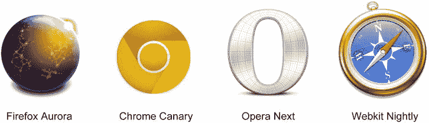

图 12-1。所有前沿浏览器

你可以在以下网站下载这些尖端的浏览器:Firefox Aurora([`aurora.mozilla.org`](http://aurora.mozilla.org))、Chrome Canary([`tools.google.com/dlpage/chromesxs`](http://tools.google.com/dlpage/chromesxs))、Opera Next([`opera.com/browser/next`](http://opera.com/browser/next))和 Webkit Nightly([`nightly.webkit.org`](http://nightly.webkit.org))。请记住，这些浏览器并不是 100%稳定的，在生产环境中应该谨慎使用，因为代码库中可能存在错误。最好只在测试实验特性时使用这些浏览器。

 **注**在撰写本文时，Internet Explorer 还没有其最新浏览器的测试版(尽管 IE 10 被设置为非常前沿)。

下载这些浏览器中的一个或全部可以让你 VIP 访问这些超现代浏览器授权访问的所有测试功能。

新的 CSS 功能

既然设置已经完成，让我们进入本章的重要主题，从新兴的 CSS 特性开始。接下来的部分是针对 CSS 规范的许多新的增强的。

CSS 区域

首先是新的 CSS 特性叫做*区域* 。Adobe 已经为此功能向 W3C 提交了一份草案，这实际上是从一个*区域到另一个*区域内容自由流动的新规范。这使得你可以自由移动文本，而不依赖于设备和屏幕，这使得在响应式网页和创意设计中的文本布局更加出色。从你对同步广告单元的了解来看，理论上你可以让文本在同一页面上从一个广告自由流动到另一个广告。要使用 CSS 区域，你需要做的就是包含一些空的 div 容器和一些 CSS 声明，如清单 12-1 所示。

***清单 12-1 。*** CSS 区域示例

```html
<!DOCTYPE html>
<html>
<head>
<meta charset="UTF-8">
<style type="text/css">
/* ad */
#ad .adContent {
  -webkit-flow-into: adRegions;
}

.adRegions > div {
  content: -webkit-from-flow('adRegions');
  -webkit-flow-from: adRegions;
  width: 30%;
  height: 250px;
  float: left;
  margin: 10px;
  padding: 30px;
  border: 1px solid #000;
  overflow: scroll;
  -webkit-overflow-scrolling: touch;
}
</style>
</head>

<body>
<div id="ad">
  <div class="adContent">
  Lorem ipsum dolor sit amet, consectetur adipiscing elit. Aliquam nec ipsum non massa vehicula
feugiat. Etiam a tempor lectus. Etiam sollicitudin commodo risus, ac hendrerit felis auctor a.
Maecenas sed sem sed libero faucibus elementum eu non sapien. Ut tellus nisl, imperdiet ut eleifend
id, lacinia et enim. Suspendisse feugiat fringilla cursus. Phasellus nisl nisi,congue ac hendrerit
eget, facilisis a nunc. Suspendisse potenti. Ut suscipit, lacus ac imperdiet lacinia, metus ipsum
placerat libero, et dictum massa arcu vitae risus. Vestibulum varius hendrerit congue.
  </div>
  <div class="adRegions">
    <div></div>
    <div></div>
  </div>
</div>
</body>
</html>
```

从清单 12-1 中可以看到，在名为 adContent 的 div 中有一些“lorem ipsum”内容，另外两个 div 名为 adRegions(可能是另一个 ad) *。*如 CSS 所示，您指示您的 adContent 将其文本内容流入 adRegions。差不多就是这样！现在，您可以不受屏幕大小的影响随意复制，如图图 12-2 所示。

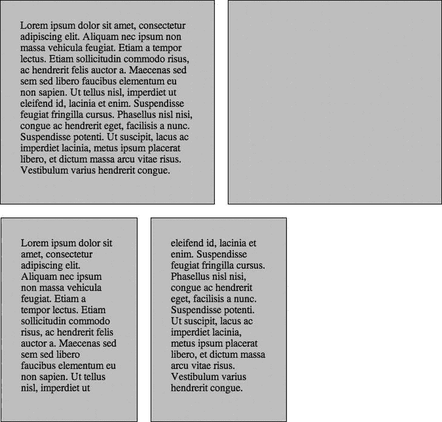

图 12-2。使用 CSS 区域的 Adobe 示例

请记住，这只适用于百分比设置的宽度，而不适用于您指定的硬值，如 300px。为了在广告环境中工作，请确保您的广告容器的 div 具有 100%的宽度，并将该容器包装在另一个 div 元素中，其宽度设置为 300px(或您的广告清单要求的任何值)。如果您的客户想要模仿动画书类型的创意，这可能会非常有帮助，因为包括副本在内的元素可以自由流入不同屏幕大小的其他区域。

 **注意**在撰写本文时，本章讨论的每一个新兴特性都很可能需要一个特定的厂商前缀才能正常工作。

在撰写本文时，为了利用 CSS 区域特性，您需要使用 Webkit Nightly、Chrome 或 Chrome Canary，并在浏览器设置中启用名为 flags 的 CSS 区域。对于 Chrome，你可以通过在地址栏输入 chrome://flags 来实现。最后，重启你的浏览器以确保设置生效，然后你就可以使用这个很酷的新功能了。要了解更多关于真实世界的例子，我建议访问 http://css-tricks.com/content-folding 的网站，要了解更多关于 CSS 区域的规范，请访问 http://w3.org/TR/css3-regions 的网站或者 http://adobe.github.com/web-platform/samples/css-regions 的网站。

CSS 排除〔??〕

说到 CSS 区域，Adobe 还提交了一个新的特性规范，叫做 CSS *exclusions* 。排除允许文本内容围绕图像、视频、画布和 DOM 树中的其他元素自由流动。有了 CSS 排除，使用非常简单的 CSS 就可以在你的浏览器中创建丰富的类似印刷的杂志效果。真正有趣的是，您可以在 CSS 中创建形状，并将其用作排除，这可以创建具有负空间的真正有趣的效果。让我们看一个来自 Adobe 的例子，它使用 CSS 排除和基于平板电脑方向的自适应文本布局，如图图 12-3 所示。

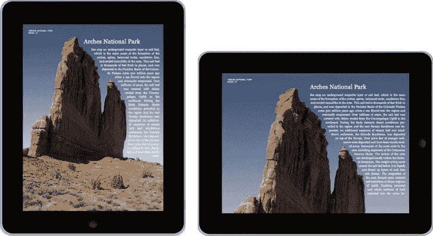

图 12-3。Adobe 使用 CSS 排除的示例(来源:Adobe)

你可以看到，通过在你的文本布局中加入排除项，你可以获得真正令人惊讶的结果，它与特定的内容形式吻合，在这种情况下，就是山。因此，让我们来看看在一个示例布局中如何使用 CSS 排除，在这个布局中，您将模拟 publisher 内容包装在一个 300x250 的矩形排除框周围，这个矩形排除框可能是您的广告区域。

***清单 12-2 。*** CSS 排除示例

```html
<!DOCTYPE HTML>
<html>
<head>
<style type="text/css">
body, html{
     height:100%;
     width:100%;
     overflow:hidden;
}
#container{
     font-size:14px;
     text-align:justify;
     -webkit-hyphens:auto;

     /* flow the content inside this element */
     -webkit-wrap-shape-mode: content;
}
.exclusion {
     position:absolute;
     height:250px;
     width:300px;

     /* flow text around this element */
     -webkit-wrap-shape-mode: around;
}
.ad{
     top: 20px;
     left: 100px;
     border: 1px solid #000;
     -webkit-wrap-shape:  rectangle(300px, 250px 300px,250px 250px,300px 250px,250px);
}

#workspace{
     position:relative;
     width:80%;
}

</style>
</head>
<body>
<div id="workspace">
     <div id="exclusion1" class="exclusion ad"> 300x250 </div>
<div id="container">
     <p>Lo&shy;rem ip&shy;sum do&shy;lor sit amet, con&shy;sec&shy;te&shy;tur ad&shy;ipisc&shy;ing
 elit. Vi&shy;va&shy;mus ac nul&shy;la ac nunc ves&shy;ti&shy;b&shy;u&shy;lum sod&shy;ales sed eget
 pu&shy;rus. In&shy;te&shy;ger tris&shy;tique neque at urna eleif&shy;end por&shy;ta. Mau&shy;ris a
 sa&shy;pi&shy;en augue, ve&shy;hic&shy;u&shy;la rutrum augue. Sus&shy;pend&shy;isse pre&shy;tium
 pulvi&shy;nar tris&shy;tique. Nul&shy;la el&shy;e&shy;men&shy;tum blan&shy;dit mas&shy;sa,
 pel&shy;len&shy;tesque el&shy;e&shy;men&shy;tum orci tem&shy;pus sed. Cur&shy;a&shy;bi&shy;tur eget
 est neque, nec pel&shy;len&shy;tesque enim. Sed blan&shy;dit do&shy;lor et neque tin&shy;ci&shy;dunt
 rutrum. Lo&shy;rem ip&shy;sum do&shy;lor sit amet, con&shy;sec&shy;te&shy;tur ad&shy;ipisc&shy;ing
 elit. Nul&shy;lam tin&shy;ci&shy;dunt do&shy;lor vel neque eleif&shy;end frin&shy;g&shy;il&shy;la.
 Prae&shy;sent et orci nec jus&shy;to vulpu&shy;tate ul&shy;tri&shy;c&shy;ies ac in leo. In nec
 ip&shy;sum enim. Donec sus&shy;cip&shy;it plac&shy;er&shy;at ad&shy;ipisc&shy;ing. Nul&shy;la a
 nunc mi. Sed ve&shy;hic&shy;u&shy;la sus&shy;cip&shy;it mag&shy;na sed con&shy;val&shy;lis. Donec
 ul&shy;trices con&shy;se&shy;quat tor&shy;tor, at fer&shy;men&shy;tum augue mal&shy;esua&shy;da in.
 Ut cur&shy;sus, odio non port&shy;ti&shy;tor var&shy;i&shy;us, dui neque luc&shy;tus la&shy;cus,
 in rhon&shy;cus dui odio eges&shy;tas libe&shy;ro. Mae&shy;ce&shy;nas po&shy;s&shy;u&shy;ere
 con&shy;sec&shy;te&shy;tur lec&shy;tus, vi&shy;tae con&shy;sec&shy;te&shy;tur lig&shy;u&shy;la
 con&shy;sec&shy;te&shy;tur eu.</p>
                         <p>Lo&shy;rem ip&shy;sum do&shy;lor sit amet, con&shy;sec&shy;te&shy;tur
 ad&shy;ipisc&shy;ing elit. Vi&shy;va&shy;mus ac nul&shy;la ac nunc ves&shy;ti&shy;b&shy;u&shy;lum
 sod&shy;ales sed eget pu&shy;rus. In&shy;te&shy;ger tris&shy;tique neque at urna eleif&shy;end
 por&shy;ta. Mau&shy;ris a sa&shy;pi&shy;en augue, ve&shy;hic&shy;u&shy;la rutrum augue.
 Sus&shy;pend&shy;isse pre&shy;tium pulvi&shy;nar tris&shy;tique. Nul&shy;la el&shy;e&shy;men&shy;tum
 blan&shy;dit mas&shy;sa, pel&shy;len&shy;tesque el&shy;e&shy;men&shy;tum orci tem&shy;pus sed.
 Cur&shy;a&shy;bi&shy;tur eget est neque, nec pel&shy;len&shy;tesque enim. Sed blan&shy;dit
 do&shy;lor et neque tin&shy;ci&shy;dunt rutrum. Lo&shy;rem ip&shy;sum do&shy;lor sit amet,
 con&shy;sec&shy;te&shy;tur ad&shy;ipisc&shy;ing elit. Nul&shy;lam tin&shy;ci&shy;dunt do&shy;lor
 vel neque eleif&shy;end frin&shy;g&shy;il&shy;la. Prae&shy;sent et orci nec jus&shy;to
 vulpu&shy;tate ul&shy;tri&shy;c&shy;ies ac in leo. In nec ip&shy;sum enim. Donec sus&shy;cip&shy;it
 plac&shy;er&shy;at ad&shy;ipisc&shy;ing. Nul&shy;la a nunc mi. Sed ve&shy;hic&shy;u&shy;la
 sus&shy;cip&shy;it mag&shy;na sed con&shy;val&shy;lis. Donec ul&shy;trices con&shy;se&shy;quat
 tor&shy;tor, at fer&shy;men&shy;tum augue mal&shy;esua&shy;da in. Ut cur&shy;sus, odio non
 port&shy;ti&shy;tor var&shy;i&shy;us, dui neque luc&shy;tus la&shy;cus, in rhon&shy;cus dui odio
 eges&shy;tas libe&shy;ro. Mae&shy;ce&shy;nas po&shy;s&shy;u&shy;ere con&shy;sec&shy;te&shy;tur
 lec&shy;tus, vi&shy;tae con&shy;sec&shy;te&shy;tur lig&shy;u&shy;la con&shy;sec&shy;te&shy;tur eu.</p>
                          <p>Lo&shy;rem ip&shy;sum do&shy;lor sit amet, con&shy;sec&shy;te&shy;tur
 ad&shy;ipisc&shy;ing elit. Vi&shy;va&shy;mus ac nul&shy;la ac nunc ves&shy;ti&shy;b&shy;u&shy;lum
 sod&shy;ales sed eget pu&shy;rus. In&shy;te&shy;ger tris&shy;tique neque at urna eleif&shy;end
 por&shy;ta. Mau&shy;ris a sa&shy;pi&shy;en augue, ve&shy;hic&shy;u&shy;la rutrum augue.
 Sus&shy;pend&shy;isse pre&shy;tium pulvi&shy;nar tris&shy;tique. Nul&shy;la el&shy;e&shy;men&shy;tum
 blan&shy;dit mas&shy;sa, pel&shy;len&shy;tesque el&shy;e&shy;men&shy;tum orci tem&shy;pus sed.
 Cur&shy;a&shy;bi&shy;tur eget est neque, nec pel&shy;len&shy;tesque enim. Sed blan&shy;dit
 do&shy;lor et neque tin&shy;ci&shy;dunt rutrum. Lo&shy;rem ip&shy;sum do&shy;lor sit amet,
 con&shy;sec&shy;te&shy;tur ad&shy;ipisc&shy;ing elit. Nul&shy;lam tin&shy;ci&shy;dunt do&shy;lor
 vel neque eleif&shy;end frin&shy;g&shy;il&shy;la. Prae&shy;sent et orci nec jus&shy;to
 vulpu&shy;tate ul&shy;tri&shy;c&shy;ies ac in leo. In nec ip&shy;sum enim. Donec sus&shy;cip&shy;it
 plac&shy;er&shy;at ad&shy;ipisc&shy;ing. Nul&shy;la a nunc mi. Sed ve&shy;hic&shy;u&shy;la
 sus&shy;cip&shy;it mag&shy;na sed con&shy;val&shy;lis. Donec ul&shy;trices con&shy;se&shy;quat
 tor&shy;tor, at fer&shy;men&shy;tum augue mal&shy;esua&shy;da in. Ut cur&shy;sus, odio non
 port&shy;ti&shy;tor var&shy;i&shy;us, dui neque luc&shy;tus la&shy;cus, in rhon&shy;cus dui odio
 eges&shy;tas libe&shy;ro. Mae&shy;ce&shy;nas po&shy;s&shy;u&shy;ere con&shy;sec&shy;te&shy;tur
 lec&shy;tus, vi&shy;tae con&shy;sec&shy;te&shy;tur lig&shy;u&shy;la con&shy;sec&shy;te&shy;tur eu.</p>
     </div>
</div>
</body>
</html>
```

在清单 12-2 中，你可以看到没有什么不寻常的，除了一些新的 CSS 属性叫做-webkit-wrap-shape-mode 和-webkit-wrap-shape *。*第一个任务是通过使用内容*的值来指示 div 容器内的副本应该自由流动。*第二个是指示浏览器将内容包装在排除项(在本例中是您的广告)周围，即 300x250。通过应用这种排除法，你会得到图 12-4 中的结果。

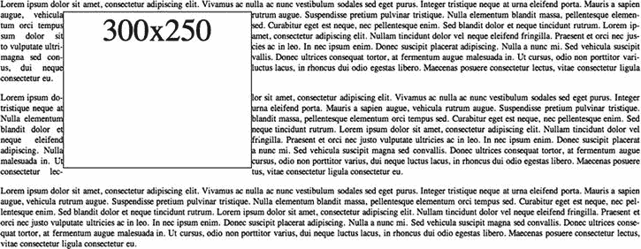

图 12-4。出版商如何排除广告清单中的页面内容的示例

有关排除规范的更多信息，请访问[`dev.w3.org/csswg/css3-exclusions`](http://dev.w3.org/csswg/css3-exclusions)或[`html.adobe.com/webstandards`](http://html.adobe.com/webstandards)。

CSS 着色器

这就是 CSS 真正令人惊奇的地方！有了 CSS 着色器，你终于可以利用机器的 GPU 为浏览器带来真正的运动图形。这是什么意思？首先，您现在可以利用简单的 CSS 声明和顶点着色器来制作丰富的电影效果。顶点着色器是给予机器 GPU 的坐标，用于处理图形操作和阴影，这类似于流行的 3D 程序中使用的技术。

使用顶点着色器(VS) 的原因是为了变换目标对象，并在 3D 空间中操纵它。使用 CSS 着色器，您可以很快控制对象的位置、颜色和纹理等属性，并获得真正的创造性和惊人的结果，这是您在真实的运动图形程序中经常看到的。需要营造逼真的翻页效果或者飘扬的旗帜？那么你应该看看可以用着色器做些什么！这些新功能将在您的网站和广告内容中创建真正令人惊叹的体验，但请记住，这些功能会对您的机器提出很高的要求，因此，请确保当这种工作规范成为现实时，您正在使用更高端的显卡，并且一如既往地，功能检测会提供支持，并为机器可能无法达到速度的用户提供优雅的降级。以下代码是 CSS 着色器的一个示例:

```html
<style>
#someElement {
        filter: custom(url(wave.vs), amount 0);
        transition-property: filter;
}

#someElement:hover {
        filter: custom(url(wave.vs), amount 1);
}
</style>
```

此示例概述了 filter 属性和一个到 wave.vs 顶点着色器的自定义 URL。在悬停时，您只需将波浪量从 0 增加到 1，这样效果就会过渡到该量，从而创建一个动画效果。CSS 着色器目前正在被纳入 CSS 过滤器规范，甚至将在 IE 10 中实现。

CSS 过滤器

CSS 着色器规范与 CSS 滤镜规范结合使用，使您能够通过直接 CSS 添加类似 Photoshop 的滤镜，并创建一些令人惊叹的图像合成和效果。您可以使用模糊、灰度、投影(不同于方框阴影)和棕褐色等滤镜，以及调整色调、饱和度和色阶(HSL)和反转图像的色彩空间。此外，您可以调整和操作亮度、对比度和饱和度等属性。清单 12-3 概述了如何在 CSS 中轻松实现这一点。

***清单 12-3 。*** CSS 滤镜示例

```html
<style>
        #someElement {
                -webkit-filter: blur(10px);
                -webkit-filter: grayscale(1);
                -webkit-filter: drop-shadow(5px 5px 20px black);
                -webkit-filter: sepia(1);
                -webkit-filter: brightness(10);
                -webkit-filter: contrast(10);
                -webkit-filter: hue-rotate(360deg);
                -webkit-filter: invert(1);
                -webkit-filter: saturate(10);
                -webkit-filter: opacity(1);
         }
</style>
```

正如你所看到的，你可以结合滤镜效果来创建一个非常独特的图像排列，甚至可以在这些效果上添加动画。在本例中，您只是操纵每个滤镜属性，这将创建一个由于最大值的对比度和亮度设置而完全褪色的图像。我建议分别使用这些属性，以便熟悉如何在浏览器中对图像进行非破坏性编辑。这对 iDevices 上的移动广告也非常有帮助，因为 iOS6 和 BlackBerry 10 都支持带有 Webkit 前缀的 CSS filters 规范，其他浏览器也将提供支持。CSS 过滤器的好例子位于[`html 5-demos . app spot . com/static/CSS/filters/index . html`](http://html5-demos.appspot.com/static/css/filters/index.html)；有关 CSS 滤镜规范的更多信息，请访问 http://dvcs.w3.org/hg/FXTF/raw-file/tip/filters/index.html 的或在[`html . Adobe . com/web standards/cssscustomfilters/cssfilterlab`](http://html.adobe.com/webstandards/csscustomfilters/cssfilterlab)开始使用 Adobe 的新 CSS FilterLab 使用滤镜。

 **注意**过滤器是资源密集型的。请谨慎使用，仅在必要时在广告内容中使用，尤其是在制作动画时。总是执行特征检测，因为它还没有被完全采用。

Matrix3D

正如你所知道的，CSS 在它的第 3 级和最终的第 4 级规范中获得了很多新的特性，这是 W3C 正式确定的。我最感兴趣的是元素的 Matrix3D 属性。使用 Matrix3D，完全扭曲 3D 空间中的图像是可能的。考虑到这一点，您可以在 HTML5 video 元素上创建图像操作和过渡，以创建可信的复合图像，其中 DOM 元素似乎嵌入在视频本身中。

Matrix3D 通过将元素上的 3D 变换指定为 4x4 矩阵来工作，该矩阵具有可编辑的独立象限。让我们看看如何在 CSS 中使用 Matrix3D 属性 :

```html
#someElement {
        matrix3d(m00, m01, m02, m03, m10, m11, m12, m13, m20, m21, m22, m23, m30, m31, m31, m33)
}
```

有这么多参数，这看起来有点复杂，但是表 12-1 将帮助你理解你可以更新矩阵的哪一部分。请密切注意表中的参数编号和象限。把这个表想象成任何 DOM 对象的覆盖图，你就会明白你将根据你传递的参数调整图像的哪一部分。

表 12-1 。Matrix3D 网格示例

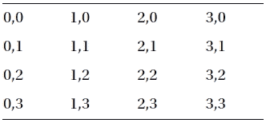

如果你是个新手，使用 Matrix3D 会让人不知所措，所以我建议在使用它的时候给一个非常有用的在线工具添加书签。具体来说，看看[`cssglue.com/matrix`](http://cssglue.com/matrix)，它允许你实时编辑和查看更新。

面具

CSS3 中的掩码(该提案由 Webkit 提出，正在考虑用于 W3C 标准化)是 CSS 中另一个可以利用的巨大进步。蒙版 对于许多使用 Flash 设计广告的设计师来说是一个非常受欢迎的工具。使用 CSS 遮罩，您可以通过只显示您想要让查看者看到的图像部分并隐藏其他区域来实现一些非常漂亮的图像技巧。遮罩允许对图像进行非破坏性的操作，对于在浏览器中节省 k-weight 非常有用。它们让您能够以 JPEG 格式保存图像，与 PNGs 相比，这大大节省了 k-weight。存储为 JPEG 格式会保留图像保真度，但不会保留 PNG 文件中的 alpha 透明图层。为此，您可以利用蒙版对图像进行干净的剪切，这将使图像看起来是透明的(像 PNG 一样),但会节省大量的整体文件大小。

在撰写本文时，只有 Webkit 支持掩码 。iOS、Android 和 BlackBerry 上的浏览器都支持它(带有供应商前缀)，确保你已经安装了 Webkit Nightly 或者手边有一部电话，并按照清单 12-4 中的步骤操作。

***清单 12-4*** 。CSS 遮罩示例

```html
<html>
<head>
<style type="text/css">
#theImage {
       background-image: url(image.jpg);
       background-repeat: no-repeat;
       width: 504px;
       height: 288px;
}
.mask {
       -webkit-mask-position: -60 -60;/*x and y for mask position*/
       -webkit-mask-size:600px 400px;
       -webkit-mask-image: url(star.png);
}
</style>
</head>
<body>
       <div id='theImage' class='mask'></div>
</body>
</html>
```

从清单 12-4 中，你可以看到你有一个 ID 为 image 的图像和一个名为 mask 的 mask 类。在带有图像的 div 上，应用类 mask，该类 mask 使用 CSS 来应用名为 webkit-mask-image 的仅 Webkit 属性，该属性使用 star.png 资源在图像资源上创建遮罩。您还可以使用–WebKit-mask-position 和–WebKit-mask-size 来调整一些遮罩属性，如位置和大小，这样您就可以在 star.png 遮罩内获得更精确的 位置和居中图像(参见图 12-5 )。

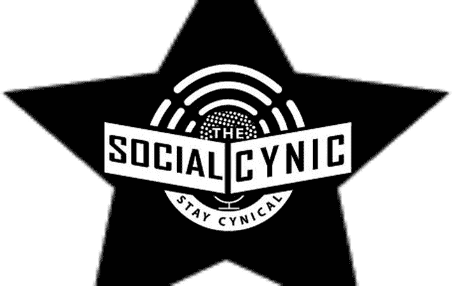

图 12-5。Webkit 掩码的一个例子

 **注意**你可以用 SVG 形状，CSS 渐变，图像来遮罩 DOM 元素，而不是 PNG 图像。

从这个例子中可以看出，调整 star.png 文件会极大地影响输出质量。如果你要缩放或调整你的遮罩，使用 SVG 是最理想的。关于 CSS3 中面具的精彩文章，请访问 http://css-tricks.com/webkit-image-wipes。虽然浏览器支持对于跨浏览器制作工作来说是最小的，但它在 iOS、Android 和 BlackBerry 上看起来仍然是一个有效的解决方案，因为在移动设备上节省 k-weight 是必须的！

反光

与带有遮罩的浏览器支持类似，CSS 倒影是一种向任何 DOM 对象(如图像、形状、画布元素，甚至 HTML5 视频)添加倒影的新方法。使用 webkit-box-reflect 属性，您可以在任何方向重复一个元素，应用偏移，甚至使用蒙版，就像您刚刚学习的那样。要使用 CSS 反射规则，您需要看一下语法:

```html
-webkit-box-reflect: <direction> <offset> <mask-box-image>
```

属性获取方向值、偏移值和掩码。在你的示例图像上使用这个语法，你可以生成清单 12-5 中的代码。

***清单 12-5*** 。CSS 反射示例

```html
<html>
<head>
</head>
<body>

</body>
</html>
```

正如您所看到的，您可以在图像元素上使用这种方法和 inline style 属性。对于第一个方向规则，您将其设置为“下方”。对于偏移的第二个规则，你指定 2px，对于第三个规则，你应用一个蒙版渐变，这样图像看起来就像逐渐变细到没有了。如果你在你的浏览器中测试这个例子，你应该得到如图 12-6 所示的结果。

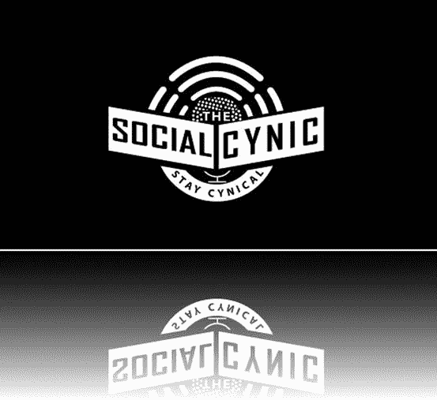

图 12-6。CSS 反射的例子

请记住，您需要为您的示例声明自己的图像源，并确保使用支持的浏览器(如 Webkit)进行测试。

范围样式

正如你现在所知道的，将广告内容从出版商内容中分离出来是一个挑战。通常，如果广告没有包装在 iframe 中，如果命名空间不合适，它们会共享样式和功能。通过对 HTML iframe 元素的沙箱属性的新支持，这将允许发布者管理嵌入内容的安全风险。例如，您可以授予包含发布者控制的内容的 iframe 完全权限，但授予第三方广告服务控制的 iframe 的权限要少得多。更好的是，如果广告服务器使用 CSS scoped 属性将其广告内容包装在一个代码块中，它可以独立于发布者页面的其余部分将样式单独应用于该代码块。这些限定了作用域的样式应该会覆盖从发布者页面继承的任何样式，这应该会正确地呈现广告内容。有了 CSS 作用域属性，你可以编写专门针对广告元素的样式，如清单 12-6 所示。

***清单 12-6*** 。CSS 范围的示例

```html
<html>
<head>
<body>
<section>
     <style scoped>
           iframe {
        position: absolute;
        border: 1px solid #000;
        top:100px;
        left: 200px;
        -webkit-box-shadow: 0px 15px 20px rgba(50, 50, 50, 0.5);
                -moz-box-shadow: 0px 15px 20px rgba(50, 50, 50, 0.5);
                box-shadow: 0px 15px 20px rgba(50, 50, 50, 0.5);
      }
     </style>
<iframe id='ad' width='300' height='250' seamless src='sampleAd.html'></iframe>
</section>
</body>
</html>

```

如果你一直跟着做，你会注意到 CSS 样式将只在 iframe 元素上受到影响，在这个例子中它保存你的广告单元，如图 12-7 所示。

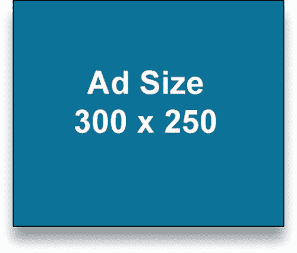

图 12-7。CSS 范围样式的示例

在发布者的标记中包含这些限定范围的样式允许发布者专门对标记的某些部分进行样式化，这些部分通过样式表来覆盖默认设置。请记住，CSS 范围的样式在浏览器支持中非常有限，但随着新浏览器版本的发布，这种情况有望改变。请务必通过访问[`w3schools.com/html5/att_style_scoped.asp`](http://w3schools.com/html5/att_style_scoped.asp)来关注此事。

CSS 摘要

许多 CSS3 规范每天都被不同工作组的许多人修改，所以它是非常不稳定的，覆盖所有这些规范就像击中一个移动的目标。浏览器制造商如今竞争激烈(这是一件好事)，他们的发展速度远远超过了大多数工作组的速度。这些特性中的一些是一种优势，因为它们允许你获得浏览器最前沿的功能，并且它们允许你进行实验和真正的创新。然而，这可能是一个缺点，因为通常特性不是作为标准提交的，所以许多开发人员不知道可以访问它们，也不知道这些特性可以在哪些浏览器中正确运行。

如你所知，为一个浏览器开发通常不是最好的方法，因为许多人使用多种操作系统和多个版本的浏览器，这最终意味着你需要在开始任何开发之前定义你的范围。广告业的情况更是如此，因为客户希望他们的信息无处不在；因此，瞄准最广泛的受众并覆盖更多的屏幕/浏览器是绝对必须的，这可能会限制您使用的 CSS 功能。请记住，当使用 Modernizer 之类的功能检测时，当浏览器说，“嘿，当然，我支持这个功能，”您应该首先做一些更多的测试。仅仅因为浏览器声称它支持某个功能，并不意味着它在广告活动中是有效的，尤其是当它与发布者页面上的其他元素一起部署时。对于动画来说尤其如此，它可能会很快烧坏浏览器，让一切都崩溃，因为重新绘制和重排屏幕对性能来说是很昂贵的。

 **注**要获得 CSS 新特性的完整列表，请访问[`css3clickchart.com`](http://css3clickchart.com)。

新兴应用编程接口

接下来的部分将应用于新兴的 JavaScript 和 DOM APIs，它们将出现在新的现代 web 堆栈中。通过下载前面概述的最新测试版浏览器，可以使用以下大多数 APIs 在最坏的情况下，在撰写本文时，它们还没有在任何浏览器版本或设备中实现，但正式的规范正在开发中。最好密切关注 http://caniuse.com 和各个工作组的进展和采用情况。让我们从急需的图片元素开始吧。

象素

我想介绍的第一个 DOM 特性是新的图片元素。正如你所知道的，随着屏幕尺寸和像素密度的变化，处理位图图像变得越来越困难，因为它对每个屏幕都进行了正确的优化。虽然有些人选择使用直接的 CSS 和/或 SVG 作为图形元素，并配以响应性的布局方法，但位图图像在更高密度的屏幕上和波动的屏幕布局上看起来仍然非常不同。

幸运的是，有一个工作组致力于开发一种被称为*响应图像* 的技术，使用一种新的图片元素。使用图片元素 ，您可以根据访问内容的设备指定要加载的特定图片。例如，如果您在苹果 iPhone 3GS 上查看图像，您的设备像素密度将是设备像素和文档的 CSS 像素之间的 1:1 关系。然而，如果你在 iPhone 4+上观看相同的内容，你的设备像素密度会翻倍，达到 2:1 的关系(或者像苹果公司创造的那样，视网膜显示器)。使用这个设备，意味着你的设备像素是 CSS 像素的两倍。清单 12-6 使用图片元素根据您的源媒体查询加载适当的图像。

***清单 12-6*** 。图片元素示例

```html
<html>
<head>
<body>
<picture alt="Sample Image">
        <source src="default.jpg">
        <!-- small size for viewport widths 400px wide and up -->
        <source src="small.jpg" media="(min-width: 400px)">
        <!-- medium size for viewport widths 800px wide and up -->
        <source src="medium.jpg" media="(min-width: 800px)">
        <!-- large size for viewport widths 1000px wide and up -->
        <source src="large.jpg" media="(min-width: 1000px)">
        <!-- extra large size for viewport widths 1200px wide and up -->
        <source src="xlarge.jpg" media="(min-width: 1200px)">
</picture>
</body>
</html>
```

众所周知，随着越来越多的器件获得更高的像素密度，考虑这种设计方法变得越来越重要。您不希望图像在支持高质量位图的设备上看起来模糊或不清晰。使用传统的 CSS 媒体查询方法，您可以支持多个图像源，并让浏览器/设备处理它可以支持的图像源。有关 responsive images 工作组和图片元素的更多信息，请访问[`dvcs . w3 . org/Hg/html-proposals/raw-file/tip/responsive-img/responsive-images . html`](http://dvcs.w3.org/hg/html-proposals/raw-file/tip/responsive-img/responsive-images.html)。

iOS 6 Safari 和桌面 Safari 6 中的苹果采取了类似但略有不同的方式。现在，您可以通过对 background-image 的属性使用–WebKit-image-set 方法来利用这个新元素。看看下面的例子，你会有更好的想法:

```html
<style>
.hqImage {
        background-image:
        -webkit-image-set(
                url(standard.jpg) 1x,
                url(highdefinition.jpg) 2x
        );
}
</style>
```

正如您在前面的示例中所看到的，您使用了 hqImage 类并将 background-image 属性设置为 new–WebKit-image-set 方法。在该方法中，您需要使用两个参数，即图像资源的 URL 和图像应该使用的像素密度。在这种情况下，您有一个 1x 设备像素密度的 standard.jpg 文件和一个 2x 密度的 highdefinition.jpg 文件。这确实是一个很大的改进，因为如果有更高分辨率的设备访问您的内容，您不需要遍历 DOM 并将所有图像替换为高 DPI 图像。此外，只有支持该设备的映像才会被加载，因此用户下载映像不会有额外的开销；他们只能得到他们的设备支持的那个。

[计] 下载

接下来是 HTML5 中新的下载属性。您是否希望允许用户从您的 web 内容中保存文件？或者让他们在一个广告单元中保存一张优惠券，这样他们以后可以打印出来并在销售点使用它，怎么样？现在，您可以利用新的 download 属性，该属性将指示浏览器将链接作为可下载素材来处理，而不是在新的窗口或选项卡中将浏览器重定向到该资源。清单 12-7 展示了如何使用下载属性。

***清单 12-7*** 。下载属性示例

```html
<html>
<head>
</head>
<body>
<a download="SomeFile.jpg" href="SomeFile.jpg">Download This Image!</a>
</body>
</html>
```

现在当用户点击下载这个图像！链接，浏览器将下载名为 SomeFile.jpg 的资源，如图图 12-8 所示。

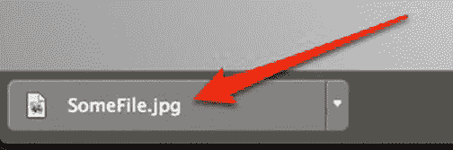

图 12-8。Chrome 浏览器中的下载功能

使用 download 属性的真正好处是在处理 canvas 元素或二进制对象(BLOB)以及利用文件系统 API 时。这将允许用户下载用户可能创建的广告内容。一个很好的例子可以在 http://html5-demos.appspot.com/static/a.download.html 找到。

webrtc

Web 实时通信(WebRTC) 是一种无需 Flash 等第三方插件即可使用摄像头和麦克风等通信手段的技术。其使命是原生使用浏览器，并利用简单的 JavaScript API 和 HTML5 来创建互动和现场体验。WebRTC 允许视频聊天、记录器等等。它的核心功能包括回声消除、降噪、自动增益控制和网络管理。如果你想让用户上传你的品牌或服务的个性化视频，或者允许用户使用他们的麦克风控制广告单元的功能，这真的很有用。向用户提供关于他们如何与你的广告内容互动的实时反馈。想想利用实时捕捉你的观众并把他们作为广告体验的一部分的可能性。将视频捕获到画布元素上，甚至应用 CSS 转换和动画。一切皆有可能！清单 12-8 展示了如何通过使用 getUserMedia API 与 WebRTC 一起工作。

***清单 12-8*** 。WebRTC 示例

```html
<html>
<head>
</head>
<body>
<video autoplay></video>
</body>
<script type="text/javascript">
navigator.getUserMedia = navigator.getUserMedia || navigator.webkitGetUserMedia || navigator.mozGetUserMedia;

navigator.getUserMedia({audio: true, video: true}, function(stream) {
  document.querySelector('video').src = window.URL.createObjectURL(stream);
}, function(e) {
  console.log(e);
});
</script>
</htmls>
```

在清单 12-8 中，你可以看到你创建了一个 HTML5 视频元素，剩下的魔术发生在 JavaScript API 中。您在 JavaScript 中做的第一件事是通过浏览器的 navigator 对象请求 getUserMedia API。通过将音频和视频传入第一个参数，并在第二个参数中创建一个处理流的方法，可以做到这一点。通过在文档中获取对视频对象的引用并通过 createObjectURL 方法将视频源设置为流来处理该流。从图 12-9 中你会注意到的第一件事是你提示用户并要求使用他们的相机。一旦他们“允许”，你就可以播放视频流了。(我甚至指出了视频的源设置为什么！)

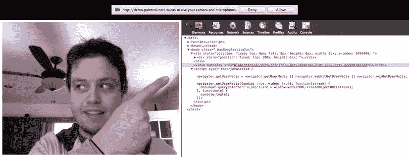

图 12-9。在 Chrome 浏览器中显示 WebRTC 功能

当你能获得这种形式的用户交互时，可能性真的是无穷无尽的。您甚至可以使用运动跟踪器来检测用户在视频帧中的位置。一个非常惊人的例子是允许用户弹奏虚拟木琴([`soundstep.com/blog/experiments/jsdetection`](http://soundstep.com/blog/experiments/jsdetection))，但这并没有结束。把他们的头放在一个游戏角色身上，甚至演奏虚拟鼓，与世界各地的其他乐队成员合作，怎么样？想要一个真正好的 WebRTC 演示，请访问 http://html5rocks.com/en/tutorials/getusermedia/intro 的。

 **注意**为了观看视频流，你需要在本地或远程服务器上测试这个 WebRTC 演示。

媒体源 API

HTML5 视频的最大限制之一是流式视频的通用规范。现在有了媒体源 API，您可以“分块”或分割 WebM 视频文件，并使用 JavaScript 将视频块拼接在一起，为最终用户提供无缝的视频播放体验。这种方法非常适合在带有视频的网络广告中使用，因为流式视频不会招致出版商设置的额外 k-weight。在撰写本文时，唯一的例子可以在[`html5-demos.appspot.com/static/media-source.html`](http://html5-demos.appspot.com/static/media-source.html)找到。在测试这个功能之前，一定要访问 chrome://flags 并启用 API，因为它不是一个本机功能，也不是目前采用的功能；相反，这是将 WebM 视频格式流式传输到 Chrome 浏览器的未来解决方案。欲了解更多信息，请访问[`ion cannon . net/utilities/1515/segmenting-webm-video-and-the-media source-API`](http://ioncannon.net/utilities/1515/segmenting-webm-video-and-the-mediasource-api)。

 **注意**在撰写本文时，媒体源 API 仅支持 WebM 视频容器。

Web 音频 API

Web Audio API 直接在浏览器内部提供对音频波的实时处理和分析。它本质上是一个低级音频操作 API，允许您使用 JavaScript 生成和操作音频波，而不需要插件。它使用空间声相、低/高通滤波器、卷积滤波器、增益控制和正弦波生成等效果。使用 Web Audio API，您可以有效地构建复杂的音频平台，在您的 Web 内容中模仿专业工具一样的功能。假设您有一个广告体验，要求用户使用 getUserMedia 记录他们的声音，然后在广告中他们可以定制他们的声音，听起来像花栗鼠或像他们在水下。你可以用网络音频 API 做一些令人惊讶的事情，包括为游戏创造各种各样的声音(【http://html5rocks.com/en/tutorials/webaudio/games】[)或者甚至创造类似吉他效果板(【http://dashersw.github.com/pedalboard.js】](http://html5rocks.com/en/tutorials/webaudio/games))的东西。对于其他一些真正伟大的例子，请访问[`html5audio.org`](http://html5audio.org)，并确保通过访问[`caniuse.com/#feat=audio-api`](http://caniuse.com/#feat=audio-api)来检查支持。

Web 通知 API

服务器发送事件允许通知以 DOM 事件的形式从服务器发送到客户机(浏览器)。如果你熟悉 Growl ( [`growl.info`](http://growl.info) )、苹果通知中心或移动设备上的推送通知，你会很快理解这些服务器端事件能做什么。现在，当用户访问您的 web 内容时，您可以直接在浏览器中执行类似的行为。如果你是一个内容所有者，并且有一个用户在你的页面上，这是非常有益的；当更新就绪时，您可以向他们发送提醒以刷新页面。此外，如果你是一个新闻广播员，如果你想在你的网站上向用户推送最新的新闻信息，这将是非常有用的。看看清单 12-9 中的 Web 通知 API。

***清单 12-9*** 。服务器事件 API 示例客户端代码:

```html
<!DOCTYPE html>
<html>
<body>
<h1>Server:</h1>
<div id="output"></div>

<script>
if (typeof(EventSource)!=="undefined") {
  var source = new EventSource("sample.php");
  source.onmessage=function(event) {
    document.getElementById("output").innerHTML += "New " + event.type + " " + event.data + "<br/>";
  };
} else {
  document.getElementById("output").innerHTML="No Support";
}
</script>
</body>
</html>

```

以下是服务器代码:

```html
<?php
header('Content-Type: text/event-stream');
header('Cache-Control: no-cache');

$time = date('r');
echo "data: John Percival's time is: {$time}\n\n";
flush();
?>
```

在前面的例子中，您可以看到我将新的 EventSource 对象连接到 sample.php 文件，该文件返回服务器的时间和日期。在那里，我只是监听 onmessage 事件，并通过将事件的数据和类型连接成一个字符串来处理它，并通过将 innerHTML 设置为等于该值来将其呈现到屏幕上。有关 Web 通知 API 的更多信息，请访问[`dev . w3 . org/2006/Web API/Web Notifications/publish/Notifications . html`](http://dev.w3.org/2006/webapi/WebNotifications/publish/Notifications.html)。

 **注意**你需要在本地或远程服务器上运行这个例子。

求转发到

WebSockets 终于来了！通过 WebSockets (WS) ，您可以使用新的 API 和协议为 Web 提供动态和协作体验。WebSockets 可以用于在浏览器中生成多人、交互式和协作性的 web 内容，而不需要像 Flash 这样的插件来使用套接字连接。WebSockets 规范旨在提供一种双向对话机制，这种机制远远超越了传统的 HTTP 单向协议。它最初依赖单个 HTTP 请求来创建连接，但是随后连接被升级，因此任何一端都可以同时发送和传输数据。使用 WS，您可以提供对数据馈送的实时更新，甚至提供多用户协作，而不需要 Ajax 或 HTTP 上的长时间轮询。清单 12-10 展示了规范的 API 部分，但是请记住它既是 API 也是协议。

***清单 12-10*** 。WebSockets 示例

```html
<script>
window.URL = window.webkitURL || window.URL;
window.WebSocket = window.WebSocket || window.MozWebSocket;
var ws = new WebSocket('ws://johnpercival.org/socket', 80);
ws.binaryType = 'blob';*// or 'arraybuffer'*
ws.onopen = function(e) {
        console.log('Connection OPEN');
};
ws.onmessage = function(e) {
        console.log('MESSAGE');
};

//Send data to the websocket server
var data = "Sample Data";
ws.send(data);
</script>
```

通过回顾这个例子，您会注意到您设置了一个新的 WebSocket 对象，向它传递一个 WS: protocol 和 domain 的参数，并传递一个开放端口的第二个参数，在这个例子中是 80。一旦通过 HTTP 建立连接并升级到 WS，服务器和客户机就可以随时发送数据，甚至可以同时发送。只发送数据本身，没有 HTTP 头的开销，这大大减少了传输所需的带宽；此外，因为这是一个推送场景，所以客户端不需要不断轮询服务器以获取更新的信息。对于在不支持 WebSockets 的旧浏览器中使用 web sockets，甚至有一些有用的 polyfills，如 Socket.io，如果浏览器不支持它，它会故障转移到 Flash socket、Ajax 或长轮询。我想你会在广告中看到很多 WebSockets 的例子，用来创建真正有趣的实验，用户可以在广告单元中直接(实时)相互竞争。你可以在 http://labs.dinahmoe.com/plink 的、[`socketracing.com 的`](http://socketracing.com)、[`mrdoob.com/projects/multiuserpad 的`](http://mrdoob.com/projects/multiuserpad)找到一些真正有趣的 WebSocket 实验。有关 WebSockets API 的更多信息，请访问[`w3.org/TR/2012/WD-websockets-20120809`](http://w3.org/TR/2012/WD-websockets-20120809)，并确保通过访问[`lcaniuse.com/#feat=websockets`](http://lcaniuse.com/#feat=websockets)来检查其支持。

web GL(web GL)

还记得在第四章我讨论 canvas 的时候吗？如果是这样的话，你可能还记得画布的绘制背景，以及它目前是如何广泛支持 2D 的。嗯，现在在一些支持的浏览器中，上下文可以通过 WebGL 的方式升级到 3D。WebGL 是一个复杂的 API，它将真正的 3D 引入浏览器，而不需要像 Flash 或 Unity 这样的插件。请记住，建议您仅使用更高端的计算机硬件，这是正确查看 WebGL 内容所必需的。

因为支持 WebGL 的设备和浏览器仍在增长，广告的采用开始得相当缓慢。然而，当采用发生时，有一些非常好的和有文档记录的 API 旨在简化它的使用，即，三个 js([`mrdoob.github.com/three.js`](http://mrdoob.github.com/three.js))和 A3([`aerotwist.com/a3`](http://aerotwist.com/a3))。

在 WebGL 之前，您需要利用 Flash 和 PaperVision 等 3D 库来创建身临其境的 3D 体验。现在(随着时间的推移)，您可以用 JavaScript 和现代浏览器创建这些类似的体验。看一看图 12-10 来自[`webglstats.com`](http://webglstats.com)概述了撰写本文时支持 WebGL 内容的桌面和移动浏览器的总体支持。

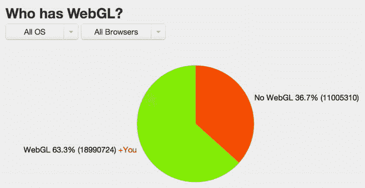

图 12-10。web GL 对手机和桌面浏览器的全面支持(来源:【http://webglstats.com】??

在撰写本文时，大多数用户可以接受 WebGL，但它还远远不是一个无处不在的特性。与此同时，我建议多了解一点 WebGL，并了解如何在您未来的广告活动中使用它。WebGL 内容的一些真正令人惊叹的例子是[`hexgl.bkcore.com`](http://hexgl.bkcore.com)和[`demo.kaazing.com/racer`](http://demo.kaazing.com/racer)，但是一定要通过访问[`caniuse.com/#feat=webgl`](http://caniuse.com/#feat=webgl)在支持的浏览器上观看它们。

网络意图

由于网络与数量惊人的社交网络、博客平台和外围设备的整合问题日益严重，谷歌 Chrome 团队开发了所谓的 Web Intents。它是一个用于客户端服务发现和应用间通信的框架。首先，服务注册其为用户处理动作的意图。接下来，内容请求开始一个动作(共享、编辑、拍摄、挑选、查看等等)。然后，用户可以选择哪个服务来处理该动作。例如，如果你是 Android 用户或 iOS 6 用户，当你选择分享图片时，这个工作流程听起来会非常熟悉。看一看图 12-11 来更好地了解网络意图 在 Chrome 浏览器中是如何工作的。

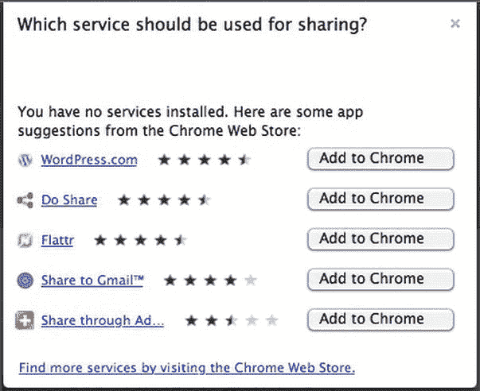

图 12-11。Chrome 上的 Web Intents 视图

如您所见，这让用户可以控制他们想对 web 内容做什么。清单 12-11 展示了如何使用 Web Intents API 来生成这个图像。

***清单 12-11*** 。Web 意图示例

```html
<script>
var intentParams = {
  "action": "http://webintents.org/share",
  "type": "image/*",
  "data": location.href
};

var intent = new Intent(intentParams);
window.navigator.startActivity(intent);
</script>
```

如您所见，您用一个图像文件创建了一个新的意图，此时，任何注册支持基于图像的意图的用户应用都可以为用户处理这个问题。这可能是脸书、邮件、Instagram、任何已安装的应用或 web 应用。关于网络意图的更多信息，请访问 http://webintents.org 和 http://w3.org/TR/web-intents 的[。](http://w3.org/TR/web-intents)

MIME 和协议 API

你有智能手机吗？很有可能，如果你正在读这本书，你已经有了 iPhone、Android、黑莓或者 Windows Phone。你有没有注意到网络内容中的电话号码或电子邮件地址是如何显示为可点击或可点击的链接的？这个链接使用了不同于普通 HTTP 或 HTTPS 请求的协议。它使用 TEL:和 MAILTO:协议，允许本地电话或邮件应用处理窃听的内容，从而打电话或发送电子邮件。事实上，许多方案已经被列入白名单(意味着不能重复使用)，如 irc:，mailto:，mms:，news:，nntp:，sms:，smsto:，tel:，urn:，webcal:，和 xmpp:。甚至还有针对 dropbox:，hulu:，admarvel:，wsj:，和 chrome:等应用的特定协议。

registerProtocolHandler 方法允许站点将自己注册为特定方案(或意图)的可能处理程序。例如，在线电话消息服务可以将自己注册为 sms:方案的处理程序，这样，如果用户点击这样的链接，用户就有机会使用该网站。类似地，registerContentHandler 方法允许网站将自己注册为内容 MIME 类型的可能处理程序。例如，同一个在线消息服务可以将自己注册为文本/vCard 文件的处理程序，这样，如果用户没有能够处理 vCard 的操作系统应用，他们的 web 浏览器可以建议一个站点来查看联系信息。这一切意味着，网络又一次变得与你每天利用的正常操作系统任务紧密相连。您可以注册一个 vCard MIME 类型的站点，并选择该站点/应用来处理该文件的读取，而不是在 Mac 上打开地址簿。这很酷，因为它模糊了本地操作系统和网络之间的界限。有关协议 ?? API 的更多信息，请访问[`dev . w3 . org/html 5/spec/system-state-and-capabilities . html # custom-handlers`](http://dev.w3.org/html5/spec/system-state-and-capabilities.html#custom-handlers)。

web 页格式

WebP 是谷歌在购买了 VP8 inventor 的 On2 技术后开创的一种新的图像格式，它为网络上的图像提供无损和有损压缩。在第七章中，当我讨论 WebM(一种视频格式)的时候，你就明白 Google 为什么要开发 WebP 了。在同等质量下，WebP 无损图像的尺寸比 PNG 图像小 26 %,比 JPEG 图像小 25%到 34%。WebP 只需要 22%的额外字节就可以支持无损透明(也称为 *alpha 通道*)。更多关于 WebP 项目的信息，请访问[`developers.google.com/speed/webp`](http://developers.google.com/speed/webp)。

游戏手柄 api

游戏手柄 API 是一个正在开发的标准，旨在为游戏手柄和网络内容操纵杆提供通用支持。现在，你第一次可以利用游戏手柄 API，通过 JavaScript 读取插入机器的任何控制器的状态。正如你可能已经猜到的那样，这对于网络游戏玩家来说是一个巨大的好处，但甚至其他人也在寻找另一种设备来与网络内容交互，而不是传统的鼠标。因为该规范仍在制定中，并且仅在 Chrome 和 Firefox 的某些测试版本中采用，所以您可以依赖一个有用的 JavaScript 库来处理浏览器、操作系统和平台之间的碎片。这个库叫做 GamePad JS(【http://gamepadjs.com】??)。因此，如果你有一个 Xbox 360 控制器和一个 USB 端口，试试这个 API，但要确保你使用的是受支持的浏览器之一。

新兴移动 API

在这一节中，我将重点介绍特定的新兴移动 API，这些 API 使您能够访问许多设备功能，允许您针对不断增长的移动环境更具体地定制内容。设备支持一直是客户的普遍要求，他们想知道哪些最新和最棒的功能将使他们的内容和广告真正领先。以下 API 将概述一些目前处于草案或测试使用状态的规范。

电池 API

电池 API 允许开发者在他们的移动和便携设备上查询用户的电池电量状态。这对于获取访问权限非常重要，这样您就不会在用户设备的电力资源有限的情况下向他们征税。如果电池电量非常低，你可以减少甚至不提供广告内容，这允许用户延长时间来处理更重要的任务，如打电话或发电子邮件。使用电池 API，开发人员可以检测设备是否正在充电，检测设备的充电水平，以及检测设备的放电时间。清单 12-12 展示了如何使用这个 API。

***清单 12-12*** 。电池 API 示例

```html
<script>
var theBattery = navigator.battery || navigator.webkitBattery || navigator.mozBattery;
theBattery.addEventListener("chargingchange", function(event) {
  console.warn("Charging change: ", theBattery.charging);
}, false);
theBattery.addEventListener("chargingtimechange", function(event) {
  console.warn("Charge time change: ", theBattery.chargingTime);
}, false);
theBattery.addEventListener("dischargingtimechange", function(event) {
  console.warn("Discharging time change: ", theBattery.dischargingTime);
}, false);
theBattery.addEventListener("levelchange", function(event) {
  console.warn("Level change: ", theBattery.level);
}, false);
</script>
```

如您所见，您通过使用 navigator.battery 对象的带前缀和不带前缀的版本来获取对用户电池的引用。接下来，根据用户电池的状态，您将附加事件监听器并记录关于状态的信息。同样，有了这些信息，你可以更有针对性地为你的终端用户提供广告内容。欲了解更多信息，请访问位于[`W3.org/TR/battery-status`](http://W3.org/TR/battery-status)的工作组规范。

网络 API

网络 API 允许开发人员针对不同的网络连接 修改他们的内容。现在你可以通过 navigator.connection.type 优化网络连接状态(可以是未知的*、*以太网*、* wifi *、* 2g *、* 3g *、* 4g *、*和无)，看看在清单 12-13 中使用网络 API。

***清单 12-13*** 。网络 API 示例

```html
<script type="text/javascript">

while (navigator.onLine) {
        var network = navigator.connection.type;
        if (network === "ethernet" || network === "wifi" || network === "4g") {
                //full ad experience
        } else if (network === "3g" || network === "2g") {
                //reduced ad experience
        } else {
                //no ad experince due to unkown network or none.
        }
}
</script>
```

正如你所看到的，你可以根据用户的连接速度来定制你的广告体验。将此与电池 API 结合起来，您可以真正将用户体验提升到一个新的水平。在这个例子中，你检测到一个强连接，并提供完整的广告体验；如果是信号较弱的手机服务，你就稍微降低一点。如果它是未知的或者没有，你就完全去除了广告体验。我认为这个 API 在不久的将来会非常有用，因为浏览器会实现这个 API。有关该 API 的更多信息，请访问[`w3.org/TR/netinfo-api`](http://w3.org/TR/netinfo-api)。

振动 API

另一个有用的移动设备 API 是 Vibration API，它允许 JavaScript 控制设备的振动硬件(如果可用的话)。通过调用振动方法，您可以向用户的移动设备触发通知，如下面的代码片段所示:

```html
<script>
var duration = 2000;
var delay = 500;
navigator.vibrate([duration, delay, duration]);
</script>
```

在前面的示例中，您将设备设置为振动两秒钟，然后等待半秒钟，然后再次振动两秒钟。如果设备不允许振动，振动呼叫将被忽略。有关振动 API 的更多信息，请访问[`w3.org/TR/vibration`](http://w3.org/TR/vibration)。

日历 API

日历 API 允许通用访问用户的日历 。该 API 可用于创建、检索、更新和删除用户日历中的日历事件信息，如果您的客户有一笔大买卖，并希望从广告部门向他们的用户发送日历邀请，这将非常有用。通过 navigator 对象，您可以获取对用户日历的引用，您可以创建、检索和操作事件。欲了解更多关于该 API 的信息，请访问 http://w3.org/TR/calendar-api。

联系人 API

根据您刚刚从 Web Intents API 中了解到的内容，您可以使用它将用户的联系人列表直接拉入广告中(选择加入)。清单 12-14 显示了如何使用 Web Intents API 来访问你的联系人列表 。

***清单 12-14*** 。联系人 API 示例

```html
var intent = new Intent({
    action:"http://webintents.org/pick",
    type:"http://w3.org/type/contact",
    extras:{fields: ["displayName", "emails"] }
});

navigator.startActivity(intent, contactsOK, contactsFail);

function contactsOK (contacts) {
        console.log(contacts);
}
function contactsFail (error) {
        console.error(error);
}
```

在这个例子中，您可以看到您正在为用户的应用创建一个新的意图来处理用户地址簿中的联系人。如果您想与联系人中的其他朋友分享广告体验中的交易，使用此 API 可能会有所帮助。有关这种新兴应用编程接口的更多信息，请访问[`w3.org/TR/contacts-api`](http://w3.org/TR/contacts-api)网站，并确保在生产活动中实现之前检查浏览器支持。

邻近事件

使用接近事件 ，您可以处理特定对象何时靠近您的设备。这可能是当用户在另一台计算机、另一个设备(如电话)附近，或者甚至是能够与您的设备来回传输数据的其他物理对象附近。有了这个 API，一个物理对象的接近可以分派一个事件，并与用户的手机共享信息。这项技术的可能性可能对营销人员非常有帮助，因为例如，当用户靠近商店时，他们的印刷活动可以将交易传输到用户的移动设备上。要了解关于这个非常新兴的 API 的更多信息，请访问 http://w3.org/TR/2012/WD-proximity-20120712[和 ??【http://developer . Mozilla . org/en-US/docs/DOM/DeviceProximityEvent】网站](http://w3.org/TR/2012/WD-proximity-20120712)。

湿度、温度和光照事件

最后，一些设备甚至可以访问非常丰富的功能集，如湿度和温度 传感器以及环境测光表。处理这些事件的可能性可能是，当设备检测到它在户外阳光下时，调整内容的 CSS 以增加对比度。或者，如果该设备可以检测到温度为 100 度，也许广告的创意会根据这一结果定制特定的信息。虽然这些类型的动态数据有无限的可能性，但在撰写本文时，浏览器支持几乎是不存在的。有关这两种规格的更多信息，请访问[`dvcs . w3 . org/Hg/DAP/raw-file/tip/temperature/overview . html`](http://dvcs.w3.org/hg/dap/raw-file/tip/temperature/Overview.html)和[`dvcs . w3 . org/Hg/DAP/raw-file/tip/weather/overview . html`](http://dvcs.w3.org/hg/dap/raw-file/tip/humidity/Overview.html)。

有关环境光 API 的更多信息，请访问[`w3.org/TR/2012/WD-ambient-light-20120802`](http://w3.org/TR/2012/WD-ambient-light-20120802)。

浏览器支持

正如我在本章提到的，浏览器对所有这些特性的支持是非常有限的，如果有的话。几乎本章中的所有内容都是撰写本文时的最新信息，所以现在警告您:特性和规范会发生变化。最好从最新的 alpha 和 beta 浏览器开始工作，看看会发生什么，并经常查看[`caniuse.com`](http://caniuse.com)，看看这些功能是否会在发布的浏览器的生产版本中得到支持。如今，大多数浏览器的一个真正伟大的改进是自动更新过程，这意味着当用户打开和关闭浏览器时，浏览器将检查是否有更新，并在最终用户下次打开浏览器时透明地处理该更新。对于所有浏览器制造商和整个网络来说，这是一个非常简单但巨大的进步，因为你永远不会希望看到老浏览器徘徊不前，就像 IE 6 需要的遗留支持一样。大众越快采用新版本的浏览器，网站设计者和开发者在支持过时版本时需要做的工作就越少，最终客户花费在遗留浏览器开发上的资金就越少。

介入

在这一点上，这似乎是显而易见的，但是创建这些规范的工作组在他们的开发周期中总是向公众开放评论和反馈。不要觉得如果你有一个很棒的想法，或者想看到某个规范被添加、修改或删除，你就没有发言权。其实大家都有；这就是开放网络的魅力所在！将您的意见提交给 W3C、WHATWG、IAB、MMA 或任何基于您的意见最有意义的人。虽然你可能不会马上得到回应，但我保证人们在听。我是他们中的一员！

摘要

现在是时候结束这场关于 HTML5 下一步走向何处以及广告行业如何利用它来使您的广告体验比以往任何时候都更加强大和迷人的讨论了。一些令人惊奇的事情正在出现在网络上，事实是这一章只是触及了表面。随着越来越多的浏览器、设备、工作组和技术出现并协同工作，您将会看到一个全新的前沿功能景观。请记住，您使用的 HTML5/CSS3 功能越新，这些功能与浏览器更新相冲突的可能性就越大。尤其是在使用带前缀的草稿和 beta 版特性的情况下。这通常意味着浏览器实现之间的差异更大，并且更有可能在它们的实际版本之间发生变化。

最后，管理每一个 API 非常困难，因为有太多的 API 正在开发中([`dret.typepad.com/dretblog/html5-api-overview.html`](http://dret.typepad.com/dretblog/html5-api-overview.html))。如果你想跟上最前沿的特性，我强烈建议阅读浏览器制造商的博客、开发者倡议文章以及 W3C 和 WHATWG 不断发展的规范。当你开始进入最后一章时，你将会对整个网络广告的前景有一个整体的了解，以及 HTML5 是如何在未来的每一个屏幕上影响它的。