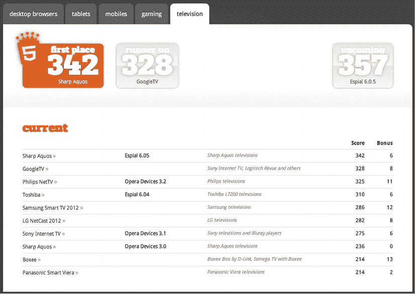
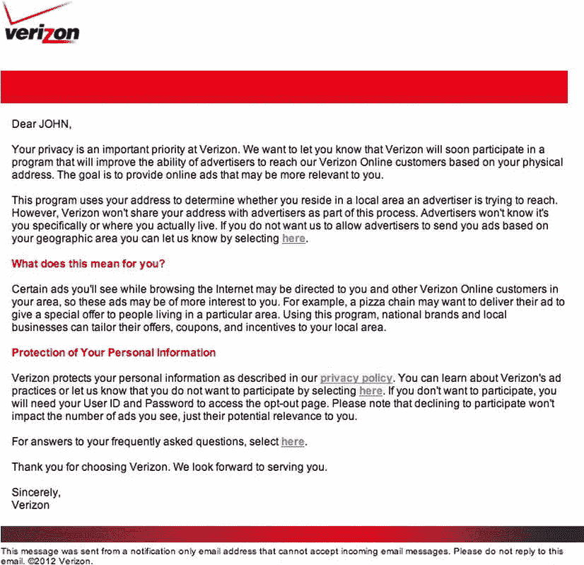
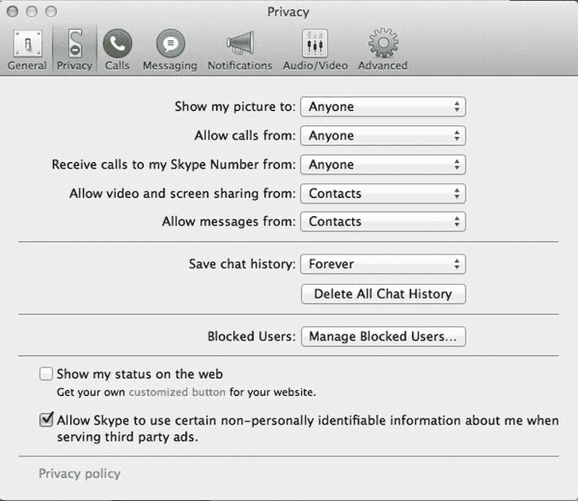
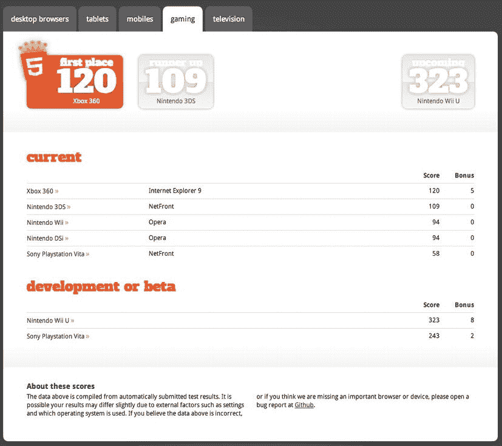
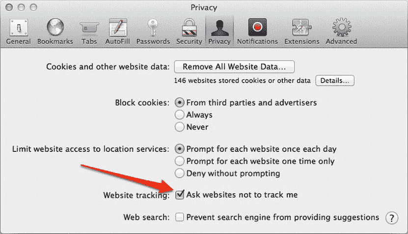
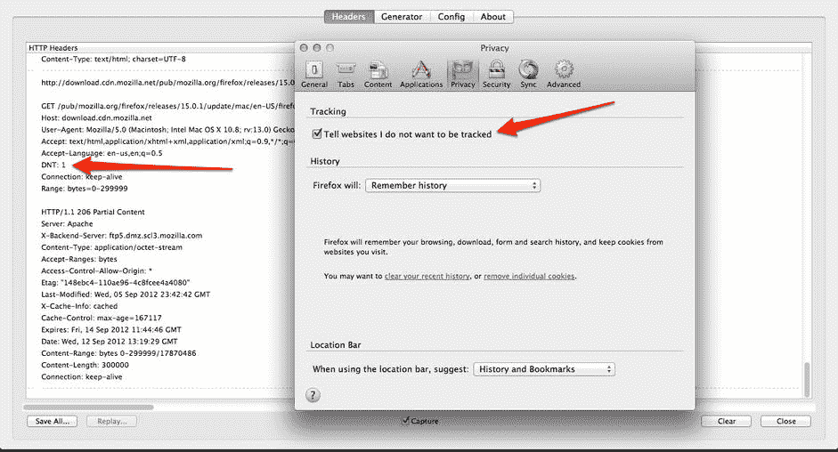

# 十三、HTML5 广告的未来发展

众所周知，网络广告经历了许多变化，从静态图像到动态 gif，再到 Flash 富媒体，再到今天的 HTML5。公平地说，这是由负担得起的、以网络为中心的移动设备和平板电脑的出现推动的——但接下来会发生什么呢？还有哪些平台将利用新的开放 web 标准？本章将展示这些可能性。HTML5 最终将无处不在:电视、电器、游戏控制台、车辆、机顶盒、户外显示器、广告牌、电梯屏幕甚至出租车后座——基本上，室内和室外的每一个屏幕！你看过那部电影*少数派报告*吗？对，就像那样！只要有浏览器和网络接入，你就会看到 HTML5，当然还有广告。

HTML5 的采用在我们的行业中已经无处不在；很快，每一种设备和电器都将采用与我们的台式电脑和移动设备相同的技术。这将是传统媒体购买模式的巨大转变，因为一切都将成为“数字购买”。你目前在机构中看到的传统和数字之间的壁垒将会崩溃，你将能够通过数字的测量获得广播的覆盖范围。这将是广告行业的一次巨大颠覆；会涌现出很多新的公司，也会有很多伤亡。通过用户的采用，HTML5 将迅速在所有屏幕上带来普遍性和连续性，使营销人员能够开发统一的营销信息，并更有效地跨渠道衡量广告活动。有了这些知识，广告服务器和数据提供商很快就能把一个观众/用户*的指纹*(或绑定)到几台电视、一台游戏机、一台平板电脑、一部电话和一台台式电脑上。有了这类信息，肯定会出现隐私问题，因为用户的数据需要得到更多的保护。说了这么多，让我们看看今天的 HTML5 广告，更重要的是，展望未来。

HTML5 广告大约 2012 年

2012 年，HTML5 度过了相当大的一年。它经历了许多变化，包括将规范从工作组中分离出来([`w3.org/QA/2012/07/html5_and_htmlnext.html`](http://w3.org/QA/2012/07/html5_and_htmlnext.html))，向规范中添加了额外的功能，删除了一些功能，以及支持不同级别合规性的新浏览器。然而，你我都知道这仅仅是个开始，因为 HTML5 已经酝酿了很长时间。

具体来说，2012 年的发展给广告业带来了许多困惑，即如何通过这种新的广告发展方式有效地扩大规模。无论企业规模大小，作为一个行业，我们都有很多需要改进的地方；事实上，不要因为一家公司是财富 500 强就认为它知道自己在这个领域做什么。HTML5 是一个巨大的、改变游戏规则的转变，每个人无论大小都需要适应！广告商和营销人员要么不知道如何在不断增长的移动领域锁定用户，要么不确定 HTML5(现在不仅仅是一个流行词)现在和未来几年将会对他们的业务产生巨大影响。为了更好地说明这一点，我整理了一份过去一年中听到的关于 HTML5 和广告的问题清单。以下是一些问题(请注意，这些问题大多来自大型网络公司的董事和首席执行官):

*   “HTML5 是什么？”
*   “HTML5 多少钱？”
*   “Flash 可以在我的 iPad 上运行吗？”
*   “可以帮我安装 HTML5 吗？”
*   "客户端需要这是在 HTML5 . "—我:“广告里的功能都不要求是 HTML5。”—客户端:“它只需要是 HTML5。”—我:“哦，好吧，现在有道理了。”
*   还有我一直最喜欢的“我看不到我的 HTML5 广告了！”—我:“你用的什么浏览器？”—客户端:“Internet Explorer 8。”—我:“谢谢。”

虽然其中一些很滑稽，但正如你所见，我们仍处于这项技术的初级阶段，尤其是在数字广告业务中。这提供了巨大的机会，但是作为一个行业，我们仍然需要学习、构建、采用和修正 HTML5，更重要的是，在使用新的开放网络标准购买、销售、开发和测量广告的方式上。

 **注意**你可以在[`bit.ly/Nuc1tv`](http://bit.ly/Nuc1tv)和[`rww.to/SOxQr3`](http://rww.to/SOxQr3)找到几篇关于这个话题的非常好的文章。

HTML5 平台

HTML5 平台越来越丰富，比人们每天习惯互动的传统 Web 多了很多。随着最新的操作系统和设备不再使用插件模式，越来越多的浏览器厂商和平台开发者开始完全依赖开放网络来增强他们的应用和广告体验。这方面的两个例子是微软的新平台 Windows 8 和微软的新平板电脑 Surface。Windows 8 操作系统中的新用户界面提供了 HTML、CSS 和 JavaScript 前端，这意味着其广告模式也是如此。像 Windows 8 这样的平台将成为常态，因为越来越多的人明白 HTML5 有无限的可能性(一旦采用)。这甚至可以用在网络编辑工具上，因为它们现在已经内置在浏览器中了。换句话说，你不需要在你的电脑上安装一个特殊的应用来编写和设计网页。以 Adobe 项目括号为例([`github.com/adobe/brackets`](http://github.com/adobe/brackets))。这展示了一个很棒的网页编辑工具，它就内置在你的浏览器中。

 **注意**Windows 8 中支持插件；但是，它们需要特殊权限才能运行。更多信息请访问[`msdn . Microsoft . com/en-us/library/ie/hh 968248(v = vs . 85)。aspx`](http://msdn.microsoft.com/en-us/library/ie/hh968248(v=vs.85).aspx) 。

像 Windows 8 这样的平台类似于应用内移动应用的环境，你可以从网上商店或店面获得应用，并通过下载的应用内的浏览器实例或网络视图查看广告。也就是说，可以有把握地认为，这些广告模式将需要依靠网络标准来在这些环境中创造互动和新兴的体验。

说到手机应用，有些甚至是基于 HTML5 构建的，使用 PhoneGap([`phonegap.com`](http://phonegap.com))这样的框架来编译成本地代码，以便应用商店接受。这再次证明了 HTML5 的真正力量(以及灵活性),因为它可以在几乎任何数字环境中使用。

出版商甚至正在利用新的开放标准，为他们的网页设计提供渐进的增强方法，利用 HTML5 的能力为浏览器支持他们的用户提供更丰富的体验，并保持对传统浏览器的基本支持。事实上，我确信在未来的一年里，你会看到许多出版商对网页内容和广告都采用 HTML5 解决方案。这一章主要关注 HTML5 的新实现，以及你将很快看到浏览器和广告向何处发展。

把这当成 HTML5 驱动的数字广告新前沿，你就是先锋！

连接的电视

首先连接起来的是，或者说*智能*，电视；在过去的一年里，他们在舞台上表现得非常出色。这些是连接到互联网的电视机，可以支持应用和网络浏览器。最近，如果你在市场上购买一台新电视，你会发现你的选择很可能会有某种形式的有线或无线网络接入，并且你可以期待看到更多的电视使用这种方法。由于谷歌和苹果等供应商非常期待进入这一领域，打破传统的电视观看模式，三星、LG 和索尼等更传统的制造商已经开始在他们的电视机中实现浏览器和他们自己的应用，但最有趣的是，这些屏幕上的浏览器在 HTML5 测试中得分相当高([`html5test.com`](http://html5test.com))。事实上，只要看一看图 13-1 就知道了，它展示了在我写这篇文章的时候一些顶级的 HTML5 电视浏览器。

图 13-1。展示支持 HTML5 特性的电视浏览器(来源:【http://html5test.com/results/television.html】??

回顾图 13-1 后，你可以看到这些电视在 HTML5 合规性方面获得了很高的分数。这个市场也有很多初露头角的竞争，对大众来说，这是一个真正未开发的、相当新的市场。这让人想起了手机的早期，我相信我们甚至还没有开始对未来几年的电视机有所期待，这包括网络广告是如何建立、购买、销售和部署到这个屏幕上以及传统的广告方法。联网电视最终将成为消费者的常态，随着大约 38%的用户已经在使用这种电视([`channel . com/article/482912-TV _ Sets _ Are _ Connected _ To _ Internet _ In _ 38 _ Of _ homes . PHP`](http://multichannel.com/article/482912-TV_Sets_Are_Connected_To_Internet_In_38_Of_Homes.php))，内容提供商开始以高价向营销人员出售广告库存只是时间问题。真正有趣的是，这些平台大多一开始就考虑了 web 标准和 HTML5！事实上，三星的智能电视应用在很大程度上是 HTML5 和 CSS 驱动的，平台无关的网络应用可以通过各种 API 获得特定设备的访问权限([`five minutes . eu/a-birds-eye-view-on-Samsung-smart-TV-apps-development`](http://fiveminutes.eu/a-birds-eye-view-on-samsung-smart-tv-apps-development))。对于开发者来说，这是一个令人兴奋的消息，因为它提供了另一个将他们的内容呈现在用户面前的机会，Opera 和 Google 等公司正在关注并提供工具，让你为这一即将到来的转变做好准备。看看 Opera 的电视模拟器([`opera.com/business/tv/emulator`](http://opera.com/business/tv/emulator))，它可以帮助你开发 CE-HTML 和 HTML5 的大屏幕内容，以及谷歌的电视设计指南([`developers.google.com/tv/web/docs/design_for_tv`](https://developers.google.com/tv/web/docs/design_for_tv))。

 **注意**你可以在[`w3.org/2011/07/w3c-webtv-nem.pdf`](http://w3.org/2011/07/w3c-webtv-nem.pdf)找到更多关于电视采用 HTML5 的信息。

机顶盒

那些不能自己上网的“非智能”电视怎么办？问得好。那些用户不会被落下——相信我，那些眼睛对广告商和内容所有者来说太有价值了！

除了购买支持 HTML5 浏览器的电视机，消费者还期待许多机顶盒(STB)，如罗技的谷歌电视 Revue，以补充他们现有的电视体验。这些形式的电视/网络功能在业内被称为 *over-the-top* (OTT)，许多硬件制造商通过联网的机顶盒提供电视体验，用户可以安装各种应用来个性化观看体验。在撰写本文时，一些更受欢迎的设备是苹果电视(【http://apple.com/appletv】??)，它带有各种苹果相关的应用，包括 YouTube、网飞、Hulu 和 Vimeo 还有 Roku([`roku.com`](http://roku.com))，它提供类似的体验，但内容更加丰富。甚至还有 Boxee ( [`boxee.tv`](http://boxee.tv) )和 Slingbox([`slingbox.com`](http://slingbox.com))提供类似的体验，它们都有自己的合同，通过与 MLB.com、HBO、亚马逊、网飞和 WSJ Live 等内容提供商的合作，为用户提供特色内容。

关于这些机顶盒真正有趣的是，它们中的大多数都允许传统的流媒体视频广告服务，正如你在第七章中了解到的那样，使用 VAST。这意味着您可以通过 IAB 的标准视频传输规范向这些设备提供动态和可寻址的广告内容。同样有趣的是，如果 STB 允许浏览器，那么您没有理由不能使用和利用 web 标准，在 HTML5 视频环境中使用基于 JavaScript 的 VPAID API 来创建更具吸引力或互动性的体验。

 **注意**你可以在[`iab.net/vpaid`](http://iab.net/vpaid)找到更多关于 JavaScript VPAID API 的信息。

电缆平台

有线电视是电视体验的另一个主要部分，这是它变得真正有趣和有点棘手的地方。长期以来，有线电视一直是其内容的保护者，强迫用户购买一系列频道，而用户可能不一定会观看所有频道。这种模式已经运行了多年，有线电视公司通过单一的分发模式“管理”每个人的内容已经非常舒服了。然而，时代在快速变化，用户正在转向其他平台和屏幕来获取他们的内容，并在他们想要的时候获得它，而不是以线性广播模式进行操作。随着有线电视受到这种变化的干扰，大公司正在努力维护其内容的专有权，同时也试图接受即将到来的网络现实及其对传统商业模式的影响。

我认为在未来，用户将能够通过有线电视提供商创建他们自己的频道包，并且只为他们观看的内容付费。如果观众想要一个频道，他们通过广告模式付费或免费获得。这种方法类似于你在应用商店里找到的免费的广告驱动的应用。想想看——目前你正在向大型有线电视公司支付高额费用来观看大量内容，其中大部分内容你永远也不会看，而且你正在接受广告宣传！我预测这种情况将在未来几年最终改变，尤其是当内容被推送到用户所有不同的屏幕上时。

对我和我所在的地方来说，我使用威瑞森的有线电视和互联网服务，即使我是付费用户，威瑞森仍然需要我的许可才能向我出售定向广告。参见图 13-2 ，这是我在注册服务后不久收到的一封来自威瑞森的电子邮件。

图 13-2。一封威瑞森的电子邮件，请求允许投放有针对性的第三方广告

正如你所看到的，这封来自威瑞森的人们的礼貌的电子邮件强调他们正在分享我的信息以提供相关的在线广告，但是如果你从本书的开始回忆起，威瑞森实际上是为了高价向广告商出售这些信息，以换取他们网络上有针对性的广告活动。虽然我认为这种模式需要改变(特别是因为像我这样的客户向有线电视公司支付了一大笔钱)，但这两种模式在市场上都有空间。有线电视应该向用户出售优质的直播内容，比如体育赛事和奥运会，但也应该有免费的广告支持模式。最终，用户应该能够按需控制他们的内容，同时为他们实际消费的内容付费。我预测网络将对这一变化产生巨大影响。

综上所述，有线电视正迅速走向一个基于浏览器的世界。让我们面对现实吧，它是当今家庭中最普遍的平台，美国舞台上的大牌公司如 Comcast/Xfinity 正在利用这一点推出一个名为 X1([`xfinity.comcast.net/x1`](http://xfinity.comcast.net/x1))的平台。X1 是一个革命性的新平台，用于控制通过网络连接的有线机顶盒。它具有各种应用，包括搜索、DVR、点播电影、体育、天气和社交，包括通过手机或平板设备的无线控制器。由于计划与微软的 Skype(【http://bit.ly/OPxPNf】??)等应用集成，X1 可能是利用 WebRTC 等 web 技术和其他 HTML5 APIs 开发统一的跨屏幕体验，同时保护用户隐私的理想候选人；这将提供前所未有的互动和锁定用户的能力。

如果您是 Skype 用户，请务必查看您的偏好——Skype 也是关于广告的。请记住，如果你免费使用服务，你可能会看到有针对性的第三方广告，如图 13-3 所示。

图 13-3。 Skype 提供第三方广告的默认设置

因此，有了这些关于康卡斯特和 Skype 的信息，你可以看到广告商们可以更多地了解你，从而更有效地开展广告活动。同样令人兴奋的是，像谷歌这样的大型网络公司正在进入有线电视和互联网供应商市场。谷歌开始在密苏里州的堪萨斯城推出一项巨大的计划，提供千兆位速度的互联网接入和带有电缆包的光纤网络接入。如果谷歌能够在全国范围内提供这种服务，它就处于提供跨渠道的凝聚力体验的有利位置——我们将在未来几个月和几年内看到这一点。对于谷歌用户来说，这可能意味着通过你的单一 Google+或 Gmail 登录的跨屏幕体验，并且由于谷歌严重依赖广告(记住，这是一项免费服务)，如果这项服务成为现实，预计会看到许多营销人员和广告商利用谷歌。

虽然所有这些都发生在美国，但它并不是唯一一个将有线电视和互联网整合为一个超级平台的地区。事实上，混合广播宽带电视(HbbTVhttp://hbbtv.org 是一项巨大的欧洲计划，以一种标准化的方式将电视、视频点播、互动广告、游戏和社交元素(以及其他元素)结合在一起。HbbTV 利用开放网络标准和传统广播技术，作为无法扩展的专有技术的替代方案。使用 HbbTV 的服务可以通过不同的广播技术运行，如卫星、电缆或地面网络。

目前，你很可能有一个有线电视订阅，一个像 Apple TV 或 Roku 这样的 OTT 机顶盒，甚至可能有谷歌电视以及连接到网飞或 Hulu 的蓝光播放器。如果有一台设备可以完成所有工作，包括播放用户生成的内容，那不是很好吗？嗯，这就是 HbbTV 的目标！我个人很喜欢！我相信这是这个行业的发展方向，更重要的是，这是它的发展方向。借助 HTML5、WebRTC 等 web 技术和 MPEG-DASH 等视频交付规范，您一定会看到这一领域的革命性改进。

 **注**关于这个话题的精彩文章，请访问[`bit.ly/PEZfZ6`](http://bit.ly/PEZfZ6)。

进入互联网时代的广播媒体引发了许多问题。例如，这些平台将如何追踪用户？隐私会和网上一样吗？还是因为这种体验更加个人化和“在客厅里”，它会变得更加严格？如果它变得更严格(我相信它会)，它将需要一个全面的机构转变，传统的创意和媒体机构需要采用通常的数字“要求”，并消除曾经存在的障碍。这些“要求”可以是数字广播在传统广播上提供的任何形式的测量，如印象、互动时间和活动。这也回避了一个更大的问题，即媒体将如何在新的市场上买卖。CPM 模型可能适用于某些人，但不一定适用于所有人；尤其是当一个活动将跨越交互式和线性广播频道时。有一件事是肯定的:用户体验将在整体上胜出，可以跨屏幕测量的广告服务器将胜出。

随着所有这些令人惊叹的技术进入有线平台，增强型电视二进制交换格式(EBIF) ，一种通过广播部署互动体验的模型，不应被忽视。利用 EBIF，有线电视行业的未来会有一些令人惊奇的事情。EBIF 由有线电视实验室([`cablelabs.com`](http://cablelabs.com))开发和维护，目前由康卡斯特/Xfinity 和时代华纳等公司部署在 4000 多万美国家庭中。EBIF 实现了从网络接口到电话服务(如来电显示)甚至家庭报警系统的所有功能。这个家现在高度联网了！令人惊讶的是，我们生活在这样一个世界里，当有人在你家门口时，你的电视可以通知你，你可以换频道来看谁在前门。利用 EBIF 从第二个屏幕控制有线电视机顶盒，并且再也不必与电视指南交互，这为用户、开发者和营销人员提供了真正有趣的跨屏幕机会。使用你的平板电脑或手机来搜索和提示你最喜欢的节目。制作自己的视频播放列表以备不时之需，甚至在电视上观看电影时在第二块屏幕上查找更多信息。

 **注意** Cable Labs 是有线电视行业的一个开放联盟，就像 W3C 是网络的联盟一样。

游戏机

了解了 OTT 设备和机顶盒后，您可能会对连接到电视机的其他设备感到好奇。像微软的 Xbox、索尼的 PlayStation 或任天堂的 Wii 这样的游戏主机对这个不断增长的市场也并不陌生；这些游戏机不再仅仅是“游戏玩家”的了。随着越来越多的游戏机将娱乐作为一个整体，它们提供的不仅仅是游戏体验，因为您可以像使用其他 OTT 机顶盒一样安装应用，观看电影，上网冲浪，并与您的社区进行社交。随着 IE 10 在 Xbox 上的预期发布，以及 Xbox 利用 Kinect 的新广告计划 NUads([`bit.ly/PtZUJu`](http://bit.ly/PtZUJu))的推出，你应该会在这些新平台的广告中看到令人惊叹的体验。微软在使用 Xbox 和 Kinect 等设备硬件的同时，通过 WebRTC 等网络标准提供令人惊叹的客厅娱乐体验方面处于非常有利的地位。我们离通过肢体动作、手势和语音命令与基于网络的内容进行互动已经不远了。

对于游戏玩家和喜欢娱乐的人来说，Xbox、PlayStation 和 Wii 游戏机都是非常复杂的硬件和设备。索尼的 PlayStation 3 固件更新为 4.10，为该设备提供了“某种”兼容 HTML5 的浏览器。我之所以说“有点”，是因为根据 ACID3 测试([`acid3.acidtests.org`](http://acid3.acidtests.org))，它在 HTML5 浏览器的总体方案中得分很低(80)，acid 3 测试是一种测试浏览器是否符合网络标准的测量工具。然而，在游戏主机市场上，80 分仍然是一个非常好的成绩，在撰写本文时，它是 HTML5test.com 游戏类别中符合 HTML5 标准最高的浏览器之一，如图图 13-4 所示。

图 13-4。 HTML5test.com 游戏主机浏览器排名

正如你所看到的，任天堂设备在这一类别中处于领先地位，仅次于 Xbox，总体得分约为 100 分。当你展望即将发布的新游戏机时，你会看到 HTML5 的巨大进步，任天堂的 WiiU([`nintendo.com/wiiu`](http://nintendo.com/wiiu))和索尼的 PlayStation Vita(【http://playstation.com/psvita】??)[，它提供了网络浏览器、应用和另一种第二屏幕体验的解决方案——很像微软的智能眼镜(](http://playstation.com/psvita)[`xbox.com/smartglass`](http://xbox.com/smartglass))。

数字标牌和广告牌

所以，我已经说了很多关于室内客厅的体验，但我们不要忘记室外。每天我们都看到屏幕在争夺我们的注意力，无论是在路上开车，在出租车后座，还是在纽约时代广场漫步。广告牌和户外显示器对数字景观来说已经不再陌生，在一个由广告推动的行业中，越来越多的显示器由数字屏幕驱动。随着越来越多的显示器随着网络接入变得数字化，在这些媒体素材上开展活动变得越来越便宜和有效。

想想看，您不再需要有人在广告牌的位置安装任何东西，这样可以降低运营成本，而且因为屏幕是连接的，您可以全天运行多个广告活动，甚至显示相关信息，如最近的彩票号码、离出口坡道最近的商店，甚至是该地区的头号通缉犯。使用这些来自 Clear Channel([【http://clearchanneloutdoor.com】](http://clearchanneloutdoor.com))、Adams(【http://adamsoutdoor.com】[)、CBS(](http://adamsoutdoor.com)[【http://cbsoutdoor.com】](http://cbsoutdoor.com))、Lamar([【http://lamar.com】](http://lamar.com))、Captivate([【http://captivate.com】](http://captivate.com))和 RGB([【http://rgbnetworks.com】](http://rgbnetworks.com))等公司的媒体属性，您可以为这些大屏幕定制基于位置的及时广告。再加上用户可以通过智能手机与显示屏互动的想法，你就有了以前无法实现的创意选项。想象一下，你开车在路上行驶，注意到广告牌正在检测你通过路上植入的信标移动的速度。从那里，户外显示屏可以显示信息，以减缓，以确保安全，或警察的方式！同样，这些只是想法，但我们离成为现实并有能力从广告部门内部利用这种数据已经不远了。事实上，一些新兴公司正在采用网络方式为他们的户外显示器供电。iadea([`iadea.com`](http://iadea.com))使用 SVG、SMIL 和 HTML5 为运行在网络标准上的数字显示器开发硬件。有了这家公司和市场上的其他公司，你很快就会在时代广场和其他地方看到真正吸引人的创意。

 **注**关于户外广告和网络标准主题的有趣文章，请访问[`bit.ly/Qc13WR`](http://bit.ly/Qc13WR)。

车辆

所以，你现在知道户外屏幕正通过数字技术和网络变得更加强大。如果我告诉你，你的汽车或卡车最终会有一个浏览器，你会说什么？你知道，就在你的导航系统那里。事实上，一些车辆已经配备了 Pandora 网络电台和谷歌地图等应用，它们已经可以在你开车时打电话、阅读短信和更新你的脸书状态。很快，你将看到带有浏览器的车辆，请放心，浏览器将具有某种形式的 HTML5 兼容性。对于一个广告模型来说，当一个人在开车时，在屏幕上播放华丽的广告可能不是最有意义的，但通过使用技术和各种设备 API，你将能够检测到用户何时闲置，或许有能力做广告。一家名为 Webinos 的公司和 W3C 已经开始了它的文档化([`bit.ly/Pu4DLn`](http://bit.ly/Pu4DLn))和标准化进程。欲了解更多信息，请访问 bit.ly/O5zVNw.

跨屏倡议

正如您在前面章节中所了解到的，广告商和媒体机构希望用指标来衡量一项活动的表现。虽然出版商和广告商通过广告时间安排及时地在各种渠道发起跨屏幕活动，但在互联屏幕不断增长的情况下，将所有这些分析汇总成一个统一的活动分析供策略师和制作人消化越来越具有挑战性。像 Zeebox([`zeebox.com`](http://zeebox.com))这样的公司提供真正交互式的第二屏幕体验，随着越来越多的人在各种设备上操纵他们的数字生活，对跨平台测量工具的需求是绝对必要的。无论是通过共享网络使用还是通过合并登录屏幕使用，跨屏幕和设备进行测量的需求是真实的，解决方案正在出现。在接下来的几节中，我将回顾推动这一转变的一些技术。

美国风湿病学学会

一项有效的跨屏技术是自动内容识别(ACR) 。ACR 从一个源读取音频信息，并在接收端显示相关信息。像 Shazam(【http://shazam.com】)和 sound hound(【http://soundhound.com】)这样的公司在移动市场上就是这样做的，用户可以听一首歌，然后判断出正在播放的是什么歌。该技术从音频源采样，并可以通过其元数据检测出是什么文件，是音乐曲目、电视节目还是广告。这项技术可以与第二个屏幕配对，向用户显示相关的消息，用户可以在他们的平板设备上被动地观看电视，同时浏览网页。ACR 是一项技术，目前正被应用到机顶盒和手机的原始设备制造商(OEM)中，这样用户就不需要第三方安装了——如果这种情况发生，肯定会扰乱上述公司的商业模式。当用户需要在参与之前安装一个应用来读取二维码时，他们面临着类似的障碍。这些与 ACR 合作的公司包括 audible magic([`audiblemagic.com`](http://audiblemagic.com))、grace note([`gracenote.com`](http://gracenote.com))、TV plus([`tvplus.com`](http://tvplus.com))和 ensequence([`ensequence.com`](http://ensequence.com))。

设备指纹识别

另一个允许广告商跨设备跟踪用户的跨屏幕举措是设备指纹识别 的概念。*设备指纹*是一种检测用户设备或机器信息的技术，这些信息可以保存下来供以后分析。考虑一下在线跟踪——如果你在 iPad 上观看广告，设备标识符可以被保存，下次你观看另一个广告时，广告服务器会根据你以前看过的广告知道你是谁。从这些信息中，可以收集到更多关于你的位置、行为和兴趣的数据，为营销人员提供一个非常好的目标受众群。

在移动开发的早期，应用和广告创意可以通过 SDK 访问所谓的*唯一设备标识符* (UDID) ，这是一个特定于设备的字符串，用于标识世界上的特定设备。这就像一个设备的社会安全号码。了解这一点很重要，因为有了这种智能，web 内容可以将这些信息与数据库中存储的数据配对，以明确匹配用户并提供更有针对性的消息。这是跨屏幕和设备跟踪用户的一个巨大优势，但苹果等一些移动设备制造商停止了这样做，因为他们不想侵犯用户的隐私。虽然通过 HTML5 的技术是使用本地存储或其他一些客户端存储技术以及远程数据库，但有一个称为 OpenUDID([`github.com/ylechelle/OpenUDID`](http://github.com/ylechelle/OpenUDID))的倡议，它允许通过开放的设备标识符来跟踪用户，这种标识符与用户的个人信息无关。OpenUDID 目前得到了 17 家以上移动广告公司的支持，如 Appsfire 和 grey stripe([`github.com/ylechelle/OpenUDID`](http://github.com/ylechelle/OpenUDID))。

 **注**从 iOS 6 开始，苹果推出了“广告客户 ID”，旨在取代 UDID 的方式。你可以在[`business insider . com/everything-we-know-about-IFA-and-tracking-in-apple-IOs-6-2012-10`](http://businessinsider.com/everything-we-know-about-ifa-and-tracking-in-apples-ios-6-2012-10)找到更多信息。

现在，像 ad truth([`adtruth.com`](http://adtruth.com))这样的许多其他公司使用一种技术，根据用户的在线行为和可用设备信息以及其他值来生成唯一的哈希，使用复杂的统计分析来锁定目标受众，误差很小。随着像这样的公司和像苹果这样的公司(苹果是领先的设备制造商和移动广告网络 iAds 的运营商)的出现，一个许多人都希望利用的市场正在出现。不过，我们会看到它是否仍被封闭在苹果的围墙花园里。。。我猜会的。

近场通信

近场通信(NFC) 是一种通过手机等硬件来检测接近度和特定传感器的技术。使用 NFC，人们可以在两部手机、一部手机和一台电视、甚至一台平板电脑和一辆汽车等设备之间共享信息，这可以为用户与屏幕和显示器交互打开一个全新的世界。浏览器环境中由 HTML5 支持的屏幕可以检测和接收关于用户通过配备的电话或设备的信息。这种转移可以给广告带来一个全新的互动世界。

这方面的主要商业模式是通过金融垂直市场；例如，谷歌将其用于钱包，万事达卡将其用于 Paypass，该设备可以刷过“标签”进行安全的无线数据传输。但是对于广告，标签可以保存与屏幕上的广告相关的特定信息，或者基于上下文或位置数据显示给用户。

所以，有了这些信息，你可能想知道这与 HTML5 或 HTML 有什么关系。事实是，这一切都是相关的，因为随着越来越多的设备采用 NFC，网络上有许多 API(将来会有更多)可以利用这些信息。此外，随着支持邻近事件的新移动设备的发布，您应该很快就会看到有趣的用途。Mozilla 的 Doug Turner 也说过，他想给移动 Firefox 带来设备邻近支持。要提前了解 DOM 中的邻近处理，请访问[`dvcs . w3 . org/Hg/DAP/raw-file/tip/sensor-API/overview . html`](http://dvcs.w3.org/hg/dap/raw-file/tip/sensor-api/Overview.html)。

面部识别软件

面部识别 是一项姗姗来迟的技术。这是一种允许摄像机和网络摄像头以及软件和硬件检测用户面部结构、距离、性别甚至注意力时间的技术。像数字标牌领域的沉浸式实验室和最近被脸书收购的 Face.com 这样的公司已经在使用这项技术，随着越来越多的计算机和设备配备摄像头，你应该会看到未来几年市场的巨大增长。

所以还是那句话，这和 HTML5 有什么关系？

好吧，如果你还记得第七章第七章第一章和第十二章第三章，HTML5 有了一个新的视频标签，和 WebRTC 规范一起，使用面部识别可以为创造性的用户交互开辟一个惊人的新世界。结合你刚刚从微软等设备制造商那里了解到的关于 Kinect 的信息，我想你明白我的意思了。事实上，一些真正聪明的开发人员已经开始在 HTML5 和 WebRTC 中使用面部检测。看看尼夫在 http://github.com/neave/face-detection[的例子。](http://github.com/neave/face-detection)

另一个有趣的功能是与使用脸书、Twitter、LinkedIn 等社交数据配对。使用这些社交 API 和面部识别技术，你可以通过用户在网上发布的信息非常准确地了解用户的全部信息。一个有趣的产品是 Facedeals，当人们走进一家在入口处安装了 Facedeals 摄像头的商店时，它会通过他们的脸书账户向他们推送优惠。要了解更多信息，请访问 http://bit.ly/RSUhKb。

不跟踪 (DNT)

在我谈论所有这些令人惊叹的技术时，我想通过讨论用户隐私和安全以及行业范围内的新兴主题“请勿跟踪” (DNT) 来带回家。简而言之，DNT 是附加在所有 HTTP 请求头上的一点信息，不用深入了解 HTTP 头的细节，只要知道每次你访问 Google、Amazon、脸书等等，你的浏览器都会提供一个 HTTP 请求来检索位于这些域的服务器上的信息。附加到浏览器请求的新的 DNT 信息当前具有三个值:1 表示“不允许网站跟踪我”，0 表示“允许网站跟踪我”，并且 Null 是默认设置，如果用户不采取任何动作来将他们的浏览器偏好设置为 1 或 0。现在，因为这些信息被附加到来自用户浏览器的每一个请求上，所以接收端的服务器必须相应地处理这些信息，这就是它变得更加有趣的地方。目前，该行业正试图在新的浏览器版本中采用 DNT，同时也试图弄清楚接收服务器应该如何处理 DNT 的数据(【http://read.bi/TXBz4N】)。

在撰写本文时，Windows 8 操作系统上的 Internet Explorer 10 默认将 DNT 设置为 1，这意味着在用户不采取任何行动的情况下，所有网站、广告和数据提供商都会看到“不要跟踪我”的请求标头你可能已经猜到，这是广告行业的一个巨大担忧，因为 IE 10 将在未来几个月和几年占据浏览器市场的很大一块。为了从广告的角度更清楚地说明这一点，IAB 的首席执行官 Randall Rothenberg 在这一信息公布后向 IAB 的所有同事发表了一份声明 。

*“亲爱的 IAB 同事，今天，微软宣布，与 Windows 8 发布预览版打包在一起的最新版本的 Internet Explorer 将有一个默认设置为“开”的所谓“请勿跟踪”标志。这代表着消费者选择的倒退，我们担心这将损害许多企业，特别是出版商，他们为互联网上如此丰富的内容提供了燃料。”*

—兰德尔·罗森伯格，内务部

在那段简短的引用中，你可以看到这一点被非常认真地对待，因为许多广告网络、出版商和数据提供商担心他们将无法在默认情况下从 IE 10 浏览器上的用户那里获取指标。

但是，请记住，这还不是一个标准。W3C 目前正致力于此，并且迄今为止大多数主流浏览器都包含某种 DNT 开关，因此每个请求都包含一个 DNT 值。一些主流浏览器的 DNT 设置在苹果的 Safari 中展示在图 13-5 中。

图 13-5。苹果 Safari 浏览器中的 DNT 设置 

图 13-6 显示了 Firefox 中的设置。

图 13-6。Mozilla 的火狐浏览器中的 DNT 设置使用火狐插件 HTTP LiveHeaders 将 DNT 设置为 1

我相信 DNT 价值观并不是非黑即白的。当用户第一次打开浏览器时，应该向他们提出一些问题，询问他们希望广告、网站和网络如何跟踪他们。在这个初始屏幕上，他们需要设置选项，然后才能继续使用浏览器并获得完整体验。不要对你使用的每个浏览器都这样做，应该有一个集中的位置来访问和更新数据，这样所有的浏览器和设备都知道它。

截至 2012 年 9 月，Apache 开发者 Roy Fielding 发布了一个补丁，该补丁将绕过即将发布的 Internet Explorer 10 中的请勿跟踪设置，该设置默认设置为 1。这样做的基础是，Fielding 认为它违背了开放标准所代表的一切，而开放标准是 Apache 的基础，Apache 是服务器端架构和 Web 的巨大提供商和贡献者。欲了解更多关于这一重要行业话题的信息，请随时访问 [`donottrack.us`](http://donottrack.us) 和【http://ftc.gov/opa/2012/05/donottrack.shtm】??。

 **注意**你可以在[`bit.ly/QBcwng`](http://bit.ly/QBcwng)找到更多关于阿帕奇服务器补丁的信息。

摘要

显然，这一章的目的是让你提出问题，思考什么是可能的，而不是专注于当前空间的限制。随着互联网广告收入在 2012 年创下单季度 84 亿美元的记录([`bit.ly/NupSQs`](http://bit.ly/NupSQs))，这个行业将不会缺少竞争。这意味着，不管你喜不喜欢，广告会一直存在！

在我结束这本书的时候，我想让你知道，外面有一个世界在急切地等待着有品位的在线广告，而且是一个甚至还没有被想象出来的世界。虽然我知道大多数人不喜欢广告，认为它是一种邪恶，但请记住，它为内容提供商提供了一个很好的收入模式，为各种各样的受众提供优质免费内容，因此我们正处于一个非常好的过渡点，以使数字广告业再次有效，并重新定义过去让我们和我们的用户失望的许多事情。因此，请接受这种变化，并提供指导，说明你希望看到这个行业在未来几年如何形成，因为它正在转向使用 web 标准。

最后，要知道网络正变得越来越开放，在网络开发、网络应用和数字广告方面，我们都处在许多伟大事物的尖端。现在，网络出现在手机、台式机、笔记本电脑、平板电脑和电视上，市场比以往任何时候都有更多的增长和机会。今天它出现在你的电视上，但明天它将出现在广告牌、汽车、电梯、电器以及更多我们还没有想到的地方，这将意味着更多的竞争和更多来自广告商的需求来衡量他们营销目标的有效性。我们从 HTML4 和 Flash 的数字过去中学到了很多，但有一点是肯定的:web 标准不会消失，因此学习 HTML、CSS 和 JavaScript 的新功能是你为自己和职业生涯所能做的最好的事情之一。

我个人要感谢大家阅读 *HTML5 广告*。这是一个相当新的话题，这本书试图为整个行业的转型设定一个战略和发展的基线。随着我们不断向前推进，信息无疑需要进行调整，但我希望您发现这是一篇内容丰富、有趣的文章。当您开始下一次数字活动时，如果有任何问题或意见，请随时联系我。随着我们继续缩小完整的 HTML5 规范和完整的浏览器支持的范围，您将处于一个正面应对整个行业的绝佳位置。接下来的几年将会是激动人心的，我真的希望你们和我一样期待着事态的发展。

继续实验！