# 四、地图制作器（MapMaker）：结合谷歌地图和画布

在本章中，您将学习以下内容:

*   使用 Google Maps API 显示特定位置的地图

*   使用透明度(也称为 alpha 或不透明度)和自定光标图标在画布上绘制图形

*   通过管理事件和 z 索引级别，结合使用 Google Maps 和 HTML5 功能，为您的用户提供图形用户界面(GUI)

*   计算两个地理位置之间的距离

## 介绍

本章的项目是一个涉及地理地图的应用程序。如今，许多应用程序都需要使用由他人或组织提供的应用程序编程接口(API)。本章将介绍 Google Maps API 的使用，并且是使用 Google Maps JavaScript 版本 3 API 的两章中的第一章。图 4-1 为开启画面。

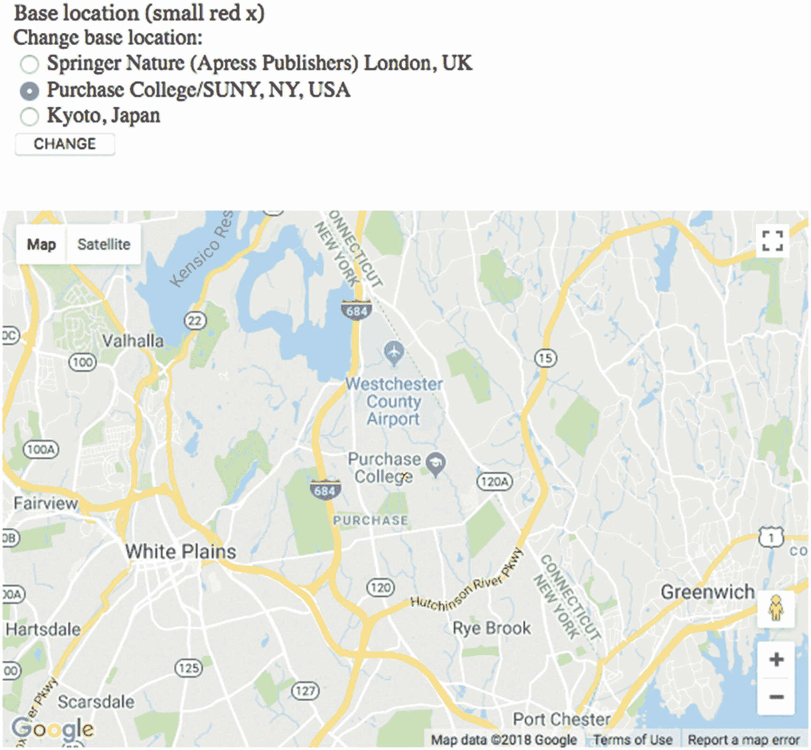

图 4-1

地图聚光灯项目的打开屏幕

请注意位于地图中间和单词 *College* 顶部的红色小(手绘)x。在决定地图标记时，你面临一个权衡。较小的标记更难看到。更大和/或更复杂的标记更容易被看到，但是会阻挡地图的更多部分或者分散地图的注意力。这张地图以采购学院校园为中心。对于此程序，这是初始基准位置。基准位置用于计算距离。注意单选按钮显示三个选择，在三个大洲。中间的选择是开始的选择。

在地图上移动鼠标，如图 4-2 所示。

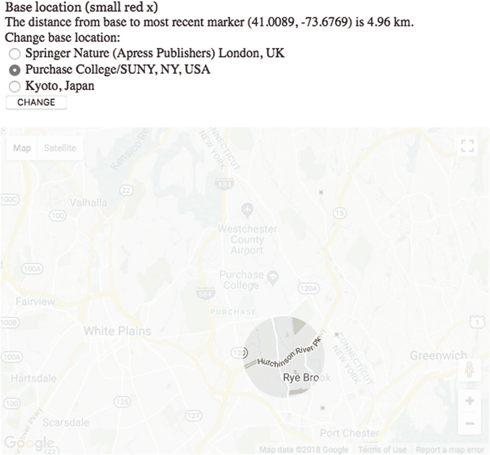

图 4-2

地图上的阴影/聚光灯

注意现在地图上的阴影和聚光灯的组合。地图的大部分被半透明的阴影覆盖。你需要相信我，这张截图是我在地图上移动鼠标时拍摄的。鼠标位置周围有一个圆圈，原始地图显示通过。在地图上移动时，光标不是标准的默认光标，而是我用一个代表紧凑型荧光灯的小图像创建的。

屏幕上的文字显示，从基地到地图上我点击的最后一个点的距离为 4.96 公里。所有这些位置的标记都是手绘的 *x* 。这个位置的纬度和经度用括号表示。

更改位置的界面是一组单选按钮(一次只能选择一个按钮)和一个标记为“更改”的按钮，当用户/观众/访问者决定进行更改时，可以单击该按钮。

这个项目的用户可以使用 Google Maps 提供的通用 GUI 功能。这包括用于放大和缩小的+和–按钮。图 4-3 展示了使用我的单选按钮切换到位于伦敦的 Springer Nature/a press Publishers 和 Google Maps +进行放大的结果。有可能放大得更远。注意哈利波特商店。

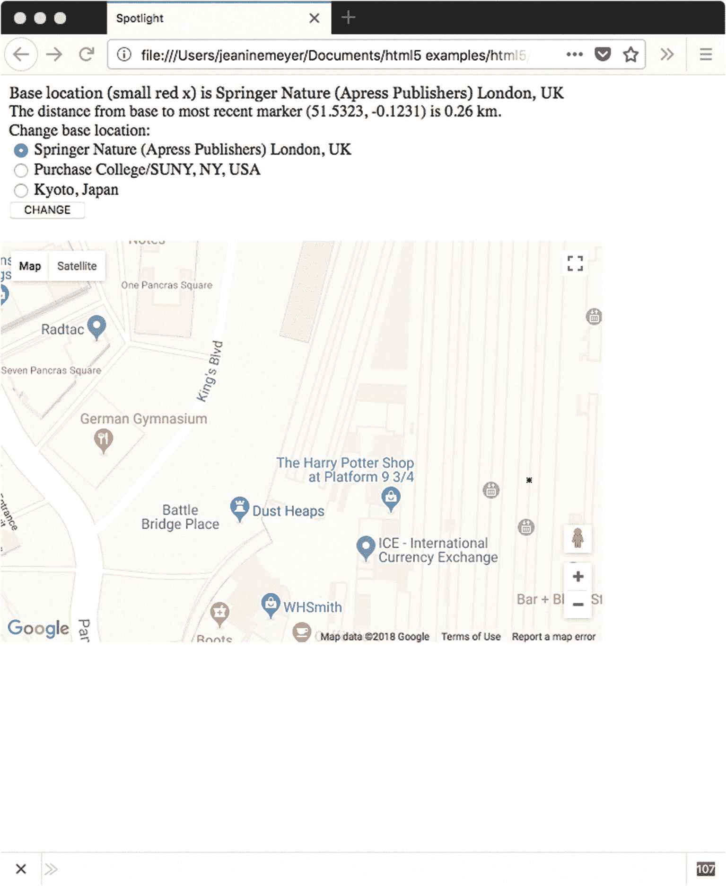

图 4-3

放大到伦敦

也可以将地图类型更改为卫星地图，并通过单击鼠标然后再次按下来平移地图。图 4-4 显示了切换到卫星和平移的效果。

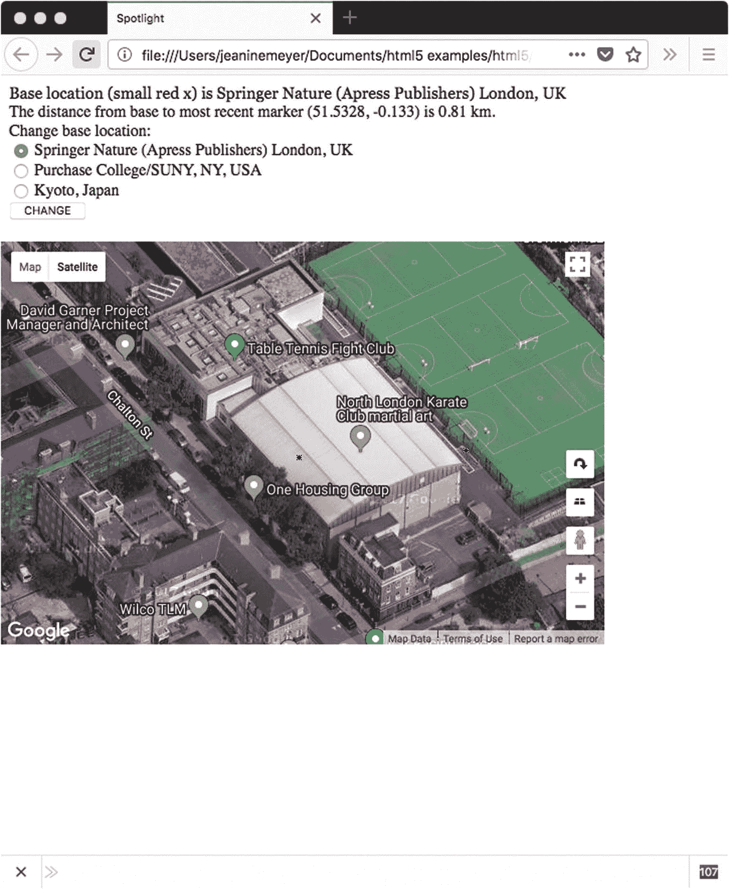

图 4-4

缩小并向西移动，卫星图像

我用界面换到第三种可能:日本京都。如图 4-5 所示。

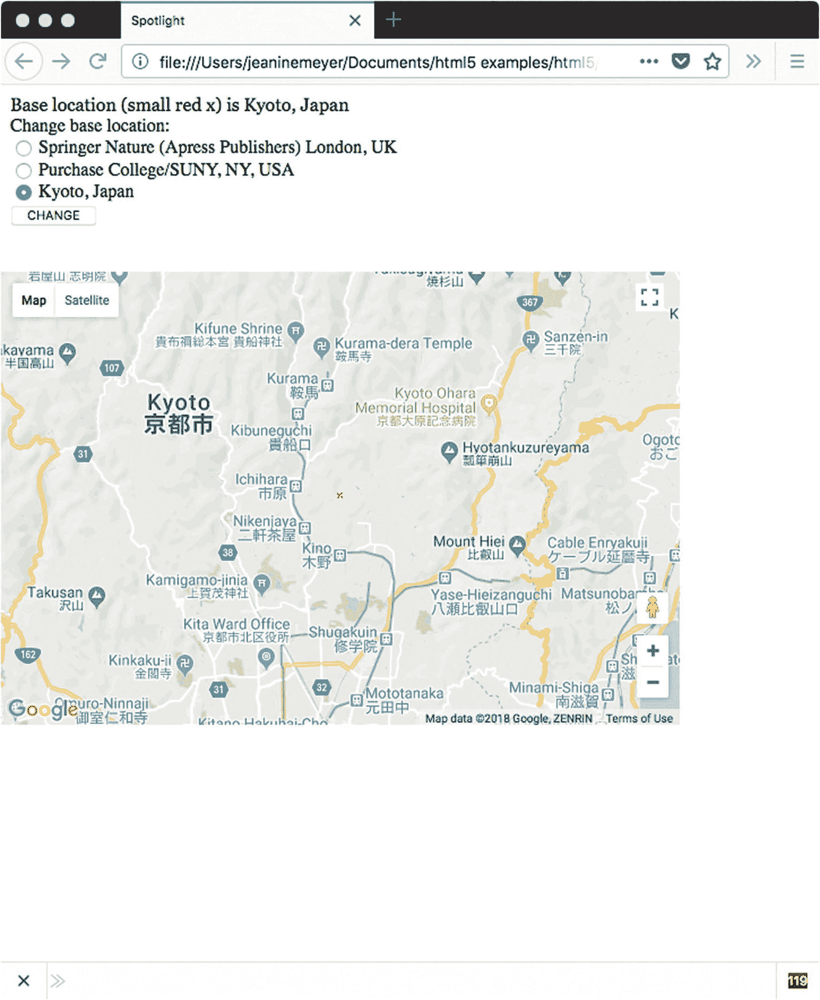

图 4-5

日本京都

接下来，我使用谷歌地图功能来改变京都的地图/地形。结果如图 4-6 所示。

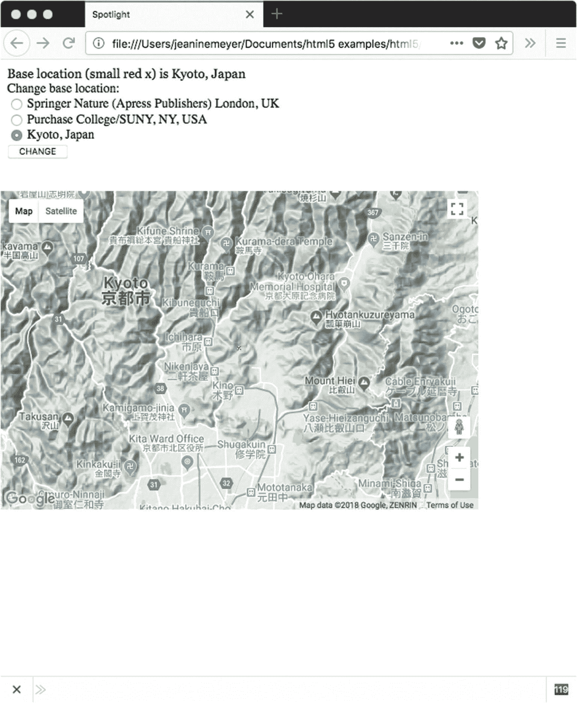

图 4-6

日本京都基地，地形图

同样，请注意红色的小 *x* 表示基准位置，屏幕顶部的文本显示新基准位置的名称。

每个基地的位置由我确定的三个值中的每一个的纬度和经度值决定。我的代码不是“要求”Google Maps 按名称查找这些位置。如果你在谷歌或谷歌地图中输入“购买大学，纽约”和其他地点，你可能会得到稍微不同的结果。要使这个应用程序成为您自己的应用程序，您需要决定一组基本位置，并查找纬度和经度值。我将在下一节中提出实现这一点的方法。

以防你好奇，缩小到缩放比例上最远的位置会产生如图 4-7 所示的结果。这个投影展示了所谓的格陵兰问题。格陵兰并不比非洲大，但实际上大约是它的 1/14。

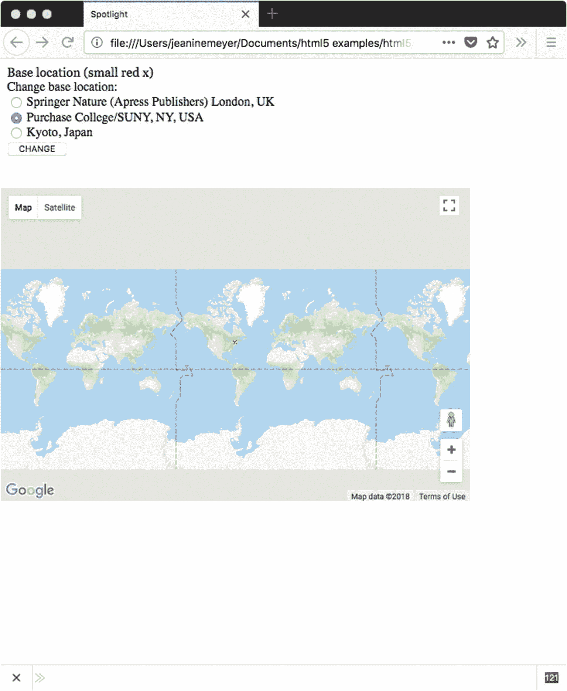

图 4-7

地图的最远视图

图 4-8 显示了接近最接近极限的地图。使用左上角的按钮，地图也被更改为卫星视图。

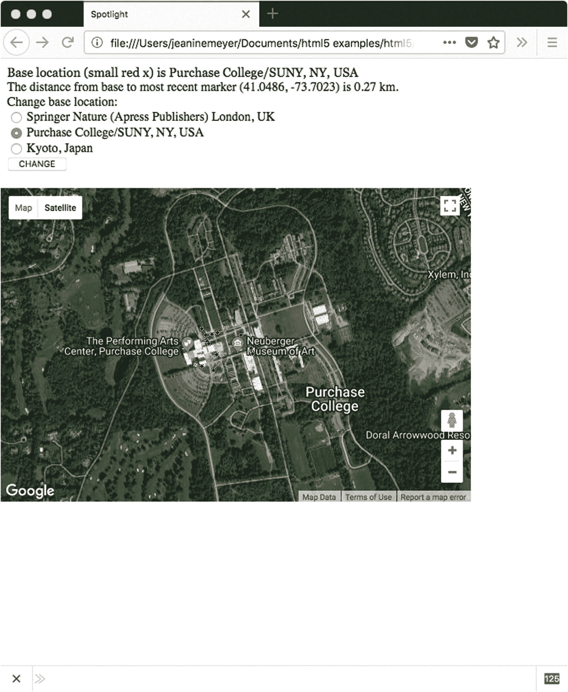

图 4-8

放大到可以探测到城市街区的地方，购买大学基地

最后，图 4-9 显示了放大到极限的地图。这本质上是在建筑层面。这栋建筑是自然和社会科学学院的所在地，也是我的办公室和电脑教室所在地。

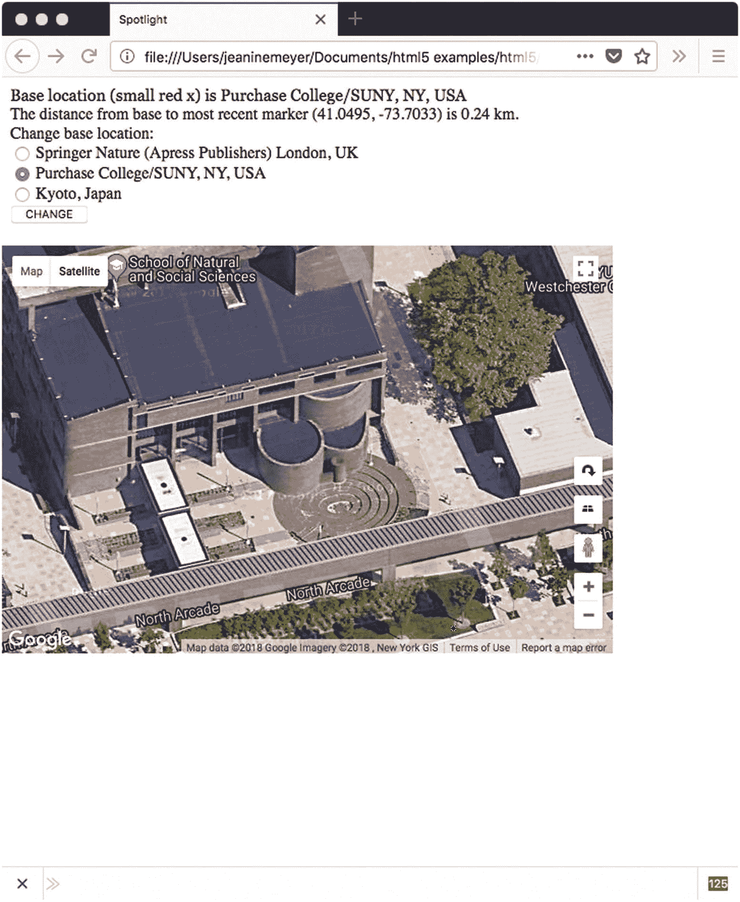

图 4-9

一直放大

通过使用界面缩小，平移和再次放大，我可以确定从任何基本位置到世界上任何其他位置的距离！我还可以使用这个应用程序来确定任何位置的纬度和经度值。您需要知道纬度和经度，以便在第五章中更改或添加基本位置列表，以及确定项目的位置。我将在下一节回顾纬度和经度。

谷歌地图本身是一个非常有用的应用。本章和下一章将演示如何将该功能引入到您自己的应用程序中。也就是说，我们将谷歌地图的一般功能与我们可以使用 HTML5 和 JavaScript 开发的任何东西或几乎任何东西结合起来。

## 纬度和经度以及其他关键要求

这个项目最基本的要求是理解地理坐标系统。正如在画布上指定点或在屏幕上指定位置需要一个坐标系统一样，在地球上使用一个位置系统也是必要的。在过去的几百年里，经纬度系统已经得到了发展和标准化。这些值是角度，纬度表示与赤道的角度，经度表示与英国格林威治本初子午线的角度。后者是一个随意的选择，在 19 世纪晚期成为标准。

这里有一个北半球的偏差:纬度值从赤道的 0 度到北极的 90 度和南极的-90 度。类似地，经度值从格林威治本初子午线向东为正值，向西为负值。纬度与赤道平行，经度垂直。纬度通常被称为*纬线*，通常表现为水平线，经度被称为*经线*，通常表现为垂直线。这种定位是任意的，但是相当牢固地建立起来了。

我将使用十进制值，这是谷歌地图中默认显示的值，但你会看到度数、分钟(1/60 度)和秒(1/60 分钟)的组合。您没有必要记住经纬度值，但这有助于培养对系统的一些直观感觉。你可以通过我所说的“双向选择”来做到这一点首先，识别和比较你知道的地方的经纬度值，其次，选择值，看看它们是什么。例如，我的项目版本的基本值如下:

```js
var locations = [
       [51.534467,-0.121631, "Springer Nature (Apress Publishers) London, UK"],
       [41.04796,-73.70539,"Purchase College/SUNY, NY, USA"],
       [35.085136,135.776585,"Kyoto, Japan"]
       ];

```

首先要注意的是纬度值相当接近，而经度值是负的，不太接近。因为我决定选择三大洲的地方作为基地，所以你需要进行实验，看看纬度和经度的微小变化会产生什么影响。你可以看到这三个地方都在赤道以北。在经度上，伦敦的值接近于零，接近格林威治本初子午线。你也可以注意到京都的经度是正的，其他的是负的。这些都有道理，但是你需要自己做实验来适应这些单元。

有许多方法可以找到特定位置的经纬度。您可以按如下方式使用谷歌地图:

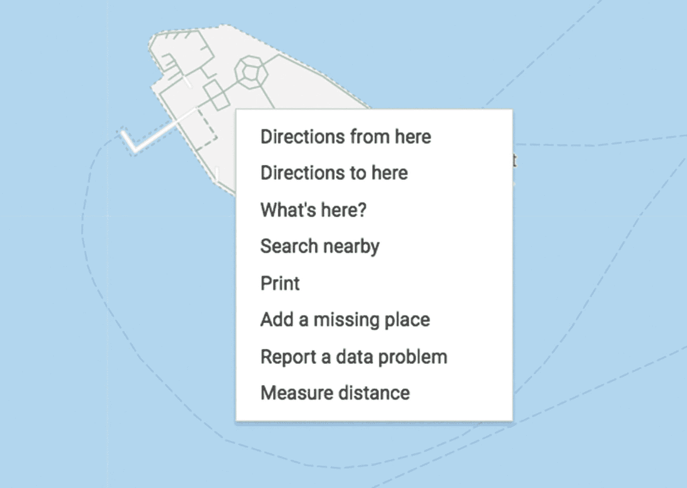

图 4-10

在谷歌地图中获取经纬度值

1.  从 Gmail 中的方形点阵调用谷歌地图，或者进入 [`http://.maps.google.com`](http://maps.google.com) 。

2.  在位置字段中输入一个位置。我在自由女神像打字。

3.  点按以获得菜单:

    图 4-10 显示了一个出现在地图底部的小窗口。

点击这里得到一个显示经度和纬度的小窗口。

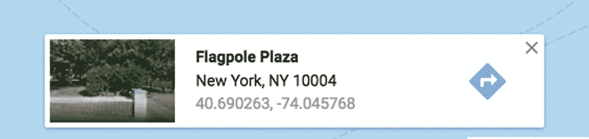

图 4-11

显示纬度和经度的框

另一种选择是使用 Wolfram Alpha ( [`www.wolframalpha.com`](http://www.wolframalpha.com) )，如图 4-12 ，它提供了一种确定经纬度值以及许多其他东西的方法。

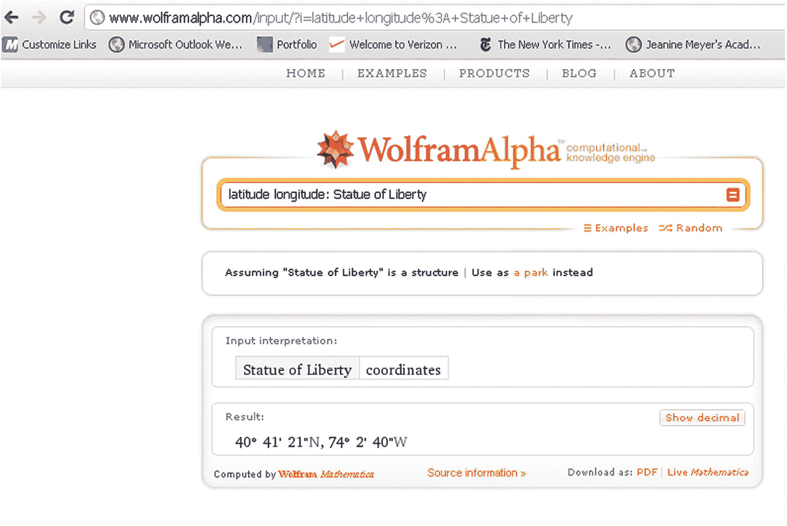

图 4-12

Wolfram Alpha 上的查询结果

请注意结果的格式。这是度/分/秒的格式，N 代表北方，W 代表西方。当我点击显示十进制按钮时，程序显示如图 4-13 所示的内容。

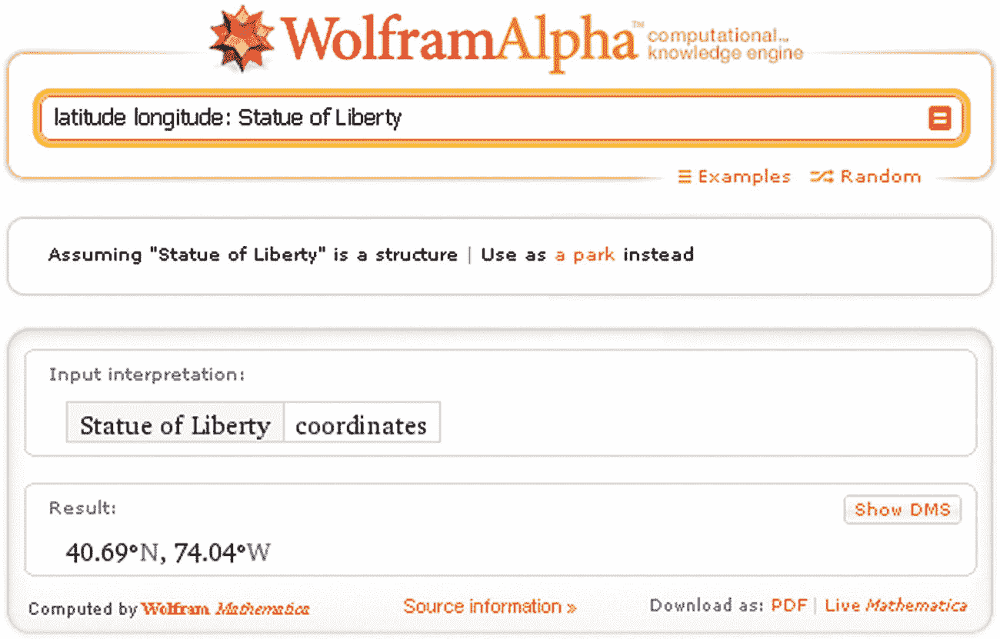

图 4-13

Wolfram Alpha 查询的十进制结果

请注意，经度仍然显示为 W 代表西方，而不是谷歌地图给出的负值。

按照我所说的“反方向走”，你可以把纬度和经度值输入谷歌地图。图 4-14 显示了放入 0.0 和 0.0 的结果。它是加纳南部海洋中的一个点。这是赤道上的一点*和格林威治本初子午线上的*。

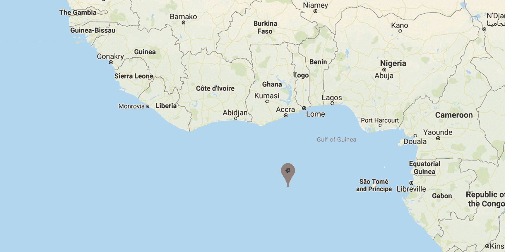

图 4-14

格林威治本初子午线处的赤道

我试图在格林威治本初子午线上找到英格兰的一个地方，并在 52.0 度的纬度上猜测时产生了图 4-15 所示的结果。

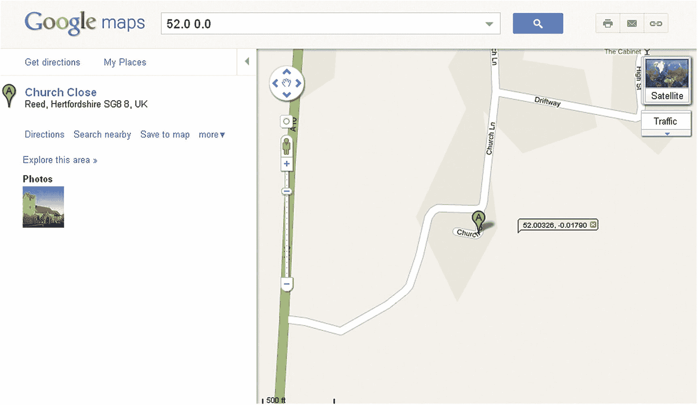

图 4-15

结果在格林威治本初子午线附近的一个地方

A 标记表示 Google 数据库中离请求位置最近的地方。我使用了 Drop LatLng 标记选项来显示准确的纬度和经度值。

该项目的关键需求始于使用指定的纬度和经度值将 Google Maps 引入 HTML5 应用程序的任务。一个额外的需求是在地图上产生阴影/聚光灯的组合来跟踪鼠标的移动。我还要求将鼠标的默认光标改为我自己选择的光标。

接下来，我添加了一个在地图上放置标记的要求，但还是用我选择的图形图标，而不是谷歌地图中标准的上下颠倒的泪珠。泪珠标记很好，但我的设计目标是与众不同，向您展示如何将您自己的创造力融入到应用程序中。

除了图形，我希望用户能够使用谷歌地图设备和我用 HTML5 构建的任何 GUI 功能。这都需要管理由 Google Maps API 设置的事件和使用 HTML5 JavaScript 设置的事件。对我想要制作的用户界面的事件的响应包括以下内容:

*   用阴影/聚光灯图形跟踪鼠标移动

*   通过在地图上放置一个 *x* 来响应点击

*   保留对谷歌地图界面的相同响应(滑块、平移按钮、通过抓取地图进行平移)

*   以适当的方式处理单选按钮和更改按钮

谷歌地图提供了一种确定位置之间距离的方法。因为我想设置这个项目来根据基本位置工作，所以我需要一种直接计算距离的方法。

这些是地图聚光灯项目的关键要求。现在我将解释我用来构建项目的 HTML5 特性。目标是使用 Google Maps 特性和 JavaScript 特性，包括事件，并且不让它们互相干扰。你可以把你学到的东西用于这个项目和其他项目。

## HTML5、CSS 和 JavaScript 特性

map-maker 项目面临的挑战是引入谷歌地图，然后在外观和 GUI 操作方面一起使用地图、画布和按钮。我将描述基本的 Google Maps API，然后解释 HTML5 特性如何提供部分屏蔽和事件处理。

### 谷歌地图应用编程接口

谷歌地图 JavaScript API 第 3 版基础在 [`http://code.google.com/apis/maps/documentation/javascript/basics.html`](http://code.google.com/apis/maps/documentation/javascript/basics.html) 有很好的文档。您现在不需要参考它，但是如果您决定构建自己的项目，它会对您有所帮助。这对于为移动设备开发应用程序特别有帮助。

大多数 API 都表现为相关对象的集合，每个对象都有属性(也称为*属性*)和方法。API 还可以包括事件和设置事件的方法。这就是谷歌地图 API 的情况。重要的对象是`Map`、`LatLng`和`Marker`。设置事件的方法是`addListener`，这可以用来设置对点击地图的响应。

使用谷歌地图 API 的第一步是去这个网站获取一个密钥: [`https://developers.google.com/maps/documentation/javascript/get-api-key`](https://developers.google.com/maps/documentation/javascript/get-api-key) 。

访问 API 的代码是修改以下内容，然后将其添加到 HTML 文档中:

```js
<script async defer src="https://maps.googleapis.com/maps/api/js?key=YOUR_API_KEY&callback=initMap"
  type="text/javascript"></script>

```

### 注意

本文的第一版使用了被称为“无密钥”的 API。虽然我的原始代码仍然可以在我的领域中使用，但是 Google now 更加严格了。这些特性的使用是有限额的，尽管限额看起来很大，但是如果您计划在生产中使用，您需要研究文档。

下一步——如果你只想引入一个谷歌地图，这可能就是你所需要的——是建立一个对`Map`构造函数方法的调用。这方面的伪代码是

```js
map = new google.maps.Map(place you are going to put the map, associative array with options);

```

请注意，将变量命名为`map`并没有什么坏处。

让我们一次一个地讨论这两个参数。放置地图的地方可以是 HTML 文档主体中定义的一个`div`。然而，我选择动态创建`div`。我是通过在`body`语句中设置`onLoad`属性，在一个以通常方式调用的`init`函数中使用代码来实现的。我还编写了代码来在`div`中创建一个`canvas`元素。代码是

```js
        candiv = document.createElement("div");
        candiv.innerHTML = ("<canvas id="canvas" width="600" height="400">No canvas
        </canvas>");
        document.body.appendChild(candiv);
        can = document.getElementById("canvas");
                pl = document.getElementById("place");
                ctx = can.getContext("2d");

```

`can`、`pl`和`ctx`是全局变量，每个变量都可供其他函数使用。

### 注意

尽管我试图使用“在 HTML 文档中引入对谷歌地图的访问”这样的语言，但我对描述一个“制作”地图的功能感到内疚。Google Maps 连接是一个动态连接，其中 Google Maps 创建了所谓的“要显示的图块”。

`Map`方法的第二个参数是一个关联数组。关联数组有命名元素，没有索引元素。用于`Map`方法的数组可以指示缩放级别、地图中心和地图类型等。缩放级别可以从 0 到 18。0 级如图 4-7 所示。第 18 层可以显示建筑物。地图的类型有路线图、卫星图、混合图和地形图。这些都是用谷歌地图 API 中的常量来表示的。中心由一个类型为`LatLng`的值给出，如您所料，该值是使用代表纬度和经度值的十进制数构造的。使用关联数组意味着我们不必遵循参数的固定顺序，默认设置将应用于我们忽略的任何参数。

下面是我的`makemap`函数的开始。调用该函数时使用了两个数字来表示地图的中心纬度和经度。我的代码构造了一个名为`blatlng`的`LatLng`对象，设置了保存地图规范的数组，然后构造了地图——也就是说，构造了 Google Maps 的门户。

```js
function makemap(mylat,mylong) {
        var marker;
        blatlng = new google.maps.LatLng(mylat,mylong);

myOptions = {
          zoom: 12,
           center: blatlng,
           mapTypeId: google.maps.MapTypeId.ROADMAP
  };
map = new google.maps.Map(document.getElementById("place"), myOptions);

```

`Map`方法构造对 Google Maps 的访问，从 ID 为`place`的 div 中带有指定选项的地图开始。`makemap`功能继续，在地图中心放置一个标记。这是通过设置一个关联数组作为`Marker`方法的参数来实现的。图标标记将是我创建的图像，命名为`rxmarker`，使用我自己设计的图像，绘制成红色 *x* 。

```js
marker = new google.maps.Marker({
 position: blatlng,
 title: "center",
 icon: rxmarker,
 map: map });

```

在`makemap`函数中还有一个语句，但我将在后面解释其余的。

### 画布图形

我们希望用鼠标在地图上移动的图形类似于第三章中使用的蒙版，将矩形视频剪辑变成圆形视频剪辑。这两个面具都可以描述为类似于一个长方形的甜甜圈:一个带圆孔的长方形。我们使用两条路径绘制阴影/聚光灯的图形，就像上一章中视频的遮罩一样。然而，这两种情况有两个明显的不同:

*   这个面具的确切形状各不相同。外部边界是整个画布，孔的位置与鼠标的当前位置对齐。这个洞会四处移动。

*   面具的颜色不是纯色颜料，而是透明的灰色。

画布从谷歌地图的顶部开始。我通过编写设置 z 索引值的样式指令来实现这一点:

```js
canvas {position:absolute; top: 165px; left: 0px; z-index:100;}
#place {position:absolute; top: 165px; left: 0px; z-index:1;}

```

第一个指令引用所有画布元素。这个 HTML 文档里只有一个。回想一下，z 轴从屏幕出来朝向观察者，所以较高的值在较低的值之上。还要注意，我们在 JavaScript 代码中使用了`zIndex`,在 CSS 中使用了`z-index`。JavaScript 解析器会将–符号视为减号操作符，因此对`zIndex`的更改是必要的。我需要编写代码来改变`zIndex`以获得我想要的这个项目的事件处理。

图 4-16 显示了在画布上绘制的阴影遮罩的一个例子。我已经使用单选按钮将基本位置设置为京都。然后，我使用谷歌地图控件缩小，平移到东京，然后放大。就 z 索引而言，画布位于地图上方，遮罩是用透明的灰色绘制的，因此下方的地图是可见的。

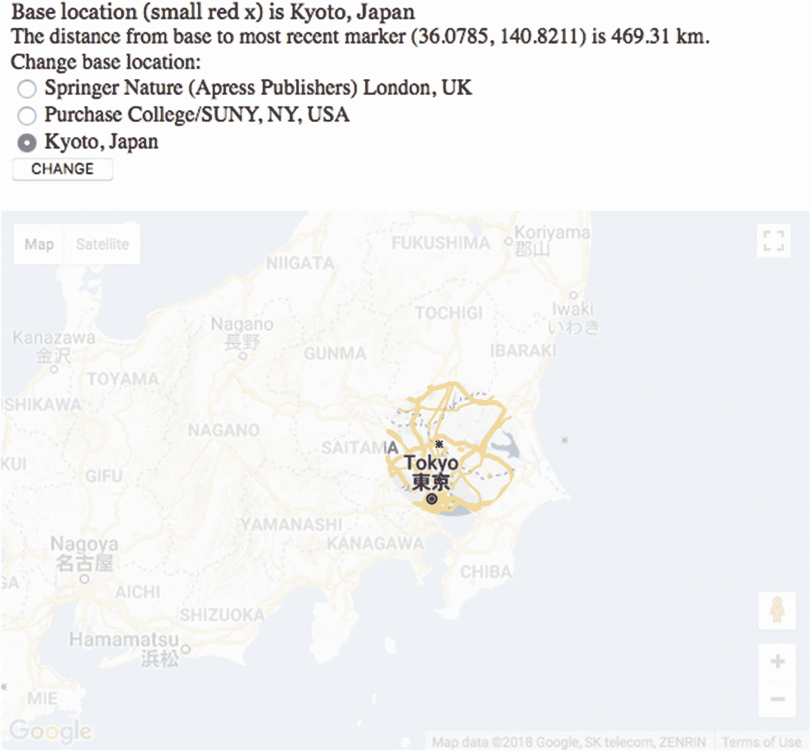

图 4-16

地图上一个地方的阴影/聚光灯

图 4-17 显示了在同一地图上绘制的阴影掩膜的另一个例子。这是因为 Google Maps 处理用户的鼠标移动，然后 JavaScript 代码处理鼠标移动来恢复阴影。

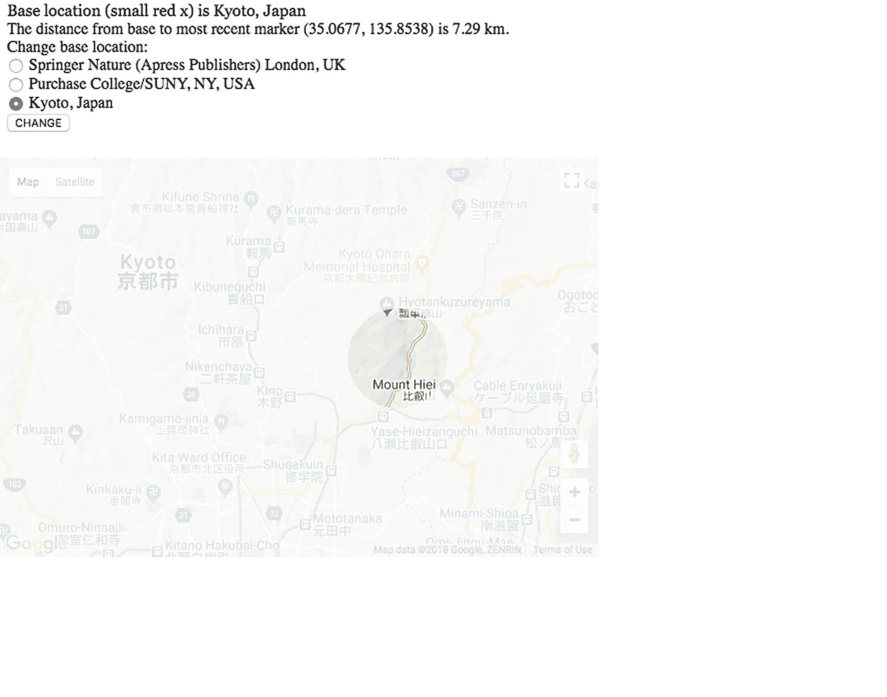

图 4-17

地图上另一个位置的阴影遮罩

这里有几个主题是相互关联的。让我们假设变量`mx`和`my`保存鼠标光标在画布上的位置。我将在本章后面解释如何做到这一点。函数`drawshadowmask`将绘制阴影遮罩。透明的灰色是遮罩的颜色，在名为`grayshadow`的变量 I 中定义，并使用内置函数`rgba`构建。`rgba`代表红绿蓝阿尔法。alpha 指的是透明度/不透明度。alpha 值为 1 表示颜色完全不透明:纯色。值为 0 表示完全透明，颜色不可见。还记得红色、绿色和蓝色值从 0 到 255，255、255 和 255 的组合是白色。这是一个实验的时代。我决定为灰色/浅灰色/幽灵般的阴影设置如下:

```js
var grayshadow = "rgba(250,250,250,.8)";

```

函数`drawshadowmask`使用了几个常量变量——它们从不改变。指示这些值的示意图如图 4-18 所示。

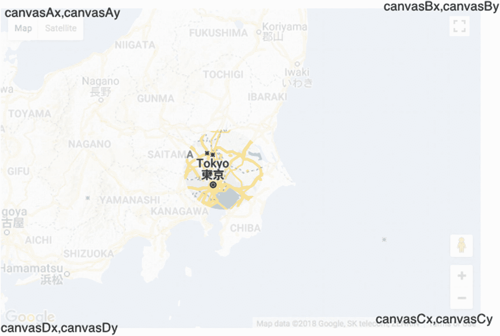

图 4-18

为掩模指示变量值的示意图

遮罩分为两部分，就像对弹跳视频的遮罩所做的那样。你可以回头看图 3-8 和图 3-9 。编码是相似的:

```js
function drawshadowmask(mx,my) {
   ctx.clearRect(0,0,600,400);
   ctx.fillStyle = grayshadow;
   ctx.beginPath();
   ctx.moveTo(canvasAx,canvasAy);
   ctx.lineTo(canvasBx,canvasBy);
   ctx.lineTo(canvasBx,my);
   ctx.lineTo(mx+holerad,my);
   ctx.arc(mx,my,holerad,0,Math.PI,true);
   ctx.lineTo(canvasAx,my);
   ctx.lineTo(canvasAx,canvasAy);
   ctx.closePath();
   ctx.fill();
   ctx.beginPath();
   ctx.moveTo(canvasAx,my);
   ctx.lineTo(canvasDx,canvasDy);
   ctx.lineTo(canvasCx,canvasCy);
   ctx.lineTo(canvasBx,my);
   ctx.lineTo(mx+holerad,my);
   ctx.arc(mx,my,holerad,0,Math.PI,false);
   ctx.lineTo(canvasAx,my);
   ctx.closePath();
   ctx.fill();
}

```

现在我们继续看红色灯泡。

### 光标

光标——移动鼠标时在屏幕上移动的小图形——可以在 style 元素或 JavaScript 中设置。图形有几个内置的选择(例如，十字准线和指针)，我们也可以参考我们自己的设计来定制光标，这就是我在这个项目中演示的。我加入了声明

```js
can.onmousedown = function () { return false; } ;

```

在`init`功能中，防止按下鼠标时改变默认光标。这可能是不必要的，因为默认可能不会被触发。

为了将移动鼠标的光标更改为传递聚光灯的东西，我创建了一个红色紧凑型荧光灯泡的图片，并将其保存在文件`light.gif`中。然后，我在函数`showshadow`中使用了下面的语句。`showshadow`函数已经被设置为`mousemove`的事件处理程序

```js
can.style.cursor = "url('light.gif'), pointer";

```

指示 JavaScript 应该在光标位于`can`元素顶部时使用图像的地址。此外，如果`light.gif`文件不可用，该语句会指示 JavaScript 使用内置指针图标。这类似于用优先选择列表来指定字体的方式。变量`can`已经被设置为引用画布元素。当画布被推到谷歌地图下时，光标将不被使用，这将在下一节讨论。

### JavaScript 事件

当我开始从事这个项目时，对事件的处理——即鼠标事件，但也包括改变 Google 地图缩放比例或单击单选按钮的事件——似乎是最令人生畏的。关键的考虑是事件是由 Google Maps 处理还是由我的 JavaScript 代码处理。然而，实际的实现结果很简单。在`init`函数和`makemap`函数中，我编写代码来设置鼠标移动、按下鼠标按钮和抬起鼠标按钮的事件处理，所有这些都与`canvas`元素有关。例如，在`init`函数中，有

```js
  can.addEventListener('mousemove',showshadow);
  can.addEventListener('mousedown',pushcanvasunder);
  can.addEventListener("mouseout",clearshadow);

```

如前所述，`showshadow`函数调用`drawshadowmask`函数。我可以将这两个功能结合起来，但是将任务分成更小的任务通常是一个好的实践。`showshadow`功能确定鼠标位置，进行调整，使灯泡底座位于聚光灯的中心，然后调用`drawshadowmask`:

```js
function showshadow(ev) {
   var mx;
   var my;
   if ( ev.layerX ||  ev.layerX == 0) {
        mx= ev.layerX;
        my = ev.layerY;
        }
  else if (ev.offsetX || ev.offsetX == 0) {
        mx = ev.offsetX;
        my = ev.offsetY;
         }
    can.style.cursor = "url('light.gif'), pointer";
    mx = mx+10;
    my = my + 12;
    drawshadowmask(mx,my);
}

```

提到`ev.layerX`和`ev.layerY`的`if`声明是针对老款火狐浏览器的。它可能会被移除。

现在我需要确定当用户按下鼠标时我想做什么。我决定让阴影消失，让地图以最大亮度显示。除了事情的表象，我还想让谷歌地图 API 恢复控制。希望 Google Maps API 接管的一个关键原因是，我想在地图上放置一个标记，而不是在画布上，来标记一个位置。这是因为我想让标记随着地图移动，而这很难通过在画布上绘制来实现。我需要将画布上的标记与地图的平移和缩放同步。相反，API 为我完成了所有这些工作。此外，我需要 Google Maps API 来生成该位置的纬度和经度值。

可以说，重新控制谷歌地图的方法是“把画布压下去”。该功能是

```js
function pushcanvasunder(ev) {
        can.style.zIndex = 1;
        pl.style.zIndex = 100;
}

```

将画布压到下面或放回上面的操作不是瞬间完成的。我愿意接受关于(1)如何定义接口和(2)如何实现你所定义的建议。这里有改进的余地。

另一个需要注意的情况是，当用户将鼠标从画布上移开时，我希望发生什么？`mouseout`事件是可以监听的，所以我编写了设置事件的代码(参见前面显示的`can.addEventListener`语句)由`clearshadow`函数处理。`clearshadow`函数正好完成了这一点——它清除了整个画布，包括阴影:

```js
function clearshadow(ev) {
        ctx.clearRect(0,0,600,400);
}

```

在引入 Google 地图的函数中，我为地图的`mouseup`设置了一个事件处理程序。

```js
listener = google.maps.event.addListener(map, 'mouseup', function(event) {
                        checkit(event.latLng);
                        });

```

对`addListener`的调用是 Google Maps API 的一部分，而不是 JavaScript 本身，它设置了对`checkit`函数的调用。用一种更非正式的方式重复一下已经说过的话:这个对`google.maps.event.addListener`的调用设置了 Google API 来监听地图上的`mouseup`事件。以下语句使 JavaScript 监听`can`(画布)上的`mouseout`事件。

```js
can.addEventListener("mouseout",clearshadow);

```

使用`event`对象的属性作为参数来调用`checkit`函数。正如您所猜测的，`event.latLng`是在`map`对象上释放鼠标按钮时鼠标所在位置的经纬度值。`checkit`功能将使用这些值来计算离基准位置的距离，并将这些值和距离一起打印在屏幕上。这段代码调用了我编写的对值进行舍入的函数。我这样做是为了避免显示一个有很多有效数字的值，超过了适合这个项目的数字。Google Maps API `marker`方法提供了一种使用我选择的图像作为标记的方法，这次是黑色手绘的 *x* ，并在标记中包含一个标题。推荐的标题是让使用屏幕阅读器的人可以访问应用程序，尽管我不能说这个项目在可访问性方面会让任何人满意。可以产生如图 4-19 所示的屏幕。注意我住的基斯科山附近的 x。顶部的信息显示了我通勤的英里数。可以更改代码来计算英里或公里。

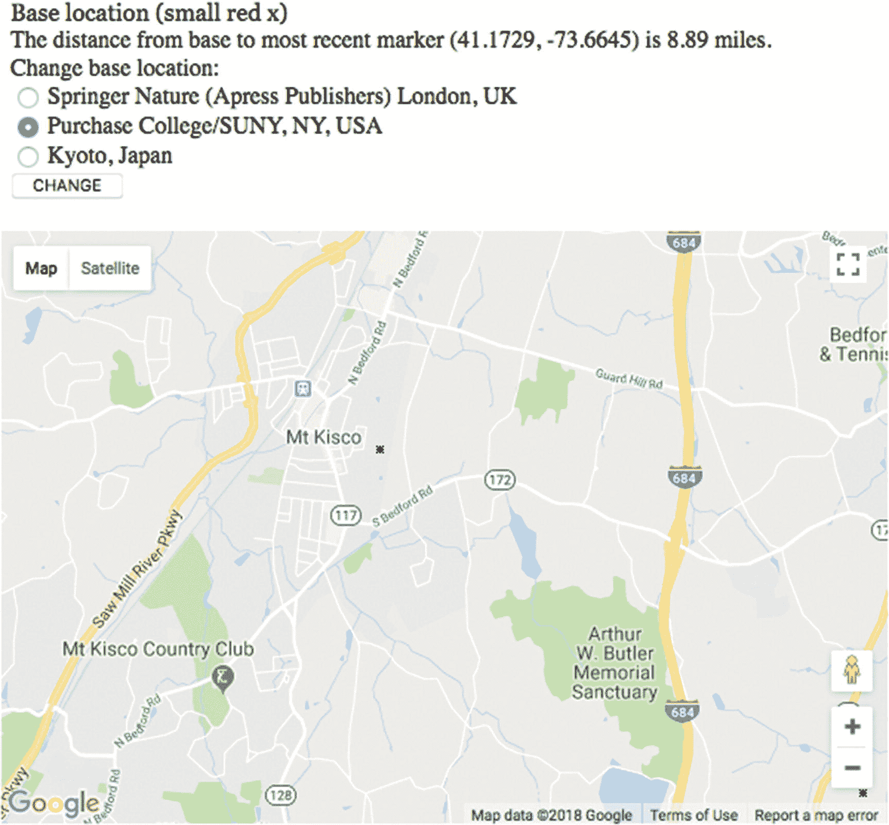

图 4-19

指示地图上显示的距离的标题

用保存纬度和经度值的参数调用的`checkit`函数如下:

```js
function checkit(clatlng) {
   var distance = dist(clatlng,blatlng);
   distance = round(distance,2);
   var distanceString = String(distance)+" km";
   marker = new google.maps.Marker({
   position: clatlng,
   title: distanceString,
   icon: bxmarker,
   map: map });
   var clat = clatlng.lat();
   var clng = clatlng.lng();
   clat = round(clat,4);
   clng = round(clng,4);
   document.getElementById("answer").innerHTML  =
"The distance from base to most recent marker ("+clat+", "+clng+") is "+String(distance) +" miles.";
//change miles to km depending on value used for R in the dist function
    can.style.zIndex = 100;
    pl.style.zIndex = 1;
}

```

尽管我省略了文本中的大部分注释，但我觉得有必要保留关于英里和公里的注释。我建议你在工作中也这样做。

请注意，该函数做的最后一件事是将画布放回地图的顶部。

CHANGE 按钮和单选按钮是使用标准 HTML 和 JavaScript 实现的。该表单是使用以下 HTML 代码生成的:

```js
<form name="f" onSubmit=" return changebase();">
    <input type="radio" name="loc" /> Springer Nature (Apress Publishers) London, UK<br/>
    <input id="first" type="radio" name="loc" /> Purchase College/SUNY, NY, USA<br/>
    <input type="radio" name="loc" /> Kyoto, Japan<br/>
    <input type="submit" value="CHANGE">
</form>

```

当点击标记为 CHANGE 的提交按钮时，调用函数`changebase`。`changebase`函数确定选中了哪个单选按钮，并使用 Locations 表获取纬度和经度值。然后它使用这些参数值调用`makemap`。这种组织数据的方式叫做*并行结构*:数组元素`locations`对应单选按钮。最后一条语句将 header 元素的`innerHTML`设置为显示文本，包括所选基本位置的名称。

```js
function changebase() {
        var mylat;
        var mylong;
        for(var i=0;i<locations.length;i++) {
                if (document.f.loc[i].checked) {
                        mylat = locations[i][0];
                        mylong = locations[i][1];
                        makemap(mylat,mylong);
                        document.getElementById("header").innerHTML =
                                   "Base location (small red x) is "+locations[i][2];
                }
        }
        return false;
}

```

### 计算显示的距离和舍入值

正如我们许多人所知，谷歌地图提供距离信息，甚至区分步行和驾驶。对于这个应用程序，我需要更多的控制来指定我想要计算距离的两个位置，所以我决定用 JavaScript 开发一个函数。确定两个点之间的距离，每个点代表纬度和经度值，是使用余弦球面定律来完成的。我的消息来源是 [`http://www.movable-type.co.uk/scripts/latlong.html`](http://www.movable-type.co.uk/scripts/latlong.html) 。这是代码。请注意，为了生成以公里为单位的值，您使用一个 R 值和一个被注释的 miles 值。如果当你切换到英里，你需要确保显示的信息说英里。

```js
function dist(point1, point2) {
   var R = 6371; // km  Need to make sure this syncs with the message displayed re: distance.
   // var R =  3959; // miles
   var lat1 = point1.lat()*Math.PI/180;
   var lat2 = point2.lat()*Math.PI/180 ;
   var lon1 = point1.lng()*Math.PI/180;
   var lon2 = point2.lng()*Math.PI/180;
   var d = Math.acos(Math.sin(lat1)*Math.sin(lat2) +
   Math.cos(lat1)*Math.cos(lat2) *
   Math.cos(lon2-lon1)) * R;
    return d;
  }

```

### 警告

我没有在代码中包含很多注释，因为我在本章的表格中注释了每一行。但是，注释很重要。我强烈建议在`dist`函数中留下对`km`和`miles`的注释，这样你就可以适当地调整你的程序。或者，您可以显示这两个值，或者给用户一个选择。

最后一个函数用于舍入值。当一个量依赖于一个人移动鼠标时，你不应该显示一个有很多小数位的值。但是，请记住，纬度和经度代表大单位。我决定用两位小数显示距离，用四位小数显示纬度和经度。

我写的函数挺一般的。它有两个参数，一个是数字`num`，另一个是`places`，表示取值的小数位数。你可以在其他情况下使用它。它通过添加我称为*增量*的值，然后计算不大于该值的最大整数，适当地向上或向下舍入。因此

*   `round(9.147,2)`将产生 9.15

*   `round(9.143, 2)`将产生 9.14

代码的工作方式是首先确定我称之为*的因子*，10 的预期位数。对于 2，这将是 100。然后我计算增量。对于两个地方，这将是 5 / 100 * 10，也就是 5/1000，也就是. 005。我的代码执行以下操作:

1.  将增量加到原始数字上。

2.  将结果乘以系数。

3.  计算不大于结果的最大整数(这称为*下限*)—产生一个整数。

4.  将结果除以因子。

代码如下:

```js
function round (num,places) {
        var factor = Math.pow(10,places);
        var increment = 5/(factor*10);
        return Math.floor((num+increment)*factor)/factor;
}

```

我使用`round`函数将距离四舍五入到两位小数，将纬度和经度四舍五入到四位小数。

### 小费

JavaScript 有一个名为`toFixed`的方法，本质上执行我这一轮的任务。如果`num`持有一个数字，比如说 51.5621，那么`num.toFixed()`将产生 51，而`num.toFixed(2)`将产生 51.56。我了解到这种方法可能会有误差，所以我选择创建自己的函数。不过，你可能很乐意在自己的应用程序中使用`toFixed()`。

随着相关 HTML5 和谷歌地图 API 特性的解释，我们现在可以把它们放在一起。

## 构建应用程序并使之成为您自己的应用程序

map spotlight 应用程序将 Google Maps 功能与 HTML5 编码结合起来。该应用程序的简要概述如下:

1.  `init`:初始化，包括带入地图(`makemap`)和用处理程序设置鼠标事件:`showshadow`、`pushcanvasunder`、`clearshadow`

2.  `makemap`:引入一个地图并设置事件处理，包括对`checkit`的调用

3.  `showshadow`:调用`drawshadowmask`

4.  `pushcanvasunder`:启用地图上的事件

5.  `checkit`:计算距离，添加自定义标记，显示距离和四舍五入后的经纬度

描述被调用/被调用和调用关系的函数表(表 4-1 )对于所有的应用程序都是相同的。

表 4-1

*功能* *在地图制作项目*

<colgroup><col class="tcol1 align-left"> <col class="tcol2 align-left"> <col class="tcol3 align-left"></colgroup> 
| 

**功能**

 | 

**由**调用/调用

 | 

**来电**

 |
| --- | --- | --- |
| `init` | 由`<body>`标签中的`onLoad`属性的动作调用 | `makemap` |
| `pushcanvasunder` | 由在`init`中调用的`addEventListener`的动作调用 |   |
| `clearshadow` | 由在`init`中调用的`addEventListener`的动作调用 |   |
| `showshadow` | 由在`init`中调用的`addEventListener`的动作调用 | `drawshadowmask` |
| `drawshadowmask` | 由`showshadow`调用 |   |
| `makemap` | 由`init`调用 |   |
| `checkit` | 由在`makemap`中调用的`addEventListener`的动作调用 | `round`，`dist` |
| `round` | 由`checkit`调用(三次) |   |
| `dist` | 由`checkit`调用 |   |
| `changebase` | 由`<form>`中的`onSubmit`动作调用 | `makemap` |

表 4-2 显示了名为`mapspotlight.html`的地图制作应用程序的代码。

表 4-2

*mapspotlight.html 应用程序的完整代码*

<colgroup><col class="tcol1 align-left"> <col class="tcol2 align-left"></colgroup> 
| 

**代码行**

 | 

**描述**

 |
| --- | --- |
| `<!DOCTYPE html>` | 页眉 |
| `<html>` | 开始`html`标签 |
| `<head>` | 开始`head`标签 |
| `<title>Spotlight </title>` | 完整标题 |
| `<meta charset="UTF-8">` | 什么时候 |
| `<style>` | 打开`style`元件 |
| `header` `{font-family:Georgia,"Times New Roman",serif;` | 设置标题的字体 |
| `font-size:16px;` | 字体大小 |
| `display:block;}` | 前后换行 |
| `canvas {position:absolute; top: 165px; left:0px;` | 单个画布元素的样式指令；在页面上稍微向下放置 |
| `z-index:100;}` | 画布的初始设置在地图的顶部 |
| `#place {position:absolute; top: 165px; left: 0px;` | 用于持有谷歌地图的`div`的样式指令；位置与画布完全相同 |
| `z-index:1;}` | 初始设置在帆布下 |
| `</style>` | 关闭`style`元素 |
| `<script async defer src="``https://maps.googleapis.com/maps/api/js?key=YOUR_API_KEY&callback=initMap``type="text/javascript"></script>` | 引入包含 Google Maps API 的外部脚本元素；注意:您需要获得自己的密钥来运行该程序 |
| `<script type="text/javascript" charset="UTF-8">` | 开始`script`标签 |
| `var` `locations = [` | 定义一组基本位置；注意:您需要与正文中的单选按钮相协调 |
| `[51.534467,-0.121631, "Springer Nature (Apress Publishers) London, UK"],` | 伦敦的纬度、经度名称出版商办公室 |
| `[41.04796,-73.70539,"Purchase College/SUNY, NY, USA"],` | 。。。采购学院 |
| `[35.085136,135.776585,"Kyoto, Japan"]` | 。。。京都 |
| `];` | 封闭位置阵列 |
| `var candiv;` | 用于握持`div`握持画布 |
| `var can;` | 参考画布元素 |
| `var ctx;` | 画布的参考上下文；用于所有绘图 |
| `var pl;` | 参考拿着谷歌地图的`div` |
| `function` `init() {` | `init`的功能头 |
| `var mylat;` | 将保存纬度值 |
| `var mylong;` | 将保存经度值 |
| `candiv = document.createElement("div");` | 创建一个`div` |
| `candiv.innerHTML = ("<canvas id="canvas" width="600" height="400">No canvas </canvas>");` | 将其内容设置为一个`canvas`元素 |
| `document.body.appendChild(candiv);` | 添加到正文 |
| `can = document.getElementById("canvas");` | 设置对画布的引用 |
| `pl = document.getElementById("place");` | 设置对持有谷歌地图的`div`的引用 |
| `ctx = can.getContext("2d");` | 设置上下文 |
| `can.onmousedown = function () { return false; } ;` | 防止将光标更改为默认值 |
| `can.addEventListener('mousemove',showshadow);` | 为鼠标移动设置事件处理 |
| `can.addEventListener('mousedown',pushcanvasunder);` | 设置按下鼠标按钮的事件处理 |
| `can.addEventListener("mouseout",clearshadow);` | 设置将鼠标移出画布的事件处理 |
| `mylat = locations[1][0];` | 将纬度设置为第一个(中间)位置的纬度 |
| `mylong` `= locations[1][1];` | 将经度设置为第一个(中间)位置的经度 |
| `document.getElementById("first").checked="checked";` | 将中间单选按钮设置为显示为选中状态 |
| `makemap(mylat,mylong);` | 调用函数来制作地图(在指定位置引入谷歌地图) |
| `}` | 关闭`init`功能 |
| `function` `pushcanvasunder(ev) {` | `pushcanvas`函数的头，用引用事件的参数调用 |
| `can.style.zIndex = 1;` | 向下推帆布 |
| `pl.style.zIndex = 100;` | 设置地图`div`向上 |
| `}` | 关闭`pushcanvasunder`功能 |
| `function clearshadow(ev) {` | `clearshadow`函数的头，用引用事件的参数调用 |
| `ctx.clearRect(0,0,600,400);` | 清除画布(擦除阴影遮罩) |
| `}` | 关闭`clearshadow`功能 |
| `function showshadow(ev) {` | showshadow 函数的标头，用引用事件的参数调用 |
| `var mx;` | 将用于保持鼠标的水平位置 |
| `var` `my;` | 将用于保持鼠标的垂直位置 |
| `if ( ev.layerX &#124;&#124;  ev.layerX == 0) {` | 这个浏览器用`layerX`吗？注意:这是针对旧浏览器的 |
| `mx = ev.layerX;` | 如果是，用它来设置`mx`。。。 |
| `my = ev.layerY;` | 。。。和`my` |
| `} else if (ev.offsetX &#124;&#124; ev.offsetX == 0) {` | 试试`offset`。注意:这适用于当前的浏览器 |
| `mx = ev.offsetX;` | 如果是，用它来设置`mx`。。。 |
| `my = ev.offsetY;` | 。。。和`my` |
| `}` | 关闭条款 |
| `can.style.cursor = "url('light.gif'),pointer";` | 如果可用，将光标设置为`light.gif`；否则使用`pointer` |
| `mx = mx+10;` | 进行粗略的校正，使光的中心水平地位于灯泡的底部。。。 |
| `my = my + 12;` | 。。。垂直地 |
| `drawshadowmask(mx,my);` | 在修改后的(`mx,my`)调用`drawshadowmask`功能 |
| `}` | 关闭`showshadow`功能 |
| `var canvasAx = 0;` | 遮罩常数:左上 x |
| `var canvasAy = 0;` | 左上 y |
| `var canvasBx = 600;` | 右上 x |
| `var canvasBy = 0;` | 右上 y |
| `var canvasCx = 600;` | 右下 x |
| `var canvasCy = 400;` | 右下 y |
| `var canvasDx = 0;` | 左下 x |
| `var canvasDy = 400;` | 左下 y |
| `var holerad = 50;` | 阴影中孔洞的恒定半径(聚光灯的半径) |
| `var grayshadow = "rgba(250,250,250,.8)";` | 暗淡阴影的颜色；注意 0.8 的α值 |
| `function drawshadowmask(mx,my) {` | `drawshadowmask`功能的表头；参数保持环形孔的中心 |
| `ctx.clearRect(0,0,600,400);` | 擦除整个画布 |
| `ctx.fillStyle = grayshadow;` | 设置颜色 |
| `ctx.beginPath();` | 开始第一个(顶部)路径 |
| `ctx.moveTo(canvasAx,canvasAy);` | 移动到左上角 |
| `ctx.lineTo(canvasBx,canvasBy);` | 画到右上角 |
| `ctx.lineTo(canvasBx,my);` | 绘制到由我的参数指定的垂直点 |
| `ctx.lineTo(mx+holerad,my);` | 向左画到洞的边缘 |
| `ctx.arc(mx,my,holerad,0,Math.PI,true);` | 画半圆弧 |
| `ctx.lineTo(canvasAx,my);` | 向左侧绘制 |
| `ctx.lineTo(canvasAx,canvasAy);` | 退回起点 |
| `ctx.closePath();` | 关闭路径 |
| `ctx.fill();` | 填写 |
| `ctx.beginPath();` | 第二(较低)路径的起点 |
| `ctx.moveTo(canvasAx,my);` | 从我的参数指示的左侧点开始 |
| `ctx.lineTo(canvasDx,canvasDy);` | 绘制到左下角 |
| `ctx.lineTo(canvasCx,canvasCy);` | 绘制到右下角 |
| `ctx.lineTo(canvasBx,my);` | 绘制到右边缘的点 |
| `ctx.lineTo(mx+holerad,my);` | 向左画到洞的边缘 |
| `ctx.arc(mx,my,holerad,0,Math.PI,false);` | 画半圆弧 |
| `ctx.lineTo(canvasAx,my);` | 向左边缘绘制 |
| `ctx.closePath();` | 关闭路径 |
| `ctx.fill();` | 填写 |
| `}` | 关闭`drawshadowmask`功能 |
| `var listener;` | 通过`addListener`调用设置的变量；*没有再次使用* |
| `var map;` | 持有地图 |
| `var blatlng;` | 保存基本经纬度对象 |
| `var myOptions;` | 保存用于映射的关联数组 |
| `var rxmarker = "rx1.png";` | 保存红色 *x* 图像的文件名 |
| `var bxmarker = "bx1.png";` | 保存黑色 *x* 图像的文件名 |
| `function makemap(mylat,mylong) {` | `makemap`功能的表头；参数保存地图中心的位置 |
| `var marker;` | 将保留为中心创建的标记 |
| `blatlng = new google.maps.LatLng(mylat,mylong);` | 构建一个`LatLng`对象(API 的特殊数据类型) |
| `myOptions = {` | 集合关联数组 |
| `zoom: 12,` | 缩放设置(可以是 0 到 18) |
| `center: blatlng,` | 中心 |
| `mapTypeId: google.maps.MapTypeId.ROADMAP` | 地图类型 |
| `};` | 关闭`myOptions`阵列 |
| `map = new google.maps.Map(document.getElementById("place"), myOptions);` | 调用 API 在指定位置引入地图 |
| `marker = new google.maps.Marker(` | 在地图中心放置标记；`marker`方法采用一个关联数组作为其参数；注意:也可以使用标记对象的`setMap`方法 |
| `{` | 关联数组的开始 |
| `position: blatlng,` | 设置位置 |
| `title: "center",` | 设置标题 |
| `icon: rxmarker,` | 设置图标 |
| `map: map` | 将 map named 参数设置为名为 map 的变量 |
| `}` | 关闭关联数组，它是调用`Marker`的参数 |
| `);` | 关闭对`Marker`方法的调用 |
| `listener = google.maps.event.addListener(` | 设置事件处理(以下三个参数)；这是一个谷歌地图活动 |
| `map,` | 对象，即地图 |
| `'mouseup',` | 特定事件 |
| `function(event) {` | 自主功能(直接定义为`addListener`中的参数) |
| `checkit(event.latLng);` | 用指定的经纬度对象调用`checkit` |
| `}` | 关闭函数定义 |
| `);` | 关闭对`addListener`的呼叫 |
| `}` | 关闭`makemap`功能 |
| `function checkit(clatlng) {` | `checkit`的功能头；用纬度-经度对象调用 |
| `var distance = dist(clatlng,blatlng);` | 调用`dist`函数，计算点击位置与底部之间的距离 |
| `var marker;` | 将保存新创建的标记 |
| `distance = round(distance,2);` | 四舍五入数值 |
| `var distanceString = String(distance)+" km";` | 设置`distanceString`为显示 |
| `marker = new google.maps.Marker(` | 调用`Marker`方法，该方法将一个关联数组作为其参数 |
| `{` | 关联数组的开始 |
| `position: clatlng,` | 预备姿势 |
| `title: distanceString,` | 设置标题 |
| `icon: bxmarker,` | 将图标设置为黑色 *x* |
| `map: map` | 将关联数组的 map 元素设置为名为 map 的变量的值 |
| `}` | 紧密关联数组 |
| `);` | 关闭对`Marker`方法的调用 |
| `var clat = clatlng.lat();` | 提取纬度值 |
| `var clng = clatlng.lng();` | 提取经度值 |
| `clat = round(clat,4);` | 将值四舍五入到小数点后四位 |
| `clng = round(clng,4);` | 将值四舍五入到小数点后四位 |
| `document.getElementById("answer").innerHTML  =` | 在屏幕上设置文本。。。 |
| `"The distance from base to most recent marker ("``+ clat+", "+clng+") is "+String(distance) +" km.";` | 。。。要计算和格式化的信息 |
| `can.style.zIndex = 100;` | 将画布设置在顶部 |
| `pl.style.zIndex = 1;` | 将`pl`(手持地图)设置在下方 |
| `}` | 关闭`checkit`功能 |
| `function round (num,places) {` | 舍入值的函数的标题 |
| `var factor = Math.pow(10,places);` | 根据位置数量确定系数 |
| `var increment = 5/(factor*10);` | 确定向上或向下舍入的增量 |
| `return Math.floor((num+increment)*factor)/factor;` | 进行计算 |
| `}` | 关闭`round`功能 |
| `function dist(point1, point2) {` | `dist`(距离)功能的功能头 |
| `// spherical law of cosines,``// from``//`[`http://www.movable-type.co.uk/scripts/latlong.html`](http://www.movable-type.co.uk/scripts/latlong.html) | 我的来源的归属；这是标准数学 |
| `var R = 6371; // km` | 用于生成答案的因子，以公里为单位 |
| `// var R =  3959; // miles` | 注释掉，但是保留以防万一你想用英里给出答案，我在图 4-19 中就是这么做的 |
| `var lat1 = point1.lat()*Math.PI/180;` | 将值转换为弧度 |
| `var lat2 = point2.lat()*Math.PI/180 ;` | 将值转换为弧度 |
| `var lon1 = point1.lng()*Math.PI/180;` | 将值转换为弧度 |
| `var lon2 = point2.lng()*Math.PI/180;` | 将值转换为弧度 |
| `var d =` | 计算。。。 |
| `Math.acos(Math.sin(lat1)*Math.sin(lat2) + Math.cos(lat1)*Math.cos(lat2) * Math.cos(lon2-lon1)) * R;` | 用三角学确定距离 |
| `return d;` | 回送结果 |
| `}` | 关闭`dist`功能 |
| `function changebase() {` | `changebase`功能的标题 |
| `var mylat;` | 将持有新的基准位置纬度 |
| `var mylong;` | 将保存新的基准位置经度 |
| `for(var i=0;i<locations.length;i++) {` | `for`循环确定哪个单选按钮被选中 |
| `if (document.f.loc[i].checked) {` | 这个检查过了吗？ |
| `mylat = locations[i][0];` | 如果是，设置`mylat` |
| `mylong = locations[i][1];` | 设置`mylong` |
| `makemap(mylat,mylong);` | 调用`makemap` |
| `document.getElementById("header").``innerHTML = "Base location (small red x) is "+locations[i][2];` | 更改标题中的文本以显示名称 |
| `}` | 关闭`if true`子句 |
| `}` | 关闭`for`回路 |
| `return false;` | 返回`false`进行当前刷新 |
| `}` | 关闭功能 |
| `</script>` | 结束`script`标签 |
| `</head>` | 结束`head`标签 |
| `<body onLoad="init();">` | 开始`body`标签；包括`onLoad`来调用`init` |
| `<header id="header">Base location (small red x) </header>` | 语义头元素 |
| `<div id="place" style="width:600px; height:400px"></div>` | `div`持有谷歌地图 |
| `<div id="answer"></div>` | `div`保存点击位置的信息 |
| `Change base location: <br/>` | 文本 |
| `<form name="f" onSubmit=" return changebase();">` | 改变基底的形式的开始；注意:您需要与`script`元素中的 locations 数组协调 |
| `<input type="radio" name="loc" /> Springer Nature (Apress Publishers) London, UK<br/>` | 单选按钮选择 |
| `<input id=”first” type="radio" name="loc" /> Purchase College<br/>` | 单选按钮选择；给定 ID 设置为打开时检查 |
| `<input type="radio" name="loc" /> Kyoto, Japan<br/>` | 单选按钮选择 |
| `<input type="submit" value="CHANGE">` | 进行更改的按钮 |
| `</form>` | 结束`form`标签 |
| `</body>` | 结束`body`标签 |
| `</html>` | 结束`html`标签 |

你需要决定你的基地位置。还是那句话，三没什么特别的。你的选择可能会更接近。如果你的基本列表太大，你可以考虑使用`<optgroup>`产生一个下拉列表。无论如何，您都需要定义一组位置。每个地点都有两个数字——纬度和经度——以及一串包含名称的文本。一些文本在 HTML 中以 body 元素的形式重复出现。

## 测试和上传应用程序

这个项目由 HTML 文件和三个图像文件组成。对于我的项目版本，图像文件是灯泡(`light.gif`)、红色的 *x* ( `rx1.png`)和黑色的 *x* ( `bx1.png`)。这些图像文件类型没有什么特别的。你喜欢什么就用什么。有人可能会说，我的 *x* 标记太小了，所以在决定怎么做时，要考虑你的客户。

这个应用程序需要你在线测试，因为这是联系谷歌地图的唯一方式。

## 摘要

在本章中，您学习了如何执行以下操作:

*   使用谷歌地图应用编程接口。

*   使用画布图形将 Google Maps API 的使用与您自己的 JavaScript 编码结合起来。也就是说，生成一个包含 Google Maps 事件和 HTML5 事件的 GUI。

*   使用控制透明度/不透明度的 alpha 设置进行绘制。

*   改为自定义光标。

*   计算地理点之间的距离。

*   四舍五入十进制数值，以便适当显示。

下一章描述了另一个使用谷歌地图的项目。您将学习如何构建一个应用程序，在该应用程序中，您可以将图片、视频剪辑或图片和音频剪辑的组合与特定的地理位置相关联，然后您将看到当用户在地图上的位置处或附近单击时，如何显示和播放指定的媒体。