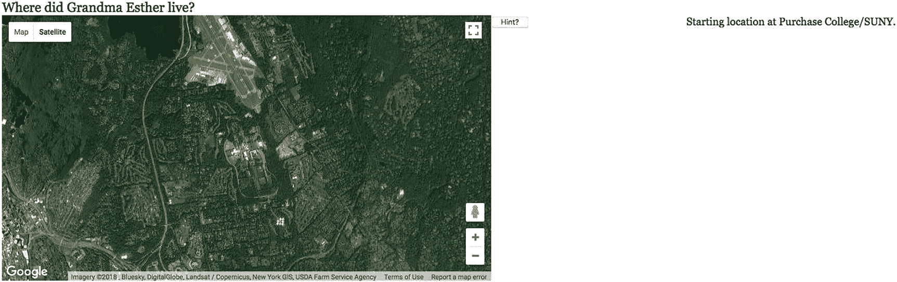

# 五、地图门户（MapPortal）：使用谷歌地图访问您的媒体

在本章中，您将学习以下内容:

*   使用 Google Maps API 播放和显示视频、音频和图像

*   动态创建 HTML5 标记

*   从内容描述中分离出程序

*   构建地理游戏

## 介绍

本章中的项目使用 Google Maps API 作为播放视频、显示图像或播放音频的方式*和*显示图像，所有这些都基于地理位置。您可以使用此项目作为模型来构建地理区域的研究或商务或度假旅行的报告，或者您可以将其发展为更复杂的地理测验。正如第四章的情况一样，主要的课程是关于将谷歌地图 API 与你自己的 JavaScript 结合使用，特别是呈现图像、音频和视频。本章的示例是一个测验应用程序。我已经获得了媒体，例如视频文件、音频文件和图像文件，并且我已经在代码中定义了媒体和特定地理位置之间的关联。为了让你了解我的意思，在我的项目中，目标位置(在代码中以经纬度坐标给出)和媒体之间的关联如表 5-1 所示。

表 5-1

*内容概要*

<colgroup><col class="tcol1 align-left"> <col class="tcol2 align-left"></colgroup> 
| 

位置描述

 | 

媒体

 |
| --- | --- |
| 美国纽约采购学院(学生服务大楼) | 开始位置:无媒体 |
| 基斯科山， NY， 美国 | 埃丝特的照片和她弹钢琴的音频文件 |
| 美国纽约采购学院(自然科学大楼) | 乐高机器人视频 |
| 美国纽约州自由女神像市 | 烟花视频 |
| 日本宫浜 | 大鸟居的照片 |

应用程序可以顺利处理不同类型的媒体。这要归功于 HTML5 的特性，我谦虚地说，还要归功于我的编程。(事实上，谦虚是需要的:我需要对程序做一个小的修改，因为当我从较小的图片更改为较大的图片时，图像尺寸有很大的差异。)媒体信息以及问题和位置存储在单独的文件中。

仍然建议您提供多种视频和音频格式，以确保您的应用程序可以在不同的浏览器中工作。浏览器识别的媒体类型可能会发生变化，因此需要的类型会减少，但目前情况并非如此。

该应用程序是一个简单的测验。它由两个文件组成:`mapmediaquiz.html`和`mediaquizcontent.js`。`mediaquizcontent.js`文件包含连接媒体和位置的信息，也包含问题的文本。

图 5-1 显示了测验的开始屏幕。


图 5-1

测验的开始屏幕

玩家现在试图通过确定位置并点击地图来回答这个问题。图 5-2 显示了当我点击购买校园时会发生什么。这不是一个好的答案，这是程序检测到的。


图 5-2

点击购买学院的结果

注意，在我点击的地方出现了一个小 x，但是它离正确的位置还不够近。我移动地图并再次尝试，图 5-3 显示了点击屏幕的结果，但没有足够接近目标位置。请注意，我已经平移了地图，将它移动到了北方。玩家可以选择得到提示。当我点击提示按钮时，图 5-3 出现了。这是一个非常强烈的暗示，鼓励读者想出一种方法来帮助玩家而不给出答案。


图 5-3

点击提示按钮的结果

当我按照指示点击红色 x 时，图 5-4 显示了结果。还要注意音频控制，它提供了暂停和恢复播放以及改变扬声器音量的方法。在不同的浏览器中，对音频(和视频)的控制会有所不同，但功能是相同的。音频会立即开始播放。还要注意，下一个问题出现了。


图 5-4

图像和音频组合

因为我知道位置在哪里，所以我知道缩小到下一个位置。图 5-5 显示了使用谷歌地图界面实现这一点的结果。音轨继续播放，我仍然可以看到图片。


图 5-5

缩小以准备向南平移

图 5-6 显示了将地图移动到南方，然后放大到采购园区的结果，在采购园区，学生制作的视频显示了一个乐高 Mindstorms 机器人正在穿越一个迷宫。


图 5-6

正确定位(足够接近)乐高机器人，播放视频

下一个地点是自由女神像。请注意，当我单击该位置附近时，会出现一个由 Google 设置的弹出标签。


图 5-7

缩小、向南平移，然后放大以单击自由女神像

最后一个问题需要穿越整个国家，穿越太平洋才能找到 Miyajama(照片的供应商 Takashi 告诉过我)。图 5-8 显示了第一步的结果。


图 5-8

缩小然后放大日本

前一个问题的结果仍然出现。我按下提示按钮，看到图 5-9 所示的内容。


图 5-9

点击提示按钮的结果

当我点击屏幕上提示的位置时，图 5-10 出现。这是日本主要的本地和全球旅游景点。


图 5-10

伟大的鸟居

在这一点上，我需要承认我的原始代码不能处理 Takashi 提供的非常好和非常大的图像。它对于我使用的编码来说太大了，而我使用的编码对于小图像来说已经足够好了。图 5-11 显示了当我将大鸟居问题和宫间的照片包含在我的原始代码中时会发生什么。这确实令人失望。这只是图像的左上角。


图 5-11

显示图像的原始编码结果

我最初的声明:

```js
         ctx.drawImage(img1,0,0);

```

只在画布上画了画的上角。相反，我需要编写 JavaScript 来确定如何将图片缩放到 400x400 的画布上，在执行缩放的同时保持纵横比。下面的方法可以解决这个问题:

```js
            var iw = img1.width;
            var ih = img1.height;
            var aspect = iw/ih;
            if (iw>=ih) {
                if (iw>400){
                tw = 400;
                th = 400/aspect;
                }
                else {
             tw = iw;
             th = ih;
                 }
              }
              else {
      if (ih>400){
                       th = 400;
           tw = 400*aspect;
        }
      else {
                       th = ih;
            tw = iw;
      }
              }
              ctx.drawImage(img1,0,0,iw,ih,0,0,tw,th);

```

图 5-12 表示代码的动作。原始宽度等于`iw`且高度等于`ih`的图像被缩小以适合 400 乘 400 的画布。最终尺寸由`tw`和`th`表示。这段代码产生了如图 5-10 所示的内容。


图 5-12

显示源和目标宽度和高度值关系的图表

有了这个介绍，我将继续讨论项目历史和关键需求。

## 项目历史和关键要求

Purchase 学院的一名大四学生收集并制作了关于纽约皇后区少数民族社区的视频剪辑和照片，并想找到一种展示这项工作的方式。谷歌地图 API 和 HTML5 中的新工具似乎非常适合这项任务。请记住，该学生只需要在她在高级项目展示中设置的计算机上演示作品，因此不兼容浏览器的问题不是问题。关键需求包括 Google Maps API 所提供的内容。正如您在上一章中所了解的，我们可以编写代码来访问以指定地理位置为中心的地图，设置初始缩放级别，并显示道路或卫星或地形或混合的视图。此外，API 还提供了一种方法来响应查看者单击地图的事件。我们需要一种方法来定义特定的位置，以便与查看者点击对应的位置进行比较。

我为学生设计的第一个系统只使用了视频和图像。我后来决定添加图像和音频组合。应用程序的关键要求是在正确的时间*显示和播放指定的媒体，并在适当的时候*停止和移除媒体，例如到了下一次演示的时间。

在帮助学生项目后，我想到了改变。第一个是添加了图像和音频组合。我决定不要音频本身。下一个变化是将特定内容从一般编码中分离出来。这反过来需要一种为视频和音频元素动态创建标记的方法。

我一直喜欢游戏和课程，为观众——现在最好描述为玩家或学生——构建一个带有问题或提示的应用程序似乎是一个自然的步骤。玩家通过在地图上找到正确的位置给出答案。像这样的任何应用程序都需要定义一个关于答案的容差。不能期望观众/玩家/学生准确地点击正确的点。

在测试小测验时，我意识到我需要一些方法来帮助玩家通过一个特别难的问题。因为我是老师，所以我决定给玩家看答案，而不是直接跳过问题。然而，正如我前面指出的，您也许能够设计出一种更好的方法来产生提示。

虽然在玩游戏时这一点并不明显，但是问题、地点(答案)和媒体的分离使得我们可以很容易地组织一个完全不同的测验。然而，正如我所指出的，当我决定加入不同大小和形状的图片时，我确实需要做一些调整。

描述了关键需求之后，下一节包含了对可用于构建项目的特定 HTML5 特性的解释。

## HTML5、CSS 和 JavaScript 特性

像第四章中的 map maker 项目一样，这些项目是通过结合使用 Google Maps API 和 HTML5 的特性来实现的。这个项目的组合并不复杂。地图停留在窗口的左侧，媒体显示在右侧。我将快速回顾如何访问地图以及如何设置事件处理，然后继续讨论 HTML5、CSS 和 JavaScript 特性，以满足其余的关键需求。

### 用于地图访问和事件处理的谷歌地图 API

访问 Google Maps API 需要一个引用外部文件的脚本元素。正如在第四章中提到的，使用谷歌地图 API 的第一步是去这个网站获取一个密钥: [`https://developers.google.com/maps/documentation/javascript/get-api-key`](https://developers.google.com/maps/documentation/javascript/get-api-key) 。

访问 API 的代码是修改以下内容，然后将其添加到 HTML 文档中:

```js
<script async defer src="https://maps.googleapis.com/maps/api/js?key=YOUR_API_KEY&callback=initMap"
  type="text/javascript"></script>

```

这个外部脚本元素引入了对象的定义，比如地图和标记，您现在可以使用这些定义将 Google Maps 的功能包含到您的 HTML 和 JavaScript 项目中。

我使用一个名为`makemap`的函数建立了到映射的连接。它有两个参数:代表纬度和经度值的两个十进制数字:

```js
function makemap(mylat, mylong)

```

保存从 0 到 18 的数字的全局变量`zoomlevel`和保存图像文件地址的`bxmarker and rxmarker`在函数`makemap`被调用之前被设置。

引入地图的代码是对`google.maps.Map`构造函数方法的调用。它需要两个参数。第一个是 HTML 文档中地图出现的位置。我在文档体中设置了一个 ID 为`place`的`div`:

```js
<div id="place" style="float: left; width:50%; height:400px"></div>

```

第二个参数是一个关联数组。以下三个语句将地图的中心位置设置为 Google Maps 经纬度对象，创建关联数组`myOptions`，并调用`Map`构造函数:

```js
blatlng = new google.maps.LatLng(mylat,mylong);
myOptions = {
          zoom: zoomlevel,
          center: blatlng,
                 mapTypeId: google.maps.MapTypeId.ROADMAP
            };
map = new google.maps.Map(document.getElementById("place"), myOptions);

```

为了完整起见，这里是地图类型的其他设置的截图。这些是地形、混合和卫星。`mapTypeId`可以用简单的字符串设置，例如`'roadmap'`。图 5-13 显示了请求显示地形的设置的结果——即指示海拔、水、公园和人工建筑区域的颜色:


图 5-13

地形图类型

```js
mapTypeId: google.maps.MapTypeId.TERRAIN

```

图 5-14 显示了结合卫星和道路地图图像请求混合视图的结果。


图 5-14

混合贴图类型

```js
mapTypeId: google.maps.MapTypeId.HYBRID

```

对了，混合地图是点击界面上的卫星选项产生的。

图 5-15 显示请求卫星图像的结果。我们可以认为这是纯卫星图像。请注意，主要的高速公路是可见的。



图 5-15

卫星地图类型

```js
mapTypeId: google.maps.MapTypeId.SATELLITE

```

最后，在您的应用程序中，您可能不希望查看者直接更改地图。您可以通过使用`myOptions`数组中的附加选项禁用默认界面来防止用户更改地图。我已经包含了我放在`disableDefaultUI`之前的语句，以表明关联数组属性由逗号分隔，最后一个逗号后没有*逗号。*

```js
mapTypeId: google.maps.MapTypeId.ROADMAP,
disableDefaultUI: true

```

图 5-16 显示了结果。用户仍然可以平移地图，即移动地图，但是+和–缩放控件以及地图和卫星按钮已被移除。


图 5-16

地图接口已移除

还有两个操作需要`makemap`执行。在地图上指定的中心位置放置一个自定义标记，并为单击地图设置事件处理:

```js
marker = new google.maps.Marker({
         position: blatlng,
         title: "center",
         icon: rxmarker,
         map: map });
listener = google.maps.event.addListener(map, 'click', function(event) {
                        checkit(event.latLng);
                        });

```

`rxmarker`值引用了一个图像对象，它的`src`被设置为一个名为`rx1.png`的外部文件。这就是在地图中心产生红色小 x 的原因。提醒一下:`addListener`是为 Google Maps API 设置事件的方法。`addEventListener`是一个为 JavaScript 设置事件的方法。

### 外部文件中的项目内容

测验使用了三种媒体:`video`、`picture`和我称之为`pictureaudio`。注意:这些是我选择包含在项目中的三种类型的术语。测验的内容是用两个数组指定的，我命名为`precontent`和`questions`。`precontent`数组的每个元素本身是一个五或六个元素的数组。前四个元素对于所有类型都是相同的:纬度、经度、标题和类型。第五或第五和第六指向特定的媒体元素。当前测验的数据，即外部文件的内容是:

```js
var base=
            [41.04796,-73.70539,"Purchase College/SUNY"];
var zoomlevel = 13;

var precontent = [
   [41.19991,-73.72353,"Esther at home","pictureaudio","estherT","esther.jpg"],
   [41.05079,-73.70448,"Lego robot","video","maze"],
   [40.68992,-74.04460,"Fire works","video","sfire3"],
   [34.298846,132.318359,"Miyajima","picture","miyajima0.JPG"]
   ];

var questions = [
  "Where did Grandma Esther live?",
  "Show the Lego robot navigating a maze.",
  "Where are great fireworks?",
  "Where is the Great Torii?"

];

var maxdistance = 10;

```

`base`、`zoomlevel`和`maxdistance`变量都是它们看起来的样子。`base`是地图的初始中心点。`zoomlevel`指定初始缩放。我说*初始*是因为用户可以使用谷歌地图控件来平移或放大或缩小。`maxdistance`是我用来检查用户点击是否足够接近其中一个位置的数字。您需要为您的应用确定合适的距离。

`precontent`数组指定了四个位置，以一个图片/音频组合开始，接着是两个视频，再接着是一个图片。如您所料，图片/音频组合数组中的元素包括两条附加信息。仅仅从这段代码来看并不明显，但是`esther.jpg`指的是一个图像元素，而`estherT`指的是一个音频元素。同样，`maze`和`sfire3`指的是视频元素，`miyajima0.JPG`指的是另一个图像元素。使用两个或更多阵列的布置，如我使用的`precontent`和`questions`被称为*并行结构*。我的代码产生了一个名为`content`的数组，它被`checkit`函数引用(将在下面描述)，适当的媒体被呈现。

使用一个`script`元素将外部脚本引入主文档。对于`mapmediaquiz`，这是

```js
<script type="text/javascript" src="mediaquizcontent.js"> </script>

```

### 距离和公差

两个经纬度点之间距离的计算在前一章中已有描述。这里要解释的问题是关于如何进行距离的比较。对于测验应用程序，我需要编写代码来确定 Google 事件处理程序返回的位置是否足够接近指定问题的正确位置。变量`maxdistance`保存值，有时称为容差。这里是我的`checkit`函数的大部分代码。我已经忽略了`switch`语句，一旦确定玩家的猜测足够接近，它会对每种问题类型做不同的处理。

```js
function checkit(clatlng) {
      var marker;
      var latlnga =new google.maps.LatLng(content[nextquestion][0],content[nextquestion][1]);

      var distance = dist(clatlng,latlnga);
                  eraseold();
                  marker = new google.maps.Marker({
            position: clatlng,
                                   title: "Your answer",
                        icon: bxmarker,
            map: map });

                   if (distance<maxdistance) {

           switch (content[nextquestion][3]) { ...
                        }  // end switch
                   asknewquestion();
      }  // end if (distance<maxdistance)
      else {
            answer.innerHTML= "Not close enough to the location.";
      }
}

```

### 用于创建 HTML 的正则表达式

正则表达式是描述用于检查和操作的字符串(文本)模式的强大工具。它是一种用于指定模式的完整语言。例如，为了让您对这个大主题有所了解，模式

```js
/⁵[1-5]\d{2}-?\d{4}-?\d{4}-?\d{4}$/

```

可用于检测万事达卡号码。这些数字从 51 到 55 开始，后面是两个以上的数字，然后是三组四位数。该模式接受破折号，但不要求破折号。`^`符号意味着模式必须出现在字符串的开头，而`$`意味着它必须到达字符串的结尾。正斜杠(`/`)是模式的分隔符，反斜杠是转义符。从头开始解释这种模式如下:

*   `^`:从字符串的开头开始。

*   `5`:图案必须包含一个 5。

*   `[1-5]`:图案必须包含数字 1、2、3、4 或 5 中的一个。

*   `\d{2}`:模式必须正好包含两位数字。

*   `-?`:模式必须包含 0 或 1 -。

*   `\d{4}`:模式必须正好包含四位数字。

*   `-?`:模式必须包含 0 或 1 -。

*   `\d{4}`:模式必须正好包含四位数字。

*   `-?`:模式必须包含 0 或 1 -。

*   `\d{4}`:模式必须正好包含四位数字。

*   `$`:字符串结束。

万事达卡号码也必须遵守其他规则，你可以研究一下如何进一步验证它们。不要担心，我们将使用比这简单得多的正则表达式(也称为 *regex* )。

正则表达式的使用早于 HTML。可以在表单中使用正则表达式来指定输入的格式。对于这个应用程序，我们将对字符串使用`replace`方法，在一个长字符串中找到一小段特定文本的所有实例，并用其他内容替换它。我使用的一种说法是

```js
videomarkup = videomarkup.replace(/XXXX/g,name);

```

这样做的是找到字符串`XXXX`的所有出现(这就是`g`所做的),并用变量`name`的值替换它们。

我可以并且可能应该更多地使用正则表达式来验证定义应用程序内容的数据。也许您想在自己的应用程序中尝试一下。

### 注意

在某种程度上，正确的决定可能是停止使用直接的 JavaScript 数组，包括使用并行结构，而使用 XML 或数据库。我不认为这是在这个应用程序中要求的，但我可能是错的。注意，使用 PHP 之类的语言进行服务器端编程，不管有没有数据库，都提供了一种隐藏数据的方法。

### HTML5 标记和定位的动态创建

外部脚本语句引入测验应用程序的信息。现在是解释如何使用这些信息的时候了。`init`函数将调用一个名为`loadcontent`的函数。该函数调用`makemap`在指定的基准位置制作地图。

```js
makemap(base[0],base[1]);

```

`content`数组从一个空数组开始。

```js
var content = [];

```

顺便说一下，这不同于

```js
var content;

```

您的代码需要使`content`成为一个数组。

然后，它使用一个`for`循环来迭代`precontent`的所有元素。`for`循环的开始将`precontent`的第 *i* 个元素添加到`content`数组中。

```js
for (var i=0;i<precontent.length;i++) {
                content.push(precontent[i]);
                name = precontent[i][4];

```

下一行是一个`switch`语句的头，它使用内部数组中指示类型的元素作为条件。

```js
switch (precontent[i][3]) {

```

对于`video`和`pictureaudio`，代码创建一个`div`元素并定位它，使其向右浮动。然后，它在`div`元素中放置视频或音频的正确标记。那是什么标记？我有一些我称之为虚拟字符串的东西，它们有`XXXX`,视频或音频文件的实际名称将放在那里。把这些当做模板。我本来可以只用一个字符串来播放视频，但是它太复杂了，所以我决定用三个和两个来播放音频。这些字符串是

```js
var videotext1 = "<video id=\"XXXX\" loop=\"loop\" preload=\"auto\" controls=\"controls\" width=\"400\"><source src=\"XXXX.webmpv8.webm\" type=\'video/webm\'>";

var videotext2="<source src=\"XXXX.theora.ogv\" type=\'video/ogg\'>  <source src=\"XXXX.mp4\"  type=\'video/mp4\'>";

var videotext3="Your browser does not accept the video tag.</video>";
var audiotext1="<audio id=\"XXXX\" controls=\"controls\" preload=\"preload\"><source
 src=\"XXXX.ogg\" type=\"audio/ogg\" />";
var audiotext2="<source src=\"XXXX.mp3\" type=\"audio/mpeg\" /><source src=\"XXXX.wav\"
 type=\"audio/wav\" /></audio>";

```

注意反斜杠(`\`)的使用。它告诉 JavaScript 按原样使用下一个符号，不要将其解释为正则表达式的特殊运算符。这就是屏幕中的引号如何成为 HTML 的一部分。

我的方法要求我确保视频和音频文件的名称遵循这种模式。这意味着 MP4 文件都需要只包含名字，没有内部点。

我使用正则表达式函数 replace 编写代码，从`precontent`数组中取出信息，并根据需要将它放入字符串中的任意位置。完整的`switch`语句是

```js
switch (precontent[i][3]) {
                case "video":
                        divelement= document.createElement("div");
                        divelement.style = "float: right;width:30%;";
                        videomarkup = videotext1+videotext2+videotext3;
                        videomarkup = videomarkup.replace(/XXXX/g,name);
                        divelement.innerHTML = videomarkup;
                        document.body.appendChild(divelement);
                        videoreference = document.getElementById(name);
                        content[i][4] = videoreference;
                        break;
                case "pictureaudio":
                        divelement = document.createElement("div");
                        divelement.style = "float: right;width:30%;";
                        audiomarkup = audiotext1+audiotext2;
                        audiomarkup = audiomarkup.replace(/XXXX/g,name);
                        divelement.innerHTML = audiomarkup;
                        document.body.appendChild(divelement);
                        audioreference = document.getElementById(name);
                        savedimagefilename = content[i][5];
                        content[i][5] = audioreference;
                        imageobj = new Image();
                        imageobj.src= savedimagefilename;
                        content[i][4] = imageobj;
                        break;
                case "picture":
                        imageobj = new Image();
                        imageobj.src= precontent[i][4];
                        content[i][4] = imageobj;
                        break;
                }

```

注意，`pictureaudio`案例做了一些杂耍来创建引用新创建的音频元素和图像元素的内容元素。

然而，这还不足以确保视频和音频在所有浏览器上都显示在正确的位置。也就是说，它对一些人有效，但对另一些人无效。我决定准确定位音频和视频——也就是说，绝对定位。这需要在所有视频和音频元素的`style`元素中使用以下 CSS:

```js
video {display:none; position:absolute; top: 60px; right: 20px;}
audio {display:none; position:absolute; top: 60px; right: 20px;}

```

音频的位置是用于音频控制的。

动态创建这些 HTML 元素有一个潜在的问题。你可能还记得，在家庭剪贴画的第二章中，有一段代码确保在对视频做任何事情之前加载了视频。我没有发现测验有任何问题，可能是因为回答问题需要足够的时间。尽管如此，我还是敦促你记住这个问题，并回头参考第二章。

### 提示按钮

你可以从我的代码中看出，我对于是提供一个提示还是帮助一个已经放弃的玩家很矛盾。在`body`元素中，我包括了

```js
<button onClick="giveup();">Hint? </button>

```

`giveup`函数创建一个新的地图。也就是说，它使用`makemap`函数在同一个地方构造对不同 Google 地图的访问。它还删除了旧媒体，并将方向放入`answer`元素。

```js
function giveup() {
        makemap(content[nextquestion][0],content[nextquestion][1]);
        eraseold();
        answer.innerHTML="Click at red x to finish this question.";
}

```

## 构建应用程序并使之成为您自己的应用程序

让应用程序成为你自己的第一步也是关键的一步是决定内容。使用各种媒体内容和各种图片尺寸(以及视频尺寸)有很多好处，但是有一个更简单的设计还是有好处的。

### 测验应用程序

下面是测验应用程序的快速摘要:

1.  `init`:执行初始化，包括调用`loadcontent`。

2.  `loadcontent`:使用变量，最重要的是包含在外部脚本元素中的`precontent`数组，为媒体创建新的标记。它还援引了`makemap`。`questions`数组不需要更多的工作。

3.  `makemap`:引入地图并设置事件处理，包括对`checkit`的调用。

4.  `asknewquestion`:显示问题。

5.  `checkit`:将点击的位置与该问题的位置进行比较。

6.  `dist`:计算两个位置之间的距离。

7.  `giveup`:这是点击提示按钮的响应。一张新地图被带了进来。擦除所有媒体，并引导玩家点击显示的红色 x 附近。

8.  `eraseold`:删除当前正在播放的视频、音频或图片。

表 5-2 概述了测验应用程序中的功能。描述`mapmediabase.html`应用程序的调用/被调用和调用关系的函数表对所有应用程序都是相似的。

表 5-2

*功能* *在问答应用*

<colgroup><col class="tcol1 align-left"> <col class="tcol2 align-left"> <col class="tcol3 align-left"></colgroup> 
| 

功能

 | 

调用/调用者

 | 

打电话

 |
| --- | --- | --- |
| `init` | 由`<body>`标签中的`onLoad`属性的动作调用 | `loadcontent`，`asknewquestion` |
| `makemap` | 由`loadcontent and giveup`调用 |   |
| `checkit` | 由`makemap`中的`addListener`调用调用 | `dist`，`asknewquestion, eraseold` |
| `dist` | 由`checkit`调用 |   |
| `loadcontent` | 由`init`调用 | `makemap` |
| `asknewquestion` | 由`init`和`checkit`调用 |   |
| `eraseold` | 由`checkit`和`giveup`调用 |   |
| `giveup` | 通过按钮的动作调用 | `eraseold, makemap` |

表 5-3 显示了测验应用程序的代码。

表 5-3

*地图问答程序的完整代码*

<colgroup><col class="tcol1 align-left"> <col class="tcol2 align-left"></colgroup> 
| 

代码行

 | 

描述

 |
| --- | --- |
| `<!DOCTYPE html>` | HTML5 的 Doctype |
| `<html>` | `html`标签 |
| `<head>` | `head`标签 |
| `<title>Map Quiz </title>` | 完整的标题元素 |
| `<meta charset="UTF-8">` | Meta 标签，HTML5 的标准 |
| `<style>` | `style`标签 |
| `header {font-family:Georgia,"Times New Roman",serif;` | 为语义元素 header 设置样式；字体家族将 Georgia 作为第一选择，Times New Roman 作为后备选择，默认 serif 作为下一个后备选择 |
| `font-size:20px;` | 相当大的字体 |
| `display:block;` | 在前后设置换行符 |
| `}` | 关闭样式指令 |
| `video {display:none; position:absolute; top: 60px;``right: 20px;` | 视频的样式指令；最初不显示 |
| `}` | 关闭视频指令 |
| `audio {display:none; position:absolute; top: 60px;``right: 20px;}` | 音频的样式指令；请注意，这是针对控件的；最初不显示 |
| `canvas {position:relative; top:60px}` | `canvas`元素的样式指令 |
| `#answer {position:relative; font-family:Georgia,``"Times New Roman", Times, serif; font-size:16px;}` | 右上方消息的样式指令 |
| `</style>` | 结束样式标签 |
| `<script async defer src="https://maps.googleapis.com/maps/api/js?key=YOUR_API_KEY&callback=initMap"``type="text/javascript"></script>` | Google Maps API 中引入的脚本元素；注意:您需要获得并使用自己的 API 密钥 |
| `<script type="text/javascript" src="mediaquizcontent.js">``</script>` | 带入`mediaquizcontent.js`中的内容 |
| `<script type="text/javascript" charset="UTF-8">` | 开始脚本标记 |
| `var listener;` | 用于设置点击地图的谷歌地图事件 |
| `var map;` | 用来装地图 |
| `var myOptions;` | 保存地图规范的选项数组 |
| `var ctx;` | 画布的上下文 |
| `var blatlng;` | 基础`latlng`对象 |
| `var content = [];` | 一个空数组，将由`loadcontent`填充 |
| `var answer;` | 参考答案、说明 |
| `var v;` | 将保存对视频元素的引用 |
| `var audioel;` | 将保存对音频元素的引用(本测验只有一个) |
| `var videotext1 = "<video id=\"XXXX\" preload=\"auto\" controls=\"controls\" width=\"400\"><source src=\"XXXX.mp4\" type=\'video/mp4; codecs=\"avc1.42E01E, mp4a.40.2\"\'>";` | 视频模板的第一部分 |
| `var videotext2="<source src=\"XXXX.theora.ogv\" type=\'video/ogg; codecs=\"theora, vorbis\"\'><source src=\"XXXX.webmvp8.webm\" type=\'video/webm; codec=\"vp8, vorbis\"\'>";` | 视频模板的第二部分 |
| `var videotext3="Your browser does not accept the video tag.</video>";` | 视频模板的第三部分 |
| `var audiotext1="<audio id=\"XXXX\" controls=\"controls\" preload=\"preload\"><source src=\"XXXX.ogg\" type=\"audio/ogg\" />";` | 音频模板的第一部分 |
| `var audiotext2="<source src=\"XXXX.mp3\" type=\"audio/mpeg\" /><source src=\"XXXX.wav\" type=\"audio/wav\" /></audio>";` | 音频模板的第二部分 |
| `var nextquestion = -1;` | 问题计数器需要在第 0 个之前开始 |
| `function init() {` | `init`功能的标题 |
| `ctx = document.getElementById("canvas").getContext('2d');` | 将参考设置为`canvas` |
| `answer = document.getElementById("answer");` | 将参考设置为`answer` |
| `header = document.getElementById("header");` | 将参考设置为`header`(显示问题的位置) |
| `loadcontent();` | 使用`precontent`数组创建内容 |
| `asknewquestion();` | 调用函数来提问，从而开始测验 |
| `}` | 关闭`init`功能 |
| `function asknewquestion() {` | `asknewquestion`功能的标题 |
| `nextquestion++;` | 递增计数器 |
| `if (nextquestion<questions.length) {` | 如果还有更多问题 |
| `header.innerHTML=questions[nextquestion];` | 显示问题 |
| `}` | 关闭`if-still-more-questions`子句 |
| `else {` | 其他 |
| `header.innerHTML="No more questions.";` | 不再显示问题 |
| `}` | 关闭`else`子句 |
| `}` | 关闭`asknewquestion`功能 |
| `function loadcontent() {` | `loadcontent`功能的标题 |
| `var divelement;` | 将保存对新创建的`div`元素的引用 |
| `makemap(base[0],base[1]);` | 为基准位置调用`makemap` |
| `var videomarkup;` | 视频元素的完整模板 |
| `var videoreference;` | 引用每个新创建的视频元素 |
| `var audiomarkup;` | 音频元素的完整模板 |
| `var audioreference;` | 引用每个新创建的音频元素 |
| `var imageobj;` | 图像对象 |
| `var name;` | 从 precontent 获得的名称，用于替换模板中的`XXXX` |
| `var savedimagefilename;` | 保存的图像文件 |
| `for (var i=0;i<precontent.length;i++) {` | 对于循环头，通过`precontent` |
| `content.push(precontent[i]);` | 添加到内容 |
| `name = precontent[i][4];` | 提取名字 |
| `switch (precontent[i][3]) {` | 根据类型做`switch` |
| `case "video":` | 视频案例 |
| `divelement= document.createElement("div");` | 创建一个`div` |
| `divelement.style = "float: right;width:30%;";` | 将媒体放在右边 |
| `videomarkup = videotext1+videotext2+videotext3;` | 创建完整的模板 |
| `videomarkup = videomarkup.replace(/XXXX/g,name);` | 使用`name`进行更换 |
| `divelement.innerHTML = videomarkup;` | 将结果放入`div` |
| `document.body.appendChild(divelement);` | 将`div`添加到主体中(这样它就可以被访问),但是请注意，在它变得可见之前，它是不可见的 |
| `videoreference = document.getElementById(name);` | 对象引用 |
| `content[i][4] = videoreference;` | …并使其成为子数组的第四个元素 |
| `break;` | 离开`switch`(视频案例结束) |
| `case "pictureaudio":` | `Pictureaudio`案例 |
| `divelement = document.createElement("div");` | 创建一个`div` |
| `divelement.style = "float: right;width:30%;";` | 将媒体放在右边 |
| `audiomarkup = audiotext1+audiotext2;` | 创建完整的模板 |
| `audiomarkup = audiomarkup.replace(/XXXX/g,name);` | 使用`name`进行更换 |
| `divelement.innerHTML = audiomarkup;` | 将结果放入`div` |
| `document.body.appendChild(divelement);` | 将`div`添加到主体中(这样它就可以被访问),但是请注意，在它变得可见之前，它是不可见的 |
| `audioreference = document.getElementById(name);` | 对象引用 |
| `savedimagefilename = content[i][5];` | 将当前第五元素放入`savedimagefilename` |
| `content[i][5] = audioreference;` | 使`audioreference`成为子数组的第五个元素 |
| `imageobj = new Image();` | 创建图像对象 |
| `imageobj.src= savedimagefilename;` | 使其来源于`savedimagefilename` |
| `content[i][4] = imageobj;` | 使其成为子数组的第四个元素 |
| `break;` | 离开`switch` ( `pictureaudio`完成) |
| `case "picture":` | 相框 |
| `imageobj = new Image();` | 创建图像对象 |
| `imageobj.src= precontent[i][4];` | 设置其`src` |
| `content[i][4] = imageobj;` | 设置子数组的第四个元素指向图像 |
| `break;` | 离开`switch`(图片案例完成) |
| `}` | 关闭`switch` |
| `}` | 关闭`for`回路 |
| `}` | 关闭`loadcontent`功能 |
| `var rxmarker = "rx1.png";` | 小红 x |
| `var bxmarker = “bx1.png”;` | 小黑 x |
| `function makemap(mylat,mylong) {` | `makemap`功能的标题 |
| `var marker;` | 将保存标记对象 |
| `blatlng = new google.maps.LatLng(mylat,mylong);` | 使用函数参数创建`latlng`对象 |
| `myOptions = {  zoom: zoomlevel,      center: blatlng,    mapTypeId: google.maps.MapTypeId.ROADMAP    };` | 设置`myOptions`数组 |
| `map = new google.maps.Map(document.getElementById("place"), myOptions);` | 把地图拿进来 |
| `marker = new google.maps.Marker({``position: blatlng, title: "center", icon: rxmarker, map: map });` | 创建标记 |
| `listener = google.maps.event.addListener(map, 'click', function(event) {` | 设置单击地图的事件 |
| `checkit(event.latLng);` | …事件处理程序是一个调用`checkit`的匿名函数 |
| `});` | 失去功能并关闭对`addListener`的呼叫 |
| `}` | 关闭`makemap` |
| `function eraseold() {` | `eraseold`函数的头(代码与前面的例子相同，但现在在一个函数中) |
| `if (v != undefined) {` | 有没有一个古老的`v`定义？ |
| `v.pause();` | 暂停一下 |
| `v.style.display = "none";` | 从显示中移除 |
| `}` | 关闭条款 |
| `if (audioel != undefined) {` | 有没有一个古老的`audioel`定义？ |
| `audioel.pause();` | 暂停一下 |
| `audioel.style.display = "none";` | 抹掉上次播放的音频的控制 |
| `}` | 关闭条款 |
| `ctx.clearRect(0,0,300,300);` | 透明画布 |
| `}` | 关闭`eraseold`功能 |
| `function checkit(clatlng) {` | `checkit`的标题 |
| `var marker;` | 将在玩家设定的位置保持标记(黑色 x) |
| `var latlnga =new google.maps.LatLng(content[nextquestion][0],content[nextquestion][1]);` | 为这个问题的答案构建纬度-经度对象 |
| `var distance = dist(clatlng,latlnga);` | 计算距离 |
| `eraseold();` | 调用该功能擦除当前显示的任何媒体 |
| `var` `marker = new google.maps.Marker({``position: clatlng,``title: "Your answer",``icon: bxmarker,``map: map });` | 放置标记 |
| `if (distance<maxdistance) {` | 用户的点击是否足够接近？ |
| `switch (content[nextquestion][3]) {` | 打开与此问题相关的类型 |
| `case "video":` | 视频案例 |
| `answer.innerHTML=content[nextquestion][2];` | 显示答案(标题) |
| `ctx.clearRect(0,0,400,400);` | 清理画布 |
| `v = content[nextquestion][4];` | 获取视频参考 |
| `v.style.display="block";` | 让它可见 |
| `v.currentTime = 0;` | 在开始时设置 |
| `v.play();` | 播放视频 |
| `break;` | 离开`switch`(视频案例完成) |
| `case "picture":` | 图片案例(将对图片音频案例使用一些编码) |
| `case "pictureaudio":` | `Pictureaudio`案例 |
| `answer.innerHTML=content[nextquestion][2];` | 显示答案 |
| `ctx.clearRect(0,0,400,400);` | 清理画布 |
| `var img1 = content[nextquestion][4];` | 获取图像 |
| `var iw = img1.width;` | 确定宽度 |
| `var ih = img1.height;` | 确定高度 |
| `var aspect = iw/ih;` | 计算方面 |
| `if (iw>=ih) {` | 如果宽度大于高度，那么宽度将是适合的因素 |
| `if (iw>400){``tw = 400;``th = 400/aspect;``}` | 如果宽度大于画布，计算目标尺寸 |
| `else {``tw = iw;``th = ih;``}` | 如果宽度不大于 400，目标是原始的 |
| `}` | 宽度较大时结束 |
| `else {` | 否则(高度是关键尺寸) |
| `if (ih>400){``th = 400;``tw = 400*aspect;``}` | 如果高度大于 400，计算目标尺寸 |
| `else {``th = ih;``tw = iw;``}` | 否则目标尺寸是原始尺寸 |
| `}` | 结束外部 else |
| `ctx.drawImage(img1,0,0,iw,ih,0,0,tw,th);` | 绘制从整个源到计算目标的图像 |
| `if (content[nextquestion][3]=="picture") {` | 如果这是图片… |
| `break;}` | 离开`switch` |
| `else {` | 否则需要显示和播放音频 |
| `audioel = content[nextquestion][5];` | 提取元素 |
| `audioel.style.display="block";` | 显示控件 |
| `audioel.currentTime = 0;` | 在开始时设置 |
| `audioel.play();` | 玩 |
| `break;` | 离开开关 |
| `}` | 关闭其他未显示的图片 |
| `}` | 关闭开关 |
| `asknewquestion();` | 问一个新问题(仅当用户的猜测足够接近时) |
| `}` | 在`maxdistance`内关闭 |
| `else {` | 其他 |
| `answer.innerHTML= "Not close enough to the answer.";` | 显示消息 |
| `}` | 关闭`else` |
| `}` | 关闭`checkit` |
| `function dist(point1, point2) {` | `dist`功能的标题 |
| `var R = 6371; // km` | 用于`km`的值 |
| `// var R =  3959; // miles` | 在代码中保留注释，以便轻松切换到英里 |
| `var lat1 = point1.lat()*Math.PI/180;` | 计算弧度 |
| `var lat2 = point2.lat()*Math.PI/180 ;` | 计算弧度 |
| `var lon1 = point1.lng()*Math.PI/180;` | 计算弧度 |
| `var lon2 = point2.lng()*Math.PI/180;` | 计算弧度 |
| `var d = Math.acos(Math.sin(lat1)*Math.sin(lat2) +``Math.cos(lat1)*Math.cos(lat2) *``Math.cos(lon2-lon1)) * R;` | 使用余弦定律的标准计算 |
| `return d;` | 返回距离 |
| `}` | 关闭功能 |
| `function giveup() {` | `giveup`函数的标题(用于提示) |
| `makemap(content[nextquestion][0],content[nextquestion][1]);` | 引入以答案为中心的新地图 |
| `eraseold();` | 擦除任何旧媒体 |
| `answer.innerHTML="Click at red x to finish this question.";` | 显示说明，因为玩家需要点击进行；这给了玩家一种方式来表明他们有新的地图 |
| `}` | 关闭`giveup` |
| `</script>` | 关闭`script`元素 |
| `</head>` | 关闭`head`元素 |
| `<body onLoad="init();">` | 正文标签；加载时调用`init` |
| `<header id="header">Click</header>` | 标题元素 |
| `<div id="place" style="float: left;width:50%; height:400px"></div>` | 地图的位置 |
| `<button onClick="giveup();">Hint? </button>` | 按钮表示需要帮助 |
| `<div style="float: right;width:30%;height:400px">` | 保留其余元素 |
| `<div id="answer">Starting  location</div>` | 有答案，那是位置的标题 |
| `<p>  </p>` | 间隔 |
| `<canvas id="canvas" width="400" height="400" >` | 帆布 |
| `Your browser doesn't recognize canvas` | 旧浏览器的标准 |
| `</canvas>` | 关闭`canvas`元素 |
| `</div>` | 关闭`div` |
| `</body>` | 关闭`body` |
| `</html>` | 关闭`html` |

## 测试和上传应用程序

这一章有一个应用，一个地理测验。它由两个文件组成，一个(`mapmediaquiz.html`)包含 HTML、CSS 和大部分代码，另一个(`mediaquizcontent.js`)包含表示内容的 JavaScript。中的编码。js 文件引用了媒体。我包含了两个视频剪辑的标准视频文件集、单个音频剪辑的标准音频文件和两个图像文件。我用一个手绘的红色小 x*和一个手绘的黑色小 x 来标记地图上的位置，而不是谷歌地图中默认的泪珠形状。*我再重复一遍:如果不获取自己的 API 密匙并更改* `script` *元素，你将无法运行源代码。*您可以并且应该替换您自己的问题、答案(位置)和媒体，但一定要注意大小和形状问题，并检查我的处理以适应任何大的图像文件。*

## 摘要

在本章中，您继续使用 Google Maps API。您学习了如何执行以下操作:

*   管理地理测验。

*   使用问题、位置和媒体的规范来动态创建 HTML 元素。

*   编写 Google Maps API 事件处理程序，以检测用户是否靠近有视频、音频和图像或者只有图像的位置。

*   将媒体内容的定义与节目本身分开。

*   使用正则表达式生成正确的标记。

*   开始和停止媒体的显示和播放。

在下一章中，你将会读到一个叫做添加到 15 的游戏的实现。主要是一个使用数组和字符串的练习。