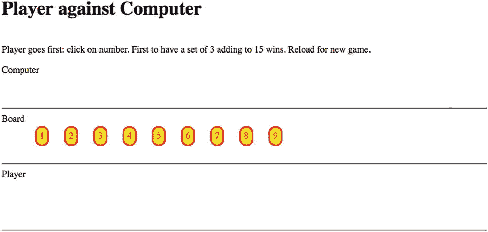
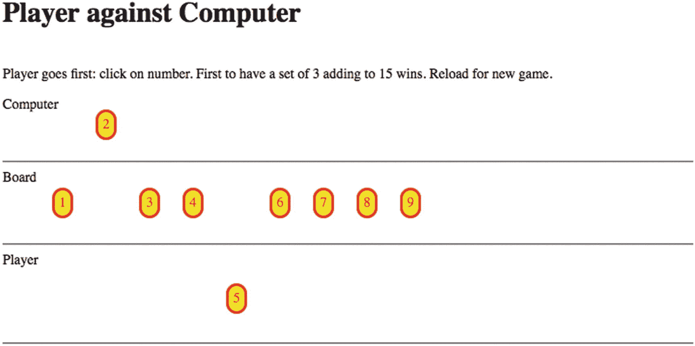
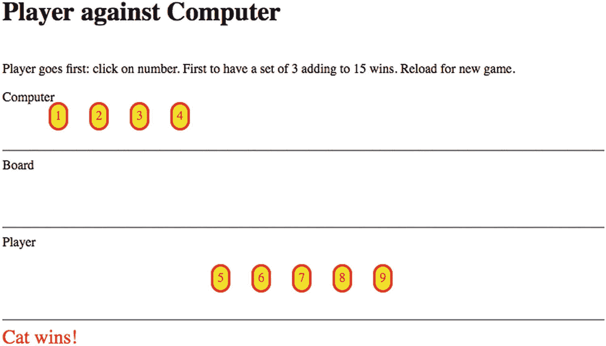

# 六、相加到 15（AddTo15）游戏

在本章中，您将学习以下内容:

*   将一个已知的真实世界游戏实现为一个数字程序，其中“计算机”是玩家之一

*   为“计算机”制定战略

*   插入暂停

*   使用数组和字符串

## 介绍

两人游戏*加到 15* 要求玩家轮流从数字 1 到 9 中选择，目标是获得三个加起来等于 15 的数字。我第一次看到这个游戏是在纽约市的数学博物馆，在那里它被实现为一个装置，杆上的数字可以从中心移动到玩家这边。如果玩家赢了，就会有灯光和响亮快乐的声音。如果没人赢，会有更短更安静的声音。这个游戏也可以用一副牌中的 1 到 9 张牌或者用纸笔来玩。这个游戏可以被描述为*完美知识*之一:过去移动的结果和当前的可能性都是可见的。这个游戏相当于一个众所周知的儿童游戏，我将识别这个游戏并向读者证明它的等价性。(你可以在本章的源代码中找到对此的解释。)

对于本章的例子，我选择让程序管理游戏*并且*扮演一个玩家的角色。这意味着我需要为“计算机”制定一个策略。我的策略很好，但是玩家仍然有可能赢。后来，在我的工作中，我决定我需要在“计算机”移动之前插入一个停顿，以便人类玩家能够像与对手游戏一样体验这个程序。

图 6-1 显示游戏的开启窗口。



图 6-1

打开窗户

图 6-2 显示了玩家和“计算机”各自移动后的结果。



图 6-2

玩家和电脑移动后

最后，我展示了一个截图，图 6-3 ，这似乎是最常见的结果:数字用尽，没有人赢。在我家，这被描述为“猫赢了”,所以我用这个词来描述告诉结果的消息。



图 6-3

比赛以平局结束

这一章是游戏实现的案例研究，包括用户界面和策略的实现。使用数组以及数组间的引用是非常重要的。

## 游戏的一般要求

Add to 15 程序和其他类似程序的要求是为玩家提供一个相当直观的界面。对手，我称之为“计算机”，尽管我不喜欢拟人化一台机器，需要有一个策略。我在本章中描述的程序有一个相当强硬的策略。我想我战胜了它，但不是经常。这个程序可能的改进是开发出最佳的策略，使“计算机”永远不会输，尽管可能会打成平手，以及其他不太熟练的策略。有了一组选项，一个增强将是给人类玩家一个为他们的对手挑选技能水平的选择。这需要制定一系列策略，也许包括随机行动。

我的这个程序的第一个版本让“计算机”的移动几乎与玩家的移动同时出现。我插入了一个暂停来给游戏一个我认为更好的“触感”。这种做法适用于许多游戏。当我们在现实世界中玩游戏时，我们不会有意识地暂停，但在数字世界中实现游戏可能需要明确地关注时间。

加到 15 非常简单，因此可以列出所有加到 15 的可能组合。事实上，有 8 个，所以我的程序有一个数组，它的元素是保存有效组的数字的字符串，例如“3 5 7”。(实际上，该数组有九个元素，第一个是空的占位符，因此索引可以从 1 开始，而不是从 0 开始。)游戏的管理和“计算机”策略的实施可以使用该数组中的信息来构建。您将不会看到任何将数字相加的代码！

我的程序有另一个有九个元素的数组，每个数组都有指向该数字属于八个列表中的哪些组的元素。我的程序有一个棋盘数组，从所有九个数字开始；玩家的数组，最初为空；和“计算机”的数组，最初也是空的。玩家和计算机的数组有九个元素，第一个元素没有使用，它表示八种组合中每种组合有多少个元素。

程序有两个不变的数组:`groups`和`occupied`。它也有一个数组，`numbers`，在开始时创建，但之后不再更改。有五个数组会发生变化:`board`、`computer`、`player`、`pgroupcount`和`cgroupcount`。在下一节中，您将看到这些工具的使用。数组的使用和前后指向是这类应用程序的典型特征。有冗余，但它简化了编码。

## HTML5、CSS 和 JavaScript

在这一节中，我将解释用于完成 Add to 15 项目需求的特性。

### CSS 中的样式

包含九个数字的椭圆形、红色边框、黄色背景元素被动态创建为`span`元素。设置外观的 CSS 是

```js
span {
   position:absolute;
   top:180px;
   border-style: solid;
   color: red;
   border-radius: 25px;
   background-color: yellow;
   padding: 5px;
   cursor: pointer;
}

```

用绝对定位动态创建这些元素意味着它们可以很容易地从棋盘上移到玩家或“计算机”的部分。使类型`span`与`div`相反意味着没有强制换行，它们可以彼此相邻。顺便说一下，我区分填充(元素内部)和边距(元素外部)的技巧是考虑填充的单元格。

### JavaScript 数组

正如已经讨论过的，一组数组用于游戏的操作。一些数组在 0 索引位置有一个未使用的槽，只是为了使编码更容易。`groups`数组保存了总共 15 种可能的组合:

```js
var groups = [
  "  ",               //placeholder, not used
  "3 4 8",
  "1 5 9",
  "2 6 7",
  "1 6 8",
  "3 5 7",
  "2 4 9",
  "2 5 8",
  "4 5 6"
];

```

可以被视为冗余信息的`occupied`数组使得某些计算变得更加容易。我确实决定忍受零基索引。被占用的数组用于指示从 0 到 9 的每个值属于哪个组。更具体地，第 N 个子阵列中的值对应于保持 N+1 的组的索引。这是被占用的数组，我稍后会给出一些例子。

```js
var occupied = [  //indexed subtracting 1
  [2, 4],
  [3, 6, 7],
  [1, 5],
  [1, 6, 8],
  [2, 5, 7, 8],
  [3, 4, 8],
  [3, 5],
  [1, 4, 7],
  [2, 6]
];

```

所以数字 1 与数组[2，4]相关联。这表明 1 属于第二组“1 5 9”，第四组“1 6 8”。数字 5 属于第二、第五、第七和第八组。`groups`和`occupied`数组不变。

`board`、`player`和`computer`数组保存棋盘上的数字，由玩家选择，或者为“计算机”选择。所以最初的声明是

```js
var player = [];
var computer = [];
var board = [1,2,3,4,5,6,7,8,9];

```

最后两个数组记录玩家和“计算机”距离完成八个组合中的每一个有多近。所以最初的声明是

```js
var pgroupcount = [0,0,0,0,0,0,0,0,0];  //unused first slot
var cgroupcount = [0,0,0,0,0,0,0,0,0];  //unused first slot

```

在图 6-2 所示的游戏中，“计算机”持有一个 2。查看`occupied`数组，2 出现在组 3、6 和 7 中。`cgroupcount`应该是[0，0，0，1，0，0，1，1，0]。玩家先选了 5，那么`pgrounpcount`数组就是[0，0，1，0，0，1，0，1，1]。

如果玩家然后选择 6，`pgroupcount`将是[0，0，1，1，1，1，0，1，2]。在任一组的计数数组中出现 2 表示有机会获胜——如果玩家有 2 个组成员，获得第三个意味着获胜——或者需要阻挡——如果“计算机”有 2 个组成员，它可以在下一步中获胜。我的代码必须确定丢失数字的身份，并检查它是否还在棋盘上(在`board`数组中)。

有了这些阵列的基础设施，我可以解释如何响应玩家的移动，生成“计算机”的移动，并确定游戏是赢了还是结束了。

### 设置游戏

`setUpBoard`函数创建代表九个数字的九个`span`元素。对这九个元素的引用保存在一个名为`numbers`的数组中。为元素设置了一个额外的属性，名为`n`，用于保存具体的数字。作为创建过程的一部分，使用一个`for`循环来实现，为“点击”事件调用`addEventListener`方法，并设置为当玩家点击数字时调用`addToPlayer`函数。

一旦创建，该数组就不会改变。改变的是每个元素的位置，由`style.left`和`style.top`属性表示。

### 响应玩家的移动

响应玩家移动的关键功能是`addToPlayer`。您可以将`addToPlayer`函数视为执行内务处理类型的操作，更新各种数组。选择的数字被添加到`player`数组中。调用函数`take`，从`board`数组中移除元素。通过改变`style.top`属性来重新定位对应于该数字的`span`元素。需要更改`player`和`board`数组，但不会改变窗口中数字元素的位置。

本地变量`holder`被设置为保存包含数字的组。回想一下，`occupied`数组是包含该信息的数组的数组。我使用一个`for`循环来遍历`holder`并更新`pgroupcount`。我的代码检查是否有三个计数。这将表明玩家获胜。如果不是这样，`addToPlayer`函数在调用`computerMove`之前执行一个`setTimeout`语句来暂停。

`addToPlayer`函数有一行，其中点击一个块的事件被停止:

```js
ev.target.removeEventListener("click",addToPlayer);

```

这防止了玩家点击已经被玩家拿走的棋子的不良行为。我必须承认，我最初确实注意到了这个问题。

### 生成计算机移动

暂停后调用`computerMove`功能。我在`computerMove`和`smartChoice`之间分配了任务。`computerMove`函数调用`smartChoice`函数。`computerMove`功能主要执行与`addToPlayer`功能类似的内务处理任务。我注意到，虽然我的程序让玩家先玩，但是`computerMove`代码确实会检查棋盘是否是空的。

`smartChoice`程序使用数组进行以下操作:

1.  棋盘上还有哪个数字(在`board`数组中)能让电脑赢得游戏吗？

2.  假设不可能立即获胜，棋盘上是否有任何数字意味着玩家可以立即获胜？如果是，播放该号码以阻止玩家。

3.  假设不需要立即块，是否有任何一个组的一个元素已经被计算机播放，而其他两个元素都没有被播放器播放？如果是这样，请从两个可用号码中选择一个。

4.  假设前面的情况都不适用，而 5 是可用的，就拿它。

5.  假设前面的情况都不适用，取偶数。

6.  从剩下的数字中随机选择一个。

因此，通过提供更好和/或更多的策略来增强计划将涉及到改变`smartChoice`。

类似于`addToPlayer`中的动作，`computermove`函数有一行代码用于删除点击已经播放过的片段的事件处理:

```js
numbers[n-1].removeEventListener("click",addToPlayer);

```

这防止了玩家点击已经由计算机播放的片段的不良行为。

与`addToPlayer`函数一样，`computerMove`函数可以确定游戏是以计算机获胜还是平局结束。

## 构建应用程序并使之成为您自己的应用程序

您可以通过改进策略和/或添加不同的策略来使该应用成为您自己的应用。你可以向前看第九章，在那里描述了名为`localStorage`的 HTML5 设施，并思考如何将它融入到游戏中。本章的主要目的是提供使用交叉引用数组的经验。另一个挑战是提供一种无需重新加载就能重复游戏的方法。你可以在第八章中看到拼图变成视频的例子。另一个增强是记录移动的顺序，可能使用`localStorage`，这样你可以尝试不同的策略。

表 6-1 列出了所有的功能，并指出它们是如何被调用的以及它们调用了什么功能。

表 6-1

*功能* *中添加到 15 个项目*

<colgroup><col class="tcol1 align-left"> <col class="tcol2 align-left"> <col class="tcol3 align-left"></colgroup> 
| 

功能

 | 

调用/调用者

 | 

打电话

 |
| --- | --- | --- |
| `init` | 由`<body>`标签中的`onLoad`属性的动作调用 | `setUpBoard` |
| `setUpBoard` | `init` |   |
| `computerMove` | 由`setTimeout`的动作调用，在`addToPlayer`中调用 | `smartChoice`，`take` |
| `smartChoice` | `computerMove` |   |
| `take` | `addToPlayer`，`computerMove` |   |
| `addToPlayer` | 由点击事件的动作`addEventListener`调用 | `take` |

表 6-2 显示了 Add to 15 游戏的代码，每一行都有注释。

表 6-2

*添加到 15 应用程序的完整代码*

<colgroup><col class="tcol1 align-left"> <col class="tcol2 align-left"></colgroup> 
| 代码行 | 描述 |
| `<!DOCTYPE html >` | 页眉 |
| `<html>` | 开始`html`标签 |
| `<head>` | 开始`head`标签 |
| `<title>Add to 15</title>` | 完整标题 |
| `<meta charset="UTF-8">` | 什么时候 |
| `<style>` | 样式元素的打开 |
| `span {position:absolute; top:180px;` | 跨度格式化的开始，初始位置在板上 |
| `border-style: solid; color: red; border-radius: 25px; background-color: yellow` `;` | 实心红色边框，弯曲；背景是黄色 |
| `padding: 5px; cursor: pointer;` | 边框和文本之间的填充；光标将是指针 |
| `}` | 关闭`span`样式指令 |
| `#status {` | 状态消息的样式 |
| `color: red;` | 红色 |
| `font-size: x-large;` | 大字体 |
| `}` | 关闭状态样式指令 |
| `</style>` | 关闭样式元素 |
| `<script language="JavaScript">` | 脚本标签 |
| `var statusref;` | 将保持指向状态的指针 |
| `var numbers = [];` | 指向创建的 span 元素的指针数组 |
| `var game = true;` | 用于控制玩家何时可以移动的布尔标志 |
| `var player = [];` | 将保存玩家获取的所有数字 |
| `var computer = [];` | 将保存计算机获取的所有数字 |
| `var board = [1,2,3,4,5,6,7,8,9];` | 板上数字的初始设置 |
| `var wedge = 50;` | 每个数字允许的水平间距 |
| `var startx = 15;` | 垂直排列的棋子 |
| `var groups = [` | 保存有效组合的静态数组 |
| `"  ",` | 占位符；未使用 |
| `"3 4 8",` |   |
| `"1 5 9",` |   |
| `"2 6 7",` |   |
| `"1 6 8",` |   |
| `"3 5 7",` |   |
| `"2 4 9",` |   |
| `"2 5 8",` |   |
| `"4 5 6"` |   |
| `];` | 关闭群组 |
| `var occupied = [` | 静态数组，通过从数字 N 中减去 1 来索引，指示该数字属于哪个组 |
| `[2, 4],` |   |
| `[3, 6, 7],` |   |
| `[1, 5],` |   |
| `[1, 6, 8],` |   |
| `[2, 5, 7, 8],` |   |
| `[3, 4, 8],` |   |
| `[3, 5],` |   |
| `[1, 4, 7],` |   |
| `[2, 6]` |   |
| `];` | 关闭占用 |
| `var pgroupcount = [0,0,0,0,0,0,0,0,0];  //unused first slot` | 显示玩家填充组进度的初始设置 |
| `var cgroupcount = [0,0,0,0,0,0,0,0,0];  //unused first slot` | 显示计算机填充组进度的初始设置 |
| `function init() {` | 表头`init`功能 |
| `setUpBoard();` | 调用`setUpBoard` |
| `statusref=document.getElementById("status");` | 获取指向状态区域的指针 |
| `}` | 关闭`init` |
| `function smartChoice() {` | 表头`smartChoice`(用于电脑转向) |
|   | 首先检查立即获胜 |
| `var boardl = board.length;` | 存储棋盘的当前长度(棋盘上剩余的数字数量) |
| `for (var i=0;i<boardl;i++) {` | 循环遍历这些数字 |
| `var possible = board[i];` | 设置移动的可能数量 |
| `for (var j=0;j<occupied[possible-1].length;j++) {` | 对于`possible`所属的组… |
| `if (cgroupcount[occupied[possible-1][j]]==2) {` | 电脑这边是不是已经有两个数字了？ |
| `return (i);` | 如果是，返回该号码 |
| `}` | 关闭`if` |
| `}` | 关闭内部`for`回路 |
| `}` | 关闭外部`for`回路 |
|   | 未返回，现在检查是否需要阻止 |
| `for (var i=0;i<boardl;i++) {` | 再次循环板上的数字 |
| `var blocker = board[i];` | 设置阻止程序 |
| `for (var j=0;j<occupied[blocker-1].length;j++) {` | 对于`blocker`所属的那些组.. |
| `if (pgroupcount[occupied[blocker-1][j]]==2) {` | ..玩家已经有两个号码了吗？ |
| `return(i);` | 如果是，返回该数字的索引 |
| `}` | 关闭`if` |
| `}` | 关闭内部`for` |
| `}` | 关闭外部`for` |
|   | 连续两次尝试 |
|   | 看一台电脑玩的组里有没有`possible` |
|   | 和 0 个玩家存在 |
| `for (var i=0;i<boardl;i++) {` | 用于循环通过电路板上的元件 |
| `var possible = board[i];` | 设置可能 |
| `for (var j=0;j<occupied[possible-1].length;j++) {` | 对`possible`所属的所有组进行循环 |
| `var whatgroup = occupied[possible-1][j];` | 召集小组 |
| `if ((cgroupcount[whatgroup]==1)&&(pgroupcount[whatgroup]==0 )){` | 如果计算机已经有一个号码，而玩家没有 |
| `return (i);` | 返回该数字的索引 |
| `}` | 关闭`if` |
| `}` | 关闭内部`for` |
| `}` | 关闭外部`for` |
|   | 如果 5 可用，返回它在棋盘上的位置 |
| `for (var i = 0;i<boardl;i++) {` | 通过电路板循环 |
| `if (board[i]==5) {` | 如果 5 存在 |
| `return (i);` | 返回其索引 |
| `}` | 关闭`if` |
| `}` | 关闭`for` |
|   | 如果有偶数，2，4，6 或 8，返回它在棋盘上的位置 |
|   | 利用这些数字是偶数的事实 |
| `for (var i = 0;i<boardl;i++) {` | 循环显示黑板上的所有数字 |
| `if (0==board[i]%2) {` | 检查一下数字是否是偶数 |
| `return (i);` | 返回该数字的索引 |
| `}` | 关闭`if` |
| `}` | 关闭`for` |
| `var ch = Math.floor(Math.random(0,boardl));` | 设置为随机移动 |
| `return (ch);` | 返回这个号码 |
| `}` | 关闭`smartMove` |
| `function computerMove() {` | `computerMove`的标题 |
| `if (board.length<1) {` | 如果`board`耗尽 |
| `statusref.innerHTML="Cat wins!";` | 设置消息 |
| `return;` | `return` |
| `}` | 如果关闭 |
| `var which = smartChoice();` | 拿到`smartChoice` |
| `var n = board[which];` | 获取该选项的号码 |
| `take(n);` | 调用`take`(这将从板上删除数字) |
| `numbers[n-1].style.top = "150px";` | 将号码放在电脑的侧面 |
| `numbers[n-1].removeEventListener("click",addToPlayer);` | 移除事件 |
| `computer.push(n);` | 添加到计算机阵列 |
| `var holder = occupied[n-1];` | `holder`与`n`保持群组 |
| `for (var i=0;i<holder.length;i++) {` | 遍历`holder`所属的所有组 |
| `cgroupcount[holder[i]]++;` | 增加`cgroupcount`中的计数 |
| `if (cgroupcount[holder[i]]==3) {` | 如果任何一组现在是 3 |
| `statusref.innerHTML ="Computer wins "+groups[holder[i]];` | 发送消息 |
| `game = false;` | 关闭播放这可能没有必要 |
| `return;` | 返回 |
| `}` | 关闭`if` |
| `}` | 关闭`for` |
| `if (board.length<1) {` | 再次检查游戏结束，没有赢 |
| `statusref.innerHTML="Cat wins!";` | 设置消息 |
| `}` | 关闭`if` |
| `else {` | `else`继续。重新打开游戏 |
| `game = true;` | 为玩家打开游戏 |
| `}` | 关闭`else` |
| `}` | 关闭`computerMove` |
| `function setUpBoard() {` | `setUpBoard`的标题 |
| `var dv;` | 将保存每个新创建的`span`元素 |
| `var xpos;` | 用于计算水平位置 |
| `for (var i=1; i<10; i++) {` | 对于循环，创建并定位所有数字 |
| `dv = document.createElement("span");` | 创建跨度元素 |
| `dv.addEventListener("click",addToPlayer,false);` | 为点击每个数字设置事件处理 |
| `dv.innerHTML = i.toString();` | 设置标签 |
| `xpos = startx + i*wedge;` | 确定水平位置 |
| `dv.style.left=xpos.toString()+"px";` | 设置水平位置 |
| `dv.style.top ="240px";` | 设置垂直位置 |
| `document.body.appendChild(dv);` | 将新创建的`div`添加到正文中 |
| `dv.n = i;` | 设置一个属性来保存数字 |
| `numbers.push(dv);` | 添加到`numbers`数组 |
| `}` | 关闭`for`回路 |
| `}` | 关闭功能 |
| `function take(n) {` | `take`功能的标题 |
| `var nAt = board.indexOf(n);` | 在数组中找到这个数字 |
| `if (nAt>-1) {` | 应该永远是真的 |
| `board.splice(nAt,1);` | 从板数组中删除元素；移动是在调用程序中完成的 |
| `}` | 关闭`if` |
| `}` | 关闭`take`功能 |
| `function addToPlayer(ev) {` | 标题为`addToPlayer`，点击一个数字的事件处理程序 |
| `if (game) {` | 如果游戏开始 |
| `var nn = ev.target.n;` | 获得被点击的号码 |
| `ev.target.removeEventListener("click",addToPlayer);` | 移除事件 |
| `player.push(nn);` | 将此添加到播放器阵列 |
| `numbers[nn-1].style.top = "350px";` | 重新定位元素 |
| `take(nn);` | 从电路板阵列中移除 |
| `var holder = occupied[nn-1];` | `holder`保存具有此编号的组 |
| `for (i=0;i<holder.length;i++) {` | 浏览所有的组 |
| `pgroupcount[holder[i]]++;` | 递增`pgroupcount`,因为玩家现在在该组中多了一个 |
| `if (pgroupcount[holder[i]]==3) {` | 如果这个计数现在是 3… |
| `statusref.innerHTML="Player wins "+groups[holder[i]];` | 玩家赢了 |
| `game = false;` | 将`game`标志设置为`false` |
| `return ;` | 返回(离开循环) |
| `}` | 关闭`if true`子句 |
| `}` | 关闭`for`回路 |
| `game = false;` | 暂时停止玩家移动 |
| `setTimeout(computerMove,1000);` | 暂停后调用`computermove` |
| `}` | 关闭`if(game) true`子句 |
| `else {` | `else` |
| `statusref.innerHTML="Reload for new game.";` | 发出信息 |
| `}` | 关闭`else` |
| `}` | 关闭该功能 |
| `</script>` | 关闭`script`标签 |
| `<body onLoad="init();">` | 正文标签 |
| `<h1>Player against Computer</h1><br>` | 页眉 |
| `Player goes first: click on number. First to have a set of 3 adding to 15 wins. Reload for new game.` | 说明 |
| `<p>` | 间隔 |
| `Computer` | 计算机区域 |
| `<br><br><br>` | 间隔 |
| `</p>` | 间隔 |
| `<hr/>` | 水平标尺 |
| `Board` | 电路板区域 |
| `<br><br><br><br>` | 间隔 |
| `<hr/>` | 水平规则 |
| `Player` | 玩家区 |
| `<br><br><br><br><br>` | 间隔 |
| `<hr/>` | 水平规则 |
| `<div id="status">` | `Div`为状态 |
| `</div>` | 关闭`div` |
| `</body>` | 关闭`body`标签 |
| `</html>` | 关闭`html`标签 |

## 测试和上传应用程序

这个应用程序的源材料只包含一个 HTML 文档。原始资料包含一个关于 Add to 15 游戏问题的 Word 文档。

## 摘要

在这一章中，你研究了如何通过给单人游戏者提供一个对手并管理游戏来实现双人游戏。您了解并获得了以下经验:

*   定义和操作数组

*   如何为玩家建立一个用户界面，包括为点击“棋盘”上的物体设置事件和编程暂停

*   对运动员的不良行为采取预防措施

在下一章，我们将进入空间迷人的折纸世界。我们探索如何使用线条画、视频剪辑和在画布上绘制照片来制作一个会说话的鱼的折纸模型。这些技术可以应用于不同类型的方向。