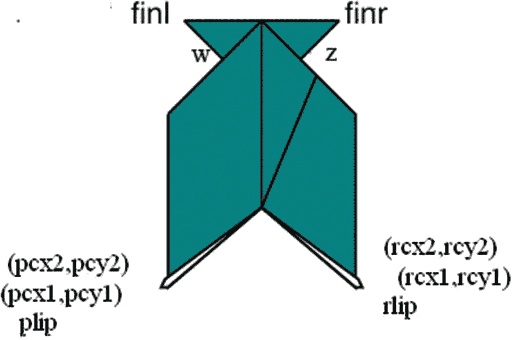

# 七、折纸方向（OrigamiDirection）：使用基于数学的线条画、照片和视频

在本章中，您将学习以下内容:

*   如何利用数学编写 JavaScript 函数产生精确的线条画

*   一种将线条画、照片、视频以及用于顺序说明的文本结合起来的方法

*   一种通过让您逐步进行，甚至返回并插入或更改以前的工作来促进开发的方法

## 介绍

本章的项目是折叠一个折纸模型，一条会说话的鱼的一系列指导。但是，您可以阅读任何主题，只要您想向查看者呈现一系列图表，包括向前和向后移动的能力，以及由线条画或来自文件或视频剪辑的图像组成的图表。

### 注意

折纸指的是折纸艺术。它通常与日本联系在一起，但也起源于中国和西班牙。传统的褶皱包括水弹、鹤和振翅鸟。莉莲·奥本海默被认为是在美国普及折纸艺术的功臣，并创立了后来成为美国国家组织“折纸美国”的组织。她在 1972 年亲自教我名片蛙。本章的下载中包含了一个用于名片青蛙的 HTML5 程序。折纸是一种活跃在世界各地的艺术形式，也是数学、工程和计算复杂性研究的焦点。

图 7-1 显示了会说话的鱼应用程序`origamifish.html`的打开屏幕。屏幕上显示的是折纸图的标准惯例，我修改后加入了颜色。标准的折纸叫做 kami，一面是白色的，另一面是非白色的。


图 7-1

打开屏幕

### 注意

我减少了折纸动作。例如，我省略了反向折叠的表示，它用于将嘴唇翻过来。这些褶皱之前通常是所谓的预备褶皱，这是我为会说话的鱼描述的。

文件夹可以点击下一步(在序列的这一点上，返回不做任何事情)到达指令的第一个实际步骤，如图 7-2 所示。当然，可以添加编程来删除开始时的返回按钮和结束时的下一步按钮。


图 7-2

第一步，展示纸的正方形。说明书上说要翻纸。

跳过前面，图 7-3 显示了折叠的后续步骤。请注意，纸张的彩色面显示出来了。未折叠的折叠线由细垂直线表示，接下来要进行的折叠(向下折叠拐角)由右上角的彩色虚线对角线表示。


图 7-3

将一个角向下折叠到折叠线

在模型构建的后期，文件夹必须执行汇折叠。这被认为是一个困难的举动。图 7-4 显示了在下沉之前所谓的褶皱模式:褶皱显示为山褶皱或谷褶皱。


图 7-4

水槽标准图步骤

我决定用一个展示水槽步骤的视频剪辑来补充线条画。图 7-5 显示了视频中的一帧。我(文件夹)使用了视频控件来暂停动作。文件夹可以重放视频剪辑，并重复多次回到折痕模式。


图 7-5

显示下沉步骤的暂停视频

下沉仍然是一个挑战，但观看视频剪辑可以有所帮助。文件夹可以重放和暂停视频剪辑。图 7-6 显示了水槽后的下一步。从线条画到视频剪辑再到线条画对用户/文件夹来说很容易，对开发者来说也很简单。


图 7-6

水槽后的步骤(第一个视频剪辑)

下一步要求折叠器向后折叠右边的三角形口盖，分开角度。请注意，角度由一条弧线表示。

在折叠过程中，有一个步骤，我认为一两张照片是传达需要做的事情的最佳方式。图 7-7 显示了从上方(从鱼的喉咙向下看嘴)看到的正在制作的模型的图片。


图 7-7

显示鱼喉咙的照片

图 7-8 显示了按照图 7-7 所示方向将折叠好的材料移动到一边的结果。


图 7-8

喉咙固定的鱼的照片

说明以另一个视频剪辑结束，这个视频剪辑显示了鱼在说话，通过轻轻按下文件夹的顶部和底部来完成。图 7-9 显示了视频中的一帧。


图 7-9

显示会说话的鱼的视频

## 关键要求

折纸方向有一个标准格式，通常被称为图表，我是在这个标准的基础上建立的。在这种方法中，每一步都显示了下一次使用排版制作的折叠。最基本的褶皱在展开时要么呈山谷状，要么呈山形，这用虚线或点划线表示。通常，折叠是在制作折纸模型的过程中展开的。有时有褶皱的地方用细线表示，有时用虚线表示山谷褶皱，用点划线表示山脉褶皱。

我的目标是绘制线条画，就像在书上看到的那样，计算临界点和线的坐标位置。我不想手工绘制图纸并扫描它们，也不想使用典型的工程 CAD 程序。我不想测量和记录长度或角度，而是让 JavaScript 替我完成这项任务。就像折纸行话所说的那样，这甚至适用于为“品味”而做的折叠，因为我可以确定我选择使用的确切位置。使用基本的代数、几何和三角学提供了一种通过计算线端点的坐标来获得线条画的精确位置的方法。

折纸的步骤通常带有文字说明。此外，有时会使用箭头。我想在遵循标准的同时，利用这些指令将在计算机上传递的优势，并为其他媒体提供颜色和机会。

考虑到会说话的鱼和其他一些褶皱，我决定使用照片和视频来进行线条画可能对你来说不够好的操作。

### 注意

我给自己设定的折纸图的挑战是既要遵循标准，又要利用 HTML5 的新技术。当转向新的媒体和技术时，这是典型的。你不想放弃一个你的读者可能认为是必要的标准，但是你也想使用那些可以解决实际问题的标准。

一个更微妙的需求是，我希望在开发应用程序时对其进行测试。这意味着一种灵活但健壮的方式来指定步骤。

## HTML5、CSS、JavaScript 特性和数学

我现在将描述 HTML5 的特性和用于解决 origami directions 项目需求的编程技术。最好的方法是从表示步骤的整体机制开始，然后解释我是如何导出位置的第一组值的。然后我将解释用于绘制山谷、山脉和箭头，以及用于计算交点和比例的实用函数。最后，我将简要回顾图像的显示和视频的播放。

### 步骤的总体机制

折纸方向的步骤由一个名为`steps`的数组指定。数组的每个元素本身是一个两元素数组，包含一个函数名和一段将出现在屏幕上的文本。`origamifish.html`中`steps`数组的最终值如下:

```js
var steps= [
   [directions,"Diagram conventions"],
                [showkami,"Make quarter turn."],
   [diamond1,"Fold top point to bottom point."],
   [triangleM,"Divide line into thirds and make valley folds and unfold "],
   [thirds,"Fold in half to the left."],
   [rttriangle,"Fold down the right corner to the fold marking a third. "],
   [cornerdown,"Unfold everything."],
   [unfolded,"Prepare to sink middle square by reversing folds as indicated ..."],
   [changedfolds,"note middle square sides all valley folds, some other folds changed.

 Flip over."],
   [precollapse,"Push sides to sink middle square."],
   [playsink,"Sink square, collapse model."],
   [littleguy,"Now fold back the right flap to center valley fold. You are bisecting the

 indicated angle."],
   [oneflapup,"Do the same thing to the flap on the left"],
   [bothflapsup,"Make fins by wrapping top of right flap around 1 layer and left around

 back layer"],
   [finsp,"Now make lips...make preparation folds"],
   [preparelips,"and turn lips inside out. Turn corners in..."],
   [showcleftlip,"...making cleft lips."],
   [lips,"Pick up fish and look down throat..."],
   [showthroat1,"Stick your finger in its mouth and move the inner folded material to one

    side"],
   [showthroat2,"Throat fixed."],
   [rotatefish,"Squeeze & release top and bottom to make fish's mouth close and open"],
   [playtalk,"Talking fish."]
   ];

```

当我开始构建应用程序时，我没有想到`steps`数组。取而代之的是，我在进行的过程中添加了`steps`数组，包括插入新条目和更改内容和/或函数名。我从下面的`steps`数组的定义开始:

```js
var steps= [
                     [showkami,"Make quarter turn"],
                     [diamond,"Fold top point to bottom point."]
                  ];

```

我花了一些时间进入展示折叠最后阶段的节奏，并为下一步添加了标记。最终结果是一个使用单个 HTML 页面的演示文稿，该页面包含 21 个步骤，包含矢量图、照片和视频，遵循与 PowerPoint 演示文稿类似的格式，即能够前进或后退。

前进和后退由功能`donext`和`goback`完成。但首先我需要解释整件事是如何开始的。就像到目前为止所有项目的情况一样，名为`init`的函数由`<body>`标签中的`onLoad`属性的动作调用。代码设置全局变量并调用函数来呈现下一步`donext`。`init`的功能是

```js
function init() {
   canvas1 = document.getElementById("canvas");
   ctx = canvas1.getContext("2d");
   cwidth = canvas1.width;
   cheight = canvas1.height;
   ta = document.getElementById("directions");
   nextstep = 0;
   ctx.fillStyle = "white";
   ctx.lineWidth = origwidth;
   origstyle = ctx.strokeStyle;
   ctx.font = "15px Georgia, Times, serif";
   donext();
}

```

变量`nextstep`可以说是指向`steps`数组的指针。我从零开始。

`donext`函数的任务是展示制作折纸模型的步骤中的下一步。该功能从检查它是否在范围内开始；也就是说，如果它已经递增到超过了`steps`数组的末尾，则`nextstep`的值被设置为最后一个索引。接下来，该功能暂停并删除显示的最后一个视频。它将画布恢复到其最大高度，在播放视频剪辑时，我的代码可能会改变这一高度。该函数还将`video`变量设置为`undefined`，因此不必为该视频再次执行删除语句。在所有情况下，`donext`清除画布并重置`linewidth`。然后`donext`功能显示下一步。显示器包括多个部分:由线条画、视频或图像组成的图形部分和由说明组成的文本部分。`donext`函数调用内部数组第一个(即第 0 个)元素指示的绘图函数:

```js
steps[nextstep][0]();

```

并使用内部数组的第二个(即第一个)元素显示文本:

```js
ta.innerHTML = steps[nextstep][1];

```

`donext`函数中的最后一条语句是递增指针。整个`donext`功能是

```js
function donext() {
   if (nextstep>=steps.length) {
      nextstep=steps.length-1;
   }
   if (v) {
     v.pause();
     v.style.display = "none";
     v = undefined;
     canvas1.height = 480;
   }
   ctx.clearRect(0,0,cwidth,cheight);
   ctx.lineWidth = origwidth;
   steps[nextstep][0]();
   ta.innerHTML = steps[nextstep][1];
   nextstep++;
}

```

编写`goback`函数所花费的思考时间比它的大小所暗示的要长得多。`nextstep`变量保存下一步的索引。这意味着返回需要变量递减 2。必须检查指针是否太低，即小于零。最后，`goback`函数调用`donext`来显示已经被设置为`nextstep`的内容。代码是

```js
function goback() {
   nextstep = nextstep -2;
   if (nextstep<0) {
        nextstep = 0;
   }
   donext();
}

```

### 用户界面

我称之为文件夹的用户有两个按钮，标记为**下一步**和返回。它们是使用 HTML5 按钮元素实现的，并分别调用`goback`和`donext`函数。我选择两种不同颜色的按钮——红色代表返回，绿色代表下一步——可以讨论，因为措辞不一致。然而，它确实给了我一个机会来提醒您在名称*层叠样式表*中*层叠*这个词的意义。我在`head`元素的`style`元素中使用了一个指令，然后我还在 body 元素中使用了以下标记:最后一个`style`指令是控制按钮并赋予按钮颜色的指令。

```js
<button onClick="goback();" style="color: #F00">Go back </button>
<button onClick="donext();" style="color: #03F">Next step </button>

```

颜色名称，每个只有三个字符，相当于`#FF0000`和`#0033FF`。

这两节已经描述了顺序方向的基本机制。它假设每一步都由一个函数和文本来表示。下一节将展示坐标值是如何设置的。

### 坐标值

线条绘制是使用 HTML5 canvas 函数和变量完成的，主要指示 x 和 y 值。变量在代码中以带有初始化的`var`语句出现。我是在一步一步地创建模型的过程中写下这些语句的，尽管就 JavaScript 而言，它们是常量，值是在程序加载时设置的。图 7-10 显示了顺序的第三步，并标注了点 a、b、c 和 d


图 7-10

角落标签

我如何确定这四个点的坐标？作为基础，我指定了点 a 的位置。我还指定了纸张的宽度和高度为四英寸，英寸到像素的转换为 72。变量声明是

```js
var kamiw = 4;
var kamih = 4;
var i2p = 72;
var ax = 10;
var ay = 220;

```

变量名`kamiw`和`kamih`是指折纸用的标准方形纸的宽度和高度。从现在开始，一切都是计算好的。所需的第一个值是纸张对角线的大小。对于正方形，使用勾股定理，对角线是边长乘以 2 的平方根。以下设置变量`diag`的语句将边(`kamiw`)乘以 2 的平方根和表示英寸到像素转换的因子。

```js
var diag = kamiw* Math.sqrt(2.0)*i2p;

```

大多数其他编程语言包含许多标准数学函数的内置代码，因此程序员不必重新发明轮子。在 JavaScript 中，这些通常作为`Math`类的方法提供。你可以在网上搜索以确定确切的名称和用法。

这样，位置 b、c 和 d 的值是使用现有值的表达式。

```js
var bx = ax+ .5*diag;
var by = ay - .5*diag;
var cx = ax + diag;
var cy = ay;
var dx = bx;
var dy = ay + .5*diag;

```

我通过建立模型并确定新头寸如何基于旧头寸，开发了变量的表达式。这些变量被在`steps`数组中指定的函数用来绘制表示模型边缘、折叠线、箭头和角度的线条。一些计算使用了通用的数学公式。接下来的两节介绍了实用函数:阶跃函数使用的函数。

### 显示器的实用功能

如图 7-1 所示，山谷褶皱由虚线组成。山脉褶皱是由点和虚线组成的线来表示的。这是折纸方向的标准惯例，并使文件夹能够遵循不同语言书籍中的方向。其中一种可以是默认颜色(黑色)或另一种颜色。我需要为基础设置变量:破折号长度、点长度、两个破折号之间的间隔、点之间的间隔以及最后一个点和破折号之间的间隔。通过首先查看函数，然后定义必要的值，最容易理解需要什么。`valley`功能定义如下:

```js
function valley(x1,y1,x2,y2,color) {
   var px=x2-x1;
   var py = y2-y1;
   var len = dist(x1,y1,x2,y2);
   var nd = Math.floor(len/(dashlen+dgap));
   var xs = px/nd;
   var ys = py/nd;
   if (color) ctx.strokeStyle = color;
   ctx.beginPath();
   for (var n=0;n<nd;n++) {
      ctx.moveTo(x1+n*xs,y1+n*ys);
      ctx.lineTo(x1+n*xs+dratio*xs,y1+n*ys+dratio*ys);
   }
   ctx.closePath();
   ctx.stroke();
   ctx.strokeStyle = origstyle;
}

```

`valley`功能决定有多少个破折号。这是通过将谷线的长度除以破折号的总长度和破折号之间的间隙来实现的。如果这不是一个整数，则最后的部分破折号组合将被删除。`Math.floor`方法为我们完成了这个任务。`Math.floor(4.3)`回报 4。

变量`xs`和`ys`分别是 x 和 y 的增量。`color`参数可能存在，也可能不存在。如果参数存在，`if (color)`语句改变笔画颜色。该函数的核心是绘制每个破折号的`for`循环。

`mountain`功能类似，但更复杂，因为山形褶皱排版的性质:破折号的组合后跟一个等于点的间隙，然后是一个点，然后是另一个间隙。`mountain`的功能如下:

```js
function mountain(x1,y1,x2,y2,color) {
   var px=x2-x1;
   var py = y2-y1;
   var len = dist(x1,y1,x2,y2);
   var nd = Math.floor(len/ddtotal);
   var xs = px/nd;
   var ys = py/nd;
   if (color) ctx.strokeStyle = color;
   ctx.beginPath();
   for (var n=0;n<nd;n++) {
      ctx.moveTo(x1+n*xs,y1+n*ys);
      ctx.lineTo(x1+n*xs+ddratio1*xs,y1+n*ys+ddratio1*ys);
      ctx.moveTo(x1+n*xs+ddratio2*xs,y1+n*ys+ddratio2*ys);
      ctx.lineTo(x1+n*xs+ddratio3*xs,y1+n*ys+ddratio3*ys);
   }
   ctx.closePath();
   ctx.stroke();
   ctx.strokeStyle = origstyle;
}

```

记住函数的语句，下面是我如何定义两个函数使用的变量:

```js
var dashlen = 8;
var dgap = 2.0;
var ddashlen = 6.0;
var ddot = 2.0;
var dratio = dashlen/(dashlen+dgap);
var ddtotal = ddashlen+3*ddot;
var ddratio1 = ddashlen/ddtotal;
var ddratio2 = (ddashlen+ddot)/ddtotal;
var ddratio3 = (ddashlen+2*ddot)/ddtotal;

```

线条用来显示纸的边缘。我将这些线条的宽度设置为 2。对于纸被折叠然后展开的地方，我使用一条更细的线:线宽设置为 1。我写了一个函数来制作细线:

```js
function skinnyline(x1,y1,x2,y2) {
   ctx.lineWidth = 1;
   ctx.beginPath();
   ctx.moveTo(x1,y1);
   ctx.lineTo(x2,y2);
   ctx.closePath();
   ctx.stroke();
   ctx.lineWidth = origwidth;
}

```

在折纸鱼的方向上，我决定使用短的向下的箭头。我为它编写了一个通用函数，您可以在“构建应用程序并使之成为您自己的应用程序”一节中的注释代码中研究这个函数。有两个地方，当我决定显示一个长的弯曲箭头，无论是水平的还是垂直的。这被证明是项目中最长的函数，我在这里就不赘述了。您可以在完整的注释代码清单中研究该函数。用你选择的饮料来增强体力。这是一个复杂的函数，因为许多情况需要分别处理:向上或向下的垂直箭头，或者从左到右或从右到左的水平箭头。箭头是一个圆的圆弧，其圆心被计算为远离该圆弧，两条小直线指示箭头。

### 用于计算的效用函数

在前面的章节中，你已经看到了这个项目所需的第一个数学计算。它叫做`dist`，它计算两点之间的距离:

```js
function dist(x1,y1,x2,y2) {
   var x = x2-x1;
   var y = y2-y1;
   return Math.sqrt(x*x+y*y);
}

```

下一个要讨论的函数是确定两条线的交点。交点是满足两条直线方程的点。在折纸鱼的例子中，请看图 7-14 。我(在我的程序中)将需要计算从 k 到 n 的直线和从 s 到 q 的直线的交点。在本章中进一步查看图 7-17 。`xx`点就是交点。该程序的代码是

```js
var xxa = intersect(sx,sy,qx,qy,kx,ky,nx,ny);
var xxx = xxa[0];
var xxy = xxa[1];

```

线由两个点定义，每个点由两个数字定义。这意味着`intersect`函数有 2 × 2 × 2 个输入参数。我的功能不一般；只有当线不垂直并且确实有交叉点时，它才起作用。这对于我使用折纸鱼来说是可以接受的，但是如果你把它用于另一个应用，你可能需要做更多的工作。

现在让我们来关注线的数学表示。有不同的方程式，但我用的这个叫做*点斜率*形式。直线的斜率是任意两点之间 y 的变化除以 x 的变化。按照惯例，斜率被命名为 m。斜率为 m 的直线通过点(x1，y1)的公式为

*   y–y1 = m *(x–x1)

注意这行是数学，不是 JavaScript。现在回到编程，我确定了传递给`intersect`函数的每条线的斜率和方程。

`intersect`函数将 m12 设置为从(x1，y1)到(x2，y2)的直线的斜率，将 m34 设置为从(x3，y3)到(x4，y4)的直线的斜率。该代码主要设置两个 y 值:

*   y = M12 *(x–x1)+y1，y = m34 *(x–x3)+y3

下一步是将这两个表达式设置为相等，并求解 x。这样做的目的是计算位于两条线上的 x 的值。有了 x 的值，我用两个等式中的一个来得到相应的 y，对 x，y 表示一个点——实际上是唯一的点——在两条线上。这就是所谓的*路口*。我编写了返回数组`[x,y]`的函数代码。以下是完整的代码:

```js
function intersect(x1,y1,x2,y2,x3,y3,x4,y4) {
   // only works on line segments that do intersect and
   // are not vertical
   var m12 = (y2-y1)/(x2-x1);
   var m34 = (y4-y3)/(x4-x3);
   var m = m34/m12;
   var x = (x1-y1/m12-m*x3+y3/m12)/(1-m);
   var y = m12*(x-x1)+y1;
   return ([x,y]);
}

```

在这一点上，你可能会突然失去信心，因为屏幕的坐标系统是颠倒的，所以你在高中数学课上记得的东西可能都不适用。垂直值随着屏幕向下移动而增加。事实证明，这些方程仍然有效(尽管我们的解释可能不同)。例如，从(0，0)开始到(100，100)的直线的计算斜率为正 1，尽管我们可能认为它是向下倾斜的。在颠倒的世界里，它有正斜率。

折纸鱼需要的另一个计算是我命名为*的比例*。这个函数有五个输入参数。(x1，y1)和(x2，y2)定义一条线段。第五个参数是 p，表示比例。该函数的任务是计算从(x1，y1)到(x2，y2)的 p 线段上的(x，y)位置。

```js
function proportion(x1,y1,x2,y2,p) {
   var xs = x2-x1;
   var ys = y2-y1;
   var x = x1+ p*xs;
   var y = y1 + p* ys;
   return ([x,y]);
}

```

这涵盖了我所称的折纸项目的效用函数。这三个计算函数将适用于其他应用。

### 步进线绘制功能

为序列中的一个步骤生成图表的函数使用 HTML5 的路径绘制工具和变量，这些变量已使用计算实用函数或内置的`Math`方法进行了设置。在这一节中，我不会一一介绍，但会解释几个。例如，函数`triangleM`(下面将详细介绍该函数)的任务是为图 7-11 所示的步骤生成图表。


图 7-11

分成三部分的步骤

### 注意

我的指示并没有建议这样做的方法。文件夹这样做的一个常见方法是从一端(比如左边)的三分之一处猜测点。将正确的点折叠到那个点，然后轻轻捏一下。然后将左端折叠到捏痕处，重复直到你看不到捏痕的变化。这个方法展示了一些很好的数学，即极限。无论你在最初的猜测中犯了什么样的错误，它都会减少到原来的四分之一。如果你坚持这样做，你很快就会得到可以接受的东西。

图 7-12 显示了标注有临界点 e、f、g 和 h 标签的图片。


图 7-12

将一条线分成三份并折叠

定义这四个点的变量是

```js
var e = proportion(ax,ay,cx,cy,.333333);
var ex = e[0];
var ey = e[1];
var f = proportion(ax,ay,cx,cy,.666666);
var fx = f[0];
var fy = f[1];
var g = proportion(ax,ay,dx,dy,.666666);
var gx = g[0];
var gy = g[1];
var h = proportion(cx,cy,dx,dy,.666666);
var hx = h[0];
var hy = h[1];

```

功能`triangleM`定义如下:

```js
function triangleM() {
   triangle();
   shortdownarrow(ex,ey);
   shortdownarrow(fx,fy);
   valley(ex,ey,gx,gy,"orange");
   valley(fx,fy,hx,hy,"orange");
}

```

该函数绘制一个三角形，然后在 e 和 f 上方绘制两个向下的短箭头，然后绘制两条橙色的山谷线。

`triangle`功能被定义为

```js
function triangle() {
  ctx.fillStyle="teal";
  ctx.beginPath();
  ctx.moveTo(ax,ay);
  ctx.lineTo(cx,cy);
  ctx.lineTo(dx,dy);
  ctx.lineTo(ax,ay);
  ctx.closePath();
  ctx.fill();
  ctx.stroke();
}

```

`triangle`函数不是一般的，而是画出这个特定的三角形。一般功能是

```js
function generaltriangle(px,py, qx,qy, rx,ry, scolor, fcolor) {
  ctx.fillStyle=fcolor;
  ctx.strokeStyle = scolor;
  ctx.beginPath();
  ctx.moveTo(px,py);
  ctx.lineTo(qx,qy);
  ctx.lineTo(rx,ry);
  ctx.lineTo(px,py);
  ctx.closePath();
  ctx.fill();
  ctx.stroke();
}

```

另外，不要假设我知道如何编写这个函数。我可能将这些代码放入第一个函数中，然后当我进入模型的下一步时，意识到我又需要一个三角形了。我提取了我写的代码，并将第一个函数重命名为`triangleM`(表示“三角形标记”)。我让`triangleM`函数和`thirds`函数分别调用名为`triangle`的函数。

图 7-13 显示了模型中的一个步骤，我将用一个我命名为`littleguy`的函数来说明，因为在我看来就是这样。


图 7-13

在水槽之后，我称之为小家伙

图 7-14 显示了关键点的标注。


图 7-14

littleguy 临界点的标记

相应变量的定义如下

```js
var kx = ax+diag/3;
var ky = ay;
var lx = kx + diag/3;
var ly = ay;
var mx = ax + diag/6;
var innersq = Math.sqrt(2)*diag/6;
var my = ay + innersq*Math.sin(Math.PI/4);
var nx = ax+diag/3+diag/6;
var ny = my;
var px = mx;
var py = dy;
var rx = nx;
var ry = py;
var qx = kx;
var qy = hy;
var dkq = qy-ky;
var sx = kx + (dkq/Math.cos(Math.PI/8))*Math.sin(Math.PI/8);
var sy = ay;

```

请注意，我没有试图节省变量。是的，`rx`和`nx`是同一个值，但是我更容易把它们想成截然不同的东西。

`littleguy`的代码如下:

```js
function littleguy() {
   ctx.fillStyle="teal";
   ctx.beginPath();
   ctx.moveTo(ax,ay);
   ctx.lineTo(kx,ky);
   ctx.lineTo(mx,my);
   ctx.lineTo(ax,ay);
   ctx.moveTo(kx,ky);
   ctx.lineTo(lx,ly);
   ctx.lineTo(px,py);
   ctx.lineTo(mx,my);
   ctx.lineTo(kx,ky);
   ctx.moveTo(nx,ny);
   ctx.lineTo(rx,ry);
   ctx.lineTo(qx,qy);
   ctx.lineTo(nx,ny);
   ctx.closePath();
   ctx.fill();
   ctx.stroke();
   skinnyline(qx,qy,kx,ky);
   ctx.beginPath();
   ctx.arc(qx,qy,30,-.5*Math.PI,-.25*Math.PI,false);
   ctx.stroke();
   mountain(qx,qy,sx,sy,"orange")
}

```

用度数表示的圆弧是从-90 度到-45 度。请注意，零度是水平方向，正度是顺时针方向。

图 7-15 、 7-16 、 7-17 和 7-18 显示了该模型剩余关键位置的位置。



图 7-18

做好嘴唇后


图 7-17

在绕回步骤之后


图 7-16

准备下沉中心


图 7-15

半步折叠处贴标

使用图来帮助理解设置变量值的代码。比如我在描述`intersect`函数的时候提到过，看图 7-14 和 7-17 ，可以看到由 xxx 和 xxy 表示的点 xx 是 s 到 q 和 k 到 n 的直线的交点

还有一个阶跃函数值得解释。结尾前的说明让鱼的头部指向屏幕下方。我想在最后一个视频剪辑之前制作图表，使其水平方向与将要显示的视频剪辑相匹配。这是使用 HTML5 的画布坐标转换完成的。之前的函数命名为`lips`。`rotatefish`功能保存当前的原始坐标系。然后，它转换为鱼上的一个点，调用旋转(逆时针旋转 90 度)，然后撤销转换。然后，`rotatefish`函数调用`lips`函数，绘制鱼，但现在是水平方向。代码如下:

```js
function rotatefish() {
   ctx.save();
   ctx.translate(kx,my);
   ctx.rotate(-Math.PI/2);
   ctx.translate(-kx,-my);
   lips();
   ctx.restore();
}

```

### 展示照片

显示照片的步骤与生成线条画的步骤具有相同的结构。对于应用程序所需的每个图像，我需要定义一个`Image`对象，并将`src`属性设置为图像文件的名称。以下陈述与图 7-7 中所示的图片相关:

```js
var throat1 = new Image();
throat1.src = "throat1.jpg";

function showthroat1() {
  ctx.drawImage(throat1,40,40);
}

```

第五章中介绍的创建一个定义媒体的独立文件并自动生成代码(包括 HTML 标记)的技术在这里可能是合适的。我为每张照片和每个视频剪辑编写了函数，正如我在下一节中解释的那样。

### 展示和移除视频

`origamifish.html`文件包含两个视频剪辑的视频元素，一个 ID 为`sink`，另一个 ID 为`talk`。style 元素有一个所有视频都不显示的指令:

```js
video {display: none;}

```

函数`playsink`和`playtalk`分别制作视频显示，设置当前时间为零，播放视频，调整画布高度。`playsink`的定义如下:

```js
function playsink() {
   v = document.getElementById("sink");
   v.style.display="block";
   v.currentTime = 0;
   v.play();
   canvas1.height = 178;
}

```

在讨论了 origami directions 项目要使用的编程技术和 HTML5 特性之后，我们现在可以从整体上来看这个应用程序了。

## 构建应用程序并使之成为您自己的应用程序

在本章所学的基础上，最快速的方法是为另一个类似折纸的工艺项目创建方向，有线条画和一些照片和视频剪辑的好处。您可以一步一步地构建它，创建您需要的功能。可能原来有些函数就是我所说的效用函数:其他函数使用的函数。您也可以根据需要构建指示定位的变量。下面是对 origami fish 应用程序的非正式总结/概述:

*   `init`用于初始化

*   `donext`和`goback`用于在步骤中前后移动

*   用于绘制特定类型线条的实用函数

*   用于计算的效用函数

*   阶跃函数(`steps`数组中引用的函数)

表 7-1 列出了功能和功能组，并指出它们是如何被调用的以及它们调用了什么功能。

表 7-1

*折纸方向项目*中的 *功能*

<colgroup><col class="tcol1 align-left"> <col class="tcol2 align-left"> <col class="tcol3 align-left"></colgroup> 
| 

功能

 | 

调用/调用者

 | 

打电话

 |
| --- | --- | --- |
| `init` | 由`<body>`标签中的`onLoad`属性的动作调用 | `donext` |
| `donext` | 由按钮标签中的`init`、`goback`和`onClick`属性调用 |   |
| `goback` | 由按钮标签中的`onClick`属性调用 | `donext` |
| 绘图实用函数(`shortdownarrow`、`valley`、`mountain`、`skinnyline`和`curvedarrow`) | 由步骤函数调用 |   |
| 用于计算的效用函数(`dist`、`intersect`和`proportion`) | 主要在`var`语句中调用，以设置代表模型中关键位置的变量 |   |
| 阶跃函数 | 作为`donext`中的`steps`数组中的元素调用；一些(`fins`、`triangle`、`diamond`、`rttriangle`、`diamondc`和`lips`)被其他步骤函数调用 | 实用绘图功能，指示的其他步骤功能 |

表 7-2 显示了基本应用程序的代码，每一行都有注释。这些代码中的大部分你已经在前面的章节中看到过了。

表 7-2

*折纸方向项目的完整代码*

<colgroup><col class="tcol1 align-left"> <col class="tcol2 align-left"></colgroup> 
| 

代码行

 | 

描述

 |
| --- | --- |
| `<!DOCTYPE html>` | 页眉 |
| `<html>` | `html`标签 |
| `<head>` | `head`标签 |
| `<title>Origami fish</title>` | 完整标题 |
| `<style>` | `style`标签 |
| `button {font-size:large; font-family:Georgia, "Times New Roman", Times, serif;}` | 格式化按钮的指令；注意，颜色是为`body`元素中的每个按钮指定的 |
| `#directions {font-family:"Comic Sans MS", cursive;}` | 用于格式化所有方向的指令 |
| `video {display:none;}` | 关闭所有视频元素的显示，直到被调用 |
| `</style>` | 结束`style`标签 |
| `<script>` | 开始`script`标签 |
| `var ctx;` | 将为所有绘图保存画布上下文 |
| `var cwidth;` | 画布宽度 |
| `var cheight;` | 画布高度 |
| `var ta;` | 将保存每个步骤的文本部分的元素 |
| `var kamiw = 4;` | 设置纸张宽度 |
| `var kamih = 4;` | 设置纸张高度 |
| `var i2p = 72;` | 将英寸设置为像素 |
| `var dashlen = 8;` | 设置山谷褶皱中的虚线长度 |
| `var dgap = 2.0;` | 设置破折号之间的间隙 |
| `var ddashlen = 6.0;` | 在山地褶皱中设置虚线长度 |
| `var ddot = 2.0;` | 设置山峰褶皱中的点长度 |
| `var dratio = dashlen/(dashlen+dgap);` | 用于山区线路 |
| `var ddtotal = ddashlen+3*ddot;` | 用于山区线路 |
| `var ddratio1 = ddashlen/ddtotal;` | 用于山区线路 |
| `var ddratio2 = (ddashlen+ddot)/ddtotal;` | 用于山区线路 |
| `var ddratio3 = (ddashlen+2*ddot)/ddtotal;` | 用于山地线；用于计算虚线和点的数量以及虚线和点的起点和范围的所有值 |
| `var kamix = 10;` | 第一步中纸张的 x 位置 |
| `var kamiy = 10;` | 第一步中纸张的 y 位置 |
| `var nextstep;` | 指向`steps`数组的指针 |
| `function dist(x1,y1,x2,y2) {` | `dist`功能的标题 |
| `var x = x2-x1;` | 在`x`中设置差值 |
| `var y = y2-y1;` | 在`y`中设置差值 |
| `return Math.sqrt(x*x+y*y);` | 返回平方和的平方根 |
| `}` | 关闭`dist`功能 |
| `function intersect(x1,y1,x2,y2,x3,y3,x4,y4) {` | 两行之间的`intersect`功能标题，用 2 × 2 点表示 |
| `// only works on line segments that do intersection and` | 代码中应该保留的好注释:假设有交集。。。 |
| `// are not vertical` | 。。。并假设线条不是垂直的；如果是，代码将被零除，这将产生一个错误 |
| `var m12 = (y2-y1)/(x2-x1);` | 计算斜率 |
| `var m34 = (y4-y3)/(x4-x3);` | 计算斜率 |
| `var m = m34/m12;` | 用于计算 |
| `var x = (x1-y1/m12-m*x3+y3/m12)/(1-m);` | 求解`x` |
| `var y = m12*(x-x1)+y1;` | 求解`y` |
| `return ([x,y]);` | 返回对 |
| `}` | 关闭`intersect`功能 |
| `function init() {` | `init`功能的标题 |
| `canvas1 = document.getElementById("canvas");` | 设置`canvas1` |
| `ctx = canvas1.getContext("2d");` | 设置上下文 |
| `cwidth = canvas1.width;` | 设置`cwidth` |
| `cheight = canvas1.height;` | 设置`cheight` |
| `ta = document.getElementById("directions");` | 设置`ta`为文本方向按住柠檬 |
| `nextstep = 0;` | 初始化`nextstep` |
| `ctx.fillStyle = "white";` | 设置填充样式；将用于擦除 |
| `ctx.lineWidth = origwidth;` | 设置线宽(之前设置) |
| `origstyle = ctx.strokeStyle;` | 保存笔画颜色 |
| `ctx.font = "15px Georgia, Times, serif";` | 设置字体 |
| `donext();` | 从第 0 步开始 |
| `}` | 关闭`init`功能 |
| `function directions() {` | 标题为方向，第一个“步骤”显示 |
| `ctx.fillStyle = "black";` | 更改填充样式，用于文本 |
| `ctx.font = "15px Georgia, Times, serif";` | 设置字体 |
| `ctx.fillText("Make valley fold", 10,20);` | 输出说明 |
| `valley(200,18,300,18,"orange");` | 制作橙色山谷线样本 |
| `ctx.fillText("Make mountain fold",10,50);` | 输出说明 |
| `mountain(200,48,300,48,"orange");` | 制作样品橙山线 |
| `ctx.fillText("unfolded fold line",10,100);` | 输出说明 |
| `skinnyline(200,98,300,98);` | 为展开的折叠线制作样本细线 |
| `ctx.fillText("When sense of fold matters:",10,150);` | 输出说明 |
| `ctx.fillText("unfolded valley fold", 10,180);` | 继续 |
| `valley(200,178,300,178);` | 做样老谷 |
| `ctx.fillText("unfolded mountain fold",10,210);` | 输出说明 |
| `mountain(200,208,300,208);` | 弄样旧山 |
| `ctx.fillStyle = "white";` | 改回填充样式 |
| `}` | 关闭方向功能 |
| `function donext() {` | `donext`功能的标题 |
| `if (nextstep>=steps.length) {` | 检查`nextstep`是否过大 |
| `nextstep=steps.length-1;` | 重置 |
| `}` | 关闭条款 |
| `if (v) {` | 检查是否设置了`v` |
| `v.pause();` | 暂停视频 |
| `v.style.display = "none";` | 使其不显示 |
| `v = undefined;` | 将`v`设置为未定义 |
| `canvas1.height = 480;` | 恢复高度 |
| `}` | 关闭条款 |
| `ctx.clearRect(0,0,cwidth,cheight);` | 透明画布 |
| `ctx.lineWidth = origwidth;` | 重置线条宽度 |
| `steps[nextstep][0]();` | 调用适当的阶跃函数 |
| `ta.innerHTML = steps[nextstep][1];` | 显示附带的文本 |
| `nextstep++;` | 增量`nextstep` |
| `}` | 关闭`donext`功能 |
| `function goback() {` | `goback`的标题 |
| `nextstep = nextstep -2;` | 将`nextstep`减 2(因为它已经领先一位) |
| `if (nextstep<0) {` | 检查`nextstep`现在是否太低 |
| `nextstep = 0;` | 重置 |
| `}` | 关闭条款 |
| `donext();` | 调用`donext` |
| `}` | 关闭`goback`功能 |
| `function shortdownarrow(x,y) {` | 短向下箭头功能的标题 |
| `ctx.beginPath();` | 开始路径 |
| `ctx.moveTo(x,y-20)` | 移动到(x，y)位置的正上方 |
| `ctx.lineTo(x,y-7);` | 在(x，y)的正上方画线 |
| `ctx.moveTo(x-5,y-12);` | 向左上方移动 |
| `ctx.lineTo(x,y-7);` | 画对角线 |
| `ctx.moveTo(x+5,y-12);` | 向右上方移动 |
| `ctx.lineTo(x,y-7);` | 画对角线 |
| `ctx.closePath();` | 关闭路径 |
| `ctx.stroke();` | 画出完整的路径:一个短箭头 |
| `}` | 关闭`shortdownarrow`功能 |
| `function proportion(x1,y1,x2,y2,p) {` | `proportion`功能的标题 |
| `var xs = x2-x1;` | 在`x`中设置差值 |
| `var ys = y2-y1;` | 在`y`中设置差值 |
| `var x = x1+ p*xs;` | 计算新的`x` |
| `var y = y1 + p* ys;` | 计算新的`y` |
| `return ([x,y]);` | 返回对 |
| `}` | 关闭`proportion`功能 |
| `function skinnyline(x1,y1,x2,y2) {` | `skinnyline`功能的标题 |
| `ctx.lineWidth = 1;` | 设置线条宽度 |
| `ctx.beginPath();` | 开始路径 |
| `ctx.moveTo(x1,y1);` | 移动到开始 |
| `ctx.lineTo(x2,y2);` | 要结束的行 |
| `ctx.closePath();` | 关闭路径 |
| `ctx.stroke();` | 画出笔划 |
| `ctx.lineWidth = origwidth;` | 重置线条宽度 |
| `}` | 关闭`skinnyline` |
| `var origstyle;` | 将保持原始颜色 |
| `var origwidth = 2;` | 为大多数线条设置线条宽度 |
| `function valley(x1,y1,x2,y2,color) {` | `valley`功能的标题 |
| `var px=x2-x1;` | 在`x`中设置差值 |
| `var py = y2-y1;` | 在`y`中设置差值 |
| `var len = dist(x1,y1,x2,y2);` | 确定长度 |
| `var nd = Math.floor(len/(dashlen+dgap));` | 多少破折号和缺口 |
| `var xs = px/nd;` | 称之为 x 因素 |
| `var ys = py/nd;` | 称之为 y 因素 |
| `if (color) ctx.strokeStyle = color;` | 如果给定了`color`参数，将描边颜色设置为该值 |
| `ctx.beginPath();` | 开始路径 |
| `for (var n=0;n<nd;n++) {` | 虚线数量的循环 |
| `ctx.moveTo(x1+n*xs,y1+n*ys);` | 移动到下一个位置 |
| `ctx.lineTo(x1+n*xs+dratio*xs,y1+n*ys+dratio*ys);` | 绘制虚线 |
| `}` | 关闭`for`回路 |
| `ctx.closePath();` | 关闭路径 |
| `ctx.stroke();` | 画出路径 |
| `ctx.strokeStyle = origstyle;` | 重置笔画样式 |
| `}` | 关闭`valley`功能 |
| `function mountain(x1,y1,x2,y2,color) {` | 山地功能的标题 |
| `var px=x2-x1;` | 设置 x 方向的差异 |
| `var py = y2-y1;` | 设置 y 方向的差异 |
| `var len = dist(x1,y1,x2,y2);` | 确定长度 |
| `var nd = Math.floor(len/ddtotal);` | 确定虚线和圆点组合的数量 |
| `var xs = px/nd;` | 设置 x 因子 |
| `var ys = py/nd;` | 设置 y 因子 |
| `if (color) ctx.strokeStyle = color;` | 如果给定了`color`参数，将描边颜色设置为该值 |
| `ctx.beginPath();` | 开始路径 |
| `for (var n=0;n<nd;n++) {` | 组合数循环 |
| `ctx.moveTo(x1+n*xs,y1+n*ys);` | 移到下一个 |
| `ctx.lineTo(x1+n*xs+ddratio1*xs,y1+n*ys+ddratio1*ys);` | 画破折号 |
| `ctx.moveTo(x1+n*xs+ddratio2*xs,y1+n*ys+ddratio2*ys);` | 移动到点的开头 |
| `ctx.lineTo(x1+n*xs+ddratio3*xs,y1+n*ys+ ddratio3*ys);` | 画点 |
| `}` | 闭环 |
| `ctx.closePath();` | 关闭路径 |
| `ctx.stroke();` | 画出路径 |
| `ctx.strokeStyle = origstyle;` | 重置笔画样式 |
| `}` | 关闭`mountain`功能 |
| `function curvedarrow(x1,y1,x2,y2,px,py){` | 从(x1，y1)到(x2，y2)`curvedarrow`的标题偏移(px，py) |
| `var arrowanglestart;` | 开始角度 |
| `var arrowanglefinish;` | 完成角度 |
| `var d = dist(x1,y1,x2,y2);` | 距离 |
| `var rad=Math.sqrt(4.25*d*d);` | 值 4.25 是通过实验得出的，以获得箭头的吸引曲线 |
| `var ctrx;` | 弯曲箭头的圆弧中心的 x 坐标 |
| `var ctry;` | y 坐标 |
| `var ex;` | 组成箭头的两条线 |
| `var ey;` | 组成箭头的两条线 |
| `var angdel = Math.atan2(d/2,2*d);` | 弧的角度 |
| `var fromhorizontal;` | 弧开始的角度 |
| `ctx.strokeStyle = "red";` | 设置颜色 |
| `ctx.beginPath();` | 开始路径 |
| `if (y1==y2) {` | 水平箭头案例 |
| `arrowanglestart = 1.5*Math.PI-angdel;` | 设置起始角度 |
| `arrowanglefinish = 1.5*Math.PI+angdel;` | 设置结束角度 |
| `ctrx = .5*(x1+x2) +px;` | 计算中心`x` |
| `ctry = y1+2*d +py;` | 计算中心`y` |
| `if (x1<x2) {` | 对于从左向右的箭头 |
| `ctx.arc(ctrx,ctry, rad,arrowanglestart,arrowanglefinish, false);` | 画弧线 |
| `fromhorizontal=2*Math.PI- arrowanglefinish;` | 用于计算 |
| `ex = ctrx+rad*Math.cos(fromhorizontal);` | 设置 x 增量 |
| `ey = ctry - rad*Math.sin(fromhorizontal);` | 设置 y 增量 |
| `ctx.lineTo(ex-8,ey+8);` | 画第一条小线 |
| `ctx.moveTo(ex,ey);` | 移动到另一端 |
| `ctx.lineTo(ex-8,ey-8);` | 画直线 |
| `}` | 从左到右关闭箭头 |
| `else {` | 从右到左 |
| `ctx.arc(ctrx,ctry, rad,arrowanglefinish,arrowanglestart,``true);` | 画弧线 |
| `fromhorizontal=2*Math.PI- arrowanglestart;` | 计算线条 |
| `ex = ctrx+rad*Math.cos(fromhorizontal);` | 为小线条设置 x |
| `ey = ctry - rad*Math.sin(fromhorizontal);` | 为小线条设置 y |
| `ctx.lineTo(ex+8,ey+8);` | 绘制第一条线 |
| `ctx.moveTo(ex,ey);` | 移动到另一行的末尾 |
| `ctx.lineTo(ex+8,ey-8);` | 画直线 |
| `}` | 结束子句 |
| `ctx.stroke();` | 为两种情况画一张图 |
| `}` | 结束水平情况 |
| `else if (x1==x2) {` | 垂直线 |
| `arrowanglestart = -angdel;` | 设置起始角度 |
| `arrowanglefinish = angdel;` | 设置完成角度 |
| `ctrx = x1-2*d+px;` | 计算中心 x |
| `ctry = .5*(y1+y2) + py;` | 计算 y 中心 |
| `if (y1<y2) {` | 如果向下箭头 |
| `ctx.arc(ctrx,ctry,rad,arrowanglestart,``arrowanglefinish,false);` | 画弧线 |
| `fromhorizontal=- arrowanglefinish;` | 用于计算 |
| `ex = ctrx+rad*Math.cos(fromhorizontal);` | 计算小线条的 x |
| `ey = ctry - rad*Math.sin(fromhorizontal);` | 计算小线条的 y 值 |
| `ctx.lineTo(ex-8,ey-8);` | 画第一条小线 |
| `ctx.moveTo(ex,ey);` | 移动到结尾 |
| `ctx.lineTo(ex+8,ey-8);` | 画第二条小线 |
| `}` | 结束向下子句 |
| `else {` | 向上子句 |
| `ctx.arc(ctrx,ctry, rad,arrowanglefinish,arrowanglestart,``true);` | 画弧线 |
| `fromhorizontal=- arrowanglestart;` | 用于计算 |
| `ex = ctrx+rad*Math.cos(fromhorizontal);` | 计算小线条的 x |
| `ey = ctry - rad*Math.sin(fromhorizontal);` | 计算小线条的 y 值 |
| `ctx.lineTo(ex-8,ey+8);` | 画第一条小线 |
| `ctx.moveTo(ex,ey);` | 移动到第二行末尾 |
| `ctx.lineTo(ex+8,ey+8);` | 画一条线 |
| `}` | 结束子句 |
| `ctx.stroke();` | 画弧线 |
| `}` | 关闭垂直机箱 |
| `ctx.strokeStyle = "black";` | 重置颜色 |
| `}` |   |
| `// specific to fish` | 接下来的内容是特定于鱼模型的 |
| `var steps= [` | 说明步骤:函数名和附带文本 |
| `[directions,"Diagram conventions"],` |   |
| `[showkami,"Make quarter turn."],` |   |
| `[diamond1,"Fold top point to bottom point."],` |   |
| `[triangleM,"Divide line into thirds and make valley folds and unfold "],` |   |
| `[thirds,"Fold in half to the left."],` |   |
| `[rttriangle,"Fold down the right corner to the fold marking a third. "],` |   |
| `[cornerdown,"Unfold everything."],` |   |
| `[unfolded,"Prepare to sink middle square by reversing folds as indicated ..."],` |   |
| `[changedfolds,"note middle square sides all valley folds, some other folds changed. Flip over."],` |   |
| `[precollapse,"Push sides to sink middle square."],` |   |
| `[playsink,"Sink square, collapse model."],` |   |
| `[littleguy,"Now fold back the right flap to center valley fold. You are bisecting the indicated angle."],` |   |
| `[oneflapup,"Do the same thing to the flap on the left"],` |   |
| `[bothflapsup,"Make fins by wrapping top of right flap around 1 layer and left around back layer"],` |   |
| `[finsp,"Now make lips...make preparation folds"],` |   |
| `[preparelips,"and turn lips inside out. Turn corners in..."],` |   |
| `[showcleftlip,"...making cleft lips."],` |   |
| `[lips,"Pick up fish and look down throat..."],` |   |
| `[showthroat1,"Stick your finger in its mouth and move the inner folded material to one side"],` |   |
| `[showthroat2,"Throat fixed."],` |   |
| `[rotatefish,"Squeeze & release top and bottom to make fish's mouth close and open"],` |   |
| `[playtalk,"Talking fish."]` |   |
| `];` |   |
| `var diag = kamiw* Math.sqrt(2.0)*i2p;` | 对角线长度 |
| `var ax = 10;` | 为左角设置 x |
| `var ay = 220;` | 为左角设置 y |
| `var bx = ax+ .5*diag;` | 计算 b(顶角) |
| `var by = ay - .5*diag;` |   |
| `var cx = ax + diag;` | 计算 c(右) |
| `var cy = ay;` |   |
| `var dx = bx;` | 计算 d(底部) |
| `var dy = ay + .5*diag;` |   |
| `var e = proportion(ax,ay,cx,cy,.333333);` | e 至 h 见图 7-12 |
| `var ex = e[0];` |   |
| `var ey = e[1];` |   |
| `var f = proportion(ax,ay,cx,cy,.666666);` |   |
| `var fx = f[0];` |   |
| `var fy = f[1];` |   |
| `var g = proportion(ax,ay,dx,dy,.666666);` |   |
| `var gx = g[0];` |   |
| `var gy = g[1];` |   |
| `var h = proportion(cx,cy,dx,dy,.666666);` |   |
| `var hx = h[0];` |   |
| `var hy = h[1];` |   |
| `var jx = ax + .5*diag;` | 参见图 7-15 和 7-16 |
| `var jy = ay;` |   |
| `var diag6 = diag/6;` |   |
| `var gry = ay-(gy-ay);` |   |
| `var kx = ax+diag/3;` | k 至 s 见图 7-14 |
| `var ky = ay;` |   |
| `var lx = kx + diag/3;` |   |
| `var ly = ay;` |   |
| `var mx = ax + diag/6;` |   |
| `var innersq = Math.sqrt(2)*diag/6;` |   |
| `var my = ay + innersq*Math.sin(Math.PI/4);` |   |
| `var nx = ax+diag/3+diag/6;` |   |
| `var ny = my;` |   |
| `var px = mx;` |   |
| `var py = dy;` |   |
| `var rx = nx;` |   |
| `var ry = py;` |   |
| `var qx = kx;` |   |
| `var qy = hy;` |   |
| `var dkq = qy-ky;` |   |
| `var sx = kx + (dkq/Math.cos(Math.PI/8))*Math.sin(Math.PI/8);` |   |
| `var sy = ay;` |   |
| `var tx = kx;` | 参见图 7-17 |
| `var ty = qy-dist(qx,qy,lx,ly);` |   |
| `var xxa = intersect(sx,sy,qx,qy,kx,ky,nx,ny);` |   |
| `var xxx = xxa[0];` |   |
| `var xxy = xxa[1];` |   |
| `var xxlx = kx-(xxx-kx);` |   |
| `var xxly = xxy;` |   |
| `var slx = kx- (sx-kx);` |   |
| `var sly = sy;` |   |
| `var tlx = tx-5;` |   |
| `var tly = ty;` |   |
| `var dkt=ky-ty;` |   |
| `var finlx = kx-dkt;` | 参见图 7-18 |
| `var finly = ky;` |   |
| `var finrx = kx+dkt;` |   |
| `var finry = ky;` |   |
| `var w = Math.cos(Math.PI/4)*dkt;` |   |
| `var wx = kx-.5*dkt;` |   |
| `var wy = w*Math.sin(Math.PI/4)+ky;` |   |
| `var zx = kx+.5*dkt;` |   |
| `var zy = wy;` |   |
| `var plipx = px;` |   |
| `var plipy = py-10;` |   |
| `var rlipx = rx;` |   |
| `var rlipy = ry-10;` |   |
| `var plipex = px - 10;` |   |
| `var plipey = plipy;` |   |
| `var rlipex = rx + 10;` |   |
| `var rlipey = rlipy;` |   |
| `var rclipcleft1 = proportion(rlipex,rlipey,rlipx,rlipy,.5);` |   |
| `var pclipcleft1 = proportion(plipex,plipey,plipx,plipy,.5);` |   |
| `var rclipcleft2 = proportion(rlipex,rlipey,qx,qy,.1);` |   |
| `var pclipcleft2 = proportion(plipex,plipey,qx,qy,.1);` |   |
| `var rcx1 = rclipcleft1[0];` |   |
| `var rcy1 = rclipcleft1[1];` |   |
| `var rcx2 = rclipcleft2[0];` |   |
| `var rcy2 = rclipcleft2[1];` |   |
| `var pcx1 = pclipcleft1[0];` |   |
| `var pcy1 = pclipcleft1[1];` |   |
| `var pcx2 = pclipcleft2[0];` |   |
| `var pcy2 = pclipcleft2[1];` |   |
| `var v;` | 将保存视频元素 |
| `var throat1 = new Image();` | 定义`Image`对象 |
| `throat1.src = "throat1.jpg";` | 设置`src` |
| `var throat2 = new Image();` | 定义`Image`对象 |
| `throat2.src = "throat2.jpg"` | 设置`src` |
| `var cleft = new Image();` | 定义`Image`对象 |
| `cleft.src="cleftlip.jpg";` | 设置`src` |
| `function showcleftlip() {` | `showcleftlip`的标题 |
| `ctx.drawImage(cleft,40,40);` | 绘制图像 |
| `}` | 关闭`showcleftlip` |
| `function showthroat1() {` | `showthroat1`的标题 |
| `ctx.drawImage(throat1,40,40);` | 绘制图像 |
| `}` | 关闭`showthroat1` |
| `function showthroat2() {` | `showthroat2`的标题 |
| `ctx.drawImage(throat2,40,40);` | 绘制图像 |
| `}` | 关闭`showthroat2` |
| `function playtalk() {` | `playtalk`的标题 |
| `v = document.getElementById("talk");` | 设置为谈话视频 |
| `v.style.display="block";` | 使可见 |
| `v.currentTime = 0;` | 开始时设置 |
| `v.play();` | 玩 |
| `canvas1.height = 126;` | 调整视频的高度 |
| `}` | 关闭`playtalk` |
| `function playsink() {` | `playsink`的标题 |
| `v = document.getElementById("sink");` | 设置为水槽视频 |
| `v.style.display="block";` | 使可见 |
| `v.currentTime = 0;` | 开始时设置 |
| `v.play();` | 玩 |
| `canvas1.height = 178;` | 调整视频的高度 |
| `}` | 关闭`playsink` |
| `function lips() {` | `lips`的标题 |
| `ctx.fillStyle = "teal";` | 设置颜色 |
| `ctx.beginPath();` | 开始路径 |
| `ctx.moveTo(finlx,finly);` | 移动到左手手指的左上角 |
| `ctx.lineTo(kx,ky);` | 居中绘制 |
| `ctx.lineTo(wx,wy);` | 向后向下画 |
| `ctx.lineTo(finlx,finly);` | 拉起开始(左角，左鳍) |
| `ctx.moveTo(finrx,finry);` | 移至右侧鳍 |
| `ctx.lineTo(kx,ky);` | 居中绘制 |
| `ctx.lineTo(zx,zy);` | 向下向右画 |
| `ctx.lineTo(finrx,finry);` | 画到右角，右鳍 |
| `ctx.moveTo(mx,my);` | 移动到 m |
| `ctx.lineTo(kx,ky);` | 画到 k |
| `ctx.lineTo(xxx,xxy);` | 画到 xx |
| `ctx.lineTo(qx,qy);` | 向下画，中心到 q |
| `ctx.lineTo(plipx,plipy);` | 向下画，对吗 |
| `ctx.lineTo(mx,my);` | 一直画到 m |
| `ctx.moveTo(xxx,xxy);` | 移动到 xx |
| `ctx.lineTo(nx,ny);` | 向右下画 |
| `ctx.lineTo(rlipx,rlipy);` | 提取到 rlip |
| `ctx.lineTo(qx,qy);` | 绘制到中心 q |
| `ctx.lineTo(xxx,xxy);` | 抽回 xx |
| `ctx.closePath();` | 关闭路径 |
| `ctx.fill();` | 填充形状 |
| `ctx.stroke();` | 轮廓形状 |
| `ctx.fillStyle="white";` | 设置为白色 |
| `ctx.beginPath();` | 开始路径 |
| `ctx.moveTo(qx,qy);` | 从较低的中心开始 |
| `ctx.lineTo(pcx2,pcy2);` | 画到嘴唇的左上方 |
| `ctx.lineTo(pcx1,pcy1);` | 绘制到左外唇 |
| `ctx.lineTo(plipx,plipy);` | 向右轻轻画到底角 plip |
| `ctx.lineTo(qx,qy);` | 画回中心 |
| `ctx.lineTo(rcx2,rcy2);` | 画到嘴唇的右上方 |
| `ctx.lineTo(rcx1,rcy1);` | 向右外唇绘制 |
| `ctx.lineTo(rlipx,rlipy);` | 画到底角 rlip |
| `ctx.lineTo(qx,qy);` | 画回中心 |
| `ctx.closePath();` | 关闭路径 |
| `ctx.fill();` | 填充白色形状(两部分) |
| `ctx.stroke();` | 轮廓形状 |
| `skinnyline(kx,ky,qx,qy);` | 画垂直中心线 |
| `ctx.fillStyle="teal";` | 重置为彩色 |
| `}` | 紧闭双唇 |
| `function rotatefish() {` | `rotatefish`的标题 |
| `ctx.save();` | 保存当前坐标系 |
| `ctx.translate(kx,my);` | 移动到中心点 |
| `ctx.rotate(-Math.PI/2);` | 旋转 90 度 |
| `ctx.translate(-kx,-my);` | 撤消翻译 |
| `lips();` | 画嘴唇(到目前为止的模型) |
| `ctx.restore();` | 恢复旧坐标系 |
| `}` | 关闭`rotatefish` |
| `function preparelips() {` | `preparelips`的标题 |
| `ctx.fillStyle="teal";` | 设置颜色 |
| `fins();` | 最多绘制 |
| `valley(qx,qy,rlipx,rlipy);` | 标记山谷线 |
| `valley(qx,qy,plipx,plipy);` | 标记山谷线 |
| `}` | 关闭`preparelips` |
| `function finsp() {` | `finsp`的标题 |
| `ctx.fillStyle="teal";` | 设置颜色 |
| `fins();` | 最多绘制 |
| `valley(qx,qy,rlipx,rlipy,"orange");` | 绘制山谷褶皱 |
| `valley(qx,qy,plipx,plipy,"orange");` | 绘制山谷褶皱 |
| `}` | 关闭`finsp` |
| `function fins() {` | 翅片的集管 |
| `ctx.beginPath();` | 开始路径 |
| `ctx.moveTo(finlx,finly);` | 移动到左鳍 |
| `ctx.lineTo(kx,ky);` | 向中心画线 |
| `ctx.lineTo(wx,wy);` | 向左下方画线 |
| `ctx.lineTo(finlx,finly);` | 向左鳍画 |
| `ctx.moveTo(finrx,finry);` | 移至右侧鳍 |
| `ctx.lineTo(kx,ky);` | 居中绘制 |
| `ctx.lineTo(zx,zy);` | 向右下画 |
| `ctx.lineTo(finrx,finry);` | 收回右手指 |
| `ctx.moveTo(mx,my);` | 移动到 m(向左和向下) |
| `ctx.lineTo(kx,ky);` | 居中绘制 |
| `ctx.lineTo(xxx,xxy);` | 画到 xx |
| `ctx.lineTo(qx,qy);` | 画到 q |
| `ctx.lineTo(px,py);` | 向 p 靠拢 |
| `ctx.lineTo(mx,my);` | 向左画到 m |
| `ctx.moveTo(xxx,xxy);` | 移动到 xx |
| `ctx.lineTo(nx,ny);` | 向右画到 n |
| `ctx.lineTo(rx,ry);` | 下降到 r |
| `ctx.lineTo(qx,qy);` | 向上画并向左居中 |
| `ctx.lineTo(xxx,xxy);` | 画到 xx |
| `ctx.closePath();` | 关闭路径 |
| `ctx.fill();` | 填充形状 |
| `ctx.stroke();` | 画提纲 |
| `skinnyline(kx,ky,qx,qy);` | 画细线条表示中心折叠 |
| `}` | 关闭鳍 |
| `function bothflapsup () {` | `bothflapsup`的标题 |
| `ctx.fillStyle="teal";` | 设置颜色 |
| `ctx.beginPath();` | 开始路径 |
| `ctx.moveTo(slx,sly);` | 移动到角落 |
| `ctx.lineTo(tlx,tly);` | 将线拉到顶端 |
| `ctx.lineTo(kx,ky);` | 向中心画线 |
| `ctx.lineTo(xxlx,xxly);` | 向左下方画线 |
| `ctx.lineTo(slx,sly);` | 拉回到尖端 |
| `ctx.moveTo(mx,my);` | 向下移动(在左边) |
| `ctx.lineTo(kx,ky);` | 向中心画线 |
| `ctx.lineTo(sx,sy);` | 向右侧绘制 |
| `ctx.lineTo(qx,qy);` | 向左下划 |
| `ctx.lineTo(px,py);` | 绘制到底部，左顶端 |
| `ctx.lineTo(mx,my);` | 起草 |
| `ctx.moveTo(tx,ty);` | 起草 |
| `ctx.lineTo(sx,sy);` | 向右绘制 |
| `ctx.lineTo(kx,ky);` | 居中绘制 |
| `ctx.lineTo(tx,ty);` | 起草 |
| `ctx.moveTo(xxx,xxy);` | 向右绘制 |
| `ctx.lineTo(nx,ny);` | 向右绘制 |
| `ctx.lineTo(rx,ry);` | 向下拉到尖端 |
| `ctx.lineTo(qx,qy);` | 居中绘制 |
| `ctx.lineTo(xxx,xxy);` | 向右后退 |
| `ctx.closePath();` | 关闭路径 |
| `ctx.fill();` | 填充形状 |
| `ctx.stroke();` | 轮廓形状 |
| `skinnyline(kx,ky,qx,qy);` | 添加指示折叠的线条 |
| `}` | 关闭`bothflapsup` |
| `function oneflapup() {` | `oneflapup`的标题 |
| `ctx.fillStyle="teal";` | 设置颜色 |
| `ctx.beginPath();` | 开始路径 |
| `ctx.moveTo(ax,ay);` | 移动到左角 |
| `ctx.lineTo(kx,ky);` | 画到中间 |
| `ctx.lineTo(mx,my);` | 向下并向左画 |
| `ctx.lineTo(ax,ay);` | 退回到左角 |
| `ctx.moveTo(kx,ky);` | 移到中间 |
| `ctx.lineTo(sx,sy);` | 向右绘制 |
| `ctx.lineTo(qx,qy);` | 向下画，中间 |
| `ctx.lineTo(px,py);` | 向左、向下绘制 |
| `ctx.lineTo(mx,my);` | 起草 |
| `ctx.lineTo(kx,ky);` | 绘制(回到)中间顶部 |
| `ctx.moveTo(xxx,xxy);` | 向右下画 |
| `ctx.lineTo(nx,ny);` | 招来 |
| `ctx.lineTo(rx,ry);` | 向右下方画 |
| `ctx.lineTo(qx,qy);` | 居中绘制 |
| `ctx.lineTo(xxx,xxy);` | 向右，向上画 |
| `ctx.moveTo(kx,ky);` | 移到中间 |
| `ctx.lineTo(tx,ty);` | 绘制到顶部 |
| `ctx.lineTo(sx,sy);` | 向下画，对吗 |
| `ctx.lineTo(kx,ky);` | 拉到(回到)顶端 |
| `ctx.closePath();` | 关闭路径 |
| `ctx.fill();` | 填充形状 |
| `ctx.stroke();` | 轮廓形状 |
| `skinnyline(qx,qy,kx,ky);` | 绘制折叠线 |
| `}` | 关闭`oneflapup` |
| `function littleguy() {` | `littleguy`的标题 |
| `ctx.fillStyle="teal";` | 设置颜色 |
| `ctx.beginPath();` | 开始路径 |
| `ctx.moveTo(ax,ay);` | 移动到左角 |
| `ctx.lineTo(kx,ky);` | 居中绘制 |
| `ctx.lineTo(mx,my);` | 向左、向下绘制 |
| `ctx.lineTo(ax,ay);` | 退到角落 |
| `ctx.moveTo(kx,ky);` | 移到中间 |
| `ctx.lineTo(lx,ly);` | 画到右角 |
| `ctx.lineTo(px,py);` | 向下并向左画 |
| `ctx.lineTo(mx,my);` | 起草 |
| `ctx.lineTo(kx,ky);` | 画回中心 |
| `ctx.moveTo(nx,ny);` | 向右下移动 |
| `ctx.lineTo(rx,ry);` | 招来 |
| `ctx.lineTo(qx,qy);` | 向下方中央绘制 |
| `ctx.lineTo(nx,ny);` | 后退，对吗 |
| `ctx.closePath();` | 关闭路径 |
| `ctx.fill();` | 填充形状 |
| `ctx.stroke();` | 轮廓形状 |
| `skinnyline(qx,qy,kx,ky);` | 绘制折叠线 |
| `ctx.beginPath();` | 开始路径 |
| `ctx.arc(qx,qy,30,-.5*Math.PI,``-.25*Math.PI,false);` | 画弧线来代表角度 |
| `ctx.stroke();` | 绘制为笔画 |
| `mountain(qx,qy,sx,sy,"orange")` | 指示山脉褶皱 |
| `}` | 关闭`littleguy` |
| `function unfolded() {` | `unfolded`的标题 |
| `diamond();` | 画菱形 |
| `valley(ax,ay,cx,cy);` | 在纸上标出山谷 |
| `valley(ex,ey,gx,gy);` | 指示山谷、中间和左侧下方 |
| `valley(fx,fy,hx,hy);` | 指示山谷、中间和右侧下方 |
| `mountain(ex,ey,gx,gry);` | 指示左边的山、中间和上方 |
| `mountain(fx,fy,hx,gry);` | 指示山，中间，向上，对吗 |
| `valley(jx,jy,dx,dy);` | 从内部菱形到底部的山谷 |
| `mountain(jx,jy,bx,by);` | 从内部菱形到顶部的山 |
| `valley(ex,ey,jx,jy+diag6);` | 山谷左侧，内部菱形的上侧 |
| `valley(jx,jy-diag6,fx,fy);` | 山谷右侧，内部菱形的下侧 |
| `mountain(ex,ey,jx,jy-diag6);` | 山，左，内菱形的下侧 |
| `mountain(jx,jy+diag6,fx,fy);` | 内部菱形顶部右侧的山 |
| `}` | 关闭`unfolded` |
| `function precollapse() {` | `precollapse`的标题 |
| `diamondc();` | 彩色钻石 |
| `mountain(ax,ay,cx,cy);` | 纸对面的山 |
| `valley(ex,ey,gx,gy);` | 山谷中心，在左边 |
| `valley(fx,fy,hx,hy);` | 山谷中心，在右边 |
| `valley(ex,ey,gx,gry);` | 山谷中心，在左边 |
| `valley(fx,fy,hx,gry);` | 山谷中心，在右边 |
| `valley(jx,jy-diag6,jx,jy+diag6);` | 纸张中间的山谷，垂直 |
| `mountain(jx,jy-diag6,bx,by);` | 从内部菱形向上的山 |
| `mountain(jx,jy+diag6,dx,dy);` | 从内部菱形向下的山 |
| `mountain(ex,ey,jx,jy+diag6);` | 山，底部，内部菱形左侧 |
| `mountain(jx,jy-diag6,fx,fy);` | 内部菱形右侧顶部的山 |
| `mountain(ex,ey,jx,jy-diag6);` | 内部菱形左侧顶部的山 |
| `mountain(jx,jy+diag6,fx,fy);` | 山，底部，内部菱形的右侧 |
| `}` | 关闭`precollapse` |
| `function changedfolds() {` | `changedfolds`的表头；请注意，这与展开相同，除了一些褶皱的感觉(山与谷) |
| `diamond();` | 画菱形 |
| `valley(ax,ay,cx,cy);` | 纸谷 |
| `mountain(ex,ey,gx,gy);` | 山，在纸的中间，在左边 |
| `mountain(fx,fy,hx,hy);` | 山，中间，右下方 |
| `mountain(ex,ey,gx,gry);` | 山，中间，在左边 |
| `mountain(fx,fy,hx,gry);` | 山，中间，在右边 |
| `mountain(jx,jy-diag6,jx,jy+diag6);` | 山，中间，垂直 |
| `valley(jx,jy-diag6,bx,by);` | 山谷，内部菱形向上 |
| `valley(jx,jy+diag6,dx,dy);` | 山谷，内部菱形向下 |
| `valley(ex,ey,jx,jy+diag6);` | 谷，底部，内部菱形的左侧 |
| `valley(jx,jy-diag6,fx,fy);` | 山谷，顶部，内部菱形的右侧 |
| `valley(ex,ey,jx,jy-diag6);` | 山谷，顶部，内部菱形左侧 |
| `valley(jx,jy+diag6,fx,fy);` | 谷，底部，内部菱形的右侧 |
| `}` | 关闭`changefolds` |
| `function triangleM() {` | `triangleM`的标题 |
| `triangle();` | 画三角形 |
| `shortdownarrow(ex,ey);` | 用箭头表示，三分之一点 |
| `shortdownarrow(fx,fy);` | 用箭头表示，三分之二点 |
| `valley(ex,ey,gx,gy,"orange");` | 下一个山谷褶皱 |
| `valley(fx,fy,hx,hy,"orange");` | 下一个山谷褶皱 |
| `}` | 关闭`triangleM` |
| `function thirds() {` | `thirds`的标题 |
| `triangle();` | 画三角形 |
| `skinnyline(ex,ey,gx,gy);` | 指示折叠线 |
| `skinnyline(fx,fy,hx,hy);` | 指示折叠线 |
| `curvedarrow(cx,cy,ax,ay,0,-20);` | 从右向左绘制曲线，垂直偏移 |
| `valley(jx,jy,dx,dy,"orange");` | 绘制(下一条)山谷线 |
| `}` | 关闭`thirds` |
| `function cornerdown() {` | `cornerdown`的标题 |
| `rttriangle();` | 画直角三角形 |
| `ctx.clearRect(ex,ey, diag6+5,diag6);` | 擦除覆盖角的矩形 |
| `ctx.beginPath();` | 开始路径 |
| `ctx.moveTo(ex,ey);` | 移动到开始 |
| `ctx.lineTo(ex+diag6,ey+diag6);` | 向右下画 |
| `ctx.lineTo(ex,ey+diag6);` | 一直往下画 |
| `ctx.lineTo(ex,ey);` | 退回起点 |
| `ctx.closePath();` | 关闭路径 |
| `ctx.fill();` | 填充三角形 |
| `ctx.stroke();` | 轮廓三角形 |
| `}` | 关闭`cornerdown` |
| `function showkami() {` | `showkami`的标题 |
| `ctx.strokeRect(kamix,kamiy,kamiw*i2p,kamih*i2p);` | 画一个长方形 |
| `}` | 关闭`showkami` |
| `function diamond1() {` | `diamond1`的标题 |
| `diamond();` | 画菱形 |
| `valley(ax,ay,cx,cy,"orange");` | 添加橙谷 |
| `curvedarrow(bx,by,dx,dy,10,0);` | 添加垂直弯曲箭头 |
| `}` | 关闭`diamond1` |
| `function diamondc() {` | `diamondc`的标题 |
| `ctx.beginPath();` | 开始路径 |
| `ctx.moveTo(ax,ay);` | 移动到左角 |
| `ctx.lineTo(bx,by);` | 向右排成一行 |
| `ctx.lineTo(cx,cy);` | 向右下方排队 |
| `ctx.lineTo(dx,dy);` | 向下排到中间 |
| `ctx.lineTo(ax,ay)` | 开始行 |
| `ctx.closePath();` | 关闭路径 |
| `ctx.fillStyle="teal";` | 设置颜色 |
| `ctx.fill();` | 填入菱形 |
| `ctx.stroke();` | 画提纲 |
| `}` | 关闭`diamondc` |
| `function diamond() {` | `diamond`的标题 |
| `ctx.beginPath();` | 开始路径 |
| `ctx.moveTo(ax,ay);` | 移动到左角 |
| `ctx.lineTo(bx,by);` | 向上画一条线 |
| `ctx.lineTo(cx,cy);` | 向下并向上画线 |
| `ctx.lineTo(dx,dy);` | 向下画线到中心 |
| `ctx.lineTo(ax,ay)` | 退回起点 |
| `ctx.closePath();` | 关闭路径 |
| `ctx.stroke();` | 画提纲 |
| `}` | 关闭`diamond` |
| `function triangle() {` | `triangle`功能的标题 |
| `ctx.fillStyle="teal";` | 设置为彩色 |
| `ctx.beginPath();` | 开始路径 |
| `ctx.moveTo(ax,ay);` | 移动到左角 |
| `ctx.lineTo(cx,cy);` | 划线穿过 |
| `ctx.lineTo(dx,dy);` | 向下画线 |
| `ctx.lineTo(ax,ay);` | 把线拉回来 |
| `ctx.closePath();` | 关闭路径 |
| `ctx.fill();` | 填充形状 |
| `ctx.stroke();` | 画提纲 |
| `}` | 关闭`triangle` |
| `function rttriangle() {` | `rttriangle`的标题 |
| `ctx.fillStyle="teal";` | 设置颜色 |
| `ctx.beginPath();` | 开始路径 |
| `ctx.moveTo(ax,ay);` | 移动到左角 |
| `ctx.lineTo(jx,jy);` | 在中间画一条线 |
| `ctx.lineTo(dx,dy);` | 向下画线 |
| `ctx.lineTo(ax,ay);` | 把线拉回来 |
| `ctx.closePath();` | 关闭路径 |
| `ctx.fill();` | 填写直角三角形 |
| `valley(ex,ey,ex+diag6,ey+diag6,"orange");` | 画对角线山谷 |
| `skinnyline(ex,ey,gx,gy);` | 在 ex，ey 和 gx，gy 之间画一条更窄的线 |
| `}` | 关闭`rttriangle` |
| `</script>` | 结束`script`标签 |
| `</head>` | 结束`head`标签 |
| `<body onLoad="init();">` | `body`，调用`init` |
| `<video id="sink" loop="loop" preload="auto" controls="controls" width="400">` | `video`标签 |
| `<source src="``sink.mp4video.mp4` | MP4 |
| `<source src="``sink.theora.ogv` | OGG 型；我只有文件扩展名 |
| `<source src="``sink.webmvp8.webm` | WEBM；我只有文件扩展名 |
| `Your browser does not accept the video tag.` | 针对旧浏览器的消息 |
| `</video>` | 结束`video`标签 |
| `<video id="talk" loop="loop" preload="auto" controls="controls">` | `video`标签 |
| `<source src="``talk.mp4video.mp4` | MP4 类型 |
| `<source src="``talk.theora.ogv` | OGG 型；请注意，我只有文件扩展名 |
| `<source src="``talk.webmvp8.webm` | WEBM 型；请注意，我只有文件扩展名 |
| `Your browser does not accept the video tag.` | 针对旧浏览器的消息 |
| `</video>` | 结束`video`标签 |
| `<canvas id="canvas" width="900" height="480">` | 设置画布 |
| `Your browser does not recognize the canvas element` | 针对旧浏览器的消息 |
| `</canvas>` | 结束`canvas`标签 |
| `<br/>` | 破裂 |
| `<div id="directions"> Press buttons to advance or go back </div>` | 放置方向的地方，带有结束标签`div` |
| `<hr/>` | 水平规则 |
| `<button onClick="goback();" style="color: #F00">Go back </button>` | 设置返回按钮 |
| `<button onClick="donext();" style="color: #03F">Next step </button>` | 设置下一步按钮 |
| `</body>` | 结束`body`标签 |
| `</html>` | 结束`html`标签 |

你可以将这种方法直接应用于为其他折纸模型或类似的建筑项目准备指导。但是，请更广泛地思考其他主题，在这些主题中，线条画将受益于数学计算，并且线条画、图像和视频可以一起使用。你不必一开始就什么都知道。准备好一步一步地完成这个项目。

## 测试和上传应用程序

假设你下载了照片和视频剪辑，这个应用程序可以在你自己的电脑上进行全面测试。如果你把它或者你自己的应用程序上传到服务器上，你需要上传 HTML 文件，所有的图像文件和所有的视频文件。请记住，要让一个应用程序在所有浏览器上工作，您可能需要为每个视频提供多种格式。

## 摘要

在这一章中，你学习了如何构建一个实际的应用程序来展示包含线条画、照片和视频剪辑的方向。编程技术包括以下内容:

*   利用数学(代数、几何和三角学)绘制精确的图形

*   使用数组保存对应于每个步骤的文本和函数名

*   通过使用功能整合照片和视频剪辑

在下一章中，我们将处理另一个整合照片和视频剪辑的项目:构建一个拼图游戏，当玩家将拼图拼在一起时，它会变成一个视频。