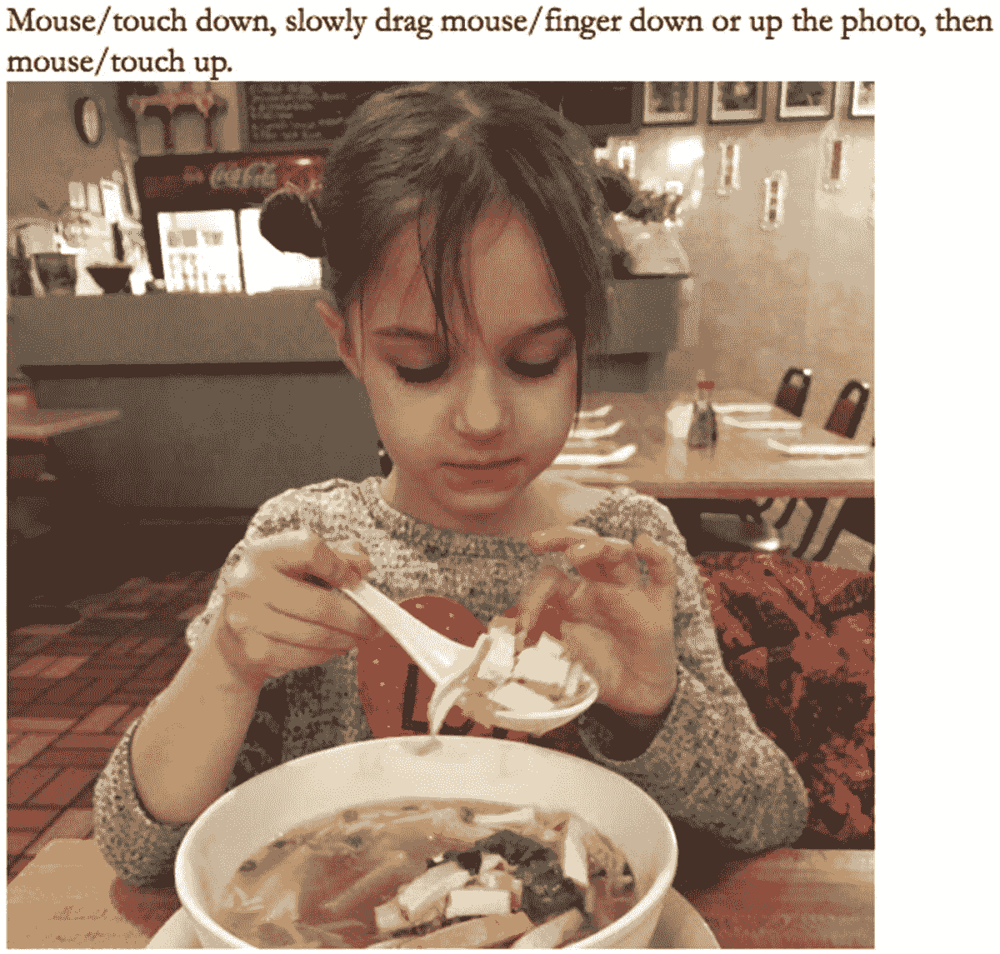
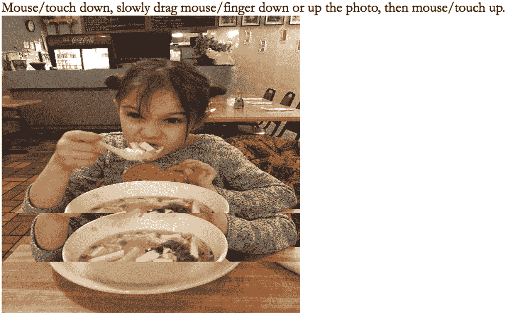
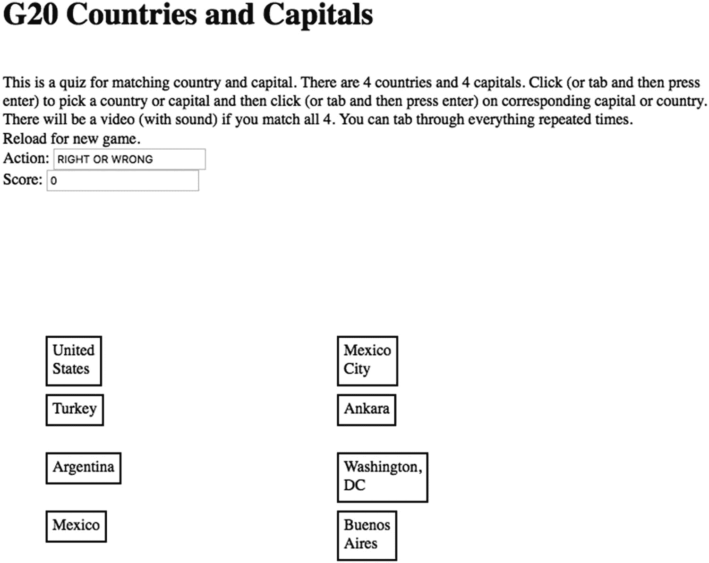
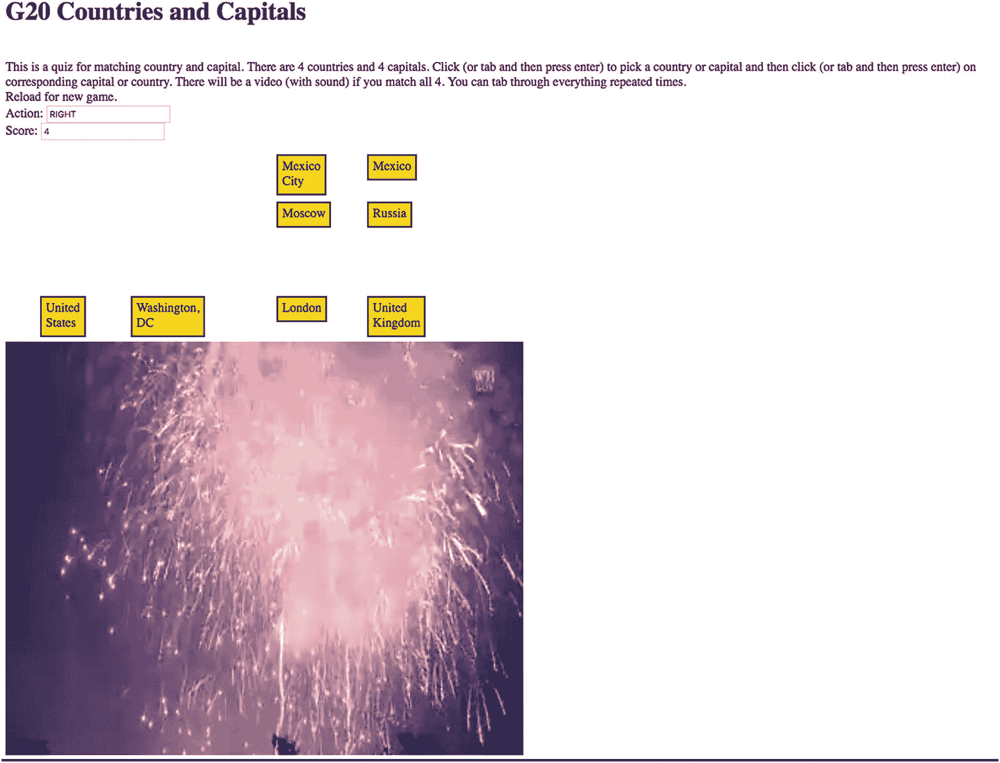

# 十、响应式设计和可访问性

在本章中，您将:

*   学习使您的交互式应用程序可在各种设备上使用的技术

*   了解如何让人们只使用键盘和屏幕阅读器就能访问您的应用程序

*   进行随机的多项选择，此外，将这些任务组合起来

*   查看动态创建 HTML 标记的其他示例

## 介绍

过去，人们使用台式机或笔记本电脑来使用计算机应用程序！现在，许多人希望在他们的平板电脑或智能手机上查看和使用计算机应用程序，包括网页。此外，许多人希望在所有三类设备上访问一个网站，并有类似的体验。他们还可以选择修改台式机或笔记本电脑上的窗口尺寸，或者改变移动设备的方向。准备一个使用 HTML、CSS 和 JavaScript 制作的项目以适应设备(和设备的状态)被称为*响应式设计*。另一个不同但相似的目标是准备一个可供各种用户访问的项目。在这种情况下，一个关键的挑战是使应用程序适合使用屏幕阅读器的有视觉障碍的人和/或只能使用键盘的人。在这一章中，我描述了一些有助于实现这些目标的技术，重点是一些具体的例子。

图 10-1 显示了一个调整到设备尺寸的 HTML 和 JavaScript 项目的截图。该程序通过在台式机或笔记本电脑上用鼠标或在平板电脑或手机上触摸来循环播放一系列图像。



图 10-1

显示程序的打开屏幕

按下鼠标按钮并向下移动或用手指向下触摸并向下移动会使下一张图片逐渐显示，直到接近底部。图 10-2 为正在更改中的图片。



图 10-2

从一张图片到下一张图片的变化正在进行中

当鼠标或手指足够近时，整个下一张图片就会出现。类似地，用户/玩家可以在屏幕上向上移动鼠标或手指，并获得先前出现的图片。我鼓励读者尝试源代码。

图 10-3 显示了一个竞猜游戏的截图，可以用鼠标或触摸或键盘单独操作。这一组四个国家是从 G20 国家中随机选择的，相应的首都是混在一起的，所以每次您都会看到一组不同的项目。该测验可以仅使用键盘和屏幕阅读器程序进行，tab 键将玩家从一个项目带到另一个项目，使其适合视觉能力有限或没有视觉能力的人和/或不能使用鼠标或触摸的人。



图 10-3

国家/首都测验的开始屏幕

“动作”和“分数”字段显示了到目前为止的表现。这些框会改变颜色，并移动到匹配框的旁边，让视觉能力强的人觉得更有趣。当匹配正确时，使用黄色/金色。如说明所示，当玩家正确匹配四次时，将播放一段视频。图 10-4 为截图。



图 10-4

成功完成测验的屏幕截图

视频有声音，因此视障人士也能获得奖励。

### 注意

屏幕阅读器很复杂，并提供自定义使用的选项。我使用的一个屏幕阅读器单独“说出”国家和首都的名称，但另一个添加了术语“组”，这很烦人。可以使用 Tab 键和 Shift 键来来回听国家和首都的名称。然而，屏幕阅读器会阅读整个屏幕，包括我的浏览器工具栏上的所有内容，当点击文档末尾的 Tab 键时，这种情况会重复出现。我的例子展示了如何在动态生成的 HTML 标记中包含标签信息。我强烈建议您在继续探索屏幕阅读器和键盘操作的使用时，先研究静态 HTML 页面，然后再研究具有动态生成的 HTML 元素的程序。

## 关键要求

在深入研究具体的技术特性之前，开发人员需要考虑计划中的应用程序的最重要的目标受众以及应用程序在不同情况下的可行性，这一点非常重要。有一个叫做 *mobile first* 的概念，它建议，如果要在移动设备上使用某些东西，最好的方法是首先设计和规划移动实现，而不是为桌面设计和实现，然后进行调整。从问题规范开始，包括最常见的设备和用户，并制定解决方案是一个好策略。教师和书籍作者经常做一些完全不同的事情:从我们想要解释的概念和功能开始，设计我们认为使用这些功能的有趣程序。

当你设计一个网络应用程序时，考虑某些程序，比如那些具有地理定位功能的程序，最适合移动设备是很重要的。相比之下，需要大量文本输入的程序最适合台式机和笔记本电脑。拼图玩具不适合视力有障碍的人。不过国家/首都的小测验，我本来是做给鼠标或者触控用的，可以改编成键盘操作。考虑不同的屏幕和不同的受众是确定什么对你的应用程序至关重要的一种有价值的方法，并且致力于响应性设计和提高可访问性的过程可以使所有的受众受益。

在这一章中，我将重点介绍如何适应屏幕尺寸，确保除了鼠标之外或代替鼠标使用触摸功能，以及支持屏幕阅读器和至少某些应用程序的纯键盘操作。我还想让用户调整大小，并再次调整到任意宽度和高度的窗口。

我将简要地提到对各种网站有用的特性，通常有一个静态的设计。

### 屏幕大小和尺寸

您可能希望看到按名称检查特定设备或设备类型的代码，但在许多情况下，这不是推荐的方法。相反，如果要检查的关键属性包括屏幕宽度和屏幕高度，则直接检查这些尺寸。在 HTML 元素属性、CSS 规则和指令以及 JavaScript 代码中有多种方法可以做到这一点。在 HTML、CSS 和 JavaScript 特性一节中，您可以学习，或者至少被介绍了许多细节。

### 触控

移动设备通常没有鼠标，而是依靠触摸。将触摸解释为鼠标点击是“免费的”，也就是说，不需要额外的编码，将在测验示例中演示。Reveal 应用程序基于按下鼠标、移动鼠标和抬起鼠标的操作序列，它需要 JavaScript 代码来支持触摸。该技术是设置触摸事件来模拟适当的鼠标事件。

### 屏幕阅读器和选项卡

存在各种各样的屏幕阅读器工具。我使用运行 MacOS High Sierra 的 iMac 上的内置 VoiceOver 功能来测试这个测试程序。有视觉障碍的人和不能操作鼠标的人需要通过键盘完成所有的事情。这包括提供支持使用 Tab 键的编码。对屏幕阅读器和键盘的最佳支持的一般建议是良好的整体组织，将文本分成更小的部分，并为用户看不到的部分提供标签。

## HTML、CSS 和 JavaScript 特性

HTML 和 CSS 一起提供了支持响应式设计和可访问性的方法。在涉及更多交互和动态行为的情况下，可能有必要使用 JavaScript，我将重点讨论示例中的 JavaScript 技术。

### 当标记

标签为浏览器、搜索引擎和其他网络程序提供关于文档的信息。没有显示任何内容。`charset meta`标签

```js
<meta charset="UTF-8">

```

指定要使用的字符集。UTF-8 指定是默认的，表示 1 到 4 字节的 Unicode 标准。Unicode 的目的是支持世界上所有的语言，尽管可能不完全是这样，但大多数语言，包括日语和中文，都是受支持的。尽管 Unicode 是默认设置，但如果没有这个`meta`标记，web 控制台上仍会显示一条警告消息，因此包含它将防止您在访问 web 控制台时看到该消息。

建议使用以下`meta`标签将宽度设置为器件宽度:

```js
<meta name="viewport" content="width=device-width, initial-scale=1.0">

```

我在 Reveal 示例中使用了以下代码，允许用户在移动设备上缩放窗口。这仅适用于移动设备。

```js
<meta name="viewport"
content="width=device-width, user-scalable=yes, initial-scale=1.0, minimum-scale=1.0, maximum-scale=2.0" />

```

如果图像或视频元素没有给定宽度或高度属性设置或给定固定量，使窗口变小将导致滚动。垂直滚动被认为是可以接受的，但水平滚动是不能接受的。下一节将描述产生预期效果的技术。

### HTML 和 CSS 使用百分比和自动

以像素为单位指定`img`等元素的宽度和高度是一种标准做法。如果只使用 HTML 为`body`元素中的元素指定了一个，则修改另一个以保持纵横比。在`style`部分，使用 CSS，可以使用术语`auto`。这是默认设置，但我喜欢明确地提到它，主要是作为对我的提醒。

以像素为单位指定宽度或高度的一种变化是将维度指定为包含元素的百分比。包含元素可以是`body`元素或`div`或语义标签或其他东西。块显示元素的默认宽度尺寸，如`div`，是屏幕的 100%。可以指定另一个百分比，比如 50%或 80%。一个例子是在正文中包含

```js


```

这将设置图像的宽度占屏幕的 50%,高度保持纵横比。在“样式”部分，以下任一项

```js
#animal {width:50%; height: auto;}
#animal {width:50%;}

```

会产生同样的效果。

如果应用程序窗口被操作(比如说，在桌面上)为比计算的高度短，那么图像将被切掉，并且将出现滚动条用于垂直滚动。如果想要的效果是在宽度(或高度)上设置一个界限，但不将图像拉伸到超出其原始尺寸，可以使用`max-width`或`max-height`属性。一般来说，垂直滚动比水平滚动更容易被接受，所以通常只需指定宽度或`max-width`就可以获得响应。这是我在国家/首都测验中制作奖励视频时使用的方法。

百分比可与宽度和/或`max-width`一起使用，为元素设置网格布局。我鼓励你尝试这些特性。许多 W3Cschool 示例的 TRY-IT 特性很有帮助。

您将看到我如何使用 JavaScript 修改宽度和高度。

### CSS @media

Web 开发人员可以在`style`元素中设置`@media`查询。这些提供了一种方法来检查设备的属性，并为某些条件指定样式指令。例如，在我的购物网站上，我指定某些元素属于一类，名为`col`。如果屏幕足够宽，我希望这些元素以列的形式分布在窗口中。然而，如果屏幕宽度很小，我不想要求水平滚动，而是让`col`元素垂直显示，假设用户将垂直滚动。下面的`@media`指令产生了这种效果:

```js
@media all and (max-width: 640px)
   {.col {display: block; width: 100%;}}

```

如前所述，这是为测试手机等狭窄设备而建议的技术。`@media`特性也可以用于为计算机和设备的屏幕指定不同的格式，术语`print`用于打印网页，术语`speech`用于屏幕阅读器。

一个`@media`查询可以有修饰符`not`和`only`。举个例子，

```js
@media only screen and (max-width: 600px) {
    body {
        background-color: lightblue;
    }
}

```

为在屏幕上使用的 body 元素中的所有内容生成浅蓝色的背景色(这是已知的颜色名称之一(见 [`https://www.w3schools.com/Colors/colors_names.asp`](https://www.w3schools.com/Colors/colors_names.asp) )。更多的例子和解释请参考 [`https://www.w3schools.com/CSSref/css3_pr_mediaquery.asp`](https://www.w3schools.com/CSSref/css3_pr_mediaquery.asp) 。

### HTML alt 属性和语义元素

元素的属性为屏幕阅读器提供信息。如果文件丢失或下载缓慢，将显示`alt`属性的值。在正常情况下建议使用`alt`元素，检查可访问性的程序将指示任何没有`alt`元素的`img`标签。思考什么是`alt`属性可能是开发网页的一个重要练习。请注意，我在这个例子中的代码没有显示`img`元素，这只是用来确保图片被完全下载。因此，我认为包含`alt`属性并不合适。

语义元素可以提供屏幕阅读器可以使用的信息。当在大型项目中与其他人一起工作时，术语`header`、`footer`、`main`、`section`、`article`等是有意义的。它们没有必须提供的特定格式。

### HTML tabIndex

依赖屏幕阅读器或者不能或不习惯使用鼠标或触摸的人依赖于使用 Tab 键来浏览文档。可以为任何元素设置`tabIndex`属性。按 tab 键将用户带到 Tab 键顺序中的下一个元素(按数字顺序从低到高进行)。按 Tab 键和 Shift 键可以反转方向。元素的`tabindex`可以在准备 HTML 文档时设置，也可以在动态创建 HTML 标记时通过编码产生。在 quizTab 应用程序中，我包含了以下语句

```js
d.innerHTML = (
"<div tabIndex='"+String(2+i)+"' class="thing" id='"+uniqueid+"'>placeholder</div>");

```

该代码为国家名称的`tabindex`产生连续的值。

在 web 页面的操作过程中，可以更改`tabindex`,尽管在我的例子中我没有这样做。玩(参加)测验确实意味着多次浏览项目，这确实意味着再次听到指示，并且再次进入浏览器的地址栏，并且在某些情况下，听到浏览器中选项卡所代表的所有活动站点。

### 宽度和高度属性的 JavaScript 用法

任何计算机或设备的浏览器都会调整文本的线宽以适应窗口。然而，我也想调整说明中的字体大小。指令使用我的代码根据计算选择的字体大小显示。使用以下语句设置`fontsz`数组:

```js
var fontsz = ["14px","16px","18px","20px","24px"];

```

字体的大小在`init`函数中使用已经分配了代码为`window.innerWidth.`的`cwidth`变量进行设置

```js
  fs = Math.floor (cwidth/200);
  fs = Math.min(fs,4);
  bodyel.style.fontSize = fontsz[fs];

```

在 Reveal 示例中，我给自己设定的挑战是图像要适合窗口，不需要任何滚动，同时保持比例。我使用的属性包括窗口的`window.innerWidth`和`window.innerHeight`，图像的`width`、`naturalWidth`、`height`和`naturalHeight`。“自然”属性代表图像的原始尺寸。它们不能被改变。对于 Reveal 示例，我已经确保所有的图像都有相同的尺寸，所以我只需要做一组计算。代码检查宽度是否小于屏幕宽度并调整高度，然后确保高度小于屏幕高度并调整宽度。您可以回到第八章，了解在`drawImage`方法中使用的计算值的变化。

### 动态创建元素

Reveal 示例中的图像序列是通过将每个图像绘制到 canvas 元素中来动态实现的。对于任何涉及网络上的图像或其他媒体的作品，确保文件下载完成是至关重要的。我通过在主体中包含`img`元素，但在样式部分将可见性设置为隐藏来实现这一点。然后，我的代码调用一个名为`init`的函数来完成创建 canvas 元素的所有工作，将每个图像绘制到它的 canvas 元素中，并将第一个图像绘制到主体中设置的 canvas 中。

国家/首都测验也动态创建元素。这些是长方形，上面有国家和首都的名称。HTML 标记是用为`id`、`class`和`tabindex`设置的属性创建的。`id`值将索引保存在`facts`数组中，用于确定玩家是否正确匹配了国家和首都。

### 从列表中选择

测验示例随机选择两种情况。如何做出一个随机的选择是很简单的。然而，对于这个程序，我需要从 20 个国家的事实数组中随机选择四个国家/首都对，但不允许重复。然后，对于每个国家和首都对，由于我不希望每个首都的名称与其国家名称相对，所以我需要代码从第二列中代表位置的四个位置中随机选择每个首都的位置。这也需要做到不重复。注意:可能会有这样的情况，一个首都确实结束于其国家的对面，但大多数时候不会发生。参见图 10-3 中墨西哥城、安卡拉、华盛顿特区和布宜诺斯艾利斯的位置。

我解决这个问题的第一步是让`facts`数组保存一些东西来告诉我是否有一个事实被接受了。`facts`数组是一个数组的数组，内部数组有三个元素:country、capital 和 true/false。false 设置意味着事实没有被选择，true 意味着它已经被选择。`slots`数组将保存四个首都名称的索引。我将使用-100 的初始设置来表示一个槽没有被占用。它实际上可以是任何小于零的数。当选择一个槽时，`slots`数组中的相应值被设置为`facts`数组中国家/首都的索引值。请注意，我可以在这里使用任何非负数，因为我(我的代码)不使用该值，但我在考虑未来可能的应用。

我在这两种情况下使用的编码结构是一个`do/while`循环。`do/while`结构可以在很多情况下使用，所以请记住它。用一般术语来描述:括号中的代码至少被调用一次。然后评估术语`while`后面括号中的条件。如果为真，则再次执行括号中的代码。括号中可以有多个语句。一种伪代码的思考方式是

```js
do { one or more statements }
   while (repeat if this condition is true )

```

选择`facts`的检查由以下代码完成:

```js
do {c = Math.floor(Math.random()*facts.length);}
             while (facts[c][2]==true)

```

如果已经选择了子数组`facts[c]`中表示的事实，将重复对变量`c`的赋值。

这段代码完成了对选择插槽的类似检查。

```js
do {s = Math.floor(Math.random()*nq);}
             while (slots[s]>=0)

```

表示该位置已被占用的值由大于或等于零的`slots[s]`表示，因此如果该位置已被占用，将重复随机选择。

### 鼠标事件、触摸事件和按键事件

响应式设计有两个主要问题需要解决。我已经描述了检查和修改元素以适应窗口大小。第二个考虑是提供触摸而不是鼠标事件。触摸事件的处理通过模拟鼠标事件来完成。鼠标事件大概已经被定义了。正如我已经提到的，某些触摸事件的处理不需要任何额外的编程。这些都是简单的事件，比如点击一个元素。但是，`mousedown`、`mousemove`和`mouseup`等事件需要翻译。这是因为计算需要鼠标或触摸的准确位置来从源画布绘制到显示的画布。

在`init`函数中，`addEventListener`方法涉及五个事件。如果这段代码在没有这些事件的设备上执行，那么引用任何不可能发生的事件都没有问题。

```js
  canvas.addEventListener("mousedown",startreveal,true);
  canvas.addEventListener("touchstart", touchHandler, true);
  canvas.addEventListener("touchmove", touchHandler, true);
  canvas.addEventListener("touchend", touchHandler, true);
  canvas.addEventListener("touchcancel", touchHandler, true);

```

`touchHandler`函数执行的任务是确定要模拟哪个鼠标事件(使用 switch 语句)，创建事件(使用 new `MouseEvent`)，然后调度它。`MouseEvent`函数使用一个关联数组(也称为字典),其中设置了某些属性。对于这个例子，我让其他属性采用默认值。

```js
function touchHandler(event)
{
  var touches = event.changedTouches;
  if (touches.length>1) {
    return false;
  }
  var first = touches[0];
  var type = "";
  switch(event.type)
    {
        case "touchstart": type = "mousedown"; break;
        case "touchmove":  type="mousemove"; break;
        case "touchend":   type="mouseup"; break;
        default: return;
    }
   var simulatedEvent = new MouseEvent(type,{
           screenX: first.screenX,
           screenY: first.screenY,
           clientX: first.clientX,
           clientY: first.clientY
  });

    first.target.dispatchEvent(simulatedEvent);
    event.preventDefault();
}

```

### 注意

构造函数`MouseEvent`相对较新，取代了`document.createEvent("MouseEvent")`的使用，后者现在被标记为不推荐使用，这意味着不鼓励使用它，将来可能不会被识别。工具的变化是我们需要接受的。事实上，与旧方法相比，新方法有一个显著的优势:对参数使用了一个关联数组，而不是由位置指示的一长串参数，其中大多数参数采用默认值。

请注意，如果有多点触摸手势，则不会发生任何事情，同时请注意，任何默认操作都会被阻止。我知道至少有一个商业纸牌游戏——一个 iPad 应用程序——没有做到这一点，所以当移动一张牌时，整个棋盘可能会移动。

与鼠标和触摸的问题无关:如果 Reveal 程序中的用户用鼠标或手指在图像的右边或下面(屏幕的更下方)按下，什么都不会发生。通过在`startreveal`函数中使用以下代码，可以忽略这种不良行为:

```js
var startxy = getCoords(ev);
   if (startxy[0]>pwidth) return;
   if (staryxy[1]>pheight) return;

```

类似地，如果玩家在测验应用程序中点击两个国家名或两个大写字母，程序不会提供特殊的反馈，但会将第二个项目放在第一个项目的旁边。它不会被视为正确答案，因为两个`id`值不匹配。

在构建自己的应用程序时，您必须决定在我们称之为不良行为的情况下提供什么反馈(如果有的话)。

对于测验示例，触摸(点击)事件的事件处理被解释为手机和平板设备的鼠标点击。然而，我给自己设定了支持键盘操作的挑战。我所做的是设置`keyup`事件来调用我的`pickelement`函数，但是在那个函数中，如果 keycode 是 9，即 Tab 的 keycode，就返回。因此，使用键盘的玩家可以切换到每个国家和首都项目，听到屏幕阅读器说出名称，然后按 Return 键选择一个项目，或者切换到下一个项目。

## 构建 Reveal 应用程序并使其成为您自己的应用程序

揭示程序从以下事件和动作序列开始。

1.  当文档被完全加载时，包括图像，调用`init`函数。在玩家重新加载和调整大小之后，调用`init`函数。请注意，由于 style 元素中的指令，这些图像是不可见的。

2.  `init`函数决定窗口的尺寸，并使用该信息选择字体的大小。

3.  `init`函数调用`setupimages`函数。

4.  `setupimages`函数进行计算以确保图像适合窗口，保持纵横比。它为每个图像创建一个画布元素。

5.  返回到`init`功能，设置`mouseDown`和所有触摸事件。第一个图像被绘制到 canvas 元素中，从画布绘制到画布。设置`next`和`prev`变量。

显示下一张图片的动作由函数`startreveal`、`revealing`、`stopreveal`处理，被叫和主叫关系如表 10-1 所示。我决定允许用户上下滑动并改变方向。我还决定，如果垂直水平在顶部或底部的蒙混因素之内，就完成过渡。我的意图是通过程序中嵌套的`if/else`语句实现的。

表 10-1

*揭示*的功能关系

<colgroup><col class="tcol1 align-left"> <col class="tcol2 align-left"> <col class="tcol3 align-left"></colgroup> 
| 

功能

 | 

由...调用

 | 

祈求者

 |
| --- | --- | --- |
| `init` | `body`标签中的`onload`和`onresize`属性 | `setupimages` |
| `setupimages` | `init` |   |
| `touchHandler` | `init`中`addEventListener`的调用 |   |
| `getCoords` | `startreveal, revealing` |   |
| `startreveal` | 在`init`和`stopreveal`调用`addEventListener` | `getCoords` |
| `revealing` | `startreveal`中`addEventListener`的调用 | `getCoords` |
| `stopreveal` | `startreveal`中`addEventListener`的调用和揭示中的直接调用 |   |

表 10-2 显示了 reveal 程序的注释代码。

表 10-2

*显示程序代码*

<colgroup><col class="tcol1 align-left"> <col class="tcol2 align-left"></colgroup> 
| 

密码

 | 

描述

 |
| --- | --- |
| `<!DOCTYPE HTML>` | 页眉 |
| `<html>` | `html`标签 |
| `<head>` | `head`标签 |
| `<title>Reveal next</title>` | 完整的标题元素 |
| `<meta name="viewport"` | 视口起点 |
| `content="width=device-width, user-scalable=yes,``initial-scale=1.0, minimum-scale=1.0,``maximum-scale=2.0" />` | 指示用户更改的处理方式 |
| `<meta charset="UTF-8">` | 将字符集指定为 unicode |
| `<style>` | 样式标签 |
| `body {` | 身体指令 |
| `font-family: Garamond, serif;` | 字体是 Garamond，如果可用，否则衬线 |
| `font-size: 24px;` | 笔记大小可能会改变 |
| `overflow: hidden;` | 如果太大，没有溢出和滚动 |
| `}` | 关闭几何体指令 |
| `div#images {display:none;}` | 不显示任何图像；用于绘制到画布元素中的图像 |
| `</style>` | 关闭`style`元素 |
| `<script>` | `script`元素的开始 |
| `var ctx;` | 将保存画布元素的上下文 |
| `var fudge = 40;` | 不需要用户一直向上或向下才能看到下一幅图像；这是一个“忽悠因素”，意思是给用户一点空间 |
| `var canvas;` | 将容纳画布 |
| `var pwidth;` | 图片的宽度 |
| `var pheight;` | 图片的高度 |
| `var cwidth;` | 窗口宽度 |
| `var cheight;` | 窗口高度 |
| `var current = 0;` | 从第 0 张<sup>到第</sup>张图片开始 |
| `var prev = 3;` | 从索引 3 处的前一张图片开始 |
| `var next = 1;` | 下一张图片在索引 1 处 |
| `var rect;` | 用于获取鼠标坐标 |
| `var revealflag = false;` | 旗 |
| `var lastdrawn;` | 跟踪最后一张图片 |
| `var lasty;` | 最后一个 y 值 |
| `var moving = false;` | 设置以指示移动鼠标 |
| `var canvases = [];` | 会为所有的图片准备画布 |
| `var fontsz = ["14px","16px","18px","20px","24px"];` | 可能的字体大小 |
| `function init() {` | `init`功能的标题 |
| `var fs;` | 用于确定字体大小 |
| `canvas=document.getElementById("canvas");` | 指向画布元素的指针 |
| `bodyel = document.getElementById("body");` | 指向主体元素的指针 |
| `ctx = canvas.getContext("2d");` | 画布的上下文 |
| `ctx.font = "24px serif";` | 默认字体和大小 |
| `cwidth = window.innerWidth;` | 窗口宽度 |
| `cheight = window.innerHeight;` | 窗口高度 |
| `fs = Math.floor (cwidth/200);` | 计算字体大小 |
| `fs = Math.min(fs,4);` | 最小值为 4 |
| `bodyel.style.fontSize = fontsz[fs];` | 将正文中指令的字体大小设置为`fontsz`数组的`fs`元素 |
| `canvas.width = cwidth;` | 设置画布宽度 |
| `canvas.height= cheight;` | 设置画布高度 |
| `rect = canvas.getBoundingClientRect();` | 用于确定鼠标坐标 |
| `var noOfImgs = document.getElementsByTagName('img').length;` | 确定文档中`img`元素的数量 |
| `setupimages("noodles", noOfImgs);` | 执行任何缩放后，调用将设置图像(图片)画布的函数 |
| `canvas.addEventListener("mousedown",``startreveal,true);` | 设置`mousedown`事件 |
| `canvas.addEventListener("touchstart",``touchHandler, true);` | 所有触摸事件都会调用`touchHandler` |
| `canvas.addEventListener("touchmove",``touchHandler, true);` |   |
| `canvas.addEventListener("touchend",``touchHandler, true);` |   |
| `canvas.addEventListener("touchcancel",``touchHandler, true);` |   |
| `ctx.drawImage(canvases[0],0,0);` | 将第一张(第 0 张<sup>到第 1 张</sup>索引)图片绘制到画布上 |
| `current = 0;` | 设置电流；这条语句和接下来的两条语句是`onresize`调用`init`所必需的 |
| `prev = 3;` | 设置`prev` |
| `next = 1;` | 设置`next` |
| `}` | 关闭`init` |
| `function setupimages (base, lim){` | `setupimages`功能的表头；基数表示图像名称的开头，而`lim`表示图像的数量 |
| `var dref;` | 对第一幅图像的引用；这个用来计算比例因子 |
| `var can;` | 会指向每一张画布 |
| `var canctx;` | 将保存每个画布的上下文 |
| `canvases = [];` | 将保存创建的画布和图像，所有图像都缩放到适当的大小；你可以把它们想象成保存图像的缓冲器 |
| `var img;` | 将依次按住每个`img` |
| `dref = document.getElementById("dummy");` | 获取对第一幅图像的引用 |
| `if (dref.naturalWidth) {` | 这提供了图像的原始宽度 |
| `dref.width = dref.naturalWidth;` | 将宽度设置为该值 |
| `pratio = dref.naturalHeight/dref.naturalWidth;` | 计算纵横比 |
| `}` | 关闭`if` |
| `else {` | 当`naturalWidth`不存在时不太通用，这可能是某些浏览器的情况 |
| `pratio = dref.height/dref.width;` | 计算比率 |
| `}` | 关闭 else |
| `dref.width = Math.min(dref.width,cwidth-fudge);` | 现在可能重置宽度 |
| `dref.height = pratio * dref.width;` | 设置高度以匹配可能修改的宽度 |
| `dref.height = Math.min(dref.height,cheight-fudge);` | 现在可能修改高度 |
| `dref.width = dref.height * (1/pratio);` | 设置宽度以匹配可能修改的高度 |
| `pwidth = dref.width;` | 设置变量以备后用 |
| `pheight = dref.height;` | 设置变量以备后用 |
| `for(var i=1;i<=lim;i++){` | 通过将 1、2、3、4 加到基数上，按名称引用图像文件；这个循环缩放图像(重复第一个循环的操作)；还要注意画布数组中的项目位于索引位置 0，1，2，3 |
| `img = new Image();` | 创建一个`Image`对象 |
| `img.width = pwidth;` | 设置宽度 |
| `img.height = pheight;` | 设置高度 |
| `img.src=base+String(i)+".jpg";` | 使用基数和数字设置`src` |
| `can = document.createElement("canvas");` | 创建画布 |
| `can.width = cwidth;` | 设置其宽度 |
| `can.height = cheight;` | …和高度 |
| `canctx = can.getContext('2d');` | 将`canctx`设置为上下文 |
| `canctx.drawImage(img,0,0,pwidth,pheight);` | 将图像绘制到画布上 |
| `canvases.push(can);` | 推入`canvases`数组 |
| `}` | 关闭`for`回路 |
| `}` | 关闭`setupimages`功能 |
| `function touchHandler(event) {` | `touchHandler`的标题 |
| `var touches = event.changedTouches;` | 获取触摸数组 |
| `if (touches.length>1) {` | 如果不止一个 |
| `return false;` | 返回；不要为多点触控手势做任何事情 |
| `}` | 关闭`if` |
| `var first = touches[0];` | 进行第一次(也是唯一一次)接触 |
| `var type = "";` | 初调 |
| `switch(event.type)    {` | 开启事件类型 |
| `case "touchstart": type = "mousedown"; break;` | 将类型变量设置为相应的鼠标事件 |
| `case "touchmove":  type="mousemove"; break;` |   |
| `case "touchend":   type="mouseup"; break;` |   |
| `default: return;` | 什么也不做 |
| `}` | 关闭开关 |
| `var simulatedEvent = new MouseEvent(type,{``screenX: first.screenX,``screenY: first.screenY,``clientX: first.clientX,``clientY: first.clientY``});` | 创建计算类型的`MouseEvent`；从触摸事件的位置设置位置 |
| `first.target.dispatchEvent(simulatedEvent);` | 调度事件将被视为实际事件 |
| `event.preventDefault();` | 停止对触摸事件的任何默认响应 |
| `}` | 关闭`touchHandler` |
| `function getCoords(ev){` | 用于`getCoords`拾取鼠标位置的标题 |
| `var mx;` | 将保持水平 |
| `var my;` | 将保持垂直 |
| `mx = ev.clientX-rect.left;` | `rect`变量已经设置；计算`mx` |
| `my = ev.clientY-rect.top;` | 计算`my` |
| `return [mx,my];` | 返回一个数组 |
| `}` | 关闭`getCoords` |
| `function startreveal(ev){` | `startreveal`的标题 |
| `var startxy = getCoords(ev);` | 获取鼠标的坐标 |
| `if (startxy[0]>pwidth) return;` | 如果鼠标或触摸在图像的右边，则没有动作 |
| `if (startxy[1]>pheight) return;` | 如果鼠标或触摸位于图像下方，则无动作 |
| `lasty = Math.max(startxy[1],fudge);` | 从顶部开始至少要有一段距离 |
| `canvas.addEventListener("mousemove",``revealing,true);` | 设置`mousemove` |
| `canvas.addEventListener("mouseup",``stopreveal,true);` | 设置`mouseup` |
| `canvas.removeEventListener("mousedown",``startreveal,true);` | 停止监听`mousedown` |
| `revealflag = true;` | 设置标签 |
| `}` | 关闭`startreveal` |
| `function revealing(ev){` | 显示标题 |
| `var slice;` | 将指示从下一张图片中提取多少(垂直量) |
| `var curxy;` | 将保持鼠标位置 |
| `if (!revealflag) return;` | 如果不在显示阶段，返回 |
| `curxy = getCoords(ev);` | 获取鼠标坐标 |
| `cury = curxy[1];` | 设置`cury` |
| `if (moving){` | 检查移动标志 |
| `if (cury>=lasty){` | 如果比上次更低 |
| `if (cury<(pheight-fudge)){` | 如果它不在底部 |
| `slice = Math.max(1,cury-lasty)` | 计算高度 |
| `ctx.drawImage(canvases[next],0,lasty,pwidth,``slice,0,lasty,pwidth,slice);` | 从下一张画布开始绘制 |
| `lastdrawn = next;` | 为下一步行动做准备 |
| `lasty = cury;` |   |
| `}` | 关闭`if` |
| `else {` | 马上去准备下一个 |
| `lastdrawn = next;` | 设置`lastdrawn` |
| `stopreveal(ev);` | `ev`通过与被通过`eventhandler` |
| `}` | 为`cury<(pheight-fudge)`关闭 else |
| `}` | 关闭`cury>=lasty` |
| `else {` | Else `cury< lasty`，如此向上移动 |
| `if (cury>fudge){` | 如果仍然在软糖区之外 |
| `slice = Math.max(1,lasty-cury);` | 计算切片 |
| `ctx.drawImage(canvases[prev],0,cury,pwidth,``slice,0,cury,pwidth,slice);` | 从`prev`图像绘制 |
| `lastdrawn = prev;` | 将`lastdrawn`设置为`prev` |
| `lasty = cury;` | 设置`lasty` |
| `}` | 关闭`if` |
| `else {` | 否则在软糖区，所以完成过渡 |
| `lastdrawn = prev;` | 设置`lastdrawn` |
| `stopreveal(ev);` | 调用`stopreveal` |
| `}` | 为`cury>fudge`关闭 else |
| `}` | 为`cury>=lasty`关闭 else |
| `}` | 移动时关闭 |
| `else {` | 第一部电影 |
| `moving = true;` | 设置`moving` |
| `if (cury>=lasty){` | 检查方向 |
| `prev = current;` | 向上移动，因此设置 prev |
| `if (cury<(pheight-fudge)){` | 检查上面是否有软糖 |
| `slice = Math.max(1,cury-lasty);` | 设置切片 |
| `ctx.drawImage(canvases[next],0,lasty,pwidth,``slice,0,lasty,pwidth,slice);` | 从下一个开始绘制 |
| `lastdrawn = next;` | 设置`lastdrawn` |
| `lasty = cury;` | 设置`lasty` |
| `}` | 如果高于软糖，则关闭 |
| `else {` | 其他 |
| `lastdrawn = next;` | 设置`lastdrawn` |
| `stopreveal(ev);` | 立即转到`stopreveal`；通过的`ev`与成为的`eventhandler`一致 |
| `}` | 关闭`cury<(pheight-fudge)`的`else` |
| `}` | 关闭`cury>=lasty`移动`false` |
| `else {` | 向上移动图像 |
| `next = current;` | 设置下一个 |
| `if (cury>fudge){` | 如果大于软糖 |
| `slice = Math.max(1,lasty-cury);` | 计算切片 |
| `ctx.drawImage(canvases[prev],0,cury,pwidth,``slice,0,cury,pwidth,slice);` | 绘制切片 |
| `lastdrawn= prev;` | 设置`lastdrawn` |
| `lasty = cury;` | 设置`lasty` |
| `}` | 如果高于软糖，则关闭 |
| `else {` | 否则(在软糖区) |
| `lastdrawn = prev;` | 设置 lastdrawn |
| `stopreveal(ev);` | 立即转到`stopreveal` |
| `}` | 关闭 else for if `cury>fudge` |
| `}` | 为`cury>=lasty`关闭 else |
| `}` | 如果移动，则关闭 else |
| `}` | 关闭功能 |
| `function stopreveal(ev) {` | `stopreveal`的标题 |
| `revealflag = false;` | 重置〔??〕 |
| `moving = false;` | 重置移动 |
| `ctx.drawImage(canvases[lastdrawn],0,0);` | 绘制完整的图像 |
| `current = lastdrawn;` | 设置电流 |
| `next = current+1;` | 下一个增量 |
| `if (next==canvases.length) next = 0;` | 如果在最后，将旁边设置为 0 |
| `prev = current-1;` | 预测集 |
| `if (prev<0) prev=canvases.length-1;` | 如果 prev 太低，设置为最后一个指数 |
| `canvas.removeEventListener("mousemove",``revealing,true);` | 停止监听`mousemove` |
| `canvas.removeEventListener("mouseup",``stopreveal,true);` | 停止监听`mouseup` |
| `canvas.addEventListener("mousedown",``startreveal,true);` | 为`startreveal`设置事件 |
| `}` | 关闭`stopreveal` |
| `</script>` | 结束`script`元素 |
| `<body id="body" onload="init();"``onresize="init();">` | Body 标签，带有`onload`和`onresize`的设置 |
| `Mouse/touch down,``slowly drag mouse/finger down or up the photo,``then mouse/touch up.` | 说明 |
| `<canvas id="canvas" width="100%"``height="50%" >` | 画布；可以缩放 |
| `Your browser doesn't support canvas` | 标准消息 |
| `</canvas>` | 画布结束标签 |
| `<div id="images">` | `div`拿着图像 |
| `` | 第一个用于比例计算 |
| `` |   |
| `` |   |
| `` |   |
| `</div>` | 关闭`div` |
| `</body>` | 关闭`body` |
| `</html>` | 关闭`html` |

### 测试和上传 Reveal 应用程序

Reveal(我也称之为 uncover)应用程序需要一组相同维度的图像，尽管这个维度不需要是我为吃面的女孩准备的。你可以有不同数量的图像，而不是我的四个。这是通过在`setupimages`函数中使用`document.getElementsByTagName`调用来支持的。当然，如果您选择包含其他图像，您将需要调用持有`img`元素的`div`来代替文档。

### 构建国家/首都测验，并使其成为您自己的测验

通过使用`Math.random`从事实表中选择四个国家/地区大写字母对，并检查以确保不重复任何一对，来设置智力竞赛节目。元素是为国家和首都动态创建的，首都在窗口中出现的顺序是随机的。这些元素是在设置了`tabIndex`的情况下创建的。当每个元素被创建时，`addEventListener`被点击事件*调用，*被`keyup`事件调用。功能及其关系如表 10-3 所示。请注意，这里没有`touchhandler`事件，因为设备上的浏览器可以正确解释使用触摸的点击事件。更一般地说，设置`tabIndex`属性提供了选项卡功能，而不需要任何额外的 JavaScript 代码。

表 10-3

*用于测验的函数关系*

<colgroup><col class="tcol1 align-left"> <col class="tcol2 align-left"> <col class="tcol3 align-left"></colgroup> 
| 

功能

 | 

由...调用

 | 

祈求者

 |
| --- | --- | --- |
| `init` | 由`body`标签中的`onload`属性执行的操作 | `setupgame` |
| `setupgame` | `init` |   |
| `pickelement` | 在`setupgame`中`addEventListener`多次动作 |   |

带注释的代码如表 10-4 所示。

表 10-4

*国家/首都测验代码*

<colgroup><col class="tcol1 align-left"> <col class="tcol2 align-left"></colgroup> 
| 

密码

 | 

描述

 |
| --- | --- |
| `<!DOCTYPE html>` | 标准标题 |
| `<html>` | `html`标签 |
| `<head>` | `head`标签 |
| `<title>Quiz with Reward!</title>` | 完整标题 |
| `<style>` | `style`标签 |
| `country {position:absolute;left: 0px; top: 0px; border: 2px; border-style: double; background-color: white; margin: 5px; padding: 3px; visibility:hidden;}` | 格式化国家区块 |
| `capital {position:absolute;left: 0px; top: 0px; border: 2px; border-style: double; background-color: white; margin: 5px; padding: 3px; visibility:hidden;}` | 格式化资本块 |
| `#vid {position` `:absolute; visibility:hidden; z-index: 0; max-width: 50%; height: auto;}` | 使视频隐藏到播放时间；设置宽度限制 |
| `main {display:block;}` | 主线前后的力线断开 |
| `</style>` | 结束`style`标签 |
| `<script type="text/javascript">` | `Script`标签 |
| `var facts = [` | 保存测验信息的变量；内部数组中的第三个位置用于指示该事实是否已被选择用于该游戏 |
| `["China","Beijing",false],` |   |
| `["India","New Delhi",false],` |   |
| `["European Union","Brussels",false],` |   |
| `["United States","Washington, DC",false],` |   |
| `["Indonesia","Jakarta",false],` |   |
| `["Brazil","Brasilia",false],` |   |
| `["Russia","Moscow",false],` |   |
| `["Japan","Tokyo",false],` |   |
| `["Mexico","Mexico City",false],` |   |
| `["Germany","Berlin",false],` |   |
| `["Turkey","Ankara",false],` |   |
| `["France","Paris",false],` |   |
| `["United Kingdom","London",false],` |   |
| `["Italy","Rome",false],` |   |
| `["South Africa","Pretoria",false],` | 注:南非有三个首都；我选择了比勒陀利亚。这是一个匹配的游戏，所以玩家永远不会看到其他两个城市的名字 |
| `["South Korea","Seoul",false],` |   |
| `["Argentina","Buenos Aires",false],` |   |
| `["Canada","Ottawa",false],` |   |
| `["Saudi Arabia","Riyadh",false],` |   |
| `["Australia","Canberra",false]` |   |
| `];` | 封闭的外部事实阵列 |
| `var thingelem;` | 用于每个块项目 |
| `var nq = 4;` | 游戏中提问的问题数量 |
| `var elementinmotion;` | 用于指示将被移动到下一个玩家匹配项的选定元素 |
| `var makingmove = false;` | 当玩家选择两个方块时设置为真 |
| `var inbetween = 150;` | 列间距 |
| `var col1 = 0;` | 第一列的开始 |
| `var row1;` | 在 init 中设置；第一行开始 |
| `var rowsize = 60;` | 为每个项目分配的垂直空间 |
| `var slots = new Array(nq);` | 将索引保存到资本项目的事实数组中 |
| `function init(){` | `init`功能的标题 |
| `row1= .6* window.innerHeight;` | 设置`row1`为总窗高的表达式；如果高度太小，将需要垂直滚动 |
| `setupgame();` | 调用`setupgame` |
| `}` | 关闭`init` |
| `function setupgame() {` | `setupgame`的标题 |
| `var i;` | 用于`for`循环 |
| `var c;` | 用于计算随机选择 |
| `var s;` | 用于计算大写字母的候选槽 |
| `var mx = col1;` | 起始 x 位置 |
| `var my = row1;` | 起始 y 位置 |
| `var d;` | 将保存对国家/地区的已创建元素的引用 |
| `var uniqueid;` | 用于保存所有生成的 id |
| `for (i=0;i<facts.length;i++) {` | 重复所有的事实 |
| `facts[i][2] = false;` | 设置为未使用 |
| `}` | 关闭`for`回路 |
| `for (i=0;i<nq;i++) {` | 循环所有插槽 |
| `slots[i] = -100;` | 设置槽值 |
| `}` | 关闭循环 |
| `for(i=0;i<nq;i++) {` | 循环，直到选择了`nq`个不同的事实 |
| `do {c = Math.floor(Math.random()*facts.length);}` | `Do`获取一个随机值 |
| `while (facts[c][2]==true)` | 如果这一事实成立，重复`do`条款 |
| `facts[c][2]=true;` | 现在，选择了一个未采用的事实，将其标记为采用 |
| `uniqueid = "c"+String(c);` | 生成一个 ID |
| `d = document.createElement('country');` | 创建一个元素 |
| `d.innerHTML = (` | 设置`innerHTML` |
| `"<div tabIndex='"+String(2+i)+"' class="thing" id='"+uniqueid+"'>placeholder</div>");` | …成为响应`style`指令的`div`、`class 'thing'` |
| `document.body.appendChild(d);` | 附加到正文(以便显示) |
| `thingelem = document.getElementById(uniqueid);` | 设置`thingelem`来引用新创建的元素 |
| `thingelem.textContent=facts[c][0];` | 让它的背景成为国家 |
| `thingelem.style.top = String(my)+"px";` | 将其定位在`my`垂直位置… |
| `thingelem.style.left = String(mx)+"px";` | … `mx`水平位置 |
| `thingelem.addEventListener('click',pickelement);` | 为`click`设置事件处理 |
| `thingelem.addEventListener('keyup',pickelement);` | 为`keyup`设置事件处理 |
| `thingelem.style.visibility="visible";` | 将可见性设置为可见 |
| `uniqueid = "p"+String(c);` | 现在创建一个新的唯一 ID |
| `d = document.createElement('cap');` | 创建一个元素 |
| `d.innerHTML = (` | 设置`innerHTML` |
| `"<div tabIndex="0" class="thing" id='"+uniqueid+"'>placeholder</div>");` | 物品的`div`；代码将改变`tabIndex` |
| `document.body.appendChild(d);` | 附加到正文，这样它就可见了 |
| `thingelem = document.getElementById(uniqueid);` | 设置`thingelem`以引用该元素 |
| `thingelem.textContent=facts[c][1];` | 设置其内容 |
|   | 从空位中随机选择一个 |
| `do {s = Math.floor(Math.random()*nq);}` | 务必将`s`设为随机值 |
| `while (slots[s]>=0)` | 如果`slots[s]`的当前值大于或等于零，则意味着该槽被占用，因此重复`do`子句以获得新值`s` |
| `slots[s]=c;` | 该槽未被占用，因此将其设置为值`c` |
| `thingelem.tabIndex = String(6+s);` | 设置其`tabIndex` |
| `thingelem.style.top = String(row1+s*rowsize)+"px";` | 使用`s`指示的位置将其垂直放置 |
| `thingelem.style.left = String(col1+inbetween)+"px";` | 所有大写字母都有相同的水平位置作为第二列 |
| `thingelem.addEventListener('click',pickelement);` | 为`click`设置事件处理 |
| `thingelem.addEventListener('keyup',pickelement);` | 为`keyup`设置事件处理 |
| `my +=rowsize;` | 增加`my`以进入下一行 |
| `}` | 关闭`for`回路 |
| `document.f.score.value = "0";` | 将分数设置为 0 |
| `return false;` | 返回，防止文档的任何刷新(可能不需要) |
| `}` | 关闭`setupgame` |
| `function pickelement(ev) {` | `pickelement`的标题 |
| `if (ev.keyCode ===9) {return;}` | 如果`keycode`是 tab 键，立即返回 |
| `var thisx;` | 将保存指示水平位置的字符串 |
| `var thisxn;` | 移除`px`后将保持新的水平位置 |
| `var sc;` | 得分 |
| `if (makingmove) {` | 如果`makingmove`为真 |
| `if (this==elementinmotion) {` | 如果这是选择的第一个项目，即同一个块被点击两次，则认为这不是一个好的移动，并返回等待第一次点击 |
| `elementinmotion.style.backgroundColor = "white";` | 把它变白 |
| `makingmove = false;` | 重置〔??〕 |
| `return;` | `return` |
| `}` | 如果关闭 |
| `thisx= this.style.left;` | `this`块是被选择的第二个不同的项目；获得水平位置 |
| `thisx = thisx.substring(0,thisx.length-2);` | 移除`px` |
| `thisxn = Number(thisx) + 115;` | 转换为数字并添加一些空格 |
| `elementinmotion.style.left = String(thisxn)+"px";` | 重置`elementinmotion`以移动元素 |
| `elementinmotion.style.top = this.style.top;` | 设置垂直坐标以保存垂直标高 |
| `makingmove = false;` | 重置〔??〕 |
| `if (this.id.substring(1)``==elementinmotion.id.substring(1)) {` | 现在，通过比较`"c"`或`"p"`之后的`id`字符串部分，检查这是否是一个好的匹配 |
| `elementinmotion.style.backgroundColor = "gold";` | 设置为`gold` |
| `this.style.backgroundColor = "gold";` | 设置为`gold` |
| `document.f.out.value = "RIGHT";` | 输出信息 |
| `sc = 1+Number(document.f.score.value);` | 增量分数 |
| `document.f.score.value = String(sc);` | 显示分数 |
| `if (sc==nq) {` | 检查这是否意味着`nq`已经匹配 |
| `v = document.getElementById("vid");` | 如果有，获取视频 |
| `v.style.top = String(row1+4*rowsize+20)+"px";` | 位于项目正下方；如果高度很小，视频将离屏，需要垂直滚动才能看到；它会被听到。 |
| `v.style.visibility = "visible";` | 使视频可见 |
| `v.style.zIndex="10000";` | 放在项目的顶部(这是任何改变把视频放在顶部；现在它在街区之下) |
| `v.play();` | 播放视频 |
| `}` | 如果`sc==nq`关闭 |
| `}` | 如果 id 匹配则关闭 |
| `else {` | 否则(糟糕的举动) |
| `document.f.out.value = "WRONG";` | 显示错误 |
| `elementinmotion.style.backgroundColor = "white";` | 设置为白色 |
| `}` | 关闭 else |
| `}` | 如果是第二项，则关闭 |
| `else {` | Else(选择的第一个项目) |
| `makingmove = true;` | 设置`makingmove`标志 |
| `elementinmotion = this;` | 保存此参考供以后使用 |
| `elementinmotion.style.backgroundColor="tan";` | 设置颜色 |
| `}` | 关闭 else |
| `}` | 关闭`pickelement`功能 |
| `</script>` | 关闭`script`部分 |
| `</head>` | 关闭`head`部分 |
| `<body onLoad="init();">` | `body`标签；加载时通知调用`init` |
| `<main tabIndex="1">` | `tabIndex`设定主要元素 |
| `<h1>G20 Countries and Capitals </h1>` | 标题 |
| `<br/>` | 强制换行 |
| `This is a quiz for matching country and capital.``There are 4 countries and 4 capitals.` | 说明 |
| `Click (or tab and then press enter)``to pick a country or capital and``then click (or tab and then press enter)on corresponding capital or country.``There will be a video (with sound) if you match all 4\. You can tab through``all the elements repeated times.` | 说明，续 |
| `<p>` | 段落标签 |
| `Reload for new game. </p>` | 更多说明 |
| `</main>` | 关闭`main`元素 |
| `<p>` | 段落标签 |
| `<form name="f" >` | 一个`form`元素 |
| `Action: <input name="out" type="text"``value="RIGHT OR WRONG"/><br/>` | 将显示玩家移动的结果 |
| `Score: <input name="score" type="text"``value="0"/>` | 分数，从 0 开始 |
| `</form>` | 关闭表单 |
| `</p>` | 结束段落 |
| `<video id="vid" controls="controls"``preload="auto" width="50%"``alt="Fireworks video">` | 视频标签；注释`alt` |
| `<source src="sfire3.webmvp8.webm" type='video/webm; codec="vp8, vorbis"'>` | 保存不同格式的视频，从`webm`开始；注意:我保留了这些文件的长名称 |
| `<source src="sfire3.mp4">` | MP4 格式 |
| `<source src="sfire3.theora.ogv"``type='video/ogg; codecs="theora, vorbis"'>` | OGV 格式 |
| `Your browser does not accept the video tag.` | 旧浏览器的标准消息 |
| `</video>` | 关闭`video` |
| `</body>` | 关闭`body` |
| `</html>` | 关闭`html` |

## 测试和上传国家/首都测验应用程序

您可以决定在您的列表中包括哪些国家，或者，如果您想将测验更改为不同的内容，您需要制定和创建定义内容的字符串对。您也可以选择不同的视频作为成功完成测验的奖励。如果你想让这个测验为视障人士和其他人服务，你会想要选择一个包含响亮、欢快音乐的视频。

## 测试并上传拼图转向视频应用程序

在第八章中，你学习了如何创建一个简单的拼图游戏，当拼图游戏完成时，它会变成一个视频剪辑。我在 jigsaw 程序中添加了本章中讨论的对触摸响应的增强功能，并将其包含在本章的源代码中。如果您在台式机或笔记本电脑上检查这段代码，您不会发现任何不同。但是，如果您将代码与基本图像和视频文件一起上传到您自己的网站，您应该会看到它在移动设备上工作。

正如我在第八章中所指出的，要注意移动设备上的苹果操作系统可能要求用户点击所有视频的播放按钮。这被苹果认为是一个特性，而不是一个 bug。要求点击确实给了设备所有者阻止下载视频的机会，这需要时间和电池电量，并可能产生费用。我已经在第二章和第三章讨论了 Chrome 的自动播放政策。对于拼图到视频的项目，我更喜欢从拼图到视频的转换是自动的，这就是在台式机或笔记本电脑上。你需要意识到这个问题，因为将来浏览器可能会有变化。

您可以使用自己的视频制作自己的游戏，提取第一帧作为图像文件作为基础。

## 摘要

在这一章中，你探讨了对于扩大你的作品的受众至关重要的问题。

响应式设计的关注点包括适应不同屏幕的大小和形状，以及提供触摸和鼠标操作。描述了示例中没有使用的某些 HTML 和 CSS 特性。

对可访问性的关注包括当鼠标或触摸不可行时提供对键盘操作的支持。这包括设置制表符索引，即使在动态创建元素时也可以这样做。如果视频中的音频存在且合适，播放视频作为成功完成测验的奖励对视障人士有效。

这里描述的应用程序和增强的 jigsaw 转换成视频是建立在您在本书中学到的一切之上的，包括动态构建元素，使用数组和图像，以及设置事件和事件处理。我希望你喜欢这种体验，并开始构建自己的项目。