# 一、入门：过渡到 HTML5

HTML5 是十多年来对 HTML 规范的第一次重大更新。十年了！这是多么大的更新啊！令人兴奋的新特性，如多媒体支持、交互性、更智能的表单和更好的语义标记都出现了，但这并不是从零开始的。你所熟悉和喜爱的 HTML 仍然在那里等着你去使用，XHTML 也是如此。使用 HTML5，您可以(几乎)以任何您熟悉的方式对页面进行编码，但是对您的技能的掌握来自于对您所编码的内容的历史、约定和语义(含义)的理解，以及来自于创建驱动您的创作风格的明智决策。

这一章将解开 HTML5 的基础，这样你就能明白它是从哪里来的；接下来是基本 HTML 术语和概念的概述。接下来，总结 HTML5 的主要变化，并说明 XHTML 的状态。最后，总结了目前使用 HTML5 特性的一些工具，并列出其他 web 开发人员工具。

### HTML5 = HTML  HTML5

HTML 代表什么？"超文本标记语言."这对你来说可能并不陌生。那么，HTML5 代表什么呢？“超文本标记语言，第 5 版”听起来很合理。这确实是一个合理的假设，但是 HTML5 有一段复杂的历史，这使得这个术语不像第一眼看上去那么清晰。对某些人来说，它可能意味着 HTML 规范的最新草案，对其他人来说，它可能意味着一个更大规范的稳定快照，或者一个标签来描述一整套新的和不太新的技术，这些技术旨在使 Web 成为一个更丰富、更吸引人的交互场所。

#### 在 HTML5 之前

还记得 Web 2.0 吗？这个在 2000 年代中期变得突出的术语成了从对网络的只读心态到允许积极参与其内容的转变的同义词:读/写网络。随着这个词在越来越多的会议和其他地方出现，最终成为主流媒体的流行语，它的确切含义变得模糊不清。YouTube 等公司似乎拥有这种能力，但毫无疑问，全世界的网站开发者都面临着向困惑的客户解释他们网站的陈旧 HTML 无法被 Web 2.0 取代的难题。这个词在很大程度上象征着什么是可能的，什么是时尚的，什么是新的。实际上，它包含了以新方式重新包装的旧技术，比如用 JavaScript 和 XML(后来被称为 Ajax)异步加载内容。事实上，在读/写环境中与网站交互的能力已经存在多年了。

或许最重要的是，这个时期象征着给网络带来新生命的渴望。自 1999 年 HTML 4.01 发布以来，万维网联盟(W3C)一直没有发布 HTML 规范的推荐标准。几年后，W3C 忙于 XHTML 1.0 和 XHTML 2.0 的工作，这是一种重新设计的基于 XML 的 HTML 风格，旨在实现更严格、更一致的编码实践。由于 XHTML 是基于 XML 的，网页作者需要严格遵守规范；否则，页面在无效时不会加载。希望世界上的网站作者会采用这个新标准，清除网络上的畸形标记。但是有一个问题。世界没有改变。

#### 为什么 XHTML 2.0 死亡而 HTML5 兴盛

当 Web 2.0 被创造出来的时候，对使用 XHTML 的批评越来越多。为了适应不支持 XHTML 的浏览器，web 页面作者编写 XHTML 标记，但继续使用 Internet MIME 类型“text/html”而不是正确的“application/xhtml+xml”从他们的 web 服务器提供页面，这将告诉浏览器它正在查看 xml。作者会构建他们认为有效的 XHTML 页面，但不会以 XML 的形式提交页面。他们不会看到任何编码错误在他们构建的浏览器中具体化。这一点变得没有意义了。如果没有被这样检查，XHTML 语法并不重要。2004 年，一个名为 Web 超文本应用工作组(WHATWG)的组织成立了，它的目标是发展优秀的旧 HTML，而不是像 W3C 当时那样专注于 XHTML。WHATWG 开始开发一个名为“Web 应用 1.0”的规范，最终成为 HTML5！

#### WHATWG 理念

WHATWG 在开发 HTML 规范时采用了不同于 W3C 的方法。WHATWG 的目标不是推动一些人认为的对 web 标准的严厉改革，而是逐步发展 HTML，保持与以前版本 HTML 的向后兼容性。这是有意义的，因为 web 浏览器并不使用版本化的方法来呈现 HTML 他们试图呈现扔给他们的任何 HTML，而不考虑网页作者试图遵循的规范版本(HTML 3.2、HTML 4.01 等等)。WHATWG 开发了一个规范，该规范主要由实际使用的内容驱动——哪些 web 浏览器供应商正在实现，哪些 web 页面作者正在使用。2007 年，三家网络浏览器制造商，Mozilla 基金会、苹果公司和 Opera 软件公司，要求 W3C 采用 WHATWG 的成果作为进一步开发 HTML 的起点。不久之后，W3C 采纳了这个建议，在 HTML 休眠了近十年之后，下一个版本 HTML 5(带空格)正在进行中。2009 年，在八个工作草案和没有发布候选版本之后，W3C 决定结束 XHTML 2，专注于 HTML5(最终简称为 HTML 5)。(参见图 1-1 了解这段复杂历史的图表。)此外，XHTML 以 XHTML5 的形式存在，它遵循 XML 语法规则，而不是 HTML 规则。在 HTML 语法中，XML 语法的一部分是允许的(例如，空元素上的尾随斜线，比如` `)；然而，这些都不是真正的 XHTML 文档，除非它们是使用 MIME 类型“application/xhtml+xml”或“application/xml”从服务器显式传递的(稍后将详细介绍)。

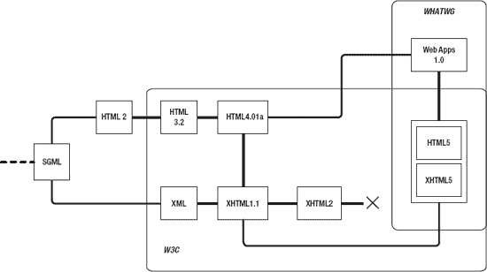

***图 1-1。HTML 错综复杂的演变。注意，HTML2 规范出现在 W3C 形成之前。***

#### html 5 的当前状态

> “规范永远不会完整，因为它在不断发展。”

WHATWG 常见问题

HTML5 做好了吗？不要。可以用了吗？没错。WHATWG 和 W3C 继续联合开发 HTML5 规范；然而，WHATWG 不再把它的规范称为 HTML5(你只是认为你在用你的脑袋去思考历史！).除了专注于编纂已经在实践中的东西之外，WHATWG 和 W3C HTML 工作组之间的另一个哲学差异是，WHATWG 将不再开发 HTML 的某个版本，该版本将在某个时候关闭以供进一步修订。W3C 将每个版本视为当前开发状态的“快照”,而 WHATWG 的目标是为 HTML 制定一个规范，并根据需要进行更新。这反映了开发依赖于特定 HTML 版本的特性的 web 应用的趋势，而是直接依赖于检查对特性的支持，而不管所使用的 HTML 规范的“版本”。

在 WHATWG 看来，W3C HTML5 规范(`[`w3.org/TR/html5/`](http://w3.org/TR/html5/)`)是 WHATWG 监管的“活规范”中最稳定特性的快照。这个规范简称为 HTML ( `http://whatwg.org/html/`)。HTML 规范被进一步嵌套为 web 应用 1.0 的子集(图 1-2 )，它包括与 HTML 分离的 Web 开发相关的规范，如 Web Workers(并发 JavaScript 线程)、Web Storage(用于在 Web 应用中存储数据)等。你可以在`[www.whatwg.org/specs/web-apps/current-work/complete.html](http://www.whatwg.org/specs/web-apps/current-work/complete.html)`查看完整的网络应用规范。

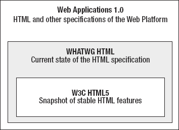

***图 1-2。**HTML/HTML 5 如何融合在一起*

这让我回到了 HTML 历史之旅的起点。HTML5 是什么？根据上下文:

> *   It is the latest version of HTML specification.
> *   It is a stable snapshot of the earlier version of the HTML specification.
> *   This is a label used to describe the contemporary state of open web technology.

就本书中提到的 HTML5 的含义而言，这里所涵盖的本质上是当前规范的快照。这意味着它可能领先于 W3C 的 HTML5 规范，但在本书付印时可能落后于 WHATWG 的“活规范”。这就是网络的本质。它在不断进化。对于本书所涵盖的内容，前面提到的第三点可能是最好的。这本书着眼于网络发展的当代状态。HTML5 是网络的新潮流，就像之前的 Web 2.0 一样。在适当的地方，相关的 API 和技术也包括在内，不管它们来自于什么样的规范，但是它们工作的总体框架是 HTML 的下一个版本——HTML 5！(或者你想怎么称呼它都行。)

### html 5 文档的剖析

既然您已经充分掌握了通向 HTML5 的道路，那么让我们来看一个简单的文档，这样您就可以看到事情是如何变化的。打开您喜欢的代码编辑器，创建一个新的 HTML 文件，将其另存为`index.html`，并键入以下内容:

`<!DOCTYPE html>
<html>
          <head>
                    <meta charset="utf-8" />
                    <title>HTML5 Apprentice</title>
          </head>
          <body>
                    
Hello World

          </body>
</html>`

惊喜！你会注意到这个文档不仅熟悉，而且比你以前见过的 HTML 更简单。很干净紧凑，是吧？好的，请随意在您的首选浏览器中打开它，看看文本 *Hello World* 是否真的会显示在您的页面上。如果你能说出前面代码中的每一个术语，请随意跳过下一节；否则，请继续阅读，复习基本的 HTML 术语和概念。

### HTML 术语和概念

为了避免混淆本文中所指的内容以及您可能在其他地方读到或听到的内容，了解一些基本术语和概念非常重要。使用正确的术语很重要，既可以避免混淆，也有助于自己和他人的理解。

HTML 文档由三个基本构件组成:元素、属性和文本(内容)。考虑以下用于创建链接的 HTML 代码片段:

`<a href="about.html">About Us</a>`

**元素**是`a`(代表*锚*)元素，它生成指向另一个 HTML 页面或其他资源的可点击链接。元素由两个**标签**组成:**开始标签** ( `<a>`)和**结束标签** ( `</a>`)，也称为开始和结束标签或开始和结束标签。**属性**是作为名称/值对出现在开始标记内的文本。最后，文本内容(在浏览器中查看该代码时出现在网页中)出现在开始和结束标签之间(参见图 1-3 )。

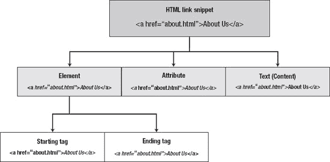

***图 1-3。**显示元素、属性、内容和标签的典型 HTML 片段的基本组件。*

#### 元素

元素是 HTML 中的*M*；它们是指示 web 浏览器如何处理某些内容的标记。每个元素都有一个关键字，比如`body`、`p`、`a`、`img`等等，这些关键字定义了它是什么(分别是主体元素、段落元素、锚元素和图像元素)。不同的元素定义了不同类型的行为，比如创建链接、嵌入图像等等。您可能听说过元素与标记同义，但是元素和标记的含义略有不同。标签是要素的*部分，如图图 1-5 所示。大多数元素由开始标签、一些内容和结束标签组成，但是根据标签的不同，这三个组件中的一个或多个可能会缺失。许多元素可以包含嵌套在其中的任意数量的其他元素，这些元素又由标记和内容组成。下面的例子显示了两个元素:`p`元素，它是从第一个开始尖括号(`<`)到最后一个结束尖括号(`>`)的所有内容，以及`em`元素，它包含开始`<em>`标记、结束`</em>`标记以及它们之间的内容。*

`
Here is some text, some of which is <em>emphasized</em>
`

请注意，`<em></em>`元素完全包含在`

`元素中；以任何其他方式嵌套它们都不是正确的语法，如下所示:

`
Here is some text, some of which is <em>emphasized
</em>`

内容内部没有明确的层次结构，当 web 浏览器决定如何显示这些文本时，这是一个问题。web 浏览器仍将分析并尝试显示此代码，但它不是符合 HTML 规范的代码。

##### 空元素

并非所有元素都包含文本内容。例如，`img`、`br`和`hr`元素分别将图像、新行和水平线插入页面。除了占用空间之外，他们不会修改页面上的某些内容。这样的元素不是容器元素——也就是说，你不用写`
some content
`或` some content `。相反，任何内容或格式都是通过属性值来处理的(将在下一节中解释)。在 HTML 中，空元素(也称为 **void** 元素)被简单地写成``、` `、`<meta>`或`
`，没有结束标记。在 HTML、XHTML 的 XML 形式中，一个空元素需要一个空格和一个尾随斜杠，像``、 1 ` `、`<meta />` 1 或者`
`；这些被称为**自动关闭**标签。由于 HTML5 灵活的语法，这两种形式都可以使用。我倾向于 XHTML 语法，因为斜杠的存在使标记是合并在一起的开始和结束标记变得更清楚。

#### 属性

属性出现在元素的开始标记中。一个特定的元素通常包含该元素特有的属性，以及对许多不同元素都有效的属性。它们用于在某些方面修改元素的行为。它们可以被认为是键/值配对，就像`key="value"`一样，其中一个特定的元素将有许多已定义的属性(键)，这些属性可以被设置为某个值。例如:

__________

实际上，img 和 meta 元素也有属性。

`<a href="contact.html">Here is some text that links to a contact page.
`

属性`href`出现在开始标记中，并被设置为一个定制值，该值改变 HTML 元素的行为。根据属性的不同，它可能包含多个空格分隔的值。您可能已经遇到过的其他属性可能包括`alt`、`src`和`title`，但是还有更多属性。与元素一样，HTML5 在编写属性时同时支持 HTML 和 XHTML 语法；在 HTML 语法中，它们不需要用引号括起来，所以`<a href=contact.html>`是可以接受的，但是，和元素一样，我相信 XHTML 语法更清楚，因为引号让你知道这个值是一个自定义值，就像你说过的话的引号。XHTML 语法清晰性的一个例外可能是它处理某些称为**布尔**属性的属性的方式。布尔属性仅根据它们在元素中的存在与否来提供效果。在 XHTML 中，要求每个属性都有一个值，它们的值要么留空，要么设置为与属性名相同的文本字符串。例如，`video`元素包含一个名为`autoplay`的属性；在 XHTML 语法中，这看起来像是`<video autoplay="">`或`<video autoplay="autoplay">`。然而，在更宽容的 HTML 语法中，这可以写成`<video autoplay>`。在这种情况下，HTML 格式更加清晰。既然 HTML5 支持这两种语法，那么用哪种方式写就看你自己了！

#### 家

安全地描述完元素、标签和属性之后，让我们把注意力转向另一个您应该知道的与 HTML 相关的概念:DOM。**文档对象模型** (DOM)是一个特别在讨论 JavaScript 与页面的关系时突然出现的术语，作为一名网页设计者/开发者，这是一个需要注意的重要术语。这是什么？这是将文档(在本例中是 HTML 页面)表示为由连接节点组成的树状数据结构的标准方式。节点表示页面中的元素、属性和文本内容。通过其分支的树状结构，DOM 描述了节点是如何相互嵌套的。

DOM 及其包含的节点在 JavaScript 中被表示为**对象**，这些对象描述了特定节点包含的内容和能够做的事情。使用 JavaScript，可以使用**点符号**遍历树结构来访问页面上的各个组件。如果您不熟悉点标记法，它只是意味着 DOM 树中嵌套在另一个节点中的一个节点可以通过其包含的节点(在此上下文中称为对象)来访问，方法是提供用句点分隔的节点(对象)名称。例如，HTML 页面在 DOM 中被表示为一个名为`document`的对象，它包含实际的 HTML 页面内容。由于 HTML 页面包含头部和主体，因此在`document`对象中有一个`head`和一个`body`对象。因此，要访问 HTML 页面的`body`元素，应该用 JavaScript 编写以下代码:`document.body`。这实际上不会做任何事情；从 JavaScript 中访问了`body`元素，但是没有以任何方式对其进行处理。重点是页面的结构由嵌套的对象表示，每个对象都可以用一个点(句点)来访问。

一旦深入到特定的 HTML 元素，命令就会变得更加通用，因为事先不知道特定页面上有哪些元素。JavaScript 包含许多命令，可用于访问 HTML 页面主体内的内容、动态更新内容、响应事件等等。例如，要访问页面上显示的第一个 HTML 元素，可以使用`document.body.firstElementChild`。要访问该元素的第一个属性，可以使用`document.body.firstElementChild.attributes[0]`。括号中的零只是指要访问的属性的编号；0 表示 HTML 元素中的第一个属性，1 表示第二个属性，依此类推。最后，要访问这个元素的内容，可以使用下面的代码:`document.body.firstElementChild.firstChild`。

图 1-4 显示了一个简单网页的结构，只有一个链接在主体区域。看这个图，你会注意到顶部有一个额外的对象，叫做`window`。虽然可以通过`document`对象访问 DOM，但是`document`实际上包含在这个`window`对象中，它表示包含页面内容的 web 浏览器窗口。从技术上讲，访问 DOM 首先要通过 `window`对象完成，它是“根”对象，通过它可以从 JavaScript 访问网页的所有其他方面。例如，访问页面的主体可以用`window.document.body`或`document.body`来完成(在这种情况下，引用开头的`window`是隐含的)。

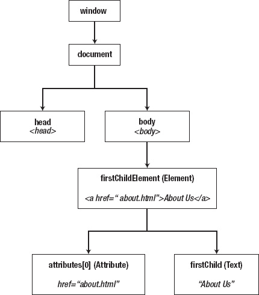

***图 1-4。**通过*

### HTML5 有什么新功能？

此时，您可能会问自己，“HTML5 到底有什么新功能？”首先，值得注意的是，HTML 最初被认为是一种表示文本文档的标记语言，而不是一个应用开发平台。然而，随着时间的推移，越来越多的功能被挤进了网络浏览器。在过去的十年中，HTML5 首先试图整合、记录和添加到语言中的特性。以下部分描述了一些主要变化。

#### 向后兼容

HTML5 在大多数情况下与以前的 HTML 语法和标记形式兼容。这怎么是新的？多年来，一种“基于标准”的 web 创作方法一直强调从 HTML 语法向 XHTML 语法的过渡。正如在历史部分中所讨论的，HTML5 已经将的重点从语法上“纯粹的”基于 XML 的方法移开，取而代之的是将重点转向已经在使用的实践的更好的文档化。

#### 错误处理

虽然网页作者可以用他们熟悉的任何方式编写文档，但是 HTML5 的一个主要变化是针对用户代理(网页浏览器制造商)，而不是作者。Web 浏览器试图呈现 HTML 代码，不管它看起来像什么。由于 HTML 在实践中的灵活性，代码的结构有时会不明确。在过去，web 浏览器制造商以不同的方式处理不明确的代码，并实现不同的算法来处理不明确的 HTML(称为**标签汤**)。这导致不同浏览器的外观不一致。解决这个问题的一个显而易见的方法是使语言更加严格，这样网页作者就被迫以某种方式组织他们的页面。这是 XHTML1 背后的思想和努力。*x*；然而，另一种方法是在浏览器实现者端标准化错误的处理方式。这就是 HTML5 寻求做的事情。它试图最终记录语法中的变化应该如何处理。Web 浏览器在处理解析错误时有两种选择:要么实现 HTML5 规范中指定的规则，要么在出现第一个错误时中止处理文档。这个想法是，不同的浏览器将一致地处理相同的错误，那些没有实现错误处理行为的浏览器将停止解析 HTML，从而通知作者他们的语法有问题。

显然，对于 web 开发人员来说，如果页面没有呈现出来，就很明显有问题，但是如果页面呈现得很好，即使浏览器正在处理一个错误，也不那么明显。在这种情况下，页面被处理，但是它被认为不符合 HTML5 规范。这就是为什么 web 开发人员熟悉 HTML 中的变化以及他们不应该使用的元素和属性是非常重要的(参见本章后面的“过时功能”一节)。然而，如果有疑问，可以使用一致性检查服务，比如`[`html5.validator.nu`](http://html5.validator.nu)`或`[`validator.w3.org`](http://validator.w3.org)`，根据 HTML5 规范检查提供的 HTML 代码。

#### 简化的文档类型

HTML 通常以 doctype 声明开始。在过去，这看起来像这样:

`<!DOCTYPE HTML PUBLIC "-//W3C//DTD HTML 4.01 Transitional//EN"
"http://www.w3.org/TR/html4/loose.dtd">`

或者

`<!DOCTYPE html PUBLIC "-//W3C//DTD XHTML 1.0 Strict//EN"
"http://www.w3.org/TR/xhtml1/DTD/xhtml1-strict.dtd">`

doctype 声明提供了一个指示，表明您将根据什么样的文档类型定义(DTD)来编写标记。DTD 基本上是一个详细描述标记的规则和语法的页面。所以，前面列出的两行代码的区别在于，它们为不同版本的(X)HTML 指定了 DTD，一个是 HTML 4.01，另一个是 XHTML 1.0。等一下！这预示着 HTML 的世界观将它分成不同的版本。因为我们讨论的是 HTML5，它与规范的以前版本向后兼容，所有需要做的就是说页面正在显示 HTML。因此，doctype 已简化为以下形式:

`<!DOCTYPE html>`

这对于文档类型的简化来说怎么样？这真是再简单不过了。嗯，实际上是可能的。它可能不存在，如果它被省略，您的 HTML 页面仍然会加载，但是不要从您的 web 页面中删除这一行！

HTML 中的文档类型有两个重要目的。首先，它们通知用户代理和验证器文档是针对什么 DTD 编写的。这个动作是被动的——也就是说，每次页面加载时，您的浏览器不会去下载 DTD 来检查您的标记是否有效；只有当您手动验证页面时，它才会生效。

第二个也是最重要的实际目的是，文档类型通知浏览器使用哪种解析算法来读取文档。Web 浏览器通常有三种解析 HTML 文档的方法:

> *   -No quirks (or "standard") mode
> *   -There are quirky patterns.
> *   -Limited quirk (or "almost standard") pattern

为了以一种模式呈现文档，浏览器依赖于 doctype 字符串的存在、不存在或值。这就是所谓的**文档类型切换**，它包含在浏览器中，作为一种决定如何呈现文档的方式。假设一个作者已经包含了一个 doctype，那么这个作者知道他或她在做什么，浏览器试图以一种严格的方式(换句话说，标准模式)解释严格的标记。缺少 doctype 会触发 quirks 模式，以旧的和不正确的方式呈现标记；这里的假设是，如果作者没有包含 doctype，那么他或她可能没有编写标准标记，因此标记将被视为过去为 buggier 浏览器编写的。触发无怪癖模式还是有限怪癖模式比较微妙，取决于所选择的文档类型以及查看文档的浏览器。

 **提示**您想让自己相信浏览器会根据文档类型的存在与否来切换解析模式吗？如果你在 Mozilla Firefox 4 中打开一个页面，并选择 Tools  Page Info，在 General 选项卡下你会看到一个呈现模式列表，显示当前用来查看页面的模式。如果您在 web 页面中添加和删除 doctype 声明，并在每个状态下检查页面信息，您将会看到浏览器正在触发不同的解析模式。或者，如果您熟悉 JavaScript，可以将以下脚本插入 HTML 页面的 head 部分:

``

加载页面时，会弹出一个“CSS1Compat”或“BackCompat”的窗口前者意味着模式被设置为无怪癖模式；后者意味着它被设置为怪癖模式。

关于 doctype 的最后一个注意事项:为了与生成 HTML 代码并因此要求 doctype 语法看起来更像以前的遗留系统兼容，下面的 HTML5 替代 doctype 声明是可接受的:

`<!DOCTYPE html SYSTEM "about:legacy-compat">`

这仅提供给产生 HTML 的系统，所以作为网页作者，你不太可能使用这种声明，除非你想给你的手指一个额外的锻炼，或者向你的朋友显示你是 HTML5 的最小细微差别的大师。

#### 简体字编码

你输入的 HTML 是文本，对吗？对你来说是的，但是对计算机来说它是以一系列的位来存储的:1 和 0。因此，一个特定的字符实际上是作为一个特定的二进制数存储的。阅读文本文档的计算机程序(如 web 浏览器)需要从根本上了解两件事:

> *   It should read text.
> *   The bits it reads are used to map to the representation of specific characters in the text.

这第二点被称为文档的**字符编码**。你可以把它想象成老式的电报交流系统，信息以莫尔斯电码的形式发送，然后被翻译成字母和单词。为了成功地使用莫尔斯电码传输文本，发送者和接收者都需要知道发送的点击是如何映射到特定的字母的。字符编码告诉计算机如何将它读取的位和字节翻译成字母，用于显示或其他目的。

HTML5 规范强烈建议所有 HTML 文档都有一个字符编码集。推荐的方法是让服务器在 *HTTP Content-Type* 头中将其作为响应头的一部分发送，但是如果这是不可能的，那么可以在 HTML 文档的头部分使用`meta` HTML 元素。网络上使用最广泛的字符编码系统是 UTF-8，它可以编码超过 100 万个字符，涵盖了世界上使用的大多数书面语言文字。

在 HTML 4.01 中，`meta`元素看起来像这样:

`<meta http-equiv="content-type" content="text/html; charset=UTF-8">`

为了向后兼容，HTML5 中仍然支持这一点，但是首选的语法更短，并且包括一个新的属性`charset`:

`<meta charset="UTF-8">`

啊，这更简洁了！请记住，如果您的服务器将字符编码作为其 HTTP 响应头的一部分发送，您根本不需要这样做。

#### 新增内容模型类别

一个**内容模型**用于指定特定 HTML 元素预期包含的内容种类。可以包含相同类型内容的不同 HTML 元素可以按类别分组。传统上，HTML 元素分为两类:块和内联。在 HTML5 中，这些已经显著扩展为七个主要类别:

> *   Metadata content
> *   Mobile content
> *   Sectional content
> *   Title content
> *   Wording content
> *   Embedded content
> *   Interactive content

block 类别大致对应于“流内容”，而 inline 类别对应于“语法内容”，以区分这个类别和 CSS 中使用的`display:inline;`属性。这些将在下一章进一步探讨。

#### 新元素

HTML5 引入了大量的新元素来帮助赋予网页结构更大的意义(语义)。像`header`、`nav`和`footer`这样的新元素分别描述了页面标题和徽标出现的位置、主导航菜单出现的位置以及版权和法律信息出现的位置。这标准化了使用元素(比如带有`id`属性的`div`元素)创建网页区域的常见实践。例如，以前页脚部分可能是这样创建的:

`
copyright 2011
`

使用新的 section 标记，可以重写如下:

`<footer>copyright 2011</footer>`

使用这些新的结构化标签更加清晰，并且标准化了这个标签的标识符，因为一个`id`属性可以由不同的作者写成“page-footer”、“thefooter”等等。“语义网”旨在提供机器可读的明确定义的内容，以便更好地进行数据挖掘/搜索。旧的格式使机器无法在几个不同的网页上一致地挑选出页脚，而 HTML5 语法使它完全可以预测——当然，假设作者实际上在他们网页的适当部分使用了页脚标签。

除了新的结构元素之外，web 表单中可用的元素类型也进行了重大升级，引入了用于输入日期、URL、电子邮件地址、电话号码等的新输入类型。还引入了许多用于嵌入式和交互式内容的新元素，比如`video`、`audio`和`canvas`(一个可脚本化的绘图表面)。现有元素也有变化，例如重新定义了`b`、`i`和`small`元素的含义(语义),使它们在本质上不再是表示性的。新元素和对现有元素的更改将在接下来的章节中更详细地探讨。

#### 微数据

这种新的添加基于注释 HTML 元素的思想，目的是将元数据添加到页面内容中，以便外部应用、聚合器和搜索引擎可以更容易地以标准化的方式处理这些内容。这个想法并不新鲜。微格式和 RDFa 是用于注释 HTML 的两种格式，但是 HTML5 引入了第三种格式:微数据(本身基于 RDFa)。微数据使用一组全局属性，这些属性可用于向页面上的内容添加额外的语义结构。

#### 嵌入式 MathML 和 SVG

数学标记语言(MathML)和可缩放矢量图形(SVG)都是基于 XML 的标记语言，其描述规范不同于 HTML。顾名思义，MathML 用于使用正确的数学符号描述和表示数学方程。SVG 用于描述交互式和静态(非交互式)矢量图形。这两种语言都不是新的，但是由于 HTML5 可能包含 XML 样式的语法，所以这两种语言都可以嵌入到常规的 HTML 页面中。这些将在附录 a 中进一步讨论。

#### API

本着为 web 应用开发创建平台的精神，HTML5 引入了许多脚本应用编程接口(API)。这些包括 JavaScript API 的附加功能，允许通过它们的类来选择元素。例如，使用数组语法，`class`属性设置为`aClass`的页面上的第一个元素可以通过 JavaScript 检索，如下所示:

`document.getElementsByClassName("aClass")[0]`

还添加了与新元素相关的 API，比如在新的`video`和`audio`元素中控制视频和音频播放的方法。添加的其他功能包括处理拖放用户交互、访问 web 浏览器历史状态，以及将网页数据存储在缓存中以供以后在脱机状态下检索。还有许多与 HTML5 一起工作的相关 API，但实际上属于不同的规范。这一类别中值得注意的一个是地理位置 API，它提供了一种在 web 上下文中处理位置数据的方法。后面的章节将更详细地探讨这些 API。

#### 不再符合 SGML(再次！)

坦白地说，你根本不可能注意到这种变化。最纯粹的 HTML 最初是从标准通用标记语言(SGML)发展而来的，SGML 是一种更古老的标记语言。然而，web 浏览器实现的 HTML 并不完全符合 SGML 规范，HTML5 只是将这一事实编成了法典。HTML5 的语法元素借鉴了 SGML、HTML 和 XHTML1。使它成为一种混合的语言，有自己独特的权利。

#### 过时的功能

HTML5 中有一个“第 22 条军规”,它必须与 HTML 的旧特性保持兼容，同时不鼓励使用某些不再被认为可以接受的元素。例如，HTML 包含某些本质上是表示性的标记，这意味着它对其内容的影响是以某种方式使其外观风格化(例如，`font`元素)。表示性标记早已被级联样式表(CSS)所取代，所以这些特性中的大部分已经被弃用。作者不应该再使用这些元素，即使它们仍然出现在 HTML 规范中。这些元素不是简单地从规范中删除，以便用户代理(web 浏览器)在遇到它们时知道如何处理它们(例如在较旧的网页中)；然而，这样的页面被认为是不符合要求的。web 浏览器将呈现它们，但是它们不符合当前的 HTML 规范。表 1-1 显示了过时元素及其替代品的清单。

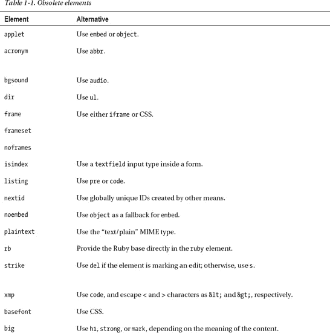

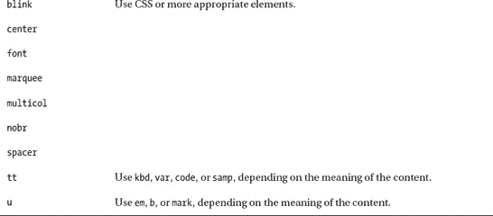

除了不推荐使用的元素之外，许多属性也被归档在 obsolete 下，许多属性本质上是表示性的，很容易使用 CSS 进行模拟。见表 1-2 中 HTML5 中已被标记为过时的属性列表。它们不应该被使用。

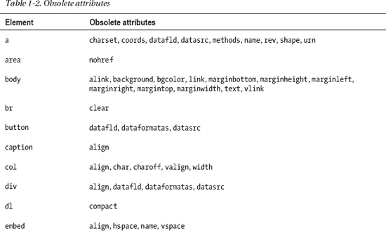

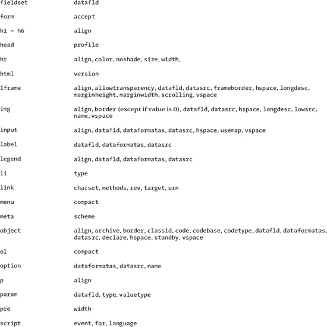

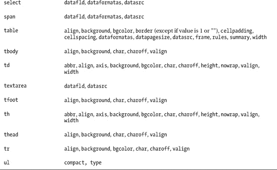

### XHTML 没了吗？

简单回答:不是。它现在被称为 XHTML5。然而，HTML5 规范规定，XHTML 不能再像 XHTML 1 那样使用 MIME 类型“text/html”。 *x* 。这成为现实的一个主要原因是 Internet Explorer 不会解析作为 XML 的页面，而是试图将页面下载到磁盘上，而不是显示它。然而，这不是唯一的原因。XML 的语法非常严格，最小的验证错误都会导致网页崩溃，变得不可用，整个世界都可以看到错误。因此，经常使用 XHTML 语法，但作为一种预防措施，还是以 HTML 的形式提供。

#### 关于哑剧类型的所有这些噪音是什么？

多用途互联网邮件扩展(MIME)类型，也称为**媒体类型**，告诉网页它正在接收哪种数据。显然，web 浏览器想要以非常不同的方式处理图像和文本文档，所以有办法告诉它发送的是什么类型的数据是很重要的。由于 XHTML 和 HTML 看起来非常相似，所以需要告诉 web 浏览器它正在处理哪一个。如果是 XHTML，就需要使用符合 XML 规范的 XML 解析器进行解析；如果是 HTML，它需要使用符合 HTML 规范的 HTML 解析器来解析它。

在我继续之前，让我澄清一下 XHTML 和 HTML 之间的主要区别。尽管 XHTML 和 HTML 有共同的词汇表，但它们在理论上有几个优于 HTML 的地方，包括:

> *   Ill-formed XHTML will be found immediately, because the browser will refuse to display the page, but will display an error instead.
> *   XHTML provides a well-formed 2 document.

但是，除非页面使用 MIME 类型为“application/xhtml+xml”或“application/xml”的 XHTML，否则上述两点都不成立。如果您的 web 服务器为您的 web 页面提供 MIME 类型的“text/html”，那么您就不能充分利用 XHTML。

### 在 HTML 和 XHTML 之间抉择

那么，应该用 HTML5 还是 XHTML5 呢？这取决于您的语法偏好，以及文档中格式良好的保证对您有多重要。XML 风格的语法仍然可以在 HTML 中使用，但是不要期望它有 XHTML 的含义，除非它是这样服务的。最终，这是一个完全取决于你自身情况的判断。只是不要错误地认为，通过将页面作为 XHTML，您已经完成了创建专业的、结构良好的、语义有意义的文档所需的所有工作。

### 网络浏览器支持

无论你使用哪种语法，让我们来看看你如何看待你的劳动成果。随着 HTML5 的特性变得稳定，在完美的世界中，它们有望出现在您首选的 web 浏览器的最新版本中。但是，您如何知道哪些特性实际上是受支持的，哪些是不受支持的呢？在你开发的浏览器中测试代码是最可靠的选择，但是也有一些网站，比如`[`caniuse.com`](http://caniuse.com)`可以让你知道你的首选浏览器支持什么。另一个站点`[`html5test.com`](http://html5test.com)`，检测用于访问该站点的浏览器中某些功能是否可用(图 1-5 )。使用不同的浏览器，您可能会看到不同的分数和摘要，突出显示并非所有功能都适用于所有主流浏览器。

__________

我应该指出“格式良好”并不意味着“有效”例如，具有属性 mymadeupattribute="true "的标记是格式良好的，但仍然无效。

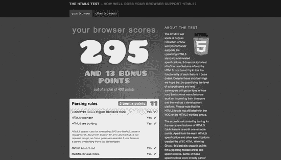

***图 1-5。*** `[`html5test.com`](http://html5test.com)` *谷歌 Chrome 11 的结果*

由于当前的 web 浏览器并不支持 HTML5 的所有特性，所以检测对任何不会正常失败的特性的支持是一个好主意。Modernizr ( `[`modernizr.com`](http://modernizr.com)`)是一个值得研究的 JavaScript 库。该库检测 HTML5(和 CSS3)特性的可用性，这些特性的存在与否作为布尔值存储在 Modernizr 库创建的 JavaScript 对象中。 3 这些值可以使用有条件的 JavaScript 代码来检查，如果特性存在就添加功能，否则，如果不存在就处理页面。例如，要检测是否支持`audio`元素，您可以在页面的 JavaScript 代码中编写以下内容:

`// Check Modernizr object for audio Boolean value of true
if (Modernizr.audio) {
        // Enable functionality on page for audio controls
}
else
{
    // Handle lack of audio element support on the page
}`

__________

如果你想了解更多关于创建检测 HTML5 特性的自定义方法，请查看马克·皮尔格拉姆在 http://diveintohtml5.org/detect.html[的精彩总结。](http://diveintohtml5.org/detect.html)

 **注** Paul Irish ( `[`paulirish.com`](http://paulirish.com)`)是 Modernizr 项目的首席开发人员，同时也是一个名为 HTML5 样板(`[`html5boilerplate.com`](http://html5boilerplate.com)`)的项目的首席开发人员，这个项目也值得一试。样板文件为 HTML5 web 项目提供了一个默认的基本模板。它包括 Modernizr 和 jQuery JavaScript 库，以及一个默认的网页结构和附加的 CSS 样式表。

### 网络浏览器开发工具

每个网络浏览器都使用被称为**布局引擎**的软件来解析 HTML 和 CSS，并将其呈现在屏幕上。不出所料，每种浏览器的功能通常都不同(尽管谷歌 Chrome 和苹果的 Safari 都使用 WebKit)，这解释了对 HTML5 功能支持的差异，即使是在不同浏览器的最新版本中。因为它们是不同的，所以最好有一个可靠的浏览器内开发工具来探索和操作 HTML/CSS。在这方面，每个浏览器都有一套帮助 web 开发的工具。通常，这些工具在启用时允许右键单击页面上的内容，并且上下文菜单中会出现“检查元素”或类似的选项。检查 HTML 元素将揭示它的结构和 CSS 样式，可以在浏览器中浏览和操作(非永久性的)。这些工具还具有某种“控制台”的特性，JavaScript 代码可以使用代码`console.log("message");`或类似代码记录命令。主要浏览器各自的布局引擎和开发工具列表见表 1-3 。

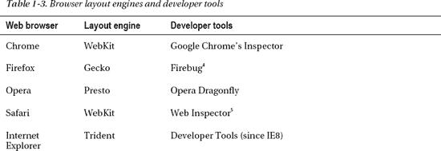

__________

访问 http://getfirebug.com 的 ?? 下载这个火狐扩展。

5 通过“开发”菜单启用，该菜单通过勾选首选项… 高级中的复选框启用。

### 总结

这是一条曲折的道路——经过多年的酝酿——现在我们迎来了 HTML5。越来越多的新功能正在 web 浏览器中出现，当然今天大部分功能都在这里供我们使用！现在，您已经了解了 HTML5 如何融入更大的画面，并探索了哪些发生了变化，哪些保持不变，是时候深入了解如何最有效地使用新功能的细节了。你只是触及了表面！