# 二、为正确的工作使用正确的标签

有了 HTML5，web 开发人员就有了更多的 HTML 元素来为他们的页面添加含义。引入了许多新元素来更精确地标记、定义和组织内容。理解何时何地使用 HTML 中的许多元素对于创建逻辑结构化、符合规范、语义丰富的网页是必不可少的。

本章将概述 HTML5 中可用的元素，包括新添加的和从 HTML 4.01 继承的元素。你可能会想，这可能是一项艰巨的任务！毕竟，有一个 800 多页的规范涵盖了所有这些内容(完整 WHATWG HTML 规范的当前长度，截至 2011 年 7 月)。为了更容易地处理这个长长的元素列表，我们将研究集合中的元素，并用单独的章节来进一步研究特别感兴趣的元素组。HTML 中的元素可以松散地分为以下几组:

> *   **Root element:** `html` element is independent because it is the only element that contains all other elements in the document.
> *   **Document metadata and script elements:** `head` elements contain metadata of documents, CSS styles and JavaScript in many cases.
> *   **Document subsection element:**  body element encapsulates the content of the page, and the new semantic subsection element defines the header, footer, article and other chapters on the page. These will be discussed in detail in Chapter 3.
> *   **Content grouping elements:** The content of a specific part of a webpage can be organized into paragraphs, lists, block references, charts, etc.
> *   **Text-level semantic elements:** A single text string can be marked with words or sentences to provide fine-grained control over the meaning of content, such as separating time, abbreviation and superscript from adjacent content, or providing emphasis, importance or other differences from ordinary prose. These will be discussed in detail in Chapter 3.
> *   **Table data elements:** Data suitable for display in the spreadsheet may be marked with rows and columns of `table` and related elements.
> *   **Form elements:** These elements include text fields, drop-down menus, check boxes and other elements for collecting user input in web forms. These will be discussed in detail in Chapter 4.
> *   **Embedded content elements:** These include external media embedded in web pages, such as video, audio, bitmap drawing surface or third-party plug-ins, such as Adobe Flash content. These will be discussed in detail in of Chapter 5\.
> *   **Interactive elements:** These include inherent interactive elements that do not require further scripts.

在深入这些组之前，我们将讨论适用于所有元素的两个方面:适用于所有 HTML 元素的全局属性和“内容模型类别”，这是 HTML 规范用来对元素进行相互分类的经常重叠的分组。我们开始吧！

### 全局属性

熟悉所有 HTML 元素上的属性(表 2-1 )为利用 HTML 中可用的核心功能提供了强大的工具，例如与 CSS 和 JavaScript 的集成，以及新的编辑和拖放 API。

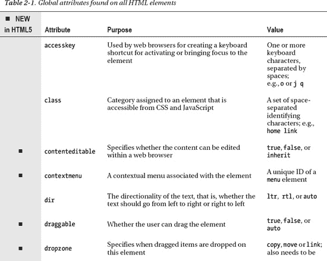

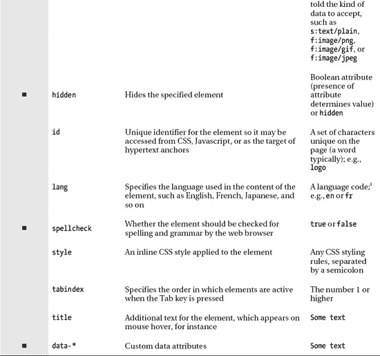

__________

语言代码列表见 www.iana.org/assignments/language-subtag-registry；显示的“子标签”是您将使用的标签。

 **注意**当使用微数据时，有一组额外的全局属性适用，这允许向页面上的元素添加额外的标记，以使搜索引擎算法等机器更容易解析和使用内容。微数据将在本书后面讨论。

#### 无障碍

`accesskey`和`tabindex`属性提供了使用键盘访问页面上的元素，这对于行动不便的用户可能很有帮助。当在一个元素上设置时，`accesskey`属性允许在键盘上按下一个(或多个)键来激活该元素。例如，它可以用于使用键盘跟踪超链接。不幸的是，这种可访问性的优势也有不利的一面。通常需要键盘组合来激活访问键，例如同时按下 Ctrl 或 Alt 键和 set 访问键。具体使用哪种键盘组合因浏览器和操作系统而异，降低了该功能的实用性。此外，所使用的键盘组合可能会干扰现有的键盘快捷键，最严重的是屏幕阅读器为视力受损的 web 用户使用的快捷键。最后，在一个元素上设置多个访问键(如果从两种类型的设备上查看网站，这可能会有所帮助)并没有得到广泛的浏览器支持。所有这些因素使得使用访问键相当令人沮丧。

在我们继续之前，最后一点需要注意的是——Opera Software 的 Opera 网络浏览器在访问键方面提供了一个很好的特性。通过同时按下 Shift 键和 Esc 键，在 web 浏览器窗口上弹出一个菜单，显示页面上所有可用的访问键以及它们链接到的位置(如果在锚元素上设置了属性；否则显示“空”)。参见图 2-1 的示例。

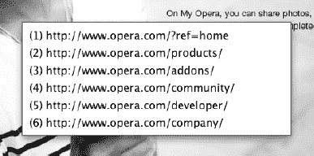

***图 2-1。** Opera 网络浏览器显示访问密钥和公司主页上的相关链接*

下一个属性`tabindex`，可能更有用。在网页上重复按下键盘上的 Tab 键，您会看到不同的页面元素变得突出显示。这是使用键盘访问网页元素的一种常见方式，在填写 web 表单时可能特别熟悉。当在许多不同的元素上设置`tabindex`属性时(从 1 开始并在每个元素上递增 1)，该属性确定按 Tab 键在不同元素间移动的顺序，首先访问较小的数字，例如:

`<ul>
    <li><a href="first.html" tabindex="1">First Item Active</a>
    <li><a href="third.html" tabindex="3">Third Item Active</a>
    <li><a href="second.html" tabindex="2">Second Item Active</a>
</ul>`

当按下 Tab 键时，列表中的第一项将被激活，接着是最后一项，最后是中间项。显然，在这样的列表中，让它们以与列表相同的顺序激活会更有可用性，但是这演示了如何使用`tabindex`定制顺序。

#### 元数据

属性为一个元素提供咨询信息。当鼠标悬停在链接、表单输入字段、缩写或首字母缩略词上时，通常会以工具提示的形式出现。这里有一个例子:

`<a href="http://w3.org" title="World Wide Web Consortium">W3C</a>`

当鼠标悬停在链接文本“W3C”上时，将显示一个显示“万维网联盟”的工具提示(图 2-2 )。

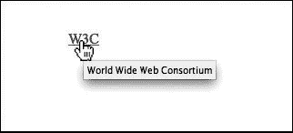

***图 2-2。**链接上设置的`title`属性的工具提示效果*

下一个属性`lang`指定元素中的文本用什么语言编写。一些元素使用它来根据语言脚本的不同呈现不同的文本，例如使用的引号类型。例如，网页顶部的以下代码片段将指定整个 HTML 页面是用英语编写的:

`<html lang="en">`

最后，`contextmenu`属性是在 HTML5 中添加的，但是在撰写本文时还没有在任何发布的主流浏览器中实现。其思想是通过将元素的`contextmenu`设置为菜单的`id`属性，可以将`menu`元素与特定元素相关联并显示。要进一步了解它是如何工作的，您必须等待浏览器跟上规范的步伐！

#### 识别

`id`属性用于为页面上的特定元素分配一个惟一的标识符，随后可以使用 CSS 或 JavaScript 进行访问，以用于样式或脚本目的。 2 这是一个惟一的名称，可以分配给 HTML 元素之一，然后可以用它来引用该元素。属性的使用方式类似；然而，与`id`属性不同，同一个类值可以应用于页面上的多个元素，目的是指定它们有一些共同点(比如特定的 CSS 样式)。总而言之，`id`和`class`属性之间的主要区别如下:

__________

id 属性也可以作为超链接的目标。在第三章的“超链接”一节中讨论了如何使用 id 属性。

*   `id`
    *   该值可能出现一次，并且每页仅出现一次*和*，以便标识单个元素。
*   `class`
    *   该值可能每页出现多次。
    *   一个特定的`class`属性值可能包含多个类名，每个类名之间用空格隔开。

为了说明这些差异，请考虑下面的代码片段:

`
`

该代码包含`about-text`的唯一`id`属性和两个类:`homepage`和`popup`。`about-text`的`id`属性不能在其他地方使用，而`homepage`和`popup`都可以在其他元素上使用。注意，元素不需要同时被分配一个`id`属性和一个`class`属性；他们可以有其中之一，或者都没有。此外，为了避免问题，不要以数字开始`id`或`class`属性，并且绝对不要在名称中包含空格(使用破折号或下划线代替)。

**合理的 ID 和类值**

基于您希望元素看起来如何而不是它是什么来赋值可能很有诱惑力，但是最好避免这样做。例如，代替这样的值:

`
 <strong class="redText"> 
`

您应该使用如下值:

`
 <strong class="important"> 
`

为什么呢？仅仅是因为有一天你可能会发现你需要那个`strong`元素是蓝色的而不是红色的，或者你可能想把这个内容框从页面的顶部移到底部——当这种情况发生时，你的`id`或`class`值将会产生误导。

这两个属性在 web 开发中被广泛使用，所以您必须熟悉它们。我们将在适当的地方使用 CSS 和 JavaScript 来说明 HTML5 的特性，但是简单地说，如果您想从 CSS 中引用这些属性值并设置样式，您可以键入值，然后在 id 前面加上一个散列符号(`#`)和一个句点(`.`)，就像这样:

`#about-text { background: blue; }
.homepage { color: white; }`

为了从 JavaScript 中引用这些属性值，您通常会在 JavaScript 中使用命令`document.getElementById("about-text")`，其中`about-text`被替换为您想要访问的元素的实际 ID。类似的命令可用于检索具有特定类值的所有元素:`document.getElementsByClassName("homepage")`(其中`homepage`被替换为您所引用的类值)。

#### 可编辑性

在新的编辑 API 中使用了`contenteditable`属性，这和 HTML 标准中的一样新。编辑 API 允许对页面内容进行页面内编辑，自从 2000 年 Internet Explorer 引入以来，它就有了属性`contenteditable`,但直到现在才把该属性纳入 HTML 规范。这个想法是允许编辑 HTML 的元素，以便可以更容易地创建用于 web 表单等的富文本编辑器(例如，使用 web 应用接口为博客条目创建标记文本) 3 。

#### 拼写检查

顾名思义，`spellcheck`属性用于指定一个元素是否应该进行拼写检查。Web 浏览器通常具有拼写检查功能，例如，当用户在 web 表单的输入字段中键入内容时，该功能会检查拼写和语法错误。有时，最好在页面的某些元素上禁用这种拼写检查功能。例如，您可能不想检查输入到 web 表单中的电子邮件地址的拼写错误，因此可以使用`spellcheck`属性通知浏览器忽略电子邮件地址表单输入控件。`spellcheck`属性的值是`true`或`false`(或者一个空的文本字符串`""`，它映射到 true 状态)。自然，这非常适合可以编辑的内容。

#### 隐藏元素

`hidden`属性，用于隐藏和显示 HTML 元素。这相当于使用 CSS 属性和值`display:none`。虽然使用 CSS 隐藏元素是一种常见的做法，但实际上 HTML5 规范不鼓励使用`hidden`属性。`hidden`属性为受影响的元素添加了额外的语义。它的存在意味着该元素此时不相关。这可以被屏幕阅读器使用，例如，它可以忽略通过 CSS 显示规则应用的任何隐藏。

下面的 HTML 和 JavaScript 代码片段展示了如何使用`hidden`属性来显示和隐藏内容。HTML 部分显示了一个定义列表，其中包含一只狐狸的通用名和它的拉丁名:

`<dl id="fox">
    <dt>Red Fox</dt>
    <dd id="latin" hidden>Vulpes vulpes</dd>
</dl>`

JavaScript 部分添加了在滚动或关闭红狐的拉丁名称时显示和隐藏其拉丁名称的功能。因为`hidden`属性是一个布尔属性，所以可以使用 JavaScript 将其设置为`true`或`false`，这将导致显示和隐藏相关元素:

`function toggleLatin(){
    var entry = document.getElementById("fox");` `    var latin = document.getElementById("latin");
    entry.onmouseover = function(){
        latin.hidden = false;
    };
    entry.onmouseout = function(){
        latin.hidden = true;
    };
}
window.onload = toggleLatin;`

__________

关于使用 contenteditable 的示例，请参考附录 A 中的“网络存储”部分。

#### 拖放

与文档相反，`draggable`和`dropzone`属性是真正体现 HTML 向构建应用方向发展的两个属性。这些需要一些设置和 JavaScript 集成(我们将在第七章中讨论)，但当功能正常时，这些属性允许 HTML 元素从页面的一部分拖放到另一个元素上(尽管正如你将看到的，你可能只会使用`draggable`来实现这一点，因为`dropzone`还没有获得太多的浏览器支持)。接下来发生的事情由 JavaScript 事件控制。

#### 风格

属性提供了一种将 CSS 样式直接应用于元素的方法。以这种方式应用的任何样式都将覆盖元素上其他位置设置的样式。尽管这可以提供一种将样式应用于元素的快速方法，但是最好完全避免该属性，并在外部样式表中为您的页面提供样式。在你的网站中清晰的区分 CSS 和 HTML 代码提供了组织和灵活性的优势，因为当 CSS 规则包含在一个 CSS 文件中时，查找和禁用 CSS 规则要容易得多，而不是分散在 CSS 和 HTML 之间。

#### 文本方向性

`dir`属性控制文本的流向。文本通常从左向右流动，但是如果使用一种向相反方向流动的语言，例如阿拉伯语，文本也需要向那个方向流动。`dir`属性提供了这种能力。如果整个块使用从右到左语言，则在容器元素上使用“rtl”值表示从右到左语言，使用“ltr”值表示从左到右语言，这将翻转文本和标点符号的对齐方式:

`
When rendered by a browser, this paragraph will appear aligned to the right.

While this paragraph will not because it lacks a <code>dir</code> attribute.
`

也可以给定值“auto ”,它试图根据包含的文本自动确定文本方向。

 **注意**CSS`direction`属性提供了相同的功能，并接受值`inherit`、`ltr`和`rtl`。然而，这个 CSS 应该<ins>而不是</ins>被使用，因为这个信息应该被嵌入到页面本身，这样即使相关的样式表被禁用，文本内容的方向性仍然可以被确定。

#### 自定义数据

`data-*`属性有点奇怪。它是属性的总称，允许添加任何属性名称，以便在 HTML 元素中存储自定义数据，供 JavaScript 应用等使用。属性名中的`*`不是实际完成的属性；可以用任何文本替换它来创建自定义属性。例如，可以添加`city`来创建属性`data-city`。或者可以添加`score`来创建`data-score`，它可能被用在一个网页上列出一个游戏的高分。以下面的 HTML 代码片段为例:

`<button id="show-score-button">Show Scores</button>
<ul>
        <li data-score="3200">Top Blaster Tom</li>
        <li data-score="2250">Middle Range Merv</li>
        <li data-score="1100">Last Pop Louis</li>
</ul>`

然后可以编写一个 JavaScript 函数，在单击按钮时用获胜分数替换用户名:

`function showScore(){
    document.getElementById("show-score-button").onclick = function(){
        var entries = document.getElementsByTagName("li");
        entries[0].innerHTML = entries[0].dataset["score"];
        entries[1].innerHTML = entries[1].dataset["score"];
        entries[2].innerHTML = entries[2].dataset["score"];
    }
}
window.onload = showScore;`

 **注意**前面代码中的`dataset`属性允许以键/值对的形式访问`data-*`属性。但是，只需要属性的自定义部分，所以在数据集中查找属性`score`，而不是`data-score`。

这允许在单个元素中存储的内容有很大的灵活性，但同时又受到特定规范的支持。多么矛盾！这样做的目的是，这些属性只在特定的站点内使用，而不会被网站域外的软件所利用。在这种情况下，请谨慎使用这些方法，并且只有在绝对没有其他解决方案可行的情况下才使用！

### 内容模型类别

如第一章所述，最初，HTML 中的元素大致可以分为两类:块内和行内。一个类别或另一个类别的**内容模型**定义了什么样的内容可以放在特定的元素中。例如，行内元素不能包含块元素。随着 HTML5 的发展，这两种类型的内容不足以描述可用 HTML 元素的行为。WHATWG 取代了 block 和 inline，加入了一个更大的类别集， 4 ，这些类别根据相似的特征对元素进行分组。每个类别中的元素都有相似的内容模型，并且必须遵守定义内容类型的规则。现在有七个主要类别，列于表 2-2 。

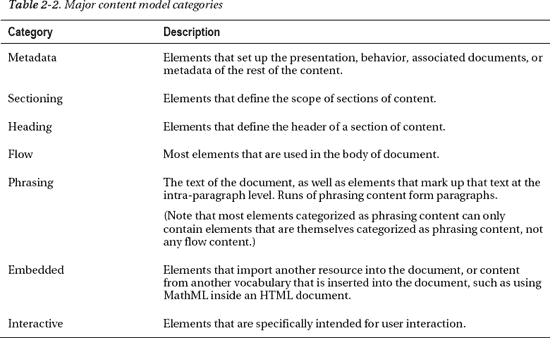

即使这七个类别也不能完全涵盖所有情况下的所有要素。例如，一个元素可能不属于这些类别中的任何一个(例如`html`元素)，或者可能被称为**透明的**，这意味着它继承了其父元素的类别。许多元素属于不止一个类别，在这种情况下，它们被称为具有**混合**内容模型。

__________

参见 http://blog.whatwg.org/content-model-overhaul 了解这一变化背后的动力。

 **注意**实际上还有另外七个小类别，它们将特定上下文场景中的元素进行分组，比如当它们是表单的一部分时。要查看其他类别，请在`[`dev.w3.org/html5/spec-author-view/index.html#element-content-categories`](http://dev.w3.org/html5/spec-author-view/index.html#element-content-categories)`或`[`whatwg.org/specs/web-apps/current-work/#element-content-categories`](http://whatwg.org/specs/web-apps/current-work/#element-content-categories)`浏览 HTML 规范中的类别参考。

### 根元素

要开始研究 HTML 中的元素，从开始看是有意义的——嗯，差不多是从开始看。我们在前一章讨论了 doctype 声明，它是 HTML 文档中出现的第一个元素。然而，跟在 doctype 声明后面的是`html`元素，它作为包含文档中所有其他 HTML 元素的元素，也称为**根元素**。

根元素是标签可选的少数元素之一(见表 2-3 中包含可选标签的其他元素列表)。虽然标签可能是可选的，但元素不会被省略。如果省略了可选元素，它们将被隐含(元素`body`是一个例外，如果没有提供页面内容，它将被省略)。例如，下面是一个完全有效的 HTML5 文档:

`<!DOCTYPE html><title>Tiny HTML5</title>
This is a valid HTML5 page!`

在这种情况下，解析文档时会添加缺少的`html`、`head`、`body`和`p`元素的标签。如果不包含 doctype 声明，它甚至可以更短，但这将在 web 浏览器中触发 quirks 模式(关于 quirks 模式的讨论，请参考第一章中的 doctype 部分)。

 **注意**要根据当前的 HTML5 规范检查文档的有效性，请访问`[`html5.validator.nu`](http://html5.validator.nu)`或`[`validator.w3.org`](http://validator.w3.org)`，这两个网站都提供基于网络的服务，可以验证提供的网站 URL、上传的 HTML 文件或直接输入 HTML。对于 W3C 中的验证器，请确保将验证器下拉菜单中的文档类型设置为“HTML5(实验)”以确保根据最新的规范进行检查。

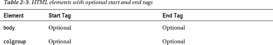

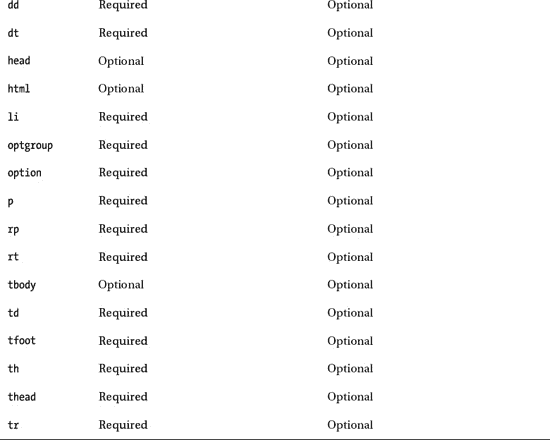

尽管前面的代码片段很容易激怒那些热衷于 XHTML 的朋友，但是为了清楚起见，包含可选的标记仍然是一个好主意。虽然 HTML5 可能看起来像是从 20 世纪带回了编码实践，但重要的是要记住，它记录的是实践中使用的内容，而不一定是最佳实践。

#### html 元素的属性

除了全局属性之外，`html`元素还有一个新属性，`manifest`，用于创建离线应用的新 API 中。当您利用这个属性时，web 应用的基本功能组件(例如 JavaScript)可以缓存在浏览器中，这样当用户离线并重新加载页面时，页面仍然可以运行。

 **注意**`html`元素还有一个属性`xmlns`，用于声明 XML 名称空间，它描述了正在使用的标记语言。这个属性应该出现在有效的 XHTML 文档中。它只有一个支持的值，文本`[`www.w3.org/1999/xhtml`](http://www.w3.org/1999/xhtml)`。它只适用于 XHTML，在 HTML 中没有任何意义，除了在可能跨越 HTML 和 XHTML 的文档中使两者之间的转换更容易。

### 记录元数据和脚本元素

在开始根标签`html`之后，出现`head`元素的开始标签，它包含文档元数据元素，这些元数据元素指定诸如文档在浏览器窗口中出现时的标题、页面上元素的默认 URL 地址、字符编码信息以及链接和嵌入的 CSS 样式表(如果使用的话)之类的页面属性。表 2-4 列出了相关元素及其内容模型类别。

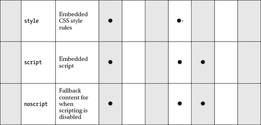

__________

5 仅当 itemprop 属性存在时才适合流内容类别，这是 HTML5 中可用的微数据规范的一部分。

6 像`meta`元素一样，只有当`itemprop`属性存在时，link 元素才适合流和短语内容类别。

#### 网页信息:标题和元数据

如前面展示的最小 HTML5 示例所示，`title`是 head 部分中唯一的强制元素。开始和结束`title`标签之间的文本将显示在浏览器窗口标题栏中。文档标题是文档中一个经常被忽视的区域；你肯定见过标题为“无标题文档”的页面。这是不幸的，因为如果给予适当的关注，文档标题可以为您和您的用户提供许多好处:

> *   **Better search engine ranking.** Search engines will consider the page title when determining the relevance of your webpage to a specific topic and when determining the content displayed on the search results page.
> 
> **更好的方便。如果你的用户给页面添加书签，默认情况下，页面标题将被用作书签名称。*   **Better usability.** Identifying websites and pages in the same location helps to identify the association between specific pages and specific websites. For example, "Semantic Web W3C" is the title of the main semantic web page on the website of the World Wide Web Consortium, which clearly identifies the theme of the web page and the website to which it belongs.**

 ** **注意**以网页中有意义的标题的重要性为例，试着打开几个“无标题文档”窗口，然后在最小化它们后在它们之间切换——在切换之前你能分辨出哪个是哪个吗？或者尝试在单个 web 浏览器窗口中打开与选项卡相同的页面。你能一眼看出哪一页是哪一页吗？

还要注意，如果网站名称包含在标题中，网站名称应该出现在页面主题标题之后。当公司或网站名称放在实际页面标题之前时，也会出现类似的问题，因为如果标题太长而无法在最小化时或在选项卡中显示，则可能会从右向左裁剪，导致实际页面主题标题从视图中被裁剪。

__________

只有当`scoped`属性存在时， 7 才符合流内容类别。

##### 元元素

前一章介绍了常用于设置页面字符编码的`meta`元素，但它也常用于设置一系列元数据信息和指令的键/值对。例如，它可以用于定义网页的概要描述，或者用于为页面上的内容定义一组关键字。在键/值配对中创建“键”时，`meta`元素使用两个属性之一，`http-equiv`或`name`，而“值”部分使用`content`属性来设置。这里有一个例子:

`<!-- defines a set of keywords for the page's content -->
<meta name="keywords" content="html5, css, javascript, semantic web, web apps"/>

<!-- refreshes the page every 15 seconds -->
<meta http-equiv="refresh" content="15" />`

 **注**历史上，搜索引擎使用关键词，但今天许多人不使用它们，因为它很容易误导依赖于这一特征的搜索引擎，以发送垃圾搜索结果。但是，如果使用得当，包含它们并没有什么害处，尽管更新关键字以反映频繁编辑的文档中的内容变化是很重要的，这可能会产生额外的维护步骤，而没有实质性的好处。选择权在你！

`http-equiv`属性的一些用途(称为 **pragma 指令**)提供了设置 cookies、指定字符编码等任务，这些任务对于现有的更好的方法来说是多余的。因此，HTML5 规范中不推荐几个值。具体来说，`content-language`和`set-cookie`指令是不符合标准的，不应该使用(`lang`属性应该用于设置内容的语言，真正的 HTTP 头应该用于设置 cookies)。HTML5 规范中的其他官方 pragma 指令是`content-type`，它是`charset`属性的另一种形式；`default-style`，用于设置页面的默认 CSS 样式表(在第六章中解释)；和`refresh`，它在几秒钟后刷新或重定向页面，如前面的代码示例所示。

 **注意**为了在暂停后重定向页面，在使用`refresh` pragma 指令时，URL 被添加到`content`属性中。经过指定的秒数后，页面被重定向到 URL。重定向看起来像这样:

`<meta http-equiv="refresh" content="3; URL=homepage.html">`.

为`http-equiv`和`name`属性建议的值的完整列表很大，所以您最好参考一些资源，比如分别位于`[`wiki.whatwg.org/wiki/PragmaExtensions`](http://wiki.whatwg.org/wiki/PragmaExtensions)`和`[`wiki.whatwg.org/wiki/MetaExtensions`](http://wiki.whatwg.org/wiki/MetaExtensions)`的 WHATWG PragmaExtensions 和 MetaExtensions wikis。除了这些网址上列出的值之外，HTML5 规范还包含了`application-name`作为`name`属性的值。该值允许为 web 应用(不是标准的 web 页面，而是添加了脚本功能的实际 web 应用)指定一个标题，该标题可以被视为独立于页面标题或对页面标题的补充(使用`title`元素设置)。这是因为在使用应用来反映正在发生的操作(如加载附加内容等)时，页面标题可能会发生变化。

 **注意**可能更有用的是元名关键字`robots`，它指导网络爬虫(谷歌和其他公司用来索引网页的自动程序)如何索引页面。关于这个名称值和其他值的信息可以在前面提到的 WHATWG 元扩展 wiki 的`[`wiki.whatwg.org/wiki/MetaExtensions`](http://wiki.whatwg.org/wiki/MetaExtensions)`上找到。

#### 链接、样式和资源:基础、链接和样式

每个文档只能使用一个`base`元素。它应该出现在任何其他属性中包含 URL 的元素之前。这个想法是，`base`元素可以防止在整个页面中添加链接时重复输入相同的根 URL。它的两个属性，`href`和`target`，指定了要使用的 URL 和默认目标(如果适用)。`target`告诉，例如，一个链接是在一个新窗口还是在同一个窗口打开。例如，如果这出现在 head 部分中:

`<base href="http://example.com/portfolio/" target="_blank" />`

这出现在正文部分:

`<a href="photographs.html">Photography</a>`

然后单击该链接将打开一个新的浏览器窗口，并将用户连接到 URL `[`example.com/portfolio/photographs.html`](http://example.com/portfolio/photographs.html)`。

##### 链接元素

`link`元素具有属性`href`、`rel`、`media`、`hreflang`、`type`和`sizes`，以及全局属性。其中，至少`href`和`rel`是共同设定的。`href`指定链接资源的地址(URL ),而`rel`指定资源的*类型*。以下代码是您最有可能使用该元素的方式，因为它通常用于将样式表链接到您的页面:

`<link rel="stylesheet" href="main.css" type="text/css" />`

然而，`rel`属性可以用来提供关于页面的附加相关信息。这个属性的本质可能有点难以理解，所以让我们考虑一个例子。除了样式表之外，当使用`link`元素引用网页头部的 RSS 提要时，您可能已经遇到过`rel`，就像这样:

`<link rel="alternate" href="http://example.com/feed/" type="application/rss+xml" />`

前面的代码意味着“这个文档的另一个版本存在于`[`example.com/feed/`](http://example.com/feed/)`”，用户代理可以发现并找到 RSS 提要——大多数现代浏览器都会在浏览器地址栏中显示一个提要图标，允许用户选择、查看和订阅提要。

如果替代版本是翻译版本，那么`alternate`值也可以与`hreflang`属性一起使用。如果替代版本是为不同的媒体设计的，它也可以和`media`属性一起使用。 8 它也可以和`type`属性一起使用，表示链接的文档是不同文件格式的页面版本，比如页面的 PDF 版本。例如，一个链接引用了一个可打印的 PDF 版本的文档，该文档也是法语的，可能如下所示:

`<link rel="alternate" href="alt-fr.pdf" type="application/pdf"?hreflang="fr" media="print"
title="French version PDF for printing" />`

HTML 规范为`rel`属性列出了十几个预定义的类型(表 2-5 )。

__________

8 媒体属性有`screen, tty, tv, projection, handheld, print, braille, aural,`和`all`等多个有效值，分别针对电脑屏幕、终端、电视、投影仪、手持设备、打印页面、盲文触觉反馈设备、语音合成器以及以上所有设备。其中，您最有可能使用屏幕和打印，也可能使用手持设备。Opera 在全屏模式下使用投影，所以如果您已经为主样式表指定了一种屏幕类型，您可能需要考虑包含投影:`<link media="screen, projection" ... />`。

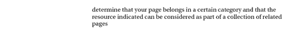

属性指定了被链接资源的 MIME 类型。它纯粹是对浏览器的建议(例如，用户代理不会仅仅依赖这里指定的值来确定资源类型)，并且可以在样式表中省略，因为它们是在`link`元素中最常见的文件类型。

##### 样式元素

`style`元素允许将 CSS 样式规则直接嵌入到 HTML 文档中，这可能是在创建页面时添加样式规则的一种快捷方便的方式，但是与全局`style`属性一样，文档的 CSS 样式最好通过使用`link`元素将外部样式表链接到页面来提供。一个新的属性是`scoped`属性，它(理论上)允许将一个通用的 CSS 应用于一个特定的 HTML 块。然而，在撰写本文时，主流 web 浏览器的当前版本不支持该属性。

#### 添加行为和回退:脚本和 noscript

`script`元素类似于`style`和`link`元素的组合，因为它支持直接在 HTML 文档中编写嵌入式客户端 JavaScript 代码*或*允许将脚本作为外部文件加载。与 CSS 一样，除非不可避免地要在 HTML 中嵌入代码，否则最好将 JavaScript 放在加载的外部文件中，如下所示:

``

前面的代码片段显示了链接到外部 JavaScript 文件时`script`元素的一般外观(在本例中，该文件名为`menu.js`，位于名为`js`的目录中)。请注意，在外部脚本中链接时，元素的开始和结束标记之间不应包含任何内容。

HTML5 定义了一个名为`async`的新属性，它与另一个属性`defer`结合使用，可以用来控制何时解析外部加载的脚本。这两个属性都是布尔属性，因此它们的存在和缺失会以各种方式影响外部脚本的加载(表 2-6 )。

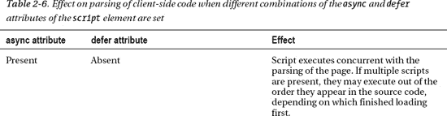

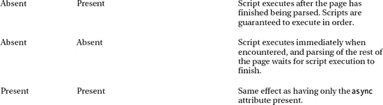

脚本:在顶部还是在底部？

需要注意的是，`script`和`style`元素不需要出现在 HTML 文档的头部；事实上，雅虎！Developer Network 公布了 35 个提高性能的最佳实践，指出`script`元素应该放在网页的底部(见`[`developer.yahoo.com/performance/rules.html`](http://developer.yahoo.com/performance/rules.html)`)。(相反，`style`元素应该出现在顶部的头部区域。)此外，第一章中提到的 HTML5 样板文件(`[`html5boilerplate.com`](http://html5boilerplate.com)`)将所有脚本(除了 Modernizr，因为它更早就需要)放在页面底部，在结束的`</body>`标签之前。可以说，这种做法虽然提高了性能，但存在语义问题，因为它将关于页面的元数据移到了正文区域，而不是它所属的头部。理想情况下，随着`async`和`defer`属性获得更广泛的支持，`script`元素在页面中的位置将成为一个争论点。

最后，`noscript`元素用于显示周围的内容，只有在浏览器禁用或不支持脚本时才会显示。如果`noscript`元素放在文档的头部，那么它只能包含`link`、`style`和`meta`元素；否则，如果它在主体中，它可以包含所有会出现在`body`元素中的正常元素，除了另一个`noscript`元素。还值得注意的是，`noscript`元素的语法只适用于 HTML 文档，对 XHTML 文档没有影响。`noscript`是 W3C 推动 XHTML 时前途未卜的元素之一，它保留了一点处理禁用脚本的粗糙和肮脏的名声。更好的方法是编写一个脚本，将页面内容从静态动态转换，因为即使启用了脚本，脚本也可能失败，在这种情况下，`noscript`中的内容不会显示出来。例如，考虑下面的代码(为了简洁起见，它嵌入在 HTML 中):

`

    
Script disabled

    

`

一个段落(其`id`被设置为`fall-back`)具有一些默认的静态内容。接下来是一个`script`元素，它删除了默认的 HTML，并用一个按钮来代替，这个按钮具有点击时显示警告框的功能。这样做的好处是，不仅为将静态页面转换成动态页面提供了更细粒度的控制，而且这也适用于 XHTML。

### 记录切片元素

在结束的`head`标签之后是开始的`body`标签，它可以包含任何非头部特定的标记，通常是预期出现在 web 浏览器窗口内容区域的内容:段落、列表、图像等等。`body`标签传统上有几个表示属性:`background`、`text`、`link`、`vlink`和`alink`，分别用于设置文档的背景颜色、文本颜色、链接颜色、已访问链接颜色和活动链接颜色。所有这些属性在 HTML 4.01 中都被贬低了，在 HTML5 中已经被标记为过时。它们的效果应该用 CSS 来创建。CSS `background-color`、`color`、`a:link`、`a:visited`和`a:active`属性和伪类(在第六章中讨论)是适当的。

结束`body`标签后面紧跟着结束`html`标签。这是一个完整的 HTML 文档，尽管没有任何内容。我们将在本章和后续章节中看到的其余元素将主要是内容元素——出现在正文中以各种方式标记和组织内容的元素。

#### 语义分段元素

可能出现在主体中的第一组元素是那些涉及到将内容组织到不同逻辑部分的元素。这些显示在表 2-7 中，其中还列出了每个内容模型的类别。你会注意到几乎所有的 HTML5 都是新的。您还会注意到，它们的名称暗示了网页的常见组件，如页眉、页脚、导航栏等。这些元素的语义细微差别值得他们自己密切关注，所以暂时只需注意 HTML5 中有新的元素来赋予内容比传统的`div`和`span`元素更细粒度的含义。我们将在第三章的中深入探讨这些新的切片元素。

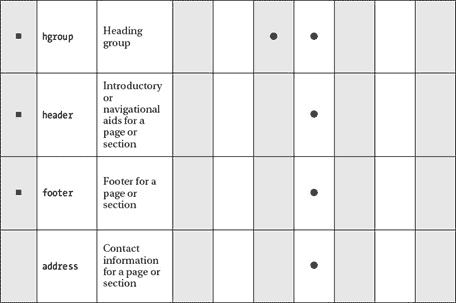

### 内容分组元素

在页面上内容的特定部分内，该部分的各种组件被分成段落、列表、图表等。段落等元素将内容分组为比节更小的单元。除了 HTML5 中新增的`figure`和`figcaption`之外，这个组中的元素对您来说可能都非常熟悉。这些元素的内容模型类别和描述见表 2-8 。

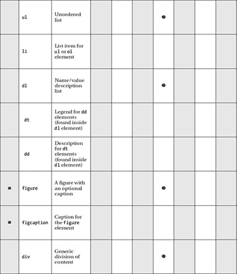

#### 必然段:p

也许你在编写网页时最常用的标记是`p`。关于`p`没有太多要说的:它只是用来标记一个段落。然而，这个不起眼的元素经常被 WYSIWYG(所见即所得)web 创作软件滥用，作为在内容之间添加填充的快速而肮脏的间隔。您可能见过如下所示的标记，其中作者在他们的编辑器中按了几次 Enter 键:

`
&nbsp;

&nbsp;

&nbsp;

&nbsp;
`

这是(X)HTML 被吸收到表现方式中的一个典型例子。我们在这里发现多个无意义的段落，里面有一个不间断的空格实体(因为有些浏览器不显示空元素)，但这种效果确实应该用 CSS 来实现。在内容下方添加一些空间的快速方法是向相关内容添加一个类:

`  
Your content here.
`

然后使用 CSS 样式化该类，在顶部或底部添加填充:

`.section { padding-bottom: 3em; }`

 **注意**EMS 的使用传统上是专业 web 开发人员的首选度量单位，因为它是一个相对的长度单位，如果用户(或开发人员)放大或缩小页面，它将按比例调整大小。然而，近年来，随着 web 浏览器在处理绝对单位(如像素)的大小调整方面变得更好，对 ems 的偏好变得不那么明显了。关于尺寸是用 ems 还是像素有相当大的争论。em 使用起来可能不太直观，而像素则不能适应层叠式的大小变化。选择一个或另一个通常不会是一场灾难，所以选择你觉得更舒服的。总之，在一天结束时，你应该在各种场景下测试你的页面，所以问题应该会很快显露出来。

#### 打破思维:hr

`hr`元素，或者说水平标尺，在历史上一直是一个表示元素，但是它被重新定义为代表一个内容和另一个内容之间的主题分隔。`hr`元素有几个属性——`size`、`width`、`noshade`和`align`——但是在 HTML5 中所有的属性都被声明为过时，所以 CSS 必须用于水平标尺的样式，这是应该的。

#### 保留格式:前

那么，`pre`呢？由`pre`元素引起的视觉效果是保留标记中的空白(即制表符、空格和换行符)，所以如果空白对于理解内容很重要，比如在计算机代码示例中，那么就使用`pre`。或者，可以用 CSS `white-space:pre`属性和值复制的效果，在可以使用另一个元素更好地描述相关内容的情况下，这可能是一个更可行的选择。例如，在标记计算机代码的情况下，`code`元素和`white-space` CSS 属性可以用来保存格式，并在格式可能丢失的情况下传达内容的含义(例如，如果它被屏幕阅读软件读取)。

#### 报价文本:批量报价

`blockquote`是一个元素，历史上一直用于其呈现效果，而不是其语义或结构相关性，但它应被视为包含从另一个来源引用的内容，无论它将如何呈现。`blockquote`元素有一个`cite`属性，允许作者引用引用的来源(通常以 URL 的形式，但也可以是任何形式的引用，比如另一个作者的名字或电影的名称)。

 **注意**例如，对于段落中出现的行内引用，还存在`q`元素，它在第三章的文本级语义部分列出。

#### 列表

在当前的 HTML 规范中有三种列表类型:无序列表(`ul`)、有序列表(`ol`)和描述列表(`dl`)。

列表类型之间的差异非常小且简单明了:

> *   When your content (as you expected) does not have any particular order, you should use a **unordered list** .
> *   When your content is arranged in a certain order, you should use a **ordered list** : alphabetically, numerically and so on.
> *   **Description list** is used to associate names or terms with values or other data-any items directly related to each other, such as glossary.

##### 无序列表和有序列表:ul、ol 和 li

无序列表和有序列表分别由开始的`ul`或`ol`标记组成，后面是任意数量的列表项—`li`—元素，最后是结束的`</ul>`或`</ol>`标记。开始和结束标记只能包含列表项，但是列表项可以包含任何流元素，包括段落、`div` s、标题以及更多列表。只要它们都包含在一个列表项中，它就是完全有效且格式良好的标记。至于 HTML/XHTML 之间的区别，在 HTML 中你不必用`</li>`关闭列表项，但是在 XHTML 中你必须这样做。

除了全局属性之外，无序列表没有任何属性。另一方面，有序列表有三个附加属性:`reversed`、`start`和`type`。第一个是`reversed`，决定了列表的排序方向。它是一个布尔属性，意味着它的存在与否决定了它的行为。如果这个属性存在，列表将是降序的(9，8，7，6，5…)；否则，将是升序(1，2，3，4，5…)。不幸的是，在撰写本文时，浏览器对该属性的支持很差。

在这种情况下，您可能会发现 HTML 语法更清晰。例如，以下两种方法都可行:

`<ol reversed>
    <li>item 1</li>
    <li>item 2</li>
</ol>

<ol reversed="reversed">
    <li>item 1</li>
    <li>item 2</li>
</ol>`

接下来，`start`属性允许作者从一个非 1 的数字开始对有序列表进行编号，这在您需要中断有序列表时非常有用，比如在搜索结果列表被分成几页的情况下。有趣的是，这个属性在 HTML 4.01 中被弃用了，但在 HTML5 中又恢复了良好的地位。

最后，`type`属性可用于将列表开头的标记从十进制数字(默认)更改为字母列表或罗马数字。然而，强烈建议使用 CSS `list-style-type`属性，它提供了更多的选项，并且将这种表示上的改变转移到 CSS 而不是 HTML 中。

当`li`元素是无序列表的一部分时，它只有全局属性，但是当它在有序列表中时，它又多了一个属性:`value`。此属性允许作者为特定列表项指定一个无序编号。

属性的问题已经解决了，让我们来看一个实现列表的例子。令人欣慰的是，虽然标记可能并不令人兴奋，但它至少是灵活的，使用 CSS 可以以多种方式显示列表:水平、垂直、扩展/折叠等等。例如，采用以下导航菜单:

`<ul>
      <li><a href="/">Home</a></li>
      <li><a href="/about/">About</a></li>
      <li><a href="/archive/">Archive</a></li>
      <li><a href="/contact/">Contact</a></li>
</ul>`

我们可以使用下面的 CSS 规则很容易地将它变成一个水平菜单:

`li {
         float: left;
}`

简单！但是在这个阶段，它显然很难看，而且有点不可用，所以让我们稍微整理一下:

`li {
         border: 1px solid; float: left; list-style-type: none; padding: 0.2em 1em;
}`

通过添加边框，删除列表项目符号，并添加少量填充，我们得到了如图 2-3 所示的列表。

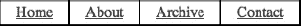

***图 2-3。**一个无序列表，列表项向左浮动，加边框，填充*

如你所见，我们已经有了一个非常实用的水平菜单。我们可以用一些锚标签的样式使它更有趣，给它们一个`background-color`，用`display:block`让它们填充整个列表项区域，用伪类`:hover`改变它们的背景，等等。

为了帮助减轻创建链接列表的痛苦，也值得尝试一下 Accessify 的 List-O-Matic ( `[`accessify.com/tools-and-wizards/developer-tools/list-o-matic`](http://accessify.com/tools-and-wizards/developer-tools/list-o-matic)`)，这是一个在线列表生成器，可以让你从各种预建的样式中进行选择。

因此，您已经可以看到一个简单的列表可以用不同于默认样式的方式显示。使用 CSS 来创建列表的动态行为是可能的。例如，正如 Eric Meyer ( `[`meyerweb.com/eric/css/edge/menus/demo.html`](http://meyerweb.com/eric/css/edge/menus/demo.html)`)所述，`:hover`伪类可用于将嵌套列表显示为弹出菜单。实现这一点的 CSS 非常简单:

`li ul {display: none;}
li:hover > ul {display: block;}`

这意味着任何作为`li`的派生元素的`ul`——即嵌套列表——都不应该显示。第二行表示任何被悬停的`li`的子元素`ul`都应该正常显示。在兼容的浏览器中，最终结果(加上一些更多的表示风格)看起来像图 2-4 。

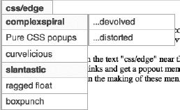

***图 2-4。**一个纯 CSS 嵌套菜单*

一切都很整洁。Patrick Griffiths 的 Suckerfish Dropdowns 脚本(`[www.htmldog.com/articles/suckerfish/dropdowns](http://www.htmldog.com/articles/suckerfish/dropdowns)`)提供了一个 CSS 解决方案和一个 JavaScript 解决方案，这两个解决方案都非常健壮(满足了多个嵌套菜单的需要)并且非常容易实现，只需要包含一个小脚本和向 CSS 文件添加一个类选择器。

##### 描述列表:dl、dt 和 dd

描述列表由一个开始的`dl`，接着是一个术语(`dt`，然后是任意数量的描述(`dd`)。典型的描述列表如下所示:

`<dl>
      <dt>Bottle</dt>
      <dd>A receptacle having a narrow neck, usually no handles, and a mouth that can be
      plugged, corked, or capped.</dd>
      <dd>To hold in; restrain: "bottled up my emotions."</dd>
      <dt>Rocket</dt>
      <dd>A vehicle or device propelled by one or more rocket engines, especially such a
      vehicle designed to travel through space.</dd>
</dl>`

大多数浏览器会以类似于图 2-5 所示的方式显示前面的代码。

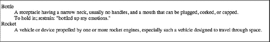

***图 2-5。**一个描述列表，左边是术语，描述缩进*

如上所述，描述列表相当灵活。只要术语和描述之间有直接关系，就可以使用这个列表来表示许多结构。例如，作为术语的照片可以具有包括关于摄影师和照相机的信息的描述。此外，描述列表可用于显示会议上一系列演示的时间表，演示的标题为术语，描述包括演示作者的详细信息以及日期和时间。在线购物应用中也可以使用描述列表来描述产品细节等。

尽管描述列表使用起来很灵活，但你应该记住以下警告:定义术语只能包含短语内容，不能包含流内容，因此不能包含段落、标题或列表——这意味着术语不能像标题那样被赋予不同的重要性级别(`h1`、`h2`等等)。然而，列表中的描述元素(`dd`)可以包含任何流元素或一系列元素，只要它们格式良好。

#### 图表、照片、插图:数字和图片说明

元素背后的思想是提供图表、图像、代码等等，可选地带有标题或图例(`figcaption`元素)，作为与文档主要内容相关的独立单元。该图形应该能够在不破坏文档整体布局的情况下移动或删除。

例如，下图显示了两幅并排的图像，标题如下(见图 2-6 ):

`<figure>
        
        
        <figcaption>The Earth and Mars shown side-by-side.</figcaption>
</figure>` 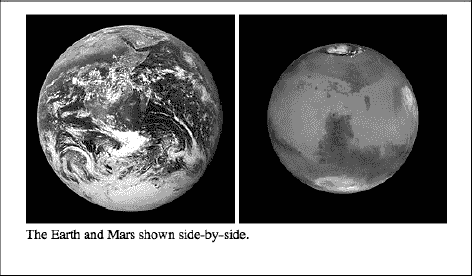

*图 2-6**。**示例从`figure`和`figcaption`元件*输出

#### 创建分部:div

一个`div`(“division”的缩写)用于标出一个内容块。它没有给它所围绕的内容添加任何特殊的含义，只是用来添加额外的 CSS 样式或 JavaScript。传统上，`div`是帮助页面布局的常用元素，但在许多情况下已经被语义更具体的元素所取代(在第三章中有更深入的讨论)。

### 文本级语义元素

我们现在开始进行最细粒度的控制:文本级的元素吸收了有意义的单个单词和句子。这些元素的正确语义用法有细微差别，最好在下一章中与文档分段元素一起讨论，所以现在先熟悉一下表 2-9 中的大量这些元素，我们将在第三章中进一步讨论它们。大多数已经存在了一段时间，但是有几个如`i`和`b`在 HTML5 中有了新的含义。

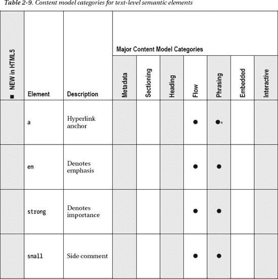

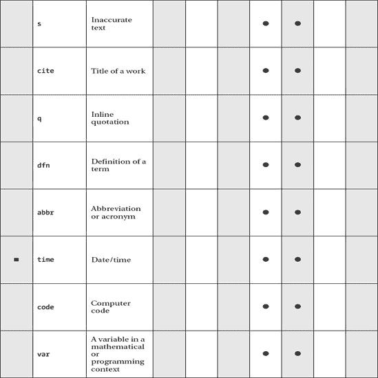

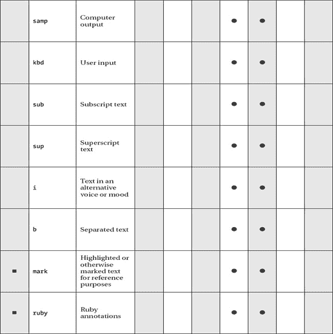

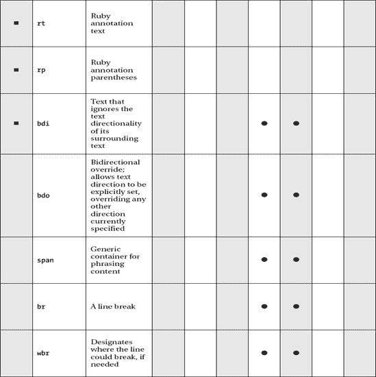

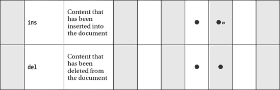

__________

仅当它包含专有措辞内容时。

### 表格数据元素

几年前，使用表格来生成像素级精确的网站布局是非常普遍的做法。在当时，对于外行人来说，表格的这种使用提供了网页设计的一个飞跃，因为设计可以在 Adobe Photoshop 中创建，切割成一个网格，然后在表格中重新组合，以创建网页中的原始设计。然而，这种设计方法的不灵活性和可访问性很快就被 CSS 所取代，当吹捧的“无表格布局”成为一个流行语，意思是没有表格的像素完美布局。哎哟。桌子哪里出问题了？在标准世界中，当它们被用于一个它们原本不打算用于的目的——表示——时，它们就出错了。表格是用来显示数据的。洛杉矶电子表格，仅此而已。

如表 2-10 所示，表元素是适合流内容模型类别的单个单元。所有其他与表格相关的元素都在一个`table`元素中工作，以定义其结构，因此它们不适合任何主要类别。与`body`元素一样，大量本质上是表示性的属性被扔进了过时的垃圾箱；例如，在`tr`中，除了全局属性之外的所有属性都被去掉了。

__________

10 可以放在语法内容中，如果它只包含语法内容。

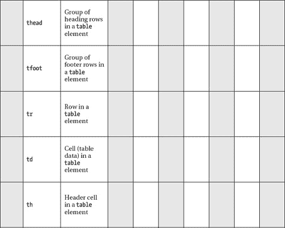

#### 表格基础知识

手工编码标记时，创建一个简单的表相当简单。单个表格的基本要素包括一个开始的`table`标记，后面至少有一个表格行(一个`tr`)，后面至少有一个表格单元格(一个`td`，意思是“表格数据”)。这里有一个例子:

`<table>
        <tr>
                <td>Some data</td>
        </tr>
</table>`

对于创建表来说，这已经是最简单的了，但是创建一个只有一项数据的表是不太可能的，所以让我们把事情变得更有趣一些。下面的标记是针对一个包含两行数据的两列表格(嵌入样式是提供一个`border`作为视觉辅助，以更好地区分表格的布局；理想情况下，它的效果应该放在生产环境中的外部 CSS 文件中):

`
<table>
    <tr>
        <td>Name</td>
        <td>Place of residence</td>
    </tr>
    <tr>
        <td>Anselm Bradford</td>
        <td>Auckland</td>
    </tr>
    <tr>
        <td>Paul Haine</td>
        <td>Oxford</td>
    </tr>
</table>`

这将创建一个基本的表格，但是让我们进一步使用表格标题。

#### 添加表头

您可以通过在表格顶部标记标题来指示列，从而使该表格更加清晰易读。虽然您可以通过向每个表格单元格添加一个类名，然后用 CSS 对其进行样式化来做到这一点，但是更好的方法是将最上面的表格单元格变成真正的表头，用`th`元素代替`td`。

`<table>
    <tr>
        <th>Name</th>
        <th>Place of residence</th>
        </tr>

    ...

</table>`

前面的标记呈现如图图 2-7 所示。

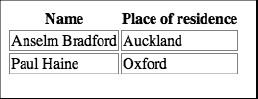

***图 2-7。**标题单元格使用`th`的基本表格*

这种方法有几个好处。首先，它对可访问性有很大的帮助。虽然屏幕阅读设备在有能力的用户手中可能会将第一个表示例读取为“姓名，居住地，安瑟姆·布拉德福德，奥克兰，保罗·海雷，牛津”，并且有可用的表头，但它可以理解表头如何与数据相关，并将其读取为“姓名，安瑟姆·布拉德福德，居住地，奥克兰，姓名，保罗·海雷，居住地，牛津……”11当然，在这个简单的示例中，推断表的结构非常容易。不难看出“姓名，居住地，安瑟姆·布拉德福德，奥克兰，保罗·海雷，牛津”是一个人的名字后面跟着一个地名，但是当表格变得更复杂时(因为有更多的行和列)，这就成了一个大问题。

 **注意**你也可以使用`speak-header` CSS 属性来控制在听觉样式表中是读出`once`还是`always`。

除了让屏幕阅读器的用户更容易访问表格之外，使用适当的表格标题还为视力正常的用户提供了关于表格结构的有用的视觉提示，并使 web 作者的生活稍微轻松一些，他们不必为每个标题都包含一个额外的类名。此外，这给了设计者一个额外的 CSS 和脚本钩子。

#### 添加图例:标题

现在您已经打开了表格，您可以通过以`caption`元素的形式包含表格标题来使事情变得更好。这个元素需要直接放在开始的`table`标签之后:

`<table>
          <caption>Personal details</caption>
          <tr>
                    <th>Name</th>
                    <th>Place of residence</th>
          </tr>
          …
</table>`

大多数用户代理会呈现标题，如图 2-8 所示。

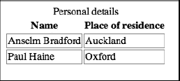

***图 2-8。**一个基本表使用一个`caption`*

__________

11W3C 在`[www.w3.org/WAI/References/Tablin](http://www.w3.org/WAI/References/Tablin)`提供了一个工具来帮助理解你的表格如何被辅助设备读取。

#### 添加结构:thead、tfoot、tbody

如果你的表格看起来有点长，有点笨拙，你可以用`thead`、`tfoot`和`tbody`添加一些进一步的结构来帮助你的浏览器理解事情。这些元素允许您将行分组为标题部分、脚注部分和正文部分。很像`th`元素，如果需要的话，这三个元素给你 CSS 和脚本的另一个钩子，而不必添加额外的类或 id。像`caption`一样，这些元素必须按照特定的顺序和位置放在表格标记中。第一，如果包含三者中的任何一个，就必须包含`thead`。这个元素可以放在任何你想放的地方，但是最好直接放在开始的`table`标签下面——除非你已经包含了一个`caption`，在这种情况下`thead`元素必须直接放在它的下面。如果你愿意，你可以把它放在你的`tfoot`和`tbody`下面，它仍然是有效的标记，但是只有当你几个月后回到你的标记上，想知道你到底在想什么的时候，你才需要这样做。

然而，`tfoot`元素、*必须在`tbody`元素之前*出现。为什么页脚在正文之前？这样，用户代理就可以在从中间开始绘制之前先绘制表格的顶部和底部，如果您计划让表格主体滚动并且有许多行，这就很有用。

最后，添加`tbody`元素。不管怎样，这个标签实际上隐含在你的表中。例如，尝试将`tbody {font-style: italic}`添加到您的 CSS 中，并将其应用到一个基本的表格中，您会看到它将表格中的文本设置为斜体。即使它的存在是隐含的，如果你使用`thead`和`tfoot`，你*必须*明确包含`tbody`标签。因此，一旦添加了这些元素，您的标记应该看起来有点像这样:

`<table>
        <thead>
                <tr>
                         <th>Name</th>
                         <th>Place of residence</th>
                </tr>
        </thead>
        <tfoot>
                <tr>
                         <th>Name</th>
                         <th>Place of residence</th>
               </tr>
        </tfoot>
        <tbody>
                <tr>
                         <td>Anselm Bradford</td>
                         <td>Auckland</td>
                </tr>
                <tr>
                         <td>Paul Haine</td>
                         <td>Oxford</td>
                </tr>
        </tbody>
</table>`

除了现在在表的底部重复出现的标题之外，具有这些元素的表和没有这些元素的表在视觉上没有区别，但是包含它们是好的，因为它们提供了关于表的结构的额外的、有用的信息，在打印或在屏幕上查看时可以利用这些信息。

使用`tfoot`元素时要小心。因为该元素可能会在几页中重复出现，所以最好将其用作`thead`元素内容的副本(如前面的示例所示)，而不是长表的字面结论，例如价格列下的最终总计(如果它出现在表完成之前，则没有什么意义)。

#### 添加更多的结构:colgroup 和 col

如果您需要一个表格单元格跨越多行或多列，您可以使用`rowspan`和`colspan`属性来实现这种效果，这两个属性都采用一个数值来表示一个特定的单元格应该跨越多少个单元格。这一切都很简单。举个例子，让我们想象一下，除了居住在新西兰的奥克兰，我在佛蒙特州还有第二处住所。将这些数据添加到表中需要一个额外的行，但是我不会在新的居住地旁边留下一个空的表格单元格，我将插入一个`rowspan`属性，这样包含我的名字的单元格就可以与两个居住地配对:

`…
<tr>
        <td rowspan="2">Anselm Bradford</td>
        <td>Auckland</td>
</tr>
<tr>
        <td>Vermont</td>
</tr>
<tr>
        <td>Paul Haine</td>
…`

该表现在呈现如图图 2-9 所示。

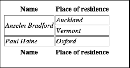

***图 2-9。**使用`rowspan`属性*的基本表格

如果需要，表格单元格可以跨越行和列。你只需要确保你的细胞和跨度相加。例如，如果您的表格有两行，一行包含五个`td`元素，那么第二行最多只能跨越五个单元格——超过这一行，表格将无效，并且会不可预测地呈现，少于这一行，剩余的单元格将占用剩余的空间。

我听说过去有人建议`rowspan`和`colspan`是表象性的，应该避免，但这是不正确的；您正在使用属性来定义结构，而不是表示，因此您应该将该信息保存在标记中。

到目前为止，您可能已经注意到，大多数表格标记只与行和这些行中的单个单元格相关——没有`tc`元素。相反，我们有两个元素可以定义列和列组，并且都是可选的:`col`和`colgroup`。

`colgroup`元素允许您使用一个`span`属性和一个数值来指定表中将存在多少组列(因此每组列有一个`colgroup`，一个组只能包含一列)以及每组中包含多少列。这个元素直接放在开始的`table`标签之后，除了可选的`col`标签之外，它不包含任何标记，稍后会介绍。

例如，考虑图 2-10 中所示的表格。

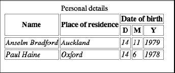

***图 2-10。**多列表:这里有三个列组，分别是“姓名”、“居住地”、“出生日期”*

沿着最上面的标题阅读，您可以看到这个表格有三组列，最后一列横跨三个单元格的宽度。使用`colgroup`，您可以在表的开始定义该结构，如下所示:

`<table>
        <colgroup></colgroup> <colgroup></colgroup> <colgroup span="3"></colgroup>
        <tr>
…`

有了这个标记，您就说这个表包含三组列，前两组包含一个列(暗示一个列；这种情况下不需要添加`span="1"`属性)，第三组包含三列。

如表 2-10 所示，有一个`col`元素，这是一个自结束元素，也有一个`span`属性，用于指定`colgroup`中是否存在列。在功能和语义上，它实际上与`colgroup`相同，但不幸的是 HTML 规范不允许嵌套`colgroup`元素，所以您必须使用`col`来代替。使用前面的示例，您可以用两种不同的方式指定最终的三列集合，或者每列一个`col`，如下所示:

`<table>
        <colgroup></colgroup> <colgroup></colgroup> <colgroup> <col /> <col /> <col />
        </colgroup>
        <tr>
        …`

或者使用单个`col`和一个`span`属性，如下所示:

`<table>
        <colgroup></colgroup> <colgroup></colgroup> <colgroup><col span="3"></colgroup>
        <tr>
        …`

这开始看起来像是大量的工作——为什么有人会为此费心呢？的确，乍一看，您似乎提供了多余的信息，但是这种标记确实有它的用途。有一些附带的好处，但是`colgroup`和`col`存在的主要原因是允许浏览器呈现表格，即使所有的表格行数据还没有到达。如果没有这两个标签提供的信息，浏览器必须首先解析整个表格，找到包含最大数量的单元格的行。接下来，浏览器必须计算该行的宽度，只有这样它才能知道表格的宽度，并允许它被呈现。当您让浏览器预先知道表的列结构时，浏览器可以在数据到达时呈现数据。

### 表格元素

就其本质而言，web 表单是一个很大的主题——在 HTML5 中，随着许多新元素的加入，这个主题变得更大。表单元素通常需要对属性进行仔细的编码，以使元素组能够正确地协同工作，并使表单成功地将其数据提交给服务器。表单将在第四章中深入讨论，但作为尝试，我们将在这里看一个基本示例:

`<form action="handle_form.php">
    <label for="feedback">Please provide feedback on our form!</label>
     
    <textarea id="feedback" rows="5" cols="50" placeholder="Enter your comments     here..."></textarea>
     
    <input type="submit" value="Submit!" />
</form>`

当在网络浏览器中渲染时，这将看起来像图 2-11 。

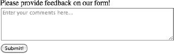

***图 2-11。**一个简单 web 表单的出现*

这只是一个显示表单结构的简单示例。表单通常遵循以下格式:

> *   Include the form component in a `form` element, which defines the file for processing the form data when submitting the form data.
> *   Some controls for collecting input are defined, such as text fields, drop-down lists, radio buttons and so on.
> *   Provide a button to submit the form to retrieve and process the input data.

如果您对表单非常熟悉，您可能会注意到上一个示例中的一个不熟悉的属性— `placeholder`，它在`textarea`元素中添加了灰色文本，提供了应该输入什么的提示。`placeholder`属性是 HTML5 中的一个新属性，但这仅仅是冰山一角！在最新的规范中，web 表单发生了巨大的变化。除了在表 2-11 中列出的新的和更新的元素之外，还可以使用`input`元素创建大量新的输入类型，例如急需的电子邮件地址、电话号码、日期和时间等表单输入！你将不得不等到第四章更深入的讨论。同时，让自己熟悉与表单相关的基本元素，然后让我们暂时了解一下嵌入式内容元素的概况。

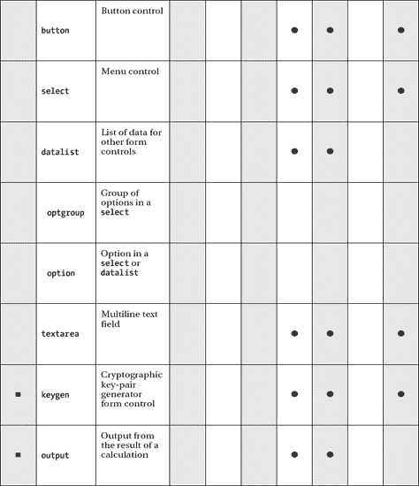

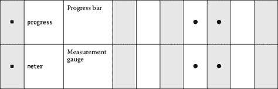

__________

如果类型属性未设置为隐藏，则 12 符合交互类别。

### 嵌入内容元素

多年来，除了格式化文档之外，HTML 不擅长做任何事情。静态图像是可以嵌入页面的复杂内容的缩影，而动态 gif 则是动画中的*精华。这些缺点有助于 Adobe Flash Player 等技术的传播，这些技术解决了网页上动画、交互性、视频和音频解决方案的缺乏。随着 HTML5 的出现，这种语言已经发生了重大转变，成为开发 web 应用的平台，而不仅仅是格式化 web 文档。新的`video`元素也许比其他任何元素都更能体现 HTML5 希望表现的东西——使用 HTML/CSS/JavaScript 开放标准的丰富多媒体体验。在`video`元素被引入之前，没有 Adobe Flash 的视频似乎是不可能的。当然，其他解决方案也存在，比如苹果的 QuickTime 插件，但多年来，Flash 视频一直在 YouTube.com 等流行的视频分享网站上占据主导地位。*

2010 年春天，苹果公司(Apple Inc .)的史蒂夫·乔布斯(Steve Jobs)发布了一封公开信，抨击 Adobe Flash 是一项有缺陷的过时技术，随着 HTML5 视频的传播，这项技术将被搁置一旁。HTML5 作为网络的未来被推向公众意识。就目前而言，未来还在前方；Flash 视频仍然得到广泛使用，HTML5 视频在应该使用哪种视频格式上存在分歧。但慢慢地，HTML5 技术家族正在朝着标准化功能取得健康的进展，以前只有 Adobe Flash 和其他第三方插件才有可能实现这一点——不仅仅是在视频方面。新的`canvas`元素提供了一个位图绘制表面，可以使用 JavaScript 来创建复杂的渲染和体验 13 类似于以前使用 Adobe Flash 制作的丰富的多媒体体验。

嵌入式内容元素是如此丰富多样的一组元素，我们将在第五章中深入探讨它们。与本章中涉及的其他元素集一样，表 2-12 显示了新的和更新的元素以及它们所属的内容模型类别。熟悉这些，我们将在几章后回到它们。现在，前进！

__________

13 请访问 [`ro.me`](http://ro.me) 上的罗马项目，了解嵌入式元素的功能。

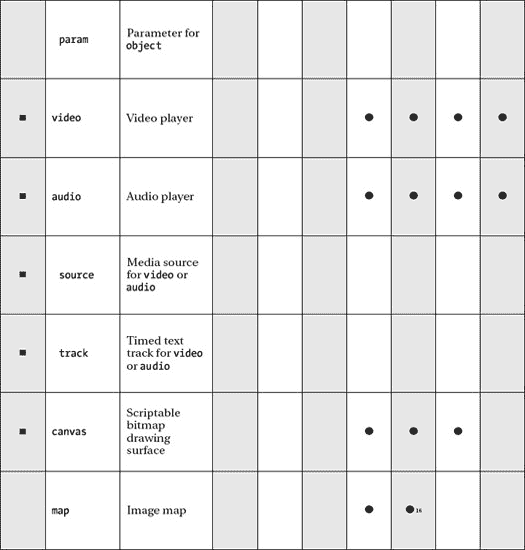

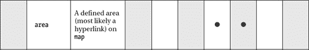

__________

14 如果设置了 usemap 属性，则可以放在交互类别中。

与 img 元素一样，如果设置了 usemap 属性，则可以将其放在交互类别中。

__________

16 可以放在语法内容中，如果它只包含语法内容。

### 互动元素

最后一组元素是一个很小的集合，它包含了通常通过点击进行交互的元素，而不需要额外的脚本或其他创建交互性的机制。这组四个元素中的三个，`details`、`summary`和`command`是新的，而`menu`在 HTML 4.01 中被贬低后，在 HTML5 中被重新定义。这些要素的通常汇总见表 2-13 。

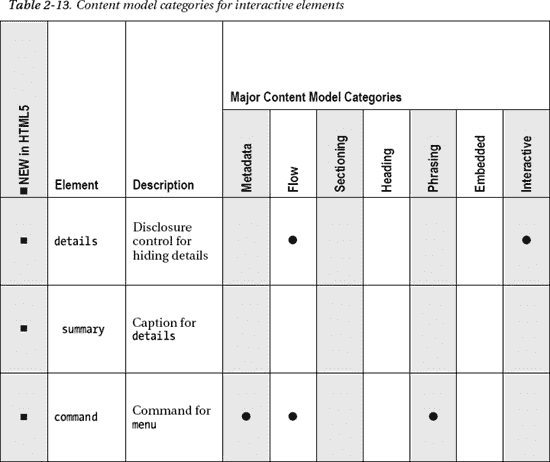

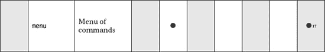

#### 显示更多信息:摘要和详细信息

`summary`和`details`元素一起提供了一个“小部件”,可以显示和隐藏额外的文本，而不需要使用 JavaScript 或 CSS。`summary`元素作为一个标题(或摘要，如元素名所示)，提供了一个切换按钮，单击该按钮可以显示和隐藏`details`标签之间的文本。默认情况下，`details`内的文本将被隐藏，直到该开关被点击；然而，布尔属性`open`可以被添加到`details`元素，以便默认显示文本。

不幸的是，在撰写本文时，`details`和`summary`元素还没有得到很好的支持，只有谷歌的 Chrome 浏览器支持这一功能。 18 如果你使用的浏览器不支持这些元素，那么细节区内的所有内容都会显示出来，不会有任何形式的切换。

一个基本示例可能是这样的:

`

        
Legal Notice

        <small>All content copyright 2011 Anselm Bradford</small>

`

这将显示一个开关和文本“法律声明”，单击它可以显示和隐藏版权声明。`details`元素可以包含任何流元素，这意味着细节可能相当复杂。例如，下一个例子展示了一些可能出现在剧院网站上的 HTML。这个例子使用了`summary`和`details`元素来显示和隐藏剧院当前正在上演的戏剧的附加信息:

`

    
A Midsummer Night's Dream

    
Duration: 1hr 42m

    
Showtimes: 

    <ul>
        <li>Tuesday, 8pm</li>
        <li>Wednesday, 8pm</li>
        <li>Thursday, 8pm</li>
        <li>Friday, 6pm and 8pm</li>
    </ul>

`

__________

如果类型属性设置为工具栏，则 17 适合交互类别。

18 访问 http://caniuse.com[网站](http://caniuse.com)，在搜索栏中输入*详情*，查看浏览器支持的当前状态。

与上一个只切换一行文本的例子不同，这个例子显示和隐藏了两个段落和一个无序列表。

与元素的交互将看起来像图 2-12 。

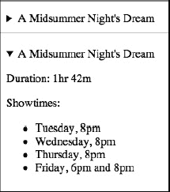

***图 2-12。**点击摘要开关*后显示隐藏和显示状态的细节元素

 **注意**`summary`元素是可选的；如果省略，浏览器将为`details`元素创建自己的标签，比如文本“Details”

例如，使用 JavaScript，`details`元素可以用来在 web 应用中设置用户首选项面板。在本例中，summary 是用户的昵称，用户可以打开并更改它。保存他们的更改会更新`summary`元素中的值，这将改变细节标签的外观。

`

    
Mac

    
<label for="input">Nickname: <input type="text" id="input" value="Mac" /></label>

    
<button onclick="update();">Save...</button>

`

图 2-13 显示了打开详细信息、更改名称并点击保存…的过程，然后(使用 JavaScript)更新摘要文本。显然，这将需要永久保存真正有用的更改，要么在后端数据库中，要么可能在客户端存储中(所谓的 web 存储在相关的 API 中可用，在附录 A 中讨论)。

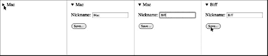

***图 2-13。**一个使用 JavaScript 动态更新细节摘要的细节元素*

#### 提供工具栏:菜单和命令

放置在`menu`元素中的单个`command`元素可以用来创建一个类似桌面应用中的菜单栏。不仅如此，它还可以用来创建上下文菜单或其他交互式菜单选项列表。还记得使用了这两个元素的`contextmenu`全局属性吗？不幸的是，像`contextmenu`属性一样，`command`属性还没有在任何主流浏览器中实现，所以这些菜单仍然停留在 HTML5 规范的理论空间中。

### 总结

恭喜你！这是一个非常密集的章节，充满了大量的信息，但是我希望您已经了解了 HTML5 中存在哪些新元素，并且可能复习了其他一直存在的元素。现在是时候转向我们在本章中忽略的细节，看看如何实际使用这些丰富的新 HTML 元素了。**