# 三、识别语义

好了，好了，我们已经研究了可用的元素，这很好，但是你可能想知道如何从了解 HTML 元素到掌握 HTML 元素。好了，在知道存在什么元素之后，下一步就是知道什么时候使用一个而不是另一个。本章将引导你走上这条道路，重点放在定义网页结构和语义的元素上。我们将编写一个简单的 web 页面大纲来学习结构语义，然后深入一个案例研究来探索文本级语义元素的细微差别。

### 什么是语义，我为什么要关心语义？

> *“HTML 中的元素、属性和属性值(由该规范)定义为具有特定的含义(语义)。例如，ol 元素表示有序列表，lang 属性表示内容的语言。*
> 
> 作者不得将元素、属性或属性值用于其适当的预期语义目的之外的目的。”

WHATWG HTML 规范

单词 *semantic* 在 web 开发社区中经常可以在诸如*语义网*、*好语义网*、*语义丰富的 HTML* 等短语中听到，但它感觉有点像是一个被抛来抛去的流行语，让演讲者看起来对当代 Web 开发很时髦。到底是什么意思？这个问题正是语义学想要回答的。语义是某事物的意义，尤其是关于语言的组成部分。语义 HTML 是关于描述它们所包含的内容类型的 HTML 元素。它关注的是将内容封装在一个 HTML 元素和另一个元素中的含义。它也是关于按照 HTML 规范中的指导方针，为特定的内容使用适当的元素。

有时候一个元素将包含什么样的内容是非常清楚的。例如，看到`time`可能会让你快速找到这个元素的内容。另一方面，看到`s`可能需要仔细查看 HTML 规范中的相关段落。但是让我们再来看看`time`元素。它将包含的内容是否像最初看起来的那样清楚？例如，我可以这样写吗:

`
Innovations of the <time>21st century</time>.
`

或以下内容:

`
The machine ran <time>infinitely</time>.
`

嗯，没有；每个元素都有约束条件，虽然这两部分内容都与时间相关(一个时间段和一个时间属性)，但它们不是`time`元素想要描述的与时间相关的内容类型。稍后我们将更多地讨论`time`，但简而言之，规范告诉我们它是公历中精确的*日期*，可选地带有一个*时间*。所以，并没有我们最初想的那么清楚！为什么这个元素不叫`date`而叫`datetime`？好吧，撇开元素名称不谈，关键是每一个都有微妙的差别，不管这个名称使它的目的看起来有多清晰。掌握这些细微差别将有助于创建结构合理、易于维护、对数据挖掘服务(例如，搜索引擎)更友好的页面。所以，把你的假设留在门口，让我们深入 HTML 元素的细微差别！我们将从结构元素开始。

### 勾勒思维

看看你是否能理解这个场景。你有一个新的网站项目要做。在仔细考虑了网站的总体概念后，你启动你最喜欢的图形编辑器，开始移动颜色块，摆弄纹理和线条。你扔进一个标题和标志，并把标题拖来拖去，直到它看起来合适。这引起共鸣了吗？当着手一个新的网站项目时，立即投入进去并开始设计网站的外观是很诱人的，但是如果你发现自己也在这样做，那就值得停下来看看大图。最终，一个设计良好的网站是一个提供有效的交付和访问其内容的网站。你的设计应该旨在创建一个信息层次结构——页面的各个部分应该首先吸引浏览者的注意力，然后是第二，以此类推。如果你事先没有把所有的内容组织成一个层次结构，你可能会发现自己一次又一次地放弃你的设计，因为你发现这个或那个部分需要在页面上或多或少地突出。

所以，暂停一下，把设计放一会儿，拿起纸和笔，写下你网站的主要内容。为每一部分考虑一个标签，以及它相对于页面内容的位置。暂时忘记细节，而是专注于创建可以位于主要内容部分之上的标签。例如，对于一个简单的主页，你可能会想出类似于图 3-1 的东西。

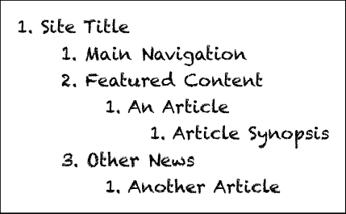

***图 3-1。**一个简单的主页轮廓*

把这个列表想象成你的网站内容的目录或站点地图，什么在什么之前，什么是一个更大部分的一个子部分。在这个例子中，网站的标题(可能是一个公司名称)是所有其他内容所属的信息。下面是到其他页面的主导航(记住这是大图，所以在这个例子中没有显示单独的链接)，接下来是主页上的特色内容，包括一篇特色文章，其中有对文章内容的简要总结。最后，主页上的其他文章被放在“其他新闻”部分。

开发一个这样的列表可以帮助你组织和可视化你网站上的信息层次，但这不仅仅是一个崇高的练习，在开发你的网站时可能有帮助，也可能没有帮助 HTML5 规范实际上提供了一个具体的算法来建立一个基于大纲的网站结构，例如图 3-1 中的大纲。不仅如此，该算法是学习如何正确组织网页的一个很好的指南。

### HTML5 轮廓算法

HTML5 规范的这一部分被称为 HTML5 **大纲算法**，它提供了将内容分成嵌套列表的规则，每个列表都有一个标题。提供理解和解析网页结构的标准算法意味着每个适当构造的网页自动获得一个“目录”,该目录可以被例如屏幕阅读器(对于视力受损的用户)使用，或者在内容的联合部分中使用。

 **注意**一个*部分*  1  只是一组内容——把它想象成页面上某个内容周围的一个盒子——而一个*标题*就像是打在盒子上的标签，说明它包含的内容。

简单来说，outline 算法使用以下规则解析文档:

> 1.  Specify the `body` element as the root section under which all other page sections are grouped.
> 2.  Specify the first title content element as the title of `body`.
> 3.  For each subsequent slice content element found, define new slices and sub-slices and add them to the outline.
> 4.  Specify the first title content element found in each subsequent chapter as the title of that chapter.

在前面的步骤中，请注意提到的两个内容模型类别，标题内容和小节内容。这两个类别中的元素位于第二章中的“语义分段元素”一节。两者都包含一小组元素；标题内容包括`h1`、`h2`、`h3`、`h4`、`h5`、`h6`和`hgroup`元素，而`article`、`aside`、`nav`和`section`元素属于小节内容。 2

__________

1HTML 中有一个 section 元素，但在此上下文中,“section”是一个通用术语，涵盖了 sectioning 内容模型类别中的 HTML 元素。

2 请注意(可能令人惊讶的是)div 不包括在分段内容中。

### 使用标题内容隐式创建大纲

之前的网站轮廓(图 3-1 )可以使用`h1`、`h2`、`h3`和`h4`元素来建立顺序和层次，如下所示:

`<!DOCTYPE html>
<html>
          <head>
                    <meta charset="utf-8" />
                    <title>HTML5 Outline Algorithm</title>
          </head>
          <body>
                    <h1>Site Title</h1>
                    <h2>Main Navigation</h2>
                    <h2>Featured Content</h2>
                    <h3>An Article</h3>
                    <h4>Article Synopsis</h4>
                    <h2>Other News</h2>
                    <h3>Another Article</h3>
          </body>
</html>`

坚持住。如果您仔细阅读大纲算法解析规则，您可能会注意到这里的一个问题。从`h1`到`h4`元素是*标题内容*元素，而不是*小节内容*元素，那么除了由主体创建的根节之外，这个页面还会有其他节吗？答案是肯定的。如果算法遇到预期的情况，可以隐式地创建部分。

从`h1`到`h6`标题元素据说有一个**等级**，这是它们名字中给出的数字(例如，`h1`的等级为 1，`h2`的等级为 2，依此类推)。较低等级的标题元素，当被放置在较高等级的元素之下时，将被嵌套在较高等级的标题元素的部分内。然而，如果标题元素与它的前身具有相同或更高的等级，它将隐式地创建一个新的部分，如果还没有定义的话(图 3-2 )。请注意，这里没有添加任何元素；这就是 HTML5 outline 算法如何解释页面上的内容是如何分组在一起的。

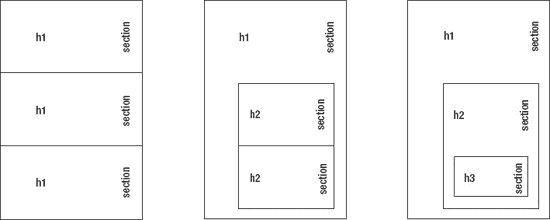

***图 3-2。**相邻标题元素的隐式部分创建。具有相同等级的相邻标题元素将隐式创建新节，而等级较低的标题元素将隐式创建嵌套节。*

在早期，使用`div`元素中的`h1`到`h6`元素来构建页面的各个部分是一种常见的做法。这样做的问题是`div`元素不是元素的分段内容组的一部分，所以它不会根据 HTML5 outline 算法将页面分成几个部分。隐式创建节提供了与这种旧编码风格的向后兼容性，因为节可以基于在`div`元素中使用的标题元素自动创建。然而，这并不是构建页面各部分的首选方式。相反，在查看源代码时，显式包含内容元素将使嵌套结构更加明显，这是我们接下来要做的。

### 使用切片内容创建轮廓

在四个分区内容元素中，`section`元素 3 是最通用的，提供了(理想情况下)主题相关的内容分组。通过将`section`元素添加到代码中，我们可以明确地显示这些部分将出现在哪里，这可能会更容易地看到页面是如何组织的(如果以下示例中的元素嵌套没有意义，请参考图 3-2 ):

`…
<body>
          <h1>Site Title</h1>
          <section><h2>Main Navigation</h2></section>
          <section><h2>Featured Content</h2>
                   <section><h3>An Article</h3>
                              <section><h4>Article Synopsis</h4></section>
                   </section>
          </section>` `          <section><h2>Other News</h2>
                   <section><h3>Another Article</h3></section>                    
          </section>
</body>
…`

__________

其他的是文章、旁白和导航。

 **注意**第一个`h1`不需要节，因为`body`元素就是服务于这个角色的。然而，您可能已经注意到了,`body`元素不包含在 sectioning content 类别中。主体属于称为**截面根**的特殊元素类别，这些元素内部可能定义了轮廓，但是如果它们包含在另一个轮廓中，它将被隐藏。例如，`blockquote`元素是 sectioning 根类别的成员，并且可以包含形成轮廓的 sectioning 元素，但是这在页面的轮廓中是不可见的，因为它被封装在 blockquote 中。这个类别的其他成员是`details`、`fieldset`、`figure`和`td`元素。

通过包含分节元素，实际上不再需要标题元素的不同排序。在这个问题上，规范陈述如下:

> “…强烈建议作者要么只使用 h1 元素，要么对节的嵌套级别使用适当级别的元素。”

所以，将代码中的所有标题元素转换成`h1`元素可能是明智的；否则，页面对结构变化的适应性会降低。例如，如果嵌套结构发生了变化，那么标题等级需要更新以反映嵌套深度的变化(不这样做不会破坏任何东西，但在语义上是不允许的)。

 **注意**也就是说，目前搜索引擎优化(SEO)只关注标题的`h1`元素。例如，微软的必应搜索引擎发布了一个网站管理员常见问题(`[www.bing.com/toolbox/webmaster/](http://www.bing.com/toolbox/webmaster/)`)，指出一个页面每页不应该有一个以上的`h1`元素。这一指示预示着早期的网络，所以理想情况下，这最终会被删除，但与此同时，如果搜索引擎优化对你的网络项目至关重要，执行尽职调查，你的目标搜索引擎是否会有多个`h1`元素的问题，或严格使用标题排名适合他们的嵌套层次。

请注意，将所有标题元素转换为`h1`意味着页面上的标题在默认情况下可能具有相同的大小，而不管这些部分是如何嵌套的。例如，截至本文撰写之时，最新版本的 Google Chrome 和 Firefox 足够智能，可以减少嵌套在其他部分中的标题元素的大小，而 Safari 和 Opera 则不行。然而，后两个是否实现这个行为是一个争论点，因为页面的所有表现质量(包括标题大小)都应该使用 CSS 而不是 HTML 来处理。

#### 改善大纲语义

区段是一个很好的通用分组元素，但是使用更具体的区段元素可以更好地定义此页面上的许多内容。让我们看看 sectioning 内容组中剩余的三个元素，看看哪一个比`section`元素更合适。使用图 3-3 中的流程图，我们将逐步完成内容。

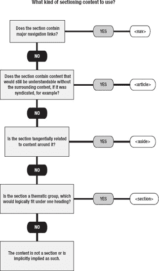

***图 3-3。**选择特定切片内容元素的流程图*

首先，导航可以包装在`nav`中，因为这个部分将定义网页的主要导航链接(在这个简化的例子中，链接被省略了，但通常不会被省略)。接下来是“特色内容”区域。嗯，这是一个有趣的问题，因为它包含的内容(一篇文章)如果从网站的其他部分分离出来，就可以自己理解。因此，它可以被包装在一个`article`中。但是等一下；那真的是最合适的选择吗？为了使你的标记在语义上正确，你必须关注页面上一段内容的目的；内容的特定部分包含什么，以及它在将来会包含什么？例如，`article`元素是为完全自包含的内容设计的，可以在 RSS 提要中整合。在这个例子中，特色内容区域用于为了在站点上突出显示而从其余内容中分离出来的内容。因此，可以说它不是自包含的，因为它包含的内容是在站点的一个更大的内容集中强调的。因此，如果没有周边内容，指定“特色内容”是没有意义的。此外，特色内容区域可能包含一篇以上的文章或其他内容，它们可能根本不相关。该区域用于特色内容，不一定是相关内容。如果这个领域有更多的内容，那么将所有的内容(相关的和不相关的)捆绑在一起并联合起来还有意义吗？我不这么认为。所以，这给我们留下了一组内容，这些内容在主题上是一致的(因为它们都是有特色的)，但又不够独立，不能被认为是一篇文章。因此，该内容最好保留在`section`中。

 **注意**html 5 规范旨在尽可能清晰地表达元素的语义用法，但仍然有大量内容具有不同的含义和解释。虽然像图 3-3 这样的流程图有助于缩小一个元素比另一个元素更合适的范围，但是你很可能会遇到使用哪个元素的问题的答案变得模糊不清的情况。在这些情况下，最好是选择一个更通用的元素，这个元素肯定适合给定的内容，而不是应用一个更具体的元素，这个元素可能合适，也可能不合适。

接下来，“其他新闻”部分可以被视为“特色内容”它按主题将内容分组在一起(所有未被精选的内容)，但它不够独立，不足以保证使用`article`，所以它也有一个`section`。所示的两篇文章是独立的，它们本身是有意义的，所以它们被包装在`article`元素中。

接下来,“文章简介”本身没有意义，它与嵌套在里面的文章相关，所以最好放在`aside`中。最后，尽管担心使用多个`h1`标签，我们还是会将所有标题转换成`h1`，这样你就可以看到是什么样子了。

最终结果如下所示:

`…
<body>
          <h1>Site Title</h1>
          <nav><h1>Main Navigation</h1></nav>
          <section><h1>Featured Content</h1>
                   <article><h1>An Article</h1>
                             <aside><h1>Article Synopsis</h1></aside>
                   </article>` `          </section>
          <section><h1>Other News</h1>
                   <article><h1>Another Article</h1></article>
          </section>
</body>
…`

好多了！这种标记现在不那么通用了。导航很容易识别；我们看到页面上有一篇特色文章，边上有一个简短的提要，页面的另一部分有另一篇文章。目前，除了单独部分中的标题之外，没有其他内容(段落、图表等等),但是很容易就有了！这只是建立文件的大纲。

 **注意**在这个例子中，`aside`已经嵌套在一个`article`中，而后者又进一步嵌套在一个`section`中。如果旁白直接出现在`body`元素中，它应该与整个页面的内容相关，而不仅仅是一部分。对于一个内容很少的网页来说，这可能是可以的，但是对于一个内容丰富的网页来说，分组和/或嵌套`aside`以及它们的相关内容很可能是必要的。

### 页眉和页脚

每个部分可以选择性地有一个`header`和一个`footer`元素。一个`header` 4 用于将一节的介绍性内容或导航帮助 5 组合在一起，因此它可能包含该节的标题元素以及其他介绍性内容(目录、相关徽标等)。一个`footer`包含与部分或页面整体相关的内容，例如作者是谁、版权信息、联系地址和其他(一般)小片段信息。有时页面主导航菜单的相关链接或重复链接可能会出现在页脚，但一般来说，如果它们是无关的或多余的链接，并且对网站的主导航不重要，就不需要放入`nav`元素中。

 **注意**需要注意的是，整个页面可以有页眉和页脚，也可以有页面上的节，所以一个页面可以很容易地有多个页眉和页脚。

我们是否应该在现有代码中添加一个`header`？当然，但是实际上现在没有必要。一个`header`用于将介绍性内容分组在一起。目前，我们每个部分都有一个标题元素，所以没有什么可以组合在一起。还是有？主导航是一个导航辅助工具，所以它可以放在页面的标题下。另外，让我们在“站点标题”下添加一个副标题，名为“站点口号！”—现在我们有三个介绍性元素要分组！将这些包裹在`header`中会给我们带来以下结果:

__________

4 不要与“标题”混淆，后者指的是 h1 至 h6 元素。header 元素甚至不是标题内容类别的一部分！

例如，导航工具可以是主菜单或搜索栏，这在许多网站的右上角都可以找到。

`…
<body>
          <header>
                    <h1>Site Title</h1>
                    
Site Slogan!

                    <nav><h1>Main Navigation</h1></nav>
          </header>
          <section><h1>Featured Content</h1>
…`

注意“网站口号”在段落元素中。如果使用了标题元素，标题和口号就会被隐含地分成两个部分，这似乎是不对的。但是，有一段好像也不太对。标题用一个`h1`和口号用一个`h2`似乎更合适，因为这两者之间有明显的重要性等级，然而它们是同一个介绍性文本的一部分。这就是标题内容类别中最后一个元素派上用场的地方:输入`hgroup`！

#### 使用 hgroup

`hgroup`元素允许将一组标题元素放在一起，并且只将其中排名最高的一个元素暴露给 HTML5 outline 算法，这对于您可能希望在一个部分中有两个标题的情况非常有用，例如一篇文章有一个标题和副标题。通过将标题包装在一个`h1`中，将副标题包装在一个`h2 a`中，然后用一个`hgroup`将它们组合在一起，`h2`不会创建新的部分，因为它不会被轮廓算法看到。这样做的另一个优点是标题元素出现的顺序可以改变，因为出于结构目的，较低等级的标题被有效地忽略了。对于我们一直在使用的示例代码，我们可以将标语移动到标题上方，而不会产生结构上的影响，从而得到如下代码外观:

`…
<body>
          <header>
                    <hgroup>
                              <h2>Site Slogan!</h2>
                              <h1>Site Title</h1>
                    </hgroup>
                    <nav><h1>Main Navigation</h1></nav>
          </header>
          <section><h1>Featured Content</h1>
…`

#### 用地址格式化页脚

在`footer`中包含的一个常见元素是联系文章作者或网站所有者的方式。为此，在页脚中可以找到的一个典型元素是`address`元素。此元素不用于邮政信箱或类似地址，因为这不是联系作者的最直接方式(尽管这些信息也可能出现在页脚)。而是为最近的文章或整个页面提供直接的联系信息(电子邮件地址、电话号码等等)。

 **注意**除了`article`或文档正文之外，不适合在分节元素中使用`address`元素。因此，`section`元素可能有一个页脚，但它不会包含`address`元素。如果在这种情况下包含了一个`address`元素，那么该地址将在语义上应用于遇到的包含该部分的第一个冠词，或者应用于主体，无论哪个先遇到。

让我们在现有代码中添加一个页脚，为整个页面提供一个电子邮件地址联系人:

`…
<body>
          <header>
                    <hgroup>
                              <h2>Site Slogan!</h2>
                              <h1>Site Title</h1>
                    </hgroup>
                    <nav><h1>Main Navigation</h1></nav>
          </header>
          <section><h1>Featured Content</h1>
                   <article><h1>An Article</h1>
                              <aside><h1>Article Synopsis</h1></aside>
                   </article>
          </section>
          <section><h1>Other News</h1>
                   <article><h1>Another Article</h1></article>
          </section>
          <footer>
                    <address>Contact: <a href="mailto:wm@example.com">Webmaster</a></address>
          </footer>
</body>
…`

#### 确定页眉和页脚内容

参见图 3-4 的流程图，该流程图总结了确定页眉和页脚内容的过程。

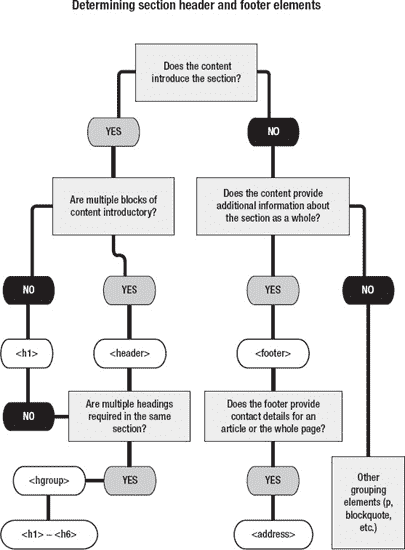

***图 3-4。**确定页眉和页脚元素的流程图*

### 查看 HTML5 轮廓

现在我们已经有了一个简单站点的框架，让我们来看看它的轮廓吧！Geoffrey Sneddon ( `[`gsnedders.com`](http://gsnedders.com)`)开发了一个很棒的工具来解析 HTML5 标记并返回一个大纲。前往`[`gsnedders.html5.org/outliner/`](http://gsnedders.html5.org/outliner/)`，在那里你可以上传 HTML，输入一个 URL 进行解析，或者将 HTML 直接输入到一个 web 表单中。打完“大纲这个！”按钮，您将看到您提供的 HTML 文档中各部分的概要。尝试输入我们一直在构建的代码。你应该会看到类似图 3-5 的轮廓。试用此工具是学习切片内容嵌套结构的好方法。

如果你喜欢在浏览器中内置一个工具，Chrome 网上商店有一个谷歌 Chrome 扩展。前往`[`chrome.google.com/extensions/`](https://chrome.google.com/extensions/)`并搜索 *HTML5 大纲视图*。扩展安装在地址栏中。当访问一个 HTML5 网页时，可以点击扩展来显示页面的轮廓(图 3-6 )。不幸的是，这不适用于您在本地查看的网页。

Opera 在`[`addons.opera.com/addons/extensions/details/html5-outliner/`](https://addons.opera.com/addons/extensions/details/html5-outliner/)`有一个等价的扩展。

此外，如果你在`[`code.google.com/p/h5o/`](http://code.google.com/p/h5o/)`访问 HTML5 Outliner 项目，你会发现一个 Firefox 的实验性插件和一个已经在 Firefox 和 Opera 中测试过的 bookmarklet(那里也有一个 Chrome 扩展的链接，因为这是开发该扩展的项目)。

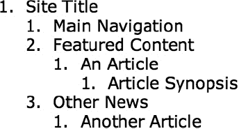

***图 3-5。**Geoffrey Sneddon 的 HTML5 Outliner 输出示例*

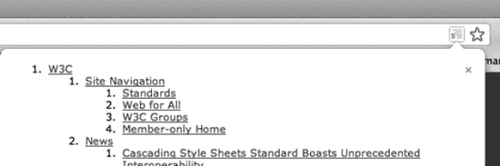

***图 3-6。**Chrome html 5 Outliner 扩展出现在地址栏右侧。该图像显示了`[`w3.org`](http://w3.org)`地点的部分轮廓。*

### div(和跨度)过时了吗？

所有这些关于在页面上划分内容的讨论几乎没有提到`div` s！时代变了。在 HTML5 之前，`div`遍布网页；它们是不可避免的脚手架，用于创建页眉、页脚、列和页面的所有其他部分。有了这些新的切片元素，`div`会重蹈`blink`的覆辙吗？不，`div` s 仍然非常存在；在某些情况下，它们已经被更多语义定义的元素所扩充和取代，但是它们仍然是有效的元素，并且有它们的位置。因为`div`元素本身没有任何语义，所以它们可以适当地用于分组相关内容、无关内容、整个页面或一个句子。 6 从语义的角度来看，这些都是相等的，`div`并没有给这些分组增加更多的含义。它们的多功能性在于它们没有额外的语义包袱。因此，它们对于应用 CSS 规则或从 JavaScript 访问一段内容仍然很有用。当没有其他元素适合时，一个`div`是一个伟大的包罗万象的元素！

同样，`span`在 HTML5 中仍然存在。它与`div`有相似之处；当`div`用于流内容时，`span`可以用于短语内容。

如果您有一段内容似乎不适合放在另一个元素下，下面是两个很好的经验法则来确定您是否应该使用`div`(或者`span`，如果您正在处理文本级的语法内容):

> 您是纯粹将标记作为挂钩来应用 CSS 样式还是从 JavaScript 访问内容？*   Can only one `class` or `id` attribute be used to describe the meaning of the content? The `div` and `span` elements do not introduce any semantics of their own, but if there are no other suitable elements, you can add meanings through the `class` and `id` attributes.

### 案例研究:城市出版社

既然您已经习惯了使用 HTML5 sectioning 元素来组织 web 页面的结构，我们将把注意力转向细节，页面的文本级语义。这些是包含语法内容的元素——段落中的文本等等。我们将以虚拟报纸*城市出版社* ( 图 3-7 )的主页为例，探讨这些元素。出于演示目的，*城市新闻*页面使用了大量不同的元素进行编码。

__________

6 但是，需要注意的是 div 不在分节内容类别中，用于代替节的 div 不会向文档大纲添加新的节。

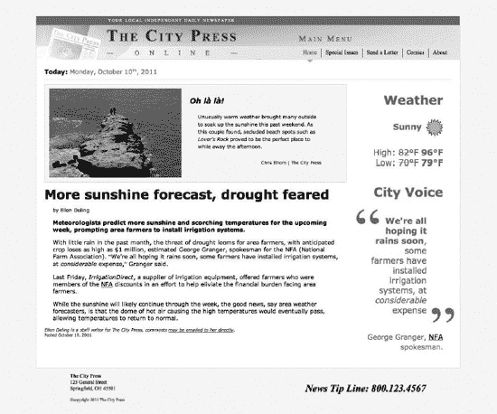

***图 3-7。**虚构的报纸主页被用作使用语义丰富的 HTML 元素的案例研究*

在我们深入研究文本级语义之前，让我们先来看看这个页面的轮廓，看看它是如何构成的(图 3-8 )。

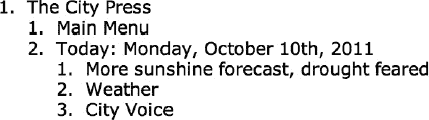

***图 3-8。**城市新闻网页的轮廓*

查看大纲，您可以看到文本“The City Press”是主体的标题，它包含两个嵌套的部分，“Main Menu”(`nav`元素)和“Today:2011 年 10 月 10 日，星期一” ( `section`元素)。在“Today”部分，有一个`article`元素(“更多阳光预报……”)和两个`aside`元素，一个是天气预报，一个是“城市之声”，其中包含文章故事的一段引文。

#### 添加文本级语义

大量的元素可用于标记段落和其他内容组中的文本。这些元素用于定义哪些单词是超链接，哪些应该被强调，哪些应该被标记为重要，哪些应该与文本的其他部分区分开来，等等。我们将逐一探究这些元素。

##### 超链接:a

链接最有可能出现在段落旁边，作为你学习的 HTML 的第一部分，但是我们仍然可以探测到模糊的深度，并发现一些潜在有用的行为。严格来说，`a`元素不是链接；这是一个**超文本锚**，它可以链接到一个新文件，通过它的`id`属性指向任何元素，或者，如果它缺少`href`属性，就充当一个占位符，否则链接可能会被放置在那里。

与以前的 HTML 版本相比，`a`元素中一个令人兴奋的新变化是，在链接中可以放置更多的灵活内容。任何流内容都可以嵌套在其中，只要它不是来自交互式内容类别(按钮、链接等)，因此在过去，链接可能是这样的:

`<a href="newpage.html">link text that appears on web page</a>`

它现在看起来像这样:

`<a href="newpage.html">
          <section>
                   <h1>Wow an entire section in a link!</h1>
          </section>
</a>`

作为快速复习，`href`属性决定了链接的位置，而标签之间的文本是在网页中查看时变得可交互的内容。当文本被点击时，它将连接到在`href`属性中指定的任何东西，通常是一个文件(最常见的是一个网页)。然而，它可能连接到所谓的**片段标识符**，这是链接文档中元素的`id`属性中的值。如果`href`属性包含一个片段标识符，用户不仅会被引导到链接的文档，还会被带到与片段标识符具有相同 ID 的任何元素。

为了链接到片段标识符，在 URL 的末尾添加一个散列符号和值，如下所示:

`<a href="newpage.html#parttwo">link</a>`

如果您想要链接到同一页面上的片段标识符元素，则不需要包括文档文件名:

`<a href="#parttwo">link</a>`

这将链接到带有“`parttwo`”的`id`的元素，可能如下所示:

`<h3 id="parttwo">Part Two</h3>`

链接到同一页面上的某个已标识元素可以有多种用途，例如用于一篇长文档的目录，有时还可以用作“返回页面顶部”链接:

`<a href="#top">back to top</a>7`

 **注意**另一个常见的用途是创建**跳过链接**，这些链接允许人们跳过很长的导航链接以获取内容。对于使用键盘、移动设备或屏幕阅读设备导航的用户来说，通常会包含跳转链接，但有时它们也会以可视方式呈现给那些放大图片但可能不喜欢滚动的用户。总结跳转链接的一篇有用的文章是 Jim Thatcher 的“跳转导航”(`[www.jimthatcher.com/skipnav.htm](http://www.jimthatcher.com/skipnav.htm)`)。

拥有一个不包含`href`属性的锚元素是完全可以接受的。例如， *City Press* 网页上的菜单包括一个围绕“主页”的链接，该链接不链接到任何地方:

`<nav>
            <h1>Main Menu</h1>
            <ul>
                      <li><a class="current" title="Home">Home</a></li>
                      <li><a href="special.htm" title="Special Projects">Special
                       Issues</a></li>
                      <li><a href="contact.htm" title="Send a Letter">Send a Letter</a></li>
                      <li><a href="comics.htm" title="Comics">Comics</a></li>
                      <li><a href="about.htm" title="About">About</a></li>
           </ul>
</nav>`

让超链接链接到用户当前所在的页面是没有意义的，但同时，出于语义或样式的目的，从所讨论的菜单项中删除锚元素也是没有意义的。在*城市新闻*网页的情况下，`href`属性被移除，而`class="current"`被动态地添加到服务器端，这提供了一个 CSS“钩子”，可以很容易地将主页链接的样式与菜单的其他部分不同(图 3-9 )。

__________

显式包含一个 ID 为“top”的锚或标识元素是一个好主意——一些浏览器会推断出这样的位置。

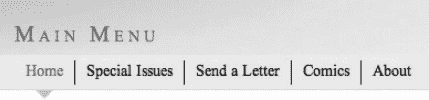

***图 3-9。**城市新闻菜单，残疾人主页链接显示通过一个类应用的单独样式*

HTML5 在`a`元素中增加了三个新的属性，`media`、`type`和`download`，分别指定链接是否为在特定媒体/设备上显示而优化；链接资源的 MIME 类型(`image/jpeg`、`text/html`等等)；以及最后，该链接是否指定了要下载的资源。如果资源是要下载的，那么`download`属性中的值就是给下载文件的默认文件名。在撰写本文时，这个属性才刚刚出现在 Google Chrome 的最新版本中。

锚元素上剩下的属性是`target`、`hreflang,`和`rel`。定义链接打开位置的`target`属性将在第四章和第五章中进一步讨论，但它通常具有下列值之一:`_blank`、`_self`、`_parent`或`_top`，这些值决定链接是在新窗口、当前窗口、包含窗口(例如，如果使用了内嵌框架)还是最顶层的包含窗口(如果多个框架嵌套在一起)中打开。属性定义了链接资源的语言；然而，它纯粹是建议性的，实际上没有任何权力设置链接页面的语言(无论如何，它可能在其`html`元素上设置了一个`lang`属性)。最后，`rel`属性定义了链接的类型。它有许多可能的值，如表 3-1 所示。

 **注意**`area`元素(在第五章的中讨论)使用了与表 3-1 中所示相同的值作为其`rel`属性。此外，这些值中的许多也在`link`元素中使用(参见第二章中与表 2-5 的重叠部分)。

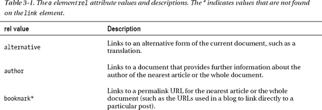

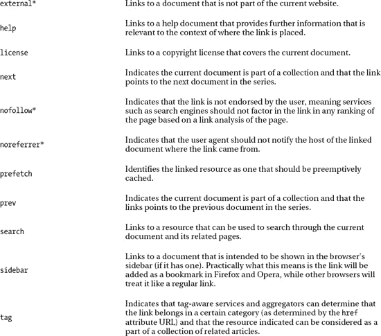

 **注意**WHATWG HTML 规范为链接定义了一个`ping`属性(`a`元素和`area`元素——在第五章中有介绍)，用于定义链接被访问时应该通知的 URL。然而，对它的包含存在争议(担心它可能被滥用)，并且 HTML5 规范的 W3C 版本不包含该属性。在这个问题解决之前，你最好暂时不要去管这个属性。

##### 重点和重要性:em 和 strong

虽然 web 浏览器通常会显示分别带有斜体和粗体文本的`em`和`strong`,但是这些元素不应该被视为粗体或斜体文本的手段，因为表示功能应该留给 CSS 样式表；更确切地说，`em`元素应该用来表示*的强调*，而`strong`元素应该用来表示重要性。嵌套这些元素中的任何一个都传达了对所包含内容的越来越多的强调和/或重要性，例如:

`<strong>CAUTION</strong>
<strong><strong>WARNING</strong></strong>
<strong><strong><strong>DANGER</strong></strong></strong>

I am <em>worried!</em>

I am <em><em>very</em> worried!</em>
`

你可能不希望你的重点以这种方式显示出来。请记住，您可以随时重新设计`em`和`strong`元素的样式，以您喜欢的方式显示，同时仍然保留它们的含义。例如，如果你的文档是日文表意文本，那么你就不太可能需要斜体来强调。改变背景颜色可能更合适。

 **注**在 Molly E. Holzschlag 的文章“世界变小:全球网络的开放标准”(`[www.alistapart.com/articles/worldgrowssmall](http://www.alistapart.com/articles/worldgrowssmall)`)中更详细地讨论了国际化的上述问题。

对于*城市新闻*网页，`strong`在天气预报中被用于给出预报值相对于周围标签的重要性(例如，“高”和“低”):

`<aside>
          <h1>Weather</h1>
          
<strong>Sunny</strong>

          <ul>
                     <li>High: <strong>82?F</strong></li>
                     <li>Low: <strong>70?F</strong></li>
          </ul>
</aside>`

从语义的角度来看，实际的天气内容是这一部分中最重要的，因此`strong`元素被恰当地应用于天气值，而不是周围的标签。

 **注**图 3-7 中*城市压力*截图显示的划掉的温度将在后面的“不准确文本”部分添加。

##### 正文分开设置:I 和 b

`i`和`b`元素在历史上用于呈现粗体和斜体文本，在实践中，如果没有额外的样式，在 web 浏览器中看起来与`em`和`strong`元素在视觉上无法区分。那么，为什么在 HTML5 中它们没有被扔进过时的垃圾箱呢？每一个实际上都有细微的、语义(意思)上的不同，这些都被编入了 HTML5。虽然`em`元素是为了强调，但是`i`元素是为了将文本与其他文本进行偏移，以便在阅读时，它可以以不同的声音或语气出现。这是什么意思？好吧，就拿下面这段文字摘录来说:

> 西蒙傻笑道:“是的，我很乐意把垃圾拿出去。”“唉，我真的不想！”他一边拿起垃圾袋一边想。

第二段讲话是西蒙的内部对话，所以它会以不同的声音读出来，而不是实际所说的。该文本的 HTML 可能如下所示:

`
Simon smirked, “Yes, I'm happy to take the garbage out.” “<i>Ugh, I <em>really</em> don't
want to!</i>,” he thought as he picked up the garbage bag.
`

注意这里已经抛出了一个`em`,这样您就可以看到这两个元素在含义上的不同。

当内容是一个技术术语或分类名称或者是一个外语短语时，也可以使用`i`元素。*城市出版社*的网页包含法语短语“Oh là là”，这是`i`元素的一个很好的候选词！HTML 看起来像这样:

`<i lang="fr">Oh là là!</i>`

注意使用了`lang`属性来指定这个文本是法语。使用`lang`属性对浏览器如何处理文本有影响，因为不同的语言可以对引用的文本使用不同的字形。

`b`元素用于分隔文本，而不传达任何额外的重要性(与`strong`元素相反)或可选的声音或语气(与`i`元素相反)。例如，可以使用`b`将产品评论中的产品名称与附带的文本分开。或者它可以用于食谱中的配料:

`
After bringing <b>water</b> to a boil, add <b>potatoes</b> and <b>carrots</b>
`

另一种用法是在文章或故事的开头。这是吸引读者的第一段。它并不比文本的其余部分更重要，但它应该突出，以便抓住注意力。*城市新闻*网页包括以下内容:

`
<b class="lede">Meteorologists predict more sunshine and scorching temperatures for the
upcoming week, prompting area farmers to install irrigation systems.</b>
`

在这种情况下，`b`元素的用途是使用一个`class`属性专门定义的。

##### 旁注:小

与`i`和`b`一样，`small`传统上被用作一种表现元素。它让文本——你猜对了——变小了！这是一个更适合 CSS `font-size`属性的任务。在 HTML5 中，`small`获得了真正的语义。它现在意味着小字、小字、旁注、所有可能包含法律免责声明、许可协议、版权等的地方。它也可用于指示一件作品的属性，如文本或图像。*城市新闻*中的记者姓名放在小元素中。例如，在主照片标题的末尾，HTML 显示如下:

`<small>Chris Elhorn | The City Press</small>`

##### 不准确的文本

另一个在 HTML5 中改变了含义的元素,`s`元素在历史上意味着删除线文本，本质上是表示性的，被指定为过时的 bin。然而，在 HTML5 中，`s`被重新定义为不再准确或相关的文本。例如，*城市新闻*网页在天气侧边栏显示温度。这些值最近已经被更新，所以旧值使用`s`元素被标记为不准确，而新值使用`strong`元素被赋予重要性(如前面的“强调和重要性”一节所示):

`<ul>
          <li>High: <s>82°F</s> <strong>96°F</strong></li>
          <li>Low: <s>70°F</s> <strong>79°F</strong></li>
</ul>`

 **注意**在某些情况下，可能有必要将文本标记为已删除，例如在维基(维基百科等用户编辑网站的更通用术语)中查看页面变化时。虽然对标记为 deleted 的文本使用`s`元素可能很诱人，但是有一个`del`元素可以做到这一点。

##### 突出显示文本:标记

`mark`是一个新元素，可用于突出显示某些文本以供参考。你可以把它想象成一个荧光笔，用来标记书中的一些文字。它也可以用来强调原报价中没有强调的部分。在*城市出版社*网页中，右下角的`blockquote`中使用了`mark`元素来为开始的文本添加粗体(默认情况下，大多数浏览器会将`mark`中的内容呈现为黄色背景，但是您可以使用 CSS 来改变这一点):

`<blockquote cite="#article1">
          
<mark>We're all hoping it rains soon</mark>, some farmers have installed
          irrigation systems, at <em>considerable</em> expense

</blockquote>`

 **注意**注意在`blockquote`的`cite`属性中使用了一个片段标识符。这将它链接回页面上的原始源文章，其属性为`id="article1"`。

##### 内联报价:问

元素的作用是给文本块添加行内引号。它对于组织内容就像`blockquote`对于流动内容一样。这个元素已经存在一段时间了，但是在过去遭受了不一致的浏览器支持，所以不推荐使用它。然而，情况已经有所好转，?? 元素在现代网络浏览器中获得了更广泛的支持。浏览器应该在引用的开头和结尾自动包含印刷正确的引号，这意味着你，作者，应该*而不是*包含它们。此外，通过明智地使用`lang`属性，这些引号应该以适合于指定语言的样式显示(例如，一些欧洲语言将使用 v 形符号或 *guillemets* : and，而不是“and”)。如果由于浏览器支持不佳而无法实现这一点，可以使用 CSS 通过 ASCII 代码和`quotes`属性添加适当的引号。例如，要将正确的引号添加到一个`<q lang="fr">`元素中，请使用:

`q:lang(fr){ quotes: "\AB" "\BB" "\2018" "\2019"; }`

但是，Safari 不支持这种功能。

此外，浏览器应该显示嵌套引号的意识(在英语中，如果引号以双引号字符开始，那么引号中的引号应该使用单引号字符，反之亦然)。例如，下面这段 HTML:

`
<q>This is a quote that has a <q>nested quote</q> as part of it.</q>
`

应该显示如下:

> *`This is a quote that has a 'nested quote' as part of it.`*

虽然这听起来非常令人兴奋，但现实却更加平淡无奇。例如，Safari 也不支持这一点，但大多数其他浏览器都支持。虽然支持变得更好，但您可能仍然会发现最好暂时不要使用`q`,即使它确实提供了一点独特的语义。

##### 处理条款:dfn 和 abbr

`dfn` (definition)元素在标记将在整个文档中重复使用的术语的定义实例时非常有用。它通常与`abbr`(缩写)元素结合使用，以定义第一次出现的缩写或首字母缩略词，供以后参考。在使用了`dfn`元素之后，术语的定义需要出现在与`dfn`元素相同的段落、描述列表(`dl`元素)或部分中。通常，这相当于让结尾的`dfn`标签后面的文本定义所讨论的术语。在 *City Press* 网页中，一个虚构的组织——国家农场协会(NFA)被包装在一个`abbr`元素中，并且在文本中第一次出现一个`dfn`元素:

`<dfn id="nfa"><abbr title="National Farm Association">NFA</abbr></dfn> (National Farm
Association)`

强烈建议您将`title`属性与`abbr`元素一起使用，以便在悬停在元素上时提供缩写的全文扩展。此外，`dfn`元素被赋予了一个`id`属性，该属性可用于将未来出现的缩写链接回其定义实例:

`<a href="#nfa"><abbr title="National Farm Association">NFA</abbr></a>`

该链接使用片段标识符指向前面的`dfn`元素，因此用户可以跳回到文本中定义“NFA”含义的地方(在`dfn`后面的括号中)(图 3-10 )。

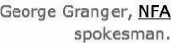

***图 3-10。**缩写可以链接回第一个使用`dfn`元素定义它们的地方。*

##### 下标和上标:sub 和 sup

科学界有一个笑话，两个人在餐馆里，女服务员问他们想喝点什么。第一个人回答说“H 2 O。”女服务员看着第二个顾客，后者想了一会儿说，“我也要 H 2 O！”

过了一会儿，女服务员端着饮料回来了。第一个人喝了一大口。第二个人喝了一口，倒在地板上，口吐白沫。“白痴，”第一个喊道。

有趣的是，第二个人并没有像第一个人那样显得聪明，而是无意间点了“H 2 O 2 ”(过氧化氢)而不是 H 2 O(水)。

虽然`sup`和`sub`(上标和下标)本质上看起来是表象性的，但正如这个笑话所展示的，它们传达了它们周围文本的重要意义。

考虑以下两个等式:

> *   e = MC 2

虽然它们看起来很像，但前面的方程中只有一个是爱因斯坦的；拼写出来，前一个等式是“e 等于 m 乘以 c 的平方”，而后一个是“e 等于 m 乘以 c 乘以 2。”

 **注意**对于比这更复杂的方程，你应该使用数学标记语言(MathML)，它在一个独立于描述 HTML 的规范中定义，但可以嵌入在 HTML 文档中。

或者这个怎么样:

> 2

第一个是水的化学方程式——两个氢原子和一个氧原子——第二个只是字母 *H* 后跟数字 2，然后是字母 *O* ，没有意义。因此，2 的放置和样式很重要，如果你把它的样式和位置去掉，放在一个样式表中，一些浏览器可能会失去意义。

W3C 还指出，一些语言(除了英语)要求使用下标和上标文本。这里有一个法语例子:M lle Dupont。

在文体上，上标和下标也出现在英语中。您最有可能在日期中看到它们，或者指出脚注/尾注的存在:

> 九月十四日日日日*   The report of the committee stated that the minister's actions were sincere.

在 *City Press* 的例子中，一个上标出现在页面顶部的日期中，在`time`元素内，这将在下面讨论:

`<time datetime="2011-10-10">Monday, October 10th, 2011</time>`

##### 具体日期:时间

元素是对 HTML 调色板的一个很好的补充，特别是对于联合内容。正如本章开头提到的，它定义了公历中的一个特定日期。它可能包括一个时间和一个时区偏移量，但它不需要这样做。最好使用`datetime`属性精确地指定日期/时间，因为实际内容可能相当松散，例如:

`<time datetime="2011-05-08">Mother's Day</time>`

`datetime`属性遵循格式 *YYYY-MM-DDThh:mm:ssTZD* (即 2011-10-23T10:23:44+05:00)。时间和时区部分是可选的。

唯一的另一个属性是布尔属性`pubdate`，它指示日期/时间是最近的文章元素的发布日期，或者如果没有找到文章，则是整个文档的发布日期。*城市出版社*的网页在主要文章的页脚使用了这个(通常可以找到出版日期):

`<small>Posted <time datetime="2011-10-10T12:16:20Z" pubdate>October 10, 2011</time></small>`

 **注**时区偏移量中的 Z 代表世界协调时(UTC)，与+00:00 相同。

##### 换行:br 和 wbr

换行符元素`br`(呈现为` `或` `，因为它是自结束的)通常用在新行是内容格式的预期部分的内容中，比如邮政地址或诗歌。*城市出版社*在邮政地址的页脚部分使用这个:

`

<b>The City Press</b> 
123 General Street 
Springfield, OH 45501

`

另一个换行元素，`wbr`(或`<wbr />`)，是 HTML5 中新增的。它定义了如果空间不允许整个单词，在单词的什么地方可以换行。在*城市出版社*的网页中，提到了一家名为*irrigination direct*的公司。这是`wbr`元素的完美候选，因为如果需要的话，HTML 可以指示浏览器在中间断开名称，并且名称仍然有意义。代码如下:

`<i>Irrigation<wbr />Direct</i>`

### 其他文本级元素

这一部分涵盖了一些没有在*城市出版社*网页中使用的落伍者——无论如何，让我们简要地浏览一下他们！

#### 作品名称:引用

`cite`元素表示作品的标题，如书籍、歌曲、电影、电视节目、绘画等等。我们已经遇到了在`blockquote`元素中使用的`cite`属性，用于将来源归属于引用，但是还有一个`cite`元素，用于包含与任何特定元素或其他材料的引用无关的独立引用。大多数用户代理会用斜体显示引文，这是印刷世界中常见的印刷惯例。

#### 格式化计算机 I/O:代码、变量、样本、kbd

`code`、`var`、`samp`和`kbd`元素与之前的 HTML 规范没有任何变化。它们分别定义了计算机代码片段、变量、计算系统的样本输出和用户输入。既然这里没有什么新情况要报告，我们就继续吧。

#### 标记文本编辑:ins 和 del

有时，能够指示文档中发生的编辑是有用的，例如，指示添加了什么内容以及删除了什么内容。例如，博客上的管理区将有一个创建和编辑帖子的区域。标记和查看博客帖子的修订版，指出与原始版本相比有什么变化，这可能很有用。HTML5 正好有这个用途的元素！元素用于标记一段文本的插入，而元素用于标记一段文本的删除。这里重要的一点是，它将内容标记为已编辑，但内容应该仍然存在(对于用`del`标记为已删除的内容)。

JavaScript 大师 John Resig 有一个示例脚本，它使用`ins`和`del`来显示对一段编辑过的文本的更改。你可以在`[`ejohn.org/projects/javascript-diff-algorithm/`](http://ejohn.org/projects/javascript-diff-algorithm/)`查看例子。

 **注意**在没有进一步样式化的情况下，`ins`文本的默认外观通常带有下划线，而`del`则带有删除线。这意味着默认情况下`del`看起来会像`s`；然而，它们肯定是不可互换的。`s`用于标记不准确的内容，而`del`用于标记被删除的内容，不管它是否准确。

`ins`和`del`有两个属性，`cite`和`datetime`。`cite`属性用于指定解释编辑的文档的网址，而`datetime`属性用于指示编辑发生的日期和可选时间。有关该值的格式，请参考本章前面的 time 元素，但它看起来类似于:

`

<ins datetime="2011-10-26T12:00Z" cite="edit10262011.html">new text</ins> is added, while` `<del datetime="2011-10-27T12:30Z" cite="edit10272011.html">old text</del> is removed.

`

#### 处理外国剧本

有几个元素用于显示来自世界各地的书写脚本的不同格式要求和语义。虽然拉丁字母(英语中使用的)已经在 Web 上占据主导地位很多年了，但是作为一种全球现象，Web 需要能够正确地处理不同的字母。下面的元素将帮助格式化 ruby 符号和双向文本。

##### Ruby 符号:ruby、rt 和 rp

**拼音**指的是与另一个文本片段有关联的一个文本片段，称为**基础文本**—它最常用于提供基础文本的简短注释或发音指南，并在东亚排版中使用。通常情况下，它会在基本文本上方显示红宝石文本，但浏览器支持会有所不同，如图 3-11 中的所示。

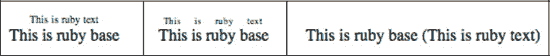

***图 3-11。**在(从左到右)、Safari、Chrome、Firefox 中呈现的红宝石文本*

图 3-11 中的文本有以下 HTML 来源:

`<ruby>
This is ruby base <rp>(</rp><rt>This is ruby text</rt><rp>)</rp>
</ruby>`

如您所见，顶部文本是在`rt`元素中指定的。元素用于为不支持 ruby 的浏览器定义备份内容。在这种情况下，它们用于设置在 Firefox 上显示的括号(图 3-11 )。

 **注**关于 ruby 符号的更多信息，请参考位于`[www.w3.org/TR/ruby/](http://www.w3.org/TR/ruby/)`的 W3C Ruby 符号规范。

##### 文本方向:bdo 和 bdi

如果您用外语标记文本，那么您可能会发现使用了`bdo`元素(即“双向覆盖”)和`dir`属性(这是该元素所必需的)。`bdo`分别控制文本片段和文本块的方向，最适合用于标记从右向左而不是从左向右书写的阿拉伯语和其他语言。当单词或短语的方向性不同于包含元素中设置的方向性时，使用`bdo`。默认情况下，包含元素的方向是从左到右。让我们来看一个使用英语的例子(尽管这是一种从左到右的语言，您将能够看到`bdo`元素的效果):

`
When rendered by a browser, <bdo dir="rtl">these words</bdo> will appear as 'sdrow
eseht'
`

该标记呈现如图图 3-12 所示。

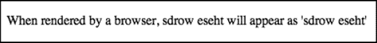

***图 3-12。**单词“这些单词”已被`bdo`元素反转。*

有关如何创建使用从右向左脚本的页面的详细概述，请参考下面的 W3C 国际化教程:`[www.w3.org/International/tutorials/bidi-xhtml/](http://www.w3.org/International/tutorials/bidi-xhtml/)`。

 **注意**有一个叫做`bdi`的新元素，它是用来隔离一段文本的，这样它就可以被格式化为向左或向右流动，完全不受周围环境的方向性影响。这个元素还没有在任何主流浏览器中实现，所以您必须等待使用它，但是这个想法是，当一段特定文本的方向性未知时，可以使用它。例如，博客访问者留下的多语言评论可能包括用从左到右和从右到左语言写的文本，但你事先不知道文本的方向。通常，一个文本块将从其父元素继承从左到右或从右到左的方向，但出现在`bdi`中的文本将忽略任何继承的方向设置，并将默认将其`dir`属性设置为`auto`，这将根据其字符集自动检测文本的方向。

### 总结

结构化标记的目标是尽可能恰当地使用可用元素。有时选择的元素会比其他时候更接近地描述它们的内容。有时，使用什么样的元素是不明确的——在这种情况下，需要仔细研究规范并做出谨慎的判断——但是 HTML5 提供了比该语言以前的版本更多的选择和更好的规则。关键是停止视觉上的思考*。如果您正在使用 Adobe Photoshop 或 Fireworks 进行设计，那么在构建网站时，您可能会发现这有助于忘记样式，直接在文档中键入所有内容(或者占位符文本，如果您当时没有所有内容(`[`lipsum.com`](http://lipsum.com)`是填充文本的好来源)。所谓“内容”，我指的是*一切*——不仅仅是正文，还包括任何导航、页眉、页脚等等。如果某个东西最后可能会以一个形象结束(比如一个企业 logo)，那么在这个阶段就不要担心它。只是在它的位置包含一些文本；如果需要，您可以随时用内嵌图像替换它。*

 *当你这样做的时候，想想你正在键入的内容，想想你将如何向其他人描述它，想想有哪些元素符合你的描述。忘记现在会是什么样子——不要认为`h1`是“大、丑、粗”的，因为那只是默认情况下的样子。把它想象成网页内容轮廓中的标题——一个要点。就外观而言，一切都可以用 CSS 重新设计。*