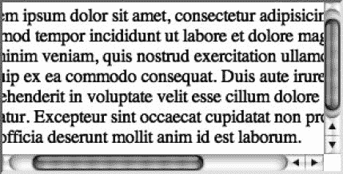
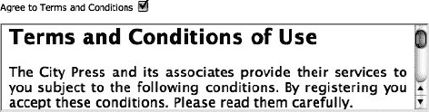
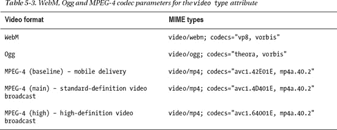
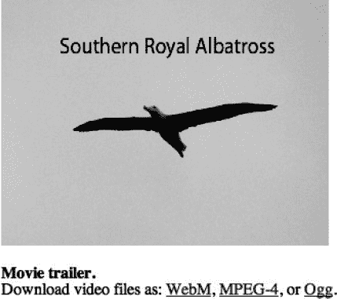
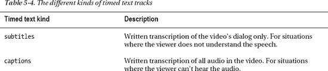
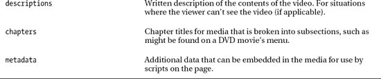

# 五、多媒体：视频、音频和嵌入式媒体

网站只有带项目符号的文本列表，没有任何形式的图像的日子已经一去不复返了。但是如果你仔细想想，HTML 从来就不是真正的多媒体通。图像很早就出现了，也有像(现已不存在的)`bgsound`这样的噱头元素，但是交互体验、网络应用、视频播放器——每一个都是由某种形式的插件提供的，在很大程度上扩展了 HTML 的功能。在这方面，HTML5 中增强的多媒体功能对于最终用户来说是 HTML 时代的到来。例如，`video`和`audio`元素分别提供了处理视频和音频媒体的标准化方法。这听起来像是网络媒体的一个巨大进步，的确如此，但也并非一帆风顺。尽管这些元素作为 HTML5 规范的一部分被标准化了，但是这些媒体元素中使用的文件格式却没有标准化，这导致了一些冗长的解决方案来提供替代内容。但是不用担心，这决不会使这些实现不可用，在本章中，您将看到处理回退内容的一致的最佳实践方法是可能的。

本章开始时，我将浏览 HTML 中的一些媒体元素，并向您概述发生了哪些变化。这将涵盖图像、图像映射、通用嵌入对象(处理视频的老派方式)和帧的状态等主题。然后，我将介绍 HTML 中引入的用于处理视频和音频的新元素。最后，我将简要介绍一下`canvas`元素，它用于定义一个可以动态呈现图像的区域。与`canvas`的互动将在第七章中更深入地讨论，但基础将在本章中讨论。

### 一切开始的地方:img

在 HTML 发展的早期，很明显平台需要支持某种形式的嵌入页面的混合媒体——至少是图像。实现可用于图像和其他媒体的 HTML 元素的工作始于 1993 年初，当时 21 岁的马克·安德森提出并在 Mosaic web 浏览器中实现了自结束`img`元素。Mosaic 被认为是推动 20 世纪 90 年代互联网繁荣的核心力量，它将网络浏览器从基于文本的系统转移到更容易吸引非技术受众的图形应用。尽管对`img`的局限性有所保留(其他人想要一个可以嵌入比图像更多种媒体的元素)，但`img`元素今天仍然存在。HTML5 没有太大的变化，除了删除了属性`align`、`border`、`hspace`和`vspace`，这些属性的功能应该通过 CSS 来创建。

___________

1 Marc Andreesen 提议 img 元素的原始信息存档于[`1997 . web history . org/www . lists/www-talk . 1993 Q1/0182 . html`](http://1997.webhistory.org/www.lists/www-talk.1993q1/0182.html)。

`img`元素一般需要两个属性:`src`和`alt`。第一个是`src`，指定实际图像文件的位置。该位置可以作为绝对或相对 URL 给出，这意味着它可以被指定为图像的绝对地址，如`src="http://example.cimg/pic.jpg"`，或者是相对于当前 HTML 页面的地址，如`src="img/pic.jpg"`。JPEG、GIF 和(相对较新的)PNG 图像是 Web 上流行的图像格式，但是很少有人知道`img`元素并不局限于这些格式及其变体。根据网络浏览器的不同，可能会显示 TIFF、BMP、XBM，甚至 PDF 2 文件。这种多种多样的支持是因为 HTML 规范并没有指定该元素需要支持哪些图像格式，只指定要显示的文件实际上是一个图像。

**何时使用一种图像格式而不是另一种**

在决定网站上的特定图像使用何种图像格式时，您可以遵循一些通用规则。对于有许多色调的照片内容，JPEG 是可以选择的格式。如果图像中有连续的实心色块，如徽标或插图，请在 GIF 或 PNG 之间选择。PNG 提供了比 GIF 更大的灵活性，最初创建 PNG 是为了取代 GIF，因为 GIF 格式的算法存在许可问题。所以，总的来说，用 PNG。但是，GIF 有更多的遗留支持。包含透明度的 png 在 Internet Explorer 6 中将显示为粉红色；然而，可能是时候放弃对浏览器历史上如此久远的浏览器的支持，而只使用 PNG 了。PNG 一般有两种形式:PNG-8 和 PNG-24。如果图像中的调色板很小(256 色或更少)并且没有任何渐变区域，请使用 PNG-8。如果在图像中使用透明度，通常 PNG-24 将提供更好的结果，因为它将更好地处理图像的不透明和透明区域之间的过渡。

 **注意**谷歌最近推出了一种新的网络图像格式，称为 WebP(读作“weppy”)，是 JPEG 格式的竞争对手。值得关注，但目前浏览器支持太少(Google Chrome 和 Opera ),无法考虑将其作为主要的图像格式。你可以在`[`code.google.com/speed/webp/`](http://code.google.com/speed/webp/)`找到更多信息。

下一个属性`alt`用于在图像不可用或不可见时为图像提供替代内容。属性中的文本应该合理地表示图像，如果图像被删除，也不会改变页面上内容的含义。如果`alt`属性是对页面上其他信息的补充或冗余，或者如果它纯粹是装饰性的，那么它可以是一个空的文本字符串(`""`)，在这种情况下，CSS 可能是处理图像的更好方法(参见“?? 过时了吗？CSS 呢？”侧边栏)。在不可能提供图像的文本表示的情况下，也可以省略`alt`属性，例如在由用户上传的动态添加的图像中，在这种情况下，图像的实际含义可能不会立即为人所知。如何在不同的上下文中正确使用`alt`属性是一个令人惊讶的争论问题，但从根本上来说，它应该被认为是图像的替代物，*而不是*图像的描述。由`title`属性提供描述更为正确。例如，对于显示安道尔地图的图像，如果目的是显示安道尔在世界上的位置，则提供“安道尔地图”的替代文本是不正确的。更好的替代文本将复制图像所传达的意思。在这种情况下，可能是这样的:“安道尔是一个内陆西欧国家，西南与西班牙接壤，东北与法国接壤”(图 5-1 )。

___________

在支持的地方(例如，在 Safari 中)，PDF 文档将只显示第一页，因为 img 不允许显示分页内容。

***图 5-1。**当图像不可用时，`alt`属性显示的替代文本应该再现图像的目的，而不是描述图像。图像的描述性摘要最好由`title`属性提供，当鼠标悬停在图像上时会出现。*

虽然不是必需的，但是最好将`width`和`height`属性设置为源图像的宽度和高度(以像素为单位)。这将允许浏览器在图像完全加载之前呈现图像将占据的空间。这也意味着如果一幅图像丢失了，页面的布局也不会改变，因为一个空框`width`和`height`属性的尺寸将被呈现出来(图 5-1 显示了这样一个框)。

 **注意**Google Chrome 和 Safari 的底层布局引擎 WebKit 存在一个问题，如果宽度和高度不够大，无法在一行中容纳所有替代文本，则无法在找不到图像时显示替代文本。如果当图像不可用时，您在这些浏览器中看不到替代文本，原因可能是尺寸设置。

IMG 过时了吗？CSS 呢？

`img`元素是古老的——事实上它比层叠样式表(CSS)还要古老。自 20 世纪 90 年代早期以来，Web 上的内容表示已经有了很大的发展，与 CSS 相比，`img`元素在许多方面非常有限。因为 CSS 关心的是页面的外观，包括图像，所以 CSS 提供了处理图像的能力，通常比使用`img`元素更灵活。使用 CSS，图像可以应用于页面上任何元素的背景(通过使用`background-image`和相关属性)，图像可以平铺、偏移和等。正在开发的 CSS 规范的最新版本 CSS3 增加了更多的图像处理功能，例如将多个背景图像相互叠加的能力。 3

此外，HTML5 规范明确指出，应该避免出于布局目的使用`img`元素。使用图像进行布局的示例包括通过使用基于图像的背景或边框来分隔内容区域，或者使用透明图像在页面上的内容旁边提供填充。这些任务更适合 CSS，通常通过`background`、`border`和`padding`属性来完成。

此外，从性能的角度来看，重要的是要记住,`img`元素在 HTML 页面中为外部资源提供了一个占位符。因为每个链接的资源都必须向 web 服务器发出请求，所以会发出对 HTML 页面的请求，并且页面上的每个图像都需要额外的请求。使用 CSS，一种被称为 *CSS sprites* 的技术，可以用于将多个图像合并成一个图像，以减少服务器请求。这些图像并排布置，并被裁剪以显示来自一个源图像的不同图像。因为这只需要一个请求，而不是每个图像一个请求，所以性能会有所提高。

那么，当 CSS 可以提供更多的灵活性时，为什么还要使用`img`元素呢？答案在于`img`的`alt`属性。由于该属性用于以文本形式表示图像，它解决了 CSS 中丢失的可访问性问题。即使移除了 CSS 样式，HTML 文档中的信息也应该是易于理解的，因此对于页面上显示的信息至关重要的图像，比如文档文本中其他地方引用的图像或图形，应该显示在`img`元素中。

在`img`元素上剩下的属性是`ismap`和`usemap`，它们都用于图像映射，我们将在下面讨论。

### 影像地图

在 Adobe Flash 中内置的交互式动画和图像在 20 世纪 90 年代末风靡一时之前，交互性的高度是可点击的图像地图，其编码的“热点”根据用户点击图像的位置将用户链接到不同的页面。有两种图像映射:服务器端和客户端。在服务器端图像映射中，鼠标单击的像素坐标作为 x，y 坐标对发送到服务器。然后，服务器可以使用该信息来确定用户在图像上单击的位置，并以后续操作做出响应。启用此功能所需的全部工作就是将布尔型`ismap`属性添加到包含在锚元素(`a`)中的`img`元素中:

``

点击图像后，图像被点击位置的坐标(相对于图像的左上角)作为 querystring 出现在 URL 中，类似于`process.php?54,77`。(这个例子意味着点击发生在距离图像的左边缘 54 像素和上边缘 77 像素处。)然后，服务器端脚本可以访问这些坐标，并根据坐标区域的查找表使用它们来确定应该发生什么动作(如果有的话)。

___________

正如你将在第六章中看到的，CSS3 不是一个规范，而是几个。然而，就像“HTML5”经常被用作涵盖一系列相关技术的总括术语一样，“CSS3”涵盖了许多不同但相关的规范。在多背景的情况下，实际的规范是“CSS 背景和边框模块级别 3”

客户端图像地图的工作原理与服务器端图像地图相同，但热点区域是在客户端(网络浏览器)而不是服务器上定义的。这是一种更可取的方法，因为热点坐标可以被无法查看图像的浏览者访问，并且它们提供了关于用户是否正在点击活动区域的即时反馈。然而，与服务器端图像映射相比，所需的标记更加复杂。有两个不同的部分:图像元素(`img`)和关联的`map`元素，两者都不嵌套。`map`元素是一个具有`name`属性的容器元素，它被图像元素的`usemap`属性引用，以创建图像和图像映射区域坐标数据之间的关联。实际的图像映射热点坐标是通过任意数量的自闭`area`元素在`map`元素内定义的。这里有一个例子:

`
<map name="bannermap">
           <area shape="circle" coords="52,76,39" href="/about.html" alt="About" />
           <area shape="rect" coords="120,56,187,102" href="/contact.html" alt="Contact" />
           <area shape="poly" coords="265,148,221,99,221,42,266,24" href="/portfolio.html"
           alt="Portfolio" />
           <area shape="default" href="/index.html" alt="Homepage" />
</map>`

正如您在前面的例子中看到的，`area`元素使用一个`shape`属性来确定热点区域的形状，使用一个`coords`属性来标出形状的尺寸。`shape`属性可以具有值`circle`、`rect`、`poly`或`default`，其对应于绘制圆形、矩形、至少具有三个点的自由形状或整个图像(在`default`状态中，没有给出坐标，因为它覆盖了整个图像)。在大多数情况下，这个区域还会包含一个`href`属性来决定用户点击后应该被带到哪里。另一个属性`nohref`在 HTML5 中已经过时，不再使用。这个属性已经被用来指定该区域不链接任何地方，但是仅仅去掉`href`属性就足以提供这个功能(或者说缺少功能)。

 **注意**为什么在图像地图中会有一个区域没有链接到任何地方？原因可能是在图像上提供工具提示，但不需要链接到任何地方。例如，考虑美国 50 个州的地图。如果创建的图像地图为每个州定义了一个区域，并将其`title`属性设置为相应的州名，则该地图结束，但未设置`href`属性，它将创建一个美国地图，当用户悬停在地图上时，该地图将显示用户所在的州名，但如果用户单击，则不会链接到任何地方。此外，创建一个没有`href`属性的区域允许从其他区域中“冲出”区域，因此，例如，可以通过创建两个重叠的圆形区域来定义一个可点击的圆环形状，只有较大的圆形设置了其`href`属性。

图像映射区域坐标点的意义取决于`shape`属性的值。圆将有三个值，对应于圆形热点中心的 x 和 y 坐标，最后一个值决定圆的半径。对于矩形区域，`coords`属性中有四个值，分别对应矩形左上角和右下角的 x，y 坐标。最后，`poly`区域定义了形状中每个点的 x，y 坐标，这可能是相当多的！可以想象，手工编码图像地图是相当费力的，但是大多数 WYSIWYG web 创作软件只需通过指向、单击和拖动就能创建区域。图 5-2 显示了一个在 Adobe Dreamweaver 中创建的图像地图的例子。

***图 5-2。**使用 Adobe Dreamweaver 绘制的复杂图像地图区域*

除了为热点定义形状坐标之外，`area`元素的作用非常类似于锚点元素(`a`)。如果定义了一个`href`属性，那么可以定义以下附加属性:`target`、`rel`、`media`、`hreflang`和`type`，它们的工作原理与第三章中描述的锚元素(`a`)相同。

此外，应该在图像映射中的链接热点上设置`alt`属性，以便在图像映射中的图像不可见的情况下，它给出链接的文本表示。

### 嵌入其他媒体

HTML5 包括两个用于嵌入非 HTML 内容的元素；也就是说，现有 HTML 元素无法处理的内容需要第三方插件来显示，如 Adobe Flash 内容，它需要 Adobe Flash Player。这两个元素是`embed`和`object`。一般来说，`object`会比`embed`更常用，因为它更灵活，并且可以提供后备内容(在不支持该元素的浏览器中显示的内容)，但是我们会将它们都包括在内，这样您就可以看到它们的区别。

#### 嵌入元素

虽然`img`元素增加了网页的丰富性，但在它被引入的时候，很明显只支持静态图像是不够的。Web 需要一种方法来处理各种各样的嵌入式媒体。在 1993 年关于引入`img`元素的讨论中，另一个元素是由蒂姆·伯纳斯·李(被广泛认为是万维网的发明者)提出的。他建议添加一个`embed`元素来代替`img`，这将解决后者的缺点，即它只支持嵌入图像，而不支持其他媒体或数据。最终，这两个元素都被网络浏览器制造商实现了，`img`用于图像，`embed`用于其他媒体(例如视频)，但是一个官方支持的支持更丰富媒体的解决方案在未来几年将在几个方向上分裂。

`embed`最早是由网景公司实现的，虽然其他浏览器也实现了它，但它有一些奇怪的地方，妨碍了它的标准化。具体来说，它可以包括任意属性(不仅仅是属性值，还有属性本身)，这些属性可以根据所嵌入的媒体而有所不同。这些附加属性可以是任何东西，因为它们将作为参数传递给用于处理内容的插件，插件可能会响应它们。W3C 对这种行为并不放心，特别是当 XHTML 更严格的语法要求似乎是 HTML 的未来发展方向时。到 1999 年 HTML 4.01 规范出现时，`embed`被认为是过时的，不鼓励使用。这可能是`embed`元素的故事的结尾，但是 HTML5 通过将其正式标准化为 HTML 规范的一部分，将它带了回来，尽管是以精简的形式。HTML5 的目标是向后兼容并记录正在使用的东西——尽管有些奇怪，`embed`今天仍在使用。

除了全局属性之外，HTML5 中的`embed`还有一组简单的四个属性，而不是之前的实现所附带的 15 个属性。这四个属性是`width`、`height`、`src`和`type`。

`width`和`height`属性指定嵌入媒体在页面上占据的像素尺寸，而`src`属性指定要嵌入的源媒体文件的地址。如前所述，可以添加附加属性来将设置传递给插件集，以处理特定类型的媒体。例如，下面的代码片段包括一个`loop`属性，它被传递给 Adobe Flash Player(处理 SWF 内容的插件):

`<embed src="game.swf" loop="true" />`

在 HTML5 规范中，`loop`属性没有被指定为`embed`元素的属性，但是 Flash Player 将通过循环播放该 SWF 文件来做出响应。

注意在这个例子中没有指定`type`属性。如果没有指定，浏览器将“内容嗅探”以确定哪个插件应该处理资源(在`src`中指定)。这可能与在资源上查找任何指示其类型的元数据一样复杂，或者与查找可以处理特定文件扩展名的插件一样简单。在这种情况下，带有`.swf`文件扩展名的资源将被移交给 Flash Player。当然，嵌入的文件类型可以通过在`type`属性中提供合适的 MIME 类型来显式设置，如下所示:

`<embed src="game.swf" type="application/x-shockwave-flash" loop="true" />`

除了属性的模糊性，还有一个关于`embed`的问题。它是一个自结束元素，像`img`，但是它没有`alt`属性。这意味着如果元素不受支持，什么都不会显示！为了解决这个问题，浏览器添加了一个`noembed`元素，为不支持`embed`的情况提供内容。然而，`noembed`元素在 HTML5 中已经被标记为过时，不能再使用。

总之，尽管包含在规范中，`embed`由于其局限性和怪癖，最好避免使用。一个更好的选择是`object`元素，我们接下来会看到。

#### 物体元素

因为`embed`的问题和`img`的限制，W3C 在 1996 年选择了`object`元素作为两者的替代。尽管它从未取代`img` , `object`确实在很大程度上取代了`embed`，因为它更灵活(尽管 Firefox 在支持上落后了一段时间)。`F`例如，它有一个开始和结束标签，所以——与`embed`不同——可以在元素的内容区域提供回退内容。

与`embed`一样，`object`在 HTML5 中被精简了，有几个属性被标记为过时，但也增加了一些。属性`data`、`type`、`name`、`width`、`height`和`usemap`是从先前的规范中保留的属性，而属性`form`和`typemustmatch`、被添加。正如您已经看到的，`object`是一个比`embed`更复杂的元素。`object`不仅适用于插件媒体，因为它还支持图像和嵌套网页。

让我们进入`object`的属性。`data`属性类似于`img`或`embed`元素上的`src`属性；它只是指定了要加载的资源的位置。`type`属性的工作方式类似于它在`embed`元素上的工作方式；为要嵌入的资源提供一个有效的 MIME 类型。`data`或`type`属性中的一个或另一个必须存在，但它们不需要都存在。如果两者都存在，可以添加布尔`typemustmatch`属性，这在加载资源时增加了一层安全性。例如，可以使用`object`来嵌入来自第三方网站的媒体和其他资源， 4 如果第三方网站声称他们正在提供一种类型的资源，而实际上这是一个恶意脚本或类似的伪装成无害的东西，这就带来了安全问题。当设置了`typemustmatch`时，浏览器将对链接的资源进行内容嗅探，如果资源的内容类型不同于在`type`属性中设置的值，则不会嵌入资源。

`object`元素可能令人惊讶的一个方面是,`object`意味着能够参与表单提交并随表单一起提交数据。这在 HTML5 中也不新鲜，因为它包含在 HTML 4.01 规范中，该规范将“对象控件” 5 列为表单控件的类型之一。新增的`form`属性只是为了让`object`和其他表单控件保持一致。如果您回忆一下上一章，各种表单控件(`input`、`textarea`等等)使用`form`属性将它们自己与一个或多个表单关联起来，即使它们没有嵌套在它们所引用的表单中。该属性对`object`同样有效。将`object`作为表单的一部分的想法解决了让一些插件直接向服务器发送数据的需求。例如，可能会创建一个嵌入了某种复杂的浏览器内文字处理器的插件，该插件具有 HTML/CSS/JavaScript 所不具备的特性。然后，可以使用文字处理器来代替普通的老式`textarea`，但是在表单提交时，文字处理器可以直接从插件向服务器提交数据(可能包括各种关于文本如何被奇妙地格式化的元数据)。

通常，当嵌入插件资源时，`object`元素需要将定制参数发送给插件；不同的插件会有不同的功能。如前所述，`embed`元素用一个不寻常的(也可能是混乱的)方法解决了这个问题。)允许向元素添加任何附加属性的解决方案，然后将这些属性交给插件。`object`采取了不同的(也可以说是更干净的)方法。不允许添加任意的附加属性，`object`使用了另一个元素`param`，它被放在`object`的开始和结束标记中，可以用来将值传递给嵌入的插件。`param`有两个属性(除了全局属性):`name`和`value`。当嵌套在`object`元素中时，在`name`和`value`属性中指定的值作为键/值对传递给相关的插件。在前面的`embed`元素部分，有一个使用带有自定义`loop`属性的`embed`来告诉 Flash Player 循环播放的例子。这个例子可以用`object`和`param`元素重写，如下所示:

`<object data="game.swf" type="application/x-shockwave-flash">
          <param name="loop" value="true" />
</object>`

在这个例子中，没有定制属性(不像类似的`embed`例子)；相反，自定义设置是通过`param`上的`name` / `value`属性来传达的。

您不太可能手工编写嵌入式插件的参数(例如，当您在创作环境之外发布内容时，Adobe Flash 会生成所需的`param`元素)，所以我在这里不详细介绍这种用法。请注意，在嵌入基于插件的媒体时，`object`元素是您通常需要使用的。

___________

例如，object 元素通常被用来嵌入 YouTube 视频(YouTube 后来转而使用 iframe 在其他网站上嵌入视频)。

5 见【www.w3.org/TR/html4/interact/forms.html】的。

为了总结关于嵌入式媒体的讨论，提到前面提到的`object`元素的一个特性是很重要的:回退内容机制。这到底是怎么做到的？嗯，很直观，也很容易实现。您可以嵌套`object`元素(或其他元素)，允许 web 浏览器在无法呈现首选内容时显示替代内容。例如，您可以嵌套一个视频、一个图像和一些文本，如下所示:

`<object data="video.mpg" type="application/mpeg">
          <object data="picture.jpg" type="image/jpg">
                    Some descriptive text, and <a href="video.mpg">a download link</a>.
          </object>
</object>`

用户代理应该首先尝试显示视频，但是如果不能，它应该尝试显示图像，如果不能，它就显示文本——这里不需要`alt`属性！在一个元素中嵌套替代内容的概念对于本章后面的元素来说特别重要，比如`video`，所以请记住这一点。

 **注**虽然理论上`object`可以用来嵌入多种类型的媒体，但现实是 HTML5 中加入的许多新元素，以及现有的元素，已经在几个方面篡夺了`object`。`video`和`audio`应该代替`object`用于嵌入这些类型的媒体，而`img`长期以来一直是嵌入式图像的普遍答案，尽管`object`试图取代它。另外，`iframe`(将在下一节讨论)是将一个网页嵌套在另一个网页中的更好的替代方法。然而，Java 小程序的`applet`元素在 HTML5 中已经过时，对于这种类型的内容应该使用`object`。它还应该用于基于插件的媒体，如 Adobe Flash 内容。

### 嵌入 HTML: iframe

Netscape Navigator 2.0 引入了创建框架的能力，这在当时看来是相当创新的。从大量其他页面中构造 HTML 页面的能力意味着，例如，在一个页面中有一个内容框架和一个导航栏框架，可以加载页面的内容而不需要重新加载导航栏。此外，页面内容可以滚动，而导航条保持不动。然而，伴随着这些优点而来的是许多问题，这些问题导致相框失宠。其中包括搜索引擎在导航框架集时遇到的困难，这导致了框架集上下文之外的特定框架可能会出现在搜索结果中。自从 Netscape Navigator 时代以来，web 浏览器和 web 服务器技术的进步已经淘汰了框架(例如，CSS 可以固定内容的位置，使其不滚动)。在 HTML5 中，`frame`和`frameset`元素已经过时，不能使用。HTML5 中剩下的是`iframe`元素，称为**内嵌框架**。该元素允许将整个 HTML 页面(或 HTML 代码片段)嵌入到另一个页面中。将一个页面嵌入到另一个页面的能力对于将第三方 HTML 代码合并到您自己的网页中非常有用。例如，这个元素通常用于嵌入第三方广告(例如，Google 的 AdSense 广告)。其他用途包括脸书的“喜欢”按钮和 Twitter 的“推特”按钮，这些按钮经常被嵌入博客帖子或类似内容中，用于在这些社交网络上分享文章。

内嵌框架也可以用来在你的网站上嵌入更多的第三方内容，比如新闻提要或其他网站的文章。

#### 处理 iframe 元素中的内容

元素创建一个具有设定宽度和高度的盒子，外部文档被加载到这个盒子中。它通过提供给`src`属性的 URL 加载其内容。像`object`一样，如果网页被不支持内嵌框架的浏览器浏览，可以在开始和结束标签之间添加内容作为后备机制。虽然所有主流浏览器都支持`iframe`元素，但是从可访问性的角度来看，添加后备内容是一个好的做法。如果没有别的，它可以像注释一样提醒你链接的资源是什么。还可以考虑包含到嵌入文档的链接，这样即使不支持`iframe`，用户也可以访问该文档。这里有一个例子:

`<iframe src="embed.html" width="300" height="150">
          <a href="embed.html">View embedded web page.</a>
</iframe>`

如果在不支持`iframe`的浏览器中查看之前的代码片段，链接将会显示；否则，`embed.html`的内容将呈现在内嵌框架的边界内，这是一个 300 像素宽、150 像素高的框(在本例中，由`width`和`height`属性设置)。根据需要出现水平和垂直滚动条以适应内容，如图图 5-3 所示。

***图 5-3。**带有滚动条的内嵌框架的出现*

因为它提供了一个固定的区域来显示内容，所以一个`iframe`也可以用来在页面上的一个有限区域中显示大量的内容(通常是文本)。例如，也许你的网站有一个“条款和条件”声明，这通常是一个充满法律文本的长文档。通过页面底部页脚中的链接可以访问该文档，但是您也希望在注册表单中嵌入该文档，以便用户在您的站点上注册。你可以将现有的文档嵌入注册页面，如图 5-4 所示，而不是在你的网站上复制一个条款和条件页面——链接在页脚和用户注册表单上。

***图 5-4。**使用嵌入式框架在小区域嵌入现有的大量文本文档的示例*

图 5-4 的源代码可能是这样的:

`…

          <label>Agree to Terms and Conditions <input type="checkbox" title="Agree to Terms
          and Conditions" /></label>

<iframe src="tnc.html" width="500" height="100">
          <a href="tnc.html" target="_blank">View Terms and Conditions</a>
</iframe>
…`

#### 新的 iframe 元素属性

就`iframe`的属性而言，在 HTML5 中已经有了表示属性被标记为过时的惯例。不应使用以下属性:`frameborder`、`marginheight`、`marginwidth`和`scrolling`。此外，`longdesc`属性已经被删除，这不应该是一个损失，因为它从来没有足够的浏览器支持。

HTML5 增加了少量与嵌入 HTML 代码片段和页面的能力相关的属性，这些代码片段和页面被**沙箱**，这意味着它们被阻止执行某些可能被第三方代码段用于恶意目的的操作。这个想法是使用内嵌框架作为一种方式来保护从第三方来源动态添加到网页的代码片段，就像在博客或论坛上作为评论系统的一部分所做的那样。这三个属性是`srcdoc`、`seamless`和`sandbox`。

 **注意**你可能会发现新的`iframe`属性在你首选的网络浏览器中不起作用，因为它们还没有在主流浏览器中获得太多支持。在撰写本文时，`sandbox`是三个新属性中唯一得到支持的属性(在 Safari 和 Google Chrome 中)。我们希望进一步的支持将很快到来，但与 HTML5 中的任何新功能一样，随着 HTML5 规范在未来几个月和几年中的进一步完善，请密切关注这些属性的变化。

`srcdoc`属性允许将 HTML 片段直接输入到属性值中，不像`src`需要一个指向另一个 HTML 文件的 URL，例如:

`<iframe srcdoc="
This text is in an inline frame
">
This is regular text
</iframe>`

这段代码将创建一个 HTML 片段，它将被插入到一个内嵌框架中。如果`srcdoc`和`src`属性存在，`srcdoc`将覆盖`src`，但是`src`仍然可以被包含并被赋予一个值，以便在`srcdoc`属性不受支持时提供回退内容(目前所有主流浏览器都是这种情况)。

作为布尔属性的`seamless`属性使包含的内容看起来是包含文档的一部分，这意味着，例如，在内嵌框架中单击的链接将加载到父文档中，而不是默认加载到`iframe`中。

最后一个属性`sandbox`，可以被视为布尔属性，但不一定必须是布尔属性(您马上就会看到)。当作为一个布尔属性处理时，它给`iframe's`源内容添加了许多安全限制。这些限制如下:

*   **受限的本地访问**:内容被视为来自不同的服务器，这阻止了对本地服务器内容的访问，如 cookies 和其他与本地服务器域相关的 web 存储选项。
*   **无表单提交**:禁止从内嵌内容提交表单。
*   **无 JavaScript** :内联内容中的脚本被禁用。
*   **无外部链接目标**:例如，通过使用`target="_parent"`，阻止内联内容中的链接指向其他浏览上下文，例如包含文档。
*   **无插件**:需要插件的内嵌内容(如 Adobe Flash 内容)被禁用。

作为一个布尔属性，`sandbox`只需要添加到`iframe`中就可以启用这些限制，如下所示:

`<iframe src="external.html" sandbox><!-- Fallback content --></iframe>`

如果`sandbox`属性不被视为布尔属性，可以设置许多文本关键字值，这将否定几乎所有先前的限制。表 5-1 显示了可用的关键字。可以添加多个关键字来否定多个限制，每个关键字之间用空格分隔。这里有一个例子:

`<iframe src="external.html" sandbox="allow-forms allow-top-navigation">
    <!-- Fallback content -->
</iframe>`

前面的代码允许表单提交和嵌入内容中的外部链接目标，但是会有其他沙箱限制生效。

 **注意**注意没有一个关键字可以覆盖禁用插件。这样做的原因是，可以构建一个插件来绕过其他一些限制，从而容易受到任何选择性限制的影响。因此，只要`sandbox`属性存在，插件总是被禁用的。

#### 瞄准内嵌框架

`iframe`还有最后一个属性——不是新的——`name`属性，它可以用来在页面上使用的其他内嵌框架中识别一个特定的内嵌框架。这样做意味着当`target`属性被设置为特定内嵌框架的名称时，特定的内嵌框架可以被用作链接的目标。这里有一个例子:

`<iframe name="terms" src="tnc.html">
          <a href="tnc.html" target="_blank">View Terms and Conditions</a>
</iframe>
<a href="page2.html" target="terms">Next page</a>`

在这种情况下，当点击“下一页”超链接文本时，`page2.html`页面被加载到“terms”内嵌框架中。

### 视频

最重要的是，`video`元素将 HTML5 带入了公众的视野。对于只使用网络的广大公众来说，YouTube 上的视频无法在 iPhone/iPad 上观看是众所周知的，因为 YouTube 使用 Adobe Flash 来显示视频。然而，有一种叫做“HTML5”的新解决方案可以在 iPhone/iPad 上显示视频。毫无疑问，对于大多数网络用户来说，这意味着什么，但对于你和其他像你一样的人来说，这意味着有一个新元素，`video`，它允许视频文件嵌入到网页中，而无需使用任何第三方插件。这意味着在浏览器中播放原生视频。这与使用`object`播放视频不同，因为`object`只是将视频内容交给一个插件。

___________

YouTube 仍然主要使用 Flash，但它在 www.youtube.com/html5 的 ?? 有一个 HTML5 播放器，用不支持 Flash 的设备观看视频将会退回到使用这个 HTML5 播放器。

这是对 HTML 规范的巨大补充，因为视频现在可以集成到任何可以使用其他 HTML 元素的地方。例如，CSS 和 JavaScript 可以与视频交互。然而，实施`video`并非没有障碍。值得注意的是，标准的视频格式还没有出现，这导致需要以不同的格式编码视频来处理所有主要的 web 浏览器。让我们从那里开始讨论吧。

 **注意**`video`元素在各种主流视频浏览器中都有很好的支持，但是如果你想为老版本的浏览器提供支持，可以考虑一个解决方案，比如在`[`html5media.info`](http://html5media.info)`找到的，它提供了 JavaScript 代码来模拟老版本浏览器的`video`(和`audio`)元素的功能。

#### 视频格式

视频文件可能是包含在网页上的非常大(文件大小)的一段内容。在网络之外，根据视频的长度和质量，一个特定的剪辑可以很容易地扩展到千兆字节的大小。因此，为了在 Web 上显示，需要对视频应用合适的压缩形式，以减小视频的大小，从而使通过 Internet 的传输变得可行。应用于视频的压缩形式被称为**编解码器**。由于视频是一种多媒体格式，因为它可以包含视频*和*音频，编解码器只是组成视频文件的一部分。视频和音频以所谓的*容器*格式放在一起，这就是视频文件的实际内容。Web 上有三种主要的视频容器格式:WebM、Ogg 和 MPEG-4。容器格式将包含一个用于视频压缩的编解码器和一个用于音频压缩的编解码器，以及关于视频的任何元数据，如字幕。特定容器格式中使用的编解码器可能会有所不同，但 Web 上常用的编解码器如表 5-2 所示，以及浏览器对这些格式的支持。

正如你在表 5-2 中看到的，目前没有一种格式可以在所有主流的网络浏览器上使用。遗憾的是，微软和苹果没有联合起来支持 WebM 或 Ogg， 8 但是，当前本地浏览器视频的现实情况是，如果广泛的浏览器兼容性是一个问题，那么网络开发者必须处理为同一视频文件提供多种格式的问题。在我们研究了许可问题之后，我们将看到如何做到这一点。

#### 许可问题

除了浏览器支持问题，还有一个关于编解码器的问题需要注意。MPEG-4、H.264 和 ACC 中的编解码器包含专利技术。这意味着这些格式的某些使用受到 MPEG LA 联盟的版税，该联盟拥有这些专利的权利。你可以在网上免费播放这些视频，但如果你想对用户观看这种格式的视频收费，或者提供对这些格式的视频进行解码或编码的技术，情况就不同了。另一方面，WebM 和 Ogg 都是开放格式，不受任何已知专利的限制。

#### 处理视频源

如果您只交付一个视频，那么标记就像在页面上放置一个图像一样简单。视频文件在`src`属性中提供。和`img`一样，也建议设置一个`width`和`height`，但要确保与视频源的长宽比相匹配:

___________

如果你启动谷歌浏览器，发现它不能运行 MPEG-4 视频，不要对我提供的信息失去信心。传统上，Chrome 一直支持这种格式，但谷歌已经承诺取消对 H.264 编码视频的支持，转而支持其他两种开放格式，因此，今后还不能说它支持这种格式。

有一些方法可以让 Internet Explorer 9 和 Safari 至少支持 WebM，但这需要安装浏览器不附带的附加软件，在决定如何向这些浏览器中的用户提供视频内容时，这绝不是一个可以依赖的选项。

`<video src="trailer.webm" width="320" height="240"></video>`

然而，这并没有为不支持 WebM 格式的浏览器或不支持`video`元素的浏览器提供任何后备内容。为了给视频提供多个源文件，另一个元素`source`用于提供替代内容。`source`元素有三个属性:`src`、`type`和`media`。`src`属性是指定视频文件的地方，就像在`video`中一样。`type`属性用于提供一个视频 MIME 类型，给 web 浏览器一个提示，告诉它正在处理什么样的视频格式。由于视频格式是一种容器格式，MIME 类型比其他文件类型更复杂。为了解决这个问题，MIME 类型定义了一个额外的`codecs`参数来帮助缩小视频/音频格式的确切类型(使用容器格式*和*编解码器)。这看起来几乎像是`source`上的一个附加属性，但是如果仔细观察嵌套的引号: 9 ，就会发现它包含在`type`属性中

`<video width="320" height="240">
         <source src="trailer.webm" type='video/webm; codecs="vp8, vorbis"' />
</video>`

此示例显示了源视频容器格式(WebM)以及所使用的视频和音频编解码器(VP8 和 Vorbis)。根据视频编码时设置的选项，`codecs`参数中提供的实际值会有所不同。视频不仅是一种可以使用各种视频和音频编解码器的容器格式，而且这些编解码器也可以有自己的变体。特别是 H.264 有许多“配置文件”,可以选择这些文件在不同的环境中使用视频(例如，移动计算机和台式计算机)。表 5-3 显示了`type`属性的公共值；显示的 H.264 编解码器是用于移动设备(基线)、标清数字视频广播(主)和高清视频广播(高)的配置文件。

`type`属性不是必需的，但是如果您包含了它(建议您这样做)，它将允许 web 浏览器在下载部分或全部文件之前确定是否可以播放特定的视频文件，从用户的角度来看，这将节省带宽和时间。

___________

重要的是，引号应该是单引号，而不是双引号，因为 MIME 类型的编解码器参数希望它的内容在双引号中。

 **注意**WHATWG 发布了一个 wiki，提供了 type 属性所需的 MIME 类型的有用摘要；可以在`[`wiki.whatwg.org/wiki/Video_type_parameters`](http://wiki.whatwg.org/wiki/Video_type_parameters)`找到。

最后一个属性`media`，指定视频优化的设备和/或媒体。设置后，用户代理可以使用它的值来确定视频是否针对某一特定类型的设备(如移动电话)。与`type`属性一样，用户代理可以检查该属性的值，以确定是否应该下载视频。这与锚元素中的属性相同(`a`)。这将在第八章的中的“媒体询问”部分进行更深入的讨论。

我们仍然没有提供回退内容，因为最后一段代码仍然只提供一种视频格式。让我们改变这一点。web 浏览器将按顺序解析`video`元素中的内容，在源文件列表中向下移动，直到找到一个可以播放的文件，因此在前面示例中的 WebM 文件下，我们将为 MPEG-4 和 Ogg 格式的视频再添加两行:

`<video width="320" height="240">
         <source src="trailer.webm" type='video/webm; codecs="vp8, vorbis"' />
         <source src="trailer.mp4" type='video/mp4; codecs="avc1.4D401E, mp4a.40.2"' />
         <source src="trailer.ogv" type='video/ogg; codecs="theora, vorbis"' />
</video>`

 **注意**iOS 3 出现了一个 bug。 *x* 这导致浏览器在第一个视频源处停止，而不是在列表中向下移动。这一点已经得到了修补，但如果支持旧的 iOS 设备至关重要，请将 MPEG-4 视频移到来源列表的顶部。

同一个视频文件有很多副本！我们的目标是广泛的兼容性，但是如果你想精简，你可以不包含 Ogg 格式。旧版本的 Firefox 不能处理 WebM，所以 Ogg 的加入将帮助那些最近没有更新的 Firefox 用户。然而，我们可以用额外类型的回退内容来解决这些用户的问题，我们将在接下来讨论这些内容。

在视频源列表之后，可以提供额外的后备内容来处理不支持`video`元素本身的情况。例如，可以包含`object`元素来提供对 Flash 视频的回退:

`<video width="320" height="240">
         <source src="trailer.webm" type='video/webm; codecs="vp8, vorbis"' />
         <source src="trailer.mp4" type='video/mp4; codecs="avc1.4D401E, mp4a.40.2"' />
         <source src="trailer.ogv" type='video/ogg; codecs="theora, vorbis"' />
         <object type="application/x-shockwave-flash" data="videoplayer.swf" width="320"
         height="240">
         </object>
</video>`

 **注意**为了简洁起见，我简化了这里显示的 Flash 嵌入代码；在实践中，这可能会更加冗长，如果您使用 Adobe Flash IDE 生成的 HTML 包装器，肯定会如此，它包含额外的参数和格式来处理不同浏览器之间的特性。具体来说，Internet Explorer 不像其他浏览器那样处理`data`属性，而是要求在嵌套的`param`元素中定义 SWF，比如:`<param name="movie" value="videoplayer.swf" />`。

虽然会包含一个额外的 SWF 文件来提供一个处理 Flash 视频的视频播放器，但幸运的是，不需要创建视频文件的第四个副本。Flash 方便地支持 H.264 视频格式，因此它将能够播放现有的 MPEG-4 视频。

 **注意**对于一个优秀的 Flash 视频播放器，请查看开源媒体框架提供的播放器。甚至可以直接在浏览器中配置:`[www.osmf.org/configurator/fmp/](http://www.osmf.org/configurator/fmp/)`。

可以添加进一步的后退；例如，可以添加海报图像(代替视频的静止图像)，然后是文本回退。为了在文本回退中获得额外的可访问性，可以添加链接以允许下载视频文件。由于`object`可以包含类似于`video`的回退内容，该附加回退内容被放置在`object`中，但是如果不包含`object`，它可以被放置在视频源列表的下方:

`<video width="320" height="240">
         <source src="trailer.webm" type='video/webm; codecs="vp8, vorbis"' />
         <source src="trailer.mp4" type='video/mp4; codecs="avc1.4D401E, mp4a.40.2"' />
         <source src="trailer.ogv" type='video/ogg; codecs="theora, vorbis"' />
         <object type="application/x-shockwave-flash" data="videoplayer.swf" width="320"
         height="240">
         
                   
<strong>Movie trailer.</strong> 
                   Download video files as: <a href="trailer.webm">WebM</a>,
                   <a href="trailer.mp4">MPEG-4</a>, or <a href="trailer.ogv">Ogg</a>.                    

         </object>
</video>`

在不支持`video`元素并且没有安装 Flash 播放器的浏览器中，浏览器会显示回退文本(图 5-5 )。

***图 5-5。**不支持`video`元素的浏览器的后备内容可能包括图像、文本和下载视频的链接。*

唷！这完成了用于处理各种不同用户代理的回退内容的级联。这不是看起来最简洁的标记块，但是如果访问您的视频内容是必不可少的，那么根据尽可能多的观众的需求对其进行定制是很重要的。

#### 视频属性

此时，如果您测试这段代码，视频看起来不会比静态图像更壮观。这是因为默认情况下，视频不会自动播放，更重要的是，它不会有任何控制开始或暂停视频或调整声音。然而，正如您将看到的，这些和其他选项很容易通过`video`元素上的各种可用属性来添加。

##### 添加视频控制

要给视频添加控制按钮，只需要给`video`添加布尔属性`controls`。*瞧*。浏览器向视频添加一组基本但完整的控件。HTML5 视频的一个外在差异可能会让那些习惯于使用 Adobe Flash 时外观一致性的人感到有点震惊，那就是视频的控件在每个浏览器中看起来都不一样，因为它们都实现了自己的本地视频播放器(图 5-6 )。

***图 5-6。**不同浏览器中`video`元素控件的外观:(从左到右)谷歌 Chrome、Safari、Firefox、Opera*

如果你是一个有设计头脑的人，这种控件外观上的差异可能会有点令人失望，但重要的是要记住，因为视频是 HTML 格式的，所以可以用 CSS 和 JavaScript 创建一组自定义控件，在不同的浏览器上提供一致的外观。不过，这是另一个话题了(我们将在第七章中再次讨论)。

##### 自动播放和循环播放视频

我提到当页面加载时视频不会自动播放，但是我们可以通过使用 Boolean `autoplay`属性来改变这一点。通过添加这个属性…你猜对了…视频加载后立即开始播放。一般来说，包含这个属性并不是一个好主意，除非你的网站像 YouTube 或相关网站一样，用户点击一个链接就会被带到一个视频页面。在这样的站点中，视频是页面的焦点，期望的是视频会被立即播放。

另一个布尔属性(`video`有很多)是`loop`属性，它指定视频到达结尾时将会重播。就像自动播放视频一样，这通常只是在特定的场景下才是个好主意，比如视频是页面某种背景氛围的一部分。

##### 预加载视频数据

`preload`属性表明在用户点击播放视频之前，页面加载时是否预加载了任何视频数据。它可以取值`none`、`metadata`或`auto`。如果它被设置为空字符串(`""`，它将映射到`auto`状态。包含这个属性是个好主意，因为预加载的默认行为是不标准的，由 web 浏览器自己决定；然而，尽管如此，它并不是一个严格的指令，而只是对网络浏览器的一个建议性属性。如果需要，web 浏览器可以基于任何用户偏好或其他因素(比如存在的`autoplay`属性)覆盖这里的设置。例如，移动电话上的用户可能不希望预加载视频以节省带宽，移动浏览器可能会将此设置为首选项，然后在用户访问的页面上强制执行，尽管在`preload`属性中设置了值。

因为`preload`属性是建议性的，不同值的含义不能从字面上理解。值为`none`表示根本不应该预加载视频(包括元数据信息)。值`metadata`表示视频数据应该加载到视频本身，但不包括视频本身。元数据可以包括持续时间、维度等。值`auto`表示任何内容都可能被预加载，这意味着可能只有元数据，但也可能意味着整个视频本身被预加载。

##### 添加海报图像

`poster`属性为视频设置海报图像，该图像在视频开始播放前代替视频显示(图 5-7 )。这个图像可以是任何东西，但它通常是视频的第一帧，因为海报图像旨在让用户了解视频的样子。给定的值是要使用的图像的位置，例如:

`<video width="320" height="240" controls poster="trailer-poster.jpg"> …`

这段代码将使用海报图像`trailer-poster.jpg`，它位于包含这段代码的 HTML 页面所在的目录中。

 **注意**在生产环境中，你会想把图像放在它们自己的目录中，以保持你的网站文件有条理。

***图 5-7。**图 5-6T5 中的飞鸟视频海报图片*

##### 将视频静音

布尔属性`muted`在添加时，意味着在视频第一次播放时将声音设置为静音(用户可以单击控件中的声音图标来进行更改)。然而，在撰写本文时，各大浏览器尚未实现该功能。

##### 设置跨产地策略

属性`crossorigin`包含在称为跨源资源共享(CORS)的规范中，该规范确定了如何在不同的网站域之间共享视频。它有值`anonymous`或`use-credentials`(也可以给出一个空字符串""，它映射到`anonymous`)。有关 CORS 的更多信息，请参见 W3C 在`[www.w3.org/TR/cors/](http://www.w3.org/TR/cors/)`或`[`enable-cors.org/`](http://enable-cors.org/)`关于该规范的参考资料。

##### 媒体团体

`mediagroup`属性旨在支持将视频或视频轨道分组在一起，以便它们可以作为一个组同时被控制。它尚未获得浏览器支持，但当它获得支持时，想法是这样的:想象一个特定的视频演示，它也有一个伴随的视频，视频音频的手语翻译。播放主视频时，也应播放手语视频。属性将这两个视频联系在一起，因此浏览器知道如果一个视频播放，另一个应该同时播放。这可能意味着两个视频是嵌入在同一页面上的独立视频文件，也可能意味着每个视频都包含在一个视频轨道中。请记住，视频格式是一种容器格式，这意味着它至少包含两种类型的媒体:视频轨道和音频轨道。作为一种容器格式，附加的视频和音频轨道可以嵌入到单个文件中。使用前面的例子，特定视频可以具有用于主演示的视频和音频轨道，但是具有手语视频作为第二视频轨道。在这种情况下，页面上可能会出现两个`video`元素，每个元素访问同一视频源文件中的不同视频轨道。然后，通过在它们的`mediagroup`属性中设置相同的名称，将两个视频的回放联系在一起。

这个属性为 Web 上的视频广播提供了强大的可能性，所以请关注它的进一步开发和实现！

 **注意***html 5 视频权威指南* (Apress)的作者 Silvia Pfeiffer 在她的博客上有一个关于如何使用这一属性的很好的总结:`[`blog.gingertech.net/2011/05/01/html5-multi-track-audio-or-video/`](http://blog.gingertech.net/2011/05/01/html5-multi-track-audio-or-video/)`。

### 音频

不可否认，HTML5 中的音频还有很长的路要走。对网页上的音频进行控制，就像 Adobe Flash 能够做到的一样，是目前开发的一个活跃部分。 11 基本音频，允许用户开始、停止和调整音频剪辑的音量，使用新的`audio`元素可用。这个元素实际上只是没有运动图像部分的`video`元素。这些控件看起来像由浏览器创建的控件；例如，比较图 5-8 中的和图 5-7 中的中的。它有以下几个属性，看“视频”部分应该都很熟悉:`src`、`preload`、`autoplay`、`loop`、`muted`、`controls`、`crossorigin`、`mediagroup`。同样像`video`元素一样，`audio`支持`source`元素和嵌套在其开始和结束标记之间的回退内容。带有回退内容的`audio`元素看起来与视频元素非常相似:

___________

10 以 http://audiotool.com/app 见[为例。Audiotool 是一个基于云的应用，用于在 Adobe Flash 平台上创建音乐。](http://audiotool.com/app)

11 参见 W3C 上的 Web Audio API:[`dvcs . w3 . org/Hg/Audio/rawfile/tip/Web Audio/specification . html`](http://dvcs.w3.org/hg/audio/rawfile/tip/webaudio/specification.html)。

`<audio controls>
         <source src="report.oga" type='audio/ogg; codecs="vorbis"' />
         <source src="report.m4a" type='audio/mp4; codecs="mp4a.40.2"' />
         
Audio not supported. Download audio files as:
         <a href="report.oga">Ogg</a>, <a href="report.m4v">ACC</a>p>
</audio>`

 **注意**如果`controls`属性被关闭，默认情况下什么都不显示！

这里和视频的区别在于，音频没有宽度和高度(可以用 CSS 调整回放栏的大小)，显然源文件的格式也不一样。

***图 5-8。**谷歌浏览器`audio`元素的出现*

#### 音频格式

音频格式在很大程度上是阅读“视频”部分所熟悉的。同样的浏览器支持也存在差异，但这并不值得庆祝。参见“视频格式”部分的表 5-2 并查看音频编解码器栏。与视频一样，可以使用 Ogg 和 MPEG-4 容器格式，但这次没有视频轨道。因此，Ogg 音频将在 Google Chrome、Firefox 和 Opera 中工作，而 MPEG-4 音频将在 Safari、Chrome 和 Internet Explorer 中工作。Ogg 格式使用 Vorbis 编解码器(WebM 对音频也使用这种编解码器)，所以当谈到音频时，这种格式被称为 Ogg Vorbis，并具有文件扩展名`.oga`(甚至`.ogg`)。MPEG-4 容器对其音频编解码器使用高级音频编码(ACC)。由于是在 MPEG-4 容器中，所以一般用文件扩展名`.m4a`来和`.mp4`区分。ACC 是在数字音乐中广泛使用的 MP3 格式的继承者(用于便携式音乐播放器，如苹果 iPod)。ACC 编码的音频可以在网上自由播放(除了内容本身需要的任何许可)，但它不是完全没有专利的。开发 ACC 编码和解码工具需要许可证(如果你好奇，这里列出了许可证费用:`[www.vialicensing.com/licensing/aac-fees.aspx](http://www.vialicensing.com/licensing/aac-fees.aspx)`)。

 **注意**WAV 音频格式也可以使用，有时会包含在回退内容列表中。WAV 是一种未压缩的音频格式，这意味着与 Ogg Vorbis 和 ACC 相比，这些文件相对较大。MP3 也可以使用，但 MP3 比 ACC 有更严格的许可问题，所以最好避免使用 ACC。WAV 和 MP3 也没有得到所有主流浏览器的普遍支持，所以在这方面使用它们没有什么好处。

### 字幕音轨

HTML5 增加了一个伟大的新功能，开放了视频的可访问性。HTML 规范中添加了`track`元素，定义了一种向`video`和`audio`元素添加字幕和相关定时文本轨道的方法。所谓“添加”，我的意思是它已经被添加到规范中，因为 web 浏览器制造商仍在努力实现该元素的功能。总的思想是用文本信息来标记文本文件，然后将该文本信息与视频或音频一起加载，并且通常定时在媒体资源的整个回放过程中的点上呈现。然后，`track`元素将被放置在`video`或`audio`元素中，并用于加载定时文本文件。track 元素定义了五个属性:`kind`、`src`、`label`、`srclang`和`default`。

 **注意**如果你想在今天的视频中提供隐藏字幕，请查看字幕项目(`[`github.com/cgiffard/Captionator`](https://github.com/cgiffard/Captionator)`)。这个项目使用 JavaScript 来模拟`track`元素的功能，以便在 web 浏览器赶上它的实现时可以使用它。

`kind`属性决定了添加哪种文本轨道(见表 5-4)；如果省略，默认将加载的文本文件标识为`subtitles`类型。`src`属性定义了要加载的文本文件的地址。文本文件的实际格式尚未定义，但它可能是一种称为 Web Video Text Track (WebVTT)的格式。文件扩展名为`.vtt`。然而，也可以使用其他格式，例如定时文本标记语言(TTML)， 12 。WebVTT 格式目前只在 HTML(5)的 WHATWG 版本中定义， 13 但是 W3C 已经公布了一个提议的 WebVTT 工作组章程。 14

___________

12 见[www . w3 . org/tr/2010/rec-TTF 1-dfxp-20101118/](http://www.w3.org/TR/2010/REC-ttaf1-dfxp-20101118/)

记住 WHATWG 使用无版本开发，所以 HTML 和 HTML5 是一回事。

14 参见 www.w3.org/2011/05/google-webvtt-charter.html[的](http://www.w3.org/2011/05/google-webvtt-charter.html)

`label`属性给出了文本轨道内容的人类可读描述，例如，网络浏览器可以向用户显示该文本轨道以改变成不同的字幕语言。布尔属性`default`设置最初启用哪个文本轨道。一个特定的视频可以包含多种语言的字幕，因此这个属性可以用来设置要使用的默认语言。说到语言，最后一个属性`srclang`正是为了这个目的:定义定时文本轨道使用的语言。

一个示例实现可能如下所示:

`<video width="320" height="240">
         <source src="trailer.webm" type='video/webm; codecs="vp8, vorbis"' />
         <source src="trailer.mp4" type='video/mp4; codecs="avc1.4D401E, mp4a.40.2"' />
          <track kind="captions" label="English Captions" srclang="en"
          src="trailer_cc_en.vtt" default />
          <track kind="subtitles" label="English Subtitles" srclang="en"
          src="trailer_st_en.vtt" />
          <track kind="subtitles" label="German Subtitles" srclang="de"
          src="trailer_st_de.vtt" />
          <track kind="subtitles" label="French Subtitles" srclang="fr"
          src="trailer_st_fr.vtt" />
</video>`

 **注意**有一个提案正在讨论中，它允许`track`元素包含`source`元素，因此可以以各种格式提供定时文本。这将作为浏览器的后备机制，就像它对视频和音频媒体一样。

### 编码音频和视频

编码媒体文件是一个很容易写满一本书的主题，所以我将向您介绍一些工具，它们将帮助您生成 WebM、Ogg、Ogg Vorbis、MPEG-4 和 ACC 文件:

*   **手刹**:这是一个用于生成`.mp4`文件的开源代码转换器。参见`[`handbrake.fr`](http://handbrake.fr)`。
*   这是一个用于执行 ogg 编码的 Firefox 扩展。参见`[`firefogg.org`](http://firefogg.org)`。
*   **FFmpeg** :这是一个非常强大的开源工具套件，包括一个用于在不同媒体格式之间转换的命令行工具。它被用在其他工具中，比如 Firefogg。参见`[`ffmpeg.org`](http://ffmpeg.org)`。 15
*   **Miro 视频转换器**:这是一个易于使用的拖放式转换器，适用于网络和移动设备上的视频格式。然而，这只是苹果电脑。参见`[www.mirovideoconverter.com/](http://www.mirovideoconverter.com/)`。
*   **VLC** :这是一款灵活的媒体播放器，可以轻松处理你可能遇到的所有网络视频和音频格式。它有一个导出向导，可以在不同格式之间转换。参见`[`videolan.org/vlc/`](http://videolan.org/vlc/)`。
*   **Adobe Media Encoder** :如果你的电脑上有 Adobe 软件，你可能有一个 Adobe Media Encoder 的副本，它可以导入流行的视频和音频格式，并以各种不同的格式进行编码。它为不同的视频传输情况提供了大量的预设。

### 最后但同样重要的是

新的`canvas`元素用于将可脚本化的位图嵌入到网页中。这实质上意味着现在可以在特定维度的页面上放置一个空白图像，可以从 JavaScript 代码中绘制和图形化操作该图像。酷！元素本身是非常基本的；它只定义了两个属性，`width`和`height`，用于指定画布的尺寸。像本章前面的元素一样，它包含了通过在开始和结束标记之间放置额外的 HTML 来提供回退内容的能力，如下所示:

`<canvas width="600" height="300">
          
The canvas element is not supported!

</canvas>`

像其他元素一样，在开始和结束标记之间可以放置比文本更多的后备内容，但是`canvas`非常独特，所以可能很难找到文本之外的合适的替代内容。Flash 可以作为替代品，所以你可以，例如，使用`canvas`构建一个交互式应用，并在 Flash 中复制该功能以提供后备内容。然后在`canvas`中使用`object`元素(或者更罕见的是`embed`元素)。无论如何，如果您在页面上尝试前面的代码，它不会非常令人兴奋，因为它只会在页面布局中创建一个 600 x 300 像素宽和高的空白区域。canvas 的真正力量来自于使用 JavaScript 动态生成图像，我们将在第七章的中讨论。

### 总结

正如您所看到的，HTML5 使得在您的网页中包含多媒体变得更加容易。语义也得到了改进，因为有了专用于图像、视频和声音的元素，而不是像过去那样(至少就视频和音频而言)许多类型的媒体依赖于通用的`object`元素。为了处理 web 页面向更丰富的媒体的过渡，新元素(和一些旧元素)包含了一致且直观的后退机制。`object`、`iframe`、`video`、`audio`、`canvas`以及可能很快出现的`track`都为处理替代内容提供了相同的机制。随着定时文本规范的发展和浏览器实现缺失的功能，还有更多的东西值得期待。也许有一天，一种媒体格式将出现在所有主流网络浏览器都支持的视频(和音频)中，就像静止图像一样，但与此同时，我们将不得不习惯于对媒体进行两到三次编码。

___________

当使用 ffmpeg 命令行工具时，参考这个有用的帖子来获得命令列表:【www.catswhocode.com/blog/19-ffmpeg-commands-for-all-needs】??。