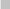
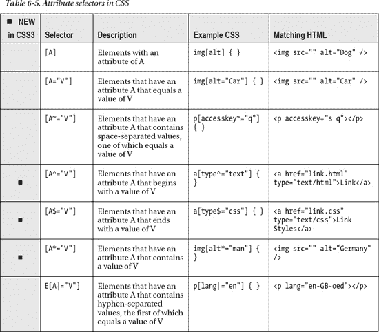

# 六、CSS3

在这一章中，我们将主要从 HTML 转向一种完全不同的语言和规范。层叠样式表(CSS)的时候到了。CSS 可能不是 HTML，但如果没有 CSS，HTML 就没什么可看的了，所以掌握其中一个就必须在一定程度上掌握另一个。

因为这本书是关于 HTML 的，所以我们将在这一章花大部分时间来研究 HTML 和 CSS 之间的关系以及两者是如何交互的，但是我们也将探索纯粹的 CSS 主题。CSS 规范目前正处于第三个迭代阶段，因此我们将浏览您应该知道的必要的核心 CSS 概念，然后深入了解新增内容的细节。这里有一点技术术语要讲，但是这样做，我们将为我们探索页面设计的可能性搭建舞台。从可用性的角度来看，这些方面和标记的语义一样重要。

### 当前状态:CSS2.1

CSS 被分成不同的层次，这些层次是类似于 HTML 的 W3C 版本的规范版本(HTML 3.2、HTML 4.01、HTML5 等等)。当前稳定和完整的级别是 CSS level 2 revision 1，也称为 CSS2.1。由 W3C 开发的文档会经过审查阶段，用于确定特定规范的稳定性(表 6-1 )。

开发一个完全成熟的规范通常需要几年的时间，并且随着技术条件的变化和新的工作草案的出现，一个特定的文档可能会在不同的成熟度级别之间来回徘徊。例如，CSS2 是 1998 年发布的推荐标准；CSS2.1(记住，CSS2 的一个*修订版*)花了十多年才成为 W3C 推荐标准，但最终在 2011 年 6 月 6 日完成了！显然，这并不意味着我们必须等到 2011 年 6 月才能使用 CSS2.1 中的特性，但这确实意味着规范在审查期间可能会发生变化。作为比较，考虑一下这个:W3C 的 HTML5 版本目前处于工作草案状态！预计其进展到推荐状态可能需要十年或更长时间，这并不是不合理的。然而，正如这本书所展示的，今天 HTML5 中有很多可用的东西。它的可用性还不到十年，但是规范(以及后续的实现)将在这段时间内不断发展。您还看到了尚未被任何主流 web 浏览器实现的特性(例如,`track`元素)。如果规范处于 W3C 推荐状态，就不会发现未实现的特性(WHATWG 的 HTML 无版本规范对此持不同观点)。那么，现在你已经在更广阔的图景中了解了 CSS 的状态，下一个 CSS 级别，CSS 级别 3 的状态是什么？

### CSS3 模块

CSS3 的定义与其前身不同。CSS3 不是一个覆盖整个规范的庞大文档，而是被分解成几十个处于不同成熟状态的模块。这允许 CSS 的自包含特性更快地成熟，而不会因为成为更大的草稿文档的一部分而受到阻碍。表 6-2 列出了从 W3C 选择的模块。这让您领略了 CSS3 中的一些特性。您可以在`[www.w3.org/Style/CSS/current-work](http://www.w3.org/Style/CSS/current-work)`找到模块的完整列表。

### 使用 CSS

现在您已经从组织的角度对 CSS3 有了一个大概的了解，让我们来看看它的正确用法。这可能对您来说很熟悉，如果是这样，请随意跳到 CSS3 中特定模块的讨论，但至少浏览一下这一部分，因为 CSS3 中引入了使用 CSS 的新方面。

#### 附加样式表

在 HTML 中使用 CSS 之前，您需要在页面上附加一个样式表，以便 CSS 样式可以访问与它们相关联的 HTML。有几种方法可以做到这一点，但是应该通过使用`link`元素来实现。`link`第一次出现在第二章，但是我们没有深入讨论使用它来链接样式表。您可能还记得，这个元素出现在页面的`head`部分，而`rel`属性用于指示链接的文档是一个样式表:

`<!DOCTYPE html>
<html>
          <head>
                    <meta charset="utf-8" />
                    <title>HTML5 and CSS together</title>
                    <link rel="stylesheet" href="css/main.css" type="text/css" />
          </head>
          <body>
                    
CSS rules!

          </body>
</html>`

 **注**如第二章所述，当链接到一个样式表时，你可以省略`type`属性，因为这是默认情况下链接的文档的属性。

`title`属性对于样式表上下文中的`link`元素有特殊的意义。该属性用于区分链接的不同种类的样式表。您可能会问自己，“有哪些不同种类的样式表？”放心吧，都是 CSS 没有别的语言可以学了！样式表的种类决定了特定样式表相对于页面上链接的其他样式表的优先级。有三种类型可以添加到文档中:

*   *持久*:始终应用于文档
*   *首选*:应用于文档，除非应用了替代样式表
*   *替代*:首选或持久样式表的替代

持久化、首选和备选样式表之间的主要实现差异在于，持久化样式表*没有*属性，而首选和备选样式表*有*。

所有持久的样式表都将应用于 HTML 文档，不管附加了多少个。这是应用样式表最常见的方式。上述代码片段中的样式表是一个持久样式表。相比之下，并非所有的首选和替代样式表都可以应用。如果多个首选和备选样式表链接到一个 HTML 文档，则只有一个样式表将被选择并在页面上使用。替代样式表的工作方式类似于首选样式表，还意味着它可以替代页面上指定的首选样式表。出于偏好或可访问性的原因，用户可以选择替代的样式表。

下面显示了一个附加了持久样式表、首选样式表和两个备选样式表的页面:

`…
<head>
     <meta charset="utf-8" />
     <title>HTML5 and CSS together</title>

     <link rel="stylesheet" href="css/main.css" type="text/css" />
     <link rel="stylesheet" href="css/colors-generic.css" type="text/css" title="Generic color styles" />
     <link rel="alternative stylesheet" href="css/colors-protanopia.css" type="text/css" title="Protanopia adjusted color styles" />
     <link rel="alternative stylesheet" href="css/colors-deuteranopia.css" type="text/css" title="Deuteranopia adjusted color styles" />
       </head>
…`

在这个示例页面中，`main.css`是持久样式表，用于在所有情况下设置页面的所有样式。`colors-generic.css`是一个首选样式表，它将颜色相关的样式添加到页面中。有两个可供选择的样式表供红绿光谱色盲用户选择:protanopia 的`colors-protanopia.css`和 deuteranopia 的`colors-deuteranopia.css`。据推测，激活这些样式将改变页面颜色，以补偿色盲可能使内容难以查看的区域。这些替代样式表如何变得可用取决于使用中的用户代理，但是一些浏览器提供了一个菜单选项，用户可以在其中选择替代样式(图 6-1 )。

***图 6-1。**在 Firefox 中，可以在视图菜单下选择首选和备选样式表。*

您还可以使用`meta`元素设置首选样式表。通过将`content`属性设置为其中一个样式表的标题，可以使用`http-equiv="Default-Style"` pragma 指令来设置首选样式表。例如，以下代码将标题为“蓝色主题”的样式表设置为默认样式表:

`…
<head>
     <meta charset="utf-8" />
     <meta http-equiv="Default-Style" content="Blue Theme" />
     <title>HTML5 and CSS together</title>

     <link rel="stylesheet" href="css/red.css"
     type="text/css" title="Red Theme" />
     <link rel="alternative stylesheet" href="css/green.css"
     type="text/css" title="Green Theme" />
     <link rel="alternative stylesheet" href="css/blue.css"
     type="text/css" title="Blue Theme" />
</head>
…`

使用`meta`元素设置默认样式表提供了一个中心点，在这里可以选择页面上的首选样式。这提供了使用服务器端脚本动态更改一个值的可能性，例如，基于用户交互或其他变量。

#### CSS 样式规则

将样式表附加到页面后，您需要访问页面上的 HTML 元素并设置它们的样式。一个**样式规则**是你将创建的代码，用于样式化 HTML 内容的一部分。样式规则以一个**选择器**开始。选择器将在下一节中详细介绍，但简而言之，它们是一组用于选择 HTML 页面不同组件的规则。选择器后面是花括号({和})，用于括起特定样式规则的所有样式信息。括号之间是成对的 CSS 属性和值，它们合在一起被称为**声明**。为了提供各种样式效果，一个 CSS 样式规则可以有一个或多个声明，每个声明以分号结束。它们可以，而且通常会，跨越多行。图 6-2 总结了整个样式规则的语法和术语。

***图 6-2。**CSS 样式规则的术语和语法*

在图 6-2 的例子中，选择器是`p`，它访问页面上所有的段落元素(`p`)；然后，样式声明将其背景颜色设置为红色，文本颜色设置为黄色(这是一个简单的例子；我们稍后将讨论正确的颜色格式)。

**一个警告:浏览器 CSS3 属性前缀**

与 HTML5 一样，大多数 CSS3 模块规范都处于草案状态，并且正在积极完善，这意味着并非所有功能都可以在所有浏览器上实现。由于规范是不断变化的，web 浏览器制造商对在规范中实现特定的 CSS 属性保持警惕是有道理的，如果它在下一周可能会发生剧烈变化。折衷的办法是使用特定于特定浏览器的前缀约定，将一个属性标记为“正在进行的工作”如果 web 开发人员看到前缀，他们知道“啊，这个属性将来可能会改变。”一旦属性被标准化，web 浏览器就实现规范中列出的实际属性，web 开发人员可以停止使用带前缀的版本。主要浏览器的 CSS 属性前缀如下:

*   `-webkit-`适用于 Safari 和谷歌浏览器
*   `-moz-`对于火狐来说
*   `-o-`对于歌剧来说
*   `-ms-`对于 Internet Explorer

例如，有一个名为`transform`的 CSS 属性可用于旋转一段内容，以及其他效果。问题是该属性是处于工作草案状态的模块规范的一部分，因此 web 开发人员可以使用以下属性:

*   `-webkit-transform`
*   `-moz-transform`
*   `-o-transform`
*   `-ms-transform`

当创建 CSS 样式规则时，web 开发人员将使用每个浏览器前缀重复该属性，并在列表末尾使用相关规范中定义的实际属性结束:

`     -webkit-transform: rotate(45deg);
        -moz-transform: rotate(45deg);
          -o-transform: rotate(45deg);
             transform: rotate(45deg);`

随着时间的推移，当属性被标准化并且 web 浏览器供应商变得符合最终规范时，属性的前缀版本可以被移除。

 **注意**如果你在本章中遇到一个 CSS 属性在你测试它的浏览器中不工作，试着添加适当的浏览器前缀，看看是否是这个问题。

#### 基本 CSS 选择器语法

选择器是 CSS 样式声明和它们需要影响的 HTML 内容之间的桥梁。您将遇到的大多数选择器可能属于以下三类之一:类型选择器、ID 选择器和类选择器。在适当的时候，我们还会谈到其他类别，但这三个类别是最常见的。

类型选择器允许任何元素被它的 HTML 元素类型名引用，比如`p`、`article`、`em`、`li`、`blockquote`等等。ID 选择器允许引用一个特定的元素，该元素的全局`id`属性被设置为某个值。类选择器的工作方式与 ID 选择器相同，除了它们引用所有属性设置为某个值的元素。这三类选择器被称为**简单选择器**，并在表 6-3 中进行了总结。

正如您在表 6-3 中所看到的，ID 选择器在 ID 值前面加上一个散列符号。另一个例子可能是这样的:

`#company-name { font-weight:bold; }`

前面的代码将访问 HTML 中具有`company-name`的`id`属性的元素的文本内容，并将其加粗，例如这部分 HTML 中的“City Press”文本:

`<h1 id="company-name">The City Press</h1>`

类选择器以类似的方式工作，除了使用句点来引用`class`属性值。下面的代码将在 HTML 元素周围添加边框和填充，这些元素的`class`属性设置为`alert`:

`.alert { border:1px solid red; padding:5px; display:inline-block; }`

 **注意**你可能不熟悉代码`display:inline-block`。它决定了样式元素在页面上的布局。确切的意思将在本章的“CSS 盒子模型”部分解释。

前面的选择器可能引用以下 HTML:

`
Warning!
`

与 id 不同，类的一个优点是单个元素可以应用多个类，因此样式可以在单个元素中一个接一个地层叠。例如，下面使用了前面的`.alert`规则，外加一个额外的`.critical`规则:

`

          Warning! do not feed the kittens, they are
          dangerous

`

附加样式规则大写文本并将其涂成红色:

`.critical { text-transform:uppercase; color:red; }`

总的来说，这在一些文本周围创建了一个警告框，其中一些文本仅仅是阅读的关键，而另一些是非常重要的警告。最终样式的文本看起来像图 6-3 。

***图 6-3。**通过在一个元素上设置多个样式化的`class`属性值，类样式规则可以彼此“重叠”。*

##### 组合选择器

CSS 在如何定义选择器方面非常灵活，如果您小心使用 HTML 和 CSS 结构，有很多机会节省输入。例如，如果一组选择器应用了相同的 CSS 声明，这些样式规则可以合并到一个逗号分隔的列表中，称为**选择器列表**，它会将一组 CSS 声明分配给列表中的所有选择器。例如，以下代码会将页面上所有标题的颜色更改为红色:

`h1,h2,h3,h4,h5,h6 { color:red; }`

这就节省了反复输入相同 CSS 声明的空间和时间；选择器仍然是独立的实体。然而，可以将选择器组合成集合选择器，称为**复合选择器**，它可以用来匹配网页结构中的特定内容。考虑前面的一段代码:

`dangerous`

该元素应用了两个类，因此可以使用三个不同的选择器来设置样式:

`…
span.alert { }
span.critical { }
span.alert.critical { }
…`

前两个类选择器简单地挑选出一个或另一个类——它们将引用任何分配了两个类值之一的`span`元素。第三个将两个类值链接在一起，创建一个复合选择器，该选择器将只引用应用了两个类的`span`元素。

如果类型选择器被关闭(就像前面的例子一样)，所有的元素都将被搜索匹配。这相当于将*选择器(称为**通用选择器**)与另一个选择器(在本例中为类别选择器)结合使用:

`.critical { color:red; }     /* match all elements for class 'critical' */
*.critical { color:red; }    /* match all elements for class 'critical' */
p.critical { color:red; }    /* match paragraph elements for class 'critical' */`

 **注意**你可能对此很熟悉，但是如果你不经常使用 CSS，你可能不知道前面代码中`/* text */`部分的用途；这就是你如何在 CSS 中写一个被浏览器忽略的注释。

仔细看看最后一行代码，`p.critical…`；这是两个放在一起的简单选择器，一个类型选择器和一个类选择器。这就是复合选择器得名的原因，因为它们是复合在一起的简单选择器。值得注意的是，它们总是以类型选择器、通用选择器或无选择器开始(在这种情况下，通用选择器是隐含的)。在类型选择器之后，它们可以有一长串附加的简单选择器。这里有一个例子:

`em.alert.critical.item { }`

该选择器仅引用正确类型的 HTML 元素，并且应用了正确的类，如下所示:

`<em class="alert critical item">Rocket fuel</em>`

 **注意**两种以上的选择器可以组合；例如，`em.alert.critical#item`是一个有效的复合选择器，但实际上这是不必要的冗长，因为页面上应该只有一个 id 为`item`的元素，所以没有必要包含类选择器(甚至类型选择器)。

复合选择器非常强大，但是还有其他语法选项可以匹配各种 HTML 结构。让我们继续讨论复杂的选择器！

##### 组合子和复杂选择器

表 6-4 列出了一组称为**组合子**的语法规则，它们决定了如何描述不同 HTML 元素之间的关系，以便用选择器引用它们。

**复合选择器**使用组合器将一个或多个复合选择器组合在一起。因为它们是由复合选择器组成的，所以它们总是在组合子的每一边至少使用一个类型选择器。虽然组合子的两端都包含一个类型选择器，但是复合选择器的其余部分可以包含链接在末尾的任何类型的选择器。它甚至可以包含组合子和选择器的混合。例如，想象一个允许客座作家在网站上创作内容的网站。可能会创建一个部分，并为其指定一个类，将其指定为包含来宾内容:

`<body>
          <header>` `                   <h1>Page header</h1>
                   <h2>Subtitle</h2>
          </header>
          <section class="guest">
                   <h1>Guest content</h1>
                   

                            <article>
                                <h1>Guest article</h1>
                                <footer>Article author</footer>
                            </article>
                   

                   <footer>Section footer</footer>
          </section>
          <footer>Page footer</footer>
</body>`

一个复杂的选择器可以用来选择一篇文章中的页脚，这是页面上最重要的客人部分，目的是强调作者，或者你有什么:

`header + section.guest article > footer { border:1px solid red; }`

从右向左阅读，这将为页脚添加一个红色边框，该页脚直接包含在一篇文章中，该文章是设置了类`guest`的部分的后代。该部分必须直接与标题相邻。因为页眉应该出现在页面的顶部，所以这将只选择顶部部分(如果页面上有多个部分)。要查看这一演示，请在前面的代码块中创建该部分的精确副本，并将其粘贴到现有代码块的下方。如果您应用样式，您将看到只有第一节的文章内的页脚应用了样式。要选择任何文章中的页脚，可以将相邻的兄弟组合符(`+`)更改为新的通用兄弟组合符(`~`)，它将匹配任何包含标题兄弟类`guest`的部分。

 **注意**虽然创建长链的选择器和组合子是可能的，但是你应该尽可能地创建简洁的选择器。不必要的复杂选择器会变得难以理解，并且难以针对 HTML 中的变化进行维护。然而，重要的是要知道创建这样复杂的选择器是可能的，因为当你确实需要它们的时候！

#### 高级选择器

除了简单的类型、ID 和类选择器之外，CSS 中还有各种各样的选择器，如果需要的话，它们都可以链接到一个类型选择器上。其他类型的选择器包括:

*   *属性选择器*:可以根据元素的属性、属性值或部分属性来访问元素。
*   *伪类*:可以根据元素结构中的模式、它们对用户交互的响应、它们被分配的语言或其他可能无法直接在元素上设置的属性来选择元素。
*   *Pseudoelements* :可以访问标记中没有明确定义的元素部分，例如元素中的第一个字母或第一行文本。

还有更多！正如你很快就会看到的，CSS 有强大的逻辑规则，可以用来挑选特定的 HTML 块。让我们浏览一下其他选择器，这样您就可以看到新的特性了。

##### 属性选择器

从技术上讲，前面的 ID 和类选择器是属性选择器，但是它们的语法不同于其余的属性选择器，所以我把它们分开了。这些选择器可以引用属性中具有特定模式的元素。表 6-5 总结了这一串。

正如您所看到的，属性选择器并不是新的，但是其中的三个是:`[A^="V"]`、`[A$="V"]`和`[A*="V"]`。这将允许您匹配一个元素，该元素具有开始、结束或包含特定文本的属性值。值得指出的是，属性选择器(任何种类)和其他选择器一样，可以链接成复合选择器:

`a[href][rel] { color:orange; }`

这个选择器将匹配任何同时设置了`href`和`rel`属性的锚元素(`a`)。通过在`href`属性中包含 URL 的搜索模式，可以将搜索范围缩小到超链接锚点的特定子集。例如，在我自己的站点上，也许我想从我自己的域中预取页面，但是我想使这些链接的样式不同于页面上的其他链接。我可能会创建一个这样的规则:

`a[href*="anselmbradford.com"][rel="prefetch"] { color:orange; }`

这将只匹配链接到包含“anselmbradford.com”作为其 URL 的一部分并且将它们的`rel`属性设置为`prefetch`的资源的超链接锚点，如下所示:

`<a href="http://blog.anselmbradford.com" rel="prefetch">Anselm's blog</a>`

属性选择器的可能性很多。示例包括从`a`、`img`或`object`源 URL 中挑选特定的文件类型，以便根据文件类型处理样式。作为另一个例子，多态的`input`元素可以很容易地使用属性选择器来设计不同的类型。例如:

`input[type="password"] { border:1px solid red; }`

该样式规则将在所有密码输入表单控件周围添加红色边框。

当在一个元素上使用类选择器时，问问自己是否有一个已经存在的属性可以被挑选出来。如果可以使用现有的属性，仅仅为了样式的目的而添加一个额外的类属性会产生额外的代码，以后可能需要维护和更新这些代码。例如，如果前面的样式规则更改为使用类选择器而不是属性选择器，这意味着您必须记住将正确的类属性值添加到添加到页面的任何新密码输入表单控件中，而不是依赖于它们现有的类型属性，无论如何它们都需要有。

##### 样式链接和片段标识符目标

下一组选择器与超链接的行为有关，称为**位置伪类选择器** ( 表 6-6)；这个小组处理引用未访问和已访问的链接和片段标识符。`:link`和`:visited`选择器是不言自明的，也不是什么新东西，所以让我们看看新的`:target`选择器以及它如何处理片段标识符。

在第三章的“超链接”一节中介绍了片段标识符。在该章中，给出了一个锚元素的示例:

`<a href="newpage.html#parttwo">link</a>`

通过将片段标识符`#parttwo`与`id`属性值`partwo`匹配，该元素链接到链接页面上的特定 HTML 元素，因此页面将滚动到如下元素:

`<h3 id="parttwo">Part Two</h3>`

因为这使用了一个片段标识符，所以这个元素可以使用`:target`选择器进行样式化。此选择器的样式规则将应用于作为出现在 URL 中的片段标识符的目标的任何元素(它应该只是页面上的一个元素):

`:target { text-decoration:overline; }`

当片段标识符出现在页面的地址栏 URL 中时，页面上作为目标的元素将接受`:target`选择器规则的样式。从 URL 中移除片段标识符，样式就消失了。这在用户可以滚动离开目标元素的情况下特别有用；通过对其进行不同的样式设计，可以使用户在再次寻找时不会看不到它(可以添加样式，以便将目标元素固定在适当的位置，这样即使页面滚动 1 ，它也会保留在视图中)。

___________

这是使用 position:fixed property 和 value 来完成的，这将在本章的后面讲到。

##### 选择用户交互中涉及的元素

除了`:link`和`:visited`之外，选择器`:hover`和`:active` ( 表 6-7 )通常与链接相关联。但是，它们可以用来响应任何元素上的用户交互。

例如，下面是一个简短的无序列表:

`<ul>
          <li>Milk</li>
          <li>Eggs</li>
          <li>Carrots</li>
          <li>Butter</li>
          <li>Almonds</li>
          <li>Flour</li>
</ul>`

为了帮助用户直观地找出他们所悬停的项目，可以使用`:hover`选择器来设置一个样式规则，将背景颜色改为浅灰色:

`li:hover { background-color:#ccc; }`

只有当用户将光标悬停在列表中的项目上时，才会应用这种方法，使用户悬停的行变暗(图 6-4 )。

***图 6-4。**`:hover`选择器只允许当鼠标光标在一个元素上时应用一个样式。*

`:active`选择器用于对用户激活的元素进行样式化，例如，这意味着鼠标按钮已经被按在元素上，但是还没有被释放。这个选择器可以用在当元素被按下时，但在释放元素之前元素的外观应该改变的任何地方，比如在拖放应用中。它通常用在链接锚点上，当单击链接时，闪烁不同的颜色或其他样式变化。

##### 选择表单控件元素

表 6-8 列出了一组选择器，用于设计用户界面组件的各种状态，特别是 web 表单控件。除了前四个选择器，从`:indeterminate`开始的选择器是 CSS3 基本用户界面模块的一部分(本章中显示的其他选择器是选择器第三级模块的一部分)。

 **注**WC3 的 CSS 工作组在 2011 年 8 月 12 日发布了一份文档，指出 CSS 的下一个版本将在同一模块中指定本章中的所有选择器，命名为选择器第 4 级。

___________

2 在用户点击文本字段后应用。

在输入有效的电子邮件地址之前， 3 输入将无效。

选择器不只是用于表单，它的行为在 web 表单的上下文中是最容易看到的。应用于文本字段的`:focus`选择器在用户点击字段并开始输入时添加一个样式。当用户单击另一个字段时，焦点会移动，样式规则会相应地应用。以出现在第四章中的 web 表单为例，我们可以添加这个简单的样式:

`input:focus {
          border:5px solid black;
}`

该样式规则将在用户点击开始输入的任何文本字段周围添加一个突出的黑色边框。这将清楚地显示哪个文本字段当前有焦点(图 6-5 )。

***图 6-5。**应用于文本字段的`:focus`选择器允许在用户选择字段开始输入时附加样式。*

`:enabled`和`:disabled`选择器都使用布尔`disabled`属性。`:enabled`选择器将对*没有*具有`disabled`属性的任何表单元素应用样式，而`:disabled`将对*具有*属性的任何元素应用样式。

___________

在 JavaScript 中，复选框需要将其不确定属性设置为 true。

`:required`和`:optional`选择器类似于`:enabled`和`:disabled`选择器，除了它们由布尔`required`属性的存在或不存在来触发。

`:read-only`和`:read-write`选择器在布尔`readonly`属性存在或不存在的情况下工作。一些表单控件，比如文件上传控件(`input`中设置的`type="file"`)，默认情况下是只读的，将由`:read-only`选择器选择，而不添加`readonly`属性。

`:valid`和`:invalid`选择器的工作方式类似于`:required`和`:optional`选择器，除了它们没有直接绑定到`required`属性。`:valid`选择器将选择任何没有附加表单验证约束的元素(`required`属性、`pattern`属性等等)，而`:invalid`将选择任何有约束的元素，如果这些约束没有被满足的话。

`:checked`和`:indeterminate`选择器通常应用于复选框和单选按钮。当这些控件处于选中状态时，`:checked`选择器将应用于这些控件。`:indeterminate`稍微难一点触发。复选框可能既不处于选中状态，也不处于未选中状态。复选框控件有一个可从 JavaScript 访问的布尔型`indeterminate`属性，可以设置该属性，这将触发该选择器的适用性。假设您有一个复选框控件:

`<input id="undecided" type="checkbox" />`

然后从 JavaScript 访问`id`,将复选框的状态设置为不确定:

`function setState() {
          var check = document.getElementById("undecided");
          check.indeterminate = true;
}
window.onload = setState;`

使用这个脚本，复选框将被置于不确定状态(图 6-6 )，然后可以使用`:indeterminate`选择器应用样式。

***图 6-6。**处于不确定状态的复选框*

 **注意**你可能会发现应用于复选框的样式很无聊。Safari、Chrome 和 Firefox 不支持为复选框添加边框和背景。要查看您的样式是否被应用，请尝试设置高度，如`height:100px;`。复选框周围的任何内容都应该被推开。

`default:`样式将应用于在给定上下文中被指定为默认的元素；例如，单选按钮组中最初选中的单选按钮可以被认为是默认的。可以对这个按钮进行样式化，即使单击了另一个单选按钮，该样式也会保留在最初选中的按钮中。另一个场景是如果一个表单上有不止一个提交按钮(实际上不应该有——但这只是假设！)，其中一个按钮将被视为表单的默认提交按钮。不幸的是，不同的浏览器会设置不同的默认值。例如，Opera 识别单选按钮的第一种情况，而 Safari 识别第二种情况，但是两种情况都不识别。

该组中的最后两个选择器`:in-range`和`:out-of-range`用于元素，这些元素对可以输入其中的值的范围有约束。例如，数字输入表单控件有`min`和`max`属性，设置可以输入到数字字段的值的范围。如果输入值落在最小和最大范围之间的这个范围内，将应用`:in-range`选择器样式规则，而如果超出这个范围，将应用`:out-of-range`选择器。理论上，范围输入表单控件也可以使用这些选择器；然而，在撰写本文时，只有 Opera 支持它(部分支持，因为`:out-of-range`选择器被忽略了)。

##### 模式匹配选择器

额外的逻辑可以通过使用“第 n-”类型选择器之一引入选择器，这是**树形结构伪类**选择器组的一部分(见表 6-9 )。这些选择器除了一个以外都是 CSS3 中的新特性。

这些选择器特别适用于列表、表格或任何其他具有重复信息行的 HTML 结构。它们允许样式按照重复的模式应用，例如，可以用来对一列项目进行斑马条纹处理。首先，可以给它们两个关键字之一:`even`或`odd`，它们将样式应用于特定父元素中的偶数或奇数元素。例如，下面是一个基本的 HTML 列表:

`<ul>
    <li>Row 1</li>
    <li>Row 2</li>` `    <li>Row 3</li>
    <li>Row 4</li>
    <li>Row 5</li>
    <li>Row 6</li>
</ul>`

通过添加以下代码，可以将列表中奇数行涂成灰色:

`      li:nth-child(odd) { background-color:#ccc; }`

给偶数行着色就像把关键字`odd`换成`even`一样简单:

`      li:nth-child(even) { background-color:#ccc; }`

这些导致了图 6-7 中的列表。

*图 6-7**。**使用`:nth-child(even)`和`:nth-child(odd)`选择器*对列表中偶数和奇数行进行斑马条纹设计

此外，`nth-`选择器包括一个模式公式，允许从偶数或奇数行中选择不同的行。可以用公式 *an+b* 代替`even`或`odd`。 *n* 等于要处理的子元素的数量(在前面的例子中是一个列表中的六行)，从零开始计数。然后将 *a* 的值乘以 *n* 的每个值，并将 *b* 加到该值上。例如，在公式 *3n+1* 中，处理的第一行将值 0 赋给 *n* ，因此公式最终为(3 × 0) + 1，等于 1，意味着样式应用于第一行。对于下一行，公式变为(3 × 1) + 1，等于 4，意味着样式应用于第四行。接下来是(3 × 2) + 1，等于第七行。图 6-8 是应用了以下 CSS 规则的无序列表的外观:

`      li:nth-child(3n+1) { background-color:#cccccc; }` 

***图 6-8。**无序列表上选择器`:nth-child(3n+1)`的结果*

也可以给`nth-`选择器一个他们应该选择的具体值，比如`:nth-child(2)`只样式化第二行，`:nth-child(3)`只样式化第三行，等等。

第 n 种类型的选择器，比如`:nth-of-type(N)`，能够从一组共享相同父元素的某种类型的元素中挑选元素。因此，这些选择器不是挑选某个特定元素的子元素，而是挑选某个特定元素的兄弟元素。例如，下面的 HTML 可能是某种博客的结构，有页眉和页脚部分，以及夹在这两部分之间的一些文章:

`<body>
          <header></header>
          <article><h1>Article 1</h1></article>
          <article><h1>Article 2</h1></article>
          <article><h1>Article 3</h1></article>
          <footer></footer>
</body>`

因为所有这些部分共享同一个父项(即`body`)，所以`:nth-of-type(N)`选择器可以与一个类型选择器结合起来挑选出一个特定的文章，同时忽略`header`和`footer`:

`article:nth-of-type(1){ background-color:#f00; };`

这将挑选出第一篇文章，并将其背景涂成红色(十六进制颜色代码将在后面讨论)。

 **注意**如果选择的只是特定类型的第一个项目，并且行为不会改变，那么可以使用新的`:first-of-type`选择器。但是，第 n 种类型的选择器可以使用 an+b 公式来挑选多个元素。

##### 伪 elemont 选择器

表 6-10 中的元素可能不太常见，因为它们的行为在不同的选择器类别中相当独特。您很快就会看到，它们使样式能够应用于元素中不可访问的部分。虽然您可能认识在表 6-10 中列出的选择器，但是您可能会注意到它们的语法已经改变，在选择器的开头包含了两个冒号而不是一个。请参阅“什么构成了伪元素？”侧边栏了解更多信息。

`::first-line`和`::first-letter`选择器是不言自明的，因为它们选择元素中文本的第一行和第一个字母。例如，它们可以用来在段落的开头创建“首字下沉”，并在风格上改变文本的第一行，如图图 6-9 所示。

*图 6-9**。**`::first-letter`和`::first-line`选择器将样式应用于段落，创建首字母“首字下沉”和首行加粗*

类似于图 6-9 所示的效果可以通过将下面的 CSS 应用到一个填充了文本的段落元素(`p`)来创建:

`p::first-line {
          font-weight:bold;
}
p::first-letter {
          margin-top:-0.2em;
          float:left;
          font-size:4em;
          margin-right:0.1em;
}`

该组中接下来的两个选择器`::before`和`::after`，用于在元素前后生成和插入内容。在 CSS3 生成和替换的内容模块 5 中描述了如何实现这一点的精确行为，但简而言之，可以在元素周围插入图像或文本。使用 CSS 将文本插入到页面中是很多人不赞成的，因为这被视为使用 CSS 来做应该在 HTML 中完成的事情。如果您确实使用这些伪元素，请记住，出于可访问性的原因，即使样式表被禁用，内容也需要有意义，因此任何插入的内容都需要是无关紧要的。也就是说，让我们继续讨论如何使用这些选择器。

这两个选择器通常都与 CSS `content`属性一起使用，该属性用于指定要插入的实际内容。内容属性可以采用引用文本、`url()`和`attr()`符号语法等等。`url()`符号语法将图像文件路径放在括号中，就像`url("img/pic.jpg")`。`attr()`符号语法接受一个属性名，这个属性名出现在 parantheses 之间的元素上，它将被替换为属性值。例如，可以使用以下内容创建下载 PDF 文档的链接:

`<a href="presentation.pdf" type="application/pdf">Download the presentation</a>`

然后可以创建一个选择器来挑选页面上的锚元素，这些元素的属性设置为 MIME 类型`application/pdf`(我们将使用通配符属性选择器，这样我们就不必键入整个 MIME 类型)。在这些元素上，伪元素选择器会在链接前生成一个图标(通过链接到外部图像),并在链接后生成一些文本，说明这是一个 PDF。这里有一个例子:

___________

5 见【http://www.w3.org/TR/css3-content/】??

`a[type*="pdf"]::before
{
          content: url(doc.png);
          margin-right:5px;
}
a[type*="pdf"]::after
{
          content: " (" attr(type) ")";
}`

使用`content`属性，图标被嵌入到锚元素之前，括号和`type`属性的值被插入到元素之后。图 6-10 显示了结果。

*图 6-10**。**`::before`和`::after`选择器在链接周围插入图标和文件类型信息*

什么构成了伪元素？

CSS level 1 (CSS1)定义了一个选择器`:first-letter`，在 CSS3 中变成了`::first-letter`。正如你在表 6-10 中看到的，一些选择器使用::前缀，这是 CSS3 中的新语法。该语法用于将这些元素标记为选择器伪元素组的一部分。前缀是为了将它们与其他类型的选择器区分开来。伪元素在选择器中是独一无二的，因为它们访问的信息不是由文档的 HTML 中的元素专门标记的。例如，查看一段文本的 HTML，没有一部分被定义为文本的第一行；相反，第一行是由内容在浏览器中的布局决定的。然而,`::first-line`选择器可以挑选出 HTML 的这一部分。从它的角度来看，元素中的第一行文本内容位于它可以设置样式的 ethereal 元素中(这就是为什么它被称为**伪元素**)。使用`::first-letter`也会出现同样的情况。段落中的哪个字符是第一个字母是显而易见的，但是在 HTML 中没有明确地标记出来，所以使用`::first-letter`选择器从其余的内容中挑选出第一个字母，就好像它包含在一个元素中一样。

`::before`和`::after`伪元素选择器可用于在元素中的现有内容之前或之后(分别)插入内容(注意，它仅适用于可以容纳内容的元素。它不适用于自结束元素，例如`img`。因此，它们是这个组的一部分，因为它们引用 HTML 中的空点。像第一个字母一样，HTML 中没有明确的标记来指定开始标记的结尾和内容的开头之间的位置，或者内容的结尾和结束标记的开头之间的位置。

表 6-11 列出了 CSS3 生成和替换的内容模块规范中的几个伪元素，但它们对浏览器的支持如此之差，以至于你不太可能使用它们。我们会看到他们的未来。请记住，该规范处于草案状态，因此如果浏览器支持没有实现，它们可能会消失。

 **注意**有一个名为::`selection`的伪元素选择器，它允许将样式应用于用户选择的文本。它最初包含在 CSS3 选择器模块中，但显然这种行为对于 W3C 来说太激进了，因此已经被移除了。然而，你会发现它有强大的浏览器支持。例如，尝试将样式规则`::selection { color:#0f0; }`添加到您的页面并选择一些文本。它会变绿的！

##### 杂项选择器

两个额外的选择器不适合任何其他类别。`:lang(L)`选择器查找被指定为被搜索语言的内容(通过其`lang`属性设置或从页面的元数据继承)。语言代码 7 放在选择器的括号之间。示例见表 6-12 。

___________

标记选择器在另一个规范中有更详细的解释， *CSS 列表和计数器模块级别* 3，可从这里访问:【http://www.w3.org/TR/css3-lists/#marker-pseudoelement】??

参见 http://www.iana.org/assignments/language-subtag-registry 的关于语言代码的列表，这里显示的“子标签”是你可能会用到的。

表 6-12 中的另一个元素是新的`:not(S)`选择器，用于查找*与某个选择器*不匹配的所有元素。与其他选择器结合使用，它可以为一个样式创建非常复杂的匹配规则。例如，为了直观地识别我的网站上链接到我不想认可的外部资源的链接，我可能会选择并样式化那些在它们的`href`属性中不包含“anselmbradford . com”URL，而在它们的`rel`属性中包含`nofollow`或`noreferrer`属性值的所有链接:

`a[rel^="no"]:not([href*="anselmbradford.com"]) { color:red; }`

第一部分是一个作用于`rel`属性的属性选择器，而第二部分包含另一个作用于`href`属性的属性选择器，其结果被`:not()`选择器否定。注意，我们只是搜索以“no”开头的值`rel`,以选取两个可能的值。应用于以下代码片段，前面的选择器将跳过第一个锚点的样式，第二个和第三个锚点的样式，并跳过第四个:

`<a href="http://anselmbradford.com" rel="noreferrer"> Anselm's website </a>
<a href="http://example.com/contact.html" rel="noreferrer"> Example.com contact </a>
<a href="http://example.com/links.html" rel="nofollow"> Example.com links </a>
<a href="http://example.com" rel="bookmark"> Example.com homepage </a>`

正如您所看到的，关于您可以构建的选择器，可能性实际上是无限的！

#### 有效地使用选择器

正如您在前面的简单选择器一节中看到的，选择器可以推广到所有元素，例如:

`:only-child { color:blue; }   /* match any element that is the only element contained in its parent element */
::first-letter { font-size:2em; }      /* match the first letter of all elements' content */`

根据选择器的不同，以这种方式进行归纳可能会变得难以处理，因为所应用的样式可能会附加到具有完全不同的目的和意义的元素上。您可能会看到 ID 选择器以这种方式一般化，比如在代码片段`#item {}`中。然而，这样做是很常见的，因为 ID 选择器总是只选择一个元素，所以永远不会推广到页面上的其他元素。

 **注意**一些专业的 CSS 开发人员提倡使用类选择器而不是 ID 选择器。其原因本质上归结为灵活性。ID 选择器只能在页面上的一个元素上使用。可以选择将类选择器应用于一个元素，有效地使它们等同于 ID 选择器。但是，它们也可以应用于多个元素，这是一个额外的好处，如果您意识到某个特定的样式规则需要应用多次的话。

话虽如此，也应该避免反其道而行之和过于具体地使用一连串的选择器。这被称为选择器的**特异性**。如果选择者的特异性过于集中，这是一件坏事。避免使用如下 CSS 规则:

`article section#one ul li.item::first-letter { color:blue; }`

虽然这在它被使用的情况下会工作得很好，但是它是脆弱的。对 HTML 的更改很容易导致这个规则不再适用，这也意味着这个选择器不能轻易地移动到另一个上下文中。通过将一个类分配给无序列表(而不是列表项)并按类型挑选列表项，选择器可以缩短为:

`ul.toc li::first-letter { color:blue; }`

从长远来看，简洁的选择器可以帮助你正确应用 HTML5 的语义元素，从而节省你的时间。不需要创建复杂的选择器或依赖类或 id 来挑选特定种类的内容，您可以直接将样式应用于`em`、`strong`、`article`、`aside`等等，而不需要任何更深层次的特性。显然，如果您想针对某一特定类型的文章，这就是类(可能还有 id)发挥作用的地方，但是首先看看哪些内容可以使用语义 HTML 元素、属性、定制 id 或类分组在一起。

#### CSS 盒子模型

现在我们已经全面地介绍了选择器，您应该对如何从 CSS 访问 HTML 有一个全面的了解。此时，还有另一个值得探索的基本概念 CSS 盒子模型。

就 CSS 而言，组成网页的 HTML 元素包含在一个矩形框中，这个矩形框决定了它相对于页面上其他元素的位置。这种将页面内容放置在框中的范例就是 CSS Box 模型得名的原因。该模型中主要有三种类型的盒子:**块级**、**行级**和**行内级**。为了形象化这些区别，想象一段文字。默认情况下，块级框是围绕整个段落构建的，行级框是围绕段落中每个单独的文本行构建的，行内级框是围绕单行文本中的每个单词构建的。这是 CSS 查看内容和布局的方式，但这与您将使用的盒子模型略有不同。您将把您想要从 CSS 中操作的内容包装在一个 HTML 元素中，比如一个用于整个段落的`p`元素或者一个用于段落中的单个单词的`em`元素。然后，您将使用选择器来样式化这些元素。通常，这意味着您将处理块级或内联级的盒子。行级框不是你可以轻易访问的东西(尽管有`::first-line`选择器)，所以记住它们是 CSS 内部用来布局内容的东西。您可以在一个`em`中包含多个单词，甚至可能是一整行，但这仍然会被视为一个行内级别的框，因为它可能会也可能不会占据整行文本。

块级盒子是最常见的盒子类型。当在块级框中设计元素样式时，您将可以访问 CSS 属性来填充、边距以及可能夹在两者之间的边框。框外是定位属性，可用于将框从默认位置偏移。 8 框内的宽度和高度属性用来设置框的大小。所有这些特性都显示在图 6-11 中。

***图 6-11。**显示填充、边框、边距、宽度和高度以及 HTML 元素周围的定位属性的块级框*

**块级框**最常见于流动内容周围，如段落、标题或其他在内容块之间提供划分的元素。默认情况下，块级框将扩展以填充其包含元素的宽度，并将垂直堆叠。

一个**内联级框**通常出现在诸如`span`、`q`、`em`等短语内容周围。默认情况下，行内文本框将水平排列，而不是垂直排列，因为它们跟随内容中的文本行。内联级别框的框看起来与块级别框完全一样(图 6-11 )，除了应用于框顶部和底部的任何边距都将被忽略——只有左侧和右侧的边距有影响。此外，应用于顶部和底部的填充不会像块级框那样推开元素上方和下方的元素，而是将元素的边框(如果存在)重叠在相邻的内容上。最后，内联级别的框只占用与其中包含的内容一样多的空间，加上设置的任何填充，这意味着它们将忽略对它们的`width`和`height`属性的设置。图 6-12 显示了一个块级和行内级盒子的例子，以及它们是如何相互作用的。

___________

8 定位属性(左、上、右、下)与位置属性结合使用，这将在后面讨论。

***图 6-12。**块级和内嵌级盒子。请注意，默认情况下，跨两行的行内级别框将会换行。*

在图 6-12 中，整个内容和第一段(均为块级框)周围画有边框，单个词和几个词周围画有边框。拥有块级盒子的元素可以被称为**块级**元素。单词包含在内嵌级别的框中，并应用了 10 像素(px)的填充。正如您所看到的，尽管框的边框向远离文本的所有方向扩展了 10px，但顶部和底部的填充不会影响任何周围的元素，并且边框与页面上的其他内容重叠。如果你很好奇，下面是产生先前的 HTML:

`

  

    This is the first paragraph in this page of content, it has a border drawn around it to   
    show that it is a block-level element.
  

  

    This is a second paragraph, it is a block-level element as well, but does not have a
    bordered style added. Instead, some of the inline-level boxes are
    shown with borders added. Inline-level boxes may wrap around more
    than one line if the layout requires them to.
  

`

CSS 如下所示:

`.box {
          border:2px solid black;
          padding:10px;
}`

##### 设置框类型

使用的盒子类型不是一成不变的。事实上，有一个名为`display`的 CSS 属性用于设置包含元素的盒子的类型。在一个元素上设置`display:block`将把它视为包含在块级盒子中，而设置`display:inline`将把它视为包含在内联级盒子中。在框类型之间切换的能力对于锚元素(`a`)特别有用，锚元素在默认情况下是行内级别的元素，因此它们忽略宽度和高度设置。

考虑下面的 HTML:

`<a href="#">Link</a>
<a href="#" class="block">Link</a>`

前面的代码可以用下面的 CSS 进行样式化:

`a {
           width:200px;             /* set the width */
           height:60px;             /* set the height */
           border:1px solid #000;   /* set a black border */
           background-color:#ccc;   /* set a gray background */
           padding:10px;            /* set 10 pixels of padding */
           text-decoration:none;    /* remove the underline */
           text-align:center;       /* center align the text */
           margin-top:20px;         /* add margin to the top */
}`

这段代码产生了图 6-13 的外观。width 和 height 以及 margin top 被忽略，因为它们是两个内联级别的元素。

***图 6-13。**默认情况下，两个行内元素会并排排列。*

现在，如果添加一个额外的样式规则来将第二个框转换为块级元素:

`a.block {
           display:block;           /* treat as block-level element */
}`

第二个链接的外观发生了变化，包括了宽度和高度(以及边距，这样元素就不会重叠)，如图 6-14 所示。较大矩形形状的整个区域是链接活动区域的一部分，因此将锚元素显示为块级元素在链接区域的大小方面提供了更大的灵活性。例如，在创建菜单时，这一方面特别有用。

***图 6-14。**行内级和块级盒子。块级框移动到它自己的行。*

设置内联级元素显示为块级元素的一个问题是，块元素将移动到它之前的内容之下，开始一个新的内容行，如图 6-14 所示。还有一个附加的 display 属性，可以将元素格式化为位于块级框中，然后将格式化后的框视为内联级框。将显示更改为`display:inline-block`会产生图 6-15 。

***图 6-15。**内联级框和块级框在布局上被视为内联级框*

显示属性还有其他几个值， 9 但是`block`、`inline`和`inline-block`是三个主要的值，可以用来改变大多数 HTML 元素的默认布局行为。

##### 设置框位置

为了调整元素的位置，使用了`position`属性。它有以下值(加上`inherit`，它只使用其父元素的设置):

*   `static`:盒子处于默认位置。定位属性(`left`、`top`、`right`和`bottom`)被忽略。
*   `relative`:框从默认位置偏移 CSS 定位属性中指定的像素数，这些属性命名为`left`、`top`、`right`和`bottom`。
*   `absolute`:该框按照定位属性中指定的像素数进行偏移，但是从其`position`属性设置为非`static`值的第一个父元素的左上角偏移，或者从浏览器查看区域的左上角偏移，以先到者为准。
*   `fixed`:类似于绝对定位，增加了一个功能，即框不随页面上的其余内容滚动，而是固定在查看区域。

##### 设置框分层

由于盒子的位置可能是相对的和绝对的，这意味着它们可能会相互重叠(这可以用来创造有趣的效果！).当两个元素相互重叠时，可以使用`z-index`属性设置它们的分层顺序。这个属性有一些注意事项，但是很容易理解:

*   如果要改变分层，相互重叠的两个元素需要有相同的父元素(它们需要一起包含在同一个 HTML 块中)。
*   至少有一个元素需要将其`position`属性设置为`relative`、`absolute`或`fixed`。
*   至少有一个元素需要设置其`z-index`属性。相对于另一个元素的较大数值会将一个元素放在另一个元素的前面，而较小的数值会将其放在后面。

___________

在此查看所有 CSS 显示属性值:【http://www.w3.org/TR/css3-box/#display】??

### 背景和边框

背景和边界曾经非常有限。这些形状是带有纯色背景或单一重复图像的矩形。边界有一些变化(实线、虚线、虚线等等)，但仍然是矩形。例如，众所周知，圆角的制作非常复杂。CSS3 使许多效果，包括圆角，变得更加容易。圆角是 CSS3 背景和边框模块的一部分，它还增加了添加多个背景的能力，以新的方式剪辑和重复背景，并添加投影，等等。

#### 基本背景色和图像

属性设置背景的颜色。它将采用本章“颜色”一节中描述的任何颜色格式。颜色绘制在任何背景图像的后面，因此如果背景中附加了包含透明区域的图像，颜色就会显示出来。可以给定值`transparent`,使得没有颜色显示出来。

属性用于将图像附加到元素的背景上。语法`url(“path/to/bgimage.png”)`用于附加图像，其中`path/to/bgimage.png`是要包含的图像的文件路径。文件路径可能是相对于样式表的位置，也可能是绝对的(在路径的开头使用`http://`或类似的)。看到相对文件路径并不少见，比如`url("img/pic.jpg")`，因为样式表通常放在与图像不同的目录中。`../`在进入`images`目录之前向上移动一个目录。

 **注意**如果文件名或文件路径中没有空格，图像文件路径两边的引号是可选的。但是，如果文件路径中有空格，则需要用引号括起来。

`background-repeat`属性决定背景图像(如果存在的话)如何重复。基本设置有`repeat`、`no-repeat`、`repeat-x`和`repeat-y`。它们分别确定图像是平铺、非平铺(仅显示一次)、水平平铺还是垂直平铺。CSS3 中的这个属性增加了两个新值:`space`和`round`。通常，当图像重复时，它会根据需要重复，以用图像的某些部分填充可用空间，即使这意味着图像的某些部分会被剪切到视图之外。`space`和`round`属性防止这种削波发生。值`space`将使用图像填充可用空间，而不剪切图像，然后根据需要在重复的图像之间添加空间，以均匀填充可用区域。值`round`的工作方式基本相同，但不是用空白空间填充多余区域，而是放大图像以填充可用区域。小心使用`round`值，因为图像在放大时质量会迅速下降，变得模糊和像素化。不好！

 **注意**`background-repeat`属性的`space`和`round`值目前浏览器支持有限。截至本文撰写之时，Opera 是唯一支持这两种浏览器的主流浏览器。这是一个很好的提点，Modernizr ( `[`modernizr.com`](http://modernizr.com)`)，在第一章中提到的 HTML5 检测库，也有检测 CSS3 的能力！

`background-attachment`属性决定了当页面滚动时，背景图像是否随内容一起滚动。值`fixed`固定背景位置，即使页面滚动，而`scroll`允许它和内容一起滚动。此外，还添加了一个新值`local`。该值仅适用于页面上有自己的滚动条的元素。 10 如果设置了该值，当用户滚动插入滚动条时，屏幕该区域的背景将随之滚动。

 **注**关于`background-attachment`不同值的演示，请访问`[`people.opera.com/pepelsbey/experiments/bga`](http://people.opera.com/pepelsbey/experiments/bga)`。

`background-position`属性用于偏移背景图像的起点。它采用两个值，分别对应于水平和垂直定位。您可以设定特定值或使用预设关键词:

`/* background image is offset 10 pixels left and 25 pixels down */
background-position: -10px 25px;`

CSS3 中已经引入了属性`background-clip`和`background-origin`。这两个属性采用相同的值，但各自有不同的功能。`background-clip`用于指定“背景绘画区域”，即颜色和图像将被渲染的区域。`background-origin`指定“背景定位区域”，用于确定背景的原点，即非重复图像左上角的起始点(如果您熟悉坐标空间，则为 0，0 点)。这些属性的三个值如下:

*   `border-box`:背景绘画区/定位区延伸至边框外缘。边框将覆盖图像的顶部，但它可以是半透明的。
*   `padding-box`:背景绘画区/定位区延伸到边框的内边缘。这是默认值。
*   `content-box`:背景绘画区域/定位区域仅延伸到内容区域的边缘，即应用任何填充之前的区域。

___________

设置元素的宽度和高度属性，然后设置 overflow:auto 将导致滚动条出现，这样用户可以找到任何溢出的文本。

图 6-16 说明了这些不同的数值。

*图 6-16**。**`background-clip`和`background-origin`属性的三个可用值的位置含义。*

为了演示这些值，我们可以创建两个框，稍后我们将对其应用背景:

`

`

我们将设计两个框的样式，使它们具有宽度、高度、填充、边距和半透明边框(透明边框的颜色语法对您来说可能很陌生；这将在后面的“颜色”一节中介绍)。一个将被裁剪到内容区域，而另一个将被裁剪到边界区域:

`.box {
       width:200px;                                   /* set the width to 200 pixels */
       height:200px;                                  /* set the height to 200 pixels */
       padding:20px;                                  /* set the padding to 20 pixels */
       margin:10px;                                   /* set the margin to 10 pixels */
       border:10px solid hsla(0 , 0% , 0% , 0.5 );    /*set a semi-transparent black border */
       background-color: #ccc;                        /* set a gray background color */
       background-image: url(logo.png);               /* attach an image */
       background-repeat:space;                       /* repeat image in available space */
       background-origin:content-box;                 /* set image origin to content edge */
       background-clip:content-box;                   /* clip image at content edge */
}
        .no-clip {
       background-clip:border-box;                    /* clip image at border edge */
}`

这些框将会像图 6-17 中的一样出现。背景图像将从相同的原点开始重复，但是将在不同的点被剪切。

***图 6-17。**使用新的`background-clip`和`background-origin`属性以及`background-repeat`属性*中的`space`值对背景进行两次处理

最后，在背景中，新的`background-size`属性可以用来在背景区域上拉伸背景，而不是重复它。这是背景的一个有用和必要的特性，但是要小心不要把你的图像拉伸或放大太多，否则它会看起来模糊，像素化，非常糟糕。属性接受一个或两个值。一个值一起设置水平和垂直尺寸，而两个值彼此独立设置。宽度和高度可以用百分比来设置，但是当设置图像的两个维度时，这有使图像失真的风险。为了解决这个问题，关键字`auto`可以用于一维，因此图像保持其纵横比。当只给出一个值时，这是高度的默认值:

`/* Set width to 100% of the available area and height to 50% of the image height */ background-size:100% 50%;   
/* Set width to 100% and maintain the aspect ratio of the image */
background-size:100% auto;   
/* Set the width 50% and the height to auto */
background-size:50%;             `

 **注意**前面代码中的第一个设置会扭曲图像。

`background-size`属性也有关键字`contain`和`cover`。值`contain`将缩放图像以完全适合背景区域，同时保持其外观区域，即使一侧有一些空白。`cover`值将在保持纵横比的同时缩放图像，但它将缩放图像，使其完全覆盖背景区域，即使这意味着图像的一部分将被剪切出视图(图 6-18 )。

***图 6-18。**在`background-size`属性上设置的`contain` (L)和`cover` (R)值。请注意放大图像时出现的突出的像素化。*

#### 多重背景

CSS3 中增加了背景属性的功能，以支持指定多个图像，这些图像将在背景区域中彼此层叠。语法很简单——用逗号分隔每个图像。例如，图 6-19 中的所示的两幅图像，可以使用以下方法进行组合:

`background-image: url(logo.png) , url(star.png);` 

***图 6-19。**两幅独立的图像将使用多种背景进行组合*

使用这种技术将产生如图 6-20 所示的组合模式。

***图 6-20。**背景中叠在一起的两幅独立图像*

颠倒`backgroud-image`属性中图像的顺序将改变它们的分层。指定的第一个图像将出现在顶部。其他背景属性可以提供逗号分隔的值，以单独设置每个图像的属性；例如，为了仅重复图 6-20 中的星形图像，可以添加以下内容:

`background-repeat: no-repeat , repeat;`

这些值也可以通过 JavaScript 设置，这会产生一些非常有趣的动态效果！

#### 圆角

拥有在元素上创建圆角的属性是网页设计的灵丹妙药。这曾经是一个痛苦的过程，将图像分割并放入由`div`元素组成的网格中，这样四个角就可以被隔离。恶心！新的`border-radius`属性允许边框变圆。可以一次性、单独甚至以不一致的方式对边界进行圆角处理。给属性一个长度值会将所有四个角设置为该值:

`border-radius:20px; /* round all corners by 20 pixels */`

给属性赋予四个值将设置四个角的舍入:

`border-radius:100px 50px 25px 0px; /* each corner is rounded by a different amount */`

在值之间使用正斜杠将允许为圆角的每一侧指定不同的值，从而导致不均匀的拐角:

`border-radius: 100px / 20px; /* round one side of the corner more than the other side */`

前面代码中的正斜杠将舍入分成两个值；第一个值是水平舍入量，第二个值是垂直舍入量。

前三个属性应用于一个背景色为空的`div`的结果看起来像图 6-21 。

***图 6-21。**使用`border-radius`属性可以创建许多不同的形状。*

#### 投影

属性可以用来在盒子周围创建阴影。它取的值是阴影的水平距离，垂直距离，要应用的模糊量，它应该扩散的量，最后是阴影的颜色。这里有一个例子:

`box-shadow: 10px 15px 20px 5px #999999;`

这将阴影向右移动 10 个像素，向下移动 15 个像素，模糊 20 个像素，向外扩展 5 个像素(这将向各个方向扩展阴影)，并将其设置为深灰色。图 6-22 显示了应用于在“圆角”部分创建的形状的属性。

***图 6-22。**使用`box-shadow`属性*应用了阴影的形状

### 颜色

如果使用得当，颜色可以成为网页设计的强大补充，通过根据颜色对项目进行视觉分组来改善网页的结构，或者通过使用对比色来分隔布局中的内容。它也可能被滥用，使原本很好的布局变得华而不实，特别是如果使用了冲突的颜色，看起来很难。还有关于颜色的可访问性问题，因为页面的某些颜色选择会使色盲者难以阅读内容。红绿色盲是最普遍的，所以避免将内容分成亮度相似的红色和绿色阴影。

#### 彩色屏幕

您在屏幕上看到的颜色是由加色模型中的红、绿、蓝三原色组合而成的，这意味着所有三种颜色以最大强度组合将产生白色(图 6-23 )。

***图 6-23。**在加色模型中，原色互相增加亮度。*

在 CSS 中，颜色通常用十六进制的**符号**来定义。这种符号将颜色的红、绿、蓝分量分解成两位数，合起来形成一个六位数，前面加一个散列符号，形式为`#RRGGBB`。称为**十六进制三元组**，每个数字对的十六进制数值范围为 00–FF。例如，`#ff00ff`代表全强度红色和全强度蓝色，没有任何绿色。结合起来，它们产生洋红色。如果你不清楚这个数字和字母序列是如何变成颜色的，请务必阅读“web 颜色值是如何计算的”边栏以了解更多信息。

**如何计算网页颜色值**

你在屏幕上看到的所有颜色都是由红、绿、蓝三原色组成的。如图 6-23 所示，这是一种加色模型，即随着原色强度的增加，颜色变得越来越浅(增加了亮度)，直到最终变成白色。为了在 web 浏览器中定义颜色，每个原色都存储在一个字节或 8 位(8 个 1 和/或 0)中。每个颜色分量(红色、绿色和蓝色)的可能值在 00000000 到 1111111 的范围内，这是十进制的范围 0–255。0 表示完全没有颜色，而 255 是颜色的最大强度。Decimal 是以 10 为基数的计数系统，这意味着在计数移动位置之前要使用十个数字(包括 0)。二进制是以 2 为基数的系统，意味着只有两位数(0 或 1)。十六进制的 Base-16 有 16 个数字，可用于将二进制数(如 1111)压缩为一个数字:f。下表显示了每个编号系统的前 16 个数字:

十进制的值 255 可以用二进制的 11111111 或十六进制的 FF 来表示。显然，在两位数长的情况下，十六进制是 255 的最简洁的表示。纯白是红色、绿色和蓝色的组合全强度，可以表示为红色= 255、绿色= 255 和蓝色= 255，或者以十六进制表示为红色= FF、绿色= FF 和蓝色= FF。凝聚在一起，我们得到 FFFFFF。在开头添加一个散列符号，这是用于网页颜色的十六进制符号。该系统中可用的颜色范围为 256 × 256 × 256(或 2563)，相当于 16，777，216 种可能的颜色。(此处使用 256 而不是 255，因为计算需要在每个颜色分量中考虑零。)

 **注意**有一个名为 ColorZilla ( `[www.colorzilla.com](http://www.colorzilla.com)`)的方便的颜色工具，它集成到 Firefox 中，并提供了几个功能，如浏览器内颜色选择器、网页配色方案分析器，甚至是一个创建 CSS 渐变的工具！

当一个数字在每个颜色分量中重复出现时，十六进制记数法也可以用三个数字来表示颜色。所以，洋红色也可以表示为`#f0f`。白色，十六进制的`#ffffff`，可以随意缩写成`#fff`。`#99aaff`(浅蓝色)可以缩写成`#9af`，以此类推。

也可以使用预设的颜色关键字，如`white`、`black`、`aquamarine`等。虽然现代 web 浏览器支持许多选择颜色的关键字，但为了一致性起见，请坚持精确定义您的颜色(通过十六进制符号或其他方式)，以确保它们与您的图像和其他内容中出现的颜色相同。(“伯里伍德”到底长什么样？是的，这是一个受支持的颜色关键字！)

Color 在几个 CSS 属性中使用，但最常用于设置背景色和前景色。背景将在本章后面介绍，所以让我们先仔细看看前景色。前景色(用于页面上的文本内容)是使用`color`属性定义的，它是 CSS 颜色模块级别 3 的一部分。这个模块是 CSS3 中少数几个现在处于 W3C 推荐状态的模块之一。这是一个小模块，定义了`color`和另一个属性`opacity`。除了十六进制记数法之外，还有其他记数法系统可以用在颜色中，我们将在接下来讨论。

#### 功能符号语法

除了指定十六进制值，还有另一种语法可以使用，叫做**功能符号**。在这种形式的语法中，使用命令`rgb(R, G, B)`，其中“R，G，B”被替换为十进制表示，或者更有用的是，特定颜色分量的百分比。例如，洋红色可以用以下两种十六进制表示形式之一来表示:

`p { color: #ff00ff; }
p { color: #f0f; }`

使用函数符号，这可以重写为:

`p { color: rgb( 255, 0, 255 ); }
p { color: rgb( 100%, 0% , 100% ); }`

函数符号在 CSS3 中并不新鲜，但它的下一种形式是:色调、饱和度、亮度(HSL)。

#### 色调、饱和度、亮度

**HSL 函数符号**使用形式`hsl( H, S, L, )`，其中“H，S，L”代表一种颜色的色相、饱和度和明度。在进一步研究语法之前，您需要理解 HSL 的确切含义。

在 RGB 颜色系统中，调整颜色的每一个成分以达到某种阴影或色调(同一颜色的较暗或较亮版本)是一个相当不直观的过程，尤其是对于没有经验的开发人员。根据颜色的不同，可能需要增加或减少三个 RGB 分量中的一个以上的分量，以实现颜色的适当阴影或色调。想象一个由红色和绿色组成的亮黄色。仅通过减少红色分量不能产生更暗的黄色，因为这只会产生更绿的黄色色调，而不是更暗的黄色。红色和绿色分量都需要减少。HSL 旨在使这种调整更容易。

在 HSL 中，RGB 颜色空间中所有可能的颜色都包含在一个圆柱体中。色调通常被认为是实际的颜色(可能更亮或更暗，或更饱和或更不饱和)。在 HSL 圆柱体上往下看，所有颜色都是可见的，选择哪一种是通过在圆柱体外侧来回移动来决定的。因为这是一个圆形的横截面，所以这个运动被赋予 0 到 360 之间的值。颜色按照彩虹的颜色顺序分布在圆圈周围，从红色开始，到红色结束。所以，0 和 360 都是红色的。

饱和度由一个百分比确定，该百分比表示颜色离圆柱体中心有多远；0%位于中心，这意味着它将缺少所有饱和度或灰度。相反，100%意味着它将处于边缘或颜色的最大可能强度。向下移动圆柱体会使颜色变暗，以黑色结束，而向上移动圆柱体会使颜色变亮，以白色结束。这也是以百分比来衡量的，其中 0%是黑色，100%是白色，中间的值是颜色的较暗或较亮的阴影和淡色。参考图 6-24 了解这些值之间的关系。

***图 6-24。**色调、饱和度和亮度(HSL)圆柱体定义了如何以更直观的方式调整 RGB 颜色*

现在您已经了解了 HSL 是如何工作的，您可以在使用十六进制表示法的地方使用 HSL 函数表示法语法，例如:

`p { color: hsl(300, 100%, 50%); }           /* magenta */
p { color: hsl(300, 20%, 50%); }            /* pastel magenta – less saturated */
p { color: hsl(300, 20%, 25%); }            /* dark shade – less lightness */
p { color: hsl(115, 20%, 25%); }            /* dark green – different hue */`

请注意，亮度最初放在中间(50%)；如果它是 100%或 0 %,它将使颜色纯白或纯黑，而不管其他值。

#### 不透明度

任何元素都可以使用`opacity`属性调整其整体不透明度。可能的值介于 0.0 和 1.0 之间，对应于 0%到 100%的范围。以下是所有合法的值:

`p { opacity:1.0; }                          /* totally opaque */
p { opacity:0.0; }                          /* totally transparent */
p { opacity:0.5; }                          /* 50% transparent */
p { opacity:0.25; }                         /* 75% transparent */`

定义颜色时，还可以使用前面概述的功能符号样式，通过添加不透明度组件(称为 **alpha** )来添加不透明度。这使得函数符号样式变成了`rgba( R, G, B, A )`和`hsla( H, S, L, A)`，其中“A”是要添加的 alpha 值，它与`opacity`属性具有相同的取值范围:

`p { color: rgba(0, 255, 0 , 0.1); }         /* nearly transparent green */
p { color: hsla(225, 100%, 50%, 0.5); }     /* semi-transparent blue */`

在`color`属性和`opacity`属性中设置颜色的区别在于`opacity`会影响整个元素(包括背景和边框)，而`color`只会影响前景文本(图 6-25 )。

***图 6-25。**`color`属性将只影响一个元素的内容(顶部)，而`opaque`属性将影响整个元素(中部和底部)。*

### 网页排版

如果有什么比从印刷设计到网页设计更令人失望的话，那就是印刷术。或者更确切地说，应该说，“更令人失望”，因为在 CSS3 中，控制排版的能力已经有了突飞猛进的发展。可用的字体选择现在可能是无限的，而且可以应用文本级的效果，如阴影和笔画。伴随着这种力量而来的是不要滥用排版，不要忘记页面上排版的目的，并利用这些效果来帮助用户处理页面上的内容，而不是阻碍他们的理解。

#### 网络资源

多年来，字体是在样式表中引用的，而不是下载供样式表使用的。如果某个特定的操作系统没有安装参考字体，浏览器就会退回到少数通用默认字体之一。实际上，这意味着 Arial、Times New Roman 和 Courier New 以及其他一些字体是唯一“安全”的字体选择。精心策划的黑客如可扩展的因曼 Flash 替换(sIFR) 11 出现了，他们用可以显示嵌入字体的 Adobe Flash 内容替换页面上的文本。这种努力后来被放弃了，取而代之的是现代网络浏览器下载字体用于页面的能力。所谓的**网络字体**的可用性有了显著的提高，这要归功于`@font-face`规则的引入，它是 CSS 字体模块 Level 3 的一部分。此规则允许将字体文件链接到样式表中，以便包含在页面上。

___________

11 在这里可以找到 sIFR 的信息:【http://novemberborn.net/sifr3】??，但是注意到该项目已经不再维持。

 **注意**由于字体定义文件需要在显示之前下载，使用 web 字体可能会引入前端开发人员保罗·爱尔兰所说的 FOUT(无样式文本的闪烁)，  12  从而页面上的文本在使用下载的字体之前以其默认字体闪烁。一些网络浏览器已经试图解决这个问题，所以你可能不会碰到它；但是，如果你这样做了，有一些脚本可以使用，比如 fout-b-gone ( `[www.extensis.com/en/WebINK/fout-b-gone/](http://www.extensis.com/en/WebINK/fout-b-gone/)`)，它们的目的是防止 fout 在浏览器中出现。

根据浏览器的不同，可以下载各种格式的字体(TrueType、OpenType 等)。所有现代 web 浏览器都支持的较新格式是 Web 开放字体格式(WOFF)，这是 2009 年开发的一种轻量级字体格式，专门用于将在 Web 上分发的字体。该格式目前正在 W3C 进行标准化。 十三

谷歌在`[www.google.com/webfonts](http://www.google.com/webfonts)`托管了一个网络字体库，可以远程链接到你的网站上。自推出以来，这个目录已经从少数几种字体成倍增长到数百种。这是开始尝试 web 字体的好地方。

下载字体背后的一般想法是将`@font-face`指令放在 CSS 文件的顶部，指定下载的字体系列和字体文件源:

`@font-face
{
          font-family: myFont;
          src: url('LunotrobeOutline.woff') format('woff');
}`

然后可以将`font-family`属性设置为在`@font-face`规则中设置的`font-family`的值:

`body { font-family: myFont; }`

这将把下载的字体应用到网页正文中的所有元素。

 **小心**你一直在使用各种各样的字体，但是就像其他作品一样，字体是由某人设计的！这意味着法律不一定允许你使用你遇到的任何字体。确保您获得了使用您选择的字体的许可。例如，Adobe Systems 的字体不能直接用作网页字体，即使你已经在电脑上安装了它们！然而，基于订阅的服务，如 Typekit ( `[`typekit.com`](http://typekit.com)`)可以用作中介，以允许使用其他受限制的字体。

___________

保罗·爱尔兰人关于 FOUT 的帖子可以在这里找到:【http://paulirish.com/2009/fighting-the-font-face-fout/】??

13 见【http://www.w3.org/TR/WOFF/】??

#### 多列

创建一个有多列的文本块过去需要为布局中的不同列设置许多不同的`div`。为了减轻这种标记的痛苦，添加了一个新的属性,`columns`属性。在最基本的情况下，可以将属性设置为指定要添加的列数的值，如下所示:

`p.col { columns: 3; }`

这将把段落(将`class`属性设置为`"col"`)在其可用区域内分成三列。有许多相关的属性可以更具体地说明列的显示方式；例如，可以使用`column-gap`和`column-rule`属性像控制边界一样控制列之间的间隙。还有一个`column-count`属性，仅用于设置列数。(`columns`属性是这些其他属性的简写属性)。例如，下面将产生图 6-26 中的布局:

`column-count: 3;
column-gap: 2em;
column-rule: 0.35em solid #000;` 

***图 6-26。**多列应用于一个段落*

`column-gap`属性指定列之间的间隙宽度，而`column-rule`属性指定垂直标尺的宽度样式和颜色。

#### 文本效果

属性`text-shadow`在 CSS2 中被添加回来，但是在 CSS2.1 中被移除了。好吧，它在 CSS3 中又回来了！不要让名字欺骗了你；创建一个文本阴影可能是这个属性最没用的效果，但这是查看它的起点。该属性使用与“背景和边框”一节中显示的`box-shadow`属性几乎相同的格式。唯一的区别是`text-shadow`没有`spread`值。

如果您调整这些值，您可以创建类似缩进文本、浮雕文本等效果。此外，通过偏移几个分层的文本阴影，轮廓可以以这种方式添加到文本中。为此，可以使用逗号将四个文本阴影链接在一起，每个阴影向不同的方向偏移:

`h1 {
          font-size:4em;
          color:#fff;
          text-shadow: -1px 0 0 #000 , 0 -1px 0 #000 , 1px 0 0 #000 , 0 1px 0 #000;
}`

记住，第一个值是阴影的水平偏移，第二个值是垂直偏移，第三个值是模糊，第四个值是颜色。这将创建类似图 6-27 的轮廓文本。

***图 6-27。**使用`text-shadow`属性*创建的轮廓文本

 **注意**基于 WebKit 的浏览器(Safari 和 Google Chrome)已经实现了一个名为`text-stroke`的属性。它不在 W3C 的任何 CSS 规范中，所以你最好避免使用它，除非它出现在任何 CSS3 模块中。要使用它，你需要`webkit`前缀；属性是`-webkit-text-stroke`，它接受一个宽度和一个颜色，如在`-webkit-text-stroke: 1px #f00`中。

#### 排版规则

在罗宾·威廉的书*中提出了一个构图规则，非设计师的设计书*指出页面上仅仅是相似的元素应该被避免。如果布局上的设计元素不同，就让它们非常不同，以便在布局中形成对比。使用设计元素之间的对比差异来帮助在视觉上组织页面。当你考虑你选择使用的字体时，这适合于排版。字体分为两大类:衬线字体和无衬线字体。衬线字体是对字母边缘进行修饰的字体(称为**衬线**)。这些包括时代新罗马，格鲁吉亚，帕拉蒂诺，等等。 **Sans serif** (意为“无衬线”)包括 Arial、Helvetica、Verdana 等。如果你开始在同一个设计中使用不同的衬线字体或不同的无衬线字体，停下来想一想，是否真的有必要在同一个布局中同时使用 Arial 和 Helvetica 字体。最好避免使用相似但差异明显的字体。同样，最好避免在页面上使用两种以上的字体。你可以用粗体、斜体、颜色等等做很多事情，以至于即使使用一种字体也会提供过多的风格选择和处理。

当考虑文本内容的整体组织时，使用版式在页面上创建信息的层次结构，清楚地确定哪些内容比其他内容更重要。这就是标题、题目、副标题等等的目的；它们创建了一个层次结构，你的眼睛可以快速浏览，从而越来越深入地了解页面上的信息。当你把文本作为页面顶部的信息时，不要害怕把它放大，但是就像你选择字体一样，避免使用几乎一样大但又不完全一样的字体，因为这可能会分散注意力。

在第三章中讨论的 HTML5 轮廓算法对于帮助你将你的页面组织成一个层次结构特别有用。在组织标题等内容时，您可能需要参考该部分。

最后，关于排版要遵循的最重要的一条规则是:如果文本是为了阅读，那就让它可读！

### 总结

这是本书中最大的章节之一，理由很充分！我希望您能体会到 CSS 微调页面元素外观的强大功能。这是众所周知的冰山一角；CSS 中还有很多未涉及的开发内容，例如在没有任何 JavaScript 代码的情况下从 CSS 中创建过渡和动画的技术(其优点可以讨论！)，旋转和以其他方式变换 2D 和 3D 空间中的元素，从 CSS 创建渐变，将图像应用于边框，等等！请参见`[www.w3.org/TR/css-2010/#properties](http://www.w3.org/TR/css-2010/#properties)`获取您可以使用的可用 CSS 属性列表(因为 W3 使用“快照”，在再次更新之前，这可能不是一个完整的列表)。我们还没有完全完成 CSS，因为这是一个不断发展的领域，它和 HTML5 一起为未来的可能铺平了道路，这也是我们在下一章要去的地方！