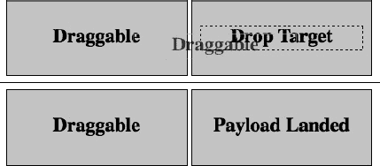
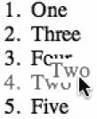

# 七、用户交互和 HTML5 APIs

HTML5 规范中包括关于如何从编程脚本访问 HTML 元素以及更广泛的 web 浏览器环境的文档。这是贯穿整个规范的规范的一个组成部分。每个可以编写脚本的组件都被分成**个应用编程接口**(API)，这些接口定义了脚本如何与页面上的特定元素和 web 浏览器的特定方面进行交互。其中一些 API 是 HTML5 的一部分，如用于以编程方式操作浏览器前进和后退按钮的历史 API，而其他 API 是相关技术的一部分，包含在 HTML5 的独立(但相互链接)规范中，如地理位置 API，它为网页提供地理位置感知功能。这些 API 的构建思想是，页面及其环境由一系列对象表示，比如包含页面位置数据的`geolocation`对象。在页面内容的上下文中，这些对象形成了遍历网页文档对象模型(DOM)的方式，如第一章中的所述。

本章的目标是让你精通如何探索和使用 HTML 规范中定义的脚本功能，这样你就有了必要的工具去探索本章中没有介绍的内容。作为例子，我们将看看使用脚本与浏览器的历史交互，以及`video`和`canvas`元素。最后，我们还将了解如何向任何元素添加拖放支持。

### 在本章中使用 JavaScript

JavaScript 在本书的各个章节中都有涉及，但是在这一章中，我们将更正式地使用它，所以你需要为 JavaScript 代码建立一个测试环境。正如在第二章中所讨论的，JavaScript 可以使用`script`元素嵌入，或者从外部文件加载，这是更好的方法。将它移动到自己的文件中可以在你的网站上创建一个更清晰的标记和脚本的分离。

我们将创建一个基本的网页，作为本章示例的模板。创建一个名为`jstemplate`的目录(在你的桌面上或者任何你方便访问的地方)。您将使用该目录作为本章示例的起始模板。启动您最喜欢的文本编辑器，并创建以下网页:

`<!DOCTYPE html>
<html>
          <head>
                    <meta charset="utf-8" />
                    <title>HTML5 Apprentice</title>
                    <link rel="stylesheet" type="text/css" href="css/styles.css" />
                    ` `          </head>
          <body>
                    
Content goes here!

          </body>
</html>`

在您创建的`jstemplate`目录中，将此代码保存为一个名为`index.html`的文件。为名为`script.js`的 JavaScript 创建第二个页面，并将其放在`jstemplate`目录内名为`js`的目录中。

在`script.js`中编写以下 JavaScript:

`// init function runs when page has fully loaded
function init() {
           // code to run
}
window.onload = init;`

当页面完全加载后，这个脚本将运行函数`init`。

最后，创建一个名为`styles.css`的空 CSS 样式表(在这个阶段只是一个空的文本文件),并把它放在`jstemplate`目录内名为`css`的目录中。

#### 访问 DOM 属性和方法

第一章提供了 DOM 的概述，它将页面上的元素描述为一个连接的树状结构(技术上是一个非循环的连通图)，可以用来获得对页面元素、属性和文本的编程访问。还提到了 DOM 可以通过一个`document`对象访问，这个对象包含在另一个对象——`window`对象中。没有提到的是，更多的抽象实体(除了网页文档)可以通过`window`对象访问。例如，可以通过编程访问浏览历史、网站 URL 位置、屏幕尺寸等。这些实体中的每一个都可以通过`window`作为一个独立的对象来访问。

那么，对象到底是什么？对象仅仅是属性和方法的集合**。这是什么意思？属性是一系列的键和值，就像 HTML 元素的属性一样。他们是*所拥有的*对象。例如，屏幕宽度是一个保存特定值(以像素为单位的屏幕宽度)的属性。有些属性是只读的，而其他属性的值可以被覆盖。根据上下文的不同，属性也称为变量。**

方法描述了一个特定的对象可以做什么。例如，使用 JavaScript 弹出一个警告窗口是通过一个方法完成的。方法也被称为**函数**。它们是自包含的代码块，只有在被调用时才会运行，就像您在上一节的模板 JavaScript 代码中看到的函数一样。

例如，`window`对象有一个名为`name`的属性，可以用来向特定的 web 浏览器窗口添加标识符。1这个属性不是只读的，所以可以读写。

就方法而言，`window`对象有一个方法(在众多方法中)叫做`alert()`，您可能已经见过它的使用。它会弹出一个对话框，显示一条消息和一个 OK 按钮。使用点符号(在第一章中描述)，它们都可以这样使用:

__________

1 这可以在超链接的目标属性中使用，以便在特定窗口中打开链接的资源

`function init() {
         // sets the name of the window
         window.name = "MAIN";    
         // shows the name of the window
         window.alert("The name of this window is set to: " + window.name);
}
window.onload = init;`

该属性和方法的具体用法在现阶段是题外话；重要的是属性和方法之间的概念差异，以及 JavaScript 可以访问 web 浏览器中的设置和行为，而不仅仅是页面上的 HTML 元素。

#### 登录到控制台

第一章还提到了主流 web 浏览器可用的 web 开发工具和代码`console.log("message")`。让我们更仔细地看看这两个话题。在每个浏览器的 web 开发工具中，都有一个访问 JavaScript 控制台的方法，在那里可以记录来自 JavaScript 的消息。在主要的 web 浏览器中，可以找到这些文件，如下所示:

*   *Chrome* :选择查看开发者 JavaScript 控制台。
*   Firefox :我推荐使用 Firebug 中的控制台标签。
*   *ie 浏览器(8 及以上)*:ie 浏览器开发者工具中有脚本标签，选择工具开发者工具即可进入。
*   *Opera* :选择查看开发者工具错误控制台。Opera 在 Opera 蜻蜓中也有一个显示和隐藏控制台的开关。
*   *Safari* :选择开发显示错误控制台。

如果您修改模板脚本来记录消息，那么在加载页面时，您应该会看到它出现在 JavaScript 控制台中。图 7-1 显示了在 Safari 中运行以下代码的例子:

`function init() {
         console.log("message");    // log a message to the JavaScript console
}
window.onload = init;` 

*图 7-1。Safari 的错误控制台显示记录的 JavaScript 输出。*

 **注意**记录 JavaScript 输出的另一个选项是 Firebug Lite，这是一个 Firebug 版本，可以用于 Internet Explorer、Firefox、Opera、Safari 和 Chrome。在这里下载:`[`getfirebug.com/firebuglite`](http://getfirebug.com/firebuglite)`。

虽然将消息记录到控制台很好，但是控制台的真正强大之处在于记录 DOM 的各个部分，并检查对象、属性和方法的值和存在。例如，尝试将前面代码片段中的控制台消息更改为以下内容，然后重新加载页面:

`…
console.log(window);    // log the window object to the JavaScript console.
…`

这将产生(取决于 JavaScript 控制台)一个表示为属性和方法的可折叠列表的`window`对象，如图 7-2 所示。

*图 7-2。在 Safari 的错误控制台中记录的`window`对象*

滚动这个列表，你会发现关于你能从 JavaScript 中操作什么的有趣信息。例如，您将看到可以从 JavaScript 处理的数据类型，比如数组、布尔值等等。您还会看到一个 HTML 元素列表，以`HTMLAnchorElement`、`HTMLImageElement`、`HTMLParagraphElement`等形式显示。JavaScript 是面向原型的语言，这意味着它没有类(不像 Java 或 Adobe Flash 的 ActionScript ),而是利用“原型”对象为其他对象提供基础。这些原型对象可以相互构建，创建一个“原型链”，允许原型对象从其他原型对象继承属性和方法。这个过程类似于其他面向对象语言中类的继承能力。图 7-2 所示的控制台输出中类似 HTML 元素的条目是原型对象，定义了不同 HTML 元素在 DOM 中表示时的属性和方法。例如，为`video`元素定义的`stop()`和`play()`方法可以通过研究 DOM 中表示的`HTMLVideoElement`对象找到，这些方法用于停止和播放该元素中加载的视频(研究这个元素，您会发现它实际上继承了`HTMLMediaElement`的这些方法)。

 **注意**当记录页面上出现的 HTML 元素时(例如，通过它们的 ID 引用它们)，错误控制台通常会显示元素的实际 HTML 代码，看起来像 HTML 源代码的一部分。这种行为不能帮助您发现被引用的 HTML 元素所具有的属性，所以在这种情况下，使用控制台方法`console.dir()`而不是`console.log()`。该方法将向您显示发送给它的特定对象的属性。

在`window`对象中需要注意的其他对象包括:

*   `navigator`对象包含关于正在使用的网络浏览器的信息，例如安装的插件、供应商和版本信息。该对象中还包含地理位置信息。
*   `screen`对象包含关于尺寸、颜色深度的信息，以及关于用来查看当前网页的显示器的相关信息。
*   对象包含以编程方式访问浏览器前进和后退按钮以及相关功能的方法。
*   `location`对象包含关于网页 URL 地址的信息。通过在该对象中设置`href`属性，可以重定向网站，比如`location.href = ["http://www.apress.com";](http://www.apress.com)`。
*   对象包含当前正在浏览的网页上所有 HTML 元素的 DOM 表示。

有些信息会被埋没；例如，您可能不会立即找到之前使用的`alert()`方法。为此，我们需要查看用于创建`window`对象的原型，该对象可通过以下方式访问:

`…
console.log(window.constructor.prototype);    // log the window object's prototype.
…`

这将显示直接在`window`对象上定义的方法，如图图 7-3 所示。

*图 7-3。`window`对象的原型对象显示了为`window`对象*定义的方法

 **注意**访问对象的原型并不直接揭示该原型继承的方法。对于支持它的浏览器(它是非标准的)，比如 Safari、Chrome 和 Firefox，您会发现一个`__proto__`属性，该属性允许您访问构建特定原型的父原型。这可以用来检查从父原型继承的方法。

#### 事件

事件是 JavaScript 中发生的通知，它是用户输入(鼠标点击、键盘按键等)或页面条件(页面已加载等)的结果，当事件发生时，可以“监听”这些事件以使某些事情发生。在`window`对象的其他地方，你会看到一长串以“on”开头的属性，比如`onclick`、`onscroll`、`onload`等等。这些是`window`对象可以响应的事件(分别是点击、滚动和加载页面)。除了将被设置为`function init()`的`onload`之外，大多数情况下，它们的值都是`null`，因为这是在该行之前创建的代码中设置的:

`…
window.onload = init;`

这会将`onload`属性设置为我们的自定义事件处理`init()`函数，这意味着当窗口完全加载并发送了`onload`事件的通知时，`init()`函数将会运行。

每个可能的事件都可以通过这种方式与一个函数相关联。例如，下面将关联一个函数，该函数在页面被单击时弹出一个警告框:

`function windowClickHandler() {
     alert( "Window was clicked" );   // pops up an alert box
}
window.onclick = windowClickHandler;`

如果与事件相关联的函数被给定一个参数，那么该参数保存一个对象，该对象具有关于所发生事件的信息。例如，以下代码使用了一个参数(名为`e`)，该参数包含一个`pageX`和`pageY`属性，用于指定鼠标光标在页面上的位置:

`// logs the event object function windowMouseDownHandler(e) {
console.log(e);                                               
// log the mouse location
console.log("Mouse is at: " + e.pageX + ", " + e.pageY);          }
window.onmousedown = windowMouseDownHandler;`

当运行这段代码并点击页面时，事件对象(在本例中是一个`MouseEvent`对象)和鼠标位置将被记录到控制台。

### 历史 API

让我们把这些 JavaScript 知识都用上吧！我提到过`window`对象包含一个`history`对象，用于控制浏览器的前进和后退按钮。这实际上并不是使用`history`对象所能完成的全部，HTML5 构建了历史 API 2 来允许实际的历史记录以编程方式更新。这意味着可以将页面添加到浏览器的历史记录中，如果用户真的点击了后退按钮，他们将转到已经添加到历史记录中的页面，而不是他们以前访问过的页面。这在使用 Ajax 动态加载内容的页面中非常有用。**异步 JavaScript 和 XML** (Ajax)是一种在无需重新加载整个页面的情况下向页面加载和注入内容的方法。例如，像 Twitter 和脸书这样的网站使用 Ajax 向它们的页面添加新帖子。

__________

2 见【www.w3.org/TR/html5/history.html】的。

#### 真正简单的 Ajax

Ajax 使用一个名为`XMLHttpRequest` (XHR)的对象通过 JavaScript 从 URL 加载内容。然后，可以通过使用 HTML 元素的`innerHTML`属性将这些内容添加到页面中。

最简单地说，使用 Ajax 可能如下所示:

`var xmlhttp = new XMLHttpRequest();
xmlhttp.onreadystatechange = responseReady;
xmlhttp.open("GET","content.txt",true);
xmlhttp.send();`

关键字`var`创建了一个新的变量，它就像一个属性——它是一个容器，保存一些可以读写的值。本例中的新变量包含一个新的`XMLHttpRequest`对象实例(`new`关键字创建了这个对象)。然后设置一个函数来处理`onreadystatechange`事件，该事件将在 XHR 对象检索到一些内容时被触发。然后，`open()`方法指定用于检索文件的方法种类、文件名，以及请求是**异步**(当外部文件加载时脚本继续)还是**同步**(脚本在继续之前等待外部文件加载)。将其设置为`true`使其异步，而`false`将其设置为同步。事件处理函数可能如下所示:

`…
function responseReady() {
          document.body.innerHTML = xmlhttp.responseText;
}`

这个脚本会将页面上的内容设置为加载的文本文件中的内容。

作为一个完整的例子，我们将创建一个简单的页面，包含一个“下一步”按钮和一个“上一步”按钮，以及在这两个按钮之间加载的消息。复制前面的`jstemplate`目录并将其重命名为`ajax`，然后编辑`index.html`,如下所示:

`<!DOCTYPE html>
<html>
         <head>
                   <meta charset="utf-8" />
                   <title>HTML5 Apprentice</title>
                   <link rel="stylesheet" type="text/css" href="css/styles.css" />
                   
         </head>
         <body>
                   <button id="prevButton">Previous</button>
                   

                   <button id="nextButton">Next</button>
         </body>
</html>`

该页面包含两个按钮和两个按钮之间的空白段落，我们将使用 Ajax 填充内容。从`ajax/js`目录中打开`script.js`。添加以下脚本:

`// create global variables
var xmlhttp;
var prevbutton;
var nextbutton;
var message;
var messageID = 1;` `// initialize variables and add event listening functions
function init() {
           prevbutton = document.getElementById("prevButton");
           nextbutton = document.getElementById("nextButton");
           message = document.getElementById("message");

           prevbutton.onmousedown = prevButtonDown;
           nextbutton.onmousedown = nextButtonDown;
                   checkButtons();
          loadFile();
}
// disable previous or next button depending on whether first or last message is displaying
function checkButtons() {
          if ( messageID == 1 ) prevbutton.disabled = true;
          else prevbutton.disabled = false;
          if ( messageID == 3 ) nextbutton.disabled = true;
          else nextbutton.disabled = false;
}
// decrement message ID when previous button is pressed
function prevButtonDown() {
          messageID--;
          if (messageID < 1) messageID = 1;
                  checkButtons();
          loadFile();
}
// increment message ID when next button is pressed
function nextButtonDown() {
          messageID++;
          if (messageID > 3) messageID = 3;
                  checkButtons();
          loadFile();
}
// load message files using Ajax
function loadFile() {
          var file = "message"+messageID+".txt";

          xmlhttp = new XMLHttpRequest();
          xmlhttp.onreadystatechange = responseReady;
          xmlhttp.open("GET",file,true);
          xmlhttp.send();
}
// add Ajax loaded content to paragraph on the page
function responseReady() {
          message.innerHTML=xmlhttp.responseText;
}
window.onload = init;`

这个脚本使用一个变量(`messageID`)来跟踪点击上一个或下一个按钮时需要加载三条消息中的哪一条。您需要创建三个名为`message1.txt`、`message2.txt`和`message3.txt`的文本文件来加载，并将它们保存在`ajax`目录中。向每个文件添加一些文本；只要确保每个文本是不同的。该文本将被注入到页面上的空段落元素中。

在网络浏览器中打开`index.html`来测试文件。你应该能够前后点击按钮，每次点击都会显示不同的信息(图 7-4 )。

*图 7-4。一个简单的 Ajax 应用在双击 next 按钮后的输出。当显示三条消息中的最后一条时，该按钮被禁用。*

#### 支持历史的 Ajax

如果您查看上一个示例中页面地址的 URL，您会发现它并没有随着不同内容的加载而更新。这并不理想，因为显示不同消息的页面不能被书签标记，并且单击浏览器的后退按钮不会返回到先前显示的消息，而是会转到先前查看的页面。然而，历史 API 可以用来克服这些问题。HTML5 引入了两种方法，`pushState()`和`replaceState()`，用于添加和编辑浏览历史。第一个是`pushState()`，允许向页面的浏览历史中添加一个新条目，而`replaceState()`将用一个新条目替换历史中的当前浏览位置。

让我们编辑上一个例子中的脚本，并包含`pushState()`以在单击下一个和上一个按钮时向浏览历史添加一个新条目。回到之前的脚本，编辑`prevButtonDown()`和`nextButtonDown()`方法:

`…
function prevButtonDown() {
          messageID--;
          if (messageID < 1) messageID = 1;
                  var obj = { page: messageID };
          var title = "page"+messageID;
          var url = "#message"+messageID;
          window.history.pushState( obj , title , url );
                  checkButtons();
          loadFile();
}
function nextButtonDown() {
          messageID++;
          if (messageID > 3) messageID = 3;
                  var obj = { page: messageID };` `          var title = "page"+messageID;
          var url = "#message"+messageID;
          window.history.pushState( obj , title , url );
                  checkButtons();
          loadFile();
}
…`

`pushState()`方法有三个参数。第一个是 JavaScript 对象(花括号是创建对象的简写符号)，它可以包含关于被添加到历史中的页面的信息。在本例中，它是一个具有单个自定义属性`page`和保存页面 ID 的值的对象。接下来是添加到历史中的页面的标题(例如，“第 1 页”)。最后，也是最重要的，是要添加到历史中的页面的 URL。我们将添加的页面与我们现在所在的页面是相同的，但是我们将为 URL 添加一个标签，因此对于每一次点击 next 按钮，它都变成了`ajax.html#message1`、`ajax.html#message2`和`ajax.html#message3`。我们可以只添加 hashtag 而不指定当前页面，因为如果没有指定页面，浏览器会添加当前页面。

好，编辑`loadFile()`函数，以便它从 URL 中的 hashtag 检索消息 ID:

`…
function loadFile() {
           // retrieve the hashtag from the URL using the location object
           var messageHash = window.location.hash;
           if (messageHash == "") messageHash = "#message1";
           var file = messageHash.substr(1)+".txt";     // strip out the "#" from the hashtag
           xmlhttp = new XMLHttpRequest();
           xmlhttp.onreadystatechange = responseReady;
           xmlhttp.open("GET",file,false);
           xmlhttp.send();
}
…`

现在测试页面，并使用下一页和上一页按钮。您应该看到带有 hashtag 的 web 页面地址 URL 更新。这意味着支持 Ajax 的内容页面可以加入书签，这太棒了！但是，如果您单击浏览器的前进或后退按钮，您会注意到页面上的消息不会更新，即使地址栏中的 URL 会更新。原因是当用户点击前进和后退按钮时，`onload`事件不会再次触发。这是因为浏览器已经缓存了该页面，这样当用户浏览历史记录时，它会加载得更快。我们需要添加的是一个在历史发生变化时触发的事件，谢天谢地有这样一个事件叫做`onpopstate`。在脚本的最后，添加以下内容:

`…
window.onpopstate = init;`

这将在每次浏览历史记录时运行`init()`功能。这不是最有效的代码，因为会有对`init()`函数的多余调用(例如，在第一次加载页面时调用两次)，但是使用这个简单的例子来开发。

### 构建自定义视频控制器

让我们看看与 HTML 元素相关的 JavaScript 方法的交互。前面我提到过，`video`元素有一个`play()`方法和一个`stop()`方法。我们可以使用这些从 JavaScript 控制视频回放，这意味着我们可以创建一个带有自定义播放和暂停按钮的控制栏。告别每个浏览器看起来都不一样的控制条！对于图形，我们将使用 CSS，但更具体地说，我们将使用一个叫做 **CSS** **sprites** 的概念，这是一种使用一个图像文件在页面的不同点显示两个或更多图像的技术。这种技术背后的想法是，一个图像文件可以包含一整串图像，然后可以以不同的方式裁剪和定位，以显示不同的图像。这有点像透过纸巾管看饼干摊在饼干纸上。您一次只能看到一个 cookie，但是您可以移动表单来显示不同的 cookie。这种技术给人一种已经下载了多个图像的错觉，但实际上只有一个图像被下载了，这意味着所有的图像将同时出现在页面上，并且只有一个请求被发送到服务器以获取图像。

继续我们的例子…复制前面的`jstemplate`目录，并将其重命名为`video_player`。为 sprite 创建一个图像，该图像包含视频控件的播放和暂停图形(图 7-5 )。将大小设置为 80 像素宽，30 像素高。

***图 7-5。**一个图像精灵，有两个图像，用于简单视频播放器上的控件*

更新`index.html`中的 HTML，如下所示:

`<!DOCTYPE html>
<html>
          <head>
                    <meta charset="utf-8" />
                    <title>HTML5 Apprentice</title>
                    <link rel="stylesheet" href="css/styles.css" type="text/css" />
                    
          </head>
          <body>
          <section>
                    <video width="320" height="240" poster="poster.jpg" id="my_video">
                         <source src="trailer.webm" type='video/webm; codecs="vp8, vorbis"' />
                <source src="trailer.mp4" type='video/mp4; codecs="avc1.4D401E, mp4a.40.2"' />
                        <source src="trailer.ogv" type='video/ogg; codecs="theora, vorbis"' />
                              
Video playback not supported.

                    </video>
                    

                              <a href="nojs-player.html" title="Play" id="control_button">
                                        
                                        <label id="control_label">Play</label>
                              </a>
                              

          </section>
          </body>
</html>`

正如您所看到的，这段代码包含了带有回退内容 3 的`video`元素，后跟一个用于自定义视频控件的`div`区域。为了让这个例子正常工作，您必须包含三个大小为 320 x240 像素的视频文件，它们被命名为`trailer.webm`、`trailer.mp4`和`trailer.ogv`，与`index.html`在同一个目录中(为视频创建一个`video`目录或类似的目录并不是一个坏主意，如果您这样做，请确保更新 HTML)。

接下来，我们将创建用于启用该自定义控件的 JavaScript。从`video_player/js`目录中打开`script.js`。对于代码，首先我们将创建变量来保存对页面上的`video`、锚(`<a>`)、`span`和`label`的引用。接下来，`init()`函数被更新，这样它将每个 JavaScript 变量的值设置为一个 HTML 元素的引用，可以使用`getElementById()`方法通过它们的`id`属性检索该元素。将`script.js`更新成这样:

`// JavaScript variables used to hold references to HTML elements
var video;
var control_button;
var control_label;
var control_graphic;
        // initialization function runs when the page has loaded
function init() {
          video = document.getElementById("my_video");
                  control_button = document.getElementById("control_button");
          control_label = document.getElementById("control_label");
          control_graphic = document.getElementById("control_graphic");
          control_button.onclick = playVideo;
}

window.onload = init; // runs the init function when the page has finished loading`

 **注意**类代替 id 可以用于所有的元素，并且`document.getElementByClassName()`函数可以用于在一个页面上自动启用多个视频控件的功能，但是这会使代码稍微复杂一些，所以为了简洁起见，使用了 id。

当点击按钮控件时，`init()`函数中的最后一行调用另一个函数。这个函数被命名为`playVideo()`。继续添加到`script.js`:

`…
function playVideo() {
          control_graphic.className = "pause";
          control_button.onclick = pauseVideo;
          control_button.title = "Pause";` `          control_label.textContent = "Pause";
          video.play();
          return false;
}`

__________

3 为简洁起见，回退内容已缩短；参见第五章了解视频元素的综合回退内容信息。

这个函数将控件图形上的 class 属性设置为一个名为`pause`的 CSS 类，它将 CSS sprite 放置在暂停按钮图像上。接下来，它设置文本内容(如果 CSS 样式表被禁用，它将用作后备内容)，然后播放视频。`return false`位确保链接(ID 为`control_button`)在被点击时不会转到它链接的页面；然而，如果 JavaScript 被禁用，它将转到一个名为`nojs-player.html`的页面，该页面可能包含一个无需 JavaScript 也能工作的视频播放器(您必须自己构建这个)。该函数还为再次单击按钮控件设置了一个新函数。这个新功能被称为`pauseVideo()`，它暂停视频并反转`playVideo()`功能中设置的更改。继续将它添加到您的`script.js`文件中:

`…
function pauseVideo() {
          control_graphic.className = "play";
          control_button.onclick = playVideo;
          control_button.title = "Play";
          control_label.textContent = "Play";
          video.pause();
          return false;
}`

这就是我们需要的全部 JavaScript 现在来看 CSS。首先，链接锚元素被设置为显示为块级元素，并设置了其宽度和高度。属性`overflow`被设置为`hidden`，这样超出控件尺寸的内容就不会显示出来。这是隐藏回退文本所必需的，因为它将被推出控件的边界。从`video_player/css`目录中打开`styles.css`。添加以下 CSS 规则:

`.video_controls a {
    display: block;
    width: 40px;
    height: 40px;
    overflow: hidden;
}`

接下来，我们为`span`添加一个规则，使它也成为一个块级元素(将其他文本内容排除在外)。这是附加背景图像精灵(名为`"controls.png"`)的地方:

`…
.video_controls span {
    display: block;
    background-image: url(controls.png);
    background-repeat: no-repeat;
    width: 40px;
    height: 40px;
    background-color: #ccc;` `}`

最后，创建了两个 CSS 类来设置背景图像的位置，移动它来显示播放符号或暂停符号:

`…
.pause {
    background-position: -45px 5px;
}
.play {
    background-position: 5px 5px;
}`

就这样！播放和暂停按钮来自同一个图像，如图图 7-6 所示。

***图 7-6。**使用 CSS sprite 自定义视频控件的播放(L)和暂停(R)状态*

### 脚本化 2D 画布 API

现在让我们来看看更具互动性的东西。正如你在第五章中看到的，`canvas`元素没有太多可以用 HTML 来处理的东西，因为它只有两个属性，简单地指定了画布区域的宽度和高度。`canvas`的真正力量来自于 JavaScript 对元素的操作。请记住，画布是位图画布，这意味着它本质上是一个空白图像，我们可以通过一组绘图命令来操纵它的像素。

要使用画布，需要从元素中检索特定的“上下文”,然后可以将它用作绘制操作的目标。上下文指定了我们正在处理什么样的图像。有两种选择:二维或三维图像。

让我们从寻找检索我们将要使用的上下文的方法开始。 4 首先从章节开始复制`jstemplate`目录，并重命名为`canvas`。修改`index.html`中的 HTML，添加一个`canvas`元素(和一些后备内容)来代替文本段落:

__________

对于没有耐心的人来说，检索上下文的方法称为 getContext()。

`…
<body>
          <canvas id="canvas" width="300" height="300">
                    
The canvas element is not supported!

          </canvas>
</body>
…`

现在修改`canvas/js`目录中的`script.js`,以便从 JavaScript 访问`canvas`元素。我们将首先添加一个变量来保存对`canvas`元素的引用，我们将使用`getElementById()`方法来设置它:

`var canvas;     // variable to hold a reference to the canvas element on the page
        function init() {
canvas = document.getElementById( "canvas" );         // look up the canvas element by its ID
}
window.onload = init;`

 **注意**你可能早就注意到了`document`是`window`对象的一个属性，那么为什么前面的代码块中没有语法`window.document…`？原因是在查找属性或方法时，浏览器会自动查找`window`对象，所以没有必要在`window`对象的所有属性或方法前加上前缀`window`。例如，`console`也是`window`的一个属性，但是为了简洁起见，`window`通常被省略掉了(尽管它可以被包含在内而不会造成任何伤害)。

这让我们可以从脚本中访问`canvas`元素。让我们通过查看其原型来看看为`canvas`元素定义了什么方法，就像我们通过访问`constructor.prototype`来处理`window`对象一样。像这样编辑脚本:

`…
function init() {
// look up the canvas element by its ID
canvas = document.getElementById( "canvas" );                      
// log the canvas element's prototype
console.log( canvas.constructor.prototype );            }
…`

这就揭示了`getContext()`，这就是我们需要的检索上下文的方法！另一个方法是`toDataURL()`，用于将画布图像数据转换成一个 URL，例如，该 URL 可以作为图像元素的源图像数据(`img`)。

如前所述，上下文将告诉我们正在处理什么类型的图像，可以是二维或三维图像。为了检索某个上下文，一个文本关键字作为一个参数被提供给`getContext()`方法。 5 使用文本关键字`"2d"`来检索二维上下文。为了检索三维上下文，使用文本关键字`"webgl"`来代替。如您所见，3D 上下文使用 WebGL 与图像进行交互。

 **注意** WebGL 是一个网络浏览器的 3D 渲染规范，由 Khronos 集团监管。WebGL 是网络浏览器中的一个实验性功能，因此，`webgl`关键字可能在不久的将来不会起作用。如果您尝试这种上下文并发现它不起作用，请尝试使用`"experimental"-webgl`,这是一个临时的上下文关键字，用于支持浏览器，直到 WebGL 进一步发展。

让我们检索 2D 上下文，并使用 JavaScript 控制台检查它的属性和方法；编辑脚本，如下所示:

`var canvas;            
var context;           // variable to hold a reference to the canvas context
        function init() {
         canvas = document.getElementById("canvas");             
         // retrieve the 2D canvas context
context = canvas.getContext("2d");                       
                 // inspect the canvas context
console.log(context);                                    
        // inspect the canvas context prototype
console.log(context.constructor.prototype);          
}
window.onload = init;`

这将向控制台记录两个对象，`CanvasRenderingContext2D`和`CanvasRenderingContext2DPrototype`(实际名称可能因浏览器而异)。第一个将显示上下文中可用的属性，包括添加到画布的线条和填充的颜色。`CanvasRenderingContext2DPrototype`显示了可用的方法，包括一系列在画布上绘图和变换画布的方法。画布的图形功能包括以下内容:

*   *基础画法*:有画矩形、直线、曲线、圆弧的方法。
*   *填充和描边*:有创建实心填充和轮廓的方法。
*   效果:有一些方法可以创建阴影、渐变、透明度，以及将图像叠加在一起。

__________

5WHATWG 在 http://wiki.whatwg.org/wiki/[运营一个 wiki](http://wiki.whatwg.org/wiki/)canvas contexts，提供可用画布上下文关键字的概述。

WebGL 规范可从这里获得:【www.khronos.org/registry/webgl/specs/latest/. 

*   *变换*:有缩放、旋转、平移(移动)图像的方法。
*   *文本*:有添加实心或轮廓文本的方法。
*   *Images* :有一些方法可以在画布上绘制图像(甚至是视频或其他画布元素)，然后可以对其进行转换或其他操作。

我们将探索前两个方面，但是一定要使用控制台来探索本章中没有涉及的可用方法和属性。其中很多的目的是相当不言而喻的！

#### 在画布上绘画

让我们从在画布上画一个覆盖可用区域的矩形开始。与绘制矩形相关的方法如下:

*   `fillRect(x,y,w,h)`:画一个实心矩形
*   `strokeRect(x,y,w,h)`:勾勒出一个矩形

使用这两种方法中的任何一种，我们都可以从画布上的指定位置开始创建一个给定宽度和高度的矩形。在使用这些方法之前，您可能需要设置矩形的样式，以指定填充和描边的外观(轮廓颜色)。为此，可以设置一些属性:

*   `fillStyle`:填充颜色
*   `strokeStyle`:轮廓的颜色
*   `lineWidth`:轮廓的宽度

要设置样式属性，请将值设置为带引号的 CSS 样式颜色代码，例如#00000 表示黑色。`lineWidth`属性接受一个以像素为单位指定宽度的数字。要用实心矩形填充整个画布，需要指定起点为 0，0(左上角点)，宽度和高度与画布的宽度和高度相同。在它的顶部添加一个矩形轮廓会得到如下结果:

`…
canvas = document.getElementById( "canvas" );
context = canvas.getContext( "2d" );
// the color of the fill
context.fillStyle = "#cccccc";
// the color of the outline
context.strokeStyle = "#999999";
// the width of the outline
context.lineWidth = 5; 
// fill the canvas area with a rectangle
context.fillRect( 0, 0, canvas.width, canvas.height );
// outline a rectangle inside the canvas borders
context.strokeRect( 30, 30, 200, 100 );
…`

将这段代码添加到`canvas/js`目录下`script.js`中`init()`函数的内容中，看看它是如何工作的！画布使用带有反向 y 坐标的笛卡尔坐标系。这意味着画布上的每个像素都可以由 x 和 y 值指定，其中 x 是画布区域左侧的像素数量，y 是画布区域顶部的像素数量。例如，一个 30，30 的 x，y 坐标将指定一个距离画布区域左侧 30 像素和顶部 30 像素的位置(图 7-7 )。

***图 7-7。由`strokeRect(30,30,200,100)`在 300×300 像素的画布上绘制的矩形***

画比矩形更复杂的形状更复杂。需要创建一条线，也称为**路径**，它可用于逐段构建形状。以下是绘制带有直边的简单形状的相关方法:

*   `beginPath()`:开始新的一行
*   `closePath()`:结束新的一行
*   `moveTo(x,y)`:移动到画布上的一个坐标
*   `lineTo(x,y)`:在画布上绘制一条到坐标的线段
*   `stroke()`:给线条上色
*   `fill()`:填充由线段创建的形状

`beginPath()`方法首先用于告诉画布正在绘制一个新的形状，它由线段组成。然后使用`moveTo()`和`lineTo()`方法在画布上移动并绘制线段。最后，使用`closePath()`方法完成一条线，如果该线被填充，则连接起点和终点。例如，要创建一个三角形，首先要创建一条路径，移动绘图点，绘制两条直线，然后闭合、填充路径并画出轮廓:

`…
context.beginPath();           // start a new line
context.moveTo(50,50);         // move to 50 pixels from the left and top edge of the canvas
context.lineTo(150,50);        // draw a line to 150 and 50 pixels from the left and top edge
context.lineTo(100,150);       // draw a line to 100 and 150 pixels from the left and top edge
context.closePath();           // close the line
context.fill();                // fill the shape formed by the line with the fill style color
context.stroke();              // outline the line with the stroke style color
…`

用于代替之前的矩形绘图代码，这导致了图 7-8 中所示的三角形。

*图 7-8。使用画布路径绘制方法绘制的三角形*

 **注意**如果省略了`beginPath()`和`closePath()`方法，线条将不会自动闭合以形成一个形状，这在你只想让线条没有填充的情况下可能是需要的。

代替`lineTo()`方法，`arcTo()`、`bezierCurveTo()`或`quadraticCurveTo()`方法可以用来创建具有弯曲边缘的形状。

此外，可以设置`lineCap`和`lineJoin`属性来影响线段末端和每个线段连接点的显示方式。可以将`lineCap`属性设置为`butt`、`round`或`square`来改变行尾。`lineJoin`可以设置为`miter`、`round`或`bevel`来影响两条线段连接点的形状(图 7-9 )。当设置为`miter`时，另一个属性`miterLimit`可用于指定形成一个点的角度。

图 7-9*。`lineCap`和`lineJoin`属性的值*

**三角学**

在处理算法生成的图形时，一个值得你思考的数学领域是三角学。三角学是关于三角形的角和边的研究，这对于画圆周围的特定点是至关重要的。由于画布使用由行和列(x 和 y 坐标)组成的笛卡尔坐标空间，因此当一个点与另一个点之间的视线倾斜时，找到它们之间特定距离处的 x、y 坐标并不像它们彼此在水平或垂直线上那样简单，但是找到该点并没有那么困难。你所需要的是在两者之间画出的三角形内部形成的角度。一旦你有了这些，图 7-10 中的公式就是你所需要的。

*图 7-10。使用三角函数确定圆上的点*

在图 7-10 中，角度θ需要以弧度表示，等于角度角度乘以 pi 除以 180。翻译成代码，图 7-10 中的公式可能是这样的:

`x = 50 + Math.cos( 45 * Math.PI / 180 ) * 20;
y = 50 + Math.sin( 45 * Math.PI / 180 ) * 20;`

这将找到一个点的 x 和 y 坐标，该点与画布上 x，y 坐标为 50，50 的另一个点成 45 度角，相距 20 个像素。

让我们来看一个完整的例子。这个例子在画布上画了一个螺旋，其结果如图 7-11 所示。它运行一个循环多次，增加与中心的距离(图 7-10 中的“c”)并增加角度度数:

`// declare the global variables
var canvas;
var context;
var centerX;
var centerY;
var degrees = 0;
var radius = 1;

function init() {
          canvas = document.getElementById( "canvas" );
          context = canvas.getContext("2d");
          centerX = canvas.width/2;
          centerY = canvas.height/2;
          // move to the center of the canvas
          context.moveTo( centerX , centerY );
          // loop two thousand times, drawing a line out further and further from the center
          for (var i=0; i<2000;i++) {
                    degrees += 1;
                    radius += 0.02;
                    context.lineTo(
                                centerX+Math.cos(degrees*Math.PI/180)*radius ,
                                centerY+Math.sin(degrees*Math.PI/180)*radius
                                );
          }
          context.stroke();
}
window.onload = init;    ` 

*图 7-11。使用三角函数在画布上绘制螺旋*

#### 画布状态

设置填充和描边样式将影响在当前画布上下文上创建的所有后续图形。为了处理临时改变填充和笔画样式，canvas 上下文有两个方法，`save()`和`restore()`，用于保存样式集，然后在以后将它们恢复到保存的状态。当在画布上绘制多个形状时，这两种方法通常用于隔离每个形状应用的样式更改。例如，在下面的代码块中，绘制了三个正方形，分别用红色、绿色和蓝色标出轮廓。然后在所有的框周围画一个边框。因为使用了`save()`和`restore()`，最终的边框不需要样式集，因为它将使用原始样式:

`…
context.save();
context.strokeStyle = "#ff0000";
context.strokeRect(0,0,100,100);
context.restore();

context.save();
context.strokeStyle = "#00ff00";
context.strokeRect(50,50,100,100);
context.restore();

context.save();
context.strokeStyle = "#0000ff";
context.strokeRect(100,100,100,100);
context.restore();

// Rectangular outline will be default black, because original style settings were restored context.strokeRect(0,0,200,200);
…`

 **注**画布是闪光杀手吗？你可能听说过这个问题，特别是苹果公司的史蒂夫·乔布斯在 2010 年的一封公开信中对 Adobe Flash 进行了著名的抨击，他在信中表示 Flash 是一种过时的技术，很快将被 HTML5 技术所取代。这在一定程度上受到了`video`元素的刺激——因为视频是 Flash 在网络上占主导地位的领域——但是`canvas`元素也侵占了 Flash 的一点地盘，尽管重叠是有限的。Canvas 是一个可脚本化的位图图像，针对使用像素数据进行绘制进行了优化，它不包含任何用于动画的内置方法。Canvas 使用即时模式渲染，这意味着它不会将显示的图形存储为单独的实体。这实际上就像在真正的画布上绘画，其中颜料可以层叠在图像上，但一旦在画布上，它实际上是任何先前已应用的颜料的一部分。另一方面，Flash 内容传统上存储为矢量图像(尽管它也处理位图数据)，并且它包括图形显示列表的概念，这非常类似于 HTML 的 DOM。这意味着 Flash 中的图形被分成多个节点，这些节点可以方便地从代码中访问，以实现交互和动画目的。在许多方面，SVG，另一种网络图形技术，更类似于传统的 Flash 空间。因此，`canvas`本身并不能取代 Flash，但是和其他与 HTML5 相关的技术一起，使得传统上仅限于 Flash 的内容创作成为可能。

#### 画布互动

与画布图形交互就是在画布的一个与鼠标相关的事件上设置一个事件处理函数，比如`onmousedown`、`onmouseover`或`onmousemove`(在`window`对象上使用`console.log()`来探索可用的事件)，然后在画布上的鼠标位置绘制一些图形。例如，以下脚本记录了鼠标光标位置的 x，y 坐标，并在用户每次移动鼠标时，从保存的位置到当前位置绘制一条线，创建一个简单的绘图应用(图 7-12 ):

`// declare global variables
var canvas;                      // reference to canvas element on page
var context;                     // reference to canvas context
var cwidth;                      // reference to canvas width
var cheight;                     // reference to canvas height
var lastX = 0;                   // variable to hold an x coordinate value
var lastY = 0;                   // variable to hold an x coordinate value    
        // initialize the variables and add event handler
function init() {
           canvas = document.getElementById( "canvas" );
           context = canvas.getContext("2d");
           cwidth = canvas.width;
           cheight = canvas.height;
           context.strokeStyle = "#000000";
           context.strokeRect(0,0,cwidth,cheight);
        // call the draw function when the cursor moves over the canvas
           canvas.onmousemove = draw;          
}
// draw on the canvas
function draw(e) {
           // update the saved x, y coordinates to the position of the cursor
           // if it is first entering the canvas
           if (lastX == 0) lastX = e.pageX - canvas.offsetLeft;
           if (lastY == 0) lastY = e.pageY - canvas.offsetTop;
           // begin a new line and move to the last saved x, y coordinates
           context.beginPath();
           context.moveTo(lastX, lastY);
           // set the saved x, y coordinates to the position of the mouse cursor
           lastX = e.pageX - canvas.offsetLeft;
           lastY = e.pageY - canvas.offsetTop;
                   // draw a line
           context.lineTo(lastX, lastY);
           context.closePath();
           context.stroke();` `}
window.onload = init;` 

*图 7-12。用一个简单的画布绘图应用制作的涂鸦*

#### 画布动画

动画只是一系列静止图像，因此制作动画的基本步骤如下:

1.  清除画布上的任何现有图形。
2.  在画布上绘制新图形。
3.  重复步骤 1 和 2

在画布上绘制使用前面介绍的绘制方法，但是清除画布引入了一种新方法:`clearRect(x,y,w,h)`。此方法清除矩形区域内画布上的所有图形。对于动画，这通常意味着清除整个画布区域，除非您能够可靠地知道在整个动画过程中只有画布的一部分会发生变化。

全局`window`对象包含两种方法，用于根据动画的需要重复一段代码:`setInterval(f,t)`和`setTimeout(f,t)`。这两种方法都在指定的时间间隔(`t`)后调用自定义函数(`f`)。时间间隔以毫秒为单位设置，因此 1000 的长度为一秒。两者的区别在于`setInterval(f,t)`连续运行，而`setTimeout(f,t)`只在设定的时间量后执行一次。我们将使用`setInterval(f,t)`创建一个基本的动画引擎。

 **注意** Firefox、Chrome、Opera、Internet Explorer 都有一个实验方法叫做`requestAnimationFrame()`，用来告诉 web 浏览器重画窗口，以便重画一个动画的帧。这比使用`setInterval()`方法有优势，因为动画仅在浏览器可用时运行，这意味着，例如，在隐藏的选项卡中运行的动画将会因为页面不显示而停止，从而节省计算机处理器不必要的资源消耗。你可以在`[`developer.mozilla.org/en/DOM/window.requestAnimationFrame`](https://developer.mozilla.org/en/DOM/window.requestAnimationFrame)`找到更多关于这种方法的信息。

要创建一个基本的动画引擎，需要创建以下函数:

*   `init()`设置初始变量并启动动画
*   `invalidate()`指定动画帧需要重画
*   `clear()`清除动画帧
*   `draw()`绘制动画帧
*   `update()`更新绘制动画帧时使用的变量

总的来说，一个基本动画引擎的代码看起来如下，它将在画布上动画显示两条线(图 7-13 ):

`// declare global variables
var canvas;
var context;
var cwidth;
var cheight;
var lastX = 0;
var lastY = 0;

// initialize animation
function init() {
           // set variable values
           canvas = document.getElementById( "canvas" );
           context = canvas.getContext("2d");
           cwidth = canvas.width;
           cheight = canvas.height;

           // start animation sequence by calling the update function every 30 milliseconds
           setInterval(update, 30);
}
// clear and redraw the canvas
function invalidate() {
           clear();
           draw();
}
// clear the canvas
function clear() {
           context.clearRect( 0 , 0 , cwidth , cheight );
}
// draw the graphics on the canvas using the saved x, y coordinate values
function draw() {
           context.fillRect(0,lastY,cwidth,5);
           context.fillRect(lastX,0,5,cheight);
}
// update the saved x, y coordinate values. Reset them to zero if they reach the canvas edge
function update() {
           lastY += 1;
           if (lastY > cheight) lastY = 0;
                   lastX += 1;
           if (lastX > cwidth) lastX = 0;` `           invalidate(); // call invalidate to redraw the canvas
}
window.onload = init;` 

*图 7-13。三帧来自一个基本的动画引擎，在画布上扫过两条线*

要查看这种工作方式，请编辑`canvas/js`目录中的`script.js`。显然，这只是一个简单的例子，展示了一个基本的动画引擎，但是这种结构可以很容易地进一步开发，以创建更复杂的动画序列。

### 拖放操作

HTML5 规范中出现的拖放功能实际上是微软的一个老的附加功能， 72 最初是在十多年前添加到 Internet Explorer 中的。从那时起，其他浏览器已经赶上并实现了相同的功能——除了 Opera，它目前还不支持这一特性。在支持的浏览器中，所有元素都可以通过全局`draggable`属性使用拖放功能，该属性的值可能是`true`或`false`。默认情况下，大多数元素将被设置为`false`，但也有一些例外。默认情况下，图像元素(`img`)的`draggable`属性设置为`true`，锚元素(`a`)也是如此，但前提是它设置了`href`属性。此外，虽然它没有属性，但默认情况下可以拖动用户选择的纯文本。

拖动操作总是有一个开始和一个结束，这通常对应于某些东西被拾起、移动和放到其他地方。根据拖放序列开始和结束之间所需行为的复杂性，会涉及到相当多的事件。表 7-1 描述了相关事件及其触发时间。

让我们创建一个文件，将这些事件记录到控制台。复制前面的`jstemplate`目录，并将其重命名为`dnd`。首先编辑`index.html`,如下所示:

`<!DOCTYPE html>
<html>
          <head>
                    <meta charset="utf-8" />
                    <title>HTML5 Apprentice</title>
                    <link rel="stylesheet" type="text/css" href="css/styles.css" />
                    
          </head>
          <body>
                <section>
                    <h1 draggable="true" id="draggable">Draggable</h1>
                </section>
                <section>
                    <h1 draggable="false" id="droptarget">Drop Target</h1>
                </section>
          </body>
</html>`

这个 HTML 页面创建了两个部分，一个部分的`draggable`属性被设置为`true`，另一个部分被设置为`false`(这个可以省略，但是我把它包括进来是为了明确区分这两个部分)。每个都有一个 ID，将在页面的 JavaScript 中被引用。

现在编辑链接的 CSS 文件`styles.css`(在`dnd/css`目录下)。我们将选取这些部分，并创建两个并排排列的黑框:

`section {
          width:200px;
          padding:10px;
          background-color:#cccccc;
          border:1px solid #000000;
          float:left;
          margin-right:4px;
          text-align:center;
}`

最后，编辑`script.js`(在`dnd/js`目录中)并编写以下脚本:

`// global variable to hold reference to the two sections on the page
var draggable;` `var droptarget;

// initialize variable values and set event handling functions
function init() {
          draggable = document.getElementById( "draggable" );
          droptarget = document.getElementById( "droptarget" );

          draggable.ondragstart = dragStartHandler;
          draggable.ondrag = dragHandler;
          draggable.ondragend = dragEndHandler;
                  droptarget.ondragenter = dragEnterHandler;
          droptarget.ondragover = dragOverHandler;
          droptarget.ondragleave = dragLeaveHandler;
          droptarget.ondrop = dropHandler;
}
// event handling functions for each of the drag and drop operations
function dragStartHandler(e) { console.log("dragstart"); }
function dragHandler(e) { console.log("drag"); }
function dragEndHandler(e) { console.log("dragend"); }
function dragEnterHandler(e) { console.log("dragenter"); }
function dragOverHandler(e) { console.log("dragover"); }
function dragLeaveHandler(e) { console.log("dragleave"); }
function dropHandler(e) { console.log("drop"); }

window.onload = init;`

该脚本将为每个拖放事件添加事件处理函数，并在事件发生时向控制台记录一条消息。如果您在 web 浏览器中打开它，并将文本“Draggable”拖动到“Drop Target”，您应该会在 JavaScript 控制台中看到一些事件消息。

根据您使用的浏览器，您可能看不到太多内容。例如，Google Chrome 只显示“dragstart”和“dragend ”,似乎忽略了所有其他事件！这是怎么回事？Chrome 希望设置一个叫做`dataTransfer`的对象，它本质上是一个数据有效载荷，在拖放操作中被(潜在地)传递给拖放目标。最简单的拖放操作包括以下内容:

*   将`draggable`属性设置为`true`(如果尚未设置)
*   设置一个事件监听器函数来处理`dragstart`事件
*   在`dragstart`事件处理函数中设置`dataTransfer`对象的有效载荷

好了，所以我们需要给`dragStartHandler()`函数添加一行代码，让这个脚本兼容谷歌 Chrome 等浏览器。修改`script.js`中`dragStartHandler()`函数的代码，如下所示:

`…
function dragStartHandler(e) {
          console.log("dragstart");
          e.dataTransfer.setData("text/plain" , "Payload Landed" );
}
…`

如您所见，`dataTransfer`对象有一个名为`setData()`的方法，该方法设置与被拖动项一起发送的数据的类型和值。现在(如果您之前没有看到)，您应该会看到 JavaScript 控制台记录了以下事件:

`dragstart
drag
dragenter
dragover
drag
…
dragleave
dragend`

在中间，当你拖动物品时，你会看到“拖拽”和“拖动”重复多次。

你可能会注意到少了一个事件，最重要的`drop`！原因是当你在拖放目标上时，`dragover`事件有重置拖放操作的奇怪行为，其结果是`drop`事件永远不会触发。`dragenter`和`dragover`事件可以用来处理拖放操作，但在大多数情况下，您会想要触发`drop`事件。然后你需要做的是取消`dragover`事件的默认行为。这是在事件对象上调用方法`preventDefault()`的问题，该事件对象作为参数传递给`dragOverHandler()`函数。此外，我们将检查默认行为是否已经被阻止，我们还将从函数返回 false，这是告诉浏览器忽略事件的默认行为的另一种方式。可以添加这两种方法，以确保浏览器对此指令提供最广泛的支持。编辑您的代码并添加以下内容:

`…
function dragOverHandler(e) {
          console.log("dragover");
          if (e.preventDefault) e.preventDefault();
          return false;
}
…`

现在，当您测试拖放操作时，您应该在 JavaScript 控制台中看到“drop”条目。对于最后一次编辑，我们将把“拖放目标”的文本分配给`dataTransfer`对象中有效载荷的文本。我们将使用`innerHTML`属性来设置放置目标中的内容。编辑脚本以进行此更改:

`…
function dropHandler(e) {
          console.log("drop");
          droptarget.innerHTML = e.dataTransfer.getData("text/plain");
}
…`

`getData()`方法用于检索在`dragStartHandler()`函数中设置的有效负载的内容，然后将该值分配给放置目标的内容。再次测试该页面，您应该会看到当您将“可拖动”文本拖放到“拖放目标”文本上时，它会变为“有效负载已着陆”。

好吧，让我们把它变得更人性化一点。我们将添加一个 CSS 类来创建一个黑色的虚线边框，当鼠标经过拖放目标时，这个边框就会出现和消失。我们还将添加一个默认的边框到背景中，这样当添加虚线边框时元素就不会移动。编辑`styles.css`，增加以下两条规则:

`h1 {
          border:1px solid #cccccc;
}
        .over {
          border:1px dashed #000000;
}`

现在，我们将通过设置拖放目标上的`className`属性，在拖放目标上方时添加`over`类。编辑`script.js`中的`dragOverHandler()`函数，添加类名:

`…
function dragOverHandler(e) {
          console.log("dragover");
          droptarget.className = "over";
          if (e.preventDefault) e.preventDefault();
          return false;
}
…`

我们需要在`dragEndHandler()`和`dragLeaveHandler()`函数中移除这个类，所以我们将这些函数的`className`属性设置为`null`，这将移除 CSS 类:

`…
function dragEndHandler(e) {
          console.log("dragend");
          droptarget.className = null;
}
…
function dragLeaveHandler(e) {
          console.log("dragleave");
          droptarget.className = null;
}
…`

最后，我们需要防止`dropHandler()`函数的默认行为。有些浏览器会尝试打开已被丢弃的内容。例如，将链接拖放到浏览器窗口中可能会导致浏览器导航到该链接的 URL。为了防止这种情况，对`script.js`进行如下编辑:

`…
function dropHandler(e) {
          console.log("drop");
          droptarget.innerHTML = e.dataTransfer.getData("text/plain");
          if (e.preventDefault) e.preventDefault();
          return false;
}
…`

现在，如果您测试这个拖放操作，您应该看到当拖放操作完成时添加的文本有效载荷，并且边框应该在操作期间出现和消失(图 7-14 )。

*图 7-14。正在进行的拖放操作(上图)和已完成的拖放操作(下图)*

除了`draggable`属性，还有全局`dropzone`属性。这个属性在理论上可以用来指定一个特定的拖放目标期望接收什么样的数据，以及正在进行什么样的拖放操作(规范列出了`move`、`link`和`copy`作为其可能的值)，在理论上可以用来替换在`dragenter`和`dragleave`事件中引入的任何逻辑。然而，在撰写本文时，您必须等待这一特性在主流 web 浏览器上实现。

**ADDEVENTLISTENER**

例如，本书中处理事件的语法如下所示:

`window.onload = init;`

这是我使用的一种较老的语法，因为它得到了广泛的支持，但是您应该知道一种更新的、更灵活的语法，用于处理您可能遇到的事件。可以添加`addEventListener()`方法来将事件处理函数与事件相关联。前面的代码行可以重写如下:

`window.addEventListener( "load" , init , false );`

这将`load`事件与函数`init()`相关联，因此在该语法中,“on”前缀被从事件中去掉。这种语法的优点如下:

*   前面代码片段中的`false`精确控制何时响应事件。简而言之，事件可以在两个阶段被触发:捕获阶段和冒泡阶段。在捕获阶段，在 DOM 中某个元素的所有父元素都触发了事件之后，该元素就会触发事件。起泡阶段是相反的；特定元素在其包含元素的父元素之前触发事件。值`true`表示事件监听器在捕获阶段响应，值`false`表示它在冒泡阶段响应。该值通常设置为`false`。
*   通过添加对`addEventListener()`的额外调用，您可以将多个函数与单个事件相关联。

#### 使用拖放操作对列表进行排序

让我们看看拖放操作的另一个例子，以用户可排序列表的形式。对于本例，您将创建一个有序列表，用户可以通过拖放操作重新排列列表项的顺序。

首先，复制前面的`jstemplate`目录，并将其重命名为`dnd_list`。编辑`index.html`文件，如下所示:

`<!DOCTYPE html>
<html>
          <head>
                    <meta charset="utf-8" />
                    <title>HTML5 Apprentice</title>
                    <link rel="stylesheet" type="text/css" href="css/styles.css" />
                    
          </head>
          <body>
                    <ol>
                        <li>One</li>
                        <li>Two</li>
                        <li>Three</li>
                        <li>Four</li>
                        <li>Five</li>
                    </ol>
          </body>
</html>`

编辑`dnd_list/js`目录中名为`script.js`的 JavaScript 文件。这个脚本将使用四个函数，`init()`、`dragStartHandler()`、`dragOverHandler()`和`dragEndHandler()`。首先创建全局变量并编辑`init()`函数:

`// define global variables
var dragging;           // the list item being dragged
var dir;                // the direction (up or down) the drag is going in
        function init() {
          var li = document.getElementsByTagName("li");
          // loop through list and make items draggable and set the event handler functions
          for ( var i = 0; i < li.length; i++ )
          {
                    li[i].draggable = true;
                    li[i].ondragover = dragOverHandler;
                    li[i].ondragstart = dragStartHandler;
                    li[i].ondragend = dragEndHandler;
          }
}`

这个例子与前一个例子的不同之处在于,`draggable`属性值是从脚本中添加的。该脚本检索对页面上所有列表项元素的引用，并增加了交换这些元素的能力。

继续脚本:

`…`
`function dragStartHandler(e) {
          dragging = e.target;
          e.dataTransfer.setData('text/plain' , null);
          dragging.style.opacity = "0.5";
}`

这里设置了`dataTransfer`对象，但是设置为值`null`,因为我们没有使用有效载荷。它只需要被设置成允许`dragover`事件在 Chrome 中触发。我们在这里也设置了 CSS `opacity`属性，尽管建议像前面的例子那样添加和删除 CSS 类，以便将来可以轻松添加更多的样式。为了简洁起见，我们在这个例子中保持原样。

在这个例子中，`dragOverHandler()`函数完成了真正的工作:

`…
function dragOverHandler(e) {
          // make sure the item being dragged isn't the same as the one we're dragging over
          // and make sure it hasn't been removed from the page
          if (dragging != e.target && dragging.parentNode != null)
          {
                    // determine whether the drag in going up or down
                    if ( e.target.previousElementSibling == dragging ) dir = "down";
                    else dir = "up";

                    // remove the item being dragged from the page
                    dragging.parentNode.removeChild(dragging);    
                            // add item being dragged above or below the item being dragged over
                    if (dir == "down"){
                          dragging = e.target.parentNode.appendChild(dragging , e.target);
                    }
                    else if (dir == "up")
                          dragging = e.target.parentNode.insertBefore(dragging , e.target);
           }
           // prevent the default behavior
           if (e.preventDefault) e.preventDefault();
           return false;
}`

这个函数包含了删除被拖动的项目并在不同的地方添加它的逻辑。

添加重置样式的最后一个函数，最后，确保脚本被设置为在页面完全加载时运行:

`…
function dragEndHandler(e) {
          dragging.style.opacity = "1.0";
}

window.onload = init;`

就这样！你应该有一个有序的列表，你可以拖放项目来改变顺序(图 7-15 )。

*图 7-15。拖放有序列表允许用户重新排序列表项目*

### 总结

我希望本章向您展示了如何深入 HTML5 规范中的 JavaScript APIs。有了脚本，可能性和你的想象一样大。页面可以以多种方式改变，动态的和交互的。例如，一个最初不起眼的东西，比如一块空白画布，可以被构建成包含各种有趣的效果，以生成图像的实时变化。也可以使用拖放功能来构建各种独特的界面，这些界面可以在 web 表单、游戏或管理界面等应用中找到。结合使用 JavaScript、HTML 和 CSS，您可以为定制的 HTML5 视频播放器创建漂亮的皮肤(控件)，在所有主流的 web 浏览器平台上看起来都一样。您也可以对`audio`元素采用同样的方法。学习 JavaScript APIs 如何工作的最好方法是使用它们；请记住，如果有些东西不起作用，后退一步，使用`console.log()`中的输出来帮助您熟悉正在发生的事情以及您可以使用的东西。