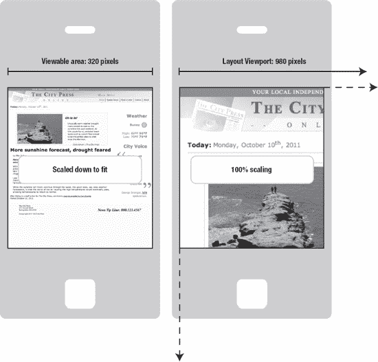
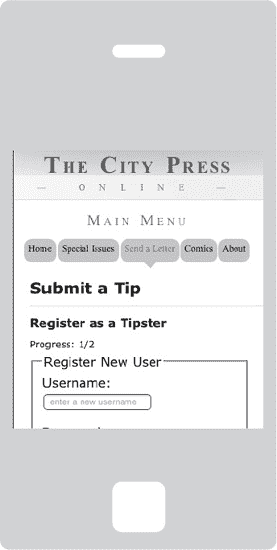

# 八、前方的路

HTML5 有许多边缘，这些领域仍在朝着标准的完美进行塑造和雕琢，但在很大程度上，未来的道路与 HTML5 关系不大，而与 HTML5 的应用领域关系更大。这是一个互联的世界，通过手机连接的人比通过台式电脑连接的人多。在未来的几年里，支持互联网的智能手机可能会普及到大众，就像几年前低端的“哑”手机一样，网络将会有移动的访问者，在拥挤的公共汽车上、在街角、在咖啡馆、在餐馆，甚至，我敢说，在电影院浏览网页。移动设备给你这个网页开发者/设计者带来了特殊的挑战。屏幕分辨率更复杂，屏幕空间更有限，但在 CSS3 的帮助下，HTML5 在当代智能手机上得到了很好的支持。您从前面章节中学到的东西在这里也适用，尽管速度可能会慢一点，屏幕区域也会小一点，但这些都是需要解决的设计挑战，它们被移动空间的独特可能性所抵消。本章将讨论这些挑战和可能性，并以讨论 HTML5 规范的一些最后的角落结束。

### 移动网络的挑战

在过去的几年里，许多新的支持互联网的手持设备已经变得广泛可用。虽然支持互联网的移动设备自 20 世纪 90 年代以来就已经存在，但可以说，随着 2007 年 iPhone 及其彩色大触摸屏的推出，它们首次被广泛视为浏览网页的可行平台(而不仅仅是用来收发电子邮件)。随之而来的是运行 iOS、谷歌 Android 操作系统、微软 Windows Phone 7 平台等的大型触摸屏设备的激增。网页设计突然变成了一个多方面的过程，比以前多了许多倍。在具有大量处理能力的台式计算机环境中，可以在大的宽屏显示器上浏览网页，但是在处理器受限并且显示器只有几英寸宽的小型手持移动电话上浏览网页。此外，还有介于两者之间的平板设备，如苹果的 iPad 或三星的 Galaxy Tab。然而，设计桌面显示器不仅仅是考虑屏幕尺寸和处理能力的差异。移动设备没有鼠标，点击可能要用手指来完成(如果设备比较老，可能要用手写笔)，所以最好避免小按钮。然后是连通性的问题。当用户四处移动时，移动设备可能会断开连接。

__________

1 要了解全球移动设备使用的爆炸性增长，看看世界银行收集的移动电话用户数据:【http://data.worldbank.org/indicator/IT. CEL.SETS.P2/countries/1W？显示=图形。

### 响应式设计

让我们从屏幕尺寸开始考虑，因为这是台式电脑和手持设备之间最明显的区别。手机设计有两种主要方法。首先是开发两个不同的网站，一个用于桌面环境，另一个用于移动设备。根据用户在哪个浏览器中查看站点，用户会被定向到其中一个。对于复杂的网站来说，这可能是一种可行的方法，因为复杂的网站可能需要大量的工作来适应移动查看体验，并且最好为移动用户提供一个简单版本的网站。这种方法的一个问题是涉及到潜在的高维护。如果为台式机、平板设备和移动电话创建一个不同的网站，如果另一个具有不同外形的设备变得流行，会发生什么？比如 Opera 有任天堂 Wii 游戏机的网页浏览器，运行 Android 操作系统的可上网手表甚至已经开发出来了！另一个选项是根据查看设备的屏幕大小更改正在使用的样式表。**媒体查询**(稍后讨论)可用于根据查看设备的物理质量更改 CSS，例如基于显示器尺寸和分辨率的更改。将这种方法与流体布局相结合，你会得到所谓的**响应式设计**、、 2 ，旨在适应各种屏幕尺寸。

固定的 960 像素宽的网格一直是使用 CSS 创建行和列的 web 设计标准。由此发展而来的是响应式网格设计，它根据宽度增加或减少页面上的列数，并将可见列扩展到浏览器可视区域的宽度。像 Skeleton ( `[`getskeleton.com`](http://getskeleton.com)`)这样的开发工具包已经出现，可以帮助开发这种灵活的布局。

 **注意**自适应图像(`[`adaptive-images.com`](http://adaptive-images.com)`)是一个与响应式设计相关的概念，用于处理页面上图像的缩放，以便它们在移动设备上缩小，在桌面显示器上放大。

#### 视口

在桌面环境中，**视窗**是在网络浏览器中可见的网页区域。例如，如果您在桌面上打开一个网页，并将页面大小缩小到移动电话显示屏的实际大小，您看到的区域就是视窗。您可能会看到滚动条出现，以便您可以滚动到其余的内容。您还会注意到，如果文本没有使用 CSS 调整大小，它可能会自动换行以适应可视区域。

移动设备上的视区行为略有不同。与桌面环境不同，在移动环境中，web 浏览器覆盖一个固定的区域。视口定义了文本将被换行的区域等等，其可以延伸到可视区域之外。例如，iPhone 上的默认视窗是 980 像素宽(以适应网页设计中常用的 960 像素网页宽度)，但页面可以缩小，以便完全适合 320 像素的可视区域(图 8-1 )。

__________

参见 Ethan Marcotte 在 http://alistapart.com/articles/responsive-web-design/[发表的关于响应式网页设计的开创性文章。](http://alistapart.com/articles/responsive-web-design/)

***图 8-1。**典型智能手机上的可视区域为 320 像素，而页面所在的视区可能要大得多，这要求用户在以实际大小查看时需要平移才能看到页面上的所有内容。*

理想情况下，网页的宽度应该与可视区域相对应，这就是为移动查看优化网页所能做到的。首先，有一个`meta`元素值告诉移动设备将布局视口的宽度设置为可视区域的宽度。为此，将在网页的 head 部分添加以下内容:

`<meta name="viewport" content="width=device-width" />`

 **注意**有一个 CSS 规则`@viewport`，它正在开发中，作为`meta`元素视窗规则的替代。有关实施细节，请参见 Opera 网站上的页面:`[www.opera.com/docs/specs/presto28/css/viewportdeviceadaptation/](http://www.opera.com/docs/specs/presto28/css/viewportdeviceadaptation/)`。

接下来，可以添加一个额外的选项来防止页面不必要的缩放。将`initial-scale=1.0`添加到`meta`元素:

`<meta name="viewport" content="width=device-width, initial-scale=1.0" />`

`viewport` `meta`元素值是最近才添加的；它是苹果公司为在 iPhone 上使用而添加的，但后来被整合到其他当代移动操作系统中。然而，为了适应旧的移动浏览器，添加两个额外的`meta`元素是个好主意:

`<meta name="HandheldFriendly" content="true" />
<meta name="MobileOptimized" content="320" />`

这两个价值预示着移动网络的早期，所以最终它们将不再需要包含，但现在包含它们是一个好主意。

现在，如果页面布局针对 320 像素宽的查看区域进行了优化，它将正好适合大多数现代移动电话的显示区域，但要实际达到这一宽度并允许网站在桌面环境中仍然可以舒适地查看，您很可能会使用媒体查询，我们接下来将讨论这一点。

 **注**第一章中提到的 HTML5 样板工程在`[`html5boilerplate.com/mobile`](http://html5boilerplate.com/mobile)`有一个为移动设备量身定制的版本，其中包含了这些`meta`元素值。

#### 媒体查询

媒体查询是 CSS3 中的一项新功能，它允许 CSS 检查查看设备的物理特性，并相应地更改 CSS 规则。媒体查询产生于为不同的媒体类型定制 CSS 的需要，例如为印刷或屏幕。典型的媒体查询可能如下所示:

`@media only screen and (min-width:480px) and (max-width:767px) {
          body { width:560px; }
}`

这出现在链接到页面的外部 CSS 文件中。它指定了包含的 CSS 规则将应用到的媒体类型(在这种情况下，它用于在屏幕上显示)以及包含的规则将应用到的查看屏幕的最小和最大宽度。没有必要同时指定最小和最大宽度。也可以选择许多其他值，比如精确的宽度、高度、方向、颜色、分辨率等等。3

 **注**自媒体类型(`screen`、`print`等)。)在较老的浏览器中受支持，因此不一定会忽略`@media`规则。在查询的开头添加了`only`关键字，以便对旧浏览器隐藏包含的样式规则，因为旧浏览器不会识别它，这将导致它们跳过媒体查询声明的其余部分。

在分层配置中使用媒体查询有助于适应各种屏幕尺寸，每个尺寸都将内容放入越来越小的屏幕区域:

`@media only screen and (min-width:768) and (max-width:959px) {
          body { width:768px; }
}
       @media only screen and (min-width:480) and (max-width:767px) {
          body { width:480px; }
}
       @media only screen and (max-width:479px) {
          body { width:340px; }
}`

这三个规则通过三个屏幕尺寸变化来约束页面的宽度。这个例子只是显示了对宽度的限制，但是您可能希望为移动查看设置全方位的内容样式，这可能意味着更大的文本和更大的链接区域。例如，第四章中使用的*城市媒体*新闻提示表单可能会使用媒体查询进行修改，以出现在移动浏览器中，如图图 8-2 所示。为了使内容适合移动环境，使用 CSS 将无关信息放置在视图之外，并添加了样式以使菜单更加突出。

__________

3 完整列表和详细信息见`[www.w3.org/TR/css3-mediaqueries/](http://www.w3.org/TR/css3-mediaqueries/)`。

***图 8-2。***城市出版社*手机优化新闻提示提交表单页面*

**测试手机网页**

在实际的移动设备上测试网页是了解移动页面实际上针对移动设备进行了优化的最佳方式，但是也可以在运行于桌面计算机上的模拟设备上非常有效地测试网页。每个主要平台都有自己的运行在台式计算机上的模拟设备。这对于检查布局和基本功能非常有用，但对于测试性能却不太有用，因为模拟设备使用的是计算机的处理器，它比移动设备中的处理器强大许多倍。无论如何，以下是一些在台式计算机上测试移动网页的有用资源:

*   **Android**:Android 模拟器可以在`[`developer.android.com`](http://developer.android.com)`作为 Android 软件开发工具包(SDK)的一部分下载，可以模拟和仿真各种硬件细节。Android 的一个注意事项是，当访问本地 web 服务器上的页面时，通常的`[`localhost/`](http://localhost/)`地址会寻找运行在模拟器本身上的 web 服务器。相反，需要使用特殊的 URL `http://10.0.2.2/`来访问运行在主机上的网络服务器。
*   **iOS** :苹果公司在`[`developer.apple.com/xcode/`](http://developer.apple.com/xcode/)`提供了一个带有 Xcode 软件包的模拟器。该模拟器可以模拟带有和不带有 Retina 显示屏的 iPad 和 iPhone。
*   **Windows Phone 7**:Windows Phone SDK 包括一个模拟器，用于测试 Windows Phone 7 平台上的内容。这可以从`[`create.msdn.com`](http://create.msdn.com)`下载。
*   **Opera** : Opera 不开发硬件，但有一个桌面网络浏览器的移动版本，它有一个可以从`[`opera.com/developer/tools/mobile`](http://opera.com/developer/tools/mobile)`下载的模拟器。

除此之外，Adobe Device Central 也是创建各种配置和屏幕尺寸的通用虚拟移动设备的一个选项。可以在虚拟设备中的文件 *打开 URL…下打开网页 URL。*

也可以在标准的网络浏览器中测试响应式设计。如果在 Safari 的高级偏好设置中打开了开发菜单，你会发现在开发用户代理下有一个选项，让浏览器伪装成手机浏览器(甚至是另一家厂商的浏览器！).打开一个网页并调整窗口大小，它就像在 Safari 的移动版本上被浏览一样！

### 离线应用缓存

脱机应用缓存是一种确保关键文件存储在客户端上的方法，这样，如果连接丢失并且页面被重新加载，缓存的文件仍将被加载。如果所有必要的文件都被缓存，即使用户离线，网站也可以正常导航。这在互联网连接可能中断的移动网络环境中可能特别有用。

应用缓存使用根`html`元素上的`manifest`属性将 web 页面与缓存清单文件相关联，该文件列出了要缓存的文件(在某些情况下，不是缓存！).缓存清单文件只是一个文件扩展名为`.manifest`的文本文件。必须使用`text/cache-manifest` MIME 类型从 web 服务器提供服务。它使用相对或绝对 URL，但通常如下所示:

`<!DOCTYPE html>
<html manifest="/sitecache.manifest">
          <head>
          …`

`sitecache.manifest`文件(取决于您的配置；你可以用不同的方式命名)必须以关键字`CACHE MANIFEST`开始，然后可选地跟随三个部分。这些是:

*   `CACHE`:要缓存的文件。
*   `NETWORK`:总是应该从网上检索的文件。
*   `FALLBACK`:缓存中未找到的文件的回退内容。首先给出要查找的文件，然后是回退文件的位置。

缓存清单还可以包含注释，这些注释会被忽略。注释以井号(#)开头。缓存清单文件可能如下所示:

`CACHE MANIFEST
       # list of files to cache
CACHE:
index.html
css/styles.css
js/script.js
       # files that require a network connection
NETWORK:
userlogin.php
       # files to use in place of other files that were not cached
FALLBACK:
img/logo.png img/offline-logo.png
contact.php contact.html`

这需要出现在任何使用缓存的页面上。在`CACHE`部分列出的文件将存储在客户端机器上，并在必要时检索以浏览网站。出现在`NETWORK`部分下的任何文件将总是从服务器中获取。`FALLBACK`部分将成对的文件映射在一起，这样如果第一个文件找不到，第二个文件将代替它在页面上的位置。使用回退，您可以向用户提供视觉线索，告诉他们正在浏览页面的缓存版本。例如，您可以提供标记为“脱机”的替代图像，这些图像只有在用户查看缓存图像时才会显示。

### 其他 HTML5 技术

HTML5 家族中有许多技术要么不够成熟，要么过于宽泛，无法在本书的范围内解决。然而，这并不是你不应该意识到他们的存在的理由！以下是这些技术的高级概述。

#### 微数据

微数据是机器的 HTML5。它适用于搜索引擎和其他外部应用，这些应用可能希望从您的内容中获取意义，但需要更多信息来理解它。要做到这一点，可以用属性对现有的 HTML 元素进行注释，这些属性定义页面上的数据类型，比现有的语义 HTML 元素更精细。

在最基本的层面上，微数据使用三个属性:`itemscope`、`itemtype`和`itemprop`。例如，考虑一下关于这本书的一段话:

`

HTML5 Mastery: Semantics, Standards, and Styling by Anselm Bradford and Paul Haine.

`

为了使用微数据进行标记，首先添加了`itemscope`属性来表示该段落包含相关的数据集合，在本例中是一本书和作者:

`

HTML5 Mastery: Semantics, Standards, and Styling by Anselm Bradford and Paul Haine.

`

这个注释意味着段落中的任何元素都是相互关联的。然后使用`itemtype`属性给出一个微数据词汇表的 URL，这是一组为不同类型的公共数据定义的属性值，比如人、地点、事件和事物。网站`[`schema.org`](http://schema.org)`(由微软、谷歌和雅虎推出！)包含许多用于分类数据的词汇表。我们将用他们关于`Book`的文献来注释这一段。`itemtype`被添加到词汇表定义的 URL 中:

`

HTML5 Mastery: Semantics, Standards, and Styling by Anselm Bradford and Paul Haine.

`

访问词汇地址，您会看到有大量的属性可以使用，比我们在这个简单的例子中需要的要多得多。我们将使用`itemprop`属性用文档中的属性来注释内容。为了将标题与作者分开，我们还需要添加`span`元素，以便将注释附加到:

`

/span> by >span itemprop="author">Anselm Bradford>/span> and >span itemprop="author">Paul Haine>/span>.

`

首先是书名，然后是作者。作者有点特殊，因为他们是微数据宇宙中的另一个对象，即`Person`对象，这意味着他们可以拥有自己的`itemscope`属性，并有关于他们的附加信息，如出生日期、地址、电话号码、国籍等。

搜索引擎或其他应用可以解析这一段落，并能够找出书名的开始和结束以及作者是谁。这只是一个尝试，但是您现在应该对微数据有所了解了。这个概念相当简单:键和值用于为页面上的内容提供详细的元数据。

关于微数据有一些争议，因为它与之前存在的另外两种格式重叠，微格式和 RDFa 4 (属性中的资源描述框架)。此外，由于`[`schema.org`](http://schema.org)`是由几家在搜索引擎技术上有既得利益的大公司推出的，这个网站所提倡的语法的中立性受到了质疑。但是，这是熟悉注释页面内容的概念的一个很好的起点。

__________

4 微数据其实是从 RDFa 进化而来的。

#### 撤销管理器 API

撤消管理器 API 是一个新的接口，允许网页访问 web 浏览器中的撤消/重做事务管理器。这是什么意思？嗯，想想当你在网页浏览器的搜索栏中输入一些文本时；您可以选择编辑撤销来撤销您输入的文本。这是浏览器的原生撤销管理器，允许你撤销已经完成的操作。但是，如果您有一个交互式 web 应用，比如基于`canvas`的富文本编辑器或绘图应用，它是由 JavaScript 控制的，浏览器的本地撤销管理器不会获取脚本执行的修改。这就是撤销管理器 API 的用武之地，因为它提供了一种方法来将通过 JavaScript 执行的动作添加到浏览器的撤销/重做管理器中。正如历史 API 通过将 URL 添加到历史“堆栈”来操作一样，撤消管理器允许将页面的一组特定更改(统称为事务)添加到浏览器的本机撤消堆栈中。由于这一特性仍在开发中，所以不要指望它能在今天的浏览器中工作，但请记住，在不久的将来，它很可能会成为浏览器实现中的一项功能。

#### 即将到来的 CSS 技术

如你所知，这并不是 HTML5 技术，但它与 HTML 携手并进。由于 HTML5 中有很多开发，所以 CSS3 中也有很多。一个有趣的领域与页面布局有关，这个领域的规范还没有完全合并成一个主导方法。最终，预计该领域将有三个主要规范:多栏布局(在第六章中讨论)；灵活的框布局，或 FlexBox，它们提供了元素在其父容器中更好的对齐和定位；和网格/模板/区域布局。目前，网格/模板/区域布局被分为四个不同的规范，但这些规范在未来可能会合并。**网格定位和网格布局**用于处理行和列，并指定如何在这种布局中定位元素(多列布局可以被认为是无行网格布局)。**模板布局**也使用网格，但定义了一个模板，如“abc”或“bca”，其中每个字母对应一个元素，然后可以通过改变模板字母顺序来重新排列。最后，**区域布局**提出了一种方法，当内容溢出边界时，内容可以通过这种方法从一个元素“流向”另一个元素。CSS 中的定位一直是一个令人头痛的问题，特别是对于新手设计师来说，所以这些规范的新建议可能会像 HTML5 为 HTML 编码人员提供爆炸式增长的可能性一样，增强 CSS 编码人员的能力(很可能这两个人是同一个人，所以创造性的可能性可能会大大扩展！).

最后，值得注意的是选择器第 4 级规范中定义的一些新的选择器。 6 见表 8-1 中即将出现的新选择器列表及其用法说明。不要期望这些在不久的将来会起作用，但是将来这些很可能会得到你的首选浏览器的支持。

__________

5 见`[www.w3.org/TR/css3-flexbox/](http://www.w3.org/TR/css3-flexbox/)`。

6 见`[`dev.w3.org/csswg/selectors4/`](http://dev.w3.org/csswg/selectors4/)`。

### 总结

如果你假设事情的发展方向是错误的，并着手定义自己的新道路，那么预测未来是很容易的。这似乎是 HTML5 的发展方向。对 XHTML 的局限不再抱幻想的 Web 开发人员转向 HTML5，希望它能为他们提供新一代 web 应用所需的平台。既然它已经铺好了自己的前进道路，重塑网络的势头带来了全新的可能性。语法的灵活性，新的元素，多媒体和丰富的 JavaScript 和 CSS 特性。我们已经走了很多路，还有更多的路要走，但是现在我们已经走到了这段旅程的终点。让这成为你探索的开始。从这里你可以走很多路，比如深入研究移动开发、CSS3 或者广泛的 HTML5 APIs。规范的细节无疑将会发展，因为这是 Web 的本质，但是您在这里学到的基础知识和 HTML5 组件背后的概念将在相同的知识基础下继续，即使将来语法有所变化。是时候尝试这些技术了，看看在开放标准的世界里有什么是可能的。继续制作语义合理、内容丰富的页面。继续前进，让网络成为一个更好的地方。