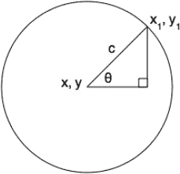

# 九、相关技术

除了 CSS3，许多技术都与 HTML5 相关联，但实际上是在它们自己的规范中定义的。有些曾经是 HTML5 的一部分，但是随着它们的发展，已经被剥离到它们自己的文档中，而另一些则直接用于 HTML5，但是从来不是 HTML5 规范的一部分。本附录提供了这些通常与 HTML5 相关的不同技术的高级概述。此外，你还可以在本章末尾找到使用 HTML5 的有用网站资源列表。

### 地理位置

地理定位 API 1 定义了网络浏览器如何使用用户的 IP 或 WiFi 地址来确定用户的地理位置，如果用户在移动设备上，则使用设备上的全球定位系统(GPS)。位置以经纬度坐标的形式给出，根据检索位置时使用的方法，这可能更准确或更不准确。例如，用用户的 IP 地址来确定他们的位置远不如用基于卫星的 GPS 来确定他们的位置准确。

检索用户位置的含义非常有趣，因为它使得基于位置的服务能够通过 web 浏览器提供。这对于移动设备来说可能是最有用的，因为信息和广告可以通过移动设备上的网络浏览器传送。

检索用户位置的 JavaScript 方法保存在`window.navigator.geolocation`内部的`Geolocation`对象中。该位置可以检索一次，也可以连续更新。API 定义了三种方法:

*   `getCurrentPosition()`:检索当前位置一次
*   `watchPosition()`:当当前位置改变时，检索并更新当前位置
*   `clearWatch()`:停止更新观察位置

当试图检索用户的位置时，网络浏览器通常会提示是否允许使用地理定位。

__________

1 见【www.w3.org/TR/geolocation-API/】的。

#### 检索当前位置

当成功获得位置时(如果使用 GPS，这可能需要几分钟)，为函数调用的`getCurrentPosition()`方法提供了一个参数。这里有一个例子:

`function init() {
          // get the current position and call the “locatedSuccess" function when successful
          window.navigator.geolocation.getCurrentPosition(locatedSuccess);
}
function locatedSuccess(geo) {
          // log the returned Geoposition object
          console.log(geo);
}
window.onload = init;`

 **注意**根据所使用的网络浏览器，这段代码可能只能在一个活动的网络服务器上运行(在本地运行也可以)。如果不行，先检查页面的 URL 地址开头包含`http://`。

该脚本将尝试获取当前位置，并在获取后调用`locatedSuccess()`函数。位置查询是异步完成的，以便其他流程可以继续在页面上运行。该函数被传递一个参数，该参数包含一个包含位置信息的`Geoposition`对象。`Geoposition`对象包含一个`timestamp`属性和`coords`属性，后者包含另一个对象，一个`Coordinates`对象。`Coordinate`对象包含以下属性，根据查看设备的硬件功能，这些属性可能包含`null`值(例如，如果您的设备没有 GPS 功能，这些值将受到限制):

*   `latitude`:地球上的南北位置
*   `longitude`:地球上的东西位置
*   `altitude`:位置的高度，如果观察装置具有测量高度的能力，则收集该高度
*   `accuracy`和`altitudeAccuracy`:以米为单位测量的位置精度
*   `heading`:围绕一个圆以度数测量的行进方向
*   `speed`:在某一航向上行驶的速度，单位为米/秒

 **注意**除了`timestamp`和`coords`属性，Firefox 还包括一个`address`属性，用于检索地址信息，如城市、国家，甚至街道信息！

更新前面的`locatedSuccess()`函数，在屏幕上打印位置数据:

`function locatedSuccess(geo) {
         var lat = geo.coords.latitude;
         var long = geo.coords.longitude;
                  document.body.innerHTML = “<ul><li>lat:"+lat+"</li><li>long:"+long+"</li></ul>";
}`

可以给`getCurrentPosition()`方法一个额外的函数名，以指定在请求用户位置失败时运行的函数。编辑`init()`代码并添加一个`locatedFailed()`功能:

`function init() {
          // get the current position
          //and call the “locatedSuccess" or “locatedFailed" if
successful or not
          window.navigator.geolocation.getCurrentPosition
(locatedSuccess, locatedFailed);
}
function locatedFailed(e) {
          // log the error code and message
          console.log(e.code , e.message);
}`

当无法获得位置时，`locatedFailed()`功能将运行。传递给它的参数是一个包含错误代码和消息的`PositionError`对象。以下是可能的错误:

*   *错误代码 1，权限被拒绝*:用户未授权使用地理定位。
*   *错误代码 2，位置不可用*:位置无法确定。
*   *错误代码 3，位置检索超时*:检索位置时间过长。

如果你想测试这个功能，最简单的方法就是拒绝浏览器的地理定位请求。根据浏览器以及您是否接受了之前的地理位置信息请求，浏览器会记住您的选择，不会再次询问您。例如，Google Chrome 将要求你点击地址栏右侧的“目标”图标，在那里你可以选择清除地理位置设置(需要重新加载页面以使设置生效)。图 A-1 显示了这个对话框的样子。对于 Firefox，地理定位权限位于工具页面信息下，这将打开一个对话框，显示当前正在查看的页面的信息。选择权限选项卡将允许您设置与特定页面共享位置信息的首选项。Safari 在浏览器偏好设置面板的“隐私”标签中设定了位置设置。如果您不确定在首选浏览器中的何处清除地理位置信息，请查看应用的偏好设置或地址栏的右侧，因为这些位置通常是地理位置权限设置的位置。

*图 A-1。用于清除谷歌浏览器页面地理位置设置的对话框*

最后，可以向`getCurrentPosition()`方法传递一个自定义对象，该对象可用于设置检索位置时使用的各种选项。该对象可以用下列属性和值来设置:

*   `enableHighAccuracy`:设定为`true`或`false`。如果启用，将使用精度最高的方法来确定位置，如 GPS。请注意，这将增加电池的使用和检索位置的时间长度。
*   `timeout`:检索位置时等待多长时间(以毫秒为单位)，然后抛出位置不可用错误。
*   `maximumAge`:一个特定的位置应该被认为是当前位置多长时间(以毫秒为单位)。

这些选项可以使用速记对象创建符号添加到`getCurrentPosition()`方法中，如下所示:

`var options = {
          enableHighAccuracy: true,
          timeout: 120000,
          maximumAge: 1000
};
window.navigator.geolocation.getCurrentPosition(locatedSuccess, locatedFailed, options);`

这将启用高精度定位(这取决于可用的硬件)，将超时设置为两分钟，并将位置的最大年龄设置为一秒。

#### 观察当前位置

对于固定设备(如台式计算机)来说，获得一次位置是可以的，但是对于移动设备来说，必须不断地检索位置才能准确。`watchPosition()`方法用于不断轮询位置(这是最大年龄选项有用的地方)以更新位置信息。它采用与`getCurrentPosition()`方法相同的参数，但是它应该被设置为一个变量，如果停止连续更新位置，这个变量可以在以后被引用并传递给`clearWatch()`方法。这里有一个例子:

`var geoWatchID = window.navigator.geolocation.watchPosition(locatedSuccess, locatedFailed, options);`

在代码的后面，`geoWatchID`可以作为参数传递给`clearWatch()`以停止位置更新:

`clearWatch(geoWatchID);`

### SVG 和 MathML

SVG 和 MathML 有两个完全不同的目的，但它们有一个共同点:它们都是基于 XML 的语言，可以嵌入到 HTML5 中。可缩放矢量图形(SVG)用于描述矢量形状，而数学标记语言(MathML)用于描述数学符号。

SVG 和`canvas`是网络标准图像选项的一半。虽然`canvas`很好地处理了位图，但是 SVG 很好地处理了矢量形状。它还具有内置的动画功能，这将需要在`canvas`从头开始构建。

这两者的语法超出了本文的讨论范围，但是由于它们都是基于 XML 的，所以看起来非常像 HTML，只是元素集不同。例如，下面的代码显示了一个包含 MathML 和 SVG 的 HTML 页面，用于描述和绘制第七章中的三角函数。

`*<!DOCTYPE html>* <html>
          <head>
                     <meta charset="utf-8" />
                     <title>SVG and MathML Demo</title>
          </head>
          <body>
                     <h1>SVG and MathML embedded in an HTML5 page</h1>
                     

                     <math>
                              <mi>x</mi>
                              <mo>=</mo>
                              <mrow>
                                       <msub><mi>x</mi><mn>1</mn></msub>
                                       <mo>&plus;</mo>
                                       <mi>cos</mi>
                                       <mfenced><mi>&#x3B8;</mi></mfenced>
                                       <mo>&InvisibleTimes;</mo>
                                       <mi>c</mi>
                              </mrow>` `                     </math>
                     

                     <math>
                              <mi>y</mi>
                              <mo>=</mo>
                              <mrow>
                                       <msub><mi>y</mi><mn>1</mn></msub>
                                       <mo>&plus;</mo>
                                       <mi>sin</mi>
                                       <mfenced><mi>&#x3B8;</mi></mfenced>
                                       <mo>&InvisibleTimes;</mo>
                                       <mi>c</mi>
                              </mrow>
                     </math>
                     

                     <svg>
                              <circle r="100" cx="101" cy="101" fill="white" stroke="black"/>
                              <polygon points="101,101 171.710678,30.2893219 171.710678,101" style="fill:white;stroke:black;" />
                              <rect width="10" height="10" x="161.710678" y="91" style="fill:white;stroke:black;" />
                              <text x="71" y="101" fill="black" font-family="sans-serif" font-size="16">x, y</text>
                              <text x="126" y="61" fill="black" font-family="sans-serif" font-size="16">c</text>
                              <text x="121" y="96" fill="black" font-family="sans-serif" font-size="16">&#x3B8;</text>         
                              <text x="175" y="27" fill="black" font-family="sans-serif" font-size="16">x<tspan font-size="11" baseline-shift="sub">1</tspan>, y<tspan font-size="11" baseline-shift ="sub">1</tspan></text>
                     </svg>
                     

</body>
</html>`

上述代码创建了图 A-2 中的符号和图表。

**嵌入 HTML5 页面的 SVG 和 MathML**

*x = x【1】+cos(θ)c*

*y = y1+sin(μ)c*

*图 A-2。使用 HTML、MathML 和 SVG 从标记创建的图表*

### 客户端存储

想象一下，一个 web 应用可以将用户处理过的数据保存在客户端数据库中，然后在用户在线连接时与基于服务器的数据库同步。这种离线功能对于改善应用的延迟非常有用，因为用户的数据不需要频繁地在网络上来回发送，而且在连接不稳定的情况下，例如在移动环境中，这种功能也很有帮助。

#### 网络存储

Cookies 一直是在客户端浏览器上存储数据的方法。cookies 的一个问题是它们很小，每个只允许 4kb 的存储空间，这对于当今数据丰富的网页/应用来说是微不足道的。对此，新一代客户端存储解决方案应运而生。最稳定的解决方案，也是可以被视为 cookies 替代品的解决方案，是 Web 存储 API， 2 ，它允许高达 5 兆字节的存储空间。Web 存储实际上分为两个选项，`localStorage`对象和`sessionStorage`对象，它们都是`window`对象的属性。两者的区别在于，存储在`localStorage`中的数据是持久的，而存储在`sessionStorage`中的数据在浏览器会话结束时(比如退出浏览器时)会丢失，但除此之外，它们的使用方式是相同的。每个只是一系列的键/值对，所以用一些数据设置一个键，然后用这个键在以后检索数据。

#### 使用网络存储

使用网络存储非常简单。要向存储中添加数据，请使用以下语法之一:

`window.localStorage.setItem("key","value");
window.localStorage["key"] = “value";`

在这段代码中，“键”和“值”可以是任何文本字符串。要从存储中检索数据，请使用以下任一方法:

`var val = window.localStorage.getItem("key");
var val = window.localStorage["key"];`

要删除数据，请删除特定的密钥或清除整个存储:

`window.localStorage.removeItem("key");
window.localStorage.clear();`

**网络存储示例**

使用`contenteditable`属性，您可以创建一个简单的文本编辑器来保存客户机上的更改。对于本例，创建一个名为`edit.html`的新 HTML 文件，并用以下代码填充它:

`<!DOCTYPE html>` `<html>
          <head>
                    <meta charset=utf-8 />
                    <title>Contenteditable and localStorage demo</title>
                    
          </head>
          <body>
                    <section id="editable">This text may be edited and the changes will                       be saved locally.</section>
                    <button id="startEditBtn">Turn editing on</button>
                    <button id="stopEditBtn">Turn editing off and save changes</button>
                    <button id="clearBtn">Clear changes!</button>
          </body>
</html>`

__________

2 见【http://dev.w3.org/html5/webstorage/】的。

现在创建一个名为`script.js`的新 JavaScript 文件，并将它放在名为`js`的目录中，该目录与`edit.html`在同一个位置。用以下脚本填充它:

`var editable; // variable for editable area

// initialize the variables and add event handlers
function init()
{
          editable = document.getElementById('editable');
          var startEditBtn = document.getElementById('startEditBtn');
          var stopEditBtn = document.getElementById('stopEditBtn');
          var clearBtn = document.getElementById('clearBtn');

          startEditBtn.onmousedown = startEdit;
          stopEditBtn.onmousedown = stopEdit;
          clearBtn.onmousedown = clear;

          // update text with data in local storage
          if (localStorage.getItem("savedtext")) editable.innerHTML =
          localStorage.getItem("savedtext");
}

function startEdit()
{
    // add the contenteditable attribute
    editable.setAttribute("contenteditable", true);                  
}

function stopEdit()
{
    // disable the contenteditable attribute
    editable.setAttribute("contenteditable", false);                
    // save the text
    localStorage.setItem("savedtext", editable.innerHTML);  
}

function clear()
{` `    // clear the local storage
    localStorage.clear();             
    // reload the page
    window.location.href = “";   
}
window.onload = init;`

在 web 浏览器中打开 HTML 页面，您将能够打开编辑功能(这将添加`contenteditable`属性)，保存编辑内容，并查看这些编辑内容，因为它们将存储在本地存储中(图 A-3 )。

*图 A-3。使用本地存储的简单应用*

#### 其他存储选项

本地存储很容易使用，但这种方便也带来了它的功能限制。它确实无法与后端 web 服务器上的数据库相比，后者可能描述了存储数据之间的关系，并提供了确保数据完整性的方法。由于 web 技术正朝着支持创建 web 应用的方向发展，所以在客户端拥有一个功能完备的数据库是一个理想的选择。一个这样的选项是 Web SQL，它本质上将一个 SQLite 3 数据库嵌入到 Web 浏览器中。这意味着**结构化查询语言** (SQL)命令可以直接从 JavaScript 中使用。相当酷！不幸的是，Web SQL 的未来变得相当暗淡，因为关于将 SQLite 用作嵌入式数据库的标准化的分歧导致 W3C 放弃了对该倡议的支持。正因为如此，Mozilla 已经表示将放弃对 Firefox 的支持，这意味着这种支持是不稳定的，不可靠的。太糟糕了。

另一个选项是索引数据库 API， 4 ，也称为 IndexedDB，目前仅在 Firefox 中受支持，但其他主流 web 浏览器也计划提供支持。这种数据库解决方案存储键/值对，就像 web 存储一样，但包括更复杂的功能，例如用于确保数据成功提交到数据库的事务，这有助于保证数据完整性。IndexedDB 不像 web SQL 那样复杂(它不是关系数据库)，但它比 Web 存储更强大，并且看起来它将成为未来处理比 Web 存储所能容纳的更复杂的客户端数据存储的选项。

### 网络工作者

网络工作者正在让网络上的计算密集型任务变得不那么痛苦。JavaScript 是一种单线程语言，这意味着一个占用大量处理能力的脚本可能会完全瘫痪任何可能正在运行的用户交互脚本。使用 web worker，可以生成一个新的线程来运行脚本，而不会中断主脚本中 UI 交互或其他事件的处理。Web 工作者分为两种类型:专用工作者和共享工作者。共享工作者比专用工作者更强大，因为他们可以与多个脚本通信，而专用工作者只对最初产生它的脚本做出响应。

__________

3 见【http://sqlite.org】的。

4 见【www.w3.org/TR/IndexedDB/】的。

### 网络套接字 API

网络套接字 API 5 是定义用于提供与远程主机的双向通信的协议的规范。网络的根源传统上基本上是单向的。服务器向客户端 web 浏览器发送一个页面，然后两者之间什么也不发生，直到用户单击一个链接并请求另一个页面。web 套接字提供的是一个开放的连接，在页面加载后，可以随时通过这个连接将数据从客户端发送到服务器，反之亦然。例如，这可以用于创建多人在线游戏或应用，因为数据可以从一个客户端发送到服务器，并分发到连接到同一服务器的所有其他客户端。

### 视频会议和点对点通信

一个为两种浏览器之间的视频会议创建规范的项目正在进行中。这是 W3C HTML5 和 WHATWG HTML 规范之间的主要区别，因为它包含在 WHATWG 版本中，但在 W3C 规范中被省略了。相反，W3C 有一个单独的规范，名为“WebRTC 1.0:浏览器间的 Web 实时通信”由于这两个规范都处于草案状态，不难想象，包含在 WHATWG HTML 草案中的版本很可能在未来被分离出来成为一个单独的规范，就像 W3C 所发生的那样。

无论如何，撇开管理问题不谈，实现视频会议的实际技术需要两个独立的网络浏览器收集视频和音频，并通过对等连接相互传输。具体来说，需要执行以下步骤:

1.  访问网络摄像头或其他视频/音频输入设备。
2.  在本地录制视频/音频，以便将其流式传输到远程 web 浏览器。
3.  连接并将视频/音频发送到远程 web 浏览器。
4.  在本地和远程 web 浏览器的`video`或`audio`元素中显示视频/音频流。

一个名为 Stream API 的 API 定义了一个名为`MediaStream`的接口，它将与 JavaScript 一起使用来处理流媒体的解析和显示。就发送媒体流而言，将使用另一个 API，称为对等连接 API。这个 API 描述了一个`PeerConnection` JavaScript 接口，它定义了连接和发送媒体流到远程对等点的方法。

__________

5 见【http://dev.w3.org/html5/websockets/】的。

6 见【http://dev.w3.org/2011/webrtc/editor/webrtc.html.】??

### 围空

WAI-ARIA， 7 《可访问的富互联网应用规范》(WAI 代表 Web Accessibility Initiative)，旨在提供一种语法，使残疾人可以访问现代动态 Web 应用。WAI-ARIA 使用属性来标记页面内容的用户交互，并描述页面元素之间的相互关系。WAI-ARIA 定义了一个`role`属性，它有一大组值，用于描述一个 web 特性是如何呈现的，以及页面是如何构造的。还有大量的“`aria-` *”前缀属性用于描述网页特征的状态。这些属性可用于注释，例如，菜单是否有子菜单，或者被拖动的对象放在目标上时可以执行什么操作。WAI-ARIA 规范本身就是一个很大的规范；欲了解更多信息，请访问 WAI 的 WAI-ARIA 概况页面:`[www.w3.org/WAI/intro/aria](http://www.w3.org/WAI/intro/aria)`。

### 文件 API

有三个正在开发中的规范与客户端机器的文件系统上的文件的读取、浏览和写入相关。主要的一个是文件 API， 8 ，它包括名为`File`、`FileList`、`FileReader`和`FileError`的接口，这些接口定义了一些方法，例如，可以用来读取文件或文件组的名称和最后修改日期。该规范还定义了一个与原始二进制数据接口的`Blob`,可以对其大小和类型进行检查，并将其分割成块。文件 API 通过 web 表单的文件输入类型，甚至通过将文件从用户系统拖放到 web 浏览器窗口来处理可能出现在 web 浏览器中的文件。扩展文件 API 的是目录和系统 9 和 Writer10API。目录和系统描述了与用户的本地文件系统直接交互的方法。显然，这涉及到安全问题，所以公开的文件系统是沙箱化的，这样 web 应用就不能不受限制地入侵用户的计算机。编写器 API 完成了您所期望的工作；它定义了如何将文件或原始数据块写入文件系统。它还定义了一个`FileWriterSync`接口，用于与 Web Workers API 一起编写文件。

### 有用的网络资源

使用 HTML5 进行开发时，您可能会发现以下网站资源非常有用:

*   *W3C 的 HTML5 规范工作草案* : `[`w3.org/TR/html5/`](http://w3.org/TR/html5/)`
*   *WHATWG“live”HTML 规范* : `[www.whatwg.org/specs/web-apps/current-work/](http://www.whatwg.org/specs/web-apps/current-work/)`
*   *Html5.org*:包括一个 HTML5 验证器和一个跟踪 WHATWG 规范变化的跟踪器:`[`html5.org`](http://html5.org)`
*   *Html5rocks.com*:包括一个完全用 HTML5 技术制作的在线代码编辑器游乐场和幻灯片演示:`[`html5rocks.com`](http://html5rocks.com)`

__________

7 见【www.w3.org/TR/wai-aria/】的。

8 见【www.w3.org/TR/FileAPI/】??。

9 见【www.w3.org/TR/file-system-api/】的。

10 见【www.w3.org/TR/file-writer-api/】的。

*   Html5doctor.com*:包含关于 HTML5 的翔实文章以及全面的元素参考；`[`html5doctor.com`](http://html5doctor.com)`*
**   *Caniuse.com*:html 5、CSS3 及相关技术的兼容表:`[`caniuse.com`](http://caniuse.com)`*   *Html5test.com*:html 5 及相关功能支持的浏览器评分:`[`html5test.com`](http://html5test.com)`*   *CSS3 选择器测试*:支持多种 CSS 选择器的浏览器测试:`[`www.css3.info/selectors-test/`](http://www.css3.info/selectors-test/)`*   *Mobilehtml5.org*:手机和平板浏览器的 HTML5 特性兼容表:`[`mobilehtml5.org`](http://mobilehtml5.org)`*   *HTML5boilerplate.com*:html 5 页面的起始模板:`[`html5boilerplate.com`](http://html5boilerplate.com)`*   *Modernizr* :测试浏览器对 HTML5、CSS3 及相关特性支持的 JavaScript 库:`[`modernizr.com/`](http://modernizr.com/)`*   *谷歌 Chrome 框架*:在旧浏览器中启用现代网络技术功能的方法:`[`code.google.com/chrome/chromeframe/`](http://code.google.com/chrome/chromeframe/)`*   *Html5pattern.com*:web 表单中客户端验证的正则表达式模式:`[`html5pattern.com`](http://html5pattern.com)`*   *Mozilla Developer Network(MDN)*:关于 HTML5 和其他 web 技术的优秀且易于掌握的资源:`[`developer.mozilla.org/en/HTML/HTML5/`](https://developer.mozilla.org/en/HTML/HTML5/)`*   *Html5gallery.com*:使用 HTML5 技术的网站展示:`[`html5gallery.com`](http://html5gallery.com)`*   *Mediaqueri.es* :使用媒体查询的网站展示:`[`mediaqueri.es`](http://mediaqueri.es)`*